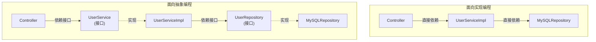
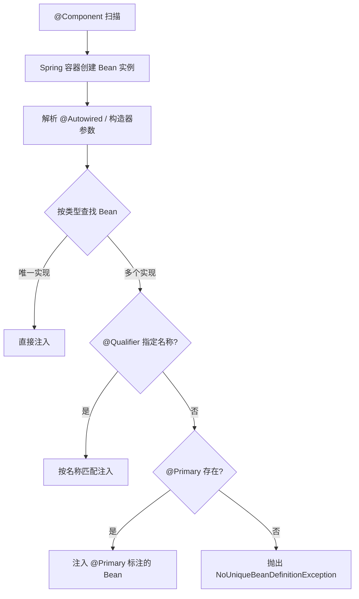

# 面向抽象编程

## 核心概念

### 什么是面向抽象编程

面向抽象编程(Programming to an Interface)是面向对象设计中的一个核心原则,它强调:

> **依赖抽象(接口或抽象类),而不是具体实现。**

简单来说,当我们在编写代码时,应该:
- 变量的声明类型应该是接口或抽象类
- 方法的参数类型应该是接口或抽象类
- 方法的返回值类型应该是接口或抽象类
- 通过依赖注入获取具体实现,而不是直接 new 对象

```java
// × 错误:依赖具体实现
ArrayList<String> list = new ArrayList<>();

// √ 正确:依赖抽象
List<String> list = new ArrayList<>();
```



::: tip 面向抽象的核心公式
**高层模块不应依赖低层模块，两者都应依赖抽象。** 这是 SOLID 原则中的依赖倒置原则（DIP）。在 Spring Boot 中，这一原则通过 IoC 容器和依赖注入天然实现——你声明的是接口类型，Spring 容器负责注入具体实现。
:::

### 为什么要面向抽象编程

面向抽象编程的核心价值体现在:

| 优势 | 说明 | 示例 |
|------|------|------|
| **解耦合** | 模块间通过接口交互,实现细节互不影响 | 支付系统可切换不同支付方式 |
| **可维护性** | 修改实现不需要修改调用方代码 | 更换数据库实现不影响业务代码 |
| **可测试性** | 可以轻松 mock 接口进行单元测试 | 使用 MockPaymentService 测试 |
| **可扩展性** | 新增功能只需实现接口,符合开闭原则 | 新增支付方式无需修改现有代码 |
| **团队协作** | 接口定义后可并行开发 | 前后端联调、模块并行开发 |

### 面向抽象 vs 面向实现

```java
// × 面向实现编程
public class OrderService {
    // 直接依赖具体实现
    private CreditCardPaymentService paymentService = new CreditCardPaymentService();
    
    public void pay(Order order) {
        paymentService.processPayment(order);
    }
}

// √ 面向抽象编程
public class OrderService {
    // 依赖接口,通过构造器注入
    private final PaymentService paymentService;
    
    public OrderService(PaymentService paymentService) {
        this.paymentService = paymentService;
    }
    
    public void pay(Order order) {
        paymentService.processPayment(order);
    }
}
```

**对比分析:**

| 维度 | 面向实现 | 面向抽象 |
|------|----------|----------|
| 耦合度 | 高(直接依赖具体类) | 低(依赖接口) |
| 可替换性 | 差(需修改代码) | 好(只需注入不同实现) |
| 可测试性 | 差(难以 mock) | 好(轻松 mock) |
| 扩展性 | 差(需修改现有代码) | 好(新增实现类即可) |

---

## 开闭原则

### 开闭原则详解

开闭原则(Open/Closed Principle, OCP)是 SOLID 原则之一:

> **软件实体应该对扩展开放,对修改关闭。**

核心含义:
- **对扩展开放**: 可以在不修改现有代码的情况下添加新功能
- **对修改关闭**: 现有代码不需要修改就能支持新功能

### 在 Spring Boot 中实现开闭原则

#### 1. 接口编程

通过定义接口而不是直接使用具体实现,可以在不修改依赖于接口的代码的情况下,替换或添加新的实现:

```java
// 定义支付接口
public interface PaymentService {
    void processPayment(Order order);
    boolean supports(String paymentType);
}

// 信用卡支付实现
@Service
@Order(1)
public class CreditCardPaymentService implements PaymentService {
    @Override
    public void processPayment(Order order) {
        System.out.println("Processing credit card payment: " + order.getAmount());
        // 信用卡支付逻辑
    }
    
    @Override
    public boolean supports(String paymentType) {
        return "CREDIT_CARD".equals(paymentType);
    }
}

// 支付宝支付实现
@Service
@Order(2)
public class AlipayPaymentService implements PaymentService {
    @Override
    public void processPayment(Order order) {
        System.out.println("Processing Alipay payment: " + order.getAmount());
        // 支付宝支付逻辑
    }
    
    @Override
    public boolean supports(String paymentType) {
        return "ALIPAY".equals(paymentType);
    }
}

// 新增支付方式无需修改现有代码
@Service
@Order(3)
public class WeChatPaymentService implements PaymentService {
    @Override
    public void processPayment(Order order) {
        System.out.println("Processing WeChat payment: " + order.getAmount());
    }
    
    @Override
    public boolean supports(String paymentType) {
        return "WECHAT".equals(paymentType);
    }
}
```

#### 2. 抽象类

使用抽象类来定义共同的行为,然后让子类实现具体的逻辑:

```java
// 抽象处理器
public abstract class PaymentProcessor {
    // 模板方法:定义处理流程
    public final void process(Order order) {
        // 1. 前置校验
        validateOrder(order);
        
        // 2. 支付处理
        doPayment(order);
        
        // 3. 后置处理
        afterPayment(order);
    }
    
    // 共同逻辑
    private void validateOrder(Order order) {
        if (order == null || order.getAmount() == null) {
            throw new IllegalArgumentException("Invalid order");
        }
    }
    
    // 抽象方法:子类实现
    protected abstract void doPayment(Order order);
    
    // 钩子方法:子类可选实现
    protected void afterPayment(Order order) {
        // 默认空实现
    }
}

// 具体实现
@Service
public class CreditCardProcessor extends PaymentProcessor {
    @Override
    protected void doPayment(Order order) {
        // 信用卡支付逻辑
    }
    
    @Override
    protected void afterPayment(Order order) {
        // 发送短信通知
    }
}
```

#### 3. 依赖注入

Spring 的依赖注入(DI)允许在运行时动态替换组件的具体实现,而不需要修改组件代码:

```java
@Component
public class PaymentController {
    private final PaymentService paymentService;
    
    // Spring 自动注入具体实现
    @Autowired
    public PaymentController(PaymentService paymentService) {
        this.paymentService = paymentService;
    }
    
    public ResponseEntity<String> pay(@RequestBody Order order) {
        paymentService.processPayment(order);
        return ResponseEntity.ok("Payment successful");
    }
}
```

**配置切换实现:**

```java
@Configuration
public class PaymentConfig {
    
    @Bean
    @Profile("prod")
    public PaymentService productionPaymentService() {
        return new RealPaymentService();
    }
    
    @Bean
    @Profile("test")
    public PaymentService testPaymentService() {
        return new MockPaymentService();
    }
}
```

#### 4. 策略模式

通过策略模式可以定义一系列算法,并将每个算法封装起来,使它们可以互换使用:

```java
// 策略接口
public interface PaymentStrategy {
    void pay(int amount);
}

// 具体策略
@Service
public class CreditCardStrategy implements PaymentStrategy {
    @Override
    public void pay(int amount) {
        System.out.println("Paid " + amount + " using Credit Card");
    }
}

@Service
public class PayPalStrategy implements PaymentStrategy {
    @Override
    public void pay(int amount) {
        System.out.println("Paid " + amount + " using PayPal");
    }
}

// 上下文
@Component
public class PaymentContext {
    private final Map<String, PaymentStrategy> strategies;
    
    // Spring 自动注入所有 PaymentStrategy 实现
    @Autowired
    public PaymentContext(List<PaymentStrategy> strategyList) {
        this.strategies = strategyList.stream()
            .collect(Collectors.toMap(
                strategy -> strategy.getClass().getSimpleName(),
                Function.identity()
            ));
    }
    
    public void executePayment(String strategyName, int amount) {
        PaymentStrategy strategy = strategies.get(strategyName);
        if (strategy == null) {
            throw new IllegalArgumentException("Unknown strategy: " + strategyName);
        }
        strategy.pay(amount);
    }
}
```

#### 5. 模块化

将应用程序分解成模块,每个模块负责特定的功能,模块之间通过定义良好的接口进行交互:

```java
// 用户模块接口
public interface UserService {
    User findById(Long id);
    User save(User user);
}

// 订单模块接口
public interface OrderService {
    Order createOrder(Long userId, List<Long> productIds);
}

// 订单模块依赖用户模块(通过接口)
@Service
public class OrderServiceImpl implements OrderService {
    private final UserService userService;
    
    @Autowired
    public OrderServiceImpl(UserService userService) {
        this.userService = userService;
    }
    
    @Override
    public Order createOrder(Long userId, List<Long> productIds) {
        User user = userService.findById(userId);
        // 创建订单逻辑
        return new Order();
    }
}
```

---

## 接口与实现类设计

### 接口设计原则

#### 1. 接口命名规范

```java
// √ 推荐命名
public interface UserService { }        // 业务服务接口
public interface PaymentService { }     // 业务服务接口
public interface UserRepository { }     // 数据访问接口
public interface OrderMapper { }        // MyBatis Mapper 接口

// × 不推荐命名
public interface UserServiceImpl { }    // 接口不应带 Impl 后缀
public interface IUserService { }       // Java 不推荐 I 前缀(C# 风格)
public interface Service { }            // 过于泛化
```

#### 2. 接口职责单一

```java
// × 接口过于臃肿
public interface UserService {
    // 用户管理
    User findById(Long id);
    User save(User user);
    void delete(Long id);
    
    // 订单管理(不应该放在这里)
    Order createOrder(Long userId, List<Long> productIds);
    
    // 发送邮件(不应该放在这里)
    void sendEmail(Long userId, String message);
}

// √ 接口职责单一
public interface UserService {
    User findById(Long id);
    User save(User user);
    void delete(Long id);
}

public interface OrderService {
    Order createOrder(Long userId, List<Long> productIds);
}

public interface NotificationService {
    void sendEmail(Long userId, String message);
}
```

#### 3. 接口隔离原则

```java
// × 接口过于庞大
public interface PaymentService {
    void pay(Order order);
    void refund(Order order);
    void queryStatus(Order order);
    void downloadBill(Date date);
    void settleAccounts(Date date);
}

// √ 接口隔离:拆分为多个接口
public interface PaymentProcessor {
    void pay(Order order);
    void refund(Order order);
}

public interface PaymentQuery {
    PaymentStatus queryStatus(Order order);
}

public interface PaymentBill {
    void downloadBill(Date date);
    void settleAccounts(Date date);
}

// 实现类可以按需实现
@Service
public class AlipayService implements PaymentProcessor, PaymentQuery {
    // 只实现支付和查询功能
}

@Service
public class BankService implements PaymentProcessor, PaymentQuery, PaymentBill {
    // 实现所有功能
}
```

### 实现类设计规范

#### 1. 实现类命名

```java
// √ 推荐命名
@Service
public class UserServiceImpl implements UserService { }

@Service
public class AlipayPaymentService implements PaymentService { }

@Repository
public class UserRepositoryImpl implements UserRepository { }

// × 不推荐命名
@Service
public class UserService implements UserService { }  // 同名冲突
```

#### 2. 单一实现 vs 多实现

```java
// 场景1:单一实现(业务服务)
public interface UserService {
    User findById(Long id);
}

@Service
public class UserServiceImpl implements UserService {
    @Override
    public User findById(Long id) {
        // 单一实现
    }
}

// 场景2:多实现(策略模式)
public interface PaymentService {
    void pay(Order order);
}

@Service
public class AlipayPaymentService implements PaymentService {
    // 支付宝支付实现
}

@Service
public class WeChatPaymentService implements PaymentService {
    // 微信支付实现
}

@Service
public class CreditCardPaymentService implements PaymentService {
    // 信用卡支付实现
}
```

#### 3. 接口默认方法(Java 8+)

```java
public interface UserService {
    
    // 抽象方法
    User findById(Long id);
    
    // 默认方法:提供通用实现
    default boolean exists(Long id) {
        return findById(id) != null;
    }
    
    // 默认方法:日志记录
    default void logAccess(Long userId) {
        System.out.println("User " + userId + " accessed at " + LocalDateTime.now());
    }
}

@Service
public class UserServiceImpl implements UserService {
    @Override
    public User findById(Long id) {
        // 只需实现抽象方法
        return userRepository.findById(id).orElse(null);
    }
    
    // 可以选择覆盖默认方法
    @Override
    public boolean exists(Long id) {
        return userRepository.existsById(id);
    }
}
```

### 接口统一方法调用,但不能统一对象实例化

虽然接口可以定义一组方法签名,确保实现该接口的所有类都有相同的方法可供调用,但接口本身并不关心对象的创建过程。

```java
// 接口定义行为
public interface Animal {
    void makeSound();
}

// 实现类
public class Dog implements Animal {
    @Override
    public void makeSound() {
        System.out.println("Woof woof!");
    }
}

public class Cat implements Animal {
    private String name;
    
    public Cat(String name) {
        this.name = name;
    }
    
    @Override
    public void makeSound() {
        System.out.println(name + " says: Meow meow!");
    }
}

// 接口统一方法调用
Animal dog = new Dog();
Animal cat = new Cat("Whiskers");
dog.makeSound();  // 统一调用
cat.makeSound();  // 统一调用

// 但实例化过程不同
Dog dog = new Dog();                    // 无参构造
Cat cat = new Cat("Whiskers");          // 有参构造
```

**解决方案:工厂模式 + 依赖注入**

```java
// 工厂模式
@Component
public class AnimalFactory {
    public Animal createAnimal(String type) {
        switch (type) {
            case "dog":
                return new Dog();
            case "cat":
                return new Cat("Default");
            default:
                throw new IllegalArgumentException("Unknown animal: " + type);
        }
    }
}

// 或使用 Spring 容器管理
@Configuration
public class AnimalConfig {
    
    @Bean
    @ConditionalOnProperty(name = "animal.type", havingValue = "dog")
    public Animal dog() {
        return new Dog();
    }
    
    @Bean
    @ConditionalOnProperty(name = "animal.type", havingValue = "cat")
    public Animal cat() {
        return new Cat("Whiskers");
    }
}
```

---

## 依赖注入与面向抽象

### 依赖注入的核心概念

**依赖注入(Dependency Injection, DI)** 是实现 IoC(Inversion of Control,控制反转)的一种方式,它将对象的创建和依赖关系的管理从应用代码中解耦,由 Spring 容器负责管理。

**为什么依赖注入能实现面向抽象编程?**

| 维度 | 传统方式(new) | 依赖注入 |
|------|---------------|----------|
| 对象创建 | 调用方 new 对象 | Spring 容器创建 |
| 依赖关系 | 调用方硬编码 | 配置文件/注解声明 |
| 可替换性 | 差(需修改代码) | 好(修改配置即可) |
| 可测试性 | 差(难以 mock) | 好(轻松注入 mock) |



::: warning 多实现时的注入冲突
当一个接口有多个实现类且未使用 `@Primary` 或 `@Qualifier` 时，Spring 会抛出 `NoUniqueBeanDefinitionException`。解决方式优先级：构造器注入 + `@Qualifier` > `@Primary` > `@ConditionalOnMissingBean`。千万不要用字段注入 + `@Autowired` + `@Qualifier` 的组合——代码可读性差且无法在构造器中强制校验。
:::

### 三种注入方式对比

#### 1. 构造器注入(推荐)

```java
@Service
public class OrderService {
    private final PaymentService paymentService;
    private final NotificationService notificationService;
    
    // Spring 4.3+ 单构造器可省略 @Autowired
    public OrderService(PaymentService paymentService,
                        NotificationService notificationService) {
        this.paymentService = paymentService;
        this.notificationService = notificationService;
    }
    
    public void processOrder(Order order) {
        paymentService.pay(order);
        notificationService.notify(order);
    }
}
```

**优点:**
- √ 保证依赖不可变(final 字段)
- √ 保证对象创建时依赖已注入
- √ 便于单元测试(可直接 new 对象并传入 mock)
- √ 明确表达类的依赖关系

**缺点:**
- × 依赖较多时构造器参数列表过长

#### 2. Setter 注入

```java
@Service
public class OrderService {
    private PaymentService paymentService;
    private NotificationService notificationService;
    
    @Autowired
    public void setPaymentService(PaymentService paymentService) {
        this.paymentService = paymentService;
    }
    
    @Autowired
    public void setNotificationService(NotificationService notificationService) {
        this.notificationService = notificationService;
    }
}
```

**优点:**
- √ 可选依赖(可以不注入)
- √ 支持后期重新注入

**缺点:**
- × 依赖可变(非 final)
- × 对象可能处于不完整状态

#### 3. 字段注入(不推荐)

```java
@Service
public class OrderService {
    @Autowired
    private PaymentService paymentService;
    
    @Autowired
    private NotificationService notificationService;
}
```

**优点:**
- √ 代码简洁

**缺点:**
- × 无法使用 final 字段
- × 难以单元测试(需要反射或 Spring 容器)
- × 依赖关系不明确
- × 容易违反单一职责(依赖过多时不明显)

### 依赖注入实现面向抽象

```java
// 1. 定义接口
public interface PaymentService {
    void pay(Order order);
}

// 2. 实现类
@Service
public class AlipayPaymentService implements PaymentService {
    @Override
    public void pay(Order order) {
        System.out.println("Alipay payment: " + order.getAmount());
    }
}

// 3. 通过构造器注入接口
@Service
public class OrderService {
    private final PaymentService paymentService;
    
    public OrderService(PaymentService paymentService) {
        this.paymentService = paymentService;
    }
    
    public void processOrder(Order order) {
        paymentService.pay(order);
    }
}
```

**切换实现(无需修改 OrderService 代码):**

```java
// 方式1:使用 @Primary 指定默认实现
@Service
@Primary
public class AlipayPaymentService implements PaymentService { }

// 方式2:使用 @Qualifier 指定特定实现
@Service
public class OrderService {
    private final PaymentService paymentService;
    
    public OrderService(@Qualifier("wechatPaymentService") PaymentService paymentService) {
        this.paymentService = paymentService;
    }
}

// 方式3:使用 @Profile 环境隔离
@Service
@Profile("prod")
public class RealPaymentService implements PaymentService { }

@Service
@Profile("test")
public class MockPaymentService implements PaymentService { }
```

### 多实现注入

当一个接口有多个实现时,Spring 提供多种注入方式:

#### 1. 按类型注入全部实现

```java
@Service
public class PaymentManager {
    private final List<PaymentService> paymentServices;
    private final Map<String, PaymentService> paymentServiceMap;
    
    // 注入所有实现
    @Autowired
    public PaymentManager(List<PaymentService> paymentServices) {
        this.paymentServices = paymentServices;
        // 转为 Map 方便查找
        this.paymentServiceMap = paymentServices.stream()
            .collect(Collectors.toMap(
                service -> service.getClass().getSimpleName(),
                Function.identity()
            ));
    }
    
    public void pay(String type, Order order) {
        PaymentService service = paymentServiceMap.get(type + "PaymentService");
        if (service != null) {
            service.pay(order);
        }
    }
}
```

#### 2. 使用 @Qualifier 指定实现

```java
@Service
public class OrderService {
    private final PaymentService paymentService;
    
    @Autowired
    public OrderService(@Qualifier("alipayPaymentService") PaymentService paymentService) {
        this.paymentService = paymentService;
    }
}
```

#### 3. 使用 @Primary 指定默认实现

```java
@Service
@Primary
public class AlipayPaymentService implements PaymentService { }

@Service
public class OrderService {
    private final PaymentService paymentService;
    
    @Autowired
    public OrderService(PaymentService paymentService) {
        // 默认注入 AlipayPaymentService
        this.paymentService = paymentService;
    }
}
```

---

## 策略模式在 Spring 中的应用

### 策略模式核心概念

**策略模式(Strategy Pattern)** 定义一系列算法,将每个算法封装起来,并使它们可以互换使用。

**策略模式结构:**

```
┌─────────────┐
│  Context    │ ─────────> ┌──────────────┐
│  (上下文)    │            │  Strategy    │
└─────────────┘            │  (策略接口)   │
                           └──────────────┘
                                  △
                                  │
                    ┌─────────────┼─────────────┐
                    │             │             │
           ┌──────────────┐ ┌──────────────┐ ┌──────────────┐
           │ConcreteStrA  │ │ConcreteStrB  │ │ConcreteStrC  │
           └──────────────┘ └──────────────┘ └──────────────┘
```

### 传统策略模式实现

```java
// 策略接口
public interface PaymentStrategy {
    void pay(int amount);
}

// 具体策略
public class CreditCardStrategy implements PaymentStrategy {
    @Override
    public void pay(int amount) {
        System.out.println("Paid " + amount + " via Credit Card");
    }
}

public class PayPalStrategy implements PaymentStrategy {
    @Override
    public void pay(int amount) {
        System.out.println("Paid " + amount + " via PayPal");
    }
}

// 上下文
public class PaymentContext {
    private PaymentStrategy strategy;
    
    public void setStrategy(PaymentStrategy strategy) {
        this.strategy = strategy;
    }
    
    public void executePayment(int amount) {
        strategy.pay(amount);
    }
}

// 客户端
public class Client {
    public static void main(String[] args) {
        PaymentContext context = new PaymentContext();
        
        // 动态切换策略
        context.setStrategy(new CreditCardStrategy());
        context.executePayment(100);
        
        context.setStrategy(new PayPalStrategy());
        context.executePayment(200);
    }
}
```

### Spring 整合策略模式

#### 方式1:使用 Map 存储策略

```java
// 策略接口
public interface PaymentStrategy {
    void pay(int amount);
    String getType();
}

// 具体策略
@Service
public class CreditCardStrategy implements PaymentStrategy {
    @Override
    public void pay(int amount) {
        System.out.println("Paid " + amount + " via Credit Card");
    }
    
    @Override
    public String getType() {
        return "CREDIT_CARD";
    }
}

@Service
public class AlipayStrategy implements PaymentStrategy {
    @Override
    public void pay(int amount) {
        System.out.println("Paid " + amount + " via Alipay");
    }
    
    @Override
    public String getType() {
        return "ALIPAY";
    }
}

@Service
public class WeChatStrategy implements PaymentStrategy {
    @Override
    public void pay(int amount) {
        System.out.println("Paid " + amount + " via WeChat");
    }
    
    @Override
    public String getType() {
        return "WECHAT";
    }
}

// 策略工厂
@Component
public class PaymentStrategyFactory {
    private final Map<String, PaymentStrategy> strategyMap;
    
    @Autowired
    public PaymentStrategyFactory(List<PaymentStrategy> strategies) {
        // 将所有策略转为 Map
        this.strategyMap = strategies.stream()
            .collect(Collectors.toMap(
                PaymentStrategy::getType,
                Function.identity()
            ));
    }
    
    public PaymentStrategy getStrategy(String type) {
        PaymentStrategy strategy = strategyMap.get(type);
        if (strategy == null) {
            throw new IllegalArgumentException("Unknown payment type: " + type);
        }
        return strategy;
    }
}

// 使用
@Service
public class PaymentService {
    private final PaymentStrategyFactory strategyFactory;
    
    @Autowired
    public PaymentService(PaymentStrategyFactory strategyFactory) {
        this.strategyFactory = strategyFactory;
    }
    
    public void pay(String type, int amount) {
        PaymentStrategy strategy = strategyFactory.getStrategy(type);
        strategy.pay(amount);
    }
}

// Controller
@RestController
@RequestMapping("/api/payment")
public class PaymentController {
    private final PaymentService paymentService;
    
    @Autowired
    public PaymentController(PaymentService paymentService) {
        this.paymentService = paymentService;
    }
    
    @PostMapping
    public String pay(@RequestParam String type, @RequestParam int amount) {
        paymentService.pay(type, amount);
        return "Payment successful";
    }
}
```

#### 方式2:使用 Bean 名称

```java
// 策略接口
public interface PaymentStrategy {
    void pay(int amount);
}

// 具体策略(使用 Bean 名称)
@Service("creditCardStrategy")
public class CreditCardStrategy implements PaymentStrategy {
    @Override
    public void pay(int amount) {
        System.out.println("Paid " + amount + " via Credit Card");
    }
}

@Service("alipayStrategy")
public class AlipayStrategy implements PaymentStrategy {
    @Override
    public void pay(int amount) {
        System.out.println("Paid " + amount + " via Alipay");
    }
}

// 使用 ApplicationContext 动态获取
@Service
public class PaymentService {
    private final ApplicationContext applicationContext;
    
    @Autowired
    public PaymentService(ApplicationContext applicationContext) {
        this.applicationContext = applicationContext;
    }
    
    public void pay(String strategyName, int amount) {
        PaymentStrategy strategy = applicationContext.getBean(strategyName, PaymentStrategy.class);
        strategy.pay(amount);
    }
}
```

#### 方式3:使用条件判断

```java
// 策略接口
public interface PaymentStrategy {
    boolean supports(String type);
    void pay(int amount);
}

// 具体策略
@Service
public class CreditCardStrategy implements PaymentStrategy {
    @Override
    public boolean supports(String type) {
        return "CREDIT_CARD".equals(type);
    }
    
    @Override
    public void pay(int amount) {
        System.out.println("Paid " + amount + " via Credit Card");
    }
}

@Service
public class AlipayStrategy implements PaymentStrategy {
    @Override
    public boolean supports(String type) {
        return "ALIPAY".equals(type);
    }
    
    @Override
    public void pay(int amount) {
        System.out.println("Paid " + amount + " via Alipay");
    }
}

// 策略上下文
@Service
public class PaymentContext {
    private final List<PaymentStrategy> strategies;
    
    @Autowired
    public PaymentContext(List<PaymentStrategy> strategies) {
        this.strategies = strategies;
    }
    
    public void executePayment(String type, int amount) {
        strategies.stream()
            .filter(strategy -> strategy.supports(type))
            .findFirst()
            .orElseThrow(() -> new IllegalArgumentException("Unknown type: " + type))
            .pay(amount);
    }
}
```

---

## 实战案例

### 案例1:支付系统(策略模式)

#### 业务需求

电商系统需要支持多种支付方式:
- 信用卡支付
- 支付宝支付
- 微信支付
- 银行转账

要求:
- 新增支付方式不影响现有代码
- 不同支付方式有不同的手续费率
- 支持支付状态查询和退款

#### 架构设计

```java
// ==================== 支付领域模型 ====================

@Data
@AllArgsConstructor
public class Payment {
    private String orderId;
    private BigDecimal amount;
    private String paymentType;
    private PaymentStatus status;
    private LocalDateTime createdAt;
}

public enum PaymentStatus {
    PENDING, PROCESSING, SUCCESS, FAILED, REFUNDED
}

// ==================== 支付策略接口 ====================

public interface PaymentStrategy {
    /**
     * 支付
     */
    PaymentResult pay(PaymentRequest request);
    
    /**
     * 查询支付状态
     */
    PaymentStatus queryStatus(String orderId);
    
    /**
     * 退款
     */
    RefundResult refund(String orderId, BigDecimal amount);
    
    /**
     * 计算手续费
     */
    BigDecimal calculateFee(BigDecimal amount);
    
    /**
     * 支持的支付类型
     */
    String getPaymentType();
    
    /**
     * 支付方式名称
     */
    String getPaymentName();
}

// ==================== 支付结果 ====================

@Data
@AllArgsConstructor
public class PaymentResult {
    private boolean success;
    private String transactionId;
    private String message;
    private BigDecimal actualAmount;
    private BigDecimal fee;
}

// ==================== 具体策略实现 ====================

@Service
public class CreditCardPaymentStrategy implements PaymentStrategy {
    
    @Override
    public PaymentResult pay(PaymentRequest request) {
        // 信用卡支付逻辑
        String transactionId = "CC_" + System.currentTimeMillis();
        BigDecimal fee = calculateFee(request.getAmount());
        BigDecimal actualAmount = request.getAmount().add(fee);
        
        // 调用第三方支付接口...
        
        return new PaymentResult(true, transactionId, "Success", actualAmount, fee);
    }
    
    @Override
    public PaymentStatus queryStatus(String orderId) {
        // 查询逻辑
        return PaymentStatus.SUCCESS;
    }
    
    @Override
    public RefundResult refund(String orderId, BigDecimal amount) {
        // 退款逻辑
        return new RefundResult(true, "Refund success", amount);
    }
    
    @Override
    public BigDecimal calculateFee(BigDecimal amount) {
        // 信用卡手续费:2.5%
        return amount.multiply(new BigDecimal("0.025"));
    }
    
    @Override
    public String getPaymentType() {
        return "CREDIT_CARD";
    }
    
    @Override
    public String getPaymentName() {
        return "信用卡支付";
    }
}

@Service
public class AlipayPaymentStrategy implements PaymentStrategy {
    
    @Override
    public PaymentResult pay(PaymentRequest request) {
        String transactionId = "ALI_" + System.currentTimeMillis();
        BigDecimal fee = calculateFee(request.getAmount());
        BigDecimal actualAmount = request.getAmount().add(fee);
        
        // 调用支付宝接口...
        
        return new PaymentResult(true, transactionId, "Success", actualAmount, fee);
    }
    
    @Override
    public PaymentStatus queryStatus(String orderId) {
        return PaymentStatus.SUCCESS;
    }
    
    @Override
    public RefundResult refund(String orderId, BigDecimal amount) {
        return new RefundResult(true, "Refund success", amount);
    }
    
    @Override
    public BigDecimal calculateFee(BigDecimal amount) {
        // 支付宝手续费:0.6%
        return amount.multiply(new BigDecimal("0.006"));
    }
    
    @Override
    public String getPaymentType() {
        return "ALIPAY";
    }
    
    @Override
    public String getPaymentName() {
        return "支付宝支付";
    }
}

@Service
public class WeChatPaymentStrategy implements PaymentStrategy {
    
    @Override
    public PaymentResult pay(PaymentRequest request) {
        String transactionId = "WX_" + System.currentTimeMillis();
        BigDecimal fee = calculateFee(request.getAmount());
        BigDecimal actualAmount = request.getAmount().add(fee);
        
        // 调用微信支付接口...
        
        return new PaymentResult(true, transactionId, "Success", actualAmount, fee);
    }
    
    @Override
    public PaymentStatus queryStatus(String orderId) {
        return PaymentStatus.SUCCESS;
    }
    
    @Override
    public RefundResult refund(String orderId, BigDecimal amount) {
        return new RefundResult(true, "Refund success", amount);
    }
    
    @Override
    public BigDecimal calculateFee(BigDecimal amount) {
        // 微信支付手续费:0.6%
        return amount.multiply(new BigDecimal("0.006"));
    }
    
    @Override
    public String getPaymentType() {
        return "WECHAT";
    }
    
    @Override
    public String getPaymentName() {
        return "微信支付";
    }
}

// ==================== 策略工厂 ====================

@Component
public class PaymentStrategyFactory {
    private final Map<String, PaymentStrategy> strategyMap;
    private final List<PaymentStrategy> strategyList;
    
    @Autowired
    public PaymentStrategyFactory(List<PaymentStrategy> strategies) {
        this.strategyList = strategies;
        this.strategyMap = strategies.stream()
            .collect(Collectors.toMap(
                PaymentStrategy::getPaymentType,
                Function.identity()
            ));
    }
    
    public PaymentStrategy getStrategy(String paymentType) {
        PaymentStrategy strategy = strategyMap.get(paymentType);
        if (strategy == null) {
            throw new IllegalArgumentException("Unsupported payment type: " + paymentType);
        }
        return strategy;
    }
    
    public List<PaymentStrategy> getAllStrategies() {
        return strategyList;
    }
}

// ==================== 支付服务 ====================

@Service
@Transactional
public class PaymentService {
    private final PaymentStrategyFactory strategyFactory;
    private final PaymentRepository paymentRepository;
    
    @Autowired
    public PaymentService(PaymentStrategyFactory strategyFactory,
                          PaymentRepository paymentRepository) {
        this.strategyFactory = strategyFactory;
        this.paymentRepository = paymentRepository;
    }
    
    public PaymentResult processPayment(PaymentRequest request) {
        // 获取策略
        PaymentStrategy strategy = strategyFactory.getStrategy(request.getPaymentType());
        
        // 计算手续费
        BigDecimal fee = strategy.calculateFee(request.getAmount());
        
        // 执行支付
        PaymentResult result = strategy.pay(request);
        
        // 保存支付记录
        Payment payment = new Payment(
            request.getOrderId(),
            request.getAmount(),
            request.getPaymentType(),
            PaymentStatus.SUCCESS,
            LocalDateTime.now()
        );
        paymentRepository.save(payment);
        
        return result;
    }
    
    public PaymentStatus queryPaymentStatus(String orderId) {
        Payment payment = paymentRepository.findByOrderId(orderId);
        if (payment == null) {
            throw new IllegalArgumentException("Order not found: " + orderId);
        }
        
        PaymentStrategy strategy = strategyFactory.getStrategy(payment.getPaymentType());
        return strategy.queryStatus(orderId);
    }
    
    public RefundResult refund(String orderId, BigDecimal amount) {
        Payment payment = paymentRepository.findByOrderId(orderId);
        if (payment == null) {
            throw new IllegalArgumentException("Order not found: " + orderId);
        }
        
        PaymentStrategy strategy = strategyFactory.getStrategy(payment.getPaymentType());
        RefundResult result = strategy.refund(orderId, amount);
        
        if (result.isSuccess()) {
            payment.setStatus(PaymentStatus.REFUNDED);
            paymentRepository.save(payment);
        }
        
        return result;
    }
    
    public List<PaymentStrategyInfo> getAvailablePaymentMethods() {
        return strategyFactory.getAllStrategies().stream()
            .map(strategy -> new PaymentStrategyInfo(
                strategy.getPaymentType(),
                strategy.getPaymentName(),
                strategy.calculateFee(new BigDecimal("100"))
            ))
            .collect(Collectors.toList());
    }
}

// ==================== Controller ====================

@RestController
@RequestMapping("/api/payments")
public class PaymentController {
    private final PaymentService paymentService;
    
    @Autowired
    public PaymentController(PaymentService paymentService) {
        this.paymentService = paymentService;
    }
    
    @PostMapping
    public ResponseEntity<PaymentResult> pay(@RequestBody PaymentRequest request) {
        PaymentResult result = paymentService.processPayment(request);
        return ResponseEntity.ok(result);
    }
    
    @GetMapping("/{orderId}/status")
    public ResponseEntity<PaymentStatus> getStatus(@PathVariable String orderId) {
        PaymentStatus status = paymentService.queryPaymentStatus(orderId);
        return ResponseEntity.ok(status);
    }
    
    @PostMapping("/{orderId}/refund")
    public ResponseEntity<RefundResult> refund(@PathVariable String orderId,
                                               @RequestParam BigDecimal amount) {
        RefundResult result = paymentService.refund(orderId, amount);
        return ResponseEntity.ok(result);
    }
    
    @GetMapping("/methods")
    public ResponseEntity<List<PaymentStrategyInfo>> getMethods() {
        List<PaymentStrategyInfo> methods = paymentService.getAvailablePaymentMethods();
        return ResponseEntity.ok(methods);
    }
}
```

**关键设计点:**

1. **策略接口设计**: 定义统一的支付、查询、退款方法
2. **策略工厂**: 使用 Spring 自动注入所有策略实现
3. **面向抽象**: PaymentService 依赖 PaymentStrategy 接口,而非具体实现
4. **开闭原则**: 新增支付方式只需实现 PaymentStrategy 接口,无需修改现有代码

---

### 案例2:消息发送系统(策略模式 + 工厂模式)

#### 业务需求

系统需要支持多种消息发送方式:
- 短信(SMS)
- 邮件(Email)
- 站内信
- 推送通知(Push)

要求:
- 支持消息模板
- 支持批量发送
- 支持发送状态追踪
- 支持失败重试

#### 架构设计

```java
// ==================== 消息领域模型 ====================

@Data
@AllArgsConstructor
public class Message {
    private String messageId;
    private String type;
    private String recipient;
    private String templateCode;
    private Map<String, Object> params;
    private MessageStatus status;
    private LocalDateTime sentAt;
    private String errorMessage;
}

public enum MessageStatus {
    PENDING, SENT, FAILED
}

// ==================== 消息发送策略接口 ====================

public interface MessageSender {
    /**
     * 发送消息
     */
    SendResult send(Message message);
    
    /**
     * 批量发送
     */
    BatchSendResult batchSend(List<Message> messages);
    
    /**
     * 支持的消息类型
     */
    String getMessageType();
    
    /**
     * 验证接收人格式
     */
    boolean validateRecipient(String recipient);
}

// ==================== 发送结果 ====================

@Data
@AllArgsConstructor
public class SendResult {
    private boolean success;
    private String messageId;
    private String errorMessage;
}

@Data
@AllArgsConstructor
public class BatchSendResult {
    private int totalCount;
    private int successCount;
    private int failedCount;
    private List<SendResult> results;
}

// ==================== 具体策略实现 ====================

@Service
@Slf4j
public class SmsMessageSender implements MessageSender {
    
    @Override
    public SendResult send(Message message) {
        try {
            // 调用短信服务商接口
            log.info("Sending SMS to: {}", message.getRecipient());
            
            // 模拟发送
            String messageId = "SMS_" + System.currentTimeMillis();
            
            return new SendResult(true, messageId, null);
        } catch (Exception e) {
            log.error("SMS send failed", e);
            return new SendResult(false, null, e.getMessage());
        }
    }
    
    @Override
    public BatchSendResult batchSend(List<Message> messages) {
        List<SendResult> results = messages.stream()
            .map(this::send)
            .collect(Collectors.toList());
        
        int successCount = (int) results.stream().filter(SendResult::isSuccess).count();
        
        return new BatchSendResult(
            messages.size(),
            successCount,
            messages.size() - successCount,
            results
        );
    }
    
    @Override
    public String getMessageType() {
        return "SMS";
    }
    
    @Override
    public boolean validateRecipient(String recipient) {
        // 验证手机号格式
        return recipient != null && recipient.matches("^1[3-9]\\d{9}$");
    }
}

@Service
@Slf4j
public class EmailMessageSender implements MessageSender {
    
    @Override
    public SendResult send(Message message) {
        try {
            log.info("Sending Email to: {}", message.getRecipient());
            
            String messageId = "EMAIL_" + System.currentTimeMillis();
            
            return new SendResult(true, messageId, null);
        } catch (Exception e) {
            log.error("Email send failed", e);
            return new SendResult(false, null, e.getMessage());
        }
    }
    
    @Override
    public BatchSendResult batchSend(List<Message> messages) {
        List<SendResult> results = messages.stream()
            .map(this::send)
            .collect(Collectors.toList());
        
        int successCount = (int) results.stream().filter(SendResult::isSuccess).count();
        
        return new BatchSendResult(
            messages.size(),
            successCount,
            messages.size() - successCount,
            results
        );
    }
    
    @Override
    public String getMessageType() {
        return "EMAIL";
    }
    
    @Override
    public boolean validateRecipient(String recipient) {
        // 验证邮箱格式
        return recipient != null && recipient.matches("^[\\w-\\.]+@([\\w-]+\\.)+[\\w-]{2,4}$");
    }
}

@Service
@Slf4j
public class PushMessageSender implements MessageSender {
    
    @Override
    public SendResult send(Message message) {
        try {
            log.info("Sending Push to: {}", message.getRecipient());
            
            String messageId = "PUSH_" + System.currentTimeMillis();
            
            return new SendResult(true, messageId, null);
        } catch (Exception e) {
            log.error("Push send failed", e);
            return new SendResult(false, null, e.getMessage());
        }
    }
    
    @Override
    public BatchSendResult batchSend(List<Message> messages) {
        List<SendResult> results = messages.stream()
            .map(this::send)
            .collect(Collectors.toList());
        
        int successCount = (int) results.stream().filter(SendResult::isSuccess).count();
        
        return new BatchSendResult(
            messages.size(),
            successCount,
            messages.size() - successCount,
            results
        );
    }
    
    @Override
    public String getMessageType() {
        return "PUSH";
    }
    
    @Override
    public boolean validateRecipient(String recipient) {
        // 验证设备 Token 格式
        return recipient != null && recipient.length() > 10;
    }
}

// ==================== 消息策略工厂 ====================

@Component
public class MessageSenderFactory {
    private final Map<String, MessageSender> senderMap;
    
    @Autowired
    public MessageSenderFactory(List<MessageSender> senders) {
        this.senderMap = senders.stream()
            .collect(Collectors.toMap(
                MessageSender::getMessageType,
                Function.identity()
            ));
    }
    
    public MessageSender getSender(String messageType) {
        MessageSender sender = senderMap.get(messageType);
        if (sender == null) {
            throw new IllegalArgumentException("Unsupported message type: " + messageType);
        }
        return sender;
    }
    
    public Set<String> getSupportedTypes() {
        return senderMap.keySet();
    }
}

// ==================== 消息服务 ====================

@Service
@Transactional
@Slf4j
public class MessageService {
    private final MessageSenderFactory senderFactory;
    private final MessageRepository messageRepository;
    private final MessageTemplateRepository templateRepository;
    
    @Autowired
    public MessageService(MessageSenderFactory senderFactory,
                          MessageRepository messageRepository,
                          MessageTemplateRepository templateRepository) {
        this.senderFactory = senderFactory;
        this.messageRepository = messageRepository;
        this.templateRepository = templateRepository;
    }
    
    public SendResult sendMessage(String type, String recipient, 
                                   String templateCode, Map<String, Object> params) {
        // 获取发送器
        MessageSender sender = senderFactory.getSender(type);
        
        // 验证接收人格式
        if (!sender.validateRecipient(recipient)) {
            return new SendResult(false, null, "Invalid recipient format");
        }
        
        // 构建消息内容
        String content = buildContent(templateCode, params);
        
        // 创建消息对象
        Message message = new Message(
            UUID.randomUUID().toString(),
            type,
            recipient,
            templateCode,
            params,
            MessageStatus.PENDING,
            null,
            null
        );
        
        try {
            // 发送消息
            SendResult result = sender.send(message);
            
            // 更新消息状态
            if (result.isSuccess()) {
                message.setStatus(MessageStatus.SENT);
                message.setSentAt(LocalDateTime.now());
            } else {
                message.setStatus(MessageStatus.FAILED);
                message.setErrorMessage(result.getErrorMessage());
            }
            
            messageRepository.save(message);
            
            return result;
        } catch (Exception e) {
            log.error("Message send failed", e);
            message.setStatus(MessageStatus.FAILED);
            message.setErrorMessage(e.getMessage());
            messageRepository.save(message);
            
            return new SendResult(false, null, e.getMessage());
        }
    }
    
    public BatchSendResult batchSend(String type, List<String> recipients,
                                      String templateCode, Map<String, Object> params) {
        MessageSender sender = senderFactory.getSender(type);
        
        // 过滤无效接收人
        List<String> validRecipients = recipients.stream()
            .filter(sender::validateRecipient)
            .collect(Collectors.toList());
        
        // 构建消息列表
        List<Message> messages = validRecipients.stream()
            .map(recipient -> new Message(
                UUID.randomUUID().toString(),
                type,
                recipient,
                templateCode,
                params,
                MessageStatus.PENDING,
                null,
                null
            ))
            .collect(Collectors.toList());
        
        // 批量发送
        BatchSendResult result = sender.batchSend(messages);
        
        // 按每条消息的实际发送结果保存状态
        List<SendResult> sendResults = result.getResults();
        for (int i = 0; i < messages.size(); i++) {
            Message msg = messages.get(i);
            if (i < sendResults.size() && sendResults.get(i).isSuccess()) {
                msg.setStatus(MessageStatus.SENT);
                msg.setSentAt(LocalDateTime.now());
            } else {
                msg.setStatus(MessageStatus.FAILED);
            }
            messageRepository.save(msg);
        }
        
        return result;
    }
    
    private String buildContent(String templateCode, Map<String, Object> params) {
        MessageTemplate template = templateRepository.findByCode(templateCode);
        if (template == null) {
            throw new IllegalArgumentException("Template not found: " + templateCode);
        }
        
        String content = template.getContent();
        for (Map.Entry<String, Object> entry : params.entrySet()) {
            content = content.replace("${" + entry.getKey() + "}", 
                                      String.valueOf(entry.getValue()));
        }
        
        return content;
    }
}

// ==================== Controller ====================

@RestController
@RequestMapping("/api/messages")
public class MessageController {
    private final MessageService messageService;
    private final MessageSenderFactory senderFactory;
    
    @Autowired
    public MessageController(MessageService messageService,
                             MessageSenderFactory senderFactory) {
        this.messageService = messageService;
        this.senderFactory = senderFactory;
    }
    
    @PostMapping("/send")
    public ResponseEntity<SendResult> send(@RequestBody SendMessageRequest request) {
        SendResult result = messageService.sendMessage(
            request.getType(),
            request.getRecipient(),
            request.getTemplateCode(),
            request.getParams()
        );
        return ResponseEntity.ok(result);
    }
    
    @PostMapping("/batch-send")
    public ResponseEntity<BatchSendResult> batchSend(@RequestBody BatchSendMessageRequest request) {
        BatchSendResult result = messageService.batchSend(
            request.getType(),
            request.getRecipients(),
            request.getTemplateCode(),
            request.getParams()
        );
        return ResponseEntity.ok(result);
    }
    
    @GetMapping("/types")
    public ResponseEntity<Set<String>> getSupportedTypes() {
        return ResponseEntity.ok(senderFactory.getSupportedTypes());
    }
}
```

---

## 最佳实践

### 接口设计最佳实践

#### 1. 接口命名规范

| 类型 | 命名规范 | 示例 |
|------|----------|------|
| 业务服务 | XxxService | UserService, OrderService |
| 数据访问 | XxxRepository / XxxMapper | UserRepository, OrderMapper |
| 策略接口 | XxxStrategy / XxxHandler | PaymentStrategy, MessageHandler |
| 工厂接口 | XxxFactory | PaymentFactory |

#### 2. 接口方法设计

```java
// √ 推荐:方法职责单一,命名清晰
public interface UserService {
    User findById(Long id);
    List<User> findAll();
    User save(User user);
    void deleteById(Long id);
    boolean existsById(Long id);
}

// × 不推荐:方法过于复杂
public interface UserService {
    User findOrCreateUser(Long id, String name, String email);
    void deleteUserAndRelatedData(Long id);
}
```

#### 3. 接口粒度控制

```java
// √ 推荐接口隔离
public interface ReadableRepository<T, ID> {
    Optional<T> findById(ID id);
    List<T> findAll();
}

public interface WritableRepository<T, ID> {
    T save(T entity);
    void deleteById(ID id);
}

public interface CrudRepository<T, ID> extends ReadableRepository<T, ID>, 
                                              WritableRepository<T, ID> {
}

// × 不推荐接口过于臃肿
public interface UserRepository {
    // 查询方法
    User findById(Long id);
    List<User> findAll();
    
    // 修改方法
    User save(User user);
    void deleteById(Long id);
    
    // 发送邮件方法(不应该在这里)
    void sendEmail(Long userId, String message);
}
```

### 依赖注入最佳实践

#### 1. 优先使用构造器注入

```java
// √ 推荐:构造器注入
@Service
public class OrderService {
    private final PaymentService paymentService;
    private final NotificationService notificationService;
    
    public OrderService(PaymentService paymentService,
                        NotificationService notificationService) {
        this.paymentService = paymentService;
        this.notificationService = notificationService;
    }
}

// × 不推荐:字段注入
@Service
public class OrderService {
    @Autowired
    private PaymentService paymentService;
    
    @Autowired
    private NotificationService notificationService;
}
```

#### 2. 使用 final 字段

```java
// √ 推荐:依赖不可变
@Service
public class OrderService {
    private final PaymentService paymentService;
    
    public OrderService(PaymentService paymentService) {
        this.paymentService = paymentService;
    }
}

// × 不推荐:依赖可变
@Service
public class OrderService {
    private PaymentService paymentService;
    
    @Autowired
    public void setPaymentService(PaymentService paymentService) {
        this.paymentService = paymentService;
    }
}
```

#### 3. 避免循环依赖

```java
// × 循环依赖
@Service
public class OrderService {
    private final UserService userService;
    
    @Autowired
    public OrderService(UserService userService) {
        this.userService = userService;
    }
}

@Service
public class UserService {
    private final OrderService orderService;
    
    @Autowired
    public UserService(OrderService orderService) {
        this.orderService = orderService;
    }
}

// √ 解决方案:使用 @Lazy
@Service
public class UserService {
    private final OrderService orderService;
    
    @Autowired
    public UserService(@Lazy OrderService orderService) {
        this.orderService = orderService;
    }
}

// √ 更好的方案:重构,提取公共逻辑
@Service
public class OrderService {
    private final UserQueryService userQueryService;
    
    @Autowired
    public OrderService(UserQueryService userQueryService) {
        this.userQueryService = userQueryService;
    }
}
```

### 策略模式最佳实践

#### 1. 使用工厂模式管理策略

```java
@Component
public class PaymentStrategyFactory {
    private final Map<String, PaymentStrategy> strategyMap;
    
    @Autowired
    public PaymentStrategyFactory(List<PaymentStrategy> strategies) {
        this.strategyMap = strategies.stream()
            .collect(Collectors.toMap(
                PaymentStrategy::getPaymentType,
                Function.identity()
            ));
    }
    
    public PaymentStrategy getStrategy(String type) {
        return Optional.ofNullable(strategyMap.get(type))
            .orElseThrow(() -> new IllegalArgumentException("Unknown type: " + type));
    }
}
```

#### 2. 策略接口设计要完整

```java
// √ 完整的策略接口
public interface PaymentStrategy {
    // 核心业务方法
    PaymentResult pay(PaymentRequest request);
    
    // 支持方法
    String getPaymentType();
    String getPaymentName();
    BigDecimal calculateFee(BigDecimal amount);
    boolean supports(String type);
}

// × 不完整的策略接口
public interface PaymentStrategy {
    void pay(PaymentRequest request);
}
```

#### 3. 提供默认实现

```java
// √ 使用接口默认方法
public interface MessageSender {
    SendResult send(Message message);
    
    String getMessageType();
    
    // 默认实现:单个发送循环调用
    default BatchSendResult batchSend(List<Message> messages) {
        List<SendResult> results = messages.stream()
            .map(this::send)
            .collect(Collectors.toList());
        
        int successCount = (int) results.stream()
            .filter(SendResult::isSuccess)
            .count();
        
        return new BatchSendResult(
            messages.size(),
            successCount,
            messages.size() - successCount,
            results
        );
    }
}
```

---

## 常见误区

### 误区1:为了抽象而抽象

```java
// × 过度抽象
public interface Service<T> {
    T findById(Long id);
    List<T> findAll();
    T save(T entity);
}

@Service
public class UserServiceImpl implements Service<User> {
    // ...
}

@Service
public class OrderServiceImpl implements Service<Order> {
    // ...
}

// √ 合理抽象
public interface UserService {
    User findById(Long id);
    List<User> findByStatus(UserStatus status);
    User save(User user);
}

public interface OrderService {
    Order findById(Long id);
    Order createOrder(CreateOrderRequest request);
}
```

### 误区2:接口过于庞大

```java
// × 接口过于庞大(违反接口隔离原则)
public interface UserService {
    // 用户管理
    User findById(Long id);
    User save(User user);
    
    // 订单管理
    Order createOrder(Long userId, List<Long> productIds);
    
    // 支付管理
    Payment pay(Long orderId);
    
    // 消息发送
    void sendEmail(Long userId, String message);
}

// √ 接口隔离
public interface UserService {
    User findById(Long id);
    User save(User user);
}

public interface OrderService {
    Order createOrder(Long userId, List<Long> productIds);
}

public interface PaymentService {
    Payment pay(Long orderId);
}

public interface NotificationService {
    void sendEmail(Long userId, String message);
}
```

### 误区3:直接依赖实现类

```java
// × 直接依赖实现类
@Service
public class OrderService {
    @Autowired
    private AlipayPaymentService paymentService;  // 直接依赖具体实现
    
    public void pay(Order order) {
        paymentService.pay(order);
    }
}

// √ 依赖接口
@Service
public class OrderService {
    private final PaymentService paymentService;
    
    @Autowired
    public OrderService(@Qualifier("alipayPaymentService") PaymentService paymentService) {
        this.paymentService = paymentService;
    }
    
    public void pay(Order order) {
        paymentService.pay(order);
    }
}
```

### 误区4:滥用字段注入

```java
// × 字段注入
@Service
public class OrderService {
    @Autowired
    private PaymentService paymentService;
    
    @Autowired
    private NotificationService notificationService;
    
    @Autowired
    private UserRepository userRepository;
    
    @Autowired
    private OrderRepository orderRepository;
    
    @Autowired
    private CacheManager cacheManager;
    
    // 依赖过多,违反单一职责,但不明显
}

// √ 构造器注入(依赖过多时很明显)
@Service
public class OrderService {
    private final PaymentService paymentService;
    private final NotificationService notificationService;
    private final UserRepository userRepository;
    private final OrderRepository orderRepository;
    private final CacheManager cacheManager;
    
    public OrderService(PaymentService paymentService,
                        NotificationService notificationService,
                        UserRepository userRepository,
                        OrderRepository orderRepository,
                        CacheManager cacheManager) {
        // 构造器参数过多,提示需要重构
    }
}
```

### 误区5:忽略接口文档

```java
// × 缺少文档
public interface PaymentService {
    void pay(Order order);
}

// √ 完整文档
/**
 * 支付服务接口
 * 
 * <p>提供支付、退款、查询等核心功能</p>
 * 
 * @author team
 * @since 1.0.0
 */
public interface PaymentService {
    
    /**
     * 处理支付请求
     * 
     * @param order 订单信息,不能为 null
     * @return 支付结果
     * @throws PaymentException 支付失败时抛出
     */
    PaymentResult pay(Order order);
    
    /**
     * 查询支付状态
     * 
     * @param orderId 订单ID
     * @return 支付状态
     */
    PaymentStatus queryStatus(String orderId);
    
    /**
     * 退款
     * 
     * @param orderId 订单ID
     * @param amount 退款金额,必须大于0
     * @return 退款结果
     */
    RefundResult refund(String orderId, BigDecimal amount);
}
```

### 误区6:策略模式缺少错误处理

```java
// × 缺少错误处理
@Component
public class PaymentStrategyFactory {
    private final Map<String, PaymentStrategy> strategyMap;
    
    @Autowired
    public PaymentStrategyFactory(List<PaymentStrategy> strategies) {
        this.strategyMap = strategies.stream()
            .collect(Collectors.toMap(
                PaymentStrategy::getPaymentType,
                Function.identity()
            ));
    }
    
    public PaymentStrategy getStrategy(String type) {
        return strategyMap.get(type);  // 可能返回 null
    }
}

// √ 完善错误处理
@Component
public class PaymentStrategyFactory {
    private final Map<String, PaymentStrategy> strategyMap;
    
    @Autowired
    public PaymentStrategyFactory(List<PaymentStrategy> strategies) {
        this.strategyMap = strategies.stream()
            .collect(Collectors.toMap(
                PaymentStrategy::getPaymentType,
                Function.identity()
            ));
    }
    
    public PaymentStrategy getStrategy(String type) {
        return Optional.ofNullable(strategyMap.get(type))
            .orElseThrow(() -> new IllegalArgumentException(
                "Unsupported payment type: " + type + 
                ", supported types: " + strategyMap.keySet()
            ));
    }
}
```

---

## 面试要点

### 基础问题

#### 1. 什么是面向抽象编程?有什么好处?

**答案:**

面向抽象编程是指依赖接口或抽象类,而不是具体实现。核心好处:
- **解耦合**:模块间通过接口交互,实现细节互不影响
- **可维护性**:修改实现不需要修改调用方代码
- **可测试性**:可以轻松 mock 接口进行单元测试
- **可扩展性**:新增功能只需实现接口,符合开闭原则

```java
// 面向抽象编程示例
public interface PaymentService {
    void pay(Order order);
}

@Service
public class OrderService {
    private final PaymentService paymentService;  // 依赖接口
    
    public OrderService(PaymentService paymentService) {
        this.paymentService = paymentService;
    }
}
```

#### 2. 开闭原则是什么?如何在 Spring 中实现?

**答案:**

开闭原则:软件实体应该对扩展开放,对修改关闭。

在 Spring 中实现方式:
1. **接口编程**:定义接口,新增实现类即可扩展功能
2. **依赖注入**:通过 DI 动态替换实现
3. **策略模式**:定义策略接口,新增策略实现
4. **AOP**:通过切面扩展功能,无需修改原有代码

```java
// 策略模式实现开闭原则
public interface PaymentStrategy {
    void pay(Order order);
}

// 新增支付方式无需修改现有代码
@Service
public class WeChatPaymentStrategy implements PaymentStrategy {
    @Override
    public void pay(Order order) {
        // 微信支付逻辑
    }
}
```

#### 3. 接口和抽象类的区别?如何选择?

**答案:**

| 维度 | 接口 | 抽象类 |
|------|------|--------|
| 继承 | 可多实现 | 单继承 |
| 成员变量 | 只能常量 | 可有普通字段 |
| 方法 | Java 8 前只能抽象 | 可以有具体方法 |
| 构造器 | 无 | 有 |
| 设计理念 | 行为契约 | 代码复用 |

**选择建议:**
- 需要多继承时:选择接口
- 需要共享代码时:选择抽象类
- 需要定义行为规范时:选择接口
- 需要模板方法模式时:选择抽象类

#### 4. Spring 依赖注入有哪几种方式?推荐哪种?

**答案:**

三种方式:
1. **构造器注入**(推荐):保证依赖不可变,便于测试
2. **Setter 注入**:可选依赖,支持后期注入
3. **字段注入**(不推荐):代码简洁但难以测试

**推荐构造器注入原因:**
- √ final 字段保证依赖不可变
- √ 对象创建时依赖已注入,避免空指针
- √ 便于单元测试(可直接 new 对象)
- √ 明确表达类的依赖关系

```java
// 推荐方式:构造器注入
@Service
public class OrderService {
    private final PaymentService paymentService;
    
    // Spring 4.3+ 单构造器可省略 @Autowired
    public OrderService(PaymentService paymentService) {
        this.paymentService = paymentService;
    }
}
```

### 进阶问题

#### 5. 当一个接口有多个实现时,如何注入特定的实现?

**答案:**

三种方式:

```java
// 1. @Qualifier 指定 Bean 名称
@Autowired
public OrderService(@Qualifier("alipayPaymentService") PaymentService paymentService) {
    this.paymentService = paymentService;
}

// 2. @Primary 指定默认实现
@Service
@Primary
public class AlipayPaymentService implements PaymentService { }

// 3. 注入所有实现
@Autowired
public PaymentManager(List<PaymentService> paymentServices) {
    // 注入所有实现
}
```

#### 6. 如何设计一个支持多种支付方式的支付系统?

**答案:**

使用策略模式 + 工厂模式:

```java
// 1. 定义策略接口
public interface PaymentStrategy {
    PaymentResult pay(Order order);
    String getPaymentType();
}

// 2. 实现具体策略
@Service
public class AlipayStrategy implements PaymentStrategy {
    @Override
    public PaymentResult pay(Order order) { /* ... */ }
    
    @Override
    public String getPaymentType() { return "ALIPAY"; }
}

// 3. 策略工厂
@Component
public class PaymentStrategyFactory {
    private final Map<String, PaymentStrategy> strategyMap;
    
    @Autowired
    public PaymentStrategyFactory(List<PaymentStrategy> strategies) {
        this.strategyMap = strategies.stream()
            .collect(Collectors.toMap(
                PaymentStrategy::getPaymentType,
                Function.identity()
            ));
    }
    
    public PaymentStrategy getStrategy(String type) {
        return Optional.ofNullable(strategyMap.get(type))
            .orElseThrow(() -> new IllegalArgumentException("Unknown: " + type));
    }
}

// 4. 使用
@Service
public class PaymentService {
    private final PaymentStrategyFactory factory;
    
    public PaymentResult pay(String type, Order order) {
        return factory.getStrategy(type).pay(order);
    }
}
```

#### 7. 如何避免循环依赖?

**答案:**

循环依赖原因:A 依赖 B,B 依赖 A。

解决方案:
1. **重构**:提取公共逻辑到第三个类
2. **@Lazy**:延迟加载
3. **Setter 注入**:改用 Setter 注入

```java
// 方案1:重构(推荐)
// 提取 UserQueryService
@Service
public class OrderService {
    private final UserQueryService userQueryService;
}

@Service
public class UserService {
    private final OrderService orderService;
}

// 方案2:@Lazy
@Service
public class UserService {
    private final OrderService orderService;
    
    @Autowired
    public UserService(@Lazy OrderService orderService) {
        this.orderService = orderService;
    }
}
```

#### 8. 接口隔离原则是什么?如何应用?

**答案:**

接口隔离原则:客户端不应该依赖它不需要的接口。

**应用:**

```java
// × 违反接口隔离原则
public interface PaymentService {
    void pay(Order order);
    void refund(Order order);
    void downloadBill(Date date);  // 不是所有实现都需要
}

// √ 接口隔离
public interface PaymentProcessor {
    void pay(Order order);
    void refund(Order order);
}

public interface PaymentBill {
    void downloadBill(Date date);
}

// 实现类按需实现
@Service
public class AlipayService implements PaymentProcessor, PaymentBill {
    // 实现所有接口
}

@Service
public class CreditCardService implements PaymentProcessor {
    // 只实现支付接口,不需要实现账单接口
}
```

### 实战问题

#### 9. 如何设计一个可扩展的日志记录系统?

**答案:**

使用责任链模式 + 策略模式:

```java
// 日志处理器接口
public interface LogHandler {
    void handle(LogRecord record);
    boolean supports(LogLevel level);
}

// 控制台日志处理器
@Service
@Order(1)
public class ConsoleLogHandler implements LogHandler {
    @Override
    public void handle(LogRecord record) {
        System.out.println(record);
    }
    
    @Override
    public boolean supports(LogLevel level) {
        return level.ordinal() >= LogLevel.DEBUG.ordinal();
    }
}

// 文件日志处理器
@Service
@Order(2)
public class FileLogHandler implements LogHandler {
    @Override
    public void handle(LogRecord record) {
        // 写入文件
    }
    
    @Override
    public boolean supports(LogLevel level) {
        return level.ordinal() >= LogLevel.INFO.ordinal();
    }
}

// 日志服务
@Service
public class LogService {
    private final List<LogHandler> handlers;
    
    @Autowired
    public LogService(List<LogHandler> handlers) {
        this.handlers = handlers;
    }
    
    public void log(LogLevel level, String message) {
        LogRecord record = new LogRecord(level, message, LocalDateTime.now());
        
        handlers.stream()
            .filter(handler -> handler.supports(level))
            .forEach(handler -> handler.handle(record));
    }
}
```

#### 10. 如何在 Spring 中实现插件化架构?

**答案:**

```java
// 1. 定义插件接口
public interface Plugin {
    String getName();
    String getVersion();
    void execute(Context context);
}

// 2. 插件管理器
@Component
public class PluginManager {
    private final Map<String, Plugin> pluginMap;
    
    @Autowired
    public PluginManager(List<Plugin> plugins) {
        this.pluginMap = plugins.stream()
            .collect(Collectors.toMap(
                Plugin::getName,
                Function.identity()
            ));
    }
    
    public void execute(String pluginName, Context context) {
        Plugin plugin = pluginMap.get(pluginName);
        if (plugin != null) {
            plugin.execute(context);
        }
    }
    
    public List<String> listPlugins() {
        return new ArrayList<>(pluginMap.keySet());
    }
}

// 3. 插件实现(可打包为独立 jar)
@Service
public class DataExportPlugin implements Plugin {
    @Override
    public String getName() { return "data-export"; }
    
    @Override
    public String getVersion() { return "1.0.0"; }
    
    @Override
    public void execute(Context context) {
        // 导出数据逻辑
    }
}
```

---

## 总结

### 核心要点

1. **面向抽象编程的本质**:依赖接口,而非具体实现
2. **开闭原则**:对扩展开放,对修改关闭
3. **依赖注入**:Spring 实现面向抽象的核心机制
4. **策略模式**:实现多实现场景的标准方案
5. **接口设计**:职责单一、接口隔离、命名规范

### 实践建议

| 场景 | 建议 |
|------|------|
| 依赖注入 | 优先使用构造器注入,使用 final 字段 |
| 多实现 | 使用策略模式 + 工厂模式 |
| 接口设计 | 职责单一,接口隔离,避免过度抽象 |
| 循环依赖 | 重构 > @Lazy > Setter 注入 |

### 学习路径

1. **初级**:理解面向抽象编程的概念和好处
2. **中级**:掌握依赖注入、策略模式的应用
3. **高级**:设计可扩展、可维护的架构
4. **进阶**:插件化架构、领域驱动设计

---

**参考资源:**

- 《Effective Java》第三版
- 《设计模式:可复用面向对象软件的基础》
- Spring 官方文档
- SOLID 原则详解

**最后更新:** 2026-03-30  
**维护人:** AI 助手

## 版本差异(旧版 → Spring Boot 3.5.x)

| 特性 | 旧版(Spring Boot 2.x) | Spring Boot 3.5.x |
|------|----------------------|-------------------|
| 面向接口编程 | 不变 | 不变；仍是核心设计原则 |
| 依赖注入 | @Autowired 字段/构造器 | 构造器注入仍推荐；@Resource 为 jakarta 包 |
| 组合优于继承 | 不变 | 不变 |
| 函数式注册 | 基本无 | 可用 `registerBean()` 等函数式 API 注册 Bean，无需反射 |
