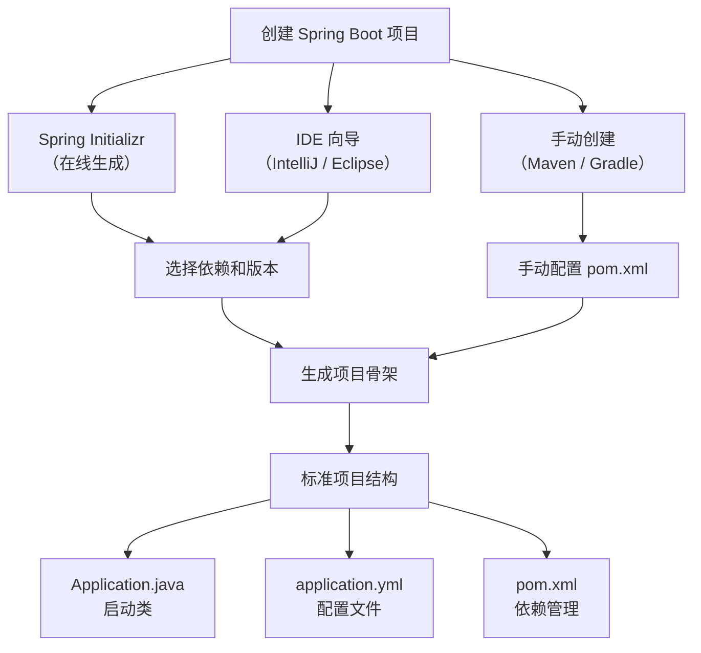

# 创建 SpringBoot 应用

## 创建 SpringBoot 项目方式

创建 Spring Boot 项目有几种常见的方式,包括使用 Spring Initializr、使用 IDE,或者通过手动设置。每种方式都有其优缺点,适用于不同的开发场景。



::: tip 推荐使用 spring-boot-starter-parent
在 `pom.xml` 中继承 `spring-boot-starter-parent` 可以获得：① 统一的依赖版本管理（BOM）；② 合理的编译器配置（JDK 版本、编码）；③ 内置的插件配置（spring-boot-maven-plugin、maven-compiler-plugin 等）；④ 资源过滤和属性占位符支持。如果项目已有自己的 parent POM，可以使用 `<dependencyManagement>` + `spring-boot-dependencies` BOM 的方式引入版本管理。
:::

### 方式一:使用 Spring Initializr 创建(推荐新手)

Spring Initializr 是一个在线的、快速生成 Spring Boot 项目基础结构的工具。

**步骤详解:**

1. **访问 Spring Initializr 网站**
   
   访问 [Spring Initializr](https://start.spring.io/) 或阿里云镜像 [https://start.aliyun.com/](https://start.aliyun.com/)(国内速度更快)

2. **选择项目元数据**
   
   - **Project(项目类型)**: Maven Project 或 Gradle Project(推荐 Maven)
   - **Language(语言)**: Java、Kotlin、Groovy(推荐 Java)
   - **Spring Boot(版本)**: 选择稳定版本(推荐 3.x 最新补丁版)
   - **Project Metadata(项目元数据)**:
     - Group: 组名(如 `com.example`)
     - Artifact: 项目名(如 `demo`)
     - Name: 项目名称
     - Description: 项目描述
     - Package name: 包名
     - Packaging: 打包方式(Jar 或 War,推荐 Jar)
     - Java: JDK 版本(推荐 17 或 21,Boot 3.x 最低要求 17)

3. **添加依赖**
   
   点击 "Add Dependencies" 按钮,搜索并添加常用依赖:
   - Spring Web(用于开发 Web 应用)
   - Spring Boot DevTools(开发工具,支持热重启)
   - Lombok(简化 Java 代码)
   - Spring Configuration Processor(配置元数据)
   - MySQL Driver(MySQL 驱动)
   - MyBatis Framework(MyBatis 框架)

4. **生成项目**
   
   点击 "GENERATE" 按钮,下载压缩包

5. **导入 IDE**
   
   解压下载的压缩包,使用 IDEA 或 Eclipse 打开项目

**优点:**
- 操作简单,可视化界面
- 自动生成标准项目结构
- 自动配置依赖版本,避免版本冲突
- 适合新手快速上手

**缺点:**
- 需要网络连接
- 国内访问 start.spring.io 可能较慢

### 方式二:使用 IDEA 创建(推荐开发者)

IntelliJ IDEA 集成了 Spring Initializr,可以直接在 IDE 中创建 Spring Boot 项目。

**步骤详解:**

1. **创建新项目**
   
   打开 IDEA,选择 "File" → "New" → "Project"

2. **选择 Spring Initializr**
   
   - 左侧选择 "Spring Initializr"
   - 选择 Server URL:
     - 默认: `https://start.spring.io/`
     - 国内镜像: `https://start.aliyun.com/`(推荐)
   - 点击 "Next"

3. **填写项目信息**
   
   - Name: 项目名称
   - Location: 项目保存路径
   - Type: Maven 或 Gradle
   - GroupId: 组名
   - ArtifactId: 项目名
   - Version: 版本号
   - Package name: 包名
   - Packaging: Jar 或 War
   - Java: JDK 版本
   - 点击 "Next"

4. **选择依赖**
   
   勾选需要的依赖,常用依赖:
   - Developer Tools: Lombok、Spring Boot DevTools、Spring Configuration Processor
   - Web: Spring Web、Spring Web Services
   - SQL: MySQL Driver、MyBatis Framework、JDBC API
   - 点击 "Next"

5. **确认项目信息**
   
   确认项目名称和路径,点击 "Finish"

6. **等待依赖下载**
   
   IDEA 会自动下载依赖,完成后即可开发

**优点:**
- 无需单独访问网站
- 直接在 IDE 中完成所有操作
- 自动导入项目,无需手动解压
- 适合习惯使用 IDEA 的开发者

**缺点:**
- 需要 IDEA Ultimate 版本(社区版功能有限)
- 依赖网络环境

### 方式三:使用 Maven 手动创建(推荐高级用户)

手动创建 Maven 项目,适合需要完全控制项目结构的高级用户。

**步骤详解:**

1. **创建 Maven 项目**
   
   ```bash
   mkdir demo
   cd demo
   ```

2. **创建 pom.xml 文件**
   
   在项目根目录创建 `pom.xml`:

   ```xml
   <?xml version="1.0" encoding="UTF-8"?>
   <project xmlns="http://maven.apache.org/POM/4.0.0"
            xmlns:xsi="http://www.w3.org/2001/XMLSchema-instance"
            xsi:schemaLocation="http://maven.apache.org/POM/4.0.0 
            http://maven.apache.org/xsd/maven-4.0.0.xsd">
       <modelVersion>4.0.0</modelVersion>
   
       <!-- 项目坐标 -->
       <groupId>com.example</groupId>
       <artifactId>demo</artifactId>
       <version>0.0.1-SNAPSHOT</version>
       <packaging>jar</packaging>
   
       <!-- 项目信息 -->
       <name>demo</name>
       <description>Demo project for Spring Boot</description>
   
       <!-- 继承 Spring Boot 父项目 -->
       <parent>
           <groupId>org.springframework.boot</groupId>
           <artifactId>spring-boot-starter-parent</artifactId>
           <version>3.5.0</version>
           <relativePath/>
       </parent>
   
       <!-- 属性配置 -->
       <properties>
           <java.version>17</java.version>
           <project.build.sourceEncoding>UTF-8</project.build.sourceEncoding>
           <project.reporting.outputEncoding>UTF-8</project.reporting.outputEncoding>
       </properties>
   
       <!-- 依赖管理 -->
       <dependencies>
           <!-- Spring Boot Web Starter -->
           <dependency>
               <groupId>org.springframework.boot</groupId>
               <artifactId>spring-boot-starter-web</artifactId>
           </dependency>
   
           <!-- Spring Boot DevTools(热重启) -->
           <dependency>
               <groupId>org.springframework.boot</groupId>
               <artifactId>spring-boot-devtools</artifactId>
               <scope>runtime</scope>
               <optional>true</optional>
           </dependency>
   
           <!-- Lombok -->
           <dependency>
               <groupId>org.projectlombok</groupId>
               <artifactId>lombok</artifactId>
               <optional>true</optional>
           </dependency>
   
           <!-- Spring Boot Test -->
           <dependency>
               <groupId>org.springframework.boot</groupId>
               <artifactId>spring-boot-starter-test</artifactId>
               <scope>test</scope>
           </dependency>
       </dependencies>
   
       <!-- 构建配置 -->
       <build>
           <plugins>
               <!-- Spring Boot Maven 插件 -->
               <plugin>
                   <groupId>org.springframework.boot</groupId>
                   <artifactId>spring-boot-maven-plugin</artifactId>
                   <configuration>
                       <excludes>
                           <exclude>
                               <groupId>org.projectlombok</groupId>
                               <artifactId>lombok</artifactId>
                           </exclude>
                       </excludes>
                   </configuration>
               </plugin>
           </plugins>
       </build>
   </project>
   ```

3. **创建项目目录结构**
   
   ```bash
   mkdir -p src/main/java/com/example/demo
   mkdir -p src/main/resources
   mkdir -p src/test/java/com/example/demo
   ```

4. **创建启动类**
   
   创建 `src/main/java/com/example/demo/DemoApplication.java`:

   ```java
   package com.example.demo;
   
   import org.springframework.boot.SpringApplication;
   import org.springframework.boot.autoconfigure.SpringBootApplication;
   
   @SpringBootApplication
   public class DemoApplication {
       public static void main(String[] args) {
           SpringApplication.run(DemoApplication.class, args);
       }
   }
   ```

5. **创建配置文件**
   
   创建 `src/main/resources/application.yml`:

   ```yaml
   server:
     port: 8080
   
   spring:
     application:
       name: demo
   ```

6. **运行项目**
   
   ```bash
   mvn spring-boot:run
   ```
   
   或者在 IDE 中直接运行 `DemoApplication` 的 `main` 方法

**优点:**
- 完全控制项目结构和依赖
- 适合需要自定义配置的项目
- 理解 Spring Boot 项目结构

**缺点:**
- 需要手动创建目录结构
- 需要了解 Maven 配置
- 容易遗漏必要的配置

### 方式四:使用 Gradle 创建(替代方案)

Gradle 是另一个流行的构建工具,相比 Maven 更加灵活。

**步骤详解:**

1. **创建 build.gradle 文件**

   ```gradle
   plugins {
       id 'java'
       id 'org.springframework.boot' version '3.5.0'
       id 'io.spring.dependency-management' version '1.1.7'
   }
   
   group = 'com.example'
   version = '0.0.1-SNAPSHOT'
   sourceCompatibility = '17'
   
   repositories {
       mavenCentral()
   }
   
   dependencies {
       implementation 'org.springframework.boot:spring-boot-starter-web'
       developmentOnly 'org.springframework.boot:spring-boot-devtools'
       compileOnly 'org.projectlombok:lombok'
       annotationProcessor 'org.projectlombok:lombok'
       testImplementation 'org.springframework.boot:spring-boot-starter-test'
   }
   
   tasks.named('test') {
       useJUnitPlatform()
   }
   ```

2. **创建项目目录结构**
   
   ```bash
   mkdir -p src/main/java/com/example/demo
   mkdir -p src/main/resources
   mkdir -p src/test/java/com/example/demo
   ```

3. **创建启动类和配置文件**(同 Maven 方式)

4. **运行项目**
   
   ```bash
   gradle bootRun
   ```

**优点:**
- 构建速度快(增量构建)
- 配置简洁(DSL 语法)
- 灵活性高

**缺点:**
- 学习曲线较陡
- 国内文档和资料较少
- 企业使用率低于 Maven

### 创建方式对比

| 创建方式 | 适用场景 | 优点 | 缺点 | 推荐指数 |
|---------|---------|------|------|---------|
| Spring Initializr | 新手学习、快速原型 | 简单易用、标准结构 | 需要网络 | ★★★★★ |
| IDEA 创建 | 日常开发 | 集成度高、效率高 | 需要 Ultimate 版 | ★★★★★ |
| Maven 手动创建 | 企业项目、自定义需求 | 完全控制、理解原理 | 需要经验 | ★★★★ |
| Gradle 创建 | 追求性能、灵活配置 | 构建快、配置简洁 | 学习成本高 | ★★★★ |

**推荐建议:**
- **新手**: 使用 Spring Initializr 或 IDEA 创建
- **企业开发**: 使用 IDEA 创建或 Maven 手动创建
- **个人项目**: 根据喜好选择 Maven 或 Gradle

---

## 项目结构详解

### 标准项目结构

Spring Boot 项目采用标准的 Maven 目录结构:

```
demo/
├── pom.xml                          # Maven 配置文件
├── src/
│   ├── main/
│   │   ├── java/                    # Java 源代码
│   │   │   └── com/
│   │   │       └── example/
│   │   │           └── demo/
│   │   │               ├── DemoApplication.java    # 启动类
│   │   │               ├── config/                 # 配置类
│   │   │               ├── controller/             # 控制器
│   │   │               ├── service/                # 服务层
│   │   │               │   └── impl/               # 服务实现
│   │   │               ├── repository/             # 数据访问层
│   │   │               ├── entity/                 # 实体类
│   │   │               ├── dto/                    # 数据传输对象
│   │   │               ├── vo/                     # 视图对象
│   │   │               ├── exception/              # 自定义异常
│   │   │               ├── util/                   # 工具类
│   │   │               └── common/                 # 公共类
│   │   └── resources/               # 资源文件
│   │       ├── application.yml      # 主配置文件
│   │       ├── application-dev.yml  # 开发环境配置
│   │       ├── application-prod.yml # 生产环境配置
│   │       ├── static/              # 静态资源(js,css,images)
│   │       ├── templates/           # 模板文件(Thymeleaf等)
│   │       ├── mapper/              # MyBatis XML 映射文件
│   │       └── logback-spring.xml   # 日志配置
│   └── test/
│       └── java/                    # 测试代码
│           └── com/
│               └── example/
│                   └── demo/
│                       └── DemoApplicationTests.java
└── target/                          # 编译输出目录
```

### 目录作用详解

#### 1. 源代码目录(src/main/java)

**启动类(DemoApplication.java)**
- 位置: 必须在根包下(如 `com.example.demo`)
- 作用: 应用程序入口,启动 Spring 容器
- 注解: `@SpringBootApplication`

**config/ - 配置类目录**
- 存放 Spring 配置类
- 示例:
  - `WebMvcConfig.java` - Web MVC 配置
  - `SecurityConfig.java` - 安全配置
  - `MyBatisConfig.java` - MyBatis 配置
  - `RedisConfig.java` - Redis 配置

**controller/ - 控制器目录**
- 存放 Spring MVC 控制器
- 负责接收 HTTP 请求,返回响应
- 示例:
  - `UserController.java` - 用户控制器
  - `OrderController.java` - 订单控制器

**service/ - 服务层目录**
- 存放业务逻辑类
- `service/` 接口,`service/impl/` 实现类
- 示例:
  - `UserService.java` - 用户服务接口
  - `impl/UserServiceImpl.java` - 用户服务实现

**repository/ - 数据访问层目录**
- 存放数据访问接口(DAO)
- 可以使用 MyBatis Mapper 或 Spring Data JPA
- 示例:
  - `UserMapper.java` - 用户 Mapper(MyBatis)
  - `UserRepository.java` - 用户仓库(JPA)

**entity/ - 实体类目录**
- 存放与数据库表对应的实体类
- 也称为 `domain/` 或 `model/`
- 示例:
  - `User.java` - 用户实体
  - `Order.java` - 订单实体

**dto/ - 数据传输对象目录**
- 存放用于前后端数据传输的对象
- 区别于实体类,可以根据业务需求定制字段
- 示例:
  - `UserDTO.java` - 用户数据传输对象
  - `OrderDTO.java` - 订单数据传输对象

**vo/ - 视图对象目录**
- 存放返回给前端的视图对象
- 可以包含格式化后的数据
- 示例:
  - `UserVO.java` - 用户视图对象
  - `OrderVO.java` - 订单视图对象

**exception/ - 自定义异常目录**
- 存放自定义异常类
- 示例:
  - `BusinessException.java` - 业务异常
  - `UserNotFoundException.java` - 用户不存在异常

**util/ - 工具类目录**
- 存放工具类
- 示例:
  - `StringUtil.java` - 字符串工具
  - `DateUtil.java` - 日期工具
  - `JsonUtil.java` - JSON 工具

**common/ - 公共类目录**
- 存放公共类和常量
- 示例:
  - `Result.java` - 统一返回结果
  - `Constants.java` - 常量类
  - `ErrorCode.java` - 错误码枚举

#### 2. 资源目录(src/main/resources)

**application.yml - 主配置文件**
- Spring Boot 核心配置文件
- 配置服务器端口、数据源、日志等

**application-{profile}.yml - 环境配置文件**
- `application-dev.yml` - 开发环境
- `application-test.yml` - 测试环境
- `application-prod.yml` - 生产环境

**static/ - 静态资源目录**
- 存放静态资源文件
- CSS、JavaScript、图片等
- 默认映射路径: `/**`

**templates/ - 模板目录**
- 存放模板文件
- 支持 Thymeleaf、FreeMarker 等模板引擎
- 默认路径: `classpath:/templates/`

**mapper/ - MyBatis 映射文件目录**
- 存放 MyBatis XML 映射文件
- 示例: `UserMapper.xml`

**logback-spring.xml - 日志配置**
- Logback 日志框架配置文件
- 配置日志输出格式、文件路径、日志级别等

#### 3. 测试目录(src/test/java)

- 存放单元测试和集成测试代码
- 测试类命名规范: `*Test.java`
- 示例: `UserServiceTest.java`

### 包结构最佳实践

#### 按功能模块分包(推荐)

适合小型到中型项目:

```
com.example.demo/
├── user/                    # 用户模块
│   ├── controller/
│   │   └── UserController.java
│   ├── service/
│   │   ├── UserService.java
│   │   └── impl/
│   │       └── UserServiceImpl.java
│   ├── repository/
│   │   └── UserMapper.java
│   ├── entity/
│   │   └── User.java
│   ├── dto/
│   │   └── UserDTO.java
│   └── vo/
│       └── UserVO.java
├── order/                   # 订单模块
│   ├── controller/
│   ├── service/
│   ├── repository/
│   ├── entity/
│   ├── dto/
│   └── vo/
├── config/                  # 公共配置
├── exception/               # 公共异常
├── util/                    # 公共工具
└── common/                  # 公共类
```

**优点:**
- 模块边界清晰
- 易于理解和维护
- 适合微服务拆分

**缺点:**
- 小项目可能显得冗余

#### 按技术层分包

适合传统分层架构:

```
com.example.demo/
├── config/                  # 所有配置类
├── controller/              # 所有控制器
│   ├── UserController.java
│   └── OrderController.java
├── service/                 # 所有服务类
│   ├── UserService.java
│   ├── OrderService.java
│   └── impl/
│       ├── UserServiceImpl.java
│       └── OrderServiceImpl.java
├── repository/              # 所有数据访问类
│   ├── UserMapper.java
│   └── OrderMapper.java
├── entity/                  # 所有实体类
│   ├── User.java
│   └── Order.java
├── dto/                     # 所有DTO
├── vo/                      # 所有VO
├── exception/               # 所有异常
├── util/                    # 所有工具类
└── common/                  # 所有公共类
```

**优点:**
- 结构简单
- 适合小型项目
- 传统开发习惯

**缺点:**
- 模块边界不清晰
- 不利于微服务拆分

**选择建议:**
- 小型项目(< 5 个模块): 按技术层分包
- 中大型项目(≥ 5 个模块): 按功能模块分包

---

## 主类和启动流程详解

### 启动类详解

Spring Boot 启动类是应用程序的入口,包含一个 `main` 方法。

```java
package com.example.demo;

import org.springframework.boot.SpringApplication;
import org.springframework.boot.autoconfigure.SpringBootApplication;

@SpringBootApplication
public class DemoApplication {
    public static void main(String[] args) {
        SpringApplication.run(DemoApplication.class, args);
    }
}
```

::: warning 启动类位置是关键！
启动类所在的包决定了 `@ComponentScan` 的默认扫描范围。如果启动类放在 `com.example.demo.controller` 包下，那么 `com.example.demo.service` 和 `com.example.demo.repository` 包中的组件将**不会被自动扫描**，导致 `NoSuchBeanDefinitionException`。**最佳实践：将启动类放在项目根包下**（如 `com.example.demo`），让所有子包都能被扫描到。
:::

>  启动流程的完整源码级分析，请参考 [20-启动流程源码剖析](20-启动流程源码剖析)

### @SpringBootApplication 注解

`@SpringBootApplication` 是一个组合注解,相当于以下三个注解的组合:

```java
@SpringBootApplication
↓ 等价于
@SpringBootConfiguration
@EnableAutoConfiguration
@ComponentScan
```

#### 1. @SpringBootConfiguration

- 表示这是一个配置类
- 等价于 `@Configuration`
- 允许在类中定义 `@Bean` 方法

```java
@SpringBootConfiguration
public class DemoApplication {
    @Bean
    public DataSource dataSource() {
        return DataSourceBuilder.create().build();
    }
}
```

#### 2. @EnableAutoConfiguration

- 开启自动配置
- 根据 classpath 中的依赖自动配置 Spring 应用
- 例如:检测到 `spring-boot-starter-web` 就自动配置嵌入式 Tomcat 和 Spring MVC

**自动配置原理:**
1. Spring Boot 启动时读取 `META-INF/spring/org.springframework.boot.autoconfigure.AutoConfiguration.imports` 文件（Spring Boot 2.7 之前为 `META-INF/spring.factories`）
2. 加载其中的自动配置类
3. 根据条件注解(`@ConditionalOnClass` 等)决定是否生效

```java
@Configuration
@ConditionalOnClass(DataSource.class)
public class DataSourceAutoConfiguration {
    // 数据源自动配置
}
```

#### 3. @ComponentScan

- 开启组件扫描
- 默认扫描启动类所在包及其子包
- 扫描 `@Component`、`@Service`、`@Repository`、`@Controller` 等注解

**扫描范围:**
```
com.example.demo/
├── DemoApplication.java        # 启动类
├── controller/                 # 被扫描
│   └── UserController.java
├── service/                    # 被扫描
│   └── UserService.java
└── config/                     # 被扫描
    └── WebConfig.java
```

**自定义扫描范围:**

```java
@SpringBootApplication(scanBasePackages = "com.example")
public class DemoApplication {
    public static void main(String[] args) {
        SpringApplication.run(DemoApplication.class, args);
    }
}
```

### SpringApplication.run() 方法

`SpringApplication.run()` 方法执行以下步骤:

1. **创建 SpringApplication 对象**
   - 推断应用类型(Servlet、Reactive、None)
   - 加载初始化器(ApplicationContextInitializer)
   - 加载监听器(ApplicationListener)
   - 推断主类

2. **启动应用**
   - 准备环境(Environment)
   - 打印 Banner
   - 创建 ApplicationContext
   - 准备上下文
   - 刷新上下文(核心)
   - 刷新后处理
   - 发布启动完成事件

**启动流程图:**

```
main()
  ↓
SpringApplication.run()
  ↓
new SpringApplication()
  - 推断应用类型
  - 加载初始化器
  - 加载监听器
  ↓
run()
  - 准备环境
  - 打印 Banner
  - 创建 ApplicationContext
  - 准备上下文
  - 刷新上下文
    - 执行 BeanFactoryPostProcessor
    - 注册 BeanPostProcessor
    - 初始化单例 Bean
  - 刷新后处理
  - 发布启动完成事件
  ↓
应用启动完成
```

### 自定义启动类

#### 1. 自定义 Banner

在 `src/main/resources` 下创建 `banner.txt`:

```
  .   ____          _            __ _ _
 /\\ / ___'_ __ _ _(_)_ __  __ _ \ \ \ \
( ( )\___ | '_ | '_| | '_ \/ _` | \ \ \ \
 \\/  ___)| |_)| | | | | || (_| |  ) ) ) )
  '  |____| .__|_| |_|_| |_\__, | / / / /
 =========|_|==============|___/=/_/_/_/
 :: Spring Boot ::        (v3.5.0)
```

或使用 ASCII 艺术生成器: [https://www.bootschool.net/ascii-art](https://www.bootschool.net/ascii-art)

#### 2. 启动监听器

```java
@SpringBootApplication
public class DemoApplication {
    public static void main(String[] args) {
        SpringApplication app = new SpringApplication(DemoApplication.class);
        
        // 添加监听器
        app.addListeners((ApplicationListener<ApplicationStartedEvent>) event -> {
            System.out.println("应用启动中...");
        });
        
        app.run(args);
    }
}
```

#### 3. 启动参数

```java
@SpringBootApplication
public class DemoApplication {
    public static void main(String[] args) {
        SpringApplication app = new SpringApplication(DemoApplication.class);
        
        // 设置 Banner 模式
        app.setBannerMode(Banner.Mode.OFF);
        
        // 设置日志级别
        app.setLogStartupInfo(false);
        
        app.run(args);
    }
}
```

### 启动类位置最佳实践

**推荐:**
```
com.example.demo/
└── DemoApplication.java        # 启动类在根包下
```

**原因:**
- `@ComponentScan` 默认扫描启动类所在包及子包
- 避免手动配置 `scanBasePackages`
- 符合约定优于配置原则

**错误示例:**
```
com.example/
├── config/
│   └── DemoApplication.java    # 启动类不在根包
├── controller/
│   └── UserController.java     # 不会被扫描
└── service/
    └── UserService.java        # 不会被扫描
```

**解决方案:**
```java
@SpringBootApplication(scanBasePackages = "com.example")
public class DemoApplication {
    // ...
}
```

---

## 配置文件详解

### 配置文件类型

Spring Boot 支持两种配置文件格式:

| 配置文件 | 优点 | 缺点 | 推荐指数 |
|---------|------|------|---------|
| `application.properties` | 简单、兼容性好 | 不支持层级、可读性差 | ★★★ |
| `application.yml` | 层级清晰、可读性好 | 格式敏感(空格) | ★★★★★ |

**推荐使用 YAML 格式。**

### application.yml 基本语法

```yaml
# 键值对
server:
  port: 8080

# 嵌套对象
spring:
  datasource:
    url: jdbc:mysql://localhost:3306/demo
    username: root
    password: 123456
    driver-class-name: com.mysql.cj.jdbc.Driver

# 数组/列表
spring:
  profiles:
    active:
      - dev
      - test

# 数组简写
my:
  servers:
    - server1
    - server2
    - server3
```

### 常用配置示例

#### 服务器配置

```yaml
server:
  port: 8080                    # 端口号
  servlet:
    context-path: /api          # 上下文路径
  tomcat:
    uri-encoding: UTF-8         # URI 编码
    threads:
      max: 200                  # 最大线程数
    accept-count: 100           # 等待队列长度
```

#### 数据源配置

```yaml
spring:
  datasource:
    url: jdbc:mysql://localhost:3306/demo?useUnicode=true&characterEncoding=utf-8&useSSL=false&serverTimezone=Asia/Shanghai
    username: root
    password: 123456
    driver-class-name: com.mysql.cj.jdbc.Driver
    type: com.zaxxer.hikari.HikariDataSource    # 数据源类型
    hikari:
      minimum-idle: 5            # 最小空闲连接数
      maximum-pool-size: 20      # 最大连接池大小
      connection-timeout: 30000  # 连接超时时间(毫秒)
      idle-timeout: 600000       # 空闲连接超时时间(毫秒)
      max-lifetime: 1800000      # 连接最大生命周期(毫秒)
```

#### JPA 配置

```yaml
spring:
  jpa:
    database: mysql
    # Hibernate 6(Boot 3.x)可自动探测方言；如显式指定应使用 MySQLDialect（MySQL8Dialect 已移除）
    database-platform: org.hibernate.dialect.MySQLDialect
    show-sql: true               # 显示 SQL
    hibernate:
      ddl-auto: update           # 自动建表策略
    properties:
      hibernate:
        format_sql: true         # 格式化 SQL
        use_sql_comments: true   # 显示 SQL 注释
```

#### MyBatis 配置

```yaml
mybatis:
  mapper-locations: classpath:mapper/*.xml    # Mapper XML 文件位置
  type-aliases-package: com.example.demo.entity    # 实体类别名包
  configuration:
    map-underscore-to-camel-case: true       # 驼峰命名转换
    log-impl: org.apache.ibatis.logging.stdout.StdOutImpl    # 日志实现
```

#### 日志配置

```yaml
logging:
  level:
    root: INFO                   # 根日志级别
    com.example.demo: DEBUG      # 指定包日志级别
  file:
    name: logs/application.log   # 日志文件名
  logback:
    rollingpolicy:
      max-file-size: 10MB        # 单个文件最大大小
      max-history: 30            # 保留的历史归档数（按天滚动时即天数）
  pattern:
    console: "%d{yyyy-MM-dd HH:mm:ss} [%thread] %-5level %logger{36} - %msg%n"
    file: "%d{yyyy-MM-dd HH:mm:ss} [%thread] %-5level %logger{36} - %msg%n"
```

#### Redis 配置

```yaml
# Boot 3.x 起属性前缀迁移为 spring.data.redis.*（2.x 为 spring.redis.*）
spring:
  data:
    redis:
      host: localhost              # Redis 服务器地址
      port: 6379                   # Redis 服务器端口
      password:                    # Redis 密码
      database: 0                  # 数据库索引
      timeout: 5000                # 连接超时时间(毫秒)
      lettuce:
        pool:
          max-active: 8            # 连接池最大连接数
          max-wait: -1             # 连接池最大阻塞等待时间
          max-idle: 8              # 连接池最大空闲连接数
          min-idle: 0              # 连接池最小空闲连接数
```

#### 文件上传配置

```yaml
spring:
  servlet:
    multipart:
      enabled: true              # 启用文件上传
      max-file-size: 10MB        # 单个文件最大大小
      max-request-size: 100MB    # 总文件最大大小
      file-size-threshold: 0     # 文件大小阈值
```

### 配置文件优先级

Spring Boot 配置文件按以下优先级加载(从高到低):

1. **命令行参数**
   ```bash
   java -jar demo.jar --server.port=8081
   ```

2. **Java 系统属性**
   ```bash
   java -Dserver.port=8081 -jar demo.jar
   ```

3. **操作系统环境变量**
   ```bash
   export SERVER_PORT=8081
   java -jar demo.jar
   ```

4. **application-{profile}.yml**(特定环境配置)
   - 多个 profile 专属配置的优先级高于 `application.yml`；同时激活多个 profile 时，后激活的覆盖先激活的

5. **application.yml**(主配置文件)

**配置优先级规则:**
- 高优先级配置覆盖低优先级配置
- 相同配置: 高优先级生效
- 不同配置: 合并生效

**示例:**

`application.yml`:
```yaml
server:
  port: 8080

spring:
  datasource:
    url: jdbc:mysql://localhost:3306/demo
```

`application-dev.yml`:
```yaml
server:
  port: 8081                    # 覆盖主配置

spring:
  datasource:
    username: dev               # 合并到主配置
```

**最终配置:**
```yaml
server:
  port: 8081                    # 被覆盖

spring:
  datasource:
    url: jdbc:mysql://localhost:3306/demo    # 来自主配置
    username: dev               # 来自 dev 配置
```

### 多环境配置

Spring Boot 支持多环境配置,可以为不同环境使用不同的配置文件。

#### 方式一:多配置文件

创建多个配置文件:
- `application.yml` - 公共配置
- `application-dev.yml` - 开发环境
- `application-test.yml` - 测试环境
- `application-prod.yml` - 生产环境

**激活指定环境:**

方式一:在 `application.yml` 中配置:
```yaml
spring:
  profiles:
    active: dev
```

方式二:命令行参数:
```bash
java -jar demo.jar --spring.profiles.active=prod
```

方式三:环境变量:
```bash
export SPRING_PROFILES_ACTIVE=prod
java -jar demo.jar
```

#### 方式二:单文件多环境

在单个配置文件中使用 `---` 分隔不同环境:

```yaml
# 公共配置
spring:
  application:
    name: demo

---
# 开发环境
spring:
  config:
    activate:
      on-profile: dev
  datasource:
    url: jdbc:mysql://localhost:3306/demo_dev
    username: root
    password: 123456

---
# 生产环境
spring:
  config:
    activate:
      on-profile: prod
  datasource:
    url: jdbc:mysql://prod-server:3306/demo_prod
    username: ${DB_USERNAME}
    password: ${DB_PASSWORD}
```

### 配置属性绑定

Spring Boot 支持将配置文件中的属性绑定到 Java 对象。

#### 方式一:@Value 注解

```java
@RestController
public class UserController {
    
    @Value("${server.port}")
    private Integer port;
    
    @Value("${spring.datasource.url}")
    private String datasourceUrl;
    
    @GetMapping("/port")
    public String getPort() {
        return "Server port: " + port;
    }
}
```

**优点:**
- 简单直接
- 适合少量配置

**缺点:**
- 配置项多时代码冗余
- 不支持复杂对象
- 不支持配置校验

#### 方式二:@ConfigurationProperties 注解(推荐)

```java
@Component
@ConfigurationProperties(prefix = "app")
@Data
public class AppProperties {
    private String name;
    private Integer timeout;
    private Security security;
    
    @Data
    public static class Security {
        private String username;
        private String password;
        private List<String> allowedOrigins;
    }
}
```

`application.yml`:
```yaml
app:
  name: My Application
  timeout: 5000
  security:
    username: admin
    password: secret
    allowed-origins:
      - http://localhost:3000
      - https://example.com
```

**使用:**
```java
@RestController
@RequiredArgsConstructor
public class UserController {
    
    private final AppProperties appProperties;
    
    @GetMapping("/app-name")
    public String getAppName() {
        return appProperties.getName();
    }
}
```

**优点:**
- 支持复杂对象
- 支持配置校验
- 支持松散绑定(kebab-case、camelCase、下划线)
- 类型安全

**松散绑定示例:**

```yaml
app:
  user-name: admin        # kebab-case(推荐)
  # user_name: admin      # 下划线
  # userName: admin       # camelCase
```

```java
@ConfigurationProperties(prefix = "app")
public class AppProperties {
    private String userName;    // 都可以绑定
}
```

#### 配置校验

使用 JSR-303 校验注解:

```java
@Component
@ConfigurationProperties(prefix = "app")
@Validated
@Data
public class AppProperties {
    @NotBlank(message = "应用名称不能为空")
    private String name;
    
    @Min(value = 1000, message = "超时时间不能小于1000毫秒")
    @Max(value = 60000, message = "超时时间不能大于60000毫秒")
    private Integer timeout;
    
    @Valid
    @NotNull
    private Security security;
    
    @Data
    public static class Security {
        @NotBlank(message = "用户名不能为空")
        private String username;
        
        @NotBlank(message = "密码不能为空")
        private String password;
    }
}
```

**依赖:**
```xml
<dependency>
    <groupId>org.springframework.boot</groupId>
    <artifactId>spring-boot-starter-validation</artifactId>
</dependency>
```

### 配置文件最佳实践

1. **使用 YAML 格式**
   - 可读性好
   - 支持层级结构

2. **按环境分离配置**
   - 公共配置放 `application.yml`
   - 环境特定配置放 `application-{profile}.yml`

3. **敏感信息使用环境变量**
   ```yaml
   spring:
     datasource:
       password: ${DB_PASSWORD}
   ```

4. **使用 @ConfigurationProperties 管理配置**
   - 类型安全
   - 支持校验
   - 支持复杂对象

5. **添加配置注释**
   ```yaml
   # 数据源配置
   spring:
     datasource:
       url: jdbc:mysql://localhost:3306/demo    # 数据库连接地址
       username: root                            # 数据库用户名
       password: 123456                          # 数据库密码
   ```

---

## 配置热重启

Spring Boot DevTools 提供了热重启功能,修改代码后自动重启应用。

### 添加依赖

```xml
<dependency>
    <groupId>org.springframework.boot</groupId>
    <artifactId>spring-boot-devtools</artifactId>
    <scope>runtime</scope>
    <optional>true</optional>
</dependency>
```

### IDEA 配置

**步骤一:启用自动编译**

1. 打开 Settings: `File` → `Settings`
2. 找到: `Build, Execution, Deployment` → `Compiler`
3. 勾选: `Build project automatically`

**步骤二:允许运行时编译**

1. 按 `Ctrl + Shift + A`(Windows)或 `Cmd + Shift + A`(Mac)
2. 搜索: `Registry...`
3. 找到: `compiler.automake.allow.when.app.running`
4. 勾选启用（新版 IDEA 已迁移到 `Settings` → `Advanced Settings` → 勾选 "Allow auto-make to start even if developed application is currently running"）

**步骤三:重启 IDEA**

重启 IDEA 使配置生效。

### DevTools 配置

`application.yml`:
```yaml
spring:
  devtools:
    restart:
      enabled: true                    # 启用热重启
      additional-paths: src/main/java  # 监控路径
      exclude: static/**,public/**     # 排除路径
```

### 热重启原理

Spring Boot DevTools 使用两个类加载器:
- **base classloader**: 加载不会改变的类(如第三方库)
- **restart classloader**: 加载应用代码

重启时只重新加载 `restart classloader`,速度比完全重启快得多。

### 注意事项

1. **仅用于开发环境**
   
   不要在生产环境使用 DevTools,会有性能影响。

2. **部分修改需要手动重启**
   
   - 修改 `pom.xml`
   - 修改 `application.yml` 中的某些配置
   - 添加新依赖

3. **禁用缓存**
   
   Spring Boot DevTools 会自动禁用模板缓存:

   ```yaml
   spring:
     thymeleaf:
       cache: false
     freemarker:
       cache: false
   ```

4. **LiveReload 支持**
   
   DevTools 内置 LiveReload 服务器,可以自动刷新浏览器页面。

---

## 实战案例

### 案例一:创建用户管理项目

**需求:** 创建一个用户管理系统,包含用户增删改查功能。

#### 1. 创建项目

使用 IDEA 创建 Spring Boot 项目,添加依赖:
- Spring Web
- Spring Boot DevTools
- Lombok
- MySQL Driver
- MyBatis Framework

#### 2. 项目结构

```
user-management/
├── src/main/java/com/example/user/
│   ├── UserManagementApplication.java    # 启动类
│   ├── config/
│   │   └── WebConfig.java                # Web 配置
│   ├── controller/
│   │   └── UserController.java           # 用户控制器
│   ├── service/
│   │   ├── UserService.java              # 用户服务接口
│   │   └── impl/
│   │       └── UserServiceImpl.java      # 用户服务实现
│   ├── repository/
│   │   └── UserMapper.java               # 用户 Mapper
│   ├── entity/
│   │   └── User.java                     # 用户实体
│   ├── dto/
│   │   └── UserDTO.java                  # 用户 DTO
│   ├── vo/
│   │   └── UserVO.java                   # 用户 VO
│   ├── exception/
│   │   └── BusinessException.java        # 业务异常
│   └── common/
│       ├── Result.java                   # 统一返回结果
│       └── ErrorCode.java                # 错误码
├── src/main/resources/
│   ├── application.yml                   # 主配置
│   ├── application-dev.yml               # 开发配置
│   ├── mapper/
│   │   └── UserMapper.xml                # MyBatis XML
│   └── logback-spring.xml                # 日志配置
└── pom.xml
```

#### 3. 配置文件

`application.yml`:
```yaml
server:
  port: 8080
  servlet:
    context-path: /api

spring:
  application:
    name: user-management
  profiles:
    active: dev

mybatis:
  mapper-locations: classpath:mapper/*.xml
  type-aliases-package: com.example.user.entity
  configuration:
    map-underscore-to-camel-case: true

logging:
  level:
    com.example.user: DEBUG
```

`application-dev.yml`:
```yaml
spring:
  datasource:
    url: jdbc:mysql://localhost:3306/user_management?useUnicode=true&characterEncoding=utf-8&useSSL=false&serverTimezone=Asia/Shanghai
    username: root
    password: 123456
    driver-class-name: com.mysql.cj.jdbc.Driver
```

#### 4. 实体类

`User.java`:
```java
package com.example.user.entity;

import lombok.Data;
import java.time.LocalDateTime;

@Data
public class User {
    private Long id;
    private String username;
    private String password;
    private String email;
    private String phone;
    private Integer status;
    private LocalDateTime createTime;
    private LocalDateTime updateTime;
}
```

#### 5. 数据访问层

`UserMapper.java`:
```java
package com.example.user.repository;

import com.example.user.entity.User;
import org.apache.ibatis.annotations.Mapper;
import java.util.List;

@Mapper
public interface UserMapper {
    List<User> findAll();
    User findById(Long id);
    int insert(User user);
    int update(User user);
    int deleteById(Long id);
}
```

`UserMapper.xml`:
```xml
<?xml version="1.0" encoding="UTF-8"?>
<!DOCTYPE mapper PUBLIC "-//mybatis.org//DTD Mapper 3.0//EN" 
"http://mybatis.org/dtd/mybatis-3-mapper.dtd">
<mapper namespace="com.example.user.repository.UserMapper">
    
    <resultMap id="BaseResultMap" type="com.example.user.entity.User">
        <id column="id" property="id"/>
        <result column="username" property="username"/>
        <result column="password" property="password"/>
        <result column="email" property="email"/>
        <result column="phone" property="phone"/>
        <result column="status" property="status"/>
        <result column="create_time" property="createTime"/>
        <result column="update_time" property="updateTime"/>
    </resultMap>
    
    <select id="findAll" resultMap="BaseResultMap">
        SELECT * FROM user
    </select>
    
    <select id="findById" resultMap="BaseResultMap">
        SELECT * FROM user WHERE id = #{id}
    </select>
    
    <insert id="insert" parameterType="com.example.user.entity.User">
        INSERT INTO user (username, password, email, phone, status, create_time, update_time)
        VALUES (#{username}, #{password}, #{email}, #{phone}, #{status}, NOW(), NOW())
    </insert>
    
    <update id="update" parameterType="com.example.user.entity.User">
        UPDATE user
        SET username = #{username},
            email = #{email},
            phone = #{phone},
            status = #{status},
            update_time = NOW()
        WHERE id = #{id}
    </update>
    
    <delete id="deleteById">
        DELETE FROM user WHERE id = #{id}
    </delete>
</mapper>
```

#### 6. 服务层

`UserService.java`:
```java
package com.example.user.service;

import com.example.user.entity.User;
import java.util.List;

public interface UserService {
    List<User> findAll();
    User findById(Long id);
    void save(User user);
    void update(User user);
    void deleteById(Long id);
}
```

`UserServiceImpl.java`:
```java
package com.example.user.service.impl;

import com.example.user.entity.User;
import com.example.user.exception.BusinessException;
import com.example.user.repository.UserMapper;
import com.example.user.service.UserService;
import lombok.RequiredArgsConstructor;
import org.springframework.stereotype.Service;
import org.springframework.transaction.annotation.Transactional;

import java.util.List;

@Service
@RequiredArgsConstructor
public class UserServiceImpl implements UserService {
    
    private final UserMapper userMapper;
    
    @Override
    public List<User> findAll() {
        return userMapper.findAll();
    }
    
    @Override
    public User findById(Long id) {
        User user = userMapper.findById(id);
        if (user == null) {
            throw new BusinessException("用户不存在");
        }
        return user;
    }
    
    @Override
    @Transactional
    public void save(User user) {
        userMapper.insert(user);
    }
    
    @Override
    @Transactional
    public void update(User user) {
        userMapper.update(user);
    }
    
    @Override
    @Transactional
    public void deleteById(Long id) {
        userMapper.deleteById(id);
    }
}
```

#### 7. 控制器

`UserController.java`:
```java
package com.example.user.controller;

import com.example.user.entity.User;
import com.example.user.service.UserService;
import lombok.RequiredArgsConstructor;
import org.springframework.web.bind.annotation.*;

import java.util.List;

@RestController
@RequestMapping("/users")
@RequiredArgsConstructor
public class UserController {
    
    private final UserService userService;
    
    @GetMapping
    public List<User> findAll() {
        return userService.findAll();
    }
    
    @GetMapping("/{id}")
    public User findById(@PathVariable Long id) {
        return userService.findById(id);
    }
    
    @PostMapping
    public String save(@RequestBody User user) {
        userService.save(user);
        return "保存成功";
    }
    
    @PutMapping
    public String update(@RequestBody User user) {
        userService.update(user);
        return "更新成功";
    }
    
    @DeleteMapping("/{id}")
    public String delete(@PathVariable Long id) {
        userService.deleteById(id);
        return "删除成功";
    }
}
```

#### 8. 测试

启动项目,使用 Postman 测试:

- `GET http://localhost:8080/api/users` - 查询所有用户
- `GET http://localhost:8080/api/users/1` - 查询指定用户
- `POST http://localhost:8080/api/users` - 新增用户
- `PUT http://localhost:8080/api/users` - 更新用户
- `DELETE http://localhost:8080/api/users/1` - 删除用户

---

## 常见问题与解决方案

### 问题一:端口被占用

**错误信息:**
```
Web server failed to start. Port 8080 was already in use.
```

**解决方案:**

方式一:修改端口
```yaml
server:
  port: 8081
```

方式二:查找并关闭占用端口的进程
```bash
# Windows
netstat -ano | findstr :8080
taskkill /PID <PID> /F

# Linux/macOS
lsof -i :8080
kill -9 <PID>
```

### 问题二:无法连接数据库

**错误信息:**
```
java.sql.SQLException: Access denied for user 'root'@'localhost'
```

**解决方案:**

1. 检查数据库连接信息
   ```yaml
   spring:
     datasource:
       url: jdbc:mysql://localhost:3306/demo
       username: root
       password: 123456
   ```

2. 检查数据库是否启动
   ```bash
   # Windows
   net start mysql
   
   # Linux
   systemctl start mysql
   ```

3. 检查用户权限(MySQL 8.0 已移除 GRANT ... IDENTIFIED BY 语法,需先 CREATE USER)
   ```sql
   CREATE USER IF NOT EXISTS 'demo'@'localhost' IDENTIFIED BY '123456';
   GRANT ALL PRIVILEGES ON demo.* TO 'demo'@'localhost';
   FLUSH PRIVILEGES;
   ```

### 问题三:Bean 创建失败

**错误信息:**
```
Field userService in com.example.demo.controller.UserController required a bean of type 'com.example.demo.service.UserService' that could not be found.
```

**解决方案:**

1. 检查启动类位置
   - 启动类应在根包下
   - 或使用 `@ComponentScan` 指定扫描路径

2. 检查 Service 类是否添加注解
   ```java
   @Service
   public class UserServiceImpl implements UserService {
       // ...
   }
   ```

3. 检查包结构
   ```
   com.example.demo/
   ├── DemoApplication.java
   ├── controller/
   ├── service/
   └── repository/
   ```

### 问题四:配置文件不生效

**原因:**
- 配置文件名称错误
- 配置文件位置错误
- YAML 格式错误

**解决方案:**

1. 检查配置文件名称
   - 正确: `application.yml` 或 `application.properties`
   - 错误: `Application.yml`

2. 检查配置文件位置
   - 位置: `src/main/resources/application.yml`

3. 检查 YAML 格式
   ```yaml
   # 正确(使用空格缩进)
   spring:
     datasource:
       url: jdbc:mysql://localhost:3306/demo
   
   # 错误(使用 Tab 缩进)
   spring:
   	datasource:
   		url: jdbc:mysql://localhost:3306/demo
   ```

### 问题五:热重启不生效

**原因:**
- IDEA 配置未启用
- DevTools 依赖未添加

**解决方案:**

1. 添加 DevTools 依赖
   ```xml
   <dependency>
       <groupId>org.springframework.boot</groupId>
       <artifactId>spring-boot-devtools</artifactId>
       <scope>runtime</scope>
       <optional>true</optional>
   </dependency>
   ```

2. 启用 IDEA 自动编译
   - Settings → Compiler → Build project automatically

3. 允许运行时编译
   - 旧版 IDEA: Registry → compiler.automake.allow.when.app.running
   - 新版 IDEA: Settings → Advanced Settings → Allow auto-make to start even if developed application is currently running

4. 重启 IDEA

### 问题六:依赖下载失败

**错误信息:**
```
Could not transfer artifact org.springframework.boot:spring-boot-starter-web:pom:2.7.18
```

**解决方案:**

1. 配置国内镜像
   ```xml
   <!-- pom.xml -->
   <repositories>
       <repository>
           <id>aliyun</id>
           <url>https://maven.aliyun.com/repository/public</url>
       </repository>
   </repositories>
   ```

2. 修改 Maven settings.xml
   ```xml
   <!-- ~/.m2/settings.xml -->
   <mirrors>
       <mirror>
           <id>aliyun</id>
           <mirrorOf>central</mirrorOf>
           <name>Aliyun Maven</name>
           <url>https://maven.aliyun.com/repository/public</url>
       </mirror>
   </mirrors>
   ```

3. 清理并重新下载
   ```bash
   mvn clean install -U
   ```

### 问题七:启动类找不到

**错误信息:**
```
Error: Could not find or load main class com.example.demo.DemoApplication
```

**解决方案:**

1. 清理并重新编译
   ```bash
   mvn clean compile
   ```

2. 检查 JDK 版本
   ```xml
   <properties>
       <java.version>17</java.version>
   </properties>
   ```

3. 检查项目结构
   - Source root: `src/main/java`
   - Resources root: `src/main/resources`

---

## 面试要点

### 1. Spring Boot 启动流程是怎样的?

**回答要点:**

Spring Boot 启动流程分为两个阶段:

**第一阶段:创建 SpringApplication 对象**
1. 推断应用类型(Servlet、Reactive、None)
2. 加载 ApplicationContextInitializer
3. 加载 ApplicationListener
4. 推断主类

**第二阶段:执行 run 方法**
1. 准备环境(Environment)
2. 打印 Banner
3. 创建 ApplicationContext
4. 准备上下文
5. 刷新上下文(核心步骤)
   - 执行 BeanFactoryPostProcessor
   - 注册 BeanPostProcessor
   - 初始化单例 Bean
6. 刷新后处理
7. 发布启动完成事件

**关键代码:**
```java
public static void main(String[] args) {
    SpringApplication.run(DemoApplication.class, args);
}
```

---

### 2. @SpringBootApplication 注解的作用是什么?

**回答要点:**

`@SpringBootApplication` 是一个组合注解,包含三个注解:

1. **@SpringBootConfiguration**
   - 标识这是一个配置类
   - 等价于 `@Configuration`

2. **@EnableAutoConfiguration**
   - 开启自动配置
   - 根据 classpath 自动配置 Spring 应用
   - 通过 `META-INF/spring/...AutoConfiguration.imports` 加载配置类（2.7 之前为 `spring.factories`）

3. **@ComponentScan**
   - 开启组件扫描
   - 默认扫描启动类所在包及子包
   - 扫描 `@Component`、`@Service`、`@Repository`、`@Controller` 等注解

**等价代码:**
```java
@SpringBootConfiguration
@EnableAutoConfiguration
@ComponentScan
public class DemoApplication {
    public static void main(String[] args) {
        SpringApplication.run(DemoApplication.class, args);
    }
}
```

---

### 3. Spring Boot 配置文件优先级是怎样的?

**回答要点:**

Spring Boot 配置文件按以下优先级加载(从高到低):

1. **命令行参数**(最高)
   ```bash
   java -jar demo.jar --server.port=8081
   ```

2. **Java 系统属性**
   ```bash
   java -Dserver.port=8081 -jar demo.jar
   ```

3. **操作系统环境变量**
   ```bash
   export SERVER_PORT=8081
   ```

4. **application-{profile}.yml**(特定环境配置)
   - 同时激活多个 profile 时，后激活的覆盖先激活的

5. **application.yml**(主配置文件,最低)

**配置规则:**
- 高优先级配置覆盖低优先级配置
- 相同配置:高优先级生效
- 不同配置:合并生效

---

### 4. Spring Boot 如何实现多环境配置?

**回答要点:**

Spring Boot 支持三种方式实现多环境配置:

**方式一:多配置文件**
- `application.yml` - 公共配置
- `application-dev.yml` - 开发环境
- `application-test.yml` - 测试环境
- `application-prod.yml` - 生产环境

激活方式:
```yaml
spring:
  profiles:
    active: dev
```

**方式二:单文件多环境**
```yaml
spring:
  application:
    name: demo

---
spring:
  config:
    activate:
      on-profile: dev
  datasource:
    url: jdbc:mysql://localhost:3306/demo_dev

---
spring:
  config:
    activate:
      on-profile: prod
  datasource:
    url: jdbc:mysql://prod-server:3306/demo_prod
```

**方式三:命令行参数**
```bash
java -jar demo.jar --spring.profiles.active=prod
```

---

### 5. @ConfigurationProperties 和 @Value 有什么区别?

**回答要点:**

| 对比项 | @ConfigurationProperties | @Value |
|-------|-------------------------|--------|
| **功能** | 批量绑定配置属性 | 单个属性注入 |
| **复杂对象** | 支持 | 不支持 |
| **松散绑定** | 支持 | 不支持 |
| **SpEL** | 不支持 | 支持 |
| **配置校验** | 支持(JSR-303) | 不支持 |
| **适用场景** | 配置项多、复杂对象 | 配置项少、简单类型 |

**示例对比:**

`@Value`:
```java
@Value("${app.name}")
private String name;

@Value("${app.timeout}")
private Integer timeout;
```

`@ConfigurationProperties`:
```java
@Component
@ConfigurationProperties(prefix = "app")
@Validated
@Data
public class AppProperties {
    @NotBlank
    private String name;
    
    @Min(1000)
    private Integer timeout;
    
    private Security security;    // 支持复杂对象
}
```

**推荐使用 @ConfigurationProperties。**

---

### 6. Spring Boot DevTools 热重启原理是什么?

**回答要点:**

Spring Boot DevTools 使用两个类加载器实现快速重启:

1. **base classloader**
   - 加载不会改变的类
   - 如第三方库、Spring 框架类

2. **restart classloader**
   - 加载应用代码
   - 如 `com.example.demo.*` 下的类

**重启过程:**
1. 检测到类文件变化
2. 销毁 `restart classloader`
3. 创建新的 `restart classloader`
4. 重新加载应用代码

**性能优势:**
- 只重新加载应用代码,不重新加载第三方库
- 重启通常只需数秒,明显快于完全重启(视应用规模而定)

**注意:**
- 仅用于开发环境,不要在生产环境使用
- 部分修改(如 pom.xml)仍需手动重启

---

### 7. Spring Boot 项目结构最佳实践是什么?

**回答要点:**

**推荐项目结构(按功能模块分包):**

```
com.example.demo/
├── user/                    # 用户模块
│   ├── controller/
│   ├── service/
│   ├── repository/
│   ├── entity/
│   ├── dto/
│   └── vo/
├── order/                   # 订单模块
│   ├── controller/
│   ├── service/
│   ├── repository/
│   ├── entity/
│   ├── dto/
│   └── vo/
├── config/                  # 公共配置
├── exception/               # 公共异常
├── util/                    # 公共工具
├── common/                  # 公共类
└── DemoApplication.java     # 启动类
```

**启动类位置:**
- 必须在根包下(如 `com.example.demo`)
- `@ComponentScan` 默认扫描启动类所在包及子包

**优点:**
- 模块边界清晰
- 易于理解和维护
- 适合微服务拆分

---

### 8. Spring Boot 如何配置数据源?

**回答要点:**

Spring Boot 支持多种数据源配置方式:

**方式一:使用 Spring Boot 默认配置**

```yaml
spring:
  datasource:
    url: jdbc:mysql://localhost:3306/demo
    username: root
    password: 123456
    driver-class-name: com.mysql.cj.jdbc.Driver
    type: com.zaxxer.hikari.HikariDataSource
    hikari:
      minimum-idle: 5
      maximum-pool-size: 20
      connection-timeout: 30000
```

**方式二:使用 Java 配置**

```java
@Configuration
public class DataSourceConfig {
    
    @Bean
    @ConfigurationProperties(prefix = "spring.datasource")
    public DataSource dataSource() {
        return DataSourceBuilder.create().build();
    }
}
```

**方式三:多数据源配置**

```java
@Configuration
public class MultiDataSourceConfig {
    
    @Bean
    @ConfigurationProperties(prefix = "spring.datasource.primary")
    @Primary
    public DataSource primaryDataSource() {
        return DataSourceBuilder.create().build();
    }
    
    @Bean
    @ConfigurationProperties(prefix = "spring.datasource.secondary")
    public DataSource secondaryDataSource() {
        return DataSourceBuilder.create().build();
    }
}
```

---

### 9. Spring Boot 如何实现异步请求?

**回答要点:**

Spring Boot 支持两种异步方式:

**方式一:@Async 异步方法**

```java
@Service
public class UserService {
    
    @Async
    public CompletableFuture<User> findUserAsync(Long id) {
        User user = userMapper.findById(id);
        return CompletableFuture.completedFuture(user);
    }
}
```

启用异步:
```java
@SpringBootApplication
@EnableAsync
public class DemoApplication {
    public static void main(String[] args) {
        SpringApplication.run(DemoApplication.class, args);
    }
}
```

**方式二:异步 Controller**

```java
@RestController
public class UserController {
    
    @GetMapping("/user/{id}")
    public CompletableFuture<User> getUser(@PathVariable Long id) {
        return CompletableFuture.supplyAsync(() -> {
            return userService.findById(id);
        });
    }
}
```

**线程池配置:**
```java
@Configuration
public class AsyncConfig {
    
    @Bean
    public Executor taskExecutor() {
        ThreadPoolTaskExecutor executor = new ThreadPoolTaskExecutor();
        executor.setCorePoolSize(5);
        executor.setMaxPoolSize(10);
        executor.setQueueCapacity(100);
        executor.setThreadNamePrefix("async-");
        executor.initialize();
        return executor;
    }
}
```

---

### 10. Spring Boot 如何打包部署?

**回答要点:**

**打包方式:**

Spring Boot 支持两种打包方式:
- **Jar**(推荐): 内嵌 Tomcat,独立运行
- **War**: 部署到外部 Tomcat

**Jar 打包:**

1. 配置 pom.xml
   ```xml
   <packaging>jar</packaging>
   
   <build>
       <plugins>
           <plugin>
               <groupId>org.springframework.boot</groupId>
               <artifactId>spring-boot-maven-plugin</artifactId>
           </plugin>
       </plugins>
   </build>
   ```

2. 打包
   ```bash
   mvn clean package
   ```

3. 运行
   ```bash
   java -jar demo.jar
   ```

**War 打包:**

1. 配置 pom.xml
   ```xml
   <packaging>war</packaging>
   
   <dependency>
       <groupId>org.springframework.boot</groupId>
       <artifactId>spring-boot-starter-tomcat</artifactId>
       <scope>provided</scope>
   </dependency>
   ```

2. 修改启动类
   ```java
   @SpringBootApplication
   public class DemoApplication extends SpringBootServletInitializer {
       @Override
       protected SpringApplicationBuilder configure(SpringApplicationBuilder builder) {
           return builder.sources(DemoApplication.class);
       }
       
       public static void main(String[] args) {
           SpringApplication.run(DemoApplication.class, args);
       }
   }
   ```

3. 打包并部署到 Tomcat

**生产环境建议:**
- 使用 Jar 打包,内嵌 Tomcat
- 使用 systemd 或 Docker 管理应用
- 配置 JVM 参数和日志

---

## 总结

创建 Spring Boot 应用有多种方式,推荐新手使用 Spring Initializr 或 IDEA 创建,高级用户可以使用 Maven 手动创建。项目结构应按照功能模块分包,启动类必须放在根包下。配置文件推荐使用 YAML 格式,支持多环境配置和配置属性绑定。开发环境可以使用 DevTools 实现热重启,提高开发效率。

## 版本差异(旧版 → Spring Boot 3.5.x)

| 特性 | 旧版(Spring Boot 2.x) | Spring Boot 3.5.x |
|------|----------------------|-------------------|
| 创建方式 | start.spring.io / IDEA | 不变；Initializr 默认生成 3.5.x 模板 |
| JDK 要求 | Java 8+ | Java 17-24（推荐 21 LTS） |
| 依赖命名 | spring-boot-starter-* | 不变；支持 Spring Boot 3.5 新版本号 |
| 配置格式 | application.properties/yml | 不变；支持 YAML 多文档 |
| 虚拟线程 | 不支持 | 配置 `spring.threads.virtual.enabled=true` |
| 构建工具 | Maven/Gradle | 不变；Gradle 8.x 需适配 |
