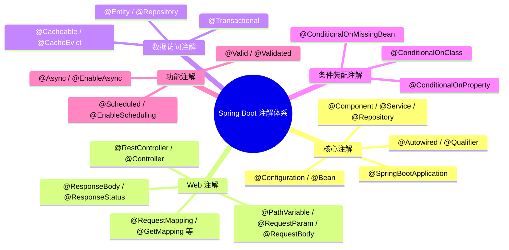
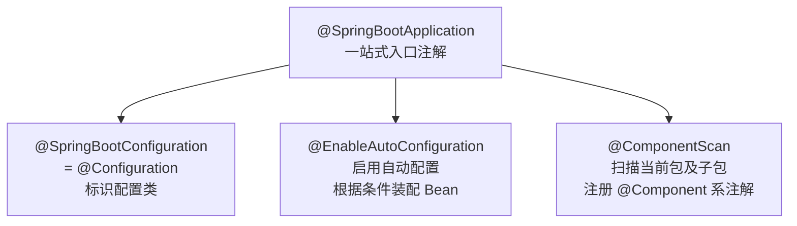
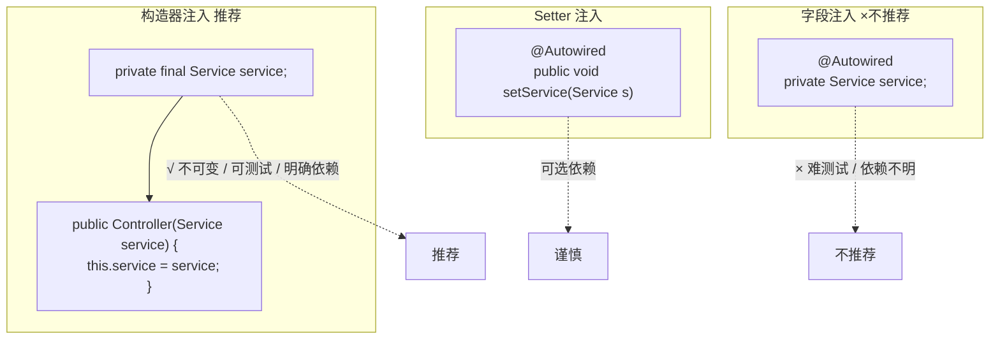

# Spring Boot 常用注解

## 注解概述

Spring Boot 的注解体系是框架的核心特性之一,通过注解可以极大地简化配置,提高开发效率。Spring Boot 注解主要来源于以下几个方面:

- **Spring Framework 核心注解**:如 `@Component`、`@Autowired`、`@Configuration` 等
- **Spring Boot 自动配置注解**:如 `@SpringBootApplication`、`@EnableAutoConfiguration` 等
- **Spring Web MVC 注解**:如 `@RestController`、`@RequestMapping`、`@GetMapping` 等
- **数据访问相关注解**:`@Repository`（Spring 组件标注）、`@Transactional`（Spring 事务）、`@Entity`/`@Table`（JPA）、`@Query`/`@Param`（Spring Data）
- **条件装配注解**:如 `@ConditionalOnClass`、`@ConditionalOnProperty` 等



::: tip 注解使用原则
1. **理解注解背后的机制**：不要只会用注解而不知道它做了什么——`@Transactional` 的代理机制、`@Async` 的线程池模型、`@Conditional` 的条件判断逻辑，都是面试高频考点
2. **选最合适的注解**：注入优先构造器注入而非 `@Autowired`；Web 优先组合注解（`@GetMapping`）而非 `@RequestMapping(method=GET)`
3. **不要滥用**：一个类上有 10+ 个注解，通常意味着设计有问题
:::

## 注解分类体系

### 核心注解分类

| 分类 | 注解 | 主要作用 |
|------|------|----------|
| **容器注册注解** | @Component、@Service、@Repository、@Controller、@RestController、@Configuration | 将类注册为 Spring Bean |
| **依赖注入注解** | @Autowired、@Qualifier、@Resource、@Inject | 实现 Bean 的依赖注入 |
| **配置注解** | @Configuration、@Bean、@PropertySource、@Value | 定义配置类和 Bean |
| **条件装配注解** | @Conditional、@ConditionalOnClass、@ConditionalOnProperty | 根据条件注册 Bean |
| **作用域注解** | @Scope、@Lazy、@Primary | 控制 Bean 的创建和使用 |

### Web 注解分类

| 分类 | 注解 | 主要作用 |
|------|------|----------|
| **控制器注解** | @Controller、@RestController | 标识控制器组件 |
| **请求映射注解** | @RequestMapping、@GetMapping、@PostMapping、@PutMapping、@DeleteMapping、@PatchMapping | 映射 HTTP 请求到处理方法 |
| **参数绑定注解** | @PathVariable、@RequestParam、@RequestBody、@RequestHeader、@CookieValue | 绑定请求参数到方法参数 |
| **响应处理注解** | @ResponseBody、@ResponseStatus | 处理 HTTP 响应 |

### 数据访问注解分类

| 分类 | 注解 | 主要作用 |
|------|------|----------|
| **数据访问层注解** | @Repository、@Entity、@Table | 标识数据访问组件和实体 |
| **事务注解** | @Transactional | 声明事务边界 |
| **查询注解** | @Query、@Param | 定义自定义查询 |
| **缓存注解** | @Cacheable、@CachePut、@CacheEvict | 实现方法级缓存 |

### 功能性注解分类

| 分类 | 注解 | 主要作用 |
|------|------|----------|
| **AOP 注解** | @Aspect、@Before、@After、@Around、@Pointcut | 实现面向切面编程 |
| **定时任务注解** | @Scheduled、@EnableScheduling | 创建定时任务 |
| **异步处理注解** | @Async、@EnableAsync | 实现异步方法调用 |
| **验证注解** | @Valid、@Validated、@NotNull、@Size、@Pattern | 数据验证 |
| **测试注解** | @SpringBootTest、@MockBean、@SpyBean | 单元测试和集成测试 |

## 核心注解详解

### @SpringBootApplication

`@SpringBootApplication` 是 Spring Boot 的核心注解,它是一个组合注解,包含以下三个注解:



::: warning 面试必考
"@SpringBootApplication 包含哪些注解？" 是面试中几乎必考的基础题。回答时不仅要列出三个注解，还要分别说明每个注解的作用，以及 `@EnableAutoConfiguration` 的底层机制（AutoConfigurationImportSelector + spring.factories/.imports）。
:::

```java
@Target(ElementType.TYPE)
@Retention(RetentionPolicy.RUNTIME)
@Documented
@Inherited
@SpringBootConfiguration
@EnableAutoConfiguration
@ComponentScan(
    excludeFilters = {
        @Filter(type = FilterType.CUSTOM, classes = TypeExcludeFilter.class),
        @Filter(type = FilterType.CUSTOM, classes = AutoConfigurationExcludeFilter.class)
    }
)
public @interface SpringBootApplication {
    // ...
}
```

**组成部分解析:**

1. **@SpringBootConfiguration**: 标识这是一个配置类,等同于 `@Configuration`
2. **@EnableAutoConfiguration**: 启用 Spring Boot 自动配置机制
3. **@ComponentScan**: 启用组件扫描,默认扫描主类所在包及其子包

**常用属性:**

```java
@SpringBootApplication(
    exclude = {DataSourceAutoConfiguration.class},  // 排除特定自动配置
    excludeName = {"org.springframework.boot.autoconfigure.jdbc.DataSourceAutoConfiguration"},
    scanBasePackages = {"com.example.service", "com.example.controller"},
    scanBasePackageClasses = {MyConfiguration.class}
)
public class Application {
    public static void main(String[] args) {
        SpringApplication.run(Application.class, args);
    }
}
```

**属性说明:**

| 属性 | 类型 | 说明 |
|------|------|------|
| exclude | Class<?>[] | 排除特定的自动配置类 |
| excludeName | String[] | 通过类名排除自动配置类 |
| scanBasePackages | String[] | 指定扫描的包路径 |
| scanBasePackageClasses | Class<?>[] | 指定扫描的类所在包 |

**实战应用:**

```java
// 场景1: 排除数据源自动配置(不需要数据库的项目)
@SpringBootApplication(exclude = {DataSourceAutoConfiguration.class})
public class WebApplication {
    public static void main(String[] args) {
        SpringApplication.run(WebApplication.class, args);
    }
}

// 场景2: 多模块项目的包扫描配置
@SpringBootApplication(scanBasePackages = {
    "com.example.common",
    "com.example.service",
    "com.example.controller"
})
public class MultiModuleApplication {
    public static void main(String[] args) {
        SpringApplication.run(MultiModuleApplication.class, args);
    }
}

// 场景3: 按 Profile 条件装配
@SpringBootApplication
public class DynamicExcludeApplication {
    public static void main(String[] args) {
        SpringApplication app = new SpringApplication(DynamicExcludeApplication.class);
        // 根据环境变量激活 no-database profile,配合 @Profile/自动配置条件实现"按需排除"
        if (System.getenv("NO_DATABASE") != null) {
            app.setAdditionalProfiles("no-database");
        }
        app.run(args);
    }
}
```

### @Component 及其衍生注解

`@Component` 是 Spring 的基础组件注解,它有三个常用衍生注解,用于不同层次的组件标识:

```java
// 基础组件注解
@Component
public class UtilityComponent {
    public String formatDate(Date date) {
        return new SimpleDateFormat("yyyy-MM-dd").format(date);
    }
}

// 服务层组件
@Service
public class UserService {
    public User findById(Long id) {
        // 业务逻辑
    }
}

// 数据访问层组件
@Repository
public interface UserRepository extends JpaRepository<User, Long> {
    Optional<User> findByUsername(String username);
}

// 控制层组件
@Controller
public class HomeController {
    @GetMapping("/")
    public String home() {
        return "index";
    }
}

// REST控制器组件
@RestController
public class ApiController {
    @GetMapping("/api/data")
    public Map<String, Object> getData() {
        return Map.of("message", "Hello World");
    }
}
```

**注解继承关系:**

```
@Component (基础注解)
    ├── @Service (服务层)
    ├── @Repository (数据访问层)
    ├── @Controller (Web控制器)
    └── @RestController (REST控制器)
          └── @Controller + @ResponseBody
```

**为什么要使用衍生注解?**

1. **语义清晰**: 一眼就能看出组件的职责
2. **特定功能**: 某些注解带有特定功能(如 `@Repository` 的异常转换)
3. **AOP 切面**: 可以针对特定层次进行切面编程
4. **工具支持**: IDE 和分析工具可以更好地理解代码结构

**@Repository 的异常转换功能:**

```java
@Repository
public class UserRepositoryImpl implements UserRepository {
    
    @PersistenceContext
    private EntityManager entityManager;
    
    public User findByUsername(String username) {
        // @Repository 启用异常转换:JPA 的 PersistenceException（如 NoResultException）
        // 会被 Spring 自动转换为 DataAccessException 体系（如 EmptyResultDataAccessException），
        // 无需手动 try-catch 转换
        return entityManager.createQuery("SELECT u FROM User u WHERE u.username = :username", User.class)
            .setParameter("username", username)
            .getSingleResult();
    }
}
```

### @Autowired 依赖注入

`@Autowired` 是 Spring 的依赖注入核心注解,可以用于构造函数、字段、Setter 方法和普通方法上。



::: warning 为什么不推荐字段注入
字段注入（`@Autowired` 标注在字段上）虽然代码最简洁，但有严重缺陷：
1. **无法声明 final**：依赖可变，线程不安全
2. **难以单元测试**：必须通过反射或 Spring 容器才能注入 mock
3. **隐藏依赖**：类的依赖关系不直观，容易违反单一职责
4. **Spring 官方也不推荐**：从 Spring 4.3 开始，单构造器可省略 `@Autowired`

Spring Boot 3.x 中，如果你使用构造器注入 + `final` 字段，IDEA 不会再提示你加 `@Autowired`——因为单构造器自动注入是默认行为。
:::

::: danger 字段注入导致的生产事故
某项目在 Service 中使用字段注入 `@Autowired private PaymentGateway gateway;`。当需要切换支付网关实现时，发现：
1. 没有构造器强制校验——运行时 `gateway` 为 null 导致 NPE
2. 无法在单元测试中 mock——必须启动整个 Spring 容器
3. 循环依赖无法在编译期发现——直到运行时才报 `BeanCurrentlyInCreationException`

切换到构造器注入后，以上问题全部在编译期就能发现。**永远使用构造器注入 + final 字段。**
:::

**注入方式对比:**

```java
// 1. 字段注入 (不推荐,但最常见)
@Component
public class FieldInjectionService {
    @Autowired
    private UserRepository userRepository;
    
    @Autowired
    private EmailService emailService;
    
    public void processUser(Long userId) {
        User user = userRepository.findById(userId).orElse(null);
        emailService.sendEmail(user.getEmail(), "Welcome");
    }
}

// 2. Setter 注入 (可选依赖场景)
@Component
public class SetterInjectionService {
    private UserRepository userRepository;
    private Optional<EmailService> emailService;
    
    @Autowired
    public void setUserRepository(UserRepository userRepository) {
        this.userRepository = userRepository;
    }
    
    @Autowired(required = false)  // 可选依赖
    public void setEmailService(EmailService emailService) {
        this.emailService = Optional.ofNullable(emailService);
    }
    
    public void processUser(Long userId) {
        User user = userRepository.findById(userId).orElse(null);
        emailService.ifPresent(es -> es.sendEmail(user.getEmail(), "Welcome"));
    }
}

// 3. 构造函数注入 (推荐方式)
@Component
public class ConstructorInjectionService {
    private final UserRepository userRepository;
    private final EmailService emailService;
    
    // Spring 4.3+ 如果类只有一个构造函数,@Autowired 可以省略
    @Autowired
    public ConstructorInjectionService(UserRepository userRepository, 
                                      EmailService emailService) {
        this.userRepository = userRepository;
        this.emailService = emailService;
    }
    
    public void processUser(Long userId) {
        User user = userRepository.findById(userId).orElse(null);
        emailService.sendEmail(user.getEmail(), "Welcome");
    }
}

// 4. Lombok 简化构造函数注入
@Component
@RequiredArgsConstructor  // Lombok 注解
public class LombokInjectionService {
    private final UserRepository userRepository;
    private final EmailService emailService;
    
    // Lombok 会自动生成包含 final 字段的构造函数
    public void processUser(Long userId) {
        User user = userRepository.findById(userId).orElse(null);
        emailService.sendEmail(user.getEmail(), "Welcome");
    }
}
```

**三种注入方式的对比:**

| 注入方式 | 优点 | 缺点 | 适用场景 |
|---------|------|------|---------|
| 字段注入 | 简单,代码少 | 无法注入 final 字段,不利于测试,容易隐藏依赖 | 原型开发,简单项目 |
| Setter 注入 | 灵活,支持可选依赖 | 依赖可能在对象创建后改变,不够安全 | 可选依赖,循环依赖 |
| 构造函数注入 | 明确依赖,支持 final,利于测试,不可变对象 | 依赖多时构造函数参数多 | 推荐的生产环境使用方式 |

**@Autowired 的 required 属性:**

```java
@Component
public class OptionalDependencyService {
    
    @Autowired(required = false)  // 如果没有找到 Bean,不报错
    private Optional<FeatureService> featureService;
    
    @Autowired(required = false)
    private MetricsService metricsService;
    
    public void doSomething() {
        featureService.ifPresent(fs -> fs.enableFeature("new-feature"));
        
        if (metricsService != null) {
            metricsService.recordEvent("doSomething");
        }
    }
}
```

**使用 Optional 处理可选依赖 (Spring 5+):**

```java
@Component
public class ModernOptionalService {
    
    @Autowired
    private Optional<FeatureService> featureService;  // 自动包装为 Optional
    
    public void doSomething() {
        featureService.ifPresent(fs -> fs.enableFeature("new-feature"));
    }
}
```

### @Qualifier 和 @Primary

当容器中存在多个同类型的 Bean 时,需要使用 `@Qualifier` 指定注入哪一个,或使用 `@Primary` 标记默认 Bean。

**多实现场景:**

```java
// 定义接口
public interface PaymentService {
    void processPayment(BigDecimal amount);
}

// 实现类1
@Service("creditCardPaymentService")
public class CreditCardPaymentService implements PaymentService {
    @Override
    public void processPayment(BigDecimal amount) {
        System.out.println("Processing credit card payment: $" + amount);
    }
}

// 实现类2
@Service("payPalPaymentService")
public class PayPalPaymentService implements PaymentService {
    @Override
    public void processPayment(BigDecimal amount) {
        System.out.println("Processing PayPal payment: $" + amount);
    }
}

// 实现类3 - 标记为主要实现
@Service
@Primary  // 当有多个实现时,优先使用这个
public class AliPayPaymentService implements PaymentService {
    @Override
    public void processPayment(BigDecimal amount) {
        System.out.println("Processing AliPay payment: $" + amount);
    }
}
```

**使用 @Qualifier 指定注入:**

```java
@RestController
@RequestMapping("/api/payment")
public class PaymentController {
    
    private final PaymentService creditCardPaymentService;
    private final PaymentService payPalPaymentService;
    private final PaymentService primaryPaymentService;
    
    // 方式1: 使用 @Qualifier 指定 Bean 名称
    @Autowired
    public PaymentController(
            @Qualifier("creditCardPaymentService") PaymentService creditCardPaymentService,
            @Qualifier("payPalPaymentService") PaymentService payPalPaymentService,
            PaymentService primaryPaymentService) {  // 注入 @Primary 标记的 Bean
        this.creditCardPaymentService = creditCardPaymentService;
        this.payPalPaymentService = payPalPaymentService;
        this.primaryPaymentService = primaryPaymentService;
    }
    
    @PostMapping("/credit-card")
    public String payWithCreditCard(@RequestParam BigDecimal amount) {
        creditCardPaymentService.processPayment(amount);
        return "Credit card payment processed";
    }
    
    @PostMapping("/paypal")
    public String payWithPayPal(@RequestParam BigDecimal amount) {
        payPalPaymentService.processPayment(amount);
        return "PayPal payment processed";
    }
    
    @PostMapping("/default")
    public String payWithDefault(@RequestParam BigDecimal amount) {
        primaryPaymentService.processPayment(amount);
        return "Default payment processed";
    }
}
```

**自定义 @Qualifier 注解:**

```java
// 定义自定义限定符注解
@Target({ElementType.FIELD, ElementType.PARAMETER, ElementType.METHOD, ElementType.TYPE, ElementType.ANNOTATION_TYPE})
@Retention(RetentionPolicy.RUNTIME)
@Qualifier
public @interface CreditCard {
}

@Target({ElementType.FIELD, ElementType.PARAMETER, ElementType.METHOD, ElementType.TYPE, ElementType.ANNOTATION_TYPE})
@Retention(RetentionPolicy.RUNTIME)
@Qualifier
public @interface PayPal {
}

// 使用自定义限定符
@Service
@CreditCard
public class CreditCardPaymentService implements PaymentService {
    // ...
}

@Service
@PayPal
public class PayPalPaymentService implements PaymentService {
    // ...
}

// 注入时使用
@Component
public class PaymentProcessor {
    
    @Autowired
    @CreditCard
    private PaymentService creditCardPaymentService;
    
    @Autowired
    @PayPal
    private PaymentService payPalPaymentService;
}
```

### @Configuration 和 @Bean

`@Configuration` 用于定义配置类,`@Bean` 用于声明由 Spring 管理的 Bean。

**基本用法:**

```java
@Configuration
public class ApplicationConfig {
    
    @Bean
    public RestTemplate restTemplate() {
        return new RestTemplate();
    }
    
    @Bean
    public ObjectMapper objectMapper() {
        ObjectMapper mapper = new ObjectMapper();
        mapper.registerModule(new JavaTimeModule());
        mapper.disable(SerializationFeature.WRITE_DATES_AS_TIMESTAMPS);
        return mapper;
    }
    
    @Bean
    public PasswordEncoder passwordEncoder() {
        return new BCryptPasswordEncoder();
    }
}
```

**@Bean 的属性:**

```java
@Configuration
public class AdvancedConfig {
    
    @Bean(
        name = {"dataSource", "mainDataSource"},  // Bean 名称(可以有多个别名)
        initMethod = "init",                      // 初始化方法
        destroyMethod = "close",                  // 销毁方法
        autowireCandidate = true                  // 是否作为自动装配候选
    )
    @Primary                                      // 主要 Bean
    @Qualifier("mainDataSource")                 // 限定符
    public DataSource dataSource() {
        HikariDataSource ds = new HikariDataSource();
        ds.setJdbcUrl("jdbc:mysql://localhost:3306/mydb");
        ds.setUsername("user");
        ds.setPassword("password");
        ds.setMaximumPoolSize(20);
        return ds;
    }
    
    @Bean
    @Scope("prototype")  // 原型作用域
    public TaskExecutor taskExecutor() {
        ThreadPoolTaskExecutor executor = new ThreadPoolTaskExecutor();
        executor.setCorePoolSize(5);
        executor.setMaxPoolSize(10);
        executor.setQueueCapacity(100);
        executor.setThreadNamePrefix("task-");
        executor.initialize();
        return executor;
    }
    
    @Bean
    @Lazy  // 延迟初始化
    @ConditionalOnProperty(name = "cache.enabled", havingValue = "true")
    public CacheManager cacheManager() {
        return new ConcurrentMapCacheManager("users", "products");
    }
}
```

**配置类之间的导入:**

```java
@Configuration
@Import({DatabaseConfig.class, SecurityConfig.class, WebConfig.class})
public class MainConfig {
    // 导入其他配置类
}

@Configuration
public class DatabaseConfig {
    
    @Bean
    public DataSource dataSource() {
        return new HikariDataSource();
    }
    
    @Bean
    public JdbcTemplate jdbcTemplate(DataSource dataSource) {
        return new JdbcTemplate(dataSource);
    }
}

@Configuration
public class SecurityConfig {
    
    @Bean
    public PasswordEncoder passwordEncoder() {
        return new BCryptPasswordEncoder();
    }
}

@Configuration
public class WebConfig {
    
    @Bean
    public RestTemplate restTemplate() {
        return new RestTemplate();
    }
}
```

**属性注入到配置类:**

```java
@Configuration
@PropertySource("classpath:application.properties")
public class PropertyConfig {
    
    @Value("${app.name}")
    private String appName;
    
    @Value("${app.version}")
    private String appVersion;
    
    @Bean
    public AppInfo appInfo() {
        return new AppInfo(appName, appVersion);
    }
    
    @Bean
    @ConfigurationProperties(prefix = "database")  // 绑定配置属性
    public DatabaseConfig databaseConfig() {
        return new DatabaseConfig();
    }
}

// 配置属性类
@ConfigurationProperties(prefix = "database")
public class DatabaseConfig {
    private String url;
    private String username;
    private String password;
    private int maxPoolSize = 10;
    
    // getters and setters
}
```

**Configuration 代理模式 (ProxyBeanMethods):**

```java
// Spring 5.2+ 支持
@Configuration(proxyBeanMethods = true)  // 默认值,保持单例
public class ProxyConfig {
    
    @Bean
    public ServiceA serviceA() {
        return new ServiceA(repository());  // repository() 返回的是 Spring 容器中的单例 Bean
    }
    
    @Bean
    public ServiceB serviceB() {
        return new ServiceB(repository());  // repository() 返回的是同一个单例 Bean
    }
    
    @Bean
    public Repository repository() {
        return new RepositoryImpl();
    }
}

@Configuration(proxyBeanMethods = false)  // 轻量级模式,不代理方法调用
public class LiteConfig {
    
    @Bean
    public ServiceA serviceA(Repository repository) {  // 通过参数注入
        return new ServiceA(repository);
    }
    
    @Bean
    public ServiceB serviceB(Repository repository) {  // 通过参数注入
        return new ServiceB(repository);
    }
    
    @Bean
    public Repository repository() {
        return new RepositoryImpl();  // 每次调用都创建新实例
    }
}
```

### @Scope、@Lazy、@Primary

这些注解用于控制 Bean 的作用域、初始化时机和优先级。

**@Scope 作用域:**

```java
@Component
@Scope("singleton")  // 默认,单例,整个应用共享一个实例
public class SingletonService {
    private static int counter = 0;
    private final int id = counter++;
    
    public int getId() {
        return id;
    }
}

@Component
@Scope("prototype")  // 原型,每次获取都创建新实例
public class PrototypeService {
    private static int counter = 0;
    private final int id = counter++;
    
    public int getId() {
        return id;
    }
}

// Web 环境的作用域
@Component
@Scope(value = WebApplicationContext.SCOPE_REQUEST, proxyMode = ScopedProxyMode.TARGET_CLASS)
// 每个HTTP请求一个实例
public class RequestScopedService {
    private List<String> requestLogs = new ArrayList<>();
    
    public void log(String message) {
        requestLogs.add(message);
    }
}

@Component
@Scope(value = WebApplicationContext.SCOPE_SESSION, proxyMode = ScopedProxyMode.TARGET_CLASS)
// 每个HTTP会话一个实例
public class SessionScopedService {
    private UserSession userSession;
    
    public void setUserSession(UserSession userSession) {
        this.userSession = userSession;
    }
}

@Component
@Scope(value = WebApplicationContext.SCOPE_APPLICATION)
// 整个Web应用一个实例
public class ApplicationScopedService {
    private AtomicInteger requestCount = new AtomicInteger(0);
    
    public void incrementRequestCount() {
        requestCount.incrementAndGet();
    }
}
```

**作用域代理模式:**

```java
// 问题场景:单例 Bean 依赖原型 Bean
@Service
public class SingletonService {
    
    @Autowired
    private PrototypeService prototypeService;  // 问题:每次都是同一个实例!
    
    public void doSomething() {
        System.out.println("Prototype ID: " + prototypeService.getId());  // 总是相同的 ID
    }
}

// 解决方案1:使用代理模式
@Service
public class SingletonServiceFixed {
    
    @Autowired
    @Scope(value = "prototype", proxyMode = ScopedProxyMode.TARGET_CLASS)
    private PrototypeService prototypeService;  // 每次方法调用都获取新实例
    
    public void doSomething() {
        System.out.println("Prototype ID: " + prototypeService.getId());  // 每次不同的 ID
    }
}

// 解决方案2:使用 ObjectProvider
@Service
public class SingletonServiceWithProvider {
    
    @Autowired
    private ObjectProvider<PrototypeService> prototypeServiceProvider;
    
    public void doSomething() {
        PrototypeService prototypeService = prototypeServiceProvider.getObject();  // 每次获取新实例
        System.out.println("Prototype ID: " + prototypeService.getId());
    }
}

// 解决方案3:使用 ApplicationContext
@Service
public class SingletonServiceWithContext implements ApplicationContextAware {
    
    private ApplicationContext applicationContext;
    
    @Override
    public void setApplicationContext(ApplicationContext applicationContext) {
        this.applicationContext = applicationContext;
    }
    
    public void doSomething() {
        PrototypeService prototypeService = applicationContext.getBean(PrototypeService.class);
        System.out.println("Prototype ID: " + prototypeService.getId());
    }
}
```

**@Lazy 延迟初始化:**

```java
// 类级别延迟初始化
@Component
@Lazy
public class ExpensiveService {
    
    public ExpensiveService() {
        System.out.println("ExpensiveService initialized at: " + new Date());
    }
    
    public void doExpensiveOperation() {
        System.out.println("Performing expensive operation");
    }
}

// 注入点延迟初始化
@Service
public class EagerService {
    
    @Autowired
    @Lazy  // 首次使用时才初始化 ExpensiveService
    private ExpensiveService expensiveService;
    
    public void maybeUseExpensiveService() {
        if (Math.random() > 0.5) {
            expensiveService.doExpensiveOperation();  // 这里才初始化
        }
    }
}

// 循环依赖场景
@Service
public class ServiceA {
    
    private final ServiceB serviceB;
    
    @Autowired
    public ServiceA(@Lazy ServiceB serviceB) {  // 延迟加载解决循环依赖
        this.serviceB = serviceB;
    }
}

@Service
public class ServiceB {
    
    private final ServiceA serviceA;
    
    @Autowired
    public ServiceB(@Lazy ServiceA serviceA) {
        this.serviceA = serviceA;
    }
}
```

**@Primary 主要 Bean:**

```java
// 场景:多个数据源配置
@Configuration
public class DataSourceConfig {
    
    @Bean
    @Primary  // 主要数据源
    @ConfigurationProperties(prefix = "spring.datasource.primary")
    public DataSource primaryDataSource() {
        return DataSourceBuilder.create().build();
    }
    
    @Bean
    @ConfigurationProperties(prefix = "spring.datasource.secondary")
    public DataSource secondaryDataSource() {
        return DataSourceBuilder.create().build();
    }
    
    @Bean
    @Primary
    public JdbcTemplate primaryJdbcTemplate(@Qualifier("primaryDataSource") DataSource dataSource) {
        return new JdbcTemplate(dataSource);
    }
    
    @Bean
    public JdbcTemplate secondaryJdbcTemplate(@Qualifier("secondaryDataSource") DataSource dataSource) {
        return new JdbcTemplate(dataSource);
    }
}

// 使用时
@Service
public class UserService {
    
    @Autowired
    private JdbcTemplate jdbcTemplate;  // 自动注入 primaryJdbcTemplate
    
    @Autowired
    @Qualifier("secondaryJdbcTemplate")
    private JdbcTemplate secondaryJdbcTemplate;  // 显式指定第二个数据源
}
```

## 条件装配注解

### @Conditional 系列注解

Spring Boot 提供了强大的条件装配机制,根据特定条件决定是否创建 Bean。

**常用条件注解:**

```java
@Configuration
public class ConditionalConfig {
    
    // 1. @ConditionalOnClass: 类路径中存在指定类时创建 Bean
    @Bean
    @ConditionalOnClass(name = "com.mysql.cj.jdbc.Driver")
    public MySqlService mySqlService() {
        return new MySqlService();
    }
    
    // 2. @ConditionalOnMissingClass: 类路径中不存在指定类时创建 Bean
    @Bean
    @ConditionalOnMissingClass(value = "com.mysql.cj.jdbc.Driver")
    public H2Service h2Service() {
        return new H2Service();
    }
    
    // 3. @ConditionalOnBean: 容器中存在指定 Bean 时创建
    @Bean
    @ConditionalOnBean(DataSource.class)
    public JdbcTemplate jdbcTemplate() {
        return new JdbcTemplate();
    }
    
    // 4. @ConditionalOnMissingBean: 容器中不存在指定 Bean 时创建
    @Bean
    @ConditionalOnMissingBean(PasswordEncoder.class)
    public PasswordEncoder defaultPasswordEncoder() {
        return new BCryptPasswordEncoder();
    }
    
    // 5. @ConditionalOnProperty: 配置属性满足条件时创建
    @Bean
    @ConditionalOnProperty(
        name = "feature.logging.enabled",
        havingValue = "true",
        matchIfMissing = false  // 如果属性不存在,不匹配
    )
    public LoggingFeature loggingFeature() {
        return new LoggingFeature();
    }
    
    // 6. @ConditionalOnResource: 指定资源存在时创建
    @Bean
    @ConditionalOnResource(resources = "classpath:custom-config.properties")
    public CustomConfigLoader customConfigLoader() {
        return new CustomConfigLoader();
    }
    
    // 7. @ConditionalOnWebApplication: Web 应用时创建
    @Bean
    @ConditionalOnWebApplication(type = ConditionalOnWebApplication.Type.SERVLET)
    public WebAppService webAppService() {
        return new WebAppService();
    }
    
    // 8. @ConditionalOnExpression: SpEL 表达式为 true 时创建
    @Bean
    @ConditionalOnExpression("${feature.enabled:false} and ${feature.premium:false}")
    public PremiumFeature premiumFeature() {
        return new PremiumFeature();
    }
    
    // 9. @ConditionalOnJava: Java 版本满足条件时创建
    @Bean
    @ConditionalOnJava(JavaVersion.ELEVEN)
    public Java11Feature java11Feature() {
        return new Java11Feature();
    }
}
```

**自定义条件注解:**

```java
// 1. 实现 Condition 接口
public class OnMicroserviceCondition implements Condition {
    
    @Override
    public boolean matches(ConditionContext context, AnnotatedTypeMetadata metadata) {
        // 检查是否是微服务环境
        String env = context.getEnvironment().getProperty("app.environment");
        return "microservice".equals(env);
    }
}

// 2. 创建自定义条件注解
@Target({ElementType.TYPE, ElementType.METHOD})
@Retention(RetentionPolicy.RUNTIME)
@Conditional(OnMicroserviceCondition.class)
public @interface ConditionalOnMicroservice {
}

// 3. 使用自定义条件注解
@Configuration
public class MicroserviceConfig {
    
    @Bean
    @ConditionalOnMicroservice
    public ServiceDiscoveryClient serviceDiscoveryClient() {
        return new NacosServiceDiscoveryClient();
    }
    
    @Bean
    @ConditionalOnMicroservice
    public LoadBalancer loadBalancer() {
        return new RibbonLoadBalancer();
    }
}
```

**条件组合使用:**

```java
@Configuration
public class CompositeConditionConfig {
    
    // AND 组合:多个条件同时满足
    @Bean
    @ConditionalOnClass(name = "org.springframework.data.redis.connection.RedisConnection")
    @ConditionalOnProperty(name = "spring.data.redis.host")
    @ConditionalOnMissingBean(RedisTemplate.class)
    public RedisTemplate<String, Object> redisTemplate(RedisConnectionFactory factory) {
        RedisTemplate<String, Object> template = new RedisTemplate<>();
        template.setConnectionFactory(factory);
        return template;
    }
    
    // 使用自定义组合条件
    @Bean
    @Conditional({
        OnMicroserviceCondition.class,
        OnCloudPlatformCondition.class
    })
    public DistributedTracing distributedTracing() {
        return new ZipkinTracing();
    }
}
```

## 注解组合使用

### 组合注解原理

Spring 允许将多个注解组合成一个元注解,减少重复配置。

```java
// 自定义组合注解示例
// 注意:组合注解的属性必须通过 @AliasFor 桥接到元注解,否则传入的值不会生效
@Target(ElementType.TYPE)
@Retention(RetentionPolicy.RUNTIME)
@Documented
@RestController
@RequestMapping("/api")
@CrossOrigin(origins = "*")
public @interface ApiRestController {
    @AliasFor(annotation = RequestMapping.class, attribute = "value")
    String value() default "";
}

// 使用自定义组合注解
@ApiRestController("/users")
public class UserController {
    
    @GetMapping
    public List<User> getAllUsers() {
        return userService.findAll();
    }
}
```

### 常见组合模式

**1. 控制器组合:**

```java
// 定义 REST API 控制器注解
@Target(ElementType.TYPE)
@Retention(RetentionPolicy.RUNTIME)
@RestController
@RequestMapping("/api/v1")
@CrossOrigin
@Validated
public @interface RestApiV1 {
    @AliasFor(annotation = RequestMapping.class, attribute = "path")
    String path() default "";
}

// 使用
@RestApiV1(path = "/orders")
public class OrderController {
    
    @GetMapping
    public List<Order> getOrders() {
        return orderService.findAll();
    }
}

// 等价于
@RestController
@RequestMapping("/api/v1/orders")
@CrossOrigin
@Validated
public class OrderController {
    
    @GetMapping
    public List<Order> getOrders() {
        return orderService.findAll();
    }
}
```

**2. 服务层组合:**

```java
// 定义服务层注解
@Target(ElementType.TYPE)
@Retention(RetentionPolicy.RUNTIME)
@Service
@Transactional
@Slf4j
public @interface BusinessService {
    String value() default "";
}

// 使用
@BusinessService
public class OrderService {
    
    public Order createOrder(OrderDto orderDto) {
        log.info("Creating order: {}", orderDto);
        // 事务自动开启
        Order order = convertToEntity(orderDto);
        return orderRepository.save(order);
    }
}
```

**3. 数据访问层组合:**

```java
// 定义数据访问层注解
@Target(ElementType.TYPE)
@Retention(RetentionPolicy.RUNTIME)
@Repository
@Transactional(readOnly = true)
public @interface ReadOnlyRepository {
}

// 使用
@ReadOnlyRepository
public class ProductQueryRepository {
    
    @PersistenceContext
    private EntityManager entityManager;
    
    public List<Product> findByName(String name) {
        return entityManager.createQuery("SELECT p FROM Product p WHERE p.name LIKE :name", Product.class)
            .setParameter("name", "%" + name + "%")
            .getResultList();
    }
}
```

**4. 条件装配组合:**

```java
// 生产环境配置注解
@Target({ElementType.TYPE, ElementType.METHOD})
@Retention(RetentionPolicy.RUNTIME)
@ConditionalOnProperty(name = "spring.profiles.active", havingValue = "prod")
@ConditionalOnCloudPlatform(CloudPlatform.KUBERNETES)
public @interface ProductionConfiguration {
}

// 使用
@Configuration
@ProductionConfiguration
public class ProductionConfig {
    
    @Bean
    public MetricsExporter prometheusExporter() {
        return new PrometheusMetricsExporter();
    }
    
    @Bean
    public DistributedTracing jaegerTracing() {
        return new JaegerTracing();
    }
}
```

## 自定义注解实现

### 自定义注解基础

Spring 允许创建自定义注解来简化开发,提高代码可读性。

**自定义注解的步骤:**

1. 定义注解接口
2. 创建注解处理器
3. 使用注解

### 自定义校验注解

```java
// 1. 定义手机号校验注解
@Target({ElementType.FIELD, ElementType.PARAMETER})
@Retention(RetentionPolicy.RUNTIME)
@Constraint(validatedBy = PhoneValidator.class)
@Documented
public @interface Phone {
    String message() default "手机号格式不正确";
    
    Class<?>[] groups() default {};
    
    Class<? extends Payload>[] payload() default {};
    
    String pattern() default "^1[3-9]\\d{9}$";
}

// 2. 实现校验器
public class PhoneValidator implements ConstraintValidator<Phone, String> {
    
    private Pattern pattern;
    
    @Override
    public void initialize(Phone constraintAnnotation) {
        pattern = Pattern.compile(constraintAnnotation.pattern());
    }
    
    @Override
    public boolean isValid(String value, ConstraintValidatorContext context) {
        if (value == null || value.isEmpty()) {
            return true;  // null 值由 @NotNull 校验
        }
        return pattern.matcher(value).matches();
    }
}

// 3. 使用自定义校验注解
@Data
public class UserDto {
    
    @NotBlank(message = "用户名不能为空")
    private String username;
    
    @Phone(message = "请输入正确的手机号")
    private String phone;
    
    @Email(message = "邮箱格式不正确")
    private String email;
}

@RestController
@RequestMapping("/api/users")
public class UserController {
    
    @PostMapping
    public User createUser(@Valid @RequestBody UserDto userDto) {
        return userService.create(userDto);
    }
}
```

### 自定义权限注解

```java
// 1. 定义权限注解
@Target({ElementType.METHOD, ElementType.TYPE})
@Retention(RetentionPolicy.RUNTIME)
@PreAuthorize("hasRole('ADMIN')")  // 组合 Spring Security 注解
public @interface RequireAdmin {
    String description() default "";
}

// 2. 更复杂的权限注解
@Target({ElementType.METHOD})
@Retention(RetentionPolicy.RUNTIME)
public @interface RequirePermission {
    String value();
    String description() default "";
}

// 3. 使用 AOP 实现权限检查
@Aspect
@Component
public class PermissionAspect {
    
    @Autowired
    private UserService userService;
    
    @Around("@annotation(requirePermission)")
    public Object checkPermission(ProceedingJoinPoint joinPoint, 
                                 RequirePermission requirePermission) throws Throwable {
        String permission = requirePermission.value();
        
        // 获取当前用户
        User currentUser = userService.getCurrentUser();
        if (currentUser == null) {
            throw new UnauthorizedException("用户未登录");
        }
        
        // 检查权限
        if (!currentUser.hasPermission(permission)) {
            throw new ForbiddenException("没有权限: " + requirePermission.description());
        }
        
        return joinPoint.proceed();
    }
}

// 4. 使用权限注解
@RestController
@RequestMapping("/api/admin")
public class AdminController {
    
    @GetMapping("/users")
    @RequireAdmin(description = "查看用户列表")
    public List<User> getAllUsers() {
        return userService.findAll();
    }
    
    @DeleteMapping("/users/{id}")
    @RequirePermission(value = "user:delete", description = "删除用户")
    public void deleteUser(@PathVariable Long id) {
        userService.deleteById(id);
    }
}
```

### 自定义日志注解

```java
// 1. 定义日志注解
@Target(ElementType.METHOD)
@Retention(RetentionPolicy.RUNTIME)
public @interface LogOperation {
    String value() default "";
    OperationType type() default OperationType.OTHER;
    boolean logParams() default true;
    boolean logResult() default true;
}

public enum OperationType {
    CREATE, READ, UPDATE, DELETE, OTHER
}

// 2. 实现 AOP 日志记录
@Aspect
@Component
@Slf4j
public class LogOperationAspect {
    
    @Around("@annotation(logOperation)")
    public Object logOperation(ProceedingJoinPoint joinPoint, LogOperation logOperation) throws Throwable {
        String methodName = joinPoint.getSignature().getName();
        String operationName = logOperation.value().isEmpty() ? methodName : logOperation.value();
        
        // 记录操作开始
        log.info("开始执行操作: {}, 类型: {}", operationName, logOperation.type());
        
        // 记录参数
        if (logOperation.logParams()) {
            Object[] args = joinPoint.getArgs();
            log.info("操作参数: {}", Arrays.toString(args));
        }
        
        long startTime = System.currentTimeMillis();
        try {
            // 执行方法
            Object result = joinPoint.proceed();
            
            // 记录结果
            if (logOperation.logResult()) {
                log.info("操作结果: {}", result);
            }
            
            long duration = System.currentTimeMillis() - startTime;
            log.info("操作完成: {}, 耗时: {}ms", operationName, duration);
            
            return result;
            
        } catch (Exception e) {
            log.error("操作失败: {}, 异常: {}", operationName, e.getMessage(), e);
            throw e;
        }
    }
}

// 3. 使用日志注解
@Service
public class OrderService {
    
    @LogOperation(value = "创建订单", type = OperationType.CREATE)
    public Order createOrder(OrderDto orderDto) {
        // 业务逻辑
        return orderRepository.save(convertToEntity(orderDto));
    }
    
    @LogOperation(value = "查询订单", type = OperationType.READ, logResult = false)
    public Order getOrderById(Long id) {
        return orderRepository.findById(id).orElse(null);
    }
    
    @LogOperation(value = "删除订单", type = OperationType.DELETE, logParams = false)
    public void deleteOrder(Long id) {
        orderRepository.deleteById(id);
    }
}
```

### 自定义缓存注解

```java
// 1. 定义自定义缓存注解
@Target(ElementType.METHOD)
@Retention(RetentionPolicy.RUNTIME)
@Cacheable
public @interface SmartCache {
    String value() default "";
    long expire() default 3600;  // 过期时间(秒)
    boolean cacheNull() default false;  // 是否缓存 null 值
}

// 2. 实现缓存切面
@Aspect
@Component
public class SmartCacheAspect {
    
    @Autowired
    private CacheManager cacheManager;
    
    @Autowired
    private RedisTemplate<String, Object> redisTemplate;
    
    @Around("@annotation(smartCache)")
    public Object handleCache(ProceedingJoinPoint joinPoint, SmartCache smartCache) throws Throwable {
        String cacheKey = generateKey(joinPoint);
        String cacheName = smartCache.value().isEmpty() ? 
            joinPoint.getTarget().getClass().getSimpleName() : smartCache.value();
        
        // 尝试从缓存获取
        Cache cache = cacheManager.getCache(cacheName);
        if (cache != null) {
            Cache.ValueWrapper wrapper = cache.get(cacheKey);
            if (wrapper != null) {
                Object cachedValue = wrapper.get();
                if (cachedValue != null || smartCache.cacheNull()) {
                    return cachedValue;
                }
            }
        }
        
        // 执行方法
        Object result = joinPoint.proceed();
        
        // 缓存结果
        if (result != null || smartCache.cacheNull()) {
            cache.put(cacheKey, result);
            
            // 设置过期时间
            if (smartCache.expire() > 0) {
                String redisKey = cacheName + "::" + cacheKey;
                redisTemplate.expire(redisKey, smartCache.expire(), TimeUnit.SECONDS);
            }
        }
        
        return result;
    }
    
    private String generateKey(ProceedingJoinPoint joinPoint) {
        // 生成缓存 key
        return DigestUtils.md5DigestAsHex(
            (joinPoint.getSignature().toString() + Arrays.toString(joinPoint.getArgs())).getBytes()
        );
    }
}

// 3. 使用自定义缓存注解
@Service
public class ProductService {
    
    @SmartCache(value = "products", expire = 7200)
    public Product getProductById(Long id) {
        return productRepository.findById(id).orElse(null);
    }
    
    @SmartCache(value = "popular-products", expire = 300, cacheNull = true)
    public List<Product> getPopularProducts() {
        return productRepository.findByPopularity("high");
    }
}
```

## 实战案例

### 案例1: 完整的用户管理模块

```java
// 1. 用户实体类
@Entity
@Table(name = "users")
@Data
public class User {
    @Id
    @GeneratedValue(strategy = GenerationType.IDENTITY)
    private Long id;
    
    @Column(unique = true, nullable = false)
    private String username;
    
    @Column(nullable = false)
    private String password;
    
    @Column(unique = true)
    private String email;
    
    @Column(unique = true)
    private String phone;
    
    @Enumerated(EnumType.STRING)
    private UserStatus status = UserStatus.ACTIVE;
    
    @CreationTimestamp
    private LocalDateTime createdAt;
    
    @UpdateTimestamp
    private LocalDateTime updatedAt;
    
    @ManyToMany(fetch = FetchType.LAZY)
    @JoinTable(
        name = "user_roles",
        joinColumns = @JoinColumn(name = "user_id"),
        inverseJoinColumns = @JoinColumn(name = "role_id")
    )
    private Set<Role> roles = new HashSet<>();
}

// 2. 用户 DTO
@Data
public class UserDto {
    private Long id;
    
    @NotBlank(message = "用户名不能为空")
    @Size(min = 3, max = 20, message = "用户名长度必须在3-20之间")
    @Pattern(regexp = "^[a-zA-Z0-9_]+$", message = "用户名只能包含字母、数字和下划线")
    private String username;
    
    @NotBlank(message = "密码不能为空")
    @Size(min = 8, message = "密码长度至少8位")
    private String password;
    
    @Email(message = "邮箱格式不正确")
    private String email;
    
    @Phone(message = "手机号格式不正确")
    private String phone;
}

// 3. 用户 Repository
@Repository
public interface UserRepository extends JpaRepository<User, Long> {
    
    Optional<User> findByUsername(String username);
    
    Optional<User> findByEmail(String email);
    
    @Query("SELECT u FROM User u WHERE u.status = :status")
    List<User> findByStatus(@Param("status") UserStatus status);
    
    @Query(value = "SELECT * FROM users u WHERE u.created_at >= :startDate", nativeQuery = true)
    List<User> findCreatedAfter(@Param("startDate") LocalDateTime startDate);
    
    @Modifying
    @Query("UPDATE User u SET u.status = :status WHERE u.id = :id")
    int updateStatus(@Param("id") Long id, @Param("status") UserStatus status);
}

// 4. 用户 Service
@Service
@Transactional
@Slf4j
public class UserService {
    
    private final UserRepository userRepository;
    private final PasswordEncoder passwordEncoder;
    private final EmailService emailService;
    
    public UserService(UserRepository userRepository, 
                      PasswordEncoder passwordEncoder,
                      EmailService emailService) {
        this.userRepository = userRepository;
        this.passwordEncoder = passwordEncoder;
        this.emailService = emailService;
    }
    
    @LogOperation(value = "创建用户", type = OperationType.CREATE)
    @CacheEvict(value = "users", allEntries = true)
    public User createUser(UserDto userDto) {
        // 检查用户名是否存在
        if (userRepository.findByUsername(userDto.getUsername()).isPresent()) {
            throw new BusinessException("用户名已存在");
        }
        
        // 检查邮箱是否存在
        if (userDto.getEmail() != null && 
            userRepository.findByEmail(userDto.getEmail()).isPresent()) {
            throw new BusinessException("邮箱已被使用");
        }
        
        // 创建用户
        User user = new User();
        user.setUsername(userDto.getUsername());
        user.setPassword(passwordEncoder.encode(userDto.getPassword()));
        user.setEmail(userDto.getEmail());
        user.setPhone(userDto.getPhone());
        
        User savedUser = userRepository.save(user);
        
        // 发送欢迎邮件
        emailService.sendWelcomeEmail(savedUser.getEmail(), savedUser.getUsername());
        
        return savedUser;
    }
    
    @LogOperation(value = "查询用户", type = OperationType.READ)
    @Transactional(readOnly = true)
    @Cacheable(value = "users", key = "#id")
    public User getUserById(Long id) {
        return userRepository.findById(id)
            .orElseThrow(() -> new NotFoundException("用户不存在"));
    }
    
    @LogOperation(value = "更新用户", type = OperationType.UPDATE)
    @CachePut(value = "users", key = "#id")
    public User updateUser(Long id, UserDto userDto) {
        User user = getUserById(id);
        
        if (userDto.getEmail() != null && !userDto.getEmail().equals(user.getEmail())) {
            if (userRepository.findByEmail(userDto.getEmail()).isPresent()) {
                throw new BusinessException("邮箱已被使用");
            }
            user.setEmail(userDto.getEmail());
        }
        
        if (userDto.getPhone() != null) {
            user.setPhone(userDto.getPhone());
        }
        
        return userRepository.save(user);
    }
    
    @LogOperation(value = "删除用户", type = OperationType.DELETE)
    @CacheEvict(value = "users", key = "#id")
    public void deleteUser(Long id) {
        User user = getUserById(id);
        user.setStatus(UserStatus.DELETED);
        userRepository.save(user);
    }
    
    @Transactional(readOnly = true)
    @Cacheable(value = "users", key = "#username")
    public User findByUsername(String username) {
        return userRepository.findByUsername(username)
            .orElseThrow(() -> new NotFoundException("用户不存在"));
    }
}

// 5. 用户 Controller
@RestController
@RequestMapping("/api/users")
@Validated
@Slf4j
public class UserController {
    
    private final UserService userService;
    
    public UserController(UserService userService) {
        this.userService = userService;
    }
    
    @PostMapping
    @ResponseStatus(HttpStatus.CREATED)
    @Operation(summary = "创建用户", description = "注册新用户")
    public User createUser(@Valid @RequestBody UserDto userDto) {
        return userService.createUser(userDto);
    }
    
    @GetMapping("/{id}")
    @Operation(summary = "查询用户", description = "根据ID查询用户详情")
    public User getUser(@PathVariable Long id) {
        return userService.getUserById(id);
    }
    
    @PutMapping("/{id}")
    @Operation(summary = "更新用户", description = "更新用户信息")
    public User updateUser(@PathVariable Long id, @Valid @RequestBody UserDto userDto) {
        return userService.updateUser(id, userDto);
    }
    
    @DeleteMapping("/{id}")
    @ResponseStatus(HttpStatus.NO_CONTENT)
    @Operation(summary = "删除用户", description = "删除指定用户")
    public void deleteUser(@PathVariable Long id) {
        userService.deleteUser(id);
    }
    
    @GetMapping
    @Operation(summary = "查询用户列表", description = "分页查询用户列表")
    public Page<User> getUsers(
            @RequestParam(defaultValue = "0") int page,
            @RequestParam(defaultValue = "10") int size,
            @RequestParam(required = false) String keyword) {
        // 实现分页查询
        return userService.getUsers(page, size, keyword);
    }
    
    @GetMapping("/search")
    @Operation(summary = "搜索用户", description = "根据关键词搜索用户")
    public List<User> searchUsers(@RequestParam String keyword) {
        return userService.searchUsers(keyword);
    }
}
```

### 案例2: 多数据源配置

```java
// 1. 主数据源配置
@Configuration
@MapperScan(basePackages = "com.example.mapper.primary", 
            sqlSessionFactoryRef = "primarySqlSessionFactory")
public class PrimaryDataSourceConfig {
    
    @Bean
    @Primary
    @ConfigurationProperties(prefix = "spring.datasource.primary")
    public DataSource primaryDataSource() {
        return DataSourceBuilder.create().build();
    }
    
    @Bean
    @Primary
    public SqlSessionFactory primarySqlSessionFactory(DataSource primaryDataSource) throws Exception {
        SqlSessionFactoryBean factory = new SqlSessionFactoryBean();
        factory.setDataSource(primaryDataSource);
        factory.setMapperLocations(
            new PathMatchingResourcePatternResolver()
                .getResources("classpath:mapper/primary/*.xml")
        );
        return factory.getObject();
    }
    
    @Bean
    @Primary
    public SqlSessionTemplate primarySqlSessionTemplate(SqlSessionFactory primarySqlSessionFactory) {
        return new SqlSessionTemplate(primarySqlSessionFactory);
    }
    
    @Bean
    @Primary
    public PlatformTransactionManager primaryTransactionManager(DataSource primaryDataSource) {
        return new DataSourceTransactionManager(primaryDataSource);
    }
}

// 2. 从数据源配置
@Configuration
@MapperScan(basePackages = "com.example.mapper.secondary", 
            sqlSessionFactoryRef = "secondarySqlSessionFactory")
public class SecondaryDataSourceConfig {
    
    @Bean
    @ConfigurationProperties(prefix = "spring.datasource.secondary")
    public DataSource secondaryDataSource() {
        return DataSourceBuilder.create().build();
    }
    
    @Bean
    public SqlSessionFactory secondarySqlSessionFactory(DataSource secondaryDataSource) throws Exception {
        SqlSessionFactoryBean factory = new SqlSessionFactoryBean();
        factory.setDataSource(secondaryDataSource);
        factory.setMapperLocations(
            new PathMatchingResourcePatternResolver()
                .getResources("classpath:mapper/secondary/*.xml")
        );
        return factory.getObject();
    }
    
    @Bean
    public SqlSessionTemplate secondarySqlSessionTemplate(SqlSessionFactory secondarySqlSessionFactory) {
        return new SqlSessionTemplate(secondarySqlSessionFactory);
    }
    
    @Bean
    public PlatformTransactionManager secondaryTransactionManager(DataSource secondaryDataSource) {
        return new DataSourceTransactionManager(secondaryDataSource);
    }
}

// 3. 动态数据源
@Configuration
public class DynamicDataSourceConfig {
    
    @Bean
    @Primary
    public DataSource dynamicDataSource(
            @Qualifier("primaryDataSource") DataSource primaryDataSource,
            @Qualifier("secondaryDataSource") DataSource secondaryDataSource) {
        
        Map<Object, Object> targetDataSources = new HashMap<>();
        targetDataSources.put("primary", primaryDataSource);
        targetDataSources.put("secondary", secondaryDataSource);
        
        DynamicDataSource dynamicDataSource = new DynamicDataSource();
        dynamicDataSource.setDefaultTargetDataSource(primaryDataSource);
        dynamicDataSource.setTargetDataSources(targetDataSources);
        
        return dynamicDataSource;
    }
}

// 4. 动态数据源切换
public class DynamicDataSource extends AbstractRoutingDataSource {
    
    private static final ThreadLocal<String> contextHolder = new ThreadLocal<>();
    
    @Override
    protected Object determineCurrentLookupKey() {
        return contextHolder.get();
    }
    
    public static void setDataSource(String dataSource) {
        contextHolder.set(dataSource);
    }
    
    public static void clearDataSource() {
        contextHolder.remove();
    }
}

// 5. 数据源切换注解
@Target({ElementType.METHOD, ElementType.TYPE})
@Retention(RetentionPolicy.RUNTIME)
@Documented
public @interface TargetDataSource {
    String value() default "primary";
}

// 6. 数据源切换切面
@Aspect
@Component
@Order(-1)  // 优先级高于事务切面
public class DataSourceAspect {
    
    @Before("@annotation(targetDataSource)")
    public void switchDataSource(JoinPoint joinPoint, TargetDataSource targetDataSource) {
        DynamicDataSource.setDataSource(targetDataSource.value());
    }
    
    @After("@annotation(targetDataSource)")
    public void restoreDataSource(JoinPoint joinPoint, TargetDataSource targetDataSource) {
        DynamicDataSource.clearDataSource();
    }
}

// 7. 使用动态数据源
@Service
public class ReportService {
    
    @Autowired
    private PrimaryMapper primaryMapper;
    
    @Autowired
    private SecondaryMapper secondaryMapper;
    
    public User getPrimaryUser(Long id) {
        return primaryMapper.selectById(id);
    }
    
    @TargetDataSource("secondary")
    public Report getSecondaryReport(Long id) {
        return secondaryMapper.selectReportById(id);
    }
    
    @TargetDataSource("secondary")
    @Transactional(transactionManager = "secondaryTransactionManager")
    public void saveSecondaryReport(Report report) {
        secondaryMapper.insertReport(report);
    }
}
```

### 案例3: API 版本控制

```java
// 1. 版本控制注解
@Target({ElementType.TYPE, ElementType.METHOD})
@Retention(RetentionPolicy.RUNTIME)
public @interface ApiVersion {
    int value() default 1;
}

// 2. 版本控制请求映射条件
public class ApiVersionRequestCondition implements RequestCondition<ApiVersionRequestCondition> {
    
    private final int version;
    
    public ApiVersionRequestCondition(int version) {
        this.version = version;
    }
    
    @Override
    public ApiVersionRequestCondition combine(ApiVersionRequestCondition other) {
        // 方法级别的注解优先于类级别
        return new ApiVersionRequestCondition(other.version);
    }
    
    @Override
    public ApiVersionRequestCondition getMatchingCondition(HttpServletRequest request) {
        String versionHeader = request.getHeader("X-API-Version");
        if (versionHeader != null) {
            int requestVersion = Integer.parseInt(versionHeader);
            if (requestVersion >= version) {
                return this;
            }
        }
        return null;
    }
    
    @Override
    public int compareTo(ApiVersionRequestCondition other, HttpServletRequest request) {
        // 版本号大的优先
        return other.version - this.version;
    }
}

// 3. 版本控制映射处理器
public class ApiVersionRequestMappingHandlerMapping extends RequestMappingHandlerMapping {
    
    @Override
    protected RequestCondition<?> getCustomTypeCondition(Class<?> handlerType) {
        ApiVersion apiVersion = handlerType.getAnnotation(ApiVersion.class);
        return createCondition(apiVersion);
    }
    
    @Override
    protected RequestCondition<?> getCustomMethodCondition(Method method) {
        ApiVersion apiVersion = method.getAnnotation(ApiVersion.class);
        return createCondition(apiVersion);
    }
    
    private RequestCondition<?> createCondition(ApiVersion apiVersion) {
        return apiVersion == null ? null : new ApiVersionRequestCondition(apiVersion.value());
    }
}

// 4. 配置版本控制
@Configuration
public class WebMvcConfig implements WebMvcRegistrations {
    
    @Override
    public RequestMappingHandlerMapping getRequestMappingHandlerMapping() {
        return new ApiVersionRequestMappingHandlerMapping();
    }
}

// 5. 使用版本控制
@RestController
@RequestMapping("/api/users")
@ApiVersion(1)
public class UserController {
    
    @GetMapping("/{id}")
    public UserV1 getUserV1(@PathVariable Long id) {
        // V1 版本的实现
        return new UserV1(id, "user" + id);
    }
    
    @GetMapping("/{id}")
    @ApiVersion(2)
    public UserV2 getUserV2(@PathVariable Long id) {
        // V2 版本的实现,包含更多字段
        return new UserV2(id, "user" + id, "user" + id + "@example.com");
    }
    
    @GetMapping("/{id}")
    @ApiVersion(3)
    public UserV3 getUserV3(@PathVariable Long id) {
        // V3 版本的实现,包含更多信息
        UserV3 user = new UserV3(id, "user" + id, "user" + id + "@example.com");
        user.setProfile(new UserProfile("avatar.png", "bio"));
        return user;
    }
}

// 客户端请求时添加 Header:
// X-API-Version: 1  -> 调用 getUserV1
// X-API-Version: 2  -> 调用 getUserV2
// X-API-Version: 3  -> 调用 getUserV3
```

## 常见误区与最佳实践

### 常见误区

**误区1: 滥用 @Autowired 字段注入**

```java
// × 错误:字段注入
@Service
public class UserService {
    @Autowired
    private UserRepository userRepository;
    
    @Autowired
    private EmailService emailService;
    
    @Autowired
    private CacheService cacheService;
    
    // 问题:
    // 1. 依赖不明确,难以一眼看出需要哪些依赖
    // 2. 无法注入 final 字段,线程不安全
    // 3. 难以进行单元测试
    // 4. 与 IOC 容器耦合
}

// √ 正确:构造函数注入
@Service
public class UserService {
    private final UserRepository userRepository;
    private final EmailService emailService;
    private final CacheService cacheService;
    
    public UserService(UserRepository userRepository,
                      EmailService emailService,
                      CacheService cacheService) {
        this.userRepository = userRepository;
        this.emailService = emailService;
        this.cacheService = cacheService;
    }
    
    // 优点:
    // 1. 依赖明确,一目了然
    // 2. 支持 final 字段,线程安全
    // 3. 易于单元测试,可以手动注入 mock 对象
    // 4. 不依赖 IOC 容器,可以独立使用
}
```

**误区2: 循环依赖**

```java
// × 错误:循环依赖
@Service
public class UserService {
    @Autowired
    private OrderService orderService;
    
    public void createUser() {
        // ...
    }
}

@Service
public class OrderService {
    @Autowired
    private UserService userService;
    
    public void createOrder() {
        // ...
    }
}
// 问题:Spring 无法创建这两个 Bean,会抛出 BeanCurrentlyInCreationException

// √ 解决方案1:重构设计,消除循环依赖
@Service
public class UserService {
    // 移除对 OrderService 的依赖
}

@Service
public class OrderService {
    private final UserService userService;
    
    public OrderService(UserService userService) {
        this.userService = userService;
    }
}

// √ 解决方案2:使用事件驱动
@Service
public class UserService {
    @Autowired
    private ApplicationEventPublisher eventPublisher;
    
    public void createUser(UserDto userDto) {
        User user = save(userDto);
        // 发布事件,而不是直接调用 OrderService
        eventPublisher.publishEvent(new UserCreatedEvent(user));
    }
}

@Service
public class OrderService {
    @EventListener
    public void onUserCreated(UserCreatedEvent event) {
        // 处理用户创建事件
        createWelcomeOrder(event.getUser());
    }
}

// √ 解决方案3:使用 @Lazy
@Service
public class UserService {
    private final OrderService orderService;
    
    public UserService(@Lazy OrderService orderService) {
        this.orderService = orderService;
    }
}
```

**误区3: 误解 @Transactional 的传播行为**

```java
// × 错误:误解 REQUIRED 传播行为
@Service
public class UserService {
    
    @Transactional
    public void batchCreateUsers(List<UserDto> users) {
        for (UserDto userDto : users) {
            createUser(userDto);  // 期望每个用户创建都是独立事务
        }
    }
    
    @Transactional(propagation = Propagation.REQUIRES_NEW)
    public void createUser(UserDto userDto) {
        // 期望:每次调用都开启新事务
        // 实际:在同一个类中调用,事务传播不生效!
        userRepository.save(convertToEntity(userDto));
    }
}
// 问题:Spring 的事务是基于 AOP 代理实现的,同一个类中方法调用不会触发代理

// √ 解决方案1:注入自身代理
@Service
public class UserService {
    
    @Autowired
    @Lazy  // 避免循环依赖
    private UserService self;
    
    @Transactional
    public void batchCreateUsers(List<UserDto> users) {
        for (UserDto userDto : users) {
            self.createUser(userDto);  // 通过代理调用
        }
    }
    
    @Transactional(propagation = Propagation.REQUIRES_NEW)
    public void createUser(UserDto userDto) {
        userRepository.save(convertToEntity(userDto));
    }
}

// √ 解决方案2:提取到独立 Service
@Service
public class UserService {
    
    @Autowired
    private UserCreationService userCreationService;
    
    @Transactional
    public void batchCreateUsers(List<UserDto> users) {
        for (UserDto userDto : users) {
            userCreationService.createUser(userDto);
        }
    }
}

@Service
public class UserCreationService {
    
    @Transactional(propagation = Propagation.REQUIRES_NEW)
    public void createUser(UserDto userDto) {
        userRepository.save(convertToEntity(userDto));
    }
}
```

**误区4: 误用 @ComponentScan**

```java
// × 错误:扫描范围过大
@SpringBootApplication
@ComponentScan(basePackages = "com")  // 扫描 com 包下所有类
public class Application {
    public static void main(String[] args) {
        SpringApplication.run(Application.class, args);
    }
}
// 问题:
// 1. 扫描范围过大,启动慢
// 2. 可能扫描到第三方库的组件
// 3. 可能导致 Bean 冲突

// √ 正确:指定具体包
@SpringBootApplication
@ComponentScan(basePackages = {
    "com.example.controller",
    "com.example.service",
    "com.example.repository",
    "com.example.config"
})
public class Application {
    public static void main(String[] args) {
        SpringApplication.run(Application.class, args);
    }
}

// √ 最佳:使用默认扫描
@SpringBootApplication  // 默认扫描主类所在包及其子包
public class Application {
    public static void main(String[] args) {
        SpringApplication.run(Application.class, args);
    }
}
```

**误区5: 滥用 @Value**

```java
// × 错误:大量使用 @Value
@Service
public class DatabaseService {
    @Value("${database.url}")
    private String url;
    
    @Value("${database.username}")
    private String username;
    
    @Value("${database.password}")
    private String password;
    
    @Value("${database.max-pool-size}")
    private int maxPoolSize;
    
    @Value("${database.min-idle}")
    private int minIdle;
    
    @Value("${database.connection-timeout}")
    private long connectionTimeout;
    
    // 问题:
    // 1. 配置分散,难以管理
    // 2. 类型不安全
    // 3. 每个字段都要写注解
}

// √ 正确:使用 @ConfigurationProperties
@Data
@ConfigurationProperties(prefix = "database")
public class DatabaseProperties {
    private String url;
    private String username;
    private String password;
    private int maxPoolSize = 10;
    private int minIdle = 5;
    private long connectionTimeout = 30000;
    
    // 嵌套配置
    private Pool pool = new Pool();
    
    @Data
    public static class Pool {
        private int maxActive = 20;
        private int maxIdle = 10;
    }
}

@Service
public class DatabaseService {
    private final DatabaseProperties properties;
    
    public DatabaseService(DatabaseProperties properties) {
        this.properties = properties;
    }
    
    public void init() {
        DataSource ds = new HikariDataSource();
        ds.setJdbcUrl(properties.getUrl());
        ds.setUsername(properties.getUsername());
        ds.setPassword(properties.getPassword());
        ds.setMaximumPoolSize(properties.getMaxPoolSize());
        // ...
    }
}

// application.yml
database:
  url: jdbc:mysql://localhost:3306/mydb
  username: root
  password: password
  max-pool-size: 20
  min-idle: 10
  connection-timeout: 30000
  pool:
    max-active: 30
    max-idle: 15
```

### 最佳实践

**实践1: 使用 Lombok 简化代码**

```java
// 不使用 Lombok
@Service
public class UserService {
    private final UserRepository userRepository;
    private final EmailService emailService;
    private final CacheService cacheService;
    
    @Autowired
    public UserService(UserRepository userRepository,
                      EmailService emailService,
                      CacheService cacheService) {
        this.userRepository = userRepository;
        this.emailService = emailService;
        this.cacheService = cacheService;
    }
    
    // getter 方法...
}

// 使用 Lombok
@Service
@RequiredArgsConstructor  // 自动生成构造函数
public class UserService {
    private final UserRepository userRepository;
    private final EmailService emailService;
    private final CacheService cacheService;
    
    // Lombok 自动生成包含所有 final 字段的构造函数
}

// 使用 Lombok 的 Slf4j
@Slf4j
@Service
public class UserService {
    public void doSomething() {
        log.info("Doing something");  // 直接使用 log
    }
}
```

**实践2: 合理使用 Profile**

```java
// 开发环境配置
@Configuration
@Profile("dev")
public class DevConfig {
    
    @Bean
    public DataSource dataSource() {
        // 使用内存数据库
        return new EmbeddedDatabaseBuilder()
            .setType(EmbeddedDatabaseType.H2)
            .build();
    }
    
    @Bean
    public CacheManager cacheManager() {
        // 简单缓存
        return new ConcurrentMapCacheManager();
    }
}

// 生产环境配置
@Configuration
@Profile("prod")
public class ProdConfig {
    
    @Bean
    public DataSource dataSource() {
        // 使用连接池
        HikariDataSource ds = new HikariDataSource();
        ds.setJdbcUrl(env.getProperty("spring.datasource.url"));
        ds.setMaximumPoolSize(20);
        return ds;
    }
    
    @Bean
    public CacheManager cacheManager() {
        // Redis 缓存
        return new RedisCacheManager(redisTemplate());
    }
}

// 测试环境配置
@Configuration
@Profile("test")
public class TestConfig {
    
    @Bean
    @Primary
    public DataSource testDataSource() {
        // 使用内存数据库,每个测试方法后重置
        return new EmbeddedDatabaseBuilder()
            .setType(EmbeddedDatabaseType.H2)
            .addScript("classpath:schema.sql")
            .addScript("classpath:test-data.sql")
            .build();
    }
}
```

**实践3: 使用条件装配实现模块化配置**

```java
// Redis 配置
@Configuration
@ConditionalOnClass(RedisClient.class)
@EnableConfigurationProperties(RedisProperties.class)
public class RedisAutoConfiguration {
    
    @Bean
    @ConditionalOnMissingBean
    public RedisTemplate<String, Object> redisTemplate(RedisConnectionFactory factory) {
        RedisTemplate<String, Object> template = new RedisTemplate<>();
        template.setConnectionFactory(factory);
        template.setKeySerializer(new StringRedisSerializer());
        template.setValueSerializer(new GenericJackson2JsonRedisSerializer());
        return template;
    }
    
    @Bean
    @ConditionalOnProperty(prefix = "spring.data.redis", name = "enabled", havingValue = "true")
    public RedisCacheManager redisCacheManager(RedisTemplate<String, Object> redisTemplate) {
        return RedisCacheManager.builder(redisTemplate.getConnectionFactory()).build();
    }
}

// MongoDB 配置
@Configuration
@ConditionalOnClass(MongoClient.class)
@EnableConfigurationProperties(MongoProperties.class)
public class MongoAutoConfiguration {
    
    @Bean
    @ConditionalOnMissingBean
    public MongoTemplate mongoTemplate(MongoClient mongoClient, MongoProperties properties) {
        return new MongoTemplate(mongoClient, properties.getDatabase());
    }
}
```

**实践4: 使用 AOP 分离关注点**

```java
// 日志切面
@Aspect
@Component
@Slf4j
public class LoggingAspect {
    
    @Around("@annotation(logOperation)")
    public Object logOperation(ProceedingJoinPoint joinPoint, LogOperation logOperation) throws Throwable {
        long startTime = System.currentTimeMillis();
        String operation = logOperation.value();
        
        try {
            Object result = joinPoint.proceed();
            long duration = System.currentTimeMillis() - startTime;
            
            log.info("Operation: {}, Duration: {}ms, Success: true", operation, duration);
            
            return result;
        } catch (Exception e) {
            log.error("Operation: {}, Duration: {}ms, Success: false, Error: {}", 
                     operation, System.currentTimeMillis() - startTime, e.getMessage());
            throw e;
        }
    }
}

// 性能监控切面
@Aspect
@Component
public class PerformanceAspect {
    
    @Autowired
    private MetricsService metricsService;
    
    @Around("execution(* com.example.service.*.*(..))")
    public Object monitorPerformance(ProceedingJoinPoint joinPoint) throws Throwable {
        long startTime = System.currentTimeMillis();
        
        try {
            return joinPoint.proceed();
        } finally {
            long duration = System.currentTimeMillis() - startTime;
            String methodName = joinPoint.getSignature().toShortString();
            
            // 记录性能指标
            metricsService.recordExecutionTime(methodName, duration);
            
            // 慢方法告警
            if (duration > 3000) {
                log.warn("Slow method detected: {} took {}ms", methodName, duration);
            }
        }
    }
}

// 业务代码保持简洁
@Service
public class UserService {
    
    @LogOperation("创建用户")
    public User createUser(UserDto userDto) {
        // 只关注业务逻辑,日志由切面处理
        return userRepository.save(convertToEntity(userDto));
    }
}
```

**实践5: 统一异常处理**

```java
// 全局异常处理器
@RestControllerAdvice
@Slf4j
public class GlobalExceptionHandler {
    
    // 业务异常
    @ExceptionHandler(BusinessException.class)
    public ResponseEntity<ErrorResponse> handleBusinessException(BusinessException e) {
        log.warn("Business exception: {}", e.getMessage());
        return ResponseEntity.badRequest()
            .body(new ErrorResponse(e.getCode(), e.getMessage()));
    }
    
    // 验证异常
    @ExceptionHandler(MethodArgumentNotValidException.class)
    public ResponseEntity<ErrorResponse> handleValidationException(MethodArgumentNotValidException e) {
        List<String> errors = e.getBindingResult()
            .getFieldErrors()
            .stream()
            .map(error -> error.getField() + ": " + error.getDefaultMessage())
            .collect(Collectors.toList());
        
        return ResponseEntity.badRequest()
            .body(new ErrorResponse(400, "Validation failed", errors));
    }
    
    // 404 异常
    @ExceptionHandler(NotFoundException.class)
    public ResponseEntity<ErrorResponse> handleNotFoundException(NotFoundException e) {
        return ResponseEntity.status(HttpStatus.NOT_FOUND)
            .body(new ErrorResponse(404, e.getMessage()));
    }
    
    // 其他异常
    @ExceptionHandler(Exception.class)
    public ResponseEntity<ErrorResponse> handleException(Exception e) {
        log.error("Unexpected exception", e);
        return ResponseEntity.status(HttpStatus.INTERNAL_SERVER_ERROR)
            .body(new ErrorResponse(500, "Internal server error"));
    }
}

// 业务代码简洁
@Service
public class UserService {
    
    public User getUserById(Long id) {
        return userRepository.findById(id)
            .orElseThrow(() -> new NotFoundException("用户不存在"));  // 直接抛出异常
    }
    
    public User createUser(UserDto userDto) {
        if (userRepository.findByUsername(userDto.getUsername()).isPresent()) {
            throw new BusinessException("用户名已存在");  // 直接抛出异常
        }
        return userRepository.save(convertToEntity(userDto));
    }
}
```

## 面试要点

### 基础问题

**Q1: @Autowired 和 @Resource 有什么区别?**

```
答:
1. 来源不同:
   - @Autowired 是 Spring 提供的注解
   - @Resource 是 JSR-250 标准注解(Java EE 标准)

2. 自动装配方式不同:
   - @Autowired 默认按类型(byType)装配,如果想按名称需要配合 @Qualifier
   - @Resource 默认按名称(byName)装配,如果找不到再按类型装配

3. 参数不同:
   - @Autowired 可以设置 required=false 来允许空注入
   - @Resource 可以通过 name 和 type 参数精确指定

4. 推荐使用:
   - 在 Spring 项目中推荐使用 @Autowired
   - 在需要兼容 Java EE 标准时使用 @Resource

示例:
@Autowired
@Qualifier("userService")
private UserService userService;

@Resource(name = "userService")
private UserService userService;
```

**Q2: @Component、@Service、@Repository、@Controller 有什么区别?**

```
答:
1. 作用相同:
   - 都是将类注册为 Spring Bean
   - 都可以被 @ComponentScan 扫描到

2. 语义不同:
   - @Component: 通用组件
   - @Service: 业务服务层组件
   - @Repository: 数据访问层组件
   - @Controller: Web 控制层组件
   - @RestController: REST 控制器(@Controller + @ResponseBody)

3. 特殊功能:
   - @Repository 会启用异常转换,将数据库异常转换为 Spring 异常
   - @Controller 用于 Spring MVC
   - @RestController 用于 RESTful API

4. 为什么要有这些衍生注解:
   - 语义清晰,一眼看出组件职责
   - 便于 AOP 切面编程
   - 工具支持更好
```

**Q3: Spring Bean 的作用域有哪些?**

```
答:
1. singleton (默认): 单例,整个应用共享一个实例
2. prototype: 原型,每次获取都创建新实例
3. request: 每个 HTTP 请求一个实例(Web 环境)
4. session: 每个 HTTP 会话一个实例(Web 环境)
5. application: 整个 Web 应用一个实例(Web 环境)
6. websocket: 每个 WebSocket 会话一个实例(Web 环境)

示例:
@Component
@Scope("prototype")
public class PrototypeBean {
    // 每次获取都创建新实例
}

// Web 环境作用域
@Component
@Scope(value = WebApplicationContext.SCOPE_REQUEST, proxyMode = ScopedProxyMode.TARGET_CLASS)
public class RequestScopedBean {
    // 每个 HTTP 请求一个实例
}
```

### 进阶问题

**Q4: @Configuration 和 @Component 有什么区别?**

```
答:
1. 功能不同:
   - @Configuration 是专门用于配置类的注解
   - @Component 是通用组件注解

2. CGLIB 代理:
   - @Configuration 类会被 CGLIB 代理,保证 @Bean 方法的单例行为
   - @Component 类不会被代理

3. @Bean 方法调用:
   - @Configuration 中调用 @Bean 方法返回的是 Spring 容器中的单例
   - @Component 中调用 @Bean 方法每次都创建新实例

示例:
@Configuration
public class Config {
    @Bean
    public ServiceA serviceA() {
        return new ServiceA(repository());  // repository() 返回单例
    }
    
    @Bean
    public ServiceB serviceB() {
        return new ServiceB(repository());  // repository() 返回同一个单例
    }
    
    @Bean
    public Repository repository() {
        return new RepositoryImpl();
    }
}

@Component
public class ConfigComponent {
    @Bean
    public ServiceA serviceA() {
        return new ServiceA(repository());  // repository() 创建新实例
    }
    
    @Bean
    public ServiceB serviceB() {
        return new ServiceB(repository());  // repository() 又创建新实例
    }
    
    @Bean
    public Repository repository() {
        return new RepositoryImpl();
    }
}
```

**Q5: Spring 如何解决循环依赖?**

```
答:
1. 三级缓存机制:
   - singletonObjects: 一级缓存,存放完全初始化好的 Bean
   - earlySingletonObjects: 二级缓存,存放早期暴露的 Bean(未完成属性填充)
   - singletonFactories: 三级缓存,存放 Bean 工厂对象

2. 解决过程:
   - A 创建时,先暴露到三级缓存
   - A 填充属性时需要 B
   - B 创建,先暴露到三级缓存
   - B 填充属性时需要 A
   - B 从三级缓存获取 A 的早期引用
   - B 完成创建,A 完成创建

3. 无法解决的循环依赖:
   - 构造函数注入的循环依赖
   - prototype 作用域的循环依赖

4. 解决方案:
   - 使用 @Lazy 延迟加载
   - 使用 Setter 注入代替构造函数注入
   - 重构设计,消除循环依赖
```

**Q6: @Transactional 失效的场景有哪些?**

```
答:
1. 方法不是 public:
   - @Transactional 只对 public 方法有效
   
2. 同一个类中方法调用:
   - 内部调用不经过代理,事务不生效
   
3. 异常被捕获:
   - 异常被 try-catch 捕获后未抛出
   
4. 异常类型不匹配:
   - 默认只对 RuntimeException 回滚
   - 需要 rollbackFor 指定异常类型
   
5. 数据库不支持事务:
   - MySQL 的 MyISAM 引擎不支持事务
   
6. 传播行为设置错误:
   - NOT_SUPPORTED 以非事务方式运行
   
7. Bean 未被 Spring 管理:
   - 对象未通过 Spring 创建

解决方案:
1. 方法必须是 public
2. 通过代理调用或提取到其他类
3. 捕获异常后要重新抛出或手动回滚
4. 指定 rollbackFor
5. 使用支持事务的数据库引擎
6. 正确设置传播行为
7. 确保类被 Spring 管理
```

### 实战问题

**Q7: 如何设计一个自定义注解实现权限控制?**

```
答:
步骤:
1. 定义注解:
@Target(ElementType.METHOD)
@Retention(RetentionPolicy.RUNTIME)
public @interface RequirePermission {
    String value();
    String description() default "";
}

2. 实现 AOP 切面:
@Aspect
@Component
public class PermissionAspect {
    
    @Around("@annotation(requirePermission)")
    public Object checkPermission(ProceedingJoinPoint joinPoint, 
                                 RequirePermission requirePermission) throws Throwable {
        String permission = requirePermission.value();
        
        // 获取当前用户
        User user = getCurrentUser();
        
        // 检查权限
        if (!user.hasPermission(permission)) {
            throw new ForbiddenException("没有权限");
        }
        
        return joinPoint.proceed();
    }
}

3. 使用注解:
@RestController
public class UserController {
    
    @GetMapping("/users")
    @RequirePermission(value = "user:view", description = "查看用户列表")
    public List<User> getUsers() {
        return userService.findAll();
    }
}
```

**Q8: 如何实现多数据源动态切换?**

```
答:
步骤:
1. 定义数据源路由:
public class DynamicDataSource extends AbstractRoutingDataSource {
    
    private static final ThreadLocal<String> contextHolder = new ThreadLocal<>();
    
    @Override
    protected Object determineCurrentLookupKey() {
        return contextHolder.get();
    }
    
    public static void setDataSource(String dataSource) {
        contextHolder.set(dataSource);
    }
    
    public static void clearDataSource() {
        contextHolder.remove();
    }
}

2. 配置多数据源:
@Configuration
public class DataSourceConfig {
    
    @Bean
    public DataSource primaryDataSource() {
        return DataSourceBuilder.create()
            .url("jdbc:mysql://localhost:3306/db1")
            .build();
    }
    
    @Bean
    public DataSource secondaryDataSource() {
        return DataSourceBuilder.create()
            .url("jdbc:mysql://localhost:3306/db2")
            .build();
    }
    
    @Bean
    @Primary
    public DataSource dynamicDataSource(
            @Qualifier("primaryDataSource") DataSource primaryDataSource,
            @Qualifier("secondaryDataSource") DataSource secondaryDataSource) {
        
        Map<Object, Object> targetDataSources = new HashMap<>();
        targetDataSources.put("primary", primaryDataSource);
        targetDataSources.put("secondary", secondaryDataSource);
        
        DynamicDataSource dynamicDataSource = new DynamicDataSource();
        dynamicDataSource.setDefaultTargetDataSource(primaryDataSource);
        dynamicDataSource.setTargetDataSources(targetDataSources);
        
        return dynamicDataSource;
    }
}

3. 定义切换注解:
@Target(ElementType.METHOD)
@Retention(RetentionPolicy.RUNTIME)
public @interface TargetDataSource {
    String value();
}

4. 实现切面:
@Aspect
@Component
@Order(-1)
public class DataSourceAspect {
    
    @Before("@annotation(targetDataSource)")
    public void switchDataSource(JoinPoint joinPoint, TargetDataSource targetDataSource) {
        DynamicDataSource.setDataSource(targetDataSource.value());
    }
    
    @After("@annotation(targetDataSource)")
    public void restoreDataSource() {
        DynamicDataSource.clearDataSource();
    }
}

5. 使用:
@Service
public class ReportService {
    
    @TargetDataSource("secondary")
    public Report getReport(Long id) {
        return reportRepository.findById(id);
    }
}
```

**Q9: Spring Boot 如何实现条件装配?**

```
答:
Spring Boot 提供了丰富的条件注解:

1. @ConditionalOnClass: 类路径中存在指定类时创建 Bean
2. @ConditionalOnMissingClass: 类路径中不存在指定类时创建 Bean
3. @ConditionalOnBean: 容器中存在指定 Bean 时创建
4. @ConditionalOnMissingBean: 容器中不存在指定 Bean 时创建
5. @ConditionalOnProperty: 配置属性满足条件时创建
6. @ConditionalOnResource: 指定资源存在时创建
7. @ConditionalOnWebApplication: Web 应用时创建
8. @ConditionalOnExpression: SpEL 表达式为 true 时创建

自定义条件:
1. 实现 Condition 接口:
public class OnMicroserviceCondition implements Condition {
    @Override
    public boolean matches(ConditionContext context, AnnotatedTypeMetadata metadata) {
        return "microservice".equals(
            context.getEnvironment().getProperty("app.environment")
        );
    }
}

2. 创建条件注解:
@Target({ElementType.TYPE, ElementType.METHOD})
@Retention(RetentionPolicy.RUNTIME)
@Conditional(OnMicroserviceCondition.class)
public @interface ConditionalOnMicroservice {
}

3. 使用:
@Bean
@ConditionalOnMicroservice
public ServiceDiscoveryClient serviceDiscoveryClient() {
    return new NacosClient();
}
```

**Q10: 如何优化 Spring Boot 应用的启动速度?**

```
答:
1. 减少组件扫描范围:
@SpringBootApplication
@ComponentScan(basePackages = "com.example")  // 指定具体包

2. 延迟初始化:
@SpringBootApplication
@Lazy  // 全局延迟初始化

或配置文件:
spring.main.lazy-initialization=true

3. 排除不需要的自动配置:
@SpringBootApplication(exclude = {
    DataSourceAutoConfiguration.class,
    HibernateJpaAutoConfiguration.class
})

4. 组件扫描索引已移除(注意):
   // spring-context-indexer 在 Spring Framework 6(Boot 3.x)中已移除,不再可用
   // 加速替代方案:AOT 处理或 GraalVM Native Image

5. 优化日志:
logging.level.root=warn

6. 使用虚拟线程(Java 21+):
spring.threads.virtual.enabled=true

7. 使用 Spring Native:
// 编译为原生镜像,启动速度可达毫秒级
```

## 总结

Spring Boot 的注解体系是其核心特性之一,掌握好注解的使用对于开发高质量的应用至关重要:

1. **核心注解**: 理解 `@SpringBootApplication`、`@Component`、`@Autowired` 等基础注解的原理和使用方式

2. **条件装配**: 熟练使用 `@Conditional` 系列注解实现灵活的配置

3. **自定义注解**: 掌握自定义注解的实现,提高代码的可读性和复用性

4. **最佳实践**: 遵循依赖注入、事务管理、异常处理等方面的最佳实践

5. **性能优化**: 了解注解对性能的影响,合理使用延迟加载等优化手段

通过合理使用注解,可以极大地简化代码,提高开发效率,同时也要注意避免滥用注解导致的代码可读性和维护性问题。

## 版本差异(旧版 → Spring Boot 3.5.x)

| 特性 | 旧版(Spring Boot 2.x) | Spring Boot 3.5.x |
|------|----------------------|-------------------|
| javax.annotations | javax.annotation.* | jakarta.annotation.*（@Resource 等） |
| @ConfigurationProperties | 不变 | 不变；构造器绑定（2.2+）持续推荐 |
| @Conditional 系列 | 不变 | 新增 @ConditionalOnThreading（Threading.VIRTUAL）等（3.2+） |
| 校验注解 | javax.validation.* | jakarta.validation.* |
| @Scheduled | 不变 | 不变；虚拟线程下需注意 keep-alive |
