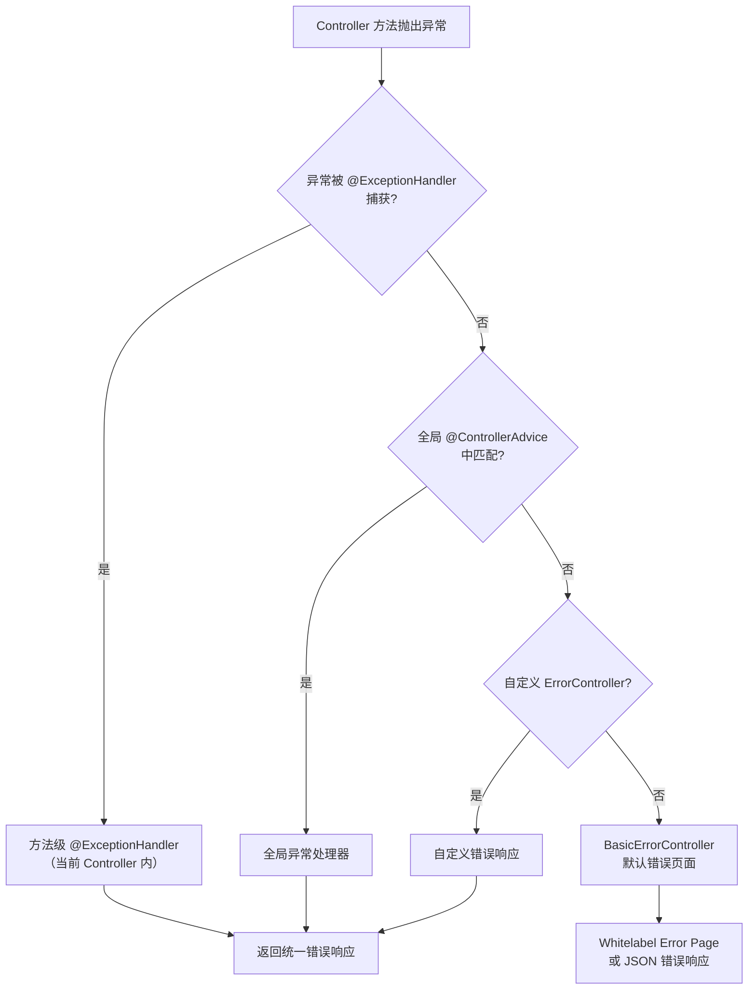

# SpringBoot 异常处理

## 概述

异常处理是应用程序健壮性的重要保障。Spring Boot 提供了灵活而强大的异常处理机制,通过合理使用全局异常处理、自定义异常和参数验证,可以构建健壮的应用程序。良好的异常处理不仅能提高用户体验,还能简化问题排查过程。

### 为什么需要统一异常处理?

在实际开发中,如果没有统一的异常处理机制,会出现以下问题:

1. **接口响应不一致**: 不同开发者返回的错误信息格式不同,前端难以统一处理
2. **敏感信息泄露**: 直接将异常堆栈信息返回给用户,存在安全风险
3. **问题排查困难**: 缺少统一的日志记录和错误码,难以快速定位问题
4. **用户体验差**: 用户看到的是技术性错误信息,而非友好的提示

### SpringBoot 异常处理体系

SpringBoot 提供了三种层次的异常处理机制:

| 处理层次 | 实现方式 | 适用场景 | 优先级 |
|---------|---------|---------|-------|
| 方法级 | `@ExceptionHandler` | 单个Controller内的异常处理 | 最高 |
| 全局级 | `@ExceptionHandler` + `@ControllerAdvice` | 全局异常处理 | 中 |
| 容器级 | `ErrorController` | 处理未捕获的异常,自定义错误页面 | 最低 |



::: tip @RestControllerAdvice vs @ControllerAdvice
- `@RestControllerAdvice` = `@ControllerAdvice` + `@ResponseBody`，用于 REST API，返回值自动序列化为 JSON
- `@ControllerAdvice` 用于传统 Web 应用，可能需要配合 `@ResponseBody` 或返回视图名称
- 现代 Spring Boot 项目几乎都是 REST API，**推荐统一使用 `@RestControllerAdvice`**
:::

::: danger 不要吞掉异常
生产环境中最危险的做法是在 catch 块中只打印日志但不抛出异常：

```java
// × 危险：吞掉异常，上层不知道出了问题
try {
    riskyOperation();
} catch (Exception e) {
    log.error("操作失败", e);  // 只记日志，异常被吞了
}

// √ 正确：记录日志后重新抛出或包装为业务异常
try {
    riskyOperation();
} catch (Exception e) {
    log.error("操作失败", e);
    throw new BusinessException("操作失败: " + e.getMessage(), e);
}
```

吞掉异常会导致数据不一致、事务未回滚、错误被静默忽略，是最常见的生产事故根因之一。
:::

---

## 一、全局异常处理

### 1.1 @ControllerAdvice 和 @ExceptionHandler 详解

#### @ControllerAdvice 注解

`@ControllerAdvice` 是一个组合注解,用于定义全局的控制器增强。它可以将异常处理、数据绑定、模型属性等逻辑集中管理。

**核心特性:**

```java
@ControllerAdvice
public class GlobalExceptionHandler {
    // 全局异常处理逻辑
}
```

**指定生效范围:**

```java
// 1. 指定包范围
@ControllerAdvice("com.example.controller")
public class PackageExceptionHandler {}

// 2. 指定注解类型
@ControllerAdvice(annotations = RestController.class)
public class AnnotationExceptionHandler {}

// 3. 指定Controller类
@ControllerAdvice(assignableTypes = {UserController.class, OrderController.class})
public class SpecificControllerExceptionHandler {}
```

#### @ExceptionHandler 注解

`@ExceptionHandler` 用于声明一个方法处理指定的异常类型。

**核心特性:**

```java
@ExceptionHandler(value = {NullPointerException.class, 
                           IllegalArgumentException.class})
public ResponseEntity<String> handleMultipleExceptions(Exception e) {
    return ResponseEntity.badRequest().body(e.getMessage());
}
```

**支持的参数类型:**

| 参数类型 | 说明 | 示例 |
|---------|------|------|
| Exception | 异常对象 | `handleException(Exception e)` |
| WebRequest | 请求上下文 | `handleRequest(WebRequest request)` |
| HttpServletRequest | HTTP请求对象 | `handleHttpRequest(HttpServletRequest request)` |
| HttpServletResponse | HTTP响应对象 | `handleHttpResponse(HttpServletResponse response)` |
| HttpSession | 会话对象 | `handleSession(HttpSession session)` |
| Locale | 地区信息 | `handleLocale(Locale locale)` |

**支持的返回值类型:**

| 返回值类型 | 说明 | 适用场景 |
|-----------|------|---------|
| ResponseEntity | 带状态码的响应实体 | RESTful API |
| ModelAndView | 视图和模型 | 传统Web应用 |
| String | 视图名称或错误消息 | 简单场景 |
| Map<String, Object> | JSON数据对象 | RESTful API |
| void | 直接操作响应对象 | 文件下载等 |

### 1.2 基本全局异常处理

#### 简单实现

```java
@ControllerAdvice
@Slf4j
public class GlobalExceptionHandler {
    
    /**
     * 处理所有未捕获的异常
     */
    @ExceptionHandler(Exception.class)
    public ResponseEntity<String> handleException(Exception e) {
        log.error("系统异常: ", e);
        return ResponseEntity.status(HttpStatus.INTERNAL_SERVER_ERROR)
                .body("服务器内部错误: " + e.getMessage());
    }
    
    /**
     * 处理业务异常
     */
    @ExceptionHandler(BusinessException.class)
    public ResponseEntity<String> handleBusinessException(BusinessException e) {
        log.warn("业务异常: {}", e.getMessage());
        return ResponseEntity.status(HttpStatus.BAD_REQUEST)
                .body(e.getMessage());
    }
    
    /**
     * 处理资源未找到异常
     */
    @ExceptionHandler(ResourceNotFoundException.class)
    public ResponseEntity<String> handleResourceNotFoundException(ResourceNotFoundException e) {
        log.warn("资源未找到: {}", e.getMessage());
        return ResponseEntity.status(HttpStatus.NOT_FOUND)
                .body(e.getMessage());
    }
}
```

### 1.3 RESTful API 异常处理

对于 RESTful API,我们需要返回统一格式的 JSON 错误信息。

#### 统一响应格式设计

```java
/**
 * 统一响应结果
 */
@Data
@NoArgsConstructor
@AllArgsConstructor
public class Result<T> {
    
    /** 状态码 */
    private Integer code;
    
    /** 提示信息 */
    private String message;
    
    /** 返回数据 */
    private T data;
    
    /** 时间戳 */
    private Long timestamp;
    
    public static <T> Result<T> success(T data) {
        return new Result<>(200, "操作成功", data, System.currentTimeMillis());
    }
    
    public static <T> Result<T> success() {
        return success(null);
    }
    
    public static <T> Result<T> error(Integer code, String message) {
        return new Result<>(code, message, null, System.currentTimeMillis());
    }
    
    public static <T> Result<T> error(String message) {
        return error(500, message);
    }
}

/**
 * 错误码枚举
 */
@Getter
@AllArgsConstructor
public enum ErrorCode {
    
    SUCCESS(200, "操作成功"),
    BAD_REQUEST(400, "请求参数错误"),
    UNAUTHORIZED(401, "未授权"),
    FORBIDDEN(403, "禁止访问"),
    NOT_FOUND(404, "资源不存在"),
    INTERNAL_ERROR(500, "服务器内部错误"),
    
    // 业务错误码 1000+
    USER_NOT_FOUND(1001, "用户不存在"),
    USER_ALREADY_EXISTS(1002, "用户已存在"),
    INVALID_PASSWORD(1003, "密码错误"),
    PRODUCT_OUT_OF_STOCK(2001, "商品库存不足"),
    ORDER_NOT_FOUND(3001, "订单不存在");
    
    private final Integer code;
    private final String message;
}
```

#### RESTful API 全局异常处理器

```java
@ControllerAdvice
@Slf4j
public class ApiExceptionHandler {
    
    /**
     * 处理业务异常
     */
    @ExceptionHandler(BusinessException.class)
    @ResponseBody
    public Result<Void> handleBusinessException(BusinessException e) {
        log.warn("业务异常: code={}, message={}", e.getCode(), e.getMessage());
        return Result.error(e.getCode(), e.getMessage());
    }
    
    /**
     * 处理参数验证异常
     */
    @ExceptionHandler(MethodArgumentNotValidException.class)
    @ResponseBody
    public Result<Map<String, String>> handleValidationException(
            MethodArgumentNotValidException e) {
        Map<String, String> errors = new HashMap<>();
        e.getBindingResult().getFieldErrors().forEach(error -> {
            String fieldName = error.getField();
            String errorMessage = error.getDefaultMessage();
            errors.put(fieldName, errorMessage);
        });
        log.warn("参数验证失败: {}", errors);
        return Result.error(ErrorCode.BAD_REQUEST.getCode(), "参数验证失败");
    }
    
    /**
     * 处理约束违反异常
     */
    @ExceptionHandler(ConstraintViolationException.class)
    @ResponseBody
    public Result<Void> handleConstraintViolationException(
            ConstraintViolationException e) {
        String message = e.getConstraintViolations().stream()
                .map(ConstraintViolation::getMessage)
                .collect(Collectors.joining(", "));
        log.warn("约束违反: {}", message);
        return Result.error(ErrorCode.BAD_REQUEST.getCode(), message);
    }
    
    /**
     * 处理 HTTP 消息不可读异常
     */
    @ExceptionHandler(HttpMessageNotReadableException.class)
    @ResponseBody
    public Result<Void> handleHttpMessageNotReadableException(
            HttpMessageNotReadableException e) {
        log.warn("请求体解析失败: {}", e.getMessage());
        return Result.error(ErrorCode.BAD_REQUEST.getCode(), "请求体格式错误");
    }
    
    /**
     * 处理请求方法不支持异常
     */
    @ExceptionHandler(HttpRequestMethodNotSupportedException.class)
    @ResponseBody
    public Result<Void> handleHttpRequestMethodNotSupportedException(
            HttpRequestMethodNotSupportedException e) {
        log.warn("不支持的请求方法: {}", e.getMethod());
        return Result.error(405, 
                "不支持的请求方法: " + e.getMethod());
    }
    
    /**
     * 处理缺少请求参数异常
     */
    @ExceptionHandler(MissingServletRequestParameterException.class)
    @ResponseBody
    public Result<Void> handleMissingServletRequestParameterException(
            MissingServletRequestParameterException e) {
        log.warn("缺少请求参数: {}", e.getParameterName());
        return Result.error(ErrorCode.BAD_REQUEST.getCode(), 
                "缺少必填参数: " + e.getParameterName());
    }
    
    /**
     * 处理类型转换异常
     */
    @ExceptionHandler(MethodArgumentTypeMismatchException.class)
    @ResponseBody
    public Result<Void> handleMethodArgumentTypeMismatchException(
            MethodArgumentTypeMismatchException e) {
        log.warn("参数类型转换失败: name={}, value={}", 
                e.getName(), e.getValue());
        return Result.error(ErrorCode.BAD_REQUEST.getCode(), 
                String.format("参数 '%s' 类型错误,期望类型: %s", 
                        e.getName(), e.getRequiredType().getSimpleName()));
    }
    
    /**
     * 处理所有未捕获的异常
     */
    @ExceptionHandler(Exception.class)
    @ResponseBody
    public Result<Void> handleException(Exception e, HttpServletRequest request) {
        log.error("系统异常: uri={}, method={}", 
                request.getRequestURI(), request.getMethod(), e);
        return Result.error(ErrorCode.INTERNAL_ERROR.getCode(), 
                "系统繁忙,请稍后重试");
    }
}
```

---

## 二、自定义异常设计

### 2.1 异常体系架构设计

合理的异常体系设计是异常处理的基础。建议按照业务领域和异常类型进行分类。

```
Throwable
└── Exception
    └── RuntimeException
        └── BusinessException (业务异常基类)
            ├── UserException (用户相关异常)
            │   ├── UserNotFoundException
            │   ├── UserAlreadyExistsException
            │   └── InvalidPasswordException
            ├── ProductException (商品相关异常)
            │   ├── ProductNotFoundException
            │   └── ProductOutOfStockException
            └── OrderException (订单相关异常)
                ├── OrderNotFoundException
                └── OrderStatusException
```

### 2.2 业务异常基类设计

```java
/**
 * 业务异常基类
 */
@Getter
public class BusinessException extends RuntimeException {
    
    /** 错误码 */
    private final Integer code;
    
    /** 错误消息 */
    private final String message;
    
    /** 详细错误信息 */
    private final String detail;
    
    public BusinessException(Integer code, String message) {
        super(message);
        this.code = code;
        this.message = message;
        this.detail = null;
    }
    
    public BusinessException(Integer code, String message, String detail) {
        super(message);
        this.code = code;
        this.message = message;
        this.detail = detail;
    }
    
    public BusinessException(Integer code, String message, Throwable cause) {
        super(message, cause);
        this.code = code;
        this.message = message;
        this.detail = cause.getMessage();
    }
    
    /**
     * 使用错误码枚举创建异常
     */
    public BusinessException(ErrorCode errorCode) {
        super(errorCode.getMessage());
        this.code = errorCode.getCode();
        this.message = errorCode.getMessage();
        this.detail = null;
    }
    
    public BusinessException(ErrorCode errorCode, String detail) {
        super(errorCode.getMessage());
        this.code = errorCode.getCode();
        this.message = errorCode.getMessage();
        this.detail = detail;
    }
}
```

### 2.3 具体业务异常示例

#### 用户相关异常

```java
/**
 * 用户不存在异常
 */
public class UserNotFoundException extends BusinessException {
    
    public UserNotFoundException(Long userId) {
        super(ErrorCode.USER_NOT_FOUND, 
              String.format("用户ID: %d", userId));
    }
    
    public UserNotFoundException(String username) {
        super(ErrorCode.USER_NOT_FOUND, 
              String.format("用户名: %s", username));
    }
}

/**
 * 用户已存在异常
 */
public class UserAlreadyExistsException extends BusinessException {
    
    public UserAlreadyExistsException(String username) {
        super(ErrorCode.USER_ALREADY_EXISTS, 
              String.format("用户名: %s", username));
    }
}

/**
 * 密码错误异常
 */
public class InvalidPasswordException extends BusinessException {
    
    public InvalidPasswordException() {
        super(ErrorCode.INVALID_PASSWORD);
    }
    
    public InvalidPasswordException(String message) {
        super(ErrorCode.INVALID_PASSWORD.getCode(), message);
    }
}
```

#### 商品相关异常

```java
/**
 * 商品库存不足异常
 */
public class ProductOutOfStockException extends BusinessException {
    
    public ProductOutOfStockException(Long productId, Integer required, Integer available) {
        super(ErrorCode.PRODUCT_OUT_OF_STOCK, 
              String.format("商品ID: %d, 需要: %d, 库存: %d", 
                           productId, required, available));
    }
}
```

### 2.4 异常使用示例

```java
@Service
@Slf4j
public class UserServiceImpl implements UserService {
    
    @Autowired
    private UserMapper userMapper;
    
    @Override
    public User getUserById(Long userId) {
        User user = userMapper.selectById(userId);
        if (user == null) {
            throw new UserNotFoundException(userId);
        }
        return user;
    }
    
    @Override
    @Transactional(rollbackFor = Exception.class)
    public void register(UserDto userDto) {
        // 检查用户名是否已存在
        User existingUser = userMapper.selectByUsername(userDto.getUsername());
        if (existingUser != null) {
            throw new UserAlreadyExistsException(userDto.getUsername());
        }
        
        // 创建用户
        User user = new User();
        user.setUsername(userDto.getUsername());
        user.setPassword(encryptPassword(userDto.getPassword()));
        userMapper.insert(user);
        
        log.info("用户注册成功: username={}", userDto.getUsername());
    }
    
    @Override
    public User login(String username, String password) {
        User user = userMapper.selectByUsername(username);
        if (user == null) {
            throw new UserNotFoundException(username);
        }
        
        if (!verifyPassword(password, user.getPassword())) {
            throw new InvalidPasswordException();
        }
        
        return user;
    }
}
```

---

## 三、参数验证异常处理

### 3.1 参数验证注解

Spring Boot 结合 `jakarta.validation`（Boot 2.x 为 `javax.validation`，3.x 起迁移到 jakarta 命名空间）提供了强大的参数验证功能。

#### 常用验证注解

| 注解 | 说明 | 示例 |
|------|------|------|
| `@NotNull` | 不能为 null | `@NotNull(message = "用户ID不能为空")` |
| `@NotEmpty` | 不能为空(字符串、集合) | `@NotEmpty(message = "用户名不能为空")` |
| `@NotBlank` | 不能为空白字符串 | `@NotBlank(message = "姓名不能为空")` |
| `@Size` | 长度范围 | `@Size(min = 6, max = 20, message = "密码长度6-20位")` |
| `@Min` | 最小值 | `@Min(value = 1, message = "年龄不能小于1岁")` |
| `@Max` | 最大值 | `@Max(value = 120, message = "年龄不能超过120岁")` |
| `@Pattern` | 正则表达式 | `@Pattern(regexp = "^1[3-9]\\d{9}$", message = "手机号格式错误")` |
| `@Email` | 邮箱格式 | `@Email(message = "邮箱格式错误")` |
| `@Past` | 过去日期 | `@Past(message = "出生日期必须是过去日期")` |
| `@Future` | 未来日期 | `@Future(message = "过期日期必须是未来日期")` |

### 3.2 参数验证示例

#### DTO 参数验证

```java
@Data
public class UserDto {
    
    @NotBlank(message = "用户名不能为空")
    @Size(min = 4, max = 20, message = "用户名长度4-20位")
    @Pattern(regexp = "^[a-zA-Z0-9_]+$", message = "用户名只能包含字母、数字、下划线")
    private String username;
    
    @NotBlank(message = "密码不能为空")
    @Size(min = 6, max = 20, message = "密码长度6-20位")
    private String password;
    
    @NotBlank(message = "邮箱不能为空")
    @Email(message = "邮箱格式错误")
    private String email;
    
    @Pattern(regexp = "^1[3-9]\\d{9}$", message = "手机号格式错误")
    private String phone;
    
    @Min(value = 1, message = "年龄不能小于1岁")
    @Max(value = 120, message = "年龄不能超过120岁")
    private Integer age;
    
    @Past(message = "出生日期必须是过去日期")
    private Date birthday;
}
```

#### Controller 参数验证

```java
@RestController
@RequestMapping("/api/users")
@Validated
public class UserController {
    
    /**
     * 请求体参数验证
     */
    @PostMapping
    public Result<User> createUser(@Valid @RequestBody UserDto userDto) {
        User user = userService.createUser(userDto);
        return Result.success(user);
    }
    
    /**
     * 路径参数验证
     */
    @GetMapping("/{userId}")
    public Result<User> getUserById(
            @PathVariable @Min(value = 1, message = "用户ID必须大于0") Long userId) {
        User user = userService.getUserById(userId);
        return Result.success(user);
    }
    
    /**
     * 查询参数验证
     */
    @GetMapping("/search")
    public Result<List<User>> searchUsers(
            @RequestParam @NotBlank(message = "关键词不能为空") String keyword,
            @RequestParam(defaultValue = "1") @Min(value = 1, message = "页码必须大于0") Integer page,
            @RequestParam(defaultValue = "10") @Min(value = 1, message = "每页数量必须大于0") Integer size) {
        List<User> users = userService.searchUsers(keyword, page, size);
        return Result.success(users);
    }
}
```

### 3.3 参数验证异常处理

```java
@ControllerAdvice
@Slf4j
public class ValidationExceptionHandler {
    
    /**
     * 处理请求体参数验证异常
     */
    @ExceptionHandler(MethodArgumentNotValidException.class)
    @ResponseBody
    public Result<Map<String, String>> handleMethodArgumentNotValidException(
            MethodArgumentNotValidException e) {
        Map<String, String> errors = new LinkedHashMap<>();
        e.getBindingResult().getAllErrors().forEach(error -> {
            String fieldName = ((FieldError) error).getField();
            String errorMessage = error.getDefaultMessage();
            errors.put(fieldName, errorMessage);
        });
        log.warn("参数验证失败: {}", errors);
        return new Result<>(400, "参数验证失败", errors, System.currentTimeMillis());
    }
    
    /**
     * 处理单个参数验证异常(路径参数、查询参数)
     */
    @ExceptionHandler(ConstraintViolationException.class)
    @ResponseBody
    public Result<List<String>> handleConstraintViolationException(
            ConstraintViolationException e) {
        List<String> errors = e.getConstraintViolations().stream()
                .map(violation -> violation.getPropertyPath() + ": " + violation.getMessage())
                .collect(Collectors.toList());
        log.warn("参数验证失败: {}", errors);
        return new Result<>(400, "参数验证失败", errors, System.currentTimeMillis());
    }
    
    /**
     * 处理绑定异常
     */
    @ExceptionHandler(BindException.class)
    @ResponseBody
    public Result<Map<String, String>> handleBindException(BindException e) {
        Map<String, String> errors = new LinkedHashMap<>();
        e.getBindingResult().getAllErrors().forEach(error -> {
            String fieldName = ((FieldError) error).getField();
            String errorMessage = error.getDefaultMessage();
            errors.put(fieldName, errorMessage);
        });
        log.warn("参数绑定失败: {}", errors);
        return new Result<>(400, "参数绑定失败", errors, System.currentTimeMillis());
    }
}
```

---

## 四、异常处理最佳实践

### 4.1 分层异常处理

不同层次的异常应该有不同的处理方式:

```java
/**
 * 控制器层异常处理 - 处理HTTP相关异常
 */
@ControllerAdvice
@Slf4j
public class ControllerExceptionHandler {
    
    // 处理请求参数异常
    // 处理请求方法异常
    // 处理媒体类型异常
}

/**
 * 服务层异常 - 抛出业务异常
 */
@Service
public class UserServiceImpl {
    
    public User getUserById(Long userId) {
        User user = userMapper.selectById(userId);
        if (user == null) {
            throw new UserNotFoundException(userId);  // 业务异常
        }
        return user;
    }
}

/**
 * 数据访问层异常 - 转换为业务异常
 */
@Repository
public class UserDaoImpl {
    
    public User selectById(Long userId) {
        try {
            return jdbcTemplate.queryForObject(sql, userRowMapper, userId);
        } catch (EmptyResultDataAccessException e) {
            return null;  // 数据层不抛异常,由服务层判断
        }
    }
}
```

### 4.2 异常日志记录

#### 基本日志记录

```java
@ControllerAdvice
@Slf4j
public class GlobalExceptionHandler {
    
    @ExceptionHandler(Exception.class)
    public ResponseEntity<String> handleException(Exception e, 
                                                   HttpServletRequest request) {
        // 记录详细的错误日志
        log.error("系统异常 - URI: {}, Method: {}, Params: {}", 
                request.getRequestURI(),
                request.getMethod(),
                JSON.toJSONString(request.getParameterMap()),
                e);
        
        return ResponseEntity.status(HttpStatus.INTERNAL_SERVER_ERROR)
                .body("系统繁忙,请稍后重试");
    }
}
```

#### 使用 MDC 记录请求追踪信息

```java
@Component
@Slf4j
public class RequestTraceFilter extends OncePerRequestFilter {
    
    @Override
    protected void doFilterInternal(HttpServletRequest request, 
                                     HttpServletResponse response, 
                                     FilterChain filterChain) 
            throws ServletException, IOException {
        
        String traceId = request.getHeader("X-Trace-Id");
        if (StringUtils.isEmpty(traceId)) {
            traceId = UUID.randomUUID().toString().replace("-", "");
        }
        
        MDC.put("traceId", traceId);
        MDC.put("uri", request.getRequestURI());
        MDC.put("method", request.getMethod());
        
        try {
            filterChain.doFilter(request, response);
        } finally {
            MDC.clear();
        }
    }
}

// 日志配置(logback-spring.xml)
/*
<appender name="FILE" class="ch.qos.logback.core.rolling.RollingFileAppender">
    <file>logs/application.log</file>
    <encoder>
        <pattern>%d{yyyy-MM-dd HH:mm:ss.SSS} [%X{traceId}] [%thread] %-5level %logger{50} - %msg%n</pattern>
    </encoder>
</appender>
*/
```

### 4.3 异常信息国际化

```java
@ControllerAdvice
public class InternationalizedExceptionHandler {
    
    @Autowired
    private MessageSource messageSource;
    
    @ExceptionHandler(BusinessException.class)
    @ResponseBody
    public Result<Void> handleBusinessException(
            BusinessException e, Locale locale) {
        
        // 获取国际化错误消息
        String message = messageSource.getMessage(
                "error." + e.getCode(), 
                null, 
                e.getMessage(), 
                locale);
        
        return Result.error(e.getCode(), message);
    }
}

// messages.properties (默认)
// error.1001=用户不存在
// error.1002=用户已存在
// error.1003=密码错误

// messages_en_US.properties (英文)
// error.1001=User not found
// error.1002=User already exists
// error.1003=Invalid password

// messages_zh_CN.properties (中文)
// error.1001=用户不存在
// error.1002=用户已存在
// error.1003=密码错误
```

### 4.4 异常处理与事务

```java
@Service
@Slf4j
public class OrderServiceImpl implements OrderService {
    
    @Autowired
    private OrderMapper orderMapper;
    
    @Autowired
    private ProductMapper productMapper;
    
    /**
     * 创建订单
     * 
     * 注意: 默认情况下,只有 RuntimeException 和 Error 会导致事务回滚
     * 如果需要让检查异常也触发回滚,需要使用 rollbackFor 属性
     */
    @Transactional(rollbackFor = Exception.class)
    public Order createOrder(OrderDto orderDto) {
        // 1. 检查商品库存
        Product product = productMapper.selectById(orderDto.getProductId());
        if (product == null) {
            throw new ProductNotFoundException(orderDto.getProductId());
        }
        
        if (product.getStock() < orderDto.getQuantity()) {
            throw new ProductOutOfStockException(
                    product.getId(), 
                    orderDto.getQuantity(), 
                    product.getStock());
        }
        
        // 2. 创建订单
        Order order = new Order();
        order.setUserId(orderDto.getUserId());
        order.setProductId(orderDto.getProductId());
        order.setQuantity(orderDto.getQuantity());
        order.setTotalPrice(product.getPrice().multiply(new BigDecimal(orderDto.getQuantity())));
        order.setStatus(OrderStatus.CREATED);
        orderMapper.insert(order);
        
        // 3. 扣减库存
        productMapper.decreaseStock(product.getId(), orderDto.getQuantity());
        
        log.info("订单创建成功: orderId={}", order.getId());
        return order;
    }
    
    /**
     * 异常不影响事务的场景
     */
    @Transactional(rollbackFor = Exception.class, noRollbackFor = BusinessWarningException.class)
    public void processData(Long dataId) {
        // 正常业务逻辑
        // ...
        
        // 某些不影响整体事务的警告,可以不回滚
        if (someCondition) {
            throw new BusinessWarningException("数据可能不准确");
        }
    }
}
```

### 4.5 异步处理中的异常

#### 异步方法异常处理

```java
@Service
@Slf4j
public class AsyncService {
    
    /**
     * 异步方法返回 CompletableFuture
     */
    @Async
    public CompletableFuture<String> asyncMethodWithException() {
        try {
            // 异步操作
            Thread.sleep(1000);
            return CompletableFuture.completedFuture("操作成功");
        } catch (Exception e) {
            log.error("异步操作失败", e);
            return CompletableFuture.failedFuture(e);
        }
    }
    
    /**
     * 使用 AsyncUncaughtExceptionHandler 处理异步异常
     */
    @Async
    public void asyncVoidMethod() {
        // 这个方法抛出的异常会被 AsyncUncaughtExceptionHandler 捕获
        throw new BusinessException("异步操作失败");
    }
}

/**
 * 异步异常处理器配置
 */
@Configuration
@EnableAsync
public class AsyncConfig implements AsyncConfigurer {
    
    @Override
    public AsyncUncaughtExceptionHandler getAsyncUncaughtExceptionHandler() {
        return new CustomAsyncExceptionHandler();
    }
}

/**
 * 自定义异步异常处理器
 */
@Slf4j
public class CustomAsyncExceptionHandler implements AsyncUncaughtExceptionHandler {
    
    @Override
    public void handleUncaughtException(Throwable ex, Method method, Object... params) {
        log.error("异步方法执行异常 - Method: {}, Params: {}", 
                method.getName(), 
                Arrays.toString(params), 
                ex);
        
        // 可以在这里添加告警通知等逻辑
        // alertService.sendAlert(ex.getMessage());
    }
}
```

---

## 五、Spring Boot 默认错误处理

### 5.1 默认错误处理机制

Spring Boot 提供了一个默认的错误处理机制,当应用程序抛出未处理的异常时,会自动跳转到 `/error` 路径。

#### 默认错误响应格式

```json
{
    "timestamp": "2024-03-30T12:00:00.000+00:00",
    "status": 500,
    "error": "Internal Server Error",
    "message": "服务器内部错误",
    "path": "/api/users"
}
```

> 注：Boot 2.3+ 默认不再返回 `message` 字段，需设置 `server.error.include-message=always` 才会包含。

### 5.2 自定义错误页面

#### HTML 错误页面

在 `src/main/resources/templates/error/` 目录下创建 HTML 文件:

```
src/main/resources/templates/error/
├── 404.html        # 404错误页面
├── 500.html        # 500错误页面
└── error.html      # 通用错误页面
```

**404.html 示例:**

```html
<!DOCTYPE html>
<html xmlns:th="http://www.thymeleaf.org">
<head>
    <title>页面未找到</title>
    <style>
        body {
            font-family: Arial, sans-serif;
            text-align: center;
            padding: 50px;
        }
        .error-code {
            font-size: 72px;
            color: #ff6b6b;
        }
        .error-message {
            font-size: 24px;
            color: #666;
            margin-top: 20px;
        }
        .back-link {
            margin-top: 30px;
        }
    </style>
</head>
<body>
    <div class="error-code">404</div>
    <div class="error-message">抱歉,您访问的页面不存在</div>
    <div class="back-link">
        <a href="/">返回首页</a>
    </div>
</body>
</html>
```

### 5.3 自定义 ErrorAttributes

```java
@Component
public class CustomErrorAttributes extends DefaultErrorAttributes {
    
    @Override
    public Map<String, Object> getErrorAttributes(
            WebRequest webRequest, ErrorAttributeOptions options) {
        
        Map<String, Object> errorAttributes = super.getErrorAttributes(webRequest, options);
        
        // 移除敏感信息
        errorAttributes.remove("trace");
        
        // 添加自定义错误属性
        errorAttributes.put("timestamp", System.currentTimeMillis());
        errorAttributes.put("application", "MyApp v1.0.0");
        
        // 获取异常对象
        Throwable error = getError(webRequest);
        if (error instanceof BusinessException) {
            BusinessException be = (BusinessException) error;
            errorAttributes.put("code", be.getCode());
            errorAttributes.put("detail", be.getDetail());
        }
        
        return errorAttributes;
    }
}
```

### 5.4 自定义 ErrorController

```java
@RestController
public class CustomErrorController implements ErrorController {
    
    @Autowired
    private ErrorAttributes errorAttributes;
    
    @RequestMapping("/error")
    public Result<Map<String, Object>> handleError(HttpServletRequest request) {
        WebRequest webRequest = new ServletWebRequest(request);
        Map<String, Object> errorAttributes = this.errorAttributes.getErrorAttributes(
                webRequest, 
                ErrorAttributeOptions.defaults());
        
        Integer status = (Integer) errorAttributes.get("status");
        String message = (String) errorAttributes.get("message");
        
        // 根据状态码返回不同的错误信息
        if (status == 404) {
            return Result.error(404, "资源不存在");
        } else if (status == 403) {
            return Result.error(403, "禁止访问");
        } else {
            return Result.error(status, "服务器内部错误");
        }
    }
}
```

---

## 六、完整实战案例:统一异常处理

### 6.1 项目结构

```
src/main/java/com/example/
├── common/
│   ├── exception/
│   │   ├── BusinessException.java
│   │   ├── UserNotFoundException.java
│   │   ├── ProductNotFoundException.java
│   │   └── GlobalExceptionHandler.java
│   ├── result/
│   │   ├── Result.java
│   │   └── ErrorCode.java
│   └── enums/
│       └── StatusEnum.java
├── controller/
│   └── UserController.java
├── service/
│   ├── UserService.java
│   └── impl/UserServiceImpl.java
└── Application.java
```

### 6.2 完整代码实现

#### ErrorCode.java

```java
package com.example.common.result;

import lombok.AllArgsConstructor;
import lombok.Getter;

@Getter
@AllArgsConstructor
public enum ErrorCode {
    
    // 系统级错误码
    SUCCESS(200, "操作成功"),
    BAD_REQUEST(400, "请求参数错误"),
    UNAUTHORIZED(401, "未授权"),
    FORBIDDEN(403, "禁止访问"),
    NOT_FOUND(404, "资源不存在"),
    INTERNAL_ERROR(500, "服务器内部错误"),
    
    // 用户模块错误码 1000-1999
    USER_NOT_FOUND(1001, "用户不存在"),
    USER_ALREADY_EXISTS(1002, "用户已存在"),
    INVALID_PASSWORD(1003, "密码错误"),
    INVALID_USERNAME(1004, "用户名格式错误"),
    ACCOUNT_DISABLED(1005, "账户已禁用"),
    
    // 商品模块错误码 2000-2999
    PRODUCT_NOT_FOUND(2001, "商品不存在"),
    PRODUCT_OUT_OF_STOCK(2002, "商品库存不足"),
    PRODUCT_ALREADY_OFFLINE(2003, "商品已下架"),
    
    // 订单模块错误码 3000-3999
    ORDER_NOT_FOUND(3001, "订单不存在"),
    ORDER_STATUS_ERROR(3002, "订单状态错误"),
    ORDER_ALREADY_PAID(3003, "订单已支付");
    
    private final Integer code;
    private final String message;
}
```

#### Result.java

```java
package com.example.common.result;

import lombok.AllArgsConstructor;
import lombok.Data;
import lombok.NoArgsConstructor;

@Data
@NoArgsConstructor
@AllArgsConstructor
public class Result<T> {
    
    private Integer code;
    private String message;
    private T data;
    private Long timestamp;
    
    public static <T> Result<T> success() {
        return success(null);
    }
    
    public static <T> Result<T> success(T data) {
        return new Result<>(200, "操作成功", data, System.currentTimeMillis());
    }
    
    public static <T> Result<T> error(Integer code, String message) {
        return new Result<>(code, message, null, System.currentTimeMillis());
    }
    
    public static <T> Result<T> error(ErrorCode errorCode) {
        return error(errorCode.getCode(), errorCode.getMessage());
    }
}
```

#### BusinessException.java

```java
package com.example.common.exception;

import com.example.common.result.ErrorCode;
import lombok.Getter;

@Getter
public class BusinessException extends RuntimeException {
    
    private final Integer code;
    private final String message;
    private final String detail;
    
    public BusinessException(Integer code, String message) {
        super(message);
        this.code = code;
        this.message = message;
        this.detail = null;
    }
    
    public BusinessException(Integer code, String message, String detail) {
        super(message);
        this.code = code;
        this.message = message;
        this.detail = detail;
    }
    
    public BusinessException(ErrorCode errorCode) {
        super(errorCode.getMessage());
        this.code = errorCode.getCode();
        this.message = errorCode.getMessage();
        this.detail = null;
    }
    
    public BusinessException(ErrorCode errorCode, String detail) {
        super(errorCode.getMessage());
        this.code = errorCode.getCode();
        this.message = errorCode.getMessage();
        this.detail = detail;
    }
}
```

#### UserNotFoundException.java

```java
package com.example.common.exception;

import com.example.common.result.ErrorCode;

public class UserNotFoundException extends BusinessException {
    
    public UserNotFoundException(Long userId) {
        super(ErrorCode.USER_NOT_FOUND, String.format("用户ID: %d", userId));
    }
    
    public UserNotFoundException(String username) {
        super(ErrorCode.USER_NOT_FOUND, String.format("用户名: %s", username));
    }
}
```

#### GlobalExceptionHandler.java

```java
package com.example.common.exception;

import com.example.common.result.ErrorCode;
import com.example.common.result.Result;
import lombok.extern.slf4j.Slf4j;
import org.springframework.http.HttpStatus;
import org.springframework.http.converter.HttpMessageNotReadableException;
import org.springframework.validation.BindException;
import org.springframework.validation.FieldError;
import org.springframework.web.HttpRequestMethodNotSupportedException;
import org.springframework.web.bind.MethodArgumentNotValidException;
import org.springframework.web.bind.MissingServletRequestParameterException;
import org.springframework.web.bind.annotation.ExceptionHandler;
import org.springframework.web.bind.annotation.ResponseStatus;
import org.springframework.web.bind.annotation.RestControllerAdvice;
import org.springframework.web.method.annotation.MethodArgumentTypeMismatchException;
import org.springframework.web.servlet.NoHandlerFoundException;

import jakarta.servlet.http.HttpServletRequest;
import jakarta.validation.ConstraintViolation;
import jakarta.validation.ConstraintViolationException;
import java.util.LinkedHashMap;
import java.util.List;
import java.util.Map;
import java.util.stream.Collectors;

@Slf4j
@RestControllerAdvice
public class GlobalExceptionHandler {
    
    /**
     * 处理业务异常
     */
    @ExceptionHandler(BusinessException.class)
    @ResponseStatus(HttpStatus.OK)
    public Result<Void> handleBusinessException(BusinessException e, HttpServletRequest request) {
        log.warn("业务异常 - URI: {}, Code: {}, Message: {}", 
                request.getRequestURI(), e.getCode(), e.getMessage());
        return Result.error(e.getCode(), e.getMessage());
    }
    
    /**
     * 处理参数验证异常(请求体)
     */
    @ExceptionHandler(MethodArgumentNotValidException.class)
    @ResponseStatus(HttpStatus.BAD_REQUEST)
    public Result<Map<String, String>> handleMethodArgumentNotValidException(
            MethodArgumentNotValidException e, HttpServletRequest request) {
        Map<String, String> errors = new LinkedHashMap<>();
        e.getBindingResult().getFieldErrors().forEach(error -> {
            String fieldName = error.getField();
            String errorMessage = error.getDefaultMessage();
            errors.put(fieldName, errorMessage);
        });
        log.warn("参数验证失败 - URI: {}, Errors: {}", request.getRequestURI(), errors);
        return new Result<>(400, "参数验证失败", errors, System.currentTimeMillis());
    }
    
    /**
     * 处理参数验证异常(路径参数、查询参数)
     */
    @ExceptionHandler(ConstraintViolationException.class)
    @ResponseStatus(HttpStatus.BAD_REQUEST)
    public Result<List<String>> handleConstraintViolationException(
            ConstraintViolationException e, HttpServletRequest request) {
        List<String> errors = e.getConstraintViolations().stream()
                .map(violation -> violation.getPropertyPath() + ": " + violation.getMessage())
                .collect(Collectors.toList());
        log.warn("约束违反 - URI: {}, Errors: {}", request.getRequestURI(), errors);
        return new Result<>(400, "参数验证失败", errors, System.currentTimeMillis());
    }
    
    /**
     * 处理参数绑定异常
     */
    @ExceptionHandler(BindException.class)
    @ResponseStatus(HttpStatus.BAD_REQUEST)
    public Result<Map<String, String>> handleBindException(
            BindException e, HttpServletRequest request) {
        Map<String, String> errors = new LinkedHashMap<>();
        e.getBindingResult().getFieldErrors().forEach(error -> {
            String fieldName = error.getField();
            String errorMessage = error.getDefaultMessage();
            errors.put(fieldName, errorMessage);
        });
        log.warn("参数绑定失败 - URI: {}, Errors: {}", request.getRequestURI(), errors);
        return new Result<>(400, "参数绑定失败", errors, System.currentTimeMillis());
    }
    
    /**
     * 处理缺少请求参数异常
     */
    @ExceptionHandler(MissingServletRequestParameterException.class)
    @ResponseStatus(HttpStatus.BAD_REQUEST)
    public Result<Void> handleMissingServletRequestParameterException(
            MissingServletRequestParameterException e, HttpServletRequest request) {
        log.warn("缺少请求参数 - URI: {}, Param: {}", request.getRequestURI(), e.getParameterName());
        return Result.error(ErrorCode.BAD_REQUEST.getCode(), 
                "缺少必填参数: " + e.getParameterName());
    }
    
    /**
     * 处理参数类型转换异常
     */
    @ExceptionHandler(MethodArgumentTypeMismatchException.class)
    @ResponseStatus(HttpStatus.BAD_REQUEST)
    public Result<Void> handleMethodArgumentTypeMismatchException(
            MethodArgumentTypeMismatchException e, HttpServletRequest request) {
        log.warn("参数类型转换失败 - URI: {}, Name: {}, Value: {}", 
                request.getRequestURI(), e.getName(), e.getValue());
        String message = String.format("参数 '%s' 类型错误,期望类型: %s", 
                e.getName(), e.getRequiredType().getSimpleName());
        return Result.error(ErrorCode.BAD_REQUEST.getCode(), message);
    }
    
    /**
     * 处理请求体解析异常
     */
    @ExceptionHandler(HttpMessageNotReadableException.class)
    @ResponseStatus(HttpStatus.BAD_REQUEST)
    public Result<Void> handleHttpMessageNotReadableException(
            HttpMessageNotReadableException e, HttpServletRequest request) {
        log.warn("请求体解析失败 - URI: {}, Error: {}", request.getRequestURI(), e.getMessage());
        return Result.error(ErrorCode.BAD_REQUEST.getCode(), "请求体格式错误");
    }
    
    /**
     * 处理请求方法不支持异常
     */
    @ExceptionHandler(HttpRequestMethodNotSupportedException.class)
    @ResponseStatus(HttpStatus.METHOD_NOT_ALLOWED)
    public Result<Void> handleHttpRequestMethodNotSupportedException(
            HttpRequestMethodNotSupportedException e, HttpServletRequest request) {
        log.warn("不支持的请求方法 - URI: {}, Method: {}", request.getRequestURI(), e.getMethod());
        return Result.error(405, 
                "不支持的请求方法: " + e.getMethod());
    }
    
    /**
     * 处理404异常
     */
    @ExceptionHandler(NoHandlerFoundException.class)
    @ResponseStatus(HttpStatus.NOT_FOUND)
    public Result<Void> handleNoHandlerFoundException(
            NoHandlerFoundException e, HttpServletRequest request) {
        log.warn("资源未找到 - URI: {}", request.getRequestURI());
        return Result.error(ErrorCode.NOT_FOUND);
    }
    
    /**
     * 处理所有未捕获的异常
     */
    @ExceptionHandler(Exception.class)
    @ResponseStatus(HttpStatus.INTERNAL_SERVER_ERROR)
    public Result<Void> handleException(Exception e, HttpServletRequest request) {
        log.error("系统异常 - URI: {}, Method: {}", 
                request.getRequestURI(), request.getMethod(), e);
        return Result.error(ErrorCode.INTERNAL_ERROR.getCode(), "系统繁忙,请稍后重试");
    }
}
```

#### UserController.java

```java
package com.example.controller;

import com.example.common.result.Result;
import com.example.service.UserService;
import org.springframework.beans.factory.annotation.Autowired;
import org.springframework.validation.annotation.Validated;
import org.springframework.web.bind.annotation.*;

import jakarta.validation.Valid;
import jakarta.validation.constraints.Min;
import jakarta.validation.constraints.NotBlank;

@RestController
@RequestMapping("/api/users")
@Validated
public class UserController {
    
    @Autowired
    private UserService userService;
    
    @GetMapping("/{userId}")
    public Result<?> getUserById(
            @PathVariable @Min(value = 1, message = "用户ID必须大于0") Long userId) {
        return Result.success(userService.getUserById(userId));
    }
    
    @GetMapping("/search")
    public Result<?> searchUsers(
            @RequestParam @NotBlank(message = "关键词不能为空") String keyword) {
        return Result.success(userService.searchUsers(keyword));
    }
}
```

### 6.3 测试验证

#### 测试场景

```bash
# 1. 正常请求
curl http://localhost:8080/api/users/1
# 返回: {"code":200,"message":"操作成功","data":{...},"timestamp":...}

# 2. 用户不存在
curl http://localhost:8080/api/users/999
# 返回: {"code":1001,"message":"用户不存在","data":null,"timestamp":...}

# 3. 参数验证失败
curl http://localhost:8080/api/users/0
# 返回: {"code":400,"message":"参数验证失败","data":{"userId":"用户ID必须大于0"},"timestamp":...}

# 4. 缺少必填参数
curl http://localhost:8080/api/users/search
# 返回: {"code":400,"message":"缺少必填参数: keyword","data":null,"timestamp":...}
```

---

## 七、常见误区与注意事项

### 7.1 常见误区

#### 误区1: 直接返回异常堆栈信息

**错误做法:**

```java
@ExceptionHandler(Exception.class)
public ResponseEntity<String> handleException(Exception e) {
    return ResponseEntity.status(500).body(e.getMessage());
    // 问题: 可能泄露敏感信息,如数据库连接信息、文件路径等
}
```

**正确做法:**

```java
@ExceptionHandler(Exception.class)
public ResponseEntity<String> handleException(Exception e, HttpServletRequest request) {
    log.error("系统异常 - URI: {}", request.getRequestURI(), e);
    return ResponseEntity.status(500).body("系统繁忙,请稍后重试");
    // 仅返回友好的错误提示,敏感信息仅记录在日志中
}
```

#### 误区2: 空catch块吞掉异常

**错误做法:**

```java
try {
    // 业务逻辑
} catch (Exception e) {
    // 什么都不做,异常被吞掉
}
```

**正确做法:**

```java
try {
    // 业务逻辑
} catch (Exception e) {
    log.error("操作失败", e);
    throw new BusinessException("操作失败: " + e.getMessage(), e);
    // 记录日志并重新抛出异常
}
```

#### 误区3: 使用异常控制业务流程

**错误做法:**

```java
public User login(String username, String password) {
    try {
        User user = userService.getUserByUsername(username);
        return user;
    } catch (UserNotFoundException e) {
        // 使用异常来控制业务流程
        return null;
    }
}
```

**正确做法:**

```java
public User login(String username, String password) {
    User user = userService.getUserByUsername(username);
    if (user == null) {
        throw new UserNotFoundException(username);
    }
    // 继续验证密码
    return user;
}
```

#### 误区4: 过度细化异常类型

**错误做法:**

```java
public class UserException extends BusinessException {
    public static class UserNameEmptyException extends UserException {}
    public static class UserNameTooShortException extends UserException {}
    public static class UserNameTooLongException extends UserException {}
    public static class UserNameInvalidCharacterException extends UserException {}
    // 过度细化,导致异常类爆炸
}
```

**正确做法:**

```java
public class UserException extends BusinessException {
    public UserException(String message) {
        super(ErrorCode.BAD_REQUEST.getCode(), message);
    }
}

// 使用统一的异常类,通过消息区分不同情况
if (StringUtils.isEmpty(username)) {
    throw new UserException("用户名不能为空");
}
if (username.length() < 4) {
    throw new UserException("用户名长度不能小于4位");
}
```

#### 误区5: 不区分异常级别

**错误做法:**

```java
@ExceptionHandler(Exception.class)
public void handleException(Exception e) {
    log.error("异常", e);  // 所有异常都用 error 级别
}
```

**正确做法:**

```java
@ExceptionHandler(Exception.class)
public void handleException(Exception e) {
    if (e instanceof BusinessException) {
        log.warn("业务异常: {}", e.getMessage());  // 业务异常用 warn
    } else {
        log.error("系统异常", e);  // 系统异常用 error
    }
}
```

### 7.2 注意事项

#### 1. 异常处理的优先级

```java
// 优先级: 方法级 > Controller级 > 全局级

@RestController
public class UserController {
    
    // 方法级异常处理(优先级最高)
    @ExceptionHandler(UserNotFoundException.class)
    public Result<Void> handleUserNotFound(UserNotFoundException e) {
        return Result.error(404, "用户不存在(局部处理)");
    }
}

@ControllerAdvice
public class GlobalExceptionHandler {
    
    // 全局异常处理(优先级低)
    @ExceptionHandler(UserNotFoundException.class)
    public Result<Void> handleUserNotFound(UserNotFoundException e) {
        return Result.error(404, "用户不存在(全局处理)");
    }
}
```

#### 2. 事务与异常处理的关系

```java
@Service
public class UserServiceImpl implements UserService {
    
    /**
     * 注意: 默认情况下,只有 RuntimeException 和 Error 会导致事务回滚
     */
    @Transactional
    public void updateUser(User user) {
        userMapper.update(user);
        
        // RuntimeException 会回滚
        throw new RuntimeException("运行时异常");
    }
    
    @Transactional(rollbackFor = Exception.class)
    public void updateUser2(User user) throws IOException {
        userMapper.update(user);
        
        // 检查异常,需要指定 rollbackFor 才能回滚
        throw new IOException("IO异常");
    }
}
```

#### 3. 异步方法的异常处理

```java
@Service
public class AsyncService {
    
    /**
     * 异步方法的异常不会被全局异常处理器捕获
     * 需要使用 AsyncUncaughtExceptionHandler 处理
     */
    @Async
    public void asyncMethod() {
        throw new BusinessException("异步方法异常");
    }
}

@Configuration
@EnableAsync
public class AsyncConfig implements AsyncConfigurer {
    
    @Override
    public AsyncUncaughtExceptionHandler getAsyncUncaughtExceptionHandler() {
        return (ex, method, params) -> {
            log.error("异步方法异常 - Method: {}, Params: {}", 
                    method.getName(), Arrays.toString(params), ex);
        };
    }
}
```

#### 4. 参数验证的注意事项

```java
@RestController
@Validated  // 必须添加此注解才能验证路径参数和查询参数
public class UserController {
    
    // 验证请求体参数
    @PostMapping
    public Result<User> createUser(@Valid @RequestBody UserDto userDto) {
        return Result.success(userService.createUser(userDto));
    }
    
    // 验证路径参数
    @GetMapping("/{userId}")
    public Result<User> getUserById(
            @PathVariable @Min(1) Long userId) {  // 需要 @Validated 才能生效
        return Result.success(userService.getUserById(userId));
    }
}
```

---

## 八、面试要点

### 8.1 基础问题

#### 1. SpringBoot 如何实现全局异常处理?

**答案:**

SpringBoot 通过 `@ControllerAdvice` 和 `@ExceptionHandler` 注解实现全局异常处理。`@ControllerAdvice` 用于声明一个全局的控制器增强类,`@ExceptionHandler` 用于声明处理特定异常的方法。

```java
@ControllerAdvice
public class GlobalExceptionHandler {
    
    @ExceptionHandler(Exception.class)
    public ResponseEntity<String> handleException(Exception e) {
        return ResponseEntity.status(500).body("服务器错误");
    }
}
```

#### 2. @ControllerAdvice 和 @RestControllerAdvice 有什么区别?

**答案:**

- `@ControllerAdvice`: 用于传统 MVC 应用,方法返回视图名称或 ModelAndView
- `@RestControllerAdvice`: 是 `@ControllerAdvice` + `@ResponseBody` 的组合注解,用于 RESTful API,方法返回值自动序列化为 JSON

#### 3. SpringBoot 异常处理的优先级是怎样的?

**答案:**

异常处理的优先级为:

1. **方法级**: Controller 中使用 `@ExceptionHandler` 定义的方法(优先级最高)
2. **全局级**: 使用 `@ControllerAdvice` 定义的异常处理器
3. **容器级**: Spring Boot 默认的 ErrorController(优先级最低)

#### 4. 如何自定义 SpringBoot 的错误页面?

**答案:**

在 `src/main/resources/templates/error/` 目录下创建对应状态码的 HTML 文件:

- `404.html`: 404 错误页面
- `500.html`: 500 错误页面
- `error.html`: 通用错误页面

### 8.2 进阶问题

#### 5. 如何实现异常信息的国际化?

**答案:**

通过 `MessageSource` 和 `Locale` 实现异常信息国际化:

```java
@ControllerAdvice
public class I18nExceptionHandler {
    
    @Autowired
    private MessageSource messageSource;
    
    @ExceptionHandler(BusinessException.class)
    public Result<Void> handle(BusinessException e, Locale locale) {
        String message = messageSource.getMessage(
                "error." + e.getCode(), null, e.getMessage(), locale);
        return Result.error(e.getCode(), message);
    }
}

// messages_zh_CN.properties
// error.1001=用户不存在

// messages_en_US.properties
// error.1001=User not found
```

#### 6. 异常处理与事务管理的关系是什么?

**答案:**

- 默认情况下,只有 `RuntimeException` 和 `Error` 会导致事务回滚
- 如果需要让检查异常也触发回滚,需要使用 `@Transactional(rollbackFor = Exception.class)`
- 异常必须在事务方法内部抛出才能触发回滚,被 try-catch 捕获的异常不会触发回滚

#### 7. 如何处理异步方法中的异常?

**答案:**

异步方法中的异常不会被全局异常处理器捕获,需要通过 `AsyncUncaughtExceptionHandler` 处理:

```java
@Configuration
@EnableAsync
public class AsyncConfig implements AsyncConfigurer {
    
    @Override
    public AsyncUncaughtExceptionHandler getAsyncUncaughtExceptionHandler() {
        return (ex, method, params) -> {
            log.error("异步方法异常", ex);
        };
    }
}
```

或者使用 `CompletableFuture` 返回异常:

```java
@Async
public CompletableFuture<String> asyncMethod() {
    try {
        // 业务逻辑
        return CompletableFuture.completedFuture("成功");
    } catch (Exception e) {
        return CompletableFuture.failedFuture(e);
    }
}
```

#### 8. 如何设计合理的异常体系?

**答案:**

合理的异常体系应该:

1. **统一基类**: 所有业务异常继承自 `BusinessException`
2. **错误码枚举**: 使用枚举定义错误码和错误消息
3. **按模块分类**: 不同业务模块使用不同的异常子类
4. **异常链**: 保留原始异常信息,便于问题排查

```java
// 异常基类
public class BusinessException extends RuntimeException {
    private final Integer code;
    private final String message;
}

// 错误码枚举
public enum ErrorCode {
    USER_NOT_FOUND(1001, "用户不存在"),
    PRODUCT_NOT_FOUND(2001, "商品不存在");
}

// 业务异常
public class UserNotFoundException extends BusinessException {
    public UserNotFoundException(Long userId) {
        super(ErrorCode.USER_NOT_FOUND, "ID: " + userId);
    }
}
```

### 8.3 实战问题

#### 9. 如何在异常处理中记录请求追踪信息?

**答案:**

使用 MDC(Mapped Diagnostic Context)记录请求追踪信息:

```java
@Component
public class TraceFilter extends OncePerRequestFilter {
    
    @Override
    protected void doFilterInternal(HttpServletRequest request, 
                                     HttpServletResponse response, 
                                     FilterChain chain) {
        String traceId = request.getHeader("X-Trace-Id");
        if (traceId == null) {
            traceId = UUID.randomUUID().toString();
        }
        MDC.put("traceId", traceId);
        
        try {
            chain.doFilter(request, response);
        } finally {
            MDC.clear();
        }
    }
}

// 日志格式
// %d{yyyy-MM-dd HH:mm:ss} [%X{traceId}] [%thread] %-5level %logger - %msg%n
```

#### 10. 如何防止异常信息泄露?

**答案:**

防止异常信息泄露的方法:

1. **统一异常处理**: 使用全局异常处理器捕获所有异常
2. **友好提示**: 对外返回友好的错误提示,而非技术细节
3. **日志记录**: 将详细异常信息记录到日志中,仅用于内部排查
4. **错误码**: 使用错误码而非错误消息,避免敏感信息泄露

```java
@ExceptionHandler(Exception.class)
public Result<Void> handleException(Exception e, HttpServletRequest request) {
    // 记录详细日志
    log.error("系统异常 - URI: {}, Trace: {}", 
            request.getRequestURI(), 
            ExceptionUtils.getStackTrace(e));
    
    // 返回友好提示
    return Result.error(500, "系统繁忙,请稍后重试");
}
```

---

## 九、总结

掌握 SpringBoot 异常处理的关键在于"分层兜底"：方法级处理特例，`@ControllerAdvice` 统一收口，`ErrorController` 作为最后防线，配合错误码体系与日志追踪让每次失败都可解释、可定位。

### 核心要点

1. **统一异常处理**: 使用 `@ControllerAdvice` + `@ExceptionHandler` 实现全局异常处理
2. **自定义异常设计**: 建立清晰的异常体系,使用错误码枚举
3. **参数验证**: 结合 `@Valid` 和 `@Validated` 进行参数验证
4. **最佳实践**: 分层异常处理、日志记录、国际化、事务管理
5. **避免误区**: 不泄露敏感信息、不吞异常、不用异常控制流程

### 学习建议

1. **实践优先**: 在实际项目中应用异常处理最佳实践
2. **源码阅读**: 阅读 SpringBoot 异常处理相关源码
3. **性能监控**: 关注异常处理对性能的影响
4. **持续优化**: 根据项目实际情况优化异常处理策略

## 版本差异(旧版 → Spring Boot 3.5.x)

| 特性 | 旧版(Spring Boot 2.x) | Spring Boot 3.5.x |
|------|----------------------|-------------------|
| 异常类型 | javax.* 异常 | jakarta.* 异常（包名迁移） |
| @ControllerAdvice | 不变 | 不变；仍是全局异常处理首选 |
| ProblemDetail | 无 | 3.x 支持 RFC 7807 ProblemDetail（Spring 6） |
| ErrorAttributes | 手动实现 | 不变；可配合 ProblemDetail 使用 |
| 虚拟线程异常 | 无 | 虚拟线程中异常堆栈完整，可正常捕获 |

> **ProblemDetail（RFC 7807）**：Spring Boot 3.x 内置 `ProblemDetail` 支持，可在 `@ExceptionHandler` 中直接返回标准化的错误响应体，替代自定义 ErrorResponse 结构。