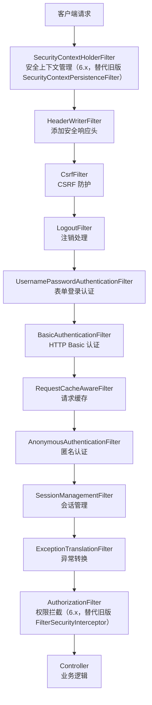
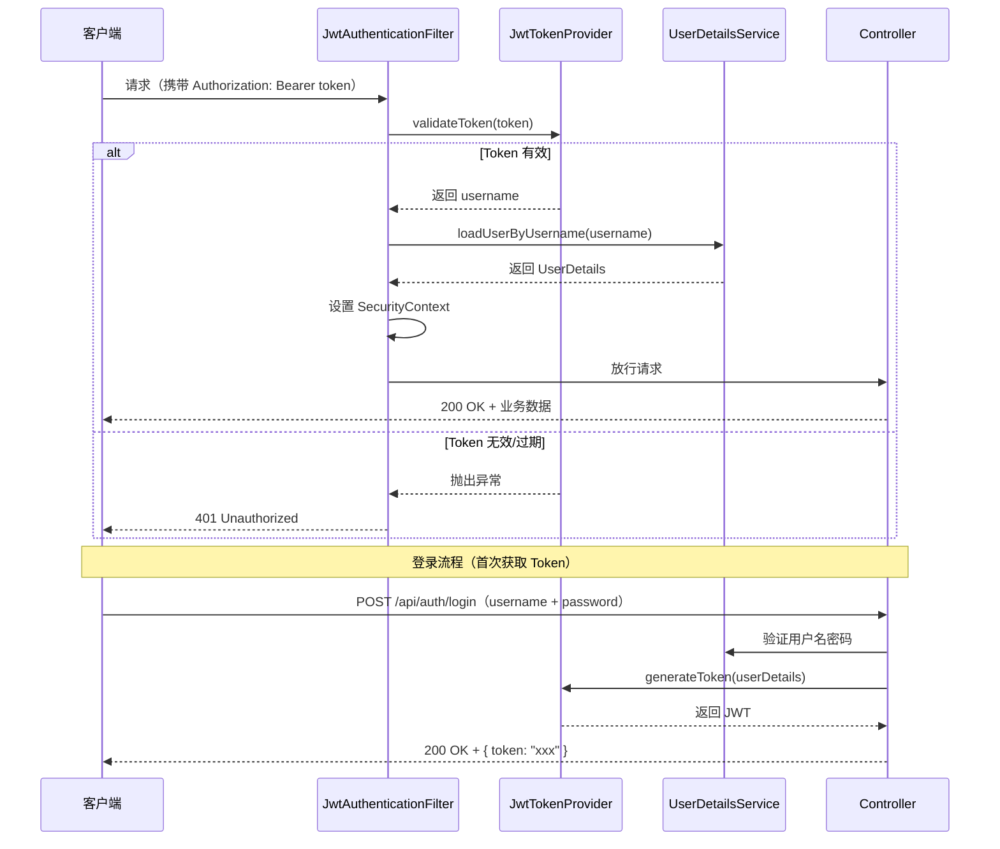

# Spring Boot 安全

## Spring Security 简介

Spring Security 是一个功能强大且高度可定制的身份验证和访问控制框架。它是保护基于Spring的应用程序的事实标准。

### 核心功能

1. **身份验证(Authentication)**:验证"你是谁",确认用户身份
2. **授权(Authorization)**:验证"你能做什么",控制用户访问权限
3. **攻击防护**:防止常见攻击如CSRF、会话固定、点击劫持等
4. **集成能力**:与OAuth2、JWT、LDAP等主流认证方案无缝集成

### Spring Security 架构原理

#### 核心组件架构

Spring Security 的核心是一系列过滤器组成的过滤器链:



::: warning 过滤器链顺序很重要
Spring Security 的过滤器链是有严格顺序的，顺序错误会导致安全漏洞或认证失效。**不要手动调整过滤器顺序**，使用 `SecurityFilterChain` 的 Lambda DSL 配置方式，Spring Security 会自动按正确顺序注册过滤器。
:::

#### 认证流程

```
1. 用户提交认证请求(用户名/密码)
    ↓
2. UsernamePasswordAuthenticationFilter 拦截请求
    ↓
3. 创建 UsernamePasswordAuthenticationToken
    ↓
4. 调用 AuthenticationManager.authenticate()
    ↓
5. AuthenticationManager 委托给 AuthenticationProvider
    ↓
6. AuthenticationProvider 调用 UserDetailsService.loadUserByUsername()
    ↓
7. 获取用户信息 UserDetails
    ↓
8. 验证密码(PasswordEncoder.matches())
    ↓
9. 认证成功,创建已认证的 Authentication 对象
    ↓
10. 存入 SecurityContextHolder
    ↓
11. 返回成功响应
```

#### 授权流程

```
1. 用户访问受保护资源
    ↓
2. FilterSecurityInterceptor 拦截请求
    ↓
3. 从 SecurityContext 获取 Authentication
    ↓
4. 调用 AccessDecisionManager.decide()
    ↓
5. AccessDecisionManager 轮询 AccessDecisionVoter
    ↓
6. 根据 ConfigAttribute(权限配置)进行投票
    ↓
7. 投票通过 → 允许访问
   投票拒绝 → 抛出 AccessDeniedException
```

### SecurityContext 安全上下文

SecurityContext 是 Spring Security 存储当前用户认证信息的核心接口:

```java
// 获取当前认证用户
Authentication authentication = SecurityContextHolder.getContext().getAuthentication();

if (authentication != null && authentication.isAuthenticated()) {
    String username = authentication.getName();
    Collection<? extends GrantedAuthority> authorities = authentication.getAuthorities();
    Object principal = authentication.getPrincipal();
    
    System.out.println("当前用户: " + username);
    System.out.println("权限列表: " + authorities);
}
```

#### SecurityContext 的三种存储策略

```java
// 通过策略名常量设置（默认 MODE_THREADLOCAL）
// 也可用系统属性 -Dspring.security.strategy=MODE_INHERITABLETHREADLOCAL 配置
SecurityContextHolder.setStrategyName(SecurityContextHolder.MODE_THREADLOCAL);
// SecurityContextHolder.MODE_INHERITABLETHREADLOCAL: 子线程可继承
// SecurityContextHolder.MODE_GLOBAL: 全局存储(不推荐)
```

::: warning 注意
Spring Boot 并没有 `spring.security.context.repository` 之类的配置项，存储策略只能通过 `SecurityContextHolder.setStrategyName(...)` 或系统属性 `spring.security.strategy` 设置。
:::

## 基本配置

### 添加依赖

```xml
<dependency>
    <groupId>org.springframework.boot</groupId>
    <artifactId>spring-boot-starter-security</artifactId>
</dependency>
```

### 基本安全配置

```java
import static org.springframework.security.config.Customizer.withDefaults;

@Configuration
@EnableWebSecurity
public class SecurityConfig {
    
    @Bean
    public SecurityFilterChain filterChain(HttpSecurity http) throws Exception {
        http
            // 授权配置
            .authorizeHttpRequests(authz -> authz
                .requestMatchers("/public/**", "/login", "/register").permitAll()
                .requestMatchers("/admin/**").hasRole("ADMIN")
                .requestMatchers("/user/**").hasAnyRole("USER", "ADMIN")
                .anyRequest().authenticated()
            )
            // 表单登录
            .formLogin(form -> form
                .loginPage("/login")
                .defaultSuccessUrl("/home")
                .failureUrl("/login?error=true")
                .permitAll()
            )
            // HTTP Basic认证
            .httpBasic(withDefaults())
            // 注销配置
            .logout(logout -> logout
                .logoutUrl("/logout")
                .logoutSuccessUrl("/login?logout=true")
                .invalidateHttpSession(true)
                .deleteCookies("JSESSIONID")
                .permitAll()
            )
            // 会话管理
            .sessionManagement(session -> session
                .maximumSessions(1)
                .maxSessionsPreventsLogin(false)
            );
        
        return http.build();
    }
    
    // 内存用户(仅用于测试)
    @Bean
    public UserDetailsService userDetailsService() {
        UserDetails user = User.withDefaultPasswordEncoder()
            .username("user")
            .password("password")
            .roles("USER")
            .build();
        
        UserDetails admin = User.withDefaultPasswordEncoder()
            .username("admin")
            .password("admin")
            .roles("ADMIN", "USER")
            .build();
        
        return new InMemoryUserDetailsManager(user, admin);
    }
}
```

### 配置说明

#### authorizeHttpRequests 配置详解

```java
.authorizeHttpRequests(authz -> authz
    // 完全公开
    .requestMatchers("/public/**").permitAll()
    
    // 需要认证
    .requestMatchers("/api/**").authenticated()
    
    // 需要特定角色
    .requestMatchers("/admin/**").hasRole("ADMIN")
    .requestMatchers("/user/**").hasAnyRole("USER", "ADMIN")
    
    // 需要特定权限
    .requestMatchers("/document/**").hasAuthority("DOCUMENT_READ")
    
    // IP地址限制
    .requestMatchers("/internal/**").hasIpAddress("192.168.1.0/24")
    
    // 默认规则
    .anyRequest().authenticated()
)
```

#### requestMatchers 匹配规则

```java
// 路径匹配
.requestMatchers("/api/users").authenticated()
.requestMatchers("/api/users/**").authenticated()

// HTTP方法匹配
.requestMatchers(HttpMethod.GET, "/api/users").permitAll()
.requestMatchers(HttpMethod.POST, "/api/users").authenticated()

// 正则表达式匹配
.requestMatchers(RegexRequestMatcher.regexMatcher("/api/users/[0-9]+")).authenticated()

// 多条件组合
.requestMatchers(HttpMethod.POST, "/api/admin/**").hasRole("ADMIN")
```

## 基于数据库的身份验证

### 数据库表设计

```sql
-- 用户表
CREATE TABLE users (
    id BIGINT PRIMARY KEY AUTO_INCREMENT,
    username VARCHAR(50) UNIQUE NOT NULL,
    password VARCHAR(100) NOT NULL,
    enabled BOOLEAN DEFAULT TRUE,
    account_non_expired BOOLEAN DEFAULT TRUE,
    account_non_locked BOOLEAN DEFAULT TRUE,
    credentials_non_expired BOOLEAN DEFAULT TRUE,
    created_at TIMESTAMP DEFAULT CURRENT_TIMESTAMP,
    updated_at TIMESTAMP DEFAULT CURRENT_TIMESTAMP ON UPDATE CURRENT_TIMESTAMP
);

-- 角色表
CREATE TABLE roles (
    id BIGINT PRIMARY KEY AUTO_INCREMENT,
    name VARCHAR(50) UNIQUE NOT NULL,
    description VARCHAR(200)
);

-- 用户角色关联表
CREATE TABLE user_roles (
    user_id BIGINT NOT NULL,
    role_id BIGINT NOT NULL,
    PRIMARY KEY (user_id, role_id),
    FOREIGN KEY (user_id) REFERENCES users(id),
    FOREIGN KEY (role_id) REFERENCES roles(id)
);

-- 权限表
CREATE TABLE permissions (
    id BIGINT PRIMARY KEY AUTO_INCREMENT,
    name VARCHAR(100) UNIQUE NOT NULL,
    resource VARCHAR(200) NOT NULL,
    action VARCHAR(50) NOT NULL,
    description VARCHAR(200)
);

-- 角色权限关联表
CREATE TABLE role_permissions (
    role_id BIGINT NOT NULL,
    permission_id BIGINT NOT NULL,
    PRIMARY KEY (role_id, permission_id),
    FOREIGN KEY (role_id) REFERENCES roles(id),
    FOREIGN KEY (permission_id) REFERENCES permissions(id)
);
```

### 用户实体类

```java
@Entity
@Table(name = "users")
public class User {
    @Id
    @GeneratedValue(strategy = GenerationType.IDENTITY)
    private Long id;
    
    @Column(unique = true, nullable = false, length = 50)
    private String username;
    
    @Column(nullable = false, length = 100)
    private String password;
    
    @Column(nullable = false)
    private Boolean enabled = true;
    
    @Column(name = "account_non_expired")
    private Boolean accountNonExpired = true;
    
    @Column(name = "account_non_locked")
    private Boolean accountNonLocked = true;
    
    @Column(name = "credentials_non_expired")
    private Boolean credentialsNonExpired = true;
    
    @ManyToMany(fetch = FetchType.EAGER)
    @JoinTable(
        name = "user_roles",
        joinColumns = @JoinColumn(name = "user_id"),
        inverseJoinColumns = @JoinColumn(name = "role_id")
    )
    private Set<Role> roles = new HashSet<>();
    
    @Column(name = "created_at")
    @CreationTimestamp
    private LocalDateTime createdAt;
    
    @Column(name = "updated_at")
    @UpdateTimestamp
    private LocalDateTime updatedAt;
    
    // getters and setters
}

@Entity
@Table(name = "roles")
public class Role {
    @Id
    @GeneratedValue(strategy = GenerationType.IDENTITY)
    private Long id;
    
    @Column(unique = true, nullable = false, length = 50)
    private String name;
    
    @Column(length = 200)
    private String description;
    
    @ManyToMany(fetch = FetchType.EAGER)
    @JoinTable(
        name = "role_permissions",
        joinColumns = @JoinColumn(name = "role_id"),
        inverseJoinColumns = @JoinColumn(name = "permission_id")
    )
    private Set<Permission> permissions = new HashSet<>();
    
    // getters and setters
}

@Entity
@Table(name = "permissions")
public class Permission {
    @Id
    @GeneratedValue(strategy = GenerationType.IDENTITY)
    private Long id;
    
    @Column(unique = true, nullable = false, length = 100)
    private String name;
    
    @Column(nullable = false, length = 200)
    private String resource;
    
    @Column(nullable = false, length = 50)
    private String action;
    
    @Column(length = 200)
    private String description;
    
    // getters and setters
}
```

### 自定义 UserDetailsService

```java
@Service
@Transactional
public class CustomUserDetailsService implements UserDetailsService {
    
    @Autowired
    private UserRepository userRepository;
    
    @Override
    public UserDetails loadUserByUsername(String username) throws UsernameNotFoundException {
        User user = userRepository.findByUsername(username)
            .orElseThrow(() -> new UsernameNotFoundException("用户不存在: " + username));
        
        // 收集用户所有权限(角色+权限)
        Set<GrantedAuthority> authorities = new HashSet<>();
        
        for (Role role : user.getRoles()) {
            // 添加角色(ROLE_前缀)
            authorities.add(new SimpleGrantedAuthority("ROLE_" + role.getName()));
            
            // 添加权限
            for (Permission permission : role.getPermissions()) {
                authorities.add(new SimpleGrantedAuthority(permission.getName()));
            }
        }
        
        return new org.springframework.security.core.userdetails.User(
            user.getUsername(),
            user.getPassword(),
            user.getEnabled(),
            user.getAccountNonExpired(),
            user.getCredentialsNonExpired(),
            user.getAccountNonLocked(),
            authorities
        );
    }
}
```

### 密码编码器

Spring Security 提供了多种密码编码器,推荐使用 BCrypt:

```java
@Configuration
public class PasswordConfig {
    
    @Bean
    public PasswordEncoder passwordEncoder() {
        // BCrypt 强哈希算法,自动加盐
        return new BCryptPasswordEncoder();
    }
}
```

#### 密码编码器对比

| 编码器 | 安全性 | 性能 | 推荐场景 |
|--------|--------|------|----------|
| BCryptPasswordEncoder | 高 | 中 | **推荐使用** |
| Pbkdf2PasswordEncoder | 高 | 低 | 兼容旧系统 |
| SCryptPasswordEncoder | 最高 | 低 | 高安全要求 |
| Argon2PasswordEncoder | 最高 | 低 | 高安全要求 |
| NoOpPasswordEncoder | 无 | 高 | **仅测试** |

#### BCrypt 使用示例

```java
@Service
public class UserService {
    
    @Autowired
    private PasswordEncoder passwordEncoder;
    
    @Autowired
    private UserRepository userRepository;
    
    public User register(String username, String rawPassword) {
        // 加密密码
        String encodedPassword = passwordEncoder.encode(rawPassword);
        
        User user = new User();
        user.setUsername(username);
        user.setPassword(encodedPassword);
        
        return userRepository.save(user);
    }
    
    public boolean checkPassword(String rawPassword, String encodedPassword) {
        return passwordEncoder.matches(rawPassword, encodedPassword);
    }
}
```

### 用户注册流程

```java
@RestController
@RequestMapping("/api/auth")
public class AuthController {
    
    @Autowired
    private UserService userService;
    
    @Autowired
    private PasswordEncoder passwordEncoder;
    
    @PostMapping("/register")
    public ResponseEntity<?> registerUser(@Valid @RequestBody RegisterRequest request) {
        // 检查用户名是否已存在
        if (userService.existsByUsername(request.getUsername())) {
            return ResponseEntity.badRequest()
                .body(new MessageResponse("用户名已被使用"));
        }
        
        // 检查邮箱是否已存在
        if (userService.existsByEmail(request.getEmail())) {
            return ResponseEntity.badRequest()
                .body(new MessageResponse("邮箱已被使用"));
        }
        
        // 创建用户
        User user = new User();
        user.setUsername(request.getUsername());
        user.setEmail(request.getEmail());
        user.setPassword(passwordEncoder.encode(request.getPassword()));
        
        // 分配默认角色
        Role userRole = roleService.findByName("USER")
            .orElseThrow(() -> new RuntimeException("默认角色不存在"));
        user.setRoles(Collections.singleton(userRole));
        
        userService.save(user);
        
        return ResponseEntity.ok(new MessageResponse("注册成功"));
    }
}
```

## JWT 认证

JWT (JSON Web Token) 是一种无状态的认证方案,适合前后端分离架构。



::: danger JWT 安全要点
1. **密钥管理**：JWT 签名密钥必须足够长（≥256bit），且不能硬编码在代码中，应使用环境变量或配置中心
2. **Token 过期**：设置合理的过期时间（通常 Access Token 15-30 分钟，Refresh Token 7 天），不要设置过长
3. **不要在 Payload 中存敏感信息**：JWT 的 Payload 是 Base64 编码，不是加密——任何人都能解码
4. **黑名单机制**：纯 JWT 是无状态的，用户注销后 Token 仍然有效直到过期。需要实现 Token 黑名单（Redis 存储已注销的 Token）或短期 Token + Refresh Token 方案
:::

### JWT 结构

JWT 由三部分组成,用点号分隔:

```
header.payload.signature
```

- **Header**: 令牌类型和算法
- **Payload**: 用户信息和声明
- **Signature**: 签名,用于验证令牌完整性

### 添加依赖

```xml
<!-- 注:jjwt 0.12.x 起 API 有较大调整(如 parserBuilder → parser),本节示例按 0.11.5 API 编写 -->
<dependency>
    <groupId>io.jsonwebtoken</groupId>
    <artifactId>jjwt-api</artifactId>
    <version>0.11.5</version>
</dependency>
<dependency>
    <groupId>io.jsonwebtoken</groupId>
    <artifactId>jjwt-impl</artifactId>
    <version>0.11.5</version>
    <scope>runtime</scope>
</dependency>
<dependency>
    <groupId>io.jsonwebtoken</groupId>
    <artifactId>jjwt-jackson</artifactId>
    <version>0.11.5</version>
    <scope>runtime</scope>
</dependency>
```

### JWT 配置

```yaml
# application.yml
jwt:
  secret: mySecretKey1234567890abcdefghijklmnopqrstuvwxyz
  expiration: 86400000  # 24小时(毫秒)
  header: Authorization
  prefix: Bearer 
```

### JWT 工具类

```java
@Component
public class JwtTokenUtil {
    
    @Value("${jwt.secret}")
    private String secret;
    
    @Value("${jwt.expiration}")
    private Long expiration;
    
    private SecretKey getSigningKey() {
        byte[] keyBytes = Decoders.BASE64.decode(secret);
        return Keys.hmacShaKeyFor(keyBytes);
    }
    
    /**
     * 生成JWT令牌
     */
    public String generateToken(UserDetails userDetails) {
        Map<String, Object> claims = new HashMap<>();
        return createToken(claims, userDetails.getUsername());
    }
    
    /**
     * 生成带额外信息的JWT令牌
     */
    public String generateToken(UserDetails userDetails, Map<String, Object> extraClaims) {
        Map<String, Object> claims = new HashMap<>(extraClaims);
        return createToken(claims, userDetails.getUsername());
    }
    
    /**
     * 创建令牌
     */
    private String createToken(Map<String, Object> claims, String subject) {
        return Jwts.builder()
            .setClaims(claims)
            .setSubject(subject)
            .setIssuedAt(new Date(System.currentTimeMillis()))
            .setExpiration(new Date(System.currentTimeMillis() + expiration))
            .signWith(getSigningKey(), SignatureAlgorithm.HS256)
            .compact();
    }
    
    /**
     * 验证令牌
     */
    public Boolean validateToken(String token, UserDetails userDetails) {
        final String username = getUsernameFromToken(token);
        return (username.equals(userDetails.getUsername()) && !isTokenExpired(token));
    }
    
    /**
     * 从令牌中获取用户名
     */
    public String getUsernameFromToken(String token) {
        return getClaimFromToken(token, Claims::getSubject);
    }
    
    /**
     * 从令牌中获取过期时间
     */
    public Date getExpirationDateFromToken(String token) {
        return getClaimFromToken(token, Claims::getExpiration);
    }
    
    /**
     * 从令牌中获取指定声明
     */
    public <T> T getClaimFromToken(String token, Function<Claims, T> claimsResolver) {
        final Claims claims = getAllClaimsFromToken(token);
        return claimsResolver.apply(claims);
    }
    
    /**
     * 解析令牌获取所有声明
     */
    private Claims getAllClaimsFromToken(String token) {
        return Jwts.parserBuilder()
            .setSigningKey(getSigningKey())
            .build()
            .parseClaimsJws(token)
            .getBody();
    }
    
    /**
     * 判断令牌是否过期
     */
    private Boolean isTokenExpired(String token) {
        final Date expiration = getExpirationDateFromToken(token);
        return expiration.before(new Date());
    }
    
    /**
     * 刷新令牌
     */
    public String refreshToken(String token) {
        final Claims claims = getAllClaimsFromToken(token);
        claims.put("iat", new Date(System.currentTimeMillis()));
        return Jwts.builder()
            .setClaims(claims)
            .signWith(getSigningKey(), SignatureAlgorithm.HS256)
            .compact();
    }
}
```

### JWT 认证过滤器

```java
@Component
public class JwtAuthenticationFilter extends OncePerRequestFilter {
    
    @Autowired
    private UserDetailsService userDetailsService;
    
    @Autowired
    private JwtTokenUtil jwtTokenUtil;
    
    @Override
    protected void doFilterInternal(HttpServletRequest request, 
                                    HttpServletResponse response, 
                                    FilterChain chain) throws ServletException, IOException {
        
        final String requestTokenHeader = request.getHeader("Authorization");
        
        String username = null;
        String jwtToken = null;
        
        // JWT Token格式: Bearer token
        if (requestTokenHeader != null && requestTokenHeader.startsWith("Bearer ")) {
            jwtToken = requestTokenHeader.substring(7);
            try {
                username = jwtTokenUtil.getUsernameFromToken(jwtToken);
            } catch (IllegalArgumentException e) {
                logger.error("无法获取JWT Token", e);
            } catch (ExpiredJwtException e) {
                logger.error("JWT Token已过期", e);
            } catch (UnsupportedJwtException e) {
                logger.error("不支持的JWT Token", e);
            } catch (MalformedJwtException e) {
                logger.error("无效的JWT Token", e);
            }
        } else {
            logger.warn("JWT Token不以Bearer字符串开头");
        }
        
        // 验证令牌
        if (username != null && SecurityContextHolder.getContext().getAuthentication() == null) {
            UserDetails userDetails = this.userDetailsService.loadUserByUsername(username);
            
            // 如果令牌有效,配置认证
            if (jwtTokenUtil.validateToken(jwtToken, userDetails)) {
                UsernamePasswordAuthenticationToken authToken = 
                    new UsernamePasswordAuthenticationToken(
                        userDetails, null, userDetails.getAuthorities());
                authToken.setDetails(new WebAuthenticationDetailsSource().buildDetails(request));
                SecurityContextHolder.getContext().setAuthentication(authToken);
            }
        }
        
        chain.doFilter(request, response);
    }
}
```

### JWT 安全配置

```java
@Configuration
@EnableWebSecurity
public class JwtSecurityConfig {
    
    @Autowired
    private CustomUserDetailsService userDetailsService;
    
    @Autowired
    private JwtAuthenticationFilter jwtAuthenticationFilter;
    
    @Bean
    public SecurityFilterChain filterChain(HttpSecurity http) throws Exception {
        http
            // 禁用CSRF(因为使用JWT)
            .csrf(csrf -> csrf.disable())
            
            // 无状态会话
            .sessionManagement(session -> 
                session.sessionCreationPolicy(SessionCreationPolicy.STATELESS))
            
            // 授权配置
            .authorizeHttpRequests(authz -> authz
                .requestMatchers("/api/auth/**").permitAll()
                .requestMatchers("/api/public/**").permitAll()
                .requestMatchers("/api/admin/**").hasRole("ADMIN")
                .anyRequest().authenticated()
            )
            
            // 添加JWT过滤器
            .addFilterBefore(jwtAuthenticationFilter, 
                UsernamePasswordAuthenticationFilter.class);
        
        return http.build();
    }
    
    @Bean
    public AuthenticationManager authenticationManager(
            AuthenticationConfiguration config) throws Exception {
        return config.getAuthenticationManager();
    }
    
    @Bean
    public PasswordEncoder passwordEncoder() {
        return new BCryptPasswordEncoder();
    }
}
```

### JWT 认证端点

```java
@RestController
@RequestMapping("/api/auth")
public class JwtAuthController {
    
    @Autowired
    private AuthenticationManager authenticationManager;
    
    @Autowired
    private UserDetailsService userDetailsService;
    
    @Autowired
    private JwtTokenUtil jwtTokenUtil;
    
    @Autowired
    private UserService userService;
    
    /**
     * 用户登录
     */
    @PostMapping("/login")
    public ResponseEntity<?> authenticateUser(@Valid @RequestBody LoginRequest loginRequest) {
        
        // 认证用户
        Authentication authentication = authenticationManager.authenticate(
            new UsernamePasswordAuthenticationToken(
                loginRequest.getUsername(), 
                loginRequest.getPassword()
            )
        );
        
        // 设置认证信息到上下文
        SecurityContextHolder.getContext().setAuthentication(authentication);
        
        // 生成JWT令牌
        UserDetails userDetails = (UserDetails) authentication.getPrincipal();
        String token = jwtTokenUtil.generateToken(userDetails);
        
        // 返回令牌
        return ResponseEntity.ok(new JwtResponse(
            token,
            userDetails.getUsername(),
            userDetails.getAuthorities().stream()
                .map(GrantedAuthority::getAuthority)
                .collect(Collectors.toList())
        ));
    }
    
    /**
     * 用户注册
     */
    @PostMapping("/register")
    public ResponseEntity<?> registerUser(@Valid @RequestBody RegisterRequest registerRequest) {
        if (userService.existsByUsername(registerRequest.getUsername())) {
            return ResponseEntity.badRequest()
                .body(new MessageResponse("用户名已被使用"));
        }
        
        User user = userService.registerUser(registerRequest);
        
        return ResponseEntity.ok(new MessageResponse("注册成功"));
    }
    
    /**
     * 刷新令牌
     */
    @PostMapping("/refresh")
    public ResponseEntity<?> refreshToken(HttpServletRequest request) {
        String requestTokenHeader = request.getHeader("Authorization");
        
        if (requestTokenHeader != null && requestTokenHeader.startsWith("Bearer ")) {
            String token = requestTokenHeader.substring(7);
            String username = jwtTokenUtil.getUsernameFromToken(token);
            
            UserDetails userDetails = userDetailsService.loadUserByUsername(username);
            String newToken = jwtTokenUtil.refreshToken(token);
            
            return ResponseEntity.ok(new JwtResponse(
                newToken,
                userDetails.getUsername(),
                userDetails.getAuthorities().stream()
                    .map(GrantedAuthority::getAuthority)
                    .collect(Collectors.toList())
            ));
        }
        
        return ResponseEntity.badRequest().body(new MessageResponse("无效的令牌"));
    }
}
```

### JWT 响应类

```java
@Data
@AllArgsConstructor
@NoArgsConstructor
public class JwtResponse {
    private String token;
    private String type = "Bearer";
    private String username;
    private List<String> roles;
    
    public JwtResponse(String token, String username, List<String> roles) {
        this.token = token;
        this.username = username;
        this.roles = roles;
    }
}

@Data
@AllArgsConstructor
@NoArgsConstructor
public class LoginRequest {
    @NotBlank
    private String username;
    
    @NotBlank
    private String password;
}

@Data
@AllArgsConstructor
@NoArgsConstructor
public class MessageResponse {
    private String message;
}
```

## 方法级安全

Spring Security 支持在方法级别进行细粒度的权限控制。

### 启用方法级安全

```java
@Configuration
@EnableMethodSecurity(
    prePostEnabled = true,   // 启用@PreAuthorize/@PostAuthorize
    securedEnabled = true,   // 启用@Secured
    jsr250Enabled = true     // 启用@RolesAllowed
)
public class MethodSecurityConfig {
    // 配置内容
}
```

### 方法安全注解详解

#### @PreAuthorize - 方法调用前检查

```java
@Service
public class DocumentService {
    
    // 只有ADMIN角色可以访问
    @PreAuthorize("hasRole('ADMIN')")
    public Document getAdminDocument(Long id) {
        return documentRepository.findById(id).orElse(null);
    }
    
    // 只有文档所有者可以更新
    @PreAuthorize("#document.owner == authentication.name")
    public Document updateDocument(Document document) {
        return documentRepository.save(document);
    }
    
    // 只有文档所有者或ADMIN可以删除
    @PreAuthorize("#document.owner == authentication.name or hasRole('ADMIN')")
    public void deleteDocument(Document document) {
        documentRepository.delete(document);
    }
    
    // 使用权限表达式
    @PreAuthorize("hasAuthority('DOCUMENT_WRITE')")
    public Document createDocument(DocumentDto documentDto) {
        return documentRepository.save(convertToEntity(documentDto));
    }
    
    // 复杂表达式
    @PreAuthorize("hasRole('ADMIN') or (hasRole('MANAGER') and #department == authentication.principal.department)")
    public List<Document> getDepartmentDocuments(String department) {
        return documentRepository.findByDepartment(department);
    }
}
```

#### @PostAuthorize - 方法调用后检查

```java
@Service
public class DocumentService {
    
    // 返回后检查:只有文档所有者可以访问
    @PostAuthorize("returnObject.owner == authentication.name")
    public Document getDocumentById(Long id) {
        return documentRepository.findById(id).orElse(null);
    }
    
    // 返回后检查:只有管理员可以查看敏感文档
    @PostAuthorize("returnObject.sensitive == false or hasRole('ADMIN')")
    public Document getDocument(Long id) {
        return documentRepository.findById(id).orElse(null);
    }
}
```

#### @PreFilter - 过滤方法参数

```java
@Service
public class DocumentService {
    
    // 只处理当前用户拥有的文档
    @PreFilter("filterObject.owner == authentication.name")
    public List<Document> updateDocuments(List<Document> documents) {
        return documentRepository.saveAll(documents);
    }
    
    // 只处理用户有权限的资源
    @PreFilter(value = "hasPermission(filterObject, 'WRITE')", filterTarget = "documents")
    public void batchDelete(List<Document> documents) {
        documentRepository.deleteAll(documents);
    }
}
```

#### @PostFilter - 过滤方法返回值

```java
@Service
public class DocumentService {
    
    // 只返回当前用户有权限查看的文档
    @PostFilter("hasPermission(filterObject, 'READ')")
    public List<Document> getAllDocuments() {
        return documentRepository.findAll();
    }
    
    // 只返回当前用户拥有的文档
    @PostFilter("filterObject.owner == authentication.name")
    public List<Document> getUserDocuments() {
        return documentRepository.findAll();
    }
}
```

#### @Secured - 基于角色的简单授权

```java
@Service
public class DocumentService {
    
    @Secured("ROLE_USER")
    public List<Document> getUserDocuments() {
        return documentRepository.findAll();
    }
    
    @Secured({"ROLE_ADMIN", "ROLE_MANAGER"})
    public void deleteDocument(Long id) {
        documentRepository.deleteById(id);
    }
}
```

#### @RolesAllowed - JSR-250标准注解

```java
@Service
public class DocumentService {
    
    @RolesAllowed("ROLE_USER")
    public Document getDocument(Long id) {
        return documentRepository.findById(id).orElse(null);
    }
    
    @RolesAllowed({"ROLE_ADMIN", "ROLE_MANAGER"})
    public void deleteDocument(Long id) {
        documentRepository.deleteById(id);
    }
}
```

### SpEL 表达式支持

Spring Security 支持在注解中使用 Spring Expression Language (SpEL):

```java
@Service
public class DocumentService {
    
    // 基本表达式
    @PreAuthorize("hasRole('ADMIN')")
    public void adminOnly() { }
    
    // 逻辑运算
    @PreAuthorize("hasRole('ADMIN') and hasAuthority('DOCUMENT_WRITE')")
    public void adminWithWritePermission() { }
    
    // 参数引用
    @PreAuthorize("#id > 0")
    public Document getDocument(Long id) { }
    
    // 认证信息引用
    @PreAuthorize("authentication.name == #username")
    public User getUser(String username) { }
    
    // Principal引用
    @PreAuthorize("principal.username == #username")
    public User getUserProfile(String username) { }
    
    // Bean引用
    @PreAuthorize("@documentService.isOwner(#id, authentication.name)")
    public Document getDocument(Long id) { }
    
    // 权限评估
    @PreAuthorize("hasPermission(#id, 'document', 'READ')")
    public Document readDocument(Long id) { }
}
```

### 自定义权限评估器

```java
@Component
public class CustomPermissionEvaluator implements PermissionEvaluator {
    
    @Autowired
    private DocumentRepository documentRepository;
    
    @Override
    public boolean hasPermission(Authentication authentication, 
                                 Object targetDomainObject, 
                                 Object permission) {
        // 实现对象级权限检查
        if (targetDomainObject instanceof Document) {
            Document document = (Document) targetDomainObject;
            String username = authentication.getName();
            
            if ("READ".equals(permission)) {
                return document.isPublic() || document.getOwner().equals(username);
            }
            if ("WRITE".equals(permission)) {
                return document.getOwner().equals(username);
            }
        }
        return false;
    }
    
    @Override
    public boolean hasPermission(Authentication authentication, 
                                 Serializable targetId, 
                                 String targetType, 
                                 Object permission) {
        // 实现ID+类型权限检查
        if ("document".equals(targetType)) {
            Document document = documentRepository.findById((Long) targetId)
                .orElse(null);
            return document != null && hasPermission(authentication, document, permission);
        }
        return false;
    }
}

// 配置自定义权限评估器
@Configuration
public class PermissionConfig {
    
    @Bean
    public MethodSecurityExpressionHandler methodSecurityExpressionHandler(
            PermissionEvaluator permissionEvaluator) {
        DefaultMethodSecurityExpressionHandler handler = 
            new DefaultMethodSecurityExpressionHandler();
        handler.setPermissionEvaluator(permissionEvaluator);
        return handler;
    }
}
```

## RBAC 权限模型设计

RBAC (Role-Based Access Control) 基于角色的访问控制是企业应用中最常用的权限模型。

### RBAC 模型层次

```
用户(User) → 角色(Role) → 权限(Permission) → 资源(Resource)
```

### 完整 RBAC 实现示例

#### 实体设计

```java
@Entity
@Table(name = "users")
public class User {
    @Id
    @GeneratedValue(strategy = GenerationType.IDENTITY)
    private Long id;
    
    private String username;
    private String password;
    private String email;
    private Boolean enabled;
    
    @ManyToMany(fetch = FetchType.EAGER)
    @JoinTable(name = "user_roles")
    private Set<Role> roles = new HashSet<>();
    
    // getters and setters
}

@Entity
@Table(name = "roles")
public class Role {
    @Id
    @GeneratedValue(strategy = GenerationType.IDENTITY)
    private Long id;
    
    private String name;
    private String description;
    
    @ManyToMany(fetch = FetchType.EAGER)
    @JoinTable(name = "role_permissions")
    private Set<Permission> permissions = new HashSet<>();
    
    // getters and setters
}

@Entity
@Table(name = "permissions")
public class Permission {
    @Id
    @GeneratedValue(strategy = GenerationType.IDENTITY)
    private Long id;
    
    private String name;          // 权限标识,如:USER_CREATE
    private String resource;       // 资源,如:USER
    private String action;         // 操作,如:CREATE
    private String description;
    
    // getters and setters
}
```

#### 权限初始化

```java
@Component
public class DataInitializer implements CommandLineRunner {
    
    @Autowired
    private PermissionRepository permissionRepository;
    
    @Autowired
    private RoleRepository roleRepository;
    
    @Autowired
    private UserRepository userRepository;
    
    @Autowired
    private PasswordEncoder passwordEncoder;
    
    @Override
    @Transactional
    public void run(String... args) throws Exception {
        // 初始化权限
        initPermissions();
        
        // 初始化角色
        initRoles();
        
        // 初始化管理员
        initAdmin();
    }
    
    private void initPermissions() {
        // 用户管理权限
        createPermission("USER_CREATE", "USER", "CREATE", "创建用户");
        createPermission("USER_READ", "USER", "READ", "查看用户");
        createPermission("USER_UPDATE", "USER", "UPDATE", "更新用户");
        createPermission("USER_DELETE", "USER", "DELETE", "删除用户");
        
        // 文档管理权限
        createPermission("DOCUMENT_CREATE", "DOCUMENT", "CREATE", "创建文档");
        createPermission("DOCUMENT_READ", "DOCUMENT", "READ", "查看文档");
        createPermission("DOCUMENT_UPDATE", "DOCUMENT", "UPDATE", "更新文档");
        createPermission("DOCUMENT_DELETE", "DOCUMENT", "DELETE", "删除文档");
    }
    
    private Permission createPermission(String name, String resource, String action, String description) {
        Permission permission = new Permission();
        permission.setName(name);
        permission.setResource(resource);
        permission.setAction(action);
        permission.setDescription(description);
        return permissionRepository.save(permission);
    }
    
    private void initRoles() {
        // 创建管理员角色
        Role adminRole = new Role();
        adminRole.setName("ADMIN");
        adminRole.setDescription("系统管理员");
        adminRole.setPermissions(new HashSet<>(permissionRepository.findAll()));
        roleRepository.save(adminRole);
        
        // 创建普通用户角色
        Role userRole = new Role();
        userRole.setName("USER");
        userRole.setDescription("普通用户");
        userRole.setPermissions(Set.of(
            permissionRepository.findByName("DOCUMENT_CREATE").orElseThrow(),
            permissionRepository.findByName("DOCUMENT_READ").orElseThrow(),
            permissionRepository.findByName("DOCUMENT_UPDATE").orElseThrow()
        ));
        roleRepository.save(userRole);
    }
    
    private void initAdmin() {
        if (!userRepository.existsByUsername("admin")) {
            User admin = new User();
            admin.setUsername("admin");
            admin.setPassword(passwordEncoder.encode("admin123"));
            admin.setEmail("admin@example.com");
            admin.setEnabled(true);
            admin.setRoles(Set.of(roleRepository.findByName("ADMIN").orElseThrow()));
            userRepository.save(admin);
        }
    }
}
```

#### 权限服务

```java
@Service
@Transactional
public class PermissionService {
    
    @Autowired
    private UserRepository userRepository;
    
    @Autowired
    private RoleRepository roleRepository;
    
    @Autowired
    private PermissionRepository permissionRepository;
    
    /**
     * 为用户分配角色
     */
    public void assignRole(Long userId, Long roleId) {
        User user = userRepository.findById(userId)
            .orElseThrow(() -> new RuntimeException("用户不存在"));
        Role role = roleRepository.findById(roleId)
            .orElseThrow(() -> new RuntimeException("角色不存在"));
        
        user.getRoles().add(role);
        userRepository.save(user);
    }
    
    /**
     * 移除用户角色
     */
    public void removeRole(Long userId, Long roleId) {
        User user = userRepository.findById(userId)
            .orElseThrow(() -> new RuntimeException("用户不存在"));
        Role role = roleRepository.findById(roleId)
            .orElseThrow(() -> new RuntimeException("角色不存在"));
        
        user.getRoles().remove(role);
        userRepository.save(user);
    }
    
    /**
     * 为角色分配权限
     */
    public void assignPermission(Long roleId, Long permissionId) {
        Role role = roleRepository.findById(roleId)
            .orElseThrow(() -> new RuntimeException("角色不存在"));
        Permission permission = permissionRepository.findById(permissionId)
            .orElseThrow(() -> new RuntimeException("权限不存在"));
        
        role.getPermissions().add(permission);
        roleRepository.save(role);
    }
    
    /**
     * 获取用户所有权限
     */
    public Set<String> getUserPermissions(String username) {
        User user = userRepository.findByUsername(username)
            .orElseThrow(() -> new RuntimeException("用户不存在"));
        
        Set<String> permissions = new HashSet<>();
        for (Role role : user.getRoles()) {
            for (Permission permission : role.getPermissions()) {
                permissions.add(permission.getName());
            }
        }
        return permissions;
    }
}
```

## Session 管理与会话安全

### Session 管理配置

```java
@Configuration
@EnableWebSecurity
public class SessionSecurityConfig {
    
    @Bean
    public SecurityFilterChain filterChain(HttpSecurity http) throws Exception {
        http
            // Session管理配置
            // 注意:Session 超时由 server.servlet.session.timeout=30m 配置，
            // Security 的 sessionManagement DSL 没有"会话超时"设置
            .sessionManagement(session -> session
                // Session创建策略
                .sessionCreationPolicy(SessionCreationPolicy.IF_REQUIRED)
                
                // 会话固定攻击防护（详见下节）
                .sessionFixation(fixation -> fixation.migrateSession())
                
                // Session认证错误URL
                .sessionAuthenticationErrorUrl("/login?error=true")
                
                // 并发Session控制
                .maximumSessions(1)
                .maxSessionsPreventsLogin(false)
                .expiredUrl("/login?expired=true")
            );
        
        return http.build();
    }
}
```

### Session 创建策略

```java
// 常用策略说明
public enum SessionCreationPolicy {
    // 总是创建Session
    ALWAYS,
    
    // 需要时创建Session(默认)
    IF_REQUIRED,
    
    // 永不创建Session(无状态应用,如JWT)
    NEVER,
    
    // 不使用Session,强制无状态
    STATELESS
}
```

### 会话固定攻击防护

会话固定攻击(Session Fixation Attack)是攻击者诱使用户使用已知的Session ID,从而劫持用户会话。

```java
@Configuration
@EnableWebSecurity
public class SessionFixationSecurityConfig {
    
    @Bean
    public SecurityFilterChain filterChain(HttpSecurity http) throws Exception {
        http
            .sessionManagement(session -> session
                // 推荐策略:创建新Session,复制旧Session属性
                .sessionFixation(sessionFixation -> 
                    sessionFixation.migrateSession())
                
                // 其他策略:
                // .sessionFixation().none()              // 不防护(不推荐)
                // .sessionFixation().newSession()        // 创建新Session,不复制属性
                // .sessionFixation().changeSessionId()   // 仅更改Session ID(Servlet 3.1+)
            );
        
        return http.build();
    }
}
```

### 并发Session控制

```java
@Configuration
@EnableWebSecurity
public class ConcurrentSessionSecurityConfig {
    
    @Bean
    public SecurityFilterChain filterChain(HttpSecurity http) throws Exception {
        http
            .sessionManagement(session -> session
                // 同一用户最多1个并发Session
                .maximumSessions(1)
                
                // true:阻止后续登录
                // false:踢出之前的Session(默认)
                .maxSessionsPreventsLogin(true)
                
                // Session过期后的跳转URL
                .expiredUrl("/login?expired=true")
                
                // 自定义Session过期策略
                .expiredSessionStrategy(new CustomExpiredSessionStrategy())
            );
        
        return http.build();
    }
    
    /**
     * 自定义Session过期处理
     */
    public static class CustomExpiredSessionStrategy 
            implements SessionInformationExpiredStrategy {
        
        @Override
        public void onExpiredSessionDetected(SessionInformationExpiredEvent event) 
                throws IOException {
            HttpServletResponse response = event.getResponse();
            response.setContentType("application/json;charset=UTF-8");
            response.getWriter().write(
                "{\"code\":401,\"message\":\"您的账号在其他地方登录,已被迫下线\"}"
            );
        }
    }
}
```

### Session 监听

```java
@Component
public class HttpSessionEventListener extends HttpSessionEventPublisher {
    
    private static final Logger logger = LoggerFactory.getLogger(HttpSessionEventListener.class);
    
    @Override
    public void onApplicationEvent(HttpSessionCreatedEvent event) {
        String sessionId = event.getSession().getId();
        logger.info("Session创建: {}", sessionId);
    }
    
    @Override
    public void onApplicationEvent(HttpSessionDestroyedEvent event) {
        String sessionId = event.getId();
        logger.info("Session销毁: {}", sessionId);
        
        // 记录用户退出日志
        SecurityContext context = 
            (SecurityContext) event.getSession().getAttribute("SPRING_SECURITY_CONTEXT");
        if (context != null) {
            Authentication auth = context.getAuthentication();
            if (auth != null) {
                logger.info("用户退出: {}", auth.getName());
            }
        }
    }
}
```

## OAuth2 集成

OAuth2 是一种授权框架,允许第三方应用获取有限的用户资源访问权限。

### OAuth2 角色

- **Resource Owner**: 资源所有者(用户)
- **Client**: 客户端应用
- **Authorization Server**: 授权服务器
- **Resource Server**: 资源服务器

### OAuth2 客户端集成

#### 添加依赖

```xml
<dependency>
    <groupId>org.springframework.boot</groupId>
    <artifactId>spring-boot-starter-oauth2-client</artifactId>
</dependency>
```

#### OAuth2 客户端配置

```yaml
spring:
  security:
    oauth2:
      client:
        registration:
          # Google登录
          google:
            client-id: your-google-client-id
            client-secret: your-google-client-secret
            scope:
              - email
              - profile
            redirect-uri: "{baseUrl}/login/oauth2/code/{registrationId}"
          
          # GitHub登录
          github:
            client-id: your-github-client-id
            client-secret: your-github-client-secret
            scope:
              - user:email
              - read:user
          
          # 自定义OAuth2服务器
          custom:
            client-id: your-client-id
            client-secret: your-client-secret
            authorization-grant-type: authorization_code
            redirect-uri: "{baseUrl}/login/oauth2/code/{registrationId}"
            scope:
              - read
              - write
            client-name: Custom OAuth2
        
        provider:
          custom:
            authorization-uri: https://auth.example.com/oauth/authorize
            token-uri: https://auth.example.com/oauth/token
            user-info-uri: https://auth.example.com/userinfo
            user-name-attribute: sub
```

#### OAuth2 登录配置

```java
@Configuration
@EnableWebSecurity
public class OAuth2SecurityConfig {
    
    @Bean
    public SecurityFilterChain filterChain(HttpSecurity http) throws Exception {
        http
            .authorizeHttpRequests(authz -> authz
                .requestMatchers("/", "/login", "/error", "/webjars/**").permitAll()
                .anyRequest().authenticated()
            )
            .oauth2Login(oauth2 -> oauth2
                .loginPage("/login")
                .defaultSuccessUrl("/home")
                .failureUrl("/login?error=true")
                .userInfoEndpoint(userInfo -> userInfo
                    .userService(customOAuth2UserService())
                )
                .successHandler(oAuth2AuthenticationSuccessHandler())
                .failureHandler(oAuth2AuthenticationFailureHandler())
            );
        
        return http.build();
    }
    
    /**
     * 自定义OAuth2用户服务
     */
    @Bean
    public OAuth2UserService<OAuth2UserRequest, OAuth2User> customOAuth2UserService() {
        return new CustomOAuth2UserService();
    }
    
    /**
     * 自定义认证成功处理器
     */
    @Bean
    public AuthenticationSuccessHandler oAuth2AuthenticationSuccessHandler() {
        return new CustomOAuth2AuthenticationSuccessHandler();
    }
    
    /**
     * 自定义认证失败处理器
     */
    @Bean
    public AuthenticationFailureHandler oAuth2AuthenticationFailureHandler() {
        return new CustomOAuth2AuthenticationFailureHandler();
    }
}
```

#### 自定义OAuth2用户服务

```java
@Service
public class CustomOAuth2UserService extends DefaultOAuth2UserService {
    
    @Autowired
    private UserRepository userRepository;
    
    @Autowired
    private RoleRepository roleRepository;
    
    @Override
    @Transactional
    public OAuth2User loadUser(OAuth2UserRequest userRequest) throws OAuth2AuthenticationException {
        OAuth2User oauth2User = super.loadUser(userRequest);
        
        // 获取注册提供商(Google/GitHub等)
        String registrationId = userRequest.getClientRegistration().getRegistrationId();
        
        // 提取用户信息
        String email = oauth2User.getAttribute("email");
        String name = oauth2User.getAttribute("name");
        String picture = oauth2User.getAttribute("picture");
        
        // 查找或创建用户
        User user = userRepository.findByEmail(email)
            .orElseGet(() -> createOAuth2User(email, name, picture, registrationId));
        
        // 转换为Spring Security用户
        Set<GrantedAuthority> authorities = new HashSet<>();
        for (Role role : user.getRoles()) {
            authorities.add(new SimpleGrantedAuthority("ROLE_" + role.getName()));
        }
        
        return new DefaultOAuth2User(authorities, oauth2User.getAttributes(), "email");
    }
    
    private User createOAuth2User(String email, String name, String picture, String provider) {
        User user = new User();
        user.setEmail(email);
        user.setUsername(email);
        user.setPassword(UUID.randomUUID().toString()); // 随机密码
        user.setEnabled(true);
        user.setPicture(picture);
        user.setProvider(provider);
        
        // 分配默认角色
        Role userRole = roleRepository.findByName("USER")
            .orElseThrow(() -> new RuntimeException("默认角色不存在"));
        user.setRoles(Collections.singleton(userRole));
        
        return userRepository.save(user);
    }
}
```

### OAuth2 资源服务器

#### 添加依赖

```xml
<dependency>
    <groupId>org.springframework.boot</groupId>
    <artifactId>spring-boot-starter-oauth2-resource-server</artifactId>
</dependency>
```

#### 资源服务器配置

```java
@Configuration
@EnableWebSecurity
public class ResourceServerConfig {
    
    @Bean
    public SecurityFilterChain filterChain(HttpSecurity http) throws Exception {
        http
            .authorizeHttpRequests(authz -> authz
                .requestMatchers("/public/**").permitAll()
                .anyRequest().authenticated()
            )
            .oauth2ResourceServer(oauth2 -> oauth2
                .jwt(jwt -> jwt
                    .jwtAuthenticationConverter(jwtAuthenticationConverter())
                )
            );
        
        return http.build();
    }
    
    /**
     * JWT认证转换器
     */
    @Bean
    public Converter<Jwt, ? extends AbstractAuthenticationToken> jwtAuthenticationConverter() {
        JwtAuthenticationConverter converter = new JwtAuthenticationConverter();
        converter.setJwtGrantedAuthoritiesConverter(new JwtGrantedAuthoritiesConverter());
        return converter;
    }
}
```

## CSRF 防护

CSRF (Cross-Site Request Forgery) 跨站请求伪造是一种常见的安全漏洞。

### CSRF 攻击原理

```
1. 用户登录银行网站 bank.com
2. 用户在未登出的情况下访问恶意网站 evil.com
3. evil.com 包含自动提交的表单,向 bank.com/transfer 发送转账请求
4. 银行服务器验证Session有效,执行转账
5. 用户资金被盗
```

### Spring Security CSRF 防护

Spring Security 默认启用 CSRF 防护:

```java
@Configuration
@EnableWebSecurity
public class CsrfSecurityConfig {
    
    @Bean
    public SecurityFilterChain filterChain(HttpSecurity http) throws Exception {
        http
            // CSRF配置
            .csrf(csrf -> csrf
                // 使用Cookie存储CSRF Token
                .csrfTokenRepository(CookieCsrfTokenRepository.withHttpOnlyFalse())
                
                // 忽略某些路径的CSRF检查
                .ignoringRequestMatchers("/api/public/**", "/webhooks/**")
            );
        
        return http.build();
    }
}
```

### CSRF Token 使用

#### 表单提交(Thymeleaf)

```html
<form th:action="@{/transfer}" method="post">
    <!-- 自动添加CSRF Token -->
    <input type="hidden" th:name="${_csrf.parameterName}" th:value="${_csrf.token}"/>
    
    <input type="text" name="amount"/>
    <button type="submit">转账</button>
</form>
```

#### AJAX请求

```javascript
// 从meta标签获取CSRF Token
var token = $("meta[name='_csrf']").attr("content");
var header = $("meta[name='_csrf_header']").attr("content");

// 设置请求头
$.ajax({
    url: "/api/transfer",
    type: "POST",
    beforeSend: function(xhr) {
        xhr.setRequestHeader(header, token);
    },
    data: { amount: 100 },
    success: function(response) {
        console.log("成功");
    }
});
```

#### 前后端分离架构

对于前后端分离应用,建议使用Cookie存储CSRF Token:

```java
@Configuration
@EnableWebSecurity
public class SpaCsrfConfig {
    
    @Bean
    public SecurityFilterChain filterChain(HttpSecurity http) throws Exception {
        http
            .csrf(csrf -> csrf
                .csrfTokenRepository(CookieCsrfTokenRepository.withHttpOnlyFalse())
            );
        
        return http.build();
    }
}
```

前端从Cookie读取CSRF Token:

```javascript
function getCookie(name) {
    const value = `; ${document.cookie}`;
    const parts = value.split(`; ${name}=`);
    if (parts.length === 2) return parts.pop().split(';').shift();
}

// 发送请求时添加CSRF Token
fetch('/api/transfer', {
    method: 'POST',
    headers: {
        'X-XSRF-TOKEN': getCookie('XSRF-TOKEN'),
        'Content-Type': 'application/json'
    },
    body: JSON.stringify({ amount: 100 })
});
```

### 禁用CSRF的场景

某些场景可以禁用CSRF防护:

- 纯API服务,无状态认证(如JWT)
- 只包含只读操作
- 服务间内部调用

```java
@Configuration
@EnableWebSecurity
public class ApiSecurityConfig {
    
    @Bean
    public SecurityFilterChain filterChain(HttpSecurity http) throws Exception {
        http
            // 禁用CSRF
            .csrf(csrf -> csrf.disable())
            // 使用JWT等无状态认证
            .sessionManagement(session -> 
                session.sessionCreationPolicy(SessionCreationPolicy.STATELESS));
        
        return http.build();
    }
}
```

## CORS 配置

CORS (Cross-Origin Resource Sharing) 跨域资源共享是浏览器安全策略,Spring Security提供了CORS支持。

### CORS 基本配置

```java
@Configuration
@EnableWebSecurity
public class CorsSecurityConfig {
    
    @Bean
    public SecurityFilterChain filterChain(HttpSecurity http) throws Exception {
        http
            .cors(cors -> cors.configurationSource(corsConfigurationSource()))
            .authorizeHttpRequests(authz -> authz.anyRequest().authenticated());
        
        return http.build();
    }
    
    @Bean
    public CorsConfigurationSource corsConfigurationSource() {
        CorsConfiguration configuration = new CorsConfiguration();
        
        // 允许的源
        configuration.setAllowedOriginPatterns(Arrays.asList(
            "https://example.com",
            "https://*.example.com",
            "http://localhost:*"
        ));
        
        // 允许的方法
        configuration.setAllowedMethods(Arrays.asList(
            "GET", "POST", "PUT", "DELETE", "PATCH", "OPTIONS"
        ));
        
        // 允许的头
        configuration.setAllowedHeaders(Arrays.asList("*"));
        
        // 是否允许发送Cookie
        configuration.setAllowCredentials(true);
        
        // 预检请求缓存时间(秒)
        configuration.setMaxAge(3600L);
        
        // 暴露的响应头
        configuration.setExposedHeaders(Arrays.asList(
            "Authorization", "X-Total-Count"
        ));
        
        UrlBasedCorsConfigurationSource source = new UrlBasedCorsConfigurationSource();
        source.registerCorsConfiguration("/**", configuration);
        return source;
    }
}
```

### 全局CORS配置

除了在Spring Security中配置,还可以使用`@CrossOrigin`注解:

```java
@RestController
@RequestMapping("/api/users")
@CrossOrigin(
    origins = "https://example.com",
    methods = {RequestMethod.GET, RequestMethod.POST},
    maxAge = 3600
)
public class UserController {
    
    @GetMapping
    public List<User> getAllUsers() {
        return userService.findAll();
    }
}
```

### CORS 配置最佳实践

1. **生产环境避免使用`*`通配符**

```java
// 不推荐
configuration.setAllowedOriginPatterns(Arrays.asList("*"));

// 推荐:明确指定允许的源
configuration.setAllowedOriginPatterns(Arrays.asList(
    "https://app.example.com",
    "https://admin.example.com"
));
```

2. **区分开发和生产环境**

```java
@Configuration
public class CorsConfig {
    
    @Value("${app.cors.allowed-origins}")
    private String[] allowedOrigins;
    
    @Bean
    public CorsConfigurationSource corsConfigurationSource() {
        CorsConfiguration configuration = new CorsConfiguration();
        configuration.setAllowedOriginPatterns(Arrays.asList(allowedOrigins));
        configuration.setAllowedMethods(Arrays.asList("*"));
        configuration.setAllowedHeaders(Arrays.asList("*"));
        configuration.setAllowCredentials(true);
        
        UrlBasedCorsConfigurationSource source = new UrlBasedCorsConfigurationSource();
        source.registerCorsConfiguration("/**", configuration);
        return source;
    }
}
```

```yaml
# application-dev.yml
app:
  cors:
    allowed-origins:
      - "http://localhost:*"
      - "http://127.0.0.1:*"

# application-prod.yml
app:
  cors:
    allowed-origins:
      - "https://app.example.com"
      - "https://admin.example.com"
```

## 安全响应头

Spring Security 默认添加多个安全响应头:

### 常见安全响应头

| 响应头 | 作用 | 示例值 |
|--------|------|--------|
| X-Content-Type-Options | 防止MIME类型嗅探 | nosniff |
| X-Frame-Options | 防止点击劫持 | DENY |
| X-XSS-Protection | XSS过滤器(已弃用) | 1; mode=block |
| Strict-Transport-Security | 强制HTTPS | max-age=31536000 |
| Content-Security-Policy | 内容安全策略 | default-src 'self' |

### 配置安全响应头

```java
@Configuration
@EnableWebSecurity
public class HeadersSecurityConfig {
    
    @Bean
    public SecurityFilterChain filterChain(HttpSecurity http) throws Exception {
        http
            .headers(headers -> headers
                // 内容类型选项(默认即为 nosniff)
                .contentTypeOptions(Customizer.withDefaults())
                
                // X-Frame-Options
                .frameOptions(frameOptions -> 
                    frameOptions.sameOrigin())
                
                // HSTS (HTTP Strict Transport Security)
                .httpStrictTransportSecurity(hsts -> hsts
                    .includeSubDomains(true)
                    .maxAgeInSeconds(31536000)
                    .preload(true)
                )
                
                // 内容安全策略(CSP)
                .contentSecurityPolicy(csp -> csp
                    .policyDirectives("default-src 'self'; " +
                        "script-src 'self' 'unsafe-inline' https://cdn.example.com; " +
                        "style-src 'self' 'unsafe-inline' https://fonts.googleapis.com; " +
                        "img-src 'self' data: https:; " +
                        "font-src 'self' https://fonts.gstatic.com; " +
                        "connect-src 'self' https://api.example.com; " +
                        "frame-ancestors 'none'")
                )
                
                // X-XSS-Protection (已弃用,但仍可配置)
                .xssProtection(xss -> xss
                    .headerValue(XXssProtectionHeaderWriter.HeaderValue.DISABLED)
                )
            );
        
        return http.build();
    }
}
```

### Content-Security-Policy (CSP) 详解

CSP 是最强大的安全响应头,用于防止XSS攻击:

```java
@Configuration
@EnableWebSecurity
public class CspSecurityConfig {
    
    @Bean
    public SecurityFilterChain filterChain(HttpSecurity http) throws Exception {
        http
            .headers(headers -> headers
                .contentSecurityPolicy(csp -> csp
                    .policyDirectives(
                        "default-src 'self'; " +                    // 默认只加载同源资源
                        "script-src 'self' 'unsafe-inline' https://cdn.jsdelivr.net; " +  // 允许的JS来源
                        "style-src 'self' 'unsafe-inline' https://fonts.googleapis.com; " + // 允许的CSS来源
                        "img-src 'self' data: https:; " +           // 允许的图片来源
                        "font-src 'self' https://fonts.gstatic.com; " + // 允许的字体来源
                        "connect-src 'self' https://api.example.com; " + // 允许的AJAX请求
                        "frame-ancestors 'none'; " +                // 不允许被iframe嵌入
                        "report-uri /csp-report"                    // 违规报告地址
                    )
                )
            );
        
        return http.build();
    }
}
```

#### CSP 违规报告

```java
@RestController
public class CspReportController {
    
    private static final Logger logger = LoggerFactory.getLogger(CspReportController.class);
    
    @PostMapping("/csp-report")
    public void cspReport(@RequestBody String report) {
        logger.warn("CSP违规报告: {}", report);
        
        // 可以存储到数据库或发送告警
    }
}
```

## 常见安全漏洞与防护

### 1. SQL 注入防护

```java
// 不安全:字符串拼接
@Query("SELECT u FROM User u WHERE u.username = '" + username + "'")

// 安全:参数化查询
@Query("SELECT u FROM User u WHERE u.username = :username")
User findByUsername(@Param("username") String username);

// 安全:JPA方法命名
User findByUsername(String username);

// 安全:Criteria API
public User findByUsernameSafe(String username) {
    CriteriaBuilder cb = entityManager.getCriteriaBuilder();
    CriteriaQuery<User> query = cb.createQuery(User.class);
    Root<User> root = query.from(User.class);
    
    query.where(cb.equal(root.get("username"), username));
    
    return entityManager.createQuery(query).getSingleResult();
}
```

### 2. XSS (跨站脚本攻击) 防护

```java
// 使用Thymeleaf自动转义
<p th:text="${userInput}"></p>  <!-- 自动转义 -->

// 富文本过滤
import org.owasp.html.HtmlPolicyBuilder;
import org.owasp.html.PolicyFactory;

@Service
public class SanitizationService {
    
    private final PolicyFactory policy = new HtmlPolicyBuilder()
        .allowElements("p", "b", "i", "u", "strong", "em", "br")
        .allowAttributes("class").onElements("p")
        .toFactory();
    
    public String sanitizeHtml(String html) {
        return policy.sanitize(html);
    }
}

// 输入验证
@PostMapping("/comments")
public ResponseEntity<Comment> createComment(@Valid @RequestBody CommentDto commentDto) {
    // 验证输入
    Comment comment = commentService.create(commentDto);
    return ResponseEntity.ok(comment);
}

public class CommentDto {
    @NotBlank
    @Size(max = 1000)
    @Pattern(regexp = "^[^<>]*$")  // 不允许HTML标签
    private String content;
}
```

### 3. 文件上传漏洞防护

```java
@Service
public class FileUploadService {
    
    private static final List<String> ALLOWED_TYPES = Arrays.asList(
        "image/jpeg", "image/png", "image/gif", "application/pdf"
    );
    
    private static final long MAX_SIZE = 10 * 1024 * 1024; // 10MB
    
    public String uploadFile(MultipartFile file) throws IOException {
        // 1. 检查文件是否为空
        if (file.isEmpty()) {
            throw new IllegalArgumentException("文件不能为空");
        }
        
        // 2. 检查文件大小
        if (file.getSize() > MAX_SIZE) {
            throw new IllegalArgumentException("文件大小不能超过10MB");
        }
        
        // 3. 检查文件类型
        String contentType = file.getContentType();
        if (!ALLOWED_TYPES.contains(contentType)) {
            throw new IllegalArgumentException("不支持的文件类型");
        }
        
        // 4. 检查文件扩展名
        String originalFilename = file.getOriginalFilename();
        String extension = getFileExtension(originalFilename);
        if (!isAllowedExtension(extension)) {
            throw new IllegalArgumentException("不允许的文件扩展名");
        }
        
        // 5. 生成安全的文件名
        String safeFilename = generateSafeFilename(extension);
        
        // 6. 保存文件到安全目录
        Path uploadPath = Paths.get("/secure/uploads");
        Files.createDirectories(uploadPath);
        Path filePath = uploadPath.resolve(safeFilename);
        file.transferTo(filePath.toFile());
        
        return safeFilename;
    }
    
    private String generateSafeFilename(String extension) {
        return UUID.randomUUID().toString() + "." + extension;
    }
    
    private String getFileExtension(String filename) {
        return filename.substring(filename.lastIndexOf(".") + 1).toLowerCase();
    }
    
    private boolean isAllowedExtension(String extension) {
        return Arrays.asList("jpg", "jpeg", "png", "gif", "pdf").contains(extension);
    }
}
```

### 4. 敏感数据保护

```java
// 配置文件加密
@Configuration
public class JasyptConfig {
    
    @Bean
    public StringEncryptor stringEncryptor() {
        PooledPBEStringEncryptor encryptor = new PooledPBEStringEncryptor();
        SimpleStringPBEConfig config = new SimpleStringPBEConfig();
        config.setPassword(System.getenv("JASYPT_ENCRYPTOR_PASSWORD"));
        config.setAlgorithm("PBEWITHHMACSHA512ANDAES_256");
        config.setKeyObtentionIterations("1000");
        config.setPoolSize("1");
        config.setProviderName("SunJCE");
        config.setSaltGeneratorClassName("org.jasypt.salt.RandomSaltGenerator");
        config.setStringOutputType("base64");
        encryptor.setConfig(config);
        return encryptor;
    }
}

// application.yml
spring:
  datasource:
    username: ENC(加密后的用户名)
    password: ENC(加密后的密码)

// 日志脱敏
@Slf4j
@Service
public class UserService {
    
    public void login(String username, String password) {
        // 密码不记录日志
        log.info("用户登录: username={}", username);
    }
    
    public void register(UserDto userDto) {
        // 手机号、身份证等脱敏
        log.info("用户注册: phone={}", maskPhone(userDto.getPhone()));
    }
    
    private String maskPhone(String phone) {
        if (phone == null || phone.length() != 11) {
            return phone;
        }
        return phone.substring(0, 3) + "****" + phone.substring(7);
    }
}
```

### 5. 接口限流防护

```java
// 使用Guava RateLimiter
@Component
public class RateLimitInterceptor implements HandlerInterceptor {
    
    private final ConcurrentHashMap<String, RateLimiter> limiters = new ConcurrentHashMap<>();
    
    @Override
    public boolean preHandle(HttpServletRequest request, 
                             HttpServletResponse response, 
                             Object handler) throws Exception {
        
        String key = getClientKey(request);
        RateLimiter limiter = limiters.computeIfAbsent(key, 
            k -> RateLimiter.create(10.0)); // 每秒10个请求
        
        if (!limiter.tryAcquire()) {
            response.setStatus(429);
            response.setContentType("application/json;charset=UTF-8");
            response.getWriter().write("{\"code\":429,\"message\":\"请求过于频繁\"}");
            return false;
        }
        
        return true;
    }
    
    private String getClientKey(HttpServletRequest request) {
        // 基于IP限流
        return request.getRemoteAddr();
        
        // 或基于用户限流
        // Authentication auth = SecurityContextHolder.getContext().getAuthentication();
        // return auth != null ? auth.getName() : request.getRemoteAddr();
    }
}

// 使用注解限流
@Target(ElementType.METHOD)
@Retention(RetentionPolicy.RUNTIME)
public @interface RateLimit {
    int value() default 10;  // 每秒请求数
    int timeout() default 1; // 超时时间(秒)
}

@Aspect
@Component
public class RateLimitAspect {
    
    private final ConcurrentHashMap<String, RateLimiter> limiters = new ConcurrentHashMap<>();
    
    @Around("@annotation(rateLimit)")
    public Object around(ProceedingJoinPoint joinPoint, RateLimit rateLimit) throws Throwable {
        String key = joinPoint.getSignature().toLongString();
        RateLimiter limiter = limiters.computeIfAbsent(key, 
            k -> RateLimiter.create(rateLimit.value()));
        
        if (!limiter.tryAcquire(rateLimit.timeout(), TimeUnit.SECONDS)) {
            throw new RuntimeException("请求过于频繁,请稍后再试");
        }
        
        return joinPoint.proceed();
    }
}
```

## 完整实战案例:电商后台管理系统

### 1. 项目结构

```
src/main/java/com/example/ecommerce/
├── config/
│   ├── SecurityConfig.java
│   ├── JwtConfig.java
│   └── CorsConfig.java
├── controller/
│   ├── AuthController.java
│   ├── UserController.java
│   ├── ProductController.java
│   └── OrderController.java
├── entity/
│   ├── User.java
│   ├── Role.java
│   ├── Permission.java
│   ├── Product.java
│   └── Order.java
├── repository/
│   ├── UserRepository.java
│   ├── RoleRepository.java
│   └── PermissionRepository.java
├── service/
│   ├── AuthService.java
│   ├── UserService.java
│   ├── ProductService.java
│   └── OrderService.java
├── security/
│   ├── JwtAuthenticationFilter.java
│   ├── JwtTokenUtil.java
│   ├── CustomUserDetailsService.java
│   └── CustomAccessDeniedHandler.java
└── dto/
    ├── LoginRequest.java
    ├── RegisterRequest.java
    ├── JwtResponse.java
    └── MessageResponse.java
```

### 2. 安全配置

```java
@Configuration
@EnableWebSecurity
@EnableMethodSecurity(prePostEnabled = true, securedEnabled = true)
public class SecurityConfig {
    
    @Autowired
    private CustomUserDetailsService userDetailsService;
    
    @Autowired
    private JwtAuthenticationFilter jwtAuthenticationFilter;
    
    @Autowired
    private CustomAuthenticationEntryPoint authenticationEntryPoint;
    
    @Autowired
    private CustomAccessDeniedHandler accessDeniedHandler;
    
    @Bean
    public SecurityFilterChain filterChain(HttpSecurity http) throws Exception {
        http
            // 禁用CSRF(使用JWT)
            .csrf(csrf -> csrf.disable())
            
            // 无状态Session
            .sessionManagement(session -> 
                session.sessionCreationPolicy(SessionCreationPolicy.STATELESS))
            
            // 异常处理
            .exceptionHandling(exception -> exception
                .authenticationEntryPoint(authenticationEntryPoint)
                .accessDeniedHandler(accessDeniedHandler)
            )
            
            // 授权配置
            .authorizeHttpRequests(authz -> authz
                // 公开接口
                .requestMatchers(
                    "/api/auth/login",
                    "/api/auth/register",
                    "/api/auth/refresh",
                    "/api/public/**"
                ).permitAll()
                
                // Swagger文档
                .requestMatchers(
                    "/swagger-ui/**",
                    "/swagger-ui.html",
                    "/v3/api-docs/**"
                ).permitAll()
                
                // 管理员接口
                .requestMatchers("/api/admin/**").hasRole("ADMIN")
                
                // 其他接口需要认证
                .anyRequest().authenticated()
            )
            
            // JWT过滤器
            .addFilterBefore(jwtAuthenticationFilter, 
                UsernamePasswordAuthenticationFilter.class);
        
        return http.build();
    }
    
    @Bean
    public AuthenticationManager authenticationManager(
            AuthenticationConfiguration config) throws Exception {
        return config.getAuthenticationManager();
    }
    
    @Bean
    public PasswordEncoder passwordEncoder() {
        return new BCryptPasswordEncoder();
    }
}
```

### 3. 权限控制示例

```java
@RestController
@RequestMapping("/api/products")
public class ProductController {
    
    @Autowired
    private ProductService productService;
    
    /**
     * 查看商品列表 - 所有人
     */
    @GetMapping
    @PreAuthorize("isAuthenticated()")
    public ResponseEntity<Page<Product>> getProducts(Pageable pageable) {
        return ResponseEntity.ok(productService.findAll(pageable));
    }
    
    /**
     * 查看商品详情 - 所有人
     */
    @GetMapping("/{id}")
    @PreAuthorize("isAuthenticated()")
    public ResponseEntity<Product> getProduct(@PathVariable Long id) {
        return ResponseEntity.ok(productService.findById(id));
    }
    
    /**
     * 创建商品 - 需要商品管理权限
     */
    @PostMapping
    @PreAuthorize("hasAuthority('PRODUCT_CREATE')")
    public ResponseEntity<Product> createProduct(@Valid @RequestBody ProductDto productDto) {
        return ResponseEntity.ok(productService.create(productDto));
    }
    
    /**
     * 更新商品 - 需要商品管理权限
     */
    @PutMapping("/{id}")
    @PreAuthorize("hasAuthority('PRODUCT_UPDATE')")
    public ResponseEntity<Product> updateProduct(
            @PathVariable Long id, 
            @Valid @RequestBody ProductDto productDto) {
        return ResponseEntity.ok(productService.update(id, productDto));
    }
    
    /**
     * 删除商品 - 仅管理员
     */
    @DeleteMapping("/{id}")
    @PreAuthorize("hasRole('ADMIN')")
    public ResponseEntity<Void> deleteProduct(@PathVariable Long id) {
        productService.delete(id);
        return ResponseEntity.noContent().build();
    }
}

@RestController
@RequestMapping("/api/orders")
public class OrderController {
    
    @Autowired
    private OrderService orderService;
    
    /**
     * 查看我的订单 - 所有用户
     */
    @GetMapping("/my")
    @PreAuthorize("hasRole('USER')")
    public ResponseEntity<List<Order>> getMyOrders(Authentication authentication) {
        String username = authentication.getName();
        return ResponseEntity.ok(orderService.findByUsername(username));
    }
    
    /**
     * 查看所有订单 - 仅管理员
     */
    @GetMapping
    @PreAuthorize("hasRole('ADMIN')")
    public ResponseEntity<Page<Order>> getAllOrders(Pageable pageable) {
        return ResponseEntity.ok(orderService.findAll(pageable));
    }
    
    /**
     * 创建订单 - 所有用户
     */
    @PostMapping
    @PreAuthorize("hasRole('USER')")
    public ResponseEntity<Order> createOrder(
            @Valid @RequestBody OrderDto orderDto,
            Authentication authentication) {
        String username = authentication.getName();
        return ResponseEntity.ok(orderService.create(username, orderDto));
    }
    
    /**
     * 取消订单 - 订单所有者或管理员
     */
    @PutMapping("/{id}/cancel")
    @PreAuthorize("@orderService.isOwner(#id, authentication.name) or hasRole('ADMIN')")
    public ResponseEntity<Order> cancelOrder(@PathVariable Long id) {
        return ResponseEntity.ok(orderService.cancel(id));
    }
}
```

### 4. 自定义异常处理

```java
@Component
public class CustomAuthenticationEntryPoint implements AuthenticationEntryPoint {
    
    @Override
    public void commence(HttpServletRequest request, 
                         HttpServletResponse response,
                         AuthenticationException authException) throws IOException {
        response.setContentType("application/json;charset=UTF-8");
        response.setStatus(HttpServletResponse.SC_UNAUTHORIZED);
        
        Map<String, Object> data = new HashMap<>();
        data.put("code", 401);
        data.put("message", "未认证,请先登录");
        data.put("timestamp", LocalDateTime.now());
        data.put("path", request.getRequestURI());
        
        response.getWriter().write(new ObjectMapper().writeValueAsString(data));
    }
}

@Component
public class CustomAccessDeniedHandler implements AccessDeniedHandler {
    
    @Override
    public void handle(HttpServletRequest request, 
                       HttpServletResponse response,
                       AccessDeniedException accessDeniedException) throws IOException {
        response.setContentType("application/json;charset=UTF-8");
        response.setStatus(HttpServletResponse.SC_FORBIDDEN);
        
        Map<String, Object> data = new HashMap<>();
        data.put("code", 403);
        data.put("message", "无权访问该资源");
        data.put("timestamp", LocalDateTime.now());
        data.put("path", request.getRequestURI());
        
        response.getWriter().write(new ObjectMapper().writeValueAsString(data));
    }
}
```

## 常见误区

### 误区1: 认为Spring Security自动防护所有攻击

```java
// 错误观念:引入Spring Security就安全了
// 实际:仍需手动防护SQL注入、XSS、文件上传等漏洞

// 需要额外处理:
// 1. SQL注入:使用参数化查询
// 2. XSS:输入验证+输出转义
// 3. 文件上传:文件类型检查+大小限制
// 4. 敏感数据:加密存储+日志脱敏
```

### 误区2: 过度依赖前端验证

```java
// 错误:只在前端验证
@PostMapping("/users")
public User createUser(@RequestBody UserDto userDto) {
    // 缺少后端验证
    return userService.create(userDto);
}

// 正确:后端必须验证
@PostMapping("/users")
public User createUser(@Valid @RequestBody UserDto userDto) {
    return userService.create(userDto);
}

@Data
public class UserDto {
    @NotBlank(message = "用户名不能为空")
    @Size(min = 3, max = 20, message = "用户名长度必须在3-20之间")
    @Pattern(regexp = "^[a-zA-Z0-9_]+$", message = "用户名只能包含字母、数字和下划线")
    private String username;
    
    @NotBlank(message = "密码不能为空")
    @Size(min = 8, max = 100, message = "密码长度必须在8-100之间")
    @Pattern(regexp = "^(?=.*[a-z])(?=.*[A-Z])(?=.*\\d).+$", 
             message = "密码必须包含大小写字母和数字")
    private String password;
}
```

### 误区3: 忽略Session固定攻击防护

```java
// 错误:禁用Session固定防护
.sessionManagement(session -> session
    .sessionFixation(sessionFixation -> sessionFixation.none())
)

// 正确:启用防护
.sessionManagement(session -> session
    .sessionFixation(sessionFixation -> sessionFixation.migrateSession())
)
```

### 误区4: 密码明文存储或使用弱加密

```java
// 错误:明文存储
user.setPassword(password);

// 错误:使用MD5(已被破解)
user.setPassword(DigestUtils.md5DigestAsHex(password.getBytes()));

// 正确:使用BCrypt
user.setPassword(passwordEncoder.encode(password));
```

### 误区5: 在生产环境暴露敏感端点

```yaml
# 错误:暴露所有Actuator端点
management:
  endpoints:
    web:
      exposure:
        include: "*"

# 正确:只暴露必要端点
management:
  endpoints:
    web:
      exposure:
        include: health,info,metrics
  endpoint:
    health:
      show-details: when-authorized
```

### 误区6: CORS配置过于宽松

```java
// 错误:允许所有源
configuration.setAllowedOriginPatterns(Arrays.asList("*"));

// 正确:明确指定允许的源
configuration.setAllowedOriginPatterns(Arrays.asList(
    "https://app.example.com",
    "https://admin.example.com"
));
```

### 误区7: 忽略权限缓存失效问题

```java
// 问题:修改用户权限后,已登录用户的权限未更新
@Service
public class UserService {
    
    @Autowired
    private RoleRepository roleRepository;
    
    @Autowired
    private UserRepository userRepository;
    
    // 修改权限后需要重新登录才生效
    
    // 正确:刷新SecurityContext
    public void updateUserRoles(Long userId, Set<Long> roleIds) {
        User user = userRepository.findById(userId).orElseThrow();
        Set<Role> roles = roleIds.stream()
            .map(roleRepository::findById)
            .map(Optional::get)
            .collect(Collectors.toSet());
        
        user.setRoles(roles);
        userRepository.save(user);
        
        // 刷新当前用户的SecurityContext
        refreshUserAuthentication(user);
    }
    
    private void refreshUserAuthentication(User user) {
        Authentication currentAuth = SecurityContextHolder.getContext().getAuthentication();
        if (currentAuth != null && currentAuth.getName().equals(user.getUsername())) {
            // 重新加载用户权限
            UserDetails userDetails = userDetailsService.loadUserByUsername(user.getUsername());
            UsernamePasswordAuthenticationToken newAuth = 
                new UsernamePasswordAuthenticationToken(
                    userDetails, null, userDetails.getAuthorities());
            SecurityContextHolder.getContext().setAuthentication(newAuth);
        }
    }
}
```

## 面试要点

### 基础知识类

**1. Spring Security 的核心功能是什么?**

Spring Security 提供两大核心功能:
- **认证(Authentication)**:验证"你是谁",确认用户身份
- **授权(Authorization)**:验证"你能做什么",控制访问权限

另外还提供CSRF防护、Session固定防护、安全响应头等安全特性。

---

**2. Spring Security 的过滤器链是如何工作的?**

Spring Security 通过一系列过滤器组成过滤器链处理请求:

1. SecurityContextHolderFilter:维护SecurityContext（6.x，替代旧版 SecurityContextPersistenceFilter）
2. HeaderWriterFilter:添加安全响应头
3. CsrfFilter:CSRF防护
4. LogoutFilter:注销处理
5. UsernamePasswordAuthenticationFilter:表单登录
6. BasicAuthenticationFilter:HTTP Basic认证
7. AuthorizationFilter:权限拦截（6.x，替代旧版 FilterSecurityInterceptor）

每个过滤器负责特定的安全功能,请求依次经过这些过滤器。

---

**3. 什么是 SecurityContext?如何获取当前登录用户?**

SecurityContext 是 Spring Security 存储当前用户认证信息的接口。

```java
// 获取当前用户
Authentication authentication = SecurityContextHolder.getContext().getAuthentication();
if (authentication != null && authentication.isAuthenticated()) {
    String username = authentication.getName();
    Collection<? extends GrantedAuthority> authorities = authentication.getAuthorities();
}
```

---

**4. PasswordEncoder 有哪些实现?推荐使用哪个?**

| 编码器 | 推荐度 | 说明 |
|--------|--------|------|
| BCryptPasswordEncoder | 推荐 | 自动加盐,安全性高 |
| Pbkdf2PasswordEncoder | 可选 | 兼容旧系统 |
| SCryptPasswordEncoder | 可选 | 高安全要求 |
| Argon2PasswordEncoder | 可选 | 高安全要求 |
| NoOpPasswordEncoder | × | 仅测试,不安全 |

推荐使用 BCryptPasswordEncoder,它会自动生成随机盐并嵌入到哈希值中。

---

**5. @PreAuthorize 和 @Secured 有什么区别?**

| 特性 | @PreAuthorize | @Secured |
|------|---------------|----------|
| 功能 | 方法调用前检查 | 方法调用前检查 |
| 表达式 | 支持SpEL表达式 | 只支持角色字符串 |
| 灵活性 | 高 | 低 |
| 示例 | @PreAuthorize("hasRole('ADMIN') or #userId == authentication.principal.id") | @Secured("ROLE_ADMIN") |

@PreAuthorize 更强大灵活,推荐使用。

---

### 技术深度类

**6. JWT 认证的优缺点是什么?**

**优点**:
- 无状态:服务端不需要存储Session
- 可扩展:易于水平扩展
- 跨域:适合前后端分离架构
- 多端:Web、移动端、小程序通用

**缺点**:
- 无法主动失效:Token签发后无法撤销
- Token较大:包含用户信息
- 续期复杂:需要Refresh Token机制
- 安全性依赖客户端:Token泄露风险

---

**7. 如何实现JWT Token的主动失效?**

JWT无法直接失效,但可以通过以下方式实现:

```java
// 方案1:黑名单机制
@Component
public class JwtBlacklistService {
    
    private final Set<String> blacklist = ConcurrentHashMap.newKeySet();
    
    public void addToBlacklist(String token) {
        blacklist.add(token);
    }
    
    public boolean isBlacklisted(String token) {
        return blacklist.contains(token);
    }
}

// 方案2:版本号机制
@Entity
public class User {
    private Integer tokenVersion = 0; // Token版本号
}

// 生成Token时包含版本号
public String generateToken(User user) {
    return Jwts.builder()
        .claim("version", user.getTokenVersion())
        .setSubject(user.getUsername())
        .signWith(key)
        .compact();
}

// 让所有Token失效:增加版本号
user.setTokenVersion(user.getTokenVersion() + 1);
userRepository.save(user);
```

---

**8. 如何实现RBAC权限模型?**

RBAC(Role-Based Access Control)包含三层:

```
用户 → 角色 → 权限 → 资源
```

实现步骤:
1. 设计数据库表:users、roles、permissions、user_roles、role_permissions
2. 实现UserDetailsService加载用户权限
3. 使用@PreAuthorize("hasAuthority('XXX')")控制方法访问
4. 可选:自定义PermissionEvaluator实现对象级权限

---

**9. Session固定攻击是什么?Spring Security如何防护?**

**攻击原理**:
1. 攻击者获取一个有效的Session ID
2. 诱使用户使用该Session ID登录
3. 攻击者使用相同Session ID访问用户资源

**防护方式**:
```java
.sessionManagement(session -> session
    // 创建新Session,复制旧Session属性(推荐)
    .sessionFixation(sessionFixation -> sessionFixation.migrateSession())
    
    // 或仅更改Session ID(Servlet 3.1+)
    // .sessionFixation(sessionFixation -> sessionFixation.changeSessionId())
)
```

---

**10. CSRF攻击是什么?什么场景需要禁用CSRF防护?**

**攻击原理**:
用户登录受信任网站A,在未登出时访问恶意网站B,B自动向A发送请求,A服务器验证Session有效执行操作。

**禁用场景**:
- 纯API服务,使用JWT等无状态认证
- 服务间内部调用
- 只包含只读操作

```java
// 禁用CSRF
.csrf(csrf -> csrf.disable())
```

---

### 实战场景类

**11. 如何实现"踢出已登录用户"功能?**

```java
@Service
public class SessionService {
    
    @Autowired
    private SessionRegistry sessionRegistry;
    
    public void kickUser(String username) {
        // 获取用户所有Session
        List<SessionInformation> sessions = sessionRegistry.getAllSessions(
            username, false);
        
        // 使所有Session失效
        for (SessionInformation session : sessions) {
            if (!session.isExpired()) {
                session.expireNow();
            }
        }
    }
}

// 配置SessionRegistry
@Configuration
public class SessionConfig {
    
    @Bean
    public SessionRegistry sessionRegistry() {
        return new SessionRegistryImpl();
    }
}
```

---

**12. 如何实现"记住我"功能?**

```java
@Configuration
@EnableWebSecurity
public class RememberMeSecurityConfig {
    
    @Bean
    public SecurityFilterChain filterChain(HttpSecurity http) throws Exception {
        http
            .rememberMe(remember -> remember
                .key("uniqueAndSecret")
                .tokenValiditySeconds(86400 * 14) // 14天
                .rememberMeParameter("remember-me")
                .userDetailsService(userDetailsService)
            );
        
        return http.build();
    }
}

// 前端表单
<input type="checkbox" name="remember-me"/> 记住我
```

---

**13. 如何实现接口限流防护?**

```java
// 使用Guava RateLimiter
@Component
public class RateLimitInterceptor implements HandlerInterceptor {
    
    private final ConcurrentHashMap<String, RateLimiter> limiters = new ConcurrentHashMap<>();
    
    @Override
    public boolean preHandle(HttpServletRequest request, 
                             HttpServletResponse response, 
                             Object handler) throws Exception {
        
        String key = request.getRemoteAddr(); // 基于IP限流
        RateLimiter limiter = limiters.computeIfAbsent(key, 
            k -> RateLimiter.create(10.0)); // 每秒10个请求
        
        if (!limiter.tryAcquire()) {
            response.setStatus(429);
            response.getWriter().write("{\"message\":\"请求过于频繁\"}");
            return false;
        }
        
        return true;
    }
}
```

---

**14. 如何保护敏感配置信息?**

```xml
<!-- 使用Jasypt加密 -->
<dependency>
    <groupId>com.github.ulisesbocchio</groupId>
    <artifactId>jasypt-spring-boot-starter</artifactId>
    <version>3.0.5</version>
</dependency>
```

```yaml
# application.yml
spring:
  datasource:
    username: ENC(加密后的用户名)
    password: ENC(加密后的密码)

# 启动时设置密钥(注意:-D 等 JVM 参数必须放在 -jar 之前)
# java -Djasypt.encryptor.password=your-secret-key -jar app.jar
```

---

**15. 生产环境如何配置Spring Security?**

**核心配置清单**:

1. **禁用默认用户**:自定义UserDetailsService
2. **强密码策略**:BCryptPasswordEncoder
3. **Session管理**:配置超时、并发控制、固定防护
4. **CSRF防护**:根据架构选择启用或禁用
5. **CORS配置**:明确指定允许的源
6. **安全响应头**:启用HSTS、CSP、X-Frame-Options等
7. **日志脱敏**:敏感信息不记录日志
8. **异常处理**:自定义认证和授权失败响应
9. **监控端点**:最小化暴露Actuator端点
10. **HTTPS**:强制使用HTTPS

---

### 架构设计类

**16. 微服务架构下如何设计认证授权?**

**方案一:网关统一认证**
```
客户端 → API网关(认证) → 微服务(授权)
```
- 网关负责Token验证
- 微服务负责权限检查

**方案二:OAuth2授权服务器**
```
客户端 → 授权服务器(Token) → 微服务(验证Token)
```
- 统一授权服务器
- 各微服务作为资源服务器

**方案三:JWT无状态认证**
```
客户端持有JWT → 微服务本地验证
```
- 无需Session
- 易于扩展

---

**17. 如何设计权限系统的缓存策略?**

```java
// 缓存用户权限
@Service
@CacheConfig(cacheNames = "user_permissions")
public class PermissionService {
    
    @Cacheable(key = "#username")
    public Set<String> getUserPermissions(String username) {
        // 从数据库加载权限
    }
    
    @CacheEvict(key = "#username")
    public void updateUserPermissions(String username) {
        // 更新权限时清除缓存
    }
}

// 或使用Spring Security缓存
@Configuration
public class CachingUserDetailsServiceConfig {
    
    @Bean
    public UserDetailsService cachingUserDetailsService(
            CustomUserDetailsService delegate) {
        return new CachingUserDetailsService(delegate);
    }
}
```

---

**18. 如何实现数据权限控制?**

```java
// 行级权限:用户只能看到自己的数据
@PostFilter("filterObject.owner == authentication.name")
public List<Order> getOrders() {
    return orderRepository.findAll();
}

// 字段级权限:敏感字段脱敏
public class UserDto {
    private String username;
    
    @JsonSerialize(using = PhoneMaskSerializer.class)
    private String phone;  // 脱敏:138****1234
}

// 自定义权限评估器
public class DataPermissionEvaluator implements PermissionEvaluator {
    
    @Override
    public boolean hasPermission(Authentication auth, 
                                 Object targetId, 
                                 String targetType, 
                                 Object permission) {
        // 检查用户是否有权访问指定数据
        if ("ORDER".equals(targetType)) {
            Long orderId = (Long) targetId;
            Order order = orderRepository.findById(orderId).orElse(null);
            return order != null && order.getOwner().equals(auth.getName());
        }
        return false;
    }
}
```

## 总结

Spring Security 提供了全面的安全解决方案,涵盖认证、授权、会话管理、攻击防护等多个方面。通过合理配置和使用这些功能,可以构建安全可靠的 Spring Boot 应用程序。

**核心要点**:

1. **理解架构**:掌握过滤器链、SecurityContext、认证流程
2. **选择认证方案**:Session(传统Web)、JWT(前后端分离)、OAuth2(第三方登录)
3. **设计权限模型**:RBAC(基于角色)、ABAC(基于属性)
4. **防护常见攻击**:CSRF、XSS、SQL注入、文件上传
5. **生产环境配置**:HTTPS、安全响应头、日志脱敏、监控告警

安全是一个持续的过程,需要不断学习和更新防护策略。

## 版本差异(旧版 → Spring Boot 3.5.x)

| 特性 | 旧版(Spring Security 5.x) | Spring Security 6.x |
|------|--------------------------|---------------------|
| 配置方式 | WebSecurityConfigurerAdapter | SecurityFilterChain Bean（6.x 移除 Adapter） |
| 命名空间 | javax.* | jakarta.* |
| 密码算法 | BCrypt | 不变；新增 Argon2 更安全选项 |
| CSRF 默认 | 默认开启 | 不变，仍默认开启（默认要求非 GET 等安全方法携带 Token） |
| Lambda DSL | 不支持 | 6.x 推荐 lambda 配置风格 |

> **重大变更**：Spring Security 6 移除了 `WebSecurityConfigurerAdapter`，必须改用 `SecurityFilterChain` Bean 方式配置；`httpSecurity.authorizeRequests()` 等已废弃。