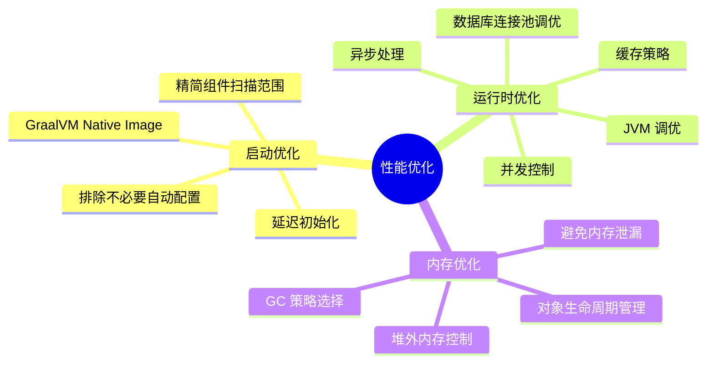

# Spring Boot 性能优化

## 概述

Spring Boot 应用性能优化是一个系统工程,需要从多个维度综合考虑。性能优化不仅影响用户体验,还直接关系到系统的稳定性、资源利用率和运维成本。



### 性能优化的三个维度

#### 1. 启动优化
- **目标**: 减少应用启动时间,提高开发效率和部署速度
- **关注点**: 类加载速度、Bean 初始化时机、自动配置数量
- **适用场景**: 微服务架构、Serverless、容器化部署、开发环境热部署

#### 2. 运行时优化
- **目标**: 提高系统吞吐量,降低响应延迟
- **关注点**: 数据库访问、缓存策略、异步处理、并发控制
- **适用场景**: 高并发系统、实时业务、API 服务

#### 3. 内存优化
- **目标**: 降低内存占用,减少 GC 压力,避免内存泄漏
- **关注点**: 对象生命周期、内存分配策略、垃圾回收调优
- **适用场景**: 内存受限环境、长时间运行服务、大数据处理

### 性能优化原则

1. **先监控后优化**: 建立完善的监控体系,基于数据驱动优化决策
2. **抓主要矛盾**: 遵循 80/20 原则,优先解决影响最大的性能瓶颈
3. **适度优化**: 过早优化是万恶之源,在性能与可维护性之间取得平衡
4. **持续迭代**: 性能优化是一个持续过程,需要定期评估和调整

::: tip 性能优化的正确顺序
**度量 → 定位瓶颈 → 优化 → 验证**。永远不要凭直觉优化——先用 Actuator、JFR（Java Flight Recorder）、Arthas 等工具采集数据，找到真正的瓶颈点，再针对性优化。90% 的性能问题来自 10% 的代码，盲目优化只会增加复杂度。
:::

::: danger 连接池耗尽导致级联故障
某电商系统在促销期间，HikariCP 连接池默认配置（maximum-pool-size=10）不足以支撑并发请求。当请求量激增时，所有连接被占满，新请求在 `connectionTimeout` 内无法获取连接，抛出 `SQLTransientConnectionException`。由于上游服务有重试机制，重试请求进一步加剧了连接池压力，最终导致整个服务雪崩。

**根因**：连接池大小未根据实际负载调整，且缺少合理的 `connectionTimeout` 和 `leakDetectionThreshold` 配置。

**修复**：根据公式 `connections = ((core_count * 2) + effective_spindle_count)` 计算连接池大小，设置 `connectionTimeout=3000`、`leakDetectionThreshold=60000`，并添加 Hystrix/Sentinel 熔断保护。
:::

## 一、应用启动优化

### 1.1 延迟初始化

#### 概念与原理

**延迟初始化(Lazy Initialization)** 是 Spring Boot 提供的一种优化机制,允许 Bean 在首次被使用时才进行实例化,而不是在应用启动时全部初始化。

**工作原理**:
- Spring 容器启动时只创建必要的 Bean(如配置类、核心组件)
- 其他 Bean 标记为懒加载,延迟到实际使用时创建
- 可以显著减少启动时间,但首次请求可能略慢

#### 配置方式

**方式一:全局配置**

```yaml
# application.yml
spring:
  main:
    lazy-initialization: true  # 启用全局延迟初始化
```

**方式二:代码配置**

```java
@SpringBootApplication
public class Application {
    public static void main(String[] args) {
        SpringApplication app = new SpringApplication(Application.class);
        app.setLazyInitialization(true);  // 手动设置
        app.run(args);
    }
}
```

**方式三:针对特定 Bean**

```java
@Service
@Lazy  // 该 Service 延迟初始化
public class HeavyService {
    public HeavyService() {
        // 耗时的初始化逻辑
        System.out.println("HeavyService 初始化...");
    }
    
    public void doWork() {
        System.out.println("执行业务逻辑");
    }
}

@RestController
public class UserController {
    
    @Autowired
    @Lazy  // 延迟注入
    private HeavyService heavyService;
    
    @GetMapping("/work")
    public String work() {
        heavyService.doWork();  // 首次调用时才初始化
        return "done";
    }
}
```

#### 使用场景与注意事项

**适用场景**:
- 微服务架构中,服务启动速度要求高
- 开发环境频繁重启,需要快速启动
- 部分 Bean 初始化耗时长但使用频率低

**注意事项**:
```java
// × 错误示例:延迟初始化的 Bean 在启动时被依赖
@Component
public class StartupRunner implements CommandLineRunner {
    
    @Autowired
    private HeavyService heavyService;  // 会在启动时触发初始化
    
    @Override
    public void run(String... args) {
        heavyService.doWork();  // 导致延迟初始化失效
    }
}

// √ 正确示例:合理使用延迟初始化
@Component
public class StartupRunner implements CommandLineRunner {
    
    @Override
    public void run(String... args) {
        // 只执行必要的启动逻辑
        System.out.println("应用启动完成");
    }
}
```

**性能对比**（示例量级,实际取决于应用规模、依赖数量与 Bean 数量）:
```
未启用延迟初始化: 启动时间 8-15 秒
启用延迟初始化: 启动时间 2-5 秒(首次请求延迟约 100-300ms)
```

### 1.2 排除不必要的自动配置

#### 自动配置原理

Spring Boot 通过 `@EnableAutoConfiguration` 自动配置大量组件,虽然方便,但会带来启动开销。排除不需要的自动配置可以:
- 减少类加载时间
- 减少 Bean 创建时间
- 降低内存占用

#### 排除方式

**方式一:注解方式排除**

```java
@SpringBootApplication(exclude = {
    DataSourceAutoConfiguration.class,      // 排除数据源自动配置
    HibernateJpaAutoConfiguration.class,    // 排除 JPA 自动配置
    RabbitAutoConfiguration.class,          // 排除 RabbitMQ 自动配置
    MongoAutoConfiguration.class            // 排除 MongoDB 自动配置
})
public class Application {
    public static void main(String[] args) {
        SpringApplication.run(Application.class, args);
    }
}
```

**方式二:配置文件排除**

```yaml
spring:
  autoconfigure:
    exclude:
      - org.springframework.boot.autoconfigure.jdbc.DataSourceAutoConfiguration
      - org.springframework.boot.autoconfigure.orm.jpa.HibernateJpaAutoConfiguration
      - org.springframework.boot.autoconfigure.amqp.RabbitAutoConfiguration
```

**方式三:条件化自动配置**

```java
// 自定义条件,按需加载
@Configuration
@ConditionalOnProperty(name = "cache.enabled", havingValue = "true")
public class CacheConfiguration {
    @Bean
    public CacheManager cacheManager() {
        return new ConcurrentMapCacheManager();
    }
}
```

#### 查看当前自动配置

```bash
# 启动时打印自动配置报告
java -jar app.jar --debug

# 或在 application.yml 中配置
debug: true
```

**自动配置报告示例**:
```
============================
CONDITIONS EVALUATION REPORT
============================

Positive matches:
-----------------
   DataSourceAutoConfiguration matched:
      - @ConditionalOnClass found required classes 'javax.sql.DataSource', 'org.springframework.jdbc.datasource.embedded.EmbeddedDatabaseType' (OnClassCondition)

Negative matches:
-----------------
   ActiveMQAutoConfiguration:
      Did not match:
         - @ConditionalOnClass did not find required class 'jakarta.jms.ConnectionFactory' (OnClassCondition)
```

### 1.3 优化类加载

#### 类加载优化策略

**1. 使用 thin jar（可选方案）**

```xml
<!-- 使用 spring-boot-thin-launcher -->
<dependency>
    <groupId>org.springframework.boot.experimental</groupId>
    <artifactId>spring-boot-thin-layout</artifactId>
    <version>1.0.28.RELEASE</version>
</dependency>
```

**2. 配置类加载优化**

```yaml
spring:
  devtools:
    restart:
      enabled: false  # 生产环境禁用 devtools
  main:
    banner-mode: off  # 关闭启动 banner,略微提升启动速度
    log-startup-info: false  # 关闭启动日志
```

**3. 使用分层 JAR**

```xml
<build>
    <plugins>
        <plugin>
            <groupId>org.springframework.boot</groupId>
            <artifactId>spring-boot-maven-plugin</artifactId>
            <configuration>
                <layers>
                    <enabled>true</enabled>
                </layers>
            </configuration>
        </plugin>
    </plugins>
</build>
```

**分层构建 Docker 镜像**:
```dockerfile
# openjdk:11 已过时，使用 eclipse-temurin LTS（21）
FROM eclipse-temurin:21-jre as builder
WORKDIR application
ARG JAR_FILE=target/*.jar
COPY ${JAR_FILE} application.jar
RUN java -Djarmode=layertools -jar application.jar extract

FROM eclipse-temurin:21-jre
WORKDIR application
COPY --from=builder application/dependencies/ ./
COPY --from=builder application/spring-boot-loader/ ./
COPY --from=builder application/snapshot-dependencies/ ./
COPY --from=builder application/application/ ./
ENTRYPOINT ["java", "org.springframework.boot.loader.JarLauncher"]
```

### 1.4 启动监控与分析

#### 使用 Spring Boot Actuator

```xml
<dependency>
    <groupId>org.springframework.boot</groupId>
    <artifactId>spring-boot-starter-actuator</artifactId>
</dependency>
```

```yaml
# application.yml
management:
  endpoints:
    web:
      exposure:
        include: startup,beans,conditions
  endpoint:
    startup:
      enabled: true
```

**访问启动分析端点**:
```bash
curl http://localhost:8080/actuator/startup
```

**启动分析报告示例**:
```json
{
  "springBootVersion": "3.5.0",
  "timeline": {
    "startTime": "2024-01-01T10:00:00.000Z",
    "events": [
      {
        "startupStep": {
          "name": "spring.boot.application.starting",
          "id": 1,
          "parentId": 0
        },
        "startTime": "2024-01-01T10:00:00.000Z",
        "endTime": "2024-01-01T10:00:00.100Z",
        "duration": "100ms"
      },
      {
        "startupStep": {
          "name": "spring.context.beans.factory.pre-instantiate",
          "id": 2,
          "parentId": 1
        },
        "startTime": "2024-01-01T10:00:00.100Z",
        "endTime": "2024-01-01T10:00:05.000Z",
        "duration": "4.9s"
      }
    ]
  }
}
```

#### 使用 Java Flight Recorder (JFR)

```bash
# 启动时启用 JFR
java -XX:StartFlightRecording=duration=60s,filename=startup.jfr -jar app.jar

# 使用 JDK Mission Control 分析 startup.jfr 文件
```

### 1.5 启动优化最佳实践

**检查清单**:
```
□ 启用延迟初始化(适用场景)
□ 排除不必要的自动配置
□ 关闭开发工具(devtools)
□ 关闭启动 banner
□ 使用分层 JAR 优化容器镜像
□ 分析启动报告,识别耗时操作
□ 优化数据库连接池初始化
□ 避免启动时执行耗时任务
```

**代码示例:优化后的启动类**:

```java
@SpringBootApplication(
    exclude = {
        DataSourceAutoConfiguration.class,  // 按需排除
    }
)
public class Application {
    
    public static void main(String[] args) {
        // 关闭 banner
        SpringApplication app = new SpringApplication(Application.class);
        app.setBannerMode(Banner.Mode.OFF);
        // 启用延迟初始化(@SpringBootApplication 没有 lazyInitialization 属性,
        // 需通过 API 或配置项 spring.main.lazy-initialization=true 设置)
        app.setLazyInitialization(true);
        
        // 设置启动监听器
        app.addListeners(event -> {
            if (event instanceof ApplicationStartedEvent) {
                long startTime = ((ApplicationStartedEvent) event).getTimeTaken().toMillis();
                System.out.println("启动耗时: " + startTime + "ms");
            }
        });
        
        app.run(args);
    }
}
```

## 二、数据库性能优化

### 2.1 连接池优化

#### HikariCP 连接池配置

Spring Boot 默认使用 HikariCP 作为数据库连接池,它是目前性能最高的连接池实现。

```yaml
spring:
  datasource:
    type: com.zaxxer.hikari.HikariDataSource
    hikari:
      # 基本配置
      maximum-pool-size: 20              # 最大连接数
      minimum-idle: 5                     # 最小空闲连接数
      
      # 超时配置
      connection-timeout: 30000           # 连接超时时间(ms)
      idle-timeout: 600000                # 空闲连接超时时间(ms)
      max-lifetime: 1800000              # 连接最大生命周期(ms)
      validation-timeout: 3000           # 连接验证超时(ms)
      
      # 连接测试
      connection-test-query: SELECT 1    # 连接测试查询
      
      # 泄漏检测
      leak-detection-threshold: 60000    # 连接泄漏检测阈值(ms)
      
      # 性能优化
      pool-name: MyHikariCP              # 连接池名称
```

#### 连接池参数详解

**1. maximum-pool-size(最大连接数)**

```java
// 计算公式(经验值)
// 连接数 = (核心数 * 2) + 有效磁盘数

// 示例:8 核 CPU + 1 块磁盘
maximum-pool-size: (8 * 2) + 1 = 17

// 不同场景推荐值
// 低并发应用: 10-20
// 中等并发应用: 20-50
// 高并发应用: 50-100(需要根据数据库承载能力调整)
```

**2. minimum-idle(最小空闲连接数)**

```yaml
# 推荐与 maximum-pool-size 相同,避免频繁创建连接
spring:
  datasource:
    hikari:
      minimum-idle: 20
      maximum-pool-size: 20
```

**3. 连接池监控**

```java
@Component
public class HikariPoolMonitor {
    
    @Autowired
    private DataSource dataSource;
    
    @Scheduled(fixedRate = 60000)  // 每分钟监控一次
    public void monitorPool() {
        if (dataSource instanceof HikariDataSource) {
            HikariPoolMXBean pool = ((HikariDataSource) dataSource).getHikariPoolMXBean();
            
            log.info("连接池监控 - 活跃连接: {}, 空闲连接: {}, 总连接: {}, 等待线程: {}",
                pool.getActiveConnections(),
                pool.getIdleConnections(),
                pool.getTotalConnections(),
                pool.getThreadsAwaitingConnection()
            );
        }
    }
}
```

#### Druid 连接池(可选方案)

```xml
<!-- Boot 3.x 需使用 druid-spring-boot-3-starter（旧版 druid-spring-boot-starter 不兼容 Boot 3 自动配置） -->
<dependency>
    <groupId>com.alibaba</groupId>
    <artifactId>druid-spring-boot-3-starter</artifactId>
    <version>1.2.23</version>
</dependency>
```

```yaml
spring:
  datasource:
    type: com.alibaba.druid.pool.DruidDataSource
    druid:
      initial-size: 5
      min-idle: 5
      max-active: 20
      max-wait: 60000
      
      # 监控配置
      stat-view-servlet:
        enabled: true
        url-pattern: /druid/*
        login-username: admin
        login-password: admin
      
      # SQL 监控
      filter:
        stat:
          enabled: true
          slow-sql-millis: 3000
          log-slow-sql: true
```

### 2.2 SQL 查询优化

#### 使用投影减少数据传输

```java
// 1. 接口投影(动态代理)
public interface UserProjection {
    Long getId();
    String getUsername();
    String getEmail();
}

public interface UserRepository extends JpaRepository<User, Long> {
    
    @Query("SELECT u.id as id, u.username as username, u.email as email FROM User u")
    List<UserProjection> findAllProjections();
}

// 2. 类投影(性能更好)
public record UserDto(Long id, String username, String email) {}

@Query("SELECT new com.example.dto.UserDto(u.id, u.username, u.email) FROM User u")
List<UserDto> findAllDto();

// 3. 原生 SQL 投影
@Query(value = "SELECT id, username FROM users", nativeQuery = true)
List<Object[]> findAllNative();
```

#### 避免N+1查询问题

```java
// × 错误示例:N+1 查询问题
@Service
public class OrderService {
    
    @Autowired
    private OrderRepository orderRepository;
    
    public List<OrderDto> getOrders() {
        List<Order> orders = orderRepository.findAll();  // 1 次查询
        
        return orders.stream()
            .map(order -> {
                OrderDto dto = new OrderDto();
                dto.setId(order.getId());
                dto.setUserName(order.getUser().getName());  // N 次查询!
                return dto;
            })
            .collect(Collectors.toList());
    }
}

// √ 正确示例:使用 JOIN FETCH
public interface OrderRepository extends JpaRepository<Order, Long> {
    
    @Query("SELECT o FROM Order o LEFT JOIN FETCH o.user")
    List<Order> findAllWithUser();
    
    @EntityGraph(attributePaths = {"user", "items"})
    List<Order> findAll();
}

// √ 正确示例:批量查询
@Service
public class OrderService {
    
    public List<OrderDto> getOrders() {
        List<Order> orders = orderRepository.findAll();
        
        // 批量获取用户信息
        Set<Long> userIds = orders.stream()
            .map(Order::getUserId)
            .collect(Collectors.toSet());
        
        Map<Long, User> userMap = userRepository.findAllById(userIds)
            .stream()
            .collect(Collectors.toMap(User::getId, Function.identity()));
        
        return orders.stream()
            .map(order -> {
                OrderDto dto = new OrderDto();
                dto.setId(order.getId());
                dto.setUserName(userMap.get(order.getUserId()).getName());
                return dto;
            })
            .collect(Collectors.toList());
    }
}
```

#### 分页查询优化

```java
// 1. 使用 Spring Data 分页
public interface UserRepository extends JpaRepository<User, Long> {
    
    Page<User> findByStatus(String status, Pageable pageable);
}

// 使用示例
@Service
public class UserService {
    
    public Page<User> getUsers(int page, int size) {
        Pageable pageable = PageRequest.of(page, size, Sort.by("createTime").descending());
        return userRepository.findByStatus("ACTIVE", pageable);
    }
}

// 2. 深度分页优化
// × 错误示例:深度分页性能差
SELECT * FROM users ORDER BY id LIMIT 100000, 20;

// √ 正确示例:使用游标分页(原生 SQL)
@Query(value = "SELECT * FROM users u WHERE u.id > :lastId ORDER BY u.id LIMIT :limit", nativeQuery = true)
List<User> findNextPage(@Param("lastId") Long lastId, @Param("limit") int limit);

// 使用示例
public List<User> getNextPage(Long lastId, int limit) {
    if (lastId == null) {
        lastId = 0L;
    }
    return userRepository.findNextPage(lastId, limit);
}
```

### 2.3 批量操作优化

#### JPA 批量插入

```yaml
spring:
  jpa:
    properties:
      hibernate:
        jdbc:
          batch_size: 50              # 批量大小
          batch_versioned_data: true
        order_inserts: true           # 排序 INSERT
        order_updates: true           # 排序 UPDATE
```

```java
@Service
public class BatchInsertService {
    
    @Autowired
    private EntityManager entityManager;
    
    @Transactional
    public void batchInsert(List<User> users) {
        int batchSize = 50;
        
        for (int i = 0; i < users.size(); i++) {
            entityManager.persist(users.get(i));
            
            if (i % batchSize == 0 && i > 0) {
                // 刷新到数据库
                entityManager.flush();
                entityManager.clear();
            }
        }
    }
}

// 或使用 Spring Data JPA
@Repository
public interface UserRepository extends JpaRepository<User, Long> {
    
    @Modifying
    @Query("INSERT INTO User (username, email) VALUES (:username, :email)")
    void batchInsert(@Param("username") String username, @Param("email") String email);
}
```

#### JDBC 批量操作

```java
@Service
public class JdbcBatchService {
    
    @Autowired
    private JdbcTemplate jdbcTemplate;
    
    public void batchInsert(List<User> users) {
        jdbcTemplate.batchUpdate(
            "INSERT INTO users (username, email, status) VALUES (?, ?, ?)",
            users,
            100,  // 批量大小
            (PreparedStatement ps, User user) -> {
                ps.setString(1, user.getUsername());
                ps.setString(2, user.getEmail());
                ps.setString(3, user.getStatus());
            }
        );
    }
    
    // 使用 NamedParameterJdbcTemplate
    @Autowired
    private NamedParameterJdbcTemplate namedJdbcTemplate;
    
    public void batchInsertWithNamed(List<User> users) {
        SqlParameterSource[] batchArgs = users.stream()
            .map(user -> new MapSqlParameterSource()
                .addValue("username", user.getUsername())
                .addValue("email", user.getEmail()))
            .toArray(SqlParameterSource[]::new);
        
        namedJdbcTemplate.batchUpdate(
            "INSERT INTO users (username, email) VALUES (:username, :email)",
            batchArgs
        );
    }
}
```

### 2.4 索引优化

#### 索引设计与使用

```java
// 1. 实体类索引定义
@Entity
@Table(name = "users", indexes = {
    @Index(name = "idx_username", columnList = "username"),
    @Index(name = "idx_email", columnList = "email"),
    @Index(name = "idx_create_time", columnList = "create_time"),
    @Index(name = "idx_status_create_time", columnList = "status, create_time")  // 复合索引
})
public class User {
    @Id
    @GeneratedValue(strategy = GenerationType.IDENTITY)
    private Long id;
    
    @Column(unique = true)
    private String username;
    
    private String email;
    
    private String status;
    
    private LocalDateTime createTime;
}

// 2. 查询时使用索引
public interface UserRepository extends JpaRepository<User, Long> {
    
    // √ 使用索引
    @Query("SELECT u FROM User u WHERE u.username = :username")
    Optional<User> findByUsername(@Param("username") String username);
    
    // √ 使用复合索引
    @Query("SELECT u FROM User u WHERE u.status = :status AND u.createTime > :startTime")
    List<User> findByStatusAndCreateTimeAfter(
        @Param("status") String status,
        @Param("startTime") LocalDateTime startTime
    );
    
    // × 错误示例:索引失效
    @Query("SELECT u FROM User u WHERE LOWER(u.username) = LOWER(:username)")
    Optional<User> findByUsernameIgnoreCase(@Param("username") String username);  // 函数导致索引失效
}
```

#### 索引监控与分析

```java
@Component
public class IndexAnalyzer {
    
    @Autowired
    private JdbcTemplate jdbcTemplate;
    
    public void analyzeIndexUsage() {
        // MySQL 查看索引使用情况
        String sql = "SELECT " +
            "INDEX_NAME, " +
            "TABLE_NAME, " +
            "CARDINALITY, " +
            "SEQ_IN_INDEX " +
            "FROM information_schema.STATISTICS " +
            "WHERE TABLE_SCHEMA = DATABASE()";
        
        jdbcTemplate.query(sql, (rs) -> {
            System.out.println("索引: " + rs.getString("INDEX_NAME") +
                ", 表: " + rs.getString("TABLE_NAME") +
                ", 基数: " + rs.getLong("CARDINALITY"));
        });
    }
}
```

### 2.5 读写分离与分库分表

#### 读写分离配置

```yaml
spring:
  datasource:
    master:
      jdbc-url: jdbc:mysql://master:3306/db
      username: root
      password: password
    slave:
      jdbc-url: jdbc:mysql://slave:3306/db
      username: root
      password: password
```

```java
@Configuration
public class DataSourceConfig {
    
    @Bean
    @ConfigurationProperties(prefix = "spring.datasource.master")
    public DataSource masterDataSource() {
        return DataSourceBuilder.create().build();
    }
    
    @Bean
    @ConfigurationProperties(prefix = "spring.datasource.slave")
    public DataSource slaveDataSource() {
        return DataSourceBuilder.create().build();
    }
    
    @Bean
    @Primary
    public DataSource routingDataSource(
            @Qualifier("masterDataSource") DataSource masterDataSource,
            @Qualifier("slaveDataSource") DataSource slaveDataSource) {
        
        Map<Object, Object> targetDataSources = new HashMap<>();
        targetDataSources.put("master", masterDataSource);
        targetDataSources.put("slave", slaveDataSource);
        
        RoutingDataSource routingDataSource = new RoutingDataSource();
        routingDataSource.setDefaultTargetDataSource(masterDataSource);
        routingDataSource.setTargetDataSources(targetDataSources);
        
        return routingDataSource;
    }
}

// 自定义路由数据源
public class RoutingDataSource extends AbstractRoutingDataSource {
    
    @Override
    protected Object determineCurrentLookupKey() {
        return DbContextHolder.getDbType();
    }
}

// 数据源上下文
public class DbContextHolder {
    
    private static final ThreadLocal<String> contextHolder = new ThreadLocal<>();
    
    public static void setDbType(String dbType) {
        contextHolder.set(dbType);
    }
    
    public static String getDbType() {
        return contextHolder.get();
    }
    
    public static void clearDbType() {
        contextHolder.remove();
    }
}

// 使用示例
@Service
public class UserService {
    
    @Autowired
    private UserRepository userRepository;
    
    @Transactional(readOnly = true)
    public User getUser(Long id) {
        DbContextHolder.setDbType("slave");  // 使用从库
        return userRepository.findById(id).orElse(null);
    }
    
    @Transactional
    public User saveUser(User user) {
        DbContextHolder.setDbType("master");  // 使用主库
        return userRepository.save(user);
    }
}
```

## 三、缓存优化

### 3.1 缓存概述

#### 缓存的作用

- **降低数据库压力**: 减少重复查询
- **提高响应速度**: 内存访问远快于磁盘 I/O
- **提升系统吞吐量**: 缓解数据库瓶颈
- **降低成本**: 减少数据库资源消耗

#### 缓存类型

1. **本地缓存**: 单机缓存,速度快但容量有限
   - ConcurrentHashMap
   - Caffeine
   - Guava Cache

2. **分布式缓存**: 多机共享,支持集群
   - Redis
   - Memcached

3. **多级缓存**: 组合使用,兼顾性能与一致性
   - L1: 本地缓存(速度快)
   - L2: 分布式缓存(容量大)

### 3.2 本地缓存

#### Caffeine 缓存

```xml
<dependency>
    <groupId>com.github.ben-manes.caffeine</groupId>
    <artifactId>caffeine</artifactId>
    <version>3.1.8</version>
</dependency>
```

```java
@Configuration
public class CacheConfig {
    
    @Bean
    public CacheManager cacheManager() {
        CaffeineCacheManager cacheManager = new CaffeineCacheManager();
        cacheManager.setCaffeine(Caffeine.newBuilder()
            .initialCapacity(100)                    // 初始容量
            .maximumSize(1000)                       // 最大容量
            .expireAfterWrite(10, TimeUnit.MINUTES) // 写入后过期
            .expireAfterAccess(5, TimeUnit.MINUTES) // 访问后过期
            .recordStats()                           // 记录统计信息
        );
        return cacheManager;
    }
}

// 手动创建缓存
@Service
public class UserService {
    
    private final Cache<Long, User> userCache = Caffeine.newBuilder()
        .maximumSize(1000)
        .expireAfterWrite(10, TimeUnit.MINUTES)
        .removalListener((key, value, cause) -> {
            log.info("缓存移除: key={}, cause={}", key, cause);
        })
        .build();
    
    public User getUser(Long id) {
        return userCache.get(id, key -> {
            // 缓存未命中时执行
            return userRepository.findById(id).orElse(null);
        });
    }
    
    public void updateUser(User user) {
        userRepository.save(user);
        userCache.put(user.getId(), user);  // 更新缓存
    }
}
```

#### 监控缓存性能

```java
@Component
public class CacheMonitor {
    
    @Autowired
    private CacheManager cacheManager;
    
    @Scheduled(fixedRate = 60000)
    public void monitorCache() {
        for (String cacheName : cacheManager.getCacheNames()) {
            // nativeCache 是 Caffeine 原生缓存对象,不要强转为 Spring 的 org.springframework.cache.Cache
            com.github.benmanes.caffeine.cache.Cache<Object, Object> nativeCache =
                (com.github.benmanes.caffeine.cache.Cache<Object, Object>)
                    cacheManager.getCache(cacheName).getNativeCache();
            
            com.github.benmanes.caffeine.cache.stats.CacheStats stats = nativeCache.stats();
            
            log.info("缓存 {} 统计 - 命中率: {}, 命中次数: {}, 未命中次数: {}, 淘汰次数: {}",
                cacheName,
                stats.hitRate(),
                stats.hitCount(),
                stats.missCount(),
                stats.evictionCount()
            );
        }
    }
}
```

### 3.3 分布式缓存(Redis)

#### Redis 基本配置

```xml
<dependency>
    <groupId>org.springframework.boot</groupId>
    <artifactId>spring-boot-starter-data-redis</artifactId>
</dependency>
```

```yaml
# Boot 3.x 起属性前缀迁移为 spring.data.redis.*（2.x 为 spring.redis.*）
spring:
  data:
    redis:
      host: localhost
      port: 6379
      password: password
      database: 0
      timeout: 3000
      lettuce:
        pool:
          max-active: 20
          max-idle: 10
          min-idle: 5
          max-wait: 3000
```

#### 使用 Spring Cache 注解

```java
@SpringBootApplication
@EnableCaching
public class Application {
    public static void main(String[] args) {
        SpringApplication.run(Application.class, args);
    }
}

// 自定义缓存配置
@Configuration
public class RedisCacheConfig {
    
    @Bean
    public RedisCacheManager cacheManager(RedisConnectionFactory factory) {
        RedisCacheConfiguration config = RedisCacheConfiguration.defaultCacheConfig()
            .entryTtl(Duration.ofMinutes(10))           // 默认过期时间
            .disableCachingNullValues()                 // 不缓存 null 值
            .serializeKeysWith(RedisSerializationContext.SerializationPair
                .fromSerializer(new StringRedisSerializer()))
            .serializeValuesWith(RedisSerializationContext.SerializationPair
                .fromSerializer(new GenericJackson2JsonRedisSerializer()));
        
        // 不同缓存空间使用不同配置
        Map<String, RedisCacheConfiguration> cacheConfigurations = new HashMap<>();
        cacheConfigurations.put("users", config.entryTtl(Duration.ofMinutes(30)));
        cacheConfigurations.put("products", config.entryTtl(Duration.ofMinutes(60)));
        
        return RedisCacheManager.builder(factory)
            .cacheDefaults(config)
            .withInitialCacheConfigurations(cacheConfigurations)
            .transactionAware()
            .build();
    }
}

// 使用缓存注解
@Service
public class ProductService {
    
    @Autowired
    private ProductRepository productRepository;
    
    // 查询时缓存
    @Cacheable(value = "products", key = "#id", unless = "#result == null")
    public Product getProduct(Long id) {
        return productRepository.findById(id).orElse(null);
    }
    
    // 更新时刷新缓存
    @CachePut(value = "products", key = "#product.id")
    public Product updateProduct(Product product) {
        return productRepository.save(product);
    }
    
    // 删除时清除缓存
    @CacheEvict(value = "products", key = "#id")
    public void deleteProduct(Long id) {
        productRepository.deleteById(id);
    }
    
    // 清除所有缓存
    @CacheEvict(value = "products", allEntries = true)
    public void clearAllProducts() {
        // 清除所有产品缓存
    }
    
    // 组合缓存
    @Caching(
        cacheable = @Cacheable(value = "products", key = "#id"),
        evict = @CacheEvict(value = "productList", allEntries = true)
    )
    public Product getProductAndClearList(Long id) {
        return productRepository.findById(id).orElse(null);
    }
}
```

#### Redis 高级使用

```java
@Service
public class AdvancedRedisService {
    
    @Autowired
    private RedisTemplate<String, Object> redisTemplate;
    
    // 使用 Hash 存储对象
    public void saveUserToHash(User user) {
        String key = "user:" + user.getId();
        Map<String, Object> userMap = new HashMap<>();
        userMap.put("id", user.getId());
        userMap.put("username", user.getUsername());
        userMap.put("email", user.getEmail());
        
        redisTemplate.opsForHash().putAll(key, userMap);
        redisTemplate.expire(key, 30, TimeUnit.MINUTES);
    }
    
    // 批量操作(Pipeline)
    public void batchInsert(List<User> users) {
        redisTemplate.executePipelined((RedisCallback<Object>) connection -> {
            users.forEach(user -> {
                String key = "user:" + user.getId();
                connection.set(key.getBytes(), serialize(user));
            });
            return null;
        });
    }
    
    // 分布式锁
    public boolean tryLock(String key, long expireTime) {
        return Boolean.TRUE.equals(
            redisTemplate.opsForValue().setIfAbsent(
                "lock:" + key,
                "locked",
                expireTime,
                TimeUnit.SECONDS
            )
        );
    }
    
    public void unlock(String key) {
        redisTemplate.delete("lock:" + key);
    }
    
    // 计数器
    public Long increment(String key) {
        return redisTemplate.opsForValue().increment(key);
    }
    
    // 限流
    public boolean isRateLimited(String userId, int maxRequests, int periodSeconds) {
        String key = "rate_limit:" + userId;
        Long count = redisTemplate.opsForValue().increment(key);
        
        if (count != null && count == 1) {
            redisTemplate.expire(key, periodSeconds, TimeUnit.SECONDS);
        }
        
        return count != null && count > maxRequests;
    }
}
```

### 3.4 多级缓存

```java
@Service
public class MultiLevelCacheService {
    
    @Autowired
    private CacheManager localCacheManager;  // Caffeine
    
    @Autowired
    private RedisTemplate<String, Object> redisTemplate;
    
    @Autowired
    private ProductRepository productRepository;
    
    /**
     * 多级缓存查询: L1(本地缓存) -> L2(Redis) -> DB
     */
    public Product getProduct(Long id) {
        String key = "product:" + id;
        
        // L1: 本地缓存(nativeCache 是 Caffeine 原生缓存)
        @SuppressWarnings("unchecked")
        com.github.benmanes.caffeine.cache.Cache<String, Product> l1Cache =
            (com.github.benmanes.caffeine.cache.Cache<String, Product>)
                localCacheManager.getCache("products").getNativeCache();
        Product product = l1Cache.getIfPresent(key);
        if (product != null) {
            return product;
        }
        
        // L2: Redis 缓存
        product = (Product) redisTemplate.opsForValue().get(key);
        if (product != null) {
            // 回填 L1 缓存
            l1Cache.put(key, product);
            return product;
        }
        
        // L3: 数据库
        product = productRepository.findById(id).orElse(null);
        if (product != null) {
            // 回填 L2 和 L1 缓存
            redisTemplate.opsForValue().set(key, product, 30, TimeUnit.MINUTES);
            l1Cache.put(key, product);
        }
        
        return product;
    }
    
    /**
     * 更新时清除多级缓存
     */
    public void updateProduct(Product product) {
        String key = "product:" + product.getId();
        
        // 更新数据库
        productRepository.save(product);
        
        // 清除 L2 缓存
        redisTemplate.delete(key);
        
        // 清除 L1 缓存(需要广播通知其他节点)
        @SuppressWarnings("unchecked")
        com.github.benmanes.caffeine.cache.Cache<String, Product> l1Cache =
            (com.github.benmanes.caffeine.cache.Cache<String, Product>)
                localCacheManager.getCache("products").getNativeCache();
        l1Cache.invalidate(key);
    }
}
```

### 3.5 缓存常见问题

#### 1. 缓存穿透

```java
// 问题:查询不存在的数据,缓存和数据库都没有
// 解决:缓存 null 值或使用布隆过滤器

@Service
public class CachePenetrationService {
    
    @Autowired
    private RedisTemplate<String, Object> redisTemplate;
    
    @Autowired
    private BloomFilter<String> bloomFilter;  // 使用 Guava BloomFilter
    
    public Product getProduct(Long id) {
        String key = "product:" + id;
        
        // 方式一:使用布隆过滤器
        if (!bloomFilter.mightContain(key)) {
            return null;  // 一定不存在
        }
        
        // 查询缓存
        Object value = redisTemplate.opsForValue().get(key);
        
        // 缓存 null 值
        if (value instanceof NullValue) {
            return null;
        }
        
        if (value != null) {
            return (Product) value;
        }
        
        // 查询数据库
        Product product = productRepository.findById(id).orElse(null);
        
        if (product != null) {
            redisTemplate.opsForValue().set(key, product, 30, TimeUnit.MINUTES);
            bloomFilter.put(key);  // 添加到布隆过滤器
        } else {
            // 缓存 null 值,防止穿透
            redisTemplate.opsForValue().set(key, NullValue.INSTANCE, 5, TimeUnit.MINUTES);
        }
        
        return product;
    }
}

// 初始化布隆过滤器
@Component
public class BloomFilterInitializer implements CommandLineRunner {
    
    @Autowired
    private ProductRepository productRepository;
    
    private BloomFilter<String> bloomFilter;
    
    @Override
    public void run(String... args) {
        bloomFilter = BloomFilter.create(
            Funnels.stringFunnel(Charset.defaultCharset()),
            1000000,  // 预期元素数量
            0.01      // 误判率
        );
        
        // 初始化时加载所有产品 ID
        productRepository.findAllIds().forEach(id -> {
            bloomFilter.put("product:" + id);
        });
    }
}
```

#### 2. 缓存击穿

```java
// 问题:热点 key 过期,大量请求同时查询数据库
// 解决:加锁或设置热点数据永不过期

@Service
public class CacheBreakdownService {
    
    @Autowired
    private RedisTemplate<String, Object> redisTemplate;
    
    private final Map<String, ReentrantLock> locks = new ConcurrentHashMap<>();
    
    public Product getProduct(Long id) {
        String key = "product:" + id;
        
        // 查询缓存
        Product product = (Product) redisTemplate.opsForValue().get(key);
        if (product != null) {
            return product;
        }
        
        // 获取锁
        ReentrantLock lock = locks.computeIfAbsent(key, k -> new ReentrantLock());
        
        try {
            lock.lock();
            
            // 双重检查
            product = (Product) redisTemplate.opsForValue().get(key);
            if (product != null) {
                return product;
            }
            
            // 查询数据库
            product = productRepository.findById(id).orElse(null);
            
            if (product != null) {
                // 设置较长的过期时间或逻辑过期
                redisTemplate.opsForValue().set(key, product, 1, TimeUnit.HOURS);
            }
            
            return product;
        } finally {
            lock.unlock();
            locks.remove(key);
        }
    }
    
    // 使用 Redis 分布式锁
    public Product getProductWithDistributedLock(Long id) {
        String key = "product:" + id;
        String lockKey = "lock:product:" + id;
        
        Product product = (Product) redisTemplate.opsForValue().get(key);
        if (product != null) {
            return product;
        }
        
        // 尝试获取分布式锁
        Boolean locked = redisTemplate.opsForValue()
            .setIfAbsent(lockKey, "locked", 10, TimeUnit.SECONDS);
        
        if (Boolean.TRUE.equals(locked)) {
            try {
                // 查询数据库
                product = productRepository.findById(id).orElse(null);
                
                if (product != null) {
                    redisTemplate.opsForValue().set(key, product, 30, TimeUnit.MINUTES);
                }
                
                return product;
            } finally {
                redisTemplate.delete(lockKey);
            }
        } else {
            // 获取锁失败,等待并重试
            try {
                Thread.sleep(100);
                return getProductWithDistributedLock(id);
            } catch (InterruptedException e) {
                Thread.currentThread().interrupt();
                return null;
            }
        }
    }
}
```

#### 3. 缓存雪崩

```java
// 问题:大量缓存同时过期,所有请求打到数据库
// 解决:设置随机过期时间 + 限流降级

@Service
public class CacheAvalancheService {
    
    @Autowired
    private RedisTemplate<String, Object> redisTemplate;
    
    /**
     * 批量设置缓存时,添加随机过期时间
     */
    public void batchSetCache(List<Product> products) {
        products.forEach(product -> {
            String key = "product:" + product.getId();
            
            // 基础过期时间 + 随机时间
            long baseExpire = 30 * 60;  // 30 分钟
            long randomExpire = ThreadLocalRandom.current().nextLong(0, 5 * 60);  // 0-5 分钟
            
            redisTemplate.opsForValue().set(
                key,
                product,
                baseExpire + randomExpire,
                TimeUnit.SECONDS
            );
        });
    }
}

// 限流降级配置
@Configuration
public class RateLimiterConfig {
    
    @Bean
    public RateLimiter rateLimiter() {
        return RateLimiter.create(100);  // 每秒 100 个请求
    }
}

@Service
public class ProductApiService {
    
    @Autowired
    private RateLimiter rateLimiter;
    
    public Product getProduct(Long id) {
        // 限流
        if (!rateLimiter.tryAcquire()) {
            throw new RuntimeException("系统繁忙,请稍后再试");
        }
        
        // 查询逻辑...
    }
}
```

## 四、JVM 调优

### 4.1 JVM 内存结构

```
┌─────────────────────────────────────────────────────┐
│                    JVM 内存                          │
├──────────────────┬──────────────────────────────────┤
│                  │          方法区(Method Area)      │
│                  │    (类信息、常量、静态变量)          │
│                  ├──────────────────────────────────┤
│   堆内存(Heap)    │          运行时常量池              │
│  (对象实例、数组) │                                  │
│                  ├──────────────────────────────────┤
│                  │          字符串常量池              │
├──────────────────┴──────────────────────────────────┤
│                 虚拟机栈(Stack)                       │
│              (局部变量、方法调用)                     │
├─────────────────────────────────────────────────────┤
│                 本地方法栈                            │
│              (Native 方法调用)                       │
├─────────────────────────────────────────────────────┤
│                   程序计数器                         │
│               (当前执行字节码行号)                    │
└─────────────────────────────────────────────────────┘
```

### 4.2 内存配置

#### 基础内存参数

```bash
# 基本配置
java -Xms512m -Xmx1024m -XX:MetaspaceSize=128m -XX:MaxMetaspaceSize=256m -jar app.jar

# 参数说明
-Xms512m              # 初始堆大小
-Xmx1024m             # 最大堆大小
-Xmn256m              # 年轻代大小
-XX:MetaspaceSize=128m    # 元空间初始大小
-XX:MaxMetaspaceSize=256m # 元空间最大大小
-XX:SurvivorRatio=8       # Eden:Survivor = 8:1:1
-XX:NewRatio=2            # 新生代:老年代 = 1:2
```

#### 内存配置原则

```java
/**
 * 内存配置建议:
 * 
 * 1. 堆内存配置
 *    - Xms 和 Xmx 设置为相同值,避免动态扩容
 *    - 堆内存 = 系统内存的 50-80%
 *    - 示例:4GB 内存服务器,堆大小设为 2-3GB
 * 
 * 2. 年轻代配置
 *    - 年轻代 = 堆内存的 1/3 到 1/2
 *    - SurvivorRatio 一般设为 8
 * 
 * 3. 元空间配置
 *    - 初始值和最大值设为相同
 *    - 小型应用:128MB
 *    - 中型应用:256MB
 *    - 大型应用:512MB+
 */
```

**配置示例**:

```bash
# 小型应用(2GB 内存服务器)
java -Xms1g -Xmx1g -Xmn512m -XX:MetaspaceSize=128m -XX:MaxMetaspaceSize=128m -jar app.jar

# 中型应用(4GB 内存服务器)
java -Xms2g -Xmx2g -Xmn1g -XX:MetaspaceSize=256m -XX:MaxMetaspaceSize=256m -jar app.jar

# 大型应用(8GB 内存服务器)
java -Xms4g -Xmx4g -Xmn2g -XX:MetaspaceSize=512m -XX:MaxMetaspaceSize=512m -jar app.jar
```

### 4.3 垃圾收集器选择

#### 垃圾收集器对比

| 收集器 | 特点 | 适用场景 | 停顿时间 |
|--------|------|----------|----------|
| Serial | 单线程,简单高效 | 客户端应用、小内存 | 较长 |
| Parallel | 多线程,吞吐量优先 | 批处理、后台计算 | 中等 |
| CMS | 并发标记清除,低停顿 | 互联网应用 | 短(但碎片化) |
| G1 | 分区收集,可预测停顿 | 服务端应用 | 可控 |
| ZGC | 并发整理,极低停顿 | 低延迟应用 | <10ms |

#### G1 垃圾收集器(推荐)

```bash
# G1 基本配置
java -XX:+UseG1GC -XX:MaxGCPauseMillis=200 -XX:G1HeapRegionSize=16m -jar app.jar

# 参数说明
-XX:+UseG1GC                    # 启用 G1 收集器
-XX:MaxGCPauseMillis=200        # 最大 GC 停顿时间目标
-XX:G1HeapRegionSize=16m        # Region 大小(1-32MB,2的幂次)
-XX:InitiatingHeapOccupancyPercent=45  # 堆占用达到 45% 触发并发标记
-XX:G1ReservePercent=15         # 保留空间百分比
-XX:G1NewSizePercent=5          # 新生代最小比例
-XX:G1MaxNewSizePercent=60      # 新生代最大比例
```

**G1 调优示例**:

```bash
# 电商系统配置(注重响应时间)
java -Xms4g -Xmx4g \
  -XX:+UseG1GC \
  -XX:MaxGCPauseMillis=100 \
  -XX:G1HeapRegionSize=16m \
  -XX:InitiatingHeapOccupancyPercent=40 \
  -XX:+ParallelRefProcEnabled \
  -XX:+UseStringDeduplication \
  -jar app.jar

# 大数据处理(注重吞吐量)
java -Xms8g -Xmx8g \
  -XX:+UseG1GC \
  -XX:MaxGCPauseMillis=500 \
  -XX:G1HeapRegionSize=32m \
  -XX:InitiatingHeapOccupancyPercent=50 \
  -jar app.jar
```

#### ZGC 垃圾收集器(JDK 11+)

```bash
# ZGC 配置(JDK 15+推荐生产使用)
java -XX:+UseZGC -XX:ZCollectionInterval=5 -Xmx4g -jar app.jar

# 参数说明
-XX:+UseZGC                      # 启用 ZGC
-XX:ZCollectionInterval=5        # ZGC 触发间隔(秒)
-XX:ZAllocationSpikeTolerance=2  # 分配峰值容忍度
-XX:+UnlockDiagnosticVMOptions   # 解锁诊断选项
-XX:+ZProactive                  # 启用主动回收
```

### 4.4 GC 日志配置

#### JDK 8 GC 日志

```bash
java -XX:+PrintGCDetails \
  -XX:+PrintGCTimeStamps \
  -XX:+PrintGCDateStamps \
  -XX:+PrintGCApplicationStoppedTime \
  -Xloggc:/var/log/gc.log \
  -XX:+UseGCLogFileRotation \
  -XX:NumberOfGCLogFiles=5 \
  -XX:GCLogFileSize=10M \
  -jar app.jar
```

#### JDK 9+ 统一日志

```bash
java -Xlog:gc*:file=/var/log/gc.log:time,uptime,level,tags:filecount=5,filesize=10m -jar app.jar

# 参数说明
# gc*              # 所有 GC 相关日志
# file             # 输出到文件
# time             # 包含时间戳
# uptime           # 包含 JVM 运行时间
# level            # 包含日志级别
# tags             # 包含日志标签
# filecount        # 日志文件数量
# filesize         # 日志文件大小
```

#### GC 日志分析

```bash
# 使用 GCViewer 分析
# 下载: https://github.com/chewiebug/GCViewer

# 使用 GCEasy 在线分析
# 网站: https://gceasy.io/

# 使用 JDK 自带工具
jstat -gcutil <pid> 1000 10  # 每 1 秒输出一次,共 10 次
jstat -gccause <pid>        # 查看 GC 原因
```

### 4.5 JVM 调优实战

#### 案例1:应用启动慢

```bash
# 问题:启动时间 30 秒,太慢
# 分析:
jstat -class <pid>  # 查看类加载情况

# 优化方案
java -Xms2g -Xmx2g \
  -XX:+UseG1GC \
  -XX:+TieredCompilation \
  -XX:TieredStopAtLevel=1 \    # 启动时只使用 C1 编译
  -XX:CICompilerCount=2 \       # 减少编译线程
  -XX:InitialTenuringThreshold=15 \
  -jar app.jar

# 效果:启动时间降至 8 秒
```

#### 案例2:频繁 Full GC

```bash
# 问题:每隔几分钟 Full GC,应用卡顿
# 分析:
jstat -gcutil <pid> 1000  # 观察内存使用

# 发现:老年代占用率持续增长,最终触发 Full GC
# 原因:内存泄漏或堆内存不足

# 优化方案
java -Xms4g -Xmx4g \
  -XX:+UseG1GC \
  -XX:MaxGCPauseMillis=200 \
  -XX:+HeapDumpOnOutOfMemoryError \
  -XX:HeapDumpPath=/var/log/heapdump.hprof \
  -jar app.jar

# 同时排查内存泄漏
jmap -histo:live <pid> | head -20  # 查看对象统计
```

#### 案例3:吞吐量不足

```bash
# 问题:系统吞吐量低,CPU 使用率不高
# 分析:jstat 显示 GC 频繁

# 优化方案
java -Xms4g -Xmx4g \
  -XX:+UseParallelGC \            # 使用 Parallel 收集器
  -XX:ParallelGCThreads=8 \       # GC 线程数
  -XX:NewRatio=2 \                # 新生代:老年代 = 1:2
  -XX:SurvivorRatio=6 \           # Eden:Survivor = 6:1:1
  -XX:MaxTenuringThreshold=15 \   # 对象晋升年龄
  -jar app.jar

# 效果:吞吐量提升 30%
```

### 4.6 JVM 监控工具

#### JDK 自带工具

```bash
# 1. jps:查看 Java 进程
jps -l

# 2. jstat:监控 JVM 状态
jstat -gc <pid> 1000          # 每 1 秒输出一次 GC 状态
jstat -gcutil <pid> 1000      # 输出百分比形式
jstat -class <pid>            # 类加载统计
jstat -compiler <pid>         # JIT 编译统计

# 3. jmap:内存映射工具
jmap -heap <pid>              # 堆内存信息
jmap -histo <pid> | head -20  # 对象统计
jmap -dump:format=b,file=heap.bin <pid>  # 导出堆转储

# 4. jstack:线程堆栈
jstack <pid> > thread.txt     # 导出线程堆栈
jstack -l <pid>               # 包含锁信息

# 5. jinfo:配置信息
jinfo -flags <pid>            # 查看 JVM 参数
jinfo -flag MaxHeapSize <pid> # 查看特定参数

# 6. jcmd:多功能工具
jcmd <pid> VM.flags           # 查看 VM 标志
jcmd <pid> GC.heap_info       # 堆信息
jcmd <pid> Thread.print       # 线程堆栈
jcmd <pid> GC.class_histogram # 类直方图
```

#### 可视化工具

```bash
# 1. JConsole
jconsole

# 2. VisualVM
jvisualvm

# 3. Java Mission Control (JMC)
# 下载: https://www.oracle.com/java/technologies/jdk-mission-control.html

# 4. Arthas(阿里巴巴开源诊断工具)
# 下载: https://arthas.aliyun.com/
curl -O https://arthas.aliyun.com/arthas-boot.jar
java -jar arthas-boot.jar
```

### 4.7 JVM 调优最佳实践

#### 调优流程

```
1. 监控发现问题
   └─ 使用 jstat、jmap、GC 日志分析

2. 分析原因
   └─ 判断是内存不足、内存泄漏、GC 策略不当

3. 制定优化方案
   └─ 调整内存配置、更换 GC 收集器、优化代码

4. 实施优化
   └─ 修改 JVM 参数、部署应用

5. 验证效果
   └─ 对比优化前后的 GC 日志、性能指标

6. 持续监控
   └─ 建立监控体系,定期评估
```

#### 常用 JVM 参数清单

```bash
# 内存配置
-Xms<size>                    # 初始堆大小
-Xmx<size>                    # 最大堆大小
-Xmn<size>                    # 年轻代大小
-XX:MetaspaceSize=<size>      # 元空间初始大小
-XX:MaxMetaspaceSize=<size>   # 元空间最大大小
-XX:NewRatio=<ratio>          # 新生代:老年代比例
-XX:SurvivorRatio=<ratio>     # Eden:Survivor 比例

# GC 收集器
-XX:+UseG1GC                  # 使用 G1
-XX:+UseParallelGC            # 使用 Parallel
-XX:+UseZGC                   # 使用 ZGC

# GC 优化
-XX:MaxGCPauseMillis=<ms>     # 最大 GC 停顿时间
-XX:G1HeapRegionSize=<size>   # G1 Region 大小
-XX:InitiatingHeapOccupancyPercent=<percent>  # G1 触发并发标记阈值

# GC 日志
-Xlog:gc*:file=gc.log:time,uptime,level,tags:filecount=5,filesize=10m

# 故障诊断
-XX:+HeapDumpOnOutOfMemoryError  # OOM 时生成堆转储
-XX:HeapDumpPath=<path>          # 堆转储文件路径
-XX:+PrintGCDetails              # 打印 GC 详情
```

## 五、异步处理与并发优化

### 5.1 异步处理

#### @Async 异步方法

```java
@Configuration
@EnableAsync
public class AsyncConfig implements AsyncConfigurer {
    
    @Override
    public Executor getAsyncExecutor() {
        ThreadPoolTaskExecutor executor = new ThreadPoolTaskExecutor();
        executor.setCorePoolSize(10);           // 核心线程数
        executor.setMaxPoolSize(50);            // 最大线程数
        executor.setQueueCapacity(100);         // 队列容量
        executor.setKeepAliveSeconds(60);       // 空闲线程存活时间
        executor.setThreadNamePrefix("Async-"); // 线程名前缀
        
        // 拒绝策略
        executor.setRejectedExecutionHandler(new ThreadPoolExecutor.CallerRunsPolicy());
        
        executor.initialize();
        return executor;
    }
    
    @Override
    public AsyncUncaughtExceptionHandler getAsyncUncaughtExceptionHandler() {
        return new CustomAsyncExceptionHandler();
    }
}

// 自定义异步异常处理器
public class CustomAsyncExceptionHandler implements AsyncUncaughtExceptionHandler {
    
    @Override
    public void handleUncaughtException(Throwable ex, Method method, Object... params) {
        log.error("异步方法执行异常: method={}, params={}, error={}",
            method.getName(), Arrays.toString(params), ex.getMessage(), ex);
    }
}

// 使用异步方法
@Service
public class EmailService {
    
    @Async
    public CompletableFuture<Void> sendEmailAsync(String to, String subject, String body) {
        // 发送邮件逻辑
        mailSender.send(to, subject, body);
        return CompletableFuture.completedFuture(null);
    }
    
    @Async("customExecutor")  // 指定自定义线程池
    public void processFile(String filePath) {
        // 文件处理逻辑
    }
}

// 调用异步方法
@Service
public class NotificationService {
    
    @Autowired
    private EmailService emailService;
    
    public void notifyUser(User user) {
        // 异步发送邮件
        emailService.sendEmailAsync(user.getEmail(), "通知", "您有新消息")
            .thenRun(() -> log.info("邮件发送完成"))
            .exceptionally(ex -> {
                log.error("邮件发送失败", ex);
                return null;
            });
    }
}
```

### 5.2 线程池优化

#### 自定义线程池

```java
@Configuration
public class ThreadPoolConfig {
    
    // CPU 密集型任务线程池
    @Bean("cpuIntensiveExecutor")
    public Executor cpuIntensiveExecutor() {
        ThreadPoolTaskExecutor executor = new ThreadPoolTaskExecutor();
        int cpuCount = Runtime.getRuntime().availableProcessors();
        executor.setCorePoolSize(cpuCount + 1);
        executor.setMaxPoolSize(cpuCount + 1);
        executor.setQueueCapacity(100);
        executor.setThreadNamePrefix("CPU-");
        executor.initialize();
        return executor;
    }
    
    // IO 密集型任务线程池
    @Bean("ioIntensiveExecutor")
    public Executor ioIntensiveExecutor() {
        ThreadPoolTaskExecutor executor = new ThreadPoolTaskExecutor();
        int cpuCount = Runtime.getRuntime().availableProcessors();
        executor.setCorePoolSize(cpuCount * 2);
        executor.setMaxPoolSize(cpuCount * 4);
        executor.setQueueCapacity(200);
        executor.setThreadNamePrefix("IO-");
        executor.initialize();
        return executor;
    }
    
    // 慢任务线程池
    @Bean("slowTaskExecutor")
    public Executor slowTaskExecutor() {
        ThreadPoolTaskExecutor executor = new ThreadPoolTaskExecutor();
        executor.setCorePoolSize(5);
        executor.setMaxPoolSize(10);
        executor.setQueueCapacity(50);
        executor.setKeepAliveSeconds(300);  // 空闲线程存活 5 分钟
        executor.setThreadNamePrefix("Slow-");
        
        // 拒绝策略:记录日志并丢弃
        executor.setRejectedExecutionHandler((r, e) -> {
            log.warn("任务被拒绝执行: {}", r.toString());
        });
        
        executor.initialize();
        return executor;
    }
}
```

#### 线程池监控

```java
@Component
public class ThreadPoolMonitor {
    
    @Autowired
    @Qualifier("cpuIntensiveExecutor")
    private ThreadPoolTaskExecutor cpuExecutor;
    
    @Scheduled(fixedRate = 60000)
    public void monitorThreadPool() {
        ThreadPoolExecutor pool = cpuExecutor.getThreadPoolExecutor();
        
        log.info("线程池监控 - 核心线程: {}, 最大线程: {}, 当前线程: {}, 活跃线程: {}, 已完成任务: {}, 队列大小: {}",
            pool.getCorePoolSize(),
            pool.getMaximumPoolSize(),
            pool.getPoolSize(),
            pool.getActiveCount(),
            pool.getCompletedTaskCount(),
            pool.getQueue().size()
        );
        
        // 告警逻辑
        if (pool.getActiveCount() >= pool.getMaximumPoolSize() * 0.8) {
            log.warn("线程池使用率超过 80%,请考虑扩容");
        }
    }
}
```

### 5.3 并发控制

#### 使用信号量控制并发

```java
@Service
public class RateLimitedService {
    
    private final Semaphore semaphore = new Semaphore(10);  // 最多 10 个并发
    
    public void doWork() throws InterruptedException {
        try {
            semaphore.acquire();  // 获取许可
            
            // 执行业务逻辑
            process();
            
        } finally {
            semaphore.release();  // 释放许可
        }
    }
    
    private void process() {
        // 业务处理
    }
}
```

#### 使用 RateLimiter 限流

```xml
<dependency>
    <groupId>com.google.guava</groupId>
    <artifactId>guava</artifactId>
    <version>31.1-jre</version>
</dependency>
```

```java
@Service
public class ApiRateLimiter {
    
    // 每秒允许 100 个请求
    private final RateLimiter rateLimiter = RateLimiter.create(100);
    
    // 每个用户每秒 10 个请求
    private final Map<Long, RateLimiter> userRateLimiters = new ConcurrentHashMap<>();
    
    public boolean tryAcquire() {
        return rateLimiter.tryAcquire();
    }
    
    public boolean tryAcquireByUser(Long userId) {
        RateLimiter userLimiter = userRateLimiters.computeIfAbsent(
            userId,
            id -> RateLimiter.create(10)
        );
        return userLimiter.tryAcquire();
    }
}

// 使用示例
@RestController
public class ApiController {
    
    @Autowired
    private ApiRateLimiter rateLimiter;
    
    @GetMapping("/api/data")
    public Result getData() {
        if (!rateLimiter.tryAcquire()) {
            return Result.error("请求过于频繁,请稍后再试");
        }
        
        // 处理请求
        return Result.success(dataService.getData());
    }
}
```

## 六、静态资源优化

### 6.1 静态资源缓存

```yaml
spring:
  web:
    resources:
      # 启用静态资源
      add-mappings: true
      # 静态资源位置
      static-locations: classpath:/static/,classpath:/public/
      # 缓存配置
      cache:
        period: 31536000  # 缓存 1 年(秒)
        cachecontrol:
          max-age: 31536000
          public: true
          immutable: true  # 资源不可变
```

### 6.2 Gzip 压缩

```yaml
server:
  compression:
    enabled: true
    mime-types:
      - text/html
      - text/xml
      - text/plain
      - text/css
      - text/javascript
      - application/javascript
      - application/json
      - application/xml
    min-response-size: 1024  # 最小压缩大小(字节)
```

### 6.3 CDN 加速

```java
@Configuration
public class WebConfig implements WebMvcConfigurer {
    
    @Override
    public void addResourceHandlers(ResourceHandlerRegistry registry) {
        // 映射本地资源
        registry.addResourceHandler("/static/**")
            .addResourceLocations("classpath:/static/")
            .setCacheControl(CacheControl.maxAge(365, TimeUnit.DAYS));
        
        // 映射 CDN 资源
        registry.addResourceHandler("/cdn/**")
            .addResourceLocations("https://cdn.example.com/")
            .setCacheControl(CacheControl.maxAge(30, TimeUnit.DAYS));
    }
}
```

## 七、性能监控与分析

### 7.1 Spring Boot Actuator

```xml
<dependency>
    <groupId>org.springframework.boot</groupId>
    <artifactId>spring-boot-starter-actuator</artifactId>
</dependency>
```

```yaml
management:
  endpoints:
    web:
      exposure:
        # 注意:Boot 3.0 起 httptrace 端点已更名为 httpexchanges
        include: health,info,metrics,prometheus,httpexchanges,loggers
  endpoint:
    health:
      show-details: always
    prometheus:
      enabled: true
  # Boot 3.x 起前缀从 management.metrics.export.prometheus 迁移为 management.prometheus.metrics.export
  prometheus:
    metrics:
      export:
        enabled: true
  metrics:
    tags:
      application: ${spring.application.name}
```

### 7.2 Micrometer 自定义指标

```java
@Component
public class CustomMetrics {
    
    private final Counter userRegistrationCounter;
    private final Timer apiRequestTimer;
    private final Gauge pendingOrdersGauge;
    private final DistributionSummary responseSummary;
    
    public CustomMetrics(MeterRegistry meterRegistry, OrderService orderService) {
        // 计数器
        this.userRegistrationCounter = Counter.builder("user.registrations")
            .description("用户注册数量")
            .tag("type", "normal")
            .register(meterRegistry);
        
        // 计时器
        this.apiRequestTimer = Timer.builder("api.request.duration")
            .description("API 请求耗时")
            .tag("endpoint", "user")
            .publishPercentiles(0.5, 0.95, 0.99)  // 发布百分位数
            .register(meterRegistry);
        
        // 仪表盘
        this.pendingOrdersGauge = Gauge.builder("orders.pending", orderService, OrderService::getPendingCount)
            .description("待处理订单数量")
            .register(meterRegistry);
        
        // 分布摘要
        this.responseSummary = DistributionSummary.builder("response.size")
            .description("响应大小分布")
            .baseUnit("bytes")
            .register(meterRegistry);
    }
    
    public void incrementUserRegistration() {
        userRegistrationCounter.increment();
    }
    
    public void recordApiRequest(Runnable task) {
        apiRequestTimer.record(task);
    }
}
```

### 7.3 APM 工具集成

#### SkyWalking 集成

```bash
# 下载 SkyWalking Agent
# 启动时添加 agent 参数
java -javaagent:/path/to/skywalking-agent.jar \
  -Dskywalking.agent.service_name=myapp \
  -Dskywalking.collector.backend_service=localhost:11800 \
  -jar app.jar
```

#### Zipkin 集成

```xml
<!-- Boot 3.x 起 Sleuth 已被 Micrometer Tracing 取代（2.x 的 spring-cloud-starter-zipkin/sleuth 不再适用） -->
<dependency>
    <groupId>io.micrometer</groupId>
    <artifactId>micrometer-tracing-bridge-brave</artifactId>
</dependency>
<dependency>
    <groupId>io.zipkin.reporter2</groupId>
    <artifactId>zipkin-reporter-brave</artifactId>
</dependency>
```

```yaml
management:
  tracing:
    sampling:
      probability: 1.0  # 采样率 100%
  zipkin:
    tracing:
      endpoint: http://localhost:9411/api/v2/spans
```

## 八、性能优化实战案例

### 8.1 案例一:电商系统性能优化

#### 问题背景

```
系统:电商秒杀系统
问题:
- 秒杀开始时系统响应缓慢
- 数据库 CPU 飙升至 100%
- 大量请求超时
- 库存扣减出现超卖
```

#### 优化方案

**1. 缓存预热**

```java
@Component
public class SeckillCachePreheater implements CommandLineRunner {
    
    @Autowired
    private RedisTemplate<String, Object> redisTemplate;
    
    @Autowired
    private ProductRepository productRepository;
    
    @Override
    public void run(String... args) {
        // 秒杀开始前预热商品信息
        List<Product> products = productRepository.findSeckillProducts();
        
        products.forEach(product -> {
            String key = "seckill:product:" + product.getId();
            
            Map<String, Object> productInfo = new HashMap<>();
            productInfo.put("id", product.getId());
            productInfo.put("name", product.getName());
            productInfo.put("price", product.getPrice());
            productInfo.put("stock", product.getStock());
            
            redisTemplate.opsForHash().putAll(key, productInfo);
            redisTemplate.expire(key, 2, TimeUnit.HOURS);
            
            // 预热库存
            String stockKey = "seckill:stock:" + product.getId();
            redisTemplate.opsForValue().set(stockKey, product.getStock());
        });
    }
}
```

**2. Redis 原子扣减库存**

```java
@Service
public class SeckillService {
    
    @Autowired
    private RedisTemplate<String, Object> redisTemplate;
    
    @Autowired
    private RabbitTemplate rabbitTemplate;
    
    /**
     * 秒杀下单(异步处理)
     */
    public boolean seckill(Long userId, Long productId) {
        String stockKey = "seckill:stock:" + productId;
        
        // Lua 脚本原子扣减库存
        String luaScript = 
            "if redis.call('exists', KEYS[1]) == 1 then " +
            "  local stock = tonumber(redis.call('get', KEYS[1])) " +
            "  if stock > 0 then " +
            "    redis.call('decr', KEYS[1]) " +
            "    return 1 " +
            "  else " +
            "    return 0 " +
            "  end " +
            "else " +
            "  return -1 " +
            "end";
        
        DefaultRedisScript<Long> redisScript = new DefaultRedisScript<>(luaScript, Long.class);
        Long result = redisTemplate.execute(redisScript, Collections.singletonList(stockKey));
        
        if (result != null && result == 1) {
            // 扣减成功,发送消息到 MQ 异步创建订单
            SeckillOrder order = new SeckillOrder(userId, productId);
            rabbitTemplate.convertAndSend("seckill.order", order);
            return true;
        }
        
        return false;
    }
}

// MQ 消费者异步创建订单
@Component
public class SeckillOrderConsumer {
    
    @Autowired
    private OrderService orderService;
    
    @RabbitListener(queues = "seckill.order")
    public void handleOrder(SeckillOrder order) {
        try {
            orderService.createOrder(order);
        } catch (Exception e) {
            // 失败时回滚库存
            redisTemplate.opsForValue().increment("seckill:stock:" + order.getProductId());
        }
    }
}
```

**3. 限流降级**

```java
@RestController
public class SeckillController {
    
    @Autowired
    private RateLimiter rateLimiter;
    
    @Autowired
    private ApiRateLimiter userRateLimiter;  // 按用户限流(见 5.3 节的 tryAcquireByUser)
    
    @Autowired
    private SeckillService seckillService;
    
    @PostMapping("/seckill/buy")
    public Result buy(@RequestParam Long productId, @RequestParam Long userId) {
        // 限流:每秒最多处理 1000 个请求
        if (!rateLimiter.tryAcquire()) {
            return Result.error("系统繁忙,请稍后再试");
        }
        
        // 用户限流:每个用户每秒最多 1 个请求
        if (!userRateLimiter.tryAcquireByUser(userId)) {
            return Result.error("操作过于频繁");
        }
        
        // 执行秒杀
        boolean success = seckillService.seckill(userId, productId);
        
        return success ? Result.success("秒杀成功") : Result.error("商品已售罄");
    }
}
```

**4. 数据库优化**

```java
// 使用乐观锁防止超卖
@Entity
public class Product {
    @Id
    private Long id;
    
    private String name;
    
    private Integer stock;
    
    @Version  // 乐观锁版本号
    private Integer version;
}

@Repository
public interface ProductRepository extends JpaRepository<Product, Long> {
    
    @Modifying
    @Query("UPDATE Product p SET p.stock = p.stock - 1, p.version = p.version + 1 " +
           "WHERE p.id = :id AND p.stock > 0")
    int decreaseStock(@Param("id") Long id);
}
```

#### 优化效果

```
优化前:
- QPS: 500
- 响应时间: 2-5 秒
- 数据库 CPU: 100%
- 超卖问题: 有

优化后:
- QPS: 5000+
- 响应时间: <100ms
- 数据库 CPU: <30%
- 超卖问题: 无
```

### 8.2 案例二:API 服务响应慢优化

#### 问题背景

```
系统:用户信息查询 API
问题:
- 平均响应时间 2-3 秒
- 高峰期大量超时
- 数据库慢查询日志频繁
```

#### 问题分析

```java
// 原始代码
@GetMapping("/user/{id}")
public UserDetail getUserDetail(@PathVariable Long id) {
    User user = userRepository.findById(id).orElse(null);           // 查询 1
    List<Order> orders = orderRepository.findByUserId(id);          // 查询 2
    List<Address> addresses = addressRepository.findByUserId(id);   // 查询 3
    UserDetail detail = new UserDetail();
    detail.setUser(user);
    detail.setOrders(orders);
    detail.setAddresses(addresses);
    return detail;
}
```

**性能问题**:
1. 多次数据库查询(N+1 问题)
2. 没有使用缓存
3. 没有使用索引

#### 优化方案

**1. 优化数据库查询**

```java
// 使用 JOIN FETCH 一次性查询
@Query("SELECT u FROM User u " +
       "LEFT JOIN FETCH u.orders " +
       "LEFT JOIN FETCH u.addresses " +
       "WHERE u.id = :id")
User findUserWithDetails(@Param("id") Long id);

// 优化后的 API
@GetMapping("/user/{id}")
public UserDetail getUserDetail(@PathVariable Long id) {
    User user = userRepository.findUserWithDetails(id);
    if (user == null) {
        throw new UserNotFoundException(id);
    }
    
    UserDetail detail = new UserDetail();
    detail.setUser(user);
    detail.setOrders(user.getOrders());
    detail.setAddresses(user.getAddresses());
    return detail;
}
```

**2. 添加缓存**

```java
@GetMapping("/user/{id}")
@Cacheable(value = "userDetail", key = "#id", unless = "#result == null")
public UserDetail getUserDetail(@PathVariable Long id) {
    // 查询逻辑...
}

@CacheEvict(value = "userDetail", key = "#user.id")
public void updateUser(User user) {
    userRepository.save(user);
}
```

**3. 异步并行查询**

```java
@GetMapping("/user/{id}")
public CompletableFuture<UserDetail> getUserDetail(@PathVariable Long id) {
    // 并行查询
    CompletableFuture<User> userFuture = CompletableFuture.supplyAsync(
        () -> userRepository.findById(id).orElse(null)
    );
    
    CompletableFuture<List<Order>> ordersFuture = CompletableFuture.supplyAsync(
        () -> orderRepository.findByUserId(id)
    );
    
    CompletableFuture<List<Address>> addressesFuture = CompletableFuture.supplyAsync(
        () -> addressRepository.findByUserId(id)
    );
    
    // 合并结果
    return CompletableFuture.allOf(userFuture, ordersFuture, addressesFuture)
        .thenApply(v -> {
            UserDetail detail = new UserDetail();
            detail.setUser(userFuture.join());
            detail.setOrders(ordersFuture.join());
            detail.setAddresses(addressesFuture.join());
            return detail;
        });
}
```

#### 优化效果

```
优化前:
- 平均响应时间: 2-3 秒
- 数据库查询次数: 3 次
- 缓存命中率: 0%

优化后:
- 平均响应时间: 50-100ms
- 数据库查询次数: 1 次
- 缓存命中率: 80%+
```

## 九、常见性能问题与解决方案

### 9.1 内存泄漏

#### 常见原因

```java
// 1. 静态集合类持有对象引用
public class CacheManager {
    private static final Map<String, Object> cache = new HashMap<>();
    
    public void put(String key, Object value) {
        cache.put(key, value);  // 永不释放,导致内存泄漏
    }
}

// 2. 未关闭的资源
public void readFile(String path) {
    try {
        FileInputStream fis = new FileInputStream(path);
        // 使用流...
        // 忘记关闭,导致内存泄漏
    } catch (IOException e) {
        e.printStackTrace();
    }
}

// 3. 监听器未注销
public class EventManager {
    private List<EventListener> listeners = new ArrayList<>();
    
    public void addListener(EventListener listener) {
        listeners.add(listener);
        // 忘记移除,导致对象无法被 GC
    }
}

// 4. ThreadLocal 未清理
public class UserContext {
    private static ThreadLocal<User> userHolder = new ThreadLocal<>();
    
    public void setUser(User user) {
        userHolder.set(user);
        // 线程池环境下,线程复用导致数据残留
    }
}
```

#### 解决方案

```java
// 1. 使用 WeakHashMap 或定期清理
public class CacheManager {
    private static final Map<String, Object> cache = new WeakHashMap<>();
    
    // 或使用 Caffeine 自动清理
    private static final Cache<String, Object> cache = Caffeine.newBuilder()
        .expireAfterWrite(10, TimeUnit.MINUTES)
        .maximumSize(1000)
        .build();
}

// 2. 使用 try-with-resources
public void readFile(String path) {
    try (FileInputStream fis = new FileInputStream(path)) {
        // 使用流...
    } catch (IOException e) {
        e.printStackTrace();
    }
}

// 3. 提供移除监听器的方法
public class EventManager {
    private List<EventListener> listeners = new ArrayList<>();
    
    public void addListener(EventListener listener) {
        listeners.add(listener);
    }
    
    public void removeListener(EventListener listener) {
        listeners.remove(listener);
    }
}

// 4. 及时清理 ThreadLocal
public class UserContext {
    private static ThreadLocal<User> userHolder = new ThreadLocal<>();
    
    public void setUser(User user) {
        userHolder.set(user);
    }
    
    public void clear() {
        userHolder.remove();  // 及时清理
    }
}
```

### 9.2 慢查询优化

#### 问题定位

```java
// 启用慢查询日志
spring:
  jpa:
    show-sql: true
    properties:
      hibernate:
        format_sql: true
        generate_statistics: true

logging:
  level:
    org.hibernate.SQL: DEBUG
    org.hibernate.type.descriptor.sql.BasicBinder: TRACE
    org.hibernate.stat: DEBUG
```

#### 优化方法

```java
// 1. 添加索引
@Entity
@Table(name = "users", indexes = {
    @Index(name = "idx_username", columnList = "username"),
    @Index(name = "idx_status_create_time", columnList = "status, create_time")
})
public class User {
    // ...
}

// 2. 避免 SELECT *
@Query("SELECT new com.example.dto.UserDto(u.id, u.username, u.email) FROM User u")
List<UserDto> findAllDto();

// 3. 使用分页
Page<User> findByStatus(String status, Pageable pageable);

// 4. 批量操作
@Modifying
@Query("UPDATE User u SET u.status = :status WHERE u.id IN :ids")
int updateStatus(@Param("status") String status, @Param("ids") List<Long> ids);
```

### 9.3 连接池耗尽

#### 问题表现

```
错误信息:
- HikariPool-1 - Connection is not available
- java.sql.SQLTransientConnectionException: HikariPool-1 - Connection is not available
- 请求长时间等待,最终超时
```

#### 解决方案

```yaml
# 1. 增加连接池大小
spring:
  datasource:
    hikari:
      maximum-pool-size: 50        # 增大连接池
      minimum-idle: 20
      connection-timeout: 60000    # 增加超时时间

# 2. 启用连接泄漏检测
spring:
  datasource:
    hikari:
      leak-detection-threshold: 60000
```

```java
// 3. 检查代码中的连接泄漏
// × 错误示例
public User getUser(Long id) {
    Connection conn = dataSource.getConnection();
    // 使用连接...
    // 忘记关闭!
    return user;
}

// √ 正确示例
public User getUser(Long id) {
    try (Connection conn = dataSource.getConnection()) {
        // 使用连接...
        return user;
    } catch (SQLException e) {
        throw new RuntimeException(e);
    }
}

// 4. 合理设置事务范围
// × 错误示例:事务范围过大
@Transactional
public void processLargeData() {
    List<Data> dataList = dataRepository.findAll();  // 查询大量数据
    // 长时间处理...
    // 连接一直被占用
}

// √ 正确示例:缩小事务范围
public void processLargeData() {
    List<Data> dataList = dataRepository.findAll();  // 无事务查询
    
    // 处理数据
    List<Data> processedData = process(dataList);
    
    // 只在写入时开启事务
    saveProcessedData(processedData);
}

@Transactional
public void saveProcessedData(List<Data> processedData) {
    dataRepository.saveAll(processedData);
}
```

### 9.4 CPU 使用率高

#### 问题定位

```bash
# 1. 查找高 CPU 进程
top

# 2. 查看线程 CPU 使用情况
top -H -p <pid>

# 3. 导出线程堆栈
jstack <pid> > thread.txt

# 4. 分析热点代码
# 使用 JProfiler 或 YourKit 分析 CPU 热点
```

#### 常见原因与解决

```java
// 1. 死循环
public void processData(List<Data> dataList) {
    while (true) {  // 死循环
        // 处理数据
    }
}

// √ 修改为条件循环
public void processData(List<Data> dataList) {
    while (!dataList.isEmpty()) {
        Data data = dataList.remove(0);
        // 处理数据
    }
}

// 2. 频繁 GC
// 原因:内存不足或内存泄漏
// 解决:优化内存配置,排查内存泄漏

// 3. 正则表达式回溯
// × 错误示例:可能导致回溯爆炸
String regex = "(a+)+";
Pattern.compile(regex).matcher(input).matches();

// √ 正确示例:优化正则表达式
String regex = "a+";
Pattern.compile(regex).matcher(input).matches();

// 4. JSON 序列化优化
// × 错误示例:使用反射序列化大对象
ObjectMapper mapper = new ObjectMapper();
String json = mapper.writeValueAsString(largeObject);

// √ 正确示例:使用流式 API 或自定义序列化
JsonGenerator generator = mapper.getFactory().createGenerator(outputStream);
// 手动序列化,避免反射开销
```

## 十、面试要点

### 10.1 基础概念

**Q1: Spring Boot 性能优化有哪些维度?**

```
答:Spring Boot 性能优化主要从三个维度考虑:

1. 启动优化:
   - 延迟初始化(Lazy Initialization)
   - 排除不必要的自动配置
   - 优化类加载(分层 JAR)
   - 关闭开发工具

2. 运行时优化:
   - 数据库优化(连接池、SQL、索引)
   - 缓存优化(本地缓存、分布式缓存)
   - 异步处理(@Async、线程池)
   - 并发控制(限流、熔断)

3. 内存优化:
   - JVM 参数调优
   - 垃圾收集器选择
   - 避免内存泄漏
   - 对象池化
```

**Q2: 什么是延迟初始化?有什么优缺点?**

```
答:延迟初始化(Lazy Initialization)是 Spring Boot 提供的一种机制,
允许 Bean 在首次使用时才初始化,而不是应用启动时全部初始化。

优点:
1. 减少启动时间,适合微服务和容器化部署
2. 降低启动时内存占用
3. 按需加载,节省资源

缺点:
1. 首次请求可能较慢(需要初始化 Bean)
2. 延迟发现配置问题(启动时不报错,运行时才报错)
3. 不适合启动时必须初始化的 Bean

配置方式:
spring.main.lazy-initialization=true

或针对特定 Bean 使用 @Lazy 注解
```

### 10.2 数据库优化

**Q3: 如何优化数据库连接池配置?**

```
答:数据库连接池优化要点:

1. 连接数配置:
   - maximum-pool-size = (核心数 * 2) + 有效磁盘数
   - minimum-idle 建议与 maximum 相同,避免频繁创建

2. 超时配置:
   - connection-timeout: 30000ms(连接获取超时)
   - idle-timeout: 600000ms(空闲连接超时)
   - max-lifetime: 1800000ms(连接最大生命周期)

3. 监控配置:
   - leak-detection-threshold: 60000ms(连接泄漏检测)

示例配置:
spring.datasource.hikari.maximum-pool-size=20
spring.datasource.hikari.minimum-idle=20
spring.datasource.hikari.connection-timeout=30000
```

**Q4: 如何解决 N+1 查询问题?**

```
答:N+1 查询问题是指查询 N 条记录时,额外执行 N 次查询获取关联数据。

解决方案:

1. 使用 JOIN FETCH:
   @Query("SELECT u FROM User u LEFT JOIN FETCH u.orders")
   List<User> findAllWithOrders();

2. 使用 @EntityGraph:
   @EntityGraph(attributePaths = {"orders", "addresses"})
   List<User> findAll();

3. 批量查询:
   // 先查询用户
   List<User> users = userRepository.findAll();
   
   // 批量查询订单
   Set<Long> userIds = users.stream()
       .map(User::getId)
       .collect(Collectors.toSet());
   
   Map<Long, List<Order>> ordersMap = orderRepository
       .findByUserIdIn(userIds)
       .stream()
       .collect(Collectors.groupingBy(Order::getUserId));

4. 使用 DTO 投影:
   @Query("SELECT new com.example.dto.UserDto(u.id, u.name) FROM User u")
   List<UserDto> findAllDto();
```

### 10.3 缓存优化

**Q5: 缓存穿透、击穿、雪崩的区别和解决方案?**

```
答:

1. 缓存穿透:
   问题:查询不存在的数据,缓存和数据库都没有,大量请求直达数据库
   解决:
   - 缓存 null 值(设置短过期时间)
   - 使用布隆过滤器预过滤

2. 缓存击穿:
   问题:热点 key 过期,大量请求同时查询数据库
   解决:
   - 加互斥锁(只让一个请求查数据库)
   - 设置热点数据永不过期
   - 使用分布式锁

3. 缓存雪崩:
   问题:大量缓存同时过期,所有请求打到数据库
   解决:
   - 设置随机过期时间
   - 使用多级缓存
   - 限流降级
   - 熔断保护
```

**Q6: 如何实现多级缓存?**

```
答:多级缓存通常指 L1(本地缓存) + L2(分布式缓存) 的组合。

实现步骤:

1. 查询流程:
   L1 缓存 -> L2 缓存(Redis) -> 数据库
   
2. 代码示例:
   public Product getProduct(Long id) {
       // L1: 本地缓存(Caffeine)
       Product product = localCache.getIfPresent(id);
       if (product != null) return product;
       
       // L2: Redis 缓存
       product = redisTemplate.opsForValue().get(key);
       if (product != null) {
           localCache.put(id, product);  // 回填 L1
           return product;
       }
       
       // 查询数据库
       product = productRepository.findById(id);
       if (product != null) {
           // 回填 L2 和 L1
           redisTemplate.opsForValue().set(key, product);
           localCache.put(id, product);
       }
       return product;
   }

3. 缓存更新:
   - 更新数据库后删除 L2 缓存
   - 通过消息广播通知其他节点删除 L1 缓存

优点:
- L1 速度快,适合热点数据
- L2 容量大,支持集群共享
```

### 10.4 JVM 调优

**Q7: 如何选择垃圾收集器?**

```
答:垃圾收集器选择依据:

1. Serial 收集器:
   适用:单核 CPU、小内存应用(<100MB)
   特点:单线程、简单高效、停顿时间长

2. Parallel 收集器:
   适用:批处理、后台计算、注重吞吐量
   特点:多线程、吞吐量优先、停顿时间中等
   参数:-XX:+UseParallelGC

3. CMS 收集器:
   适用:互联网应用、注重低停顿
   特点:并发标记清除、停顿短、有碎片
   参数:-XX:+UseConcMarkSweepGC
   注意:JDK 9 后标记为废弃,JDK 14 移除

4. G1 收集器(JDK 9+ 默认):
   适用:服务端应用、大堆内存
   特点:分区收集、可预测停顿、无碎片
   参数:-XX:+UseG1GC
   推荐场景:通用选择

5. ZGC 收集器(JDK 15+ 生产可用):
   适用:低延迟应用、超大堆内存
   特点:并发整理、停顿<10ms、支持 16TB 堆
   参数:-XX:+UseZGC
   推荐场景:低延迟要求的应用

选择建议:
- JDK 8: Parallel 或 G1
- JDK 11+: G1(通用) 或 ZGC(低延迟)
- 小内存(<4GB): G1
- 大内存(>4GB): G1 或 ZGC
```

**Q8: JVM 内存如何配置?**

```
答:JVM 内存配置原则:

1. 堆内存:
   - Xms 和 Xmx 设置为相同值,避免动态扩容
   - 堆内存 = 系统内存的 50-80%
   - 示例:4GB 内存服务器,堆大小 2-3GB

2. 年轻代:
   - 年轻代 = 堆内存的 1/3 到 1/2
   - -Xmn 或通过 -XX:NewRatio 设置
   - SurvivorRatio 默认 8(Eden:Survivor = 8:1:1)

3. 元空间:
   - 初始值和最大值设为相同
   - 小型应用:128MB
   - 中型应用:256MB
   - 大型应用:512MB+

配置示例:

# 小型应用(2GB 内存)
java -Xms1g -Xmx1g -Xmn512m \
  -XX:MetaspaceSize=128m -XX:MaxMetaspaceSize=128m \
  -XX:+UseG1GC -jar app.jar

# 中型应用(4GB 内存)
java -Xms2g -Xmx2g -Xmn1g \
  -XX:MetaspaceSize=256m -XX:MaxMetaspaceSize=256m \
  -XX:+UseG1GC -XX:MaxGCPauseMillis=200 -jar app.jar

# 大型应用(8GB 内存)
java -Xms4g -Xmx4g -Xmn2g \
  -XX:MetaspaceSize=512m -XX:MaxMetaspaceSize=512m \
  -XX:+UseG1GC -XX:MaxGCPauseMillis=100 -jar app.jar
```

### 10.5 实战应用

**Q9: 如何排查应用启动慢的问题?**

```
答:应用启动慢排查步骤:

1. 启用启动监控:
   management.endpoints.web.exposure.include=startup
   management.endpoint.startup.enabled=true

2. 分析启动报告:
   访问 /actuator/startup 查看各阶段耗时

3. 使用 JFR 分析:
   java -XX:StartFlightRecording=duration=60s,filename=startup.jfr -jar app.jar

4. 常见原因与解决:
   
   a) 自动配置过多:
      - 排除不必要的自动配置
      - 使用 @SpringBootApplication(exclude={...})
   
   b) Bean 初始化耗时:
      - 启用延迟初始化
      - 优化耗时 Bean 的初始化逻辑
   
   c) 数据库连接池初始化:
      - 延迟初始化数据源
      - 减少初始连接数
   
   d) 类加载慢:
      - 使用分层 JAR
      - 优化依赖,减少不必要的 jar 包

5. 优化效果验证:
   - 对比优化前后启动时间
   - 使用 jstat -class 监控类加载
```

**Q10: 如何处理高并发场景下的性能问题?**

```
答:高并发性能优化策略:

1. 架构层面:
   - 负载均衡(11-Nginx基础概述、ribbon)
   - 服务拆分(微服务)
   - 读写分离
   - 分库分表

2. 缓存层面:
   - 多级缓存(L1 + L2)
   - 缓存预热
   - 缓存穿透/击穿/雪崩防护

3. 数据库层面:
   - 连接池优化
   - SQL 优化
   - 索引优化
   - 批量操作

4. 并发控制:
   - 限流(Guava RateLimiter、Sentinel)
   - 熔断降级(Hystrix、Sentinel)
   - 异步处理(@Async、MQ)

5. JVM 层面:
   - 内存配置优化
   - 垃圾收集器选择
   - GC 参数调优

6. 监控告警:
   - APM 工具(SkyWalking、Zipkin)
   - 指标监控(Prometheus + Grafana)
   - 日志分析(ELK)

实战案例(电商秒杀):
1. Redis 预热商品信息
2. Redis 原子扣减库存
3. MQ 异步创建订单
4. 接口限流(每秒 1000 次)
5. 用户限流(每秒 1 次)
6. 乐观锁防止超卖
```

## 总结

Spring Boot 性能优化是一个系统工程,需要从多个维度综合考虑:

**核心要点**:
1. **启动优化**: 延迟初始化、排除自动配置、分层 JAR
2. **数据库优化**: 连接池配置、SQL 优化、索引设计
3. **缓存优化**: 本地缓存、分布式缓存、多级缓存、缓存问题防护
4. **JVM 调优**: 内存配置、垃圾收集器选择、GC 参数调优
5. **并发优化**: 异步处理、线程池、限流熔断

**优化原则**:
- 先监控后优化,基于数据决策
- 抓主要矛盾,优先解决瓶颈问题
- 适度优化,平衡性能与可维护性
- 持续迭代,定期评估和调整

**最佳实践**:
- 建立完善的监控体系
- 制定合理的性能目标
- 建立性能测试基准
- 定期进行性能评估
- 及时处理性能问题

## 版本差异(旧版 → Spring Boot 3.5.x)

| 特性 | 旧版(Spring Boot 2.x) | Spring Boot 3.5.x |
|------|----------------------|-------------------|
| 高并发 IO | 线程池调优 | 虚拟线程（`spring.threads.virtual.enabled=true`） |
| 默认异步执行器 | ThreadPoolTaskExecutor | 启用虚拟线程后为 SimpleAsyncTaskExecutor(虚拟线程) |
| Tomcat 调优 | max-threads 等 | 不变；Tomcat 10.1 支持虚拟线程执行器 |
| JMX/监控 | Actuator 基础指标 | Micrometer + Micrometer Tracing 更完善 |
| 响应式性能 | WebFlux | 不变；虚拟线程提供了同步编程的高吞吐替代 |

> **虚拟线程性能要点**：Java 21 + Spring Boot 3.2+ 启用虚拟线程后，IO 密集接口吞吐可显著提升；但注意虚拟线程不适合 CPU 密集任务，且 `@Scheduled` 任务需 `spring.task.scheduling.virtual.enabled` 配合 keep-alive。