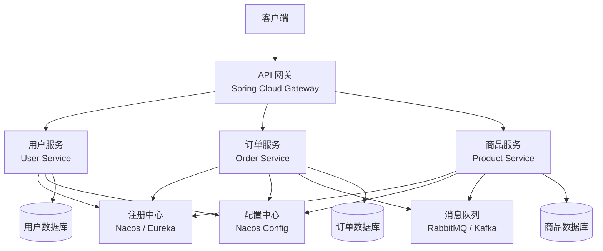

# Spring Boot 微服务架构

## 微服务概述

### 什么是微服务架构

微服务架构是一种将应用程序构建为一组小型、自治服务的方法,每个服务运行在自己的进程中,并通过轻量级机制(通常是HTTP RESTful API或消息队列)进行通信。

**核心思想**: 将单一的大型应用程序拆分成多个小型服务,每个服务专注于特定的业务功能,可以独立开发、部署和扩展。



#### 与单体架构的对比

| 特性 | 单体架构 | 微服务架构 |
|------|----------|-----------|
| **代码结构** | 单一代码库 | 多个独立代码库 |
| **部署方式** | 整体部署 | 独立部署 |
| **扩展能力** | 整体扩展 | 按需扩展单个服务 |
| **技术栈** | 统一技术栈 | 可使用不同技术 |
| **开发团队** | 大团队协作 | 小团队独立开发 |
| **故障影响** | 整体不可用 | 局部故障隔离 |
| **开发复杂度** | 初期简单 | 初期复杂 |
| **运维复杂度** | 部署简单 | 需要完善基础设施 |

::: warning 微服务不是银弹
微服务引入了分布式系统的所有复杂性：网络延迟、分布式事务、服务间通信、数据一致性、运维复杂度。如果团队规模小、业务领域不清晰、基础设施不完善，**单体架构可能是更好的选择**。微服务是演进而来的，不是一开始就设计出来的。
:::

::: tip Spring Cloud 技术选型
| 组件 | Netflix 体系（维护模式） | Alibaba 体系（推荐） |
|------|------------------------|---------------------|
| 注册中心 | Eureka | Nacos |
| 配置中心 | Spring Cloud Config | Nacos Config |
| 网关 | Zuul | Spring Cloud Gateway |
| 熔断器 | Hystrix | Sentinel |
| 负载均衡 | Ribbon | Spring Cloud LoadBalancer |
| 分布式事务 | — | Seata |

新项目推荐使用 Spring Cloud Alibaba 体系，社区活跃且与国内基础设施（如 Dubbo、RocketMQ）生态更契合。
:::

### 微服务的特点

1. **单一职责**: 每个服务专注于特定的业务功能,高内聚低耦合
2. **独立部署**: 服务可以独立部署和扩展,不影响其他服务
3. **技术多样性**: 不同服务可以使用不同的技术栈和数据库
4. **去中心化**: 数据管理和治理去中心化,每个服务管理自己的数据
5. **容错性**: 服务故障不会导致整个系统崩溃,通过断路器隔离故障
6. **弹性扩展**: 可以根据负载情况对单个服务进行独立扩展

### 微服务架构的优势与挑战

#### 优势

- **灵活性和敏捷性**: 小团队独立开发,快速迭代
- **可扩展性**: 按需扩展特定服务,资源利用率高
- **技术自由**: 各服务可选择最适合的技术栈
- **故障隔离**: 单个服务故障不会影响整个系统
- **团队协作**: 不同团队并行开发,互不干扰

#### 挑战

- **分布式复杂性**: 网络延迟、数据一致性、事务管理
- **运维难度**: 服务数量多,需要完善的监控和自动化
- **测试复杂**: 需要进行服务间集成测试和端到端测试
- **数据管理**: 跨服务事务和数据一致性难以保证
- **团队技能**: 需要团队具备分布式系统开发经验

### 微服务拆分原则

#### 按业务能力拆分

这是最常用的拆分方式,基于业务领域划分服务边界。

**示例:电商系统拆分**

```
电商系统
├── 用户服务(User Service) - 用户注册、认证、个人信息管理
├── 商品服务(Product Service) - 商品管理、分类、库存
├── 订单服务(Order Service) - 订单创建、状态管理
├── 支付服务(Payment Service) - 支付处理、退款
├── 物流服务(Shipping Service) - 物流跟踪、配送管理
└── 通知服务(Notification Service) - 短信、邮件通知
```

#### 按子域拆分(Domain-Driven Design)

基于领域驱动设计(DDD)的思想,识别核心域、支撑域和通用域。

```
核心域: 订单、商品、支付(业务核心竞争力)
支撑域: 用户管理、权限管理(支撑核心业务)
通用域: 通知服务、文件服务(通用功能)
```

#### 拆分粒度原则

**不要过度拆分**,遵循"先粗后细"的原则:

1. **初期阶段**: 先拆分成较大的服务模块(5-8个)
2. **发展阶段**: 根据业务增长逐步细化
3. **成熟阶段**: 基于团队规模和业务复杂度调整

**判断标准**:

- 一个服务对应一个业务能力或子域
- 服务边界清晰,数据独立
- 团队规模合适(2-8人负责一个服务)
- 服务可以独立部署和扩展

#### 数据库拆分策略

**每个服务独享数据库**(Database per Service):

```
用户服务 → 用户数据库(MySQL)
商品服务 → 商品数据库(PostgreSQL)
订单服务 → 订单数据库(MongoDB)
```

**优点**:
- 数据隔离,服务独立性强
- 可以选择最适合的数据库类型
- 单个数据库故障不影响其他服务

**挑战**:
- 跨服务数据查询复杂
- 分布式事务处理困难
- 数据一致性问题

## Spring Cloud 核心组件

Spring Cloud 是一套完整的微服务解决方案,提供了构建分布式系统所需的常见模式。

### Spring Cloud 组件体系

| 组件类别 | Spring Cloud 组件 | 功能说明 |
|---------|------------------|---------|
| **服务注册与发现** | Eureka、Consul、Nacos | 服务注册、发现、健康检查 |
| **服务调用** | OpenFeign、Ribbon | 声明式HTTP客户端、负载均衡 |
| **API网关** | Spring Cloud Gateway | 路由、过滤、限流、认证 |
| **配置管理** | Spring Cloud Config、Nacos | 集中化配置管理 |
| **断路器** | Resilience4j、Sentinel | 容错、熔断、降级 |
| **分布式追踪** | Sleuth + Zipkin、SkyWalking | 链路追踪、性能分析 |
| **消息驱动** | Spring Cloud Stream | 消息队列集成 |

### Spring Cloud 版本说明

Spring Cloud 采用伦敦地铁站名称作为版本代号(如Hoxton、Ilford),现在已改为日历化版本(如2020.0.x)。

**版本对应关系**:

| Spring Boot | Spring Cloud |
|-------------|--------------|
| 3.5.x | 2025.0.x (Northfields) |
| 3.4.x | 2024.0.x (Moorgate) |
| 3.2.x / 3.3.x | 2023.0.x (Leyton) |
| 2.7.x | 2021.0.x (Jubilee) |
| 2.6.x | 2021.0.x (Jubilee) |
| 2.5.x | 2020.0.x (Ilford) |
| 2.4.x | 2020.0.x (Ilford) |

## Spring Boot 与微服务

Spring Boot是构建微服务的理想框架,因为它提供了:

### 核心优势

1. **嵌入式服务器**: 无需外部容器即可运行,Tomcat/Jetty/Undertow内置
2. **自动配置**: 简化配置过程,约定优于配置
3. **生产就绪功能**: 健康检查、指标监控、外部化配置
4. **丰富的生态系统**: 与Spring Cloud无缝集成
5. **快速开发**: 起步依赖、自动配置减少开发时间

### 微服务项目结构

**推荐的项目结构**:

```
microservice-project/
├── eureka-server/          # 服务注册中心
│   ├── src/main/java/
│   └── pom.xml
├── gateway-service/        # API网关
│   ├── src/main/java/
│   └── pom.xml
├── user-service/           # 用户服务
│   ├── src/main/java/
│   │   └── com/example/user/
│   │       ├── controller/
│   │       ├── service/
│   │       ├── repository/
│   │       └── entity/
│   └── pom.xml
├── order-service/          # 订单服务
│   ├── src/main/java/
│   └── pom.xml
└── pom.xml                 # 父POM,管理公共依赖
```

## 服务注册与发现

### 核心概念

**服务注册**: 服务启动时向注册中心注册自己的地址和端口

**服务发现**: 服务消费者从注册中心获取服务提供者的地址列表

**心跳机制**: 服务定期向注册中心发送心跳,证明自己存活

**健康检查**: 注册中心定期检查服务健康状态,剔除不健康服务

### 使用 Eureka

Eureka 是 Netflix 开源的服务注册与发现组件,是 Spring Cloud 的默认选择之一。

#### Eureka 服务器配置

**添加依赖**:

```xml
<dependency>
    <groupId>org.springframework.cloud</groupId>
    <artifactId>spring-cloud-starter-netflix-eureka-server</artifactId>
</dependency>
```

**启动类**:

```java
@SpringBootApplication
@EnableEurekaServer
public class EurekaServerApplication {
    public static void main(String[] args) {
        SpringApplication.run(EurekaServerApplication.class, args);
    }
}
```

**配置文件**:

```yaml
server:
  port: 8761

eureka:
  instance:
    hostname: localhost
  client:
    # 自己是注册中心,不需要注册自己
    registerWithEureka: false
    # 不需要拉取服务列表
    fetchRegistry: false
    serviceUrl:
      defaultZone: http://${eureka.instance.hostname}:${server.port}/eureka/
  server:
    # 关闭自我保护模式(开发环境)
    enable-self-preservation: false
    # 清理间隔(默认60秒)
    eviction-interval-timer-in-ms: 5000

spring:
  application:
    name: eureka-server
```

**Eureka 自我保护机制**:

Eureka 在运行期间会统计心跳失败比例,如果15分钟内低于85%,Eureka会进入自我保护模式:
- 不再剔除服务实例
- 仍然接受新服务注册
- 保护网络分区故障时的服务信息

**生产环境建议**:
- 使用多个Eureka服务器组成集群(高可用)
- 开启自我保护模式
- 配置合理的超时时间

#### Eureka 客户端配置

**添加依赖**:

```xml
<dependency>
    <groupId>org.springframework.cloud</groupId>
    <artifactId>spring-cloud-starter-netflix-eureka-client</artifactId>
</dependency>
```

**启动类**:

```java
@SpringBootApplication
@EnableEurekaClient  // 或使用 @EnableDiscoveryClient
public class UserServiceApplication {
    public static void main(String[] args) {
        SpringApplication.run(UserServiceApplication.class, args);
    }
}
```

**配置文件**:

```yaml
spring:
  application:
    name: user-service  # 服务名称,用于服务发现

eureka:
  client:
    serviceUrl:
      defaultZone: http://localhost:8761/eureka/
    # 拉取服务列表间隔(默认30秒)
    registry-fetch-interval-seconds: 30
  instance:
    # 使用IP地址注册
    prefer-ip-address: true
    # 实例ID格式
    instance-id: ${spring.application.name}:${spring.cloud.client.ip-address}:${server.port}
    # 心跳间隔(默认30秒)
    lease-renewal-interval-in-seconds: 30
    # 服务过期时间(默认90秒)
    lease-expiration-duration-in-seconds: 90

server:
  port: 8081
```

#### Eureka 高可用配置

**多节点Eureka集群**:

```yaml
# Eureka节点1配置
server:
  port: 8761

eureka:
  instance:
    hostname: eureka1
  client:
    serviceUrl:
      defaultZone: http://eureka2:8762/eureka/,http://eureka3:8763/eureka/

---
# Eureka节点2配置
server:
  port: 8762

eureka:
  instance:
    hostname: eureka2
  client:
    serviceUrl:
      defaultZone: http://eureka1:8761/eureka/,http://eureka3:8763/eureka/

---
# Eureka节点3配置
server:
  port: 8763

eureka:
  instance:
    hostname: eureka3
  client:
    serviceUrl:
      defaultZone: http://eureka1:8761/eureka/,http://eureka2:8762/eureka/
```

**客户端连接集群**:

```yaml
eureka:
  client:
    serviceUrl:
      defaultZone: http://eureka1:8761/eureka/,http://eureka2:8762/eureka/,http://eureka3:8763/eureka/
```

### 使用 Consul

Consul 是 HashiCorp 公司开源的服务发现和配置管理工具。

#### Consul 特点

- **服务发现**: 自动注册和发现服务
- **健康检查**: 支持TCP、HTTP、Script等多种检查方式
- **KV存储**: 分布式键值存储
- **多数据中心**: 支持多数据中心部署
- **Web UI**: 提供可视化管理界面

#### Consul 配置

**添加依赖**:

```xml
<dependency>
    <groupId>org.springframework.cloud</groupId>
    <artifactId>spring-cloud-starter-consul-discovery</artifactId>
</dependency>
```

**配置文件**:

```yaml
spring:
  application:
    name: user-service
  cloud:
    consul:
      host: localhost
      port: 8500
      discovery:
        # 服务名称
        service-name: ${spring.application.name}
        # 健康检查路径
        health-check-path: /actuator/health
        # 健康检查间隔
        health-check-interval: 15s
        # 实例ID
        instance-id: ${spring.application.name}:${spring.cloud.client.ip-address}:${server.port}
        # 使用IP地址注册
        prefer-ip-address: true
        # 标签
        tags: version=1.0,author=team-user

server:
  port: 8081
```

### 使用 Nacos

Nacos 是阿里巴巴开源的动态服务发现、配置管理和服务管理平台。

#### Nacos 特点

- **服务发现**: 支持DNS和RPC服务发现
- **配置管理**: 动态配置管理,配置热更新
- **动态DNS**: 支持权重路由
- **可视化管理**: 提供控制台界面

#### Nacos 配置

**添加依赖**:

```xml
<dependency>
    <groupId>com.alibaba.cloud</groupId>
    <artifactId>spring-cloud-starter-alibaba-nacos-discovery</artifactId>
</dependency>
```

**配置文件**:

```yaml
spring:
  application:
    name: user-service
  cloud:
    nacos:
      discovery:
        server-addr: localhost:8848
        # 命名空间
        namespace: dev
        # 分组
        group: DEFAULT_GROUP
        # 集群名称
        cluster-name: DEFAULT

server:
  port: 8081
```

### 服务注册中心对比

| 特性 | Eureka | Consul | Nacos |
|------|--------|--------|-------|
| **CAP理论** | AP(可用性+分区容错) | CP(一致性+分区容错) | AP/CP可切换 |
| **健康检查** | 心跳检测 | TCP/HTTP/Script | TCP/HTTP/MySQL |
| **配置管理** | 需配合Spring Cloud Config | 内置KV存储 | 内置配置管理 |
| **多数据中心** | 支持 | 支持 | 支持 |
| **管理界面** | 有 | 有 | 有 |
| **社区活跃度** | 维护模式 | 活跃 | 活跃 |

**选择建议**:
- **Eureka**: Spring Cloud生态成熟,适合Java技术栈
- **Consul**: 功能全面,支持多语言,适合混合技术栈
- **Nacos**: 国产开源,集成服务发现和配置管理,适合阿里云生态

## 服务间通信

### 同步通信 vs 异步通信

| 特性 | 同步通信 | 异步通信 |
|------|---------|---------|
| **响应时间** | 实时响应 | 延迟处理 |
| **耦合度** | 强耦合 | 松耦合 |
| **可靠性** | 需要重试机制 | 消息队列保证 |
| **适用场景** | 实时查询、事务操作 | 异步任务、事件通知 |
| **技术选型** | RestTemplate、Feign | RabbitMQ、Kafka |

### 使用 RestTemplate

RestTemplate 是 Spring 提供的同步HTTP客户端,结合@LoadBalanced注解可以实现客户端负载均衡。

#### 配置 RestTemplate

```java
@Configuration
public class RestTemplateConfig {
    
    @Bean
    @LoadBalanced  // 开启负载均衡
    public RestTemplate restTemplate() {
        // 设置超时时间
        SimpleClientHttpRequestFactory factory = new SimpleClientHttpRequestFactory();
        factory.setConnectTimeout(3000);  // 连接超时3秒
        factory.setReadTimeout(5000);     // 读取超时5秒
        return new RestTemplate(factory);
    }
}
```

#### 使用示例

```java
@Service
public class OrderService {
    
    @Autowired
    private RestTemplate restTemplate;
    
    // GET请求
    public User getUserById(Long id) {
        // 使用服务名替代IP地址
        return restTemplate.getForObject(
            "http://user-service/users/" + id, 
            User.class
        );
    }
    
    // GET请求(带参数)
    public List<User> getUsers(List<Long> ids) {
        String url = "http://user-service/users?ids={ids}";
        Map<String, String> params = new HashMap<>();
        params.put("ids", StringUtils.join(ids, ","));
        return restTemplate.getForObject(url, List.class, params);
    }
    
    // POST请求
    public User createUser(User user) {
        return restTemplate.postForObject(
            "http://user-service/users", 
            user, 
            User.class
        );
    }
    
    // PUT请求
    public void updateUser(Long id, User user) {
        restTemplate.put("http://user-service/users/" + id, user);
    }
    
    // DELETE请求
    public void deleteUser(Long id) {
        restTemplate.delete("http://user-service/users/" + id);
    }
    
    // 使用ResponseEntity获取详细信息
    public ResponseEntity<User> getUserWithHeaders(Long id) {
        return restTemplate.getForEntity(
            "http://user-service/users/" + id, 
            User.class
        );
    }
}
```

### 使用 WebClient

WebClient 是 Spring WebFlux 提供的非阻塞HTTP客户端,支持响应式编程。

#### 配置 WebClient

```java
@Configuration
public class WebClientConfig {
    
    @Bean
    @LoadBalanced
    public WebClient.Builder webClientBuilder() {
        return WebClient.builder()
            .baseUrl("http://user-service")
            .defaultHeader(HttpHeaders.CONTENT_TYPE, MediaType.APPLICATION_JSON_VALUE)
            .defaultHeader(HttpHeaders.ACCEPT, MediaType.APPLICATION_JSON_VALUE);
    }
}
```

#### 使用示例

```java
@Service
public class OrderService {
    
    @Autowired
    private WebClient.Builder webClientBuilder;
    
    // 同步获取
    public User getUserById(Long id) {
        return webClientBuilder.build()
            .get()
            .uri("/users/{id}", id)
            .retrieve()
            .bodyToMono(User.class)
            .block();  // 阻塞获取结果
    }
    
    // 异步响应式
    public Mono<User> getUserByIdAsync(Long id) {
        return webClientBuilder.build()
            .get()
            .uri("/users/{id}", id)
            .retrieve()
            .bodyToMono(User.class);
    }
    
    // 处理错误
    public Mono<User> getUserWithErrorHandling(Long id) {
        return webClientBuilder.build()
            .get()
            .uri("/users/{id}", id)
            .retrieve()
            .onStatus(
                status -> status.is4xxClientError(),
                response -> Mono.just(new UserNotFoundException("User not found"))
            )
            .bodyToMono(User.class)
            .onErrorResume(e -> Mono.just(new User(-1L, "Default User")));
    }
    
    // 流式处理
    public Flux<User> getAllUsers() {
        return webClientBuilder.build()
            .get()
            .uri("/users")
            .retrieve()
            .bodyToFlux(User.class);
    }
}
```

### 使用 OpenFeign

OpenFeign 是声明式HTTP客户端,通过接口和注解定义HTTP请求,使代码更简洁优雅。

#### 添加依赖

```xml
<dependency>
    <groupId>org.springframework.cloud</groupId>
    <artifactId>spring-cloud-starter-openfeign</artifactId>
</dependency>
```

#### 启用 Feign

```java
@SpringBootApplication
@EnableFeignClients  // 启用Feign客户端
public class OrderServiceApplication {
    public static void main(String[] args) {
        SpringApplication.run(OrderServiceApplication.class, args);
    }
}
```

#### 定义 Feign 客户端

```java
// 基本用法
@FeignClient(name = "user-service")  // 指定服务名
public interface UserServiceClient {
    
    @GetMapping("/users/{id}")
    User getUserById(@PathVariable("id") Long id);
    
    @GetMapping("/users")
    List<User> getUsers(@RequestParam("ids") List<Long> ids);
    
    @PostMapping("/users")
    User createUser(@RequestBody User user);
    
    @PutMapping("/users/{id}")
    User updateUser(@PathVariable("id") Long id, @RequestBody User user);
    
    @DeleteMapping("/users/{id}")
    void deleteUser(@PathVariable("id") Long id);
}

// 指定URL(用于测试或调用外部服务)
@FeignClient(name = "external-api", url = "https://api.example.com")
public interface ExternalApiClient {
    
    @GetMapping("/data")
    String getData();
}

// 使用配置类
@FeignClient(
    name = "user-service",
    configuration = FeignConfig.class,
    fallback = UserServiceFallback.class
)
public interface UserServiceClient {
    // ...
}
```

#### Feign 配置

```java
@Configuration
public class FeignConfig {
    
    @Bean
    public Logger.Level feignLoggerLevel() {
        return Logger.Level.FULL;  // 日志级别
    }
    
    @Bean
    public Request.Options requestOptions() {
        return new Request.Options(
            5000,  // 连接超时5秒
            10000  // 读取超时10秒
        );
    }
    
    @Bean
    public Retryer retryer() {
        return new Retryer.Default(
            100,   // 初始间隔100ms
            1000,  // 最大间隔1秒
            3      // 最大重试次数
        );
    }
}
```

**application.yml 配置**:

```yaml
feign:
  client:
    config:
      default:  # 全局配置
        connectTimeout: 5000
        readTimeout: 10000
        loggerLevel: FULL
      user-service:  # 特定服务配置
        connectTimeout: 3000
        readTimeout: 5000
```

#### 使用 Feign 客户端

```java
@Service
public class OrderService {
    
    @Autowired
    private UserServiceClient userServiceClient;
    
    public Order createOrder(Long userId, List<Long> productIds) {
        // 调用用户服务
        User user = userServiceClient.getUserById(userId);
        
        // 创建订单
        Order order = new Order();
        order.setUserId(userId);
        order.setUsername(user.getUsername());
        // ...
        
        return order;
    }
}
```

#### Feign 降级处理

```java
// 降级实现类
@Component
public class UserServiceFallback implements UserServiceClient {
    
    @Override
    public User getUserById(Long id) {
        // 返回默认用户或从缓存获取
        return new User(id, "Default User", "default@example.com");
    }
    
    @Override
    public List<User> getUsers(List<Long> ids) {
        return Collections.emptyList();
    }
    
    // ... 其他方法实现
}

// Feign接口指定fallback
@FeignClient(name = "user-service", fallback = UserServiceFallback.class)
public interface UserServiceClient {
    // ...
}
```

**启用Hystrix降级(旧版Spring Cloud)**:

```yaml
feign:
  hystrix:
    enabled: true
```

### 使用消息队列(RabbitMQ)

#### 添加依赖

```xml
<dependency>
    <groupId>org.springframework.boot</groupId>
    <artifactId>spring-boot-starter-amqp</artifactId>
</dependency>
```

#### 配置 RabbitMQ

```yaml
spring:
  rabbitmq:
    host: localhost
    port: 5672
    username: guest
    password: guest
    virtual-host: /
    # 消息确认机制
    publisher-confirm-type: correlated
    publisher-returns: true
    template:
      mandatory: true
    listener:
      simple:
        acknowledge-mode: manual  # 手动确认
        concurrency: 3
        max-concurrency: 10
```

#### 消息生产者

```java
@Service
public class OrderService {
    
    @Autowired
    private RabbitTemplate rabbitTemplate;
    
    // 发送订单创建消息
    public void sendOrderCreatedEvent(Order order) {
        rabbitTemplate.convertAndSend(
            "order.exchange",    // 交换机
            "order.created",     // 路由键
            order,               // 消息内容
            message -> {
                message.getMessageProperties().setMessageId(UUID.randomUUID().toString());
                return message;
            }
        );
    }
    
    // 发送延时消息
    public void sendDelayMessage(Order order, long delayMillis) {
        rabbitTemplate.convertAndSend(
            "delay.exchange",
            "delay.order",
            order,
            message -> {
                message.getMessageProperties().setExpiration(String.valueOf(delayMillis));
                return message;
            }
        );
    }
}
```

#### 消息消费者

```java
@Component
public class NotificationConsumer {
    
    @RabbitListener(queues = "notification.queue")
    public void handleOrderCreated(Order order, Channel channel, 
                                   @Header(AmqpHeaders.DELIVERY_TAG) long tag) {
        try {
            // 处理订单创建通知
            System.out.println("Received order: " + order.getId());
            
            // 发送邮件或短信通知
            sendNotification(order);
            
            // 手动确认消息
            channel.basicAck(tag, false);
        } catch (Exception e) {
            // 处理失败,消息重新入队
            try {
                channel.basicNack(tag, false, true);
            } catch (IOException ex) {
                ex.printStackTrace();
            }
        }
    }
    
    private void sendNotification(Order order) {
        // 发送通知逻辑
    }
}
```

## API 网关

### API 网关的作用

API 网关是微服务架构中的重要组件,作为系统的统一入口,提供以下功能:

1. **路由转发**: 将请求转发到对应的后端服务
2. **负载均衡**: 对后端服务进行负载均衡
3. **身份认证**: 统一的身份验证和授权
4. **限流熔断**: 保护后端服务,防止过载
5. **日志监控**: 统一的访问日志和监控
6. **协议转换**: HTTP/HTTPS转换、协议适配
7. **灰度发布**: 支持A/B测试和灰度发布

### 使用 Spring Cloud Gateway

Spring Cloud Gateway 是 Spring Cloud 官方推荐的API网关,基于 Spring WebFlux 与 Project Reactor 构建的响应式网关。

#### 添加依赖

```xml
<dependency>
    <groupId>org.springframework.cloud</groupId>
    <artifactId>spring-cloud-starter-gateway</artifactId>
</dependency>
```

#### 基本路由配置

```yaml
spring:
  application:
    name: gateway-service
  cloud:
    gateway:
      # 路由配置
      routes:
        # 用户服务路由
        - id: user-service
          uri: lb://user-service  # lb表示从注册中心获取服务
          predicates:
            - Path=/api/users/**  # 路径匹配
          filters:
            - StripPrefix=1  # 去掉路径前缀/api
        
        # 订单服务路由
        - id: order-service
          uri: lb://order-service
          predicates:
            - Path=/api/orders/**
          filters:
            - StripPrefix=1
        
        # 商品服务路由(带时间限制)
        - id: product-service
          uri: lb://product-service
          predicates:
            - Path=/api/products/**
            - After=2024-01-01T00:00:00+08:00  # 在指定时间后生效
          filters:
            - StripPrefix=1
        
        # 管理后台路由(带请求头限制)
        - id: admin-service
          uri: lb://admin-service
          predicates:
            - Path=/api/admin/**
            - Header=X-Request-Id, \d+  # 请求头必须包含X-Request-Id且值为数字
          filters:
            - StripPrefix=1

server:
  port: 8080

eureka:
  client:
    serviceUrl:
      defaultZone: http://localhost:8761/eureka/
```

#### 路由断言(Predicates)

Spring Cloud Gateway 提供了多种路由断言:

```yaml
spring:
  cloud:
    gateway:
      routes:
        - id: example-service
          uri: lb://example-service
          predicates:
            # 路径匹配
            - Path=/api/**
            
            # 请求方法匹配
            - Method=GET,POST
            
            # 请求头匹配
            - Header=X-Request-Id, \d+
            
            # 请求参数匹配
            - Query=token
            
            # Cookie匹配
            - Cookie=session, abc
            
            # 时间匹配
            - After=2024-01-01T00:00:00+08:00
            - Before=2024-12-31T23:59:59+08:00
            - Between=2024-01-01T00:00:00+08:00, 2024-12-31T23:59:59+08:00
            
            # 远程地址匹配
            - RemoteAddr=192.168.1.1/24
            
            # 权重路由(灰度发布,同组内多条路由按权重分摊流量,如另一条配 group1, 2 即 80%/20%)
            - Weight=group1, 8
```

#### 过滤器(Filters)

**内置过滤器**:

```yaml
spring:
  cloud:
    gateway:
      routes:
        - id: user-service
          uri: lb://user-service
          predicates:
            - Path=/api/users/**
          filters:
            # 添加请求头
            - AddRequestHeader=X-Request-Foo, Bar
            
            # 添加请求参数
            - AddRequestParameter=foo, bar
            
            # 添加响应头
            - AddResponseHeader=X-Response-Foo, Bar
            
            # 去掉路径前缀
            - StripPrefix=1
            
            # 添加路径前缀
            - PrefixPath=/api
            
            # 重定向
            - RedirectTo=302, https://example.com
            
            # 重试
            - name: Retry
              args:
                retries: 3
                statuses: BAD_GATEWAY
                methods: GET
                backoff:
                  firstBackoff: 100ms
                  maxBackoff: 500ms
                  factor: 2
            
            # 限流(基于令牌桶算法)
            - name: RequestRateLimiter
              args:
                redis-rate-limiter.replenishRate: 10  # 每秒生成令牌数
                redis-rate-limiter.burstCapacity: 20  # 令牌桶容量
                key-resolver: "#{@userKeyResolver}"   # 限流key解析器
```

#### 自定义全局过滤器

```java
@Component
public class AuthenticationFilter implements GlobalFilter, Ordered {
    
    private static final String AUTHORIZE_TOKEN = "Authorization";
    
    @Override
    public Mono<Void> filter(ServerWebExchange exchange, GatewayFilterChain chain) {
        ServerHttpRequest request = exchange.getRequest();
        String path = request.getURI().getPath();
        
        // 白名单路径直接放行
        if (isWhitePath(path)) {
            return chain.filter(exchange);
        }
        
        // 检查Authorization头
        String token = request.getHeaders().getFirst(AUTHORIZE_TOKEN);
        if (token == null || token.isEmpty()) {
            ServerHttpResponse response = exchange.getResponse();
            response.setStatusCode(HttpStatus.UNAUTHORIZED);
            response.getHeaders().add("Content-Type", "application/json;charset=UTF-8");
            
            String body = "{\"code\":401,\"message\":\"未授权访问\"}";
            DataBuffer buffer = response.bufferFactory().wrap(body.getBytes());
            return response.writeWith(Mono.just(buffer));
        }
        
        // 验证Token(这里简化处理,实际应调用认证服务)
        try {
            // String userId = JwtUtil.parseToken(token);
            // 将用户信息添加到请求头
            ServerHttpRequest mutatedRequest = request.mutate()
                .header("X-User-Id", "userId")
                .build();
            return chain.filter(exchange.mutate().request(mutatedRequest).build());
        } catch (Exception e) {
            ServerHttpResponse response = exchange.getResponse();
            response.setStatusCode(HttpStatus.UNAUTHORIZED);
            return response.setComplete();
        }
    }
    
    private boolean isWhitePath(String path) {
        return path.startsWith("/api/auth/login") 
            || path.startsWith("/api/auth/register")
            || path.startsWith("/api/public/");
    }
    
    @Override
    public int getOrder() {
        return -100;  // 优先级高,先执行
    }
}
```

#### 日志过滤器

```java
@Component
@Slf4j
public class AccessLogFilter implements GlobalFilter, Ordered {
    
    @Override
    public Mono<Void> filter(ServerWebExchange exchange, GatewayFilterChain chain) {
        ServerHttpRequest request = exchange.getRequest();
        long startTime = System.currentTimeMillis();
        
        // 记录请求日志
        log.info("Request: {} {} from {}", 
            request.getMethod(), 
            request.getURI(), 
            request.getRemoteAddress());
        
        return chain.filter(exchange).then(Mono.fromRunnable(() -> {
            // 记录响应日志
            long duration = System.currentTimeMillis() - startTime;
            ServerHttpResponse response = exchange.getResponse();
            log.info("Response: {} - {} ({}ms)", 
                response.getStatusCode(), 
                request.getURI(), 
                duration);
        }));
    }
    
    @Override
    public int getOrder() {
        return -200;  // 日志过滤器最先执行
    }
}
```

#### 跨域配置

```java
@Configuration
public class CorsConfig {
    
    @Bean
    public CorsWebFilter corsWebFilter() {
        CorsConfiguration config = new CorsConfiguration();
        config.addAllowedOriginPattern("*");
        config.addAllowedMethod("*");
        config.addAllowedHeader("*");
        config.setAllowCredentials(true);
        config.setMaxAge(3600L);
        
        UrlBasedCorsConfigurationSource source = new UrlBasedCorsConfigurationSource();
        source.registerCorsConfiguration("/**", config);
        
        return new CorsWebFilter(source);
    }
}
```

## 配置管理

### 使用 Spring Cloud Config

Spring Cloud Config 提供集中化的配置管理,支持Git、SVN、本地文件系统等存储方式。

#### 配置服务器

**添加依赖**:

```xml
<dependency>
    <groupId>org.springframework.cloud</groupId>
    <artifactId>spring-cloud-config-server</artifactId>
</dependency>
```

**启动类**:

```java
@SpringBootApplication
@EnableConfigServer
public class ConfigServerApplication {
    public static void main(String[] args) {
        SpringApplication.run(ConfigServerApplication.class, args);
    }
}
```

**配置文件**:

```yaml
server:
  port: 8888

spring:
  application:
    name: config-server
  cloud:
    config:
      server:
        git:
          uri: https://github.com/your-repo/config-repo
          username: your-username
          password: your-password
          search-paths: '{application}'  # 根据应用名搜索目录
          default-label: main  # 默认分支
        # 本地文件系统(测试用)
        # native:
        #   search-locations: classpath:/config

eureka:
  client:
    serviceUrl:
      defaultZone: http://localhost:8761/eureka/
```

#### 配置文件命名规则

```
/{application}/{profile}[/{label}]
/{application}-{profile}.yml
/{label}/{application}-{profile}.yml
/{application}-{profile}.properties
/{label}/{application}-{profile}.properties
```

**示例**:

```
config-repo/
├── user-service.yml           # 默认配置
├── user-service-dev.yml       # 开发环境配置
├── user-service-prod.yml      # 生产环境配置
└── application.yml            # 公共配置
```

#### 配置客户端

**添加依赖**:

```xml
<dependency>
    <groupId>org.springframework.cloud</groupId>
    <artifactId>spring-cloud-starter-config</artifactId>
</dependency>
```

**bootstrap.yml**(优先级高于application.yml):

```yaml
spring:
  application:
    name: user-service
  cloud:
    config:
      uri: http://localhost:8888  # 配置服务器地址
      fail-fast: true  # 连接失败快速失败
      retry:
        initial-interval: 1000
        max-attempts: 6
        max-interval: 2000
        multiplier: 1.1
      label: main  # 分支

eureka:
  client:
    serviceUrl:
      defaultZone: http://localhost:8761/eureka/
```

#### 配置热更新

**使用@RefreshScope**:

```java
@RestController
@RefreshScope  // 支持配置热更新
public class ConfigController {
    
    @Value("${app.message:Default Message}")
    private String message;
    
    @GetMapping("/message")
    public String getMessage() {
        return message;
    }
}
```

**触发配置更新**:

```bash
# POST请求到客户端的/actuator/refresh端点
curl -X POST http://localhost:8081/actuator/refresh
```

**开启actuator端点**:

```yaml
management:
  endpoints:
    web:
      exposure:
        include: refresh,health,info
```

### 使用 Nacos 配置中心

Nacos 提供更简洁的配置管理方式,支持配置热更新和灰度发布。

**配置文件**:

```yaml
spring:
  application:
    name: user-service
  cloud:
    nacos:
      # 服务发现配置
      discovery:
        server-addr: localhost:8848
      # 配置中心配置
      config:
        server-addr: localhost:8848
        namespace: dev
        group: DEFAULT_GROUP
        file-extension: yaml
        # 扩展配置
        extension-configs:
          - data-id: common.yaml
            group: DEFAULT_GROUP
            refresh: true
```

## 断路器模式

### 为什么需要断路器

在微服务架构中,服务之间的调用是分布式的,当某个服务出现故障时,如果不进行隔离,会导致:

1. **级联故障**: 故障向调用链上游传播
2. **资源耗尽**: 大量请求堆积,线程池耗尽
3. **系统雪崩**: 整个系统崩溃

断路器模式通过以下机制解决这些问题:

- **熔断**: 当错误率达到阈值时,自动打开断路器,快速失败
- **降级**: 返回备用响应或缓存数据
- **限流**: 限制并发请求数量
- **重试**: 自动重试失败的请求

### 使用 Resilience4j

Resilience4j 是轻量级的容错库,提供了断路器、限流器、重试等功能。

#### 添加依赖

```xml
<!-- Boot 2.x 用 resilience4j-spring-boot2,Boot 3.x 应改用 resilience4j-spring-boot3 -->
<dependency>
    <groupId>io.github.resilience4j</groupId>
    <artifactId>resilience4j-spring-boot2</artifactId>
    <version>2.0.2</version>
</dependency>
<dependency>
    <groupId>io.github.resilience4j</groupId>
    <artifactId>resilience4j-circuitbreaker</artifactId>
    <version>2.0.2</version>
</dependency>
<dependency>
    <groupId>org.springframework.boot</groupId>
    <artifactId>spring-boot-starter-aop</artifactId>
</dependency>
```

#### 配置断路器

```yaml
resilience4j:
  circuitbreaker:
    configs:
      default:
        # 断路器状态转换配置
        failureRateThreshold: 50  # 失败率阈值50%
        slowCallRateThreshold: 100  # 慢调用率阈值
        slowCallDurationThreshold: 2s  # 慢调用时间阈值
        permittedNumberOfCallsInHalfOpenState: 3  # 半开状态允许的调用数
        slidingWindowType: COUNT_BASED  # 滑动窗口类型(基于调用次数)
        slidingWindowSize: 10  # 滑动窗口大小
        minimumNumberOfCalls: 5  # 最小调用次数
        waitDurationInOpenState: 10s  # 断路器打开状态等待时间
        automaticTransitionFromOpenToHalfOpenEnabled: true  # 自动转换到半开状态
    instances:
      userService:
        baseConfig: default
        failureRateThreshold: 60
        waitDurationInOpenState: 20s
      orderService:
        baseConfig: default
        failureRateThreshold: 40
        waitDurationInOpenState: 30s
  
  # 限流配置
  ratelimiter:
    configs:
      default:
        limitForPeriod: 10  # 每个周期限制请求数
        limitRefreshPeriod: 1s  # 周期
        timeoutDuration: 0  # 等待获取许可的超时时间
    instances:
      userService:
        baseConfig: default
  
  # 重试配置
  retry:
    configs:
      default:
        maxAttempts: 3  # 最大重试次数
        waitDuration: 500ms  # 重试等待时间
        enableExponentialBackoff: true  # 指数退避
        exponentialBackoffMultiplier: 2
    instances:
      userService:
        baseConfig: default
```

#### 使用断路器

```java
@Service
public class OrderService {
    
    @Autowired
    private UserServiceClient userServiceClient;
    
    // 使用断路器
    @CircuitBreaker(name = "userService", fallbackMethod = "fallbackGetUser")
    public User getUserById(Long id) {
        return userServiceClient.getUserById(id);
    }
    
    // 降级方法(参数必须与原方法一致,最后可以加Exception参数)
    public User fallbackGetUser(Long id, Exception ex) {
        log.warn("Fallback for getUserById: {}", ex.getMessage());
        // 返回默认用户或从缓存获取
        return new User(id, "Default User", "default@example.com");
    }
    
    // 组合使用断路器、限流、重试
    @CircuitBreaker(name = "userService", fallbackMethod = "fallbackGetUser")
    @RateLimiter(name = "userService")
    @Retry(name = "userService")
    public User getUserWithResilience(Long id) {
        return userServiceClient.getUserById(id);
    }
    
    // 使用超时控制
    @Timeout(value = 3, unit = ChronoUnit.SECONDS)
    public User getUserWithTimeout(Long id) {
        return userServiceClient.getUserById(id);
    }
}
```

#### 断路器监控

```yaml
management:
  endpoints:
    web:
      exposure:
        include: health,circuitbreakers
  endpoint:
    health:
      show-details: always
  health:
    circuitbreakers:
      enabled: true
```

**访问监控端点**:

```bash
curl http://localhost:8081/actuator/health
```

**响应示例**:

```json
{
  "status": "UP",
  "components": {
    "circuitBreakers": {
      "status": "UP",
      "details": {
        "circuitBreakers": [
          {
            "name": "userService",
            "status": "CLOSED",
            "details": {
              "failureRate": "0.0%",
              "slowCallRate": "0.0%",
              "numberOfBufferedCalls": 5,
              "numberOfFailedCalls": 0
            }
          }
        ]
      }
    }
  }
}
```

### 断路器状态转换

```
CLOSED (关闭状态)
  ↓ 失败率超过阈值
OPEN (打开状态) → 快速失败,不执行实际调用
  ↓ 等待时间结束
HALF_OPEN (半开状态) → 允许少量请求通过
  ↓ 成功率恢复正常          ↓ 失败率仍高
CLOSED                    OPEN
```

## 分布式追踪

### 为什么需要分布式追踪

在微服务架构中,一个请求可能经过多个服务,调用链路复杂。当出现性能问题或故障时,需要快速定位问题所在。

分布式追踪系统提供:

1. **链路追踪**: 记录请求经过的所有服务
2. **性能分析**: 分析每个服务的耗时
3. **故障定位**: 快速找到故障点
4. **依赖分析**: 可视化服务依赖关系

### 使用 Spring Cloud Sleuth + Zipkin

> **版本注**: Spring Cloud Sleuth 仅适用于 Spring Boot 2.x / Spring Cloud 2021.x 及更早版本,自 Spring Cloud 2022.0(Kilburn, 配套 Boot 3.x)起已被 **Micrometer Tracing** 取代(配合 Zipkin bridge 依赖 `micrometer-tracing-bridge-brave` 与 `zipkin-reporter-brave`)。以下内容适用于 Boot 2.x 项目;Boot 3.x 项目的配置属性迁移为 `management.tracing.sampling.probability` 与 `management.zipkin.tracing.endpoint`。

#### 添加依赖

```xml
<dependency>
    <groupId>org.springframework.cloud</groupId>
    <artifactId>spring-cloud-starter-sleuth</artifactId>
</dependency>
<dependency>
    <groupId>org.springframework.cloud</groupId>
    <artifactId>spring-cloud-sleuth-zipkin</artifactId>
</dependency>
```

#### 配置追踪

```yaml
spring:
  application:
    name: user-service
  sleuth:
    sampler:
      probability: 1.0  # 采样率100%(生产环境应降低到0.1-0.5)
  zipkin:
    base-url: http://localhost:9411  # Zipkin服务器地址
    sender:
      type: web  # 使用HTTP发送追踪数据

# 日志配置(查看TraceId和SpanId)
logging:
  level:
    org.springframework.web.servlet.DispatcherServlet: DEBUG
  pattern:
    console: "%d{yyyy-MM-dd HH:mm:ss.SSS} [%thread] [%X{traceId:-},%X{spanId:-}] %-5level %logger{36} - %msg%n"
```

#### 日志输出示例

```
2024-01-01 12:00:00.123 [http-nio-8081-exec-1] [a1b2c3d4e5f6g7h8,1234567890abcdef] INFO  c.e.user.controller.UserController - Getting user by id: 1
```

- `a1b2c3d4e5f6g7h8` - TraceId(整个调用链唯一)
- `1234567890abcdef` - SpanId(单个服务调用唯一)

#### 手动创建Span

```java
@Service
public class UserService {
    
    @Autowired
    private Tracer tracer;
    
    public User getUserById(Long id) {
        // 创建新的Span
        Span span = tracer.nextSpan().name("getUserById");
        try (Tracer.SpanInScope ws = tracer.withSpan(span.start())) {
            // 业务逻辑
            User user = userRepository.findById(id);
            
            // 添加标签
            span.tag("user.id", String.valueOf(id));
            span.tag("user.name", user.getUsername());
            
            return user;
        } finally {
            span.end();
        }
    }
}
```

#### Zipkin 界面

启动Zipkin服务器:

```bash
java -jar zipkin-server-2.24.0-exec.jar
```

访问 `http://localhost:9411` 可以查看:
- 服务依赖图
- 请求链路详情
- 性能分析报告

### 使用 SkyWalking

SkyWalking 是APM(应用性能监控)系统,提供了更强大的监控能力。

**特点**:
- 无侵入式(通过Java Agent)
- 服务、实例、端点三层监控
- 服务拓扑图
- 慢查询分析
- 告警功能

**启动方式**:

```bash
java -javaagent:/path/to/skywalking-agent.jar \
     -Dskywalking.agent.service_name=user-service \
     -Dskywalking.collector.backend_service=localhost:11800 \
     -jar user-service.jar
```

## 消息驱动

### Spring Cloud Stream

Spring Cloud Stream 提供了统一的消息驱动编程模型,支持多种消息中间件(RabbitMQ、Kafka、RocketMQ等)。

#### 添加依赖

```xml
<!-- RabbitMQ -->
<dependency>
    <groupId>org.springframework.cloud</groupId>
    <artifactId>spring-cloud-starter-stream-rabbit</artifactId>
</dependency>

<!-- Kafka -->
<dependency>
    <groupId>org.springframework.cloud</groupId>
    <artifactId>spring-cloud-starter-stream-kafka</artifactId>
</dependency>
```

#### 配置消息通道

```yaml
spring:
  cloud:
    stream:
      # 绑定配置
      bindings:
        # 输出通道
        orderOutput:
          destination: order-topic  # 目的地(队列/主题)
          content-type: application/json
        # 输入通道
        orderInput:
          destination: order-topic
          group: order-group  # 消费者组(同一个组只有一个消费者消费消息)
          content-type: application/json
      # RabbitMQ特定配置
      rabbit:
        bindings:
          orderInput:
            consumer:
              # 死信队列配置
              auto-bind-dlq: true
              republish-to-dlq: true
      # Kafka特定配置
      kafka:
        bindings:
          orderInput:
            consumer:
              auto-commit-offset: false
        binder:
          brokers: localhost:9092
```

#### 定义消息通道

> **版本注**: `@EnableBinding` 与 `@StreamListener` 自 Spring Cloud Stream 3.1 起废弃、4.0 起移除。新项目应使用函数式编程模型(定义 `Supplier`/`Function`/`Consumer` Bean 并通过 `spring.cloud.function.definition` 绑定通道)。

```java
// 自定义消息通道接口
public interface OrderChannel {
    
    String OUTPUT = "orderOutput";
    String INPUT = "orderInput";
    
    @Output(OUTPUT)
    MessageChannel output();
    
    @Input(INPUT)
    SubscribableChannel input();
}

// 或使用内置的Source和Sink
```

#### 消息生产者

```java
@EnableBinding(OrderChannel.class)
@Service
public class OrderService {
    
    @Autowired
    private OrderChannel orderChannel;
    
    public void sendOrderCreatedEvent(Order order) {
        Message<Order> message = MessageBuilder
            .withPayload(order)
            .setHeader(MessageHeaders.CONTENT_TYPE, MimeTypeUtils.APPLICATION_JSON)
            .setHeader("orderId", order.getId())
            .build();
        
        orderChannel.output().send(message);
    }
    
    // 延迟消息
    public void sendDelayedOrder(Order order, long delaySeconds) {
        Message<Order> message = MessageBuilder
            .withPayload(order)
            .setHeader("x-delay", delaySeconds * 1000)  // RabbitMQ延迟插件
            .build();
        
        orderChannel.output().send(message);
    }
}
```

#### 消息消费者

```java
@EnableBinding(OrderChannel.class)
@Service
public class NotificationService {
    
    @StreamListener(OrderChannel.INPUT)
    public void handleOrderCreated(Order order) {
        // 处理订单创建事件
        System.out.println("Received order: " + order.getId());
        
        // 发送邮件或短信通知
        sendNotification(order);
    }
    
    // 条件消费(根据消息头过滤)
    @StreamListener(
        target = OrderChannel.INPUT,
        condition = "headers['orderType'] == 'VIP'"
    )
    public void handleVipOrder(Order order) {
        // 处理VIP订单
        System.out.println("VIP Order: " + order.getId());
    }
    
    // 错误处理
    @ServiceActivator(inputChannel = "order-topic.errors")
    public void handleError(ErrorMessage errorMessage) {
        System.err.println("Message processing failed: " + errorMessage);
    }
    
    private void sendNotification(Order order) {
        // 发送通知逻辑
    }
}
```

#### 消息分组和分区

**消息分组**:

```yaml
spring:
  cloud:
    stream:
      bindings:
        orderInput:
          destination: order-topic
          group: order-group  # 同一个组内只有一个消费者消费消息
```

**消息分区**:

```yaml
spring:
  cloud:
    stream:
      bindings:
        orderOutput:
          destination: order-topic
          producer:
            partition-key-expression: payload.id  # 分区key
            partition-count: 3  # 分区数
        orderInput:
          destination: order-topic
          group: order-group
          consumer:
            partitioned: true
            instance-count: 3  # 消费者实例数
            instance-index: 0  # 当前实例索引
```

## 容器化部署

### Docker 部署

#### Dockerfile 示例

```dockerfile
# 多阶段构建
FROM maven:3.8.6-openjdk-17 AS build
WORKDIR /app
COPY pom.xml .
COPY src ./src
RUN mvn clean package -DskipTests

# 运行阶段
FROM openjdk:17-jdk-slim
WORKDIR /app

# 创建非root用户
RUN groupadd -r appuser && useradd -r -g appuser appuser

# 复制jar文件
COPY --from=build /app/target/user-service.jar app.jar

# 修改文件所有者
RUN chown -R appuser:appuser /app

# 切换到非root用户
USER appuser

# 暴露端口
EXPOSE 8080

# JVM参数
ENV JAVA_OPTS="-Xms512m -Xmx1024m -XX:+UseG1GC"

# 健康检查
HEALTHCHECK --interval=30s --timeout=3s --start-period=60s --retries=3 \
  CMD curl -f http://localhost:8080/actuator/health || exit 1

# 启动命令
ENTRYPOINT ["sh", "-c", "java $JAVA_OPTS -jar app.jar"]
```

#### Docker Compose 完整示例

```yaml
version: '3.8'

services:
  # Eureka服务注册中心
  eureka-server:
    build: ./eureka-server
    container_name: eureka-server
    ports:
      - "8761:8761"
    environment:
      - SPRING_PROFILES_ACTIVE=docker
    networks:
      - microservice-network
    healthcheck:
      test: ["CMD", "curl", "-f", "http://localhost:8761/actuator/health"]
      interval: 30s
      timeout: 10s
      retries: 3

  # API网关
  gateway-service:
    build: ./gateway-service
    container_name: gateway-service
    ports:
      - "8080:8080"
    environment:
      - SPRING_PROFILES_ACTIVE=docker
      - EUREKA_CLIENT_SERVICE_URL_DEFAULTZONE=http://eureka-server:8761/eureka
    depends_on:
      eureka-server:
        condition: service_healthy
    networks:
      - microservice-network

  # 用户服务
  user-service:
    build: ./user-service
    container_name: user-service
    ports:
      - "8081:8080"
    environment:
      - SPRING_PROFILES_ACTIVE=docker
      - EUREKA_CLIENT_SERVICE_URL_DEFAULTZONE=http://eureka-server:8761/eureka
      - SPRING_DATASOURCE_URL=jdbc:mysql://mysql:3306/user_db
      - SPRING_DATASOURCE_USERNAME=root
      - SPRING_DATASOURCE_PASSWORD=root123
    depends_on:
      eureka-server:
        condition: service_healthy
      mysql:
        condition: service_healthy
    networks:
      - microservice-network
    deploy:
      replicas: 2  # 运行2个实例
      resources:
        limits:
          cpus: '1'
          memory: 1G
        reservations:
          cpus: '0.5'
          memory: 512M

  # 订单服务
  order-service:
    build: ./order-service
    container_name: order-service
    ports:
      - "8082:8080"
    environment:
      - SPRING_PROFILES_ACTIVE=docker
      - EUREKA_CLIENT_SERVICE_URL_DEFAULTZONE=http://eureka-server:8761/eureka
    depends_on:
      eureka-server:
        condition: service_healthy
      user-service:
        condition: service_started
    networks:
      - microservice-network

  # MySQL数据库
  mysql:
    image: mysql:8.0
    container_name: mysql
    ports:
      - "3306:3306"
    environment:
      - MYSQL_ROOT_PASSWORD=root123
      - MYSQL_DATABASE=user_db
    volumes:
      - mysql-data:/var/lib/mysql
      - ./init-scripts:/docker-entrypoint-initdb.d
    networks:
      - microservice-network
    healthcheck:
      test: ["CMD", "mysqladmin", "ping", "-h", "localhost"]
      interval: 10s
      timeout: 5s
      retries: 5

  # Redis缓存
  redis:
    image: redis:7-alpine
    container_name: redis
    ports:
      - "6379:6379"
    volumes:
      - redis-data:/data
    networks:
      - microservice-network

  # RabbitMQ消息队列
  rabbitmq:
    image: rabbitmq:3-management-alpine
    container_name: rabbitmq
    ports:
      - "5672:5672"
      - "15672:15672"  # 管理界面
    environment:
      - RABBITMQ_DEFAULT_USER=admin
      - RABBITMQ_DEFAULT_PASS=admin123
    volumes:
      - rabbitmq-data:/var/lib/rabbitmq
    networks:
      - microservice-network

  # Zipkin链路追踪
  zipkin:
    image: openzipkin/zipkin:latest
    container_name: zipkin
    ports:
      - "9411:9411"
    networks:
      - microservice-network

networks:
  microservice-network:
    driver: bridge

volumes:
  mysql-data:
  redis-data:
  rabbitmq-data:
```

### Kubernetes 部署

#### Deployment 示例

```yaml
apiVersion: apps/v1
kind: Deployment
metadata:
  name: user-service
  labels:
    app: user-service
spec:
  replicas: 3  # 运行3个副本
  selector:
    matchLabels:
      app: user-service
  template:
    metadata:
      labels:
        app: user-service
    spec:
      containers:
      - name: user-service
        image: your-registry/user-service:1.0.0
        ports:
        - containerPort: 8080
        env:
        - name: SPRING_PROFILES_ACTIVE
          value: "k8s"
        - name: EUREKA_CLIENT_SERVICE_URL_DEFAULTZONE
          value: "http://eureka-server:8761/eureka"
        - name: SPRING_DATASOURCE_URL
          valueFrom:
            configMapKeyRef:
              name: user-service-config
              key: database.url
        - name: SPRING_DATASOURCE_PASSWORD
          valueFrom:
            secretKeyRef:
              name: user-service-secret
              key: database.password
        resources:
          requests:
            memory: "512Mi"
            cpu: "500m"
          limits:
            memory: "1Gi"
            cpu: "1000m"
        livenessProbe:
          httpGet:
            path: /actuator/health/liveness
            port: 8080
          initialDelaySeconds: 60
          periodSeconds: 10
        readinessProbe:
          httpGet:
            path: /actuator/health/readiness
            port: 8080
          initialDelaySeconds: 30
          periodSeconds: 5
```

#### Service 示例

```yaml
apiVersion: v1
kind: Service
metadata:
  name: user-service
spec:
  selector:
    app: user-service
  ports:
  - port: 8080
    targetPort: 8080
  type: ClusterIP
```

#### ConfigMap 示例

```yaml
apiVersion: v1
kind: ConfigMap
metadata:
  name: user-service-config
data:
  database.url: "jdbc:mysql://mysql-service:3306/user_db"
  redis.host: "redis-service"
```

#### Secret 示例

```yaml
apiVersion: v1
kind: Secret
metadata:
  name: user-service-secret
type: Opaque
data:
  database.password: cm9vdDEyMw==  # base64编码
```

## 微服务架构设计实战案例

### 电商系统微服务架构

#### 系统架构图

```
                                    ┌─────────────┐
                                    │   用户端    │
                                    └──────┬──────┘
                                           │
                                    ┌──────▼──────┐
                                    │  API 网关   │
                                    │  (Gateway)  │
                                    └──────┬──────┘
                                           │
                    ┌──────────────────────┼──────────────────────┐
                    │                      │                      │
            ┌───────▼───────┐      ┌───────▼───────┐      ┌───────▼───────┐
            │  用户服务     │      │  商品服务     │      │  订单服务     │
            │ User Service  │      │Product Service│      │Order Service  │
            └───────┬───────┘      └───────┬───────┘      └───────┬───────┘
                    │                      │                      │
            ┌───────▼───────┐      ┌───────▼───────┐      ┌───────▼───────┐
            │  用户数据库    │      │  商品数据库    │      │  订单数据库    │
            │   (MySQL)     │      │   (MySQL)     │      │  (MongoDB)    │
            └───────────────┘      └───────────────┘      └───────────────┘

                    ┌──────────────────────────────────────┐
                    │      基础设施服务                      │
                    ├──────────────────────────────────────┤
                    │ Eureka Server   - 服务注册中心        │
                    │ Config Server   - 配置中心            │
                    │ Zipkin Server   - 链路追踪            │
                    │ RabbitMQ        - 消息队列            │
                    │ Redis           - 分布式缓存          │
                    └──────────────────────────────────────┘
```

#### 服务拆分设计

**1. 用户服务(User Service)**
- 功能: 用户注册、登录、个人信息管理、权限管理
- 数据库: MySQL
- 技术栈: Spring Boot + Spring Security + JWT

**2. 商品服务(Product Service)**
- 功能: 商品管理、分类管理、库存管理、商品搜索
- 数据库: MySQL + Elasticsearch
- 技术栈: Spring Boot + Spring Data JPA + Elasticsearch

**3. 订单服务(Order Service)**
- 功能: 订单创建、状态管理、订单查询
- 数据库: MongoDB(订单数据) + MySQL(订单明细)
- 技术栈: Spring Boot + Spring Data MongoDB

**4. 支付服务(Payment Service)**
- 功能: 支付处理、退款、支付记录
- 数据库: MySQL
- 技术栈: Spring Boot + 集成第三方支付

**5. 物流服务(Shipping Service)**
- 功能: 物流跟踪、配送管理
- 数据库: MySQL
- 技术栈: Spring Boot

**6. 通知服务(Notification Service)**
- 功能: 短信通知、邮件通知、站内信
- 数据库: Redis + MySQL
- 技术栈: Spring Boot + RabbitMQ

#### 关键业务流程

**下单流程**:

```
1. 用户发起下单请求
   ↓
2. API网关鉴权和路由
   ↓
3. 订单服务创建订单(状态: 待支付)
   ↓
4. 调用商品服务扣减库存
   ↓
5. 调用用户服务获取用户信息
   ↓
6. 发送订单创建消息到RabbitMQ
   ↓
7. 支付服务监听消息,创建支付单
   ↓
8. 用户完成支付
   ↓
9. 支付服务更新支付状态,发送支付成功消息
   ↓
10. 订单服务监听消息,更新订单状态为已支付
   ↓
11. 物流服务监听消息,创建物流单
   ↓
12. 通知服务发送订单成功通知
```

#### 数据一致性方案

**分布式事务解决方案**:

1. **最终一致性(推荐)**:
   - 使用消息队列实现异步保证
   - 通过幂等性设计防止重复消费
   - 通过补偿机制处理失败情况

2. **Saga模式**:
   - 将分布式事务拆分成多个本地事务
   - 每个本地事务有对应的补偿操作
   - 通过事件驱动协调各个服务

3. **TCC模式(Try-Confirm-Cancel)**:
   - Try: 预留资源
   - Confirm: 确认提交
   - Cancel: 取消预留

**订单库存扣减示例(Saga模式)**:

```java
@Service
public class OrderSagaService {
    
    @Autowired
    private OrderService orderService;
    
    @Autowired
    private ProductService productClient;
    
    @Autowired
    private PaymentService paymentClient;
    
    // 创建订单Saga流程
    public void createOrderSaga(Order order) {
        try {
            // 1. 创建订单
            Order createdOrder = orderService.createOrder(order);
            
            // 2. 扣减库存
            productClient.deductStock(order.getProductId(), order.getQuantity());
            
            // 3. 创建支付单
            paymentClient.createPayment(createdOrder.getId(), order.getTotalAmount());
            
        } catch (Exception e) {
            // 补偿操作
            compensateOrder(order);
            throw e;
        }
    }
    
    // 补偿操作
    private void compensateOrder(Order order) {
        // 恢复库存
        try {
            productClient.restoreStock(order.getProductId(), order.getQuantity());
        } catch (Exception e) {
            // 记录日志,人工处理
            log.error("Failed to restore stock: {}", e.getMessage());
        }
        
        // 取消订单
        try {
            orderService.cancelOrder(order.getId());
        } catch (Exception e) {
            log.error("Failed to cancel order: {}", e.getMessage());
        }
    }
}
```

## 常见问题与解决方案

### 1. 服务雪崩

**问题**: 当某个服务出现故障时,故障向调用链上游传播,导致整个系统崩溃。

**解决方案**:
- 使用断路器模式(Resilience4j、Sentinel)
- 设置合理的超时时间
- 实施服务降级和熔断
- 限制并发请求数量

**示例配置**:

```yaml
resilience4j:
  circuitbreaker:
    instances:
      userService:
        failureRateThreshold: 50  # 失败率50%触发熔断
        waitDurationInOpenState: 20s  # 熔断持续20秒
        slidingWindowSize: 10
```

### 2. 数据一致性问题

**问题**: 微服务架构下,每个服务有独立的数据库,跨服务事务难以保证一致性。

**解决方案**:
- 最终一致性模型(消息队列)
- Saga模式(长事务拆分)
- TCC模式(Try-Confirm-Cancel)
- 本地消息表(可靠消息最终一致性)

**本地消息表示例**:

```java
@Service
public class OrderService {
    
    @Autowired
    private OrderRepository orderRepository;
    
    @Autowired
    private MessageRepository messageRepository;
    
    @Transactional
    public void createOrder(Order order) {
        // 1. 保存订单
        orderRepository.save(order);
        
        // 2. 保存消息到本地消息表(同一事务)
        Message message = new Message();
        message.setTopic("order.created");
        message.setContent(JSON.toJSONString(order));
        message.setStatus("PENDING");
        messageRepository.save(message);
    }
    
    // 定时任务扫描并发送消息
    @Scheduled(fixedDelay = 5000)
    public void sendPendingMessages() {
        List<Message> messages = messageRepository.findByStatus("PENDING");
        for (Message message : messages) {
            try {
                rabbitTemplate.convertAndSend(
                    message.getTopic(), 
                    message.getContent()
                );
                message.setStatus("SENT");
                messageRepository.save(message);
            } catch (Exception e) {
                log.error("Failed to send message: {}", message.getId());
            }
        }
    }
}
```

### 3. 服务间调用超时

**问题**: 网络延迟、服务响应慢导致调用超时。

**解决方案**:
- 设置合理的超时时间(根据业务场景调整)
- 实施重试机制(注意幂等性)
- 使用异步调用(CompletableFuture、WebClient)
- 监控服务响应时间,优化慢服务

**示例配置**:

```yaml
feign:
  client:
    config:
      default:
        connectTimeout: 5000  # 连接超时5秒
        readTimeout: 10000    # 读取超时10秒

resilience4j:
  retry:
    instances:
      userService:
        maxAttempts: 3  # 重试3次
        waitDuration: 500ms
        enableExponentialBackoff: true
```

### 4. 服务发现延迟

**问题**: 新服务上线后,其他服务无法及时发现;服务下线后,调用仍然失败。

**解决方案**:
- 缩短服务注册和发现间隔
- 实施健康检查,及时剔除不健康服务
- 使用客户端缓存+定时刷新
- 网关层实施负载均衡和重试

**示例配置**:

```yaml
eureka:
  client:
    registry-fetch-interval-seconds: 10  # 每10秒拉取服务列表
  instance:
    lease-renewal-interval-in-seconds: 10  # 每10秒发送心跳
    lease-expiration-duration-in-seconds: 30  # 30秒未心跳视为失效
  server:
    eviction-interval-timer-in-ms: 5000  # 每5秒清理失效服务
```

### 5. 配置管理混乱

**问题**: 多个服务、多个环境的配置难以统一管理和更新。

**解决方案**:
- 使用配置中心(Spring Cloud Config、Nacos)
- 环境隔离(dev/test/prod)
- 配置版本化管理
- 配置变更审计

**Nacos配置管理示例**:

```yaml
spring:
  cloud:
    nacos:
      config:
        server-addr: localhost:8848
        namespace: prod  # 环境隔离
        group: ORDER_GROUP  # 业务分组
        file-extension: yaml
        shared-configs:  # 共享配置
          - data-id: common.yaml
            refresh: true
```

### 6. 日志分散难以排查

**问题**: 日志分散在各个服务中,排查问题困难。

**解决方案**:
- 使用ELK(Elasticsearch + Logstash + Kibana)或EFK(Elasticsearch + Fluentd + Kibana)
- 日志格式统一(包含TraceId、SpanId)
- 使用分布式追踪系统(Zipkin、SkyWalking)
- 日志级别动态调整

**日志格式示例**:

```xml
<!-- logback-spring.xml -->
<pattern>%d{yyyy-MM-dd HH:mm:ss.SSS} [%thread] [%X{traceId:-},%X{spanId:-}] %-5level %logger{36} - %msg%n</pattern>
```

### 7. 性能监控缺失

**问题**: 缺乏系统性能监控,无法及时发现性能瓶颈。

**解决方案**:
- 使用Prometheus + Grafana监控系统性能
- 使用SkyWalking进行APM监控
- 设置告警规则
- 定期进行性能测试和优化

**Prometheus配置示例**:

```yaml
# prometheus.yml
scrape_configs:
  - job_name: 'spring-boot-apps'
    metrics_path: '/actuator/prometheus'
    static_configs:
      - targets: ['user-service:8080', 'order-service:8080']
```

**Spring Boot开启Prometheus端点**:

```yaml
management:
  endpoints:
    web:
      exposure:
        include: prometheus,health,info
  metrics:
    tags:
      application: ${spring.application.name}
```

### 8. 安全认证问题

**问题**: 每个服务都需要独立的认证,难以统一管理。

**解决方案**:
- 使用API网关统一认证
- OAuth2.0 / JWT令牌机制
- 统一身份认证服务(UAA)
- 服务间通信使用内部令牌

**JWT认证流程**:

```
1. 用户登录 → 认证服务验证
2. 认证服务颁发JWT令牌
3. 客户端携带JWT访问API网关
4. API网关验证JWT,提取用户信息
5. 将用户信息传递给后端服务
6. 后端服务根据用户信息进行授权
```

**网关JWT验证示例**:

```java
@Component
public class JwtAuthenticationFilter implements GlobalFilter, Ordered {
    
    @Override
    public Mono<Void> filter(ServerWebExchange exchange, GatewayFilterChain chain) {
        String token = exchange.getRequest().getHeaders().getFirst("Authorization");
        
        if (token != null && token.startsWith("Bearer ")) {
            token = token.substring(7);
            
            try {
                // 验证JWT
                Claims claims = Jwts.parser()
                    .setSigningKey("secret-key")
                    .parseClaimsJws(token)
                    .getBody();
                
                // 将用户信息添加到请求头
                ServerHttpRequest request = exchange.getRequest().mutate()
                    .header("X-User-Id", claims.getSubject())
                    .header("X-User-Name", claims.get("username", String.class))
                    .build();
                
                return chain.filter(exchange.mutate().request(request).build());
            } catch (Exception e) {
                // JWT无效
                ServerHttpResponse response = exchange.getResponse();
                response.setStatusCode(HttpStatus.UNAUTHORIZED);
                return response.setComplete();
            }
        }
        
        return chain.filter(exchange);
    }
    
    @Override
    public int getOrder() {
        return -100;
    }
}
```

## 微服务最佳实践

### 1. 服务边界设计

- **基于业务能力划分**: 围绕业务功能而非技术层面划分
- **领域驱动设计(DDD)**: 使用限界上下文(Bounded Context)定义服务边界
- **先粗后细**: 初期不要过度拆分,随业务发展逐步细化
- **团队自治**: 每个服务由独立团队负责,2-8人规模

### 2. 数据一致性

- **最终一致性优先**: 接受短暂不一致,通过异步机制保证最终一致
- **避免分布式事务**: 尽量设计为单服务事务
- **幂等性设计**: 所有操作支持重复执行
- **补偿机制**: 设计补偿操作应对失败情况

### 3. API 设计

- **RESTful规范**: 使用标准HTTP方法和状态码
- **版本管理**: API版本化,向后兼容
- **文档化**: 使用Swagger/OpenAPI生成文档
- **限流保护**: 防止API被滥用

### 4. 监控与日志

- **集中化日志**: ELK/EFK收集所有服务日志
- **链路追踪**: Zipkin/SkyWalking追踪调用链
- **性能监控**: Prometheus + Grafana监控指标
- **告警机制**: 设置关键指标告警

### 5. 安全

- **API网关统一认证**: OAuth2.0/JWT
- **服务间认证**: 内部服务使用证书或令牌
- **数据加密**: 敏感数据传输和存储加密
- **安全审计**: 记录关键操作日志

### 6. 测试策略

- **单元测试**: 测试单个组件
- **集成测试**: 测试服务间交互
- **契约测试**: 使用Spring Cloud Contract
- **端到端测试**: 测试完整业务流程

### 7. CI/CD

- **自动化构建**: Maven/Gradle自动构建
- **自动化测试**: 单元测试、集成测试自动化
- **容器化部署**: Docker + Kubernetes
- **蓝绿部署/金丝雀发布**: 减少发布风险

## 面试要点

### 基础问题

**1. 什么是微服务架构?它与单体架构有什么区别?**

微服务架构是将应用程序构建为一组小型、自治服务的方法,每个服务运行在自己的进程中,通过轻量级机制通信。

**与单体架构的区别**:
- 单体架构: 单一代码库、整体部署、统一技术栈、故障影响全局
- 微服务架构: 多个独立服务、独立部署、技术多样性、故障隔离

**2. 微服务架构的优缺点是什么?**

**优点**:
- 灵活性和敏捷性高
- 可按需扩展单个服务
- 技术选型自由
- 故障隔离,不扩散
- 团队并行开发

**缺点**:
- 分布式系统复杂性
- 运维难度大
- 数据一致性难以保证
- 测试复杂度高
- 需要成熟的团队和基础设施

**3. 如何进行微服务拆分?**

**拆分原则**:
- 基于业务能力拆分(DDD)
- 先粗后细,逐步细化
- 高内聚低耦合
- 数据独立性
- 团队规模适配(2-8人负责一个服务)

**示例**:
- 电商系统: 用户服务、商品服务、订单服务、支付服务、物流服务
- 拆分粒度: 初期5-8个大服务,随业务发展逐步细化

**4. 什么是服务注册与发现?有哪些常用组件?**

**概念**:
- 服务注册: 服务启动时向注册中心注册自己的地址和端口
- 服务发现: 服务消费者从注册中心获取服务提供者的地址列表

**常用组件**:
- Eureka: Spring Cloud默认,AP系统,维护模式
- Consul: HashiCorp开源,CP系统,功能全面
- Nacos: 阿里巴巴开源,AP/CP可切换,集成配置管理

**5. 如何实现服务的负载均衡?**

**客户端负载均衡**:
- Ribbon(Spring Cloud LoadBalancer): 客户端侧负载均衡
- 通过@LoadBalanced注解集成RestTemplate/WebClient

**服务端负载均衡**:
- Nginx/HAProxy: API网关层负载均衡
- Kubernetes Service: 容器编排层负载均衡

**负载均衡策略**:
- 轮询(Round Robin)
- 随机(Random)
- 加权轮询(Weighted Round Robin)
- 最少连接数(Least Connections)

### 进阶问题

**6. 如何保证微服务的数据一致性?**

**解决方案**:

1. **最终一致性**(推荐):
   - 使用消息队列异步保证
   - 幂等性设计防止重复消费
   - 补偿机制处理失败

2. **Saga模式**:
   - 长事务拆分为多个本地事务
   - 每个事务有补偿操作
   - 事件驱动协调

3. **TCC模式**:
   - Try: 预留资源
   - Confirm: 确认提交
   - Cancel: 取消预留

4. **本地消息表**:
   - 业务操作和消息保存在同一事务
   - 定时任务扫描发送消息

**7. 什么是断路器模式?如何实现服务熔断和降级?**

**断路器模式**:
- 当服务调用失败率达到阈值时,自动打开断路器
- 后续请求直接快速失败,不执行实际调用
- 一段时间后进入半开状态,尝试少量请求
- 如果成功则关闭断路器,否则继续打开

**实现方式**:
- Resilience4j: Spring Cloud推荐
- Sentinel: 阿里巴巴开源,功能更丰富

**示例**:
```java
@CircuitBreaker(name = "userService", fallbackMethod = "fallback")
public User getUserById(Long id) {
    return userServiceClient.getUserById(id);
}

public User fallback(Long id, Exception ex) {
    return new User(id, "Default User");
}
```

**8. API网关的作用是什么?Spring Cloud Gateway如何使用?**

**API网关作用**:
- 路由转发
- 负载均衡
- 身份认证
- 限流熔断
- 日志监控
- 协议转换

**Spring Cloud Gateway使用**:
```yaml
spring:
  cloud:
    gateway:
      routes:
        - id: user-service
          uri: lb://user-service
          predicates:
            - Path=/api/users/**
          filters:
            - StripPrefix=1
```

**9. 如何实现分布式追踪?**

**解决方案**:
- Spring Cloud Sleuth + Zipkin
- SkyWalking(无侵入,功能更强大)

**核心概念**:
- TraceId: 整个调用链唯一标识
- SpanId: 单个服务调用唯一标识

**实现方式**:
1. 添加依赖: spring-cloud-starter-sleuth、spring-cloud-sleuth-zipkin
2. 配置采样率和Zipkin地址
3. 日志中自动注入TraceId和SpanId
4. 通过Zipkin界面查看调用链

**10. 如何实现配置中心?配置如何热更新?**

**配置中心选择**:
- Spring Cloud Config: Git存储,成熟稳定
- Nacos: 阿里巴巴开源,集成服务发现和配置管理
- Apollo: 携程开源,功能强大

**配置热更新**:
1. 使用@RefreshScope注解
2. 配置变更后,POST请求/actuator/refresh端点
3. Nacos支持自动推送配置变更

```java
@RestController
@RefreshScope
public class ConfigController {
    @Value("${app.message}")
    private String message;
}
```

### 实战问题

**11. 如何设计一个电商系统的微服务架构?**

**服务拆分**:
- 用户服务: 用户管理、认证授权
- 商品服务: 商品管理、库存管理
- 订单服务: 订单创建、状态管理
- 支付服务: 支付处理
- 物流服务: 物流跟踪
- 通知服务: 短信、邮件通知

**基础设施**:
- API网关: Spring Cloud Gateway
- 服务注册: Eureka/Nacos
- 配置中心: Nacos
- 消息队列: RabbitMQ
- 缓存: Redis
- 链路追踪: Zipkin
- 监控: Prometheus + Grafana

**数据一致性**:
- 订单创建 → 扣减库存 → 支付 → 物流 (Saga模式)
- 消息队列保证最终一致性

**12. 微服务架构下如何处理分布式事务?**

**场景**: 下单流程涉及订单创建、库存扣减、支付等多个服务

**解决方案**:

1. **使用消息队列(最终一致性)**:
```java
// 订单服务
@Transactional
public void createOrder(Order order) {
    orderRepository.save(order);
    // 发送订单创建消息
    rabbitTemplate.convertAndSend("order.created", order);
}

// 库存服务
@RabbitListener(queues = "stock.deduct")
public void deductStock(Order order) {
    stockRepository.deduct(order.getProductId(), order.getQuantity());
}
```

2. **Saga编排模式**:
- 订单服务创建订单(状态: 待支付)
- 调用库存服务扣减库存(失败则取消订单)
- 调用支付服务创建支付单
- 支付成功后更新订单状态

3. **TCC模式**:
- Try: 预留库存,创建预订单
- Confirm: 确认扣减库存,订单生效
- Cancel: 释放库存,取消订单

**13. 如何实现微服务的灰度发布?**

**方案一: 网关层路由**
```yaml
spring:
  cloud:
    gateway:
      routes:
        - id: user-service-v1
          uri: lb://user-service-v1
          predicates:
            - Path=/api/users/**
            - Header=X-Version, v1
        - id: user-service-v2
          uri: lb://user-service-v2
          predicates:
            - Path=/api/users/**
            - Header=X-Version, v2
```

**方案二: 权重路由**
```yaml
spring:
  cloud:
    gateway:
      routes:
        - id: user-service-v1
          uri: lb://user-service-v1
          predicates:
            - Path=/api/users/**
            - Weight=group1, 80  # 80%流量
        - id: user-service-v2
          uri: lb://user-service-v2
          predicates:
            - Path=/api/users/**
            - Weight=group1, 20  # 20%流量
```

**方案三: Kubernetes滚动更新**:
```yaml
spec:
  replicas: 3
  strategy:
    type: RollingUpdate
    rollingUpdate:
      maxSurge: 1
      maxUnavailable: 0
```

**14. 如何保证微服务的高可用?**

**服务层**:
- 多实例部署,负载均衡
- 断路器保护,快速失败
- 限流降级,防止过载
- 健康检查,自动重启

**数据层**:
- 数据库主从复制
- Redis集群/哨兵模式
- 消息队列集群

**基础设施层**:
- 服务注册中心集群(Eureka/Nacos集群)
- API网关多实例
- 容器编排(Kubernetes自动扩缩容)

**监控告警**:
- Prometheus监控指标
- Grafana可视化
- 告警通知(Prometheus Alertmanager)

**15. Spring Cloud和Spring Cloud Alibaba的区别?**

| 组件 | Spring Cloud | Spring Cloud Alibaba |
|------|-------------|---------------------|
| 服务注册 | Eureka(维护模式) | Nacos |
| 配置中心 | Spring Cloud Config | Nacos |
| 断路器 | Resilience4j | Sentinel |
| 服务调用 | OpenFeign | Dubbo |
| 网关 | Spring Cloud Gateway | Spring Cloud Gateway |

**选择建议**:
- Spring Cloud: 国际化项目,成熟稳定
- Spring Cloud Alibaba: 国内项目,中文文档,集成度高

**Nacos优势**:
- 集成服务发现和配置管理
- 支持AP/CP模式切换
- 国产开源,社区活跃
- 控制台界面友好

## 总结

Spring Boot与Spring Cloud生态系统为构建微服务架构提供了强大的支持。通过合理使用服务注册与发现、API网关、配置管理、断路器等组件,可以构建出健壮、可扩展的微服务系统。

**微服务架构的关键成功因素**:

1. **合理的服务拆分**: 基于业务能力,避免过度拆分
2. **完善的基础设施**: 服务发现、配置中心、监控告警
3. **数据一致性方案**: 最终一致性、Saga、TCC
4. **容错机制**: 断路器、限流、降级
5. **自动化运维**: CI/CD、容器化部署、自动化监控
6. **团队技能**: 分布式系统开发经验

**何时选择微服务架构**:

**适合场景**:
- 业务复杂度高,团队规模大
- 需要独立部署和扩展的服务
- 业务边界清晰,服务间耦合度低
- 团队具备分布式系统经验

**不适合场景**:
- 初创公司,业务快速迭代
- 团队规模小(少于20人)
- 业务简单,单体架构可满足需求
- 缺乏运维能力和基础设施

**演进路径**:

```
单体架构 → 模块化单体 → 微服务架构
(初期)    (业务增长)   (业务复杂+团队成熟)
```

微服务架构虽然带来了复杂性,但也提供了更高的灵活性和可维护性。在实践中需要权衡利弊,选择适合自己团队的架构方式。

## 版本差异(旧版 → Spring Boot 3.5.x)

| 特性 | 旧版(Spring Boot 2.x) | Spring Boot 3.5.x |
|------|----------------------|-------------------|
| 微服务组件 | Spring Cloud Netflix/2.x | Spring Cloud 2025.0.x（兼容 Boot 3.5） |
| 服务发现 | Eureka 等 | Nacos/Consul 更主流；Eureka 仍可用 |
| 网关 | Zuul（停更） | Spring Cloud Gateway（路由/限流） |
| 熔断 | Hystrix（停更） | Resilience4j / Sentinel |
| 配置中心 | Spring Cloud Config | 不变；Nacos 配置中心更流行 |
| 可观测性 | 各自为战 | Micrometer Tracing + OTel 统一 |