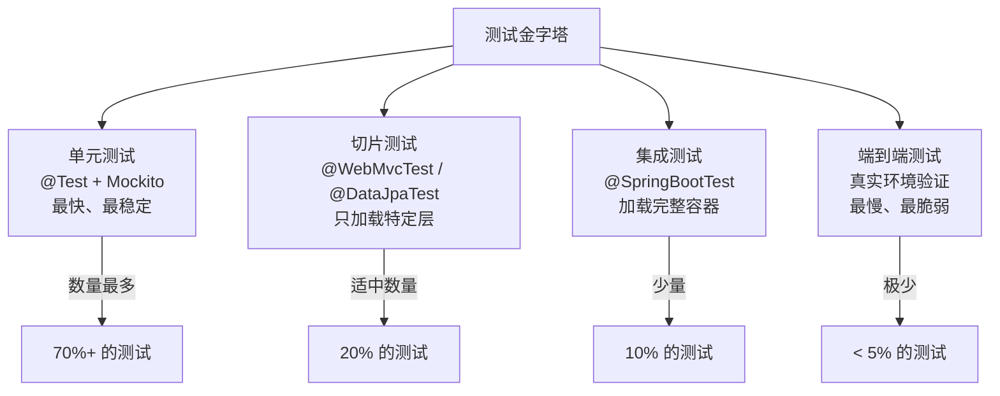

# Spring Boot 测试

Spring Boot 的测试能力，不只是"写几个 `@Test`"，而是帮助你在不同层次验证：

- 业务逻辑是否正确
- Web 接口是否符合预期
- 数据访问是否稳定
- 应用装配和配置是否真实可运行

真正成熟的测试体系，不会把所有测试都堆到一个 `@SpringBootTest` 里，而是按测试目标分层设计。

## 为什么 Spring Boot 测试要分层

如果所有测试都直接起完整 Spring 容器，常见问题包括：

- **启动慢**：每次测试都要启动完整容器，耗时可能数秒甚至数十秒
- **测试范围不清**：一个测试失败难以快速定位是哪一层的问题
- **排查失败原因成本高**：依赖链过长，问题被层层掩盖

更合理的思路是按层次组织：



::: tip 测试分层的核心原则
- **单元测试**验证业务逻辑，不需要 Spring 容器——用 Mockito mock 依赖即可
- **切片测试**验证某一层（如 Web 层、数据层）与 Spring 的集成——只加载该层的组件
- **集成测试**验证完整装配是否正确——只在需要验证多个组件协作时才用
- **不要用 `@SpringBootTest` 测试业务逻辑**——那应该用纯单元测试
:::

::: warning 测试污染：共享状态的陷阱
如果测试之间共享了状态（如数据库中的数据未清理），会导致：
1. 测试顺序依赖——单独跑可能成功，整体跑可能失败
2. 测试结果不可重现——每次运行结果可能不同
3. 排查困难——不知道是哪个测试的数据影响了另一个

**解决方式**：使用 `@Transactional` 让每个测试自动回滚数据库操作；或者使用 `@DirtiesContext` 在测试后重置 Spring 容器（代价是启动时间变长）。
:::

- **单元测试**：只测纯业务逻辑，最快
- **切片测试**：只起 Web 层、数据层等局部容器
- **集成测试**：验证多个组件协作
- **端到端测试**：尽量贴近真实运行环境

## 测试框架介绍

### 核心测试依赖

```xml
<dependency>
    <groupId>org.springframework.boot</groupId>
    <artifactId>spring-boot-starter-test</artifactId>
    <scope>test</scope>
</dependency>
```

这个 Starter 通常已经带来了常见测试能力：

| 测试框架 | 版本 | 作用 |
|---------|------|------|
| JUnit 5 | 5.x | 测试运行框架,提供 @Test、@BeforeEach 等注解 |
| AssertJ | 3.x | 流式断言库,提供 assertThat() 等断言方法 |
| Mockito | 5.x(Boot 3.x 默认;Boot 2.x 为 4.x) | Mock 框架,用于模拟依赖对象 |
| Spring Test | 6.x | Spring 测试支持,提供 @SpringBootTest 等注解 |
| Hamcrest | 2.x | 匹配器库,提供丰富的断言匹配器 |
| JSONassert | 1.x | JSON 断言库 |
| JsonPath | 2.x | JSON 路径表达式 |

### 其他常见测试依赖

```xml
<!-- 内存数据库,用于数据层测试 -->
<dependency>
    <groupId>com.h2database</groupId>
    <artifactId>h2</artifactId>
    <scope>test</scope>
</dependency>

<!-- Spring Security 测试支持 -->
<dependency>
    <groupId>org.springframework.security</groupId>
    <artifactId>spring-security-test</artifactId>
    <scope>test</scope>
</dependency>

<!-- Awaitility,用于异步结果等待(不在 starter-test 内,Boot 提供版本管理) -->
<dependency>
    <groupId>org.awaitility</groupId>
    <artifactId>awaitility</artifactId>
    <scope>test</scope>
</dependency>

<!-- 测试容器,用于集成测试 -->
<dependency>
    <groupId>org.testcontainers</groupId>
    <artifactId>testcontainers</artifactId>
    <version>1.19.0</version>
    <scope>test</scope>
</dependency>

<!-- REST Assured,用于 REST API 测试 -->
<dependency>
    <groupId>io.rest-assured</groupId>
    <artifactId>rest-assured</artifactId>
    <scope>test</scope>
</dependency>
```

### JUnit 5 核心注解

```java
import org.junit.jupiter.api.*;

class JUnit5AnnotationsTest {
    
    // 在所有测试方法前执行一次(静态方法)
    @BeforeAll
    static void beforeAll() {
        System.out.println("初始化共享资源");
    }
    
    // 在每个测试方法前执行
    @BeforeEach
    void setUp() {
        System.out.println("初始化测试环境");
    }
    
    // 测试方法
    @Test
    @DisplayName("应该返回正确的用户名")
    void shouldReturnCorrectUsername() {
        // 测试逻辑
    }
    
    // 禁用测试
    @Test
    @Disabled("暂时禁用")
    void disabledTest() {
    }
    
    // 在每个测试方法后执行
    @AfterEach
    void tearDown() {
        System.out.println("清理测试环境");
    }
    
    // 在所有测试方法后执行一次(静态方法)
    @AfterAll
    static void afterAll() {
        System.out.println("清理共享资源");
    }
}
```

### AssertJ 流式断言

AssertJ 提供了流畅的断言语法,可读性强:

```java
import static org.assertj.core.api.Assertions.*;

class AssertJExample {
    
    @Test
    void stringAssertions() {
        String text = "Hello World";
        
        assertThat(text)
            .isNotNull()
            .startsWith("Hello")
            .endsWith("World")
            .contains(" ")
            .hasSize(11)
            .isEqualToIgnoringCase("hello world");
    }
    
    @Test
    void collectionAssertions() {
        List<String> list = Arrays.asList("Java", "Spring", "Boot");
        
        assertThat(list)
            .hasSize(3)
            .contains("Java", "Spring")
            .containsExactlyInAnyOrder("Boot", "Java", "Spring")
            .doesNotContain("Python")
            .allMatch(s -> s.length() > 3);
    }
    
    @Test
    void objectAssertions() {
        User user = new User(1L, "testuser", "test@example.com");
        
        assertThat(user)
            .isNotNull()
            .hasFieldOrProperty("id")
            .extracting("username", "email")
            .containsExactly("testuser", "test@example.com");
    }
    
    @Test
    void exceptionAssertions() {
        // 断言异常
        assertThatThrownBy(() -> {
            throw new IllegalArgumentException("参数错误");
        })
        .isInstanceOf(IllegalArgumentException.class)
        .hasMessage("参数错误");
        
        // 或者使用 assertThatCode
        assertThatCode(() -> {
            throw new IllegalArgumentException("参数错误");
        })
        .isInstanceOf(IllegalArgumentException.class)
        .hasMessageContaining("参数");
    }
}
```

## 单元测试

单元测试的目标是：

- 不依赖真实 Spring 容器
- 聚焦单个类的业务逻辑
- 失败时能快速定位

### Service 层单元测试

使用 Mockito 模拟依赖,实现纯逻辑测试:

```java
import org.junit.jupiter.api.*;
import org.junit.jupiter.api.extension.ExtendWith;
import org.mockito.*;
import org.mockito.junit.jupiter.MockitoExtension;
import static org.assertj.core.api.Assertions.*;
import static org.mockito.ArgumentMatchers.*;
import static org.mockito.Mockito.*;

@ExtendWith(MockitoExtension.class)
class UserServiceTest {

    @Mock
    private UserRepository userRepository;
    
    @Mock
    private EmailService emailService;
    
    @InjectMocks
    private UserService userService;
    
    @Captor
    private ArgumentCaptor<User> userCaptor;
    
    @Test
    @DisplayName("根据ID查询用户 - 成功")
    void shouldReturnUserWhenFound() {
        // Given - 准备测试数据
        User user = new User(1L, "testuser", "test@example.com");
        when(userRepository.findById(1L)).thenReturn(Optional.of(user));
        
        // When - 执行测试方法
        User result = userService.findById(1L);
        
        // Then - 验证结果
        assertThat(result).isNotNull();
        assertThat(result.getUsername()).isEqualTo("testuser");
        assertThat(result.getEmail()).isEqualTo("test@example.com");
        
        // 验证方法调用
        verify(userRepository).findById(1L);
        verifyNoMoreInteractions(userRepository);
    }
    
    @Test
    @DisplayName("根据ID查询用户 - 用户不存在")
    void shouldThrowExceptionWhenUserNotFound() {
        // Given
        when(userRepository.findById(999L)).thenReturn(Optional.empty());
        
        // When & Then
        assertThatThrownBy(() -> userService.findById(999L))
            .isInstanceOf(UserNotFoundException.class)
            .hasMessage("用户不存在: 999");
        
        verify(userRepository).findById(999L);
    }
    
    @Test
    @DisplayName("创建用户 - 成功")
    void shouldCreateUserSuccessfully() {
        // Given
        UserDto userDto = new UserDto("newuser", "new@example.com");
        User savedUser = new User(1L, "newuser", "new@example.com");
        
        when(userRepository.existsByUsername("newuser")).thenReturn(false);
        when(userRepository.save(any(User.class))).thenReturn(savedUser);
        
        // When
        User result = userService.createUser(userDto);
        
        // Then
        assertThat(result).isNotNull();
        assertThat(result.getId()).isEqualTo(1L);
        
        // 验证保存的用户对象
        verify(userRepository).save(userCaptor.capture());
        User capturedUser = userCaptor.getValue();
        assertThat(capturedUser.getUsername()).isEqualTo("newuser");
        
        // 验证发送了欢迎邮件
        verify(emailService).sendWelcomeEmail("new@example.com");
    }
    
    @Test
    @DisplayName("创建用户 - 用户名已存在")
    void shouldThrowExceptionWhenUsernameExists() {
        // Given
        UserDto userDto = new UserDto("existinguser", "existing@example.com");
        when(userRepository.existsByUsername("existinguser")).thenReturn(true);
        
        // When & Then
        assertThatThrownBy(() -> userService.createUser(userDto))
            .isInstanceOf(UsernameExistsException.class)
            .hasMessage("用户名已存在: existinguser");
        
        // 验证没有保存用户
        verify(userRepository, never()).save(any());
        verify(emailService, never()).sendWelcomeEmail(anyString());
    }
}
```

### 单元测试的价值

这类测试的价值是：

- **运行快**：毫秒级完成,不需要启动容器
- **边界清晰**：只测试单个类的逻辑
- **不受容器和外部依赖影响**：使用 Mock 隔离外部依赖
- **易于定位问题**：失败时立即知道是哪个方法的问题

### Mockito 常用方法

```java
import static org.mockito.Mockito.*;

class MockitoExamples {
    
    @Test
    void mockitoCommonUsage() {
        // 创建 Mock 对象
        UserRepository mockRepo = mock(UserRepository.class);
        
        // 设置返回值
        when(mockRepo.findById(1L)).thenReturn(Optional.of(new User()));
        when(mockRepo.findById(2L)).thenReturn(Optional.empty());
        
        // 设置抛出异常
        when(mockRepo.findById(3L)).thenThrow(new RuntimeException("数据库异常"));
        
        // 设置多次调用返回不同值
        when(mockRepo.count())
            .thenReturn(10L)   // 第一次调用返回 10
            .thenReturn(20L)   // 第二次调用返回 20
            .thenReturn(30L);  // 第三次及以后返回 30
        
        // 设置 void 方法的行为
        doNothing().when(mockRepo).delete(any());
        doThrow(new RuntimeException()).when(mockRepo).delete(null);
        
        // 验证方法调用
        verify(mockRepo).findById(1L);           // 验证调用了一次
        verify(mockRepo, times(2)).count();      // 验证调用了两次
        verify(mockRepo, never()).delete(any()); // 验证从未调用
        verify(mockRepo, atLeast(1)).findById(any()); // 至少调用一次
        verify(mockRepo, atMost(3)).count();     // 最多调用三次
        
        // 验证调用顺序
        InOrder inOrder = inOrder(mockRepo);
        inOrder.verify(mockRepo).findById(1L);
        inOrder.verify(mockRepo).save(any());
        
        // 验证没有更多交互
        verifyNoMoreInteractions(mockRepo);
    }
}
```

## Web 层测试

如果你只想验证控制器层，不需要启动整个应用，通常可以用 `@WebMvcTest`。

### @WebMvcTest 控制器测试

```java
import org.junit.jupiter.api.*;
import org.springframework.beans.factory.annotation.Autowired;
import org.springframework.boot.test.autoconfigure.web.servlet.WebMvcTest;
import org.springframework.boot.test.mock.mockito.MockBean;
import org.springframework.http.MediaType;
import org.springframework.test.web.servlet.MockMvc;
import static org.mockito.Mockito.*;
import static org.springframework.test.web.servlet.request.MockMvcRequestBuilders.*;
import static org.springframework.test.web.servlet.result.MockMvcResultMatchers.*;

@WebMvcTest(UserController.class)
class UserControllerTest {

    @Autowired
    private MockMvc mockMvc;
    
    @MockBean
    private UserService userService;
    
    @Autowired
    private ObjectMapper objectMapper;
    
    @Test
    @DisplayName("GET /api/users/{id} - 成功")
    void shouldReturnUserWhenFound() throws Exception {
        // Given
        User user = new User(1L, "testuser", "test@example.com");
        when(userService.findById(1L)).thenReturn(user);
        
        // When & Then
        mockMvc.perform(get("/api/users/1"))
            .andExpect(status().isOk())
            .andExpect(content().contentType(MediaType.APPLICATION_JSON))
            .andExpect(jsonPath("$.id").value(1))
            .andExpect(jsonPath("$.username").value("testuser"))
            .andExpect(jsonPath("$.email").value("test@example.com"));
    }
    
    @Test
    @DisplayName("GET /api/users/{id} - 用户不存在")
    void shouldReturn404WhenUserNotFound() throws Exception {
        // Given
        when(userService.findById(999L))
            .thenThrow(new UserNotFoundException("用户不存在: 999"));
        
        // When & Then
        mockMvc.perform(get("/api/users/999"))
            .andExpect(status().isNotFound())
            .andExpect(jsonPath("$.error").value("UserNotFoundException"))
            .andExpect(jsonPath("$.message").value("用户不存在: 999"));
    }
    
    @Test
    @DisplayName("POST /api/users - 成功创建用户")
    void shouldCreateUserSuccessfully() throws Exception {
        // Given
        UserDto userDto = new UserDto("newuser", "new@example.com");
        User createdUser = new User(1L, "newuser", "new@example.com");
        
        when(userService.createUser(any(UserDto.class))).thenReturn(createdUser);
        
        // When & Then
        mockMvc.perform(post("/api/users")
                .contentType(MediaType.APPLICATION_JSON)
                .content(objectMapper.writeValueAsString(userDto)))
            .andExpect(status().isCreated())
            .andExpect(jsonPath("$.id").value(1))
            .andExpect(jsonPath("$.username").value("newuser"));
    }
    
    @Test
    @DisplayName("POST /api/users - 参数校验失败")
    void shouldReturn400WhenValidationFails() throws Exception {
        // Given - 空用户名
        UserDto invalidUserDto = new UserDto("", "invalid-email");
        
        // When & Then
        mockMvc.perform(post("/api/users")
                .contentType(MediaType.APPLICATION_JSON)
                .content(objectMapper.writeValueAsString(invalidUserDto)))
            .andExpect(status().isBadRequest())
            .andExpect(jsonPath("$.errors").isArray());
    }
    
    @Test
    @DisplayName("PUT /api/users/{id} - 成功更新用户")
    void shouldUpdateUserSuccessfully() throws Exception {
        // Given
        UserDto userDto = new UserDto("updateduser", "updated@example.com");
        User updatedUser = new User(1L, "updateduser", "updated@example.com");
        
        when(userService.updateUser(eq(1L), any(UserDto.class)))
            .thenReturn(updatedUser);
        
        // When & Then
        mockMvc.perform(put("/api/users/1")
                .contentType(MediaType.APPLICATION_JSON)
                .content(objectMapper.writeValueAsString(userDto)))
            .andExpect(status().isOk())
            .andExpect(jsonPath("$.username").value("updateduser"));
    }
    
    @Test
    @DisplayName("DELETE /api/users/{id} - 成功删除用户")
    void shouldDeleteUserSuccessfully() throws Exception {
        // Given
        doNothing().when(userService).deleteUser(1L);
        
        // When & Then
        mockMvc.perform(delete("/api/users/1"))
            .andExpect(status().isNoContent());
        
        verify(userService).deleteUser(1L);
    }
}
```

### MockMvc 常用方法

```java
import static org.springframework.test.web.servlet.request.MockMvcRequestBuilders.*;
import static org.springframework.test.web.servlet.result.MockMvcResultMatchers.*;
import static org.springframework.test.web.servlet.result.MockMvcResultHandlers.*;

class MockMvcExamples {
    
    @Autowired
    private MockMvc mockMvc;
    
    @Test
    void mockMvcCommonUsage() throws Exception {
        // GET 请求
        mockMvc.perform(get("/api/users/1")
                .param("page", "0")         // 查询参数
                .param("size", "10")
                .header("Authorization", "Bearer token") // 请求头
                .accept(MediaType.APPLICATION_JSON))     // Accept 头
            .andExpect(status().isOk())
            .andExpect(content().contentType(MediaType.APPLICATION_JSON))
            .andExpect(jsonPath("$.id").value(1));
        
        // POST 请求
        String json = "{\"username\":\"test\"}";
        mockMvc.perform(post("/api/users")
                .contentType(MediaType.APPLICATION_JSON)
                .content(json))
            .andExpect(status().isCreated());
        
        // PUT 请求
        mockMvc.perform(put("/api/users/1")
                .contentType(MediaType.APPLICATION_JSON)
                .content(json))
            .andExpect(status().isOk());
        
        // DELETE 请求
        mockMvc.perform(delete("/api/users/1"))
            .andExpect(status().isNoContent());
        
        // 打印请求和响应详情
        mockMvc.perform(get("/api/users/1"))
            .andDo(print())
            .andExpect(status().isOk());
        
        // 文件上传
        mockMvc.perform(multipart("/api/upload")
                .file("file", "file content".getBytes()))
            .andExpect(status().isOk());
    }
}
```

### @WebMvcTest 的适用场景

这种方式适合验证：

- **请求映射**：URL 是否正确映射到方法
- **参数绑定**：查询参数、路径变量、请求体是否正确绑定
- **返回值结构**：响应状态码、响应体结构是否正确
- **基础 Web 规则**：参数校验、异常处理是否生效

**注意**：`@WebMvcTest` 只会加载 Web 层相关的组件(Controller、ControllerAdvice、Filter等),不会加载 Service、Repository 等组件,需要使用 `@MockBean` 模拟。

> **版本注**: `@MockBean`/`@SpyBean` 自 Spring Boot 3.4 起废弃,推荐改用 `@MockitoBean`/`@MockitoSpyBean`(位于 `org.springframework.test.context.bean.override.mockito` 包,依赖机制从 Bean 后置处理改为 Bean 覆盖)。本文示例沿用 `@MockBean`,Boot 3.4+ 项目按上述替换即可。

## 数据访问层测试

如果只关注数据层，可以使用切片测试而不是完整应用测试。

### @DataJpaTest 测试

```java
import org.junit.jupiter.api.*;
import org.springframework.beans.factory.annotation.Autowired;
import org.springframework.boot.test.autoconfigure.orm.jpa.DataJpaTest;
import org.springframework.boot.test.autoconfigure.orm.jpa.TestEntityManager;
import org.springframework.data.domain.Page;
import org.springframework.data.domain.PageRequest;
import static org.assertj.core.api.Assertions.*;

@DataJpaTest
class UserRepositoryTest {

    @Autowired
    private TestEntityManager entityManager;
    
    @Autowired
    private UserRepository userRepository;
    
    @BeforeEach
    void setUp() {
        // 准备测试数据
        entityManager.persist(new User(null, "user1", "user1@example.com"));
        entityManager.persist(new User(null, "user2", "user2@example.com"));
        entityManager.persist(new User(null, "admin", "admin@example.com"));
        entityManager.flush();
    }
    
    @Test
    @DisplayName("根据用户名查询用户")
    void shouldFindUserByUsername() {
        // When
        Optional<User> found = userRepository.findByUsername("user1");
        
        // Then
        assertThat(found).isPresent();
        assertThat(found.get().getEmail()).isEqualTo("user1@example.com");
    }
    
    @Test
    @DisplayName("根据用户名查询 - 用户不存在")
    void shouldReturnEmptyWhenUsernameNotFound() {
        // When
        Optional<User> found = userRepository.findByUsername("nonexistent");
        
        // Then
        assertThat(found).isEmpty();
    }
    
    @Test
    @DisplayName("检查用户名是否存在")
    void shouldCheckUsernameExists() {
        // When & Then
        assertThat(userRepository.existsByUsername("user1")).isTrue();
        assertThat(userRepository.existsByUsername("nonexistent")).isFalse();
    }
    
    @Test
    @DisplayName("分页查询用户")
    void shouldFindAllWithPaging() {
        // When
        Page<User> page = userRepository.findAll(PageRequest.of(0, 2));
        
        // Then
        assertThat(page.getContent()).hasSize(2);
        assertThat(page.getTotalElements()).isEqualTo(3);
        assertThat(page.getTotalPages()).isEqualTo(2);
        assertThat(page.hasNext()).isTrue();
    }
    
    @Test
    @DisplayName("根据邮箱后缀查询用户")
    void shouldFindByEmailDomain() {
        // When
        List<User> users = userRepository.findByEmailEndingWith("@example.com");
        
        // Then
        assertThat(users).hasSize(3);
    }
    
    @Test
    @DisplayName("保存用户")
    void shouldSaveUser() {
        // Given
        User newUser = new User(null, "newuser", "new@example.com");
        
        // When
        User saved = userRepository.save(newUser);
        
        // Then
        assertThat(saved.getId()).isNotNull();
        assertThat(saved.getUsername()).isEqualTo("newuser");
    }
    
    @Test
    @DisplayName("删除用户")
    void shouldDeleteUser() {
        // Given
        User user = userRepository.findByUsername("user1").orElseThrow();
        
        // When
        userRepository.delete(user);
        entityManager.flush();
        
        // Then
        assertThat(userRepository.findByUsername("user1")).isEmpty();
    }
    
    @Test
    @DisplayName("自定义查询 - 使用 @Query")
    void shouldExecuteCustomQuery() {
        // When
        List<User> users = userRepository.findActiveUsers();
        
        // Then
        assertThat(users).isNotEmpty();
    }
}
```

### TestEntityManager 的作用

`TestEntityManager` 是 JPA 测试的辅助类,提供了简化的持久化操作:

```java
@Autowired
private TestEntityManager entityManager;

@Test
void testEntityManagerUsage() {
    // 持久化实体并立即flush
    User user = entityManager.persistAndFlush(new User(null, "test", "test@example.com"));
    
    // 持久化但不flush
    entityManager.persist(new User(null, "test2", "test2@example.com"));
    
    // 查找实体
    User found = entityManager.find(User.class, user.getId());
    
    // 删除实体
    entityManager.remove(found);
    
    // 清空持久化上下文
    entityManager.clear();
    
    // 刷新到数据库
    entityManager.flush();
}
```

### @DataJpaTest 的适用场景

这类测试适合验证：

- **JPA 映射是否正确**：实体注解、关联关系、约束条件
- **Repository 查询是否符合预期**：方法命名查询、@Query 自定义查询
- **数据库层约束和行为**：唯一约束、外键约束、触发器等

**注意**：`@DataJpaTest` 默认使用内存数据库(H2)替代真实数据库,每个测试后回滚事务,保证测试间隔离。

### 使用真实数据库测试

如果需要测试真实数据库行为:

```java
@DataJpaTest
@AutoConfigureTestDatabase(replace = AutoConfigureTestDatabase.Replace.NONE)
@TestPropertySource(properties = {
    "spring.datasource.url=jdbc:mysql://localhost:3306/testdb",
    "spring.datasource.username=test",
    "spring.datasource.password=test"
})
class UserRepositoryRealDbTest {
    
    @Autowired
    private UserRepository userRepository;
    
    // 测试方法
}
```

## 集成测试

当你需要验证多个组件一起工作时，通常会用 `@SpringBootTest`。

### @SpringBootTest 集成测试

```java
import org.junit.jupiter.api.*;
import org.springframework.beans.factory.annotation.Autowired;
import org.springframework.boot.test.autoconfigure.web.servlet.AutoConfigureMockMvc;
import org.springframework.boot.test.context.SpringBootTest;
import org.springframework.http.MediaType;
import org.springframework.test.annotation.DirtiesContext;
import org.springframework.test.web.servlet.MockMvc;
import org.springframework.transaction.annotation.Transactional;
import static org.springframework.test.web.servlet.request.MockMvcRequestBuilders.*;
import static org.springframework.test.web.servlet.result.MockMvcResultMatchers.*;

@SpringBootTest
@AutoConfigureMockMvc
@Transactional
class UserIntegrationTest {

    @Autowired
    private MockMvc mockMvc;
    
    @Autowired
    private UserRepository userRepository;
    
    @Autowired
    private ObjectMapper objectMapper;
    
    @Test
    @DisplayName("完整流程:创建用户->查询用户->更新用户->删除用户")
    void shouldCompleteFullUserLifecycle() throws Exception {
        // 1. 创建用户
        UserDto createDto = new UserDto("testuser", "test@example.com");
        
        String response = mockMvc.perform(post("/api/users")
                .contentType(MediaType.APPLICATION_JSON)
                .content(objectMapper.writeValueAsString(createDto)))
            .andExpect(status().isCreated())
            .andReturn().getResponse().getContentAsString();
        
        User createdUser = objectMapper.readValue(response, User.class);
        Long userId = createdUser.getId();
        
        // 2. 查询用户
        mockMvc.perform(get("/api/users/" + userId))
            .andExpect(status().isOk())
            .andExpect(jsonPath("$.username").value("testuser"))
            .andExpect(jsonPath("$.email").value("test@example.com"));
        
        // 3. 更新用户
        UserDto updateDto = new UserDto("updateduser", "updated@example.com");
        
        mockMvc.perform(put("/api/users/" + userId)
                .contentType(MediaType.APPLICATION_JSON)
                .content(objectMapper.writeValueAsString(updateDto)))
            .andExpect(status().isOk())
            .andExpect(jsonPath("$.username").value("updateduser"));
        
        // 4. 验证更新结果
        mockMvc.perform(get("/api/users/" + userId))
            .andExpect(status().isOk())
            .andExpect(jsonPath("$.username").value("updateduser"));
        
        // 5. 删除用户
        mockMvc.perform(delete("/api/users/" + userId))
            .andExpect(status().isNoContent());
        
        // 6. 验证删除结果
        mockMvc.perform(get("/api/users/" + userId))
            .andExpect(status().isNotFound());
    }
    
    @Test
    @DisplayName("验证数据库中的数据")
    void shouldVerifyDataInDatabase() throws Exception {
        // Given
        User user = userRepository.save(new User(null, "dbtest", "db@example.com"));
        
        // When - 通过 API 查询
        mockMvc.perform(get("/api/users/" + user.getId()))
            .andExpect(status().isOk())
            .andExpect(jsonPath("$.username").value("dbtest"));
        
        // Then - 直接查询数据库验证
        Optional<User> found = userRepository.findById(user.getId());
        assertThat(found).isPresent();
        assertThat(found.get().getUsername()).isEqualTo("dbtest");
    }
}
```

### @SpringBootTest 配置选项

```java
// 1. 默认:启动完整应用上下文
@SpringBootTest
class DefaultTest { }

// 2. 指定 Web 环境
@SpringBootTest(webEnvironment = SpringBootTest.WebEnvironment.MOCK)
class MockWebTest { }

@SpringBootTest(webEnvironment = SpringBootTest.WebEnvironment.RANDOM_PORT)
class RandomPortTest {
    @Autowired
    private WebTestClient webTestClient;
    
    @LocalServerPort
    private int port;
}

@SpringBootTest(webEnvironment = SpringBootTest.WebEnvironment.DEFINED_PORT)
class DefinedPortTest { }

// 3. 指定配置类
@SpringBootTest(classes = {TestConfig.class})
class CustomConfigTest { }

// 4. 设置属性
@SpringBootTest(properties = {
    "spring.datasource.url=jdbc:h2:mem:testdb",
    "app.feature.enabled=true"
})
class PropertiesTest { }

// 5. 使用测试配置文件
@SpringBootTest
@ActiveProfiles("test")
class ProfileTest { }

// 6. 禁用特定自动配置(推荐通过属性方式,测试类上的 @EnableAutoConfiguration 不参与配置解析)
@SpringBootTest(properties = "spring.autoconfigure.exclude=org.springframework.boot.autoconfigure.security.servlet.SecurityAutoConfiguration")
class ExcludeAutoConfigTest { }
```

### WebTestClient 测试

使用 `WebTestClient` 进行非阻塞式测试:

```java
@SpringBootTest(webEnvironment = SpringBootTest.WebEnvironment.RANDOM_PORT)
class WebTestClientTest {
    
    @Autowired
    private WebTestClient webTestClient;
    
    @Test
    void shouldGetUser() {
        webTestClient.get()
            .uri("/api/users/1")
            .accept(MediaType.APPLICATION_JSON)
            .exchange()
            .expectStatus().isOk()
            .expectHeader().contentType(MediaType.APPLICATION_JSON)
            .expectBody()
            .jsonPath("$.id").isEqualTo(1)
            .jsonPath("$.username").isEqualTo("testuser");
    }
    
    @Test
    void shouldCreateUser() {
        UserDto userDto = new UserDto("newuser", "new@example.com");
        
        webTestClient.post()
            .uri("/api/users")
            .contentType(MediaType.APPLICATION_JSON)
            .bodyValue(userDto)
            .exchange()
            .expectStatus().isCreated()
            .expectBody(User.class)
            .value(user -> {
                assertThat(user.getId()).isNotNull();
                assertThat(user.getUsername()).isEqualTo("newuser");
            });
    }
}
```

### 集成测试的适用场景

这类测试会更慢，但它更接近真实运行环境，适合验证：

- **容器装配**：Spring 容器能否正常启动和配置
- **控制器、Service、Repository 协作**：多个组件能否正常协作
- **配置与依赖是否真的能一起跑起来**：配置是否正确、依赖是否满足
- **事务管理**：事务传播、回滚是否正确
- **缓存**：缓存是否生效
- **异步处理**：异步任务是否正确执行

## Mock 测试和数据准备

### 使用 @MockBean 替换真实 Bean

```java
@SpringBootTest
class MockBeanTest {
    
    @MockBean
    private EmailService emailService;
    
    @MockBean
    private PaymentGateway paymentGateway;
    
    @Autowired
    private UserService userService;
    
    @Test
    void shouldSendEmailAfterUserCreation() {
        // Given
        when(emailService.sendEmail(anyString(), anyString()))
            .thenReturn(true);
        
        // When
        userService.createUser(new UserDto("test", "test@example.com"));
        
        // Then
        verify(emailService).sendEmail(
            eq("test@example.com"),
            contains("欢迎")
        );
    }
}
```

### 使用 @TestConfiguration 自定义测试配置

```java
@SpringBootTest
class CustomTestConfigTest {
    
    @TestConfiguration
    static class TestConfig {
        
        @Bean
        @Primary
        public DataSource dataSource() {
            // 使用内嵌数据库
            return new EmbeddedDatabaseBuilder()
                .setType(EmbeddedDatabaseType.H2)
                .addScript("classpath:schema.sql")
                .addScript("classpath:test-data.sql")
                .build();
        }
        
        @Bean
        @Primary
        public EmailService emailService() {
            // 返回 Mock 实现
            return mock(EmailService.class);
        }
    }
    
    @Autowired
    private DataSource dataSource;
    
    @Test
    void testWithCustomConfig() {
        // 使用自定义配置测试
    }
}
```

### 使用 @Sql 准备测试数据

```java
@SpringBootTest
@Sql(scripts = "classpath:cleanup.sql", executionPhase = Sql.ExecutionPhase.BEFORE_TEST_METHOD)
class SqlDataTest {
    
    @Autowired
    private JdbcTemplate jdbcTemplate;
    
    @Test
    @Sql(scripts = "classpath:test-data-users.sql")
    void shouldLoadUserData() {
        Integer count = jdbcTemplate.queryForObject(
            "SELECT COUNT(*) FROM users", Integer.class);
        assertThat(count).isEqualTo(5);
    }
    
    @Test
    @Sql(statements = {
        "INSERT INTO users (username, email) VALUES ('test1', 'test1@example.com')",
        "INSERT INTO users (username, email) VALUES ('test2', 'test2@example.com')"
    })
    void shouldLoadInlineData() {
        Integer count = jdbcTemplate.queryForObject(
            "SELECT COUNT(*) FROM users", Integer.class);
        assertThat(count).isEqualTo(2);
    }
    
    @Test
    @Sql(scripts = "classpath:test-data-orders.sql")
    @Sql(scripts = "classpath:test-data-order-items.sql")
    void shouldLoadMultipleDataFiles() {
        // 加载多个数据文件
    }
}
```

### 使用测试工具类准备数据

```java
@SpringBootTest
class TestDataUtilsTest {
    
    @Autowired
    private UserRepository userRepository;
    
    @Autowired
    private OrderRepository orderRepository;
    
    @BeforeEach
    void setUp() {
        userRepository.deleteAll();
        orderRepository.deleteAll();
    }
    
    @Test
    void shouldTestWithTestData() {
        // 使用测试数据构建器
        User user = TestDataBuilder.createUser("testuser");
        user = userRepository.save(user);
        
        Order order = TestDataBuilder.createOrder(user, 3);
        order = orderRepository.save(order);
        
        // 执行测试
    }
}

// 测试数据构建器
class TestDataBuilder {
    
    public static User createUser(String username) {
        User user = new User();
        user.setUsername(username);
        user.setEmail(username + "@example.com");
        user.setCreatedAt(LocalDateTime.now());
        return user;
    }
    
    public static Order createOrder(User user, int itemCount) {
        Order order = new Order();
        order.setUser(user);
        order.setOrderNumber("ORD-" + System.currentTimeMillis());
        order.setStatus(OrderStatus.PENDING);
        order.setCreatedAt(LocalDateTime.now());
        
        for (int i = 0; i < itemCount; i++) {
            OrderItem item = new OrderItem();
            item.setProductName("Product " + i);
            item.setPrice(new BigDecimal("99.99"));
            item.setQuantity(1);
            order.addItem(item);
        }
        
        return order;
    }
    
    public static List<User> createUsers(int count) {
        return IntStream.range(0, count)
            .mapToObj(i -> createUser("user" + i))
            .collect(Collectors.toList());
    }
}
```

## 测试覆盖率工具

### 使用 JaCoCo 统计覆盖率

#### 1. 添加 JaCoCo 插件

```xml
<build>
    <plugins>
        <plugin>
            <groupId>org.jacoco</groupId>
            <artifactId>jacoco-maven-plugin</artifactId>
            <version>0.8.10</version>
            <executions>
                <execution>
                    <id>prepare-agent</id>
                    <goals>
                        <goal>prepare-agent</goal>
                    </goals>
                </execution>
                <execution>
                    <id>report</id>
                    <phase>test</phase>
                    <goals>
                        <goal>report</goal>
                    </goals>
                </execution>
                <execution>
                    <id>check</id>
                    <goals>
                        <goal>check</goal>
                    </goals>
                    <configuration>
                        <rules>
                            <rule>
                                <element>PACKAGE</element>
                                <limits>
                                    <limit>
                                        <counter>LINE</counter>
                                        <value>COVEREDRATIO</value>
                                        <minimum>0.80</minimum>
                                    </limit>
                                </limits>
                            </rule>
                        </rules>
                    </configuration>
                </execution>
            </executions>
        </plugin>
    </plugins>
</build>
```

#### 2. 运行测试并生成报告

```bash
# 运行测试并生成覆盖率报告
mvn clean test

# 报告位置
# target/site/jacoco/index.html
```

#### 3. 覆盖率报告解读

覆盖率指标:
- 行覆盖率 (Line Coverage): 执行的代码行数 / 总行数
- 分支覆盖率 (Branch Coverage): 执行的分支数 / 总分支数
- 方法覆盖率 (Method Coverage): 执行的方法数 / 总方法数
- 类覆盖率 (Class Coverage): 执行的类数 / 总类数
- 指令覆盖率 (Instruction Coverage): 执行的字节码指令数 / 总指令数
- 复杂度覆盖率 (Complexity Coverage): 覆盖的复杂度 / 总复杂度

#### 4. 配置覆盖率阈值

```xml
<configuration>
    <rules>
        <!-- 全局覆盖率要求 -->
        <rule>
            <element>BUNDLE</element>
            <limits>
                <limit>
                    <counter>LINE</counter>
                    <value>COVEREDRATIO</value>
                    <minimum>0.80</minimum>
                </limit>
                <limit>
                    <counter>BRANCH</counter>
                    <value>COVEREDRATIO</value>
                    <minimum>0.70</minimum>
                </limit>
            </limits>
        </rule>
        
        <!-- 包级别覆盖率要求 -->
        <rule>
            <element>PACKAGE</element>
            <limits>
                <limit>
                    <counter>LINE</counter>
                    <value>COVEREDRATIO</value>
                    <minimum>0.75</minimum>
                </limit>
            </limits>
        </rule>
        
        <!-- 类级别覆盖率要求 -->
        <rule>
            <element>CLASS</element>
            <limits>
                <limit>
                    <counter>LINE</counter>
                    <value>COVEREDRATIO</value>
                    <minimum>0.70</minimum>
                </limit>
            </limits>
            <excludes>
                <exclude>com.example.dto.*</exclude>
                <exclude>com.example.config.*</exclude>
            </excludes>
        </rule>
    </rules>
</configuration>
```

### 排除特定类或方法

```xml
<configuration>
    <excludes>
        <!-- 排除 DTO 类 -->
        <exclude>com/example/dto/**</exclude>
        <!-- 排除配置类 -->
        <exclude>com/example/config/**</exclude>
        <!-- 排除实体类 -->
        <exclude>com/example/entity/**</exclude>
        <!-- 排除主应用类 -->
        <exclude>com/example/Application.class</exclude>
    </excludes>
</configuration>
```

### 使用 SonarQube 集成

```xml
<properties>
    <sonar.projectKey>my-project</sonar.projectKey>
    <sonar.host.url>http://localhost:9000</sonar.host.url>
    <sonar.login>your-token</sonar.login>
    
    <!-- 覆盖率配置 -->
    <sonar.coverage.jacoco.xmlReportPaths>
        target/site/jacoco/jacoco.xml
    </sonar.coverage.jacoco.xmlReportPaths>
    
    <!-- 排除文件 -->
    <sonar.exclusions>
        **/dto/**,
        **/entity/**,
        **/config/**
    </sonar.exclusions>
    
    <!-- 测试排除 -->
    <sonar.test.exclusions>
        **/test/**
    </sonar.test.exclusions>
</properties>
```

运行命令:

```bash
mvn clean verify sonar:sonar
```

### 覆盖率最佳实践

1. **合理设置覆盖率目标**：
   - 核心业务逻辑：80% 以上
   - 工具类：70% 以上
   - DTO/Entity：可以不测或降低要求

2. **关注有价值的测试**：
   ```java
   // × 无意义的测试
   @Test
   void testGetterSetter() {
       User user = new User();
       user.setUsername("test");
       assertThat(user.getUsername()).isEqualTo("test");
   }
   
   // √ 有价值的测试
   @Test
   void shouldCalculateDiscountCorrectly() {
       Order order = new Order();
       order.setAmount(new BigDecimal("100.00"));
       order.setMemberLevel(MemberLevel.GOLD);
       
       BigDecimal discount = order.calculateDiscount();
       
       assertThat(discount).isEqualByComparingTo("10.00");
   }
   ```

3. **避免为了覆盖率而测试**：
   - 测试应该验证业务逻辑,而不是单纯追求覆盖率数字
   - 删除无效代码比测试无效代码更有价值

## 测试实战案例

### 案例 1:电商订单服务测试

```java
@SpringBootTest
@Transactional
class OrderServiceIntegrationTest {
    
    @Autowired
    private OrderService orderService;
    
    @Autowired
    private OrderRepository orderRepository;
    
    @Autowired
    private ProductRepository productRepository;
    
    @Autowired
    private UserRepository userRepository;
    
    private User testUser;
    private Product testProduct;
    
    @BeforeEach
    void setUp() {
        // 准备测试数据
        testUser = userRepository.save(
            new User(null, "testuser", "test@example.com")
        );
        
        testProduct = productRepository.save(
            new Product(null, "测试商品", new BigDecimal("99.99"), 100)
        );
    }
    
    @Test
    @DisplayName("创建订单 - 成功")
    void shouldCreateOrderSuccessfully() {
        // Given
        CreateOrderDto dto = new CreateOrderDto();
        dto.setUserId(testUser.getId());
        dto.getItems().add(new OrderItemDto(testProduct.getId(), 2));
        
        // When
        Order order = orderService.createOrder(dto);
        
        // Then
        assertThat(order.getId()).isNotNull();
        assertThat(order.getStatus()).isEqualTo(OrderStatus.PENDING);
        assertThat(order.getTotalAmount())
            .isEqualByComparingTo("199.98");
        
        // 验证库存扣减
        Product product = productRepository.findById(testProduct.getId()).orElseThrow();
        assertThat(product.getStock()).isEqualTo(98);
    }
    
    @Test
    @DisplayName("创建订单 - 库存不足")
    void shouldThrowExceptionWhenStockInsufficient() {
        // Given
        CreateOrderDto dto = new CreateOrderDto();
        dto.setUserId(testUser.getId());
        dto.getItems().add(new OrderItemDto(testProduct.getId(), 200)); // 超过库存
        
        // When & Then
        assertThatThrownBy(() -> orderService.createOrder(dto))
            .isInstanceOf(InsufficientStockException.class)
            .hasMessageContaining("库存不足");
        
        // 验证库存未变化
        Product product = productRepository.findById(testProduct.getId()).orElseThrow();
        assertThat(product.getStock()).isEqualTo(100);
    }
    
    @Test
    @DisplayName("取消订单 - 成功")
    void shouldCancelOrderSuccessfully() {
        // Given
        CreateOrderDto dto = new CreateOrderDto();
        dto.setUserId(testUser.getId());
        dto.getItems().add(new OrderItemDto(testProduct.getId(), 5));
        Order order = orderService.createOrder(dto);
        
        // When
        orderService.cancelOrder(order.getId());
        
        // Then
        Order canceledOrder = orderRepository.findById(order.getId()).orElseThrow();
        assertThat(canceledOrder.getStatus()).isEqualTo(OrderStatus.CANCELED);
        
        // 验证库存恢复
        Product product = productRepository.findById(testProduct.getId()).orElseThrow();
        assertThat(product.getStock()).isEqualTo(100);
    }
    
    @Test
    @DisplayName("支付订单 - 成功")
    void shouldPayOrderSuccessfully() {
        // Given
        CreateOrderDto dto = new CreateOrderDto();
        dto.setUserId(testUser.getId());
        dto.getItems().add(new OrderItemDto(testProduct.getId(), 1));
        Order order = orderService.createOrder(dto);
        
        // When
        orderService.payOrder(order.getId());
        
        // Then
        Order paidOrder = orderRepository.findById(order.getId()).orElseThrow();
        assertThat(paidOrder.getStatus()).isEqualTo(OrderStatus.PAID);
        assertThat(paidOrder.getPaidAt()).isNotNull();
    }
    
    @Test
    @DisplayName("并发下单 - 库存一致性")
    void shouldHandleConcurrentOrders() throws InterruptedException {
        // Given
        int threadCount = 10;
        int orderQuantity = 15;
        CountDownLatch latch = new CountDownLatch(threadCount);
        AtomicInteger successCount = new AtomicInteger(0);
        AtomicInteger failCount = new AtomicInteger(0);
        
        ExecutorService executor = Executors.newFixedThreadPool(threadCount);
        
        // When
        for (int i = 0; i < threadCount; i++) {
            executor.submit(() -> {
                try {
                    CreateOrderDto dto = new CreateOrderDto();
                    dto.setUserId(testUser.getId());
                    dto.getItems().add(new OrderItemDto(testProduct.getId(), orderQuantity));
                    
                    orderService.createOrder(dto);
                    successCount.incrementAndGet();
                } catch (InsufficientStockException e) {
                    failCount.incrementAndGet();
                } finally {
                    latch.countDown();
                }
            });
        }
        
        latch.await(10, TimeUnit.SECONDS);
        executor.shutdown();
        
        // Then
        // 总库存100,每次下单15个,最多成功6次(90个),第7次失败
        assertThat(successCount.get()).isLessThanOrEqualTo(6);
        
        // 验证最终库存
        Product product = productRepository.findById(testProduct.getId()).orElseThrow();
        assertThat(product.getStock()).isEqualTo(100 - successCount.get() * 15);
    }
}
```

### 案例 2:用户认证服务测试

```java
@SpringBootTest
@AutoConfigureMockMvc
class AuthenticationIntegrationTest {
    
    @Autowired
    private MockMvc mockMvc;
    
    @Autowired
    private UserRepository userRepository;
    
    @Autowired
    private PasswordEncoder passwordEncoder;
    
    @Autowired
    private JwtTokenProvider tokenProvider;
    
    @Autowired
    private ObjectMapper objectMapper;
    
    @BeforeEach
    void setUp() {
        userRepository.deleteAll();
        
        // 创建测试用户
        User user = new User();
        user.setUsername("testuser");
        user.setPassword(passwordEncoder.encode("password123"));
        user.setEmail("test@example.com");
        user.setRole(Role.USER);
        userRepository.save(user);
    }
    
    @Test
    @DisplayName("用户登录 - 成功")
    void shouldLoginSuccessfully() throws Exception {
        // Given
        LoginDto loginDto = new LoginDto("testuser", "password123");
        
        // When & Then
        mockMvc.perform(post("/api/auth/login")
                .contentType(MediaType.APPLICATION_JSON)
                .content(objectMapper.writeValueAsString(loginDto)))
            .andExpect(status().isOk())
            .andExpect(jsonPath("$.token").isNotEmpty())
            .andExpect(jsonPath("$.tokenType").value("Bearer"))
            .andExpect(jsonPath("$.username").value("testuser"));
    }
    
    @Test
    @DisplayName("用户登录 - 密码错误")
    void shouldFailLoginWithWrongPassword() throws Exception {
        // Given
        LoginDto loginDto = new LoginDto("testuser", "wrongpassword");
        
        // When & Then
        mockMvc.perform(post("/api/auth/login")
                .contentType(MediaType.APPLICATION_JSON)
                .content(objectMapper.writeValueAsString(loginDto)))
            .andExpect(status().isUnauthorized())
            .andExpect(jsonPath("$.error").value("AuthenticationFailed"));
    }
    
    @Test
    @DisplayName("访问受保护资源 - 无Token")
    void shouldDenyAccessWithoutToken() throws Exception {
        mockMvc.perform(get("/api/users/profile"))
            .andExpect(status().isUnauthorized());
    }
    
    @Test
    @DisplayName("访问受保护资源 - 有Token")
    void shouldAllowAccessWithToken() throws Exception {
        // Given
        String token = generateTestToken("testuser", Role.USER);
        
        // When & Then
        mockMvc.perform(get("/api/users/profile")
                .header("Authorization", "Bearer " + token))
            .andExpect(status().isOk())
            .andExpect(jsonPath("$.username").value("testuser"));
    }
    
    @Test
    @DisplayName("访问管理员资源 - 权限不足")
    void shouldDenyAccessWithoutAdminRole() throws Exception {
        // Given
        String token = generateTestToken("testuser", Role.USER);
        
        // When & Then
        mockMvc.perform(get("/api/admin/users")
                .header("Authorization", "Bearer " + token))
            .andExpect(status().isForbidden());
    }
    
    @Test
    @DisplayName("刷新Token - 成功")
    void shouldRefreshTokenSuccessfully() throws Exception {
        // Given
        String oldToken = generateTestToken("testuser", Role.USER);
        
        // When & Then
        mockMvc.perform(post("/api/auth/refresh")
                .header("Authorization", "Bearer " + oldToken))
            .andExpect(status().isOk())
            .andExpect(jsonPath("$.token").isNotEmpty());
    }
    
    private String generateTestToken(String username, Role role) {
        return tokenProvider.generateToken(username, role);
    }
}
```

### 案例 3:REST API 集成测试

```java
@SpringBootTest(webEnvironment = SpringBootTest.WebEnvironment.RANDOM_PORT)
class UserApiIntegrationTest {
    
    @Autowired
    private WebTestClient webTestClient;
    
    @Autowired
    private UserRepository userRepository;
    
    @Autowired
    private RabbitTemplate rabbitTemplate;
    
    @MockBean
    private EmailService emailService;
    
    @BeforeEach
    void setUp() {
        userRepository.deleteAll();
        when(emailService.sendEmail(anyString(), anyString())).thenReturn(true);
    }
    
    @Test
    @DisplayName("GET /api/users - 分页查询")
    void shouldGetUsersWithPaging() {
        // Given
        userRepository.saveAll(Arrays.asList(
            new User(null, "user1", "user1@example.com"),
            new User(null, "user2", "user2@example.com"),
            new User(null, "user3", "user3@example.com")
        ));
        
        // When & Then
        webTestClient.get()
            .uri(uriBuilder -> uriBuilder
                .path("/api/users")
                .queryParam("page", "0")
                .queryParam("size", "2")
                .build())
            .accept(MediaType.APPLICATION_JSON)
            .exchange()
            .expectStatus().isOk()
            .expectBody()
            .jsonPath("$.content").isArray()
            .jsonPath("$.content.length()").isEqualTo(2)
            .jsonPath("$.totalElements").isEqualTo(3)
            .jsonPath("$.totalPages").isEqualTo(2)
            .jsonPath("$.number").isEqualTo(0);
    }
    
    @Test
    @DisplayName("GET /api/users/{id} - 单个查询")
    void shouldGetUserById() {
        // Given
        User user = userRepository.save(
            new User(null, "testuser", "test@example.com")
        );
        
        // When & Then
        webTestClient.get()
            .uri("/api/users/{id}", user.getId())
            .accept(MediaType.APPLICATION_JSON)
            .exchange()
            .expectStatus().isOk()
            .expectBody(User.class)
            .value(u -> {
                assertThat(u.getId()).isEqualTo(user.getId());
                assertThat(u.getUsername()).isEqualTo("testuser");
            });
    }
    
    @Test
    @DisplayName("POST /api/users - 创建用户")
    void shouldCreateUser() {
        // Given
        UserDto userDto = new UserDto("newuser", "new@example.com");
        
        // When & Then
        webTestClient.post()
            .uri("/api/users")
            .contentType(MediaType.APPLICATION_JSON)
            .bodyValue(userDto)
            .exchange()
            .expectStatus().isCreated()
            .expectHeader().exists("Location")
            .expectBody(User.class)
            .value(u -> {
                assertThat(u.getId()).isNotNull();
                assertThat(u.getUsername()).isEqualTo("newuser");
            });
        
        // 验证发送了邮件
        verify(emailService).sendEmail(
            eq("new@example.com"),
            contains("欢迎")
        );
    }
    
    @Test
    @DisplayName("PUT /api/users/{id} - 更新用户")
    void shouldUpdateUser() {
        // Given
        User user = userRepository.save(
            new User(null, "olduser", "old@example.com")
        );
        
        UserDto updateDto = new UserDto("newuser", "new@example.com");
        
        // When & Then
        webTestClient.put()
            .uri("/api/users/{id}", user.getId())
            .contentType(MediaType.APPLICATION_JSON)
            .bodyValue(updateDto)
            .exchange()
            .expectStatus().isOk()
            .expectBody(User.class)
            .value(u -> {
                assertThat(u.getUsername()).isEqualTo("newuser");
                assertThat(u.getEmail()).isEqualTo("new@example.com");
            });
    }
    
    @Test
    @DisplayName("DELETE /api/users/{id} - 删除用户")
    void shouldDeleteUser() {
        // Given
        User user = userRepository.save(
            new User(null, "deleteuser", "delete@example.com")
        );
        
        // When & Then
        webTestClient.delete()
            .uri("/api/users/{id}", user.getId())
            .exchange()
            .expectStatus().isNoContent();
        
        // 验证数据库中已删除
        assertThat(userRepository.findById(user.getId())).isEmpty();
    }
    
    @Test
    @DisplayName("搜索用户 - 多条件")
    void shouldSearchUsers() {
        // Given
        userRepository.saveAll(Arrays.asList(
            new User(null, "john_doe", "john@example.com"),
            new User(null, "jane_doe", "jane@example.com"),
            new User(null, "bob_smith", "bob@example.com")
        ));
        
        // When & Then
        webTestClient.get()
            .uri(uriBuilder -> uriBuilder
                .path("/api/users/search")
                .queryParam("username", "doe")
                .build())
            .accept(MediaType.APPLICATION_JSON)
            .exchange()
            .expectStatus().isOk()
            .expectBodyList(User.class)
            .hasSize(2)
            .value(users -> {
                assertThat(users).extracting("username")
                    .containsExactlyInAnyOrder("john_doe", "jane_doe");
            });
    }
}
```

## 测试最佳实践

### 1. 测试命名规范

```java
// √ 好的命名
@Test
@DisplayName("创建订单时,如果库存不足,应该抛出 InsufficientStockException")
void shouldThrowInsufficientStockExceptionWhenStockIsInsufficient() {
    // ...
}

@Test
@DisplayName("用户登录失败 - 密码错误")
void shouldFailLoginWhenPasswordIsWrong() {
    // ...
}

// × 不好的命名
@Test
void testCreateOrder() {
    // ...
}

@Test
void test1() {
    // ...
}
```

### 2. 测试结构:Given-When-Then

```java
@Test
@DisplayName("转账成功")
void shouldTransferMoneySuccessfully() {
    // Given - 准备测试数据和环境
    Account from = new Account("ACC001", new BigDecimal("1000.00"));
    Account to = new Account("ACC002", new BigDecimal("500.00"));
    BigDecimal transferAmount = new BigDecimal("200.00");
    
    // When - 执行被测试的方法
    transferService.transfer(from.getId(), to.getId(), transferAmount);
    
    // Then - 验证结果
    assertThat(from.getBalance()).isEqualByComparingTo("800.00");
    assertThat(to.getBalance()).isEqualByComparingTo("700.00");
}
```

### 3. 一个测试只验证一个场景

```java
// √ 好的做法 - 一个测试一个场景
@Test
@DisplayName("创建订单 - 成功")
void shouldCreateOrderSuccessfully() {
    // 只测试成功场景
}

@Test
@DisplayName("创建订单 - 库存不足")
void shouldThrowExceptionWhenStockInsufficient() {
    // 只测试库存不足场景
}

@Test
@DisplayName("创建订单 - 商品不存在")
void shouldThrowExceptionWhenProductNotFound() {
    // 只测试商品不存在场景
}

// × 不好的做法 - 一个测试多个场景
@Test
void testCreateOrder() {
    // 测试成功场景
    // 测试库存不足场景
    // 测试商品不存在场景
    // 一个测试验证太多东西,失败时难以定位问题
}
```

### 4. 测试隔离

```java
@SpringBootTest
@Transactional // 每个测试后回滚事务
class IsolatedTest {
    
    @Autowired
    private UserRepository userRepository;
    
    @BeforeEach
    void setUp() {
        // 每个测试前清理数据
        userRepository.deleteAll();
    }
    
    @AfterEach
    void tearDown() {
        // 清理测试产生的副作用
    }
    
    @Test
    void test1() {
        // 测试之间完全隔离,互不影响
    }
    
    @Test
    void test2() {
        // 不依赖 test1 的结果
    }
}
```

### 5. 避免测试实现细节

```java
// × 测试实现细节
@Test
void shouldUseHashMapInternally() {
    UserService service = new UserService();
    // 测试内部使用了 HashMap,这是实现细节
    assertThat(service.getInternalCache()).isInstanceOf(HashMap.class);
}

// √ 测试行为和结果
@Test
void shouldCacheUserById() {
    UserService service = new UserService();
    
    // 第一次调用
    User user1 = service.findById(1L);
    
    // 第二次调用应该从缓存返回
    User user2 = service.findById(1L);
    
    // 验证行为:返回同一个对象(从缓存获取)
    assertThat(user1).isSameAs(user2);
}
```

### 6. 测试边界条件

```java
class BoundaryTest {
    
    @Test
    @DisplayName("边界条件:金额为0")
    void shouldHandleZeroAmount() {
        // 边界值:0
    }
    
    @Test
    @DisplayName("边界条件:金额为负数")
    void shouldRejectNegativeAmount() {
        // 边界值:负数
    }
    
    @Test
    @DisplayName("边界条件:金额为最大值")
    void shouldHandleMaxAmount() {
        // 边界值:最大值
    }
    
    @Test
    @DisplayName("边界条件:空列表")
    void shouldHandleEmptyList() {
        // 边界值:空集合
    }
    
    @Test
    @DisplayName("边界条件:null值")
    void shouldRejectNullValue() {
        // 边界值:null
    }
}
```

### 7. 使用参数化测试

```java
import org.junit.jupiter.params.ParameterizedTest;
import org.junit.jupiter.params.provider.CsvSource;
import org.junit.jupiter.params.provider.ValueSource;

class ParameterizedTestExample {
    
    @ParameterizedTest
    @ValueSource(strings = {"user@example.com", "test@test.org", "admin@company.com"})
    @DisplayName("邮箱格式验证 - 有效邮箱")
    void shouldValidateValidEmail(String email) {
        assertThat(EmailValidator.isValid(email)).isTrue();
    }
    
    @ParameterizedTest
    @ValueSource(strings = {"invalid", "no-domain@", "@no-local", "spaces in@email.com"})
    @DisplayName("邮箱格式验证 - 无效邮箱")
    void shouldRejectInvalidEmail(String email) {
        assertThat(EmailValidator.isValid(email)).isFalse();
    }
    
    @ParameterizedTest
    @CsvSource({
        "100, 10, 90",    // 余额100,扣除10,剩余90
        "100, 100, 0",    // 余额100,扣除100,剩余0
        "50.5, 25.25, 25.25"  // 小数计算
    })
    @DisplayName("扣除余额 - 多种场景")
    void shouldDeductBalanceCorrectly(
        BigDecimal initialBalance,
        BigDecimal deductAmount,
        BigDecimal expectedBalance
    ) {
        Account account = new Account(initialBalance);
        account.deduct(deductAmount);
        assertThat(account.getBalance()).isEqualByComparingTo(expectedBalance);
    }
}
```

### 8. 测试异常场景

```java
class ExceptionTest {
    
    @Test
    @DisplayName("应该抛出异常")
    void shouldThrowException() {
        // 方式1:使用 AssertJ
        assertThatThrownBy(() -> {
            service.createUser(null);
        })
        .isInstanceOf(IllegalArgumentException.class)
        .hasMessage("用户信息不能为空");
        
        // 方式2:使用 assertThrows
        IllegalArgumentException exception = assertThrows(
            IllegalArgumentException.class,
            () -> service.createUser(null)
        );
        assertThat(exception.getMessage()).isEqualTo("用户信息不能为空");
    }
    
    @Test
    @DisplayName("不应该抛出异常")
    void shouldNotThrowException() {
        // 验证没有抛出异常
        assertThatCode(() -> {
            service.createUser(new UserDto("test", "test@example.com"));
        })
        .doesNotThrowAnyException();
    }
}
```

### 9. 测试异步代码

```java
@SpringBootTest
class AsyncTest {
    
    @Autowired
    private AsyncService asyncService;
    
    @Test
    @DisplayName("异步任务完成")
    void shouldCompleteAsyncTask() throws Exception {
        // Given
        CompletableFuture<String> future = asyncService.executeAsync();
        
        // When & Then
        String result = future.get(5, TimeUnit.SECONDS);
        assertThat(result).isEqualTo("completed");
    }
    
    @Test
    @DisplayName("异步任务超时")
    void shouldTimeoutWhenAsyncTaskTakesTooLong() {
        // Given
        CompletableFuture<String> future = asyncService.executeSlowAsync();
        
        // When & Then
        assertThatThrownBy(() -> {
            future.get(1, TimeUnit.SECONDS);
        })
        .isInstanceOf(TimeoutException.class);
    }
    
    @Autowired
    private NotificationService notificationService;
    
    @Test
    void shouldReceiveAsyncNotification() {
        // Given
        CompletableFuture<Notification> future = new CompletableFuture<>();
        
        notificationService.setListener(future::complete);
        
        // When
        notificationService.send("test message");
        
        // Then
        await().atMost(5, TimeUnit.SECONDS)
            .until(future::isDone);
        
        Notification notification = future.join();
        assertThat(notification.getMessage()).isEqualTo("test message");
    }
}
```

### 10. 测试性能

```java
import org.junit.jupiter.api.Timeout;

class PerformanceTest {
    
    @Test
    @Timeout(value = 2, unit = TimeUnit.SECONDS)
    @DisplayName("查询性能要求:2秒内完成")
    void shouldCompleteWithinTwoSeconds() {
        // 如果超过2秒,测试失败
        List<User> users = userService.findAll();
        assertThat(users).isNotEmpty();
    }
    
    @Test
    @DisplayName("批量插入性能测试")
    void shouldBatchInsertEfficiently() {
        List<User> users = createTestUsers(10000);
        
        long startTime = System.currentTimeMillis();
        userRepository.saveAll(users);
        long endTime = System.currentTimeMillis();
        
        long duration = endTime - startTime;
        
        // 验证插入时间在合理范围内
        assertThat(duration).isLessThan(5000); // 5秒内完成
        
        System.out.println("批量插入 10000 条数据耗时: " + duration + "ms");
    }
}
```

## 常见误区

### 1. 所有测试都用 @SpringBootTest

```java
// × 不好的做法:所有测试都启动完整容器
@SpringBootTest
class UserServiceTest {
    @Autowired
    private UserService userService;
    
    @Test
    void test() {
        // 只是测试 Service 逻辑,不需要启动容器
    }
}

// √ 好的做法:使用单元测试
@ExtendWith(MockitoExtension.class)
class UserServiceTest {
    @Mock
    private UserRepository userRepository;
    
    @InjectMocks
    private UserService userService;
    
    @Test
    void test() {
        // 快速、隔离的单元测试
    }
}
```

**问题**:启动慢、资源浪费、定位问题困难

**建议**:按测试目的选择合适的测试注解

### 2. 只测 Controller,不测核心业务逻辑

```java
// × 不好的做法:只测 Controller
@WebMvcTest(UserController.class)
class UserControllerTest {
    // 只测试 Controller 层
    // Service 层逻辑没有测试
}

// √ 好的做法:分层测试
// 1. Service 层单元测试
@ExtendWith(MockitoExtension.class)
class UserServiceTest {
    // 测试核心业务逻辑
}

// 2. Controller 层 Web 测试
@WebMvcTest(UserController.class)
class UserControllerTest {
    // 测试 Web 层
}

// 3. 集成测试
@SpringBootTest
class UserIntegrationTest {
    // 测试组件协作
}
```

**问题**:核心业务逻辑没有覆盖,生产环境容易出问题

**建议**:优先测试 Service 层核心业务逻辑

### 3. 测试依赖真实外部服务

```java
// × 不好的做法:依赖真实外部服务
@SpringBootTest
class EmailServiceTest {
    @Autowired
    private EmailService emailService; // 真实的邮件服务
    
    @Test
    void testSendEmail() {
        emailService.send("test@example.com", "测试");
        // 可能因为网络问题、邮件服务问题而失败
    }
}

// √ 好的做法:使用 Mock
@SpringBootTest
class EmailServiceTest {
    @MockBean
    private EmailService emailService;
    
    @Test
    void testSendEmail() {
        when(emailService.send(anyString(), anyString())).thenReturn(true);
        // 稳定、可控的测试
    }
}
```

**问题**:测试不稳定、依赖外部环境、速度慢

**建议**:使用 Mock 或测试替身隔离外部依赖

### 4. 测试用例之间共享状态

```java
// × 不好的做法:测试之间共享状态
@SpringBootTest
class SharedStateTest {
    @Autowired
    private UserRepository userRepository;
    
    private static User sharedUser; // 共享状态
    
    @Test
    void test1() {
        sharedUser = userRepository.save(new User());
    }
    
    @Test
    void test2() {
        // 依赖 test1 的执行结果
        assertThat(sharedUser).isNotNull(); // test1 未执行时失败
    }
}

// √ 好的做法:每个测试独立
@SpringBootTest
@Transactional
class IndependentTest {
    @Autowired
    private UserRepository userRepository;
    
    @BeforeEach
    void setUp() {
        userRepository.deleteAll(); // 每个测试前清理
    }
    
    @Test
    void test1() {
        // 独立的测试
    }
    
    @Test
    void test2() {
        // 独立的测试,不依赖 test1
    }
}
```

**问题**:测试顺序敏感、难以并行执行、结果随机

**建议**:每个测试完全独立,不共享状态

### 5. 只看覆盖率,不关心断言质量

```java
// × 不好的做法:为了覆盖率而测试
@Test
void testUserService() {
    userService.findById(1L); // 没有断言
    // 覆盖率增加了,但测试没有意义
}

// √ 好的做法:有意义的断言
@Test
void testUserService() {
    User user = userService.findById(1L);
    
    assertThat(user).isNotNull();
    assertThat(user.getUsername()).isEqualTo("testuser");
    // 验证业务逻辑是否正确
}
```

**问题**:高覆盖率但低质量,隐藏真实问题

**建议**:关注断言质量,验证业务逻辑正确性

### 6. 测试代码质量低

```java
// × 不好的做法:测试代码质量低
@Test
void test() {
    User u = new User();
    u.setU("test"); // 不清楚的变量名
    userService.create(u);
    // 没有断言
}

// √ 好的做法:测试代码也要高质量
@Test
@DisplayName("创建用户 - 成功")
void shouldCreateUserSuccessfully() {
    // Given
    User user = new User();
    user.setUsername("testuser");
    user.setEmail("test@example.com");
    
    // When
    User created = userService.create(user);
    
    // Then
    assertThat(created.getId()).isNotNull();
    assertThat(created.getUsername()).isEqualTo("testuser");
}
```

**问题**:测试代码难以理解、维护

**建议**:测试代码和生产代码一样重要,需要精心维护

### 7. 忽略测试失败

```java
// × 不好的做法:忽略失败的测试
@Test
@Disabled("暂时忽略") // 长期忽略
void shouldPassButActuallyFails() {
    // 失败的测试
}

// √ 好的做法:修复失败的测试
@Test
void shouldPassAndActuallyPasses() {
    // 修复问题,让测试通过
}
```

**问题**:隐藏真实问题,测试失去价值

**建议**:及时修复失败的测试,或删除无用的测试

## 面试要点

### 1. 测试基础知识

**Q:为什么 Spring Boot 测试要分层?**

A:不同层次测试关注点不同,成本也不同:

- **单元测试**:最快,验证单一组件的逻辑正确性,不依赖容器
- **切片测试**:验证单层(Web/数据层)功能,启动部分容器
- **集成测试**:验证组件协作,启动完整容器但较慢
- **端到端测试**:最慢,验证完整业务流程

合理的分层策略可以:
- 提高测试速度(单元测试占比最大)
- 快速定位问题(失败时明确是哪一层的问题)
- 降低测试成本(不是所有测试都需要完整容器)

---

**Q:@WebMvcTest 和 @SpringBootTest 的区别是什么?**

A:

| 特性 | @WebMvcTest | @SpringBootTest |
|------|-------------|-----------------|
| 加载内容 | 只加载 Web 层组件 | 加载完整应用上下文 |
| 启动速度 | 快 | 慢 |
| 适用场景 | 测试 Controller 层 | 测试组件协作、集成测试 |
| 依赖处理 | Service 等需要 Mock | 可以使用真实 Bean |
| Web 环境 | Mock Servlet 环境 | 可配置真实 Web 环境 |

选择建议:
- 只测 Controller 层映射、参数绑定 → `@WebMvcTest`
- 测试多个组件协作、完整业务流程 → `@SpringBootTest`

---

**Q:为什么单元测试不应该依赖真实数据库?**

A:

1. **速度慢**:数据库操作比内存操作慢几个数量级
2. **不稳定**:依赖外部环境,网络、数据库状态都会影响测试
3. **隔离性差**:多个测试可能操作同一数据库,互相影响
4. **定位困难**:失败时不知道是代码问题还是数据库问题
5. **维护成本高**:需要准备测试数据、清理数据

单元测试的目标是验证逻辑,而不是验证完整运行环境。使用 Mock 或内存数据库即可满足需求。

---

**Q:什么是好的测试?**

A:好的测试应该具备 FIRST 原则:

- **Fast(快速)**:测试应该快速执行,不影响开发效率
- **Independent(独立)**:测试之间不应有依赖,可以任意顺序执行
- **Repeatable(可重复)**:在任何环境下都能得到相同结果
- **Self-Validating(自验证)**:测试应该自动判断通过或失败
- **Timely(及时)**:测试应该及时编写,与代码同步

此外,好的测试还应该:
- 边界清晰:测试范围明确
- 失败可快速定位:失败时立即知道问题所在
- 高质量:测试代码和生产代码一样重要
- 有价值:测试真正有意义的业务逻辑

### 2. 测试技术深度问题

**Q:Mock 和 Spy 的区别是什么?**

A:

| 特性 | Mock | Spy |
|------|------|-----|
| 行为 | 完全模拟对象,所有方法返回默认值 | 部分模拟,未定义的方法调用真实对象 |
| 适用场景 | 不需要调用真实方法的场景 | 需要保留部分真实行为的场景 |
| 示例 | `List mockList = mock(List.class);` | `List spyList = spy(new ArrayList());` |

```java
// Mock 示例
List<String> mockList = mock(List.class);
mockList.add("test"); // 不执行真实方法
when(mockList.size()).thenReturn(100);
mockList.size(); // 返回 100

// Spy 示例
List<String> spyList = spy(new ArrayList<>());
spyList.add("test"); // 执行真实方法
spyList.size(); // 返回 1 (真实值)
when(spyList.size()).thenReturn(100); // 覆盖特定方法
spyList.size(); // 返回 100
```

**建议**:优先使用 Mock,只有在需要部分真实行为时才使用 Spy。

---

**Q:如何测试私有方法?**

A:

**方案1:通过公共方法间接测试**(推荐)
```java
// 私有方法
private boolean validateEmail(String email) {
    return email != null && email.contains("@");
}

// 公共方法调用私有方法
public void createUser(UserDto dto) {
    if (!validateEmail(dto.getEmail())) {
        throw new IllegalArgumentException("邮箱格式错误");
    }
    // ...
}

// 测试公共方法,间接验证私有方法
@Test
void shouldRejectInvalidEmail() {
    UserDto dto = new UserDto("test", "invalid-email");
    assertThatThrownBy(() -> userService.createUser(dto))
        .isInstanceOf(IllegalArgumentException.class)
        .hasMessage("邮箱格式错误");
}
```

**方案2:使用反射**(不推荐)
```java
@Test
void shouldValidateEmail() throws Exception {
    UserService service = new UserService();
    
    Method method = UserService.class.getDeclaredMethod(
        "validateEmail", String.class);
    method.setAccessible(true);
    
    boolean result = (boolean) method.invoke(service, "test@example.com");
    assertThat(result).isTrue();
}
```

**最佳实践**:私有方法应该通过公共方法间接测试,不应该使用反射破坏封装性。如果私有方法逻辑复杂,考虑提取为独立的类。

---

**Q:如何测试静态方法?**

A:

**方案1:封装静态方法调用**(推荐)
```java
// 原始代码
public class UserService {
    public String generateId() {
        return UUID.randomUUID().toString();
    }
}

// 重构后:封装静态方法
public class UserService {
    private IdGenerator idGenerator;
    
    public String generateId() {
        return idGenerator.generate();
    }
}

public interface IdGenerator {
    String generate();
}

public class UuidGenerator implements IdGenerator {
    public String generate() {
        return UUID.randomUUID().toString();
    }
}

// 测试时可以 Mock IdGenerator
```

**方案2:使用 Mockito 3.4+ 的静态 Mock**
```java
@Test
void shouldMockStaticMethod() {
    try (MockedStatic<UUID> mocked = mockStatic(UUID.class)) {
        UUID fixedUuid = UUID.fromString("00000000-0000-0000-0000-000000000001");
        mocked.when(UUID::randomUUID).thenReturn(fixedUuid);
        
        String result = userService.generateId();
        
        assertThat(result).isEqualTo("00000000-0000-0000-0000-000000000001");
    }
}
```

**最佳实践**:优先重构代码,避免直接调用静态方法。如果必须测试静态方法,使用 Mockito 3.4+ 的静态 Mock 功能。

---

**Q:如何提高测试覆盖率?**

A:

1. **优先测试核心业务逻辑**:Service 层的业务逻辑优先
2. **测试边界条件**:null、空集合、边界值等
3. **测试异常路径**:参数校验、业务异常等
4. **使用参数化测试**:一个测试方法覆盖多组数据
5. **排除不需要测试的代码**:
   - DTO/Entity 的 getter/setter
   - 配置类
   - 自动生成的代码

**示例配置**:
```xml
<configuration>
    <excludes>
        <exclude>com/example/dto/**</exclude>
        <exclude>com/example/entity/**</exclude>
        <exclude>com/example/config/**</exclude>
    </excludes>
</configuration>
```

**注意**:不要为了覆盖率而测试,测试应该验证有意义的业务逻辑。

### 3. 实战场景问题

**Q:如何测试数据库事务?**

A:

```java
@SpringBootTest
@Transactional // 测试后自动回滚
class TransactionTest {
    
    @Autowired
    private UserRepository userRepository;
    
    @Autowired
    private OrderService orderService;
    
    @Test
    void shouldRollbackWhenExceptionThrown() {
        // Given
        User user = userRepository.save(new User("test"));
        
        // When & Then
        assertThatThrownBy(() -> {
            orderService.createOrderWithException(user.getId());
        }).isInstanceOf(RuntimeException.class);
        
        // 验证事务回滚
        assertThat(userRepository.findById(user.getId())).isEmpty();
    }
    
    @Test
    @Commit // 提交事务,不回滚
    void shouldCommitTransaction() {
        User user = userRepository.save(new User("test"));
        
        orderService.createOrder(user.getId());
        
        // 事务提交,数据保留
        assertThat(userRepository.findById(user.getId())).isPresent();
    }
    
    @Test
    @Rollback // 显式指定回滚(默认行为)
    void shouldRollbackExplicitly() {
        userRepository.save(new User("test"));
        // 测试后回滚
    }
}
```

---

**Q:如何测试并发场景?**

A:

```java
@SpringBootTest
class ConcurrencyTest {
    
    @Autowired
    private ProductService productService;
    
    @Autowired
    private ProductRepository productRepository;
    
    @Test
    void shouldHandleConcurrentPurchase() throws InterruptedException {
        // Given
        Product product = productRepository.save(
            new Product("商品", new BigDecimal("99.99"), 100)
        );
        
        int threadCount = 10;
        int purchaseQuantity = 15;
        CountDownLatch latch = new CountDownLatch(threadCount);
        AtomicInteger successCount = new AtomicInteger(0);
        
        ExecutorService executor = Executors.newFixedThreadPool(threadCount);
        
        // When
        for (int i = 0; i < threadCount; i++) {
            executor.submit(() -> {
                try {
                    productService.purchase(product.getId(), purchaseQuantity);
                    successCount.incrementAndGet();
                } catch (InsufficientStockException e) {
                    // 库存不足,购买失败
                } finally {
                    latch.countDown();
                }
            });
        }
        
        latch.await(10, TimeUnit.SECONDS);
        executor.shutdown();
        
        // Then
        // 验证:总库存100,每次购买15个,最多成功6次
        assertThat(successCount.get()).isLessThanOrEqualTo(6);
        
        Product updatedProduct = productRepository.findById(product.getId()).orElseThrow();
        assertThat(updatedProduct.getStock())
            .isEqualTo(100 - successCount.get() * purchaseQuantity);
    }
}
```

---

**Q:如何测试 Spring Security?**

A:

```java
@SpringBootTest
@AutoConfigureMockMvc
class SecurityTest {
    
    @Autowired
    private MockMvc mockMvc;
    
    @Test
    @WithMockUser(username = "user", roles = {"USER"})
    @DisplayName("用户角色访问用户接口")
    void shouldAllowUserAccess() throws Exception {
        mockMvc.perform(get("/api/user/profile"))
            .andExpect(status().isOk());
    }
    
    @Test
    @WithMockUser(username = "admin", roles = {"ADMIN"})
    @DisplayName("管理员角色访问管理接口")
    void shouldAllowAdminAccess() throws Exception {
        mockMvc.perform(get("/api/admin/users"))
            .andExpect(status().isOk());
    }
    
    @Test
    @WithMockUser(username = "user", roles = {"USER"})
    @DisplayName("用户角色访问管理接口 - 拒绝")
    void shouldDenyUserAccessToAdmin() throws Exception {
        mockMvc.perform(get("/api/admin/users"))
            .andExpect(status().isForbidden());
    }
    
    @Test
    @DisplayName("未认证访问受保护接口 - 拒绝")
    void shouldDenyUnauthenticatedAccess() throws Exception {
        mockMvc.perform(get("/api/user/profile"))
            .andExpect(status().isUnauthorized());
    }
    
    @Test
    @WithUserDetails("testuser") // 使用真实的 UserDetailsService
    @DisplayName("使用真实用户信息测试")
    void shouldUseRealUserDetails() throws Exception {
        mockMvc.perform(get("/api/user/profile"))
            .andExpect(status().isOk())
            .andExpect(jsonPath("$.username").value("testuser"));
    }
    
    @Test
    @WithAnonymousUser
    @DisplayName("匿名用户访问")
    void shouldAllowAnonymousAccess() throws Exception {
        mockMvc.perform(get("/api/public/info"))
            .andExpect(status().isOk());
    }
}
```

---

**Q:如何测试异步方法?**

A:

```java
@SpringBootTest
class AsyncTest {
    
    @Autowired
    private NotificationService notificationService;
    
    @Autowired
    private AsyncTaskExecutor taskExecutor;
    
    @Test
    void shouldExecuteAsyncTask() throws Exception {
        // Given
        CompletableFuture<String> future = notificationService.sendAsync("test message");
        
        // When & Then
        String result = future.get(5, TimeUnit.SECONDS);
        assertThat(result).isEqualTo("sent");
    }
    
    @Test
    void shouldHandleAsyncException() {
        CompletableFuture<String> future = notificationService.sendAsync(null);
        
        assertThatThrownBy(() -> future.get(5, TimeUnit.SECONDS))
            .hasCauseInstanceOf(IllegalArgumentException.class);
    }
    
    // 测试异步回调
    @Test
    void shouldCallAsyncCallback() throws Exception {
        CompletableFuture<String> callback = new CompletableFuture<>();
        
        notificationService.sendWithCallback("test", result -> {
            callback.complete(result);
        });
        
        String result = callback.get(5, TimeUnit.SECONDS);
        assertThat(result).isEqualTo("sent");
    }
    
    // 使用 Awaitility 测试异步结果
    @Test
    void shouldUpdateStatusAsync() {
        notificationService.processAsync("test");
        
        await()
            .atMost(5, TimeUnit.SECONDS)
            .pollInterval(100, TimeUnit.MILLISECONDS)
            .until(() -> notificationService.isProcessed("test"));
    }
}
```

### 4. 测试策略问题

**Q:如何设计测试策略?**

A:

测试金字塔策略(以下比例为常见示例,不同项目会有差异):

```text
        /\
       /端\        10% - 端到端测试(关键业务流程)
      /到端\
     /------\
    /集成测试\      20% - 集成测试(组件协作)
   /----------\
  /  切片测试  \    30% - 切片测试(Web层/数据层)
 /--------------\
/   单元测试     \  40% - 单元测试(核心业务逻辑)
------------------
```

**分层策略**:

1. **单元测试(40%)**:
   - Service 层核心业务逻辑
   - 工具类、算法实现
   - 参数校验、数据转换
   - 特点:快速、独立、稳定

2. **切片测试(30%)**:
   - Controller 层请求映射、参数绑定
   - Repository 层查询逻辑
   - 特点:中等速度、针对性验证

3. **集成测试(20%)**:
   - 多组件协作场景
   - 事务传播、缓存、异步
   - 特点:较慢、真实环境

4. **端到端测试(10%)**:
   - 核心业务流程
   - 用户关键路径
   - 特点:最慢、最真实

**覆盖率目标**:
- 核心业务逻辑:80%+
- Controller 层:70%+
- Repository 层:60%+
- DTO/Entity:不强制要求

---

**Q:测试中如何处理外部依赖?**

A:

| 依赖类型 | 处理方式 | 示例 |
|---------|---------|------|
| 数据库 | 内存数据库(H2)或 Mock | `@DataJpaTest` 默认使用 H2 |
| 消息队列 | Mock 或测试容器 | `@MockBean RabbitTemplate` |
| 缓存(Redis) | 内嵌 Redis 或 Mock | `@MockBean RedisTemplate` |
| 邮件服务 | Mock | `@MockBean EmailService` |
| 第三方 API | Mock Server(WireMock) | WireMock 本地模拟 HTTP 服务 |
| 文件系统 | 内存文件系统或临时文件 | `Files.createTempDirectory()` |

**示例:使用 WireMock Mock HTTP 服务**
```xml
<!-- Boot 3/Java 17+ 项目推荐改用 org.wiremock:wiremock-standalone 3.x(wiremock-jre8 为旧坐标) -->
<dependency>
    <groupId>com.github.tomakehurst</groupId>
    <artifactId>wiremock-jre8</artifactId>
    <version>2.35.0</version>
    <scope>test</scope>
</dependency>
```

```java
@SpringBootTest
class ExternalApiTest {
    
    @ClassRule
    public static WireMockRule wireMock = new WireMockRule(8089);
    
    @Test
    void shouldCallExternalApi() {
        // Given
        stubFor(get(urlEqualTo("/api/users/1"))
            .willReturn(aResponse()
                .withHeader("Content-Type", "application/json")
                .withBody("{\"id\":1,\"name\":\"test\"}")));
        
        // When
        User user = externalService.getUser(1L);
        
        // Then
        assertThat(user.getName()).isEqualTo("test");
        
        // 验证调用
        verify(getRequestedFor(urlEqualTo("/api/users/1")));
    }
}
```

---

**Q:如何在持续集成中运行测试?**

A:

**Maven 配置**:
```xml
<build>
    <plugins>
        <!-- 单元测试 -->
        <plugin>
            <groupId>org.apache.maven.plugins</groupId>
            <artifactId>maven-surefire-plugin</artifactId>
            <version>3.0.0</version>
            <configuration>
                <includes>
                    <include>**/*Test.java</include>
                </includes>
                <excludes>
                    <exclude>**/*IntegrationTest.java</exclude>
                </excludes>
            </configuration>
        </plugin>
        
        <!-- 集成测试 -->
        <plugin>
            <groupId>org.apache.maven.plugins</groupId>
            <artifactId>maven-failsafe-plugin</artifactId>
            <version>3.0.0</version>
            <executions>
                <execution>
                    <goals>
                        <goal>integration-test</goal>
                        <goal>verify</goal>
                    </goals>
                </execution>
            </executions>
            <configuration>
                <includes>
                    <include>**/*IntegrationTest.java</include>
                </includes>
            </configuration>
        </plugin>
        
        <!-- JaCoCo 覆盖率 -->
        <plugin>
            <groupId>org.jacoco</groupId>
            <artifactId>jacoco-maven-plugin</artifactId>
            <version>0.8.10</version>
        </plugin>
    </plugins>
</build>
```

**CI 流水线(GitHub Actions)**:
```yaml
name: Test

on: [push, pull_request]

jobs:
  test:
    runs-on: ubuntu-latest
    
    steps:
      - uses: actions/checkout@v3
      
      - name: Set up JDK 17
        uses: actions/setup-java@v3
        with:
          java-version: '17'
          distribution: 'temurin'
      
      - name: Run unit tests
        run: mvn test
      
      - name: Run integration tests
        run: mvn verify
      
      - name: Generate coverage report
        run: mvn jacoco:report
      
      - name: Upload coverage to SonarQube
        run: mvn sonar:sonar
```

---

**Q:如何编写可维护的测试?**

A:

1. **遵循命名规范**:
   ```java
   // 测试类命名:被测试类 + Test
   class UserServiceTest { }
   
   // 测试方法命名:should + 预期结果 + when + 条件
   void shouldThrowExceptionWhenUserNotFound() { }
   ```

2. **使用 Given-When-Then 结构**:
   ```java
   @Test
   void shouldCalculateDiscount() {
       // Given - 准备数据
       Order order = new Order(new BigDecimal("100.00"));
       
       // When - 执行操作
       BigDecimal discount = order.calculateDiscount();
       
       // Then - 验证结果
       assertThat(discount).isEqualByComparingTo("10.00");
   }
   ```

3. **提取公共逻辑**:
   ```java
   class BaseTest {
       protected User createTestUser() {
           return new User(1L, "testuser", "test@example.com");
       }
       
       protected Order createTestOrder(User user) {
           return new Order(user, new BigDecimal("100.00"));
       }
   }
   ```

4. **使用测试数据构建器**:
   ```java
   User user = UserBuilder.aUser()
       .withUsername("test")
       .withEmail("test@example.com")
       .build();
   ```

5. **避免重复代码**:
   ```java
   // × 重复代码
   @Test
   void test1() {
       User user = new User(1L, "test1", "test1@example.com");
       // ...
   }
   
   @Test
   void test2() {
       User user = new User(1L, "test1", "test1@example.com");
       // ...
   }
   
   // √ 提取公共方法
   @BeforeEach
   void setUp() {
       testUser = createTestUser();
   }
   ```

6. **保持测试简单**:
   - 一个测试只验证一个场景
   - 避免复杂的条件逻辑
   - 使用清晰的断言

7. **定期重构测试**:
   - 删除无用的测试
   - 合并重复的测试
   - 提取公共逻辑
   - 优化测试结构

## 总结

Spring Boot 测试的核心要点:

1. **分层测试策略**:
   - 单元测试(Service 层逻辑)
   - 切片测试(Web 层、数据层)
   - 集成测试(组件协作)
   - 端到端测试(业务流程)

2. **选择合适的测试注解**:
   - `@ExtendWith(MockitoExtension.class)` - 单元测试
   - `@WebMvcTest` - Controller 层测试
   - `@DataJpaTest` - Repository 层测试
   - `@SpringBootTest` - 集成测试

3. **使用测试工具**:
   - JUnit 5 - 测试框架
   - Mockito - Mock 框架
   - AssertJ - 断言库
   - MockMvc - Web 测试
   - JaCoCo - 覆盖率统计

4. **遵循最佳实践**:
   - 测试隔离,不共享状态
   - 合理命名,清晰结构
   - 断言有意义,覆盖边界
   - 避免测试实现细节
   - 保持测试简单可维护

5. **持续改进**:
   - 定期重构测试代码
   - 保持覆盖率在合理范围
   - 及时修复失败的测试
   - 测试代码和生产代码同等重要

好的测试不仅能发现问题,还能作为文档帮助理解代码。投入时间编写高质量的测试,是值得的长期投资。

## 版本差异(旧版 → Spring Boot 3.5.x)

| 特性 | 旧版(Spring Boot 2.x) | Spring Boot 3.5.x |
|------|----------------------|-------------------|
| 测试框架 | JUnit 5（5.7+ 默认） | JUnit 5（不变）；JUnit 4 需 vintage 引擎 |
| Mockito | 默认集成(4.x) | 5.x；inline mock maker 已为默认(无需 mockito-inline) |
| @MockBean/@SpyBean | 默认方式 | 3.4 起废弃，改用 @MockitoBean/@MockitoSpyBean |
| @SpringBootTest | 不变 | 不变；支持虚拟线程下的测试 |
| Testcontainers | 可选 | 官方推荐；与 3.5 集成更完善 |
| 断言 | AssertJ | 不变 |
| 契约测试 | 手动 | Spring Cloud Contract 兼容性提升 |
