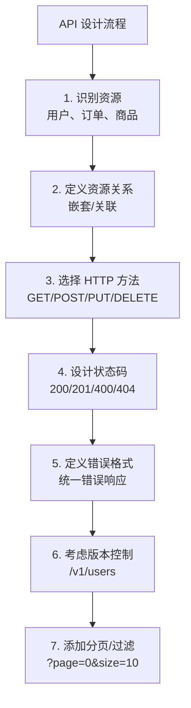

# RESTful API 设计最佳实践

> REST 注解的使用详解（@RestController、@RequestMapping 等），请参考 [01-RESTfulAPI注解](01-RESTfulAPI注解.md)。本篇聚焦于**设计层面的最佳实践**。

## RESTful API 概述

### 什么是 REST

REST (Representational State Transfer) 是一种软件架构风格,用于设计网络应用。RESTful API 是遵循 REST 原则的 Web API。

### REST 架构约束

1. **客户端-服务器分离**:关注点分离,提高可移植性
2. **无状态**:每个请求包含所有必要信息,服务器不保存客户端上下文
3. **可缓存**:响应必须明确标识是否可缓存
4. **统一接口**:简化架构,提高可见性
5. **分层系统**:允许中间层(代理、网关、负载均衡)
6. **按需代码**(可选):服务器可以扩展客户端功能

### RESTful API 设计原则

1. **资源导向**:API 应该围绕资源(名词)设计,而不是动作(动词)
2. **统一接口**:使用标准的 HTTP 方法和状态码
3. **无状态**:每个请求独立,包含所有必要信息
4. **可缓存**:合理利用缓存提高性能
5. **分层系统**:客户端无需知道是否直接连接到最终服务器
6. **HATEOAS**:响应包含相关资源的链接



::: tip API 版本控制策略
三种常见策略各有取舍：
- **URL 路径版本**（`/v1/users`）：最直观，但 URL 变更意味着路由变更
- **请求头版本**（`Accept: application/vnd.myapi.v1+json`）：URL 不变，但调试不够直观
- **查询参数版本**（`/users?version=1`）：最简单，但不符合 REST 纯粹主义

推荐**URL 路径版本**——在团队协作和 API 文档生成方面最友好。
:::

::: danger 不要用 200 + 错误信息伪造成功响应
```json
// × 反模式：HTTP 200 但实际是错误
{
  "code": 500,
  "message": "Internal Server Error",
  "data": null
}

// √ 正确：HTTP 状态码与响应体语义一致
// HTTP 500
{
  "code": "INTERNAL_ERROR",
  "message": "服务繁忙，请稍后重试"
}
```
HTTP 状态码是协议层面的约定。网关、负载均衡器、监控系统都依赖状态码判断请求是否成功。用 200 返回错误会破坏整个 HTTP 生态的假设，导致监控失灵、重试策略失效、问题排查困难。
:::

## 资源命名规范

### 资源命名原则

#### 使用名词而非动词

```java
// √ 好的设计:使用名词
GET    /users           // 获取用户列表
GET    /users/123       // 获取指定用户
POST   /users           // 创建用户
PUT    /users/123       // 更新用户
DELETE /users/123       // 删除用户

// × 不好的设计:使用动词
GET    /getAllUsers
GET    /getUserById/123
POST   /createUser
PUT    /updateUser/123
DELETE /deleteUser/123
```

#### 使用复数形式

```java
// √ 好的设计:使用复数
/users
/products
/orders

// × 不好的设计:使用单数
/user
/product
/order
```

#### 使用小写字母和连字符

```java
// √ 好的设计
/user-profiles
/order-items
/product-categories

// × 不好的设计
/UserProfiles
/orderItems
/product_categories
```

#### 避免过深的嵌套

```java
// √ 好的设计:限制嵌套层级(最多2-3层)
GET /users/123/orders
GET /orders/456/items

// × 不好的设计:嵌套过深
GET /users/123/orders/456/items/789
```

### 资源嵌套规则

#### 表达资源关系

```java
// 一对多关系
GET  /users/{userId}/orders              // 获取用户的所有订单
GET  /users/{userId}/orders/{orderId}    // 获取用户的特定订单
POST /users/{userId}/orders              // 为用户创建订单

// 多对多关系
GET  /students/{studentId}/courses       // 获取学生的所有课程
GET  /courses/{courseId}/students        // 获取课程的所有学生
POST /students/{studentId}/courses       // 为学生选课
```

#### 嵌套层级建议

| 嵌套层级 | 示例 | 说明 |
|---------|------|------|
| 1层 | `/users` | 推荐 |
| 2层 | `/users/123/orders` | 推荐 |
| 3层 | `/users/123/orders/456/items` | 勉强接受 |
| 4层及以上 | `/users/123/orders/456/items/789/...` | 不推荐 |

**替代方案**:使用查询参数代替深层嵌套

```java
// 不推荐
GET /users/123/orders/456/items/789

// 推荐
GET /order-items/789
GET /order-items?orderId=456&userId=123
```

### 资源命名示例

```java
// 用户管理
GET    /users                          // 获取用户列表
GET    /users/{id}                     // 获取用户详情
POST   /users                          // 创建用户
PUT    /users/{id}                     // 更新用户
DELETE /users/{id}                     // 删除用户
GET    /users/{id}/profile             // 获取用户资料
GET    /users/{id}/orders              // 获取用户订单

// 产品管理
GET    /products                       // 获取产品列表
GET    /products/{id}                  // 获取产品详情
GET    /products/{id}/reviews          // 获取产品评论
GET    /products/categories            // 获取产品分类
GET    /products/categories/{id}       // 获取分类详情

// 订单管理
GET    /orders                         // 获取订单列表
GET    /orders/{id}                    // 获取订单详情
GET    /orders/{id}/items              // 获取订单项
POST   /orders                         // 创建订单
PUT    /orders/{id}/status             // 更新订单状态
POST   /orders/{id}/cancel             // 取消订单(动作类端点,属"控制器资源"模式,是动词路由的可接受例外)

// 文件管理
GET    /files                          // 获取文件列表
GET    /files/{id}/download            // 下载文件
POST   /files/upload                   // 上传文件
DELETE /files/{id}                     // 删除文件
```

## HTTP 方法使用

### HTTP 方法的语义

| HTTP方法 | 操作 | 幂等性 | 安全性 | 示例 |
|---------|------|--------|--------|------|
| GET | 查询 | 是 | 是 | 获取资源 |
| POST | 创建 | 否 | 否 | 创建资源 |
| PUT | 完整更新 | 是 | 否 | 替换资源 |
| PATCH | 部分更新 | 否 | 否 | 修改资源部分字段 |
| DELETE | 删除 | 是 | 否 | 删除资源 |
| HEAD | 获取元数据 | 是 | 是 | 获取资源元信息 |
| OPTIONS | 获取支持的方法 | 是 | 是 | 获取API选项 |

#### 幂等性详解

**幂等性(Idempotent)**:多次执行相同操作,结果相同

```java
// √ 幂等操作
GET /users/123          // 无论调用多少次,结果相同
PUT /users/123          // 多次更新为相同值,结果相同
DELETE /users/123       // 多次删除,结果相同(资源不存在)

// × 非幂等操作
POST /users             // 每次创建一个新用户,结果不同
PATCH /users/123        // 可能非幂等(如递增计数器)
```

#### 安全性详解

**安全性(Safe)**:不会修改服务器资源

```java
// √ 安全操作
GET /users              // 只读取,不修改
HEAD /users/123         // 只读取元信息
OPTIONS /users          // 只查询支持的方法

// × 非安全操作
POST /users             // 创建资源
PUT /users/123          // 修改资源
DELETE /users/123       // 删除资源
```

### GET 方法

```java
@RestController
@RequestMapping("/api/users")
public class UserController {
    
    /**
     * 获取用户列表
     * GET /api/users
     */
    @GetMapping
    public ResponseEntity<List<User>> getAllUsers() {
        List<User> users = userService.findAll();
        return ResponseEntity.ok(users);
    }
    
    /**
     * 获取单个用户
     * GET /api/users/{id}
     */
    @GetMapping("/{id}")
    public ResponseEntity<User> getUserById(@PathVariable Long id) {
        User user = userService.findById(id);
        if (user == null) {
            return ResponseEntity.notFound().build();
        }
        return ResponseEntity.ok(user);
    }
    
    /**
     * 搜索用户
     * GET /api/users/search?username=xxx&email=xxx
     */
    @GetMapping("/search")
    public ResponseEntity<List<User>> searchUsers(
            @RequestParam(required = false) String username,
            @RequestParam(required = false) String email) {
        List<User> users = userService.search(username, email);
        return ResponseEntity.ok(users);
    }
}
```

### POST 方法

```java
@RestController
@RequestMapping("/api/users")
public class UserController {
    
    /**
     * 创建用户
     * POST /api/users
     */
    @PostMapping
    public ResponseEntity<User> createUser(@Valid @RequestBody UserDto userDto) {
        User user = userService.create(userDto);
        
        // 返回201 Created,并设置Location头
        URI location = ServletUriComponentsBuilder
            .fromCurrentRequest()
            .path("/{id}")
            .buildAndExpand(user.getId())
            .toUri();
        
        return ResponseEntity.created(location).body(user);
    }
    
    /**
     * 批量创建用户
     * POST /api/users/batch
     */
    @PostMapping("/batch")
    public ResponseEntity<List<User>> createUsers(
            @Valid @RequestBody List<UserDto> userDtos) {
        List<User> users = userService.createBatch(userDtos);
        return ResponseEntity.ok(users);
    }
}
```

### PUT 方法

```java
@RestController
@RequestMapping("/api/users")
public class UserController {
    
    /**
     * 完整更新用户
     * PUT /api/users/{id}
     * 
     * 注意:PUT是完整更新,需要提供所有字段
     * 未提供的字段会被设置为null
     */
    @PutMapping("/{id}")
    public ResponseEntity<User> updateUser(
            @PathVariable Long id,
            @Valid @RequestBody UserDto userDto) {
        
        // 检查用户是否存在
        if (!userService.existsById(id)) {
            return ResponseEntity.notFound().build();
        }
        
        User user = userService.update(id, userDto);
        return ResponseEntity.ok(user);
    }
}
```

### PATCH 方法

```java
@RestController
@RequestMapping("/api/users")
public class UserController {
    
    /**
     * 部分更新用户
     * PATCH /api/users/{id}
     * 
     * 注意:PATCH是部分更新,只更新提供的字段
     */
    @PatchMapping("/{id}")
    public ResponseEntity<User> partialUpdateUser(
            @PathVariable Long id,
            @RequestBody Map<String, Object> updates) {
        
        // 检查用户是否存在
        User existingUser = userService.findById(id);
        if (existingUser == null) {
            return ResponseEntity.notFound().build();
        }
        
        // 部分更新
        if (updates.containsKey("username")) {
            existingUser.setUsername((String) updates.get("username"));
        }
        if (updates.containsKey("email")) {
            existingUser.setEmail((String) updates.get("email"));
        }
        if (updates.containsKey("status")) {
            existingUser.setStatus((String) updates.get("status"));
        }
        
        User updatedUser = userService.save(existingUser);
        return ResponseEntity.ok(updatedUser);
    }
}

// 更优雅的PATCH实现
@Data
public class UserPatchDto {
    @Size(min = 3, max = 20)
    private String username;
    
    @Email
    private String email;
    
    private String status;
}

@PatchMapping("/{id}")
public ResponseEntity<User> partialUpdateUser(
        @PathVariable Long id,
        @RequestBody UserPatchDto patchDto) {
    
    User user = userService.findById(id);
    if (user == null) {
        return ResponseEntity.notFound().build();
    }
    
    // 使用 BeanUtils.copyProperties 忽略 null 属性,实现"只拷贝提供的字段"
    BeanUtils.copyProperties(patchDto, user, getNullPropertyNames(patchDto));
    
    User updatedUser = userService.save(user);
    return ResponseEntity.ok(updatedUser);
}

private String[] getNullPropertyNames(Object source) {
    BeanWrapper beanWrapper = new BeanWrapperImpl(source);
    PropertyDescriptor[] pds = beanWrapper.getPropertyDescriptors();
    Set<String> nullProperties = new HashSet<>();
    for (PropertyDescriptor pd : pds) {
        if (beanWrapper.getPropertyValue(pd.getName()) == null) {
            nullProperties.add(pd.getName());
        }
    }
    return nullProperties.toArray(new String[0]);
}
```

### DELETE 方法

```java
@RestController
@RequestMapping("/api/users")
public class UserController {
    
    /**
     * 删除用户
     * DELETE /api/users/{id}
     */
    @DeleteMapping("/{id}")
    public ResponseEntity<Void> deleteUser(@PathVariable Long id) {
        if (!userService.existsById(id)) {
            return ResponseEntity.notFound().build();
        }
        
        userService.deleteById(id);
        
        // 返回204 No Content
        return ResponseEntity.noContent().build();
    }
    
    /**
     * 批量删除用户
     * DELETE /api/users
     */
    @DeleteMapping
    public ResponseEntity<Void> deleteUsers(@RequestBody List<Long> ids) {
        userService.deleteAllById(ids);
        return ResponseEntity.noContent().build();
    }
}
```

## HTTP 状态码使用

### 状态码分类

| 类别 | 范围 | 含义 |
|------|------|------|
| 1XX | 100-199 | 信息响应 |
| 2XX | 200-299 | 成功 |
| 3XX | 300-399 | 重定向 |
| 4XX | 400-499 | 客户端错误 |
| 5XX | 500-599 | 服务器错误 |

### 常用状态码详解

#### 2XX 成功

```java
// 200 OK - 成功
@GetMapping("/{id}")
public ResponseEntity<User> getUser(@PathVariable Long id) {
    User user = userService.findById(id);
    return ResponseEntity.ok(user); // 200
}

// 201 Created - 资源创建成功
@PostMapping
public ResponseEntity<User> createUser(@RequestBody UserDto userDto) {
    User user = userService.create(userDto);
    URI location = ServletUriComponentsBuilder
        .fromCurrentRequest()
        .path("/{id}")
        .buildAndExpand(user.getId())
        .toUri();
    return ResponseEntity.created(location).body(user); // 201
}

// 204 No Content - 成功但无返回内容
@DeleteMapping("/{id}")
public ResponseEntity<Void> deleteUser(@PathVariable Long id) {
    userService.deleteById(id);
    return ResponseEntity.noContent().build(); // 204
}

// 202 Accepted - 已接受,异步处理
@PostMapping("/import")
public ResponseEntity<Void> importUsers(@RequestBody FileUploadRequest request) {
    asyncService.importUsers(request.getFile());
    return ResponseEntity.accepted().build(); // 202
}
```

#### 3XX 重定向

```java
// 301 Moved Permanently - 永久重定向
@GetMapping("/old-path")
public ResponseEntity<Void> oldEndpoint() {
    return ResponseEntity
        .status(HttpStatus.MOVED_PERMANENTLY)
        .location(URI.create("/api/new-path"))
        .build(); // 301
}

// 302 Found - 临时重定向
@GetMapping("/temporary")
public ResponseEntity<Void> temporaryRedirect() {
    return ResponseEntity
        .status(HttpStatus.FOUND)
        .location(URI.create("/api/temp"))
        .build(); // 302
}

// 304 Not Modified - 未修改(缓存)
@GetMapping("/{id}")
public ResponseEntity<User> getUser(
        @PathVariable Long id,
        @RequestHeader(value = "If-None-Match", required = false) String eTag) {
    
    User user = userService.findById(id);
    String currentETag = generateETag(user);
    
    if (currentETag.equals(eTag)) {
        return ResponseEntity
            .status(HttpStatus.NOT_MODIFIED)
            .eTag(currentETag)
            .build(); // 304
    }
    
    return ResponseEntity
        .ok()
        .eTag(currentETag)
        .body(user);
}
```

#### 4XX 客户端错误

```java
// 400 Bad Request - 请求参数错误
@GetMapping("/search")
public ResponseEntity<List<User>> searchUsers(
        @RequestParam(required = false) String username) {
    
    if (username == null || username.trim().isEmpty()) {
        ErrorResponse error = new ErrorResponse(
            "INVALID_PARAM", "username参数不能为空");
        return ResponseEntity.badRequest().body(error); // 400
    }
    
    List<User> users = userService.search(username);
    return ResponseEntity.ok(users);
}

// 401 Unauthorized - 未认证
@GetMapping("/profile")
public ResponseEntity<User> getProfile(Authentication authentication) {
    if (authentication == null) {
        ErrorResponse error = new ErrorResponse(
            "UNAUTHORIZED", "请先登录");
        return ResponseEntity
            .status(HttpStatus.UNAUTHORIZED)
            .body(error); // 401
    }
    
    User user = userService.findByUsername(authentication.getName());
    return ResponseEntity.ok(user);
}

// 403 Forbidden - 无权限
@DeleteMapping("/{id}")
public ResponseEntity<Void> deleteUser(
        @PathVariable Long id,
        Authentication authentication) {
    
    User user = userService.findById(id);
    
    if (!authentication.getName().equals(user.getUsername()) && 
        !authentication.getAuthorities().stream()
            .anyMatch(a -> "ROLE_ADMIN".equals(a.getAuthority()))) {
        ErrorResponse error = new ErrorResponse(
            "FORBIDDEN", "无权删除该用户");
        return ResponseEntity
            .status(HttpStatus.FORBIDDEN)
            .body(error); // 403
    }
    
    userService.deleteById(id);
    return ResponseEntity.noContent().build();
}

// 404 Not Found - 资源不存在
@GetMapping("/{id}")
public ResponseEntity<User> getUser(@PathVariable Long id) {
    User user = userService.findById(id);
    
    if (user == null) {
        ErrorResponse error = new ErrorResponse(
            "NOT_FOUND", "用户不存在");
        return ResponseEntity
            .status(HttpStatus.NOT_FOUND)
            .body(error); // 404
    }
    
    return ResponseEntity.ok(user);
}

// 409 Conflict - 资源冲突
@PostMapping
public ResponseEntity<User> createUser(@RequestBody UserDto userDto) {
    if (userService.existsByUsername(userDto.getUsername())) {
        ErrorResponse error = new ErrorResponse(
            "CONFLICT", "用户名已存在");
        return ResponseEntity
            .status(HttpStatus.CONFLICT)
            .body(error); // 409
    }
    
    User user = userService.create(userDto);
    return ResponseEntity.created(URI.create("/api/users/" + user.getId()))
        .body(user);
}

// 422 Unprocessable Entity - 语义错误
@PostMapping("/orders")
public ResponseEntity<Order> createOrder(@RequestBody OrderDto orderDto) {
    // 验证业务规则
    List<String> errors = validateOrder(orderDto);
    if (!errors.isEmpty()) {
        ErrorResponse error = new ErrorResponse(
            "UNPROCESSABLE_ENTITY", "订单验证失败", errors);
        return ResponseEntity
            .status(HttpStatus.UNPROCESSABLE_ENTITY)
            .body(error); // 422
    }
    
    Order order = orderService.create(orderDto);
    return ResponseEntity.ok(order);
}

// 429 Too Many Requests - 请求过于频繁
@GetMapping("/limited")
public ResponseEntity<User> limitedEndpoint() {
    if (rateLimiter.tryAcquire()) {
        User user = userService.getCurrentUser();
        return ResponseEntity.ok(user);
    } else {
        ErrorResponse error = new ErrorResponse(
            "TOO_MANY_REQUESTS", "请求过于频繁,请稍后再试");
        return ResponseEntity
            .status(HttpStatus.TOO_MANY_REQUESTS)
            .header("Retry-After", "60")
            .body(error); // 429
    }
}
```

#### 5XX 服务器错误

```java
// 500 Internal Server Error - 服务器内部错误
@GetMapping("/{id}")
public ResponseEntity<User> getUser(@PathVariable Long id) {
    try {
        User user = userService.findById(id);
        return ResponseEntity.ok(user);
    } catch (Exception e) {
        logger.error("获取用户失败", e);
        ErrorResponse error = new ErrorResponse(
            "INTERNAL_ERROR", "服务器内部错误");
        return ResponseEntity
            .status(HttpStatus.INTERNAL_SERVER_ERROR)
            .body(error); // 500
    }
}

// 503 Service Unavailable - 服务不可用
@GetMapping("/health")
public ResponseEntity<HealthStatus> health() {
    if (!serviceReady) {
        HealthStatus status = new HealthStatus("OUT_OF_SERVICE", "服务维护中");
        return ResponseEntity
            .status(HttpStatus.SERVICE_UNAVAILABLE)
            .body(status); // 503
    }
    
    return ResponseEntity.ok(new HealthStatus("UP", "服务正常"));
}
```

### 统一错误响应格式

```java
@Data
@AllArgsConstructor
@NoArgsConstructor
public class ErrorResponse {
    private String code;           // 错误码
    private String message;        // 错误消息
    private List<String> details;  // 详细错误
    private LocalDateTime timestamp;
    private String path;
    
    public ErrorResponse(String code, String message) {
        this.code = code;
        this.message = message;
        this.timestamp = LocalDateTime.now();
    }
    
    public ErrorResponse(String code, String message, List<String> details) {
        this.code = code;
        this.message = message;
        this.details = details;
        this.timestamp = LocalDateTime.now();
    }
    
    public ErrorResponse(String code, String message, LocalDateTime timestamp, String path) {
        this.code = code;
        this.message = message;
        this.timestamp = timestamp;
        this.path = path;
    }
}

@RestControllerAdvice
public class GlobalExceptionHandler {
    
    @ExceptionHandler(ResourceNotFoundException.class)
    public ResponseEntity<ErrorResponse> handleResourceNotFound(
            ResourceNotFoundException ex,
            HttpServletRequest request) {
        
        ErrorResponse error = new ErrorResponse(
            "RESOURCE_NOT_FOUND",
            ex.getMessage(),
            LocalDateTime.now(),
            request.getRequestURI()
        );
        
        return ResponseEntity.status(HttpStatus.NOT_FOUND).body(error);
    }
    
    @ExceptionHandler(MethodArgumentNotValidException.class)
    public ResponseEntity<ErrorResponse> handleValidationException(
            MethodArgumentNotValidException ex,
            HttpServletRequest request) {
        
        List<String> errors = ex.getBindingResult()
            .getFieldErrors()
            .stream()
            .map(error -> error.getField() + ": " + error.getDefaultMessage())
            .collect(Collectors.toList());
        
        ErrorResponse error = new ErrorResponse(
            "VALIDATION_ERROR",
            "参数验证失败",
            errors,
            LocalDateTime.now(),
            request.getRequestURI()
        );
        
        return ResponseEntity.status(HttpStatus.BAD_REQUEST).body(error);
    }
    
    @ExceptionHandler(AccessDeniedException.class)
    public ResponseEntity<ErrorResponse> handleAccessDenied(
            AccessDeniedException ex,
            HttpServletRequest request) {
        
        ErrorResponse error = new ErrorResponse(
            "ACCESS_DENIED",
            "无权访问该资源",
            LocalDateTime.now(),
            request.getRequestURI()
        );
        
        return ResponseEntity.status(HttpStatus.FORBIDDEN).body(error);
    }
    
    @ExceptionHandler(Exception.class)
    public ResponseEntity<ErrorResponse> handleGenericException(
            Exception ex,
            HttpServletRequest request) {
        
        logger.error("未处理的异常", ex);
        
        ErrorResponse error = new ErrorResponse(
            "INTERNAL_ERROR",
            "服务器内部错误",
            LocalDateTime.now(),
            request.getRequestURI()
        );
        
        return ResponseEntity.status(HttpStatus.INTERNAL_SERVER_ERROR).body(error);
    }
}
```

## 版本控制

### 版本控制策略

| 策略 | 示例 | 优点 | 缺点 |
|------|------|------|------|
| URL路径 | `/api/v1/users` | 简单直观,易测试 | URL变化,SEO不友好 |
| 请求头 | `Accept: application/vnd.api.v1+json` | URL不变,RESTful | 客户端实现复杂 |
| 查询参数 | `/api/users?version=1` | 简单,向后兼容 | 不符合REST原则 |
| 域名 | `v1.api.example.com/users` | 清晰,支持独立部署 | DNS管理复杂 |

### URL 路径版本控制

```java
@RestController
@RequestMapping("/api/v1/users")
public class UserV1Controller {
    
    @GetMapping("/{id}")
    public UserV1 getUserV1(@PathVariable Long id) {
        // v1版本返回简单字段
        return userService.findByIdV1(id);
    }
}

@RestController
@RequestMapping("/api/v2/users")
public class UserV2Controller {
    
    @GetMapping("/{id}")
    public UserV2 getUserV2(@PathVariable Long id) {
        // v2版本返回完整字段
        return userService.findByIdV2(id);
    }
}

// DTO定义
@Data
public class UserV1 {
    private Long id;
    private String username;
    private String email;
}

@Data
public class UserV2 {
    private Long id;
    private String username;
    private String email;
    private String firstName;
    private String lastName;
    private String phone;
    private LocalDateTime createdAt;
    private LocalDateTime updatedAt;
}
```

### 请求头版本控制

```java
@RestController
@RequestMapping("/api/users")
public class UserController {
    
    @GetMapping(value = "/{id}", produces = "application/vnd.myapi.v1+json")
    public UserV1 getUserV1(@PathVariable Long id) {
        return userService.findByIdV1(id);
    }
    
    @GetMapping(value = "/{id}", produces = "application/vnd.myapi.v2+json")
    public UserV2 getUserV2(@PathVariable Long id) {
        return userService.findByIdV2(id);
    }
}

// 客户端请求示例
// GET /api/users/123
// Accept: application/vnd.myapi.v2+json
```

### 查询参数版本控制

```java
@RestController
@RequestMapping("/api/users")
public class UserController {
    
    @GetMapping(params = "version=1")
    public UserV1 getUserV1(@PathVariable Long id) {
        return userService.findByIdV1(id);
    }
    
    @GetMapping(params = "version=2")
    public UserV2 getUserV2(@PathVariable Long id) {
        return userService.findByIdV2(id);
    }
    
    @GetMapping
    public UserV2 getUserDefault(@PathVariable Long id) {
        // 默认返回最新版本
        return userService.findByIdV2(id);
    }
}

// 客户端请求示例
// GET /api/users/123?version=2
```

### 版本控制最佳实践

1. **默认版本**:提供默认版本,客户端无需指定
2. **版本废弃策略**:提前公告,提供过渡期
3. **版本文档**:清晰记录各版本差异
4. **版本兼容性**:尽量保持向后兼容

```java
// 版本废弃示例
@RestController
@RequestMapping("/api/v1/users")
@Deprecated(since = "2024-01-01", forRemoval = true)
public class UserV1Controller {
    
    @GetMapping("/{id}")
    @Operation(summary = "获取用户(V1,即将废弃)", 
               deprecated = true,
               description = "请使用 /api/v2/users/{id}")
    public ResponseEntity<UserV1> getUserV1(@PathVariable Long id) {
        // 在响应头中添加废弃警告
        return ResponseEntity.ok()
            .header("X-API-Deprecated", "true")
            .header("X-API-Deprecation-Date", "2024-06-01")
            .header("X-API-Sunset", "2024-12-01")
            .header("X-API-Migration", "/api/v2/users/{id}")
            .body(userService.findByIdV1(id));
    }
}
```

## 分页和排序

### 分页参数设计

```java
@RestController
@RequestMapping("/api/users")
public class UserController {
    
    /**
     * 分页查询用户
     * GET /api/users?page=0&size=10&sort=id,desc&sort=username,asc
     */
    @GetMapping
    public ResponseEntity<Page<User>> getUsers(Pageable pageable) {
        Page<User> userPage = userService.findAll(pageable);
        return ResponseEntity.ok(userPage);
    }
    
    /**
     * 自定义分页参数
     * GET /api/users?page=1&pageSize=20&sortBy=id&order=desc
     */
    @GetMapping("/custom")
    public ResponseEntity<Page<User>> getUsersCustom(
            @RequestParam(defaultValue = "1") int page,
            @RequestParam(defaultValue = "20") int pageSize,
            @RequestParam(defaultValue = "id") String sortBy,
            @RequestParam(defaultValue = "desc") String order) {
        
        // 验证参数
        if (pageSize > 100) {
            pageSize = 100; // 限制最大页面大小
        }
        
        Sort sort = Sort.by("asc".equalsIgnoreCase(order) ? 
            Sort.Direction.ASC : Sort.Direction.DESC, sortBy);
        Pageable pageable = PageRequest.of(page - 1, pageSize, sort);
        
        Page<User> userPage = userService.findAll(pageable);
        return ResponseEntity.ok(userPage);
    }
}
```

### 分页响应格式

#### 方案一:Spring Data默认格式

```json
{
  "content": [
    {
      "id": 1,
      "username": "user1",
      "email": "user1@example.com"
    }
  ],
  "pageable": {
    "pageNumber": 0,
    "pageSize": 10,
    "sort": {
      "sorted": true,
      "unsorted": false,
      "empty": false
    }
  },
  "totalElements": 100,
  "totalPages": 10,
  "size": 10,
  "number": 0,
  "first": true,
  "last": false,
  "numberOfElements": 10,
  "empty": false
}
```

#### 方案二:自定义简洁格式

```java
@Data
@AllArgsConstructor
public class PagedResponse<T> {
    private List<T> content;
    private int page;
    private int size;
    private long totalElements;
    private int totalPages;
    private boolean first;
    private boolean last;
    private boolean hasNext;
    private boolean hasPrevious;
}

@RestController
@RequestMapping("/api/users")
public class UserController {
    
    @GetMapping
    public ResponseEntity<PagedResponse<User>> getUsers(Pageable pageable) {
        Page<User> userPage = userService.findAll(pageable);
        
        PagedResponse<User> response = new PagedResponse<>(
            userPage.getContent(),
            userPage.getNumber() + 1,    // 转换为1-based
            userPage.getSize(),
            userPage.getTotalElements(),
            userPage.getTotalPages(),
            userPage.isFirst(),
            userPage.isLast(),
            userPage.hasNext(),
            userPage.hasPrevious()
        );
        
        return ResponseEntity.ok(response);
    }
}
```

#### 方案三:带分页链接(HATEOAS)

```json
{
  "content": [
    {
      "id": 1,
      "username": "user1"
    }
  ],
  "page": {
    "size": 10,
    "totalElements": 100,
    "totalPages": 10,
    "number": 1
  },
  "_links": {
    "first": {
      "href": "/api/users?page=1&size=10"
    },
    "prev": {
      "href": "/api/users?page=1&size=10"
    },
    "self": {
      "href": "/api/users?page=2&size=10"
    },
    "next": {
      "href": "/api/users?page=3&size=10"
    },
    "last": {
      "href": "/api/users?page=10&size=10"
    }
  }
}
```

### 排序设计

```java
// 单字段排序
GET /api/users?sort=username,asc

// 多字段排序
GET /api/users?sort=username,asc&sort=createdAt,desc

// 使用Sort对象
@GetMapping
public ResponseEntity<List<User>> getUsers(
        @RequestParam(required = false) String sort,
        @RequestParam(required = false) String direction) {
    
    Sort sortObj = Sort.unsorted();
    if (sort != null) {
        sortObj = Sort.by(
            "desc".equalsIgnoreCase(direction) ? 
                Sort.Direction.DESC : Sort.Direction.ASC, 
            sort);
    }
    
    List<User> users = userService.findAll(sortObj);
    return ResponseEntity.ok(users);
}
```

### 游标分页(大数据量)

```java
// 传统分页问题:深页查询性能差
// 解决方案:使用游标(Cursor)分页

@Data
public class CursorResponse<T> {
    private List<T> content;
    private String nextCursor;  // 下一页游标
    private boolean hasMore;    // 是否有更多数据
}

@RestController
@RequestMapping("/api/users")
public class UserController {
    
    /**
     * 游标分页
     * GET /api/users?cursor=eyJpZCI6MTAwfQ&limit=10
     */
    @GetMapping("/cursor")
    public ResponseEntity<CursorResponse<User>> getUsersByCursor(
            @RequestParam(required = false) String cursor,
            @RequestParam(defaultValue = "10") int limit) {
        
        // 解码游标
        Long lastId = cursor != null ? decodeCursor(cursor) : null;
        
        // 查询数据
        List<User> users = userService.findAfterId(lastId, limit + 1);
        
        // 构建响应
        CursorResponse<User> response = new CursorResponse<>();
        response.setContent(users.subList(0, Math.min(users.size(), limit)));
        response.setHasMore(users.size() > limit);
        
        if (response.isHasMore()) {
            User lastUser = users.get(limit - 1);
            response.setNextCursor(encodeCursor(lastUser.getId()));
        }
        
        return ResponseEntity.ok(response);
    }
    
    private Long decodeCursor(String cursor) {
        // Base64解码 {"id":100}
        String json = new String(Base64.getDecoder().decode(cursor));
        return JsonPath.parse(json).read("$.id", Long.class);
    }
    
    private String encodeCursor(Long id) {
        String json = String.format("{\"id\":%d}", id);
        return Base64.getEncoder().encodeToString(json.getBytes());
    }
}
```

## 搜索和过滤

### 基本搜索

```java
@RestController
@RequestMapping("/api/users")
public class UserController {
    
    /**
     * 简单搜索
     * GET /api/users/search?username=xxx&email=xxx&status=active
     */
    @GetMapping("/search")
    public ResponseEntity<List<User>> searchUsers(
            @RequestParam(required = false) String username,
            @RequestParam(required = false) String email,
            @RequestParam(required = false) String status) {
        
        UserSearchCriteria criteria = new UserSearchCriteria();
        criteria.setUsername(username);
        criteria.setEmail(email);
        criteria.setStatus(status);
        
        List<User> users = userService.search(criteria);
        return ResponseEntity.ok(users);
    }
}

@Data
public class UserSearchCriteria {
    private String username;
    private String email;
    private String status;
    private LocalDate createdAfter;
    private LocalDate createdBefore;
}
```

### 高级搜索

```java
@RestController
@RequestMapping("/api/users")
public class UserController {
    
    /**
     * 高级搜索(POST)
     * POST /api/users/search
     * Body: { "username": "xxx", "status": "active", "createdAfter": "2024-01-01" }
     */
    @PostMapping("/search")
    public ResponseEntity<Page<User>> advancedSearch(
            @RequestBody UserSearchRequest searchRequest,
            Pageable pageable) {
        
        Page<User> users = userService.advancedSearch(searchRequest, pageable);
        return ResponseEntity.ok(users);
    }
}

@Data
public class UserSearchRequest {
    private String username;
    private String email;
    private String status;
    private List<String> roles;
    private LocalDate createdAfter;
    private LocalDate createdBefore;
    private Boolean enabled;
    
    // 排序
    private String sortBy;
    private String sortOrder;
}
```

### 动态查询

```java
@Service
public class UserService {
    
    @Autowired
    private UserRepository userRepository;
    
    public Page<User> advancedSearch(UserSearchRequest request, Pageable pageable) {
        Specification<User> spec = Specification.where(null);
        
        if (StringUtils.hasText(request.getUsername())) {
            spec = spec.and((root, query, cb) -> 
                cb.like(root.get("username"), "%" + request.getUsername() + "%"));
        }
        
        if (StringUtils.hasText(request.getEmail())) {
            spec = spec.and((root, query, cb) -> 
                cb.like(root.get("email"), "%" + request.getEmail() + "%"));
        }
        
        if (StringUtils.hasText(request.getStatus())) {
            spec = spec.and((root, query, cb) -> 
                cb.equal(root.get("status"), request.getStatus()));
        }
        
        if (request.getCreatedAfter() != null) {
            spec = spec.and((root, query, cb) -> 
                cb.greaterThanOrEqualTo(root.get("createdAt"), 
                    request.getCreatedAfter().atStartOfDay()));
        }
        
        if (request.getCreatedBefore() != null) {
            spec = spec.and((root, query, cb) -> 
                cb.lessThanOrEqualTo(root.get("createdAt"), 
                    request.getCreatedBefore().atTime(23, 59, 59)));
        }
        
        if (request.getEnabled() != null) {
            spec = spec.and((root, query, cb) -> 
                cb.equal(root.get("enabled"), request.getEnabled()));
        }
        
        return userRepository.findAll(spec, pageable);
    }
}
```

### 过滤参数设计

```java
// 多种过滤方式

// 方式1:查询参数
GET /api/users?status=active&role=admin&createdAfter=2024-01-01

// 方式2:filter参数
GET /api/users?filter=status:active,role:admin,createdAfter:2024-01-01

// 方式3:RSQL语法
GET /api/users?search=status==active;role==admin;createdAt>2024-01-01

// 实现RSQL解析
@RestController
@RequestMapping("/api/users")
public class UserController {
    
    @GetMapping
    public ResponseEntity<List<User>> searchUsers(
            @RequestParam(required = false) String search) {
        
        if (search == null) {
            return ResponseEntity.ok(userService.findAll());
        }
        
        // 解析RSQL查询
        Node rootNode = new RSQLParser().parse(search);
        Specification<User> spec = rootNode.accept(new CustomRsqlVisitor<>());
        
        List<User> users = userService.findAll(spec);
        return ResponseEntity.ok(users);
    }
}

// RSQL Visitor
public class CustomRsqlVisitor<T> implements RSQLVisitor<Specification<T>, Void> {
    
    @Override
    public Specification<T> visit(ComparisonNode node, Void param) {
        String selector = node.getSelector();
        String operator = node.getOperator();
        List<String> arguments = node.getArguments();
        
        return (root, query, cb) -> {
            switch (operator) {
                case "==":
                    return cb.equal(root.get(selector), arguments.get(0));
                case "!=":
                    return cb.notEqual(root.get(selector), arguments.get(0));
                case ">":
                    return cb.greaterThan(root.get(selector), arguments.get(0));
                case "<":
                    return cb.lessThan(root.get(selector), arguments.get(0));
                case ">=":
                    return cb.greaterThanOrEqualTo(root.get(selector), arguments.get(0));
                case "<=":
                    return cb.lessThanOrEqualTo(root.get(selector), arguments.get(0));
                case "=like=":
                    return cb.like(root.get(selector), "%" + arguments.get(0) + "%");
                case "=in=":
                    return root.get(selector).in(arguments);
                default:
                    return null;
            }
        };
    }
}
```

## HATEOAS

### HATEOAS 概念

HATEOAS (Hypermedia as the Engine of Application State) 是 REST 架构的约束之一,要求响应中包含相关资源的链接,使客户端能够动态发现可执行的操作。

### Spring HATEOAS 实现

#### 添加依赖

```xml
<dependency>
    <groupId>org.springframework.boot</groupId>
    <artifactId>spring-boot-starter-hateoas</artifactId>
</dependency>
```

#### EntityModel 单个资源

```java
@RestController
@RequestMapping("/api/users")
public class UserController {
    
    @GetMapping("/{id}")
    public EntityModel<User> getUserById(@PathVariable Long id) {
        User user = userService.findById(id);
        if (user == null) {
            throw new ResourceNotFoundException("用户不存在");
        }
        
        // 创建资源模型
        EntityModel<User> userModel = EntityModel.of(user);
        
        // 添加self链接
        userModel.add(linkTo(methodOn(UserController.class)
            .getUserById(id)).withSelfRel());
        
        // 添加相关链接
        userModel.add(linkTo(methodOn(UserController.class)
            .getAllUsers()).withRel("users"));
        
        userModel.add(linkTo(methodOn(OrderController.class)
            .getOrdersByUserId(id)).withRel("orders"));
        
        // 条件链接
        if (user.isActive()) {
            userModel.add(linkTo(methodOn(UserController.class)
                .deactivateUser(id)).withRel("deactivate"));
        } else {
            userModel.add(linkTo(methodOn(UserController.class)
                .activateUser(id)).withRel("activate"));
        }
        
        return userModel;
    }
}
```

#### CollectionModel 集合资源

```java
@RestController
@RequestMapping("/api/users")
public class UserController {
    
    @GetMapping
    public CollectionModel<EntityModel<User>> getAllUsers() {
        List<User> users = userService.findAll();
        
        // 转换为EntityModel列表
        List<EntityModel<User>> userModels = users.stream()
            .map(user -> EntityModel.of(user,
                linkTo(methodOn(UserController.class)
                    .getUserById(user.getId())).withSelfRel(),
                linkTo(methodOn(UserController.class)
                    .getAllUsers()).withRel("users")))
            .collect(Collectors.toList());
        
        // 创建集合模型
        return CollectionModel.of(userModels,
            linkTo(methodOn(UserController.class)
                .getAllUsers()).withSelfRel(),
            linkTo(methodOn(UserController.class)
                .createUser(null)).withRel("create"));
    }
}
```

#### RepresentationModelAssembler 装配器

```java
@Component
public class UserModelAssembler implements RepresentationModelAssembler<User, EntityModel<User>> {
    
    @Override
    public EntityModel<User> toModel(User user) {
        EntityModel<User> userModel = EntityModel.of(user,
            linkTo(methodOn(UserController.class)
                .getUserById(user.getId())).withSelfRel(),
            linkTo(methodOn(UserController.class)
                .getAllUsers()).withRel("users"));
        
        // 根据用户状态添加不同链接
        if (user.isActive()) {
            userModel.add(linkTo(methodOn(UserController.class)
                .deactivateUser(user.getId())).withRel("deactivate"));
        } else {
            userModel.add(linkTo(methodOn(UserController.class)
                .activateUser(user.getId())).withRel("activate"));
        }
        
        // 添加订单链接
        userModel.add(linkTo(methodOn(OrderController.class)
            .getOrdersByUserId(user.getId())).withRel("orders"));
        
        return userModel;
    }
}

@RestController
@RequestMapping("/api/users")
public class UserController {
    
    @Autowired
    private UserModelAssembler assembler;
    
    @GetMapping("/{id}")
    public EntityModel<User> getUserById(@PathVariable Long id) {
        User user = userService.findById(id);
        return assembler.toModel(user);
    }
    
    @GetMapping
    public CollectionModel<EntityModel<User>> getAllUsers() {
        List<User> users = userService.findAll();
        
        List<EntityModel<User>> userModels = users.stream()
            .map(assembler::toModel)
            .collect(Collectors.toList());
        
        return CollectionModel.of(userModels,
            linkTo(methodOn(UserController.class)
                .getAllUsers()).withSelfRel());
    }
}
```

#### PagedModel 分页资源

```java
@RestController
@RequestMapping("/api/users")
public class UserController {
    
    @Autowired
    private PagedResourcesAssembler<User> pagedAssembler;
    
    @Autowired
    private UserModelAssembler assembler;
    
    @GetMapping
    public PagedModel<EntityModel<User>> getUsers(Pageable pageable) {
        Page<User> userPage = userService.findAll(pageable);
        
        return pagedAssembler.toModel(userPage, assembler);
    }
}
```

### HATEOAS 响应示例

```json
{
  "id": 1,
  "username": "john_doe",
  "email": "john@example.com",
  "status": "ACTIVE",
  "_links": {
    "self": {
      "href": "/api/users/1"
    },
    "users": {
      "href": "/api/users"
    },
    "orders": {
      "href": "/api/users/1/orders"
    },
    "deactivate": {
      "href": "/api/users/1/deactivate",
      "method": "POST"
    },
    "update": {
      "href": "/api/users/1",
      "method": "PUT"
    },
    "delete": {
      "href": "/api/users/1",
      "method": "DELETE"
    }
  }
}
```

## API 文档

### Swagger/OpenAPI 集成

#### 添加依赖

```xml
<dependency>
    <groupId>org.springdoc</groupId>
    <artifactId>springdoc-openapi-starter-webmvc-ui</artifactId>
    <version>2.2.0</version>
</dependency>
```

#### OpenAPI 配置

```java
@Configuration
public class OpenApiConfig {
    
    @Bean
    public OpenAPI customOpenAPI() {
        return new OpenAPI()
            .info(new Info()
                .title("电商系统 API")
                .version("1.0")
                .description("电商系统 RESTful API 文档")
                .contact(new Contact()
                    .name("API Support")
                    .email("support@example.com")
                    .url("https://example.com"))
                .license(new License()
                    .name("Apache 2.0")
                    .url("https://www.apache.org/licenses/LICENSE-2.0")))
            .externalDocs(new ExternalDocumentation()
                .description("项目文档")
                .url("https://docs.example.com"))
            .addSecurityItem(new SecurityRequirement().addList("bearerAuth"))
            .components(new Components()
                .addSecuritySchemes("bearerAuth",
                    new SecurityScheme()
                        .type(SecurityScheme.Type.HTTP)
                        .scheme("bearer")
                        .bearerFormat("JWT")
                        .description("JWT认证,格式: Bearer {token}")));
    }
}
```

#### Controller 文档注解

```java
@RestController
@RequestMapping("/api/users")
@Tag(name = "用户管理", description = "用户增删改查接口")
public class UserController {
    
    @GetMapping("/{id}")
    @Operation(
        summary = "获取用户详情",
        description = "根据用户ID获取用户详细信息"
    )
    @ApiResponses(value = {
        @ApiResponse(
            responseCode = "200",
            description = "成功获取用户",
            content = @Content(
                mediaType = "application/json",
                schema = @Schema(implementation = User.class)
            )
        ),
        @ApiResponse(
            responseCode = "404",
            description = "用户不存在",
            content = @Content(
                mediaType = "application/json",
                schema = @Schema(implementation = ErrorResponse.class)
            )
        )
    })
    public ResponseEntity<User> getUserById(
            @Parameter(description = "用户ID", required = true, example = "1")
            @PathVariable Long id) {
        
        User user = userService.findById(id);
        if (user == null) {
            return ResponseEntity.notFound().build();
        }
        return ResponseEntity.ok(user);
    }
    
    @PostMapping
    @Operation(
        summary = "创建用户",
        description = "创建新用户,返回创建的用户信息"
    )
    @ApiResponses(value = {
        @ApiResponse(
            responseCode = "201",
            description = "用户创建成功"
        ),
        @ApiResponse(
            responseCode = "400",
            description = "参数验证失败"
        ),
        @ApiResponse(
            responseCode = "409",
            description = "用户名已存在"
        )
    })
    public ResponseEntity<User> createUser(
            @Parameter(description = "用户信息", required = true)
            @Valid @RequestBody UserDto userDto) {
        
        User user = userService.create(userDto);
        URI location = ServletUriComponentsBuilder
            .fromCurrentRequest()
            .path("/{id}")
            .buildAndExpand(user.getId())
            .toUri();
        
        return ResponseEntity.created(location).body(user);
    }
}
```

#### DTO 文档注解

```java
@Data
@Schema(description = "用户创建请求")
public class UserDto {
    
    @Schema(description = "用户名", example = "john_doe", minLength = 3, maxLength = 20)
    @NotBlank(message = "用户名不能为空")
    @Size(min = 3, max = 20, message = "用户名长度必须在3-20之间")
    private String username;
    
    @Schema(description = "邮箱", example = "john@example.com")
    @NotBlank(message = "邮箱不能为空")
    @Email(message = "邮箱格式不正确")
    private String email;
    
    @Schema(description = "密码", example = "Password123!", minLength = 8)
    @NotBlank(message = "密码不能为空")
    @Size(min = 8, max = 100, message = "密码长度必须在8-100之间")
    @Pattern(regexp = "^(?=.*[a-z])(?=.*[A-Z])(?=.*\\d).+$", 
             message = "密码必须包含大小写字母和数字")
    private String password;
    
    @Schema(description = "角色列表", example = "[\"USER\", \"ADMIN\"]")
    private List<String> roles;
}
```

### 访问 Swagger UI

启动应用后访问:

- Swagger UI: `http://localhost:8080/swagger-ui.html`
- OpenAPI JSON: `http://localhost:8080/v3/api-docs`
- OpenAPI YAML: `http://localhost:8080/v3/api-docs.yaml`

## API 安全

### 认证方式对比

| 认证方式 | 优点 | 缺点 | 适用场景 |
|---------|------|------|----------|
| HTTP Basic | 简单,标准 | 明文传输,不安全 | 仅开发测试 |
| Session Cookie | 简单,成熟 | 有状态,跨域问题 | 传统Web应用 |
| JWT Token | 无状态,跨域 | 无法主动失效 | 前后端分离 |
| OAuth2 | 安全,灵活 | 实现复杂 | 第三方登录 |
| API Key | 简单 | 安全性低 | 服务间调用 |

### JWT 认证

```java
@RestController
@RequestMapping("/api/auth")
@Tag(name = "认证管理", description = "登录、注册、令牌刷新")
public class AuthController {
    
    @Autowired
    private AuthenticationManager authenticationManager;
    
    @Autowired
    private JwtTokenUtil jwtTokenUtil;
    
    @Autowired
    private UserService userService;
    
    @PostMapping("/login")
    @Operation(summary = "用户登录", description = "验证用户名密码,返回JWT令牌")
    public ResponseEntity<JwtResponse> login(
            @Valid @RequestBody LoginRequest loginRequest) {
        
        // 认证
        Authentication authentication = authenticationManager.authenticate(
            new UsernamePasswordAuthenticationToken(
                loginRequest.getUsername(),
                loginRequest.getPassword()
            )
        );
        
        // 生成令牌
        UserDetails userDetails = (UserDetails) authentication.getPrincipal();
        String token = jwtTokenUtil.generateToken(userDetails);
        
        // 返回
        return ResponseEntity.ok(new JwtResponse(
            token,
            userDetails.getUsername(),
            userDetails.getAuthorities().stream()
                .map(GrantedAuthority::getAuthority)
                .collect(Collectors.toList())
        ));
    }
    
    @PostMapping("/register")
    @Operation(summary = "用户注册")
    public ResponseEntity<?> register(
            @Valid @RequestBody RegisterRequest registerRequest) {
        
        // 检查用户名是否已存在
        if (userService.existsByUsername(registerRequest.getUsername())) {
            return ResponseEntity
                .badRequest()
                .body(new MessageResponse("用户名已被使用"));
        }
        
        // 注册
        userService.register(registerRequest);
        
        return ResponseEntity.ok(new MessageResponse("注册成功"));
    }
}

@Data
@Schema(description = "登录请求")
public class LoginRequest {
    
    @Schema(description = "用户名", example = "john_doe")
    @NotBlank
    private String username;
    
    @Schema(description = "密码", example = "Password123!")
    @NotBlank
    private String password;
}
```

### API Key 认证

```java
@Component
public class ApiKeyAuthFilter extends OncePerRequestFilter {
    
    @Value("${api.key.header:X-API-Key}")
    private String apiKeyHeader;
    
    @Value("${api.key.value}")
    private String validApiKey;
    
    @Override
    protected void doFilterInternal(HttpServletRequest request,
                                    HttpServletResponse response,
                                    FilterChain filterChain) throws ServletException, IOException {
        
        String apiKey = request.getHeader(apiKeyHeader);
        
        if (apiKey == null || !apiKey.equals(validApiKey)) {
            response.setStatus(HttpServletResponse.SC_UNAUTHORIZED);
            response.setContentType("application/json;charset=UTF-8");
            response.getWriter().write(
                "{\"code\":401,\"message\":\"Invalid API Key\"}"
            );
            return;
        }
        
        // 设置认证
        UsernamePasswordAuthenticationToken authentication =
            new UsernamePasswordAuthenticationToken(
                "api-user", null, Collections.emptyList());
        SecurityContextHolder.getContext().setAuthentication(authentication);
        
        filterChain.doFilter(request, response);
    }
}
```

### 敏感数据保护

```java
// DTO设计:区分不同场景的DTO
@Data
public class UserDto {
    private String username;
    private String email;
    private String firstName;
    private String lastName;
    
    // 不包含密码、身份证等敏感字段
}

@Data
public class UserCreateDto extends UserDto {
    @NotBlank
    private String password;  // 创建时需要密码
    
    // 不返回密码
}

@Data
public class UserDetailDto extends UserDto {
    private Long id;
    private List<String> roles;
    private LocalDateTime createdAt;
    
    @JsonSerialize(using = PhoneMaskSerializer.class)
    private String phone;  // 脱敏显示
}

// 字段脱敏
public class PhoneMaskSerializer extends JsonSerializer<String> {
    @Override
    public void serialize(String phone, JsonGenerator gen, SerializerProvider provider) 
            throws IOException {
        if (phone == null || phone.length() != 11) {
            gen.writeString(phone);
        } else {
            gen.writeString(phone.substring(0, 3) + "****" + phone.substring(7));
        }
    }
}
```

## 性能优化

### 响应压缩

```yaml
# application.yml
server:
  compression:
    enabled: true
    mime-types: application/json,application/xml,text/html,text/xml,text/plain
    min-response-size: 1024
```

### 字段过滤

```java
/**
 * 动态字段过滤
 * GET /api/users/123?fields=id,username,email
 */
@GetMapping("/{id}")
public ResponseEntity<User> getUserById(
        @PathVariable Long id,
        @RequestParam(required = false) String fields) {
    
    User user = userService.findById(id);
    if (user == null) {
        return ResponseEntity.notFound().build();
    }
    
    if (fields != null) {
    // 使用Jackson动态过滤(要求 User 类标注 @JsonFilter("fieldFilter"),否则过滤器不生效、全部字段照常输出)
    Set<String> fieldSet = Arrays.stream(fields.split(","))
            .map(String::trim)
            .collect(Collectors.toSet());
        
        FilterProvider filters = SimpleFilterProvider
            .filterOutAllExcept(fieldSet);
        
        MappingJacksonValue value = new MappingJacksonValue(user);
        value.setFilters(filters);
        
        return ResponseEntity.ok(value);
    }
    
    return ResponseEntity.ok(user);
}

// 或使用@JsonView
public class Views {
    public static class Public {}
    public static class Internal extends Public {}
}

@Data
public class User {
    @JsonView(Views.Public.class)
    private Long id;
    
    @JsonView(Views.Public.class)
    private String username;
    
    @JsonView(Views.Internal.class)
    private String email;
    
    @JsonView(Views.Internal.class)
    private String phone;
}

@GetMapping("/{id}")
@JsonView(Views.Public.class)
public ResponseEntity<User> getUserById(@PathVariable Long id) {
    User user = userService.findById(id);
    return ResponseEntity.ok(user);
}
```

### 缓存策略

```java
@RestController
@RequestMapping("/api/users")
public class UserController {
    
    @GetMapping("/{id}")
    @Cacheable(value = "users", key = "#id")
    public ResponseEntity<User> getUserById(@PathVariable Long id) {
        User user = userService.findById(id);
        if (user == null) {
            return ResponseEntity.notFound().build();
        }
        return ResponseEntity.ok(user);
    }
    
    @PutMapping("/{id}")
    @CachePut(value = "users", key = "#id")
    public ResponseEntity<User> updateUser(
            @PathVariable Long id,
            @RequestBody UserDto userDto) {
        User user = userService.update(id, userDto);
        return ResponseEntity.ok(user);
    }
    
    @DeleteMapping("/{id}")
    @CacheEvict(value = "users", key = "#id")
    public ResponseEntity<Void> deleteUser(@PathVariable Long id) {
        userService.deleteById(id);
        return ResponseEntity.noContent().build();
    }
}

// HTTP缓存
@GetMapping("/{id}")
public ResponseEntity<User> getUserById(
        @PathVariable Long id,
        @RequestHeader(value = "If-None-Match", required = false) String eTag) {
    
    User user = userService.findById(id);
    if (user == null) {
        return ResponseEntity.notFound().build();
    }
    
    String currentETag = generateETag(user);
    
    // 如果ETag未变化,返回304
    if (currentETag.equals(eTag)) {
        return ResponseEntity
            .status(HttpStatus.NOT_MODIFIED)
            .eTag(currentETag)
            .cacheControl(CacheControl.maxAge(3600, TimeUnit.SECONDS))
            .build();
    }
    
    return ResponseEntity
        .ok()
        .eTag(currentETag)
        .cacheControl(CacheControl.maxAge(3600, TimeUnit.SECONDS))
        .body(user);
}

private String generateETag(User user) {
    return DigestUtils.md5DigestAsHex(
        (user.getId() + user.getUpdatedAt().toString()).getBytes());
}
```

### 批量操作

```java
@RestController
@RequestMapping("/api/users")
public class UserController {
    
    /**
     * 批量创建
     * POST /api/users/batch
     */
    @PostMapping("/batch")
    public ResponseEntity<BatchResult<User>> createUsers(
            @Valid @RequestBody List<UserDto> userDtos) {
        
        BatchResult<User> result = userService.createBatch(userDtos);
        return ResponseEntity.ok(result);
    }
    
    /**
     * 批量更新
     * PUT /api/users/batch
     */
    @PutMapping("/batch")
    public ResponseEntity<BatchResult<User>> updateUsers(
            @RequestBody Map<Long, UserDto> updates) {
        
        BatchResult<User> result = userService.updateBatch(updates);
        return ResponseEntity.ok(result);
    }
    
    /**
     * 批量删除
     * DELETE /api/users/batch
     */
    @DeleteMapping("/batch")
    public ResponseEntity<Void> deleteUsers(@RequestBody List<Long> ids) {
        userService.deleteBatch(ids);
        return ResponseEntity.noContent().build();
    }
}

@Data
public class BatchResult<T> {
    private List<T> success;
    private List<BatchError> errors;
    private int totalSuccess;
    private int totalErrors;
}

@Data
@AllArgsConstructor
public class BatchError {
    private int index;
    private String field;
    private String message;
}
```

## 完整实战案例:电商订单API

### 项目结构

```
src/main/java/com/example/ecommerce/
├── controller/
│   ├── ProductController.java
│   ├── OrderController.java
│   └── UserController.java
├── service/
│   ├── ProductService.java
│   ├── OrderService.java
│   └── UserService.java
├── repository/
│   ├── ProductRepository.java
│   ├── OrderRepository.java
│   └── UserRepository.java
├── entity/
│   ├── Product.java
│   ├── Order.java
│   └── User.java
├── dto/
│   ├── ProductDto.java
│   ├── OrderDto.java
│   ├── PagedResponse.java
│   └── ErrorResponse.java
├── exception/
│   ├── GlobalExceptionHandler.java
│   ├── ResourceNotFoundException.java
│   └── BusinessException.java
└── config/
    ├── OpenApiConfig.java
    └── SecurityConfig.java
```

### 订单API实现

```java
@RestController
@RequestMapping("/api/orders")
@Tag(name = "订单管理", description = "订单增删改查接口")
public class OrderController {
    
    @Autowired
    private OrderService orderService;
    
    @Autowired
    private OrderModelAssembler assembler;
    
    @Autowired
    private PagedResourcesAssembler<Order> pagedAssembler;
    
    /**
     * 创建订单
     * POST /api/orders
     */
    @PostMapping
    @Operation(summary = "创建订单", description = "创建新订单")
    @ApiResponses(value = {
        @ApiResponse(responseCode = "201", description = "订单创建成功"),
        @ApiResponse(responseCode = "400", description = "参数验证失败"),
        @ApiResponse(responseCode = "401", description = "未认证")
    })
    public ResponseEntity<EntityModel<Order>> createOrder(
            @Valid @RequestBody OrderCreateDto orderDto,
            Authentication authentication) {
        
        String username = authentication.getName();
        Order order = orderService.create(username, orderDto);
        
        EntityModel<Order> orderModel = assembler.toModel(order);
        
        return ResponseEntity
            .created(linkTo(methodOn(OrderController.class)
                .getOrderById(order.getId())).toUri())
            .body(orderModel);
    }
    
    /**
     * 获取订单详情
     * GET /api/orders/{id}
     */
    @GetMapping("/{id}")
    @Operation(summary = "获取订单详情")
    public ResponseEntity<EntityModel<Order>> getOrderById(
            @PathVariable Long id,
            Authentication authentication) {
        
        Order order = orderService.findById(id);
        
        // 权限检查:只有订单所有者或管理员可以查看
        if (!order.getUser().getUsername().equals(authentication.getName()) &&
            !authentication.getAuthorities().stream()
                .anyMatch(a -> "ROLE_ADMIN".equals(a.getAuthority()))) {
            return ResponseEntity.status(HttpStatus.FORBIDDEN).build();
        }
        
        return ResponseEntity.ok(assembler.toModel(order));
    }
    
    /**
     * 获取用户订单列表
     * GET /api/orders/my
     */
    @GetMapping("/my")
    @Operation(summary = "获取我的订单")
    public ResponseEntity<PagedModel<EntityModel<Order>>> getMyOrders(
            Pageable pageable,
            Authentication authentication) {
        
        String username = authentication.getName();
        Page<Order> orders = orderService.findByUsername(username, pageable);
        
        PagedModel<EntityModel<Order>> orderModels = 
            pagedAssembler.toModel(orders, assembler);
        
        return ResponseEntity.ok(orderModels);
    }
    
    /**
     * 取消订单
     * POST /api/orders/{id}/cancel
     */
    @PostMapping("/{id}/cancel")
    @Operation(summary = "取消订单")
    public ResponseEntity<EntityModel<Order>> cancelOrder(
            @PathVariable Long id,
            Authentication authentication) {
        
        Order order = orderService.findById(id);
        
        // 权限检查
        if (!order.getUser().getUsername().equals(authentication.getName()) &&
            !authentication.getAuthorities().stream()
                .anyMatch(a -> "ROLE_ADMIN".equals(a.getAuthority()))) {
            return ResponseEntity.status(HttpStatus.FORBIDDEN).build();
        }
        
        // 业务检查
        if (order.getStatus() != OrderStatus.PENDING) {
            ErrorResponse error = new ErrorResponse(
                "INVALID_STATUS", 
                "只能取消待支付订单");
            return ResponseEntity
                .status(HttpStatus.CONFLICT)
                .body(error);
        }
        
        Order cancelledOrder = orderService.cancel(id);
        return ResponseEntity.ok(assembler.toModel(cancelledOrder));
    }
    
    /**
     * 支付订单
     * POST /api/orders/{id}/pay
     */
    @PostMapping("/{id}/pay")
    @Operation(summary = "支付订单")
    public ResponseEntity<EntityModel<Order>> payOrder(
            @PathVariable Long id,
            @Valid @RequestBody PaymentRequest paymentRequest,
            Authentication authentication) {
        
        Order order = orderService.findById(id);
        
        // 权限检查
        if (!order.getUser().getUsername().equals(authentication.getName())) {
            return ResponseEntity.status(HttpStatus.FORBIDDEN).build();
        }
        
        // 业务检查
        if (order.getStatus() != OrderStatus.PENDING) {
            ErrorResponse error = new ErrorResponse(
                "INVALID_STATUS", 
                "订单状态不正确");
            return ResponseEntity.status(HttpStatus.CONFLICT).build();
        }
        
        Order paidOrder = orderService.pay(id, paymentRequest);
        return ResponseEntity.ok(assembler.toModel(paidOrder));
    }
}

// 订单装配器
@Component
public class OrderModelAssembler implements RepresentationModelAssembler<Order, EntityModel<Order>> {
    
    @Override
    public EntityModel<Order> toModel(Order order) {
        EntityModel<Order> orderModel = EntityModel.of(order,
            linkTo(methodOn(OrderController.class)
                .getOrderById(order.getId())).withSelfRel(),
            linkTo(methodOn(OrderController.class)
                .getMyOrders(null, null)).withRel("orders"));
        
        // 根据订单状态添加不同链接
        switch (order.getStatus()) {
            case PENDING:
                orderModel.add(linkTo(methodOn(OrderController.class)
                    .cancelOrder(order.getId(), null)).withRel("cancel"));
                orderModel.add(linkTo(methodOn(OrderController.class)
                    .payOrder(order.getId(), null, null)).withRel("pay"));
                break;
            case PAID:
                orderModel.add(linkTo(methodOn(OrderController.class)
                    .shipOrder(order.getId(), null)).withRel("ship"));
                break;
            case SHIPPED:
                orderModel.add(linkTo(methodOn(OrderController.class)
                    .receiveOrder(order.getId(), null)).withRel("receive"));
                break;
        }
        
        return orderModel;
    }
}
```

## 常见误区

### 误区1: 使用动词设计URL

```java
// × 错误:使用动词
GET  /getAllUsers
GET  /getUserById/123
POST /createUser
PUT  /updateUser/123
DELETE /deleteUser/123

// √ 正确:使用名词
GET    /users
GET    /users/123
POST   /users
PUT    /users/123
DELETE /users/123
```

### 误区2: 忽略HTTP状态码

```java
// × 错误:所有响应都返回200
@GetMapping("/{id}")
public ResponseEntity<Map<String, Object>> getUser(@PathVariable Long id) {
    User user = userService.findById(id);
    Map<String, Object> result = new HashMap<>();
    
    if (user == null) {
        result.put("code", 404);
        result.put("message", "用户不存在");
        return ResponseEntity.ok(result);
    }
    
    result.put("code", 200);
    result.put("data", user);
    return ResponseEntity.ok(result);
}

// √ 正确:使用正确的HTTP状态码
@GetMapping("/{id}")
public ResponseEntity<User> getUser(@PathVariable Long id) {
    User user = userService.findById(id);
    if (user == null) {
        return ResponseEntity.notFound().build();
    }
    return ResponseEntity.ok(user);
}
```

### 误区3: 混用PUT和PATCH

```java
// × 错误:使用PUT进行部分更新
@PutMapping("/{id}")
public ResponseEntity<User> updateUser(
        @PathVariable Long id,
        @RequestBody Map<String, Object> updates) {
    // 只更新提供的字段
}

// √ 正确:使用PATCH进行部分更新
@PatchMapping("/{id}")
public ResponseEntity<User> partialUpdateUser(
        @PathVariable Long id,
        @RequestBody Map<String, Object> updates) {
    // 只更新提供的字段
}

// √ 正确:使用PUT进行完整更新
@PutMapping("/{id}")
public ResponseEntity<User> updateUser(
        @PathVariable Long id,
        @Valid @RequestBody UserDto userDto) {
    // 更新所有字段,未提供的字段设置为null
}
```

### 误区4: 返回过多数据

```java
// × 错误:返回所有字段
@GetMapping
public List<User> getAllUsers() {
    return userRepository.findAll();
}

// √ 正确:使用DTO限制返回字段
@GetMapping
public List<UserSummaryDto> getAllUsers() {
    return userRepository.findAll()
        .stream()
        .map(this::toSummaryDto)
        .collect(Collectors.toList());
}

@Data
public class UserSummaryDto {
    private Long id;
    private String username;
    private String email;
    // 不返回密码、身份证等敏感字段
}
```

### 误区5: 忽略分页

```java
// × 错误:一次性返回所有数据
@GetMapping
public List<Order> getAllOrders() {
    return orderRepository.findAll();
}

// √ 正确:使用分页
@GetMapping
public Page<Order> getAllOrders(Pageable pageable) {
    return orderRepository.findAll(pageable);
}
```

### 误区6: 忽略版本控制

```java
// × 错误:直接修改现有API
@PutMapping("/{id}")
public User updateUser(@PathVariable Long id, @RequestBody UserUpdateDto dto) {
    // 突然修改返回结构,导致旧客户端异常
}

// √ 正确:使用版本控制
@RestController
@RequestMapping("/api/v1/users")
public class UserV1Controller {
    @PutMapping("/{id}")
    public UserV1 updateUser(@PathVariable Long id, @RequestBody UserUpdateDto dto) {
        // 保持v1版本不变
    }
}

@RestController
@RequestMapping("/api/v2/users")
public class UserV2Controller {
    @PutMapping("/{id}")
    public UserV2 updateUser(@PathVariable Long id, @RequestBody UserUpdateDto dto) {
        // v2版本提供新的返回结构
    }
}
```

### 误区7: 不提供API文档

```java
// × 错误:没有文档注解
@GetMapping("/{id}")
public User getUser(@PathVariable Long id) {
    return userService.findById(id);
}

// √ 正确:提供完整文档
@GetMapping("/{id}")
@Operation(summary = "获取用户详情", description = "根据用户ID获取用户详细信息")
@ApiResponses(value = {
    @ApiResponse(responseCode = "200", description = "成功"),
    @ApiResponse(responseCode = "404", description = "用户不存在")
})
public ResponseEntity<User> getUser(
        @Parameter(description = "用户ID", example = "1")
        @PathVariable Long id) {
    
    User user = userService.findById(id);
    if (user == null) {
        return ResponseEntity.notFound().build();
    }
    return ResponseEntity.ok(user);
}
```

## 面试要点

### 基础知识类

**1. RESTful API 的设计原则是什么?**

RESTful API 遵循以下原则:
1. **资源导向**:使用名词而非动词设计URL
2. **统一接口**:使用标准HTTP方法和状态码
3. **无状态**:每个请求独立,包含所有必要信息
4. **可缓存**:合理利用缓存提高性能
5. **分层系统**:客户端无需知道是否直接连接到服务器
6. **HATEOAS**:响应包含相关资源的链接

---

**2. GET和POST的区别是什么?**

| 特性 | GET | POST |
|------|-----|------|
| 幂等性 | 是 | 否 |
| 安全性 | 是 | 否 |
| 参数位置 | URL查询字符串 | 请求体 |
| 参数长度 | 有限制 | 无限制 |
| 缓存 | 可缓存 | 不可缓存 |
| 书签 | 可收藏为书签 | 不可收藏 |
| 语义 | 查询资源 | 创建资源 |

---

**3. 什么是幂等性?哪些HTTP方法是幂等的?**

**幂等性**:多次执行相同操作,结果相同。

**幂等方法**:GET、PUT、DELETE、HEAD、OPTIONS
**非幂等方法**:POST、PATCH

示例:
- `DELETE /users/123`:多次删除,结果相同(资源不存在)
- `POST /users`:每次创建一个新用户,结果不同

---

**4. PUT和PATCH的区别是什么?**

| 特性 | PUT | PATCH |
|------|-----|-------|
| 更新方式 | 完整更新 | 部分更新 |
| 幂等性 | 是 | 可能不是 |
| 参数 | 必须提供所有字段 | 只提供修改的字段 |
| 未提供字段 | 设置为null | 保持不变 |

---

**5. 常见的HTTP状态码有哪些?**

**成功(2XX)**:
- 200 OK:请求成功
- 201 Created:资源创建成功
- 204 No Content:成功但无返回内容

**客户端错误(4XX)**:
- 400 Bad Request:请求参数错误
- 401 Unauthorized:未认证
- 403 Forbidden:无权限
- 404 Not Found:资源不存在
- 409 Conflict:资源冲突
- 422 Unprocessable Entity:语义错误
- 429 Too Many Requests:请求过于频繁

**服务器错误(5XX)**:
- 500 Internal Server Error:服务器内部错误
- 503 Service Unavailable:服务不可用

---

### 技术深度类

**6. 如何设计API版本控制?**

常见策略:
1. **URL路径版本控制**: `/api/v1/users`
2. **请求头版本控制**: `Accept: application/vnd.api.v1+json`
3. **查询参数版本控制**: `/api/users?version=1`
4. **域名版本控制**: `v1.api.example.com`

推荐使用URL路径版本控制,简单直观,易于测试。

---

**7. 如何处理大量数据的分页?**

**传统分页**:使用`LIMIT offset, size`,深页查询性能差

**游标分页**:使用游标(cursor)标记位置,性能稳定

```java
// 游标分页
GET /api/orders?cursor=eyJpZCI6MTAwfQ&limit=10

// 响应
{
  "content": [...],
  "nextCursor": "eyJpZCI6MTEwfQ",
  "hasMore": true
}
```

---

**8. 如何实现API的安全认证?**

常见方案:
1. **HTTP Basic**:简单但不安全,仅开发测试
2. **Session Cookie**:传统Web应用,有状态
3. **JWT Token**:前后端分离,无状态
4. **OAuth2**:第三方登录,安全灵活
5. **API Key**:服务间调用,简单

推荐:
- 前后端分离:JWT
- 第三方登录:OAuth2
- 服务间调用:API Key

---

**9. HATEOAS是什么?有什么作用?**

HATEOAS (Hypermedia as the Engine of Application State) 是 REST 架构的约束之一。

**作用**:
- 响应中包含相关资源的链接
- 客户端可以动态发现可执行的操作
- 降低客户端与服务端的耦合
- 提高API的可发现性

示例:
```json
{
  "id": 1,
  "status": "PENDING",
  "_links": {
    "self": { "href": "/api/orders/1" },
    "cancel": { "href": "/api/orders/1/cancel" },
    "pay": { "href": "/api/orders/1/pay" }
  }
}
```

---

**10. 如何设计API的错误响应格式?**

统一错误响应格式:

```json
{
  "code": "VALIDATION_ERROR",
  "message": "参数验证失败",
  "details": [
    "username: 用户名不能为空",
    "email: 邮箱格式不正确"
  ],
  "timestamp": "2024-03-30T10:30:00",
  "path": "/api/users"
}
```

要素:
- 错误码(code):机器可读
- 错误消息(message):人类可读
- 详细错误(details):具体错误列表
- 时间戳(timestamp):发生时间
- 路径(path):请求路径

---

### 实战场景类

**11. 如何设计批量操作API?**

```java
// 批量创建
POST /api/users/batch
Body: [{ "username": "user1" }, { "username": "user2" }]

// 批量更新
PUT /api/users/batch
Body: {
  "1": { "email": "user1@example.com" },
  "2": { "email": "user2@example.com" }
}

// 批量删除
DELETE /api/users/batch
Body: [1, 2, 3]

// 响应
{
  "success": [{ "id": 1, "username": "user1" }],
  "errors": [{ "index": 1, "field": "username", "message": "用户名已存在" }],
  "totalSuccess": 1,
  "totalErrors": 1
}
```

---

**12. 如何处理文件上传下载?**

```java
// 上传
@PostMapping("/upload")
public ResponseEntity<FileResponse> uploadFile(
        @RequestParam("file") MultipartFile file) {
    String fileId = fileService.upload(file);
    return ResponseEntity.ok(new FileResponse(fileId, file.getOriginalFilename()));
}

// 下载
@GetMapping("/{id}/download")
public ResponseEntity<Resource> downloadFile(@PathVariable Long id) {
    File file = fileService.findById(id);
    Resource resource = new FileSystemResource(file.getPath());
    
    return ResponseEntity.ok()
        .contentType(MediaType.APPLICATION_OCTET_STREAM)
        .header(HttpHeaders.CONTENT_DISPOSITION, 
                "attachment; filename=\"" + file.getName() + "\"")
        .body(resource);
}
```

---

**13. 如何实现API的限流?**

方案:
1. **令牌桶算法**:Guava RateLimiter
2. **漏桶算法**:Nginx limit_req
3. **Redis计数器**:分布式限流

```java
// 使用Guava RateLimiter
@Component
public class RateLimitInterceptor implements HandlerInterceptor {
    
    private final ConcurrentHashMap<String, RateLimiter> limiters = new ConcurrentHashMap<>();
    
    @Override
    public boolean preHandle(HttpServletRequest request, 
                             HttpServletResponse response, 
                             Object handler) throws Exception {
        
        String key = request.getRemoteAddr();
        RateLimiter limiter = limiters.computeIfAbsent(key, 
            k -> RateLimiter.create(10.0));
        
        if (!limiter.tryAcquire()) {
            response.setStatus(429);
            response.getWriter().write("{\"message\":\"请求过于频繁\"}");
            return false;
        }
        
        return true;
    }
}
```

---

**14. 如何设计搜索和过滤API?**

```java
// 基本过滤
GET /api/users?status=active&role=admin

// 范围查询
GET /api/orders?createdAfter=2024-01-01&createdBefore=2024-12-31

// 模糊搜索
GET /api/users?username=john

// 多条件组合
GET /api/users?status=active&role=admin&createdAfter=2024-01-01

// 高级搜索(POST)
POST /api/users/search
Body: {
  "username": "john",
  "status": "active",
  "roles": ["USER", "ADMIN"],
  "createdAfter": "2024-01-01"
}
```

---

**15. 如何优化API性能?**

优化策略:
1. **响应压缩**:Gzip压缩
2. **字段过滤**:只返回需要的字段
3. **分页**:避免一次性返回大量数据
4. **缓存**:HTTP缓存、应用缓存
5. **批量操作**:减少请求次数
6. **异步处理**:耗时操作异步化
7. **CDN加速**:静态资源使用CDN
8. **数据库优化**:索引、查询优化

---

### 架构设计类

**16. 如何设计微服务的API网关?**

API网关职责:
1. **路由**:请求转发到对应微服务
2. **认证**:统一认证鉴权
3. **限流**:防止服务过载
4. **熔断**:防止雪崩效应
5. **日志**:统一日志记录
6. **监控**:API调用监控

常用网关:Spring Cloud Gateway、Kong、Nginx

---

**17. 如何设计API的监控和告警?**

监控指标:
1. **请求量**:QPS、并发数
2. **响应时间**:平均RT、P95、P99
3. **错误率**:4xx、5xx错误比例
4. **资源使用**:CPU、内存、网络

工具:
- 监控:Prometheus + Grafana
- 日志:ELK Stack
- 链路追踪:Zipkin、Jaeger

---

**18. 如何实现API的灰度发布?**

实现方式:
1. **权重路由**:根据权重分配流量
2. **Header路由**:根据请求头路由
3. **Cookie路由**:根据Cookie路由
4. **IP路由**:根据IP地址路由

```yaml
# Spring Cloud Gateway配置
spring:
  cloud:
    gateway:
      routes:
        - id: user-service-v1
          uri: lb://user-service-v1
          predicates:
            - Path=/api/users/**
            - Weight=user-group, 90
        - id: user-service-v2
          uri: lb://user-service-v2
          predicates:
            - Path=/api/users/**
            - Weight=user-group, 10
```

## 总结

RESTful API 设计不仅仅是使用注解,更重要的是遵循 REST 架构原则和最佳实践。

**核心要点**:

1. **资源命名**:使用名词、复数形式、小写字母和连字符
2. **HTTP方法**:正确使用GET、POST、PUT、PATCH、DELETE
3. **状态码**:使用正确的HTTP状态码表达结果
4. **版本控制**:使用URL路径版本控制
5. **分页排序**:提供分页和排序功能,支持游标分页
6. **搜索过滤**:支持灵活的搜索和过滤
7. **HATEOAS**:响应包含相关资源链接
8. **API文档**:使用OpenAPI/Swagger自动生成文档
9. **安全性**:认证、授权、数据保护
10. **性能优化**:缓存、压缩、批量操作

通过合理设计资源、使用正确的 HTTP 方法和状态码、提供版本控制、分页排序、搜索过滤等功能,可以构建出易于使用和维护的 API。Spring Boot 提供了丰富的注解和工具支持,使 RESTful API 的开发变得更加简单高效。

## 版本差异(旧版 → Spring Boot 3.5.x)

| 特性 | 旧版(Spring Boot 2.x) | Spring Boot 3.5.x |
|------|----------------------|-------------------|
| 错误响应 | 自定义 ErrorResponse | RFC 7807 ProblemDetail 内置支持 |
| 客户端 | RestTemplate | RestClient（3.2+）同步、链式、更现代 |
| 分页 | Pageable | 不变；支持虚拟线程高并发分页查询 |
| 文档 | Springfox（停更） | springdoc-openapi（OpenAPI 3） |
| 版本控制 | 手动实现 | 不变；可结合网关统一 |

> **springdoc-openapi**：Spring Boot 3.x 兼容 OpenAPI 3 规范，替代已停更的 Springfox（仅支持 Boot 2.x）。