# 数据访问层深度实践


## 数据访问层深度实践

### 概述

数据访问层是 Spring Boot 应用与持久化存储交互的核心。本篇深入分析 Spring Data JPA、MyBatis-Plus 的自动配置原理，以及数据源、事务管理、连接池等关键组件的源码级工作机制。

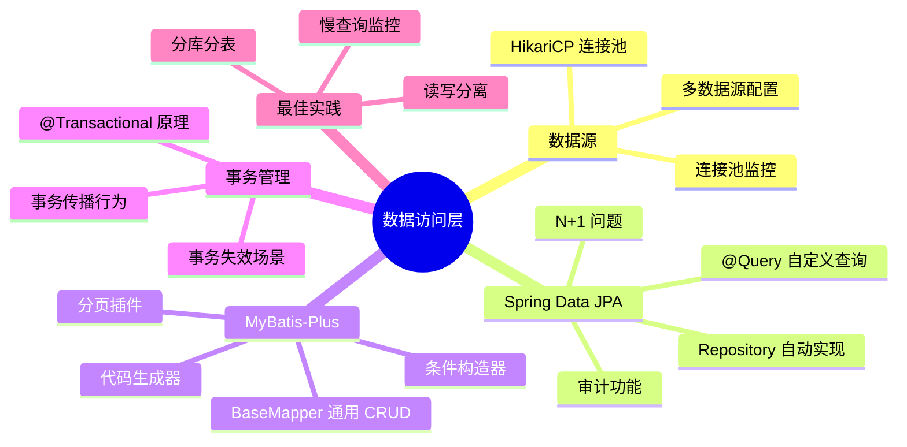

### 数据源自动配置原理

#### DataSourceAutoConfiguration 源码分析

```java
// Spring Boot 自动配置数据源的核心逻辑
@Configuration(proxyBeanMethods = false)
@ConditionalOnClass({ DataSource.class, EmbeddedDatabaseType.class })
@ConditionalOnMissingBean(type = "io.r2dbc.spi.ConnectionFactory")
@EnableConfigurationProperties(DataSourceProperties.class)
@Import({
    DataSourcePoolMetadataProvidersConfiguration.class,
    DataSourceInitializationConfiguration.class
})
public class DataSourceAutoConfiguration {

    // 内嵌数据库配置（H2/HSQL/Derby）
    @Configuration(proxyBeanMethods = false)
    @Conditional(EmbeddedDatabaseCondition.class)
    @ConditionalOnMissingBean({ DataSource.class, XADataSource.class })
    @Import(EmbeddedDataSourceConfiguration.class)
    protected static class EmbeddedDatabaseConfiguration {}

    // 连接池配置（HikariCP 优先）
    @Configuration(proxyBeanMethods = false)
    @Conditional(PooledDataSourceCondition.class)
    @ConditionalOnMissingBean({ DataSource.class, XADataSource.class })
    @Import({
        HikariConfiguration.class,   // 优先使用 HikariCP
        Tomcat.class,                 // 其次 Tomcat JDBC Pool
        Dbcp2.class,                  // 再次 DBCP2
        Generic.class,
        DataSourceJmxConfiguration.class
    })
    protected static class PooledDataSourceConfiguration {}
}
```

::: tip 为什么 HikariCP 是默认连接池
HikariCP 的性能优势来自：
1. 字节码级别优化（FastList 替代 ArrayList）
2. ConcurrentBag 无锁设计
3. 代理对象极简（ProxyConnection 只拦截 close()）
4. 主动检测连接泄漏（leakDetectionThreshold）

在大多数基准测试中，HikariCP 的获取/归还连接性能是其他连接池的 2-3 倍。
:::

#### DataSource 配置详解

##### DataSourceBuilder 源码分析

DataSourceBuilder 是 Spring Boot 提供的数据源构建器，支持链式调用创建各种类型的数据源。

```java
// DataSourceBuilder 核心源码
public final class DataSourceBuilder<T extends DataSource> {

    private Class<? extends DataSource> type;
    private ClassLoader classLoader;
    private Map<String, String> properties = new LinkedHashMap<>();

    // 根据类路径自动推断数据源类型
    public static Class<? extends DataSource> findType(ClassLoader classLoader) {
        // 优先级：HikariCP > Tomcat > DBCP2 > Oracle UCP > Generic
        if (ClassUtils.isPresent("com.zaxxer.hikari.HikariDataSource", classLoader)) {
            return HikariDataSource.class;
        }
        if (ClassUtils.isPresent("org.apache.tomcat.jdbc.pool.DataSource", classLoader)) {
            return org.apache.tomcat.jdbc.pool.DataSource.class;
        }
        if (ClassUtils.isPresent("org.apache.commons.dbcp2.BasicDataSource", classLoader)) {
            return BasicDataSource.class;
        }
        // ... 其他数据源类型
        return null;
    }

    // 构建数据源实例
    public T build() {
        Class<? extends DataSource> type = getType();
        DataSource dataSource = BeanUtils.instantiateClass(type);
        // 通过反射设置属性
        bind(dataSource);
        return (T) dataSource;
    }
}
```

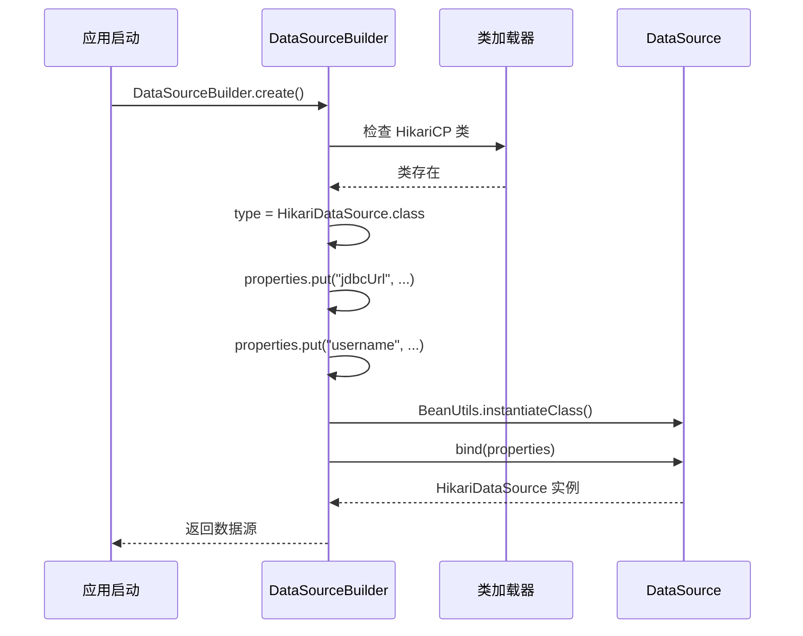

##### 多数据源配置实战

在实际项目中，经常需要连接多个数据库，例如主库和从库、业务库和日志库等。Spring Boot 支持灵活的多数据源配置。

```java
// 多数据源配置示例
@Configuration
public class MultiDataSourceConfig {

    // 主数据源（primary）
    @Bean
    @Primary
    @ConfigurationProperties(prefix = "spring.datasource.primary")
    public DataSource primaryDataSource() {
        return DataSourceBuilder.create().type(HikariDataSource.class).build();
    }

    // 从数据源（secondary）
    @Bean
    @ConfigurationProperties(prefix = "spring.datasource.secondary")
    public DataSource secondaryDataSource() {
        return DataSourceBuilder.create().type(HikariDataSource.class).build();
    }
}
```

```yaml
## application.yml 多数据源配置
spring:
  datasource:
    primary:
      jdbc-url: jdbc:mysql://localhost:3306/main_db?useSSL=false&serverTimezone=Asia/Shanghai
      username: root
      password: root123
      driver-class-name: com.mysql.cj.jdbc.Driver
      hikari:
        maximum-pool-size: 20
        minimum-idle: 5
    secondary:
      jdbc-url: jdbc:mysql://localhost:3306/log_db?useSSL=false&serverTimezone=Asia/Shanghai
      username: root
      password: root123
      driver-class-name: com.mysql.cj.jdbc.Driver
      hikari:
        maximum-pool-size: 10
        minimum-idle: 2
```

::: warning 多数据源配置注意事项
1. 必须指定一个 `@Primary` 数据源作为默认数据源
2. 每个数据源需要独立的 SqlSessionFactory 或 EntityManagerFactory
3. 事务管理器也需要分别配置，注意事务边界
4. 使用 `@Qualifier` 注解指定要注入的数据源
:::

##### JPA 多数据源配置

```java
// 主数据源 JPA 配置
@Configuration
@EnableJpaRepositories(
    basePackages = "com.example.repository.primary",
    entityManagerFactoryRef = "primaryEntityManagerFactory",
    transactionManagerRef = "primaryTransactionManager"
)
public class PrimaryJpaConfig {

    @Bean
    @Primary
    public LocalContainerEntityManagerFactoryBean primaryEntityManagerFactory(
            EntityManagerFactoryBuilder builder,
            @Qualifier("primaryDataSource") DataSource dataSource) {
        return builder
            .dataSource(dataSource)
            .packages("com.example.entity.primary")
            .persistenceUnit("primary")
            .build();
    }

    @Bean
    @Primary
    public PlatformTransactionManager primaryTransactionManager(
            @Qualifier("primaryEntityManagerFactory") EntityManagerFactory emf) {
        return new JpaTransactionManager(emf);
    }
}

// 从数据源 JPA 配置
@Configuration
@EnableJpaRepositories(
    basePackages = "com.example.repository.secondary",
    entityManagerFactoryRef = "secondaryEntityManagerFactory",
    transactionManagerRef = "secondaryTransactionManager"
)
public class SecondaryJpaConfig {

    @Bean
    public LocalContainerEntityManagerFactoryBean secondaryEntityManagerFactory(
            EntityManagerFactoryBuilder builder,
            @Qualifier("secondaryDataSource") DataSource dataSource) {
        return builder
            .dataSource(dataSource)
            .packages("com.example.entity.secondary")
            .persistenceUnit("secondary")
            .build();
    }

    @Bean
    public PlatformTransactionManager secondaryTransactionManager(
            @Qualifier("secondaryEntityManagerFactory") EntityManagerFactory emf) {
        return new JpaTransactionManager(emf);
    }
}
```

##### MyBatis-Plus 多数据源配置

```java
// MyBatis-Plus 多数据源配置
@Configuration
public class MybatisPlusMultiDataSourceConfig {

    @Bean
    @Primary
    public SqlSessionFactory primarySqlSessionFactory(
            @Qualifier("primaryDataSource") DataSource dataSource) throws Exception {
        MybatisSqlSessionFactoryBean factory = new MybatisSqlSessionFactoryBean();
        factory.setDataSource(dataSource);
        factory.setMapperLocations(new PathMatchingResourcePatternResolver()
            .getResources("classpath:mapper/primary/**/*.xml"));
        return factory.getObject();
    }

    @Bean
    public SqlSessionFactory secondarySqlSessionFactory(
            @Qualifier("secondaryDataSource") DataSource dataSource) throws Exception {
        MybatisSqlSessionFactoryBean factory = new MybatisSqlSessionFactoryBean();
        factory.setDataSource(dataSource);
        factory.setMapperLocations(new PathMatchingResourcePatternResolver()
            .getResources("classpath:mapper/secondary/**/*.xml"));
        return factory.getObject();
    }
}
```

##### 动态数据源切换

动态数据源允许在运行时根据上下文切换数据源，常用于多租户、读写分离等场景。

```java
// 动态数据源上下文持有者
public class DynamicDataSourceContextHolder {

    private static final ThreadLocal<String> CONTEXT_HOLDER = new ThreadLocal<>();

    // 设置当前数据源标识
    public static void setDataSourceKey(String key) {
        CONTEXT_HOLDER.set(key);
    }

    // 获取当前数据源标识
    public static String getDataSourceKey() {
        return CONTEXT_HOLDER.get();
    }

    // 清除数据源标识
    public static void clearDataSourceKey() {
        CONTEXT_HOLDER.remove();
    }
}

// 动态数据源实现
public class DynamicDataSource extends AbstractRoutingDataSource {

    @Override
    protected Object determineCurrentLookupKey() {
        return DynamicDataSourceContextHolder.getDataSourceKey();
    }
}

// 动态数据源配置
@Configuration
public class DynamicDataSourceConfig {

    @Bean
    public DataSource dynamicDataSource(
            @Qualifier("primaryDataSource") DataSource primaryDataSource,
            @Qualifier("secondaryDataSource") DataSource secondaryDataSource) {
        
        DynamicDataSource dynamicDataSource = new DynamicDataSource();
        
        Map<Object, Object> targetDataSources = new HashMap<>();
        targetDataSources.put("primary", primaryDataSource);
        targetDataSources.put("secondary", secondaryDataSource);
        
        dynamicDataSource.setTargetDataSources(targetDataSources);
        dynamicDataSource.setDefaultTargetDataSource(primaryDataSource);
        
        return dynamicDataSource;
    }
}
```

```java
// 自定义注解标记数据源
@Target({ElementType.METHOD, ElementType.TYPE})
@Retention(RetentionPolicy.RUNTIME)
@Documented
public @interface DataSource {
    String value() default "primary";
}

// AOP 切面实现数据源切换
@Aspect
@Component
@Order(Ordered.HIGHEST_PRECEDENCE)  // 确保在事务切面之前执行
public class DataSourceAspect {

    @Around("@annotation(dataSource)")
    public Object around(ProceedingJoinPoint point, DataSource dataSource) throws Throwable {
        String key = dataSource.value();
        try {
            DynamicDataSourceContextHolder.setDataSourceKey(key);
            return point.proceed();
        } finally {
            DynamicDataSourceContextHolder.clearDataSourceKey();
        }
    }
}

// 使用示例
@Service
public class UserService {

    @DataSource("primary")
    public User findById(Long id) {
        // 使用主数据源查询
        return userMapper.selectById(id);
    }

    @DataSource("secondary")
    public List<User> findLogs(Long userId) {
        // 使用从数据源查询日志
        return logMapper.selectByUserId(userId);
    }
}
```

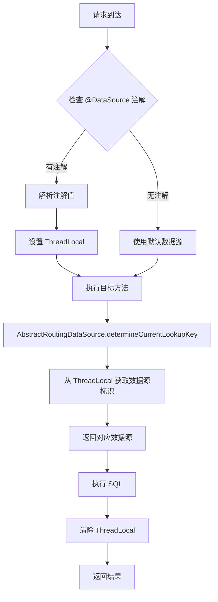

::: danger 动态数据源与事务的冲突
动态数据源切换必须在事务开启之前完成，否则事务会绑定到错误的数据源。解决方案：
1. 使用 `@Order(Ordered.HIGHEST_PRECEDENCE)` 确保数据源切面在事务切面之前执行
2. 或者在 Service 方法内部手动切换数据源，而不是通过 AOP
3. 不同数据源的事务无法合并，需要使用分布式事务（如 Seata）
:::

### Spring Data JPA 深度实践

#### Repository 自动实现原理

```java
// @EnableJpaRepositories 触发 Repository 初始化
// JpaRepositoryFactoryBean 创建 Repository 代理
public class JpaRepositoryFactoryBean<T extends Repository<S, ID>, S, ID>
    extends TransactionalRepositoryFactoryBeanSupport<T, S, ID> {

    @Override
    protected RepositoryFactorySupport doCreateRepositoryFactory() {
        return new JpaRepositoryFactory(entityManager);
    }
}

// SimpleJpaRepository 是所有 JPA Repository 的默认实现
@Repository
@Transactional(readOnly = true)
public class SimpleJpaRepository<T, ID> implements JpaRepositoryImplementation<T, ID> {

    @Override
    public Optional<T> findById(ID id) {
        T entity = em.find(domainClass, id);
        return entity != null ? Optional.of(entity) : Optional.empty();
    }

    @Override
    @Transactional
    public <S extends T> S save(S entity) {
        if (entityInformation.isNew(entity)) {
            em.persist(entity);  // 新增
            return entity;
        } else {
            return em.merge(entity);  // 更新
        }
    }
}
```

#### Entity 生命周期

JPA 实体（Entity，即与数据库表映射的 Java 对象）具有明确的生命周期状态，理解这些状态对于正确使用 JPA 至关重要。

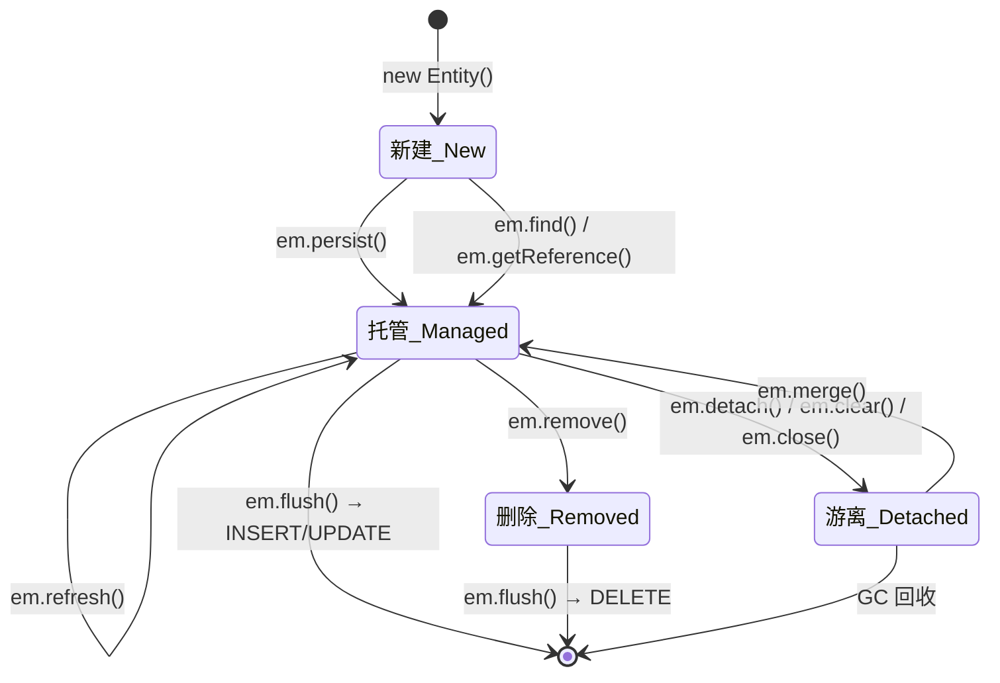

| 生命周期状态 | 说明 | 持久化上下文跟踪 | 数据库同步 |
|---|---|---|---|
| New（新建） | 刚创建，无主键 | 否 | 否 |
| Managed（托管） | 在持久化上下文中 | 是 | 是（flush 时同步） |
| Detached（游离） | 脱离持久化上下文 | 否 | 否 |
| Removed（删除） | 标记为删除 | 是 | 是（flush 时执行 DELETE） |

```java
// Entity 生命周期回调示例
@Entity
@Table(name = "t_user")
@EntityListeners(AuditingEntityListener.class)  // JPA 审计监听器
public class User {

    @Id
    @GeneratedValue(strategy = GenerationType.IDENTITY)
    private Long id;

    private String username;

    // 生命周期回调方法
    @PrePersist  // 持久化之前（INSERT 之前）
    private void prePersist() {
        System.out.println("即将插入用户：" + username);
    }

    @PostPersist  // 持久化之后（INSERT 之后，已有主键）
    private void postPersist() {
        System.out.println("用户已插入，ID=" + id);
    }

    @PreUpdate  // 更新之前（UPDATE 之前）
    private void preUpdate() {
        System.out.println("即将更新用户：" + username);
    }

    @PostUpdate  // 更新之后（UPDATE 之后）
    private void postUpdate() {
        System.out.println("用户已更新");
    }

    @PreRemove  // 删除之前（DELETE 之前）
    private void preRemove() {
        System.out.println("即将删除用户：" + id);
    }

    @PostRemove  // 删除之后（DELETE 之后）
    private void postRemove() {
        System.out.println("用户已删除");
    }

    @PostLoad  // 加载之后（SELECT 之后）
    private void postLoad() {
        System.out.println("用户已加载：" + username);
    }
}
```

::: tip 生命周期回调的使用场景
- `@PrePersist`：设置创建时间、初始化默认值
- `@PreUpdate`：设置更新时间
- `@PostLoad`：计算派生属性、缓存解密字段
- `@PreRemove`：检查是否允许删除、级联清理关联数据
:::

#### JPA 审计功能

JPA 审计（Auditing）自动记录实体的创建时间、修改时间、创建人、修改人等审计信息，是数据合规的重要手段。

```java
// 1. 启用 JPA 审计
@Configuration
@EnableJpaAuditing(auditorAwareRef = "auditorAware")
public class JpaAuditingConfig {}

// 2. 实现 AuditorAware 接口，提供当前操作人
@Component
public class SpringSecurityAuditorAware implements AuditorAware<String> {

    @Override
    public Optional<String> getCurrentAuditor() {
        // 从 Spring Security 上下文获取当前用户
        Authentication authentication = SecurityContextHolder.getContext().getAuthentication();
        if (authentication == null || !authentication.isAuthenticated()) {
            return Optional.of("system");  // 系统自动操作
        }
        return Optional.of(authentication.getName());
    }
}

// 3. 审计基类——所有实体继承此类即可获得审计功能
@MappedSuperclass
@EntityListeners(AuditingEntityListener.class)
public abstract class BaseEntity {

    @CreatedDate  // 创建时间
    @Column(name = "created_at", updatable = false)
    private LocalDateTime createdAt;

    @LastModifiedDate  // 最后修改时间
    @Column(name = "updated_at")
    private LocalDateTime updatedAt;

    @CreatedBy  // 创建人
    @Column(name = "created_by", updatable = false, length = 50)
    private String createdBy;

    @LastModifiedBy  // 最后修改人
    @Column(name = "updated_by", length = 50)
    private String updatedBy;
}

// 4. 实体继承审计基类
@Entity
@Table(name = "t_order")
public class Order extends BaseEntity {
    @Id
    @GeneratedValue(strategy = GenerationType.IDENTITY)
    private Long id;

    private String orderNo;
    private BigDecimal amount;
}
```

::: warning 审计字段与 @DynamicUpdate
如果使用了 `@DynamicUpdate`（只更新变化的字段），审计字段 `updatedAt` 和 `updatedBy` 每次都会被更新，即使业务字段没有变化。如果需要只在业务字段变化时才更新审计字段，需要自定义 `EntityListener` 逻辑。
:::

#### @Query 高级用法

```java
public interface UserRepository extends JpaRepository<User, Long> {

    // 1. JPQL 查询（面向对象，使用实体类名和属性名）
    @Query("SELECT u FROM User u WHERE u.username = :username")
    Optional<User> findByUsername(@Param("username") String username);

    // 2. 原生 SQL 查询（nativeQuery = true）
    @Query(value = "SELECT * FROM t_user WHERE DATE(created_at) = :date", nativeQuery = true)
    List<User> findByCreatedDate(@Param("date") LocalDate date);

    // 3. 更新操作（必须加 @Modifying + @Transactional）
    @Modifying
    @Transactional
    @Query("UPDATE User u SET u.status = :status WHERE u.id IN :ids")
    int batchUpdateStatus(@Param("status") Integer status, @Param("ids") List<Long> ids);

    // 4. 删除操作
    @Modifying
    @Transactional
    @Query("DELETE FROM User u WHERE u.lastLoginAt < :expireDate")
    int deleteInactiveUsers(@Param("expireDate") LocalDateTime expireDate);

    // 5. 联表查询 + DTO 投影
    @Query("SELECT new com.example.dto.UserOrderDTO(u.username, COUNT(o.id), SUM(o.amount)) " +
           "FROM User u LEFT JOIN u.orders o " +
           "GROUP BY u.username " +
           "HAVING SUM(o.amount) > :minAmount")
    List<UserOrderDTO> findUserOrderStats(@Param("minAmount") BigDecimal minAmount);

    // 6. 使用 SpEL 表达式引用实体类名
    @Query("SELECT e FROM #{#entityName} e WHERE e.deleted = false")
    List<User> findAllActive();

    // 7. LIKE 模糊查询——注意拼接方式
    @Query("SELECT u FROM User u WHERE u.username LIKE CONCAT('%', :keyword, '%')")
    List<User> searchByKeyword(@Param("keyword") String keyword);
}
```

::: danger @Modifying 的坑
1. `@Modifying` 必须配合 `@Transactional` 使用，否则抛出 `InvalidDataAccessApiUsageException`
2. 默认情况下，`@Modifying` 执行后持久化上下文中的实体可能过时。如果需要刷新，使用 `@Modifying(clearAutomatically = true, flushAutomatically = true)`
3. `clearAutomatically = true` 会清除持久化上下文，后续访问实体需要重新查询
4. `flushAutomatically = true` 在执行更新前先 flush，确保未保存的变更不会丢失
:::

#### Specification 动态查询

Specification（规范查询）是 JPA 提供的类型安全动态查询机制，适合构建复杂的动态条件查询。

```java
// 1. 实现 Specification 接口
public class UserSpecs {

    // 用户名模糊查询
    public static Specification<User> usernameLike(String username) {
        return (root, query, cb) ->
            StringUtils.isBlank(username) ? null :
            cb.like(root.get("username"), "%" + username + "%");
    }

    // 状态精确匹配
    public static Specification<User> statusEqual(Integer status) {
        return (root, query, cb) ->
            status == null ? null : cb.equal(root.get("status"), status);
    }

    // 创建时间范围查询
    public static Specification<User> createdAtBetween(LocalDateTime start, LocalDateTime end) {
        return (root, query, cb) ->
            start == null || end == null ? null :
            cb.between(root.get("createdAt"), start, end);
    }

    // 关联查询：订单金额大于指定值
    public static Specification<User> hasOrderAmountGreaterThan(BigDecimal amount) {
        return (root, query, cb) -> {
            Join<User, Order> orderJoin = root.join("orders", JoinType.INNER);
            return cb.greaterThan(orderJoin.get("amount"), amount);
        };
    }
}

// 2. Repository 继承 JpaSpecificationExecutor
public interface UserRepository extends JpaRepository<User, Long>,
        JpaSpecificationExecutor<User> {
}

// 3. Service 层组合动态查询
@Service
@RequiredArgsConstructor
public class UserService {

    private final UserRepository userRepository;

    public Page<User> search(UserQueryDTO queryDTO, Pageable pageable) {
        // 动态组合查询条件
        Specification<User> spec = Specification
            .where(UserSpecs.usernameLike(queryDTO.getUsername()))
            .and(UserSpecs.statusEqual(queryDTO.getStatus()))
            .and(UserSpecs.createdAtBetween(queryDTO.getStartTime(), queryDTO.getEndTime()));

        return userRepository.findAll(spec, pageable);
    }
}
```

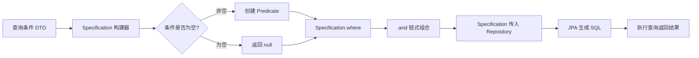

::: tip Specification 的优势
1. 类型安全——编译期检查属性名，避免字符串拼写错误
2. 可复用——每个条件封装为独立的 Specification，可自由组合
3. 可测试——每个 Specification 可以单独单元测试
4. 动态组合——根据前端传参灵活拼接条件，空条件自动忽略
:::

#### 投影查询

投影（Projection）只查询需要的字段，避免查询整行数据，提升查询性能。

```java
// 1. 基于接口的投影（动态代理实现）
public interface UserSummary {
    Long getId();
    String getUsername();
    String getEmail();

    // 支持 SpEL 表达式计算派生值
    @Value("#{target.username + ' <' + target.email + '>'}")
    String getDisplayName();
}

public interface UserRepository extends JpaRepository<User, Long> {
    // 返回接口投影
    List<UserSummary> findByStatus(Integer status);

    // 基于 @Query 的投影
    @Query("SELECT u.id AS id, u.username AS username FROM User u WHERE u.deleted = false")
    List<UserSummary> findActiveUserSummaries();
}

// 2. 基于类的投影（DTO）
public record UserOrderCountDTO(String username, Long orderCount) {}

@Query("SELECT new com.example.dto.UserOrderCountDTO(u.username, COUNT(o.id)) " +
       "FROM User u LEFT JOIN u.orders o GROUP BY u.username")
List<UserOrderCountDTO> findUserOrderCounts();

// 3. 基于记录类（Java 16+ Record）的投影
public record UserBriefProjection(Long id, String username, LocalDateTime createdAt) {}

List<UserBriefProjection> findAllProjectedBy();
```

::: warning 接口投影的性能陷阱
接口投影在运行时通过动态代理生成实现类，每个属性访问都会通过代理调用。在大量数据场景下，DTO 投影（基于类或 Record）性能更好，因为直接通过构造函数赋值，没有代理开销。
:::

#### 自定义 Repository

当 Spring Data JPA 提供的默认方法无法满足需求时，可以通过自定义 Repository 扩展功能。

```java
// 1. 定义自定义 Repository 接口
public interface CustomUserRepository {
    // 批量插入（使用 JDBC 批处理提升性能）
    void batchInsert(List<User> users);

    // 复杂统计查询
    UserStatisticsDTO getUserStatistics(Long userId);
}

// 2. 实现自定义 Repository
public class CustomUserRepositoryImpl implements CustomUserRepository {

    @PersistenceContext
    private EntityManager entityManager;

    @Override
    @Transactional
    public void batchInsert(List<User> users) {
        for (int i = 0; i < users.size(); i++) {
            entityManager.persist(users.get(i));
            // 每 50 条 flush 一次，避免内存溢出
            if (i % 50 == 0) {
                entityManager.flush();
                entityManager.clear();  // 清除持久化上下文，释放内存
            }
        }
    }

    @Override
    public UserStatisticsDTO getUserStatistics(Long userId) {
        // 使用原生 SQL 执行复杂统计
        Query query = entityManager.createNativeQuery(
            "SELECT COUNT(*) AS order_count, SUM(amount) AS total_amount " +
            "FROM t_order WHERE user_id = :userId"
        );
        query.setParameter("userId", userId);
        Object[] row = (Object[]) query.getSingleResult();
        return new UserStatisticsDTO(
            ((Number) row[0]).longValue(),
            (BigDecimal) row[1]
        );
    }
}

// 3. 让 Repository 接口继承自定义接口
public interface UserRepository extends JpaRepository<User, Long>,
        JpaSpecificationExecutor<User>,
        CustomUserRepository {  // 继承自定义接口
    // Spring Data JPA 会自动将 CustomUserRepositoryImpl 的方法
    // 合并到 UserRepository 的代理中
}
```

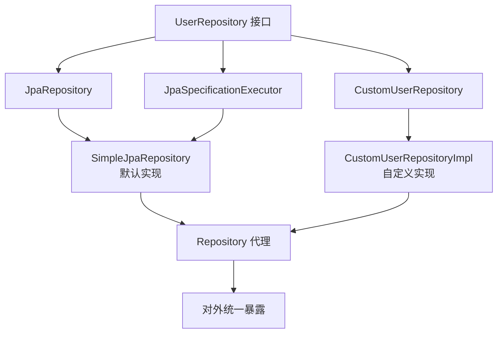

::: tip 自定义 Repository 的命名约定
自定义实现类的名称必须是 `接口名 + Impl`，例如 `CustomUserRepository` 的实现类必须是 `CustomUserRepositoryImpl`。如果使用其他命名，需要在 `@EnableJpaRepositories` 中配置 `repositoryImplementationPostfix` 参数。
:::

#### N+1 查询问题

```java
// × N+1 问题：查询 N 个用户，每个用户触发 1 次订单查询
@GetMapping("/users")
public List<User> getUsers() {
    List<User> users = userRepository.findAll();  // 1 次查询
    // 延迟加载 orders，每个用户触发 1 次查询 = N 次查询
    users.forEach(u -> u.getOrders().size());  // N 次查询！
    return users;
}

// √ 方式1：JOIN FETCH 一次性加载
@Query("SELECT u FROM User u LEFT JOIN FETCH u.orders")
List<User> findAllWithOrders();

// √ 方式2：@EntityGraph 声明式加载
@EntityGraph(attributePaths = "orders")
List<User> findAll();

// √ 方式3：@NamedEntityGraph 在实体上定义
@NamedEntityGraph(
    name = "User.withOrders",
    attributeNodes = @NamedAttributeNode("orders")
)
@Entity
public class User { ... }

// 在 Repository 中引用
@EntityGraph(value = "User.withOrders", type = EntityGraphType.LOAD)
List<User> findAll();

// √ 方式4：关闭 OSIV + 在 Service 层完成加载
```

::: danger Open Session In View (OSIV) 的陷阱
Spring Boot 默认开启 `spring.jpa.open-in-view=true`，这会在请求开始时打开 EntityManager，请求结束时关闭。虽然方便了延迟加载，但会导致：
1. 数据库连接占用时间过长（从请求开始到结束）
2. 隐藏了 N+1 问题——因为 EM 一直开着，延迟加载不会报错
3. 事务边界模糊——Service 层事务结束后，Controller 层仍在查询数据库

**生产环境建议关闭 OSIV**：`spring.jpa.open-in-view=false`，在 Service 层完成所有数据加载。
:::

### 事务管理源码分析

#### @Transactional 的实现原理

```java
// Spring 通过 AOP 代理实现声明式事务
// TransactionInterceptor 拦截 @Transactional 方法
public class TransactionInterceptor extends TransactionAspectSupport
    implements MethodInterceptor {

    @Override
    public Object invoke(MethodInvocation invocation) throws Throwable {
        // 获取事务属性
        TransactionAttributeSource tas = getTransactionAttributeSource();
        TransactionAttribute txAttr = tas.getTransactionAttribute(method, targetClass);

        // 获取 PlatformTransactionManager
        PlatformTransactionManager tm = determineTransactionManager(txAttr);

        // 创建事务
        TransactionInfo txInfo = createTransactionIfNecessary(tm, txAttr, joinpointIdentification);

        try {
            // 执行目标方法
            Object retVal = invocation.proceedWithInvocation();
            return retVal;
        } catch (Throwable ex) {
            // 异常回滚
            completeTransactionAfterThrowing(txInfo, ex);
            throw ex;
        } finally {
            cleanupTransactionInfo(txInfo);
        }
    }
}
```

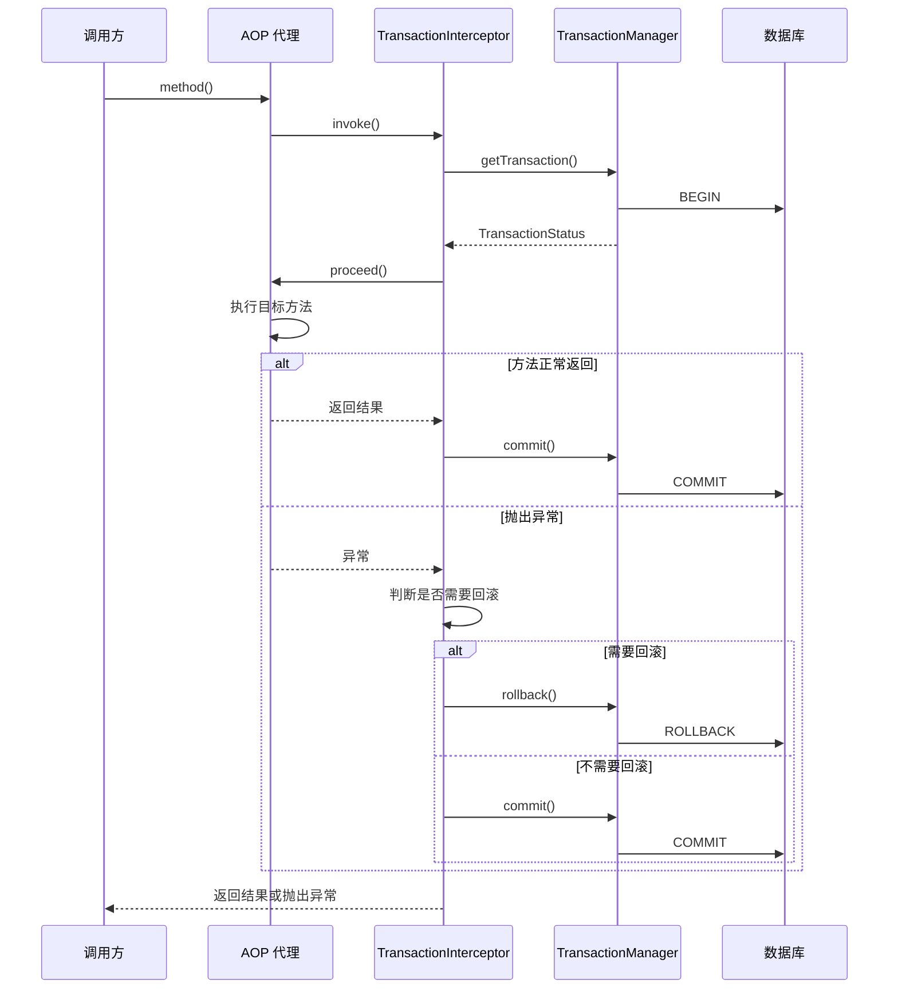

#### 事务传播行为详解

事务传播行为（Propagation Behavior）定义了当一个事务方法被另一个事务方法调用时，事务应该如何传播。Spring 提供了 7 种传播行为。

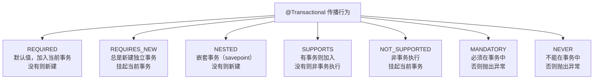

| 传播行为 | 当前有事务 | 当前无事务 | 典型场景 |
|---|---|---|---|
| **REQUIRED**（默认） | 加入当前事务 | 新建事务 | 大部分业务方法 |
| **REQUIRES_NEW** | 挂起当前事务，新建事务 | 新建事务 | 日志记录、独立操作 |
| **NESTED** | 在当前事务中创建 savepoint | 新建事务 | 部分回滚场景 |
| **SUPPORTS** | 加入当前事务 | 非事务执行 | 查询方法 |
| **NOT_SUPPORTED** | 挂起当前事务，非事务执行 | 非事务执行 | 不需要事务的操作 |
| **MANDATORY** | 加入当前事务 | 抛出 `IllegalTransactionStateException` | 必须在事务中调用的方法 |
| **NEVER** | 抛出 `IllegalTransactionStateException` | 非事务执行 | 不允许事务的操作 |

##### REQUIRED 传播行为源码分析

```java
// AbstractPlatformTransactionManager.handleExistingTransaction() 核心逻辑
// 当传播行为为 REQUIRED 且当前已有事务时
if (definition.getPropagationBehavior() == TransactionDefinition.PROPAGATION_REQUIRED) {
    // 直接加入当前事务，不做任何处理
    return new TransactionStatusForExistingTransaction(
        transaction, null, newSynchronization, debugEnabled, null
    );
}

// 当传播行为为 REQUIRED 且当前无事务时
// 在 getTransaction() 中会创建新事务
if (definition.getPropagationBehavior() == TransactionDefinition.PROPAGATION_REQUIRED) {
    // 启动新事务
    doBegin(transaction, definition);
    // ... 注册同步回调
}
```

##### REQUIRES_NEW 传播行为源码分析

```java
// REQUIRES_NEW：总是新建独立事务，挂起当前事务
if (definition.getPropagationBehavior() == TransactionDefinition.PROPAGATION_REQUIRES_NEW) {
    // 挂起当前事务
    SuspendedResourcesHolder suspendedResources = suspend(transaction);
    try {
        // 创建新事务
        boolean newSynchronization = (getTransactionSynchronization() != SYNCHRONIZATION_NEVER);
        DefaultTransactionStatus status = newTransactionStatus(
            definition, transaction, true, newSynchronization, debugEnabled, suspendedResources);
        doBegin(transaction, definition);
        prepareSynchronization(status, definition);
        return status;
    } catch (RuntimeException | Error ex) {
        // 新事务创建失败，恢复挂起的事务
        resume(transaction, suspendedResources);
        throw ex;
    }
}
```

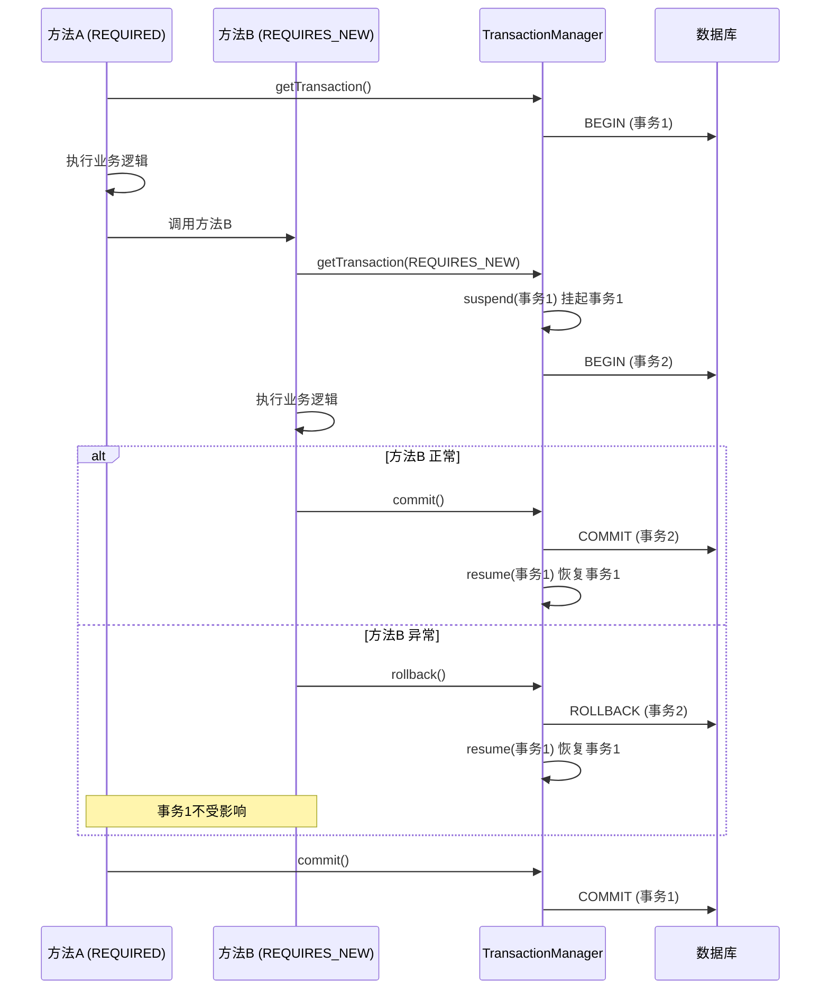

##### NESTED 嵌套事务源码分析

```java
// NESTED：在当前事务中创建 savepoint
if (definition.getPropagationBehavior() == TransactionDefinition.PROPAGATION_NESTED) {
    // 检查是否支持 savepoint
    if (!isNestedTransactionAllowed()) {
        throw new NestedTransactionNotSupportedException(
            "Nested transaction not supported");
    }
    // 使用 savepoint 实现嵌套
    if (useSavepointForNestedTransaction()) {
        // 在当前事务中创建 savepoint
        SavepointManager savepointManager = getSavepointManager(transaction);
        Object savepoint = savepointManager.createSavepoint();
        return new DefaultTransactionStatus(
            transaction, false, false, newSynchronization, debugEnabled, savepoint);
    }
}
```

```java
// NESTED vs REQUIRES_NEW 的区别
@Service
public class OrderService {

    // NESTED：内层事务回滚不影响外层（通过 savepoint）
    @Transactional
    public void createOrder() {
        orderMapper.insert(order);
        try {
            this.saveLog();  // NESTED 传播
        } catch (Exception e) {
            // 日志保存失败，只回滚到 savepoint，订单不受影响
        }
    }

    @Transactional(propagation = Propagation.NESTED)
    public void saveLog() {
        logMapper.insert(log);
        // 如果这里抛出异常，只回滚到 savepoint
    }
}
```

::: tip NESTED 与 REQUIRES_NEW 的选择
- **NESTED**：内层事务是外层事务的一部分，共享同一个数据库连接。内层回滚到 savepoint，外层可以继续。如果外层回滚，内层也会回滚。
- **REQUIRES_NEW**：内层事务完全独立，使用新的数据库连接。内层回滚不影响外层，外层回滚也不影响内层。
- 大多数场景下，如果只是想"部分失败不影响整体"，优先使用 NESTED，性能更好。
:::

#### 事务隔离级别

事务隔离级别（Isolation Level）定义了一个事务必须与其它事务隔离的程度。隔离级别越高，数据一致性越好，但并发性能越低。

| 隔离级别 | 脏读 | 不可重复读 | 幻读 | 说明 |
|---|---|---|---|---|
| READ_UNCOMMITTED | 可能 | 可能 | 可能 | 最低隔离，能读到未提交数据 |
| READ_COMMITTED | 不会 | 可能 | 可能 | Oracle 默认，只读已提交数据 |
| REPEATABLE_READ | 不会 | 不会 | 可能 | MySQL InnoDB 默认，同一事务内读取一致 |
| SERIALIZABLE | 不会 | 不会 | 不会 | 最高隔离，完全串行化执行 |

```java
// Spring 中设置隔离级别
@Transactional(isolation = Isolation.REPEATABLE_READ)
public User findById(Long id) {
    return userMapper.selectById(id);
}

// AbstractPlatformTransactionManager 中隔离级别的处理
protected DefaultTransactionStatus startTransaction(
        TransactionDefinition definition, Object transaction,
        boolean newSynchronization, boolean debugEnabled) {
    
    // 根据隔离级别设置数据库连接的隔离级别
    if (definition.getIsolationLevel() != TransactionDefinition.ISOLATION_DEFAULT) {
        doSetIsolationLevel(transaction, definition.getIsolationLevel());
    }
    // ...
}
```

::: warning MySQL InnoDB 对幻读的处理
MySQL InnoDB 在 REPEATABLE_READ 隔离级别下，通过 Next-Key Lock（间隙锁 + 行锁）在一定程度上避免了幻读。但这是 InnoDB 的实现增强，并非 SQL 标准的要求。在特定场景下（如先快照读再当前读），仍可能出现幻读现象。
:::

#### 事务超时

```java
// 事务超时设置（单位：秒）
@Transactional(timeout = 30)  // 30 秒超时
public void processOrder(Long orderId) {
    // 如果 30 秒内未完成，事务自动回滚
    orderMapper.updateStatus(orderId, "PROCESSING");
    // ... 耗时操作
}

// TransactionTemplate 编程式事务超时
TransactionTemplate txTemplate = new TransactionTemplate(transactionManager);
txTemplate.setTimeout(30);  // 30 秒超时
txTemplate.execute(status -> {
    // 事务操作
    return result;
});
```

#### 事务失效的常见场景

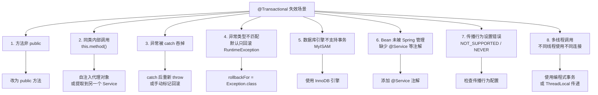

##### 场景1：同类内部调用

```java
@Service
public class OrderService {
    // × 外部调用 createOrder() 有事务，但内部调用 deductStock() 不走代理
    @Transactional
    public void createOrder(OrderDTO dto) {
        orderMapper.insert(dto);
        this.deductStock(dto.getProductId());  // 不走代理，事务不生效！
    }

    @Transactional(propagation = Propagation.REQUIRES_NEW)
    public void deductStock(Long productId) {
        // 期望独立事务，但实际没有
    }
}

// √ 方式1：自注入代理
@Service
@RequiredArgsConstructor
public class OrderService {
    private final OrderService self;  // 代理对象

    @Transactional
    public void createOrder(OrderDTO dto) {
        orderMapper.insert(dto);
        self.deductStock(dto.getProductId());  // 走代理
    }
}

// √ 方式2：提取到另一个 Service
@Service
@RequiredArgsConstructor
public class OrderService {
    private final StockService stockService;

    @Transactional
    public void createOrder(OrderDTO dto) {
        orderMapper.insert(dto);
        stockService.deductStock(dto.getProductId());  // 走代理
    }
}
```

##### 场景2：异常被 catch 吞掉

```java
@Service
public class OrderService {

    // × 异常被 catch，事务不会回滚
    @Transactional
    public void createOrder(OrderDTO dto) {
        try {
            orderMapper.insert(dto);
            stockService.deductStock(dto.getProductId());
        } catch (Exception e) {
            log.error("创建订单失败", e);
            // 异常被吞掉，事务不会回滚！
        }
    }

    // √ 方式1：catch 后重新抛出
    @Transactional
    public void createOrder(OrderDTO dto) {
        try {
            orderMapper.insert(dto);
            stockService.deductStock(dto.getProductId());
        } catch (Exception e) {
            log.error("创建订单失败", e);
            throw e;  // 重新抛出，触发回滚
        }
    }

    // √ 方式2：手动标记回滚
    @Transactional
    public void createOrder(OrderDTO dto) {
        try {
            orderMapper.insert(dto);
            stockService.deductStock(dto.getProductId());
        } catch (Exception e) {
            log.error("创建订单失败", e);
            TransactionAspectSupport.currentTransactionStatus().setRollbackOnly();
        }
    }
}
```

##### 场景3：异常类型不匹配

```java
@Service
public class OrderService {

    // × 默认只回滚 RuntimeException 和 Error，不回滚 checked Exception
    @Transactional
    public void createOrder(OrderDTO dto) throws IOException {
        orderMapper.insert(dto);
        throw new IOException("文件写入失败");  // 不会回滚！
    }

    // √ 指定 rollbackFor = Exception.class，所有异常都回滚
    @Transactional(rollbackFor = Exception.class)
    public void createOrder(OrderDTO dto) throws IOException {
        orderMapper.insert(dto);
        throw new IOException("文件写入失败");  // 会回滚
    }
}
```

::: danger rollbackFor 的最佳实践
**始终使用 `@Transactional(rollbackFor = Exception.class)`**，这是最安全的做法。Spring 默认只回滚 `RuntimeException` 和 `Error`，不回滚 checked Exception（如 `IOException`、`SQLException`），这在大多数业务场景中是不符合预期的。
:::

##### 场景4：多线程调用

```java
@Service
public class OrderService {

    // × 多线程中事务不共享
    @Transactional
    public void batchProcess(List<Long> orderIds) {
        orderIds.parallelStream().forEach(id -> {
            // 每个线程获取不同的数据库连接，不在同一事务中
            orderMapper.updateStatus(id, "PROCESSED");
        });
    }

    // √ 使用编程式事务管理
    @Autowired
    private PlatformTransactionManager transactionManager;

    public void batchProcess(List<Long> orderIds) {
        orderIds.forEach(id -> {
            TransactionTemplate txTemplate = new TransactionTemplate(transactionManager);
            txTemplate.execute(status -> {
                orderMapper.updateStatus(id, "PROCESSED");
                return null;
            });
        });
    }
}
```

::: warning 多线程事务的本质
Spring 事务基于 `ThreadLocal` 存储事务上下文，不同线程天然无法共享事务。如果需要跨线程事务一致性，需要使用分布式事务方案（如 Seata AT 模式），或者将操作串行化在同一个线程中执行。
:::

### MyBatis-Plus 整合实践

#### 自动配置原理

```java
// MybatisPlusAutoConfiguration.java
@Configuration
@ConditionalOnClass({SqlSessionFactory.class, SqlSessionFactoryBean.class})
@EnableConfigurationProperties(MybatisPlusProperties.class)
@AutoConfigureAfter({DataSourceAutoConfiguration.class})
public class MybatisPlusAutoConfiguration {

    @Bean
    @ConditionalOnMissingBean
    public SqlSessionFactory sqlSessionFactory(DataSource dataSource,
                                                MybatisPlusProperties properties) throws Exception {
        MybatisSqlSessionFactoryBean factory = new MybatisSqlSessionFactoryBean();
        factory.setDataSource(dataSource);
        factory.setConfiguration(properties.getConfiguration());
        factory.setPlugins(properties.getPlugins());  // 注册插件
        return factory.getObject();
    }
}
```

#### BaseMapper 通用 CRUD

```java
@Mapper
public interface UserMapper extends BaseMapper<User> {
    // 自动拥有：insert / deleteById / updateById / selectById / selectList / selectPage
}

// 条件构造器示例
@Service
@RequiredArgsConstructor
public class UserService {
    private final UserMapper userMapper;

    public List<User> searchUsers(String name, String status) {
        LambdaQueryWrapper<User> wrapper = new LambdaQueryWrapper<>();
        wrapper.like(StringUtils.isNotBlank(name), User::getUsername, name)
               .eq(StringUtils.isNotBlank(status), User::getStatus, status)
               .orderByDesc(User::getCreatedAt);
        return userMapper.selectList(wrapper);
    }
}
```

#### 分页插件配置

MyBatis-Plus 提供了开箱即用的分页插件，支持多种数据库方言。

```java
// 分页插件配置
@Configuration
public class MybatisPlusConfig {

    @Bean
    public MybatisPlusInterceptor mybatisPlusInterceptor() {
        MybatisPlusInterceptor interceptor = new MybatisPlusInterceptor();
        // 添加分页插件，指定数据库类型
        interceptor.addInnerInterceptor(
            new PaginationInnerInterceptor(DbType.MYSQL)
        );
        return interceptor;
    }
}
```

```java
// 分页查询使用示例
@Service
@RequiredArgsConstructor
public class UserService {

    private final UserMapper userMapper;

    // 基础分页查询
    public IPage<User> pageQuery(int pageNum, int pageSize, String keyword) {
        Page<User> page = new Page<>(pageNum, pageSize);
        LambdaQueryWrapper<User> wrapper = new LambdaQueryWrapper<>();
        wrapper.like(StringUtils.isNotBlank(keyword), User::getUsername, keyword)
               .orderByDesc(User::getCreatedAt);
        return userMapper.selectPage(page, wrapper);
    }

    // 自定义 SQL 分页查询
    // UserMapper.java
    @Select("SELECT u.*, d.name AS dept_name FROM t_user u " +
            "LEFT JOIN t_dept d ON u.dept_id = d.id " +
            "WHERE u.status = #{status}")
    IPage<UserVO> selectUserVOPage(
        Page<UserVO> page,  // MyBatis-Plus 自动处理分页参数
        @Param("status") Integer status
    );
}
```

```java
// Controller 层分页响应封装
@GetMapping("/users")
public Result<PageResult<UserVO>> listUsers(
        @RequestParam(defaultValue = "1") Integer pageNum,
        @RequestParam(defaultValue = "10") Integer pageSize,
        @RequestParam(required = false) String keyword) {
    
    IPage<User> page = userService.pageQuery(pageNum, pageSize, keyword);
    
    PageResult<UserVO> result = new PageResult<>();
    result.setList(BeanUtil.copyToList(page.getRecords(), UserVO.class));
    result.setTotal(page.getTotal());
    result.setPageNum(page.getCurrent());
    result.setPageSize(page.getSize());
    
    return Result.success(result);
}
```

::: tip 分页插件的优化建议
1. 对于深分页（如 `LIMIT 100000, 10`），性能会急剧下降。建议使用游标分页（基于 ID 的 `WHERE id > lastId LIMIT 10`）
2. 设置分页上限防止恶意请求：`paginationInterceptor.setMaxLimit(500L)`
3. 开启 count 查询优化：对于复杂 JOIN 查询，count 语句可能很慢，可以手动指定 count SQL
:::

#### 乐观锁插件

乐观锁（Optimistic Locking）通过版本号机制实现并发控制，适合读多写少的场景。

```java
// 1. 配置乐观锁插件
@Configuration
public class MybatisPlusConfig {

    @Bean
    public MybatisPlusInterceptor mybatisPlusInterceptor() {
        MybatisPlusInterceptor interceptor = new MybatisPlusInterceptor();
        interceptor.addInnerInterceptor(new PaginationInnerInterceptor(DbType.MYSQL));
        interceptor.addInnerInterceptor(new OptimisticLockerInnerInterceptor());  // 乐观锁
        return interceptor;
    }
}

// 2. 实体类添加 @Version 字段
@Data
@TableName("t_product")
public class Product {
    @TableId
    private Long id;

    private String name;
    private BigDecimal price;
    private Integer stock;

    @Version  // 乐观锁版本号
    private Integer version;
}

// 3. 使用乐观锁更新
@Service
@RequiredArgsConstructor
public class ProductService {

    private final ProductMapper productMapper;

    @Transactional
    public boolean deductStock(Long productId, Integer quantity) {
        // 先查询获取当前版本号
        Product product = productMapper.selectById(productId);
        if (product.getStock() < quantity) {
            throw new BusinessException("库存不足");
        }
        
        // 设置扣减数量，MyBatis-Plus 自动在 UPDATE 中添加 version 条件
        product.setStock(product.getStock() - quantity);
        int rows = productMapper.updateById(product);
        // 生成的 SQL：UPDATE t_product SET stock=?, version=version+1 
        //            WHERE id=? AND version=原版本号
        
        if (rows == 0) {
            // 版本号不匹配，说明已被其他线程修改
            throw new BusinessException("并发冲突，请重试");
        }
        return true;
    }
}
```

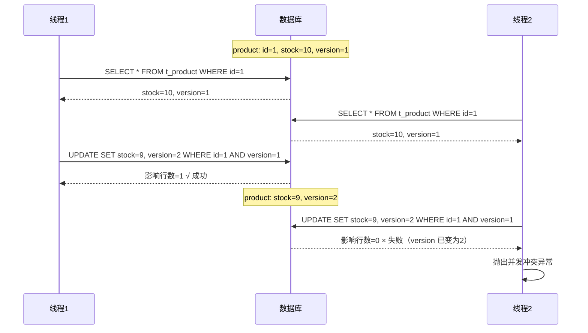

#### 逻辑删除

逻辑删除（Logical Delete）不真正删除数据，而是标记为"已删除"状态，保留数据用于审计和恢复。

```java
// 1. 全局配置逻辑删除
// application.yml
mybatis-plus:
  global-config:
    db-config:
      logic-delete-field: deleted    # 全局逻辑删除字段名
      logic-delete-value: 1          # 删除值
      logic-not-delete-value: 0      # 未删除值

// 2. 实体类添加逻辑删除字段
@Data
@TableName("t_user")
public class User {
    @TableId
    private Long id;

    private String username;

    @TableLogic  // 逻辑删除字段
    private Integer deleted;
}

// 3. 使用效果
// deleteById() → UPDATE t_user SET deleted=1 WHERE id=? AND deleted=0
// selectById() → SELECT * FROM t_user WHERE id=? AND deleted=0
// selectList() → SELECT * FROM t_user WHERE deleted=0
```

::: warning 逻辑删除的注意事项
1. `@TableLogic` 字段会自动追加到所有查询的 WHERE 条件中，包括 JOIN 查询
2. 如果某些场景需要查询已删除的数据，需要自定义 SQL 并手动处理 `deleted` 条件
3. 唯一索引需要包含 `deleted` 字段，否则逻辑删除后无法重新插入相同业务主键的记录
4. 逻辑删除与物理删除混用时需要特别注意，建议全局统一使用一种方式
:::

#### 自动填充

自动填充（AutoFill）在插入和更新时自动填充指定字段，如创建时间、更新时间等。

```java
// 1. 实体类标注填充策略
@Data
@TableName("t_user")
public class User {
    @TableId
    private Long id;

    private String username;

    @TableField(fill = FieldFill.INSERT)  // 插入时填充
    private LocalDateTime createTime;

    @TableField(fill = FieldFill.INSERT_UPDATE)  // 插入和更新时填充
    private LocalDateTime updateTime;

    @TableField(fill = FieldFill.INSERT)  // 插入时填充
    private String createBy;

    @TableField(fill = FieldFill.INSERT_UPDATE)  // 插入和更新时填充
    private String updateBy;
}

// 2. 实现 MetaObjectHandler 接口
@Component
public class MyMetaObjectHandler implements MetaObjectHandler {

    @Override
    public void insertFill(MetaObject metaObject) {
        this.strictInsertFill(metaObject, "createTime", LocalDateTime.class, LocalDateTime.now());
        this.strictInsertFill(metaObject, "updateTime", LocalDateTime.class, LocalDateTime.now());
        this.strictInsertFill(metaObject, "createBy", String.class, getCurrentUser());
        this.strictInsertFill(metaObject, "updateBy", String.class, getCurrentUser());
    }

    @Override
    public void updateFill(MetaObject metaObject) {
        this.strictUpdateFill(metaObject, "updateTime", LocalDateTime.class, LocalDateTime.now());
        this.strictUpdateFill(metaObject, "updateBy", String.class, getCurrentUser());
    }

    private String getCurrentUser() {
        Authentication auth = SecurityContextHolder.getContext().getAuthentication();
        return auth != null ? auth.getName() : "system";
    }
}
```

::: tip strictInsertFill vs setFieldValByName
- `strictInsertFill`：只有当字段为 null 时才填充，不会覆盖已有值
- `setFieldValByName`：无论字段是否有值都会覆盖
- 推荐使用 `strictInsertFill`，避免覆盖业务代码中手动设置的值
:::

#### 多租户

多租户（Multi-Tenancy）通过在 SQL 中自动追加租户条件，实现数据隔离。

```java
// 1. 实现 TenantLineHandler 接口
@Component
public class CustomTenantHandler implements TenantLineHandler {

    // 获取当前租户 ID
    @Override
    public Expression getTenantId() {
        Long tenantId = TenantContextHolder.getTenantId();
        return new LongValue(tenantId != null ? tenantId : 0);
    }

    // 获取租户字段名
    @Override
    public String getTenantIdColumn() {
        return "tenant_id";
    }

    // 判断哪张表不需要租户隔离
    @Override
    public boolean ignoreTable(String tableName) {
        // 系统表不需要租户隔离
        return "sys_config".equals(tableName) ||
               "sys_dict".equals(tableName);
    }
}

// 2. 配置多租户插件
@Configuration
public class MybatisPlusConfig {

    @Bean
    public MybatisPlusInterceptor mybatisPlusInterceptor(
            CustomTenantHandler tenantHandler) {
        MybatisPlusInterceptor interceptor = new MybatisPlusInterceptor();
        // 多租户插件必须放在最前面
        interceptor.addInnerInterceptor(new TenantLineInnerInterceptor(tenantHandler));
        interceptor.addInnerInterceptor(new PaginationInnerInterceptor(DbType.MYSQL));
        interceptor.addInnerInterceptor(new OptimisticLockerInnerInterceptor());
        return interceptor;
    }
}

// 3. 租户上下文
public class TenantContextHolder {
    private static final ThreadLocal<Long> TENANT_ID = new ThreadLocal<>();

    public static void setTenantId(Long tenantId) {
        TENANT_ID.set(tenantId);
    }

    public static Long getTenantId() {
        return TENANT_ID.get();
    }

    public static void clear() {
        TENANT_ID.remove();
    }
}
```

```java
// 使用效果
// 原始 SQL：SELECT * FROM t_user WHERE id = 1
// 自动追加租户条件后：SELECT * FROM t_user WHERE id = 1 AND tenant_id = 100

// INSERT 也会自动追加租户 ID
// 原始 SQL：INSERT INTO t_user (username, age) VALUES ('张三', 25)
// 自动追加后：INSERT INTO t_user (username, age, tenant_id) VALUES ('张三', 25, 100)
```

::: danger 多租户插件的执行顺序
MyBatis-Plus 的多个 InnerInterceptor 按添加顺序执行。多租户插件必须放在最前面，确保所有 SQL 都经过租户条件追加。如果放在分页插件之后，分页的 count 查询可能不会追加租户条件，导致数据泄漏。
:::

#### 代码生成器

MyBatis-Plus 提供代码生成器（Code Generator），可以根据数据库表结构自动生成 Entity、Mapper、Service、Controller 等代码。

```java
// 代码生成器配置（MyBatis-Plus 3.5.x 新版 API）
public class CodeGenerator {

    public static void main(String[] args) {
        // 数据源配置
        DataSourceConfig.Builder dataSourceConfig = new DataSourceConfig.Builder(
            "jdbc:mysql://localhost:3306/my_db",
            "root",
            "root123"
        );

        // 全局配置
        GlobalConfig globalConfig = new GlobalConfig.Builder()
            .outputDir(System.getProperty("user.dir") + "/src/main/java")
            .author("generator")
            .enableSwagger()  // 开启 Swagger 注解
            .dateType(DateType.TIME_PACK)  // 使用 LocalDateTime
            .build();

        // 包配置
        PackageConfig packageConfig = new PackageConfig.Builder()
            .parent("com.example")
            .moduleName("system")
            .entity("entity")
            .mapper("mapper")
            .service("service")
            .serviceImpl("service.impl")
            .controller("controller")
            .build();

        // 策略配置
        StrategyConfig strategyConfig = new StrategyConfig.Builder()
            .addInclude("t_user", "t_order", "t_product")  // 要生成的表
            .addTablePrefix("t_")  // 表名前缀，生成时去除
            .entityBuilder()
                .enableLombok()  // 使用 Lombok
                .enableTableFieldAnnotation()  // 所有字段加 @TableField
                .logicDeleteColumnName("deleted")  // 逻辑删除字段
                .versionColumnName("version")  // 乐观锁字段
                .addTableFills(
                    new Column("create_time", FieldFill.INSERT),
                    new Column("update_time", FieldFill.INSERT_UPDATE)
                )
            .mapperBuilder()
                .enableMapperAnnotation()  // 添加 @Mapper 注解
                .enableBaseResultMap()  // 生成 BaseResultMap
            .serviceBuilder()
                .formatServiceFileName("%sService")  // 不加 I 前缀
            .controllerBuilder()
                .enableRestStyle()  // @RestController
            .build();

        // 执行生成
        AutoGenerator generator = new AutoGenerator(dataSourceConfig)
            .global(globalConfig)
            .packageInfo(packageConfig)
            .strategy(strategyConfig)
            .templateEngine(new FreemarkerTemplateEngine());  // 使用 Freemarker 模板

        generator.execute();
    }
}
```

::: tip 代码生成器的最佳实践
1. 生成代码后务必检查，不要盲目使用——生成的代码只是骨架
2. 自定义模板以匹配项目规范（如统一返回格式、异常处理等）
3. 建议只生成一次，后续手动维护，避免覆盖已有修改
4. 可以只生成 Entity 和 Mapper，Service 和 Controller 手写以保持灵活性
:::

### HikariCP 连接池调优

#### 生产级配置

```yaml
spring:
  datasource:
    hikari:
      maximum-pool-size: 20            # 最大连接数
      minimum-idle: 5                   # 最小空闲连接数
      connection-timeout: 30000         # 获取连接超时（ms）
      idle-timeout: 600000              # 空闲连接超时（ms）
      max-lifetime: 1800000             # 连接最大存活时间（ms）
      leak-detection-threshold: 60000   # 连接泄漏检测阈值（ms）
      pool-name: MyHikariCP             # 连接池名称，便于监控
      connection-test-query: SELECT 1   # 连接测试语句
      validation-timeout: 5000          # 连接验证超时（ms）
```

::: tip 连接池大小计算公式
HikariCP 作者推荐：`connections = ((core_count * 2) + effective_spindle_count)`
- 4 核 CPU + SSD = `(4 * 2) + 0 = 8` 个连接
- 大多数应用 10-20 个连接就够了，不要盲目设置过大
:::

#### HikariCP 核心源码分析

```java
// HikariCP 获取连接的核心流程
public class HikariPool extends PoolBase implements HikariPoolMXBean, IBagStateTarget {

    // ConcurrentBag：无锁连接池
    private final ConcurrentBag<HikariProxyConnection> connectionBag;

    // 获取连接
    public Connection getConnection(final long hardTimeout) throws SQLException {
        long startTime = currentTime();
        long timeout = hardTimeout;
        do {
            // 1. 从 ThreadLocal 获取连接（最快路径）
            HikariProxyConnection connection = connectionBag.borrow(timeout, MILLISECONDS);
            if (connection == null) {
                break;  // 超时
            }
            // 2. 检查连接是否存活
            if (!connection.isMarkedEvicted() && isConnectionAlive(connection)) {
                return connection;  // 返回可用连接
            }
            // 3. 连接已失效，关闭并重试
            closeConnection(connection);
            timeout = hardTimeout - elapsedMillis(startTime);
        } while (timeout > 0L);
        
        // 超时抛出异常
        throw new SQLTransientConnectionException(
            "Connection is not available, request timed out after " + elapsedMillis(startTime) + "ms.");
    }
}

// ConcurrentBag：无锁并发容器
public class ConcurrentBag<T extends IConcurrentBagEntry> implements AutoCloseable {

    // ThreadLocal 缓存：每个线程优先从自己的列表获取连接
    private final ThreadLocal<List<Object>> threadList;

    // 分享队列：其他线程归还的连接
    private final CopyOnWriteArrayList<T> sharedList;

    public T borrow(long timeout, final TimeUnit timeUnit) {
        // 1. 优先从 ThreadLocal 获取（无锁）
        List<Object> list = threadList.get();
        for (int i = list.size() - 1; i >= 0; i--) {
            Object entry = list.remove(i);
            if (CAS((T) entry, STATE_NOT_IN_USE, STATE_IN_USE)) {
                return (T) entry;
            }
        }
        // 2. 从 sharedList 获取（CAS 无锁）
        for (T entry : sharedList) {
            if (CAS(entry, STATE_NOT_IN_USE, STATE_IN_USE)) {
                return entry;
            }
        }
        // 3. 等待其他线程归还连接
        listener.addBagEntry(waiter);
        timeout = timeUnit.toNanos(timeout);
        do {
            // ... 等待逻辑
        } while (timeout > 0);
        return null;
    }
}
```

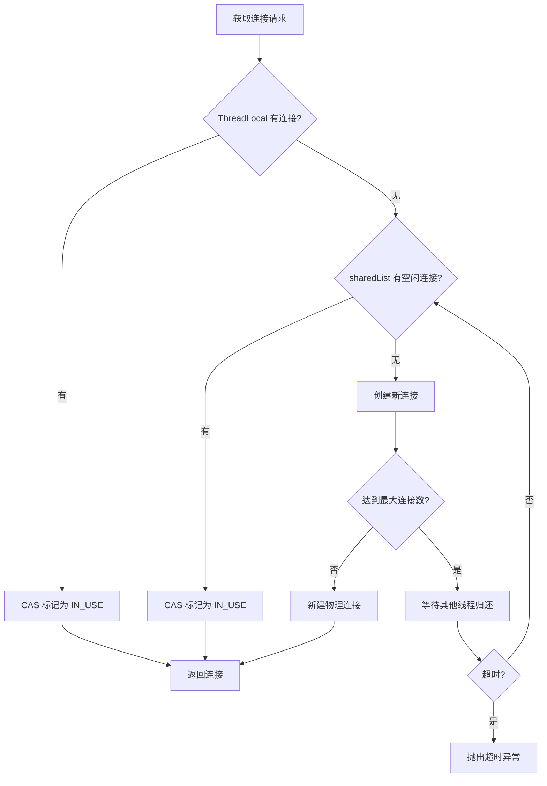

### JdbcTemplate 实践

JdbcTemplate（JDBC 模板）是 Spring 提供的轻量级 JDBC 封装，适合简单的数据库操作场景，无需引入 ORM 框架。

#### 基本使用

```java
// Spring Boot 自动配置 JdbcTemplate
// 只需引入 spring-boot-starter-jdbc 依赖即可
@Service
@RequiredArgsConstructor
public class UserJdbcService {

    private final JdbcTemplate jdbcTemplate;

    // 查询列表
    public List<User> findAll() {
        String sql = "SELECT id, username, email, status FROM t_user WHERE deleted = 0";
        return jdbcTemplate.query(sql, (rs, rowNum) -> {
            User user = new User();
            user.setId(rs.getLong("id"));
            user.setUsername(rs.getString("username"));
            user.setEmail(rs.getString("email"));
            user.setStatus(rs.getInt("status"));
            return user;
        });
    }

    // 查询单条记录
    public User findById(Long id) {
        String sql = "SELECT id, username, email, status FROM t_user WHERE id = ? AND deleted = 0";
        return jdbcTemplate.queryForObject(sql, new UserRowMapper(), id);
    }

    // 查询统计值
    public int countByStatus(Integer status) {
        String sql = "SELECT COUNT(*) FROM t_user WHERE status = ? AND deleted = 0";
        return jdbcTemplate.queryForObject(sql, Integer.class, status);
    }

    // 插入数据
    public int insert(User user) {
        String sql = "INSERT INTO t_user (username, email, status) VALUES (?, ?, ?)";
        return jdbcTemplate.update(sql, user.getUsername(), user.getEmail(), user.getStatus());
    }

    // 插入并获取自增主键
    public Long insertAndGetId(User user) {
        String sql = "INSERT INTO t_user (username, email, status) VALUES (?, ?, ?)";
        KeyHolder keyHolder = new GeneratedKeyHolder();
        jdbcTemplate.update(connection -> {
            PreparedStatement ps = connection.prepareStatement(sql, Statement.RETURN_GENERATED_KEYS);
            ps.setString(1, user.getUsername());
            ps.setString(2, user.getEmail());
            ps.setInt(3, user.getStatus());
            return ps;
        }, keyHolder);
        return keyHolder.getKey().longValue();
    }

    // 更新数据
    public int update(Long id, String email) {
        String sql = "UPDATE t_user SET email = ? WHERE id = ?";
        return jdbcTemplate.update(sql, email, id);
    }

    // 删除数据
    public int deleteById(Long id) {
        String sql = "UPDATE t_user SET deleted = 1 WHERE id = ?";
        return jdbcTemplate.update(sql, id);
    }
}

// RowMapper 实现
public class UserRowMapper implements RowMapper<User> {
    @Override
    public User mapRow(ResultSet rs, int rowNum) throws SQLException {
        User user = new User();
        user.setId(rs.getLong("id"));
        user.setUsername(rs.getString("username"));
        user.setEmail(rs.getString("email"));
        user.setStatus(rs.getInt("status"));
        user.setCreatedAt(rs.getTimestamp("created_at").toLocalDateTime());
        return user;
    }
}
```

#### 批量操作

```java
@Service
@RequiredArgsConstructor
public class BatchJdbcService {

    private final JdbcTemplate jdbcTemplate;

    // 批量插入
    public int[] batchInsert(List<User> users) {
        String sql = "INSERT INTO t_user (username, email, status) VALUES (?, ?, ?)";
        return jdbcTemplate.batchUpdate(sql, new BatchPreparedStatementSetter() {
            @Override
            public void setValues(PreparedStatement ps, int i) throws SQLException {
                User user = users.get(i);
                ps.setString(1, user.getUsername());
                ps.setString(2, user.getEmail());
                ps.setInt(3, user.getStatus());
            }

            @Override
            public int getBatchSize() {
                return users.size();
            }
        });
    }

    // 大批量插入（分片处理，避免内存溢出）
    public void largeBatchInsert(List<User> users) {
        int batchSize = 500;  // 每批 500 条
        jdbcTemplate.batchUpdate(
            "INSERT INTO t_user (username, email, status) VALUES (?, ?, ?)",
            users,  // 直接传入集合
            batchSize,
            (ps, user) -> {
                ps.setString(1, user.getUsername());
                ps.setString(2, user.getEmail());
                ps.setInt(3, user.getStatus());
            }
        );
    }
}
```

::: tip JdbcTemplate vs ORM 的选择
- **JdbcTemplate 适合**：简单 CRUD、报表查询、批量操作、对 SQL 有完全控制需求的场景
- **JPA 适合**：领域模型驱动、复杂对象关系映射、需要自动建表的场景
- **MyBatis-Plus 适合**：SQL 灵活度要求高、团队 SQL 能力强、需要快速 CRUD 的场景
- 实际项目中可以混合使用，但建议统一技术栈，降低维护成本
:::

#### NamedParameterJdbcTemplate

```java
// NamedParameterJdbcTemplate 支持命名参数，可读性更好
@Service
@RequiredArgsConstructor
public class NamedParamJdbcService {

    private final NamedParameterJdbcTemplate namedTemplate;

    // 使用命名参数
    public User findByUsernameAndStatus(String username, Integer status) {
        String sql = "SELECT * FROM t_user WHERE username = :username AND status = :status";
        MapSqlParameterSource params = new MapSqlParameterSource()
            .addValue("username", username)
            .addValue("status", status);
        return namedTemplate.queryForObject(sql, params, new UserRowMapper());
    }

    // 使用 Bean 属性作为参数
    public List<User> findByCondition(UserQueryDTO queryDTO) {
        String sql = "SELECT * FROM t_user WHERE username LIKE :username " +
                     "AND status = :status AND created_at > :startTime";
        // BeanPropertySqlParameterSource 自动从 DTO 中提取属性值
        BeanPropertySqlParameterSource params = new BeanPropertySqlParameterSource(queryDTO);
        return namedTemplate.query(sql, params, new UserRowMapper());
    }

    // IN 查询
    public List<User> findByIds(List<Long> ids) {
        String sql = "SELECT * FROM t_user WHERE id IN (:ids)";
        MapSqlParameterSource params = new MapSqlParameterSource()
            .addValue("ids", ids);  // 自动展开为 ?, ?, ?
        return namedTemplate.query(sql, params, new UserRowMapper());
    }
}
```

### 读写分离方案

读写分离（Read-Write Separation）将写操作路由到主库，读操作路由到从库，是提升数据库并发能力的常用方案。

#### 基于 MyBatis-Plus 的读写分离

```java
// 1. 配置主从数据源
@Configuration
public class MasterSlaveDataSourceConfig {

    @Bean
    @ConfigurationProperties(prefix = "spring.datasource.master")
    public DataSource masterDataSource() {
        return DataSourceBuilder.create().type(HikariDataSource.class).build();
    }

    @Bean
    @ConfigurationProperties(prefix = "spring.datasource.slave")
    public DataSource slaveDataSource() {
        return DataSourceBuilder.create().type(HikariDataSource.class).build();
    }
}

// 2. 使用 dynamic-datasource-spring-boot-starter（推荐）
// 引入依赖
// <dependency>
//     <groupId>com.baomidou</groupId>
//     <artifactId>dynamic-datasource-spring-boot-starter</artifactId>
//     <version>4.3.0</version>
// </dependency>

// application.yml 配置
// spring:
//   datasource:
//     dynamic:
//       primary: master
//       strict: true  # 严格匹配，找不到数据源时报错
//       datasource:
//         master:
//           url: jdbc:mysql://localhost:3306/main_db
//           username: root
//           password: root123
//         slave_1:
//           url: jdbc:mysql://localhost:3307/main_db
//           username: root
//           password: root123
//         slave_2:
//           url: jdbc:mysql://localhost:3308/main_db
//           username: root
//           password: root123
```

```java
// 3. 使用 @DS 注解切换数据源
@Service
@RequiredArgsConstructor
public class UserService {

    private final UserMapper userMapper;

    // 写操作走主库
    @DS("master")
    @Transactional
    public void createUser(User user) {
        userMapper.insert(user);
    }

    // 读操作走从库
    @DS("slave_1")
    public User findById(Long id) {
        return userMapper.selectById(id);
    }

    // 默认走主库（@DS 可以标注在类上作为默认值）
    public List<User> findAll() {
        return userMapper.selectList(null);
    }
}

// 4. 在 Mapper 层标注（更细粒度）
@Mapper
@DS("slave_1")  // 默认走从库
public interface UserMapper extends BaseMapper<User> {

    @DS("master")  // 写操作走主库
    int insert(User user);

    @DS("master")
    int updateById(User user);

    // 继承的方法默认走从库
}
```

#### 自定义 DataSource 实现读写分离

```java
// 自定义读写分离路由数据源
public class ReadWriteSplittingDataSource extends AbstractRoutingDataSource {

    private final DataSource masterDataSource;
    private final List<DataSource> slaveDataSources;
    private final AtomicInteger slaveIndex = new AtomicInteger(0);

    public ReadWriteSplittingDataSource(DataSource masterDataSource,
                                         List<DataSource> slaveDataSources) {
        this.masterDataSource = masterDataSource;
        this.slaveDataSources = slaveDataSources;
        
        Map<Object, Object> targetDataSources = new HashMap<>();
        targetDataSources.put("master", masterDataSource);
        for (int i = 0; i < slaveDataSources.size(); i++) {
            targetDataSources.put("slave_" + i, slaveDataSources.get(i));
        }
        
        this.setTargetDataSources(targetDataSources);
        this.setDefaultTargetDataSource(masterDataSource);
    }

    @Override
    protected Object determineCurrentLookupKey() {
        // 判断当前操作是读还是写
        // 通过 ThreadLocal 中的标记判断
        Boolean readOnly = ReadOnlyContextHolder.isReadOnly();
        if (readOnly != null && readOnly && !slaveDataSources.isEmpty()) {
            // 简单轮询负载均衡
            int index = slaveIndex.getAndIncrement() % slaveDataSources.size();
            return "slave_" + index;
        }
        return "master";
    }
}

// 只读上下文持有者
public class ReadOnlyContextHolder {
    private static final ThreadLocal<Boolean> READ_ONLY = new ThreadLocal<>();

    public static void setReadOnly(boolean readOnly) {
        READ_ONLY.set(readOnly);
    }

    public static Boolean isReadOnly() {
        return READ_ONLY.get();
    }

    public static void clear() {
        READ_ONLY.remove();
    }
}

// AOP 切面自动标记只读
@Aspect
@Component
@Order(Ordered.HIGHEST_PRECEDENCE)
public class ReadOnlyAspect {

    // 所有查询方法标记为只读
    @Before("execution(* com.example..service..find*(..)) || " +
            "execution(* com.example..service..get*(..)) || " +
            "execution(* com.example..service..query*(..)) || " +
            "execution(* com.example..service..list*(..)) || " +
            "execution(* com.example..service..count*(..))")
    public void setReadOnly() {
        ReadOnlyContextHolder.setReadOnly(true);
    }

    @After("execution(* com.example..service..*(..))")
    public void clearReadOnly() {
        ReadOnlyContextHolder.clear();
    }
}
```

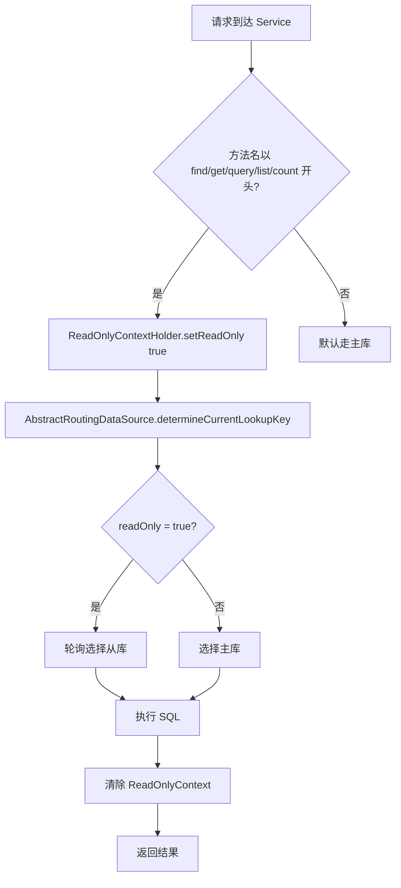

::: warning 读写分离的一致性问题
1. **主从延迟**：主库写入后，从库同步可能有毫秒到秒级延迟。写入后立即读取可能读到旧数据
2. **解决方案**：写入后的读操作强制路由到主库（通过 `@DS("master")` 或在 AOP 中判断）
3. **事务中的读**：事务开启后，所有操作应走主库，避免从库延迟导致数据不一致
4. **从库故障**：需要实现从库健康检查和自动摘除机制
:::

### 慢查询监控

慢查询（Slow Query）是影响数据库性能的常见问题，需要通过监控手段及时发现和优化。

#### Druid 监控

Druid（阿里巴巴开源的数据库连接池）内置了强大的监控功能，包括 SQL 监控、URI 监控、Spring 监控等。

```yaml
## application.yml Druid 配置
spring:
  datasource:
    type: com.alibaba.druid.pool.DruidDataSource
    druid:
      url: jdbc:mysql://localhost:3306/my_db
      username: root
      password: root123
      # 连接池配置
      initial-size: 5
      min-idle: 5
      max-active: 20
      # 监控配置
      stat-view-servlet:
        enabled: true                    # 开启监控页面
        url-pattern: /druid/*            # 访问路径
        reset-enable: false              # 禁止重置统计数据
        login-username: admin            # 登录用户名
        login-password: admin123         # 登录密码
        allow: 127.0.0.1                 # 允许访问的 IP
      web-stat-filter:
        enabled: true                    # 开启 Web 监控
        url-pattern: /*                  # 拦截路径
        exclusions: "*.js,*.gif,*.jpg,*.png,*.css,*.ico,/druid/*"
      # SQL 监控
      filter:
        stat:
          enabled: true                  # 开启 SQL 监控
          slow-sql-millis: 1000          # 慢 SQL 阈值（ms）
          log-slow-sql: true             # 打印慢 SQL 日志
        wall:
          enabled: true                  # 开启 SQL 防火墙
          config:
            multi-statement-allow: false # 禁止多语句
```

```java
// Druid 监控配置类
@Configuration
public class DruidConfig {

    @Bean
    @ConfigurationProperties(prefix = "spring.datasource.druid")
    public DataSource druidDataSource() {
        return new DruidDataSource();
    }

    // 配置 Druid 监控的 Servlet
    @Bean
    public ServletRegistrationBean<StatViewServlet> druidStatViewServlet() {
        ServletRegistrationBean<StatViewServlet> bean =
            new ServletRegistrationBean<>(new StatViewServlet(), "/druid/*");
        bean.addInitParameter("loginUsername", "admin");
        bean.addInitParameter("loginPassword", "admin123");
        bean.addInitParameter("allow", "127.0.0.1");
        return bean;
    }

    // 配置 Druid Web 监控的 Filter
    @Bean
    public FilterRegistrationBean<WebStatFilter> druidWebStatFilter() {
        FilterRegistrationBean<WebStatFilter> bean =
            new FilterRegistrationBean<>(new WebStatFilter());
        bean.addUrlPatterns("/*");
        bean.addInitParameter("exclusions", "*.js,*.gif,*.jpg,*.png,*.css,*.ico,/druid/*");
        return bean;
    }
}
```

::: tip Druid 监控页面功能
访问 `http://localhost:8080/druid/` 可以看到：
1. **SQL 监控**：每条 SQL 的执行次数、耗时、错误数
2. **SQL 防火墙**：拦截危险 SQL（如 DROP TABLE、DELETE 无 WHERE）
3. **URI 监控**：每个接口的 SQL 执行情况
4. **Session 监控**：当前用户的请求统计
5. **Spring 监控**：Spring Bean 的方法调用统计
:::

#### P6Spy SQL 日志

P6Spy 是一个 SQL 日志框架，可以拦截 JDBC 调用并记录完整的 SQL 语句（包含参数值），非常适合开发环境调试。

```xml
<!-- 引入 P6Spy 依赖 -->
<dependency>
    <groupId>p6spy</groupId>
    <artifactId>p6spy</artifactId>
    <version>3.9.1</version>
</dependency>
```

```yaml
## application.yml 配置 P6Spy
spring:
  datasource:
    driver-class-name: com.p6spy.engine.spy.P6SpyDriver  # P6Spy 驱动
    url: jdbc:p6spy:mysql://localhost:3306/my_db?useSSL=false&serverTimezone=Asia/Shanghai
    # 注意 URL 前缀从 jdbc:mysql 改为 jdbc:p6spy:mysql
```

```properties
## spy.properties 配置文件
## 使用自定义日志格式
logMessageFormat=com.p6spy.engine.spy.appender.CustomLineFormat
customLogMessageFormat=执行耗时: %(executionTime)ms | SQL: %(sqlSingleLine)

## 日志输出方式
appender=com.p6spy.engine.spy.appender.StdoutLogger

## 排除的系统表
exclude=QRTZ_,ACT_

## 日期格式
dateformat=yyyy-MM-dd HH:mm:ss

## 检测长时间无响应的 SQL
outagedetection=true
outagedetectioninterval=500   # 单位: 秒
```

::: warning P6Spy 仅限开发环境
P6Spy 会显著降低 SQL 执行性能（约 30%-50%），**绝对不要在生产环境使用**。生产环境应使用数据库自带的慢查询日志（MySQL 的 `slow_query_log`）或 APM 工具（如 SkyWalking）。
:::

#### 自定义 MyBatis 拦截器

```java
// 自定义 SQL 执行耗时拦截器
@Intercepts({
    @Signature(type = StatementHandler.class, method = "query", args = {
        Statement.class, ResultHandler.class
    }),
    @Signature(type = StatementHandler.class, method = "update", args = {
        Statement.class
    })
})
@Component
@Slf4j
public class SqlPerformanceInterceptor implements Interceptor {

    // 慢 SQL 阈值（毫秒）
    @Value("${mybatis.slow-sql-threshold:1000}")
    private long slowSqlThreshold;

    @Override
    public Object intercept(Invocation invocation) throws Throwable {
        long startTime = System.currentTimeMillis();
        
        try {
            // 执行原始方法
            return invocation.proceed();
        } finally {
            long costTime = System.currentTimeMillis() - startTime;
            
            if (costTime > slowSqlThreshold) {
                // 记录慢 SQL
                StatementHandler handler = (StatementHandler) invocation.getTarget();
                BoundSql boundSql = handler.getBoundSql();
                String sql = boundSql.getSql();
                
                log.warn("慢 SQL 耗时: {}ms | SQL: {}", costTime, sql);
                
                // 可以发送到监控系统
                MetricsCollector.recordSlowSql(sql, costTime);
            }
        }
    }
}

// 注册拦截器
@Configuration
public class MybatisPlusConfig {

    @Bean
    public SqlPerformanceInterceptor sqlPerformanceInterceptor() {
        return new SqlPerformanceInterceptor();
    }
}
```

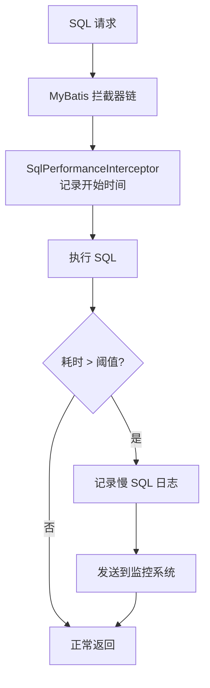

### 实战场景

#### 数据迁移

数据迁移（Data Migration）是系统升级、分库分表等场景中的常见需求。

```java
// 数据迁移服务
@Service
@RequiredArgsConstructor
@Slf4j
public class DataMigrationService {

    private final JdbcTemplate sourceJdbcTemplate;
    private final JdbcTemplate targetJdbcTemplate;

    // 分批迁移数据
    public void migrateUsers(int batchSize) {
        long lastId = 0;
        int totalMigrated = 0;

        while (true) {
            // 从源库分批读取
            String querySql = "SELECT id, username, email, status, created_at " +
                              "FROM t_user WHERE id > ? ORDER BY id LIMIT ?";
            List<Map<String, Object>> batch = sourceJdbcTemplate.queryForList(
                querySql, lastId, batchSize);

            if (batch.isEmpty()) {
                break;  // 迁移完成
            }

            // 写入目标库
            String insertSql = "INSERT INTO t_user (id, username, email, status, created_at) " +
                               "VALUES (?, ?, ?, ?, ?)";
            targetJdbcTemplate.batchUpdate(insertSql, new BatchPreparedStatementSetter() {
                @Override
                public void setValues(PreparedStatement ps, int i) throws SQLException {
                    Map<String, Object> row = batch.get(i);
                    ps.setLong(1, ((Number) row.get("id")).longValue());
                    ps.setString(2, (String) row.get("username"));
                    ps.setString(3, (String) row.get("email"));
                    ps.setInt(4, ((Number) row.get("status")).intValue());
                    ps.setTimestamp(5, (Timestamp) row.get("created_at"));
                }

                @Override
                public int getBatchSize() {
                    return batch.size();
                }
            });

            // 更新游标
            lastId = ((Number) batch.get(batch.size() - 1).get("id")).longValue();
            totalMigrated += batch.size();
            log.info("已迁移 {} 条用户数据，当前游标 ID: {}", totalMigrated, lastId);
        }

        log.info("用户数据迁移完成，共迁移 {} 条", totalMigrated);
    }
}
```

::: tip 数据迁移的最佳实践
1. **分批迁移**：避免一次性加载大量数据导致内存溢出
2. **记录游标**：使用自增 ID 作为游标，支持断点续传
3. **数据校验**：迁移后对比源库和目标库的记录数和关键字段
4. **回滚方案**：迁移前备份目标库，确保可以回滚
5. **增量同步**：全量迁移后，通过 binlog 实时同步增量数据
:::

#### 批量操作优化

```java
@Service
@RequiredArgsConstructor
@Slf4j
public class BatchOperationService {

    private final UserMapper userMapper;
    private final SqlSessionFactory sqlSessionFactory;
    private final UserService userService;

    // × 逐条插入——性能极差
    public void insertOneByOne(List<User> users) {
        users.forEach(userMapper::insert);
        // 逐条发送 SQL，N 条数据 = N 次网络往返
    }

    // √ 方式1：MyBatis-Plus saveBatch
    @Transactional
    public void insertWithSaveBatch(List<User> users) {
        // IService.saveBatch() 内部使用 JDBC batch
        // 默认每 1000 条执行一次 batch
        userService.saveBatch(users, 500);
    }

    // √ 方式2：SqlSession 批量模式
    @Transactional
    public void insertWithSqlSessionBatch(List<User> users) {
        try (SqlSession sqlSession = sqlSessionFactory.openSession(ExecutorType.BATCH)) {
            UserMapper mapper = sqlSession.getMapper(UserMapper.class);
            for (int i = 0; i < users.size(); i++) {
                mapper.insert(users.get(i));
                // 每 500 条 flush 一次
                if (i > 0 && i % 500 == 0) {
                    sqlSession.flushStatements();
                    sqlSession.clearCache();
                }
            }
            sqlSession.flushStatements();  // 最后 flush 剩余的
        }
    }

    // √ 方式3：自定义批量插入 SQL
    @Transactional
    public void insertWithCustomBatchSql(List<User> users) {
        // 拼接多值 INSERT：INSERT INTO t_user (username, email) VALUES (?, ?), (?, ?), ...
        userMapper.batchInsert(users);
    }
}

// Mapper 接口
@Mapper
public interface UserMapper extends BaseMapper<User> {

    // 自定义批量插入
    @Insert({
        "<script>",
        "INSERT INTO t_user (username, email, status) VALUES ",
        "<foreach collection='list' item='item' separator=','>",
        "(#{item.username}, #{item.email}, #{item.status})",
        "</foreach>",
        "</script>"
    })
    int batchInsert(@Param("list") List<User> users);
}
```

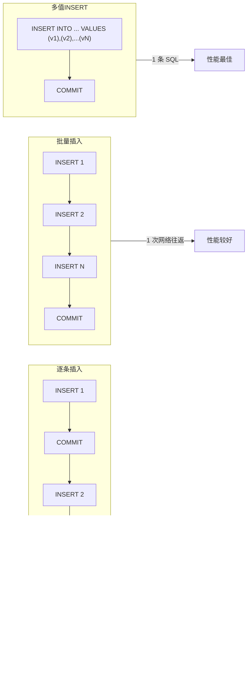

::: danger MySQL 的 max_allowed_packet 限制
多值 INSERT 方式拼接的 SQL 可能很长，超过 MySQL 的 `max_allowed_packet` 限制（默认 4MB）。解决方案：
1. 分批执行，每批 500-1000 条
2. 调大 MySQL 的 `max_allowed_packet` 参数
3. 使用 SqlSession BATCH 模式，由驱动自动分批发送
:::

#### JSON 字段处理

MySQL 5.7+ 支持 JSON 字段类型，MyBatis-Plus 和 JPA 都可以方便地处理 JSON 数据。

```java
// 1. MyBatis-Plus JSON 字段处理
@Data
@TableName(value = "t_product", autoResultMap = true)  // autoResultMap 必须开启
public class Product {
    @TableId
    private Long id;

    private String name;

    // JSON 字段——自动序列化/反序列化
    @TableField(typeHandler = JacksonTypeHandler.class)
    private ProductAttribute attributes;  // 自定义 Java 对象

    // JSON 数组字段
    @TableField(typeHandler = JacksonTypeHandler.class)
    private List<String> tags;
}

// JSON 字段对应的 Java 类
@Data
public class ProductAttribute {
    private String color;
    private String size;
    private Integer weight;
    private Map<String, Object> extra;  // 动态属性
}
```

```java
// 2. JPA JSON 字段处理
@Entity
@Table(name = "t_product")
public class Product {
    @Id
    @GeneratedValue(strategy = GenerationType.IDENTITY)
    private Long id;

    private String name;

    // 使用 @Convert 注解自定义类型转换
    @Column(columnDefinition = "JSON")
    @Convert(converter = ProductAttributeConverter.class)
    private ProductAttribute attributes;
}

// 自定义 JPA AttributeConverter
@Converter(autoApply = false)
public class ProductAttributeConverter
        implements AttributeConverter<ProductAttribute, String> {

    private static final ObjectMapper objectMapper = new ObjectMapper();

    @Override
    public String convertToDatabaseColumn(ProductAttribute attribute) {
        // Java 对象 → JSON 字符串
        try {
            return attribute == null ? null : objectMapper.writeValueAsString(attribute);
        } catch (JsonProcessingException e) {
            throw new RuntimeException("JSON 序列化失败", e);
        }
    }

    @Override
    public ProductAttribute convertToEntityAttribute(String json) {
        // JSON 字符串 → Java 对象
        try {
            return StringUtils.isBlank(json) ? null :
                objectMapper.readValue(json, ProductAttribute.class);
        } catch (JsonProcessingException e) {
            throw new RuntimeException("JSON 反序列化失败", e);
        }
    }
}
```

```java
// 3. JSON 字段查询
// MyBatis-Plus 中查询 JSON 字段
@Service
@RequiredArgsConstructor
public class ProductService {

    private final ProductMapper productMapper;

    // 使用原生 SQL 查询 JSON 字段(JSON_UNQUOTE 去掉引号后才能与普通字符串比较)
    @Select("SELECT * FROM t_product WHERE JSON_UNQUOTE(JSON_EXTRACT(attributes, '$.color')) = #{color}")
    List<Product> findByColor(@Param("color") String color);

    // MySQL 5.7+ 简写语法(->> 等价 JSON_UNQUOTE(JSON_EXTRACT(...));单箭头 -> 返回的 JSON 字符串带引号,直接比较会失配)
    @Select("SELECT * FROM t_product WHERE attributes->>'$.color' = #{color}")
    List<Product> findByColorShort(@Param("color") String color);

    // 查询 JSON 数组是否包含某个值
    @Select("SELECT * FROM t_product WHERE JSON_CONTAINS(tags, CONCAT('\"', #{tag}, '\"'))")
    List<Product> findByTag(@Param("tag") String tag);
}
```

::: warning JSON 字段的查询性能
1. JSON 字段不支持普通索引，查询需要全表扫描
2. MySQL 8.0 支持在 JSON 字段上创建多值索引（Multi-Valued Index），可以优化 `JSON_CONTAINS` 查询
3. 如果需要频繁查询 JSON 中的某个属性，建议将其提取为独立列并建立索引
4. JSON 字段适合存储不常查询但需要灵活结构的半结构化数据
:::

### 面试要点

#### 1. Spring Data JPA 的 findById 和 getReferenceById 有什么区别？

**答案：** `findById()` 立即执行 `em.find()`，从数据库加载数据；`getReferenceById()` 返回延迟加载的代理对象（`em.getReference()`），只有在访问属性时才真正查询。设置外键关联时应该用 `getReferenceById()`，避免不必要的查询。

#### 2. @Transactional 的传播行为有哪些？

**答案：** 7 种传播行为：
- **REQUIRED**（默认）：有事务则加入，没有则新建
- **REQUIRES_NEW**：总是新建独立事务，挂起当前事务
- **NESTED**：在当前事务中创建 savepoint，支持部分回滚
- **SUPPORTS**：有事务则加入，没有则非事务执行
- **NOT_SUPPORTED**：非事务执行，挂起当前事务
- **MANDATORY**：必须在事务中调用，否则抛出异常
- **NEVER**：不能在事务中调用，否则抛出异常

最常用的是 REQUIRED 和 REQUIRES_NEW。NESTED 与 REQUIRES_NEW 的区别在于 NESTED 共享同一个连接，外层回滚时内层也会回滚。

#### 3. @Transactional 失效的场景有哪些？

**答案：** 常见失效场景：
1. 方法非 public——Spring AOP 默认只拦截 public 方法
2. 同类内部调用——`this.method()` 不走代理，事务注解不生效
3. 异常被 catch 吞掉——事务感知不到异常，不会回滚
4. 异常类型不匹配——默认只回滚 RuntimeException，checked Exception 不回滚
5. 数据库引擎不支持事务——如 MySQL MyISAM
6. Bean 未被 Spring 管理——缺少 `@Service` 等注解
7. 传播行为设置错误——如 NOT_SUPPORTED
8. 多线程调用——不同线程使用不同的数据库连接

#### 4. JPA 的 N+1 问题如何解决？

**答案：** N+1 问题是指查询 N 条主记录时，每条记录的关联数据各触发一次查询。解决方案：
1. **JOIN FETCH**：在 JPQL 中使用 `LEFT JOIN FETCH` 一次性加载关联数据
2. **@EntityGraph**：声明式指定要加载的关联属性，无需修改 JPQL
3. **@NamedEntityGraph**：在实体上定义加载图，Repository 中引用
4. **关闭 OSIV**：在 Service 层完成所有数据加载，避免 Controller 层触发延迟加载
5. **批量加载**：配置 `hibernate.default_batch_fetch_size`，将 N+1 优化为 N/batchSize+1

#### 5. HikariCP 为什么比其他连接池快？

**答案：** HikariCP 的性能优势来自：
1. **ConcurrentBag 无锁设计**：使用 ThreadLocal 缓存 + CAS 替代锁，减少线程竞争
2. **FastList 替代 ArrayList**：避免 `iterator()` 创建对象，使用 `get(index)` 直接访问
3. **极简代理**：ProxyConnection 只拦截 `close()` 方法，其他方法直接委托给真实连接
4. **主动检测连接泄漏**：`leakDetectionThreshold` 参数可以检测连接未归还的情况
5. **快速验证**：使用 `Connection.isValid()` 替代执行 `SELECT 1` 验证连接

#### 6. MyBatis-Plus 的插件执行顺序有什么讲究？

**答案：** MyBatis-Plus 的 InnerInterceptor 按添加顺序执行，顺序很重要：
1. **多租户插件**必须放在最前面，确保所有 SQL 都追加租户条件
2. **动态表名插件**也需要靠前
3. **分页插件**放在中间
4. **乐观锁插件**放在后面
5. **防全表更新插件**放在最后作为安全兜底

如果顺序错误，可能导致分页的 count 查询缺少租户条件，或者乐观锁的 version 条件被分页插件截断。

#### 7. 如何实现动态数据源切换？

**答案：** 核心思路是继承 `AbstractRoutingDataSource`，重写 `determineCurrentLookupKey()` 方法，根据 ThreadLocal 中的标识返回对应的数据源 key。配合自定义注解 `@DataSource` 和 AOP 切面，在方法执行前设置 ThreadLocal，执行后清除。需要注意：
1. 数据源切换必须在事务开启之前完成（`@Order` 优先级高于事务切面）
2. 不同数据源的事务无法合并，需要分布式事务方案
3. 推荐使用 `dynamic-datasource-spring-boot-starter` 简化配置

#### 8. 读写分离如何保证数据一致性？

**答案：** 读写分离面临的核心问题是主从复制延迟：
1. **强制主库读**：写入后的读操作路由到主库，通过 ThreadLocal 标记"刚写入过"
2. **事务内走主库**：事务开启后所有操作走主库，避免从库延迟导致不一致
3. **半同步复制**：MySQL 配置半同步复制，主库写入后等待至少一个从库确认
4. **中间件方案**：使用 ShardingSphere 等中间件自动处理主从路由和一致性
5. **业务层妥协**：对一致性要求不高的场景允许短暂不一致，通过缓存失效策略缓解

#### 9. JPA Entity 的四种生命周期状态是什么？

**答案：** JPA 实体有四种生命周期状态：
1. **New（新建/瞬态）**：刚 `new` 出来的对象，没有主键，不在持久化上下文中
2. **Managed（托管/持久态）**：通过 `em.persist()` 或 `em.find()` 进入持久化上下文，属性变更会自动同步到数据库（dirty checking）
3. **Detached（游离/脱管态）**：脱离持久化上下文的对象（`em.detach()`、`em.clear()`、事务提交后），属性变更不会同步
4. **Removed（删除态）**：通过 `em.remove()` 标记为删除，flush 时执行 DELETE

理解生命周期对于正确使用 `persist()` vs `merge()`、避免 detached entity 错误至关重要。

#### 10. 如何优化批量插入的性能？

**答案：** 批量插入的性能优化方案（从差到优）：
1. **逐条 insert**：最差，每条 SQL 一次网络往返
2. **MyBatis-Plus saveBatch**：使用 JDBC batch，每 1000 条 flush 一次
3. **SqlSession BATCH 模式**：手动控制 flush 时机，更灵活
4. **多值 INSERT**：`INSERT INTO ... VALUES (v1),(v2),...` 一条 SQL 插入多行，性能最佳
5. **LOAD DATA INFILE**：MySQL 专有，从文件批量加载，适合超大数据量

关键配置：MySQL 连接 URL 添加 `rewriteBatchedStatements=true`，让 JDBC 驱动将 batch 语句重写为多值 INSERT。

>  相关文档：[21-自动配置与Starter机制](21-自动配置与Starter机制.md) · [23-Bean生命周期与循环依赖源码](23-Bean生命周期与循环依赖源码.md) · [07-性能优化](07-性能优化.md)


## 声明式事务

### 声明式事务：生效原理

前面我们已经完整的解析了AOP的核心创建和作用机制，以及代理对象的执行原理。接下来咱来看 SpringFramework 中最经典的AOP实例：事务控制。

#### 1. 编写测试Demo来测试事务

编写一个普通的 Service 来简单构造一个事务场景。

```java
@Service
public class DemoService {

@Transactional(rollbackFor = Exception.class)
    public void test1() {
        System.out.println("test1 run...");
        int i = 1 / 0;
        System.out.println("test1 finish...");
    }

}
```

在启动类上标注 `@EnableTransactionManagement` 注解来开启注解事务。

```java
@EnableTransactionManagement
@SpringBootApplication
public class DemoApplication {

public static void main(String[] args) {
        ConfigurableApplicationContext ctx = SpringApplication.run(DemoApplication.class, args);
        DemoService demoService = ctx.getBean(DemoService.class);
        demoService.test1();
    }

}
```

运行主启动类，发现控制台没有打印 `test1 finish...` ，并输出异常信息。

```text
test1 run...
Exception in thread "main" java.lang.ArithmeticException: / by zero
	at com.example.demo.service.DemoService.test1(DemoService.java:12)
	at com.example.demo.service.DemoService?FastClassBySpringCGLIB?203c87bf.invoke(<generated>)
```

并且从控制台的异常信息栈中发现了**cglib**的身影，因为编写的 Service 没有接口，使用**cglib**创建的代理对象。

接下来咱来开始分析注解声明式事务的生效原理。

#### 2. @EnableTransactionManagement

```java
@Import(TransactionManagementConfigurationSelector.class)
public @interface EnableTransactionManagement {
	boolean proxyTargetClass() default false;

AdviceMode mode() default AdviceMode.PROXY;

	int order() default Ordered.LOWEST_PRECEDENCE;
}
```

注解内部的定义咱暂且不关心，只记住默认使用 **PROXY** - 代理方式来增强代码即可。

`@EnableTransactionManagement` 注解上面声明了 `@Import` ，它导了一个Selector：`TransactionManagementConfigurationSelector` 。

#### 3. TransactionManagementConfigurationSelector

咱已经很清楚， `ImportSelector` 的作用是筛选组件，返回组件的全限定类名，让IOC容器来创建这些组件。

```java
public class TransactionManagementConfigurationSelector extends AdviceModeImportSelector<EnableTransactionManagement> {

@Override
	protected String[] selectImports(AdviceMode adviceMode) {
		switch (adviceMode) {
			case PROXY:
				return new String[] {AutoProxyRegistrar.class.getName(), ProxyTransactionManagementConfiguration.class.getName()};
			case ASPECTJ:
				return new String[] {TransactionManagementConfigUtils.TRANSACTION_ASPECT_CONFIGURATION_CLASS_NAME};
			default:
				return null;
		}
	}

}
```

`@EnableTransactionManagement` 注解默认使用 `PROXY` 来增强事务，那这个switch结构中就应该返回两个类的全限定类名：`AutoProxyRegistrar` 、`ProxyTransactionManagementConfiguration` ，可以看得出来，声明式事务最终起作用是上述两个组件的功能。下面咱分别来看这两个类。

#### 4. AutoProxyRegistrar

```java
public class AutoProxyRegistrar implements ImportBeanDefinitionRegistrar {
    public void registerBeanDefinitions(AnnotationMetadata importingClassMetadata, BeanDefinitionRegistry registry) {
        boolean candidateFound = false;
        Set<String> annoTypes = importingClassMetadata.getAnnotationTypes();
        for (String annoType : annoTypes) {
            AnnotationAttributes candidate = AnnotationConfigUtils.attributesFor(importingClassMetadata, annoType);
            if (candidate == null) {
                continue;
            }
            Object mode = candidate.get("mode");
            Object proxyTargetClass = candidate.get("proxyTargetClass");
            if (mode != null && proxyTargetClass != null && AdviceMode.class == mode.getClass() &&
                    Boolean.class == proxyTargetClass.getClass()) {
                candidateFound = true;
                // PROXY模式下会额外注册Bean
                if (mode == AdviceMode.PROXY) {
                    AopConfigUtils.registerAutoProxyCreatorIfNecessary(registry);
                    if ((Boolean) proxyTargetClass) {
                        AopConfigUtils.forceAutoProxyCreatorToUseClassProxying(registry);
                        return;
                    }
                }
            }
        }
        if (!candidateFound) {
            String name = getClass().getSimpleName();
            // logger......
        }
    }

}
```

它又实现了 `ImportBeanDefinitionRegistrar` ，又是手动向IOC容器中导入组件。

注意中间部分的一个if判断（已用注释标明）：如果 `@EnableTransactionManagement` 注解中设置 `adviceMode` 为 `PROXY` （默认`PROXY`），则会利用 `AopUtils` 创建组件，并且如果 `@EnableTransactionManagement` 设置 `proxyTargetClass` 为true，则还会额外导入组件（默认为false）。下面咱看看它又向容器里注册了什么组件。

##### 4.1 AopUtils.registerAutoProxyCreatorIfNecessary

```java
public static BeanDefinition registerAutoProxyCreatorIfNecessary(BeanDefinitionRegistry registry) {
    return registerAutoProxyCreatorIfNecessary(registry, null);
}

public static BeanDefinition registerAutoProxyCreatorIfNecessary(BeanDefinitionRegistry registry,
        @Nullable Object source) {
    return registerOrEscalateApcAsRequired(InfrastructureAdvisorAutoProxyCreator.class, registry, source);
}

@Nullable
private static BeanDefinition registerOrEscalateApcAsRequired(Class<?> cls, BeanDefinitionRegistry registry,
        @Nullable Object source) {

Assert.notNull(registry, "BeanDefinitionRegistry must not be null");

if (registry.containsBeanDefinition(AUTO_PROXY_CREATOR_BEAN_NAME)) {
        BeanDefinition apcDefinition = registry.getBeanDefinition(AUTO_PROXY_CREATOR_BEAN_NAME);
        if (!cls.getName().equals(apcDefinition.getBeanClassName())) {
            int currentPriority = findPriorityForClass(apcDefinition.getBeanClassName());
            int requiredPriority = findPriorityForClass(cls);
            if (currentPriority < requiredPriority) {
                apcDefinition.setBeanClassName(cls.getName());
            }
        }
        return null;
    }

    RootBeanDefinition beanDefinition = new RootBeanDefinition(cls);
    beanDefinition.setSource(source);
    beanDefinition.getPropertyValues().add("order", Ordered.HIGHEST_PRECEDENCE);
    beanDefinition.setRole(BeanDefinition.ROLE_INFRASTRUCTURE);
    registry.registerBeanDefinition(AUTO_PROXY_CREATOR_BEAN_NAME, beanDefinition);
    return beanDefinition;
}
```

从上面的方法一级一级向下执行，最终来到 `registerOrEscalateApcAsRequired` 方法（注意在第二层方法中传入了一个 `InfrastructureAdvisorAutoProxyCreator.class` （基础增强器自动代理创建器），可能下面就是注册这个类型的组件）。

（仔细观察一下，这种类名的命名风格分明就是AOP组件的命名诶。先保留这个疑问，继续往下看）

先看看它传的这个 `InfrastructureAdvisorAutoProxyCreator` 类是什么东西吧：

###### 4.1.1 InfrastructureAdvisorAutoProxyCreator

文档注释原文翻译：

> Auto-proxy creator that considers infrastructure Advisor beans only, ignoring any application-defined Advisors.自动代理创建器，仅考虑基础结构Advisor类型的Bean，而忽略任何应用程序定义的Advisor。

注释解释的不是很清楚，咱再看看这个类的继承结构：

```java
public class InfrastructureAdvisorAutoProxyCreator extends AbstractAdvisorAutoProxyCreator
public abstract class AbstractAdvisorAutoProxyCreator extends AbstractAutoProxyCreator
public abstract class AbstractAutoProxyCreator extends ProxyProcessorSupport
		implements SmartInstantiationAwareBeanPostProcessor, BeanFactoryAware
```

可以发现它也是个后置处理器，并且是在Bean创建前后执行的后置处理器（`InstantiationAwareBeanPostProcessor`），而且它来自 `spring-aop` 包。那既然是这样，它与之前AOP部分咱看到的思路就完全一致了（该类/父类中一定会有寻找增强器、过滤增强器，最终生成代理包装Bean为代理对象的方法）。

回到上面的 `AopUtils` 类，`registerAutoProxyCreatorIfNecessary` 方法注册了一个 `InfrastructureAdvisorAutoProxyCreator` ，跟之前咱在AOP部分看到的 `@EnableAspectJAutoProxy` 注解注册的 `AnnotationAwareAspectJAutoProxyCreator` 几乎完全一致了，那下面的方法也不用看了，思路真的完全一致。

#### 5. ProxyTransactionManagementConfiguration

注意这个配置类还继承了父类，父类的配置也会被加载。

```java
@Configuration
public class ProxyTransactionManagementConfiguration extends AbstractTransactionManagementConfiguration {

@Bean(name = TransactionManagementConfigUtils.TRANSACTION_ADVISOR_BEAN_NAME)
	@Role(BeanDefinition.ROLE_INFRASTRUCTURE)
	public BeanFactoryTransactionAttributeSourceAdvisor transactionAdvisor() {
		BeanFactoryTransactionAttributeSourceAdvisor advisor = new BeanFactoryTransactionAttributeSourceAdvisor();
		advisor.setTransactionAttributeSource(transactionAttributeSource());
		advisor.setAdvice(transactionInterceptor());
		if (this.enableTx != null) {
			advisor.setOrder(this.enableTx.<Integer>getNumber("order"));
		}
		return advisor;
	}

@Bean
	@Role(BeanDefinition.ROLE_INFRASTRUCTURE)
	public TransactionAttributeSource transactionAttributeSource() {
		return new AnnotationTransactionAttributeSource();
	}

@Bean
	@Role(BeanDefinition.ROLE_INFRASTRUCTURE)
	public TransactionInterceptor transactionInterceptor() {
		TransactionInterceptor interceptor = new TransactionInterceptor();
		interceptor.setTransactionAttributeSource(transactionAttributeSource());
		if (this.txManager != null) {
			interceptor.setTransactionManager(this.txManager);
		}
		return interceptor;
	}

}
```

很明显它向IOC容器中注册了3个Bean。一个一个来看：

##### 5.1 transactionAdvisor：事务增强器

`BeanFactoryTransactionAttributeSourceAdvisor` 的文档注释原文翻译：

> Advisor driven by a TransactionAttributeSource, used to include a transaction advice bean for methods that are transactional.由 TransactionAttributeSource 驱动的增强器，用于为开启事务的Bean的方法附加事务通知。

文档注释大概是描述是它给业务方法增强事务通知，咱先放一边。注意看这个类名的最后：**Advisor** ，它是一个增强器！

看一眼这个类的继承和一些成员：

```java
public class BeanFactoryTransactionAttributeSourceAdvisor extends AbstractBeanFactoryPointcutAdvisor {

@Nullable
	private TransactionAttributeSource transactionAttributeSource;

	private final TransactionAttributeSourcePointcut pointcut = new TransactionAttributeSourcePointcut() {
		@Override
		@Nullable
		protected TransactionAttributeSource getTransactionAttributeSource() {
			return transactionAttributeSource;
		}
	};
```

从这部分源码中可以得知非常关键的点：它是**利用切入点来增强方法** （源码中看到了**pointcut**）。源码中的**pointcut**属性的创建又要借助 `TransactionAttributeSource` 。这部分依赖关系如下：

`Advisor → → →依赖→ → → Pointcut → → →依赖→ → → Source`

###### 5.1.1 TransactionAttributeSourcePointcut

通过前面AOP部分的阅读，咱也知道，所有的切入点类都会实现 `Pointcut` 接口，`TransactionAttributeSourcePointcut` 的类继承和部分源码：

```java
abstract class TransactionAttributeSourcePointcut extends StaticMethodMatcherPointcut implements Serializable {

	@Override
	public boolean matches(Method method, Class<?> targetClass) {
		if (TransactionalProxy.class.isAssignableFrom(targetClass) ||
				PlatformTransactionManager.class.isAssignableFrom(targetClass) ||
				PersistenceExceptionTranslator.class.isAssignableFrom(targetClass)) {
			return false;
		}
		TransactionAttributeSource tas = getTransactionAttributeSource();
		return (tas == null || tas.getTransactionAttribute(method, targetClass) != null);
	}
```

它实现了 `ClassFilter` 接口（`matches` 是重写的方法，源码不再展开）， `matches` 方法有两部分判断逻辑：是否为 `TransactionalProxy` 、`PlatformTransactionManager` 、`PersistenceExceptionTranslator` 的实现类，以及让 `TransactionAttributeSource` 获取事务属性看是否为空。前半部分好理解，后半部分需要借助 `TransactionAttributeSource` 来判断，正好配置类中事务增强器的下边就要创建一个 `AnnotationTransactionAttributeSource` ，那咱就继续往下看。

##### 5.2 AnnotationTransactionAttributeSource：注解事务配置源

```java
@Bean
@Role(BeanDefinition.ROLE_INFRASTRUCTURE)
public TransactionAttributeSource transactionAttributeSource() {
    return new AnnotationTransactionAttributeSource();
}
```

创建出来的只是一个普通的 `AnnotationTransactionAttributeSource` 而已，它的文档注释原文翻译：

> Implementation of the org.springframework.transaction.interceptor.TransactionAttributeSource interface for working with transaction metadata in JDK 1.5+ annotation format. This class reads Spring's JDK 1.5+ Transactional annotation and exposes corresponding transaction attributes to Spring's transaction infrastructure. Also supports JTA 1.2's javax.transaction.Transactional and EJB3's javax.ejb.TransactionAttribute annotation (if present). This class may also serve as base class for a custom TransactionAttributeSource, or get customized through TransactionAnnotationParser strategies.org.springframework.transaction.interceptor.TransactionAttributeSource接口的实现，用于处理JDK 1.5+注释格式的事务元数据。此类读取Spring的 @Transactional 注解，并将相应的事务属性公开给Spring的事务基础结构。此外，还支持JTA 1.2的 javax.transaction.Transactional 和EJB3的 javax.ejb.TransactionAttribute 注解（如果存在）。此类也可用作自定义 TransactionAttributeSource 的基类，或通过 TransactionAnnotationParser 策略进行自定义。

说了这么多，我们只关心一句话：它读取 `@Transactional` 注解。由此可见 `AnnotationTransactionAttributeSource` 是读取 `@Transactional` 注解的。

上面的Bean在创建时直接调了构造方法，这个构造方法咱还是要看一下的：

```java
public AnnotationTransactionAttributeSource() {
    this(true);
}

public AnnotationTransactionAttributeSource(boolean publicMethodsOnly) {
    this.publicMethodsOnly = publicMethodsOnly;
    this.annotationParsers = new LinkedHashSet<>(2);
    this.annotationParsers.add(new SpringTransactionAnnotationParser());
    if (jta12Present) {
        this.annotationParsers.add(new JtaTransactionAnnotationParser());
    }
    if (ejb3Present) {
        this.annotationParsers.add(new Ejb3TransactionAnnotationParser());
    }
}
```

注意下面重载的构造方法中，它给 `annotationParsers` 中添加了一个 `SpringTransactionAnnotationParser` 。

###### 5.2.1 SpringTransactionAnnotationParser

```java
public class SpringTransactionAnnotationParser implements TransactionAnnotationParser, Serializable {

@Override
    @Nullable
    public TransactionAttribute parseTransactionAnnotation(AnnotatedElement ae) {
        // 搜索被标注的元素（类、方法）上是否最终标注了@Transactional注解
        AnnotationAttributes attributes = AnnotatedElementUtils.findMergedAnnotationAttributes(
                ae, Transactional.class, false, false);
        if (attributes != null) {
            return parseTransactionAnnotation(attributes);
        }
        else {
            return null;
        }
    }

public TransactionAttribute parseTransactionAnnotation(Transactional ann) {
        return parseTransactionAnnotation(AnnotationUtils.getAnnotationAttributes(ann, false, false));
    }

    protected TransactionAttribute parseTransactionAnnotation(AnnotationAttributes attributes) {
        RuleBasedTransactionAttribute rbta = new RuleBasedTransactionAttribute();
        // 解析事务传播行为
        Propagation propagation = attributes.getEnum("propagation");
        rbta.setPropagationBehavior(propagation.value());
        // 解析事务隔离级别
        Isolation isolation = attributes.getEnum("isolation");
        rbta.setIsolationLevel(isolation.value());
        // 解析超时
        rbta.setTimeout(attributes.getNumber("timeout").intValue());
        // 解析只读事务
        rbta.setReadOnly(attributes.getBoolean("readOnly"));
        rbta.setQualifier(attributes.getString("value"));
        ArrayList<RollbackRuleAttribute> rollBackRules = new ArrayList<>();
        // 解析回滚异常
        Class<?>[] rbf = attributes.getClassArray("rollbackFor");
        for (Class<?> rbRule : rbf) {
            RollbackRuleAttribute rule = new RollbackRuleAttribute(rbRule);
            rollBackRules.add(rule);
        }
        String[] rbfc = attributes.getStringArray("rollbackForClassName");
        for (String rbRule : rbfc) {
            RollbackRuleAttribute rule = new RollbackRuleAttribute(rbRule);
            rollBackRules.add(rule);
        }
        // 解析不回滚异常的“白名单”
        Class<?>[] nrbf = attributes.getClassArray("noRollbackFor");
        for (Class<?> rbRule : nrbf) {
            NoRollbackRuleAttribute rule = new NoRollbackRuleAttribute(rbRule);
            rollBackRules.add(rule);
        }
        String[] nrbfc = attributes.getStringArray("noRollbackForClassName");
        for (String rbRule : nrbfc) {
            NoRollbackRuleAttribute rule = new NoRollbackRuleAttribute(rbRule);
            rollBackRules.add(rule);
        }
        rbta.getRollbackRules().addAll(rollBackRules);
        return rbta;
    }
}
```

这里面的核心方法如上述源码，可以发现它的核心功能是**解析 `@Transactional` 注解的信息**！

至此上面的配置类中需要的事务增强器、事务切入点、事务配置源、事务注解解析器都解析完，回到配置类中，还有一个拦截器：

##### 5.3 TransactionInterceptor

```java
@Bean
@Role(BeanDefinition.ROLE_INFRASTRUCTURE)
public TransactionInterceptor transactionInterceptor() {
    TransactionInterceptor interceptor = new TransactionInterceptor();
    interceptor.setTransactionAttributeSource(transactionAttributeSource());
    if (this.txManager != null) {
        interceptor.setTransactionManager(this.txManager);
    }
    return interceptor;
}
```

在Bean的创建过程中，它也把事务配置源保存起来了，并且还注入了事务管理器。而 `TransactionInterceptor` 本身的类定义：

```java
public class TransactionInterceptor extends TransactionAspectSupport implements MethodInterceptor, Serializable
```

发现它实现了 `MethodInterceptor` ！它也是一个AOP的增强器。那它的核心作用大概率就是控制事务咯？咱先不着急，它的工作原理咱到下一篇再看，本篇先把需要配置的组件都解析完。

`ProxyTransactionManagementConfiguration` 的配置读完之后，别忘了它还继承了一个父类，下面咱看看这个父类里都干了什么：

#### 6. AbstractTransactionManagementConfiguration的配置

```java
@Configuration
public abstract class AbstractTransactionManagementConfiguration implements ImportAware {

@Nullable
    protected AnnotationAttributes enableTx;

@Nullable
    protected PlatformTransactionManager txManager;

@Override
    public void setImportMetadata(AnnotationMetadata importMetadata) {
        this.enableTx = AnnotationAttributes.fromMap(
                importMetadata.getAnnotationAttributes(EnableTransactionManagement.class.getName(), false));
        if (this.enableTx == null) {
            throw new IllegalArgumentException(
                    "@EnableTransactionManagement is not present on importing class " + importMetadata.getClassName());
        }
    }

@Autowired(required = false)
    void setConfigurers(Collection<TransactionManagementConfigurer> configurers) {
        if (CollectionUtils.isEmpty(configurers)) {
            return;
        }
        if (configurers.size() > 1) {
            throw new IllegalStateException("Only one TransactionManagementConfigurer may exist");
        }
        TransactionManagementConfigurer configurer = configurers.iterator().next();
        this.txManager = configurer.annotationDrivenTransactionManager();
    }

@Bean(name = TransactionManagementConfigUtils.TRANSACTIONAL_EVENT_LISTENER_FACTORY_BEAN_NAME)
    @Role(BeanDefinition.ROLE_INFRASTRUCTURE)
    public static TransactionalEventListenerFactory transactionalEventListenerFactory() {
        return new TransactionalEventListenerFactory();
    }

}
```

可以发现在最底下它又创建了一个组件，类型是 `TransactionalEventListenerFactory` 。

##### 6.1 TransactionalEventListenerFactory

它的文档注释原文翻译：

> EventListenerFactory implementation that handles TransactionalEventListener annotated methods.EventListenerFactory的实现类，用于处理带有 @TransactionalEventListener 注解的方法。

发现它又提到了一个注解：`@TransactionalEventListener` ，实际上 `TransactionalEventListenerFactory` 这个组件是做事务监听机制的。

【如果小伙伴还不是很了解 `@TransactionalEventListener` ，请继续往下看，熟悉的小伙伴请跳过6.1节】

###### 6.1.1 【扩展】@TransactionalEventListener

自 SpringFramework4.2 之后，出现了一种能在事务动作发生前后注入监听器的机制。

举几个应用场景的例子：

- 执行完数据库操作后发送消息
- 执行数据库操作之前记录日志
- 业务逻辑出错时事务回滚之后发邮件警报

类似于这种事务动作执行前后进行附加操作的问题，在SpringFramework4.2之后就可以通过 `@TransactionalEventListener` 注解来实现。

`@TransactionalEventListener` 可提供4种监听时机，来执行附加操作：

- BEFORE_COMMIT：提交之前
- AFTER_COMMIT：提交之后
- AFTER_ROLLBACK：回滚之后
- AFTER_COMPLETION：事务完成之后

###### 6.1.2 @TransactionalEventListener的使用方式简单Demo

```java
@Service
public class DemoService {

@Autowired
    private UserDao userDao;

@Autowired
    private ApplicationEventPublisher applicationEventPublisher;

@Transactional(rollbackFor = Exception.class)
    public void test() {
        // 执行清空用户的数据库操作
        userDao.deleteAll();

// 使用事件广播器来广播 用户清除事件
        applicationEventPublisher.publishEvent(new UserCleanEvent());
    }
}

@Component
class MyTransactionListener {

@TransactionalEventListener(phase = TransactionPhase.AFTER_COMMIT)
    private void onTestEvent(UserCleanEvent event) {
        System.out.println("UserCleanEvent detected ......");
    }

}

// 定义 用户清除事件，它需要继承ApplicationEvent
class UserCleanEvent extends ApplicationEvent {

}
```

#### 小结

1. Spring的注解事务底层是借助AOP的机制，创建了一个 `InfrastructureAdvisorAutoProxyCreator` 组件来创建代理对象。
2. 注解事务要想生效，需要**事务增强器、事务切入点解析器、事务配置源、事务拦截器**等组件。

### 声明式事务：工作原理

上一篇咱看到 `TransactionInterceptor` 的本质是一个 `MethodInterceptor` ，这一篇咱来展开看看 `TransactionInterceptor` 是如何控制事务流程的。

#### 0. 测试Demo

```java
@Service
public class DemoService {

@Transactional(rollbackFor = Exception.class)
    public void test1() {
        System.out.println("test1 run...");
        int i = 1 / 0;
        System.out.println("test1 finish...");
    }

}
```

被 `@Transactional` 标注的注解所在类，在IOC容器初始化时被动态代理为一个代理对象。由于上面定义的Service是类，其代理方式为**cglib**代理。故加事务的方法在执行时首先被调用的方法是：`intercept` 。

下面将以Debug步骤来逐步观察和分析事务控制流程。

#### 1. intercept

```java
public Object intercept(Object proxy, Method method, Object[] args, MethodProxy methodProxy) throws Throwable {
    // ......
    try {
        // ......
        List<Object> chain = this.advised.getInterceptorsAndDynamicInterceptionAdvice(method, targetClass);
        Object retVal;
        // ......
            retVal = new CglibMethodInvocation(proxy, target, method, args, targetClass, chain, methodProxy).proceed();
        // ......
}
```

整个方法在之前的AOP部分分析过了，关键的步骤是上述源码中的两步：获取拦截器调用链，执行代理+目标方法的调用。

第一步获取拦截器链的内容过程咱就不看了，前面AOP部分已经分析过了，咱看下返回的拦截器都有什么：

只有一个拦截器，而且恰好是上一篇分析的 `TransactionInterceptor` 。

下面进入proceed方法。

#### 2. proceed

```java
public Object proceed() throws Throwable {
    //  We start with an index of -1 and increment early.
    if (this.currentInterceptorIndex == this.interceptorsAndDynamicMethodMatchers.size() - 1) {
        return invokeJoinpoint();
    }

    Object interceptorOrInterceptionAdvice =
            this.interceptorsAndDynamicMethodMatchers.get(++this.currentInterceptorIndex);
    if (interceptorOrInterceptionAdvice instanceof InterceptorAndDynamicMethodMatcher) {
        // ......
    }
    else {
        // It's an interceptor, so we just invoke it: The pointcut will have
        // been evaluated statically before this object was constructed.
        return ((MethodInterceptor) interceptorOrInterceptionAdvice).invoke(this);
    }
}
```

第一次进入 `proceed` 方法，由于此时 `-1 ≠ (1 - 1)` ，第一个if结构不进入。

自然进入下面的拦截器执行部分， `TransactionInterceptor` 不属于 `InterceptorAndDynamicMethodMatcher` ，自然走下面的else结构，执行 `invoke` 方法。

#### 3. invoke

来到 `TransactionInterceptor` ：

```java
public Object invoke(MethodInvocation invocation) throws Throwable {
    // Work out the target class: may be null.
    // The TransactionAttributeSource should be passed the target class
    // as well as the method, which may be from an interface.
    Class<?> targetClass = (invocation.getThis() != null ? AopUtils.getTargetClass(invocation.getThis()) : null);

    // Adapt to TransactionAspectSupport's invokeWithinTransaction...
    return invokeWithinTransaction(invocation.getMethod(), targetClass, invocation::proceed);
}
```

首先做一次目标方法执行的空校验，`AopUtils.getTargetClass()` 是为了获取被代理的目标类，之后执行 `invokeWithinTransaction` 方法，套用事务。

#### 4. invokeWithinTransaction

该方法在父类 `TransactionAspectSupport` 中定义。

```java
protected Object invokeWithinTransaction(Method method, @Nullable Class<?> targetClass,
        final InvocationCallback invocation) throws Throwable {

// If the transaction attribute is null, the method is non-transactional.
    TransactionAttributeSource tas = getTransactionAttributeSource();
    // 获取@Transactional的属性配置
    final TransactionAttribute txAttr = (tas != null ? tas.getTransactionAttribute(method, targetClass) : null);
    // 获取事务管理器（IOC容器中获取）
    final PlatformTransactionManager tm = determineTransactionManager(txAttr);
    final String joinpointIdentification = methodIdentification(method, targetClass, txAttr);

if (txAttr == null || !(tm instanceof CallbackPreferringPlatformTransactionManager)) {
        // Standard transaction demarcation with getTransaction and commit/rollback calls.
        // 创建事务
        TransactionInfo txInfo = createTransactionIfNecessary(tm, txAttr, joinpointIdentification);

Object retVal;
        try {
            // This is an around advice: Invoke the next interceptor in the chain.
            // This will normally result in a target object being invoked.
            retVal = invocation.proceedWithInvocation();
        }
        catch (Throwable ex) {
            // target invocation exception
            // 回滚事务
            completeTransactionAfterThrowing(txInfo, ex);
            throw ex;
        }
        finally {
            cleanupTransactionInfo(txInfo);
        }
        // 提交事务
        commitTransactionAfterReturning(txInfo);
        return retVal;
    }

    else {
        // 与上面相似，省略。。。
    }
}
```

由源码可以很明显看出来，它使用的是**环绕通知**。

下面的 `try-catch-finally` 中，可以发现方法正常执行后，没有问题，会在finally块下面执行 `commitTransactionAfterReturning` 方法来提交事务，出现异常时会进入catch块，执行 `completeTransactionAfterThrowing` 方法来回滚事务。

下面根据不同情况来分别Debug看效果。

##### 4.1 成功提交事务

将DemoService的test方法中去掉除零运算，Debug运行之后一切正常，try块没有抛出异常，进入下面的 `commitTransactionAfterReturning` 方法：

```java
        try {
            retVal = invocation.proceedWithInvocation();
        }
        // ......
        // 提交事务
        commitTransactionAfterReturning(txInfo);
        return retVal;
    }
```

准备进入 `commitTransactionAfterReturning` 方法时的Debug状态：

下面进入 `commitTransactionAfterReturning` 方法：

###### 4.1.1 commitTransactionAfterReturning

```java
protected void commitTransactionAfterReturning(@Nullable TransactionInfo txInfo) {
    if (txInfo != null && txInfo.getTransactionStatus() != null) {
        if (logger.isTraceEnabled()) {
            logger.trace("Completing transaction for [" + txInfo.getJoinpointIdentification() + "]");
        }
        txInfo.getTransactionManager().commit(txInfo.getTransactionStatus());
    }
}
```

核心方法很简单：拿到事务管理器，执行 **commit** 。

###### 4.1.2 commit

```java
public final void commit(TransactionStatus status) throws TransactionException {
    if (status.isCompleted()) {
        throw new IllegalTransactionStateException(
                "Transaction is already completed - do not call commit or rollback more than once per transaction");
    }

// 校验事务状态，如果在事务链中已经有操作将当前事务标记为 “需要回滚” ，则直接回滚事务
    DefaultTransactionStatus defStatus = (DefaultTransactionStatus) status;
    if (defStatus.isLocalRollbackOnly()) {
        if (defStatus.isDebug()) {
            logger.debug("Transactional code has requested rollback");
        }
        processRollback(defStatus, false);
        return;
    }

if (!shouldCommitOnGlobalRollbackOnly() && defStatus.isGlobalRollbackOnly()) {
        if (defStatus.isDebug()) {
            logger.debug("Global transaction is marked as rollback-only but transactional code requested commit");
        }
        processRollback(defStatus, true);
        return;
    }

    // 没有异常标记，提交事务
    processCommit(defStatus);
}
```

###### 4.1.3 processCommit

```java
private void processCommit(DefaultTransactionStatus status) throws TransactionException {
    try {
        boolean beforeCompletionInvoked = false;

try {
            boolean unexpectedRollback = false;
            prepareForCommit(status);
            triggerBeforeCommit(status);
            triggerBeforeCompletion(status);
            beforeCompletionInvoked = true;

// 是否有保存点
            if (status.hasSavepoint()) {
                if (status.isDebug()) {
                    logger.debug("Releasing transaction savepoint");
                }
                unexpectedRollback = status.isGlobalRollbackOnly();
                // 保存点不会真正提交事务
                status.releaseHeldSavepoint();
            }
            // 全新的事务会执行commit操作（与事务传播行为有关）
            else if (status.isNewTransaction()) {
                if (status.isDebug()) {
                    logger.debug("Initiating transaction commit");
                }
                unexpectedRollback = status.isGlobalRollbackOnly();
                doCommit(status);
            }
            else if (isFailEarlyOnGlobalRollbackOnly()) {
                unexpectedRollback = status.isGlobalRollbackOnly();
            }

// Throw UnexpectedRollbackException if we have a global rollback-only
            // marker but still didn't get a corresponding exception from commit.
            if (unexpectedRollback) {
                throw new UnexpectedRollbackException(
                        "Transaction silently rolled back because it has been marked as rollback-only");
            }
        }
        // catch ......

    }
    finally {
        // 清除缓存资源
        cleanupAfterCompletion(status);
    }
}
```

由于当前测试的Demo仅仅是单方法事务，所以它是一个全新的事务，进入else-if块，执行 **`doCommit`** 方法。（又看到xxx和doXXX了）

###### 4.1.4 doCommit

```java
protected void doCommit(DefaultTransactionStatus status) {
    DataSourceTransactionObject txObject = (DataSourceTransactionObject) status.getTransaction();
    Connection con = txObject.getConnectionHolder().getConnection();
    if (status.isDebug()) {
        logger.debug("Committing JDBC transaction on Connection [" + con + "]");
    }
    try {
        con.commit();
    }
    catch (SQLException ex) {
        throw new TransactionSystemException("Could not commit JDBC transaction", ex);
    }
}
```

至此发现了我们熟悉的面孔，这也是jdbc最底层的API：拿 `Connection` 对象，调用 **`commit`** 方法，事务成功提交。

##### 4.2 失败回滚事务

将DemoService的test方法中加入除零运算，Debug运行之后发现出现异常，进入 `invokeWithinTransaction` 方法中的 catch 块：

```java
        try {
            retVal = invocation.proceedWithInvocation();
        }
        catch (Throwable ex) {
            completeTransactionAfterThrowing(txInfo, ex);
            throw ex;
        }
```

准备进入 `completeTransactionAfterThrowing` 方法时的Debug状态：

下面进入 `completeTransactionAfterThrowing ` 方法：

###### 4.2.1 completeTransactionAfterThrowing

```java
protected void completeTransactionAfterThrowing(@Nullable TransactionInfo txInfo, Throwable ex) {
    // 回滚必须要保证当前正在一个事务中
    if (txInfo != null && txInfo.getTransactionStatus() != null) {
        if (logger.isTraceEnabled()) {
            logger.trace("Completing transaction for [" + txInfo.getJoinpointIdentification() +
                    "] after exception: " + ex);
        }
        // 4.2.1.1 回滚的事务必须为RuntimeException或Error类型
        if (txInfo.transactionAttribute != null && txInfo.transactionAttribute.rollbackOn(ex)) {
            try {
                // 回滚事务
                txInfo.getTransactionManager().rollback(txInfo.getTransactionStatus());
            }
            // catch ......
        }
        else {
            // We don't roll back on this exception.
            // Will still roll back if TransactionStatus.isRollbackOnly() is true.
            // 不满足回滚条件，即便抛出异常也会提交事务
            try {
                txInfo.getTransactionManager().commit(txInfo.getTransactionStatus());
            }
            // catch ......
        }
    }
}
```

在回滚之前，它要判定抛出的异常类型。

###### 4.2.1.1 rollbackOn

```java
public boolean rollbackOn(Throwable ex) {
    return (ex instanceof RuntimeException || ex instanceof Error);
}
```

可以发现它是校验异常的类型是否为 `RuntimeException` 或 `Error` 。

判断完成后，回到 `completeTransactionAfterThrowing` 方法，它要拿事务管理器来调 `rollback` 方法。

###### 4.2.2 rollback

```java
public final void rollback(TransactionStatus status) throws TransactionException {
    if (status.isCompleted()) {
        throw new IllegalTransactionStateException(
                "Transaction is already completed - do not call commit or rollback more than once per transaction");
    }

    DefaultTransactionStatus defStatus = (DefaultTransactionStatus) status;
    processRollback(defStatus, false);
}
```

方法中先校验一下事务是否已经完成，之后会执行 `processRollback` 方法。

###### 4.2.3 processRollback

```java
private void processRollback(DefaultTransactionStatus status, boolean unexpected) {
    try {
        boolean unexpectedRollback = unexpected;

try {
            triggerBeforeCompletion(status);

            // 如果事务状态中发现了保存点，证明当前事务是NESTED类型（子事务），会回滚到保存点
            if (status.hasSavepoint()) {
                if (status.isDebug()) {
                    logger.debug("Rolling back transaction to savepoint");
                }
                status.rollbackToHeldSavepoint();
            }
            // 全新的事务才会完全回滚
            else if (status.isNewTransaction()) {
                if (status.isDebug()) {
                    logger.debug("Initiating transaction rollback");
                }
                doRollback(status);
            }
            // ......
    }
    finally {
        // 清除事务缓存
        cleanupAfterCompletion(status);
    }
}
```

测试Demo依然是单事务，进入 `doRollback` ：

###### 4.2.4 doRollback

```java
protected void doRollback(DefaultTransactionStatus status) {
    DataSourceTransactionObject txObject = (DataSourceTransactionObject) status.getTransaction();
    Connection con = txObject.getConnectionHolder().getConnection();
    if (status.isDebug()) {
        logger.debug("Rolling back JDBC transaction on Connection [" + con + "]");
    }
    try {
        con.rollback();
    }
    catch (SQLException ex) {
        throw new TransactionSystemException("Could not roll back JDBC transaction", ex);
    }
}
```

又发现了我们熟悉的jdbc操作：拿 `Connection` 对象，调用 **`rollback`** 方法，事务成功回滚。

#### 小结

1. 声明式事务由动态代理进入，核心方法是 `invokeWithinTransaction` 。
2. 事务管理器的提交和回滚最终是调用jdbc的底层API来进行提交和回滚。

### 声明式事务：事务传播行为原理

前面的两篇咱们看了声明式事务的生效原理和工作原理，咱们也知道Spring有7种事务传播行为，这个在开发中也是可能会遇到的。本篇和下一篇会解析声明式事务的事务传播行为原理。

事务传播行为的7种类型：

| 事务传播行为 | 描述 |
| --- | --- |
| PROPAGATION_REQUIRED | 【默认值：必需】当前方法必须在事务中运行，如果当前线程中没有事务，则开启一个新的事务；如果当前线程中已经存在事务，则方法将会在该事务中运行。 |
| PROPAGATION_SUPPORTS | 【支持】当前方法单独运行时不需要事务，但如果当前线程中存在事务时，方法会在事务中运行 |
| PROPAGATION_MANDATORY | 【强制】当前方法必须在事务中运行，如果当前线程中不存在事务，则抛出异常 |
| PROPAGATION_REQUIRES_NEW | 【新事务】当前方法必须在独立的事务中运行，如果当前线程中已经存在事务，则将该事务挂起，重新开启一个事务，直到方法运行结束再释放之前的事务 |
| PROPAGATION_NOT_SUPPORTED | 【不支持】当前方法不会在事务中运行，如果当前线程中存在事务，则将事务挂起，直到方法运行结束 |
| PROPAGATION_NEVER | 【不允许】当前方法不允许在事务中运行，如果当前线程中存在事务，则抛出异常 |
| PROPAGATION_NESTED | 【嵌套】当前方法必须在事务中运行，如果当前线程中存在事务，则将该事务标注保存点，形成嵌套事务。嵌套事务中的子事务出现异常不会影响到父事务保存点之前的操作。 |

#### 0. 修改测试Demo

修改测试代码如下：

```java
@Service
public class DemoService {

@Transactional(rollbackFor = Exception.class)
    public void test1() {
        System.out.println("test1 run...");
        int i = 1 / 0;
        System.out.println("test1 finish...");
    }

}

@Service
public class DemoService2 {

@Autowired
    private DemoService demoService;

@Transactional(rollbackFor = Exception.class, propagation = Propagation.REQUIRED)
    public void test2() {
        System.out.println("test2 run...");
        demoService.test1();
        System.out.println("test2 finish...");
    }

}

@EnableTransactionManagement
@SpringBootApplication
public class DemoApplication {

public static void main(String[] args) {
        ConfigurableApplicationContext ctx = SpringApplication.run(DemoApplication.class, args);
        DemoService2 demoService2 = ctx.getBean(DemoService2.class);
        demoService2.test2();
    }

}
```

默认情况下，SpringFramework 中 `@Transactional` 的事务传播行为是 `Propagation.REQUIRED`：

> Support a current transaction, create a new one if none exists.支持当前事务，如果不存在则创建新事务。

在上面的测试代码中，应不会打印 `"test2 finish..."` 。

这其中的工作机制要回到 `invokeWithinTransaction` 方法中的 `createTransactionIfNecessary` 方法中，这部分会真正的开启事务。

下面咱还是以Debug的方式来分步调试，观察事务的开启时机：

#### 1. 【REQUIRED】第一次Debug

##### 1.1 invokeWithinTransaction

咱们只关注关键部分：

```java
protected Object invokeWithinTransaction(Method method, @Nullable Class<?> targetClass,
        final InvocationCallback invocation) throws Throwable {

// If the transaction attribute is null, the method is non-transactional.
    TransactionAttributeSource tas = getTransactionAttributeSource();
    final TransactionAttribute txAttr = (tas != null ? tas.getTransactionAttribute(method, targetClass) : null);
    final PlatformTransactionManager tm = determineTransactionManager(txAttr);
    final String joinpointIdentification = methodIdentification(method, targetClass, txAttr);

if (txAttr == null || !(tm instanceof CallbackPreferringPlatformTransactionManager)) {
        // Standard transaction demarcation with getTransaction and commit/rollback calls.
        // 1.2 如果当前执行方法需要事务，则开启事务
        TransactionInfo txInfo = createTransactionIfNecessary(tm, txAttr, joinpointIdentification);

        Object retVal;
        try {
            // This is an around advice: Invoke the next interceptor in the chain.
            // This will normally result in a target object being invoked.
            retVal = invocation.proceedWithInvocation();
        }
        catch (Throwable ex) {
            // target invocation exception
            completeTransactionAfterThrowing(txInfo, ex);
            throw ex;
        }
        finally {
            cleanupTransactionInfo(txInfo);
        }
        commitTransactionAfterReturning(txInfo);
        return retVal;
    }
    // ......
}
```

`createTransactionIfNecessary` 方法会根据切入点判断是否需要开启事务，而切入点就是要执行的 `test2` 方法。

##### 1.2 createTransactionIfNecessary

```java
protected TransactionInfo createTransactionIfNecessary(@Nullable PlatformTransactionManager tm,
        @Nullable TransactionAttribute txAttr, final String joinpointIdentification) {

// If no name specified, apply method identification as transaction name.
    // 如果未指定名称，则将方法名当做事务名称
    if (txAttr != null && txAttr.getName() == null) {
        txAttr = new DelegatingTransactionAttribute(txAttr) {
            @Override
            public String getName() {
                return joinpointIdentification;
            }
        };
    }

    TransactionStatus status = null;
    if (txAttr != null) {
        if (tm != null) {
            // 1.3 获取事务状态。
            status = tm.getTransaction(txAttr);
        }
        else {
            if (logger.isDebugEnabled()) {
                logger.debug("Skipping transactional joinpoint [" + joinpointIdentification +
                        "] because no transaction manager has been configured");
            }
        }
    }
    return prepareTransactionInfo(tm, txAttr, joinpointIdentification, status);
}
```

上面先指定了当前事务的名称，下面会获取事务状态，而这个事务状态要从 `DataSourceTransactionManager` 中获取。

##### 1.3 getTransaction

```java
public final TransactionStatus getTransaction(@Nullable TransactionDefinition definition) throws TransactionException {
    // 获取/创建事务对象
    Object transaction = doGetTransaction();

// log ......

if (definition == null) {
        // Use defaults if no transaction definition given.
        definition = new DefaultTransactionDefinition();
    }

    // ......
}
```

第一个 `definition` 的判断是否为空，Debug发现它不为null，经过方法调用栈的追溯，发现它来自 `invokeWithinTransaction` 方法：

```java
protected Object invokeWithinTransaction(Method method, @Nullable Class<?> targetClass,
        final InvocationCallback invocation) throws Throwable {

// If the transaction attribute is null, the method is non-transactional.
    TransactionAttributeSource tas = getTransactionAttributeSource();
    // 事务定义信息已经在这里获取到了
    final TransactionAttribute txAttr = (tas != null ? tas.getTransactionAttribute(method, targetClass) : null);
    final PlatformTransactionManager tm = determineTransactionManager(txAttr);
    final String joinpointIdentification = methodIdentification(method, targetClass, txAttr);

    if (txAttr == null || !(tm instanceof CallbackPreferringPlatformTransactionManager)) {
        // Standard transaction demarcation with getTransaction and commit/rollback calls.
        TransactionInfo txInfo = createTransactionIfNecessary(tm, txAttr, joinpointIdentification);
```

好吧，我们之前没有抓到这个点，那我们来重新Debug。

#### 2. 【REQUIRED】第二次Debug

把断点打在 `tas.getTransactionAttribute` 上，重新Debug，并进入到这个方法，发现来到了 `AbstractFallbackTransactionAttributeSource` 中。

```java
private final Map<Object, TransactionAttribute> attributeCache = new ConcurrentHashMap<>(1024);

public TransactionAttribute getTransactionAttribute(Method method, @Nullable Class<?> targetClass) {
    if (method.getDeclaringClass() == Object.class) {
        return null;
    }

    // First, see if we have a cached value.
    Object cacheKey = getCacheKey(method, targetClass);
    // 这里取出来的 cached 不是null
    TransactionAttribute cached = this.attributeCache.get(cacheKey);
    if (cached != null) {
        if (cached == NULL_TRANSACTION_ATTRIBUTE) {
            return null;
        }
        else {
            return cached;
        }
    }
    else {
        // We need to work it out.
        TransactionAttribute txAttr = computeTransactionAttribute(method, targetClass);
        // Put it in the cache.
        if (txAttr == null) {
            this.attributeCache.put(cacheKey, NULL_TRANSACTION_ATTRIBUTE);
        }
        else {
            String methodIdentification = ClassUtils.getQualifiedMethodName(method, targetClass);
            if (txAttr instanceof DefaultTransactionAttribute) {
                ((DefaultTransactionAttribute) txAttr).setDescriptor(methodIdentification);
            }
            if (logger.isTraceEnabled()) {
                logger.trace("Adding transactional method '" + methodIdentification + "' with attribute: " + txAttr);
            }
            this.attributeCache.put(cacheKey, txAttr);
        }
        return txAttr;
    }
}
```

在这个类中，`attributeCache` 是一个 **Map** 。通过Debug，走到 `this.attributeCache.get(cacheKey)` 这一句时发现返回值不为null，直接返回走了！在咱看来这个方法是第一次执行，而且是我在主启动类里手动调用的，为什么 `attributeCache` 里会有缓存呢？

注意观察上面方法中的else部分，有对 `attributeCache` 的 **put** 操作，由此大概可以断定是之前有执行过这个方法，当时 `attributeCache` 中还没有，才进入到else中，对 `attributeCache` 执行 put 操作。

我们把断点打在else中的第一行，再次Debug。

#### 3. 【REQUIRED】第三次Debug

在 `getTransactionAttribute` 的else结构中追踪，发现在IOC容器启动时就已经执行进来了。而执行该方法的调用栈中发现了一个方法：

**`org.springframework.aop.framework.autoproxy.AbstractAutoProxyCreator#postProcessAfterInitialization`**

而且往上看还看到了 `wrapIfNecessary` ，证明这是**在AOP部分就已经触发了事务信息的加载**。

仔细看这部分的方法调用，咱会发现这部分其实它想找一些可以应用在当前创建Bean的增强器。

往上倒一级，看 `TransactionAttributeSourcePointcut` 的 `matches` 方法：

```java
public boolean matches(Method method, Class<?> targetClass) {
    if (TransactionalProxy.class.isAssignableFrom(targetClass) ||
            PlatformTransactionManager.class.isAssignableFrom(targetClass) ||
            PersistenceExceptionTranslator.class.isAssignableFrom(targetClass)) {
        return false;
    }
    TransactionAttributeSource tas = getTransactionAttributeSource();
    return (tas == null || tas.getTransactionAttribute(method, targetClass) != null);
}
```

发现它在这里来触发加载事务定义信息的。（其实在前文 5.1.1 节已经介绍过它了，不再赘述）

那咱大概就知道了它的触发时机了：因为在之前**开启注解事务**时，**触发自动配置**，而**自动配置中注入了一个 `InfrastructureAdvisorAutoProxyCreator`** ，它**配合 `BeanFactoryTransactionAttributeSourceAdvisor` （事务增强器）来完成事务织入**，在**第一次事务织入时要获取所有切入点**，之后它会**搜索所有切入点，判断创建的Bean是否可以被织入事务通知** ，在**搜索时**刚好来到这里要**解析事务定义信息**，所以会触发解析和缓存动作。

##### 3.1 继续往下走，回到getTransaction

```java
public final TransactionStatus getTransaction(@Nullable TransactionDefinition definition) throws TransactionException {
    Object transaction = doGetTransaction();

// log ......

if (definition == null) {
        // Use defaults if no transaction definition given.
        definition = new DefaultTransactionDefinition();
    }

// 3.2 判断当前线程中是否存在事务
    if (isExistingTransaction(transaction)) {
        // Existing transaction found -> check propagation behavior to find out how to behave.
        return handleExistingTransaction(definition, transaction, debugEnabled);
    }

    // ......
}
```

确定事务定义信息不为空后，下一步要调用 `isExistingTransaction` ，判断当前线程中是否存在事务。

##### 3.2 isExistingTransaction

来到 `DataSourceTransactionManager` ：

```java
protected boolean isExistingTransaction(Object transaction) {
    DataSourceTransactionObject txObject = (DataSourceTransactionObject) transaction;
    return (txObject.hasConnectionHolder() && txObject.getConnectionHolder().isTransactionActive());
}
```

从return的结构中看出，如果 `ConnectionHolder` 存在且激活，就表明当前线程已经存在事务。

通过Debug，发现 `ConnectionHolder` 为null，这个方法返回false，不进入上面的片段。

###### 3.2.1 ConnectionHolder

文档注释原文翻译：

> Resource holder wrapping a JDBC Connection. DataSourceTransactionManager binds instances of this class to the thread, for a specific javax.sql.DataSource. Inherits rollback-only support for nested JDBC transactions and reference count functionality from the base class. Note: This is an SPI class, not intended to be used by applications.包装JDBC连接的资源持有者。对于特定的 javax.sql.DataSource，DataSourceTransactionManager 将此类的实例绑定到线程。从父类继承对嵌套JDBC事务和引用计数功能的仅回滚支持。注意：这是SPI类，不适合应用程序使用。

文档注释很容易理解，它是持有jdbc的 `Connection` 对象的，`DataSource` 、`DataSourceTransactionManager` 可以借助它实现线程绑定。

##### 3.3 判断超时和事务传播行为类型

```java
public final TransactionStatus getTransaction(@Nullable TransactionDefinition definition) throws TransactionException {
    // ......
    // Check definition settings for new transaction.
    if (definition.getTimeout() < TransactionDefinition.TIMEOUT_DEFAULT) {
        throw new InvalidTimeoutException("Invalid transaction timeout", definition.getTimeout());
    }

    // No existing transaction found -> check propagation behavior to find out how to proceed.
    if (definition.getPropagationBehavior() == TransactionDefinition.PROPAGATION_MANDATORY) {
        throw new IllegalTransactionStateException(
                "No existing transaction found for transaction marked with propagation 'mandatory'");
    }
    else if (definition.getPropagationBehavior() == TransactionDefinition.PROPAGATION_REQUIRED ||
            definition.getPropagationBehavior() == TransactionDefinition.PROPAGATION_REQUIRES_NEW ||
            definition.getPropagationBehavior() == TransactionDefinition.PROPAGATION_NESTED) {
        // ......
}
```

这部分先判断超时时间的设置是否合理（默认的 `TransactionDefinition.TIMEOUT_DEFAULT = -1`），之后下面要筛选事务传播行为类型：

- 如果是**MANDATORY**类型，则直接抛出异常，因为此时还没有事务
- 如果是**REQUIRED**、**REQUIRES_NEW**、**NESTED**类型，则创建一个新的事务
- 其余情况，返回空事务

下面咱先以**REQUIRED**行为来继续Debug，看它的处理方式。

##### 3.4 【REQUIRED】进入else if结构

```java
    SuspendedResourcesHolder suspendedResources = suspend(null);
    if (debugEnabled) {
        logger.debug("Creating new transaction with name [" + definition.getName() + "]: " + definition);
    }
    try {
        boolean newSynchronization = (getTransactionSynchronization() != SYNCHRONIZATION_NEVER);
        DefaultTransactionStatus status = newTransactionStatus(
                definition, transaction, true, newSynchronization, debugEnabled, suspendedResources);
        doBegin(transaction, definition);
        prepareSynchronization(status, definition);
        return status;
    }
    catch (RuntimeException | Error ex) {
        resume(null, suspendedResources);
        throw ex;
    }
```

这里面执行了几个关键的步骤：

- 挂起null（相当于无操作）
- 创建一个新的事务状态，并标记为新事务【关键】
- 开启事务连接【关键】
- 准备事务同步工作

分步骤来看：

###### 3.4.1 suspend(null)

```java
protected final SuspendedResourcesHolder suspend(@Nullable Object transaction) throws TransactionException {
    if (TransactionSynchronizationManager.isSynchronizationActive()) {
        List<TransactionSynchronization> suspendedSynchronizations = doSuspendSynchronization();
        try {
            Object suspendedResources = null;
            if (transaction != null) {
                suspendedResources = doSuspend(transaction);
            }
            String name = TransactionSynchronizationManager.getCurrentTransactionName();
            TransactionSynchronizationManager.setCurrentTransactionName(null);
            boolean readOnly = TransactionSynchronizationManager.isCurrentTransactionReadOnly();
            TransactionSynchronizationManager.setCurrentTransactionReadOnly(false);
            Integer isolationLevel = TransactionSynchronizationManager.getCurrentTransactionIsolationLevel();
            TransactionSynchronizationManager.setCurrentTransactionIsolationLevel(null);
            boolean wasActive = TransactionSynchronizationManager.isActualTransactionActive();
            TransactionSynchronizationManager.setActualTransactionActive(false);
            return new SuspendedResourcesHolder(
                    suspendedResources, suspendedSynchronizations, name, readOnly, isolationLevel, wasActive);
        }
        catch (RuntimeException | Error ex) {
            // doSuspend failed - original transaction is still active...
            doResumeSynchronization(suspendedSynchronizations);
            throw ex;
        }
    }
    else if (transaction != null) {
        // Transaction active but no synchronization active.
        Object suspendedResources = doSuspend(transaction);
        return new SuspendedResourcesHolder(suspendedResources);
    }
    else {
        // Neither transaction nor synchronization active.
        return null;
    }
}
```

这个方法既然是挂起和恢复的，从这段实现中只有一个点是我们应该关注的：`doSuspend` 。

###### 3.4.1.1 doSuspend

```java
protected Object doSuspend(Object transaction) {
    DataSourceTransactionObject txObject = (DataSourceTransactionObject) transaction;
    txObject.setConnectionHolder(null);
    return TransactionSynchronizationManager.unbindResource(obtainDataSource());
}
```

这个方法的逻辑比较简单，它会获取上一次事务的数据源连接对象，并将其从当前 `ThreadLocal` 中移除。这里面获取数据源的部分很简单：

```java
protected DataSource obtainDataSource() {
    DataSource dataSource = getDataSource();
    Assert.state(dataSource != null, "No DataSource set");
    return dataSource;
}
```

关键的部分在 `TransactionSynchronizationManager.unbindResource` 中：

###### 3.4.1.2 TransactionSynchronizationManager.unbindResource

```java
public static Object unbindResource(Object key) throws IllegalStateException {
    Object actualKey = TransactionSynchronizationUtils.unwrapResourceIfNecessary(key);
    Object value = doUnbindResource(actualKey);
    if (value == null) {
        throw new IllegalStateException(
                "No value for key [" + actualKey + "] bound to thread [" + Thread.currentThread().getName() + "]");
    }
    return value;
}
```

又看到了doXXX，进到 `doUnbindResource` 中：

###### 3.4.1.3 doUnbindResource

```java
private static final ThreadLocal<Map<Object, Object>> resources = new NamedThreadLocal<>("Transactional resources");

private static Object doUnbindResource(Object actualKey) {
    Map<Object, Object> map = resources.get();
    if (map == null) {
        return null;
    }
    Object value = map.remove(actualKey);
    // Remove entire ThreadLocal if empty...
    if (map.isEmpty()) {
        resources.remove();
    }
    // Transparently suppress a ResourceHolder that was marked as void...
    if (value instanceof ResourceHolder && ((ResourceHolder) value).isVoid()) {
        value = null;
    }
    if (value != null && logger.isTraceEnabled()) {
        logger.trace("Removed value [" + value + "] for key [" + actualKey + "] from thread [" +
                Thread.currentThread().getName() + "]");
    }
    return value;
}
```

可以看到它对 `ThreadLocal` 中的事务对象进行移除操作，完成事务解除绑定。

至此，`suspend(null)` 执行完毕。

###### 3.4.2 newTransactionStatus

注意源码中传入构造方法中的参数 `newTransaction` ：true （第三个参数），标明马上要开启一个**新事务**。

```java
DefaultTransactionStatus status = newTransactionStatus(
          definition, transaction, true, newSynchronization, debugEnabled, suspendedResources);

protected DefaultTransactionStatus newTransactionStatus(
        TransactionDefinition definition, @Nullable Object transaction, boolean newTransaction,
        boolean newSynchronization, boolean debug, @Nullable Object suspendedResources) {

    boolean actualNewSynchronization = newSynchronization &&
            !TransactionSynchronizationManager.isSynchronizationActive();
    return new DefaultTransactionStatus(
            transaction, newTransaction, actualNewSynchronization,
            definition.isReadOnly(), debug, suspendedResources);
}
```

###### 3.4.3 doBegin

```java
protected void doBegin(Object transaction, TransactionDefinition definition) {
    DataSourceTransactionObject txObject = (DataSourceTransactionObject) transaction;
    Connection con = null;

try {
        // 如果当前线程中没有ConnectionHolder，则会获取新的数据库连接，并放入ConnectionHolder（线程绑定）
        if (!txObject.hasConnectionHolder() ||
                txObject.getConnectionHolder().isSynchronizedWithTransaction()) {
            // 从DataSource中取connection
            Connection newCon = obtainDataSource().getConnection();
            if (logger.isDebugEnabled()) {
                logger.debug("Acquired Connection [" + newCon + "] for JDBC transaction");
            }
            txObject.setConnectionHolder(new ConnectionHolder(newCon), true);
        }

txObject.getConnectionHolder().setSynchronizedWithTransaction(true);
        con = txObject.getConnectionHolder().getConnection();

Integer previousIsolationLevel = DataSourceUtils.prepareConnectionForTransaction(con, definition);
        txObject.setPreviousIsolationLevel(previousIsolationLevel);

// Switch to manual commit if necessary. This is very expensive in some JDBC drivers,
        // so we don't want to do it unnecessarily (for example if we've explicitly
        // configured the connection pool to set it already).
        if (con.getAutoCommit()) {
            txObject.setMustRestoreAutoCommit(true);
            if (logger.isDebugEnabled()) {
                logger.debug("Switching JDBC Connection [" + con + "] to manual commit");
            }
            // 开启事务
            con.setAutoCommit(false);
        }

prepareTransactionalConnection(con, definition);
        // 标记事务状态为激活
        txObject.getConnectionHolder().setTransactionActive(true);

int timeout = determineTimeout(definition);
        if (timeout != TransactionDefinition.TIMEOUT_DEFAULT) {
            txObject.getConnectionHolder().setTimeoutInSeconds(timeout);
        }

// Bind the connection holder to the thread.
        if (txObject.isNewConnectionHolder()) {
            TransactionSynchronizationManager.bindResource(obtainDataSource(), txObject.getConnectionHolder());
        }
    }

    catch (Throwable ex) {
        if (txObject.isNewConnectionHolder()) {
            DataSourceUtils.releaseConnection(con, obtainDataSource());
            txObject.setConnectionHolder(null, false);
        }
        throw new CannotCreateTransactionException("Could not open JDBC Connection for transaction", ex);
    }
}
```

try块中的第一个if结构体中，看到了 `obtainDataSource().getConnection()` ，获取到真正的数据库连接。

之后下面的if结构中，发现了 `con.setAutoCommit(false)` ，表明关闭自动提交，即**开启事务**。

###### 3.4.4 prepareSynchronization

```java
protected void prepareSynchronization(DefaultTransactionStatus status, TransactionDefinition definition) {
    if (status.isNewSynchronization()) {
        TransactionSynchronizationManager.setActualTransactionActive(status.hasTransaction());
        TransactionSynchronizationManager.setCurrentTransactionIsolationLevel(
                definition.getIsolationLevel() != TransactionDefinition.ISOLATION_DEFAULT ?
                        definition.getIsolationLevel() : null);
        TransactionSynchronizationManager.setCurrentTransactionReadOnly(definition.isReadOnly());
        TransactionSynchronizationManager.setCurrentTransactionName(definition.getName());
        TransactionSynchronizationManager.initSynchronization();
    }
}
```

这部分是将事务状态和事务定义信息放入事务同步管理器中，逻辑很简单，不再展开。

##### 3.5 回到createTransactionIfNecessary

```java
protected TransactionInfo createTransactionIfNecessary(@Nullable PlatformTransactionManager tm,
        @Nullable TransactionAttribute txAttr, final String joinpointIdentification) {
    // ......
    TransactionStatus status = null;
    if (txAttr != null) {
        if (tm != null) {
            status = tm.getTransaction(txAttr);
        }
        // ......
    }
    return prepareTransactionInfo(tm, txAttr, joinpointIdentification, status);
}
```

最后一步准备事务信息：

##### 3.6 prepareTransactionInfo

```java
protected TransactionInfo prepareTransactionInfo(@Nullable PlatformTransactionManager tm,
        @Nullable TransactionAttribute txAttr, String joinpointIdentification,
        @Nullable TransactionStatus status) {

TransactionInfo txInfo = new TransactionInfo(tm, txAttr, joinpointIdentification);
    if (txAttr != null) {
        // We need a transaction for this method...
        if (logger.isTraceEnabled()) {
            logger.trace("Getting transaction for [" + txInfo.getJoinpointIdentification() + "]");
        }
        // The transaction manager will flag an error if an incompatible tx already exists.
        txInfo.newTransactionStatus(status);
    }
    else {
        // The TransactionInfo.hasTransaction() method will return false. We created it only
        // to preserve the integrity of the ThreadLocal stack maintained in this class.
        if (logger.isTraceEnabled()) {
            logger.trace("No need to create transaction for [" + joinpointIdentification +
                    "]: This method is not transactional.");
        }
    }

    // We always bind the TransactionInfo to the thread, even if we didn't create
    // a new transaction here. This guarantees that the TransactionInfo stack
    // will be managed correctly even if no transaction was created by this aspect.
    txInfo.bindToThread();
    return txInfo;
}
```

中间大段的日志打印就不看了，最后有一个 `txInfo.bindToThread()` ：

##### 3.7 txInfo.bindToThread()

```java
private static final ThreadLocal<TransactionInfo> transactionInfoHolder =
        new NamedThreadLocal<>("Current aspect-driven transaction");

private void bindToThread() {
    // Expose current TransactionStatus, preserving any existing TransactionStatus
    // for restoration after this transaction is complete.
    this.oldTransactionInfo = transactionInfoHolder.get();
    transactionInfoHolder.set(this);
}
```

可以发现又是直接把当前的事务信息放入 `ThreadLocal` 中。

至此，`createTransactionIfNecessary` 方法执行完成，`DemoService2` 的事务成功创建。

#### 4. 【REQUIRED】DemoService2执行DemoService

```java
@Transactional(rollbackFor = Exception.class, propagation = Propagation.REQUIRED)
public void test2() {
    System.out.println("test2 run...");
    demoService.test1();
    System.out.println("test2 finish...");
}
```

当 `DemoService2` 的 `test2` 执行中，会执行 `DemoService` 的 `test1` 方法。

此时又会触发开启事务，来到 `invokeWithinTransaction` 方法：

##### 4.1 invokeWithinTransaction

```java
protected Object invokeWithinTransaction(Method method, @Nullable Class<?> targetClass,
        final InvocationCallback invocation) throws Throwable {
    // ......

if (txAttr == null || !(tm instanceof CallbackPreferringPlatformTransactionManager)) {
        // Standard transaction demarcation with getTransaction and commit/rollback calls.
        TransactionInfo txInfo = createTransactionIfNecessary(tm, txAttr, joinpointIdentification);

        // ......
    }
    // ......
}
```

再次进入 `createTransactionIfNecessary` 方法：

##### 4.2 createTransactionIfNecessary

```java
protected TransactionInfo createTransactionIfNecessary(@Nullable PlatformTransactionManager tm,
        @Nullable TransactionAttribute txAttr, final String joinpointIdentification) {
    // .....
    TransactionStatus status = null;
    if (txAttr != null) {
        if (tm != null) {
            status = tm.getTransaction(txAttr);
        }
        // ......
    }
    return prepareTransactionInfo(tm, txAttr, joinpointIdentification, status);
}
```

进入 `getTransaction` ：

##### 4.3 getTransaction

```java
public final TransactionStatus getTransaction(@Nullable TransactionDefinition definition) throws TransactionException {
    Object transaction = doGetTransaction();

// ......

    if (isExistingTransaction(transaction)) {
        // Existing transaction found -> check propagation behavior to find out how to behave.
        return handleExistingTransaction(definition, transaction, debugEnabled);
    }
```

首先去获取事务：

```java
protected Object doGetTransaction() {
    DataSourceTransactionObject txObject = new DataSourceTransactionObject();
    txObject.setSavepointAllowed(isNestedTransactionAllowed());
    // 由于之前已经在ThreadLocal中放入DemoService2的事务，此时可以去除
    ConnectionHolder conHolder =
            (ConnectionHolder) TransactionSynchronizationManager.getResource(obtainDataSource());
    txObject.setConnectionHolder(conHolder, false);
    return txObject;
}
```

之后去下面的 `isExistingTransaction` 方法，很明显此时已经存在事务，进入 `handleExistingTransaction` 方法。

##### 4.4 handleExistingTransaction

```java
private TransactionStatus handleExistingTransaction(
        TransactionDefinition definition, Object transaction, boolean debugEnabled)
        throws TransactionException {

// 如果当前方法的事务行为是NEVER（不允许），则抛出异常
    if (definition.getPropagationBehavior() == TransactionDefinition.PROPAGATION_NEVER) {
        throw new IllegalTransactionStateException(
                "Existing transaction found for transaction marked with propagation 'never'");
    }

// 如果当前方法的事务行为是NOT_SUPPORTED，挂起当前事务，执行完成之后，再次唤醒
    if (definition.getPropagationBehavior() == TransactionDefinition.PROPAGATION_NOT_SUPPORTED) {
        if (debugEnabled) {
            logger.debug("Suspending current transaction");
        }
        Object suspendedResources = suspend(transaction);
        boolean newSynchronization = (getTransactionSynchronization() == SYNCHRONIZATION_ALWAYS);
        return prepareTransactionStatus(
                definition, null, false, newSynchronization, debugEnabled, suspendedResources);
    }

// 如果当前方法的事务行为是REQUIRED_NEW,挂起当前事务，并新建一个事务执行，执行完之后，唤醒上个事务
    if (definition.getPropagationBehavior() == TransactionDefinition.PROPAGATION_REQUIRES_NEW) {
        if (debugEnabled) {
            logger.debug("Suspending current transaction, creating new transaction with name [" +
                    definition.getName() + "]");
        }
        SuspendedResourcesHolder suspendedResources = suspend(transaction);
        try {
            boolean newSynchronization = (getTransactionSynchronization() != SYNCHRONIZATION_NEVER);
            DefaultTransactionStatus status = newTransactionStatus(
                    definition, transaction, true, newSynchronization, debugEnabled, suspendedResources);
            doBegin(transaction, definition);
            prepareSynchronization(status, definition);
            return status;
        }
        catch (RuntimeException | Error beginEx) {
            resumeAfterBeginException(transaction, suspendedResources, beginEx);
            throw beginEx;
        }
    }

// 如果当前方法的事务行为是NESTED，创建一个保存点
    if (definition.getPropagationBehavior() == TransactionDefinition.PROPAGATION_NESTED) {
        if (!isNestedTransactionAllowed()) {
            throw new NestedTransactionNotSupportedException(
                    "Transaction manager does not allow nested transactions by default - " +
                    "specify 'nestedTransactionAllowed' property with value 'true'");
        }
        if (debugEnabled) {
            logger.debug("Creating nested transaction with name [" + definition.getName() + "]");
        }
        if (useSavepointForNestedTransaction()) {
            // Create savepoint within existing Spring-managed transaction,
            // through the SavepointManager API implemented by TransactionStatus.
            // Usually uses JDBC 3.0 savepoints. Never activates Spring synchronization.
            DefaultTransactionStatus status =
                    prepareTransactionStatus(definition, transaction, false, false, debugEnabled, null);
            status.createAndHoldSavepoint();
            return status;
        }
        else {
            // Nested transaction through nested begin and commit/rollback calls.
            // Usually only for JTA: Spring synchronization might get activated here
            // in case of a pre-existing JTA transaction.
            boolean newSynchronization = (getTransactionSynchronization() != SYNCHRONIZATION_NEVER);
            DefaultTransactionStatus status = newTransactionStatus(
                    definition, transaction, true, newSynchronization, debugEnabled, null);
            doBegin(transaction, definition);
            prepareSynchronization(status, definition);
            return status;
        }
    }

    // Assumably PROPAGATION_SUPPORTS or PROPAGATION_REQUIRED.
    if (debugEnabled) {
        logger.debug("Participating in existing transaction");
    }
    if (isValidateExistingTransaction()) {
        if (definition.getIsolationLevel() != TransactionDefinition.ISOLATION_DEFAULT) {
            Integer currentIsolationLevel = TransactionSynchronizationManager.getCurrentTransactionIsolationLevel();
            if (currentIsolationLevel == null || currentIsolationLevel != definition.getIsolationLevel()) {
                Constants isoConstants = DefaultTransactionDefinition.constants;
                throw new IllegalTransactionStateException("Participating transaction with definition [" +
                        definition + "] specifies isolation level which is incompatible with existing transaction: " +
                        (currentIsolationLevel != null ?
                                isoConstants.toCode(currentIsolationLevel, DefaultTransactionDefinition.PREFIX_ISOLATION) :
                                "(unknown)"));
            }
        }
        if (!definition.isReadOnly()) {
            if (TransactionSynchronizationManager.isCurrentTransactionReadOnly()) {
                throw new IllegalTransactionStateException("Participating transaction with definition [" +
                        definition + "] is not marked as read-only but existing transaction is");
            }
        }
    }
    boolean newSynchronization = (getTransactionSynchronization() != SYNCHRONIZATION_NEVER);
    return prepareTransactionStatus(definition, transaction, false, newSynchronization, debugEnabled, null);
}
```

关键的判断逻辑都在注释中标注好了，默认情况下 `@Transactional` 注解中的事务传播行为是**REQUIRED**，均不属于上面的if判断结构条件，最终到最后的 `prepareTransactionStatus` 方法，返回出去，全程没有再开启新事务，也没有挂起事务。

至此，**REQUIRED**模式得以体现。

#### 5. 【REQUIRES_NEW】过程

将 `DemoService` 的 `test1` 方法中 `@Transactional` 注解的 `propagation` 修改为 `REQUIRES_NEW` 。重新Debug，来到 `handleExistingTransaction` 方法中：

```java
private TransactionStatus handleExistingTransaction(
        TransactionDefinition definition, Object transaction, boolean debugEnabled)
        throws TransactionException {
    // ......
    // 如果当前方法的事务行为是REQUIRED_NEW,挂起当前事务，并新建一个事务执行，执行完之后，唤醒上个事务
    if (definition.getPropagationBehavior() == TransactionDefinition.PROPAGATION_REQUIRES_NEW) {
        if (debugEnabled) {
            logger.debug("Suspending current transaction, creating new transaction with name [" +
                    definition.getName() + "]");
        }
        SuspendedResourcesHolder suspendedResources = suspend(transaction);
        try {
            boolean newSynchronization = (getTransactionSynchronization() != SYNCHRONIZATION_NEVER);
            DefaultTransactionStatus status = newTransactionStatus(
                    definition, transaction, true, newSynchronization, debugEnabled, suspendedResources);
            doBegin(transaction, definition);
            prepareSynchronization(status, definition);
            return status;
        }
        catch (RuntimeException | Error beginEx) {
            resumeAfterBeginException(transaction, suspendedResources, beginEx);
            throw beginEx;
        }
    }

    // ......
    return prepareTransactionStatus(definition, transaction, false, newSynchronization, debugEnabled, null);
}
```

进入这一组分支中，这里面的步骤与之前几乎完全一致，这里咱只关注几个不太相同的部分。

##### 5.1 suspend执行完

通过Debug发现它返回了test2的事务信息：

##### 5.2 创建TransactionStatus后

通过Debug发现它的 `suspendedResources` 包含了test2的事务：

##### 5.3 test1方法commit

```java
private void cleanupAfterCompletion(DefaultTransactionStatus status) {
    status.setCompleted();
    if (status.isNewSynchronization()) {
        TransactionSynchronizationManager.clear();
    }
    if (status.isNewTransaction()) {
        doCleanupAfterCompletion(status.getTransaction());
    }
    if (status.getSuspendedResources() != null) {
        if (status.isDebug()) {
            logger.debug("Resuming suspended transaction after completion of inner transaction");
        }
        Object transaction = (status.hasTransaction() ? status.getTransaction() : null);
        resume(transaction, (SuspendedResourcesHolder) status.getSuspendedResources());
    }
}
```

在清理test1的事务缓存后，最底下有一个 `resume` 方法，它负责激活上一个事务：

##### 5.4 resume

```java
protected final void resume(@Nullable Object transaction, @Nullable SuspendedResourcesHolder resourcesHolder)
        throws TransactionException {

    if (resourcesHolder != null) {
        Object suspendedResources = resourcesHolder.suspendedResources;
        if (suspendedResources != null) {
            doResume(transaction, suspendedResources);
        }
        List<TransactionSynchronization> suspendedSynchronizations = resourcesHolder.suspendedSynchronizations;
        if (suspendedSynchronizations != null) {
            TransactionSynchronizationManager.setActualTransactionActive(resourcesHolder.wasActive);
            TransactionSynchronizationManager.setCurrentTransactionIsolationLevel(resourcesHolder.isolationLevel);
            TransactionSynchronizationManager.setCurrentTransactionReadOnly(resourcesHolder.readOnly);
            TransactionSynchronizationManager.setCurrentTransactionName(resourcesHolder.name);
            doResumeSynchronization(suspendedSynchronizations);
        }
    }
}
```

它做空校验后，会拿到当前线程中的上一个事务，并执行 `doResume` 方法，最终再绑定到事务同步管理器上。

##### 5.5 doResume

```java
protected void doResume(@Nullable Object transaction, Object suspendedResources) {
    TransactionSynchronizationManager.bindResource(obtainDataSource(), suspendedResources);
}
```

发现这里重新绑定了之前被挂起的事务。

至此，**REQUIRES_NEW**模式也得以体现。

#### 6. 【NESTED】Debug过程

将 `DemoService` 的 `test1` 方法中 `@Transactional` 注解的 `propagation` 修改为 `NESTED` 。重新Debug，来到 `handleExistingTransaction` 方法中：

```java
private TransactionStatus handleExistingTransaction(
        TransactionDefinition definition, Object transaction, boolean debugEnabled)
        throws TransactionException {
    // ......
    // 如果当前方法的事务行为是NESTED，创建一个保存点
    if (definition.getPropagationBehavior() == TransactionDefinition.PROPAGATION_NESTED) {
        if (!isNestedTransactionAllowed()) {
            throw new NestedTransactionNotSupportedException(
                    "Transaction manager does not allow nested transactions by default - " +
                    "specify 'nestedTransactionAllowed' property with value 'true'");
        }
        if (debugEnabled) {
            logger.debug("Creating nested transaction with name [" + definition.getName() + "]");
        }
        if (useSavepointForNestedTransaction()) {
            // Create savepoint within existing Spring-managed transaction,
            // through the SavepointManager API implemented by TransactionStatus.
            // Usually uses JDBC 3.0 savepoints. Never activates Spring synchronization.
            DefaultTransactionStatus status =
                    prepareTransactionStatus(definition, transaction, false, false, debugEnabled, null);
            status.createAndHoldSavepoint();
            return status;
        }
        else {
            // Nested transaction through nested begin and commit/rollback calls.
            // Usually only for JTA: Spring synchronization might get activated here
            // in case of a pre-existing JTA transaction.
            boolean newSynchronization = (getTransactionSynchronization() != SYNCHRONIZATION_NEVER);
            DefaultTransactionStatus status = newTransactionStatus(
                    definition, transaction, true, newSynchronization, debugEnabled, null);
            doBegin(transaction, definition);
            prepareSynchronization(status, definition);
            return status;
        }
    }

    // ......
    return prepareTransactionStatus(definition, transaction, false, newSynchronization, debugEnabled, null);
}
```

这部分流程就跟之前不太一样了，因为涉及到保存点的概念。下面还是Debug到方法的if结构中来看：

##### 6.1 useSavepointForNestedTransaction

```java
protected boolean useSavepointForNestedTransaction() {
    return true;
}
```

没什么好说的，直接进if结构体吧。

##### 6.2 prepareTransactionStatus

```java
protected final DefaultTransactionStatus prepareTransactionStatus(
        TransactionDefinition definition, @Nullable Object transaction, boolean newTransaction,
        boolean newSynchronization, boolean debug, @Nullable Object suspendedResources) {

    DefaultTransactionStatus status = newTransactionStatus(
            definition, transaction, newTransaction, newSynchronization, debug, suspendedResources);
    prepareSynchronization(status, definition);
    return status;
}
```

这里面分为两个部分：创建 `TransactionStatus` ，设置同步。这两步也很简单，之前也都看过了，不再赘述。

##### 6.3 status.createAndHoldSavepoint

这里是设置保存点的部分。

```java
public void createAndHoldSavepoint() throws TransactionException {
    setSavepoint(getSavepointManager().createSavepoint());
}
```

很明显核心的部分是拿到 `SavepointManager` 调用 `createSavepoint` 方法。

###### 6.3.1 getSavepointManager

```java
protected SavepointManager getSavepointManager() {
    Object transaction = this.transaction;
    if (!(transaction instanceof SavepointManager)) {
        throw new NestedTransactionNotSupportedException(
                "Transaction object [" + this.transaction + "] does not support savepoints");
    }
    return (SavepointManager) transaction;
}
```

很简单，它只是把当前的事务做了一次强转。

###### 6.3.2 createSavepoint

```java
public Object createSavepoint() throws TransactionException {
    ConnectionHolder conHolder = getConnectionHolderForSavepoint();
    try {
        if (!conHolder.supportsSavepoints()) {
            throw new NestedTransactionNotSupportedException(
                    "Cannot create a nested transaction because savepoints are not supported by your JDBC driver");
        }
        if (conHolder.isRollbackOnly()) {
            throw new CannotCreateTransactionException(
                    "Cannot create savepoint for transaction which is already marked as rollback-only");
        }
        return conHolder.createSavepoint();
    }
    catch (SQLException ex) {
        throw new CannotCreateTransactionException("Could not create JDBC savepoint", ex);
    }
}
```

这里面它拿 `ConnectionHolder` ，最底下的return中调了 `createSavepoint` 方法来实际的创建保存点。

```java
public Savepoint createSavepoint() throws SQLException {
    this.savepointCounter++;
    return getConnection().setSavepoint(SAVEPOINT_NAME_PREFIX + this.savepointCounter);
}
```

发现了原生jdbc的操作：`Connection` 对象的 `setSavepoint` 方法。

##### 6.4 test1方法commit

与之前没什么不同，直接commit即可。最后的清除缓存部分，因为当前事务不是全新的事务，所以没有任何动作，直接返回。

#### 小结

1. 声明式事务有7种事务传播行为，默认是REQUIRED。
2. 事务传播行为的加载过程，是在事务通知织入代理对象时已经创建好了。
3. 事务传播行为的核心控制点在 `getTransaction` 和 `handleExistingTransaction` 方法中。

【至此，AOP和声明式事务的核心部分全部解析完毕】

### AOP+事务：小结与收获

小伙伴们，走到这里，你们已经对SpringFramework中的AOP和声明式事务的原理有一个比较清晰印象和认识了。跟之前IOC一样，咱来停下来总结一下AOP和事务部分都有哪些核心点。

#### 1. AOP的核心后置处理器

启用AOP，标注 `@EnableAspectJAutoProxy` 后会向IOC容器中导入一个 `AnnotationAwareAspectJAutoProxyCreator` ，它是一个 `SmartInstantiationAwareBeanPostProcessor` ，可以做组件的 **创建前后、初始化前后的后置处理工作** 。

#### 2. 后置处理器的触发时机

在单实例Bean的创建时，`resolveBeforeInstantiation` 方法中 `applyBeanPostProcessorsBeforeInstantiation` 方法不会返回代理对象，而是在 `postProcessAfterInitialization` 中才返回代理对象。

#### 3. AOP的代理创建

AOP创建的核心方法在 `AbstractAutoProxyCreator` 的 `wrapIfNecessary` 方法，里面会取匹配的增强器，织入目标对象。

#### 4. AOP的执行原理

AOP的核心执行都是执行织入的一组 `MethodInterceptor` ，AopProxy 类会借助下标索引来保证拦截器有序执行。

#### 5. AOP的注解转换

AOP的四种声明式通知注解，最终都会转化为对应的 `MethodInterceptor` ，并且它们都属于通知。

#### 6. 声明式事务的核心后置处理器

启动声明式事务，标注 `@EnableTransactionManagement` 注解，会向IOC容器中导入一个 `InfrastructureAdvisorAutoProxyCreator` ，它也是一个 `SmartInstantiationAwareBeanPostProcessor` 。此外， `InfrastructureAdvisorAutoProxyCreator` 的正常运行需要配合 `BeanFactoryTransactionAttributeSourceAdvisor` 事务增强器。

#### 7. Spring4.2以后的事务事件监听

Spring4.2+新加了一个事务监听机制，可以在事务的提交、回滚、完成阶段注入监听来实现事务扩展。它的核心是 `@TransactionalEventListener` 、`ApplicationEventPublisher` 和自定义事件。

#### 8. 声明式事务的核心作用原理

所有事务的代理都会走 `invokeWithinTransaction` 方法，方法中会对成功执行和异常执行分别执行事务提交和事务回滚。

#### 9. 事务传播行为的核心

事务传播行为的核心控制点在 `getTransaction` 和 `handleExistingTransaction` 方法中，而事务传播行为的加载过程则是在事务通知织入代理对象时已经创建好。

【小伙伴们，AOP和事务的部分到这里就全部完结了。下面咱来看看在Web环境下WebMvc和WebFlux的原理，以及嵌入式容器如何创建和工作的】

## 版本差异(旧版 → Spring Boot 3.5.x)

| 特性 | 旧版(Spring Boot 2.x) | Spring Boot 3.5.x |
|------|----------------------|-------------------|
| 数据源 | HikariCP（2.x 默认） | HikariCP（不变） |
| 事务/JPA 注解包名 | javax.transaction、javax.persistence | jakarta.transaction、jakarta.persistence（javax.sql 等 JDK 内的 JDBC 包名不变） |
| 事务管理 | @Transactional（Spring 5） | 不变；Spring 6 声明式事务语义相同 |
| 多数据源 | 手动配置 | 不变；社区常用 dynamic-datasource-spring-boot-starter |
| 虚拟线程 | 无 | JDBC 阻塞调用在虚拟线程中自动让出载体线程 |
