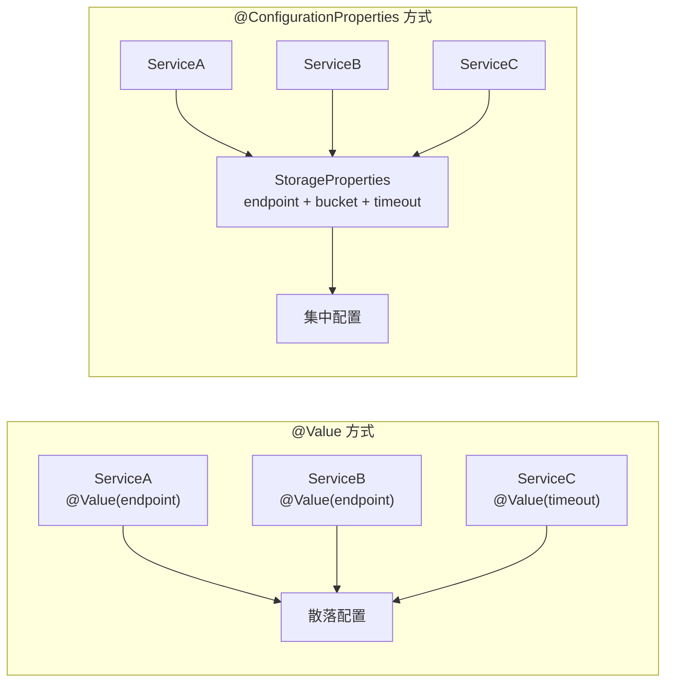
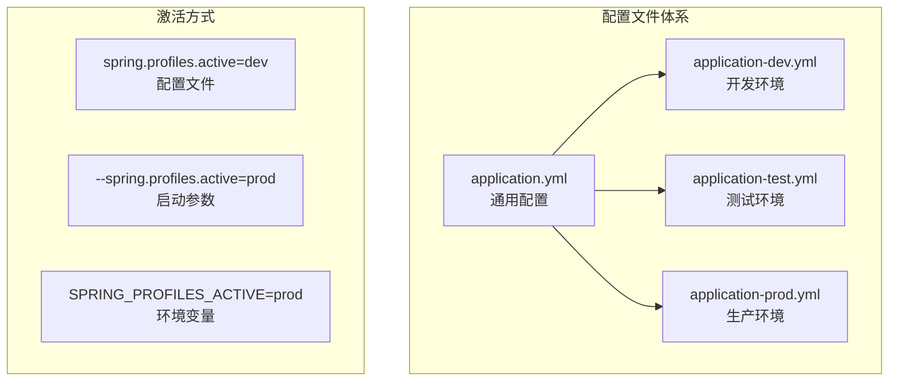
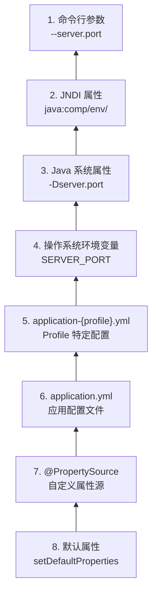
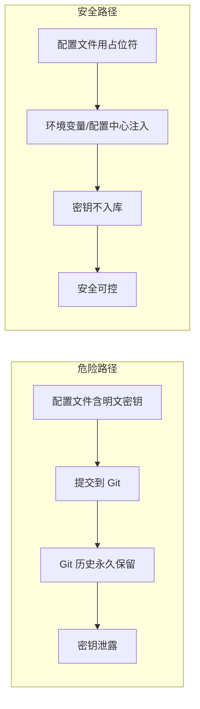

# 配置绑定与环境隔离

> 配置管理是 Spring Boot 项目的基石。配置失控往往比代码失控更致命——数据库连错环境、密钥泄露、配置散落难追踪,都会导致严重后果。

Spring Boot 项目上线后,最容易失控的往往不是业务逻辑,而是配置。数据库地址、线程池参数、限流阈值、第三方密钥如果散落在各处,项目会很快变得不可维护。

::: danger 生产事故警示
配置失控的后果远比代码 Bug 严重——代码 Bug 最多导致某个功能异常,但**数据库连错环境**会导致生产数据被覆盖、**密钥泄露**会导致安全事件、**配置覆盖冲突**会导致服务不可用。配置治理是生产稳定性的第一道防线。
:::

**配置治理的核心目标：**

- **配置来源统一**：避免配置散落在多个地方
- **环境边界清晰**：dev/test/prod 配置隔离明确
- **配置结构化绑定**：类型安全,便于校验和重构
- **敏感信息有隔离策略**:密钥、凭证不入库

---

## 一、配置绑定的本质

### 1.1 配置绑定的理解

配置绑定的本质,是把外部配置映射成一个有业务边界的 Java 对象。

这样做的价值在于：

- 配置不再是零散字符串
- 配置项归属更清晰
- 可以集中做校验和说明
- IDE 提示友好,重构更安全

### 1.2 为什么配置绑定比散落 `@Value` 更好



#### `@Value` 的问题

`@Value` 适合少量简单值,但项目一大就会出现：

| 问题 | 说明 |
|------|------|
| 字符串散落各处 | 配置项引用散落在多个类中,难以追踪 |
| 配置项难追踪 | 不知道某个配置被哪些类使用 |
| 校验和默认值不集中 | 每个地方都要写默认值,容易不一致 |
| 重构时容易漏改 | 配置项重命名时需要全局搜索替换 |
| 类型不安全 | 都是 String,需要手动转换 |

**示例：散落的 @Value**

```java
@Service
public class StorageService {
    @Value("${app.storage.endpoint}")
    private String endpoint;
    
    @Value("${app.storage.bucket}")
    private String bucket;
    
    @Value("${app.storage.timeout-seconds:5}")
    private int timeoutSeconds;
}

@Service
public class FileService {
    @Value("${app.storage.endpoint}")  // 重复引用
    private String storageEndpoint;
    
    @Value("${app.storage.bucket}")   // 重复引用
    private String storageBucket;
}
```

**问题：**
- 配置项散落在多个类中
- 如果要修改配置前缀,需要到处搜索
- 默认值分散,难以统一管理

#### `@ConfigurationProperties` 的优势

`@ConfigurationProperties` 更适合中大型项目,因为它能够：

| 优势 | 说明 |
|------|------|
| 按模块聚合配置 | 相关配置集中在同一个类中 |
| 结构清晰 | 配置项之间的关系一目了然 |
| 便于校验 | 支持JSR-303校验注解 |
| 默认值集中管理 | 在一处定义,全局生效 |
| IDE 提示友好 | 配置类有明确的属性和方法 |
| 重构更安全 | 修改配置类属性名,IDE 自动重构 |

**示例：结构化的配置绑定**

```java
@ConfigurationProperties(prefix = "app.storage")
public class StorageProperties {
    
    /**
     * 存储服务端点
     */
    private String endpoint;
    
    /**
     * 存储桶名称
     */
    private String bucket;
    
    /**
     * 超时时间(秒)
     */
    private int timeoutSeconds = 5;  // 默认值
    
    /**
     * 是否启用 HTTPS
     */
    private boolean enableHttps = true;
    
    // Getters and Setters
}
```

对应配置文件：

```yaml
app:
  storage:
    endpoint: https://oss.example.com
    bucket: java-note
    timeout-seconds: 10
    enable-https: true
```

**优势对比：**

```java
// × @Value 方式：散落、难追踪、类型不安全
@Value("${app.storage.timeout-seconds:5}")
private String timeoutStr;  // 需要手动转换
int timeout = Integer.parseInt(timeoutStr);

// √ @ConfigurationProperties 方式：集中、类型安全、IDE友好
@Autowired
private StorageProperties storageProperties;

int timeout = storageProperties.getTimeoutSeconds();  // 类型安全
```

---

## 二、@ConfigurationProperties 详解

### 2.1 基本用法

#### 方式一：@ConfigurationProperties + @Component

```java
@Component
@ConfigurationProperties(prefix = "app.storage")
public class StorageProperties {
    
    private String endpoint;
    private String bucket;
    private int timeoutSeconds = 5;
    
    // Getters and Setters
    public String getEndpoint() {
        return endpoint;
    }
    
    public void setEndpoint(String endpoint) {
        this.endpoint = endpoint;
    }
    
    public String getBucket() {
        return bucket;
    }
    
    public void setBucket(String bucket) {
        this.bucket = bucket;
    }
    
    public int getTimeoutSeconds() {
        return timeoutSeconds;
    }
    
    public void setTimeoutSeconds(int timeoutSeconds) {
        this.timeoutSeconds = timeoutSeconds;
    }
}
```

**使用：**

```java
@Service
public class StorageService {
    
    @Autowired
    private StorageProperties storageProperties;
    
    public void upload(String key, byte[] data) {
        String endpoint = storageProperties.getEndpoint();
        String bucket = storageProperties.getBucket();
        int timeout = storageProperties.getTimeoutSeconds();
        
        // 使用配置
    }
}
```

#### 方式二：@ConfigurationProperties + @EnableConfigurationProperties

```java
@ConfigurationProperties(prefix = "app.storage")
public class StorageProperties {
    
    private String endpoint;
    private String bucket;
    private int timeoutSeconds = 5;
    
    // Getters and Setters
}
```

```java
@Configuration
@EnableConfigurationProperties(StorageProperties.class)
public class StorageConfiguration {
    
    @Bean
    public StorageService storageService(StorageProperties properties) {
        return new StorageService(properties);
    }
}
```

**推荐：** 方式二更好,配置类不需要 @Component 注解,依赖关系更清晰。

#### 方式三：@ConfigurationProperties + @Bean

```java
@Configuration
public class StorageConfiguration {
    
    @Bean
    @ConfigurationProperties(prefix = "app.storage")
    public StorageProperties storageProperties() {
        return new StorageProperties();
    }
    
    @Bean
    public StorageService storageService(StorageProperties properties) {
        return new StorageService(properties);
    }
}
```

### 2.2 松散绑定（Relaxed Binding）

Spring Boot 支持多种配置属性命名格式,会自动匹配：

| 配置文件格式 | 说明 | 示例 |
|-------------|------|------|
| 标准格式 | 短横线分隔 | `timeout-seconds` |
| 大写格式 | 下划线分隔 | `TIMEOUT_SECONDS` |
| 驼峰格式 | 驼峰命名 | `timeoutSeconds` |
| 小写格式 | 全小写 | `timeoutseconds` |

**示例：**

```java
@ConfigurationProperties(prefix = "app.storage")
public class StorageProperties {
    
    private int timeoutSeconds;  // Java 属性名
    
    // Getter and Setter
}
```

以下配置格式都能匹配到 `timeoutSeconds` 属性：

```yaml
# 1. 短横线格式(推荐)
app:
  storage:
    timeout-seconds: 10

# 2. 下划线格式(环境变量常用)
APP_STORAGE_TIMEOUT_SECONDS=10

# 3. 驼峰格式
app:
  storage:
    timeoutSeconds: 10
```

**松散绑定规则：**

| Java 属性名 | 配置文件中可用的格式 |
|------------|-------------------|
| `myPropertyName` | `my-property-name`<br>`my_property_name`<br>`myPropertyName`<br>`MY_PROPERTY_NAME` |

**注意事项：**

1. **推荐格式：**
   - 配置文件：使用短横线分隔（`timeout-seconds`）
   - 环境变量：使用下划线大写（`TIMEOUT_SECONDS`）
   - Java 代码：使用驼峰命名（`timeoutSeconds`）

2. **不推荐格式：**
   - 全小写无分隔符（`timeoutseconds`）：可读性差

### 2.3 配置校验

Spring Boot 支持 JSR-303 Bean Validation 校验：

#### 添加依赖

```xml
<dependency>
    <groupId>org.springframework.boot</groupId>
    <artifactId>spring-boot-starter-validation</artifactId>
</dependency>
```

#### 使用校验注解

```java
@ConfigurationProperties(prefix = "app.storage")
@Validated
public class StorageProperties {
    
    /**
     * 存储服务端点
     */
    @NotBlank(message = "存储端点不能为空")
    @Pattern(regexp = "^https?://.*", message = "端点必须是有效的URL")
    private String endpoint;
    
    /**
     * 存储桶名称
     */
    @NotBlank(message = "存储桶名称不能为空")
    @Pattern(regexp = "^[a-z0-9-]{3,63}$", 
             message = "存储桶名称必须是3-63个小写字母、数字或短横线")
    private String bucket;
    
    /**
     * 超时时间(秒)
     */
    @Min(value = 1, message = "超时时间至少1秒")
    @Max(value = 60, message = "超时时间最多60秒")
    private int timeoutSeconds = 5;
    
    /**
     * 最大文件大小(MB)
     */
    @Min(value = 1, message = "最小文件大小1MB")
    @Max(value = 100, message = "最大文件大小100MB")
    private int maxFileSizeMb = 10;
    
    /**
     * 重试次数
     */
    @Min(0)
    @Max(5)
    private int retryTimes = 3;
    
    /**
     * 启用的环境列表
     */
    @NotEmpty(message = "至少需要配置一个环境")
    private List<String> enabledEnvironments = new ArrayList<>();
    
    // Getters and Setters
}
```

**启动时校验：**

```java
@SpringBootApplication
@EnableConfigurationProperties(StorageProperties.class)
public class Application {
    public static void main(String[] args) {
        SpringApplication.run(Application.class, args);
    }
}
```

如果配置不满足校验条件,启动时会抛出异常：

```
Binding to target StorageProperties failed:

    Field 'endpoint' must match the regex '^https?://.*'
    Field 'bucket' must match '^[a-z0-9-]{3,63}$'
    Field 'timeoutSeconds' must be at least 1
```

#### 嵌套对象的校验

```java
@ConfigurationProperties(prefix = "app")
@Validated
public class AppProperties {
    
    @NotNull
    @Valid  // 启用嵌套校验
    private Storage storage;
    
    @NotNull
    @Valid
    private Database database;
    
    // Getters and Setters
    
    public static class Storage {
        
        @NotBlank
        private String endpoint;
        
        @NotBlank
        private String bucket;
        
        // Getters and Setters
    }
    
    public static class Database {
        
        @NotBlank
        private String url;
        
        @NotBlank
        private String username;
        
        // Getters and Setters
    }
}
```

### 2.4 配置属性的默认值

#### 方式一：字段初始化

```java
@ConfigurationProperties(prefix = "app.storage")
public class StorageProperties {
    
    private String endpoint;  // 默认 null
    private String bucket;    // 默认 null
    private int timeoutSeconds = 5;  // 默认 5
    private boolean enableHttps = true;  // 默认 true
    private int retryTimes = 3;  // 默认 3
    
    // Getters and Setters
}
```

#### 方式二：使用 Optional

```java
@ConfigurationProperties(prefix = "app.storage")
public class StorageProperties {
    
    /**
     * 可选的代理地址
     */
    private String proxyHost;
    
    /**
     * 可选的代理端口
     */
    private Integer proxyPort;
    
    public Optional<String> getProxyHost() {
        return Optional.ofNullable(proxyHost);
    }
    
    public Optional<Integer> getProxyPort() {
        return Optional.ofNullable(proxyPort);
    }
}
```

#### 方式三：集合的默认值

```java
@ConfigurationProperties(prefix = "app.storage")
public class StorageProperties {
    
    /**
     * 允许的文件类型
     */
    private List<String> allowedTypes = Arrays.asList("jpg", "png", "gif");
    
    /**
     * 区域配置
     */
    private Map<String, String> regions = new HashMap<>();
    
    // Getters and Setters
}
```

```yaml
app:
  storage:
    allowed-types:
      - jpg
      - png
      - gif
      - pdf  # List 绑定为整体替换默认值,不会追加
    regions:
      cn-east: shanghai
      cn-north: beijing
```

### 2.5 复杂类型绑定

#### List 和 Array

```java
@ConfigurationProperties(prefix = "app")
public class AppProperties {
    
    private List<String> servers = new ArrayList<>();
    
    private String[] allowedOrigins;
    
    // Getters and Setters
}
```

```yaml
app:
  servers:
    - server1.example.com
    - server2.example.com
    - server3.example.com
  allowed-origins:
    - https://example.com
    - https://api.example.com
```

#### Map

```java
@ConfigurationProperties(prefix = "app")
public class AppProperties {
    
    private Map<String, String> endpoints = new HashMap<>();
    
    private Map<String, Integer> timeouts = new HashMap<>();
    
    // Getters and Setters
}
```

```yaml
app:
  endpoints:
    auth: https://auth.example.com
    api: https://api.example.com
    cdn: https://cdn.example.com
  timeouts:
    connect: 5000
    read: 10000
    write: 15000
```

#### 嵌套对象

```java
@ConfigurationProperties(prefix = "app")
public class AppProperties {
    
    private Storage storage = new Storage();
    private Database database = new Database();
    
    // Getters and Setters
    
    public static class Storage {
        
        private String endpoint;
        private String bucket;
        private int timeoutSeconds = 5;
        
        // Getters and Setters
    }
    
    public static class Database {
        
        private String url;
        private String username;
        private String password;
        private int maxPoolSize = 10;
        
        // Getters and Setters
    }
}
```

```yaml
app:
  storage:
    endpoint: https://oss.example.com
    bucket: my-bucket
    timeout-seconds: 10
  database:
    url: jdbc:mysql://localhost:3306/mydb
    username: root
    password: secret
    max-pool-size: 20
```

#### Duration 和 Period

Spring Boot 支持 Duration 和 Period 类型的自动转换：

```java
@ConfigurationProperties(prefix = "app")
public class AppProperties {
    
    /**
     * 会话超时时间
     */
    private Duration sessionTimeout = Duration.ofMinutes(30);
    
    /**
     * 缓存过期时间
     */
    private Duration cacheExpire = Duration.ofHours(24);
    
    /**
     * 数据保留周期
     */
    private Period dataRetention = Period.ofDays(30);
    
    // Getters and Setters
}
```

```yaml
app:
  session-timeout: 30m  # 30分钟
  cache-expire: 24h     # 24小时
  data-retention: 30d   # 30天
```

**Duration 支持的单位：**
- `ns` / `nanos`：纳秒
- `ms` / `millis`：毫秒
- `s` / `seconds`：秒
- `m` / `minutes`：分钟
- `h` / `hours`：小时
- `d` / `days`：天

**示例：**

```yaml
app:
  session-timeout: 1800s    # 秒
  cache-expire: 86400000ms  # 毫秒
  connection-timeout: 5m    # 分钟
  token-validity: 7d        # 天
```

#### DataSize

Spring Boot 支持 DataSize 类型的自动转换：

```java
@ConfigurationProperties(prefix = "app")
public class AppProperties {
    
    /**
     * 最大文件大小
     */
    private DataSize maxFileSize = DataSize.ofMegabytes(10);
    
    /**
     * 缓冲区大小
     */
    private DataSize bufferSize = DataSize.ofKilobytes(8);
    
    // Getters and Setters
}
```

```yaml
app:
  max-file-size: 10MB
  buffer-size: 8KB
```

**DataSize 支持的单位：**
- `B`：字节
- `KB`：千字节
- `MB`：兆字节
- `GB`：吉字节
- `TB`：太字节

### 2.6 构造器绑定（Spring Boot 2.2+）

Spring Boot 2.2 开始支持构造器绑定,更加安全：

#### 使用构造器绑定

```java
@ConfigurationProperties(prefix = "app.storage")
public class StorageProperties {
    
    private final String endpoint;
    private final String bucket;
    private final int timeoutSeconds;
    private final boolean enableHttps;
    
    // 构造器绑定
    public StorageProperties(String endpoint, String bucket, 
                            int timeoutSeconds, boolean enableHttps) {
        this.endpoint = endpoint;
        this.bucket = bucket;
        this.timeoutSeconds = timeoutSeconds;
        this.enableHttps = enableHttps;
    }
    
    // 只有 Getters,没有 Setters
    public String getEndpoint() {
        return endpoint;
    }
    
    public String getBucket() {
        return bucket;
    }
    
    public int getTimeoutSeconds() {
        return timeoutSeconds;
    }
    
    public boolean isEnableHttps() {
        return enableHttps;
    }
}
```

#### 使用 Record（Java 16+）

```java
@ConfigurationProperties(prefix = "app.storage")
public record StorageProperties(
    String endpoint,
    String bucket,
    int timeoutSeconds,
    boolean enableHttps
) {
    // Record 自动生成构造器、getters、equals、hashCode、toString
}
```

**注意：** 使用构造器绑定或 Record 时,需要在配置类上添加 `@EnableConfigurationProperties` 或 `@ConfigurationPropertiesScan`：

```java
@SpringBootApplication
@ConfigurationPropertiesScan  // 启用配置属性扫描
public class Application {
    public static void main(String[] args) {
        SpringApplication.run(Application.class, args);
    }
}
```

#### 构造器绑定的默认值

```java
@ConfigurationProperties(prefix = "app.storage")
public class StorageProperties {
    
    private final String endpoint;
    private final String bucket;
    private final int timeoutSeconds;
    
    // 使用 @DefaultValue 指定默认值
    public StorageProperties(
        String endpoint, 
        String bucket,
        @DefaultValue("5") int timeoutSeconds
    ) {
        this.endpoint = endpoint;
        this.bucket = bucket;
        this.timeoutSeconds = timeoutSeconds;
    }
    
    // Getters
}
```

### 2.7 配置属性的刷新

默认情况下,配置属性在应用启动时加载,运行时不会刷新。如果需要动态刷新,可以使用：

#### Spring Cloud Config

```xml
<dependency>
    <groupId>org.springframework.cloud</groupId>
    <artifactId>spring-cloud-starter-config</artifactId>
</dependency>
```

```java
@ConfigurationProperties(prefix = "app.storage")
@RefreshScope  // 支持动态刷新
public class StorageProperties {
    
    private String endpoint;
    private String bucket;
    
    // Getters and Setters
}
```

**触发刷新：**

```bash
curl -X POST http://localhost:8080/actuator/refresh
```

#### 自定义刷新机制

```java
@ConfigurationProperties(prefix = "app.storage")
public class StorageProperties {
    
    private volatile String endpoint;
    private volatile String bucket;
    
    // Getters and Setters
}

@Service
public class ConfigRefreshService {
    
    @Autowired
    private Environment environment;
    
    @Autowired
    private StorageProperties storageProperties;
    
    public void refreshConfig() {
        String newEndpoint = environment.getProperty("app.storage.endpoint");
        String newBucket = environment.getProperty("app.storage.bucket");
        
        storageProperties.setEndpoint(newEndpoint);
        storageProperties.setBucket(newBucket);
    }
}
```

---

## 三、环境隔离详解

### 3.1 为什么需要多环境

一个真实项目通常至少会有这些环境：

| 环境 | 说明 | 特点 |
|------|------|------|
| `dev` | 开发环境 | 本地开发,配置宽松,日志详细 |
| `test` | 测试环境 | 集成测试,接近生产配置 |
| `stage` | 预发布环境 | 生产前的最后验证 |
| `prod` | 生产环境 | 真实线上环境,配置严格 |

**环境隔离的核心价值：**

- **职责明确**：每个环境配置独立,互不干扰
- **敏感配置不误用**：开发不会误连生产数据库
- **上线变更可审计**：配置变更有迹可循
- **本地、测试、生产配置边界清晰**：减少人为失误

### 3.2 Spring Boot Profile 机制



::: tip Profile 激活优先级
当多种方式同时指定 Profile 时，优先级为：**启动参数 > 环境变量 > 配置文件中的 spring.profiles.active**。生产环境推荐使用启动参数或环境变量，避免配置文件中硬编码 Profile。
:::

#### 基本用法

**方式一：多配置文件**

```
application.yml           # 通用配置
application-dev.yml       # 开发环境
application-test.yml      # 测试环境
application-prod.yml      # 生产环境
```

**激活 Profile：**

```yaml
# application.yml
spring:
  profiles:
    active: dev  # 激活 dev 环境
```

或启动参数：

```bash
java -jar myapp.jar --spring.profiles.active=prod
```

或环境变量：

```bash
export SPRING_PROFILES_ACTIVE=prod
java -jar myapp.jar
```

#### 配置文件加载顺序

当激活 `prod` profile 时,配置加载顺序：

1. `application.yml` (基础配置)
2. `application-prod.yml` (覆盖基础配置)
3. 环境变量
4. 启动参数

**示例：**

```yaml
# application.yml (通用配置)
spring:
  application:
    name: myapp
  datasource:
    driver-class-name: com.mysql.cj.jdbc.Driver

server:
  port: 8080

# application-dev.yml (开发环境)
spring:
  datasource:
    url: jdbc:mysql://localhost:3306/myapp_dev
    username: root
    password: root

logging:
  level:
    com.example: DEBUG

# application-prod.yml (生产环境)
spring:
  datasource:
    url: jdbc:mysql://prod-db.example.com:3306/myapp
    username: ${DB_USERNAME}  # 从环境变量读取
    password: ${DB_PASSWORD}

logging:
  level:
    com.example: INFO
    org.springframework: WARN

server:
  port: 80
```

#### 多 Profile 组合

Spring Boot 2.4+ 支持多 Profile 组合：

```yaml
# application.yml
spring:
  profiles:
    active: dev
    group:
      dev: 
        - dev
        - local
      prod:
        - prod
        - monitoring
```

```yaml
# application-local.yml
app:
  cache:
    type: local

# application-monitoring.yml
management:
  endpoints:
    web:
      exposure:
        include: health,info,metrics
```

### 3.3 环境特定配置示例

#### 开发环境（application-dev.yml）

```yaml
spring:
  datasource:
    url: jdbc:mysql://localhost:3306/myapp_dev
    username: root
    password: root
    hikari:
      maximum-pool-size: 5
  
  jpa:
    show-sql: true
    hibernate:
      ddl-auto: update

logging:
  level:
    com.example: DEBUG
    org.springframework.web: DEBUG

server:
  port: 8080
  error:
    include-stacktrace: always

app:
  storage:
    endpoint: http://localhost:9000
    bucket: dev-bucket
  security:
    enabled: false  # 开发环境关闭安全验证
```

#### 测试环境（application-test.yml）

```yaml
spring:
  datasource:
    url: jdbc:mysql://test-db.example.com:3306/myapp_test
    username: testuser
    password: testpass
    hikari:
      maximum-pool-size: 10
  
  jpa:
    show-sql: false
    hibernate:
      ddl-auto: validate

logging:
  level:
    com.example: INFO

server:
  port: 8080

app:
  storage:
    endpoint: https://test-oss.example.com
    bucket: test-bucket
  security:
    enabled: true
```

#### 生产环境（application-prod.yml）

```yaml
spring:
  datasource:
    url: jdbc:mysql://prod-db.example.com:3306/myapp
    username: ${DB_USERNAME}
    password: ${DB_PASSWORD}
    hikari:
      maximum-pool-size: 20
      connection-timeout: 30000
      idle-timeout: 600000
      max-lifetime: 1800000
  
  jpa:
    show-sql: false
    hibernate:
      ddl-auto: none

logging:
  level:
    com.example: INFO
    org.springframework: WARN
  file:
    name: /var/log/myapp/application.log

server:
  port: 80
  error:
    include-stacktrace: never

management:
  endpoints:
    web:
      exposure:
        include: health,info,metrics

app:
  storage:
    endpoint: https://oss.example.com
    bucket: prod-bucket
  security:
    enabled: true
```

### 3.4 Profile 注解

Spring 提供了 `@Profile` 注解,根据环境条件注册 Bean：

```java
@Configuration
public class DataSourceConfiguration {
    
    @Bean
    @Profile("dev")
    public DataSource devDataSource() {
        return DataSourceBuilder.create()
            .url("jdbc:mysql://localhost:3306/myapp_dev")
            .username("root")
            .password("root")
            .build();
    }
    
    @Bean
    @Profile("prod")
    public DataSource prodDataSource(
        @Value("${spring.datasource.url}") String url,
        @Value("${spring.datasource.username}") String username,
        @Value("${spring.datasource.password}") String password
    ) {
        HikariDataSource dataSource = new HikariDataSource();
        dataSource.setJdbcUrl(url);
        dataSource.setUsername(username);
        dataSource.setPassword(password);
        dataSource.setMaximumPoolSize(20);
        return dataSource;
    }
    
    @Bean
    @Profile({"dev", "test"})
    public TestDataInitializer testDataInitializer() {
        return new TestDataInitializer();
    }
}
```

---

## 四、配置优先级与来源

### 4.1 配置来源优先级



::: warning 关键规则
- 高优先级配置**覆盖**低优先级配置（同属性覆盖，不同属性合并）
- Profile 配置覆盖通用配置，但只覆盖相同属性
- **生产环境务必使用环境变量或配置中心管理敏感配置**，不要依赖配置文件
- 命令行参数优先级最高，但**不要在生产环境大量使用命令行参数**——参数过多难以管理且容易暴露敏感信息
:::

Spring Boot 配置来源按优先级从高到低：

| 优先级 | 配置来源 | 说明 |
|--------|---------|------|
| 1 | 命令行参数 | `--server.port=8081` |
| 2 | JNDI 属性 | `java:comp/env/` |
| 3 | Java 系统属性 | `System.getProperties()` |
| 4 | 操作系统环境变量 | `SERVER_PORT=8081` |
| 5 | `application-{profile}.yml` | Profile 特定配置 |
| 6 | `application.yml` | 应用配置文件 |
| 7 | `@PropertySource` | 自定义属性源 |
| 8 | 默认属性 | `SpringApplication.setDefaultProperties` |

**示例：优先级验证**

```yaml
# application.yml
server:
  port: 8080
```

```bash
# 环境变量优先级更高
export SERVER_PORT=9090
java -jar myapp.jar

# 启动参数优先级最高
java -jar myapp.jar --server.port=8081
```

### 4.2 配置来源详解

#### 命令行参数

```bash
java -jar myapp.jar \
  --server.port=8081 \
  --spring.profiles.active=prod \
  --app.storage.endpoint=https://oss.example.com
```

#### 环境变量

Spring Boot 支持环境变量命名转换：

| 配置属性 | 环境变量 |
|---------|---------|
| `server.port` | `SERVER_PORT` |
| `spring.profiles.active` | `SPRING_PROFILES_ACTIVE` |
| `app.storage.endpoint` | `APP_STORAGE_ENDPOINT` |

**示例：**

```bash
export SERVER_PORT=8081
export SPRING_PROFILES_ACTIVE=prod
export APP_STORAGE_ENDPOINT=https://oss.example.com

java -jar myapp.jar
```

#### Java 系统属性

```bash
java -Dserver.port=8081 \
     -Dspring.profiles.active=prod \
     -Dapp.storage.endpoint=https://oss.example.com \
     -jar myapp.jar
```

或在代码中设置：

```java
@SpringBootApplication
public class Application {
    public static void main(String[] args) {
        System.setProperty("server.port", "8081");
        SpringApplication.run(Application.class, args);
    }
}
```

#### @PropertySource

```java
@Configuration
@PropertySource("classpath:custom-config.properties")
public class CustomConfiguration {
    
    @Value("${custom.property}")
    private String customProperty;
}
```

**注意：** `@PropertySource` 不支持 YAML 文件,只支持 `.properties` 文件。

### 4.3 配置覆盖示例

**场景：开发环境配置被意外覆盖**

```yaml
# application.yml
spring:
  datasource:
    url: jdbc:mysql://prod-db.example.com:3306/myapp
    username: prod_user
```

```yaml
# application-dev.yml
spring:
  datasource:
    url: jdbc:mysql://localhost:3306/myapp_dev
    username: root
    # 没有配置 password,会继承 application.yml 中的配置
```

**问题：** 开发环境使用了生产环境的配置!

**解决方案：**

```yaml
# application-dev.yml
spring:
  datasource:
    url: jdbc:mysql://localhost:3306/myapp_dev
    username: root
    password: root  # 显式配置,避免继承
```

---

## 五、敏感配置管理

### 5.1 为什么敏感配置不能进源码

数据库密码、Access Key、第三方密钥如果直接写进配置文件并提交仓库,会把配置管理问题变成安全问题。



**风险：**

- 代码泄露导致密钥泄露
- Git 历史中保留明文密钥
- 团队成员都能看到生产密钥
- 密钥更换困难,需要修改代码

**原则：**

- √ 业务普通配置可以进配置文件
- × 敏感凭证不要直接入库或入仓库明文保存

### 5.2 敏感配置管理方案

#### 方案一：环境变量

```yaml
# application-prod.yml
spring:
  datasource:
    url: jdbc:mysql://prod-db.example.com:3306/myapp
    username: ${DB_USERNAME}
    password: ${DB_PASSWORD}
```

**部署时设置环境变量：**

```bash
export DB_USERNAME=prod_user
export DB_PASSWORD=prod_password

java -jar myapp.jar
```

**Kubernetes Secret：**

```yaml
apiVersion: v1
kind: Secret
metadata:
  name: db-credentials
type: Opaque
data:
  username: cHJvZF91c2Vy
  password: cHJvZF9wYXNzd29yZA==
---
apiVersion: apps/v1
kind: Deployment
metadata:
  name: myapp
spec:
  template:
    spec:
      containers:
      - name: myapp
        image: myapp:latest
        env:
        - name: DB_USERNAME
          valueFrom:
            secretKeyRef:
              name: db-credentials
              key: username
        - name: DB_PASSWORD
          valueFrom:
            secretKeyRef:
              name: db-credentials
              key: password
```

#### 方案二：配置中心

使用 Spring Cloud Config、Nacos、Apollo 等配置中心：

```xml
<dependency>
    <groupId>org.springframework.cloud</groupId>
    <artifactId>spring-cloud-starter-config</artifactId>
</dependency>
```

```yaml
# bootstrap.yml
spring:
  cloud:
    config:
      uri: https://config-server.example.com
      name: myapp
      profile: prod
      label: main
```

配置中心存储敏感配置,并通过权限控制访问。

#### 方案三：Vault

使用 HashiCorp Vault 管理密钥：

```xml
<dependency>
    <groupId>org.springframework.cloud</groupId>
    <artifactId>spring-cloud-starter-vault-config</artifactId>
</dependency>
```

```yaml
# bootstrap.yml
spring:
  cloud:
    vault:
      uri: https://vault.example.com
      token: ${VAULT_TOKEN}
      scheme: http
      kv:
        enabled: true
        backend: secret
        application-name: myapp
```

#### 方案四：Jasypt 加密

使用 Jasypt 对配置文件中的敏感信息加密：

```xml
<dependency>
    <groupId>com.github.ulisesbocchio</groupId>
    <artifactId>jasypt-spring-boot-starter</artifactId>
    <version>3.0.5</version>
</dependency>
```

```yaml
# application-prod.yml
spring:
  datasource:
    username: ENC(G6N718UuyPE5bHyWKyuLQSm02auQPUtm)
    password: ENC(6ZaM9vGmPvB3q3Zv3X2Y3g==)
```

**加密方式：**

```bash
java -cp jasypt-1.9.3.jar \
  org.jasypt.intf.cli.JasyptPBEStringEncryptionCLI \
  input="prod_password" \
  password=my-secret-key \
  algorithm=PBEWithMD5AndDES
```

**启动时解密：**

```bash
# 注意:-D 必须放在 -jar 之前,放在后面会被当作应用参数而非 JVM 系统属性
java -Djasypt.encryptor.password=my-secret-key -jar myapp.jar
```

### 5.3 敏感配置最佳实践

1. **配置文件模板化**
   ```yaml
   # application-prod.yml.template
   spring:
     datasource:
       username: ${DB_USERNAME}
       password: ${DB_PASSWORD}
       url: ${DB_URL}
   ```

2. **Git 忽略敏感配置**
   ```gitignore
   # .gitignore
   application-prod.yml
   application-*.yml
   !application-dev.yml
   !application-test.yml
   ```

3. **CI/CD 注入密钥**
   ```yaml
   # GitHub Actions
   - name: Run Application
     run: java -jar myapp.jar
     env:
       DB_USERNAME: ${{ secrets.DB_USERNAME }}
       DB_PASSWORD: ${{ secrets.DB_PASSWORD }}
   ```

4. **定期轮换密钥**
   - 定期更换数据库密码
   - 定期更换 API 密钥
   - 使用短期令牌而非长期密钥

---

## 六、配置问题排查

### 6.1 常见配置问题

#### 问题一：配置不生效

**现象：** 修改了配置文件,但配置没有生效

**可能原因：**
1. Profile 没有激活
2. 配置被更高优先级来源覆盖
3. 配置前缀绑定错误
4. 配置文件格式错误(YAML 缩进)

**排查步骤：**

```bash
# 1. 查看当前激活的 Profile
curl http://localhost:8080/actuator/env | jq '.activeProfiles'

# 2. 查看配置来源
curl http://localhost:8080/actuator/env | jq '.propertySources'

# 3. 查看具体配置值
curl http://localhost:8080/actuator/env/app.storage.endpoint

# 4. 启用调试日志
java -jar myapp.jar --debug
```

#### 问题二：配置绑定失败

**现象：** 启动时报错 `Binding to target failed`

**可能原因：**
1. 配置属性类型不匹配
2. 配置校验失败
3. 配置前缀错误

**解决方案：**

```java
@ConfigurationProperties(prefix = "app.storage")
public class StorageProperties {
    
    private int timeoutSeconds = 5;
    
    // 错误：配置文件中的值不是数字
    // app.storage.timeout-seconds: abc
}
```

**排查：**

```bash
# 查看配置值
curl http://localhost:8080/actuator/env/app.storage.timeout-seconds

# 查看绑定报告
curl http://localhost:8080/actuator/configprops
```

#### 问题三：配置优先级冲突

**现象：** 期望使用 application.yml 的配置,但实际使用了其他值

**可能原因：**
1. 环境变量覆盖了配置
2. 启动参数覆盖了配置
3. 默认值优先级问题

**排查步骤：**

```java
@RestController
public class ConfigDebugController {
    
    @Autowired
    private Environment environment;
    
    @GetMapping("/debug/config")
    public Map<String, Object> debugConfig() {
        Map<String, Object> result = new HashMap<>();
        
        // 查看配置值
        result.put("server.port", environment.getProperty("server.port"));
        result.put("spring.profiles.active", 
            String.valueOf(environment.getActiveProfiles()));
        
        // 查看配置来源
        if (environment instanceof ConfigurableEnvironment) {
            ConfigurableEnvironment ce = (ConfigurableEnvironment) environment;
            List<String> sources = ce.getPropertySources().stream()
                .map(PropertySource::getName)
                .collect(Collectors.toList());
            result.put("propertySources", sources);
        }
        
        return result;
    }
}
```

### 6.2 配置调试工具

#### Actuator /actuator/env

```yaml
management:
  endpoints:
    web:
      exposure:
        include: env,configprops
```

访问：`http://localhost:8080/actuator/env`

**返回示例：**

```json
{
  "activeProfiles": ["dev"],
  "propertySources": [
    {
      "name": "configurationProperties",
      "properties": {
        "server.port": {
          "value": "8080",
          "origin": "class path resource [application-dev.yml]:2:9"
        }
      }
    }
  ]
}
```

#### Actuator /actuator/configprops

访问：`http://localhost:8080/actuator/configprops`

查看所有 `@ConfigurationProperties` Bean 的配置：

```json
{
  "contexts": {
    "application": {
      "beans": {
        "storageProperties": {
          "prefix": "app.storage",
          "properties": {
            "endpoint": "https://oss.example.com",
            "bucket": "dev-bucket",
            "timeoutSeconds": 10
          }
        }
      }
    }
  }
}
```

#### Spring Boot Debugger

启动时添加 `--debug` 参数：

```bash
java -jar myapp.jar --debug
```

查看自动配置报告和配置绑定详情。

---

## 七、实战场景深度解析

### 7.1 场景一：对象存储配置统一管理

**问题：** `endpoint`、`bucket`、`timeout` 在业务代码里到处散落,后续切换云厂商或环境时会非常痛苦。

**解决方案：**

```java
@ConfigurationProperties(prefix = "app.storage")
@Validated
public class StorageProperties {
    
    /**
     * 存储服务提供商
     */
    @NotNull
    private StorageProvider provider = StorageProvider.ALIYUN;
    
    /**
     * 存储服务端点
     */
    @NotBlank
    private String endpoint;
    
    /**
     * 存储桶名称
     */
    @NotBlank
    private String bucket;
    
    /**
     * 访问密钥ID
     */
    @NotBlank
    private String accessKeyId;
    
    /**
     * 访问密钥Secret
     */
    @NotBlank
    private String accessKeySecret;
    
    /**
     * 超时时间(秒)
     */
    @Min(1)
    @Max(60)
    private int timeoutSeconds = 5;
    
    /**
     * 最大文件大小(MB)
     */
    @Min(1)
    @Max(100)
    private int maxFileSizeMb = 10;
    
    /**
     * 允许的文件类型
     */
    private List<String> allowedTypes = Arrays.asList("jpg", "png", "gif", "pdf");
    
    // Getters and Setters
    
    public enum StorageProvider {
        ALIYUN, TENCENT, AWS, MINIO
    }
}
```

```java
@Configuration
@EnableConfigurationProperties(StorageProperties.class)
public class StorageConfiguration {
    
    @Bean
    public StorageService storageService(StorageProperties properties) {
        switch (properties.getProvider()) {
            case ALIYUN:
                return new AliyunStorageService(properties);
            case TENCENT:
                return new TencentStorageService(properties);
            case AWS:
                return new AwsStorageService(properties);
            case MINIO:
                return new MinioStorageService(properties);
            default:
                throw new IllegalArgumentException("Unsupported storage provider");
        }
    }
}
```

**使用：**

```java
@Service
public class FileService {
    
    private final StorageService storageService;
    
    public FileService(StorageService storageService) {
        this.storageService = storageService;
    }
    
    public String uploadFile(MultipartFile file) {
        // 使用统一的存储服务
        return storageService.upload(file);
    }
}
```

### 7.2 场景二：多环境数据库切换

**问题：** 开发、测试、生产如果没有明确 profile 隔离,很容易出现：
- 本地误连测试库
- 测试误连生产库
- 某个实例读到错误环境配置

**解决方案：**

```java
@ConfigurationProperties(prefix = "app.database")
public class DatabaseProperties {
    
    /**
     * 环境标识
     */
    @NotNull
    private String environment;
    
    /**
     * 数据库连接信息
     */
    private ConnectionConfig connection = new ConnectionConfig();
    
    /**
     * 连接池配置
     */
    private PoolConfig pool = new PoolConfig();
    
    // Getters and Setters
    
    public static class ConnectionConfig {
        
        private String url;
        private String username;
        private String password;
        private String driverClassName = "com.mysql.cj.jdbc.Driver";
        
        // Getters and Setters
    }
    
    public static class PoolConfig {
        
        private int maximumPoolSize = 10;
        private int minimumIdle = 5;
        private long connectionTimeout = 30000;
        private long idleTimeout = 600000;
        private long maxLifetime = 1800000;
        
        // Getters and Setters
    }
}
```

```yaml
# application-dev.yml
app:
  database:
    environment: dev
    connection:
      url: jdbc:mysql://localhost:3306/myapp_dev
      username: root
      password: root
    pool:
      maximum-pool-size: 5
      minimum-idle: 2

# application-prod.yml
app:
  database:
    environment: prod
    connection:
      url: jdbc:mysql://prod-db.example.com:3306/myapp
      username: ${DB_USERNAME}
      password: ${DB_PASSWORD}
    pool:
      maximum-pool-size: 20
      minimum-idle: 10
```

**环境验证：**

```java
@Component
public class DatabaseEnvironmentValidator implements ApplicationRunner {
    
    @Autowired
    private DatabaseProperties databaseProperties;
    
    @Override
    public void run(ApplicationArguments args) {
        String env = databaseProperties.getEnvironment();
        String activeProfile = Arrays.toString(
            environment.getActiveProfiles());
        
        log.info("Database Environment: {}, Active Profile: {}", 
            env, activeProfile);
        
        // 验证环境一致性
        if (activeProfile.contains("prod") && !"prod".equals(env)) {
            throw new IllegalStateException(
                "生产环境必须使用生产数据库配置!");
        }
    }
}
```

### 7.3 场景三：动态参数调整

**问题：** 限流阈值、线程池大小、灰度开关这类参数如果结构化管理,再配合配置中心,就能更安全地动态调整。

**解决方案：**

```java
@ConfigurationProperties(prefix = "app.feature")
@RefreshScope  // 支持动态刷新
public class FeatureProperties {
    
    /**
     * 限流配置
     */
    private RateLimitConfig rateLimit = new RateLimitConfig();
    
    /**
     * 线程池配置
     */
    private ThreadPoolConfig threadPool = new ThreadPoolConfig();
    
    /**
     * 灰度开关
     */
    private Map<String, Boolean> graySwitches = new HashMap<>();
    
    /**
     * 功能开关
     */
    private Map<String, Boolean> featureFlags = new HashMap<>();
    
    // Getters and Setters
    
    public static class RateLimitConfig {
        
        /**
         * 全局QPS限制
         */
        private int globalQps = 1000;
        
        /**
         * 单用户QPS限制
         */
        private int userQps = 100;
        
        /**
         * IP黑名单
         */
        private List<String> ipBlacklist = new ArrayList<>();
        
        // Getters and Setters
    }
    
    public static class ThreadPoolConfig {
        
        private int coreSize = 10;
        private int maxSize = 20;
        private int queueCapacity = 100;
        private String threadNamePrefix = "async-";
        
        // Getters and Setters
    }
}
```

```yaml
# application.yml
app:
  feature:
    rate-limit:
      global-qps: 5000
      user-qps: 200
      ip-blacklist:
        - 192.168.1.100
        - 10.0.0.50
    thread-pool:
      core-size: 20
      max-size: 50
      queue-capacity: 200
    gray-switches:
      new-ui: true
      recommendation-v2: false
    feature-flags:
      payment-alipay: true
      payment-wechat: true
      payment-apple: false
```

**动态调整：**

```java
@RestController
@RequestMapping("/api/config")
public class ConfigController {
    
    @Autowired
    private FeatureProperties featureProperties;
    
    @PostMapping("/rate-limit")
    public String updateRateLimit(@RequestBody RateLimitRequest request) {
        // 更新限流配置
        featureProperties.getRateLimit().setGlobalQps(request.getGlobalQps());
        featureProperties.getRateLimit().setUserQps(request.getUserQps());
        
        return "Rate limit updated successfully";
    }
    
    @PostMapping("/feature-flag/{name}")
    public String toggleFeatureFlag(
        @PathVariable String name, 
        @RequestParam boolean enabled
    ) {
        featureProperties.getFeatureFlags().put(name, enabled);
        return "Feature flag " + name + " set to " + enabled;
    }
}
```

### 7.4 场景四：配置迁移与重构

**问题：** 项目初期使用了大量 `@Value`,现在要迁移到 `@ConfigurationProperties`

**解决方案：**

**步骤1：识别配置项**

```bash
# 搜索所有 @Value 引用
grep -r "@Value" src/ | grep -o '"\${[^}]*}"' | sort | uniq
```

**步骤2：创建配置类**

```java
@ConfigurationProperties(prefix = "app")
public class AppConfig {
    
    private Storage storage = new Storage();
    private Security security = new Security();
    private Cache cache = new Cache();
    
    // Getters and Setters
    
    public static class Storage {
        private String endpoint;
        private String bucket;
        private int timeoutSeconds = 5;
        
        // Getters and Setters
    }
    
    public static class Security {
        private boolean enabled = true;
        private String secretKey;
        private long tokenValidity = 3600;
        
        // Getters and Setters
    }
    
    public static class Cache {
        private boolean enabled = true;
        private int expireMinutes = 30;
        
        // Getters and Setters
    }
}
```

**步骤3：逐步迁移**

```java
// 迁移前
@Service
public class StorageService {
    @Value("${app.storage.endpoint}")
    private String endpoint;
    
    @Value("${app.storage.bucket}")
    private String bucket;
    
    @Value("${app.storage.timeout-seconds:5}")
    private int timeoutSeconds;
}

// 迁移后
@Service
public class StorageService {
    
    private final AppConfig.Storage storage;
    
    public StorageService(AppConfig appConfig) {
        this.storage = appConfig.getStorage();
    }
    
    public void upload() {
        String endpoint = storage.getEndpoint();
        String bucket = storage.getBucket();
        int timeout = storage.getTimeoutSeconds();
        // ...
    }
}
```

---

## 八、最佳实践总结

### 8.1 配置设计原则

1. **按领域聚合**
   - 相关配置集中在同一个类中
   - 使用嵌套类组织层次结构

2. **命名规范**
   - 配置前缀：`app.{module}` 或 `{company}.{project}.{module}`
   - 属性名：使用小写字母和短横线
   - 避免缩写和模糊命名

3. **类型安全**
   - 使用 `@ConfigurationProperties` 而非 `@Value`
   - 添加校验注解
   - 提供合理的默认值

4. **文档完善**
   - 每个配置项添加 Javadoc
   - 说明配置的作用和默认值
   - 提供配置示例

### 8.2 环境隔离最佳实践

1. **配置文件组织**
   ```
   application.yml              # 通用配置
   application-dev.yml          # 开发环境
   application-test.yml         # 测试环境
   application-prod.yml         # 生产环境(不入库)
   application-prod.yml.example # 生产环境模板
   ```

2. **敏感配置管理**
   - 使用环境变量
   - 使用配置中心
   - 使用 Vault 或 KMS
   - 不将敏感信息提交到 Git

3. **环境验证**
   ```java
   @Component
   public class EnvironmentValidator implements ApplicationRunner {
       
       @Autowired
       private Environment environment;
       
       @Override
       public void run(ApplicationArguments args) {
           String[] activeProfiles = environment.getActiveProfiles();
           
           // 生产环境必须有 DB_PASSWORD 环境变量
           if (Arrays.asList(activeProfiles).contains("prod")) {
               String dbPassword = environment.getProperty("DB_PASSWORD");
               if (dbPassword == null || dbPassword.isEmpty()) {
                   throw new IllegalStateException(
                       "生产环境必须设置 DB_PASSWORD 环境变量");
               }
           }
       }
   }
   ```

### 8.3 配置校验最佳实践

```java
@ConfigurationProperties(prefix = "app")
@Validated
public class AppProperties {
    
    /**
     * 应用名称
     */
    @NotBlank(message = "应用名称不能为空")
    @Pattern(regexp = "^[a-z][a-z0-9-]{2,31}$", 
             message = "应用名称必须以小写字母开头,3-32个字符")
    private String name;
    
    /**
     * 应用版本
     */
    @Pattern(regexp = "^\\d+\\.\\d+\\.\\d+$", 
             message = "版本号格式必须为 x.y.z")
    private String version;
    
    /**
     * 服务器列表
     */
    @NotEmpty(message = "至少需要配置一个服务器")
    @Size(max = 10, message = "最多配置10个服务器")
    private List<@NotBlank String> servers;
    
    /**
     * 数据库配置
     */
    @NotNull
    @Valid
    private Database database;
    
    public static class Database {
        
        @NotBlank
        private String url;
        
        @NotBlank
        private String username;
        
        @Min(value = 1, message = "连接池大小至少为1")
        @Max(value = 100, message = "连接池大小最多为100")
        private int maxPoolSize = 10;
        
        // Getters and Setters
    }
    
    // Getters and Setters
}
```

### 8.4 配置文档化

```java
@ConfigurationProperties(prefix = "app.storage")
public class StorageProperties {
    
    /**
     * 存储服务端点URL
     * 
     * 示例:
     * - 阿里云OSS: https://oss-cn-hangzhou.aliyuncs.com
     * - 腾讯云COS: https://cos.ap-guangzhou.myqcloud.com
     * - MinIO: http://localhost:9000
     * 
     * @see <a href="https://help.aliyun.com/document_detail/31837.html">阿里云OSS文档</a>
     */
    @NotBlank(message = "存储端点不能为空")
    private String endpoint;
    
    /**
     * 存储桶名称
     * 
     * 命名规则:
     * - 只能包含小写字母、数字和短横线
     * - 必须以小写字母或数字开头和结尾
     * - 长度在3-63个字符之间
     */
    @NotBlank(message = "存储桶名称不能为空")
    @Pattern(regexp = "^[a-z0-9][a-z0-9-]{1,61}[a-z0-9]$", 
             message = "存储桶名称格式不正确")
    private String bucket;
    
    // Getters and Setters
}
```

---

## 九、常见问题与面试要点

### 9.1 常见问题

#### Q1：为什么配置绑定优于散落的 `@Value`？

**答：**

| 对比项 | @Value | @ConfigurationProperties |
|-------|--------|-------------------------|
| 类型安全 | 不安全,都是 String | 安全,支持类型转换 |
| 校验 | 分散在各处 | 集中校验 |
| 默认值 | 分散在各处 | 集中管理 |
| IDE 支持 | 无提示 | 有提示,重构友好 |
| 复杂类型 | 不支持 | 支持 List、Map、嵌套对象 |
| 松散绑定 | 不支持 | 支持 |

#### Q2：Spring Boot 常见环境隔离方式是什么？

**答：** 通过 Profile 机制：
1. 多配置文件：`application-{profile}.yml`
2. 激活 Profile：`spring.profiles.active`
3. Profile 注解：`@Profile("dev")`
4. Profile 组合：`spring.profiles.group`

#### Q3：为什么敏感配置不能直接进代码仓库？

**答：**
1. **安全风险**：代码泄露导致密钥泄露
2. **历史记录**：Git 历史中保留明文密钥
3. **权限失控**：所有开发者都能看到生产密钥
4. **难以轮换**：更换密钥需要修改代码

**推荐方案：**
- 环境变量
- 配置中心
- Vault / KMS

#### Q4：配置问题排查时通常先看什么？

**答：** 排查顺序：
1. 当前激活的 Profile
2. 配置来源优先级
3. 绑定前缀是否正确
4. 是否有环境变量或启动参数覆盖
5. 配置类是否注册到容器

**排查工具：**
- Actuator `/actuator/env`
- Actuator `/actuator/configprops`
- 启动参数 `--debug`

#### Q5：配置优先级是什么？

**答：** 从高到低：
1. 命令行参数
2. JNDI 属性
3. Java 系统属性
4. 操作系统环境变量
5. Profile 特定配置文件
6. 应用配置文件
7. @PropertySource
8. 默认属性

#### Q6：什么是松散绑定？

**答：** Spring Boot 支持多种配置属性命名格式：

| Java 属性名 | 配置文件格式 |
|------------|-------------|
| `timeoutSeconds` | `timeout-seconds`<br>`timeout_seconds`<br>`timeoutSeconds`<br>`TIMEOUT_SECONDS` |

**推荐：**
- 配置文件：短横线分隔（`timeout-seconds`）
- 环境变量：下划线大写（`TIMEOUT_SECONDS`）
- Java：驼峰命名（`timeoutSeconds`）

#### Q7：如何在运行时动态刷新配置？

**答：**
1. 使用 `@RefreshScope`（Spring Cloud Config）
2. 使用 Nacos/Apollo 配置中心
3. 自定义刷新机制

```java
@ConfigurationProperties(prefix = "app.storage")
@RefreshScope
public class StorageProperties {
    // 配置更新后会自动刷新
}
```

#### Q8：如何校验配置属性？

**答：** 使用 JSR-303 校验注解：

```java
@ConfigurationProperties(prefix = "app.storage")
@Validated
public class StorageProperties {
    
    @NotBlank(message = "端点不能为空")
    @Pattern(regexp = "^https?://.*", message = "必须是有效URL")
    private String endpoint;
    
    @Min(1) @Max(60)
    private int timeoutSeconds = 5;
}
```

### 9.2 面试要点

#### 要点1：@ConfigurationProperties 的实现原理

**答：**
1. `@EnableConfigurationProperties` 注册配置类
2. `ConfigurationPropertiesBindingPostProcessor` 处理绑定
3. 从 `Environment` 中获取配置值
4. 使用 `DataBinder` 进行类型转换和绑定
5. 执行 JSR-303 校验

#### 要点2：Environment 的作用

**答：** Environment 是 Spring 的环境抽象,提供：
1. **属性访问**：`getProperty()` 方法获取配置
2. **Profile 管理**：`getActiveProfiles()` 获取激活的环境
3. **属性源管理**：管理多个 PropertySource

**PropertySource 类型：**
- `MapPropertySource`：Map 属性源
- `SystemEnvironmentPropertySource`：环境变量
- `PropertiesPropertySource`：Properties 文件

#### 要点3：配置绑定的生命周期

**答：**
1. **启动阶段**：
   - 加载配置文件到 Environment
   - 创建 `@ConfigurationProperties` Bean
   - 执行属性绑定
   - 执行校验

2. **运行阶段**：
   - 配置值不可变（除非使用 @RefreshScope）
   - 通过 Getter 方法访问配置

3. **销毁阶段**：
   - 配置 Bean 随应用销毁

#### 要点4：如何实现配置加密？

**答：**
1. **Jasypt 方案**：
   - 使用 Jasypt 加密配置值
   - 启动时提供密钥解密
   - 配置文件存储密文

2. **自定义方案**：
   ```java
   @ConfigurationProperties(prefix = "app")
   public class AppProperties {
       
       private String password;
       
       public String getPassword() {
           // 解密后返回
           return decrypt(password);
       }
       
       private String decrypt(String encrypted) {
           // 自定义解密逻辑
       }
   }
   ```

#### 要点5：如何设计一个可扩展的配置体系？

**答：**
1. **分层设计**：
   - 基础配置：通用配置
   - 模块配置：按模块聚合
   - 环境配置：按环境隔离

2. **扩展机制**：
   ```java
   public interface ModuleConfig {
       String getModuleName();
       void validate();
   }
   
   @ConfigurationProperties(prefix = "app.modules")
   public class ModulesProperties {
       
       private Map<String, ModuleConfig> modules = new HashMap<>();
       
       @PostConstruct
       public void validate() {
           modules.values().forEach(ModuleConfig::validate);
       }
   }
   ```

3. **配置继承**：
   ```java
   @ConfigurationProperties(prefix = "app")
   public class AppProperties {
       
       private Defaults defaults = new Defaults();
       private Map<String, Service> services = new HashMap<>();
       
       public Service getService(String name) {
           Service service = services.get(name);
           // 合并默认配置
           return mergeWithDefaults(service, defaults);
       }
   }
   ```

---

## 十、总结

Spring Boot 配置管理的核心要点：

1. **配置绑定**
   - 使用 `@ConfigurationProperties` 实现结构化配置
   - 支持类型安全、校验、松散绑定
   - 优于散落的 `@Value`

2. **环境隔离**
   - 通过 Profile 机制实现多环境配置
   - 配置文件按环境分离
   - 敏感配置不入库

3. **配置优先级**
   - 理解配置来源优先级
   - 环境变量 > 配置文件 > 默认值
   - 掌握配置覆盖规则

4. **敏感配置管理**
   - 使用环境变量、配置中心、Vault
   - 不将密钥提交到 Git
   - 定期轮换密钥

5. **问题排查**
   - 使用 Actuator 端点
   - 理解配置加载流程
   - 掌握调试技巧

**配置管理的本质：**

配置不是简单的键值对,而是应用行为的外部化描述。良好的配置管理能够：
- 提高应用的可维护性
- 降低环境切换的成本
- 减少人为失误
- 提升安全性

掌握 Spring Boot 配置管理,是构建高质量应用的基础。

## 版本差异(旧版 → Spring Boot 3.5.x)

| 特性 | 旧版(Spring Boot 2.x) | Spring Boot 3.5.x |
|------|----------------------|-------------------|
| 配置绑定 | @ConfigurationProperties | 不变；构造器绑定更推荐 |
| Profile 组合 | spring.profiles.active | 不变；`spring.profiles.group`（2.4+） |
| 配置导入 | spring.profiles.include、spring.config.additional-location | spring.config.import（2.4+ 引入，3.x 主推）；支持 configtree |
| 环境变量 | 手动 | 不变；宽松绑定规则不变 |
| 多环境 | application-{profile}.yml | 不变；Kubernetes ConfigMap 支持更完善 |
