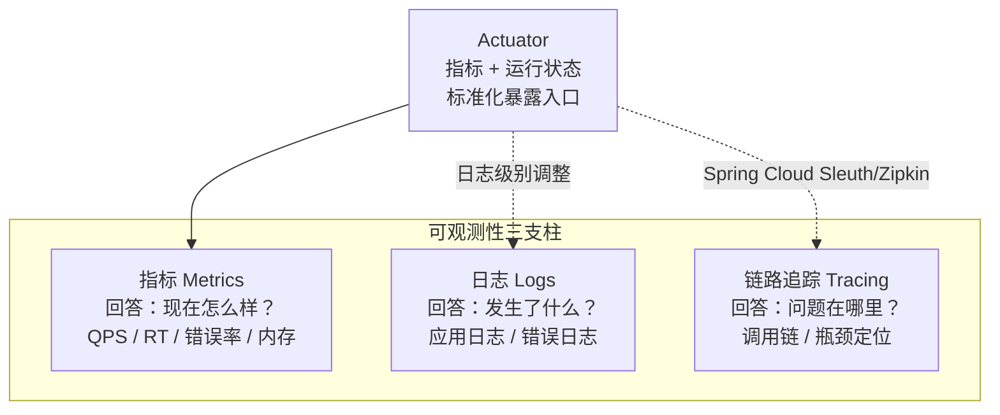
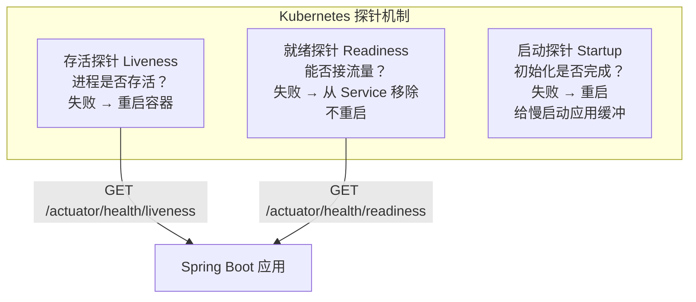
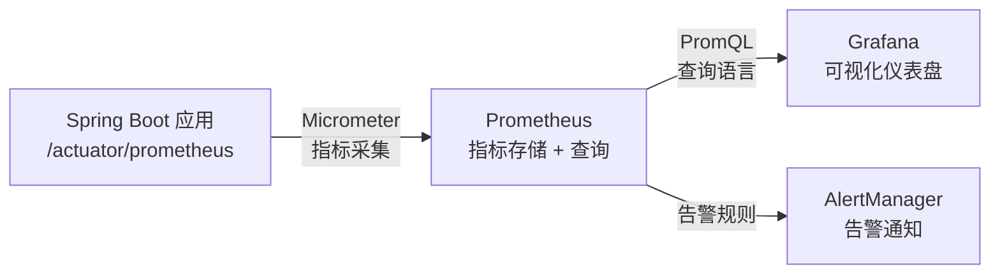

# Actuator 与可观测性接入

## 为什么需要可观测性

Spring Boot 真正适合生产环境,不只是因为开发快,还因为它天然支持健康检查、指标暴露和运行信息接入。Actuator 就是这套能力的统一入口。

### 传统运维的困境

如果没有可观测性能力,项目上线后通常只能靠:

- **猜服务是不是活着**:进程在运行不代表服务正常
- **人工翻日志**:问题发生后被动排查,效率低
- **出问题后再补监控**:为时已晚,损失已经造成

这会让排障和发布风险都明显放大。

### 可观测性三支柱

现代可观测性通常包含三类能力:

1. **指标(Metrics)**:量化的测量数据,回答"现在怎么样"
   - QPS(每秒请求数)
   - RT(响应时间)
   - 错误率
   - JVM内存、CPU使用率

2. **日志(Logs)**:离散的事件记录,回答"发生了什么"
   - 应用日志
   - 访问日志
   - 错误日志

3. **链路追踪(Tracing)**:请求的完整调用链,回答"问题在哪里"
   - 跨服务调用链路
   - 性能瓶颈定位
   - 故障传播路径

Actuator 主要解决的是 Spring Boot 应用里的**指标**和**运行状态**接入入口问题。



::: tip Actuator 的定位
Actuator 不是完整的可观测性方案，而是**应用运行态的标准化暴露层**。它解决的是"把数据暴露出来"的问题，至于数据怎么存、怎么看、怎么告警，是 Prometheus、Grafana、ELK、Jaeger 等工具的事。
:::

## Actuator 核心概念

### Actuator 解决什么问题

Actuator 主要提供这些能力:

- **健康检查**:判断服务是否可用
- **指标暴露**:应用运行数据对外提供
- **应用信息**:版本、配置等元信息
- **环境与配置可见性**:配置来源和值
- **线程、日志、缓存等运行状态**:实时查看和调整

它的核心价值不是"多几个接口",而是把应用运行态标准化暴露出来,方便监控系统、容器平台和排障工具接入。

### 健康检查 vs 指标暴露

#### 健康检查(Health)

健康检查关注的是:

- **服务现在能不能对外提供能力**
- **关键依赖是否可用**

例如:

- 应用进程是否正常
- 数据库是否能连通
- 消息队列是否可访问
- Redis是否响应

#### 指标(Metrics)

指标关注的是:

- **服务当前运行得怎么样**
- **性能有没有恶化**
- **资源是否逼近上限**

例如:

- QPS:每秒请求数
- RT:响应时间(P95、P99)
- 错误率:失败请求占比
- JVM内存:堆内存使用情况
- 线程池状态:活跃线程数
- 数据库连接池:使用率

可以简单记为:

- `/health` 更关注"**活不活**"
- 指标更关注"**跑得怎么样**"

## Actuator 端点详解

### 常用端点列表

| 端点 | 作用 | 敏感度 |
|------|------|--------|
| `/actuator` | 所有端点列表 | 低 |
| `/actuator/health` | 健康检查 | 低 |
| `/actuator/info` | 应用基本信息 | 低 |
| `/actuator/metrics` | 指标列表与明细 | 中 |
| `/actuator/prometheus` | Prometheus格式指标 | 中 |
| `/actuator/env` | 环境变量与配置 | 高 |
| `/actuator/loggers` | 动态调整日志级别 | 高 |
| `/actuator/threaddump` | 线程转储 | 高 |
| `/actuator/heapdump` | 堆内存转储 | 高 |
| `/actuator/mappings` | URL映射信息 | 中 |
| `/actuator/beans` | Bean列表 | 中 |
| `/actuator/configprops` | 配置属性 | 高 |

::: danger 生产安全红线
**绝对不要**在生产环境暴露以下端点到公网：`env`、`loggers`、`threaddump`、`heapdump`、`configprops`、`beans`。这些端点会暴露：
- 数据库密码、API 密钥等敏感配置（`env`）
- 完整的线程栈和堆内存数据（`threaddump`、`heapdump`）
- 所有 Bean 和配置属性的内部结构（`beans`、`configprops`）

**推荐做法：**
1. 使用独立管理端口（`management.server.port=8081`），只监听内网
2. 只暴露必要端点：`health,info,prometheus`
3. 通过 Spring Security 或网络策略限制访问
:::

### health 端点

#### 基本配置

```yaml
management:
  endpoints:
    web:
      exposure:
        include: health
  endpoint:
    health:
      # 显示详细健康信息
      show-details: when_authorized  # never | always | when_authorized
      # 显示组件详细信息
      show-components: when_authorized
      # 探针配置
      probes:
        enabled: true
```

#### 健康状态

```json
{
  "status": "UP",
  "components": {
    "db": {
      "status": "UP",
      "details": {
        "database": "MySQL",
        "validationQuery": "isValid()"
      }
    },
    "redis": {
      "status": "UP",
      "details": {
        "version": "7.0.0"
      }
    },
    "diskSpace": {
      "status": "UP",
      "details": {
        "total": 107374182400,
        "free": 53687091200,
        "threshold": 10485760
      }
    }
  }
}
```

#### 状态值

- **UP**:正常
- **DOWN**:异常
- **OUT_OF_SERVICE**:暂停服务
- **UNKNOWN**:未知

#### 自定义健康检查

```java
@Component
public class CustomHealthIndicator implements HealthIndicator {
    
    @Autowired
    private ExternalServiceClient externalServiceClient;
    
    @Override
    public Health health() {
        // 检查外部服务
        try {
            if (externalServiceClient.isAvailable()) {
                return Health.up()
                    .withDetail("externalService", "available")
                    .build();
            } else {
                return Health.down()
                    .withDetail("externalService", "unavailable")
                    .build();
            }
        } catch (Exception e) {
            return Health.down()
                .withDetail("error", e.getMessage())
                .build();
        }
}
```

响应示例:

```json
{
  "status": "UP",
  "components": {
    "customHealth": {
      "status": "UP",
      "details": {
        "externalService": "available"
      }
    }
  }
}
```

> 注: 组件名为 Bean 名去掉 `HealthIndicator` 后缀,即 `customHealthIndicator` → `customHealth`。

#### 组合健康检查

```java
@Component
public class CompositeHealthIndicator implements HealthIndicator {
    
    @Autowired
    private List<HealthIndicator> indicators;
    
    @Override
    public Health health() {
        List<Health> healths = indicators.stream()
            .map(HealthIndicator::health)
            .collect(Collectors.toList());
        
        // 所有组件都健康才算健康
        boolean allUp = healths.stream()
            .allMatch(h -> h.getStatus() == Status.UP);
        
        if (allUp) {
            return Health.up()
                .withDetail("components", healths.size())
                .build();
        } else {
            return Health.down()
                .withDetail("components", healths)
                .build();
        }
    }
}
```

#### 存活探针和就绪探针



::: warning 探针设计原则
- **存活探针**只检查进程是否存活（如死锁检测），不要把外部依赖（如数据库）纳入存活判断——否则数据库短暂不可用会导致容器被反复重启
- **就绪探针**才应该包含数据库、Redis 等依赖检查——依赖不可用时暂停路由流量，但不重启容器
- **启动探针**给初始化慢的应用足够缓冲时间，避免存活探针在启动期误判
:::

Kubernetes 探针配置:

```yaml
management:
  endpoint:
    health:
      probes:
        enabled: true
```

访问端点:

- `/actuator/health/liveness`:存活探针(进程是否存活)
- `/actuator/health/readiness`:就绪探针(是否可以接流量)

```java
// 自定义存活探针
@Component
public class LivenessHealthIndicator implements HealthIndicator {
    
    @Override
    public Health health() {
        // 检查关键资源是否正常
        // 如:数据库连接池是否耗尽
        return Health.up().build();
    }
}

// 自定义就绪探针
@Component
public class ReadinessHealthIndicator implements HealthIndicator {
    
    @Override
    public Health health() {
        // 检查是否准备好接收流量
        // 如:预热是否完成、依赖服务是否可用
        return Health.up().build();
    }
}
```

> 注: 自定义 Indicator 默认只出现在完整的 `/actuator/health` 中,需要显式加入探针分组才会影响 liveness/readiness:
>
> ```yaml
> management:
>   endpoint:
>     health:
>       group:
>         liveness:
>           include: liveness,livenessHealth
>         readiness:
>           include: readiness,readinessHealth
> ```

#### Kubernetes 集成

```yaml
# Kubernetes Deployment配置
apiVersion: apps/v1
kind: Deployment
metadata:
  name: myapp
spec:
  template:
    spec:
      containers:
      - name: myapp
        image: myapp:latest
        livenessProbe:
          httpGet:
            path: /actuator/health/liveness
            port: 8080
          initialDelaySeconds: 30
          periodSeconds: 10
        readinessProbe:
          httpGet:
            path: /actuator/health/readiness
            port: 8080
          initialDelaySeconds: 10
          periodSeconds: 5
```

### info 端点

#### 配置应用信息

```yaml
management:
  info:
    env:
      enabled: true
    git:
      mode: full
    build:
      enabled: true

info:
  app:
    name: My Application
    description: Spring Boot Application
    version: 1.0.0
  author:
    name: John Doe
    email: john@example.com
```

#### 响应示例

```json
{
  "app": {
    "name": "My Application",
    "description": "Spring Boot Application",
    "version": "1.0.0"
  },
  "author": {
    "name": "John Doe",
    "email": "john@example.com"
  },
  "git": {
    "branch": "main",
    "commit": {
      "id": "abc123",
      "time": "2024-03-30T10:00:00Z"
    }
  },
  "build": {
    "artifact": "my-app",
    "name": "My App",
    "time": "2024-03-30T09:00:00Z",
    "version": "1.0.0",
    "group": "com.example"
  }
}
```

#### 自定义 InfoContributor

```java
@Component
public class CustomInfoContributor implements InfoContributor {
    
    @Autowired
    private BuildProperties buildProperties;
    
    @Override
    public void contribute(Info.Builder builder) {
        builder.withDetail("custom", 
            Map.of(
                "javaVersion", System.getProperty("java.version"),
                "osName", System.getProperty("os.name"),
                "buildTime", buildProperties.getTime(),
                "buildVersion", buildProperties.getVersion()
            )
        );
    }
}
```

### metrics 端点

#### 查看可用指标

```bash
GET /actuator/metrics

{
  "names": [
    "jvm.memory.used",
    "jvm.memory.max",
    "jvm.gc.pause",
    "process.cpu.usage",
    "http.server.requests",
    "hikaricp.connections.active",
    "hikaricp.connections.pending"
  ]
}
```

#### 查看具体指标

```bash
GET /actuator/metrics/jvm.memory.used

{
  "name": "jvm.memory.used",
  "description": "The amount of used memory",
  "baseUnit": "bytes",
  "measurements": [
    {
      "statistic": "VALUE",
      "value": 1.23456789E8
    }
  ],
  "availableTags": [
    {
      "tag": "area",
      "values": ["heap", "nonheap"]
    },
    {
      "tag": "id",
      "values": ["G1 Survivor Space", "G1 Old Gen", "G1 Eden Space"]
    }
  ]
}
```

#### 按标签过滤

```bash
GET /actuator/metrics/jvm.memory.used?tag=area:heap

{
  "name": "jvm.memory.used",
  "measurements": [
    {
      "statistic": "VALUE",
      "value": 8.7654321E7
    }
  ]
}
```

#### 常用指标分类

| 类别 | 指标示例 | 说明 |
|------|---------|------|
| JVM | jvm.memory.used<br>jvm.memory.max<br>jvm.gc.pause | JVM内存和GC |
| CPU | process.cpu.usage<br>system.cpu.usage | CPU使用率 |
| HTTP | http.server.requests<br>http.server.requests.active | HTTP请求统计 |
| 数据库 | hikaricp.connections.active<br>hikaricp.connections.pending | 连接池状态 |
| Tomcat | tomcat.threads.busy<br>tomcat.threads.current | Tomcat线程 |
| 自定义 | 自定义业务指标 | 业务监控 |

### prometheus 端点

#### 添加依赖

```xml
<dependency>
    <groupId>io.micrometer</groupId>
    <artifactId>micrometer-registry-prometheus</artifactId>
</dependency>
```

#### 配置

```yaml
management:
  endpoints:
    web:
      exposure:
        include: prometheus
  prometheus:
    metrics:
      export:
        enabled: true
```

#### Prometheus 格式示例

```bash
GET /actuator/prometheus

# HELP jvm_memory_used_bytes The amount of used memory
# TYPE jvm_memory_used_bytes gauge
jvm_memory_used_bytes{area="heap",id="G1 Old Gen",} 1.23456789E8
jvm_memory_used_bytes{area="heap",id="G1 Eden Space",} 2.3456789E7

# HELP http_server_requests_seconds  
# TYPE http_server_requests_seconds summary
http_server_requests_seconds_count{exception="None",method="GET",outcome="SUCCESS",status="200",uri="/api/users",} 100.0
http_server_requests_seconds_sum{exception="None",method="GET",outcome="SUCCESS",status="200",uri="/api/users",} 1.234
```

### env 端点

#### 查看环境变量

```bash
GET /actuator/env

{
  "activeProfiles": ["dev"],
  "propertySources": [
    {
      "name": "application.yml",
      "properties": {
        "server.port": {
          "value": "8080",
          "origin": "class path resource [application.yml]:2:13"
        }
      }
    }
  ]
}
```

#### 查看单个属性

```bash
GET /actuator/env/server.port

{
  "property": {
    "value": "8080",
    "origin": "class path resource [application.yml]:2:13"
  },
  "activeProfiles": ["dev"],
  "propertySources": [...]
}
```

#### 安全配置

**生产环境必须限制访问**:

```yaml
management:
  endpoint:
    env:
      enabled: false  # 禁用env端点
      
# 或使用Spring Security限制访问
management:
  endpoint:
    env:
      show-values: never  # 不显示值
```

### loggers 端点

#### 查看日志配置

```bash
GET /actuator/loggers

{
  "levels": ["OFF", "ERROR", "WARN", "INFO", "DEBUG", "TRACE"],
  "loggers": {
    "ROOT": {
      "configuredLevel": "INFO",
      "effectiveLevel": "INFO"
    },
    "com.example": {
      "configuredLevel": "DEBUG",
      "effectiveLevel": "DEBUG"
    }
  }
}
```

#### 查看单个Logger

```bash
GET /actuator/loggers/com.example

{
  "configuredLevel": "DEBUG",
  "effectiveLevel": "DEBUG"
}
```

#### 动态修改日志级别

```bash
POST /actuator/loggers/com.example
Content-Type: application/json

{
  "configuredLevel": "TRACE"
}
```

#### 实用场景

动态调整日志级别应优先直接使用 `/actuator/loggers` 端点,无需自己写接口:

```bash
# 生产环境临时开启 DEBUG 排查问题
curl -X POST http://localhost:8081/actuator/loggers/com.example \
     -H 'Content-Type: application/json' \
     -d '{"configuredLevel": "DEBUG"}'
```

### threaddump 端点

#### 获取线程转储

```bash
GET /actuator/threaddump

[
  {
    "threadName": "main",
    "threadState": "RUNNABLE",
    "priority": 5,
    "stackTrace": [...]
  },
  {
    "threadName": "http-nio-8080-exec-1",
    "threadState": "WAITING",
    "priority": 5,
    "stackTrace": [...]
  }
]
```

#### 使用场景

- 排查CPU高占用问题
- 定位线程阻塞
- 分析死锁

### heapdump 端点

#### 获取堆转储

```bash
GET /actuator/heapdump

# 返回二进制文件,可用jvisualvm或MAT分析
```

#### 使用场景

- 排查内存泄漏
- 分析大对象
- 内存优化

#### 安全配置

```yaml
management:
  endpoint:
    heapdump:
      enabled: false  # 生产环境建议禁用
```

## 自定义指标

### 使用 Micrometer

#### 添加依赖

```xml
<dependency>
    <groupId>io.micrometer</groupId>
    <artifactId>micrometer-core</artifactId>
</dependency>
```

#### 计数器(Counter)

```java
@Service
public class OrderService {
    
    private final Counter orderCounter;
    
    public OrderService(MeterRegistry meterRegistry) {
        this.orderCounter = Counter.builder("orders.created")
            .description("Total orders created")
            .tag("type", "normal")
            .register(meterRegistry);
    }
    
    public Order createOrder(OrderDto orderDto) {
        Order order = // 创建订单逻辑
        
        // 增加计数
        orderCounter.increment();
        
        return order;
    }
}
```

#### 仪表(Gauge)

```java
@Service
public class UserService {
    
    private final AtomicInteger activeUsers = new AtomicInteger(0);
    
    public UserService(MeterRegistry meterRegistry) {
        // 注册仪表,实时报告当前值
        meterRegistry.gauge("users.active", activeUsers);
    }
    
    public void userLogin() {
        activeUsers.incrementAndGet();
    }
    
    public void userLogout() {
        activeUsers.decrementAndGet();
    }
}
```

#### 计时器(Timer)

```java
@Service
public class PaymentService {
    
    private final Timer paymentTimer;
    
    public PaymentService(MeterRegistry meterRegistry) {
        this.paymentTimer = Timer.builder("payments.processing")
            .description("Payment processing time")
            .tag("method", "credit_card")
            .register(meterRegistry);
    }
    
    public PaymentResult processPayment(PaymentRequest request) {
        return paymentTimer.record(() -> {
            // 计时执行支付逻辑
            return doProcessPayment(request);
        });
    }
}
```

#### 分布摘要(DistributionSummary)

```java
@Service
public class FileService {
    
    private final DistributionSummary fileSizeSummary;
    
    public FileService(MeterRegistry meterRegistry) {
        this.fileSizeSummary = DistributionSummary.builder("files.uploaded.size")
            .description("Size of uploaded files")
            .baseUnit("bytes")
            .tags("type", "image")
            .register(meterRegistry);
    }
    
    public void uploadFile(MultipartFile file) {
        // 记录文件大小分布
        fileSizeSummary.record(file.getSize());
        
        // 上传逻辑
    }
}
```

### 自定义 Metrics 端点

```java
@RestController
@RequestMapping("/api/metrics")
public class MetricsController {
    
    @Autowired
    private MeterRegistry meterRegistry;
    
    @GetMapping("/custom")
    public Map<String, Object> getCustomMetrics() {
        Map<String, Object> metrics = new HashMap<>();
        
        // 订单总数
        Counter orderCounter = meterRegistry.find("orders.created").counter();
        if (orderCounter != null) {
            metrics.put("totalOrders", orderCounter.count());
        }
        
        // 活跃用户数
        Gauge activeUsers = meterRegistry.find("users.active").gauge();
        if (activeUsers != null) {
            metrics.put("activeUsers", activeUsers.value());
        }
        
        // 支付平均耗时
        Timer paymentTimer = meterRegistry.find("payments.processing").timer();
        if (paymentTimer != null) {
            metrics.put("avgPaymentTime", paymentTimer.mean(java.util.concurrent.TimeUnit.MILLISECONDS));
        }
        
        return metrics;
    }
}
```

### 使用 @Timed 注解

```java
@RestController
@RequestMapping("/api/users")
@Timed(value = "user.api", description = "User API metrics")
public class UserController {
    
    @GetMapping
    @Timed(value = "user.api.list", description = "List users", percentiles = {0.5, 0.95, 0.99})
    public List<User> getAllUsers() {
        return userService.findAll();
    }
    
    @GetMapping("/{id}")
    @Timed(value = "user.api.get", description = "Get user by ID")
    public User getUser(@PathVariable Long id) {
        return userService.findById(id);
    }
}
```

## Prometheus + Grafana 集成



::: tip 集成要点
1. Spring Boot 应用添加 `micrometer-registry-prometheus` 依赖，暴露 `/actuator/prometheus` 端点
2. Prometheus 配置 `scrape_configs` 指向应用的 `/actuator/prometheus`，定期拉取指标
3. Grafana 添加 Prometheus 数据源，导入或自定义 Dashboard
4. 生产环境建议：Prometheus 使用 `federation` 做分层聚合，Grafana 使用文件夹组织多应用仪表盘
:::

### Prometheus 配置

#### prometheus.yml

```yaml
global:
  scrape_interval: 15s
  evaluation_interval: 15s

scrape_configs:
  - job_name: 'spring-boot-app'
    metrics_path: '/actuator/prometheus'
    static_configs:
      - targets: ['localhost:8080']
    relabel_configs:
      - source_labels: [__address__]
        target_label: instance
```

### Grafana Dashboard

#### 导入现成Dashboard

推荐使用:
- **JVM (Micrometer)**: Dashboard ID 4701
- **Spring Boot 2.1 Statistics**: Dashboard ID 12900

#### 自定义Dashboard示例

```json
{
  "title": "Spring Boot Application",
  "panels": [
    {
      "title": "JVM Memory",
      "type": "graph",
      "targets": [
        {
          "expr": "jvm_memory_used_bytes{area=\"heap\"}",
          "legendFormat": "Heap Used"
        },
        {
          "expr": "jvm_memory_max_bytes{area=\"heap\"}",
          "legendFormat": "Heap Max"
        }
      ]
    },
    {
      "title": "HTTP Requests",
      "type": "graph",
      "targets": [
        {
          "expr": "rate(http_server_requests_seconds_count[5m])",
          "legendFormat": "{{uri}}"
        }
      ]
    },
    {
      "title": "Response Time (P95)",
      "type": "graph",
      "targets": [
        {
          "expr": "histogram_quantile(0.95, rate(http_server_requests_seconds_bucket[5m]))",
          "legendFormat": "{{uri}}"
        }
      ]
    }
  ]
}
```

### 告警规则

#### Prometheus 告警规则

```yaml
groups:
  - name: spring_boot_alerts
    rules:
      # 应用健康检查失败
      - alert: ApplicationDown
        expr: up{job="spring-boot-app"} == 0
        for: 1m
        labels:
          severity: critical
        annotations:
          summary: "Application {{ $labels.instance }} is down"
          description: "{{ $labels.instance }} has been down for more than 1 minute"
      
      # JVM堆内存使用率过高
      - alert: HighHeapMemoryUsage
        expr: (jvm_memory_used_bytes{area="heap"} / jvm_memory_max_bytes{area="heap"}) * 100 > 85
        for: 5m
        labels:
          severity: warning
        annotations:
          summary: "High heap memory usage on {{ $labels.instance }}"
          description: "Heap memory usage is {{ $value }}%"
      
      # HTTP错误率过高
      - alert: HighErrorRate
        expr: rate(http_server_requests_seconds_count{status=~"5.."}[5m]) / rate(http_server_requests_seconds_count[5m]) * 100 > 5
        for: 5m
        labels:
          severity: critical
        annotations:
          summary: "High error rate on {{ $labels.instance }}"
          description: "Error rate is {{ $value }}%"
      
      # 响应时间过长
      - alert: SlowResponseTime
        expr: histogram_quantile(0.95, rate(http_server_requests_seconds_bucket[5m])) > 1
        for: 5m
        labels:
          severity: warning
        annotations:
          summary: "Slow response time on {{ $labels.instance }}"
          description: "P95 response time is {{ $value }}s"
```

## Spring Boot 3.x Observability

Spring Boot 3.x 引入了新的可观测性 API,统一了 tracing 和 metrics。

### 添加依赖

```xml
<dependency>
    <groupId>org.springframework.boot</groupId>
    <artifactId>spring-boot-starter-actuator</artifactId>
</dependency>

<!-- 分布式追踪 -->
<dependency>
    <groupId>io.micrometer</groupId>
    <artifactId>micrometer-tracing-bridge-brave</artifactId>
</dependency>
<dependency>
    <groupId>io.zipkin.reporter2</groupId>
    <artifactId>zipkin-reporter-brave</artifactId>
</dependency>

<!-- 或使用 OpenTelemetry -->
<dependency>
    <groupId>io.micrometer</groupId>
    <artifactId>micrometer-tracing-bridge-otel</artifactId>
</dependency>
<dependency>
    <groupId>io.opentelemetry</groupId>
    <artifactId>opentelemetry-exporter-zipkin</artifactId>
</dependency>
```

### 配置

```yaml
management:
  tracing:
    enabled: true
    sampling:
      probability: 1.0  # 采样率(生产环境建议0.1)
  zipkin:
    tracing:
      endpoint: http://localhost:9411/api/v2/spans
```

### 自定义 Span

```java
@Service
public class OrderService {
    
    @Autowired
    private Tracer tracer;
    
    public Order createOrder(OrderDto orderDto) {
        // 创建自定义Span
        Span span = tracer.nextSpan().name("create-order");
        
        try (Tracer.SpanInScope ws = tracer.withSpan(span.start())) {
            // 业务逻辑
            Order order = doCreateOrder(orderDto);
            
            // 添加事件
            span.event("order.created");
            
            // 添加标签
            span.tag("order.id", order.getId().toString());
            span.tag("order.amount", order.getAmount().toString());
            
            return order;
        } finally {
            span.end();
        }
    }
}
```

### 使用 @Observed 注解

```java
@Configuration
public class ObservabilityConfig {
    
    @Bean
    ObservedAspect observedAspect(ObservationRegistry registry) {
        return new ObservedAspect(registry);
    }
}

@Service
public class PaymentService {
    
    @Observed(name = "payment.process", 
              contextualName = "process-payment",
              lowCardinalityKeyValues = {"paymentType", "credit_card"})
    public PaymentResult processPayment(PaymentRequest request) {
        // 自动创建观察
        return doProcessPayment(request);
    }
}
```

## 生产环境最佳实践

### 端点暴露策略

#### 开发环境

```yaml
management:
  endpoints:
    web:
      exposure:
        include: "*"
  endpoint:
    health:
      show-details: always
    env:
      show-values: always
```

#### 生产环境

```yaml
management:
  endpoints:
    web:
      exposure:
        include: health,info,metrics,prometheus
      base-path: /actuator
  endpoint:
    health:
      show-details: when_authorized
      probes:
        enabled: true
    env:
      enabled: false
    heapdump:
      enabled: false
    threaddump:
      enabled: false
  # 注:management.security.enabled 在 Boot 2.0 起已移除,访问控制请使用 Spring Security(见下节)
```

### 安全配置

```java
@Configuration
public class ActuatorSecurityConfig {
    
    @Bean
    public SecurityFilterChain actuatorSecurityFilterChain(HttpSecurity http) throws Exception {
        http
            .requestMatcher(EndpointRequest.toAnyEndpoint())
            .authorizeHttpRequests(authz -> authz
                .requestMatchers(EndpointRequest.to("health", "info", "prometheus")).permitAll()
                .anyRequest().hasRole("ACTUATOR")
            )
            .httpBasic(withDefaults());
        
        return http.build();
    }
}
```

### 网络隔离

```yaml
# 仅内网访问
server:
  port: 8080

management:
  server:
    port: 8081  # 使用独立端口
    address: 0.0.0.0  # 或限制为内网IP: 192.168.1.100
```

### 性能考虑

```yaml
management:
  endpoints:
    web:
      exposure:
        include: health,info,prometheus
  metrics:
    tags:
      application: ${spring.application.name}
    distribution:
      percentiles-histogram:
        http.server.requests: true
      percentiles:
        http.server.requests: 0.5,0.95,0.99
    web:
      server:
        request:
          autotime:
            enabled: true
            percentiles: 0.5,0.95,0.99
```

## 实战案例:完整的可观测性系统

### 项目结构

```
src/main/java/com/example/ecommerce/
├── config/
│   ├── ActuatorConfig.java
│   ├── MetricsConfig.java
│   └── ObservabilityConfig.java
├── metrics/
│   ├── OrderMetrics.java
│   ├── UserMetrics.java
│   └── PaymentMetrics.java
├── health/
│   ├── DatabaseHealthIndicator.java
│   ├── RedisHealthIndicator.java
│   └── ExternalServiceHealthIndicator.java
└── controller/
    └── MetricsController.java
```

### 自定义健康检查

```java
@Component
public class DatabaseHealthIndicator implements HealthIndicator {
    
    @Autowired
    private DataSource dataSource;
    
    @Override
    public Health health() {
        try (Connection connection = dataSource.getConnection()) {
            // 执行简单查询验证数据库连接
            try (Statement stmt = connection.createStatement();
                 ResultSet rs = stmt.executeQuery("SELECT 1")) {
                
                if (rs.next()) {
                    return Health.up()
                        .withDetail("database", "MySQL")
                        .withDetail("validationQuery", "SELECT 1")
                        .build();
                }
            }
        } catch (SQLException e) {
            return Health.down()
                .withDetail("error", e.getMessage())
                .build();
        }
        
        return Health.unknown().build();
    }
}

@Component
public class RedisHealthIndicator implements HealthIndicator {
    
    @Autowired
    private RedisTemplate<String, Object> redisTemplate;
    
    @Override
    public Health health() {
        try {
            // 执行PING命令
            String result = redisTemplate.getConnectionFactory()
                .getConnection()
                .ping();
            
            if ("PONG".equalsIgnoreCase(result)) {
                return Health.up()
                    .withDetail("redis", "available")
                    .build();
            } else {
                return Health.down()
                    .withDetail("redis", "unavailable")
                    .build();
            }
        } catch (Exception e) {
            return Health.down()
                .withDetail("error", e.getMessage())
                .build();
        }
    }
}
```

### 自定义业务指标

```java
@Component
public class OrderMetrics {
    
    private final Counter orderCounter;
    private final Counter orderSuccessCounter;
    private final Counter orderFailureCounter;
    private final Timer orderProcessingTimer;
    private final DistributionSummary orderAmountSummary;
    
    public OrderMetrics(MeterRegistry meterRegistry) {
        // 订单总数
        this.orderCounter = Counter.builder("orders.total")
            .description("Total number of orders")
            .tag("type", "all")
            .register(meterRegistry);
        
        // 成功订单数
        this.orderSuccessCounter = Counter.builder("orders.total")
            .description("Total number of successful orders")
            .tag("status", "success")
            .register(meterRegistry);
        
        // 失败订单数
        this.orderFailureCounter = Counter.builder("orders.total")
            .description("Total number of failed orders")
            .tag("status", "failure")
            .register(meterRegistry);
        
        // 订单处理时间
        this.orderProcessingTimer = Timer.builder("orders.processing.time")
            .description("Order processing time")
            .register(meterRegistry);
        
        // 订单金额分布
        this.orderAmountSummary = DistributionSummary.builder("orders.amount")
            .description("Order amount distribution")
            .baseUnit("yuan")
            .register(meterRegistry);
    }
    
    public void recordOrderCreated() {
        orderCounter.increment();
    }
    
    public void recordOrderSuccess() {
        orderSuccessCounter.increment();
    }
    
    public void recordOrderFailure() {
        orderFailureCounter.increment();
    }
    
    public Timer.Sample startTimer() {
        return Timer.start();
    }
    
    public void recordProcessingTime(Timer.Sample sample) {
        sample.stop(orderProcessingTimer);
    }
    
    public void recordOrderAmount(double amount) {
        orderAmountSummary.record(amount);
    }
}
```

### 在业务代码中使用

```java
@Service
public class OrderService {
    
    @Autowired
    private OrderMetrics orderMetrics;
    
    @Autowired
    private Tracer tracer;
    
    public Order createOrder(OrderDto orderDto) {
        // 开始计时
        Timer.Sample sample = orderMetrics.startTimer();
        
        // 创建Span
        Span span = tracer.nextSpan().name("create-order");
        
        try (Tracer.SpanInScope ws = tracer.withSpan(span.start())) {
            // 创建订单
            Order order = doCreateOrder(orderDto);
            
            // 记录指标
            orderMetrics.recordOrderCreated();
            orderMetrics.recordOrderSuccess();
            orderMetrics.recordOrderAmount(order.getAmount());
            
            // 记录事件
            span.event("order.created");
            span.tag("order.id", order.getId().toString());
            
            return order;
        } catch (Exception e) {
            // 记录失败
            orderMetrics.recordOrderFailure();
            
            span.event("order.creation.failed");
            span.tag("error", e.getMessage());
            
            throw new IllegalStateException("创建订单失败", e);
        } finally {
            // 记录处理时间
            orderMetrics.recordProcessingTime(sample);
            
            span.end();
        }
    }
}
```

## 常见误区

### 误区1: 引入Actuator但从不接监控系统

```yaml
# × 错误:配置了Actuator但没有接入监控系统
management:
  endpoints:
    web:
      exposure:
        include: "*"

# √ 正确:接入Prometheus等监控系统
management:
  endpoints:
    web:
      exposure:
        include: health,info,prometheus
  prometheus:
    metrics:
      export:
        enabled: true
```

### 误区2: 健康检查只看应用活着,不看关键依赖

```java
// × 错误:只检查应用是否存活
@Component
public class SimpleHealthIndicator implements HealthIndicator {
    @Override
    public Health health() {
        return Health.up().build();
    }
}

// √ 正确:检查所有关键依赖
@Component
public class CompositeHealthIndicator implements HealthIndicator {
    
    @Autowired
    private DataSource dataSource;
    
    @Autowired
    private RedisTemplate redisTemplate;
    
    @Override
    public Health health() {
        Health.Builder builder = Health.up();
        
        // 检查数据库
        try (Connection conn = dataSource.getConnection()) {
            builder.withDetail("database", "up");
        } catch (SQLException e) {
            builder.down().withDetail("database", "down");
        }
        
        // 检查Redis
        try {
            redisTemplate.getConnectionFactory().getConnection().ping();
            builder.withDetail("redis", "up");
        } catch (Exception e) {
            builder.down().withDetail("redis", "down");
        }
        
        return builder.build();
    }
}
```

### 误区3: 所有端点全量暴露到公网

```yaml
# × 错误:暴露所有端点
management:
  endpoints:
    web:
      exposure:
        include: "*"

# √ 正确:只暴露必要端点,且限制访问
management:
  endpoints:
    web:
      exposure:
        include: health,info,prometheus
  server:
    port: 8081  # 独立端口,内网访问
```

### 误区4: 只看机器指标,不看应用指标

```java
// × 错误:只监控CPU、内存等机器指标

// √ 正确:同时监控业务指标
@Component
public class BusinessMetrics {
    
    private final Counter orderCounter;
    private final Timer orderTimer;
    
    public BusinessMetrics(MeterRegistry registry) {
        // 订单业务指标
        this.orderCounter = Counter.builder("business.orders")
            .description("Business order count")
            .register(registry);
        
        this.orderTimer = Timer.builder("business.order.processing")
            .description("Order processing time")
            .register(registry);
    }
}
```

### 误区5: 把Actuator当成"有个 /health 就够了"

```yaml
# × 错误:只使用health端点
management:
  endpoints:
    web:
      exposure:
        include: health

# √ 正确:全面使用可观测性能力
management:
  endpoints:
    web:
      exposure:
        include: health,info,metrics,prometheus
  metrics:
    distribution:
      percentiles-histogram:
        http.server.requests: true
  tracing:
    enabled: true
```

## 面试要点

### 基础知识类

**1. Actuator 解决的核心问题是什么?**

Actuator 解决的核心问题是:**标准化暴露应用运行态信息,便于监控与排障**。

它提供了:
- 健康检查:判断服务是否可用
- 指标暴露:应用运行数据对外提供
- 应用信息:版本、配置等元信息
- 运行状态查看:线程、日志、缓存等

---

**2. 健康检查和指标暴露有什么区别?**

| 特性 | 健康检查 | 指标暴露 |
|------|---------|---------|
| 关注点 | "活不活" | "跑得怎么样" |
| 内容 | 服务可用性、依赖状态 | 性能数据、资源使用 |
| 用途 | 容器探针、负载均衡 | 监控告警、性能分析 |
| 示例 | 数据库连接、Redis可用性 | QPS、RT、内存使用率 |

---

**3. 常用的Actuator端点有哪些?**

| 端点 | 作用 |
|------|------|
| /health | 健康检查 |
| /info | 应用信息 |
| /metrics | 指标列表与明细 |
| /prometheus | Prometheus格式指标 |
| /env | 环境变量与配置 |
| /loggers | 动态调整日志级别 |
| /threaddump | 线程转储 |
| /heapdump | 堆内存转储 |

---

**4. 如何自定义健康检查?**

实现 `HealthIndicator` 接口:

```java
@Component
public class CustomHealthIndicator implements HealthIndicator {
    
    @Override
    public Health health() {
        // 检查逻辑
        if (checkPassed()) {
            return Health.up()
                .withDetail("key", "value")
                .build();
        } else {
            return Health.down()
                .withDetail("error", "message")
                .build();
        }
    }
}
```

---

**5. 如何自定义指标?**

使用 Micrometer:

```java
@Service
public class OrderService {
    
    private final Counter orderCounter;
    
    public OrderService(MeterRegistry registry) {
        this.orderCounter = Counter.builder("orders.total")
            .description("Total orders")
            .register(registry);
    }
    
    public void createOrder() {
        orderCounter.increment();
    }
}
```

---

### 技术深度类

**6. 什么是存活探针和就绪探针?有什么区别?**

| 探针类型 | 作用 | Kubernetes配置 |
|---------|------|----------------|
| 存活探针(Liveness) | 判断进程是否存活,失败则重启 | livenessProbe |
| 就绪探针(Readiness) | 判断是否可以接流量,失败则暂停路由 | readinessProbe |

区别:
- 存活探针失败:容器重启
- 就绪探针失败:从Service移除,但不重启

---

**7. 如何与Prometheus集成?**

步骤:
1. 添加依赖: `micrometer-registry-prometheus`
2. 配置: `management.endpoints.web.exposure.include=prometheus`
3. Prometheus配置抓取: `metrics_path: /actuator/prometheus`
4. Grafana可视化

---

**8. Spring Boot 3.x的可观测性新特性是什么?**

Spring Boot 3.x 引入了统一的 Observability API:
- 统一的 Tracing 和 Metrics
- 支持 OpenTelemetry
- 使用 `@Observed` 注解
- 自动生成 Span

```java
@Observed(name = "payment.process")
public PaymentResult processPayment() {
    // 自动观察
}
```

---

**9. 生产环境如何配置Actuator?**

最佳实践:
1. 最小暴露:只暴露必要端点
2. 独立端口:使用management.server.port
3. 权限控制:使用Spring Security
4. 禁用敏感端点:env、heapdump、threaddump
5. 限制网络:仅内网访问

---

**10. 如何设计完整的可观测性系统?**

三支柱:
1. **指标(Metrics)**: Actuator + Prometheus + Grafana
2. **日志(Logs)**: Logback + ELK Stack
3. **链路追踪(Tracing)**: Micrometer Tracing + Zipkin/Jaeger

---

### 实战场景类

**11. 如何排查CPU高占用问题?**

步骤:
1. 访问 `/actuator/metrics/process.cpu.usage` 查看CPU使用率
2. 访问 `/actuator/threaddump` 获取线程转储
3. 使用 jvisualvm 或在线工具分析
4. 定位CPU占用高的线程
5. 查看线程堆栈,找到问题代码

---

**12. 如何排查内存泄漏问题?**

步骤:
1. 访问 `/actuator/metrics/jvm.memory.used` 查看内存趋势
2. 访问 `/actuator/heapdump` 下载堆转储
3. 使用 MAT 或 jvisualvm 分析
4. 查找大对象
5. 分析GC Roots,找到泄漏点

---

**13. 如何动态调整日志级别?**

使用 loggers 端点:

```bash
# 查看当前日志级别
GET /actuator/loggers/com.example

# 修改日志级别
POST /actuator/loggers/com.example
Content-Type: application/json

{
  "configuredLevel": "DEBUG"
}
```

---

**14. 如何配置告警规则?**

Prometheus告警规则示例:

```yaml
groups:
  - name: app_alerts
    rules:
      - alert: HighErrorRate
        expr: rate(http_server_requests_seconds_count{status=~"5.."}[5m]) / rate(http_server_requests_seconds_count[5m]) > 0.05
        for: 5m
        labels:
          severity: critical
        annotations:
          summary: "High error rate detected"
```

---

**15. 如何监控数据库连接池?**

HikariCP 指标:
- `hikaricp.connections.active`: 活跃连接数
- `hikaricp.connections.idle`: 空闲连接数
- `hikaricp.connections.pending`: 等待连接数
- `hikaricp.connections.max`: 最大连接数

```yaml
# 配置HikariCP指标
spring:
  datasource:
    hikari:
      register-mbeans: true
```

---

### 架构设计类

**16. 如何设计多服务的统一监控架构?**

架构:
```
各服务 Actuator → Prometheus → Grafana → AlertManager
                                    ↓
                               统一Dashboard
```

要点:
1. 每个服务暴露 `/actuator/prometheus`
2. Prometheus统一抓取
3. Grafana创建统一Dashboard
4. 配置告警规则

---

**17. 如何处理敏感信息的监控?**

策略:
1. 禁用敏感端点: env、heapdump
2. 配置不显示值: `show-values: never`
3. 权限控制: 限制访问
4. 网络隔离: 独立端口,内网访问

---

**18. 如何优化监控性能?**

优化策略:
1. 降低采样率: `management.tracing.sampling.probability: 0.1`
2. 批量上报: 配置批量发送
3. 异步处理: 使用异步Appender
4. 指标聚合: 减少高基数标签

## 总结

Actuator 是 Spring Boot 生产级应用的重要组成部分,提供了标准化的可观测性能力。

**核心要点**:

1. **理解可观测性三支柱**: 指标、日志、链路追踪
2. **合理配置端点**: 最小暴露,权限控制
3. **接入监控系统**: Prometheus + Grafana
4. **自定义健康检查**: 检查所有关键依赖
5. **自定义业务指标**: 监控核心业务
6. **配置告警规则**: 及时发现问题
7. **使用新特性**: Spring Boot 3.x Observability

通过合理使用 Actuator,可以构建完整的可观测性体系,大大提高生产环境的问题排查能力和系统可靠性。

## 版本差异(旧版 → Spring Boot 3.5.x)

| 特性 | 旧版(Spring Boot 2.x) | Spring Boot 3.5.x |
|------|----------------------|-------------------|
| 指标体系 | Micrometer 1.x | Micrometer 1.14+ |
| 链路追踪 | Sleuth（停更） | Micrometer Tracing + OpenTelemetry |
| 端点安全 | management.endpoints | 不变；端点暴露需显式配置 |
| 健康检查 | 基础 HealthIndicator | 不变；支持 Liveness/Readiness 探针 |
| 观测端点 | /actuator/health 等 | 不变；新增更多可观测端点 |

> **重要变更**：Spring Cloud Sleuth 已停止维护，Spring Boot 3.x 使用 Micrometer Tracing（结合 OpenTelemetry 或 Zipkin）实现分布式链路追踪。