# 日志体系与生产实践

## 概述

日志是应用可观测性的基础。Spring Boot 的日志体系基于 SLF4J + Logback，开箱即用但生产环境需要深度调优。本篇分析日志框架的自动配置原理、SLF4J 绑定与桥接机制、Logback 深度配置、异步日志方案、MDC 分布式追踪、日志脱敏、结构化日志、日志规范以及日志采集与告警方案。

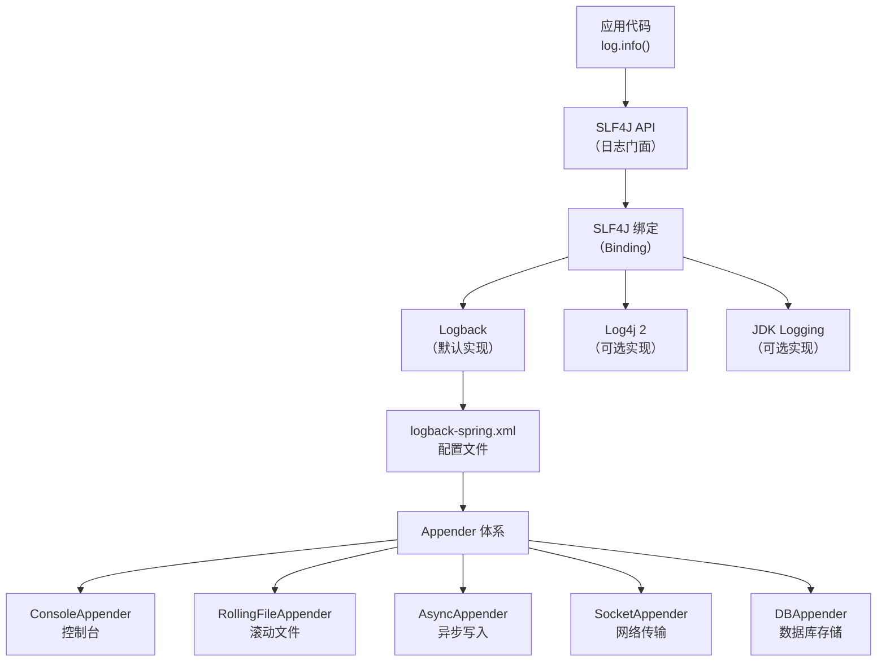

## SLF4J 门面模式

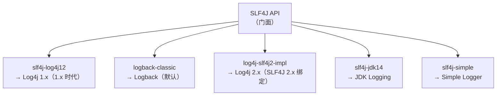

::: tip 为什么用 SLF4J 而不是直接用 Logback
SLF4J 是日志门面（Facade），解耦了应用代码和日志实现。切换日志框架只需更换依赖，无需修改代码。Spring Boot 默认使用 SLF4J + Logback，但如果需要切换到 Log4j2，只需排除 `spring-boot-starter-logging` 并引入 `spring-boot-starter-log4j2`。
:::

## SLF4J 深度：绑定机制与桥接器

### 绑定机制（Binding）

SLF4J 的核心设计是**接口与实现分离、运行时绑定**。应用代码只依赖 `slf4j-api` 接口，运行时通过类路径上的绑定实现类来决定实际使用的日志框架。

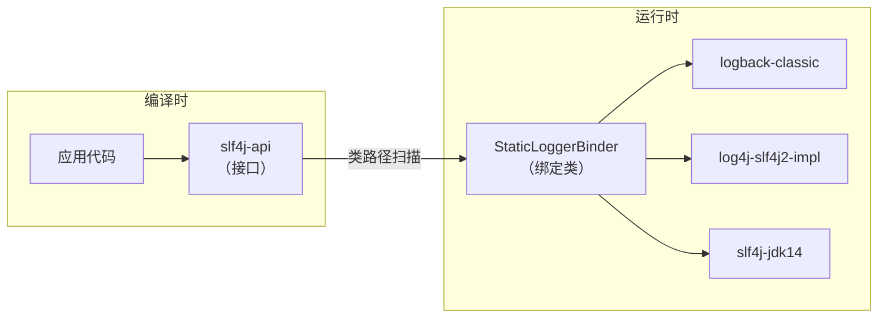

SLF4J 通过 `LoggerFactory` 在类路径上查找绑定实现（SLF4J 1.x 查找 `org/slf4j/impl/StaticLoggerBinder.class`，由具体日志框架提供；**SLF4J 2.x / Spring Boot 3.x 已改用 `ServiceLoader` 查找 `org.slf4j.spi.SLF4JServiceProvider`**，如 `logback-classic` 1.3+ 提供的 `LogbackServiceProvider`）。类路径上只能有一个绑定实现，否则 SLF4J 会报警告。

```java
// SLF4J 绑定查找过程（简化版）
public final class LoggerFactory {

    // 编译时不存在 StaticLoggerBinder 的引用
    // 运行时通过类加载器查找绑定
    private static String STATIC_LOGGER_BINDER_PATH =
            "org/slf4j/impl/StaticLoggerBinder.class";

    static {
        // 扫描类路径上所有 StaticLoggerBinder 实现
        Set<URL> binderSet = findPossibleStaticLoggerBinderPathSet();
        // 如果有多个绑定，输出警告
        if (binderSet.size() > 1) {
            reportMultipleBindingAmbiguity(binderSet);
        }
    }
}
```

::: warning 类路径上只能有一个 SLF4J 绑定
如果类路径上同时存在多个 SLF4J 绑定（如 `logback-classic` 和 `slf4j-log4j12`），SLF4J 会随机选择一个绑定，并输出警告日志。这会导致日志行为不可预测。排查方法：

```bash
# 查看类路径上的绑定冲突
mvn dependency:tree | grep slf4j
```

常见冲突来源：第三方库传递依赖了不同的 SLF4J 绑定。解决方法是用 `<exclusions>` 排除多余的绑定。
:::

### 桥接器（Bridge）

桥接器（Bridge）解决的是**遗留代码**问题：已有代码使用其他日志框架 API（如 Log4j 1.x、JCL、JUL），但你想统一用 SLF4J + Logback 输出。

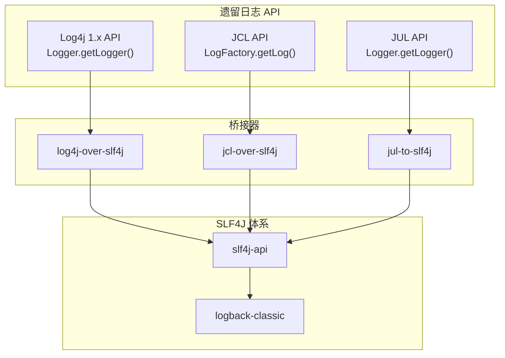

桥接器的原理是**替换原始日志框架的类**。例如 `log4j-over-slf4j` 包含了与 Log4j 1.x 完全相同的类名（如 `org.apache.log4j.Logger`），但实现是将调用转发给 SLF4J。这样依赖 Log4j 1.x API 的第三方库无需修改，日志就能统一走 SLF4J。

```xml
<!-- 常用桥接器依赖 -->
<!-- 桥接 Log4j 1.x → SLF4J -->
<dependency>
    <groupId>org.slf4j</groupId>
    <artifactId>log4j-over-slf4j</artifactId>
</dependency>

<!-- 桥接 JCL (Jakarta Commons Logging) → SLF4J -->
<dependency>
    <groupId>org.slf4j</groupId>
    <artifactId>jcl-over-slf4j</artifactId>
</dependency>

<!-- 桥接 JUL (java.util.logging) → SLF4J -->
<dependency>
    <groupId>org.slf4j</groupId>
    <artifactId>jul-to-slf4j</artifactId>
</dependency>
```

::: danger 绝对禁止同时存在桥接器和反向桥接
**桥接器**（如 `log4j-over-slf4j`）将 Log4j 调用转发给 SLF4J，而**反向桥接器**（如 `slf4j-log4j12`）将 SLF4J 调用转发给 Log4j。如果两者同时存在，会形成**无限循环**：

```
Log4j API → log4j-over-slf4j → SLF4J → slf4j-log4j12 → Log4j API → ...
```

这会导致 `StackOverflowError`，应用直接崩溃。Spring Boot 默认引入了 `log4j-over-slf4j` 和 `jul-to-slf4j`，如果手动添加 `slf4j-log4j12` 就会触发循环。
:::

### 日志框架迁移实战

从 Log4j 1.x 迁移到 SLF4J + Logback 的步骤：

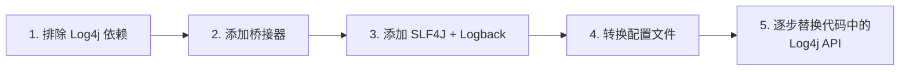

```xml
<!-- 步骤 1: 排除 Log4j 依赖 -->
<dependency>
    <groupId>some-library</groupId>
    <artifactId>some-library</artifactId>
    <exclusions>
        <exclusion>
            <groupId>log4j</groupId>
            <artifactId>log4j</artifactId>
        </exclusion>
    </exclusions>
</dependency>

<!-- 步骤 2: 添加桥接器（替代原 Log4j jar） -->
<dependency>
    <groupId>org.slf4j</groupId>
    <artifactId>log4j-over-slf4j</artifactId>
</dependency>

<!-- 步骤 3: 添加 SLF4J + Logback（Spring Boot 已默认包含） -->
<dependency>
    <groupId>ch.qos.logback</groupId>
    <artifactId>logback-classic</artifactId>
</dependency>
```

## Logback 深度配置

### Appender 体系

Logback 的 Appender 负责将日志事件输出到目标位置。核心 Appender 体系如下：

| Appender | 用途 | 适用环境 |
|----------|------|---------|
| `ConsoleAppender` | 输出到控制台 | 开发环境 |
| `FileAppender` | 输出到文件 | 测试环境 |
| `RollingFileAppender` | 滚动文件输出 | 生产环境 |
| `AsyncAppender` | 异步包装器 | 生产环境（配合其他 Appender） |
| `SocketAppender` | 输出到远程 Socket | 分布式日志收集 |
| `DBAppender` | 输出到数据库 | 审计日志 |
| `SMTPAppender` | 邮件通知 | 错误告警 |

#### ConsoleAppender

```xml
<!-- 控制台输出，带颜色高亮 -->
<appender name="CONSOLE" class="ch.qos.logback.core.ConsoleAppender">
    <encoder>
        <pattern>%d{yyyy-MM-dd HH:mm:ss.SSS} %highlight(%-5level) [%thread] %cyan(%logger{36}) - %msg%n</pattern>
    </encoder>
</appender>
```

#### RollingFileAppender

```xml
<!-- 滚动文件输出，按日期+大小滚动 -->
<appender name="ROLLING_FILE" class="ch.qos.logback.core.rolling.RollingFileAppender">
    <file>${LOG_PATH}/${APP_NAME}.log</file>

    <!-- 滚动策略：按日期和大小 -->
    <rollingPolicy class="ch.qos.logback.core.rolling.SizeAndTimeBasedRollingPolicy">
        <!-- 文件名模式：%d 日期，%i 序号 -->
        <fileNamePattern>${LOG_PATH}/${APP_NAME}.%d{yyyy-MM-dd}.%i.log.gz</fileNamePattern>
        <!-- 单个文件最大 200MB -->
        <maxFileSize>200MB</maxFileSize>
        <!-- 保留 30 天 -->
        <maxHistory>30</maxHistory>
        <!-- 所有归档文件总大小上限 10GB -->
        <totalSizeCap>10GB</totalSizeCap>
        <!-- 启动时清理过期归档 -->
        <cleanHistoryOnStart>true</cleanHistoryOnStart>
    </rollingPolicy>

    <encoder>
        <pattern>%d{yyyy-MM-dd HH:mm:ss.SSS} [%thread] %-5level %logger{36} - %msg%n</pattern>
        <charset>UTF-8</charset>
    </encoder>
</appender>
```

#### SocketAppender

```xml
<!-- 输出到远程日志服务器 -->
<appender name="SOCKET" class="ch.qos.logback.classic.net.SocketAppender">
    <remoteHost>log-server.internal</remoteHost>
    <port>4560</port>
    <!-- 重连间隔,单位为毫秒 -->
    <reconnectionDelay>30000</reconnectionDelay>
</appender>
```

#### DBAppender

```xml
<!-- 输出到数据库（审计日志场景） -->
<appender name="DB" class="ch.qos.logback.classic.db.DBAppender">
    <connectionSource class="ch.qos.logback.core.db.DataSourceConnectionSource">
        <dataSource class="com.zaxxer.hikari.HikariDataSource">
            <driverClassName>com.mysql.cj.jdbc.Driver</driverClassName>
            <jdbcUrl>jdbc:mysql://localhost:3306/audit_log</jdbcUrl>
            <username>log_user</username>
            <password>log_password</password>
        </dataSource>
    </connectionSource>
</appender>
```

::: warning DBAppender 的性能隐患
将日志直接写入数据库会带来额外延迟和数据库连接压力。建议：
1. 仅对审计级别的日志使用 DBAppender
2. 一定要搭配 AsyncAppender 使用
3. 使用独立的数据库实例，避免影响业务数据库
4. 考虑使用消息队列异步写入数据库
:::

#### 自定义 Appender

当内置 Appender 无法满足需求时，可以自定义 Appender：

```java
/**
 * 自定义 Kafka Appender：将日志发送到 Kafka
 */
public class KafkaAppender extends UnsynchronizedAppenderBase<ILoggingEvent> {

    private String topic;
    private String bootstrapServers;
    private KafkaProducer<String, String> producer;

    // Logback 通过 setter 方法注入配置
    public void setTopic(String topic) {
        this.topic = topic;
    }

    public void setBootstrapServers(String bootstrapServers) {
        this.bootstrapServers = bootstrapServers;
    }

    @Override
    public void start() {
        // 初始化 Kafka Producer
        Properties props = new Properties();
        props.put("bootstrap.servers", bootstrapServers);
        props.put("key.serializer", "org.apache.kafka.common.serialization.StringSerializer");
        props.put("value.serializer", "org.apache.kafka.common.serialization.StringSerializer");
        producer = new KafkaProducer<>(props);
        super.start();
    }

    @Override
    protected void append(ILoggingEvent event) {
        String message = event.getFormattedMessage();
        ProducerRecord<String, String> record =
                new ProducerRecord<>(topic, message);
        producer.send(record, (metadata, exception) -> {
            if (exception != null) {
                // 发送失败时添加错误状态
                addError("发送日志到 Kafka 失败", exception);
            }
        });
    }

    @Override
    public void stop() {
        if (producer != null) {
            producer.close();
        }
        super.stop();
    }
}
```

```xml
<!-- 在 logback-spring.xml 中使用自定义 Appender -->
<appender name="KAFKA" class="com.example.log.KafkaAppender">
    <topic>app-logs</topic>
    <bootstrapServers>kafka:9092</bootstrapServers>
</appender>
```

### Encoder 配置

Encoder 负责将日志事件格式化为字节数组。常用 Encoder：

```xml
<!-- 1. PatternLayoutEncoder（最常用） -->
<encoder class="ch.qos.logback.classic.encoder.PatternLayoutEncoder">
    <pattern>%d{yyyy-MM-dd HH:mm:ss.SSS} [%thread] %-5level %logger{36} - %msg%n</pattern>
    <charset>UTF-8</charset>
</encoder>

<!-- 2. LogstashEncoder（JSON 格式，ELK 集成推荐） -->
<encoder class="net.logstash.logback.encoder.LogstashEncoder">
    <customFields>{"app_name":"${APP_NAME}"}</customFields>
    <includeMdc>true</includeMdc>
    <includeContext>true</includeContext>
</encoder>

<!-- 3. LoggingEventCompositeJsonEncoder（细粒度 JSON 控制） -->
<encoder class="net.logstash.logback.encoder.LoggingEventCompositeJsonEncoder">
    <providers>
        <timestamp/>
        <logLevel/>
        <loggerName/>
        <message/>
        <stackTrace>
            <throwableConverter class="net.logstash.logback.stacktrace.ShortenedThrowableConverter">
                <maxDepthPerThrowable>20</maxDepthPerThrowable>
                <maxLength>2048</maxLength>
                <shortenedClassNameLength>30</shortenedClassNameLength>
            </throwableConverter>
        </stackTrace>
        <mdc/>
        <context/>
        <pattern>
            <pattern>{"app":"${APP_NAME}","env":"${SPRING_PROFILES_ACTIVE}"}</pattern>
        </pattern>
    </providers>
</encoder>
```

#### Pattern 常用转换符

| 转换符 | 含义 | 示例输出 |
|--------|------|---------|
| `%d` | 日期时间 | `2026-06-07 12:00:00.001` |
| `%thread` | 线程名 | `http-nio-8080-exec-1` |
| `%level` | 日志级别 | `INFO` |
| `%logger{36}` | Logger 名称（缩写） | `c.e.OrderService` |
| `%msg` | 日志消息 | `创建订单成功` |
| `%n` | 换行符 | - |
| `%X{key}` | MDC 中的值 | `abc123`（TraceId） |
| `%relative` | 应用启动后的毫秒数 | `12345` |
| `%caller{1}` | 调用者信息 | `at com.example.OrderService.createOrder(OrderService.java:42)` |
| `%highlight` | 颜色高亮 | ERROR 红色，WARN 黄色 |
| `%cyan` | 青色 | - |

### Filter 配置

Filter 用于控制哪些日志事件会被 Appender 处理。

```xml
<!-- 1. LevelFilter：级别过滤 -->
<appender name="ERROR_FILE" class="ch.qos.logback.core.rolling.RollingFileAppender">
    <filter class="ch.qos.logback.classic.filter.LevelFilter">
        <level>ERROR</level>
        <onMatch>ACCEPT</onMatch>      <!-- 匹配则接受 -->
        <onMismatch>DENY</onMismatch>  <!-- 不匹配则拒绝 -->
    </filter>
    <file>${LOG_PATH}/${APP_NAME}-error.log</file>
    <encoder>
        <pattern>%d{yyyy-MM-dd HH:mm:ss.SSS} [%thread] %-5level %logger{36} - %msg%n</pattern>
    </encoder>
</appender>

<!-- 2. ThresholdFilter：阈值过滤 -->
<filter class="ch.qos.logback.classic.filter.ThresholdFilter">
    <level>WARN</level>  <!-- 只记录 WARN 及以上级别 -->
</filter>

<!-- 3. EvaluatorFilter：表达式过滤 -->
<filter class="ch.qos.logback.classic.filter.EvaluatorFilter">
    <evaluator>
        <!-- 只记录包含 "SLOW" 关键字的日志 -->
        <expression>message.contains("SLOW")</expression>
    </evaluator>
    <onMatch>ACCEPT</onMatch>
    <onMismatch>DENY</onMismatch>
</filter>

<!-- 4. TurboFilter：全局过滤器（在 Logger 层面过滤，优先级最高） -->
<turboFilter class="ch.qos.logback.classic.turbo.MarkerFilter">
    <Marker>SUPERVISOR</Marker>
    <onMatch>NEUTRAL</onMatch>
</turboFilter>
```

::: tip LevelFilter vs ThresholdFilter 的区别
`LevelFilter` 只匹配**精确级别**（如只匹配 ERROR，不匹配 WARN），需要配合 `onMatch`/`onMismatch` 使用。`ThresholdFilter` 匹配**阈值及以上所有级别**（如 WARN 会匹配 WARN、ERROR）。大多数场景用 `ThresholdFilter` 更方便。
:::

## 生产级日志配置

### 按环境区分配置

Spring Boot 通过 `<springProfile>` 标签实现环境区分：

```xml
<!-- logback-spring.xml 完整生产级配置 -->
<?xml version="1.0" encoding="UTF-8"?>
<configuration>

    <!-- 引入 Spring Boot 默认配置 -->
    <include resource="org/springframework/boot/logging/logback/defaults.xml"/>

    <!-- 定义变量 -->
    <springProperty scope="context" name="APP_NAME" source="spring.application.name" defaultValue="app"/>
    <springProperty scope="context" name="LOG_PATH" source="logging.file.path" defaultValue="/var/log/app"/>
    <springProperty scope="context" name="ACTIVE_PROFILE" source="spring.profiles.active" defaultValue="dev"/>

    <!-- ========== 通用 Appender ========== -->

    <!-- 控制台输出 -->
    <appender name="CONSOLE" class="ch.qos.logback.core.ConsoleAppender">
        <encoder>
            <pattern>%d{yyyy-MM-dd HH:mm:ss.SSS} %highlight(%-5level) [%thread] %cyan(%logger{36}) [trace:%X{traceId}] - %msg%n</pattern>
            <charset>UTF-8</charset>
        </encoder>
    </appender>

    <!-- INFO 级别滚动文件 -->
    <appender name="INFO_FILE" class="ch.qos.logback.core.rolling.RollingFileAppender">
        <file>${LOG_PATH}/${APP_NAME}-info.log</file>
        <filter class="ch.qos.logback.classic.filter.ThresholdFilter">
            <level>INFO</level>
        </filter>
        <rollingPolicy class="ch.qos.logback.core.rolling.SizeAndTimeBasedRollingPolicy">
            <fileNamePattern>${LOG_PATH}/${APP_NAME}-info.%d{yyyy-MM-dd}.%i.log.gz</fileNamePattern>
            <maxFileSize>200MB</maxFileSize>
            <maxHistory>30</maxHistory>
            <totalSizeCap>10GB</totalSizeCap>
            <cleanHistoryOnStart>true</cleanHistoryOnStart>
        </rollingPolicy>
        <encoder>
            <pattern>%d{yyyy-MM-dd HH:mm:ss.SSS} [%thread] %-5level [trace:%X{traceId}] %logger{36} - %msg%n</pattern>
            <charset>UTF-8</charset>
        </encoder>
    </appender>

    <!-- ERROR 级别滚动文件 -->
    <appender name="ERROR_FILE" class="ch.qos.logback.core.rolling.RollingFileAppender">
        <file>${LOG_PATH}/${APP_NAME}-error.log</file>
        <filter class="ch.qos.logback.classic.filter.LevelFilter">
            <level>ERROR</level>
            <onMatch>ACCEPT</onMatch>
            <onMismatch>DENY</onMismatch>
        </filter>
        <rollingPolicy class="ch.qos.logback.core.rolling.SizeAndTimeBasedRollingPolicy">
            <fileNamePattern>${LOG_PATH}/${APP_NAME}-error.%d{yyyy-MM-dd}.%i.log.gz</fileNamePattern>
            <maxFileSize>100MB</maxFileSize>
            <maxHistory>90</maxHistory>
            <totalSizeCap>5GB</totalSizeCap>
            <cleanHistoryOnStart>true</cleanHistoryOnStart>
        </rollingPolicy>
        <encoder>
            <pattern>%d{yyyy-MM-dd HH:mm:ss.SSS} [%thread] %-5level [trace:%X{traceId}] %logger{36} - %msg%n</pattern>
            <charset>UTF-8</charset>
        </encoder>
    </appender>

    <!-- JSON 格式文件（用于日志采集） -->
    <appender name="JSON_FILE" class="ch.qos.logback.core.rolling.RollingFileAppender">
        <file>${LOG_PATH}/${APP_NAME}-json.log</file>
        <rollingPolicy class="ch.qos.logback.core.rolling.SizeAndTimeBasedRollingPolicy">
            <fileNamePattern>${LOG_PATH}/${APP_NAME}-json.%d{yyyy-MM-dd}.%i.log.gz</fileNamePattern>
            <maxFileSize>200MB</maxFileSize>
            <maxHistory>7</maxHistory>
            <totalSizeCap>5GB</totalSizeCap>
        </rollingPolicy>
        <encoder class="net.logstash.logback.encoder.LogstashEncoder">
            <customFields>{"app_name":"${APP_NAME}"}</customFields>
        </encoder>
    </appender>

    <!-- 异步包装 -->
    <appender name="ASYNC_INFO" class="ch.qos.logback.classic.AsyncAppender">
        <queueSize>1024</queueSize>
        <discardingThreshold>0</discardingThreshold>
        <neverBlock>true</neverBlock>
        <appender-ref ref="INFO_FILE"/>
    </appender>

    <appender name="ASYNC_ERROR" class="ch.qos.logback.classic.AsyncAppender">
        <queueSize>512</queueSize>
        <discardingThreshold>0</discardingThreshold>
        <neverBlock>false</neverBlock>  <!-- ERROR 日志不允许丢弃 -->
        <appender-ref ref="ERROR_FILE"/>
    </appender>

    <appender name="ASYNC_JSON" class="ch.qos.logback.classic.AsyncAppender">
        <queueSize>2048</queueSize>
        <discardingThreshold>0</discardingThreshold>
        <neverBlock>true</neverBlock>
        <appender-ref ref="JSON_FILE"/>
    </appender>

    <!-- ========== 开发环境 ========== -->
    <springProfile name="dev">
        <root level="INFO">
            <appender-ref ref="CONSOLE"/>
        </root>
        <!-- 开发环境开启框架 DEBUG 日志 -->
        <logger name="org.springframework.web" level="DEBUG"/>
        <logger name="org.springframework.security" level="DEBUG"/>
    </springProfile>

    <!-- ========== 测试环境 ========== -->
    <springProfile name="test">
        <root level="INFO">
            <appender-ref ref="CONSOLE"/>
            <appender-ref ref="INFO_FILE"/>
            <appender-ref ref="ERROR_FILE"/>
        </root>
    </springProfile>

    <!-- ========== 生产环境 ========== -->
    <springProfile name="prod">
        <root level="INFO">
            <appender-ref ref="ASYNC_INFO"/>
            <appender-ref ref="ASYNC_ERROR"/>
            <appender-ref ref="ASYNC_JSON"/>
        </root>
        <!-- 生产环境关闭第三方框架的 DEBUG 日志 -->
        <logger name="org.springframework" level="WARN"/>
        <logger name="org.apache.kafka" level="WARN"/>
        <logger name="com.zaxxer.hikari" level="WARN"/>
    </springProfile>

</configuration>
```

### 日志文件滚动策略详解

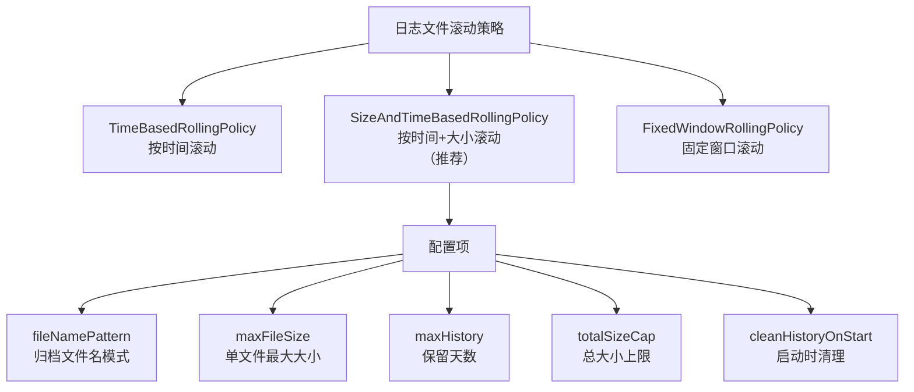

```xml
<!-- 滚动策略详细配置 -->
<rollingPolicy class="ch.qos.logback.core.rolling.SizeAndTimeBasedRollingPolicy">
    <!--
        文件名模式解析：
        %d{yyyy-MM-dd}  → 按天滚动（也可 %d{yyyy-MM-dd_HH} 按小时）
        %i              → 同一天内的文件序号（从 0 开始）
        .gz             → 自动 GZIP 压缩归档文件
    -->
    <fileNamePattern>${LOG_PATH}/${APP_NAME}.%d{yyyy-MM-dd}.%i.log.gz</fileNamePattern>

    <!-- 单个文件最大大小，超过后创建新文件 -->
    <maxFileSize>200MB</maxFileSize>

    <!-- 归档文件保留天数，超期自动删除 -->
    <maxHistory>30</maxHistory>

    <!-- 所有归档文件总大小上限，超期按时间顺序删除最旧的 -->
    <totalSizeCap>10GB</totalSizeCap>

    <!-- 应用启动时清理过期归档文件（默认 false） -->
    <cleanHistoryOnStart>true</cleanHistoryOnStart>
</rollingPolicy>
```

::: tip 滚动策略配置建议
1. **生产环境推荐使用 `SizeAndTimeBasedRollingPolicy`**：同时按日期和大小滚动，避免单日日志量过大导致单个文件过大
2. **归档文件使用 `.gz` 后缀**：自动压缩，通常可减少 80% 的磁盘占用
3. **设置 `cleanHistoryOnStart=true`**：避免应用长期未重启导致过期文件无法清理
4. **`totalSizeCap` 要小于磁盘剩余空间**：否则归档文件可能撑满磁盘
:::

### 日志格式规范

推荐的日志格式分层设计：

```xml
<!-- 开发环境：可读性优先，颜色高亮 -->
<pattern>%d{yyyy-MM-dd HH:mm:ss.SSS} %highlight(%-5level) [%thread] %cyan(%logger{36}) [trace:%X{traceId}] - %msg%n</pattern>

<!-- 生产环境：信息完整，便于解析 -->
<pattern>%d{yyyy-MM-dd HH:mm:ss.SSS} [%thread] %-5level [trace:%X{traceId}] %logger{36} - %msg%n</pattern>

<!-- 生产环境（增强版）：包含主机和应用信息 -->
<pattern>%d{yyyy-MM-dd HH:mm:ss.SSS} [${HOSTNAME}] [%thread] %-5level [trace:%X{traceId}] [span:%X{spanId}] %logger{36} - %msg%n</pattern>
```

## 异步日志

### AsyncAppender（Logback）

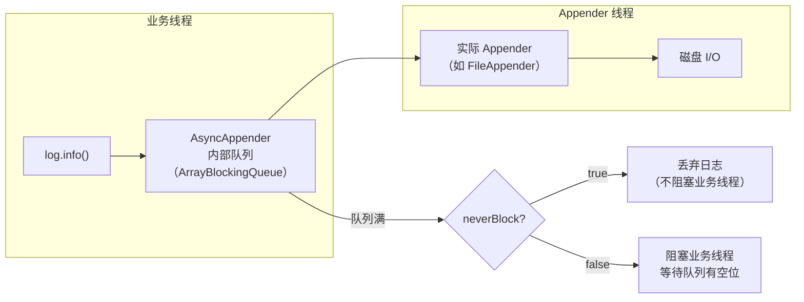

```xml
<!-- Logback AsyncAppender 配置 -->
<appender name="ASYNC_FILE" class="ch.qos.logback.classic.AsyncAppender">
    <!-- 队列容量（默认 256） -->
    <queueSize>1024</queueSize>

    <!--
        丢弃阈值：当队列剩余容量少于此值时，
        丢弃 TRACE、DEBUG、INFO 级别的日志
        设为 0 表示不丢弃任何级别的日志
    -->
    <discardingThreshold>0</discardingThreshold>

    <!--
        队列满时是否阻塞业务线程
        true：不阻塞，丢弃日志（推荐生产环境）
        false：阻塞，等待队列有空位
    -->
    <neverBlock>true</neverBlock>

    <!-- 是否包含调用者信息（%caller、%line 等），默认 false -->
    <!-- 开启会有性能损耗，因为需要创建 Throwable 获取调用栈 -->
    <includeCallerData>false</includeCallerData>

    <!-- 引用实际的 Appender -->
    <appender-ref ref="FILE"/>
</appender>
```

### Disruptor 异步日志（Log4j 2）

Log4j 2 使用 LMAX Disruptor（无锁环形缓冲区）实现异步日志，性能远优于 Logback 的 `ArrayBlockingQueue`。

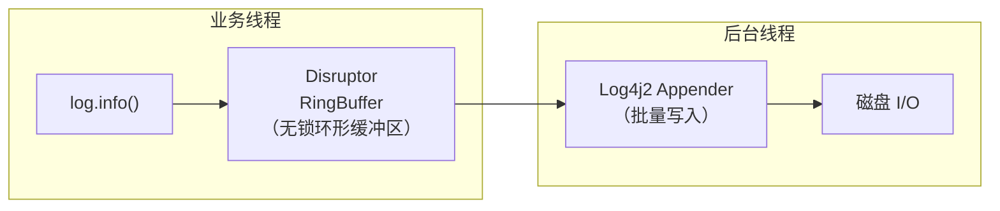

```xml
<!-- pom.xml：切换到 Log4j2 -->
<dependency>
    <groupId>org.springframework.boot</groupId>
    <artifactId>spring-boot-starter-web</artifactId>
    <exclusions>
        <!-- 排除默认的 Logback -->
        <exclusion>
            <groupId>org.springframework.boot</groupId>
            <artifactId>spring-boot-starter-logging</artifactId>
        </exclusion>
    </exclusions>
</dependency>

<!-- 引入 Log4j2 -->
<dependency>
    <groupId>org.springframework.boot</groupId>
    <artifactId>spring-boot-starter-log4j2</artifactId>
</dependency>

<!-- Disruptor 依赖（Log4j2 异步日志需要） -->
<dependency>
    <groupId>com.lmax</groupId>
    <artifactId>disruptor</artifactId>
    <version>4.0.0</version>
</dependency>
```

```xml
<!-- log4j2.xml：全异步配置 -->
<?xml version="1.0" encoding="UTF-8"?>
<Configuration status="WARN">
    <Appenders>
        <RollingFile name="RollingFile" fileName="${sys:LOG_PATH}/app.log"
                     filePattern="${sys:LOG_PATH}/app-%d{yyyy-MM-dd}-%i.log.gz">
            <PatternLayout pattern="%d{yyyy-MM-dd HH:mm:ss.SSS} [%thread] %-5level %logger{36} - %msg%n"/>
            <Policies>
                <TimeBasedTriggeringPolicy/>
                <SizeBasedTriggeringPolicy size="200MB"/>
            </Policies>
            <DefaultRolloverStrategy max="30"/>
        </RollingFile>
    </Appenders>

    <Loggers>
        <!--
            全异步 Logger：使用 Disruptor
            只需设置 asyncLogger 或 asyncRoot
        -->
        <AsyncRoot level="INFO">
            <AppenderRef ref="RollingFile"/>
        </AsyncRoot>
    </Loggers>
</Configuration>
```

### 性能对比

| 方案 | 实现原理 | 吞吐量（约） | 延迟 | 适用场景 |
|------|---------|-------------|------|---------|
| 同步日志 | 直接写磁盘 | ~5 万/s | 1-10ms | 开发/测试 |
| Logback AsyncAppender | `ArrayBlockingQueue` | ~30 万/s | <1ms | 通用生产环境 |
| Log4j2 AsyncLogger | LMAX Disruptor | ~200 万/s | <0.1ms | 极高并发场景 |

> 注: 上表吞吐量/延迟为社区常见测试的数量级示意,实际因硬件、日志格式与配置差异而不同,选型请以自身压测为准。

::: tip 异步日志选择建议
1. **大多数 Spring Boot 应用**：Logback AsyncAppender 足够使用，配置简单
2. **高并发场景**（如网关、消息消费者）：考虑切换到 Log4j2 + Disruptor
3. **不要在异步 Appender 上嵌套异步**：AsyncAppender 包装 AsyncAppender 没有意义，反而增加复杂度
:::

### 队列溢出处理

当异步队列满时，需要决定如何处理新产生的日志：

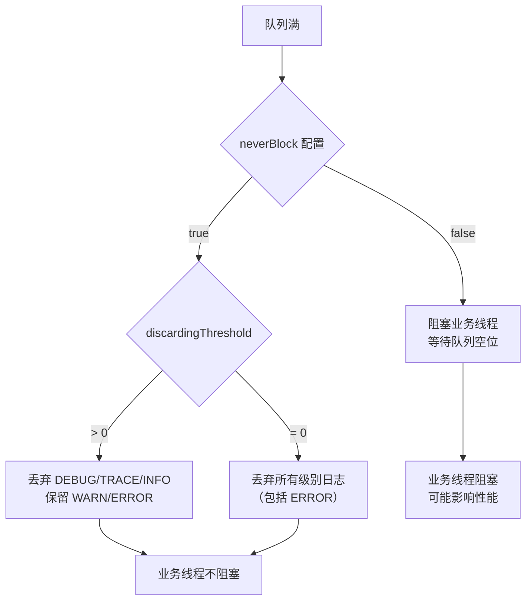

::: danger 队列溢出的权衡
- `neverBlock=true` + `discardingThreshold=0`：完全不阻塞业务线程，但可能丢失所有级别日志（包括 ERROR）
- `neverBlock=true` + `discardingThreshold=20`（默认）：队列剩余容量 < 20 时丢弃 DEBUG/TRACE/INFO，保留 WARN/ERROR
- `neverBlock=false`：保证不丢日志，但可能阻塞业务线程

**推荐配置**：ERROR 日志单独配置一个 AsyncAppender（`neverBlock=false`，保证不丢失），INFO 日志的 AsyncAppender 使用 `neverBlock=true`（允许丢弃）。
:::

```xml
<!-- ERROR 日志：保证不丢失 -->
<appender name="ASYNC_ERROR" class="ch.qos.logback.classic.AsyncAppender">
    <queueSize>512</queueSize>
    <discardingThreshold>0</discardingThreshold>
    <neverBlock>false</neverBlock>  <!-- 宁可阻塞也不丢弃 ERROR -->
    <appender-ref ref="ERROR_FILE"/>
</appender>

<!-- INFO 日志：允许丢弃 -->
<appender name="ASYNC_INFO" class="ch.qos.logback.classic.AsyncAppender">
    <queueSize>2048</queueSize>
    <discardingThreshold>20</discardingThreshold>  <!-- 队列剩余 < 20 时丢弃 INFO 及以下 -->
    <neverBlock>true</neverBlock>  <!-- 不阻塞业务线程 -->
    <appender-ref ref="INFO_FILE"/>
</appender>
```

## 日志级别动态调整

Spring Boot Actuator 提供了日志级别的运行时查看和调整能力，无需重启应用。

### Actuator 端点配置

```yaml
# application.yml
management:
  endpoints:
    web:
      exposure:
        include: health,info,loggers  # 暴露 loggers 端点
  endpoint:
    loggers:
      enabled: true
```

### 动态调整日志级别

```bash
# 查看所有 Logger 的日志级别
curl http://localhost:8080/actuator/loggers

# 查看指定 Logger 的日志级别
curl http://localhost:8080/actuator/loggers/com.example

# 响应示例
{
    "configuredLevel": null,
    "effectiveLevel": "INFO"
}

# 动态调整日志级别（无需重启）
curl -X POST http://localhost:8080/actuator/loggers/com.example \
  -H "Content-Type: application/json" \
  -d '{"configuredLevel": "DEBUG"}'

# 恢复为默认日志级别（null 表示使用父 Logger 的级别）
curl -X POST http://localhost:8080/actuator/loggers/com.example \
  -H "Content-Type: application/json" \
  -d '{"configuredLevel": null}'
```

### 编程式动态调整

```java
/**
 * 日志级别动态调整服务
 */
@Service
@Slf4j
public class LogLevelService {

    private final LoggerContext loggerContext;

    public LogLevelService() {
        // 获取 Logback 的 LoggerContext
        this.loggerContext = (LoggerContext) LoggerFactory.getILoggerFactory();
    }

    /**
     * 设置指定 Logger 的日志级别
     */
    public void setLogLevel(String loggerName, Level level) {
        ch.qos.logback.classic.Logger logger =
                loggerContext.getLogger(loggerName);
        if (logger != null) {
            logger.setLevel(level);
            log.info("日志级别已调整: {} -> {}", loggerName, level);
        }
    }

    /**
     * 获取指定 Logger 的有效日志级别
     */
    public Level getEffectiveLevel(String loggerName) {
        ch.qos.logback.classic.Logger logger =
                loggerContext.getLogger(loggerName);
        return logger != null ? logger.getEffectiveLevel() : null;
    }

    /**
     * 临时开启 DEBUG 日志（指定持续时间后自动恢复）
     */
    @Async
    public void temporaryDebug(String loggerName, Duration duration) {
        setLogLevel(loggerName, Level.DEBUG);
        log.info("已临时开启 DEBUG 日志，{} 后自动恢复", duration);

        try {
            Thread.sleep(duration.toMillis());
        } catch (InterruptedException e) {
            Thread.currentThread().interrupt();
        } finally {
            setLogLevel(loggerName, Level.INFO);
            log.info("DEBUG 日志已自动恢复为 INFO");
        }
    }
}
```

::: warning 动态调整日志级别的注意事项
1. **调整是临时的**：应用重启后会恢复到配置文件中的日志级别
2. **避免在生产环境长时间开启 DEBUG**：DEBUG 日志量通常是 INFO 的 10-100 倍，会快速占满磁盘
3. **推荐使用临时调整**：开启 DEBUG 排查问题后，尽快恢复为 INFO
4. **Actuator 端点需要鉴权**：生产环境必须保护 `loggers` 端点，防止未授权的日志级别修改
:::

## MDC 分布式追踪

### MDC 原理

MDC（Mapped Diagnostic Context，映射诊断上下文）是 SLF4J 提供的线程级上下文存储机制。底层使用 `ThreadLocal` 实现，每个线程有独立的 MDC 上下文。

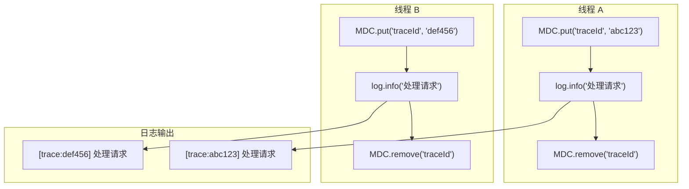

### TraceId 注入

#### 在 Filter 中设置 TraceId

```java
/**
 * 分布式追踪 Filter：在每个请求的 MDC 中设置 TraceId
 */
@Component
@Order(Ordered.HIGHEST_PRECEDENCE)
public class TraceFilter implements Filter {

    private static final String TRACE_ID = "traceId";
    private static final String TRACE_HEADER = "X-Trace-Id";

    @Override
    public void doFilter(ServletRequest request, ServletResponse response,
                         FilterChain chain) throws IOException, ServletException {
        HttpServletRequest httpRequest = (HttpServletRequest) request;

        // 优先从请求头获取（链路追踪场景，上游服务传递过来）
        String traceId = httpRequest.getHeader(TRACE_HEADER);
        if (traceId == null || traceId.isEmpty()) {
            // 首次请求，生成新的 TraceId
            traceId = generateTraceId();
        }

        // 设置 MDC
        MDC.put(TRACE_ID, traceId);
        // 同时设置到响应头，方便下游排查
        ((HttpServletResponse) response).setHeader(TRACE_HEADER, traceId);

        try {
            chain.doFilter(request, response);
        } finally {
            // 请求结束，清理 MDC，防止内存泄漏
            MDC.remove(TRACE_ID);
        }
    }

    /**
     * 生成 TraceId：使用雪花算法或 UUID
     */
    private String generateTraceId() {
        return UUID.randomUUID().toString().replace("-", "");
    }
}
```

#### 在 Interceptor 中设置 TraceId

```java
/**
 * HandlerInterceptor 中设置 MDC
 * 适用于需要 Spring 上下文信息的场景
 */
@Component
public class TraceInterceptor implements HandlerInterceptor {

    private static final String TRACE_ID = "traceId";

    @Override
    public boolean preHandle(HttpServletRequest request,
                             HttpServletResponse response,
                             Object handler) {
        String traceId = request.getHeader("X-Trace-Id");
        if (traceId == null) {
            traceId = UUID.randomUUID().toString().replace("-", "");
        }
        MDC.put(TRACE_ID, traceId);

        // 记录请求信息
        MDC.put("requestUri", request.getRequestURI());
        MDC.put("requestMethod", request.getMethod());
        MDC.put("clientIp", getClientIp(request));

        return true;
    }

    @Override
    public void afterCompletion(HttpServletRequest request,
                                HttpServletResponse response,
                                Object handler, Exception ex) {
        // 清理所有 MDC 信息
        MDC.clear();
    }

    private String getClientIp(HttpServletRequest request) {
        String ip = request.getHeader("X-Forwarded-For");
        if (ip == null || ip.isEmpty()) {
            ip = request.getHeader("X-Real-IP");
        }
        if (ip == null || ip.isEmpty()) {
            ip = request.getRemoteAddr();
        }
        return ip;
    }
}
```

### 跨线程传递

MDC 基于 `ThreadLocal`，线程池中的子线程无法自动获取父线程的 MDC 上下文。需要手动传递。

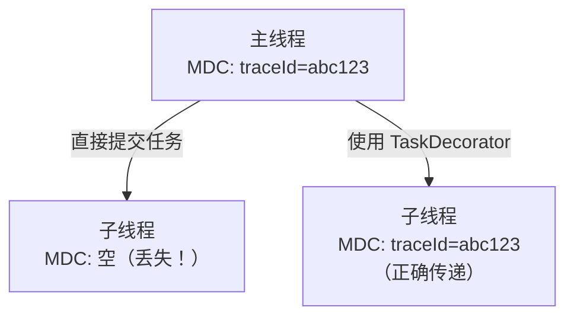

#### 方式一：TaskDecorator（Spring @Async）

```java
/**
 * MDC 任务装饰器：将父线程的 MDC 上下文复制到子线程
 */
public class MdcTaskDecorator implements TaskDecorator {

    @Override
    public Runnable decorate(Runnable runnable) {
        // 捕获父线程的 MDC 上下文
        Map<String, String> contextMap = MDC.getCopyOfContextMap();
        return () -> {
            try {
                // 设置到子线程
                if (contextMap != null) {
                    MDC.setContextMap(contextMap);
                }
                runnable.run();
            } finally {
                // 清理子线程的 MDC，防止线程池复用时污染
                MDC.clear();
            }
        };
    }
}

// 配置异步线程池
@Configuration
@EnableAsync
public class AsyncConfig {

    @Bean
    public TaskExecutor taskExecutor() {
        ThreadPoolTaskExecutor executor = new ThreadPoolTaskExecutor();
        executor.setCorePoolSize(10);
        executor.setMaxPoolSize(50);
        executor.setQueueCapacity(200);
        executor.setThreadNamePrefix("async-");
        // 设置 MDC 装饰器
        executor.setTaskDecorator(new MdcTaskDecorator());
        executor.initialize();
        return executor;
    }
}
```

#### 方式二：自定义 ThreadPoolExecutor（CompletableFuture 等）

```java
/**
 * 支持 MDC 传递的线程池工厂
 */
public class MdcThreadPoolExecutor {

    /**
     * 创建支持 MDC 传递的线程池
     */
    public static ThreadPoolExecutor newMdcExecutor(
            int corePoolSize, int maxPoolSize, String prefix) {
        return new ThreadPoolExecutor(
                corePoolSize, maxPoolSize,
                60L, TimeUnit.SECONDS,
                new LinkedBlockingQueue<>(200),
                // ThreadFactoryBuilder 为 Guava 提供的类,不引入 Guava 时可用匿名 ThreadFactory 实现线程命名
                new ThreadFactoryBuilder().setNameFormat(prefix + "-%d").build()
        ) {
            @Override
            public void execute(Runnable command) {
                // 包装 Runnable，传递 MDC
                super.execute(MdcTaskDecorator.decorate(command));
            }
        };
    }
}
```

#### 方式三：CompletableFuture 的 MDC 传递

```java
/**
 * CompletableFuture 中传递 MDC 的工具方法
 */
public class MdcCompletableFuture {

    /**
     * 包装 Supplier，传递 MDC 上下文
     */
    public static <T> Supplier<T> wrapSupplier(Supplier<T> supplier) {
        Map<String, String> contextMap = MDC.getCopyOfContextMap();
        return () -> {
            try {
                if (contextMap != null) {
                    MDC.setContextMap(contextMap);
                }
                return supplier.get();
            } finally {
                MDC.clear();
            }
        };
    }

    /**
     * 包装 Function，传递 MDC 上下文
     */
    public static <T, R> Function<T, R> wrapFunction(Function<T, R> function) {
        Map<String, String> contextMap = MDC.getCopyOfContextMap();
        return t -> {
            try {
                if (contextMap != null) {
                    MDC.setContextMap(contextMap);
                }
                return function.apply(t);
            } finally {
                MDC.clear();
            }
        };
    }

    /**
     * 包装 Runnable，传递 MDC 上下文
     */
    public static Runnable wrapRunnable(Runnable runnable) {
        Map<String, String> contextMap = MDC.getCopyOfContextMap();
        return () -> {
            try {
                if (contextMap != null) {
                    MDC.setContextMap(contextMap);
                }
                runnable.run();
            } finally {
                MDC.clear();
            }
        };
    }
}

// 使用示例
CompletableFuture<Order> future = CompletableFuture
    .supplyAsync(
        MdcCompletableFuture.wrapSupplier(() -> orderService.getOrder(orderId)),
        executor
    )
    .thenApplyAsync(
        MdcCompletableFuture.wrapFunction(order -> enrichOrder(order)),
        executor
    );
```

::: danger 线程池中忘记清理 MDC 会导致数据串扰
线程池中的线程会被复用。如果子线程执行完任务后没有调用 `MDC.clear()`，下次该线程执行新任务时，MDC 中还残留着上一次的 TraceId，导致日志追踪混乱。必须在 `finally` 块中调用 `MDC.clear()`。
:::

## 日志脱敏

### 自定义 MessageConverter

通过自定义 Logback 的 `MessageConverter`，在日志输出前自动脱敏：

```java
/**
 * 日志脱敏转换器：自动处理敏感信息
 */
public class SensitiveDataConverter extends MessageConverter {

    // 手机号正则：1开头11位数字
    private static final Pattern PHONE_PATTERN =
            Pattern.compile("(1[3-9]\\d)\\d{4}(\\d{4})");
    // 身份证号正则
    private static final Pattern ID_CARD_PATTERN =
            Pattern.compile("([1-9]\\d{5})(\\d{8})(\\d{4})");
    // 银行卡号正则
    private static final Pattern BANK_CARD_PATTERN =
            Pattern.compile("(\\d{4})\\d{8,12}(\\d{4})");
    // 邮箱正则
    private static final Pattern EMAIL_PATTERN =
            Pattern.compile("(\\w{2})\\w+@(\\w+\\.\\w+)");

    @Override
    public String convert(ILoggingEvent event) {
        String message = super.convert(event);
        return maskSensitiveData(message);
    }

    private String maskSensitiveData(String message) {
        if (message == null) return null;

        // 手机号脱敏：138****1234
        message = PHONE_PATTERN.matcher(message)
                .replaceAll("$1****$2");
        // 身份证脱敏：110108********1234
        message = ID_CARD_PATTERN.matcher(message)
                .replaceAll("$1********$3");
        // 银行卡脱敏：6222****1234
        message = BANK_CARD_PATTERN.matcher(message)
                .replaceAll("$1****$2");
        // 邮箱脱敏：te**@example.com
        message = EMAIL_PATTERN.matcher(message)
                .replaceAll("$1**@$2");

        return message;
    }
}
```

```xml
<!-- 在 logback-spring.xml 中注册转换器 -->
<configuration>
    <!-- 注册自定义转换器(Logback 1.5+/1.4.14+ 用 class 属性,更早版本用 converterClass) -->
    <conversionRule conversionWord="msg" class="com.example.log.SensitiveDataConverter"/>
</configuration>
```

### 脱敏注解方案

基于注解的脱敏方案，对 DTO 字段精细控制：

```java
/**
 * 脱敏注解
 */
@Target(ElementType.FIELD)
@Retention(RetentionPolicy.RUNTIME)
public @interface Sensitive {

    /**
     * 脱敏策略
     */
    SensitiveStrategy value();

    /**
     * 是否脱敏（默认 true）
     */
    boolean enabled() default true;
}

/**
 * 脱敏策略枚举
 */
public enum SensitiveStrategy {
    PHONE,      // 手机号：138****1234
    ID_CARD,    // 身份证：110108********1234
    BANK_CARD,  // 银行卡：6222****1234
    EMAIL,      // 邮箱：te**@example.com
    NAME,       // 姓名：张*
    ADDRESS,    // 地址：北京市****
    PASSWORD    // 密码：******
}
```

```java
/**
 * 脱敏工具类
 */
public class SensitiveUtils {

    /**
     * 对对象进行脱敏处理（返回脱敏后的 JSON 字符串）
     */
    public static String toJson(Object obj) {
        if (obj == null) return "null";

        try {
            // 使用 Jackson 自定义序列化器
            ObjectMapper mapper = new ObjectMapper();
            mapper.registerModule(new SensitiveModule());
            return mapper.writeValueAsString(obj);
        } catch (JsonProcessingException e) {
            return obj.toString();
        }
    }

    /**
     * 手机号脱敏
     */
    public static String maskPhone(String phone) {
        if (phone == null || phone.length() < 7) return "***";
        return phone.substring(0, 3) + "****" + phone.substring(phone.length() - 4);
    }

    /**
     * 身份证脱敏
     */
    public static String maskIdCard(String idCard) {
        if (idCard == null || idCard.length() < 8) return "***";
        return idCard.substring(0, 6) + "********" + idCard.substring(idCard.length() - 4);
    }

    /**
     * 姓名脱敏
     */
    public static String maskName(String name) {
        if (name == null || name.isEmpty()) return "***";
        if (name.length() == 1) return "*";
        return name.charAt(0) + "*".repeat(name.length() - 1);
    }

    /**
     * 密码脱敏
     */
    public static String maskPassword() {
        return "******";
    }
}
```

```java
/**
 * Jackson 自定义序列化器：基于 @Sensitive 注解脱敏
 */
public class SensitiveSerializer extends JsonSerializer<String> {

    private final SensitiveStrategy strategy;

    public SensitiveSerializer(SensitiveStrategy strategy) {
        this.strategy = strategy;
    }

    @Override
    public void serialize(String value, JsonGenerator gen,
                          SerializerProvider provider) throws IOException {
        String maskedValue = switch (strategy) {
            case PHONE -> SensitiveUtils.maskPhone(value);
            case ID_CARD -> SensitiveUtils.maskIdCard(value);
            case NAME -> SensitiveUtils.maskName(value);
            case PASSWORD -> SensitiveUtils.maskPassword();
            case EMAIL -> value == null ? "***" :
                    value.substring(0, 2) + "**@" + value.split("@")[1];
            default -> "***";
        };
        gen.writeString(maskedValue);
    }
}

/**
 * Jackson Module：注册脱敏序列化器
 */
public class SensitiveModule extends SimpleModule {

    @Override
    public void setupModule(SetupContext context) {
        // 需要在 BeanPropertyWriter 级别处理注解
        // 这里使用注解处理器的方式
    }
}
```

```java
// 使用示例
@Service
@Slf4j
public class UserService {

    public void register(UserDTO user) {
        // 使用脱敏工具输出日志
        log.info("用户注册: {}", SensitiveUtils.toJson(user));

        // 或者手动脱敏特定字段
        log.info("用户注册，手机号: {}, 姓名: {}",
                SensitiveUtils.maskPhone(user.getPhone()),
                SensitiveUtils.maskName(user.getName()));
    }
}
```

::: warning 脱敏不能只靠日志层
1. **日志脱敏是最后一道防线**：应该在数据源头（如 DTO 返回给前端时）就做脱敏，日志层脱敏是兜底
2. **正则脱敏可能误伤**：手机号正则可能匹配到非手机号的数字串，需要注意误报
3. **数据库查询结果也可能被日志记录**：MyBatis/Hibernate 的 SQL 日志可能包含敏感参数，需要关闭或脱敏
:::

### 敏感字段过滤

对于 HTTP 请求/响应中的敏感字段过滤：

```java
/**
 * 请求日志过滤器：过滤敏感参数
 */
@Component
@Slf4j
public class RequestLoggingFilter extends OncePerRequestFilter {

    // 需要脱敏的参数名（不区分大小写）
    private static final Set<String> SENSITIVE_PARAMS = Set.of(
            "password", "passwd", "pwd",
            "token", "accesstoken", "refresh_token",
            "secret", "apikey", "api_key",
            "creditcard", "credit_card"
    );

    @Override
    protected void doFilterInternal(HttpServletRequest request,
                                    HttpServletResponse response,
                                    FilterChain filterChain)
            throws ServletException, IOException {

        ContentCachingRequestWrapper wrappedRequest =
                new ContentCachingRequestWrapper(request);

        try {
            filterChain.doFilter(wrappedRequest, response);
        } finally {
            // 记录脱敏后的请求信息
            logRequest(wrappedRequest);
        }
    }

    private void logRequest(ContentCachingRequestWrapper request) {
        String uri = request.getRequestURI();
        String method = request.getMethod();
        String queryString = maskQueryString(request.getQueryString());
        String body = maskBody(new String(
                request.getContentAsByteArray(), StandardCharsets.UTF_8));

        log.info("HTTP {} {} qs={} body={}", method, uri, queryString, body);
    }

    /**
     * 对查询参数中的敏感值脱敏
     */
    private String maskQueryString(String queryString) {
        if (queryString == null || queryString.isEmpty()) return "";
        StringBuilder sb = new StringBuilder();
        for (String param : queryString.split("&")) {
            String[] kv = param.split("=", 2);
            if (SENSITIVE_PARAMS.contains(kv[0].toLowerCase())) {
                sb.append(kv[0]).append("=***");
            } else {
                sb.append(param);
            }
            sb.append("&");
        }
        return sb.length() > 0 ? sb.substring(0, sb.length() - 1) : "";
    }

    /**
     * 对请求体中的敏感字段脱敏（JSON 格式）
     */
    private String maskBody(String body) {
        if (body == null || body.isEmpty()) return "";
        try {
            ObjectMapper mapper = new ObjectMapper();
            JsonNode node = mapper.readTree(body);
            maskJsonNode(node);
            return mapper.writeValueAsString(node);
        } catch (Exception e) {
            // 解析失败，返回固定长度摘要
            return body.length() > 200 ? body.substring(0, 200) + "..." : body;
        }
    }

    private void maskJsonNode(JsonNode node) {
        if (node.isObject()) {
            ObjectNode obj = (ObjectNode) node;
            Iterator<String> fields = obj.fieldNames();
            while (fields.hasNext()) {
                String field = fields.next();
                if (SENSITIVE_PARAMS.contains(field.toLowerCase())) {
                    obj.put(field, "***");
                } else {
                    maskJsonNode(obj.get(field));
                }
            }
        } else if (node.isArray()) {
            for (JsonNode element : node) {
                maskJsonNode(element);
            }
        }
    }
}
```

## 结构化日志

### JSON 格式日志

结构化日志将日志输出为 JSON 格式，便于日志系统（ELK、Loki）解析和检索。

```xml
<!-- LogstashEncoder：最简单的 JSON 日志配置 -->
<appender name="JSON_FILE" class="ch.qos.logback.core.rolling.RollingFileAppender">
    <file>${LOG_PATH}/${APP_NAME}-json.log</file>
    <rollingPolicy class="ch.qos.logback.core.rolling.SizeAndTimeBasedRollingPolicy">
        <fileNamePattern>${LOG_PATH}/${APP_NAME}-json.%d{yyyy-MM-dd}.%i.log.gz</fileNamePattern>
        <maxFileSize>200MB</maxFileSize>
        <maxHistory>7</maxHistory>
        <totalSizeCap>5GB</totalSizeCap>
    </rollingPolicy>
    <encoder class="net.logstash.logback.encoder.LogstashEncoder">
        <!-- 添加自定义字段 -->
        <customFields>{"app_name":"${APP_NAME}","env":"${ACTIVE_PROFILE}"}</customFields>
        <!-- 包含 MDC -->
        <includeMdc>true</includeMdc>
        <!-- 包含调用者信息 -->
        <includeCallerData>false</includeCallerData>
        <!-- 短化异常堆栈 -->
        <throwableConverter class="net.logstash.logback.stacktrace.ShortenedThrowableConverter">
            <maxDepthPerThrowable>30</maxDepthPerThrowable>
            <maxLength>4096</maxLength>
            <shortenedClassNameLength>30</shortenedClassNameLength>
            <exclude>sun\.reflect|java\.lang\.reflect|org\.springframework|org\.tomcat</exclude>
        </throwableConverter>
    </encoder>
</appender>
```

JSON 日志输出示例：

```json
{
    "@timestamp": "2026-06-07T12:00:00.001+08:00",
    "@version": "1",
    "message": "创建订单成功",
    "logger_name": "com.example.OrderService",
    "thread_name": "http-nio-8080-exec-1",
    "level": "INFO",
    "level_value": 20000,
    "traceId": "abc123def456",
    "spanId": "span001",
    "app_name": "order-service",
    "env": "prod",
    "stack_hash": "5a3b2c1d"
}
```

### 在代码中添加结构化字段

```java
/**
 * 结构化日志工具类：方便添加业务字段
 */
public class StructuredLog {

    /**
     * 使用 MDC 添加结构化字段
     */
    public static void withFields(Runnable action, Object... keyValues) {
        try {
            for (int i = 0; i < keyValues.length; i += 2) {
                MDC.put(String.valueOf(keyValues[i]),
                        String.valueOf(keyValues[i + 1]));
            }
            action.run();
        } finally {
            for (int i = 0; i < keyValues.length; i += 2) {
                MDC.remove(String.valueOf(keyValues[i]));
            }
        }
    }
}

// 使用示例
@Service
@Slf4j
public class OrderService {

    public Order createOrder(OrderDTO dto) {
        // 在 MDC 中添加业务字段，JSON 日志会自动包含
        StructuredLog.withFields(() -> {
            log.info("创建订单");
            // 业务逻辑...
        }, "userId", dto.getUserId(),
           "productId", dto.getProductId(),
           "orderAmount", dto.getAmount());
    }
}

// 输出的 JSON 日志会包含：
// { "message": "创建订单", "userId": "U001", "productId": "P001", "orderAmount": "99.9" }
```

### ELK 集成

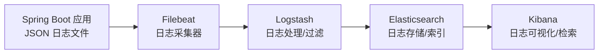

Filebeat 配置示例：

```yaml
# filebeat.yml
filebeat.inputs:
  - type: log
    enabled: true
    paths:
      - /var/log/app/*-json.log
    json.keys_under_root: true        # JSON 字段放在顶层
    json.add_error_key: true           # 解析错误时添加 error 字段
    json.message_key: message          # 消息字段名
    fields:                            # 添加额外字段
      service: order-service
      environment: production

output.logstash:
  hosts: ["logstash:5044"]
  index: filebeat

# 或者直接输出到 Elasticsearch
# output.elasticsearch:
#   hosts: ["elasticsearch:9200"]
#   index: "app-logs-%{+yyyy.MM.dd}"
```

Logstash 配置示例：

```ruby
# logstash.conf
input {
  beats {
    port => 5044
  }
}

filter {
  # 解析 JSON 日志
  json {
    source => "message"
    remove_field => ["message"]
  }

  # 添加 geoip 信息（基于 IP 字段）
  geoip {
    source => "clientIp"
  }

  # 日志级别标记
  mutate {
    add_field => { "log_level" => "%{level}" }
  }
}

output {
  elasticsearch {
    hosts => ["elasticsearch:9200"]
    # 按日期分索引
    index => "app-logs-%{+YYYY.MM.dd}"
  }
}
```

### Loki 集成

Loki 是 Grafana Labs 推出的轻量级日志聚合系统，相比 ELK 更轻量。

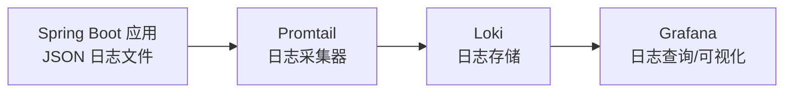

Promtail 配置示例：

```yaml
# promtail.yml
server:
  http_listen_port: 9080
  grpc_listen_port: 0

positions:
  filename: /tmp/positions.yaml

clients:
  - url: http://loki:3100/loki/api/v1/push

scrape_configs:
  - job_name: app-logs
    static_configs:
      - targets:
          - localhost
        labels:
          job: app
          env: production
          __path__: /var/log/app/*-json.log
    pipeline_stages:
      # 解析 JSON 日志
      - json:
          expressions:
            level: level
            logger_name: logger_name
            message: message
            traceId: traceId
            app_name: app_name
      # 从 JSON 中提取标签
      - labels:
          level:
          app_name:
      # 设置日志时间
      - timestamp:
          source: "@timestamp"
          format: RFC3339
```

::: tip ELK vs Loki 选择建议
1. **ELK（Elasticsearch + Logstash + Kibana）**：功能强大，支持全文检索，适合需要复杂查询和日志分析的场景，但资源消耗大
2. **Loki + Grafana**：轻量级，只索引标签不索引日志内容，资源消耗低，适合 K8s 环境和已有 Grafana 监控体系的团队
3. **推荐**：中小项目用 Loki，大型项目或有全文检索需求用 ELK
:::

## 日志规范

### 日志级别使用规范

| 级别 | 使用场景 | 示例 | 生产环境 |
|------|---------|------|---------|
| `ERROR` | 系统错误，需要立即处理 | 数据库连接失败、外部服务不可用 | 始终开启 |
| `WARN` | 潜在问题，需要关注 | 降级处理、配置项缺失使用默认值、重试 | 始终开启 |
| `INFO` | 关键业务流程 | 用户登录、订单创建、定时任务执行 | 始终开启 |
| `DEBUG` | 调试信息 | SQL 语句、方法入参出参、中间状态 | 默认关闭，按需临时开启 |
| `TRACE` | 详细调试信息 | 框架内部调用链路、方法进入退出 | 默认关闭，排查问题时临时开启 |

```java
@Service
@Slf4j
public class OrderService {

    public Order createOrder(OrderDTO dto) {
        // √ INFO：关键业务操作
        log.info("创建订单，用户: {}, 商品: {}", dto.getUserId(), dto.getProductId());

        try {
            Order order = doCreateOrder(dto);
            // √ INFO：业务操作结果
            log.info("订单创建成功，订单号: {}", order.getOrderNo());
            return order;
        } catch (InsufficientStockException e) {
            // √ WARN：业务异常（非系统错误，但需要关注）
            log.warn("库存不足，用户: {}, 商品: {}", dto.getUserId(), dto.getProductId());
            throw e;
        } catch (Exception e) {
            // √ ERROR：系统错误（最后一个参数是异常对象，自动打印堆栈）
            log.error("订单创建失败，用户: {}", dto.getUserId(), e);
            throw new BusinessException("订单创建失败");
        }
    }

    private Order doCreateOrder(OrderDTO dto) {
        // √ DEBUG：调试信息（生产环境关闭）
        log.debug("开始创建订单，参数: {}", dto);
        // ... 业务逻辑
        log.debug("库存校验通过，可用库存: {}", getStock(dto.getProductId()));
        // ... 更多逻辑
        return order;
    }
}
```

::: danger 日志级别使用常见错误
1. **用 ERROR 记录业务异常**：如"用户名不存在"是业务逻辑，不是系统错误，应该用 WARN 或 INFO
2. **用 INFO 记录过多细节**：如每次循环都 INFO，应该用 DEBUG
3. **ERROR 日志不包含异常堆栈**：`log.error("操作失败")` 丢失了堆栈信息，应该是 `log.error("操作失败", e)`
4. **在循环中打日志**：for 循环中每次迭代都打 INFO，生产环境会产生海量日志
:::

### 日志内容规范

```java
@Service
@Slf4j
public class LogExample {

    // √ 好的日志：包含关键业务标识
    public void goodLog() {
        // 1. 包含业务主键，便于追踪
        log.info("订单支付成功，订单号: {}, 支付金额: {}", orderNo, amount);

        // 2. 使用参数化日志（{} 占位符），避免字符串拼接
        log.info("用户登录，userId: {}", userId);

        // 3. 包含足够的上下文信息
        log.info("发送邮件成功，to: {}, subject: {}, 耗时: {}ms",
                email, subject, duration);
    }

    // × 差的日志
    public void badLog() {
        // 1. 无意义的日志
        log.info("开始处理");  // 处理什么？
        log.info("处理完成");  // 谁的处理？成功还是失败？

        // 2. 字符串拼接（即使日志级别不匹配也会执行拼接）
        log.info("用户登录: " + userId);  // 浪费性能

        // 3. 缺少上下文
        log.error("操作失败");  // 什么操作？哪个用户？什么原因？

        // 4. 敏感信息明文
        log.info("用户登录，密码: {}", password);  // 严禁！
    }
}
```

::: tip 参数化日志的性能优势
`log.info("用户: " + userId)` 即使 INFO 级别被关闭，字符串拼接也会执行。而 `log.info("用户: {}", userId)` 在日志级别不匹配时，不会执行 `toString()` 和字符串拼接。在高并发场景下，这个差异可能非常显著。
:::

### 异常日志规范

```java
@Service
@Slf4j
public class ExceptionLogExample {

    // √ 正确的异常日志写法
    public void correctExceptionLog() {
        try {
            riskyOperation();
        } catch (BusinessException e) {
            // 业务异常：WARN 级别，包含错误码和用户信息
            log.warn("业务异常，错误码: {}, 用户: {}, 原因: {}",
                    e.getCode(), userId, e.getMessage());
        } catch (IOException e) {
            // 系统异常：ERROR 级别，异常对象作为最后一个参数
            log.error("文件读取失败，文件: {}", filePath, e);
        } catch (Exception e) {
            // 未知异常：ERROR 级别，包含尽可能多的上下文
            log.error("未知异常，操作: {}, 参数: {}", operation, params, e);
        }
    }

    // × 错误的异常日志写法
    public void wrongExceptionLog() {
        try {
            riskyOperation();
        } catch (Exception e) {
            // 错误 1：只记录消息，丢失堆栈
            log.error("操作失败: " + e.getMessage());

            // 错误 2：异常对象作为占位符参数（不会打印堆栈）
            log.error("操作失败", e.getMessage());

            // 错误 3：异常对象和占位符混用（堆栈会作为 msg 的参数）
            log.error("操作失败: {}", e.getMessage(), e);
            // 这种写法虽然能打印堆栈，但 e.getMessage() 可能重复

            // 错误 4：吞掉异常，不记录日志
            // （什么都没做）
        }
    }
}
```

## 实战场景

### 日志采集架构

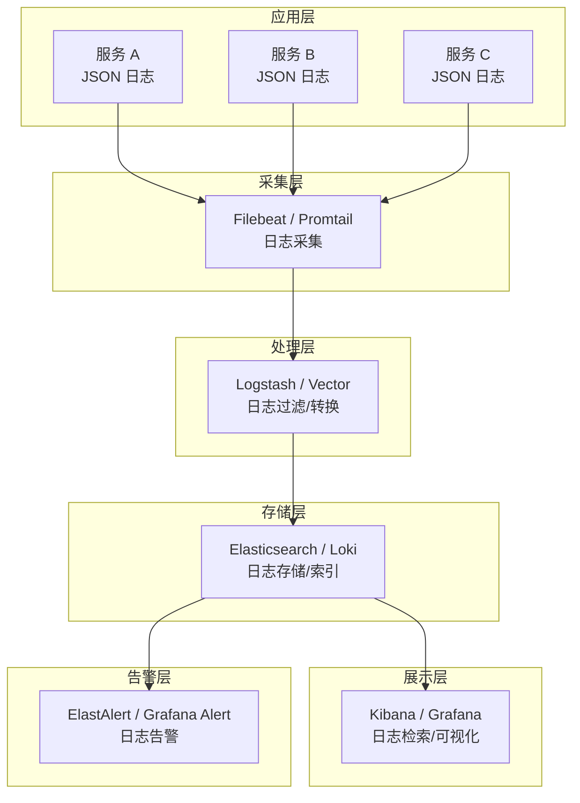

### 日志告警

基于日志内容的告警规则配置：

```yaml
# ElastAlert 配置示例：ERROR 日志频率告警
name: error-log-alert
type: frequency
index: app-logs-*

# 5 分钟内出现 10 次 ERROR 日志即告警
num_events: 10
timeframe:
  minutes: 5

filter:
  - term:
      level: "ERROR"

# 排除已知的非关键错误
query_key:
  - app_name
  - logger_name

alert:
  - "slack"
  - "email"

slack:
  slack_webhook_url: "https://hooks.slack.com/services/xxx"

email:
  - "oncall@example.com"
```

```yaml
# Grafana Alert 配置示例：基于 Loki 日志的告警
# LogQL 查询：统计 5 分钟内 ERROR 日志数量
# {app="order-service"} | json | level="ERROR" | line_format "{{.message}}"
#
# 告警规则：5 分钟内 ERROR 日志 > 5 次
# for: 5m
# annotations:
#   summary: "订单服务 ERROR 日志异常"
#   description: "最近 5 分钟内出现 {{ $value }} 次 ERROR 日志"
```

::: warning 日志告警的常见陷阱
1. **告警风暴**：一个服务故障导致大量 ERROR 日志，触发所有相关告警。建议按服务聚合，设置告警静默期
2. **误报**：已知的非关键 ERROR（如第三方服务偶发超时）频繁告警。建议维护白名单或调整阈值
3. **漏报**：只监控 ERROR 级别，忽略 WARN 的异常趋势。建议同时监控 WARN 的增长趋势
4. **缺少上下文**：告警消息只有"ERROR 日志过多"，没有具体的服务名、错误类型。告警消息要包含足够的信息
:::

### 日志归档与生命周期管理

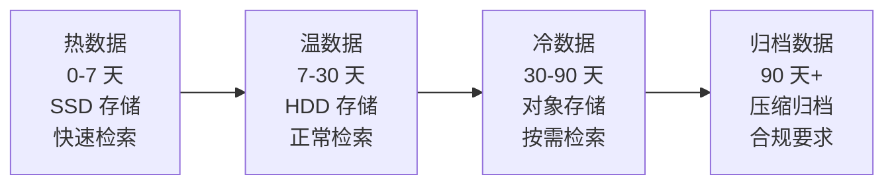

Elasticsearch 索引生命周期管理（ILM）：

```json
{
    "policy": {
        "phases": {
            "hot": {
                "min_age": "0ms",
                "actions": {
                    "rollover": {
                        "max_size": "50gb",
                        "max_age": "1d"
                    }
                }
            },
            "warm": {
                "min_age": "7d",
                "actions": {
                    "shrink": { "number_of_shards": 1 },
                    "forcemerge": { "max_num_segments": 1 },
                    "allocate": { "require": { "storage_type": "warm" } }
                }
            },
            "cold": {
                "min_age": "30d",
                "actions": {
                    "allocate": { "require": { "storage_type": "cold" } }
                }
            },
            "delete": {
                "min_age": "90d",
                "actions": {
                    "delete": {}
                }
            }
        }
    }
}
```

::: tip 日志归档的成本优化
1. **按业务重要程度分级**：核心业务日志保留 90 天，非核心日志保留 30 天
2. **使用冷热分离存储**：热数据用 SSD，冷数据用 HDD 或对象存储（S3/OSS）
3. **压缩归档文件**：GZIP 压缩通常可减少 80% 磁盘占用
4. **设置 `totalSizeCap`**：避免日志文件撑满磁盘导致服务不可用
5. **审计日志独立管理**：审计日志可能需要保留数年，需要独立的归档策略
:::

### 日志驱动的性能诊断

```java
/**
 * 慢操作日志切面：自动记录超过阈值的操作
 */
@Aspect
@Component
@Slf4j
public class SlowOperationAspect {

    // 默认慢操作阈值：500ms
    private static final long DEFAULT_THRESHOLD = 500;

    @Around("@annotation(slowOperation)")
    public Object around(ProceedingJoinPoint joinPoint,
                         SlowOperation slowOperation) throws Throwable {
        long start = System.currentTimeMillis();
        String methodName = joinPoint.getSignature().toShortString();

        try {
            Object result = joinPoint.proceed();
            long duration = System.currentTimeMillis() - start;
            long threshold = slowOperation.value();

            if (duration > threshold) {
                // 在 MDC 中标记，方便日志系统告警（先 put 再输出，本条日志才能带上标记）
                MDC.put("slowOperation", "true");
                MDC.put("slowDuration", String.valueOf(duration));
                // 超过阈值，记录 WARN 日志
                log.warn("SLOW 操作耗时: {}ms（阈值: {}ms），方法: {}",
                        duration, threshold, methodName);
            } else {
                log.debug("操作耗时: {}ms，方法: {}", duration, methodName);
            }
            return result;
        } catch (Throwable e) {
            long duration = System.currentTimeMillis() - start;
            log.error("操作异常，耗时: {}ms，方法: {}", duration, methodName, e);
            throw e;
        } finally {
            MDC.remove("slowOperation");
            MDC.remove("slowDuration");
        }
    }
}

/**
 * 慢操作注解
 */
@Target(ElementType.METHOD)
@Retention(RetentionPolicy.RUNTIME)
public @interface SlowOperation {
    /** 慢操作阈值（毫秒），默认 500ms */
    long value() default 500;
}

// 使用示例
@Service
public class OrderQueryService {

    @SlowOperation(1000)  // 超过 1 秒记录慢操作日志
    public OrderPageResult queryOrders(OrderQueryDTO query) {
        return orderMapper.selectPage(query);
    }
}
```

## 面试要点

### 1. SLF4J 的作用是什么？

**答案：** SLF4J 是日志门面（Facade），提供统一的日志 API，解耦应用代码和日志实现。切换底层日志框架只需更换依赖，无需修改代码。其核心机制是**运行时绑定**——SLF4J 1.x 通过类路径上的 `StaticLoggerBinder` 决定实际实现，SLF4J 2.x（Spring Boot 3.x 默认）改用 `ServiceLoader` 查找 `SLF4JServiceProvider`。

### 2. SLF4J 的桥接器是什么？和绑定有什么区别？

**答案：** **绑定（Binding）** 是 SLF4J 到日志实现的桥梁，让 SLF4J API 调用能路由到具体的日志框架（如 `logback-classic`）。**桥接器（Bridge）** 是其他日志 API 到 SLF4J 的桥梁，让使用 Log4j 1.x、JCL、JUL 等日志 API 的代码，无需修改就能统一走 SLF4J 输出。两者方向相反：绑定是 SLF4J → 实现，桥接是 其他 API → SLF4J。绝对不能同时存在桥接器和反向桥接，否则会形成无限循环导致 `StackOverflowError`。

### 3. 生产环境日志配置的关键点？

**答案：** ① 使用异步 Appender 避免阻塞业务线程；② 滚动文件策略（按日期+大小滚动，保留30天，总大小上限）；③ 合理的日志级别（ERROR 只记录真正的错误，WARN 记录需要关注的异常）；④ 敏感信息脱敏（密码、Token 不写入日志）；⑤ 按环境区分配置（`springProfile`）；⑥ ERROR 日志单独文件，保留更长时间。

### 4. 异步日志的原理和注意事项？

**答案：** 异步日志的核心是将日志写入操作从业务线程转移到独立线程。Logback 的 `AsyncAppender` 使用 `ArrayBlockingQueue`，业务线程将日志事件放入队列，Appender 线程从队列取出并写入磁盘。Log4j2 的 `AsyncLogger` 使用 LMAX Disruptor 无锁环形缓冲区，性能更高。注意事项：① `neverBlock=true` 可避免阻塞业务线程但可能丢日志；② `discardingThreshold` 控制队列快满时丢弃低级别日志；③ ERROR 日志建议配置 `neverBlock=false` 保证不丢失；④ 不要嵌套异步 Appender。

### 5. MDC 的原理和跨线程传递方案？

**答案：** MDC（Mapped Diagnostic Context）基于 `ThreadLocal` 实现，每个线程有独立的 MDC 上下文，日志输出时通过 `%X{key}` 从当前线程的 MDC 中取值。跨线程传递方案：① Spring `@Async` 使用 `TaskDecorator` 复制 MDC；② 自定义 `ThreadPoolExecutor` 重写 `execute()` 方法包装 Runnable；③ `CompletableFuture` 使用工具方法包装 `Supplier`/`Runnable`。关键是子线程执行完必须调用 `MDC.clear()`，防止线程池复用时 MDC 数据串扰。

### 6. 如何实现日志脱敏？

**答案：** 三层防线：① **代码层**：使用脱敏工具类（如 `SensitiveUtils.maskPhone()`）手动脱敏；② **注解层**：通过 `@Sensitive` 注解标记 DTO 字段，配合 Jackson 自定义序列化器自动脱敏；③ **日志框架层**：自定义 Logback `MessageConverter`，通过正则匹配自动替换敏感信息。日志脱敏是最后一道防线，应该在数据源头（DTO 返回前端时）就做脱敏。

### 7. 结构化日志和 ELK 集成的方案？

**答案：** 结构化日志是将日志输出为 JSON 格式，便于机器解析。Spring Boot + Logback 使用 `LogstashEncoder` 输出 JSON 日志。ELK 集成流程：应用输出 JSON 日志 → Filebeat 采集 → Logstash 过滤/转换 → Elasticsearch 存储索引 → Kibana 检索可视化。轻量级替代方案是 Grafana Loki + Promtail，只索引标签不索引全文，资源消耗更低。

### 8. 日志级别动态调整的原理？

**答案：** Spring Boot Actuator 暴露 `/actuator/loggers` 端点，支持查看和修改 Logger 的日志级别。底层通过 Logback 的 `LoggerContext` 调用 `logger.setLevel()` 实现运行时调整，无需重启应用。调整是临时的，重启后恢复为配置文件中的级别。生产环境使用需要注意：① Actuator 端点必须鉴权；② 避免长时间开启 DEBUG；③ 推荐使用临时调整（指定持续时间后自动恢复）。

### 9. 日志告警的最佳实践？

**答案：** ① 按服务聚合告警，避免告警风暴；② 设置告警静默期，同一问题不重复告警；③ 同时监控 ERROR 频率和 WARN 增长趋势；④ 告警消息包含服务名、错误类型、出现频率；⑤ 维护已知非关键错误白名单，减少误报；⑥ 分级告警——P0 级别立即通知，P1/P2 级别聚合通知。

### 10. 生产环境日志规范有哪些要点？

**答案：** ① 日志级别规范：ERROR 只用于系统错误，WARN 用于需要关注的异常，INFO 用于关键业务流程；② 内容规范：包含业务主键、使用参数化日志、避免无意义日志；③ 异常日志规范：异常对象作为 `log.error()` 最后一个参数以打印堆栈；④ 安全规范：敏感信息必须脱敏；⑤ 性能规范：不在循环中打 INFO 日志，使用异步 Appender；⑥ 格式规范：统一日志格式，生产环境包含 TraceId。

>  相关文档：[13-Actuator与可观测性接入](13-Actuator与可观测性接入.md) · [07-性能优化](07-性能优化.md)

## 版本差异(旧版 → Spring Boot 3.5.x)

| 特性 | 旧版(Spring Boot 2.x) | Spring Boot 3.5.x |
|------|----------------------|-------------------|
| 默认日志框架 | Logback 1.2 | Logback 1.5+ |
| 日志桥接 | log4j-to-slf4j 等 | 不变；log4j2 漏洞需用 2.17+ |
| 结构化日志 | 依赖 logstash-logback-encoder | 3.4+ 内建 JSON 结构化日志（`logging.structured.format`）；logstash 编码器仍可用 |
| 虚拟线程日志 | 无 | 虚拟线程名可配置，便于排查 |
| MDC | 手动 | 不变；可结合 Micrometer Tracing 自动注入 traceId |
