# 缓存抽象与 Redis 深度实践

## 概述

缓存是提升系统性能的核心手段。Spring Boot 通过 `@Cacheable` 系列注解提供了声明式缓存抽象，底层可对接 Redis、Caffeine、Ehcache 等多种实现。本篇深入分析缓存抽象的源码机制、Redis 整合的最佳实践，以及生产环境中的缓存策略。

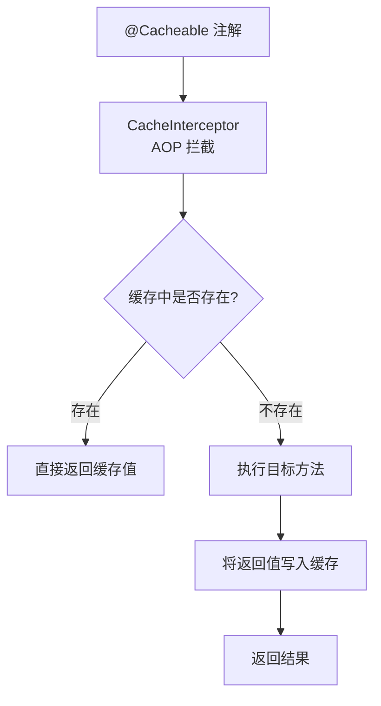
```mermaid
flowchart TD
    A["@Cacheable 注解"] --> B["CacheInterceptor<br/>AOP 拦截"]
    B --> C{"缓存中是否存在?"}
    C -->|存在| D["直接返回缓存值"]
    C -->|不存在| E["执行目标方法"]
    E --> F["将返回值写入缓存"]
    F --> G["返回结果"]

```

## Spring Cache 抽象原理

### 核心注解

| 注解 | 作用 | 说明 |
|------|------|------|
| `@Cacheable` | 查询时缓存 | 缓存存在则直接返回，不存在则执行方法并缓存 |
| `@CachePut` | 更新缓存 | 始终执行方法，将结果更新到缓存 |
| `@CacheEvict` | 清除缓存 | 清除指定缓存（可清除所有） |
| `@Caching` | 组合操作 | 同时执行多个缓存操作 |
| `@CacheConfig` | 类级配置 | 统一设置缓存名、Key 生成器等 |

### CacheManager 体系架构

Spring Cache 抽象的核心是 `CacheManager` 接口，它负责管理多个 `Cache` 实例。整个体系架构如下：

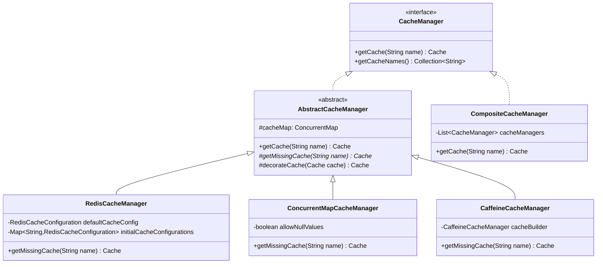
```mermaid
classDiagram
    class CacheManager {
        <<interface>>
        +getCache(String name) Cache
        +getCacheNames() Collection~String~
    }
    
    class AbstractCacheManager {
        <<abstract>>
        #cacheMap: ConcurrentMap
        +getCache(String name) Cache
        #getMissingCache(String name)* Cache
        #decorateCache(Cache cache) Cache
    }
    
    class RedisCacheManager {
        -RedisCacheConfiguration defaultCacheConfig
        -Map~String,RedisCacheConfiguration~ initialCacheConfigurations
        +getMissingCache(String name) Cache
    }
    
    class ConcurrentMapCacheManager {
        -boolean allowNullValues
        +getMissingCache(String name) Cache
    }
    
    class CaffeineCacheManager {
        -CaffeineCacheManager cacheBuilder
        +getMissingCache(String name) Cache
    }
    
    class CompositeCacheManager {
        -List~CacheManager~ cacheManagers
        +getCache(String name) Cache
    }
    
    CacheManager <|.. AbstractCacheManager
    AbstractCacheManager <|-- RedisCacheManager
    AbstractCacheManager <|-- ConcurrentMapCacheManager
    AbstractCacheManager <|-- CaffeineCacheManager
    CacheManager <|.. CompositeCacheManager
```

::: tip CacheManager 的选择策略
- **开发环境**：使用 `ConcurrentMapCacheManager`，基于 JVM 内存，无需外部依赖
- **单机生产**：使用 `CaffeineCacheManager`，高性能本地缓存
- **分布式环境**：使用 `RedisCacheManager`，支持多实例共享缓存
- **多级缓存**：使用 `CompositeCacheManager`，组合多个缓存管理器
:::

### Cache 接口详解

`Cache` 接口定义了缓存的基本操作：

```java
public interface Cache {
    // 获取缓存名称
    String getName();
    
    // 获取底层缓存实现
    Object getNativeCache();
    
    // 根据 key 获取值（返回 ValueWrapper，可能为 null）
    ValueWrapper get(Object key);
    
    // 根据 key 获取值，并指定类型（泛型支持）
    <T> T get(Object key, Class<T> type);
    
    // 根据 key 获取值，不存在则通过 valueLoader 加载
    <T> T get(Object key, Callable<T> valueLoader);
    
    // 写入缓存
    void put(Object key, Object value);
    
    // 如果不存在则写入，存在则返回已有值（原子操作）
    ValueWrapper putIfAbsent(Object key, Object value);
    
    // 删除缓存
    void evict(Object key);
    
    // 如果存在则删除（返回是否删除成功）
    boolean evictIfPresent(Object key);
    
    // 清空缓存
    void clear();
    
    // 使缓存失效（返回是否成功）
    boolean invalidate();
}
```

### @Cacheable 源码流程

```java
// CacheInterceptor.invoke() → CacheAspectSupport.execute()
private Object execute(final CacheOperationInvoker invoker, Method method, CacheOperationContexts contexts) {
    // 1. 检查是否有 @CacheEvict(beforeInvocation=true) → 提前清除缓存
    processCacheEvicts(contexts.get(CacheEvictOperation.class), true, CacheOperationExpressionEvaluator.NO_RESULT);

    // 2. 检查缓存命中（@Cacheable）
    Cache.ValueWrapper cacheHit = findCachedItem(contexts.get(CacheableOperation.class));

    // 3. 缓存未命中 → 收集需要更新的缓存
    List<CachePutRequest> cachePutRequests = collectPutRequests(contexts, cacheHit);

    if (cacheHit == null) {
        // 4. 执行目标方法
        Object returnValue = invokeOperation(invoker);

        // 5. 将返回值写入缓存
        collectPutRequests(contexts, CacheOperationExpressionEvaluator.NO_RESULT);
        return returnValue;
    }

    return cacheHit.get();
}
```

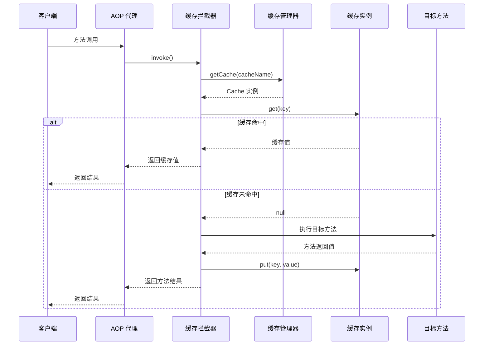
```mermaid
sequenceDiagram
    participant Client as 客户端
    participant Proxy as AOP 代理
    participant CacheInterceptor as 缓存拦截器
    participant CacheManager as 缓存管理器
    participant Cache as 缓存实例
    participant Target as 目标方法
    
    Client->>Proxy: 方法调用
    Proxy->>CacheInterceptor: invoke()
    CacheInterceptor->>CacheManager: getCache(cacheName)
    CacheManager-->>CacheInterceptor: Cache 实例
    CacheInterceptor->>Cache: get(key)
    
    alt 缓存命中
        Cache-->>CacheInterceptor: 缓存值
        CacheInterceptor-->>Proxy: 返回缓存值
        Proxy-->>Client: 返回结果
    else 缓存未命中
        Cache-->>CacheInterceptor: null
        CacheInterceptor->>Target: 执行目标方法
        Target-->>CacheInterceptor: 方法返回值
        CacheInterceptor->>Cache: put(key, value)
        CacheInterceptor-->>Proxy: 返回方法结果
        Proxy-->>Client: 返回结果
    end
```

### @CachePut 源码分析

`@CachePut` 注解的特点是**始终执行方法**，然后将结果更新到缓存。适用于更新操作后刷新缓存的场景。

```java
// CacheAspectSupport.execute() 中的 @CachePut 处理逻辑
private Object execute(final CacheOperationInvoker invoker, Method method, CacheOperationContexts contexts) {
    // 先执行目标方法（与 @Cacheable 不同，不检查缓存）
    Object returnValue = invokeOperation(invoker);
    
    // 处理 @CachePut 操作（将返回值写入缓存）
    processCachePuts(contexts.get(CachePutOperation.class), returnValue);
    
    return returnValue;
}

private void processCachePuts(Collection<CachePutOperation> operations, Object result) {
    for (CachePutOperation op : operations) {
        CacheOperationContext context = getOperationContext(op);
        if (isConditionPassing(context, result)) {  // 检查 condition 条件
            Object key = generateKey(context, result);  // 生成缓存 key
            Cache cache = context.getCache();
            cache.put(key, result);  // 写入缓存
        }
    }
}
```

::: warning @CachePut 的常见陷阱
`@CachePut` 的返回值必须与 `@Cacheable` 的 key 对应，否则缓存不会生效：

```java
// 错误示例：返回 void，无法缓存
@CachePut(value = "users", key = "#user.id")
public void updateUser(User user) {
    userMapper.update(user);
}

// 正确示例：返回更新后的对象
@CachePut(value = "users", key = "#result.id")
public User updateUser(User user) {
    userMapper.update(user);
    return user;  // 返回值用于缓存
}
```
:::

### @CacheEvict 源码分析

`@CacheEvict` 用于清除缓存，支持两种清除时机：

```java
// CacheAspectSupport 中的缓存清除逻辑
private void processCacheEvicts(Collection<CacheEvictOperation> operations, 
                                 boolean beforeInvocation, Object result) {
    for (CacheEvictOperation op : operations) {
        if (op.isBeforeInvocation() == beforeInvocation) {
            performCacheEvict(op, result);
        }
    }
}

private void performCacheEvict(CacheEvictOperation op, Object result) {
    Cache cache = getCache(op.getCacheNames());
    if (op.isCacheWide()) {
        // 清除整个缓存区域
        cache.clear();
    } else {
        // 清除指定 key
        Object key = generateKey(op, result);
        cache.evict(key);
    }
}
```

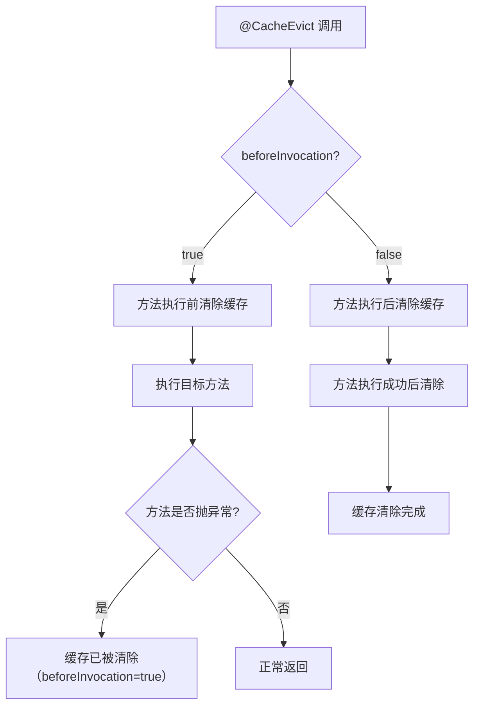
```mermaid
flowchart TD
    A["@CacheEvict 调用"] --> B{"beforeInvocation?"}
    B -->|true| C["方法执行前清除缓存"]
    B -->|false| D["方法执行后清除缓存"]
    C --> E["执行目标方法"]
    D --> F["方法执行成功后清除"]
    E --> G{"方法是否抛异常?"}
    G -->|是| H["缓存已被清除<br/>（beforeInvocation=true）"]
    G -->|否| I["正常返回"]
    F --> J["缓存清除完成"]
    
```

::: tip beforeInvocation 的使用场景
- **默认值 false**：方法成功执行后才清除缓存，确保数据一致性
- **设置为 true**：方法执行前清除缓存，适用于：
  - 方法可能抛异常，但仍需清除缓存的场景
  - 需要强制刷新缓存的场景
:::

### 自定义 CacheResolver

`CacheResolver` 是 Spring Cache 中最灵活的扩展点，允许根据运行时条件动态选择缓存。

```java
/**
 * 自定义缓存解析器：根据方法参数动态选择缓存
 */
public class DynamicCacheResolver implements CacheResolver {
    
    private final CacheManager cacheManager;
    
    public DynamicCacheResolver(CacheManager cacheManager) {
        this.cacheManager = cacheManager;
    }
    
    @Override
    public Collection<? extends Cache> resolveCaches(CacheOperationInvocationContext<?> context) {
        // 根据方法参数动态决定使用哪个缓存
        Object[] args = context.getArgs();
        String cacheName = determineCacheName(args);
        
        Cache cache = cacheManager.getCache(cacheName);
        if (cache == null) {
            throw new IllegalStateException("缓存不存在: " + cacheName);
        }
        return Collections.singletonList(cache);
    }
    
    private String determineCacheName(Object[] args) {
        // 根据租户 ID 选择不同的缓存
        if (args.length > 0 && args[0] instanceof Long tenantId) {
            return "tenant_" + tenantId;
        }
        return "default";
    }
}
```

配置自定义 CacheResolver：

```java
@Configuration
@EnableCaching
public class CacheConfig {
    
    @Bean
    public CacheResolver dynamicCacheResolver(CacheManager cacheManager) {
        return new DynamicCacheResolver(cacheManager);
    }
    
    @Bean
    public CacheManager cacheManager(RedisConnectionFactory factory) {
        // 配置多个缓存区域
        RedisCacheConfiguration config = RedisCacheConfiguration.defaultCacheConfig()
            .entryTtl(Duration.ofMinutes(30));
        
        Map<String, RedisCacheConfiguration> cacheConfigurations = new HashMap<>();
        cacheConfigurations.put("tenant_1", config.entryTtl(Duration.ofMinutes(10)));
        cacheConfigurations.put("tenant_2", config.entryTtl(Duration.ofMinutes(20)));
        cacheConfigurations.put("default", config.entryTtl(Duration.ofMinutes(30)));
        
        return RedisCacheManager.builder(factory)
            .withInitialCacheConfigurations(cacheConfigurations)
            .build();
    }
}
```

使用自定义 CacheResolver：

```java
@Service
public class TenantAwareService {
    
    // 使用自定义缓存解析器
    @Cacheable(cacheResolver = "dynamicCacheResolver", key = "#key")
    public String getData(Long tenantId, String key) {
        return "data for tenant: " + tenantId;
    }
}
```

### 条件化缓存

Spring Cache 支持通过 SpEL 表达式实现条件化缓存：

```java
@Service
public class ConditionalCacheService {
    
    // condition：满足条件才缓存
    @Cacheable(value = "users", key = "#id", condition = "#id > 100")
    public User getUserById(Long id) {
        return userMapper.selectById(id);
    }
    
    // unless：满足条件则不缓存（与 condition 相反）
    @Cacheable(value = "products", key = "#id", unless = "#result.price < 100")
    public Product getProduct(Long id) {
        return productMapper.selectById(id);
    }
    
    // 组合使用：condition + unless
    @Cacheable(value = "orders", key = "#id", 
               condition = "#id != null", 
               unless = "#result == null || #result.status == 'CANCELLED'")
    public Order getOrder(Long id) {
        return orderMapper.selectById(id);
    }
    
    // @CachePut 也支持条件
    @CachePut(value = "users", key = "#user.id", unless = "#result.status == 'INACTIVE'")
    public User updateUser(User user) {
        return userMapper.update(user);
    }
}
```

::: warning condition 与 unless 的区别
- **condition**：在方法执行**前**评估，决定是否参与缓存操作
- **unless**：在方法执行**后**评估，决定是否将结果写入缓存
- 两者可以同时使用，condition 先判断，unless 后判断
:::

### 多缓存管理器配置

在复杂系统中，可能需要同时使用多种缓存实现：

```java
@Configuration
@EnableCaching
public class MultiCacheConfig {
    
    // 本地缓存管理器（Caffeine）
    @Bean
    @Primary
    public CacheManager localCacheManager() {
        CaffeineCacheManager manager = new CaffeineCacheManager();
        manager.setCaffeine(Caffeine.newBuilder()
            .expireAfterWrite(Duration.ofMinutes(10))
            .maximumSize(1000));
        return manager;
    }
    
    // 分布式缓存管理器（Redis）
    @Bean
    public CacheManager distributedCacheManager(RedisConnectionFactory factory) {
        RedisCacheConfiguration config = RedisCacheConfiguration.defaultCacheConfig()
            .entryTtl(Duration.ofHours(1));
        return RedisCacheManager.builder(factory)
            .cacheDefaults(config)
            .build();
    }
    
    // 组合缓存管理器（多级缓存）
    @Bean
    public CompositeCacheManager compositeCacheManager(
            CacheManager localCacheManager, 
            CacheManager distributedCacheManager) {
        CompositeCacheManager composite = new CompositeCacheManager();
        composite.setCacheManagers(Arrays.asList(localCacheManager, distributedCacheManager));
        composite.setFallbackToNoOpCache(false);  // 不允许回退到无操作缓存
        return composite;
    }
}
```

指定使用不同的缓存管理器：

```java
@Service
@CacheConfig(cacheManager = "localCacheManager")  // 类级别默认使用本地缓存
public class MultiCacheService {
    
    // 使用默认的本地缓存
    @Cacheable(value = "localCache", key = "#key")
    public String getLocalData(String key) {
        return "local: " + key;
    }
    
    // 指定使用分布式缓存
    @Cacheable(value = "distributedCache", key = "#key", 
               cacheManager = "distributedCacheManager")
    public String getDistributedData(String key) {
        return "distributed: " + key;
    }
}
```

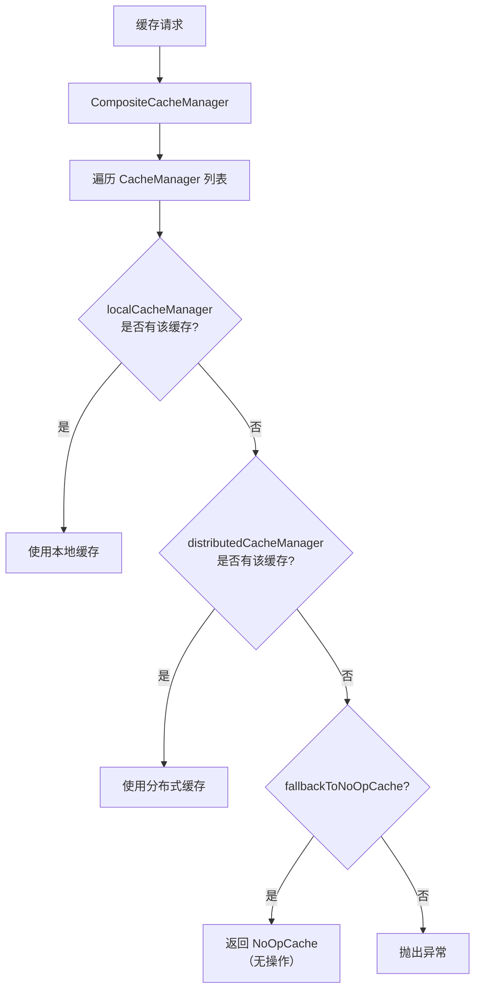
```mermaid
flowchart TD
    A["缓存请求"] --> B["CompositeCacheManager"]
    B --> C["遍历 CacheManager 列表"]
    C --> D{"localCacheManager<br/>是否有该缓存?"}
    D -->|是| E["使用本地缓存"]
    D -->|否| F{"distributedCacheManager<br/>是否有该缓存?"}
    F -->|是| G["使用分布式缓存"]
    F -->|否| H{"fallbackToNoOpCache?"}
    H -->|是| I["返回 NoOpCache<br/>（无操作）"]
    H -->|否| J["抛出异常"]
    
```

## Redis 整合实践

### 自动配置原理

```java
// RedisAutoConfiguration.java
@Configuration(proxyBeanMethods = false)
@ConditionalOnClass(RedisOperations.class)
@EnableConfigurationProperties(RedisProperties.class)
@Import({ LettuceConnectionConfiguration.class, JedisConnectionConfiguration.class })
public class RedisAutoConfiguration {

    @Bean
    @ConditionalOnMissingBean(name = "redisTemplate")
    public RedisTemplate<Object, Object> redisTemplate(
            RedisConnectionFactory redisConnectionFactory) {
        RedisTemplate<Object, Object> template = new RedisTemplate<>();
        template.setConnectionFactory(redisConnectionFactory);
        return template;
    }
}
```

::: warning 默认 RedisTemplate 的序列化陷阱
Spring Boot 自动配置的 `RedisTemplate<Object, Object>` 默认使用 JDK 序列化（`JdkSerializationRedisSerializer`），导致：
1. 存储的 value 是乱码（不可读）
2. 跨语言无法兼容
3. 反序列化存在安全风险

**必须自定义 RedisTemplate，使用 Jackson 序列化。**
:::

### 生产级 RedisTemplate 配置

```java
@Configuration
public class RedisConfig {

    @Bean
    public RedisTemplate<String, Object> redisTemplate(RedisConnectionFactory factory) {
        RedisTemplate<String, Object> template = new RedisTemplate<>();
        template.setConnectionFactory(factory);

        // Key 使用 String 序列化
        StringRedisSerializer stringSerializer = new StringRedisSerializer();
        template.setKeySerializer(stringSerializer);
        template.setHashKeySerializer(stringSerializer);

        // Value 使用 Jackson 序列化
        Jackson2JsonRedisSerializer<Object> jsonSerializer = new Jackson2JsonRedisSerializer<>(Object.class);
        ObjectMapper om = new ObjectMapper();
        om.setVisibility(PropertyAccessor.ALL, JsonAutoDetect.Visibility.ANY);
        om.activateDefaultTyping(LaissezFaireSubTypeValidator.instance,
            ObjectMapper.DefaultTyping.NON_FINAL, JsonTypeInfo.As.PROPERTY);
        jsonSerializer.setObjectMapper(om);

        template.setValueSerializer(jsonSerializer);
        template.setHashValueSerializer(jsonSerializer);

        template.afterPropertiesSet();
        return template;
    }
}
```

### 序列化策略选择

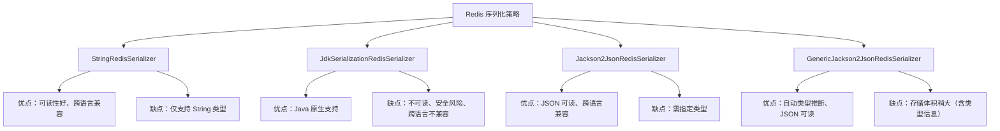
```mermaid
flowchart TD
    A["Redis 序列化策略"] --> B["StringRedisSerializer"]
    A --> C["JdkSerializationRedisSerializer"]
    A --> D["Jackson2JsonRedisSerializer"]
    A --> E["GenericJackson2JsonRedisSerializer"]
    
    B --> B1["优点：可读性好、跨语言兼容"]
    B --> B2["缺点：仅支持 String 类型"]
    
    C --> C1["优点：Java 原生支持"]
    C --> C2["缺点：不可读、安全风险、跨语言不兼容"]
    
    D --> D1["优点：JSON 可读、跨语言兼容"]
    D --> D2["缺点：需指定类型"]
    
    E --> E1["优点：自动类型推断、JSON 可读"]
    E --> E2["缺点：存储体积稍大（含类型信息）"]
    
```

::: tip 序列化策略推荐
- **Key**：统一使用 `StringRedisSerializer`，保证 key 可读性
- **Value**：
  - 简单场景：`StringRedisSerializer`
  - 复杂对象：`GenericJackson2JsonRedisSerializer`（自动类型推断）
  - 性能敏感：`Jackson2JsonRedisSerializer`（需指定类型）
- **避免使用**：`JdkSerializationRedisSerializer`（安全风险）
:::

### 连接池配置

```yaml
# application.yml（Spring Boot 3.x 属性前缀为 spring.data.redis，2.x 为 spring.redis）
spring:
  data:
    redis:
      host: localhost
      port: 6379
      password: ${REDIS_PASSWORD:}
      database: 0
      timeout: 3000ms  # 连接超时时间

      lettuce:  # Lettuce 连接池配置（默认客户端）
        pool:
          max-active: 20      # 最大连接数
          max-idle: 10        # 最大空闲连接数
          min-idle: 5         # 最小空闲连接数
          max-wait: 3000ms    # 获取连接最大等待时间
        shutdown-timeout: 100ms  # 关闭超时时间
```

```java
// 编程式连接池配置
@Configuration
public class RedisPoolConfig {
    
    @Bean
    public LettuceClientConfigurationBuilderCustomizer lettuceCustomizer() {
        return builder -> {
            builder.clientOptions(ClientOptions.builder()
                .autoReconnect(true)  // 自动重连
                .disconnectedBehavior(DisconnectedBehavior.REJECT_COMMANDS)  // 断连时拒绝命令
                .build());
            
            builder.commandTimeout(Duration.ofSeconds(5));
        };
    }
    
    @Bean
    public RedisConnectionFactory redisConnectionFactory(RedisProperties properties) {
        RedisStandaloneConfiguration config = new RedisStandaloneConfiguration();
        config.setHostName(properties.getHost());
        config.setPort(properties.getPort());
        config.setPassword(RedisPassword.of(properties.getPassword()));
        config.setDatabase(properties.getDatabase());
        
        LettucePoolingClientConfiguration poolConfig = LettucePoolingClientConfiguration.builder()
            .poolConfig(new GenericObjectPoolConfig<>() {{
                setMaxTotal(20);
                setMaxIdle(10);
                setMinIdle(5);
                setMaxWait(Duration.ofSeconds(3));
                setTestWhileIdle(true);  // 空闲时测试连接
                setTimeBetweenEvictionRuns(Duration.ofSeconds(30));  // 回收线程运行间隔
            }})
            .commandTimeout(Duration.ofSeconds(5))
            .build();
        
        return new LettuceConnectionFactory(config, poolConfig);
    }
}
```

### 集群配置

```yaml
# Redis 集群配置（Boot 3.x 前缀为 spring.data.redis）
spring:
  data:
    redis:
      cluster:
        nodes:
          - 192.168.1.1:6379
          - 192.168.1.2:6379
          - 192.168.1.3:6379
          - 192.168.1.4:6379
          - 192.168.1.5:6379
          - 192.168.1.6:6379
        max-redirects: 3  # 最大重定向次数
      password: ${REDIS_PASSWORD:}
      lettuce:
        pool:
          max-active: 50
          max-idle: 20
          min-idle: 10
```

```java
// 编程式集群配置
@Configuration
public class RedisClusterConfig {
    
    @Bean
    public RedisConnectionFactory redisClusterConnectionFactory() {
        RedisClusterConfiguration clusterConfig = new RedisClusterConfiguration(
            Arrays.asList(
                "192.168.1.1:6379",
                "192.168.1.2:6379",
                "192.168.1.3:6379"
            )
        );
        clusterConfig.setMaxRedirects(3);
        clusterConfig.setPassword("your-password");
        
        LettucePoolingClientConfiguration poolConfig = LettucePoolingClientConfiguration.builder()
            .poolConfig(new GenericObjectPoolConfig<>() {{
                setMaxTotal(50);
                setMaxIdle(20);
            }})
            .commandTimeout(Duration.ofSeconds(5))
            .build();
        
        return new LettuceConnectionFactory(clusterConfig, poolConfig);
    }
}
```

### 哨兵配置

```yaml
# Redis 哨兵配置（Boot 3.x 前缀为 spring.data.redis）
spring:
  data:
    redis:
      sentinel:
        master: mymaster  # 主节点名称
        nodes:
          - 192.168.1.1:26379
          - 192.168.1.2:26379
          - 192.168.1.3:26379
        password: ${SENTINEL_PASSWORD:}  # 哨兵密码
      password: ${REDIS_PASSWORD:}  # Redis 密码
      database: 0
```

```java
// 编程式哨兵配置
@Configuration
public class RedisSentinelConfig {
    
    @Bean
    public RedisConnectionFactory redisSentinelConnectionFactory() {
        RedisSentinelConfiguration sentinelConfig = new RedisSentinelConfiguration()
            .master("mymaster")
            .sentinel("192.168.1.1", 26379)
            .sentinel("192.168.1.2", 26379)
            .sentinel("192.168.1.3", 26379);
        sentinelConfig.setPassword("redis-password");
        sentinelConfig.setSentinelPassword("sentinel-password");
        
        LettucePoolingClientConfiguration poolConfig = LettucePoolingClientConfiguration.builder()
            .poolConfig(new GenericObjectPoolConfig<>() {{
                setMaxTotal(30);
                setMaxIdle(15);
            }})
            .build();
        
        return new LettuceConnectionFactory(sentinelConfig, poolConfig);
    }
}
```

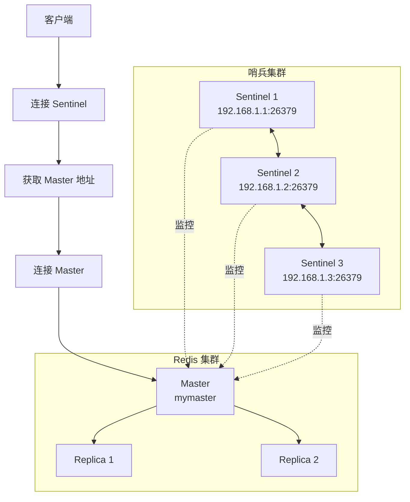
```mermaid
flowchart TD
    subgraph Sentinel["哨兵集群"]
        S1["Sentinel 1<br/>192.168.1.1:26379"]
        S2["Sentinel 2<br/>192.168.1.2:26379"]
        S3["Sentinel 3<br/>192.168.1.3:26379"]
    end
    
    subgraph Redis["Redis 集群"]
        M["Master<br/>mymaster"]
        R1["Replica 1"]
        R2["Replica 2"]
    end
    
    A["客户端"] --> B["连接 Sentinel"]
    B --> C["获取 Master 地址"]
    C --> D["连接 Master"]
    D --> M
    
    S1 -.->|监控| M
    S2 -.->|监控| M
    S3 -.->|监控| M
    
    M --> R1
    M --> R2
    
    S1 <--> S2
    S2 <--> S3
    
```

## Redis 数据结构实战

### String 数据结构

String 是 Redis 最基础的数据结构，可以存储字符串、整数、浮点数、二进制数据（如图片）。

```java
@Service
@RequiredArgsConstructor
public class StringOperationsService {
    
    private final StringRedisTemplate redisTemplate;
    
    // ========== 基础操作 ==========
    
    /**
     * 设置值
     */
    public void set(String key, String value) {
        redisTemplate.opsForValue().set(key, value);
    }
    
    /**
     * 设置值并指定过期时间
     */
    public void setWithExpire(String key, String value, Duration timeout) {
        redisTemplate.opsForValue().set(key, value, timeout);
    }
    
    /**
     * 设置值（仅在 key 不存在时）
     * SETNX 命令，常用于分布式锁
     */
    public Boolean setIfAbsent(String key, String value, Duration timeout) {
        return redisTemplate.opsForValue().setIfAbsent(key, value, timeout);
    }
    
    /**
     * 获取值
     */
    public String get(String key) {
        return redisTemplate.opsForValue().get(key);
    }
    
    // ========== 计数器应用 ==========
    
    /**
     * 自增计数器
     * 场景：文章阅读量、点赞数、API 调用次数
     */
    public Long increment(String key) {
        return redisTemplate.opsForValue().increment(key);
    }
    
    /**
     * 自增指定步长
     */
    public Long incrementBy(String key, long delta) {
        return redisTemplate.opsForValue().increment(key, delta);
    }
    
    /**
     * 自减计数器
     */
    public Long decrement(String key) {
        return redisTemplate.opsForValue().decrement(key);
    }
    
    // ========== 分布式 ID 生成 ==========
    
    /**
     * 生成分布式唯一 ID
     * 场景：订单号、用户 ID
     */
    public Long generateId(String key) {
        return redisTemplate.opsForValue().increment(key);
    }
    
    // ========== 缓存对象 ==========
    
    /**
     * 缓存 JSON 对象
     */
    public <T> void setObject(String key, T object, Duration timeout) {
        String json = JsonUtils.toJson(object);
        redisTemplate.opsForValue().set(key, json, timeout);
    }
    
    /**
     * 获取缓存对象
     */
    public <T> T getObject(String key, Class<T> clazz) {
        String json = redisTemplate.opsForValue().get(key);
        return json != null ? JsonUtils.fromJson(json, clazz) : null;
    }
}
```

::: tip String 的典型应用场景
1. **缓存**：缓存 JSON 对象、HTML 页面、API 响应
2. **计数器**：文章阅读量、点赞数、粉丝数
3. **分布式 ID**：利用 INCR 的原子性生成唯一 ID
4. **分布式锁**：SETNX + 过期时间实现简单分布式锁
5. **限流**：INCR + 过期时间实现计数器限流
:::

### Hash 数据结构

Hash 适合存储对象，比 String + JSON 更灵活，可以单独修改某个字段。

```java
@Service
@RequiredArgsConstructor
public class HashOperationsService {
    
    private final StringRedisTemplate redisTemplate;
    
    // ========== 基础操作 ==========
    
    /**
     * 设置 Hash 字段
     */
    public void hset(String key, String field, String value) {
        redisTemplate.opsForHash().put(key, field, value);
    }
    
    /**
     * 批量设置 Hash 字段
     */
    public void hsetAll(String key, Map<String, String> map) {
        redisTemplate.opsForHash().putAll(key, map);
    }
    
    /**
     * 获取 Hash 字段值
     */
    public String hget(String key, String field) {
        Object value = redisTemplate.opsForHash().get(key, field);
        return value != null ? value.toString() : null;
    }
    
    /**
     * 获取所有字段
     */
    public Map<Object, Object> hgetAll(String key) {
        return redisTemplate.opsForHash().entries(key);
    }
    
    /**
     * 删除字段
     */
    public Long hdel(String key, String... fields) {
        return redisTemplate.opsForHash().delete(key, (Object[]) fields);
    }
    
    /**
     * 判断字段是否存在
     */
    public Boolean hexists(String key, String field) {
        return redisTemplate.opsForHash().hasKey(key, field);
    }
    
    // ========== 对象缓存 ==========
    
    /**
     * 缓存用户对象（Hash 方式）
     * 优点：可以单独更新某个字段，无需整体更新
     */
    public void cacheUser(User user) {
        String key = "user:" + user.getId();
        Map<String, String> map = new HashMap<>();
        map.put("id", user.getId().toString());
        map.put("username", user.getUsername());
        map.put("email", user.getEmail());
        map.put("status", user.getStatus());
        redisTemplate.opsForHash().putAll(key, map);
    }
    
    /**
     * 获取用户对象
     */
    public User getUser(Long userId) {
        String key = "user:" + userId;
        Map<Object, Object> entries = redisTemplate.opsForHash().entries(key);
        if (entries.isEmpty()) {
            return null;
        }
        User user = new User();
        user.setId(Long.parseLong(entries.get("id").toString()));
        user.setUsername(entries.get("username").toString());
        user.setEmail(entries.get("email").toString());
        user.setStatus(entries.get("status").toString());
        return user;
    }
    
    /**
     * 更新用户单个字段
     */
    public void updateUserField(Long userId, String field, String value) {
        String key = "user:" + userId;
        redisTemplate.opsForHash().put(key, field, value);
    }
    
    // ========== 购物车实现 ==========
    
    /**
     * 添加商品到购物车
     * key: cart:用户ID
     * field: 商品ID
     * value: 商品数量
     */
    public void addToCart(Long userId, Long productId, Integer quantity) {
        String key = "cart:" + userId;
        redisTemplate.opsForHash().increment(key, productId.toString(), quantity);
    }
    
    /**
     * 获取购物车商品数量
     */
    public Integer getCartQuantity(Long userId, Long productId) {
        String key = "cart:" + userId;
        Object value = redisTemplate.opsForHash().get(key, productId.toString());
        return value != null ? Integer.parseInt(value.toString()) : 0;
    }
    
    /**
     * 获取购物车所有商品
     */
    public Map<Long, Integer> getCartAll(Long userId) {
        String key = "cart:" + userId;
        Map<Object, Object> entries = redisTemplate.opsForHash().entries(key);
        return entries.entrySet().stream()
            .collect(Collectors.toMap(
                e -> Long.parseLong(e.getKey().toString()),
                e -> Integer.parseInt(e.getValue().toString())
            ));
    }
    
    /**
     * 从购物车移除商品
     */
    public void removeFromCart(Long userId, Long productId) {
        String key = "cart:" + userId;
        redisTemplate.opsForHash().delete(key, productId.toString());
    }
    
    /**
     * 清空购物车
     */
    public void clearCart(Long userId) {
        String key = "cart:" + userId;
        redisTemplate.delete(key);
    }
}
```

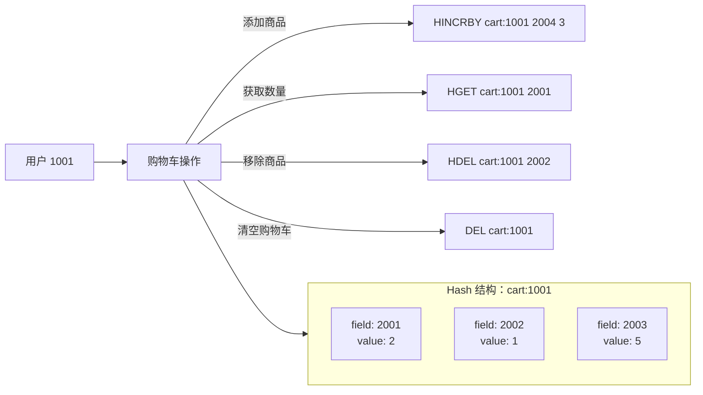
```mermaid
flowchart LR
    subgraph Hash["Hash 结构：cart:1001"]
        F1["field: 2001<br/>value: 2"]
        F2["field: 2002<br/>value: 1"]
        F3["field: 2003<br/>value: 5"]
    end
    
    U["用户 1001"] --> C["购物车操作"]
    C --> Hash
    
    C -->|添加商品| A["HINCRBY cart:1001 2004 3"]
    C -->|获取数量| G["HGET cart:1001 2001"]
    C -->|移除商品| R["HDEL cart:1001 2002"]
    C -->|清空购物车| D["DEL cart:1001"]
    
```

### List 数据结构

List 是双向链表，支持从两端插入/弹出，适合实现队列、栈、最新列表等。

```java
@Service
@RequiredArgsConstructor
public class ListOperationsService {
    
    private final StringRedisTemplate redisTemplate;
    
    // ========== 基础操作 ==========
    
    /**
     * 左侧插入（头部）
     */
    public Long lpush(String key, String value) {
        return redisTemplate.opsForList().leftPush(key, value);
    }
    
    /**
     * 右侧插入（尾部）
     */
    public Long rpush(String key, String value) {
        return redisTemplate.opsForList().rightPush(key, value);
    }
    
    /**
     * 左侧弹出（头部）
     */
    public String lpop(String key) {
        return redisTemplate.opsForList().leftPop(key);
    }
    
    /**
     * 右侧弹出（尾部）
     */
    public String rpop(String key) {
        return redisTemplate.opsForList().rightPop(key);
    }
    
    /**
     * 阻塞式左侧弹出
     * 场景：消息队列消费者
     */
    public String blpop(String key, long timeout, TimeUnit unit) {
        return redisTemplate.opsForList().leftPop(key, timeout, unit);
    }
    
    /**
     * 获取列表长度
     */
    public Long llen(String key) {
        return redisTemplate.opsForList().size(key);
    }
    
    /**
     * 获取指定范围元素
     */
    public List<String> lrange(String key, long start, long end) {
        return redisTemplate.opsForList().range(key, start, end);
    }
    
    // ========== 最新消息列表 ==========
    
    /**
     * 添加最新消息（保留最近 N 条）
     * 场景：最新文章、最新评论、最新动态
     */
    public void pushLatestNews(String key, String newsId, int maxSize) {
        // 使用事务保证原子性
        redisTemplate.execute(new SessionCallback<Object>() {
            @Override
            public Object execute(RedisOperations operations) throws DataAccessException {
                operations.multi();
                operations.opsForList().leftPush(key, newsId);
                operations.opsForList().trim(key, 0, maxSize - 1);  // 保留前 N 条
                return operations.exec();
            }
        });
    }
    
    /**
     * 获取最新消息列表
     */
    public List<String> getLatestNews(String key, int count) {
        return redisTemplate.opsForList().range(key, 0, count - 1);
    }
    
    // ========== 简单消息队列 ==========
    
    /**
     * 发送消息（生产者）
     */
    public void sendMessage(String queueName, String message) {
        redisTemplate.opsForList().rightPush(queueName, message);
    }
    
    /**
     * 接收消息（消费者）
     * 阻塞式获取，超时返回 null
     */
    public String receiveMessage(String queueName, long timeoutSeconds) {
        return redisTemplate.opsForList().leftPop(queueName, timeoutSeconds, TimeUnit.SECONDS);
    }
    
    // ========== 文章分页 ==========
    
    /**
     * 分页获取文章列表
     * 场景：用户文章列表、时间线
     */
    public List<String> getArticlesByPage(String key, int page, int pageSize) {
        long start = (long) (page - 1) * pageSize;
        long end = start + pageSize - 1;
        return redisTemplate.opsForList().range(key, start, end);
    }
}
```

::: warning List 作为消息队列的局限性
1. **消息丢失风险**：消费者宕机时，已弹出但未处理的消息会丢失
2. **无确认机制**：无法确认消息是否被成功处理
3. **无消费者组**：不支持多消费者负载均衡
4. **推荐替代方案**：Redis Stream（支持消费者组、消息确认）
:::

### Set 数据结构

Set 是无序不重复集合，支持交集、并集、差集运算，适合去重、标签系统、社交关系。

```java
@Service
@RequiredArgsConstructor
public class SetOperationsService {
    
    private final StringRedisTemplate redisTemplate;
    
    // ========== 基础操作 ==========
    
    /**
     * 添加元素
     */
    public Long sadd(String key, String... values) {
        return redisTemplate.opsForSet().add(key, values);
    }
    
    /**
     * 移除元素
     */
    public Long srem(String key, String... values) {
        return redisTemplate.opsForSet().remove(key, values);
    }
    
    /**
     * 获取所有元素
     */
    public Set<String> smembers(String key) {
        return redisTemplate.opsForSet().members(key);
    }
    
    /**
     * 判断元素是否存在
     */
    public Boolean sismember(String key, String value) {
        return redisTemplate.opsForSet().isMember(key, value);
    }
    
    /**
     * 获取集合大小
     */
    public Long scard(String key) {
        return redisTemplate.opsForSet().size(key);
    }
    
    // ========== 集合运算 ==========
    
    /**
     * 交集：共同好友
     */
    public Set<String> sinter(String key1, String key2) {
        return redisTemplate.opsForSet().intersect(key1, key2);
    }
    
    /**
     * 并集：可能认识的人
     */
    public Set<String> sunion(String key1, String key2) {
        return redisTemplate.opsForSet().union(key1, key2);
    }
    
    /**
     * 差集：我的好友中对方不是好友的
     */
    public Set<String> sdiff(String key1, String key2) {
        return redisTemplate.opsForSet().difference(key1, key2);
    }
    
    // ========== 社交关系应用 ==========
    
    /**
     * 关注用户
     */
    public void follow(Long userId, Long targetUserId) {
        String followingKey = "user:" + userId + ":following";
        String followersKey = "user:" + targetUserId + ":followers";
        
        // 使用事务保证原子性
        redisTemplate.execute(new SessionCallback<Object>() {
            @Override
            public Object execute(RedisOperations operations) {
                operations.multi();
                operations.opsForSet().add(followingKey, targetUserId.toString());
                operations.opsForSet().add(followersKey, userId.toString());
                return operations.exec();
            }
        });
    }
    
    /**
     * 取消关注
     */
    public void unfollow(Long userId, Long targetUserId) {
        String followingKey = "user:" + userId + ":following";
        String followersKey = "user:" + targetUserId + ":followers";
        
        redisTemplate.execute(new SessionCallback<Object>() {
            @Override
            public Object execute(RedisOperations operations) {
                operations.multi();
                operations.opsForSet().remove(followingKey, targetUserId.toString());
                operations.opsForSet().remove(followersKey, userId.toString());
                return operations.exec();
            }
        });
    }
    
    /**
     * 获取共同关注
     */
    public Set<String> getCommonFollowing(Long userId1, Long userId2) {
        String key1 = "user:" + userId1 + ":following";
        String key2 = "user:" + userId2 + ":following";
        return redisTemplate.opsForSet().intersect(key1, key2);
    }
    
    /**
     * 获取粉丝列表
     */
    public Set<String> getFollowers(Long userId) {
        return redisTemplate.opsForSet().members("user:" + userId + ":followers");
    }
    
    /**
     * 获取关注列表
     */
    public Set<String> getFollowing(Long userId) {
        return redisTemplate.opsForSet().members("user:" + userId + ":following");
    }
    
    // ========== 标签系统 ==========
    
    /**
     * 为文章添加标签
     */
    public void addTagsToArticle(Long articleId, Set<String> tags) {
        for (String tag : tags) {
            // 文章 → 标签集合
            redisTemplate.opsForSet().add("article:" + articleId + ":tags", tag);
            // 标签 → 文章集合（反向索引）
            redisTemplate.opsForSet().add("tag:" + tag + ":articles", articleId.toString());
        }
    }
    
    /**
     * 获取文章的所有标签
     */
    public Set<String> getArticleTags(Long articleId) {
        return redisTemplate.opsForSet().members("article:" + articleId + ":tags");
    }
    
    /**
     * 获取某标签下的所有文章
     */
    public Set<String> getArticlesByTag(String tag) {
        return redisTemplate.opsForSet().members("tag:" + tag + ":articles");
    }
    
    /**
     * 获取包含所有指定标签的文章（交集）
     */
    public Set<String> getArticlesByTags(Set<String> tags) {
        List<String> keys = tags.stream()
            .map(tag -> "tag:" + tag + ":articles")
            .collect(Collectors.toList());
        return redisTemplate.opsForSet().intersect(keys);
    }
    
    // ========== 唯一性去重 ==========
    
    /**
     * 记录已点赞用户
     * 场景：文章点赞、视频点赞
     */
    public Boolean like(Long userId, Long articleId) {
        String key = "article:" + articleId + ":likes";
        Long result = redisTemplate.opsForSet().add(key, userId.toString());
        return result != null && result > 0;  // 返回是否首次点赞
    }
    
    /**
     * 取消点赞
     */
    public Boolean unlike(Long userId, Long articleId) {
        String key = "article:" + articleId + ":likes";
        Long result = redisTemplate.opsForSet().remove(key, userId.toString());
        return result != null && result > 0;
    }
    
    /**
     * 检查是否已点赞
     */
    public Boolean hasLiked(Long userId, Long articleId) {
        String key = "article:" + articleId + ":likes";
        return redisTemplate.opsForSet().isMember(key, userId.toString());
    }
    
    /**
     * 获取点赞数
     */
    public Long getLikeCount(Long articleId) {
        String key = "article:" + articleId + ":likes";
        return redisTemplate.opsForSet().size(key);
    }
}
```

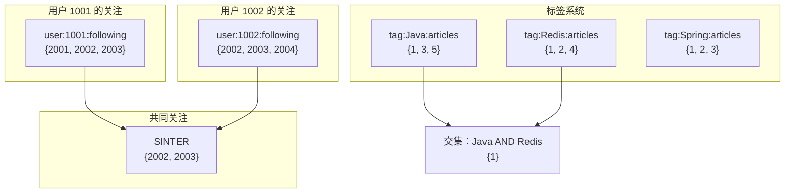
```mermaid
flowchart TD
    subgraph User1["用户 1001 的关注"]
        U1F["user:1001:following<br/>{2001, 2002, 2003}"]
    end
    
    subgraph User2["用户 1002 的关注"]
        U2F["user:1002:following<br/>{2002, 2003, 2004}"]
    end
    
    subgraph Common["共同关注"]
        C["SINTER<br/>{2002, 2003}"]
    end
    
    subgraph Tags["标签系统"]
        T1["tag:Java:articles<br/>{1, 3, 5}"]
        T2["tag:Redis:articles<br/>{1, 2, 4}"]
        T3["tag:Spring:articles<br/>{1, 2, 3}"]
    end
    
    U1F --> C
    U2F --> C
    
    T1 --> I["交集：Java AND Redis<br/>{1}"]
    T2 --> I
```

### ZSet 数据结构

ZSet（有序集合）在 Set 基础上增加了分数（score），支持按分数排序，适合排行榜、延迟队列等场景。

```java
@Service
@RequiredArgsConstructor
public class ZSetOperationsService {
    
    private final StringRedisTemplate redisTemplate;
    
    // ========== 基础操作 ==========
    
    /**
     * 添加元素（带分数）
     */
    public Boolean zadd(String key, String value, double score) {
        return redisTemplate.opsForZSet().add(key, value, score);
    }
    
    /**
     * 移除元素
     */
    public Long zrem(String key, String... values) {
        return redisTemplate.opsForZSet().remove(key, values);
    }
    
    /**
     * 增加分数
     */
    public Double zincrby(String key, String value, double delta) {
        return redisTemplate.opsForZSet().incrementScore(key, value, delta);
    }
    
    /**
     * 获取元素分数
     */
    public Double zscore(String key, String value) {
        return redisTemplate.opsForZSet().score(key, value);
    }
    
    /**
     * 获取元素排名（从 0 开始，升序）
     */
    public Long zrank(String key, String value) {
        return redisTemplate.opsForZSet().rank(key, value);
    }
    
    /**
     * 获取元素排名（降序）
     */
    public Long zrevrank(String key, String value) {
        return redisTemplate.opsForZSet().reverseRank(key, value);
    }
    
    /**
     * 获取集合大小
     */
    public Long zcard(String key) {
        return redisTemplate.opsForZSet().size(key);
    }
    
    // ========== 排行榜实现 ==========
    
    /**
     * 更新用户积分
     * 场景：游戏排行榜、积分系统
     */
    public void updateScore(String leaderboard, String userId, double score) {
        redisTemplate.opsForZSet().add(leaderboard, userId, score);
    }
    
    /**
     * 增加用户积分
     */
    public void incrementScore(String leaderboard, String userId, double delta) {
        redisTemplate.opsForZSet().incrementScore(leaderboard, userId, delta);
    }
    
    /**
     * 获取排行榜 Top N（降序）
     */
    public Set<String> getTopN(String leaderboard, int n) {
        return redisTemplate.opsForZSet().reverseRange(leaderboard, 0, n - 1);
    }
    
    /**
     * 获取排行榜 Top N（带分数）
     */
    public Set<ZSetOperations.TypedTuple<String>> getTopNWithScores(String leaderboard, int n) {
        return redisTemplate.opsForZSet().reverseRangeWithScores(leaderboard, 0, n - 1);
    }
    
    /**
     * 获取用户排名（从 1 开始）
     */
    public Long getUserRank(String leaderboard, String userId) {
        Long rank = redisTemplate.opsForZSet().reverseRank(leaderboard, userId);
        return rank != null ? rank + 1 : null;  // 转换为从 1 开始
    }
    
    /**
     * 获取用户分数
     */
    public Double getUserScore(String leaderboard, String userId) {
        return redisTemplate.opsForZSet().score(leaderboard, userId);
    }
    
    /**
     * 获取指定分数范围内的元素
     */
    public Set<String> getRangeByScore(String key, double min, double max) {
        return redisTemplate.opsForZSet().rangeByScore(key, min, max);
    }
    
    /**
     * 分页获取排行榜
     */
    public Set<ZSetOperations.TypedTuple<String>> getLeaderboardByPage(
            String leaderboard, int page, int pageSize) {
        long start = (long) (page - 1) * pageSize;
        long end = start + pageSize - 1;
        return redisTemplate.opsForZSet().reverseRangeWithScores(leaderboard, start, end);
    }
    
    // ========== 延迟队列实现 ==========
    
    /**
     * 添加延迟任务
     * score 为执行时间戳
     */
    public void addDelayTask(String queueName, String taskId, long executeTimestamp) {
        redisTemplate.opsForZSet().add(queueName, taskId, executeTimestamp);
    }
    
    /**
     * 获取到期任务
     */
    public Set<String> getExpiredTasks(String queueName) {
        long now = System.currentTimeMillis();
        return redisTemplate.opsForZSet().rangeByScore(queueName, 0, now);
    }
    
    /**
     * 获取并移除到期任务（原子操作）
     */
    public Set<String> fetchAndRemoveExpiredTasks(String queueName, int limit) {
        long now = System.currentTimeMillis();
        
        // 使用 Lua 脚本保证原子性
        String script = """
            local tasks = redis.call('ZRANGEBYSCORE', KEYS[1], 0, ARGV[1], 'LIMIT', 0, ARGV[2])
            if #tasks > 0 then
                redis.call('ZREM', KEYS[1], unpack(tasks))
            end
            return tasks
            """;
        
        return redisTemplate.execute(
            new DefaultRedisScript<>(script, Set.class),
            Collections.singletonList(queueName),
            String.valueOf(now),
            String.valueOf(limit)
        );
    }
    
    // ========== 滑动窗口限流 ==========
    
    /**
     * 滑动窗口限流检查
     * 使用 ZSet 实现精确的滑动窗口
     */
    public boolean isAllowed(String key, long windowSize, int maxRequests) {
        long now = System.currentTimeMillis();
        long windowStart = now - windowSize;
        
        // 移除窗口外的请求
        redisTemplate.opsForZSet().removeRangeByScore(key, 0, windowStart);
        
        // 统计窗口内请求数
        Long count = redisTemplate.opsForZSet().size(key);
        
        if (count != null && count >= maxRequests) {
            return false;  // 超过限制
        }
        
        // 添加当前请求
        redisTemplate.opsForZSet().add(key, UUID.randomUUID().toString(), now);
        
        // 设置过期时间（窗口大小 + 1 秒）
        redisTemplate.expire(key, Duration.ofMillis(windowSize + 1000));
        
        return true;
    }
}
```

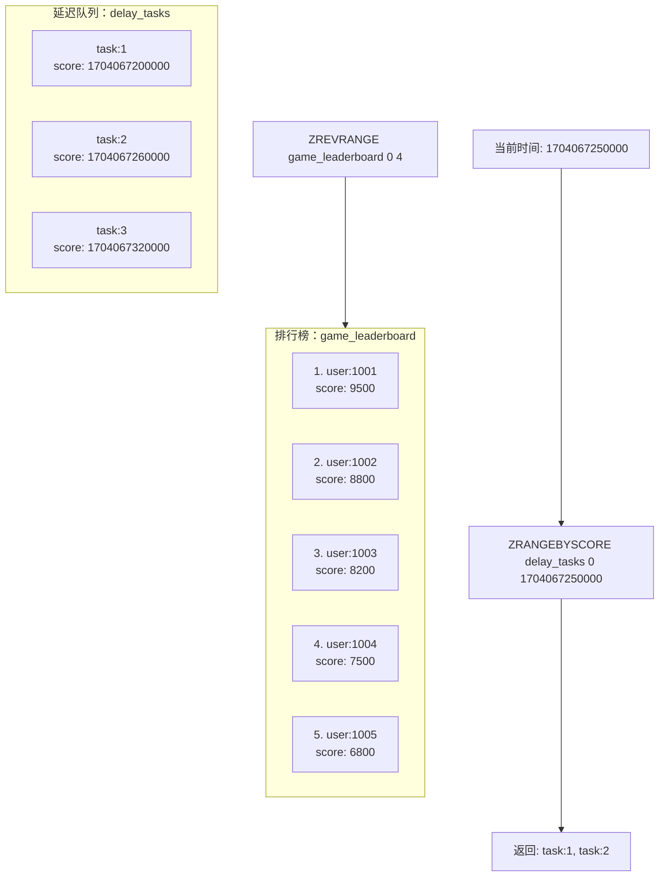
```mermaid
flowchart TD
    subgraph Leaderboard["排行榜：game_leaderboard"]
        R1["1. user:1001<br/>score: 9500"]
        R2["2. user:1002<br/>score: 8800"]
        R3["3. user:1003<br/>score: 8200"]
        R4["4. user:1004<br/>score: 7500"]
        R5["5. user:1005<br/>score: 6800"]
    end
    
    subgraph DelayQueue["延迟队列：delay_tasks"]
        D1["task:1<br/>score: 1704067200000"]
        D2["task:2<br/>score: 1704067260000"]
        D3["task:3<br/>score: 1704067320000"]
    end
    
    A["ZREVRANGE game_leaderboard 0 4"] --> Leaderboard
    
    B["当前时间: 1704067250000"] --> C["ZRANGEBYSCORE delay_tasks 0 1704067250000"]
    C --> D["返回: task:1, task:2"]
    
```

### Stream 数据结构

Redis Stream 是 Redis 5.0 引入的数据结构，专门用于消息队列场景，支持消费者组、消息确认、持久化。

```java
@Service
@RequiredArgsConstructor
public class StreamOperationsService {
    
    private final StringRedisTemplate redisTemplate;
    
    // ========== 基础操作 ==========
    
    /**
     * 发送消息
     * 返回消息 ID（格式：时间戳-序号）
     */
    public RecordId sendMessage(String streamKey, Map<String, String> message) {
        return redisTemplate.opsForStream().add(streamKey, message);
    }
    
    /**
     * 发送消息（限制队列长度）
     */
    public RecordId sendMessageWithMaxLen(String streamKey, Map<String, String> message, long maxLen) {
        return redisTemplate.opsForStream().add(
            StreamRecords.newRecord()
                .ofMap(message)
                .withStreamKey(streamKey),
            XAddOptions.maxLen(maxLen)
        );
    }
    
    /**
     * 读取消息（从指定 ID 开始）
     */
    public List<MapRecord<String, Object, Object>> readMessages(
            String streamKey, String startId, long count) {
        return redisTemplate.opsForStream().read(
            StreamOffset.create(streamKey, ReadOffset.from(startId)),
            StreamReadOptions.empty().count(count)
        );
    }
    
    /**
     * 读取最新消息（阻塞式）
     */
    public List<MapRecord<String, Object, Object>> readNewMessages(
            String streamKey, String lastId, long blockMs) {
        return redisTemplate.opsForStream().read(
            StreamOffset.create(streamKey, ReadOffset.lastConsumed()),
            StreamReadOptions.empty().block(Duration.ofMillis(blockMs))
        );
    }
    
    // ========== 消费者组 ==========
    
    /**
     * 创建消费者组
     * startId: "0" 表示从头开始，"$" 表示只接收新消息
     */
    public String createConsumerGroup(String streamKey, String groupName, String startId) {
        return redisTemplate.opsForStream().createGroup(streamKey, groupName);
    }
    
    /**
     * 删除消费者组
     */
    public Boolean deleteConsumerGroup(String streamKey, String groupName) {
        return redisTemplate.opsForStream().destroyGroup(streamKey, groupName);
    }
    
    /**
     * 消费者读取消息（消费者组模式）
     */
    public List<MapRecord<String, Object, Object>> readAsConsumer(
            String streamKey, String groupName, String consumerName, long count) {
        return redisTemplate.opsForStream().read(
            Consumer.from(groupName, consumerName),
            StreamOffset.create(streamKey, ReadOffset.lastConsumed()),
            StreamReadOptions.empty().count(count).autoAck()
        );
    }
    
    /**
     * 消费者读取消息（手动确认模式）
     */
    public List<MapRecord<String, Object, Object>> readAsConsumerManualAck(
            String streamKey, String groupName, String consumerName, long count) {
        return redisTemplate.opsForStream().read(
            Consumer.from(groupName, consumerName),
            StreamOffset.create(streamKey, ReadOffset.lastConsumed()),
            StreamReadOptions.empty().count(count)  // 不自动确认
        );
    }
    
    /**
     * 确认消息（ACK）
     */
    public Long ackMessage(String streamKey, String groupName, RecordId... recordIds) {
        return redisTemplate.opsForStream().acknowledge(streamKey, groupName, recordIds);
    }
    
    /**
     * 获取待处理消息（未确认的消息）
     */
    public PendingMessagesSummary getPendingSummary(String streamKey, String groupName) {
        return redisTemplate.opsForStream().pending(streamKey, groupName);
    }
    
    /**
     * 认领超时消息（转移给其他消费者）
     */
    public List<MapRecord<String, Object, Object>> claimPendingMessages(
            String streamKey, String groupName, String newConsumer, 
            long minIdleTimeMs, RecordId... recordIds) {
        return redisTemplate.opsForStream().claim(
            streamKey, groupName, newConsumer,
            Duration.ofMillis(minIdleTimeMs),
            recordIds
        );
    }
    
    // ========== 消息队列完整示例 ==========
    
    /**
     * 生产者：发送订单消息
     */
    public RecordId sendOrderMessage(Order order) {
        Map<String, String> message = new HashMap<>();
        message.put("orderId", order.getId().toString());
        message.put("userId", order.getUserId().toString());
        message.put("amount", order.getAmount().toString());
        message.put("timestamp", String.valueOf(System.currentTimeMillis()));
        
        return redisTemplate.opsForStream().add("order_stream", message);
    }
    
    /**
     * 消费者：处理订单消息
     */
    @Scheduled(fixedDelay = 1000)  // 每秒拉取一次
    public void consumeOrderMessages() {
        String streamKey = "order_stream";
        String groupName = "order-processors";
        String consumerName = "consumer-1";
        
        // 读取消息
        List<MapRecord<String, Object, Object>> messages = readAsConsumerManualAck(
            streamKey, groupName, consumerName, 10
        );
        
        for (MapRecord<String, Object, Object> message : messages) {
            try {
                // 处理消息
                processOrder(message.getValue());
                
                // 确认消息
                redisTemplate.opsForStream().acknowledge(
                    streamKey, groupName, message.getId()
                );
            } catch (Exception e) {
                log.error("处理订单消息失败: {}", message.getId(), e);
                // 消息未确认，会进入待处理队列
            }
        }
    }
    
    private void processOrder(Map<Object, Object> message) {
        // 业务处理逻辑
        Long orderId = Long.parseLong(message.get("orderId").toString());
        log.info("处理订单: {}", orderId);
    }
}
```

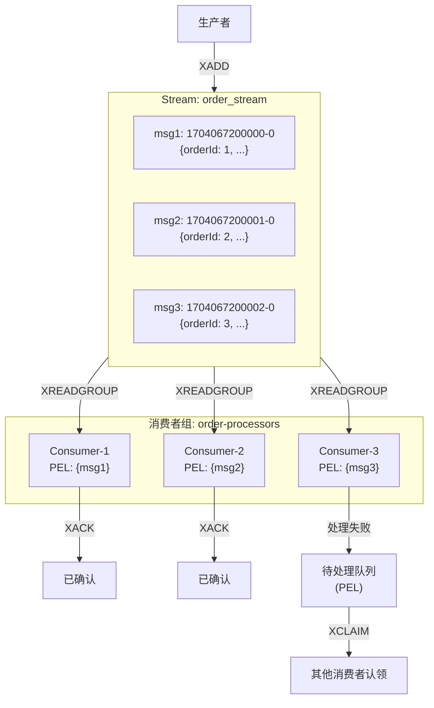
```mermaid
flowchart TD
    subgraph Stream["Stream: order_stream"]
        M1["msg1: 1704067200000-0<br/>{orderId: 1, ...}"]
        M2["msg2: 1704067200001-0<br/>{orderId: 2, ...}"]
        M3["msg3: 1704067200002-0<br/>{orderId: 3, ...}"]
    end
    
    subgraph Group["消费者组: order-processors"]
        C1["Consumer-1<br/>PEL: {msg1}"]
        C2["Consumer-2<br/>PEL: {msg2}"]
        C3["Consumer-3<br/>PEL: {msg3}"]
    end
    
    P["生产者"] -->|"XADD"| Stream
    Stream -->|"XREADGROUP"| C1
    Stream -->|"XREADGROUP"| C2
    Stream -->|"XREADGROUP"| C3
    
    C1 -->|"XACK"| ACK1["已确认"]
    C2 -->|"XACK"| ACK2["已确认"]
    C3 -->|"处理失败"| PEL["待处理队列<br/>(PEL)"]
    
    PEL -->|"XCLAIM"| C4["其他消费者认领"]
    
```

::: tip Redis Stream vs 其他消息队列
| 特性 | Redis Stream | RabbitMQ | Kafka |
|------|-------------|----------|-------|
| 消息持久化 | 支持 | 支持 | 支持 |
| 消费者组 | 支持 | 不支持 | 支持 |
| 消息确认 | 支持 | 支持 | 支持（偏移量） |
| 消息回溯 | 支持 | 不支持 | 支持 |
| 吞吐量 | 中等 | 中等 | 高 |
| 延迟 | 低 | 低 | 中等 |
| 适用场景 | 轻量级消息队列 | 复杂路由场景 | 大数据流处理 |
:::

## 缓存常见问题

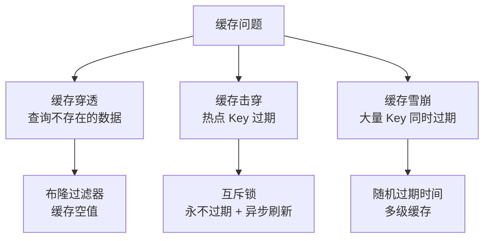
```mermaid
flowchart TD
    A["缓存问题"] --> B["缓存穿透<br/>查询不存在的数据"]
    A --> C["缓存击穿<br/>热点 Key 过期"]
    A --> D["缓存雪崩<br/>大量 Key 同时过期"]

    B --> E["布隆过滤器<br/>缓存空值"]
    C --> F["互斥锁<br/>永不过期 + 异步刷新"]
    D --> G["随机过期时间<br/>多级缓存"]

```

### 缓存穿透深度方案

缓存穿透是指查询不存在的数据，缓存和数据库都没有，导致每次请求都打到数据库。

::: danger 缓存穿透的线上案例
某电商系统遭恶意攻击，大量请求查询不存在的商品 ID。由于缓存中没有数据，所有请求打到数据库，导致数据库连接池耗尽、服务不可用。

**修复方案**：1. 缓存空值（设置短过期时间）；2. 接入层参数校验（ID 格式不合法直接拒绝）；3. 布隆过滤器预过滤。
:::

#### 方案一：缓存空值

```java
@Service
@RequiredArgsConstructor
public class ProductService {
    
    private final StringRedisTemplate redisTemplate;
    private final ProductMapper productMapper;
    
    private static final String CACHE_NULL = "NULL";
    private static final Duration NULL_CACHE_TTL = Duration.ofMinutes(2);
    
    /**
     * 查询商品（缓存空值方案）
     */
    public Product getProduct(Long id) {
        String key = "product:" + id;
        
        // 1. 查询缓存
        String cached = redisTemplate.opsForValue().get(key);
        
        // 2. 缓存命中，判断是否为空值标记
        if (cached != null) {
            if (CACHE_NULL.equals(cached)) {
                return null;  // 空值标记，直接返回 null
            }
            return JsonUtils.fromJson(cached, Product.class);
        }
        
        // 3. 查询数据库
        Product product = productMapper.selectById(id);
        
        // 4. 数据库也没有，缓存空值标记
        if (product == null) {
            redisTemplate.opsForValue().set(key, CACHE_NULL, NULL_CACHE_TTL);
            return null;
        }
        
        // 5. 缓存真实数据
        redisTemplate.opsForValue().set(key, JsonUtils.toJson(product), Duration.ofHours(1));
        return product;
    }
}
```

#### 方案二：布隆过滤器

```java
/**
 * 布隆过滤器服务
 * 使用 RedisBloom 模块或 Guava BloomFilter
 */
@Service
@RequiredArgsConstructor
public class BloomFilterService {
    
    private final StringRedisTemplate redisTemplate;
    
    private static final String BLOOM_KEY = "product:bloom";
    
    /**
     * 初始化布隆过滤器（使用 RedisBloom 模块）
     * 需要安装 RedisBloom 模块：BF.ADD、BF.EXISTS、BF.RESERVE
     */
    public void initBloomFilter(List<Long> productIds) {
        // 创建布隆过滤器（预计元素数量、误判率）
        // BF.RESERVE product:bloom 0.001 1000000
        String reserveScript = """
            redis.call('BF.RESERVE', KEYS[1], ARGV[1], ARGV[2])
            return 'OK'
            """;
        try {
            redisTemplate.execute(
                new DefaultRedisScript<>(reserveScript, String.class),
                Collections.singletonList(BLOOM_KEY),
                "0.001",  // 误判率 0.1%
                "1000000"  // 预计元素数量
            );
        } catch (Exception e) {
            // 布隆过滤器可能已存在，忽略错误
        }
        
        // 批量添加元素
        for (Long productId : productIds) {
            add(productId);
        }
    }
    
    /**
     * 添加元素到布隆过滤器
     */
    public Boolean add(Long productId) {
        String script = """
            return redis.call('BF.ADD', KEYS[1], ARGV[1])
            """;
        Long result = redisTemplate.execute(
            new DefaultRedisScript<>(script, Long.class),
            Collections.singletonList(BLOOM_KEY),
            productId.toString()
        );
        return result != null && result == 1L;
    }
    
    /**
     * 检查元素是否可能存在
     * 返回 false：一定不存在
     * 返回 true：可能存在（有误判率）
     */
    public Boolean mightContain(Long productId) {
        String script = """
            return redis.call('BF.EXISTS', KEYS[1], ARGV[1])
            """;
        Long result = redisTemplate.execute(
            new DefaultRedisScript<>(script, Long.class),
            Collections.singletonList(BLOOM_KEY),
            productId.toString()
        );
        return result != null && result == 1L;
    }
}

/**
 * 使用布隆过滤器的商品查询
 */
@Service
@RequiredArgsConstructor
public class ProductQueryService {
    
    private final BloomFilterService bloomFilterService;
    private final ProductService productService;
    
    /**
     * 查询商品（布隆过滤器方案）
     */
    public Product getProduct(Long id) {
        // 1. 布隆过滤器判断是否可能存在
        if (!bloomFilterService.mightContain(id)) {
            // 一定不存在，直接返回 null
            return null;
        }
        
        // 2. 可能存在，走正常查询流程
        return productService.getProduct(id);
    }
}
```

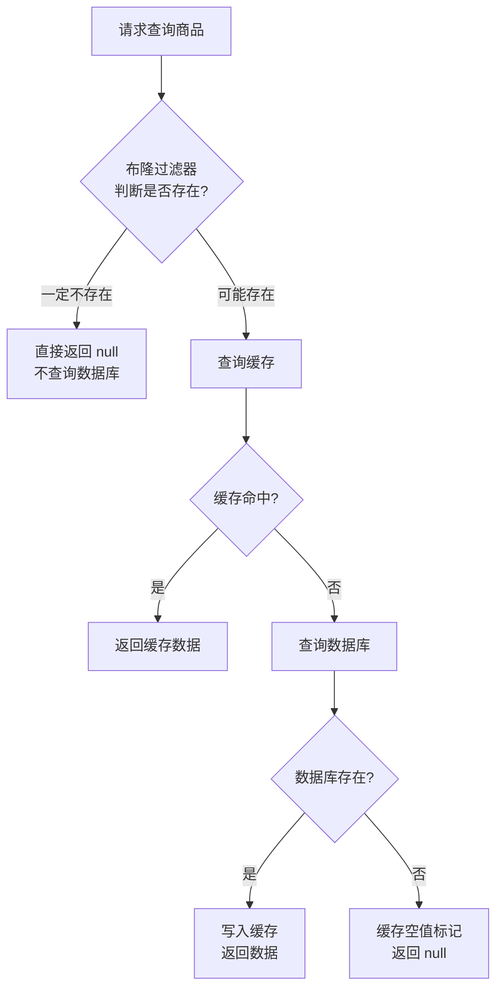
```mermaid
flowchart TD
    A["请求查询商品"] --> B{"布隆过滤器<br/>判断是否存在?"}
    B -->|一定不存在| C["直接返回 null<br/>不查询数据库"]
    B -->|可能存在| D["查询缓存"]
    D --> E{"缓存命中?"}
    E -->|是| F["返回缓存数据"]
    E -->|否| G["查询数据库"]
    G --> H{"数据库存在?"}
    H -->|是| I["写入缓存<br/>返回数据"]
    H -->|否| J["缓存空值标记<br/>返回 null"]
    
```

::: warning 布隆过滤器的局限性
1. **存在误判**：可能判断存在但实际不存在（需结合缓存空值兜底）
2. **不支持删除**：删除元素会影响其他元素的判断（可使用 Counting Bloom Filter）
3. **需要预热**：系统启动时需要加载所有有效 ID
:::

### 缓存击穿深度方案

缓存击穿是指热点 Key 过期瞬间，大量并发请求同时打到数据库。

#### 方案一：互斥锁

```java
@Service
@RequiredArgsConstructor
public class ProductCacheService {
    
    private final StringRedisTemplate redisTemplate;
    private final ProductMapper productMapper;
    
    private static final String LOCK_PREFIX = "lock:product:";
    private static final Duration LOCK_TTL = Duration.ofSeconds(10);
    
    /**
     * 查询商品（互斥锁方案）
     */
    public Product getProduct(Long id) {
        String key = "product:" + id;
        
        // 1. 查询缓存
        String cached = redisTemplate.opsForValue().get(key);
        if (cached != null) {
            return JsonUtils.fromJson(cached, Product.class);
        }
        
        // 2. 缓存未命中，尝试获取锁
        String lockKey = LOCK_PREFIX + id;
        boolean locked = tryLock(lockKey);
        
        try {
            if (locked) {
                // 3. 获取锁成功，查询数据库并重建缓存
                Product product = productMapper.selectById(id);
                if (product != null) {
                    redisTemplate.opsForValue().set(
                        key, JsonUtils.toJson(product), Duration.ofHours(1)
                    );
                }
                return product;
            } else {
                // 4. 获取锁失败，等待并重试
                Thread.sleep(50);
                return getProduct(id);  // 递归重试
            }
        } catch (InterruptedException e) {
            Thread.currentThread().interrupt();
            return null;
        } finally {
            if (locked) {
                unlock(lockKey);
            }
        }
    }
    
    private boolean tryLock(String key) {
        Boolean result = redisTemplate.opsForValue()
            .setIfAbsent(key, "1", LOCK_TTL);
        return Boolean.TRUE.equals(result);
    }
    
    private void unlock(String key) {
        redisTemplate.delete(key);
    }
}
```

#### 方案二：逻辑过期（永不过期 + 异步刷新）

```java
/**
 * 缓存数据包装类（包含逻辑过期时间）
 */
@Data
public class CacheData<T> {
    private T data;
    private Long expireTime;  // 逻辑过期时间戳
}

@Service
@RequiredArgsConstructor
public class LogicalExpireCacheService {
    
    private final StringRedisTemplate redisTemplate;
    private final ProductMapper productMapper;
    private final ThreadPoolExecutor cacheRefreshExecutor;
    
    /**
     * 查询商品（逻辑过期方案）
     * 缓存永不过期，通过逻辑过期时间判断是否需要刷新
     */
    public Product getProduct(Long id) {
        String key = "product:logical:" + id;
        
        // 1. 查询缓存
        String cached = redisTemplate.opsForValue().get(key);
        
        // 2. 缓存不存在（首次查询或缓存被删除）
        if (cached == null) {
            // 获取锁，重建缓存
            String lockKey = "lock:product:logical:" + id;
            if (tryLock(lockKey)) {
                try {
                    // 查询数据库，重建缓存
                    Product product = productMapper.selectById(id);
                    CacheData<Product> cacheData = new CacheData<>();
                    cacheData.setData(product);
                    cacheData.setExpireTime(System.currentTimeMillis() + 3600_000);  // 1 小时后过期
                    
                    redisTemplate.opsForValue().set(key, JsonUtils.toJson(cacheData));
                    return product;
                } finally {
                    unlock(lockKey);
                }
            }
            // 获取锁失败，等待重试
            return getProduct(id);
        }
        
        // 3. 缓存存在，检查逻辑过期时间
        CacheData<Product> cacheData = JsonUtils.fromJson(cached, 
            new TypeReference<CacheData<Product>>() {});
        
        // 4. 未过期，直接返回
        if (cacheData.getExpireTime() > System.currentTimeMillis()) {
            return cacheData.getData();
        }
        
        // 5. 已过期，异步刷新缓存
        String lockKey = "lock:product:logical:" + id;
        if (tryLock(lockKey)) {
            // 提交异步任务刷新缓存
            cacheRefreshExecutor.submit(() -> {
                try {
                    Product product = productMapper.selectById(id);
                    CacheData<Product> newData = new CacheData<>();
                    newData.setData(product);
                    newData.setExpireTime(System.currentTimeMillis() + 3600_000);
                    
                    redisTemplate.opsForValue().set(key, JsonUtils.toJson(newData));
                } finally {
                    unlock(lockKey);
                }
            });
        }
        
        // 6. 返回过期数据（保证可用性）
        return cacheData.getData();
    }
    
    private boolean tryLock(String key) {
        Boolean result = redisTemplate.opsForValue()
            .setIfAbsent(key, "1", Duration.ofSeconds(10));
        return Boolean.TRUE.equals(result);
    }
    
    private void unlock(String key) {
        redisTemplate.delete(key);
    }
}
```

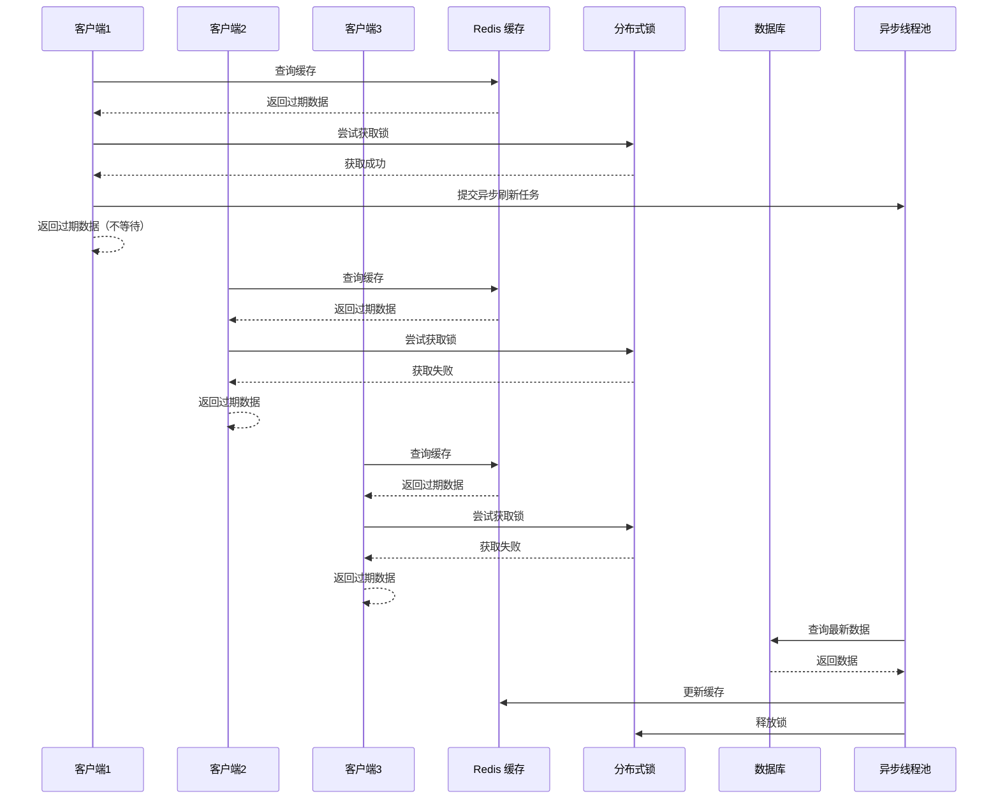
```mermaid
sequenceDiagram
    participant C1 as 客户端1
    participant C2 as 客户端2
    participant C3 as 客户端3
    participant Cache as Redis 缓存
    participant Lock as 分布式锁
    participant DB as 数据库
    participant Async as 异步线程池
    
    C1->>Cache: 查询缓存
    Cache-->>C1: 返回过期数据
    C1->>Lock: 尝试获取锁
    Lock-->>C1: 获取成功
    C1->>Async: 提交异步刷新任务
    C1-->>C1: 返回过期数据（不等待）
    
    C2->>Cache: 查询缓存
    Cache-->>C2: 返回过期数据
    C2->>Lock: 尝试获取锁
    Lock-->>C2: 获取失败
    C2-->>C2: 返回过期数据
    
    C3->>Cache: 查询缓存
    Cache-->>C3: 返回过期数据
    C3->>Lock: 尝试获取锁
    Lock-->>C3: 获取失败
    C3-->>C3: 返回过期数据
    
    Async->>DB: 查询最新数据
    DB-->>Async: 返回数据
    Async->>Cache: 更新缓存
    Async->>Lock: 释放锁
```

::: tip 互斥锁 vs 逻辑过期
| 方案 | 优点 | 缺点 | 适用场景 |
|------|------|------|---------|
| 互斥锁 | 数据强一致 | 并发等待，性能较低 | 对一致性要求高的场景 |
| 逻辑过期 | 性能高，无等待 | 数据短暂不一致 | 对可用性要求高的场景 |
:::

### 缓存雪崩深度方案

缓存雪崩是指大量 Key 同时过期，或 Redis 宕机，导致所有请求打到数据库。

#### 方案一：随机过期时间

```java
@Service
@RequiredArgsConstructor
public class ProductBatchCacheService {
    
    private final StringRedisTemplate redisTemplate;
    private final ProductMapper productMapper;
    
    private static final Random RANDOM = new Random();
    
    /**
     * 批量预热缓存（随机过期时间）
     */
    public void warmUpCache(List<Long> productIds) {
        for (Long productId : productIds) {
            Product product = productMapper.selectById(productId);
            if (product != null) {
                String key = "product:" + productId;
                
                // 基础过期时间 + 随机偏移（防止同时过期）
                long baseTtl = 3600;  // 1 小时
                long randomOffset = RANDOM.nextInt(600);  // 0-10 分钟随机偏移
                Duration ttl = Duration.ofSeconds(baseTtl + randomOffset);
                
                redisTemplate.opsForValue().set(key, JsonUtils.toJson(product), ttl);
            }
        }
    }
    
    /**
     * 查询商品（带随机过期时间）
     */
    public Product getProduct(Long id) {
        String key = "product:" + id;
        String cached = redisTemplate.opsForValue().get(key);
        
        if (cached != null) {
            return JsonUtils.fromJson(cached, Product.class);
        }
        
        Product product = productMapper.selectById(id);
        if (product != null) {
            // 随机过期时间：1 小时 + 0-10 分钟
            long baseTtl = 3600;
            long randomOffset = RANDOM.nextInt(600);
            Duration ttl = Duration.ofSeconds(baseTtl + randomOffset);
            
            redisTemplate.opsForValue().set(key, JsonUtils.toJson(product), ttl);
        }
        return product;
    }
}
```

#### 方案二：多级缓存

```java
/**
 * 多级缓存服务
 * L1: 本地缓存（Caffeine）- 速度快，容量有限
 * L2: 分布式缓存（Redis）- 速度中等，容量大
 * L3: 数据库 - 速度慢，数据源
 */
@Service
@RequiredArgsConstructor
public class MultiLevelCacheService {
    
    private final Cache<String, Object> localCache;  // Caffeine 本地缓存
    private final StringRedisTemplate redisTemplate;
    private final ProductMapper productMapper;
    
    /**
     * 多级缓存查询
     */
    public Product getProduct(Long id) {
        String key = "product:" + id;
        
        // 1. L1 本地缓存
        Product product = (Product) localCache.getIfPresent(key);
        if (product != null) {
            return product;
        }
        
        // 2. L2 Redis 缓存
        String cached = redisTemplate.opsForValue().get(key);
        if (cached != null) {
            product = JsonUtils.fromJson(cached, Product.class);
            // 回填本地缓存
            localCache.put(key, product);
            return product;
        }
        
        // 3. L3 数据库
        product = productMapper.selectById(id);
        if (product != null) {
            // 写入 Redis（随机过期时间）
            long ttl = 3600 + RANDOM.nextInt(600);
            redisTemplate.opsForValue().set(key, JsonUtils.toJson(product), 
                Duration.ofSeconds(ttl));
            
            // 写入本地缓存（较短过期时间）
            localCache.put(key, product);
        }
        return product;
    }
    
    /**
     * 更新商品（同时更新多级缓存）
     */
    public void updateProduct(Product product) {
        String key = "product:" + product.getId();
        
        // 1. 更新数据库
        productMapper.updateById(product);
        
        // 2. 删除 Redis 缓存
        redisTemplate.delete(key);
        
        // 3. 删除本地缓存
        localCache.invalidate(key);
    }
}

/**
 * Caffeine 本地缓存配置
 */
@Configuration
public class LocalCacheConfig {
    
    @Bean
    public Cache<String, Object> localCache() {
        return Caffeine.newBuilder()
            .maximumSize(1000)  // 最大缓存数量
            .expireAfterWrite(Duration.ofMinutes(10))  // 写入后 10 分钟过期
            .recordStats()  // 记录统计信息
            .build();
    }
}
```

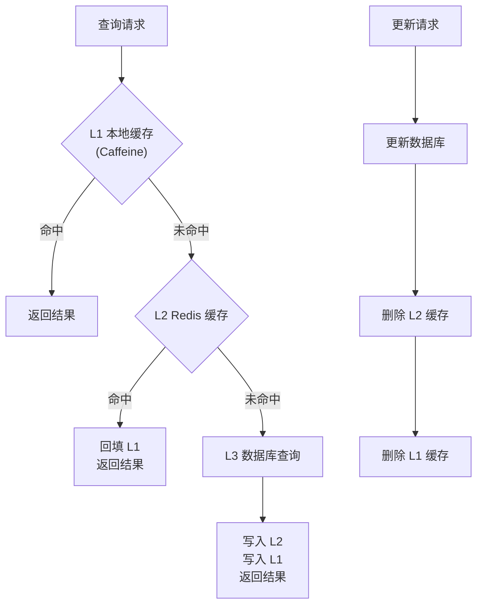
```mermaid
flowchart TD
    A["查询请求"] --> B{"L1 本地缓存<br/>(Caffeine)"}
    B -->|命中| C["返回结果"]
    B -->|未命中| D{"L2 Redis 缓存"}
    D -->|命中| E["回填 L1<br/>返回结果"]
    D -->|未命中| F["L3 数据库查询"]
    F --> G["写入 L2<br/>写入 L1<br/>返回结果"]
    
    H["更新请求"] --> I["更新数据库"]
    I --> J["删除 L2 缓存"]
    J --> K["删除 L1 缓存"]
    
```

::: danger 多级缓存的一致性挑战
1. **缓存失效顺序**：先删除 Redis，再删除本地缓存（防止本地缓存脏数据）
2. **广播失效**：多实例部署时，需要通过消息队列广播本地缓存失效
3. **延迟双删**：更新数据库后，延迟一段时间再次删除缓存（防止主从同步延迟导致的脏数据）
:::

## 分布式锁深度实践

### Redisson 分布式锁原理

Redisson 是 Redis 官方推荐的分布式锁实现，提供了丰富的锁类型和高级特性。

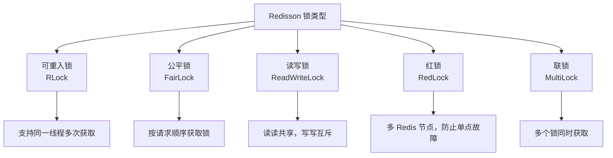
```mermaid
flowchart TD
    A["Redisson 锁类型"] --> B["可重入锁<br/>RLock"]
    A --> C["公平锁<br/>FairLock"]
    A --> D["读写锁<br/>ReadWriteLock"]
    A --> E["红锁<br/>RedLock"]
    A --> F["联锁<br/>MultiLock"]
    
    B --> B1["支持同一线程多次获取"]
    C --> C1["按请求顺序获取锁"]
    D --> D1["读读共享，写写互斥"]
    E --> E1["多 Redis 节点，防止单点故障"]
    F --> F1["多个锁同时获取"]
    
```

### 可重入锁实现

```java
/**
 * Redisson 可重入锁示例
 */
@Service
@RequiredArgsConstructor
public class RedissonLockService {
    
    private final RedissonClient redissonClient;
    
    /**
     * 基本使用
     */
    public void doSomethingWithLock() {
        RLock lock = redissonClient.getLock("myLock");
        
        try {
            // 尝试获取锁（等待时间、持有时间）
            boolean acquired = lock.tryLock(10, 30, TimeUnit.SECONDS);
            
            if (acquired) {
                // 执行业务逻辑
                doBusiness();
            } else {
                // 获取锁失败
                throw new RuntimeException("获取锁失败");
            }
        } catch (InterruptedException e) {
            Thread.currentThread().interrupt();
            throw new RuntimeException("获取锁被中断", e);
        } finally {
            // 只有当前线程持有锁时才释放
            if (lock.isHeldByCurrentThread()) {
                lock.unlock();
            }
        }
    }
    
    /**
     * 可重入特性演示
     */
    public void reentrantDemo() {
        RLock lock = redissonClient.getLock("reentrantLock");
        
        lock.lock();
        try {
            log.info("第一次获取锁");
            
            // 同一线程可以再次获取锁（可重入）
            lock.lock();
            try {
                log.info("第二次获取锁（可重入）");
                
                // 还可以继续获取
                lock.lock();
                try {
                    log.info("第三次获取锁（可重入）");
                } finally {
                    lock.unlock();
                }
            } finally {
                lock.unlock();
            }
        } finally {
            lock.unlock();
        }
    }
}
```

### 看门狗机制

Redisson 的看门狗机制会自动续期，防止业务执行时间超过锁过期时间导致锁失效。

```java
/**
 * 看门狗机制演示
 */
@Service
@RequiredArgsConstructor
public class WatchdogService {
    
    private final RedissonClient redissonClient;
    
    /**
     * 自动续期（看门狗）
     * 不指定 leaseTime 时，默认 30 秒过期，每 10 秒自动续期
     */
    public void autoRenewal() {
        RLock lock = redissonClient.getLock("watchdogLock");
        
        lock.lock();  // 不指定过期时间，启用看门狗
        try {
            // 模拟长时间业务（超过默认 30 秒）
            Thread.sleep(60_000);  // 60 秒
            log.info("业务执行完成");
            // 看门狗会自动续期，锁不会过期
        } catch (InterruptedException e) {
            Thread.currentThread().interrupt();
        } finally {
            lock.unlock();
        }
    }
    
    /**
     * 手动指定过期时间（不启用看门狗）
     */
    public void manualExpire() {
        RLock lock = redissonClient.getLock("manualLock");
        
        // 指定 leaseTime，不启用看门狗
        lock.lock(30, TimeUnit.SECONDS);
        try {
            // 业务执行时间必须小于 30 秒
            doBusiness();
        } finally {
            lock.unlock();
        }
    }
}
```

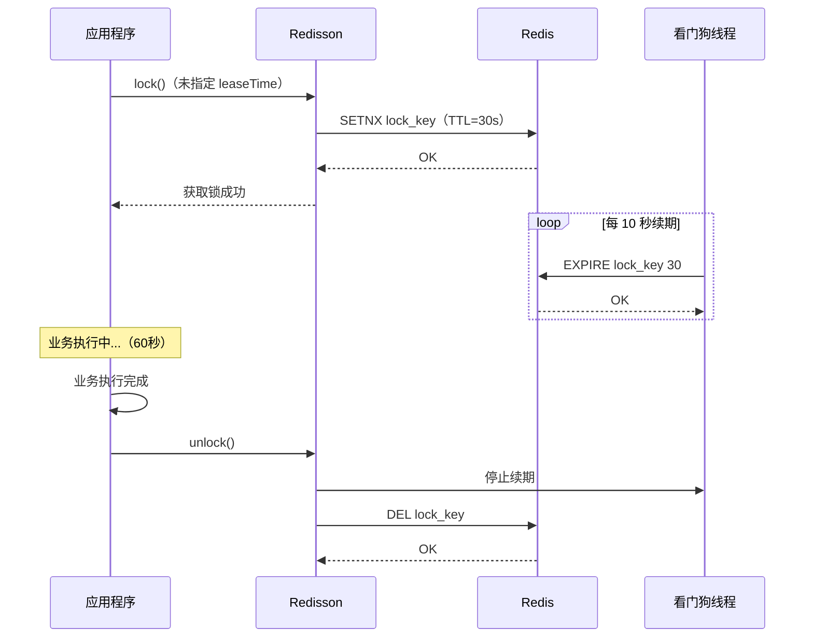
```mermaid
sequenceDiagram
    participant App as 应用程序
    participant Redisson as Redisson
    participant Redis as Redis
    participant Watchdog as 看门狗线程
    
    App->>Redisson: lock()（未指定 leaseTime）
    Redisson->>Redis: SETNX lock_key（TTL=30s）
    Redis-->>Redisson: OK
    Redisson-->>App: 获取锁成功
    
    loop 每 10 秒续期
        Watchdog->>Redis: EXPIRE lock_key 30
        Redis-->>Watchdog: OK
    end
    
    Note over App: 业务执行中...（60秒）
    
    App->>App: 业务执行完成
    App->>Redisson: unlock()
    Redisson->>Watchdog: 停止续期
    Redisson->>Redis: DEL lock_key
    Redis-->>Redisson: OK
```

::: tip 看门狗机制要点
1. **默认续期**：锁默认 30 秒过期，每 10 秒（1/3 过期时间）自动续期到 30 秒
2. **启用条件**：只有不指定 `leaseTime` 时才启用看门狗
3. **续期时机**：在锁即将过期前自动续期，确保业务执行期间锁不会失效
4. **停止续期**：调用 `unlock()` 后自动停止续期
:::

### 读写锁实现

```java
/**
 * Redisson 读写锁示例
 * 适用场景：读多写少的场景
 */
@Service
@RequiredArgsConstructor
public class ReadWriteLockService {
    
    private final RedissonClient redissonClient;
    private final Map<String, String> dataStore = new HashMap<>();
    
    /**
     * 读操作（共享锁）
     * 多个读操作可以并发执行
     */
    public String readData(String key) {
        RReadWriteLock rwLock = redissonClient.getReadWriteLock("dataRWLock");
        RLock readLock = rwLock.readLock();
        
        readLock.lock();
        try {
            // 模拟读操作
            log.info("读取数据: {}", key);
            return dataStore.get(key);
        } finally {
            readLock.unlock();
        }
    }
    
    /**
     * 写操作（排他锁）
     * 写操作与其他读写操作互斥
     */
    public void writeData(String key, String value) {
        RReadWriteLock rwLock = redissonClient.getReadWriteLock("dataRWLock");
        RLock writeLock = rwLock.writeLock();
        
        writeLock.lock();
        try {
            // 模拟写操作
            log.info("写入数据: {} = {}", key, value);
            dataStore.put(key, value);
        } finally {
            writeLock.unlock();
        }
    }
    
    /**
     * 缓存更新示例（读写锁应用）
     */
    public String getOrLoadData(String key, Supplier<String> loader) {
        RReadWriteLock rwLock = redissonClient.getReadWriteLock("cacheRWLock:" + key);
        
        // 先尝试读锁
        RLock readLock = rwLock.readLock();
        readLock.lock();
        try {
            String value = dataStore.get(key);
            if (value != null) {
                return value;
            }
        } finally {
            readLock.unlock();
        }
        
        // 缓存未命中，获取写锁
        RLock writeLock = rwLock.writeLock();
        writeLock.lock();
        try {
            // 双重检查（防止其他线程已经加载）
            String value = dataStore.get(key);
            if (value != null) {
                return value;
            }
            
            // 加载数据
            value = loader.get();
            dataStore.put(key, value);
            return value;
        } finally {
            writeLock.unlock();
        }
    }
}
```

### 红锁实现

红锁（RedLock）用于解决 Redis 单点故障问题，通过多个独立的 Redis 节点实现分布式锁。

```java
/**
 * Redisson 红锁示例
 * 适用场景：对可靠性要求极高的场景
 */
@Service
@RequiredArgsConstructor
public class RedLockService {
    
    private final RedissonClient redissonClient1;  // Redis 节点 1
    private final RedissonClient redissonClient2;  // Redis 节点 2
    private final RedissonClient redissonClient3;  // Redis 节点 3
    
    /**
     * 红锁获取
     * 需要在大多数节点（N/2 + 1）上获取锁才算成功
     */
    public boolean tryRedLock(String lockKey, long waitTime, long leaseTime) {
        RLock lock1 = redissonClient1.getLock(lockKey);
        RLock lock2 = redissonClient2.getLock(lockKey);
        RLock lock3 = redissonClient3.getLock(lockKey);
        
        // 创建红锁（需要 3 个节点中至少 2 个获取成功）
        RedissonRedLock redLock = new RedissonRedLock(lock1, lock2, lock3);
        
        try {
            boolean acquired = redLock.tryLock(waitTime, leaseTime, TimeUnit.SECONDS);
            if (acquired) {
                log.info("红锁获取成功");
                // 执行业务逻辑
                doBusiness();
                return true;
            } else {
                log.warn("红锁获取失败");
                return false;
            }
        } catch (InterruptedException e) {
            Thread.currentThread().interrupt();
            return false;
        } finally {
            redLock.unlock();
        }
    }
}
```

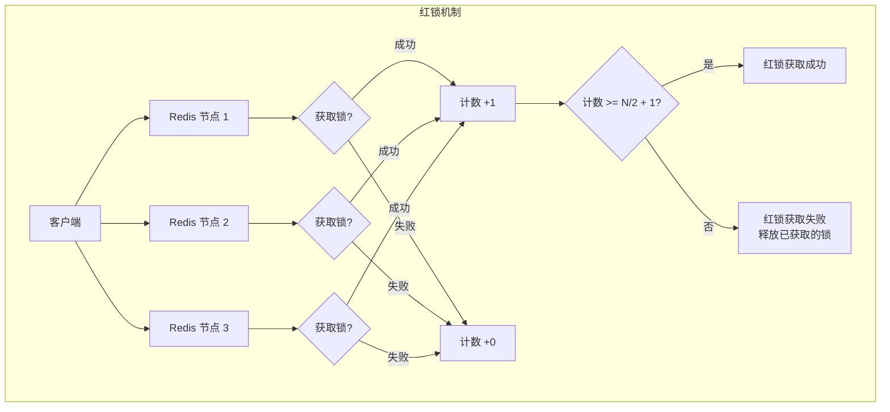
```mermaid
flowchart TD
    subgraph RedLock["红锁机制"]
        A["客户端"] --> B["Redis 节点 1"]
        A --> C["Redis 节点 2"]
        A --> D["Redis 节点 3"]
        
        B --> E{"获取锁?"}
        C --> F{"获取锁?"}
        D --> G{"获取锁?"}
        
        E -->|成功| H["计数 +1"]
        E -->|失败| I["计数 +0"]
        F -->|成功| H
        F -->|失败| I
        G -->|成功| H
        G -->|失败| I
        
        H --> J{"计数 >= N/2 + 1?"}
        J -->|是| K["红锁获取成功"]
        J -->|否| L["红锁获取失败<br/>释放已获取的锁"]
    end
    
```

::: warning 红锁的争议
红锁算法存在争议，主要问题：
1. **时钟漂移**：依赖各节点时钟同步，时钟跳跃可能导致锁失效
2. **网络分区**：极端情况下可能产生多个客户端同时持有锁
3. **性能开销**：需要在多个节点上获取锁，延迟较高

**替代方案**：使用 Redis Cluster 或 ZooKeeper 实现分布式锁。
:::

### Redisson 配置

```java
/**
 * Redisson 配置类
 */
@Configuration
public class RedissonConfig {
    
    /**
     * 单节点配置
     */
    @Bean
    public RedissonClient redissonClient() {
        Config config = new Config();
        config.useSingleServer()
            .setAddress("redis://localhost:6379")
            .setPassword("your-password")
            .setDatabase(0)
            .setConnectionPoolSize(64)
            .setConnectionMinimumIdleSize(10)
            .setIdleConnectionTimeout(10000)
            .setConnectTimeout(10000)
            .setTimeout(3000)
            .setRetryAttempts(3)
            .setRetryInterval(1500);
        
        // 看门狗配置
        config.setLockWatchdogTimeout(30000);  // 默认 30 秒
        
        return Redisson.create(config);
    }
    
    /**
     * 集群配置
     */
    @Bean
    public RedissonClient redissonClusterClient() {
        Config config = new Config();
        config.useClusterServers()
            .addNodeAddress(
                "redis://192.168.1.1:6379",
                "redis://192.168.1.2:6379",
                "redis://192.168.1.3:6379"
            )
            .setPassword("your-password")
            .setMasterConnectionPoolSize(64)
            .setSlaveConnectionPoolSize(64)
            .setScanInterval(5000);  // 集群状态扫描间隔
        
        return Redisson.create(config);
    }
    
    /**
     * 哨兵配置
     */
    @Bean
    public RedissonClient redissonSentinelClient() {
        Config config = new Config();
        config.useSentinelServers()
            .setMasterName("mymaster")
            .addSentinelAddress(
                "redis://192.168.1.1:26379",
                "redis://192.168.1.2:26379",
                "redis://192.168.1.3:26379"
            )
            .setPassword("your-password")
            .setMasterConnectionPoolSize(64);
        
        return Redisson.create(config);
    }
}
```

## Redis 消息队列

### Pub/Sub 发布订阅

Redis Pub/Sub 是最简单的消息队列实现，适合实时消息推送场景。

```java
/**
 * Redis Pub/Sub 示例
 */
@Service
@RequiredArgsConstructor
public class PubSubService {
    
    private final StringRedisTemplate redisTemplate;
    
    /**
     * 发布消息
     */
    public void publish(String channel, String message) {
        redisTemplate.convertAndSend(channel, message);
    }
    
    /**
     * 消息监听器
     */
    @Bean
    public RedisMessageListenerContainer redisMessageListenerContainer(
            RedisConnectionFactory connectionFactory) {
        RedisMessageListenerContainer container = new RedisMessageListenerContainer();
        container.setConnectionFactory(connectionFactory);
        
        // 添加消息监听器
        container.addMessageListener(new OrderMessageListener(), 
            new ChannelTopic("order:created"));
        container.addMessageListener(new PaymentMessageListener(), 
            new PatternTopic("payment:*"));  // 支持通配符
        
        return container;
    }
    
    /**
     * 订单消息监听器
     */
    @Slf4j
    public static class OrderMessageListener implements MessageListener {
        @Override
        public void onMessage(Message message, byte[] pattern) {
            String channel = new String(message.getChannel());
            String body = new String(message.getBody());
            log.info("收到订单消息 - 频道: {}, 内容: {}", channel, body);
            
            // 处理订单消息
            processOrder(body);
        }
        
        private void processOrder(String orderJson) {
            // 业务处理逻辑
        }
    }
}
```

::: warning Pub/Sub 的局限性
1. **消息不持久化**：客户端离线时消息会丢失
2. **无消息确认**：无法确认消息是否被成功处理
3. **无消费者组**：不支持多消费者负载均衡
4. **适用场景**：实时通知、聊天室、配置更新广播
:::

### Stream 消息队列

Redis Stream 是专门为消息队列设计的数据结构，支持消费者组、消息确认、持久化。

```java
/**
 * Redis Stream 消息队列示例
 */
@Service
@RequiredArgsConstructor
@Slf4j
public class StreamQueueService {
    
    private final StringRedisTemplate redisTemplate;
    
    private static final String ORDER_STREAM = "order:stream";
    private static final String ORDER_GROUP = "order-processors";
    
    /**
     * 初始化消费者组
     */
    @PostConstruct
    public void initConsumerGroup() {
        try {
            // 创建消费者组（从最新消息开始）
            redisTemplate.opsForStream().createGroup(ORDER_STREAM, ORDER_GROUP);
        } catch (Exception e) {
            log.info("消费者组已存在: {}", ORDER_GROUP);
        }
    }
    
    /**
     * 生产者：发送订单消息
     */
    public String sendOrderMessage(Order order) {
        Map<String, String> message = new HashMap<>();
        message.put("orderId", order.getId().toString());
        message.put("userId", order.getUserId().toString());
        message.put("amount", order.getAmount().toString());
        message.put("timestamp", String.valueOf(System.currentTimeMillis()));
        
        RecordId recordId = redisTemplate.opsForStream().add(ORDER_STREAM, message);
        log.info("发送订单消息: {}", recordId.getValue());
        return recordId.getValue();
    }
    
    /**
     * 消费者：处理订单消息
     */
    @Scheduled(fixedDelay = 1000)
    public void consumeOrderMessages() {
        String consumerName = "consumer-" + Thread.currentThread().getId();
        
        // 读取未确认的消息
        List<MapRecord<String, Object, Object>> messages = redisTemplate.opsForStream().read(
            Consumer.from(ORDER_GROUP, consumerName),
            StreamOffset.create(ORDER_STREAM, ReadOffset.lastConsumed()),
            StreamReadOptions.empty().count(10)
        );
        
        if (messages == null || messages.isEmpty()) {
            return;
        }
        
        for (MapRecord<String, Object, Object> message : messages) {
            try {
                // 处理消息
                processOrder(message.getValue());
                
                // 确认消息
                redisTemplate.opsForStream().acknowledge(ORDER_STREAM, ORDER_GROUP, message.getId());
                log.info("订单消息处理完成: {}", message.getId().getValue());
            } catch (Exception e) {
                log.error("订单消息处理失败: {}", message.getId().getValue(), e);
                // 消息未确认，会进入待处理队列（PEL）
            }
        }
    }
    
    /**
     * 处理待处理消息（死信队列处理）
     */
    @Scheduled(fixedDelay = 60000)  // 每分钟检查一次
    public void processPendingMessages() {
        // 获取待处理消息摘要
        PendingMessagesSummary summary = redisTemplate.opsForStream()
            .pending(ORDER_STREAM, ORDER_GROUP);
        
        if (summary == null || summary.getTotalPendingMessages() == 0) {
            return;
        }
        
        log.info("待处理消息数量: {}", summary.getTotalPendingMessages());
        
        // 获取超时的待处理消息
        PendingMessages pending = redisTemplate.opsForStream().pending(
            ORDER_STREAM, 
            Consumer.from(ORDER_GROUP, "consumer-1"),
            Range.unbounded(),
            10L
        );
        
        for (PendingMessage pendingMessage : pending) {
            // 检查消息空闲时间
            if (pendingMessage.getIdleTime() > Duration.ofMinutes(5)) {
                // 认领超时消息
                List<MapRecord<String, Object, Object>> claimed = redisTemplate.opsForStream().claim(
                    ORDER_STREAM, ORDER_GROUP, "consumer-retry",
                    Duration.ofMinutes(5),
                    pendingMessage.getId()
                );
                
                // 重新处理
                for (MapRecord<String, Object, Object> message : claimed) {
                    try {
                        processOrder(message.getValue());
                        redisTemplate.opsForStream().acknowledge(
                            ORDER_STREAM, ORDER_GROUP, message.getId()
                        );
                    } catch (Exception e) {
                        log.error("重试处理失败: {}", message.getId().getValue(), e);
                    }
                }
            }
        }
    }
    
    private void processOrder(Map<Object, Object> message) {
        Long orderId = Long.parseLong(message.get("orderId").toString());
        log.info("处理订单: {}", orderId);
        // 业务处理逻辑
    }
}
```

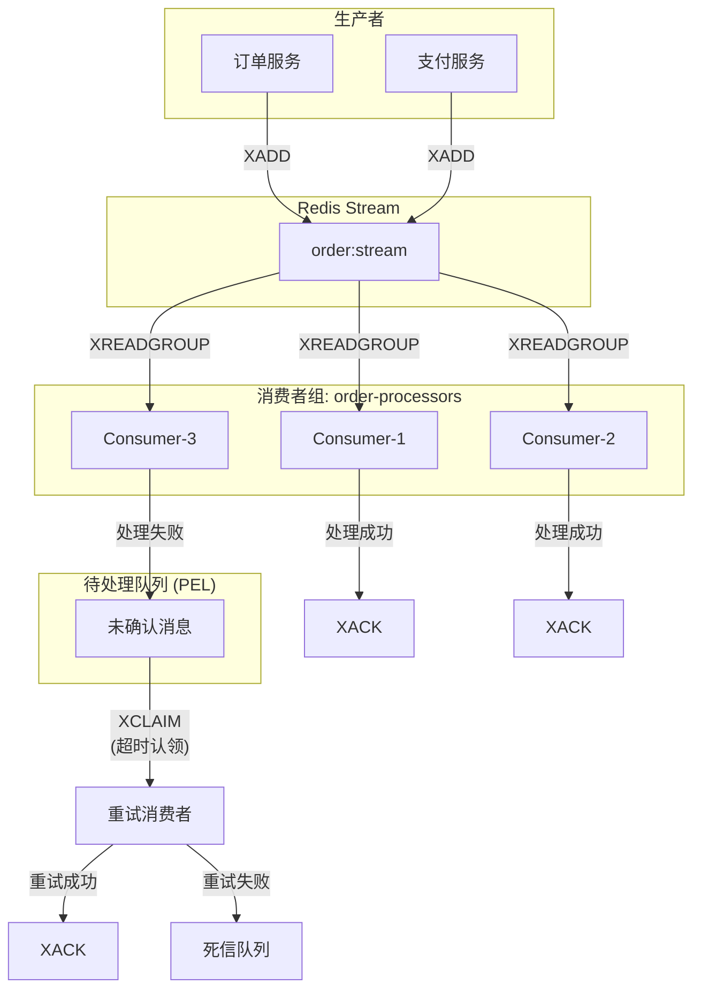
```mermaid
flowchart TD
    subgraph Producer["生产者"]
        P1["订单服务"]
        P2["支付服务"]
    end
    
    subgraph Stream["Redis Stream"]
        S1["order:stream"]
    end
    
    subgraph ConsumerGroup["消费者组: order-processors"]
        C1["Consumer-1"]
        C2["Consumer-2"]
        C3["Consumer-3"]
    end
    
    subgraph PEL["待处理队列 (PEL)"]
        PE1["未确认消息"]
    end
    
    P1 -->|"XADD"| S1
    P2 -->|"XADD"| S1
    S1 -->|"XREADGROUP"| C1
    S1 -->|"XREADGROUP"| C2
    S1 -->|"XREADGROUP"| C3
    
    C1 -->|"处理成功"| ACK1["XACK"]
    C2 -->|"处理成功"| ACK2["XACK"]
    C3 -->|"处理失败"| PE1
    
    PE1 -->|"XCLAIM<br/>(超时认领)"| C4["重试消费者"]
    C4 -->|"重试成功"| ACK3["XACK"]
    C4 -->|"重试失败"| DLQ["死信队列"]
    
```

## Redis 限流实现

### 固定窗口限流

```java
/**
 * 固定窗口限流
 * 简单但存在边界问题
 */
@Service
@RequiredArgsConstructor
public class FixedWindowRateLimiter {
    
    private final StringRedisTemplate redisTemplate;
    
    /**
     * 固定窗口限流检查
     * @param key 限流 key
     * @param windowSize 窗口大小（秒）
     * @param maxRequests 窗口内最大请求数
     */
    public boolean isAllowed(String key, long windowSize, int maxRequests) {
        long currentWindow = System.currentTimeMillis() / 1000 / windowSize;
        String windowKey = key + ":" + currentWindow;
        
        // 计数器自增
        Long count = redisTemplate.opsForValue().increment(windowKey);
        
        // 设置过期时间（首次设置）
        if (count != null && count == 1) {
            redisTemplate.expire(windowKey, Duration.ofSeconds(windowSize));
        }
        
        return count != null && count <= maxRequests;
    }
}
```

::: warning 固定窗口的边界问题
固定窗口在窗口边界可能出现 2 倍请求：
- 假设窗口大小 1 秒，限制 100 次/秒
- 在 0.9 秒来了 100 次请求，1.0 秒又来了 100 次请求
- 实际在 0.9-1.0 秒这 0.1 秒内处理了 200 次请求
:::

### 滑动窗口限流

```java
/**
 * 滑动窗口限流
 * 使用 ZSet 实现精确的滑动窗口
 */
@Service
@RequiredArgsConstructor
public class SlidingWindowRateLimiter {
    
    private final StringRedisTemplate redisTemplate;
    
    /**
     * 滑动窗口限流检查
     * @param key 限流 key
     * @param windowSize 窗口大小（毫秒）
     * @param maxRequests 窗口内最大请求数
     */
    public boolean isAllowed(String key, long windowSize, int maxRequests) {
        long now = System.currentTimeMillis();
        long windowStart = now - windowSize;
        
        // 使用 Lua 脚本保证原子性
        String script = """
            -- 移除窗口外的请求
            redis.call('ZREMRANGEBYSCORE', KEYS[1], 0, ARGV[1])
            
            -- 统计窗口内请求数
            local count = redis.call('ZCARD', KEYS[1])
            
            -- 判断是否超过限制
            if count < tonumber(ARGV[2]) then
                -- 添加当前请求
                redis.call('ZADD', KEYS[1], ARGV[3], ARGV[3])
                -- 设置过期时间
                redis.call('PEXPIRE', KEYS[1], ARGV[4])
                return 1
            else
                return 0
            end
            """;
        
        Long result = redisTemplate.execute(
            new DefaultRedisScript<>(script, Long.class),
            Collections.singletonList(key),
            String.valueOf(windowStart),  // 窗口起始时间
            String.valueOf(maxRequests),   // 最大请求数
            String.valueOf(now),           // 当前时间戳（作为 member 和 score）
            String.valueOf(windowSize + 1000)  // 过期时间（窗口大小 + 1 秒）
        );
        
        return result != null && result == 1L;
    }
    
    /**
     * 获取当前窗口内请求数
     */
    public long getCurrentCount(String key, long windowSize) {
        long now = System.currentTimeMillis();
        long windowStart = now - windowSize;
        
        // 移除窗口外的请求
        redisTemplate.opsForZSet().removeRangeByScore(key, 0, windowStart);
        
        // 统计窗口内请求数
        Long count = redisTemplate.opsForZSet().size(key);
        return count != null ? count : 0;
    }
}
```

### 令牌桶限流

```java
/**
 * 令牌桶限流
 * 使用 Redis + Lua 实现
 */
@Service
@RequiredArgsConstructor
public class TokenBucketRateLimiter {
    
    private final StringRedisTemplate redisTemplate;
    
    /**
     * 令牌桶限流检查
     * @param key 限流 key
     * @param capacity 桶容量
     * @param rate 令牌生成速率（个/秒）
     */
    public boolean isAllowed(String key, long capacity, long rate) {
        String script = """
            local key = KEYS[1]
            local capacity = tonumber(ARGV[1])
            local rate = tonumber(ARGV[2])
            local now = tonumber(ARGV[3])
            local requested = 1  -- 每次请求消耗 1 个令牌
            
            -- 获取当前令牌数和上次刷新时间
            local info = redis.call('HMGET', key, 'tokens', 'last_time')
            local tokens = tonumber(info[1])
            local lastTime = tonumber(info[2])
            
            -- 初始化
            if tokens == nil then
                tokens = capacity
                lastTime = now
            end
            
            -- 计算补充的令牌数
            local elapsed = now - lastTime
            local filled = math.floor(elapsed * rate / 1000)  -- 毫秒转秒
            tokens = math.min(capacity, tokens + filled)
            
            -- 判断是否有足够令牌
            if tokens >= requested then
                tokens = tokens - requested
                redis.call('HMSET', key, 'tokens', tokens, 'last_time', now)
                redis.call('PEXPIRE', key, math.ceil(capacity / rate * 1000) + 1000)
                return 1
            else
                redis.call('HMSET', key, 'tokens', tokens, 'last_time', now)
                return 0
            end
            """;
        
        Long result = redisTemplate.execute(
            new DefaultRedisScript<>(script, Long.class),
            Collections.singletonList(key),
            String.valueOf(capacity),
            String.valueOf(rate),
            String.valueOf(System.currentTimeMillis())
        );
        
        return result != null && result == 1L;
    }
    
    /**
     * 获取当前令牌数
     */
    public long getCurrentTokens(String key, long capacity, long rate) {
        String script = """
            local key = KEYS[1]
            local capacity = tonumber(ARGV[1])
            local rate = tonumber(ARGV[2])
            local now = tonumber(ARGV[3])
            
            local info = redis.call('HMGET', key, 'tokens', 'last_time')
            local tokens = tonumber(info[1])
            local lastTime = tonumber(info[2])
            
            if tokens == nil then
                return capacity
            end
            
            local elapsed = now - lastTime
            local filled = math.floor(elapsed * rate / 1000)
            return math.min(capacity, tokens + filled)
            """;
        
        Long result = redisTemplate.execute(
            new DefaultRedisScript<>(script, Long.class),
            Collections.singletonList(key),
            String.valueOf(capacity),
            String.valueOf(rate),
            String.valueOf(System.currentTimeMillis())
        );
        
        return result != null ? result : capacity;
    }
}
```

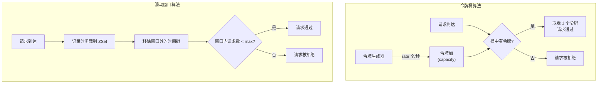
```mermaid
flowchart TD
    subgraph TokenBucket["令牌桶算法"]
        A["令牌生成器"] -->|"rate 个/秒"| B["令牌桶<br/>(capacity)"]
        C["请求到达"] --> D{"桶中有令牌?"}
        D -->|是| E["取走 1 个令牌<br/>请求通过"]
        D -->|否| F["请求被拒绝"]
        B --> D
    end
    
    subgraph SlidingWindow["滑动窗口算法"]
        G["请求到达"] --> H["记录时间戳到 ZSet"]
        H --> I["移除窗口外的时间戳"]
        I --> J{"窗口内请求数 < max?"}
        J -->|是| K["请求通过"]
        J -->|否| L["请求被拒绝"]
    end
    
```

::: tip 限流算法对比
| 算法 | 优点 | 缺点 | 适用场景 |
|------|------|------|---------|
| 固定窗口 | 实现简单、内存占用小 | 边界问题、不精确 | 对精度要求不高的场景 |
| 滑动窗口 | 精确控制 | 内存占用较大 | 需要精确限流的场景 |
| 令牌桶 | 允许突发流量、平滑限流 | 实现复杂 | API 限流、流量整形 |
| 漏桶 | 输出恒定速率 | 无法应对突发流量 | 流量整形、保护下游 |
:::

### Redisson 限流器

```java
/**
 * Redisson 分布式限流器
 * 基于令牌桶算法
 */
@Service
@RequiredArgsConstructor
public class RedissonRateLimiterService {
    
    private final RedissonClient redissonClient;
    
    /**
     * 初始化限流器
     */
    public RRateLimiter initRateLimiter(String key, long rate, long interval) {
        RRateLimiter rateLimiter = redissonClient.getRateLimiter(key);
        
        // 设置速率：rate 个请求 / interval 时间间隔
        rateLimiter.setRate(RateType.OVERALL, rate, interval, RateIntervalUnit.SECONDS);
        
        return rateLimiter;
    }
    
    /**
     * 限流检查
     */
    public boolean tryAcquire(String key) {
        RRateLimiter rateLimiter = redissonClient.getRateLimiter(key);
        return rateLimiter.tryAcquire();
    }
    
    /**
     * 尝试获取多个许可
     */
    public boolean tryAcquire(String key, int permits) {
        RRateLimiter rateLimiter = redissonClient.getRateLimiter(key);
        return rateLimiter.tryAcquire(permits);
    }
    
    /**
     * API 限流示例
     */
    public ApiResponse callApiWithRateLimit(String apiName, Supplier<ApiResponse> apiCall) {
        String key = "api:rate:" + apiName;
        
        // 初始化限流器：100 次/秒
        RRateLimiter rateLimiter = initRateLimiter(key, 100, 1);
        
        if (rateLimiter.tryAcquire()) {
            return apiCall.get();
        } else {
            throw new RuntimeException("API 请求频率超限，请稍后重试");
        }
    }
}
```

## Redisson 与 Spring Cache 集成

### RedissonCacheManager 配置

```java
/**
 * Redisson 与 Spring Cache 集成配置
 * 依赖：org.redisson:redisson-spring-boot-starter（或 redisson + redisson-spring-data-*)
 */
@Configuration
@EnableCaching
public class RedissonCacheConfig {
    
    @Bean
    public CacheManager cacheManager(RedissonClient redissonClient) {
        // 每个缓存区域的独立配置（TTL / Max Idle，毫秒；两者均为 0 表示永不过期）
        Map<String, CacheConfig> configMap = new HashMap<>();
        
        // 用户缓存：短 TTL
        configMap.put("users", CacheConfig.builder()
            .ttl(Duration.ofMinutes(10).toMillis())
            .maxIdle(Duration.ofMinutes(5).toMillis())
            .build());
        
        // 产品缓存：长 TTL
        configMap.put("products", CacheConfig.builder()
            .ttl(Duration.ofHours(1).toMillis())
            .maxIdle(Duration.ofMinutes(30).toMillis())
            .build());
        
        // 配置缓存：基本不过期
        configMap.put("config", CacheConfig.builder()
            .ttl(Duration.ofDays(365).toMillis())
            .build());
        
        // RedissonSpringCacheManager / RedissonCacheManager（3.31+ 别名）实现 Spring 的 CacheManager
        return new RedissonCacheManager(redissonClient, configMap);
    }
    
    /**
     * Redisson 客户端配置
     */
    @Bean
    public RedissonClient redissonClient() {
        Config config = new Config();
        config.useSingleServer()
            .setAddress("redis://localhost:6379")
            .setPassword("your-password")
            .setDatabase(0)
            .setConnectionPoolSize(64);
        
        return Redisson.create(config);
    }
}
```

### 使用 Redisson 缓存

```java
/**
 * 使用 Redisson 缓存的服务
 */
@Service
@RequiredArgsConstructor
public class RedissonCacheService {
    
    private final RedissonClient redissonClient;
    
    /**
     * 手动操作缓存
     */
    public void manualCacheOperation() {
        // 获取缓存实例
        RMapCache<String, Object> cache = redissonClient.getMapCache("myCache");
        
        // 写入缓存（带 TTL）
        cache.put("key1", "value1", 30, TimeUnit.MINUTES);
        
        // 读取缓存
        Object value = cache.get("key1");
        
        // 删除缓存
        cache.remove("key1");
        
        // 清空缓存
        cache.clear();
    }
    
    /**
     * 使用 Spring Cache 注解
     */
    @Cacheable(value = "products", key = "#id")
    public Product getProduct(Long id) {
        // 查询数据库
        return productMapper.selectById(id);
    }
    
    @CachePut(value = "products", key = "#result.id")
    public Product updateProduct(Product product) {
        productMapper.updateById(product);
        return product;
    }
    
    @CacheEvict(value = "products", key = "#id")
    public void deleteProduct(Long id) {
        productMapper.deleteById(id);
    }
}
```

## 实战场景扩展

### 排行榜实现

```java
/**
 * 排行榜服务
 * 使用 ZSet 实现
 */
@Service
@RequiredArgsConstructor
public class LeaderboardService {
    
    private final StringRedisTemplate redisTemplate;
    
    private static final String LEADERBOARD_KEY = "game:leaderboard";
    
    /**
     * 更新玩家分数
     */
    public void updateScore(Long playerId, double score) {
        redisTemplate.opsForZSet().add(LEADERBOARD_KEY, playerId.toString(), score);
    }
    
    /**
     * 增加玩家分数
     */
    public void incrementScore(Long playerId, double delta) {
        redisTemplate.opsForZSet().incrementScore(LEADERBOARD_KEY, playerId.toString(), delta);
    }
    
    /**
     * 获取排行榜 Top N
     */
    public List<RankInfo> getTopN(int n) {
        Set<ZSetOperations.TypedTuple<String>> tuples = 
            redisTemplate.opsForZSet().reverseRangeWithScores(LEADERBOARD_KEY, 0, n - 1);
        
        if (tuples == null) {
            return Collections.emptyList();
        }
        
        List<RankInfo> result = new ArrayList<>();
        int rank = 1;
        for (ZSetOperations.TypedTuple<String> tuple : tuples) {
            RankInfo info = new RankInfo();
            info.setRank(rank++);
            info.setPlayerId(Long.parseLong(tuple.getValue()));
            info.setScore(tuple.getScore());
            result.add(info);
        }
        return result;
    }
    
    /**
     * 获取玩家排名
     */
    public RankInfo getPlayerRank(Long playerId) {
        // 获取排名（从 0 开始，降序）
        Long rank = redisTemplate.opsForZSet().reverseRank(LEADERBOARD_KEY, playerId.toString());
        
        if (rank == null) {
            return null;  // 玩家不在排行榜中
        }
        
        // 获取分数
        Double score = redisTemplate.opsForZSet().score(LEADERBOARD_KEY, playerId.toString());
        
        RankInfo info = new RankInfo();
        info.setRank(rank.intValue() + 1);  // 转换为从 1 开始
        info.setPlayerId(playerId);
        info.setScore(score);
        return info;
    }
    
    /**
     * 获取玩家周围的排名（用于"附近的人"功能）
     */
    public List<RankInfo> getAroundRank(Long playerId, int range) {
        // 获取玩家排名
        Long rank = redisTemplate.opsForZSet().reverseRank(LEADERBOARD_KEY, playerId.toString());
        
        if (rank == null) {
            return Collections.emptyList();
        }
        
        // 计算范围
        long start = Math.max(0, rank - range);
        long end = rank + range;
        
        Set<ZSetOperations.TypedTuple<String>> tuples = 
            redisTemplate.opsForZSet().reverseRangeWithScores(LEADERBOARD_KEY, start, end);
        
        if (tuples == null) {
            return Collections.emptyList();
        }
        
        List<RankInfo> result = new ArrayList<>();
        int currentRank = (int) start + 1;
        for (ZSetOperations.TypedTuple<String> tuple : tuples) {
            RankInfo info = new RankInfo();
            info.setRank(currentRank++);
            info.setPlayerId(Long.parseLong(tuple.getValue()));
            info.setScore(tuple.getScore());
            result.add(info);
        }
        return result;
    }
    
    /**
     * 分页获取排行榜
     */
    public List<RankInfo> getByPage(int page, int pageSize) {
        long start = (long) (page - 1) * pageSize;
        long end = start + pageSize - 1;
        
        Set<ZSetOperations.TypedTuple<String>> tuples = 
            redisTemplate.opsForZSet().reverseRangeWithScores(LEADERBOARD_KEY, start, end);
        
        if (tuples == null) {
            return Collections.emptyList();
        }
        
        List<RankInfo> result = new ArrayList<>();
        int rank = (int) start + 1;
        for (ZSetOperations.TypedTuple<String> tuple : tuples) {
            RankInfo info = new RankInfo();
            info.setRank(rank++);
            info.setPlayerId(Long.parseLong(tuple.getValue()));
            info.setScore(tuple.getScore());
            result.add(info);
        }
        return result;
    }
    
    /**
     * 获取排行榜总人数
     */
    public long getTotalCount() {
        Long count = redisTemplate.opsForZSet().size(LEADERBOARD_KEY);
        return count != null ? count : 0;
    }
}

@Data
public class RankInfo {
    private int rank;        // 排名（从 1 开始）
    private Long playerId;   // 玩家 ID
    private Double score;    // 分数
}
```

### Geo 地理位置

```java
/**
 * 地理位置服务
 * 使用 Redis Geo 实现
 */
@Service
@RequiredArgsConstructor
public class GeoLocationService {
    
    private final StringRedisTemplate redisTemplate;
    
    private static final String GEO_KEY = "locations";
    
    /**
     * 添加位置
     */
    public Long addLocation(Long id, double longitude, double latitude) {
        return redisTemplate.opsForGeo().add(GEO_KEY, 
            new Point(longitude, latitude), id.toString());
    }
    
    /**
     * 批量添加位置
     */
    public Long addLocations(Map<Long, Point> locations) {
        GeoOperations<String, String> geoOps = redisTemplate.opsForGeo();
        
        List<GeoLocation<String>> geoLocations = locations.entrySet().stream()
            .map(e -> new GeoLocation<>(e.getKey().toString(), e.getValue()))
            .collect(Collectors.toList());
        
        return geoOps.add(GEO_KEY, geoLocations.toArray(new GeoLocation[0]));
    }
    
    /**
     * 获取位置坐标
     */
    public Point getLocation(Long id) {
        List<Point> points = redisTemplate.opsForGeo().position(GEO_KEY, id.toString());
        return points != null && !points.isEmpty() ? points.get(0) : null;
    }
    
    /**
     * 计算两点之间的距离
     */
    public Distance getDistance(Long id1, Long id2) {
        return redisTemplate.opsForGeo().distance(GEO_KEY, 
            id1.toString(), id2.toString(), RedisGeoCommands.DistanceUnit.KILOMETERS);
    }
    
    /**
     * 搜索附近的位置
     * @param longitude 经度
     * @param latitude 纬度
     * @param radius 搜索半径（公里）
     * @param limit 返回数量限制
     */
    public List<NearbyLocation> searchNearby(double longitude, double latitude, 
                                              double radius, int limit) {
        Point center = new Point(longitude, latitude);
        Distance distance = new Distance(radius, RedisGeoCommands.DistanceUnit.KILOMETERS);
        
        GeoResults<GeoLocation<String>> results = redisTemplate.opsForGeo()
            .search(GEO_KEY, center, distance, 
                RedisGeoCommands.GeoSearchCommandArgs.newGeoSearchArgs()
                    .includeDistance()
                    .sortAscending()
                    .limit(limit));
        
        if (results == null) {
            return Collections.emptyList();
        }
        
        return results.getContent().stream()
            .map(result -> {
                NearbyLocation location = new NearbyLocation();
                location.setId(Long.parseLong(result.getContent().getName()));
                location.setDistance(result.getDistance().getValue());
                return location;
            })
            .collect(Collectors.toList());
    }
    
    /**
     * 搜索某个位置附近的其他位置
     */
    public List<NearbyLocation> searchNearbyById(Long id, double radius, int limit) {
        Distance distance = new Distance(radius, RedisGeoCommands.DistanceUnit.KILOMETERS);
        
        GeoResults<GeoLocation<String>> results = redisTemplate.opsForGeo()
            .search(GEO_KEY, id.toString(), distance,
                RedisGeoCommands.GeoSearchCommandArgs.newGeoSearchArgs()
                    .includeDistance()
                    .sortAscending()
                    .limit(limit + 1));  // +1 因为结果包含自己
        
        if (results == null) {
            return Collections.emptyList();
        }
        
        return results.getContent().stream()
            .filter(r -> !r.getContent().getName().equals(id.toString()))  // 排除自己
            .limit(limit)
            .map(result -> {
                NearbyLocation location = new NearbyLocation();
                location.setId(Long.parseLong(result.getContent().getName()));
                location.setDistance(result.getDistance().getValue());
                return location;
            })
            .collect(Collectors.toList());
    }
    
    /**
     * 获取位置的 GeoHash
     */
    public String getGeoHash(Long id) {
        List<String> hashes = redisTemplate.opsForGeo().hash(GEO_KEY, id.toString());
        return hashes != null && !hashes.isEmpty() ? hashes.get(0) : null;
    }
    
    /**
     * 删除位置
     */
    public Long removeLocation(Long id) {
        return redisTemplate.opsForGeo().remove(GEO_KEY, id.toString());
    }
}

@Data
public class NearbyLocation {
    private Long id;        // 位置 ID
    private Double distance; // 距离（公里）
}
```

```mermaid
flowchart TD
    subgraph GeoSearch["Geo 搜索示例"]
        A["用户位置<br/>(116.404, 39.915)"] --> B["GEORADIUS<br/>搜索半径 5km"]
        B --> C["返回附近店铺"]
    end
    
    subgraph Results["搜索结果"]
        R1["店铺 A<br/>距离: 0.5km"]
        R2["店铺 B<br/>距离: 1.2km"]
        R3["店铺 C<br/>距离: 2.8km"]
        R4["店铺 D<br/>距离: 4.5km"]
    end
    
    C --> Results
    
```

### Bitmap 用户标签

```java
/**
 * 用户标签服务
 * 使用 Bitmap 实现
 * 适用场景：用户标签、签到、在线状态
 */
@Service
@RequiredArgsConstructor
public class UserTagService {
    
    private final StringRedisTemplate redisTemplate;
    
    private static final String TAG_PREFIX = "tag:";
    private static final String USER_TAG_PREFIX = "user:tags:";
    
    /**
     * 为用户添加标签
     * @param userId 用户 ID
     * @param tagId 标签 ID
     */
    public Boolean addTag(Long userId, Long tagId) {
        String key = TAG_PREFIX + tagId;
        return redisTemplate.opsForValue().setBit(key, userId, true);
    }
    
    /**
     * 移除用户标签
     */
    public Boolean removeTag(Long userId, Long tagId) {
        String key = TAG_PREFIX + tagId;
        return redisTemplate.opsForValue().setBit(key, userId, false);
    }
    
    /**
     * 检查用户是否有某标签
     */
    public Boolean hasTag(Long userId, Long tagId) {
        String key = TAG_PREFIX + tagId;
        return redisTemplate.opsForValue().getBit(key, userId);
    }
    
    /**
     * 统计标签下的用户数
     */
    public Long countTagUsers(Long tagId) {
        String key = TAG_PREFIX + tagId;
        return redisTemplate.execute((RedisCallback<Long>) connection -> 
            connection.stringCommands().bitCount(key.getBytes())
        );
    }
    
    /**
     * 查找同时拥有多个标签的用户（交集）
     */
    public Long countIntersection(Long... tagIds) {
        String[] keys = Arrays.stream(tagIds)
            .map(id -> TAG_PREFIX + id)
            .toArray(String[]::new);
        
        String destKey = "temp:intersection:" + System.currentTimeMillis();
        
        // BITOP AND destKey key1 key2 ...
        redisTemplate.execute((RedisCallback<Long>) connection -> 
            connection.stringCommands().bitOp(BitOperation.AND, 
                destKey.getBytes(),
                Arrays.stream(keys).map(String::getBytes).toArray(byte[][]::new))
        );
        
        Long count = redisTemplate.execute((RedisCallback<Long>) connection -> 
            connection.stringCommands().bitCount(destKey.getBytes())
        );
        
        // 删除临时 key
        redisTemplate.delete(destKey);
        
        return count;
    }
    
    /**
     * 查找拥有任一标签的用户（并集）
     */
    public Long countUnion(Long... tagIds) {
        String[] keys = Arrays.stream(tagIds)
            .map(id -> TAG_PREFIX + id)
            .toArray(String[]::new);
        
        String destKey = "temp:union:" + System.currentTimeMillis();
        
        redisTemplate.execute((RedisCallback<Long>) connection -> 
            connection.stringCommands().bitOp(BitOperation.OR,
                destKey.getBytes(),
                Arrays.stream(keys).map(String::getBytes).toArray(byte[][]::new))
        );
        
        Long count = redisTemplate.execute((RedisCallback<Long>) connection -> 
            connection.stringCommands().bitCount(destKey.getBytes())
        );
        
        redisTemplate.delete(destKey);
        
        return count;
    }
    
    // ========== 签到功能 ==========
    
    /**
     * 用户签到
     * @param userId 用户 ID
     * @param date 签到日期
     */
    public Boolean checkIn(Long userId, LocalDate date) {
        String key = "checkin:" + date.format(DateTimeFormatter.BASIC_ISO_DATE);
        return redisTemplate.opsForValue().setBit(key, userId, true);
    }
    
    /**
     * 检查用户是否签到
     */
    public Boolean hasCheckedIn(Long userId, LocalDate date) {
        String key = "checkin:" + date.format(DateTimeFormatter.BASIC_ISO_DATE);
        return redisTemplate.opsForValue().getBit(key, userId);
    }
    
    /**
     * 统计某日签到人数
     */
    public Long countCheckIn(LocalDate date) {
        String key = "checkin:" + date.format(DateTimeFormatter.BASIC_ISO_DATE);
        return redisTemplate.execute((RedisCallback<Long>) connection -> 
            connection.stringCommands().bitCount(key.getBytes())
        );
    }
    
    /**
     * 获取用户连续签到天数
     */
    public int getContinuousCheckInDays(Long userId) {
        int days = 0;
        LocalDate date = LocalDate.now();
        
        while (hasCheckedIn(userId, date)) {
            days++;
            date = date.minusDays(1);
        }
        
        return days;
    }
    
    // ========== 用户在线状态 ==========
    
    /**
     * 设置用户在线
     */
    public void setOnline(Long userId) {
        String key = "online:users";
        redisTemplate.opsForValue().setBit(key, userId, true);
    }
    
    /**
     * 设置用户离线
     */
    public void setOffline(Long userId) {
        String key = "online:users";
        redisTemplate.opsForValue().setBit(key, userId, false);
    }
    
    /**
     * 检查用户是否在线
     */
    public Boolean isOnline(Long userId) {
        String key = "online:users";
        return redisTemplate.opsForValue().getBit(key, userId);
    }
    
    /**
     * 统计在线用户数
     */
    public Long countOnlineUsers() {
        String key = "online:users";
        return redisTemplate.execute((RedisCallback<Long>) connection -> 
            connection.stringCommands().bitCount(key.getBytes())
        );
    }
}
```

::: tip Bitmap 的优势
1. **空间效率高**：每个用户只占用 1 bit，1000 万用户只需约 1.2 MB
2. **计算效率高**：BITOP 操作可以快速计算交集、并集
3. **适用场景**：用户标签、签到、在线状态、布隆过滤器
:::

### HyperLogLog UV 统计

```java
/**
 * UV 统计服务
 * 使用 HyperLogLog 实现
 * 适用场景：独立访客统计、去重计数
 */
@Service
@RequiredArgsConstructor
public class UVStatisticsService {
    
    private final StringRedisTemplate redisTemplate;
    
    private static final String UV_KEY_PREFIX = "uv:";
    
    /**
     * 记录访问
     * @param date 日期
     * @param visitorId 访问者 ID（用户 ID 或 IP）
     */
    public Long recordVisit(LocalDate date, String visitorId) {
        String key = UV_KEY_PREFIX + date.format(DateTimeFormatter.BASIC_ISO_DATE);
        return redisTemplate.opsForHyperLogLog().add(key, visitorId);
    }
    
    /**
     * 获取某日 UV 数
     */
    public Long getUV(LocalDate date) {
        String key = UV_KEY_PREFIX + date.format(DateTimeFormatter.BASIC_ISO_DATE);
        return redisTemplate.opsForHyperLogLog().size(key);
    }
    
    /**
     * 获取多日合并 UV 数
     */
    public Long getMergedUV(LocalDate... dates) {
        String[] keys = Arrays.stream(dates)
            .map(date -> UV_KEY_PREFIX + date.format(DateTimeFormatter.BASIC_ISO_DATE))
            .toArray(String[]::new);
        
        String destKey = "uv:merged:" + System.currentTimeMillis();
        
        // 合并多个 HyperLogLog
        redisTemplate.opsForHyperLogLog().union(destKey, keys);
        
        Long size = redisTemplate.opsForHyperLogLog().size(destKey);
        
        // 删除临时 key
        redisTemplate.delete(destKey);
        
        return size;
    }
    
    /**
     * 获取周 UV
     */
    public Long getWeeklyUV(LocalDate endDate) {
        LocalDate[] dates = new LocalDate[7];
        for (int i = 0; i < 7; i++) {
            dates[i] = endDate.minusDays(i);
        }
        return getMergedUV(dates);
    }
    
    /**
     * 获取月 UV
     */
    public Long getMonthlyUV(int year, int month) {
        LocalDate start = LocalDate.of(year, month, 1);
        LocalDate end = start.withDayOfMonth(start.lengthOfMonth());
        
        List<LocalDate> dates = new ArrayList<>();
        LocalDate current = start;
        while (!current.isAfter(end)) {
            dates.add(current);
            current = current.plusDays(1);
        }
        
        return getMergedUV(dates.toArray(new LocalDate[0]));
    }
    
    /**
     * 实时 UV 统计（使用 Redis 时间窗口）
     */
    public Long getRealTimeUV(int minutes) {
        long now = System.currentTimeMillis();
        long start = now - minutes * 60 * 1000;
        
        // 使用时间戳作为 key 的一部分
        String keyPattern = UV_KEY_PREFIX + "realtime:*";
        Set<String> keys = redisTemplate.keys(keyPattern);
        
        if (keys == null || keys.isEmpty()) {
            return 0L;
        }
        
        // 过滤时间范围内的 key
        List<String> validKeys = keys.stream()
            .filter(key -> {
                String timestamp = key.substring(key.lastIndexOf(':') + 1);
                try {
                    long time = Long.parseLong(timestamp);
                    return time >= start && time <= now;
                } catch (NumberFormatException e) {
                    return false;
                }
            })
            .collect(Collectors.toList());
        
        if (validKeys.isEmpty()) {
            return 0L;
        }
        
        String destKey = "uv:realtime:merged:" + now;
        redisTemplate.opsForHyperLogLog().union(destKey, validKeys.toArray(new String[0]));
        
        Long size = redisTemplate.opsForHyperLogLog().size(destKey);
        redisTemplate.delete(destKey);
        
        return size;
    }
}
```

::: tip HyperLogLog 特点
1. **空间效率极高**：每个 HyperLogLog 只需 12 KB，可统计约 2^64 个元素
2. **误差率**：标准误差约 0.81%，适合大数据量统计场景
3. **不存储原始数据**：只存储基数估计值，无法获取具体元素
4. **适用场景**：UV 统计、独立 IP 统计、搜索词去重统计
:::

## Spring Cache 与 Redis 整合实战

### 配置 RedisCacheManager

```java
@Configuration
@EnableCaching
public class CacheConfig {

    @Bean
    public RedisCacheManager cacheManager(RedisConnectionFactory factory) {
        RedisCacheConfiguration config = RedisCacheConfiguration.defaultCacheConfig()
            .entryTtl(Duration.ofMinutes(30))     // 默认过期时间 30 分钟
            .serializeKeysWith(RedisSerializationContext.SerializationPair
                .fromSerializer(new StringRedisSerializer()))
            .serializeValuesWith(RedisSerializationContext.SerializationPair
                .fromSerializer(new GenericJackson2JsonRedisSerializer()))
            .disableCachingNullValues();            // 不缓存 null 值

        // 针对不同缓存设置不同 TTL
        Map<String, RedisCacheConfiguration> cacheConfigurations = new HashMap<>();
        cacheConfigurations.put("users", config.entryTtl(Duration.ofMinutes(10)));
        cacheConfigurations.put("products", config.entryTtl(Duration.ofHours(1)));
        cacheConfigurations.put("config", config.entryTtl(Duration.ofDays(1)));

        return RedisCacheManager.builder(factory)
            .cacheDefaults(config)
            .withInitialCacheConfigurations(cacheConfigurations)
            .transactionAware()  // 支持事务
            .build();
    }
}
```

### 使用示例

```java
@Service
@RequiredArgsConstructor
public class ProductService {

    // 查询时缓存
    @Cacheable(value = "products", key = "#id", unless = "#result == null")
    public Product getById(Long id) {
        return productMapper.selectById(id);
    }

    // 更新时刷新缓存
    @CachePut(value = "products", key = "#result.id")
    public Product update(Product product) {
        productMapper.updateById(product);
        return product;
    }

    // 删除时清除缓存
    @CacheEvict(value = "products", key = "#id")
    public void delete(Long id) {
        productMapper.deleteById(id);
    }

    // 清除所有产品缓存
    @CacheEvict(value = "products", allEntries = true)
    public void clearAllCache() {
        log.info("清除所有产品缓存");
    }
}
```

## 面试要点

### 1. @Cacheable 的原理？

**答案：** Spring 通过 AOP 代理拦截 @Cacheable 方法。调用时先查缓存（通过 CacheManager 获取 Cache → get(key)），命中则直接返回；未命中则执行方法，将返回值 put(key, result) 写入缓存。Key 默认由 SimpleKeyGenerator 生成（基于方法参数）。

### 2. 如何解决缓存穿透、击穿、雪崩？

**答案：** 穿透用布隆过滤器/缓存空值；击穿用互斥锁/永不过期+异步刷新；雪崩用随机过期时间/多级缓存。

### 3. Redis 分布式锁的实现原理？

**答案：** 基于 SETNX 命令实现，SET key value NX PX timeout 保证原子性。释放锁时使用 Lua 脚本保证"判断+删除"的原子性。Redisson 提供了看门狗自动续期、可重入锁等高级特性。

### 4. Redisson 的看门狗机制是什么？

**答案：** 当不指定 leaseTime 时，Redisson 会启动一个后台线程（看门狗），默认每 10 秒（锁过期时间的 1/3）自动续期到 30 秒，防止业务执行时间超过锁过期时间导致锁失效。调用 unlock() 后自动停止续期。

### 5. Redis Stream 与 Pub/Sub 的区别？

**答案：** 
- **Pub/Sub**：消息不持久化、无消息确认、无消费者组，适合实时通知场景
- **Stream**：消息持久化、支持消息确认（ACK）、支持消费者组、支持消息回溯，适合消息队列场景

### 6. Redis 限流有哪些实现方式？

**答案：**
- **固定窗口**：简单但有边界问题
- **滑动窗口**：使用 ZSet 实现，精确控制
- **令牌桶**：允许突发流量，适合 API 限流
- **漏桶**：输出恒定速率，适合流量整形

### 7. Redis 数据结构的应用场景？

**答案：**
- **String**：缓存、计数器、分布式锁、分布式 ID
- **Hash**：对象缓存、购物车
- **List**：消息队列、最新列表
- **Set**：去重、标签系统、社交关系（共同好友）
- **ZSet**：排行榜、延迟队列
- **Stream**：消息队列（支持消费者组）
- **Geo**：地理位置、附近的人
- **Bitmap**：用户标签、签到、在线状态
- **HyperLogLog**：UV 统计、去重计数

### 8. Redis 序列化策略如何选择？

**答案：**
- **Key**：统一使用 StringRedisSerializer，保证可读性
- **Value**：
  - 简单场景：StringRedisSerializer
  - 复杂对象：GenericJackson2JsonRedisSerializer（自动类型推断）
  - 性能敏感：Jackson2JsonRedisSerializer（需指定类型）
- **避免使用**：JdkSerializationRedisSerializer（安全风险、跨语言不兼容）

### 9. 多级缓存如何保证一致性？

**答案：**
1. **更新顺序**：先更新数据库，再删除 Redis，最后删除本地缓存
2. **延迟双删**：更新数据库后，延迟一段时间再次删除缓存（防止主从同步延迟）
3. **广播失效**：多实例部署时，通过消息队列广播本地缓存失效
4. **设置较短 TTL**：本地缓存设置较短的过期时间，减少不一致窗口

### 10. Redis Cluster 与 Redis Sentinel 的区别？

**答案：**
- **Sentinel**：主从架构，Sentinel 负责监控和故障转移，写操作在主节点，读操作可分散到从节点
- **Cluster**：分布式架构，数据分片存储在多个节点，每个节点负责一部分数据，支持水平扩展

> 相关文档：[21-自动配置与Starter机制](21-自动配置与Starter机制) · [7-性能优化](07-性能优化) · [13-Actuator与可观测性接入](13-Actuator与可观测性接入)

## 版本差异(旧版 → Spring Boot 3.5.x)

| 特性 | 旧版(Spring Boot 2.x) | Spring Boot 3.5.x |
|------|----------------------|-------------------|
| 配置前缀 | spring.redis.* | spring.data.redis.*（前缀迁移） |
| 缓存抽象 | @Cacheable 等 | 不变；语义稳定 |
| Redis 客户端 | Lettuce/Jedis | 不变；Lettuce 默认支持虚拟线程 |
| 缓存序列化 | JSON/JDK | 建议 JSON；JDK 序列化有安全风险 |
| 多级缓存 | 手动 | 不变；Caffeine + Redis 仍是主流 |
| 虚拟线程 | 无 | Redis 阻塞调用在虚拟线程中自动让出 |
