# 定时任务与异步编程

## 概述

定时任务和异步编程是 Spring Boot 处理后台任务的核心能力。定时任务用于周期性执行作业（数据同步、报表生成、缓存刷新），异步编程用于非阻塞地处理耗时操作（邮件发送、消息推送、日志记录）。本篇深入分析两者的源码机制和生产实践。

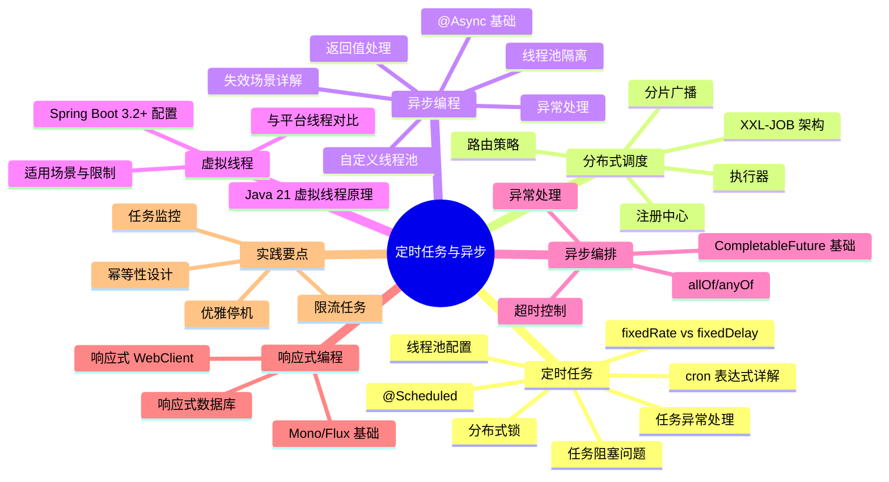

## 一、@Scheduled 定时任务深度解析

### 1.1 使用方式

```java
@SpringBootApplication
@EnableScheduling  // 必须启用定时任务
public class Application { ... }

@Component
@Slf4j
public class ScheduledTasks {

    // cron 表达式：每天凌晨 2 点执行
    @Scheduled(cron = "0 0 2 * * ?")
    public void dailyCleanup() {
        log.info("开始执行每日清理任务...");
    }

    // 固定频率：每隔 60 秒执行（不考虑执行耗时）
    @Scheduled(fixedRate = 60000)
    public void heartBeat() {
        log.info("心跳检测...");
    }

    // 固定延迟：上次执行完成后等待 30 秒再执行
    @Scheduled(fixedDelay = 30000)
    public void dataSync() {
        log.info("数据同步...");
    }

    // 首次延迟 10 秒后开始
    @Scheduled(initialDelay = 10000, fixedRate = 60000)
    public void delayedStart() {
        log.info("延迟启动任务...");
    }
}
```

### 1.2 Cron 表达式详解

Cron 表达式是一个由 6 或 7 个字段组成的字符串，用于定义任务的执行时间。**Spring 的 `@Scheduled` 只支持 6 字段格式（不支持年字段）**；带年字段的 7 字段格式是 Quartz 的语法，常见于 Cron 表达式生成工具中。

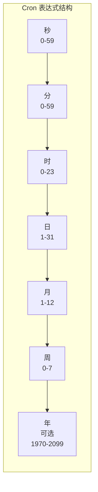

#### 字段说明

| 字段 | 允许值 | 允许的特殊字符 | 说明 |
|------|--------|----------------|------|
| 秒 | 0-59 | `, - * /` | 必填，表示第几秒触发 |
| 分 | 0-59 | `, - * /` | 必填，表示第几分触发 |
| 时 | 0-23 | `, - * /` | 必填，表示第几小时触发 |
| 日 | 1-31 | `, - * ? / L W` | 必填，表示每月第几天 |
| 月 | 1-12 或 JAN-DEC | `, - * /` | 必填，表示月份 |
| 周 | 0-7 或 SUN-SAT | `, - * ? / L #` | 必填，0 和 7 都表示周日 |
| 年 | 1970-2099 | `, - * /` | 可选，**仅 Quartz 支持，Spring @Scheduled 不支持年字段** |

#### 特殊字符含义

| 字符 | 含义 | 示例 | 说明 |
|------|------|------|------|
| `*` | 所有值 | `* * * * * ?` | 每秒执行 |
| `?` | 不指定值 | `0 0 0 * * ?` | 日和周字段互斥，其中一个必须用 `?` |
| `-` | 范围 | `0 0 9-17 * * ?` | 每天 9 点到 17 点每小时执行 |
| `,` | 列举 | `0 0 9,12,15 * * ?` | 每天 9、12、15 点执行 |
| `/` | 间隔 | `0 0/5 * * * ?` | 每 5 分钟执行一次 |
| `L` | 最后 | `0 0 0 L * ?` | 每月最后一天执行 |
| `W` | 工作日 | `0 0 0 15W * ?` | 每月 15 日最近的工作日执行 |
| `#` | 第几个 | `0 0 0 ? * 6#3` | 每月第三个周六执行（Spring 中 0=周日、6=周六） |

::: tip Cron 表达式生成工具
推荐使用在线工具生成和验证 Cron 表达式：[Cron 表达式生成器](https://cron.qqe2.com/)。Spring 的 Cron 表达式不支持年字段，最多 6 位。
:::

#### 常用 Cron 表达式示例

```java
@Component
public class CronExamples {

    // 每分钟执行
    @Scheduled(cron = "0 * * * * ?")
    public void everySecond() { }

    // 每小时执行
    @Scheduled(cron = "0 0 * * * ?")
    public void everyMinute() { }

    // 每天零点执行
    @Scheduled(cron = "0 0 0 * * ?")
    public void everyHour() { }

    // 每天凌晨 2 点执行
    @Scheduled(cron = "0 0 2 * * ?")
    public void dailyAt2AM() { }

    // 每周一早上 8 点执行
    @Scheduled(cron = "0 0 8 ? * MON")
    public void weeklyMonday() { }

    // 每月 1 号凌晨执行
    @Scheduled(cron = "0 0 0 1 * ?")
    public void monthlyFirstDay() { }

    // 工作日早上 9 点执行
    @Scheduled(cron = "0 0 9 ? * MON-FRI")
    public void workdayMorning() { }

    // 每隔 5 分钟执行
    @Scheduled(cron = "0 0/5 * * * ?")
    public void everyFiveMinutes() { }

    // 每月最后一天 23:59:59 执行
    @Scheduled(cron = "59 59 23 L * ?")
    public void lastDayOfMonth() { }

    // 每月第二个周六 10 点执行
    @Scheduled(cron = "0 0 10 ? * 6#2")
    public void secondSaturday() { }
}
```

::: warning 日与周字段的互斥关系
**Quartz** 的 Cron 表达式强制要求日字段和周字段必须有一个使用 `?`，不能同时指定具体值。**Spring** 的 `@Scheduled` 中 `?` 等价于 `*`，同时指定时为"且"的关系；为兼容 Quartz 语法与语义清晰，建议日/周其一使用 `?`，例如 `0 0 0 1 * ?` 或 `0 0 0 ? * MON`。
:::

### 1.3 fixedRate vs fixedDelay 深度对比

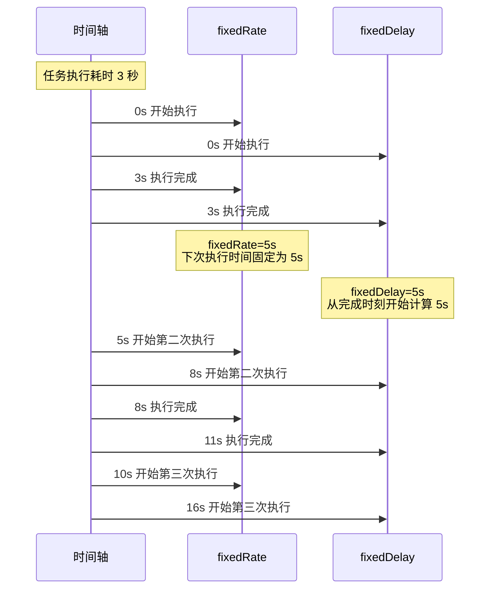

#### 核心区别

| 特性 | fixedRate | fixedDelay |
|------|-----------|------------|
| 计时起点 | 任务开始时刻 | 任务完成时刻 |
| 执行间隔 | 固定不变 | 受任务耗时影响 |
| 适用场景 | 心跳检测、定时采集 | 数据同步、清理任务 |
| 任务重叠 | 可能发生 | 不会发生 |

```java
@Component
@Slf4j
public class RateVsDelayDemo {

    // fixedRate：每隔 5 秒执行，不管上次是否完成
    // 如果任务耗时 3 秒，则间隔实际只有 2 秒
    @Scheduled(fixedRate = 5000)
    public void fixedRateTask() throws InterruptedException {
        log.info("fixedRate 开始执行: {}", LocalTime.now());
        Thread.sleep(3000);  // 模拟耗时操作
        log.info("fixedRate 执行完成: {}", LocalTime.now());
    }

    // fixedDelay：上次完成后等待 5 秒再执行
    // 如果任务耗时 3 秒，则实际间隔为 8 秒
    @Scheduled(fixedDelay = 5000)
    public void fixedDelayTask() throws InterruptedException {
        log.info("fixedDelay 开始执行: {}", LocalTime.now());
        Thread.sleep(3000);  // 模拟耗时操作
        log.info("fixedDelay 执行完成: {}", LocalTime.now());
    }
}
```

::: danger fixedRate 的任务重叠问题
当任务执行时间超过 fixedRate 间隔时，会出现任务重叠。默认单线程调度器会按顺序执行，导致实际间隔变大。如果配置了线程池，则可能并发执行，需要考虑线程安全问题。
:::

### 1.4 调度器线程池配置

::: warning 默认单线程的陷阱
`@Scheduled` 默认使用单线程执行所有定时任务。如果一个任务执行时间较长，会阻塞其他任务。**生产环境必须配置线程池。**
:::

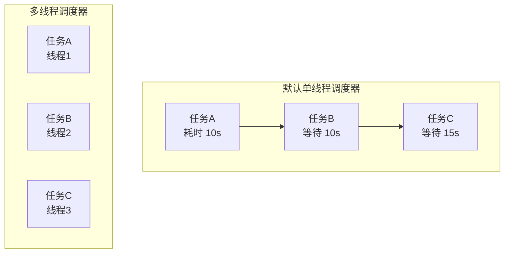

#### 配置方式

```java
@Configuration
public class SchedulingConfig {

    @Bean
    public TaskScheduler taskScheduler() {
        ThreadPoolTaskScheduler scheduler = new ThreadPoolTaskScheduler();
        scheduler.setPoolSize(10);                    // 线程池大小
        scheduler.setThreadNamePrefix("scheduled-");  // 线程名前缀
        scheduler.setAwaitTerminationSeconds(60);     // 优雅停机等待时间
        scheduler.setWaitForTasksToCompleteOnShutdown(true);  // 关闭时等待任务完成
        // 注: ThreadPoolTaskScheduler 内部为 ScheduledThreadPoolExecutor(无界队列),
        // 不支持设置拒绝策略,无需(也无法)像 ThreadPoolTaskExecutor 那样配置
        scheduler.initialize();
        return scheduler;
    }
}
```

#### 线程池参数详解

| 参数 | 说明 | 推荐值 |
|------|------|--------|
| poolSize | 线程池大小 | 根据任务数量和耗时决定，一般 5-20 |
| threadNamePrefix | 线程名前缀 | 便于日志排查，如 `scheduled-` |
| awaitTerminationSeconds | 关闭时等待时间 | 60-120 秒 |
| waitForTasksToCompleteOnShutdown | 关闭时是否等待任务完成 | true |

::: tip 线程池大小的确定
线程池大小 = CPU 核心数 × (1 + 等待时间/计算时间)。对于 I/O 密集型定时任务，可以适当增大；对于 CPU 密集型任务，建议不超过 CPU 核心数。
:::

### 1.5 任务异常处理

定时任务中的异常如果不处理，会导致任务中断且不会抛出到调用方。

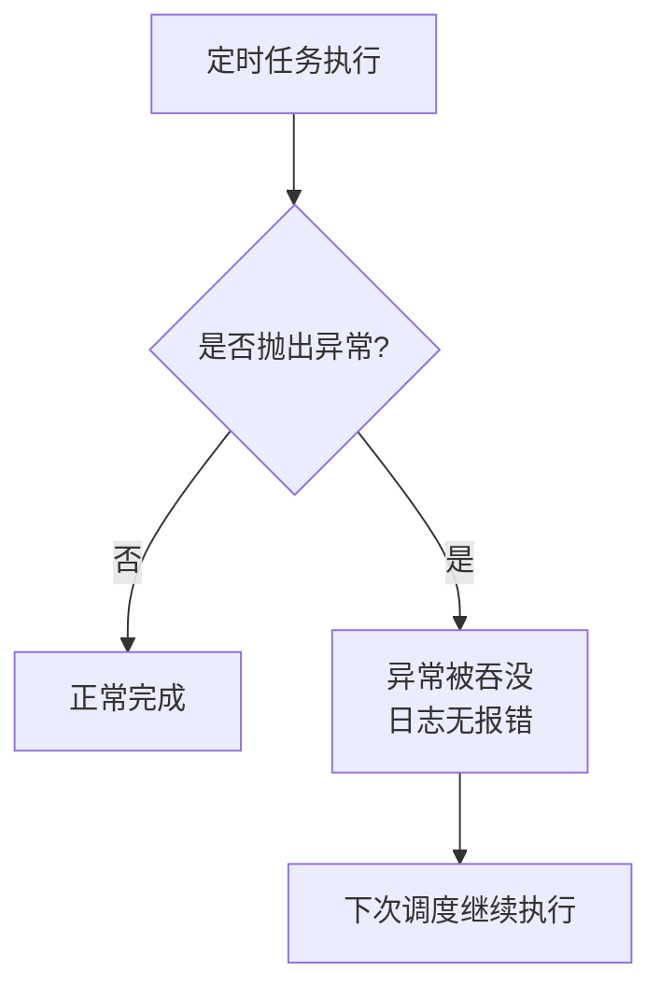

#### 异常处理方案

```java
@Component
@Slf4j
public class ScheduledTaskWithErrorHandling {

    // 方案一：try-catch 捕获异常
    @Scheduled(cron = "0 0 2 * * ?")
    public void taskWithTryCatch() {
        try {
            // 业务逻辑
            doBusiness();
        } catch (Exception e) {
            log.error("定时任务执行异常", e);
            // 可选：发送告警通知
            sendAlert(e);
        }
    }

    // 方案二：使用 Result 包装
    @Scheduled(fixedRate = 60000)
    public void taskWithResultWrapper() {
        Result result = executeWithRetry(this::doBusiness, 3);
        if (result.isFailure()) {
            log.error("定时任务执行失败: {}", result.getError());
            sendAlert(result.getError());
        }
    }

    private <T> Result executeWithRetry(Supplier<T> task, int maxRetries) {
        for (int i = 0; i < maxRetries; i++) {
            try {
                return Result.success(task.get());
            } catch (Exception e) {
                if (i == maxRetries - 1) {
                    return Result.failure(e);
                }
                log.warn("任务执行失败，第 {} 次重试", i + 1);
            }
        }
        return Result.failure(new RuntimeException("不应到达此处"));
    }

    private void doBusiness() {
        // 业务逻辑
    }

    private void sendAlert(Exception e) {
        // 发送告警
    }
}

// 简单的 Result 包装类
record Result(boolean success, Object data, Exception error) {
    static Result success(Object data) { return new Result(true, data, null); }
    static Result failure(Exception e) { return new Result(false, null, e); }
    boolean isFailure() { return !success; }
}
```

#### 全局异常处理器

```java
@Configuration
public class SchedulingExceptionHandler implements SchedulingConfigurer {

    @Override
    public void configureTasks(ScheduledTaskRegistrar taskRegistrar) {
        taskRegistrar.setErrorHandler(throwable -> {
            log.error("定时任务执行异常: {}", throwable.getMessage(), throwable);
            // 发送告警通知
            // alertService.sendAlert("定时任务异常", throwable);
        });
    }
}
```

::: danger 异常被吞没的风险
Spring 的默认 `TaskScheduler` 不会将异常传播到调用方，异常会被静默吞没。这可能导致任务失败但无人知晓。**强烈建议配置全局异常处理器或在每个任务中使用 try-catch。**
:::

### 1.6 任务阻塞问题与解决方案

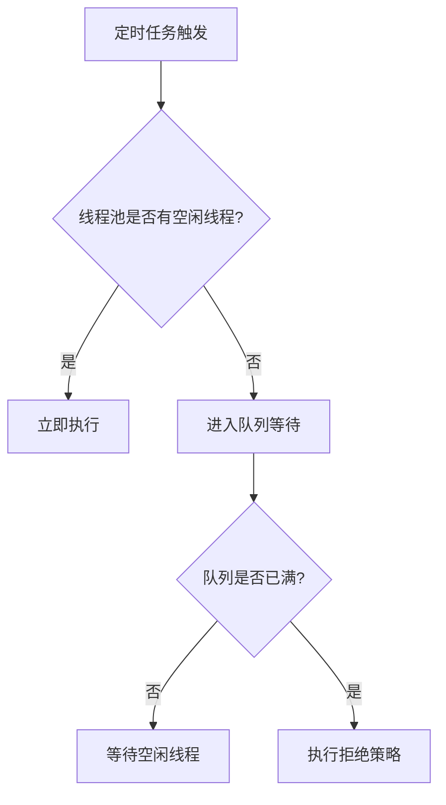

#### 阻塞场景分析

```java
@Component
@Slf4j
public class BlockingTaskDemo {

    // 场景一：长任务阻塞短任务
    @Scheduled(fixedRate = 5000)
    public void longRunningTask() throws InterruptedException {
        log.info("长任务开始");
        Thread.sleep(30000);  // 模拟 30 秒长任务
        log.info("长任务结束");
    }

    @Scheduled(fixedRate = 1000)
    public void shortTask() {
        log.info("短任务执行");  // 可能被长任务阻塞
    }

    // 场景二：外部资源阻塞
    @Scheduled(fixedRate = 60000)
    public void externalApiTask() {
        // HTTP 请求超时设置不当，可能阻塞很长时间
        String result = restTemplate.getForObject("http://slow-api/data", String.class);
    }

    // 场景三：数据库锁等待
    @Scheduled(cron = "0 0 2 * * ?")
    public void databaseTask() {
        // 大事务可能长时间持有锁，阻塞其他任务
        transactionTemplate.execute(status -> {
            // 批量更新操作
            return null;
        });
    }
}
```

#### 解决方案

```java
@Component
@Slf4j
@RequiredArgsConstructor
public class NonBlockingTaskDemo {

    private final AsyncTaskExecutor asyncTaskExecutor;

    // 方案一：异步执行耗时任务
    @Scheduled(fixedRate = 5000)
    public void asyncExecutionTask() {
        asyncTaskExecutor.execute(() -> {
            log.info("异步执行长任务");
            // 耗时操作
        });
    }

    // 方案二：设置超时时间
    @Scheduled(fixedRate = 60000)
    public void timeoutTask() {
        try {
            CompletableFuture.supplyAsync(() -> callExternalApi())
                .orTimeout(10, TimeUnit.SECONDS)
                .exceptionally(e -> {
                    log.error("外部 API 调用超时", e);
                    return null;
                })
                .get();
        } catch (Exception e) {
            log.error("任务执行异常", e);
        }
    }

    // 方案三：任务拆分
    @Scheduled(cron = "0 0 2 * * ?")
    public void chunkedTask() {
        List<Data> allData = loadData();
        // Lists.partition 为 Guava 工具类
        Lists.partition(allData, 100).forEach(chunk -> {
            processChunk(chunk);
            // 批次间短暂休息，释放资源
            sleep(100);
        });
    }

    // 方案四：使用独立的线程池隔离
    @Scheduled(fixedRate = 5000)
    public void isolatedTask() {
        // 使用独立线程池，不影响其他任务
        dedicatedExecutor.execute(() -> {
            // 耗时操作
        });
    }
}
```

::: tip 任务超时控制最佳实践
对于涉及外部调用的定时任务，务必设置超时时间。可以使用 `CompletableFuture.orTimeout()`、`RestTemplate.setReadTimeout()` 或 `OkHttpClient.Builder.readTimeout()` 等方式。
:::

### 1.7 分布式环境下的定时任务

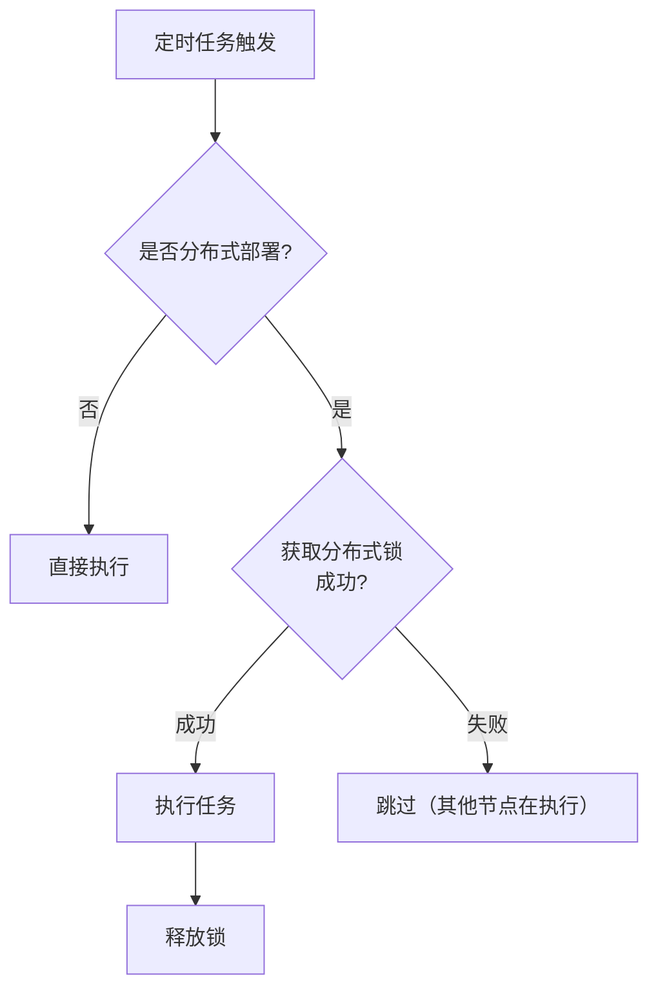

#### 基于 Redis 的分布式锁实现

```java
@Component
@RequiredArgsConstructor
@Slf4j
public class DistributedScheduledTasks {

    private final RedisTemplate<String, String> redisTemplate;

    @Scheduled(cron = "0 0 2 * * ?")
    public void dailyCleanup() {
        String lockKey = "scheduled:daily-cleanup:lock";
        String lockValue = UUID.randomUUID().toString();

        // 尝试获取锁，设置过期时间防止死锁
        Boolean acquired = redisTemplate.opsForValue()
            .setIfAbsent(lockKey, lockValue, Duration.ofMinutes(30));

        if (Boolean.TRUE.equals(acquired)) {
            try {
                log.info("获取锁成功，开始执行清理任务");
                doCleanup();
            } finally {
                // 使用 Lua 脚本保证原子性释放锁
                releaseLock(lockKey, lockValue);
            }
        } else {
            log.info("其他节点正在执行，跳过本次任务");
        }
    }

    private void releaseLock(String key, String value) {
        String script = """
            if redis.call('get', KEYS[1]) == ARGV[1] then
                return redis.call('del', KEYS[1])
            else
                return 0
            end
            """;
        redisTemplate.execute(
            new DefaultRedisScript<>(script, Long.class),
            Collections.singletonList(key),
            value
        );
    }

    private void doCleanup() {
        // 清理逻辑
    }
}
```

#### 使用 Redisson 实现分布式锁

```java
@Component
@RequiredArgsConstructor
@Slf4j
public class RedissonScheduledTasks {

    private final RedissonClient redissonClient;

    @Scheduled(cron = "0 0 2 * * ?")
    public void dailyCleanup() {
        RLock lock = redissonClient.getLock("scheduled:daily-cleanup:lock");
        
        try {
            // 尝试获取锁,等待时间 0;不指定 leaseTime 时看门狗(watchdog)生效,
            // 默认锁定 30 秒并每 10 秒自动续期,任务执行多久锁就保持多久
            boolean acquired = lock.tryLock(0);
            
            if (acquired) {
                log.info("获取锁成功，开始执行清理任务");
                doCleanup();
            } else {
                log.info("其他节点正在执行，跳过本次任务");
            }
        } catch (InterruptedException e) {
            Thread.currentThread().interrupt();
            log.error("获取锁被中断", e);
        } finally {
            if (lock.isHeldByCurrentThread()) {
                lock.unlock();
            }
        }
    }

    private void doCleanup() {
        // 清理逻辑
    }
}
```

::: danger 分布式锁的超时时间
如果任务执行时间超过锁的过期时间，锁会自动释放，其他节点可能重复执行。解决方案：1. 合理设置锁超时时间（留足余量）；2. 使用 Redisson 的看门狗机制（自动续期）；3. 对于关键任务，使用 XXL-JOB 等专业调度框架。
:::

## 二、XXL-JOB 分布式任务调度

### 2.1 架构原理

XXL-JOB 是一个轻量级分布式任务调度平台，采用"调度中心"与"执行器"分离的架构设计。

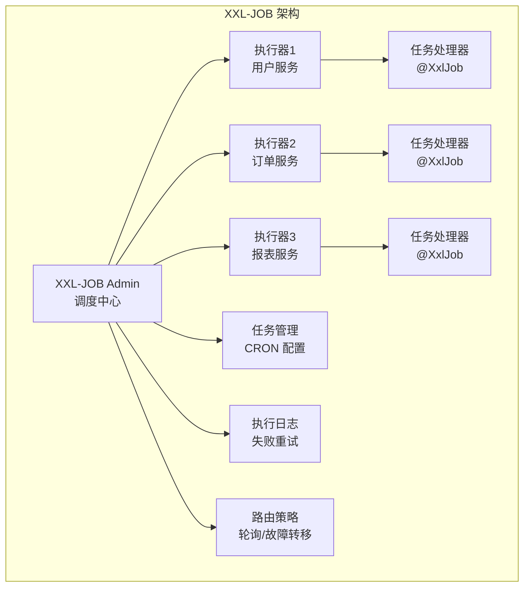

#### 核心组件

| 组件 | 职责 | 说明 |
|------|------|------|
| 调度中心（Admin） | 任务调度、任务管理、日志管理 | 负责触发任务，不执行具体业务 |
| 执行器（Executor） | 任务执行、任务注册、结果回调 | 嵌入业务应用，执行具体任务逻辑 |
| 任务（Job） | 具体业务逻辑 | 开发者编写的任务处理器 |

### 2.2 调度中心部署

```yaml
# application.properties
server.port=8080
spring.datasource.url=jdbc:mysql://localhost:3306/xxl_job?useUnicode=true&characterEncoding=UTF-8
spring.datasource.username=root
spring.datasource.password=password

# 调度中心配置
xxl.job.admin.addresses=http://localhost:8080/xxl-job-admin
xxl.job.accessToken=your-token
```

### 2.3 执行器配置

```java
@Configuration
public class XxlJobConfig {

    @Value("${xxl.job.admin.addresses}")
    private String adminAddresses;

    @Value("${xxl.job.executor.appname}")
    private String appname;

    @Value("${xxl.job.executor.port}")
    private int port;

    @Bean
    public XxlJobSpringExecutor xxlJobExecutor() {
        XxlJobSpringExecutor executor = new XxlJobSpringExecutor();
        executor.setAdminAddresses(adminAddresses);
        executor.setAppname(appname);
        executor.setPort(port);
        executor.setLogPath("/data/applogs/xxl-job/jobhandler");
        executor.setLogRetentionDays(30);
        return executor;
    }
}
```

### 2.4 任务开发

```java
@Component
@Slf4j
public class XxlJobTasks {

    // 简单任务
    @XxlJob("dailyCleanupJob")
    public void dailyCleanup() {
        log.info("开始执行每日清理任务...");
        // 业务逻辑
        XxlJobHelper.handleSuccess("清理完成");
    }

    // 带参数的任务
    @XxlJob("dataSyncJob")
    public void dataSync() {
        // 获取任务参数
        String param = XxlJobHelper.getJobParam();
        log.info("任务参数: {}", param);
        
        // 解析参数
        JSONObject config = JSON.parseObject(param);
        String source = config.getString("source");
        String target = config.getString("target");
        
        // 执行同步
        syncData(source, target);
        
        XxlJobHelper.handleSuccess("同步完成");
    }

    // 分片广播任务
    @XxlJob("shardingJob")
    public void shardingTask() {
        // 获取分片参数
        int shardIndex = XxlJobHelper.getShardIndex();  // 当前分片序号
        int shardTotal = XxlJobHelper.getShardTotal();  // 总分片数
        
        log.info("分片任务执行: {}/{}", shardIndex, shardTotal);
        
        // 根据分片处理数据
        List<Data> allData = loadData();
        List<Data> shardData = allData.stream()
            .filter(d -> d.getId() % shardTotal == shardIndex)
            .collect(Collectors.toList());
        
        processShardData(shardData);
    }

    // 子任务触发
    @XxlJob("parentJob")
    public void parentTask() {
        log.info("父任务执行完成，触发子任务");
        // 执行完成后自动触发子任务（在调度中心配置）
        XxlJobHelper.handleSuccess("父任务完成");
    }

    private void syncData(String source, String target) {
        // 同步逻辑
    }

    private List<Data> loadData() {
        return Collections.emptyList();
    }

    private void processShardData(List<Data> data) {
        // 处理逻辑
    }
}
```

### 2.5 路由策略

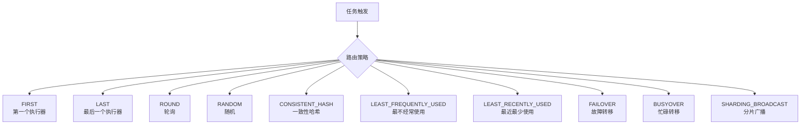

#### 路由策略详解

| 策略 | 说明 | 适用场景 |
|------|------|----------|
| FIRST | 选择第一个执行器 | 测试环境、单执行器 |
| LAST | 选择最后一个执行器 | 测试环境 |
| ROUND | 轮询选择执行器 | 负载均衡、任务均匀分布 |
| RANDOM | 随机选择执行器 | 简单负载均衡 |
| CONSISTENT_HASH | 一致性哈希 | 相同参数任务固定到同一执行器 |
| LEAST_FREQUENTLY_USED | 最不经常使用 | 负载均衡 |
| LEAST_RECENTLY_USED | 最近最少使用 | 负载均衡 |
| FAILOVER | 故障转移，依次尝试 | 高可用场景 |
| BUSYOVER | 忙碌转移，跳过忙碌执行器 | 高并发场景 |
| SHARDING_BROADCAST | 分片广播，所有执行器都执行 | 大数据分片处理 |

::: tip 分片广播的使用场景
分片广播适用于大数据量批处理场景。例如：需要处理 100 万条数据，可以配置 10 个执行器，每个执行器处理 10 万条。通过 `SHARDING_BROADCAST` 策略，所有执行器同时收到任务，根据分片序号处理各自的数据分片。
:::

### 2.6 任务参数传递

```java
@Component
@Slf4j
public class JobParamDemo {

    // 方式一：简单字符串参数
    @XxlJob("simpleParamJob")
    public void simpleParam() {
        String param = XxlJobHelper.getJobParam();
        log.info("任务参数: {}", param);
    }

    // 方式二：JSON 参数
    @XxlJob("jsonParamJob")
    public void jsonParam() {
        String param = XxlJobHelper.getJobParam();
        JobConfig config = JSON.parseObject(param, JobConfig.class);
        log.info("配置: batchSize={}, retryTimes={}", 
            config.getBatchSize(), config.getRetryTimes());
    }

    // 方式三：动态参数（通过 API 传递）
    @XxlJob("dynamicParamJob")
    public void dynamicParam() {
        String param = XxlJobHelper.getJobParam();
        if (StringUtils.isEmpty(param)) {
            // 使用默认配置
            param = "{\"batchSize\": 100}";
        }
        // 处理逻辑
    }
}

@Data
class JobConfig {
    private Integer batchSize;
    private Integer retryTimes;
    private String sourceTable;
    private String targetTable;
}
```

### 2.7 任务失败重试

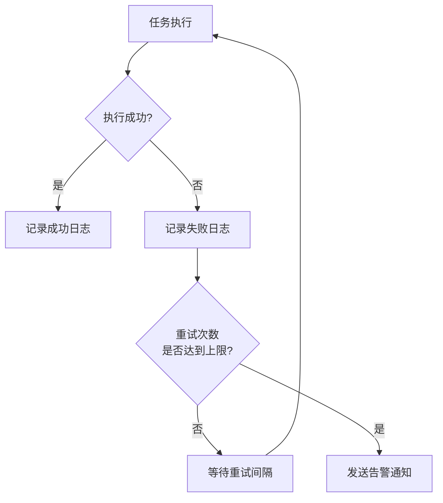

```java
@Component
@Slf4j
public class RetryJobDemo {

    @XxlJob("retryJob")
    public void retryTask() {
        try {
            // 业务逻辑
            doBusiness();
            XxlJobHelper.handleSuccess("执行成功");
        } catch (Exception e) {
            log.error("任务执行失败", e);
            
            // 获取当前重试次数
            int retryCount = XxlJobHelper.getRetryCount();
            log.info("当前重试次数: {}", retryCount);
            
            // 标记失败，触发重试（在调度中心配置重试次数）
            XxlJobHelper.handleFail("执行失败: " + e.getMessage());
        }
    }

    // 手动重试逻辑
    @XxlJob("manualRetryJob")
    public void manualRetryTask() {
        int maxRetries = 3;
        for (int i = 0; i < maxRetries; i++) {
            try {
                doBusiness();
                XxlJobHelper.handleSuccess("执行成功");
                return;
            } catch (Exception e) {
                log.warn("第 {} 次执行失败: {}", i + 1, e.getMessage());
                if (i == maxRetries - 1) {
                    XxlJobHelper.handleFail("重试耗尽: " + e.getMessage());
                }
                sleep(1000 * (i + 1));  // 递增间隔等待
            }
        }
    }

    private void doBusiness() {
        // 业务逻辑
    }

    private void sleep(long millis) {
        try {
            Thread.sleep(millis);
        } catch (InterruptedException e) {
            Thread.currentThread().interrupt();
        }
    }
}
```

### 2.8 XXL-JOB 与 @Scheduled 对比

| 功能 | @Scheduled | XXL-JOB |
|------|-----------|---------|
| 集群支持 | × 需自行实现分布式锁 | √ 内置路由策略 |
| 动态调整 | × 需重启应用 | √ 管理界面实时调整 |
| 失败重试 | × 需自行实现 | √ 内置重试策略 |
| 执行日志 | × 需自行记录 | √ 可视化日志 |
| 任务依赖 | × 不支持 | √ 子任务触发 |
| 分片广播 | × 不支持 | √ 分布式分片处理 |
| 任务监控 | × 需自行实现 | √ 告警通知 |
| 运维成本 | 低 | 中（需部署调度中心） |

::: tip 选择建议
- **简单场景**：单机部署、任务数量少、无需动态调整 → 使用 `@Scheduled`
- **复杂场景**：分布式部署、任务数量多、需要动态管理 → 使用 XXL-JOB
:::

## 三、@Async 异步编程深度解析

### 3.1 基本使用

```java
@SpringBootApplication
@EnableAsync  // 必须启用异步
public class Application { ... }

@Service
@Slf4j
public class EmailService {

    @Async  // 异步执行，无返回值
    public void sendEmail(String to, String subject, String content) {
        log.info("开始发送邮件到: {}, 线程: {}", to, Thread.currentThread().getName());
        // 耗时操作...
        log.info("邮件发送完成");
    }

    @Async  // 异步执行，有返回值
    public CompletableFuture<String> sendEmailWithResult(String to) {
        log.info("开始发送邮件到: {}", to);
        // 耗时操作...
        return CompletableFuture.completedFuture("发送成功");
    }
}
```

### 3.2 自定义线程池

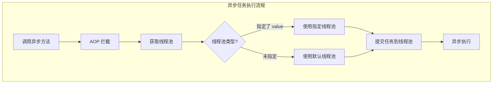

#### 配置默认线程池

```java
@Configuration
public class AsyncConfig implements AsyncConfigurer {

    @Override
    public Executor getAsyncExecutor() {
        ThreadPoolTaskExecutor executor = new ThreadPoolTaskExecutor();
        executor.setCorePoolSize(10);        // 核心线程数
        executor.setMaxPoolSize(50);         // 最大线程数
        executor.setQueueCapacity(200);      // 队列容量
        executor.setKeepAliveSeconds(60);    // 空闲线程存活时间
        executor.setThreadNamePrefix("async-");
        executor.setRejectedExecutionHandler(new ThreadPoolExecutor.CallerRunsPolicy());
        executor.setWaitForTasksToCompleteOnShutdown(true);
        executor.setAwaitTerminationSeconds(60);
        executor.initialize();
        return executor;
    }

    @Override
    public AsyncUncaughtExceptionHandler getAsyncUncaughtExceptionHandler() {
        return (throwable, method, params) -> {
            log.error("异步任务异常 - 方法: {}, 参数: {}", method.getName(), params, throwable);
        };
    }
}
```

#### 配置多个线程池

```java
@Configuration
public class MultiAsyncConfig {

    // 邮件专用线程池
    @Bean("emailExecutor")
    public Executor emailExecutor() {
        ThreadPoolTaskExecutor executor = new ThreadPoolTaskExecutor();
        executor.setCorePoolSize(5);
        executor.setMaxPoolSize(10);
        executor.setQueueCapacity(100);
        executor.setThreadNamePrefix("email-");
        executor.initialize();
        return executor;
    }

    // 报表专用线程池
    @Bean("reportExecutor")
    public Executor reportExecutor() {
        ThreadPoolTaskExecutor executor = new ThreadPoolTaskExecutor();
        executor.setCorePoolSize(3);
        executor.setMaxPoolSize(5);
        executor.setQueueCapacity(50);
        executor.setThreadNamePrefix("report-");
        executor.initialize();
        return executor;
    }

    // 默认线程池
    @Bean("defaultExecutor")
    public Executor defaultExecutor() {
        ThreadPoolTaskExecutor executor = new ThreadPoolTaskExecutor();
        executor.setCorePoolSize(10);
        executor.setMaxPoolSize(20);
        executor.setQueueCapacity(200);
        executor.setThreadNamePrefix("async-");
        executor.initialize();
        return executor;
    }
}
```

#### 使用指定线程池

```java
@Service
@Slf4j
public class AsyncTaskService {

    // 使用 emailExecutor 线程池
    @Async("emailExecutor")
    public void sendEmail(String to) {
        log.info("发送邮件, 线程: {}", Thread.currentThread().getName());
    }

    // 使用 reportExecutor 线程池
    @Async("reportExecutor")
    public CompletableFuture<String> generateReport() {
        log.info("生成报表, 线程: {}", Thread.currentThread().getName());
        return CompletableFuture.completedFuture("报表生成完成");
    }

    // 使用默认线程池
    @Async
    public void defaultTask() {
        log.info("默认任务, 线程: {}", Thread.currentThread().getName());
    }
}
```

::: tip 线程池隔离的重要性
不同类型的任务使用独立线程池，可以避免相互影响。例如：邮件发送任务如果阻塞，不会影响报表生成任务。这种隔离策略提高了系统的稳定性。
:::

### 3.3 异常处理

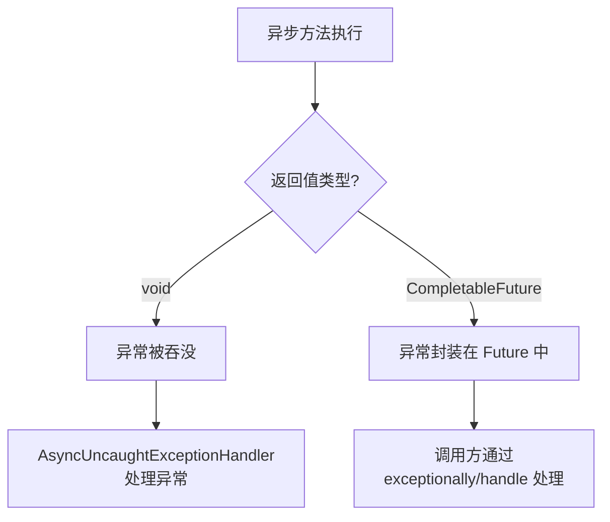

#### void 返回值的异常处理

```java
@Configuration
@Slf4j
public class AsyncExceptionHandlerConfig implements AsyncConfigurer {

    @Override
    public AsyncUncaughtExceptionHandler getAsyncUncaughtExceptionHandler() {
        return new AsyncUncaughtExceptionHandler() {
            @Override
            public void handleUncaughtException(Throwable throwable, Method method, Object... params) {
                log.error("异步任务异常 - 方法: {}, 参数: {}", method.getName(), 
                    Arrays.toString(params), throwable);
                
                // 发送告警通知
                // alertService.sendAlert("异步任务异常", throwable);
            }
        };
    }
}
```

#### CompletableFuture 返回值的异常处理

```java
@Service
@Slf4j
public class AsyncServiceWithExceptionHandling {

    @Async
    public CompletableFuture<String> riskyTask() {
        try {
            // 可能抛出异常的操作
            String result = doRiskyOperation();
            return CompletableFuture.completedFuture(result);
        } catch (Exception e) {
            // 将异常封装到 CompletableFuture
            return CompletableFuture.failedFuture(e);
        }
    }

    // 调用方处理异常
    public void callRiskyTask() {
        riskyTask()
            .thenAccept(result -> log.info("成功: {}", result))
            .exceptionally(ex -> {
                log.error("任务失败", ex);
                return null;
            });
    }

    // 使用 handle 同时处理成功和失败
    public void callWithHandle() {
        riskyTask()
            .handle((result, ex) -> {
                if (ex != null) {
                    log.error("任务失败", ex);
                    return "默认值";
                }
                return result;
            })
            .thenAccept(result -> log.info("结果: {}", result));
    }

    private String doRiskyOperation() {
        // 业务逻辑
        return "success";
    }
}
```

::: danger void 异步方法的异常陷阱
void 返回值的异步方法，异常无法传播到调用方。如果不配置 `AsyncUncaughtExceptionHandler`，异常会被静默吞没，导致问题难以排查。**建议优先使用 CompletableFuture 返回值，或务必配置全局异常处理器。**
:::

### 3.4 返回值处理

```java
@Service
@Slf4j
public class AsyncResultService {

    // 无返回值
    @Async
    public void noResult() {
        log.info("无返回值任务");
    }

    // 返回 CompletableFuture
    @Async
    public CompletableFuture<String> withResult() {
        log.info("有返回值任务");
        return CompletableFuture.completedFuture("结果");
    }

    // 返回 List
    @Async
    public CompletableFuture<List<User>> getUsers() {
        List<User> users = userRepository.findAll();
        return CompletableFuture.completedFuture(users);
    }

    // 多个异步任务组合
    public CompletableFuture<Map<String, Object>> getCombinedData() {
        CompletableFuture<User> userFuture = getUserAsync(1L);
        CompletableFuture<List<Order>> ordersFuture = getOrdersAsync(1L);
        CompletableFuture<List<Address>> addressesFuture = getAddressesAsync(1L);

        return CompletableFuture.allOf(userFuture, ordersFuture, addressesFuture)
            .thenApply(v -> {
                Map<String, Object> result = new HashMap<>();
                result.put("user", userFuture.join());
                result.put("orders", ordersFuture.join());
                result.put("addresses", addressesFuture.join());
                return result;
            });
    }

    @Async
    public CompletableFuture<User> getUserAsync(Long id) {
        return CompletableFuture.completedFuture(userRepository.findById(id).orElseThrow());
    }

    @Async
    public CompletableFuture<List<Order>> getOrdersAsync(Long userId) {
        return CompletableFuture.completedFuture(orderRepository.findByUserId(userId));
    }

    @Async
    public CompletableFuture<List<Address>> getAddressesAsync(Long userId) {
        return CompletableFuture.completedFuture(addressRepository.findByUserId(userId));
    }
}
```

### 3.5 线程池隔离策略

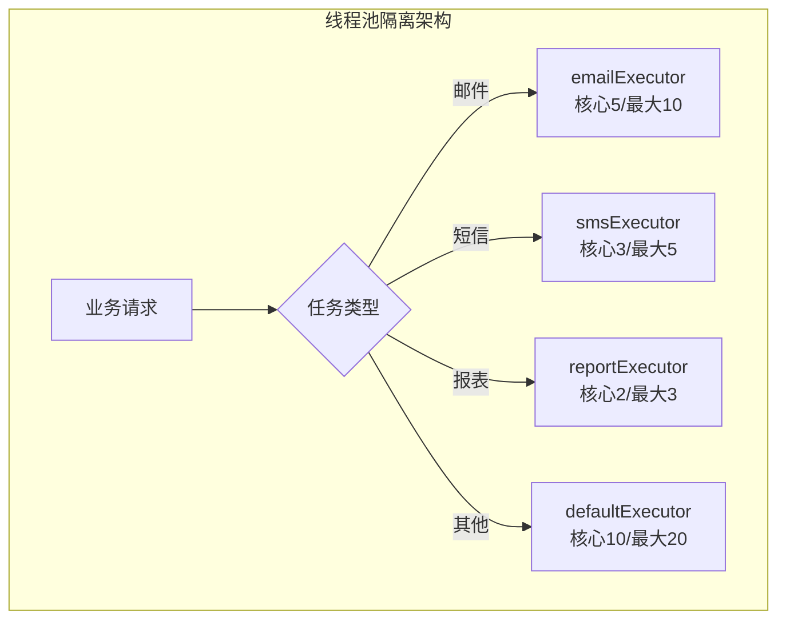

```java
@Configuration
public class IsolatedAsyncConfig {

    // 快速响应任务线程池（邮件、通知）
    @Bean("fastExecutor")
    public Executor fastExecutor() {
        ThreadPoolTaskExecutor executor = new ThreadPoolTaskExecutor();
        executor.setCorePoolSize(10);
        executor.setMaxPoolSize(20);
        executor.setQueueCapacity(100);
        executor.setThreadNamePrefix("fast-");
        executor.setRejectedExecutionHandler(new ThreadPoolExecutor.AbortPolicy());
        executor.initialize();
        return executor;
    }

    // 慢速任务线程池（报表生成、数据导出）
    @Bean("slowExecutor")
    public Executor slowExecutor() {
        ThreadPoolTaskExecutor executor = new ThreadPoolTaskExecutor();
        executor.setCorePoolSize(3);
        executor.setMaxPoolSize(5);
        executor.setQueueCapacity(20);
        executor.setThreadNamePrefix("slow-");
        executor.setRejectedExecutionHandler(new ThreadPoolExecutor.CallerRunsPolicy());
        executor.initialize();
        return executor;
    }

    // I/O 密集型任务线程池
    @Bean("ioExecutor")
    public Executor ioExecutor() {
        ThreadPoolTaskExecutor executor = new ThreadPoolTaskExecutor();
        executor.setCorePoolSize(20);  // I/O 密集型，线程数可以多一些
        executor.setMaxPoolSize(50);
        executor.setQueueCapacity(500);
        executor.setThreadNamePrefix("io-");
        executor.initialize();
        return executor;
    }

    // CPU 密集型任务线程池
    @Bean("cpuExecutor")
    public Executor cpuExecutor() {
        int cpuCount = Runtime.getRuntime().availableProcessors();
        ThreadPoolTaskExecutor executor = new ThreadPoolTaskExecutor();
        executor.setCorePoolSize(cpuCount);  // CPU 密集型，线程数等于 CPU 核心数
        executor.setMaxPoolSize(cpuCount);
        executor.setQueueCapacity(100);
        executor.setThreadNamePrefix("cpu-");
        executor.initialize();
        return executor;
    }
}
```

### 3.6 @Async 失效场景详解

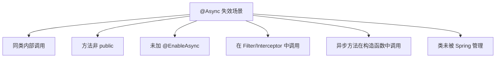

#### 场景一：同类内部调用

```java
@Service
@Slf4j
public class AsyncFailureDemo1 {

    // × 错误：同类内部调用，@Async 不生效
    public void callAsyncMethod() {
        log.info("调用方线程: {}", Thread.currentThread().getName());
        this.asyncMethod();  // 直接调用，不走代理
    }

    @Async
    public void asyncMethod() {
        log.info("异步方法线程: {}", Thread.currentThread().getName());
    }
}

// √ 正确方案一：注入自身
@Service
@Slf4j
public class AsyncFixDemo1 {

    @Autowired
    @Lazy  // 避免循环依赖
    private AsyncFixDemo1 self;

    public void callAsyncMethod() {
        log.info("调用方线程: {}", Thread.currentThread().getName());
        self.asyncMethod();  // 通过代理调用
    }

    @Async
    public void asyncMethod() {
        log.info("异步方法线程: {}", Thread.currentThread().getName());
    }
}

// √ 正确方案二：提取到另一个类
@Service
@Slf4j
public class AsyncFixDemo2 {

    @Autowired
    private AsyncHelper asyncHelper;

    public void callAsyncMethod() {
        log.info("调用方线程: {}", Thread.currentThread().getName());
        asyncHelper.asyncMethod();  // 调用另一个类的方法
    }
}

@Service
@Slf4j
class AsyncHelper {
    @Async
    public void asyncMethod() {
        log.info("异步方法线程: {}", Thread.currentThread().getName());
    }
}

// √ 正确方案三：使用 AopContext
@Service
@Slf4j
public class AsyncFixDemo3 {

    public void callAsyncMethod() {
        log.info("调用方线程: {}", Thread.currentThread().getName());
        // 需要配置 @EnableAspectJAutoProxy(exposeProxy = true)
        ((AsyncFixDemo3) AopContext.currentProxy()).asyncMethod();
    }

    @Async
    public void asyncMethod() {
        log.info("异步方法线程: {}", Thread.currentThread().getName());
    }
}
```

::: danger 同类内部调用的根本原因
Spring AOP 通过代理模式实现 `@Async`。同类内部调用使用的是 `this` 引用，直接调用目标对象的方法，绕过了代理。解决方案都是确保通过代理对象调用。
:::

#### 场景二：方法非 public

```java
@Service
@Slf4j
public class AsyncFailureDemo2 {

    // × 错误：private 方法，@Async 不生效
    @Async
    private void privateAsyncMethod() {
        log.info("异步方法线程: {}", Thread.currentThread().getName());
    }

    // × 错误：protected 方法，@Async 不生效
    @Async
    protected void protectedAsyncMethod() {
        log.info("异步方法线程: {}", Thread.currentThread().getName());
    }

    // × 错误：package-private 方法，@Async 不生效
    @Async
    void packageAsyncMethod() {
        log.info("异步方法线程: {}", Thread.currentThread().getName());
    }

    // √ 正确：public 方法
    @Async
    public void publicAsyncMethod() {
        log.info("异步方法线程: {}", Thread.currentThread().getName());
    }
}
```

::: warning CGLIB 代理的限制
Spring 默认使用 CGLIB 代理，CGLIB 通过继承目标类生成代理。private、protected、package-private 方法无法被子类重写，因此代理无法拦截这些方法。
:::

#### 场景三：未加 @EnableAsync

```java
// × 错误：缺少 @EnableAsync
@SpringBootApplication
public class Application {
    public static void main(String[] args) {
        SpringApplication.run(Application.class, args);
    }
}

// √ 正确：添加 @EnableAsync
@SpringBootApplication
@EnableAsync
public class Application {
    public static void main(String[] args) {
        SpringApplication.run(Application.class, args);
    }
}
```

#### 场景四：在 Filter/Interceptor 中调用

```java
// × 错误：在 Filter 中调用异步方法
@Component
public class AsyncFilter implements Filter {
    
    @Autowired
    private AsyncService asyncService;

    @Override
    public void doFilter(ServletRequest request, ServletResponse response, FilterChain chain) 
            throws IOException, ServletException {
        // 此时 Spring 容器可能未完全初始化，异步调用可能失败
        asyncService.asyncMethod();
        chain.doFilter(request, response);
    }
}

// × 错误：在 Interceptor 中调用异步方法
@Component
public class AsyncInterceptor implements HandlerInterceptor {
    
    @Autowired
    private AsyncService asyncService;

    @Override
    public boolean preHandle(HttpServletRequest request, HttpServletResponse response, 
            Object handler) {
        // 请求线程和异步线程可能存在上下文传递问题
        asyncService.asyncMethod();
        return true;
    }
}
```

::: tip Filter/Interceptor 中的异步调用
在 Filter 或 Interceptor 中调用异步方法时，需要注意：
1. 请求上下文（RequestContext）可能无法传递到异步线程
2. 安全上下文（SecurityContext）可能丢失
3. 建议在异步方法中手动传递必要的上下文信息
:::

#### 场景五：在构造函数中调用

```java
@Service
@Slf4j
public class AsyncFailureDemo5 {

    @Autowired
    private AsyncService asyncService;

    // × 错误：在构造函数中调用异步方法
    public AsyncFailureDemo5() {
        asyncService.asyncMethod();  // 此时 Bean 可能未完全初始化
    }
}

// √ 正确：使用 @PostConstruct
@Service
@Slf4j
public class AsyncFixDemo5 {

    @Autowired
    private AsyncService asyncService;

    @PostConstruct
    public void init() {
        asyncService.asyncMethod();  // Bean 初始化完成后调用
    }
}
```

#### 场景六：类未被 Spring 管理

```java
// × 错误：类没有 @Service/@Component 等注解
public class NotManagedService {
    @Async
    public void asyncMethod() {
        // @Async 不生效，因为类未被 Spring 管理
    }
}

// √ 正确：添加 Spring 注解
@Service
public class ManagedService {
    @Async
    public void asyncMethod() {
        // @Async 生效
    }
}
```

## 四、Java 21 虚拟线程详解

### 4.1 虚拟线程原理

虚拟线程（Virtual Threads）是 Java 21 引入的轻量级线程，由 JVM 而非操作系统调度。

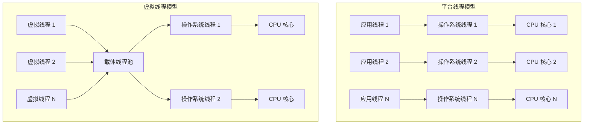

#### 核心概念

| 概念 | 说明 |
|------|------|
| 虚拟线程（Virtual Thread） | 由 JVM 管理的轻量级线程，创建成本极低 |
| 载体线程（Carrier Thread） | 执行虚拟线程的平台线程，通常是 ForkJoinPool 的工作线程 |
| 挂载（Mount） | 虚拟线程关联到载体线程执行 |
| 卸载（Unmount） | 虚拟线程从载体线程分离，通常发生在阻塞 I/O 操作时 |

### 4.2 虚拟线程与平台线程对比

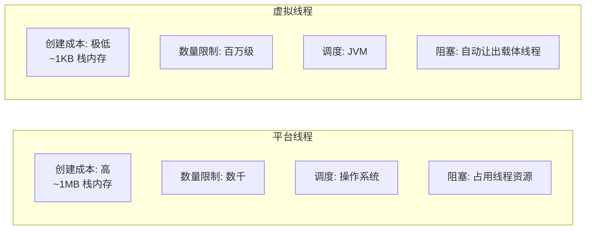

| 特性 | 平台线程 | 虚拟线程 |
|------|----------|----------|
| 创建成本 | 高（~1MB 栈内存） | 极低（~1KB 栈内存） |
| 最大数量 | 数千（受限于内存） | 百万级 |
| 调度方式 | 操作系统调度 | JVM 调度 |
| 阻塞行为 | 阻塞时占用线程 | 阻塞时自动让出载体线程 |
| 适用场景 | CPU 密集型 | I/O 密集型 |
| 线程池 | 必须使用线程池 | 可以不使用线程池 |

### 4.3 Spring Boot 3.2+ 虚拟线程配置

```yaml
# application.yml
spring:
  threads:
    virtual:
      enabled: true  # 启用虚拟线程
```

```java
@Configuration
public class VirtualThreadConfig {

    // 配置 Tomcat 使用虚拟线程处理请求
    @Bean
    public TomcatProtocolHandlerCustomizer<?> virtualThreadExecutorCustomizer() {
        return protocolHandler -> {
            protocolHandler.setExecutor(Executors.newVirtualThreadPerTaskExecutor());
        };
    }

    // 配置异步任务使用虚拟线程
    @Bean
    public TaskExecutor virtualThreadTaskExecutor() {
        return new TaskExecutor() {
            @Override
            public void execute(Runnable task) {
                Thread.ofVirtual().start(task);
            }
        };
    }

    // 配置 @Async 使用虚拟线程
    @Bean("virtualThreadExecutor")
    public Executor virtualThreadExecutor() {
        return Executors.newVirtualThreadPerTaskExecutor();
    }
}
```

#### 使用虚拟线程的异步服务

```java
@Service
@Slf4j
public class VirtualThreadService {

    // 使用虚拟线程执行异步任务
    @Async("virtualThreadExecutor")
    public void asyncWithVirtualThread() {
        log.info("虚拟线程: {}", Thread.currentThread());
        // Thread[#XX,runnable] - 虚拟线程名称格式
    }

    // 手动创建虚拟线程
    public void manualVirtualThread() {
        Thread virtualThread = Thread.ofVirtual()
            .name("my-virtual-thread")
            .start(() -> {
                log.info("在虚拟线程中执行: {}", Thread.currentThread());
            });
    }

    // 使用 ExecutorService 创建虚拟线程
    public void executorServiceVirtualThread() {
        try (ExecutorService executor = Executors.newVirtualThreadPerTaskExecutor()) {
            executor.submit(() -> {
                log.info("任务1: {}", Thread.currentThread());
            });
            executor.submit(() -> {
                log.info("任务2: {}", Thread.currentThread());
            });
        }
    }
}
```

### 4.4 虚拟线程适用场景

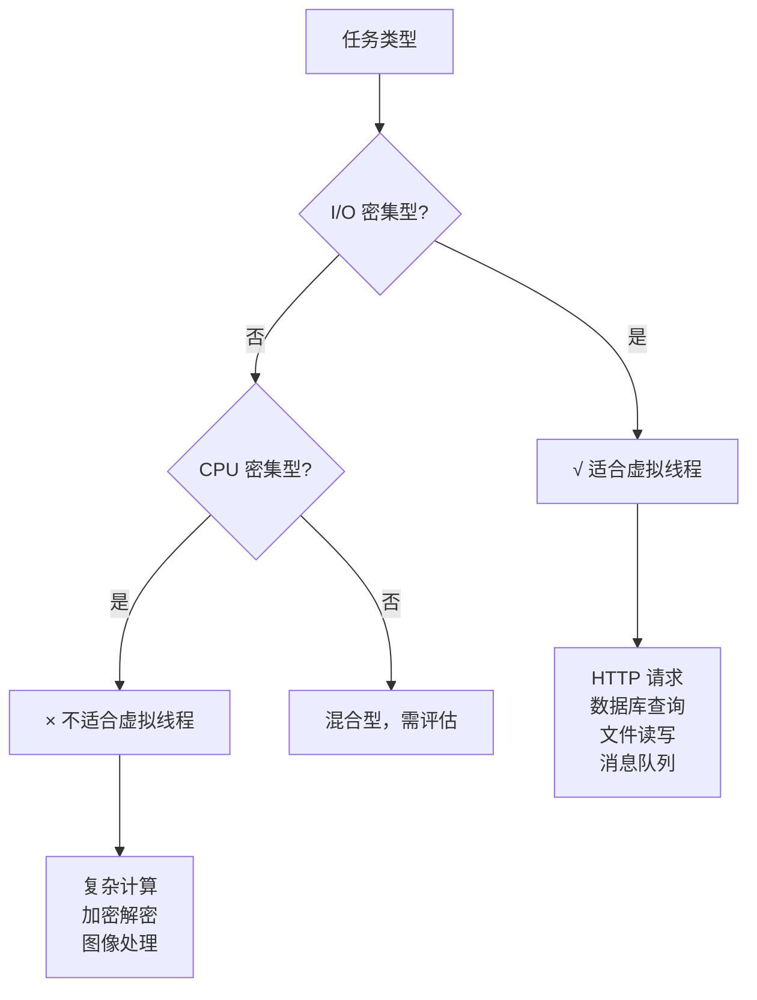

#### 适合虚拟线程的场景

```java
@Service
@Slf4j
public class VirtualThreadUseCases {

    // 场景一：高并发 HTTP 客户端
    public List<String> fetchMultipleUrls(List<String> urls) {
        try (ExecutorService executor = Executors.newVirtualThreadPerTaskExecutor()) {
            List<Future<String>> futures = urls.stream()
                .map(url -> executor.submit(() -> fetchUrl(url)))
                .collect(Collectors.toList());
            
            return futures.stream()
                .map(f -> {
                    try {
                        return f.get();
                    } catch (Exception e) {
                        return "error";
                    }
                })
                .collect(Collectors.toList());
        }
    }

    // 场景二：数据库批量查询
    public List<User> batchQueryUsers(List<Long> userIds) {
        try (ExecutorService executor = Executors.newVirtualThreadPerTaskExecutor()) {
            List<Future<User>> futures = userIds.stream()
                .map(id -> executor.submit(() -> userRepository.findById(id)))
                .collect(Collectors.toList());
            
            return futures.stream()
                .map(f -> {
                    try {
                        return f.get();
                    } catch (Exception e) {
                        return null;
                    }
                })
                .filter(Objects::nonNull)
                .collect(Collectors.toList());
        }
    }

    // 场景三：消息消费
    @KafkaListener(topics = "orders")
    public void consumeOrder(String message) {
        // 每条消息在独立的虚拟线程中处理
        // 不需要担心线程池耗尽
        processOrder(message);
    }

    private String fetchUrl(String url) {
        // HTTP 请求
        return "response";
    }

    private void processOrder(String message) {
        // 处理订单
    }
}
```

### 4.5 虚拟线程的限制与注意事项

::: warning 虚拟线程的注意事项
1. **不要池化虚拟线程**：虚拟线程创建成本极低，不需要线程池
2. **避免 synchronized 块（JDK 21）**：synchronized 会钉住载体线程，导致虚拟线程无法卸载——**JDK 24 起（JEP 491）已解决此问题，synchronized 中的阻塞不再钉住载体线程**
3. **ThreadLocal 使用需谨慎**：大量虚拟线程可能导致 ThreadLocal 内存占用过大
4. **CPU 密集型任务不适合**：虚拟线程不会提升计算性能
:::

```java
@Service
@Slf4j
public class VirtualThreadPitfalls {

    // × 错误：使用 synchronized 钉住载体线程
    public synchronized void badSynchronized() {
        // synchronized 会导致虚拟线程钉住载体线程
        // 阻塞时无法让出载体线程
        blockingOperation();
    }

    // √ 正确：使用 ReentrantLock
    private final ReentrantLock lock = new ReentrantLock();
    
    public void goodLock() {
        lock.lock();
        try {
            blockingOperation();
        } finally {
            lock.unlock();
        }
    }

    // × 错误：大量使用 ThreadLocal
    private static final ThreadLocal<LargeObject> threadLocal = new ThreadLocal<>();
    
    public void badThreadLocal() {
        // 百万级虚拟线程，每个都有 LargeObject 副本
        // 可能导致内存溢出
        threadLocal.set(new LargeObject());
    }

    // √ 正确：使用 ScopedValue（Java 21+）
    // 或减少 ThreadLocal 使用

    // × 错误：CPU 密集型任务使用虚拟线程
    public void cpuIntensiveTask() {
        // 虚拟线程不会提升计算性能
        // 反而可能因为调度开销降低性能
        heavyComputation();
    }

    private void blockingOperation() {
        // 阻塞操作
    }

    private void heavyComputation() {
        // CPU 密集计算
    }
}
```

::: danger synchronized 钉住问题
在虚拟线程中使用 `synchronized` 块或方法时，虚拟线程会被"钉住"（pin）到载体线程上。这意味着在阻塞操作期间，虚拟线程无法让出载体线程，导致载体线程被占用，影响其他虚拟线程的执行。解决方案是使用 `ReentrantLock` 替代 `synchronized`。（注：该限制仅针对 JDK 21，JDK 24 起通过 JEP 491 已允许 synchronized 中的阻塞让出载体线程。）
:::

## 五、CompletableFuture 异步编排实战

### 5.1 CompletableFuture 基础


#### 创建 CompletableFuture

```java
@Service
@Slf4j
public class CompletableFutureBasics {

    // 方式一：supplyAsync - 有返回值
    public CompletableFuture<String> createWithSupplyAsync() {
        return CompletableFuture.supplyAsync(() -> {
            log.info("执行异步任务");
            return "结果";
        });
    }

    // 方式二：runAsync - 无返回值
    public CompletableFuture<Void> createWithRunAsync() {
        return CompletableFuture.runAsync(() -> {
            log.info("执行异步任务，无返回值");
        });
    }

    // 方式三：指定线程池
    public CompletableFuture<String> createWithExecutor() {
        Executor executor = Executors.newFixedThreadPool(10);
        return CompletableFuture.supplyAsync(() -> "结果", executor);
    }

    // 方式四：已完成的结果
    public CompletableFuture<String> completedResult() {
        return CompletableFuture.completedFuture("已完成的结果");
    }
}
```

### 5.2 链式调用

```java
@Service
@Slf4j
public class CompletableFutureChaining {

    // thenApply - 同步转换结果
    public CompletableFuture<String> thenApplyExample() {
        return CompletableFuture.supplyAsync(() -> "hello")
            .thenApply(result -> result.toUpperCase());  // "HELLO"
    }

    // thenApplyAsync - 异步转换结果
    public CompletableFuture<String> thenApplyAsyncExample() {
        return CompletableFuture.supplyAsync(() -> "hello")
            .thenApplyAsync(result -> {
                log.info("异步转换: {}", Thread.currentThread().getName());
                return result.toUpperCase();
            });
    }

    // thenCompose - 链接两个 CompletableFuture（扁平化）
    public CompletableFuture<String> thenComposeExample() {
        return CompletableFuture.supplyAsync(() -> "user123")
            .thenCompose(userId -> fetchUserDetails(userId));  // 返回另一个 CompletableFuture
    }

    // thenCombine - 组合两个独立的 CompletableFuture
    public CompletableFuture<String> thenCombineExample() {
        CompletableFuture<String> future1 = CompletableFuture.supplyAsync(() -> "Hello");
        CompletableFuture<String> future2 = CompletableFuture.supplyAsync(() -> "World");
        
        return future1.thenCombine(future2, (r1, r2) -> r1 + " " + r2);  // "Hello World"
    }

    // thenAccept - 消费结果，无返回值
    public CompletableFuture<Void> thenAcceptExample() {
        return CompletableFuture.supplyAsync(() -> "hello")
            .thenAccept(result -> log.info("结果: {}", result));
    }

    // thenRun - 不关心结果，执行后续操作
    public CompletableFuture<Void> thenRunExample() {
        return CompletableFuture.supplyAsync(() -> "hello")
            .thenRun(() -> log.info("任务完成"));
    }

    private CompletableFuture<String> fetchUserDetails(String userId) {
        return CompletableFuture.supplyAsync(() -> "User: " + userId);
    }
}
```

### 5.3 allOf 与 anyOf

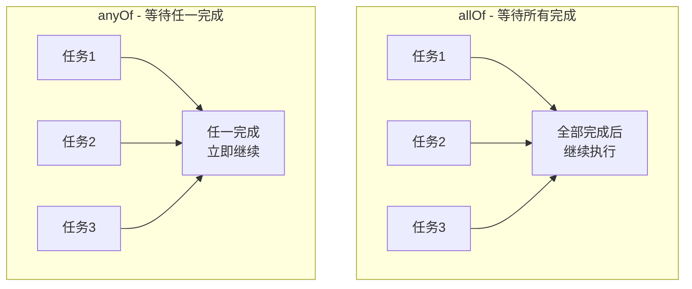

```java
@Service
@Slf4j
public class CompletableFutureAllAny {

    // allOf - 等待所有任务完成
    public CompletableFuture<List<String>> allOfExample() {
        List<CompletableFuture<String>> futures = Arrays.asList(
            CompletableFuture.supplyAsync(() -> fetchFromServiceA()),
            CompletableFuture.supplyAsync(() -> fetchFromServiceB()),
            CompletableFuture.supplyAsync(() -> fetchFromServiceC())
        );

        return CompletableFuture.allOf(futures.toArray(new CompletableFuture[0]))
            .thenApply(v -> futures.stream()
                .map(CompletableFuture::join)
                .collect(Collectors.toList()));
    }

    // anyOf - 任一任务完成即返回
    public CompletableFuture<Object> anyOfExample() {
        return CompletableFuture.anyOf(
            CompletableFuture.supplyAsync(() -> fetchFromServiceA()),
            CompletableFuture.supplyAsync(() -> fetchFromServiceB()),
            CompletableFuture.supplyAsync(() -> fetchFromServiceC())
        );
    }

    // 实战：并行调用多个服务，取最快响应
    public String getFastestResponse(String query) {
        CompletableFuture<String> google = CompletableFuture.supplyAsync(
            () -> googleSearch(query));
        CompletableFuture<String> bing = CompletableFuture.supplyAsync(
            () -> bingSearch(query));
        CompletableFuture<String> baidu = CompletableFuture.supplyAsync(
            () -> baiduSearch(query));

        return (String) CompletableFuture.anyOf(google, bing, baidu)
            .join();
    }

    // 实战：并行获取用户完整信息
    public CompletableFuture<UserFullInfo> getUserFullInfo(Long userId) {
        CompletableFuture<User> userFuture = CompletableFuture.supplyAsync(
            () -> userService.getUser(userId));
        CompletableFuture<List<Order>> ordersFuture = CompletableFuture.supplyAsync(
            () -> orderService.getOrders(userId));
        CompletableFuture<List<Address>> addressesFuture = CompletableFuture.supplyAsync(
            () -> addressService.getAddresses(userId));

        return CompletableFuture.allOf(userFuture, ordersFuture, addressesFuture)
            .thenApply(v -> {
                UserFullInfo info = new UserFullInfo();
                info.setUser(userFuture.join());
                info.setOrders(ordersFuture.join());
                info.setAddresses(addressesFuture.join());
                return info;
            });
    }

    private String fetchFromServiceA() { return "A"; }
    private String fetchFromServiceB() { return "B"; }
    private String fetchFromServiceC() { return "C"; }
    private String googleSearch(String q) { return "Google: " + q; }
    private String bingSearch(String q) { return "Bing: " + q; }
    private String baiduSearch(String q) { return "Baidu: " + q; }
}
```

### 5.4 异常处理

```java
@Service
@Slf4j
public class CompletableFutureException {

    // exceptionally - 处理异常，返回默认值
    public CompletableFuture<String> exceptionallyExample() {
        return CompletableFuture.supplyAsync(() -> {
            if (Math.random() > 0.5) {
                throw new RuntimeException("随机异常");
            }
            return "成功";
        }).exceptionally(ex -> {
            log.error("发生异常: {}", ex.getMessage());
            return "默认值";
        });
    }

    // handle - 同时处理成功和异常
    public CompletableFuture<String> handleExample() {
        return CompletableFuture.supplyAsync(() -> {
            if (Math.random() > 0.5) {
                throw new RuntimeException("随机异常");
            }
            return "成功";
        }).handle((result, ex) -> {
            if (ex != null) {
                log.error("发生异常: {}", ex.getMessage());
                return "默认值";
            }
            return result;
        });
    }

    // whenComplete - 处理完成事件（不改变结果）
    public CompletableFuture<String> whenCompleteExample() {
        return CompletableFuture.supplyAsync(() -> "成功")
            .whenComplete((result, ex) -> {
                if (ex != null) {
                    log.error("任务失败", ex);
                } else {
                    log.info("任务成功: {}", result);
                }
            });
    }

    // 链式异常处理
    public CompletableFuture<String> chainedExceptionHandling() {
        return CompletableFuture.supplyAsync(() -> {
            throw new RuntimeException("第一步失败");
        })
        .exceptionally(ex -> {
            log.warn("第一次异常处理: {}", ex.getMessage());
            throw new RuntimeException("重试也失败");  // 可以继续抛出异常
        })
        .exceptionally(ex -> {
            log.warn("第二次异常处理: {}", ex.getMessage());
            return "最终默认值";
        });
    }
}
```

### 5.5 超时控制

```java
@Service
@Slf4j
public class CompletableFutureTimeout {

    // orTimeout - 超时后抛出 TimeoutException
    public CompletableFuture<String> orTimeoutExample() {
        return CompletableFuture.supplyAsync(() -> {
            sleep(5000);  // 模拟耗时操作
            return "结果";
        }).orTimeout(2, TimeUnit.SECONDS)
          .exceptionally(ex -> {
              if (ex instanceof TimeoutException) {
                  log.error("任务超时");
                  return "超时默认值";
              }
              return "其他异常默认值";
          });
    }

    // completeOnTimeout - 超时后返回默认值（不抛异常）
    public CompletableFuture<String> completeOnTimeoutExample() {
        return CompletableFuture.supplyAsync(() -> {
            sleep(5000);
            return "结果";
        }).completeOnTimeout("超时默认值", 2, TimeUnit.SECONDS);
    }

    // 实战：服务调用超时降级
    public String callServiceWithFallback() {
        try {
            return CompletableFuture.supplyAsync(this::callRemoteService)
                .orTimeout(3, TimeUnit.SECONDS)
                .exceptionally(ex -> {
                    log.warn("远程服务调用失败，使用降级数据: {}", ex.getMessage());
                    return getFallbackData();
                })
                .join();
        } catch (Exception e) {
            return getFallbackData();
        }
    }

    // 实战：多服务竞速，超时取消
    public String raceWithTimeout() {
        CompletableFuture<String> service1 = CompletableFuture.supplyAsync(this::callService1);
        CompletableFuture<String> service2 = CompletableFuture.supplyAsync(this::callService2);
        
        CompletableFuture<Object> any = CompletableFuture.anyOf(service1, service2)
            .orTimeout(5, TimeUnit.SECONDS);
        
        try {
            return (String) any.join();
        } catch (CompletionException e) {
            // 超时，取消所有任务
            service1.cancel(true);
            service2.cancel(true);
            return getFallbackData();
        }
    }

    private void sleep(long millis) {
        try {
            Thread.sleep(millis);
        } catch (InterruptedException e) {
            Thread.currentThread().interrupt();
        }
    }

    private String callRemoteService() { sleep(5000); return "remote"; }
    private String getFallbackData() { return "fallback"; }
    private String callService1() { sleep(1000); return "service1"; }
    private String callService2() { sleep(2000); return "service2"; }
}
```

::: tip 超时控制最佳实践
1. **orTimeout**：超时后抛出 `TimeoutException`，适合需要区分超时和其他异常的场景
2. **completeOnTimeout**：超时后返回默认值，适合简单的降级场景
3. **注意资源释放**：超时后任务仍在后台执行，需要考虑是否取消任务释放资源
:::

## 六、WebFlux 响应式编程

### 6.1 Mono 与 Flux 基础

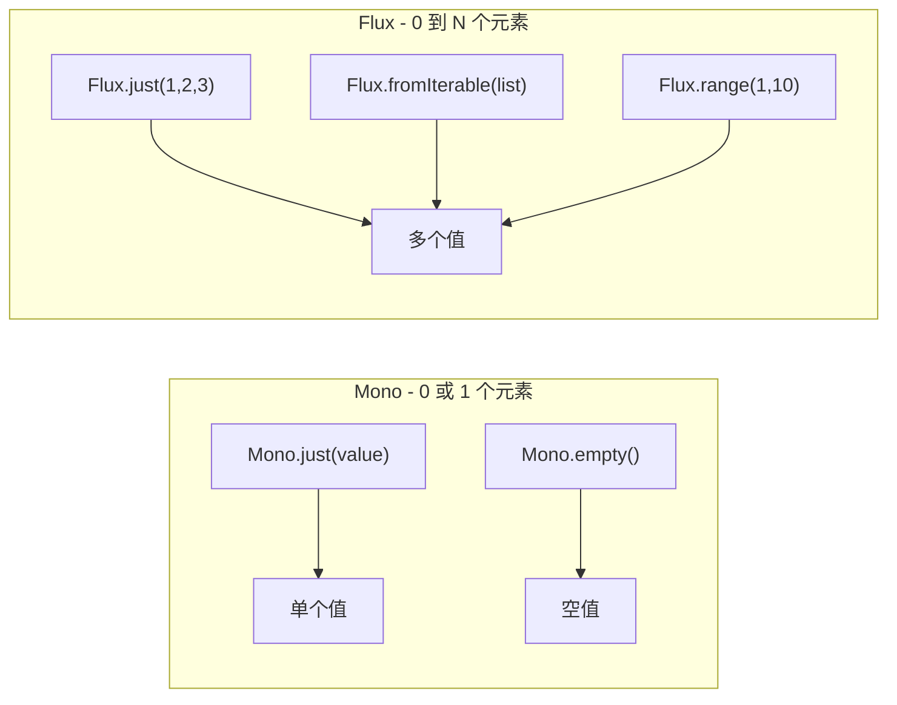

#### Mono 使用

```java
@Service
@Slf4j
public class MonoBasics {

    // 创建 Mono
    public Mono<String> createMono() {
        // 从值创建
        Mono<String> mono1 = Mono.just("Hello");
        
        // 从 Supplier 创建（延迟执行）
        Mono<String> mono2 = Mono.fromSupplier(() -> {
            log.info("执行 Supplier");
            return "Hello";
        });
        
        // 空 Mono
        Mono<String> mono3 = Mono.empty();
        
        // 错误 Mono
        Mono<String> mono4 = Mono.error(new RuntimeException("错误"));
        
        // 从 Callable 创建
        Mono<String> mono5 = Mono.fromCallable(() -> "Hello");
        
        return mono1;
    }

    // Mono 操作符
    public Mono<String> monoOperators() {
        return Mono.just("hello")
            .map(String::toUpperCase)           // 转换
            .flatMap(this::appendWorld)         // 扁平映射
            .filter(s -> s.length() > 5)        // 过滤
            .defaultIfEmpty("默认值")            // 空值默认
            .switchIfEmpty(Mono.just("替代值")); // 空值替代
    }

    // Mono 错误处理
    public Mono<String> monoErrorHandling() {
        return Mono.just("hello")
            .map(s -> {
                if (s.equals("error")) {
                    throw new RuntimeException("错误");
                }
                return s.toUpperCase();
            })
            .onErrorReturn("错误默认值")                    // 发生错误返回默认值
            .onErrorResume(e -> Mono.just("降级值"))        // 发生错误执行降级逻辑
            .doOnError(e -> log.error("发生错误", e))       // 错误副作用
            .doOnSuccess(s -> log.info("成功: {}", s));     // 成功副作用
    }

    private Mono<String> appendWorld(String s) {
        return Mono.just(s + " World");
    }
}
```

#### Flux 使用

```java
@Service
@Slf4j
public class FluxBasics {

    // 创建 Flux
    public Flux<Integer> createFlux() {
        // 从值创建
        Flux<Integer> flux1 = Flux.just(1, 2, 3, 4, 5);
        
        // 从集合创建
        Flux<Integer> flux2 = Flux.fromIterable(Arrays.asList(1, 2, 3));
        
        // 从范围创建
        Flux<Integer> flux3 = Flux.range(1, 10);
        
        // 从 Stream 创建
        Flux<Integer> flux4 = Flux.fromStream(Stream.of(1, 2, 3));
        
        // 空 Flux
        Flux<Integer> flux5 = Flux.empty();
        
        // 无限 Flux（需要 take 限制）
        Flux<Long> flux6 = Flux.interval(Duration.ofSeconds(1)).take(5);
        
        return flux1;
    }

    // Flux 操作符
    public Flux<String> fluxOperators() {
        return Flux.just("a", "b", "c", "d", "e")
            .map(String::toUpperCase)              // 转换
            .filter(s -> !s.equals("C"))            // 过滤
            .take(3)                                // 取前 3 个
            .skip(1)                                // 跳过第 1 个
            .distinct()                             // 去重
            .sort()                                 // 排序
            .concatWith(Flux.just("F", "G"))        // 连接
            .zipWith(Flux.just(1, 2, 3), (s, i) -> s + i);  // 组合
    }

    // Flux 背压处理
    public Flux<Integer> backpressureExample() {
        return Flux.range(1, 1000)
            .onBackpressureBuffer(100)              // 缓冲
            .onBackpressureDrop(i -> log.info("丢弃: {}", i))  // 丢弃
            .onBackpressureLatest();                // 只保留最新
    }

    // Flux 并行处理
    public Flux<String> parallelProcessing() {
        return Flux.just("a", "b", "c", "d", "e")
            .parallel()
            .runOn(Schedulers.parallel())
            .map(this::processItem)
            .sequential();
    }

    private String processItem(String item) {
        sleep(100);
        log.info("处理: {}, 线程: {}", item, Thread.currentThread().getName());
        return item.toUpperCase();
    }

    private void sleep(long millis) {
        try {
            Thread.sleep(millis);
        } catch (InterruptedException e) {
            Thread.currentThread().interrupt();
        }
    }
}
```

### 6.2 响应式数据库访问

```java
// 使用 R2DBC 进行响应式数据库访问
@Configuration
public class R2dbcConfig {

    @Bean
    public ConnectionFactory connectionFactory() {
        return ConnectionFactories.get(
            "r2dbc:mysql://localhost:3306/mydb?user=root&password=password"
        );
    }

    @Bean
    public R2dbcEntityTemplate r2dbcEntityTemplate(ConnectionFactory connectionFactory) {
        return new R2dbcEntityTemplate(connectionFactory);
    }
}

// 响应式 Repository
public interface ReactiveUserRepository extends ReactiveCrudRepository<User, Long> {
    Flux<User> findByStatus(String status);
    Mono<User> findByEmail(String email);
    Flux<User> findByAgeGreaterThan(Integer age);
}

// 响应式 Service
@Service
@Slf4j
@RequiredArgsConstructor
public class ReactiveUserService {

    private final ReactiveUserRepository userRepository;

    // 查询所有用户
    public Flux<User> findAllUsers() {
        return userRepository.findAll()
            .doOnNext(user -> log.info("查询到用户: {}", user.getName()));
    }

    // 根据条件查询
    public Flux<User> findActiveUsers() {
        return userRepository.findByStatus("ACTIVE")
            .filter(user -> user.getAge() > 18);
    }

    // 保存用户
    public Mono<User> saveUser(User user) {
        return userRepository.save(user)
            .doOnSuccess(saved -> log.info("保存用户成功: {}", saved.getId()));
    }

    // 批量保存
    public Flux<User> saveAllUsers(List<User> users) {
        return userRepository.saveAll(users);
    }

    // 事务操作
    @Transactional
    public Mono<User> createUserWithOrders(User user, List<Order> orders) {
        return userRepository.save(user)
            .flatMap(savedUser -> {
                orders.forEach(order -> order.setUserId(savedUser.getId()));
                return orderRepository.saveAll(orders)
                    .then(Mono.just(savedUser));
            });
    }

    // 分页查询
    public Mono<Page<User>> findUsersPage(int page, int size) {
        Mono<List<User>> content = userRepository.findAll()
            .skip((long) page * size)
            .take(size)
            .collectList();
        
        Mono<Long> total = userRepository.count();
        
        return Mono.zip(content, total, (c, t) -> 
            new PageImpl<>(c, PageRequest.of(page, size), t));
    }
}
```

### 6.3 响应式 WebClient

```java
@Configuration
public class WebClientConfig {

    @Bean
    public WebClient webClient() {
        return WebClient.builder()
            .baseUrl("https://api.example.com")
            .defaultHeader(HttpHeaders.CONTENT_TYPE, MediaType.APPLICATION_JSON_VALUE)
            .codecs(configurer -> configurer.defaultCodecs().maxInMemorySize(16 * 1024 * 1024))
            .build();
    }
}

@Service
@Slf4j
@RequiredArgsConstructor
public class ReactiveApiService {

    private final WebClient webClient;

    // GET 请求
    public Mono<User> getUser(Long id) {
        return webClient.get()
            .uri("/users/{id}", id)
            .retrieve()
            .bodyToMono(User.class)
            .doOnSuccess(user -> log.info("获取用户: {}", user.getName()))
            .onErrorResume(e -> {
                log.error("获取用户失败: {}", e.getMessage());
                return Mono.empty();
            });
    }

    // POST 请求
    public Mono<User> createUser(User user) {
        return webClient.post()
            .uri("/users")
            .bodyValue(user)
            .retrieve()
            .bodyToMono(User.class);
    }

    // PUT 请求
    public Mono<User> updateUser(Long id, User user) {
        return webClient.put()
            .uri("/users/{id}", id)
            .bodyValue(user)
            .retrieve()
            .bodyToMono(User.class);
    }

    // DELETE 请求
    public Mono<Void> deleteUser(Long id) {
        return webClient.delete()
            .uri("/users/{id}", id)
            .retrieve()
            .bodyToMono(Void.class);
    }

    // 并行请求多个服务
    public Mono<AggregatedData> fetchAggregatedData(Long userId) {
        Mono<User> userMono = getUser(userId);
        Mono<List<Order>> ordersMono = getOrders(userId);
        Mono<List<Address>> addressesMono = getAddresses(userId);

        return Mono.zip(userMono, ordersMono, addressesMono)
            .map(tuple -> {
                AggregatedData data = new AggregatedData();
                data.setUser(tuple.getT1());
                data.setOrders(tuple.getT2());
                data.setAddresses(tuple.getT3());
                return data;
            });
    }

    // 流式请求（SSE）
    public Flux<ServerSentEvent<String>> streamEvents() {
        return webClient.get()
            .uri("/events/stream")
            .retrieve()
            .bodyToFlux(new ParameterizedTypeReference<ServerSentEvent<String>>() {});
    }

    // 带重试的请求
    public Mono<User> getUserWithRetry(Long id) {
        return webClient.get()
            .uri("/users/{id}", id)
            .retrieve()
            .bodyToMono(User.class)
            .retryWhen(Retry.backoff(3, Duration.ofSeconds(1))
                .maxBackoff(Duration.ofSeconds(10))
                .onRetryExhaustedThrow((retryBackoffSpec, retrySignal) -> 
                    retrySignal.failure()));
    }

    // 带超时的请求
    public Mono<User> getUserWithTimeout(Long id) {
        return webClient.get()
            .uri("/users/{id}", id)
            .retrieve()
            .bodyToMono(User.class)
            .timeout(Duration.ofSeconds(5))
            .onErrorResume(TimeoutException.class, e -> {
                log.warn("请求超时，使用降级数据");
                return Mono.just(getFallbackUser());
            });
    }

    private Mono<List<Order>> getOrders(Long userId) {
        return webClient.get()
            .uri("/orders?userId={userId}", userId)
            .retrieve()
            .bodyToFlux(Order.class)
            .collectList();
    }

    private Mono<List<Address>> getAddresses(Long userId) {
        return webClient.get()
            .uri("/addresses?userId={userId}", userId)
            .retrieve()
            .bodyToFlux(Address.class)
            .collectList();
    }

    private User getFallbackUser() {
        return new User();
    }
}
```

::: tip WebClient vs RestTemplate
- **WebClient**：响应式、非阻塞、支持流式处理，Spring Boot 3.x 推荐使用
- **RestTemplate**：同步阻塞、已在维护模式，不推荐新项目使用
:::

## 七、实战场景

### 7.1 定时数据同步

```java
@Component
@Slf4j
@RequiredArgsConstructor
public class DataSyncTask {

    private final SourceRepository sourceRepository;
    private final TargetRepository targetRepository;
    private final RedisTemplate<String, String> redisTemplate;

    // 全量同步：每天凌晨 2 点
    @Scheduled(cron = "0 0 2 * * ?")
    public void fullSync() {
        String lockKey = "sync:full:lock";
        Boolean acquired = redisTemplate.opsForValue()
            .setIfAbsent(lockKey, "locked", Duration.ofHours(2));

        if (!Boolean.TRUE.equals(acquired)) {
            log.info("其他节点正在执行全量同步");
            return;
        }

        try {
            log.info("开始全量同步");
            long startTime = System.currentTimeMillis();

            // 分批处理
            int batchSize = 1000;
            int offset = 0;
            int totalSynced = 0;

            while (true) {
                List<Data> batch = sourceRepository.fetchBatch(offset, batchSize);
                if (batch.isEmpty()) {
                    break;
                }

                targetRepository.batchSave(batch);
                totalSynced += batch.size();
                offset += batchSize;

                log.info("已同步 {} 条数据", totalSynced);
            }

            long duration = System.currentTimeMillis() - startTime;
            log.info("全量同步完成，共 {} 条，耗时 {} ms", totalSynced, duration);

        } finally {
            redisTemplate.delete(lockKey);
        }
    }

    // 增量同步：每 5 分钟
    @Scheduled(fixedDelay = 300000)
    public void incrementalSync() {
        String lockKey = "sync:incremental:lock";
        Boolean acquired = redisTemplate.opsForValue()
            .setIfAbsent(lockKey, "locked", Duration.ofMinutes(5));

        if (!Boolean.TRUE.equals(acquired)) {
            return;
        }

        try {
            // 获取上次同步时间
            String lastSyncTime = redisTemplate.opsForValue().get("sync:lastTime");
            LocalDateTime since = lastSyncTime != null 
                ? LocalDateTime.parse(lastSyncTime) 
                : LocalDateTime.now().minusMinutes(5);

            List<Data> changedData = sourceRepository.findByUpdateTimeAfter(since);
            targetRepository.batchSave(changedData);

            // 更新同步时间
            redisTemplate.opsForValue().set("sync:lastTime", 
                LocalDateTime.now().toString());

            log.info("增量同步完成，共 {} 条", changedData.size());

        } finally {
            redisTemplate.delete(lockKey);
        }
    }
}
```

### 7.2 异步消息发送

```java
@Service
@Slf4j
@RequiredArgsConstructor
public class AsyncMessageService {

    private final MessageQueue messageQueue;
    // 注: @Async("emailExecutor")/("smsExecutor") 的 value 是 Spring Bean 名称,
    // 需在配置类中定义同名 Bean(参考 3.5 节线程池隔离),而非 new 出来的 JDK 线程池
    private final EmailService emailService;
    private final SmsService smsService;

    // 异步发送邮件
    @Async("emailExecutor")
    public CompletableFuture<SendResult> sendEmail(EmailMessage message) {
        try {
            log.info("发送邮件到: {}", message.getTo());
            // 调用邮件服务
            emailService.send(message);
            return CompletableFuture.completedFuture(SendResult.success());
        } catch (Exception e) {
            log.error("邮件发送失败", e);
            return CompletableFuture.completedFuture(SendResult.fail(e.getMessage()));
        }
    }

    // 异步发送短信
    @Async("smsExecutor")
    public CompletableFuture<SendResult> sendSms(SmsMessage message) {
        try {
            log.info("发送短信到: {}", message.getPhone());
            smsService.send(message);
            return CompletableFuture.completedFuture(SendResult.success());
        } catch (Exception e) {
            log.error("短信发送失败", e);
            return CompletableFuture.completedFuture(SendResult.fail(e.getMessage()));
        }
    }

    // 批量发送消息
    public CompletableFuture<BatchResult> sendBatch(List<Message> messages) {
        List<CompletableFuture<SendResult>> futures = messages.stream()
            .map(msg -> {
                if (msg instanceof EmailMessage email) {
                    return sendEmail(email);
                } else if (msg instanceof SmsMessage sms) {
                    return sendSms(sms);
                }
                return CompletableFuture.completedFuture(SendResult.fail("未知消息类型"));
            })
            .collect(Collectors.toList());

        return CompletableFuture.allOf(futures.toArray(new CompletableFuture[0]))
            .thenApply(v -> {
                List<SendResult> results = futures.stream()
                    .map(CompletableFuture::join)
                    .collect(Collectors.toList());
                
                int success = (int) results.stream().filter(SendResult::isSuccess).count();
                int fail = results.size() - success;
                
                return new BatchResult(success, fail, results);
            });
    }

    // 带重试的消息发送
    public CompletableFuture<SendResult> sendWithRetry(Message message, int maxRetries) {
        return sendWithRetryInternal(message, maxRetries, 0);
    }

    private CompletableFuture<SendResult> sendWithRetryInternal(Message message, 
            int maxRetries, int currentRetry) {
        CompletableFuture<SendResult> future;
        
        if (message instanceof EmailMessage email) {
            future = sendEmail(email);
        } else {
            future = CompletableFuture.completedFuture(SendResult.fail("未知消息类型"));
        }

        return future.thenCompose(result -> {
            if (result.isSuccess() || currentRetry >= maxRetries) {
                return CompletableFuture.completedFuture(result);
            }
            log.warn("发送失败，第 {} 次重试", currentRetry + 1);
            return sendWithRetryInternal(message, maxRetries, currentRetry + 1);
        });
    }
}
```

### 7.3 批量任务处理

```java
@Service
@Slf4j
@RequiredArgsConstructor
public class BatchTaskService {

    private final DataRepository dataRepository;
    private final ProcessService processService;

    // 并行批量处理
    public BatchProcessResult processBatch(List<Long> ids) {
        long startTime = System.currentTimeMillis();

        // 使用虚拟线程并行处理
        try (ExecutorService executor = Executors.newVirtualThreadPerTaskExecutor()) {
            List<Future<ProcessResult>> futures = ids.stream()
                .map(id -> executor.submit(() -> processService.process(id)))
                .collect(Collectors.toList());

            List<ProcessResult> results = new ArrayList<>();
            int success = 0;
            int fail = 0;

            for (Future<ProcessResult> future : futures) {
                try {
                    ProcessResult result = future.get();
                    results.add(result);
                    if (result.isSuccess()) {
                        success++;
                    } else {
                        fail++;
                    }
                } catch (Exception e) {
                    fail++;
                    results.add(ProcessResult.fail(e.getMessage()));
                }
            }

            long duration = System.currentTimeMillis() - startTime;
            return new BatchProcessResult(success, fail, duration, results);
        }
    }

    // 分片批量处理（适用于大数据量）
    public void processLargeBatch(List<Long> ids, int chunkSize) {
        // 分片
        List<List<Long>> chunks = Lists.partition(ids, chunkSize);

        // 并行处理每个分片
        chunks.parallelStream().forEach(chunk -> {
            log.info("处理分片，大小: {}", chunk.size());
            chunk.forEach(id -> {
                try {
                    processService.process(id);
                } catch (Exception e) {
                    log.error("处理失败: {}", id, e);
                }
            });
        });
    }

    // 带进度跟踪的批量处理
    public CompletableFuture<BatchProcessResult> processWithProgress(List<Long> ids, 
            Consumer<Integer> progressCallback) {
        AtomicInteger processed = new AtomicInteger(0);
        int total = ids.size();

        List<CompletableFuture<ProcessResult>> futures = ids.stream()
            .map(id -> CompletableFuture.supplyAsync(() -> {
                ProcessResult result = processService.process(id);
                int current = processed.incrementAndGet();
                progressCallback.accept((current * 100) / total);
                return result;
            }))
            .collect(Collectors.toList());

        return CompletableFuture.allOf(futures.toArray(new CompletableFuture[0]))
            .thenApply(v -> {
                List<ProcessResult> results = futures.stream()
                    .map(CompletableFuture::join)
                    .collect(Collectors.toList());
                
                int success = (int) results.stream().filter(ProcessResult::isSuccess).count();
                return new BatchProcessResult(success, total - success, 0, results);
            });
    }
}
```

### 7.4 限流任务

```java
@Component
@Slf4j
@RequiredArgsConstructor
public class RateLimitedTask {

    private final RateLimiter rateLimiter = RateLimiter.create(10.0);  // 每秒 10 个
    private final Semaphore semaphore = new Semaphore(5);  // 最大并发 5 个

    // 使用 Guava RateLimiter 限流
    @Scheduled(fixedRate = 100)
    public void rateLimitedTask() {
        if (rateLimiter.tryAcquire()) {
            doTask();
        } else {
            log.debug("限流中，跳过本次执行");
        }
    }

    // 使用 Semaphore 控制并发
    public void concurrencyLimitedTask() {
        try {
            semaphore.acquire();
            doTask();
        } catch (InterruptedException e) {
            Thread.currentThread().interrupt();
        } finally {
            semaphore.release();
        }
    }

    // 使用 Redis 限流（分布式场景）
    public boolean tryAcquireFromRedis(String key, int limit, int period) {
        String script = """
            local current = redis.call('incr', KEYS[1])
            if current == 1 then
                redis.call('expire', KEYS[1], ARGV[1])
            end
            return current <= ARGV[2] and 1 or 0
            """;
        
        Long result = redisTemplate.execute(
            new DefaultRedisScript<>(script, Long.class),
            Collections.singletonList(key),
            String.valueOf(period),
            String.valueOf(limit)
        );
        
        return result != null && result == 1;
    }

    // 分布式限流任务
    @Scheduled(fixedRate = 1000)
    public void distributedRateLimitedTask() {
        String key = "rate_limit:task:" + LocalDate.now();
        
        if (tryAcquireFromRedis(key, 100, 60)) {  // 每分钟最多 100 次
            doTask();
        } else {
            log.debug("分布式限流中，跳过本次执行");
        }
    }

    private void doTask() {
        // 任务逻辑
    }
}
```

## 八、面试要点

### 1. @Scheduled 默认是单线程还是多线程？

**答案：** 默认单线程。所有 @Scheduled 方法共享同一个线程（`scheduling-1`），一个任务阻塞会延迟其他任务。生产环境必须通过 `TaskScheduler` 配置线程池。

**追问：** 如何配置多线程？

```java
@Bean
public TaskScheduler taskScheduler() {
    ThreadPoolTaskScheduler scheduler = new ThreadPoolTaskScheduler();
    scheduler.setPoolSize(10);
    scheduler.setThreadNamePrefix("scheduled-");
    return scheduler;
}
```

### 2. fixedRate 和 fixedDelay 的区别？

**答案：**
- **fixedRate**：固定频率，从任务开始时刻计算下次执行时间。任务可能重叠。
- **fixedDelay**：固定延迟，从任务完成时刻计算下次执行时间。任务不会重叠。

### 3. @Async 如何处理异常？

**答案：**
- **void 返回值**：异常无法传播，需实现 `AsyncUncaughtExceptionHandler` 全局处理
- **CompletableFuture 返回值**：通过 `exceptionally()` 或 `handle()` 处理

### 4. @Async 失效的场景有哪些？

**答案：**
1. 同类内部调用（`this.method()`）
2. 方法非 public
3. 未加 `@EnableAsync`
4. 在 Filter/Interceptor 中调用
5. 在构造函数中调用
6. 类未被 Spring 管理

### 5. 虚拟线程与平台线程的区别？

**答案：**
| 特性 | 平台线程 | 虚拟线程 |
|------|----------|----------|
| 创建成本 | 高（~1MB） | 极低（~1KB） |
| 最大数量 | 数千 | 百万级 |
| 调度方式 | 操作系统 | JVM |
| 阻塞行为 | 占用线程 | 自动让出载体线程 |
| 适用场景 | CPU 密集型 | I/O 密集型 |

### 6. XXL-JOB 的路由策略有哪些？

**答案：**
- FIRST/LAST：选择第一个/最后一个执行器
- ROUND：轮询
- RANDOM：随机
- CONSISTENT_HASH：一致性哈希
- FAILOVER：故障转移
- SHARDING_BROADCAST：分片广播

### 7. CompletableFuture 的 allOf 和 anyOf 区别？

**答案：**
- **allOf**：等待所有任务完成，适合需要汇总所有结果的场景
- **anyOf**：任一任务完成即返回，适合竞速场景

### 8. 如何实现分布式定时任务？

**答案：**
1. **简单方案**：@Scheduled + Redis 分布式锁
2. **专业方案**：XXL-JOB、Elastic-Job、Quartz 集群模式

### 9. WebFlux 的 Mono 和 Flux 区别？

**答案：**
- **Mono**：表示 0 或 1 个元素的异步序列
- **Flux**：表示 0 到 N 个元素的异步序列

### 10. 如何保证定时任务的幂等性？

**答案：**
1. 使用分布式锁确保同一时刻只有一个节点执行
2. 任务逻辑设计为幂等（多次执行结果相同）
3. 使用唯一标识（如日期+任务名）记录已执行的任务
4. 数据库层面使用唯一约束防止重复数据

> 相关文档：[07-性能优化](07-性能优化.md) · [23-Bean生命周期与循环依赖源码](23-Bean生命周期与循环依赖源码.md) · [15-缓存抽象与Redis深度实践](15-缓存抽象与Redis深度实践.md)

## 版本差异(旧版 → Spring Boot 3.5.x)

| 特性 | 旧版(Spring Boot 2.x) | Spring Boot 3.5.x |
|------|----------------------|-------------------|
| 异步执行 | @Async + ThreadPoolTaskExecutor | 不变；可启用虚拟线程执行器 |
| 定时任务 | @Scheduled + 单线程调度器 | 不变；`spring.task.scheduling.virtual.enabled`（3.2+） |
| 虚拟线程 | 不支持 | `spring.threads.virtual.enabled=true` 启用 |
| 调度器 keep-alive | 无 | 虚拟线程为 daemon，需 keep-alive 保持存活 |
| 分布式调度 | 手动/xxl-job | 不变；xxl-job 兼容 Boot 3.x |

> **虚拟线程 + 定时任务注意**：虚拟线程是守护线程，仅启用虚拟线程时 `@Scheduled` 任务可能不执行，需同时设置 `spring.task.scheduling.virtual.enabled=true` 并确保调度线程 keep-alive。
