# Docker 容器化部署

## 概述

Docker 容器化是现代 Spring Boot 应用部署的标准方式。本篇覆盖从构建镜像到生产部署的完整链路，包括 Dockerfile 编写、多阶段构建、Docker Compose 编排、Kubernetes 部署等。

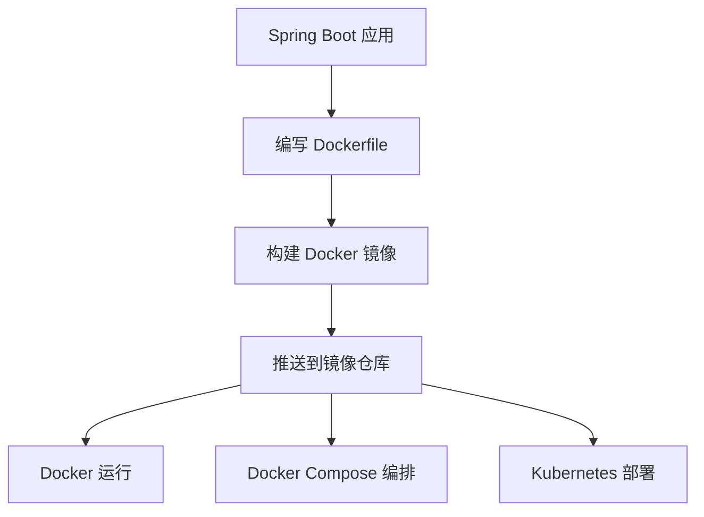

## Docker 基础回顾

### 什么是 Docker？

Docker 是一个开源的容器化平台，它允许开发者将应用程序及其依赖项打包到一个轻量级、可移植的容器中。容器与宿主机共享操作系统内核，但彼此隔离，比传统虚拟机更轻量、启动更快。

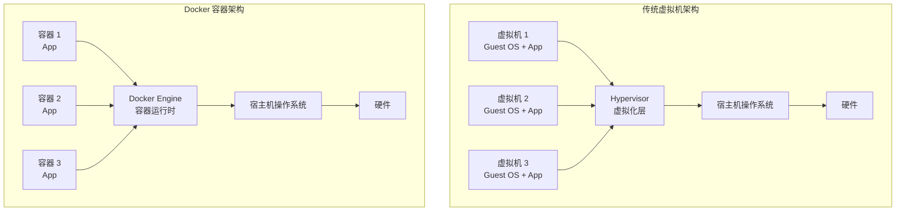

::: tip 容器 vs 虚拟机
| 特性 | 容器 | 虚拟机 |
|------|------|--------|
| 启动时间 | 秒级 | 分钟级 |
| 资源占用 | MB 级 | GB 级 |
| 隔离级别 | 进程级 | 操作系统级 |
| 性能损耗 | 接近原生 | 5-15% |
| 可移植性 | 极高 | 较低 |
:::

### 核心概念

#### 镜像（Image）

镜像是一个只读模板，包含创建容器所需的所有内容：代码、运行时、库、环境变量和配置文件。镜像是分层的，每一层都是只读的，只有最上层（容器层）可写。

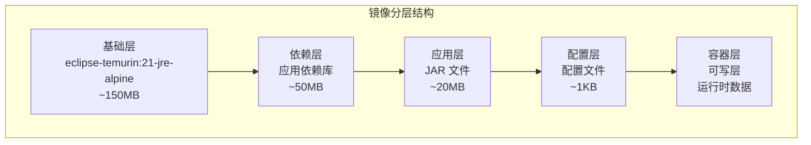

#### 容器（Container）

容器是镜像的运行实例。每个容器都是相互隔离的、安全的沙箱环境。容器可以被创建、启动、停止、删除和暂停。

```bash
# 容器生命周期管理
docker create myapp:1.0           # 创建容器（不启动）
docker start container_id         # 启动已创建的容器
docker run myapp:1.0              # 创建并启动容器（最常用）
docker stop container_id          # 优雅停止容器（发送 SIGTERM）
docker kill container_id          # 强制停止容器（发送 SIGKILL）
docker rm container_id            # 删除已停止的容器
docker pause container_id         # 暂停容器
docker unpause container_id       # 恢复容器
```

#### 仓库（Registry）

仓库是存储和分发镜像的地方。Docker Hub 是最大的公共仓库，企业通常使用私有仓库（如 Harbor、Nexus）。

```bash
# 镜像仓库操作
docker pull eclipse-temurin:21-jre-alpine     # 从仓库拉取镜像
docker push registry.example.com/myapp:1.0    # 推送镜像到仓库
docker search 11-Nginx基础概述                           # 搜索公共镜像
docker login registry.example.com             # 登录私有仓库
docker logout registry.example.com            # 登出仓库
```

### Dockerfile 指令详解

Dockerfile 是一个文本文件，包含构建镜像所需的所有指令。下面详细介绍每个指令的用法。

#### FROM — 指定基础镜像

```dockerfile
# FROM <镜像名>[:<标签>] [AS <别名>]
FROM eclipse-temurin:21-jre-alpine

# 使用多阶段构建时，可以为阶段命名
FROM eclipse-temurin:21-jdk-alpine AS builder
```

::: warning 基础镜像选择原则
1. **优先选择官方镜像**：如 `eclipse-temurin`、`openjdk`
2. **优先选择 Alpine 变体**：体积更小（`-alpine` 后缀）
3. **明确指定版本标签**：避免使用 `latest`，确保构建可重复
4. **考虑安全更新**：定期更新基础镜像版本
:::

#### LABEL — 添加元数据

```dockerfile
# LABEL <键>=<值> <键>=<值> ...
LABEL maintainer="dev@example.com"
LABEL version="1.0.0"
LABEL description="Spring Boot 应用镜像"
LABEL org.opencontainers.image.source="https://github.com/example/myapp"
```

#### WORKDIR — 设置工作目录

```dockerfile
# WORKDIR <路径>
WORKDIR /app                    # 创建并切换到 /app 目录

# 后续指令都在 /app 下执行
COPY target/myapp.jar app.jar   # 复制到 /app/app.jar
```

::: tip WORKDIR vs RUN cd
`WORKDIR` 会自动创建目录并切换，推荐使用 `WORKDIR` 而不是 `RUN cd`，因为 `WORKDIR` 会在后续层中持久生效。
:::

#### COPY 和 ADD — 复制文件

```dockerfile
# COPY <源路径>... <目标路径>
COPY target/myapp.jar /app/app.jar
COPY src/main/resources/ /app/config/

# ADD 可以自动解压 tar 文件
ADD archive.tar.gz /app/        # 自动解压到 /app/

# ADD 可以从 URL 下载文件（不推荐，应使用 RUN curl/wget）
ADD https://example.com/file.txt /app/
```

::: danger COPY vs ADD
- **优先使用 COPY**：语义更清晰，只做文件复制
- **仅在需要解压 tar 时使用 ADD**：自动解压是 ADD 的唯一额外功能
- **避免使用 ADD 从 URL 下载**：不可缓存、不可重试，应使用 `RUN curl` 或 `RUN wget`
:::

#### RUN — 执行命令

```dockerfile
# RUN <命令>（shell 形式）
RUN apk add --no-cache curl

# RUN ["可执行文件", "参数1", "参数2"]（exec 形式）
RUN ["/bin/sh", "-c", "apk add --no-cache curl"]

# 合并多个 RUN 指令减少层数
RUN apk add --no-cache \
        curl \
        wget \
        bash && \
    rm -rf /var/cache/apk/*
```

::: tip 减少镜像层数
每个 `RUN`、`COPY`、`ADD` 指令都会创建新的镜像层。合并相关命令可以减少层数，减小镜像体积：

```dockerfile
# 不推荐：多层
RUN apk add --no-cache curl
RUN apk add --no-cache wget
RUN apk add --no-cache bash

# 推荐：单层
RUN apk add --no-cache curl wget bash
```
:::

#### ENV — 设置环境变量

```dockerfile
# ENV <键>=<值>
ENV JAVA_OPTS="-Xms256m -Xmx512m"
ENV APP_VERSION=1.0.0
ENV PATH="/app/bin:$PATH"

# 在后续指令和运行时都可以使用
RUN echo $APP_VERSION
ENTRYPOINT ["java", "-jar", "app.jar"]
```

#### ARG — 构建参数

```dockerfile
# ARG <参数名>[=<默认值>]
ARG JAR_FILE=target/myapp.jar
ARG BUILD_VERSION=1.0.0

# ARG 只在构建时有效，不会保留在最终镜像中
COPY ${JAR_FILE} app.jar

# 可以在构建时覆盖
# docker build --build-arg JAR_FILE=build/myapp.jar --build-arg BUILD_VERSION=2.0.0 .
```

::: tip ENV vs ARG
| 特性 | ENV | ARG |
|------|-----|-----|
| 作用范围 | 构建时 + 运行时 | 仅构建时 |
| 可在运行时访问 | 是 | 否 |
| 可被 docker run 覆盖 | 是（-e 参数） | 否 |
| 可被 docker build 覆盖 | 否 | 是（--build-arg 参数） |
:::

#### EXPOSE — 声明端口

```dockerfile
# EXPOSE <端口> [<端口>/<协议>]
EXPOSE 8080
EXPOSE 8443/tcp
EXPOSE 5000/udp

# EXPOSE 只是声明，不会实际发布端口
# 需要在 docker run -p 或 docker-compose 中映射
```

#### HEALTHCHECK — 健康检查

```dockerfile
# HEALTHCHECK [选项] CMD <命令>
HEALTHCHECK --interval=30s \
            --timeout=3s \
            --start-period=40s \
            --retries=3 \
            CMD wget -qO- http://localhost:8080/actuator/health || exit 1

# 禁用继承的健康检查
HEALTHCHECK NONE
```

健康检查选项说明：
- `--interval`：检查间隔，默认 30s
- `--timeout`：超时时间，默认 30s
- `--start-period`：启动等待期，默认 0s
- `--retries`：连续失败次数，默认 3

#### ENTRYPOINT 和 CMD — 启动命令

```dockerfile
# ENTRYPOINT ["可执行文件", "参数1", "参数2"]（exec 形式，推荐）
ENTRYPOINT ["java", "-jar", "app.jar"]

# CMD ["参数1", "参数2"]（作为 ENTRYPOINT 的默认参数）
ENTRYPOINT ["java", "-jar"]
CMD ["app.jar"]

# CMD <命令>（shell 形式）
CMD java -jar app.jar

# CMD 可以被 docker run 后面的参数覆盖
# docker run myapp:1.0 --server.port=9090
```

::: danger ENTRYPOINT vs CMD
- **ENTRYPOINT**：固定命令，`docker run` 的参数会追加到后面
- **CMD**：默认参数，会被 `docker run` 后面的参数完全覆盖
- **推荐使用 exec 形式**：`["java", "-jar"]` 而不是 `java -jar`，因为 exec 形式能正确接收信号（如 SIGTERM）

```dockerfile
# 推荐写法：ENTRYPOINT 固定命令，CMD 提供默认参数
ENTRYPOINT ["java", "-Xms256m", "-Xmx512m", "-jar"]
CMD ["app.jar"]

# 运行时可以覆盖 CMD
# docker run myapp:1.0 app-prod.jar --spring.profiles.active=prod
```
:::

#### USER — 指定运行用户

```dockerfile
# 创建非 root 用户
RUN addgroup -S appgroup && \
    adduser -S appuser -G appgroup

# 切换用户
USER appuser

# 后续指令和容器运行时都使用该用户
COPY --chown=appuser:appgroup target/myapp.jar app.jar
```

::: warning 安全实践：非 root 用户运行
默认情况下，容器以 root 用户运行，这存在安全风险。如果容器被攻破，攻击者可能获得宿主机的 root 权限。**生产环境必须使用非 root 用户运行容器**。
:::

#### VOLUME — 定义数据卷

```dockerfile
# VOLUME ["路径1", "路径2"]
VOLUME ["/app/logs", "/app/data"]

# 匿名卷在 docker rm -v 删除容器时才会一并清理，否则会成为悬空卷
# 可以在 docker run -v 或 docker-compose 中挂载命名卷
```

### 镜像层原理

Docker 镜像采用分层存储，每一层都是只读的。构建镜像时，每个指令创建一个新层，这些层堆叠在一起形成最终镜像。

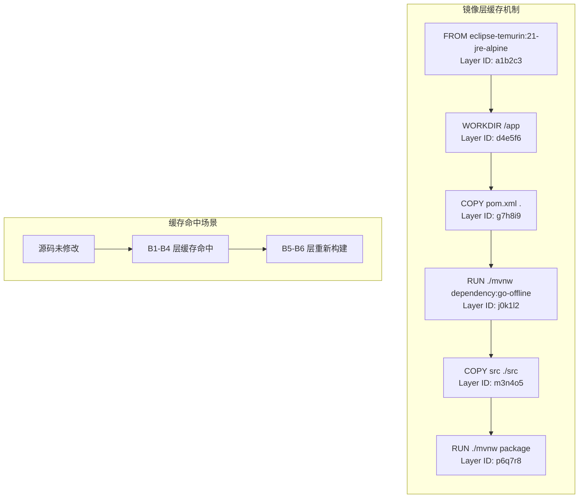

::: tip 镜像层缓存优化
Docker 构建时会检查每层的缓存。如果某层未变化，则使用缓存；一旦某层变化，后续所有层都需要重新构建。

**优化策略**：
1. **变化少的指令放前面**：如安装依赖、配置环境
2. **变化多的指令放后面**：如复制源码、编译
3. **利用多阶段构建**：避免构建工具进入最终镜像

```dockerfile
# 优化前：每次修改源码都重新下载依赖
COPY . /app
RUN ./mvnw package

# 优化后：依赖层可缓存
COPY pom.xml .
RUN ./mvnw dependency:go-offline    # 依赖不变则缓存命中
COPY src ./src
RUN ./mvnw package                   # 仅重新编译
```
:::

## Dockerfile 编写

### 基础版 Dockerfile

```dockerfile
# 使用 Eclipse Temurin JDK 21 作为基础镜像
FROM eclipse-temurin:21-jre-alpine

# 维护者信息
LABEL maintainer="dev@example.com"

# 设置工作目录
WORKDIR /app

# 复制 JAR 文件
COPY target/myapp-1.0.0.jar app.jar

# 暴露端口
EXPOSE 8080

# 健康检查
HEALTHCHECK --interval=30s --timeout=3s --start-period=40s --retries=3 \
  CMD wget -qO- http://localhost:8080/actuator/health || exit 1

# 启动命令
ENTRYPOINT ["java", "-jar", "app.jar"]
```

### 多阶段构建（推荐）

```dockerfile
# 阶段1：构建
FROM eclipse-temurin:21-jdk-alpine AS builder
WORKDIR /build
COPY pom.xml .
COPY src ./src
# 使用 Maven Wrapper 构建
COPY .mvn ./.mvn
COPY mvnw .
RUN ./mvnw clean package -DskipTests

# 阶段2：运行
FROM eclipse-temurin:21-jre-alpine
WORKDIR /app

# 创建非 root 用户
RUN addgroup -S appgroup && adduser -S appuser -G appgroup

# 从构建阶段复制 JAR
COPY --from=builder /build/target/*.jar app.jar

# 修改文件所有权
RUN chown -R appuser:appgroup /app

# 切换到非 root 用户
USER appuser

EXPOSE 8080

HEALTHCHECK --interval=30s --timeout=3s --start-period=40s --retries=3 \
  CMD wget -qO- http://localhost:8080/actuator/health || exit 1

ENTRYPOINT ["java", \
  "-Xms256m", \
  "-Xmx512m", \
  "-XX:+UseG1GC", \
  "-XX:+HeapDumpOnOutOfMemoryError", \
  "-jar", "app.jar"]
```

::: tip 多阶段构建的优势
1. **镜像更小**：运行时镜像只包含 JRE + JAR，不需要 Maven 和源代码
2. **更安全**：源代码和构建工具不会出现在生产镜像中
3. **构建一致性**：在 Docker 内构建，避免本地环境差异
:::

::: danger 容器中的内存限制
Docker 通过 `--memory` 限制容器内存，但 JVM 默认堆大小是基于宿主机的（JDK 8u191 之前）。如果容器内存限制为 512MB 而 JVM 堆默认设为宿主机的 1/4（如 4GB 机器下就是 1GB），容器会被 OOM Kill。

**JDK 8u191+ / JDK 11+ 自动感知容器内存限制**，但建议显式设置 `-Xms` 和 `-Xmx`：
```bash
java -XX:MaxRAMPercentage=75.0 -jar app.jar  # 使用容器内存的 75%
```
:::

## 多阶段构建深度

### GraalVM Native Image 构建

GraalVM Native Image 可以将 Spring Boot 应用编译为原生可执行文件，启动时间从秒级降到毫秒级，内存占用大幅降低。

```dockerfile
# 阶段1：使用 GraalVM 构建原生镜像
FROM ghcr.io/graalvm/native-image-community:21 AS builder

WORKDIR /build
COPY pom.xml .
COPY src ./src
COPY .mvn ./.mvn
COPY mvnw .

# 安装 Maven
RUN microdnf install -y wget && \
    wget -q https://dlcdn.apache.org/maven/maven-3/3.9.6/binaries/apache-maven-3.9.6-bin.tar.gz && \
    tar -xzf apache-maven-3.9.6-bin.tar.gz && \
    mv apache-maven-3.9.6 /opt/maven && \
    rm apache-maven-3.9.6-bin.tar.gz

ENV PATH="/opt/maven/bin:$PATH"

# 构建原生镜像
RUN ./mvnw -Pnative package -DskipTests

# 阶段2：最小化运行镜像
FROM alpine:3.19

# 安装必要的库（Native Image 可能需要）
RUN apk add --no-cache libc6-compat libstdc++

WORKDIR /app
COPY --from=builder /build/target/myapp app

# 原生镜像不需要 JVM，直接运行
ENTRYPOINT ["./app"]
```

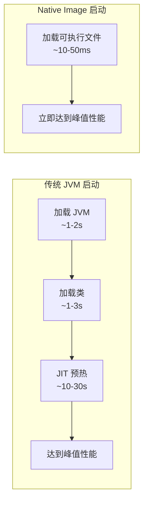

::: warning Native Image 的限制
1. **构建时间长**：首次构建可能需要几分钟
2. **动态特性受限**：反射、动态代理需要提前配置
3. **调试困难**：无法使用 Java 调试器
4. **平台相关**：需要为每个目标平台单独构建

Spring Boot 3.0+ 提供了良好的 Native Image 支持，通过 AOT（Ahead-of-Time）编译自动处理大部分配置。
:::

### JLink 定制 JRE

JLink 是 JDK 9+ 提供的工具，可以创建只包含应用所需模块的定制 JRE，大幅减小镜像体积。

```dockerfile
# 阶段1：分析依赖并创建定制 JRE
FROM eclipse-temurin:21-jdk-alpine AS jre-builder

WORKDIR /build
COPY target/myapp.jar app.jar

# 分析应用依赖的模块
RUN jdeps --ignore-missing-deps \
          -q \
          --multi-release 21 \
          --print-module-deps \
          app.jar > modules.txt

# 创建定制 JRE
RUN jlink --add-modules $(cat modules.txt) \
          --strip-debug \
          --no-man-pages \
          --no-header-files \
          --compress=2 \
          --output /custom-jre

# 阶段2：使用定制 JRE 运行
FROM alpine:3.19

WORKDIR /app
COPY --from=jre-builder /custom-jre /opt/jre
COPY --from=jre-builder /build/app.jar app.jar

# 设置 PATH
ENV PATH="/opt/jre/bin:$PATH"

EXPOSE 8080
ENTRYPOINT ["java", "-jar", "app.jar"]
```

```bash
# 查看完整 JDK 模块列表
java --list-modules

# 查看应用依赖的模块
jdeps --module-path mods --multi-release 21 --print-module-deps myapp.jar

# 典型 Spring Boot 应用依赖的模块
# java.base,java.sql,java.naming,java.desktop,java.management,
# java.security.jgss,java.instrument,java.rmi
```

::: tip JLink 效果对比
| JRE 类型 | 体积 | 说明 |
|----------|------|------|
| 完整 JDK | ~300MB | 包含所有模块和工具 |
| 完整 JRE | ~150MB | 包含所有运行时模块 |
| 定制 JRE | ~40-80MB | 仅包含应用所需模块 |
:::

### 构建缓存优化

Docker BuildKit 提供了更智能的缓存机制，可以显著加速构建过程。

```dockerfile
# syntax=docker/dockerfile:1.4

FROM eclipse-temurin:21-jdk-alpine AS builder

WORKDIR /build

# 利用 BuildKit 缓存挂载
# --mount=type=cache：缓存 Maven 本地仓库
RUN --mount=type=cache,target=/root/.m2 \
    --mount=type=bind,source=pom.xml,target=pom.xml \
    ./mvnw dependency:go-offline

# 缓存编译输出
RUN --mount=type=cache,target=/root/.m2 \
    --mount=type=cache,target=/build/target \
    --mount=type=bind,source=.,target=. \
    ./mvnw package -DskipTests

FROM eclipse-temurin:21-jre-alpine
WORKDIR /app
COPY --from=builder /build/target/*.jar app.jar
ENTRYPOINT ["java", "-jar", "app.jar"]
```

```bash
# 启用 BuildKit 构建
DOCKER_BUILDKIT=1 docker build -t myapp:1.0 .

# 或在 Docker 配置中永久启用
# /etc/docker/daemon.json
{
  "features": {
    "buildkit": true
  }
}
```

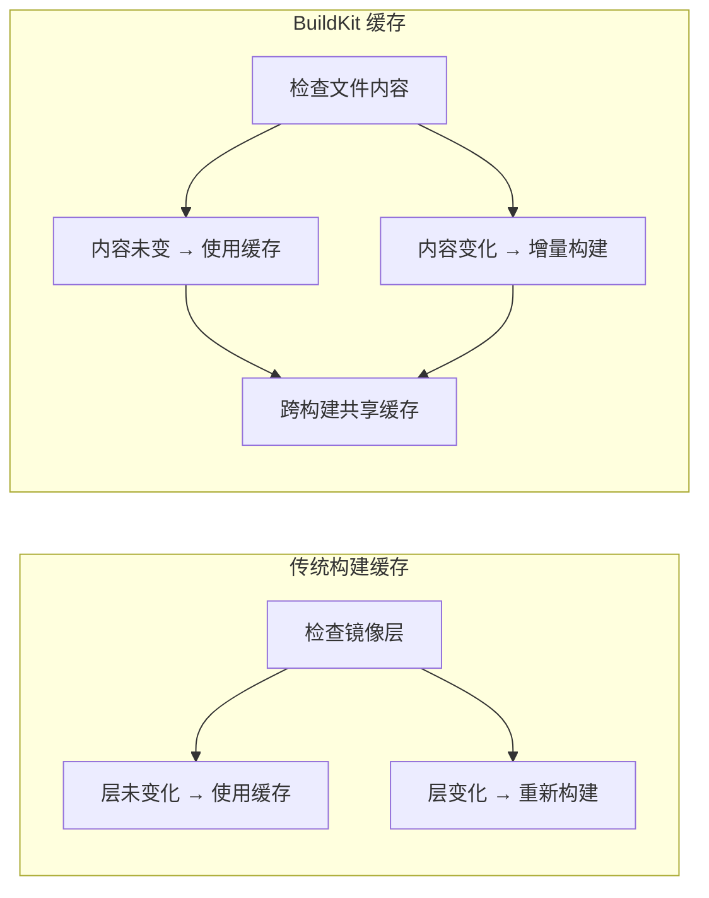

### BuildKit 高级特性

```dockerfile
# syntax=docker/dockerfile:1.4

# 多平台构建
FROM --platform=$BUILDPLATFORM eclipse-temurin:21-jdk-alpine AS builder

ARG TARGETPLATFORM
ARG BUILDPLATFORM

WORKDIR /build

# 并行构建多个阶段
FROM alpine:3.19 AS frontend-builder
COPY frontend/ .
RUN npm install && npm run build

FROM eclipse-temurin:21-jdk-alpine AS backend-builder
COPY backend/ .
RUN ./mvnw package

# 合并构建结果
FROM eclipse-temurin:21-jre-alpine
COPY --from=frontend-builder /dist /app/static
COPY --from=backend-builder /app.jar /app/app.jar

# 安全构建：不暴露密钥
RUN --mount=type=secret,id=npm_token \
    npm config set //registry.npmjs.org/:_authToken $(cat /run/secrets/npm_token)

# SSH 转发：访问私有仓库
RUN --mount=type=ssh git clone git@github.com:example/private-repo.git
```

```bash
# 使用 BuildKit 的高级特性
docker build \
  --ssh default \
  --secret id=npm_token,src=./npm_token.txt \
  --platform linux/amd64,linux/arm64 \
  -t myapp:1.0 .
```

::: tip BuildKit 优势
1. **并行构建**：多个构建阶段可以并行执行
2. **高效缓存**：基于内容而非时间戳的缓存
3. **缓存导入/导出**：可以从远程仓库导入/导出缓存
4. **安全构建**：支持 secrets 和 SSH 转发
5. **多平台构建**：一次构建多个平台的镜像
:::

## Docker Compose 编排

### 基础配置

```yaml
# docker-compose.yml
version: '3.8'

services:
  app:
    build: .
    ports:
      - "8080:8080"
    environment:
      - SPRING_PROFILES_ACTIVE=prod
      - DB_URL=jdbc:mysql://mysql:3306/mydb
      - DB_USERNAME=root
      - DB_PASSWORD=secret
      - REDIS_HOST=redis
    depends_on:
      mysql:
        condition: service_healthy
      redis:
        condition: service_started
    healthcheck:
      test: ["CMD", "wget", "-qO-", "http://localhost:8080/actuator/health"]
      interval: 30s
      timeout: 3s
      retries: 3
      start_period: 40s
    restart: unless-stopped
    deploy:
      resources:
        limits:
          memory: 512M
          cpus: '1.0'

  mysql:
    image: mysql:8.0
    environment:
      - MYSQL_ROOT_PASSWORD=secret
      - MYSQL_DATABASE=mydb
    volumes:
      - mysql-data:/var/lib/mysql
    healthcheck:
      test: ["CMD", "mysqladmin", "ping", "-h", "localhost"]
      interval: 10s
      timeout: 5s
      retries: 5

  redis:
    image: redis:7-alpine
    command: redis-server --requirepass secret
    volumes:
      - redis-data:/data

volumes:
  mysql-data:
  redis-data:
```

### 服务编排与依赖管理

```yaml
version: '3.8'

services:
  # 网关服务
  gateway:
    build: ./gateway
    ports:
      - "8080:8080"
    depends_on:
      auth-service:
        condition: service_healthy
      user-service:
        condition: service_healthy
    environment:
      - AUTH_SERVICE_URL=http://auth-service:8081
      - USER_SERVICE_URL=http://user-service:8082

  # 认证服务
  auth-service:
    build: ./auth-service
    depends_on:
      mysql:
        condition: service_healthy
      redis:
        condition: service_started
    healthcheck:
      test: ["CMD", "curl", "-f", "http://localhost:8081/actuator/health"]
      interval: 10s
      timeout: 5s
      retries: 5
      start_period: 30s

  # 用户服务
  user-service:
    build: ./user-service
    depends_on:
      mysql:
        condition: service_healthy
      mongodb:
        condition: service_started
    healthcheck:
      test: ["CMD", "curl", "-f", "http://localhost:8082/actuator/health"]
      interval: 10s
      timeout: 5s
      retries: 5

  # 基础设施服务
  mysql:
    image: mysql:8.0
    healthcheck:
      test: ["CMD", "mysqladmin", "ping", "-h", "localhost"]
      interval: 10s
      timeout: 5s
      retries: 5

  redis:
    image: redis:7-alpine
    healthcheck:
      test: ["CMD", "redis-cli", "ping"]
      interval: 10s
      timeout: 5s
      retries: 5

  mongodb:
    image: mongo:7
    healthcheck:
      test: ["CMD", "mongosh", "--eval", "db.adminCommand('ping')"]
      interval: 10s
      timeout: 5s
      retries: 5
```

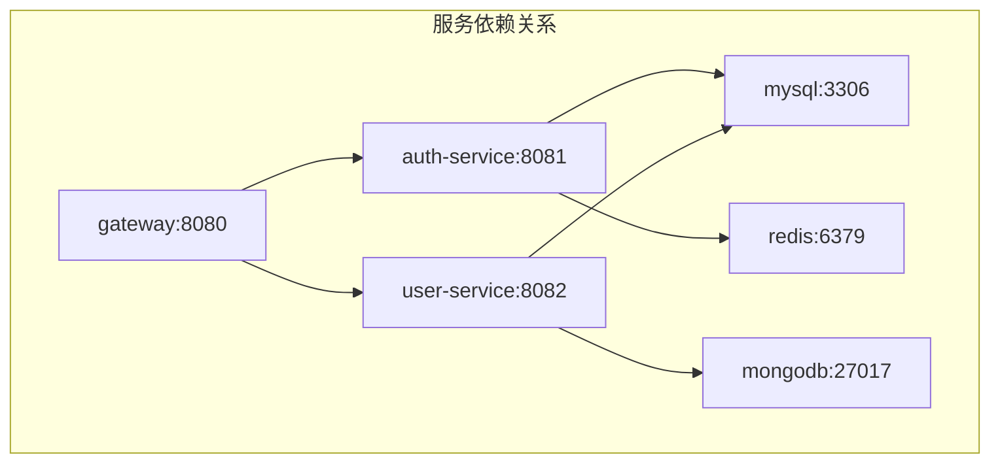

### 网络配置

```yaml
version: '3.8'

services:
  app:
    build: .
    networks:
      - frontend
      - backend
    # 可以指定静态 IP
    # networks:
    #   frontend:
    #     ipv4_address: 172.20.0.10

  mysql:
    image: mysql:8.0
    networks:
      - backend
    # 仅后端网络可访问

  11-Nginx基础概述:
    image: 11-Nginx基础概述:alpine
    ports:
      - "80:80"
    networks:
      - frontend
    # 仅前端网络可访问

networks:
  frontend:
    driver: bridge
    ipam:
      config:
        - subnet: 172.20.0.0/16
  backend:
    driver: bridge
    internal: true  # 内部网络，无法访问外网
    ipam:
      config:
        - subnet: 172.21.0.0/16
```

::: tip 网络模式选择
| 模式 | 说明 | 适用场景 |
|------|------|----------|
| bridge | 默认模式，容器间可通过服务名通信 | 大多数场景 |
| host | 容器使用宿主机网络 | 需要高性能网络 |
| none | 无网络 | 完全隔离的容器 |
| overlay | 跨主机网络 | Docker Swarm 集群 |
:::

### 数据卷管理

```yaml
version: '3.8'

services:
  app:
    build: .
    volumes:
      # 命名卷（由 Docker 管理）
      - app-data:/app/data
      - app-logs:/app/logs
      
      # 绑定挂载（映射宿主机目录）
      - ./config:/app/config:ro  # 只读挂载
      
      # 匿名卷（需 docker rm -v 或 docker compose down -v 才会随容器清理）
      - /app/tmp
      
      # tmpfs 挂载（内存文件系统）
      - type: tmpfs
        target: /app/cache
        tmpfs:
          size: 100M

  mysql:
    image: mysql:8.0
    volumes:
      - mysql-data:/var/lib/mysql
      - ./init-scripts:/docker-entrypoint-initdb.d:ro

volumes:
  app-data:
    driver: local
    driver_opts:
      type: none
      o: bind
      device: /data/app
  
  app-logs:
    driver: local
    
  mysql-data:
    driver: local
```

```bash
# 数据卷操作命令
docker volume ls                          # 列出所有卷
docker volume inspect app-data            # 查看卷详情
docker volume create my-volume            # 创建卷
docker volume rm app-data                 # 删除卷
docker volume prune                       # 删除未使用的卷

# 备份和恢复数据卷
docker run --rm -v mysql-data:/data -v $(pwd):/backup alpine tar czf /backup/mysql-backup.tar.gz /data
docker run --rm -v mysql-data:/data -v $(pwd):/backup alpine tar xzf /backup/mysql-backup.tar.gz -C /
```

### 环境变量管理

```yaml
version: '3.8'

services:
  app:
    build: .
    environment:
      # 直接设置环境变量
      - SPRING_PROFILES_ACTIVE=prod
      - SERVER_PORT=8080
      
      # 从 .env 文件读取
      - DB_URL=${DB_URL}
      - DB_USERNAME=${DB_USERNAME}
      - DB_PASSWORD=${DB_PASSWORD}
    
    # 或使用 env_file 加载整个文件
    env_file:
      - .env.common
      - .env.prod
    
    # 覆盖命令中的环境变量
    command:
      - java
      - -Dspring.datasource.url=${DB_URL}
      - -jar
      - app.jar

  mysql:
    image: mysql:8.0
    environment:
      MYSQL_ROOT_PASSWORD: ${MYSQL_ROOT_PASSWORD:-defaultpassword}  # 带默认值
```

```bash
# .env 文件示例
DB_URL=jdbc:mysql://mysql:3306/mydb
DB_USERNAME=root
DB_PASSWORD=secret
MYSQL_ROOT_PASSWORD=rootpassword
REDIS_HOST=redis
```

::: warning 敏感信息处理
1. **不要在 .env 文件中存储生产密钥**：使用 Docker Secrets 或 Vault
2. **将 .env 加入 .gitignore**：避免泄露敏感信息
3. **使用环境变量覆盖**：生产环境通过 CI/CD 注入
:::

### 健康检查配置

```yaml
version: '3.8'

services:
  app:
    build: .
    healthcheck:
      # 使用 CMD 检查
      test: ["CMD", "curl", "-f", "http://localhost:8080/actuator/health"]
      # 或使用 CMD-SHELL（支持 shell 语法）
      # test: ["CMD-SHELL", "curl -f http://localhost:8080/actuator/health || exit 1"]
      
      interval: 30s       # 检查间隔
      timeout: 10s        # 超时时间
      retries: 3          # 连续失败次数
      start_period: 40s   # 启动等待期
      
    # 健康状态影响依赖服务启动
    depends_on:
      mysql:
        condition: service_healthy

  mysql:
    image: mysql:8.0
    healthcheck:
      test: ["CMD", "mysqladmin", "ping", "-h", "localhost", "-u", "root", "-p${MYSQL_ROOT_PASSWORD}"]
      interval: 10s
      timeout: 5s
      retries: 5
      start_period: 30s

  redis:
    image: redis:7-alpine
    healthcheck:
      test: ["CMD", "redis-cli", "-a", "${REDIS_PASSWORD}", "ping"]
      interval: 10s
      timeout: 5s
      retries: 5
```

### 多环境配置

```yaml
# docker-compose.yml（基础配置）
version: '3.8'

services:
  app:
    build: .
    ports:
      - "${APP_PORT:-8080}:8080"
    environment:
      - SPRING_PROFILES_ACTIVE=${SPRING_PROFILES_ACTIVE:-dev}
    volumes:
      - app-data:/app/data

volumes:
  app-data:
```

```yaml
# docker-compose.prod.yml（生产环境覆盖）
version: '3.8'

services:
  app:
    build:
      context: .
      args:
        - BUILD_ENV=production
    ports:
      - "80:8080"
    environment:
      - SPRING_PROFILES_ACTIVE=prod
      - JAVA_OPTS=-Xms512m -Xmx1g
    deploy:
      replicas: 3
      resources:
        limits:
          memory: 1G
          cpus: '2.0'
      update_config:
        parallelism: 1
        delay: 10s
        failure_action: rollback
      restart_policy:
        condition: on-failure
        max_attempts: 3
    volumes: []  # 生产环境不使用本地卷

  # 生产环境添加监控
  prometheus:
    image: prom/prometheus:latest
    volumes:
      - ./prometheus.yml:/etc/prometheus/prometheus.yml
    ports:
      - "9090:9090"

  grafana:
    image: grafana/grafana:latest
    ports:
      - "3000:3000"
```

```yaml
# docker-compose.dev.yml（开发环境覆盖）
version: '3.8'

services:
  app:
    build:
      context: .
      target: development  # 使用多阶段构建的开发阶段
    ports:
      - "8080:8080"
      - "5005:5005"  # 远程调试端口
    environment:
      - SPRING_PROFILES_ACTIVE=dev
      - JAVA_OPTS=-agentlib:jdwp=transport=dt_socket,server=y,suspend=n,address=*:5005
    volumes:
      - ./src:/app/src:ro  # 挂载源码支持热重载
      - app-data:/app/data
```

```bash
# 启动不同环境
docker-compose up                          # 默认环境
docker-compose -f docker-compose.yml -f docker-compose.prod.yml up  # 生产环境
docker-compose -f docker-compose.yml -f docker-compose.dev.yml up   # 开发环境

# 查看合并后的配置
docker-compose -f docker-compose.yml -f docker-compose.prod.yml config
```

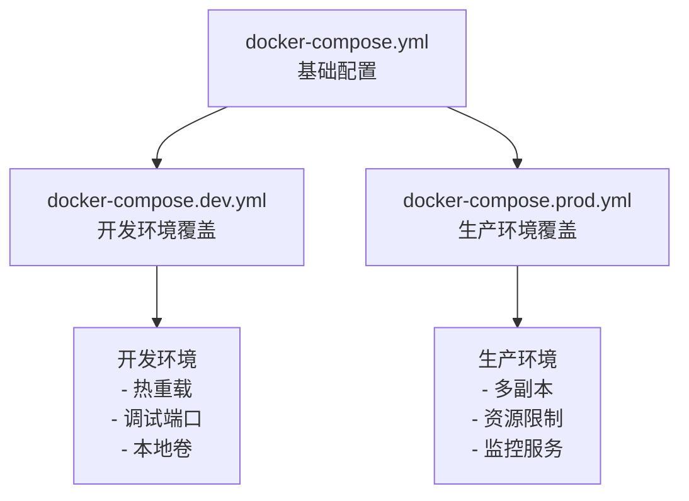

## 镜像优化

### 镜像瘦身策略

```dockerfile
# 优化前：镜像 ~500MB
FROM eclipse-temurin:21-jdk
COPY target/myapp.jar app.jar
ENTRYPOINT ["java", "-jar", "app.jar"]

# 优化后：镜像 ~180MB
FROM eclipse-temurin:21-jre-alpine
COPY target/myapp.jar app.jar
ENTRYPOINT ["java", "-jar", "app.jar"]

# 极致优化：镜像 ~80MB（使用定制 JRE）
FROM eclipse-temurin:21-jdk-alpine AS jre-builder
RUN jlink --add-modules java.base,java.sql,java.naming,java.management \
          --strip-debug --no-man-pages --no-header-files \
          --compress=2 --output /custom-jre

FROM alpine:3.19
COPY --from=jre-builder /custom-jre /opt/jre
COPY target/myapp.jar app.jar
ENV PATH="/opt/jre/bin:$PATH"
ENTRYPOINT ["java", "-jar", "app.jar"]
```

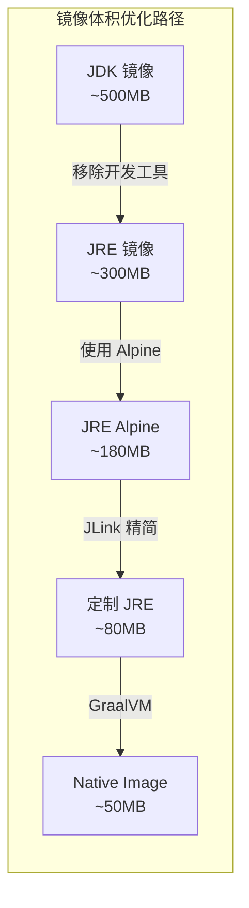

### Alpine vs Distroless vs Slim

```dockerfile
# Alpine 基础镜像（~5MB）
FROM eclipse-temurin:21-jre-alpine
# 优点：体积小、包管理器（apk）
# 缺点：使用 musl libc，可能有兼容性问题

# Distroless 基础镜像（~20MB）
FROM gcr.io/distroless/java21-debian12
# 优点：极简、安全、无 shell（攻击面小）
# 缺点：无包管理器、调试困难

# Slim 基础镜像（~150MB）
FROM eclipse-temurin:21-jre-slim
# 优点：使用 glibc、兼容性好
# 缺点：体积较大
```

::: tip 基础镜像选择建议
| 场景 | 推荐镜像 | 原因 |
|------|----------|------|
| 开发/测试 | eclipse-temurin:21-jre-alpine | 体积小、调试方便 |
| 生产环境 | gcr.io/distroless/java21 | 安全、攻击面小 |
| 需要调试工具 | eclipse-temurin:21-jre-slim | 兼容性好、工具齐全 |
| 极致性能 | GraalVM Native Image | 启动快、内存低 |
:::

### 安全扫描

```bash
# 使用 Trivy 扫描镜像漏洞
trivy image myapp:1.0

# 扫描指定严重级别的漏洞
trivy image --severity HIGH,CRITICAL myapp:1.0

# 输出 JSON 格式
trivy image --format json --output report.json myapp:1.0

# 扫描并忽略未修复的漏洞
trivy image --ignore-unfixed myapp:1.0
```

```yaml
# 在 CI/CD 中集成安全扫描
# .github/workflows/security.yml
name: Security Scan

on:
  push:
    branches: [main]
  pull_request:
    branches: [main]

jobs:
  scan:
    runs-on: ubuntu-latest
    steps:
    - uses: actions/checkout@v4
    
    - name: Build image
      run: docker build -t myapp:${{ github.sha }} .
    
    - name: Run Trivy vulnerability scanner
      uses: aquasecurity/trivy-action@master
      with:
        image-ref: 'myapp:${{ github.sha }}'
        format: 'table'
        exit-code: '1'
        ignore-unfixed: true
        severity: 'CRITICAL,HIGH'
```

```dockerfile
# 在 Dockerfile 中添加安全标签
LABEL org.opencontainers.image.authors="dev@example.com"
LABEL org.opencontainers.image.created="2024-01-01T00:00:00Z"
LABEL org.opencontainers.image.description="Spring Boot Application"
LABEL org.opencontainers.image.documentation="https://docs.example.com"
LABEL org.opencontainers.image.licenses="MIT"
LABEL org.opencontainers.image.revision="abc123"
LABEL org.opencontainers.image.source="https://github.com/example/myapp"
LABEL org.opencontainers.image.title="MyApp"
LABEL org.opencontainers.image.url="https://example.com"
LABEL org.opencontainers.image.vendor="Example Inc"
LABEL org.opencontainers.image.version="1.0.0"
```

### .dockerignore 优化

```dockerignore
# .dockerignore 文件
# 类似 .gitignore，排除不需要复制到镜像的文件

# 版本控制
.git
.gitignore
.gitattributes

# IDE 配置
.idea
.vscode
*.iml
*.ipr
*.iws

# 构建输出
target/
build/
out/
*.class
*.jar
*.war

# 日志和临时文件
*.log
*.tmp
*.swp
*~

# 测试相关
test/
tests/
*.test
*.spec.js

# 文档
*.md
docs/

# CI/CD 配置
.github/
.gitlab-ci.yml
Jenkinsfile

# Docker 相关
Dockerfile*
docker-compose*.yml
.docker/

# 环境配置
.env
.env.*
*.local

# 依赖目录（构建时会重新下载）
node_modules/
vendor/

# 操作系统文件
.DS_Store
Thumbs.db
```

::: danger .dockerignore 的重要性
1. **减小构建上下文**：避免发送不必要的文件到 Docker daemon
2. **加速构建**：减少需要处理的文件数量
3. **安全考虑**：避免将敏感文件（如 .env）复制到镜像
4. **镜像体积**：防止垃圾文件进入镜像层
:::

## Spring Boot 优雅停机

```yaml
# application.yml
server:
  shutdown: graceful  # 启用优雅停机

spring:
  lifecycle:
    timeout-per-shutdown-phase: 30s  # 停机超时时间
```

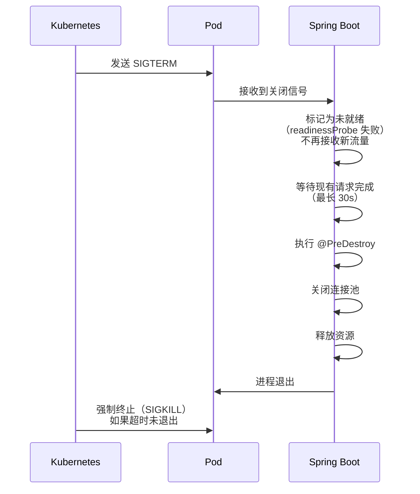

::: tip 优雅停机的关键配置
1. `server.shutdown=graceful`：允许现有请求完成
2. `spring.lifecycle.timeout-per-shutdown-phase`：最大等待时间
3. Kubernetes 的 `terminationGracePeriodSeconds` 应大于 Spring Boot 的超时时间
4. Actuator 的 readiness 探针确保流量不再路由到正在关闭的 Pod
:::

## Kubernetes 部署

### Deployment 配置

```yaml
# k8s-deployment.yaml
apiVersion: apps/v1
kind: Deployment
metadata:
  name: myapp
  labels:
    app: myapp
spec:
  replicas: 3  # 3 个副本
  selector:
    matchLabels:
      app: myapp
  template:
    metadata:
      labels:
        app: myapp
    spec:
      containers:
      - name: myapp
        image: registry.example.com/myapp:1.0.0
        ports:
        - containerPort: 8080
        env:
        - name: SPRING_PROFILES_ACTIVE
          value: "prod"
        - name: DB_URL
          valueFrom:
            secretKeyRef:
              name: db-secret
              key: url
        resources:
          requests:
            memory: "256Mi"
            cpu: "200m"
          limits:
            memory: "512Mi"
            cpu: "1000m"
        livenessProbe:
          httpGet:
            path: /actuator/health/liveness
            port: 8080
          initialDelaySeconds: 30
          periodSeconds: 10
        readinessProbe:
          httpGet:
            path: /actuator/health/readiness
            port: 8080
          initialDelaySeconds: 10
          periodSeconds: 5
      terminationGracePeriodSeconds: 60  # 优雅停机时间
```

### Service 配置

```yaml
apiVersion: v1
kind: Service
metadata:
  name: myapp-service
spec:
  selector:
    app: myapp
  ports:
  - port: 80
    targetPort: 8080
  type: ClusterIP  # 内部访问
```

### Ingress 配置

```yaml
apiVersion: networking.k8s.io/v1
kind: Ingress
metadata:
  name: myapp-ingress
  annotations:
    11-Nginx基础概述.ingress.kubernetes.io/rewrite-target: /
    11-Nginx基础概述.ingress.kubernetes.io/ssl-redirect: "true"
    cert-manager.io/cluster-issuer: "letsencrypt-prod"
spec:
  ingressClassName: 11-Nginx基础概述
  tls:
  - hosts:
    - api.example.com
    secretName: myapp-tls
  rules:
  - host: api.example.com
    http:
      paths:
      - path: /
        pathType: Prefix
        backend:
          service:
            name: myapp-service
            port:
              number: 80
```

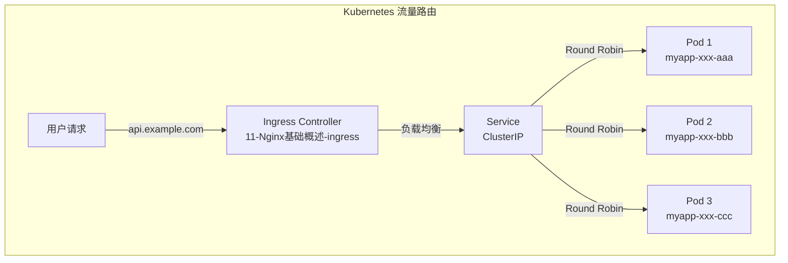

### ConfigMap 和 Secret

```yaml
# ConfigMap — 非敏感配置
apiVersion: v1
kind: ConfigMap
metadata:
  name: app-config
data:
  SPRING_PROFILES_ACTIVE: "prod"
  SERVER_PORT: "8080"
  LOGGING_LEVEL_ROOT: "INFO"

---
# Secret — 敏感配置
apiVersion: v1
kind: Secret
metadata:
  name: db-secret
type: Opaque
data:
  url: base64-encoded-jdbc-url
  username: base64-encoded-username
  password: base64-encoded-password
```

```yaml
# 在 Deployment 中使用 ConfigMap 和 Secret
apiVersion: apps/v1
kind: Deployment
metadata:
  name: myapp
spec:
  template:
    spec:
      containers:
      - name: myapp
        envFrom:
        # 从 ConfigMap 加载所有环境变量
        - configMapRef:
            name: app-config
        # 从 Secret 加载所有环境变量
        - secretRef:
            name: db-secret
        
        # 或单独引用特定键
        env:
        - name: DB_PASSWORD
          valueFrom:
            secretKeyRef:
              name: db-secret
              key: password
        
        # 挂载为文件
        volumeMounts:
        - name: config-volume
          mountPath: /app/config
          readOnly: true
      
      volumes:
      - name: config-volume
        configMap:
          name: app-config
          items:
          - key: application.yml
            path: application.yml
```

::: tip K8s 探针与 Spring Boot Actuator 的配合
- **livenessProbe** → `/actuator/health/liveness`：检测应用是否存活（死锁、OOM 等不可恢复的错误 → K8s 重启 Pod）
- **readinessProbe** → `/actuator/health/readiness`：检测应用是否就绪（数据库连接池初始化完成 → K8s 开始路由流量）
- **startupProbe** → `/actuator/health`：检测应用是否启动完成（给启动慢的应用更长的初始等待时间）

需要在 `application.yml` 中启用：
```yaml
management:
  endpoint:
    health:
      probes:
        enabled: true
  health:
    livenessstate:
      enabled: true
    readinessstate:
      enabled: true
```
:::

### HPA 自动扩缩容

```yaml
# HorizontalPodAutoscaler 配置
apiVersion: autoscaling/v2
kind: HorizontalPodAutoscaler
metadata:
  name: myapp-hpa
spec:
  scaleTargetRef:
    apiVersion: apps/v1
    kind: Deployment
    name: myapp
  minReplicas: 2
  maxReplicas: 10
  metrics:
  # 基于 CPU 使用率
  - type: Resource
    resource:
      name: cpu
      target:
        type: Utilization
        averageUtilization: 70
  
  # 基于内存使用率
  - type: Resource
    resource:
      name: memory
      target:
        type: Utilization
        averageUtilization: 80
  
  # 基于自定义指标（如请求数）
  - type: Pods
    pods:
      metric:
        name: http_requests_per_second
      target:
        type: AverageValue
        averageValue: 1000
  
  behavior:
    scaleDown:
      stabilizationWindowSeconds: 300  # 缩容稳定期
      policies:
      - type: Percent
        value: 10
        periodSeconds: 60
    scaleUp:
      stabilizationWindowSeconds: 0
      policies:
      - type: Percent
        value: 100
        periodSeconds: 15
      - type: Pods
        value: 4
        periodSeconds: 15
      selectPolicy: Max
```

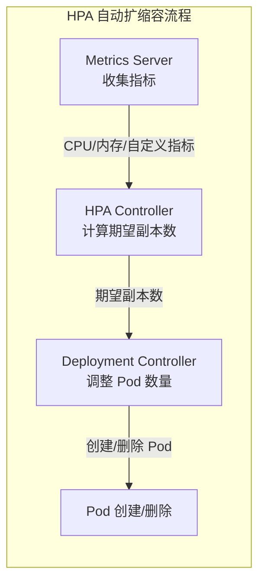

```bash
# HPA 操作命令
kubectl get hpa                          # 查看 HPA 状态
kubectl describe hpa myapp-hpa           # 查看 HPA 详情
kubectl autoscale deployment myapp --min=2 --max=10 --cpu-percent=70  # 快速创建 HPA

# 查看指标
kubectl top pods                         # 查看 Pod 资源使用
kubectl top nodes                        # 查看节点资源使用
```

### Pod 健康检查详解

```yaml
apiVersion: apps/v1
kind: Deployment
metadata:
  name: myapp
spec:
  template:
    spec:
      containers:
      - name: myapp
        image: myapp:1.0.0
        
        # 存活探针：检测死锁、OOM 等不可恢复错误
        livenessProbe:
          httpGet:
            path: /actuator/health/liveness
            port: 8080
          initialDelaySeconds: 30   # 首次检查延迟
          periodSeconds: 10         # 检查间隔
          timeoutSeconds: 5         # 超时时间
          failureThreshold: 3       # 连续失败次数
          successThreshold: 1       # 连续成功次数
        
        # 就绪探针：检测是否可以接收流量
        readinessProbe:
          httpGet:
            path: /actuator/health/readiness
            port: 8080
          initialDelaySeconds: 10
          periodSeconds: 5
          timeoutSeconds: 3
          failureThreshold: 3
          successThreshold: 1
        
        # 启动探针：给慢启动应用更长的等待时间
        startupProbe:
          httpGet:
            path: /actuator/health
            port: 8080
          initialDelaySeconds: 0
          periodSeconds: 10
          timeoutSeconds: 5
          failureThreshold: 30      # 最多等待 300s (30 * 10s)
          successThreshold: 1
```

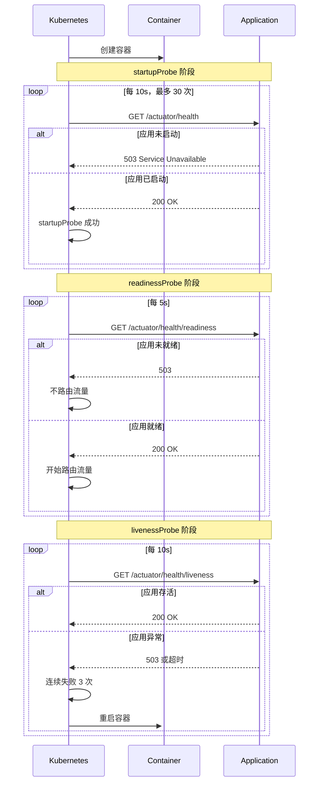

::: warning 探针配置最佳实践
1. **startupProbe**：用于慢启动应用，避免被 livenessProbe 过早重启
2. **readinessProbe**：必须配置，否则 Pod 一创建就接收流量
3. **livenessProbe**：谨慎配置，错误的配置会导致无限重启
4. **探针端点**：使用 Actuator 的专用端点，不要用业务接口
5. **超时设置**：考虑网络延迟，不要设置过短
:::

### 滚动更新策略

```yaml
apiVersion: apps/v1
kind: Deployment
metadata:
  name: myapp
spec:
  replicas: 3
  strategy:
    type: RollingUpdate
    rollingUpdate:
      maxSurge: 1           # 最多可以超出期望副本数的数量（或百分比）
      maxUnavailable: 0     # 最多不可用的副本数（或百分比）
  
  template:
    # ... pod 模板配置
```

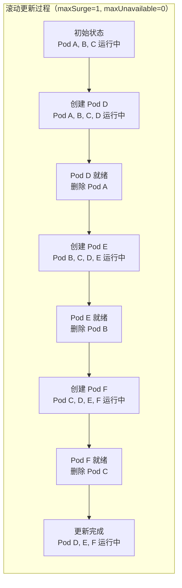

```yaml
# 金丝雀发布：通过调整副本数实现
# 版本 1：3 个副本
apiVersion: apps/v1
kind: Deployment
metadata:
  name: myapp-v1
spec:
  replicas: 3
  selector:
    matchLabels:
      app: myapp
      version: v1

---
# 版本 2：1 个副本（金丝雀）
apiVersion: apps/v1
kind: Deployment
metadata:
  name: myapp-v2
spec:
  replicas: 1
  selector:
    matchLabels:
      app: myapp
      version: v2
```

```bash
# 滚动更新命令
kubectl set image deployment/myapp myapp=myapp:2.0.0    # 更新镜像
kubectl rollout status deployment/myapp                  # 查看更新状态
kubectl rollout history deployment/myapp                 # 查看更新历史
kubectl rollout undo deployment/myapp                    # 回滚到上一版本
kubectl rollout undo deployment/myapp --to-revision=2    # 回滚到指定版本
kubectl rollout pause deployment/myapp                   # 暂停更新
kubectl rollout resume deployment/myapp                  # 恢复更新
```

## CI/CD 集成

### GitHub Actions 示例

```yaml
# .github/workflows/deploy.yml
name: Build and Deploy

on:
  push:
    branches: [main]
  pull_request:
    branches: [main]

env:
  REGISTRY: ghcr.io
  IMAGE_NAME: ${{ github.repository }}

jobs:
  build:
    runs-on: ubuntu-latest
    outputs:
      image-tag: ${{ steps.meta.outputs.tags }}
    
    steps:
    - name: Checkout code
      uses: actions/checkout@v4
    
    - name: Set up JDK 21
      uses: actions/setup-java@v4
      with:
        java-version: '21'
        distribution: 'temurin'
        cache: 'maven'
    
    - name: Build with Maven
      run: mvn clean package -DskipTests
    
    - name: Run tests
      run: mvn test
    
    - name: Set up Docker Buildx
      uses: docker/setup-buildx-action@v3
    
    - name: Login to GitHub Container Registry
      uses: docker/login-action@v3
      with:
        registry: ${{ env.REGISTRY }}
        username: ${{ github.actor }}
        password: ${{ secrets.GITHUB_TOKEN }}
    
    - name: Extract metadata for Docker
      id: meta
      uses: docker/metadata-action@v5
      with:
        images: ${{ env.REGISTRY }}/${{ env.IMAGE_NAME }}
        tags: |
          type=ref,event=branch
          type=sha,prefix=
          type=raw,value=latest,enable=${{ github.ref == 'refs/heads/main' }}
    
    - name: Build and push Docker image
      uses: docker/build-push-action@v5
      with:
        context: .
        push: ${{ github.event_name != 'pull_request' }}
        tags: ${{ steps.meta.outputs.tags }}
        labels: ${{ steps.meta.outputs.labels }}
        cache-from: type=gha
        cache-to: type=gha,mode=max

  deploy:
    needs: build
    runs-on: ubuntu-latest
    if: github.ref == 'refs/heads/main'
    environment: production
    
    steps:
    - name: Deploy to Kubernetes
      uses: azure/k8s-deploy@v4
      with:
        manifests: |
          k8s/deployment.yaml
          k8s/service.yaml
          k8s/ingress.yaml
        images: |
          ${{ env.REGISTRY }}/${{ env.IMAGE_NAME }}:${{ github.sha }}
        imagepullsecrets: |
          docker-registry-secret
        namespace: production
```

### GitLab CI 示例

```yaml
# .gitlab-ci.yml
stages:
  - build
  - test
  - security
  - package
  - deploy

variables:
  MAVEN_OPTS: "-Dmaven.repo.local=.m2/repository"
  DOCKER_TLS_CERTDIR: ""
  DOCKER_HOST: "tcp://docker:2375"

cache:
  paths:
    - .m2/repository/

# 构建阶段
build:
  stage: build
  image: eclipse-temurin:21-jdk-alpine
  script:
    - ./mvnw clean package -DskipTests
  artifacts:
    paths:
      - target/*.jar
    expire_in: 1 hour

# 测试阶段
test:
  stage: test
  image: eclipse-temurin:21-jdk-alpine
  script:
    - ./mvnw test
  artifacts:
    reports:
      junit:
        - target/surefire-reports/TEST-*.xml
        - target/failsafe-reports/TEST-*.xml

# 安全扫描
security:
  stage: security
  image: aquasec/trivy:latest
  script:
    - trivy fs --exit-code 1 --severity HIGH,CRITICAL .
  allow_failure: true

# 构建并推送镜像
docker-build:
  stage: package
  image: docker:latest
  services:
    - docker:dind
  before_script:
    - docker login -u $CI_REGISTRY_USER -p $CI_REGISTRY_PASSWORD $CI_REGISTRY
  script:
    - docker build -t $CI_REGISTRY_IMAGE:$CI_COMMIT_SHA .
    - docker push $CI_REGISTRY_IMAGE:$CI_COMMIT_SHA
    - |
      if [ "$CI_COMMIT_BRANCH" == "main" ]; then
        docker tag $CI_REGISTRY_IMAGE:$CI_COMMIT_SHA $CI_REGISTRY_IMAGE:latest
        docker push $CI_REGISTRY_IMAGE:latest
      fi

# 部署到开发环境
deploy-dev:
  stage: deploy
  image: bitnami/kubectl:latest
  environment:
    name: development
    url: https://dev.example.com
  script:
    - kubectl config use-context dev-cluster
    - kubectl set image deployment/myapp myapp=$CI_REGISTRY_IMAGE:$CI_COMMIT_SHA -n development
    - kubectl rollout status deployment/myapp -n development
  only:
    - develop

# 部署到生产环境
deploy-prod:
  stage: deploy
  image: bitnami/kubectl:latest
  environment:
    name: production
    url: https://api.example.com
  script:
    - kubectl config use-context prod-cluster
    - kubectl set image deployment/myapp myapp=$CI_REGISTRY_IMAGE:$CI_COMMIT_SHA -n production
    - kubectl rollout status deployment/myapp -n production
  only:
    - main
  when: manual  # 手动触发
```

### Jenkins Pipeline 示例

```groovy
// Jenkinsfile
pipeline {
    agent any
    
    environment {
        REGISTRY = 'registry.example.com'
        IMAGE_NAME = 'myapp'
        DOCKER_CREDENTIALS = credentials('docker-registry')
        KUBECONFIG = credentials('kubeconfig')
    }
    
    stages {
        stage('Checkout') {
            steps {
                checkout scm
            }
        }
        
        stage('Build') {
            steps {
                sh './mvnw clean package -DskipTests'
            }
            post {
                success {
                    archiveArtifacts artifacts: 'target/*.jar', fingerprint: true
                }
            }
        }
        
        stage('Test') {
            steps {
                sh './mvnw test'
            }
            post {
                always {
                    junit 'target/surefire-reports/TEST-*.xml'
                }
            }
        }
        
        stage('Security Scan') {
            steps {
                sh 'trivy fs --exit-code 1 --severity HIGH,CRITICAL .'
            }
        }
        
        stage('Docker Build & Push') {
            steps {
                script {
                    docker.withRegistry("https://${REGISTRY}", 'docker-registry-credentials') {
                        def image = docker.build("${IMAGE_NAME}:${BUILD_NUMBER}")
                        image.push()
                        
                        if (env.BRANCH_NAME == 'main') {
                            image.push('latest')
                        }
                    }
                }
            }
        }
        
        stage('Deploy to Dev') {
            when {
                branch 'develop'
            }
            steps {
                sh """
                    kubectl config use-context dev-cluster
                    kubectl set image deployment/${IMAGE_NAME} ${IMAGE_NAME}=${REGISTRY}/${IMAGE_NAME}:${BUILD_NUMBER} -n development
                    kubectl rollout status deployment/${IMAGE_NAME} -n development
                """
            }
        }
        
        stage('Deploy to Prod') {
            when {
                branch 'main'
            }
            input {
                message "Deploy to production?"
                ok "Deploy"
                submitter "admin,ops"
            }
            steps {
                sh """
                    kubectl config use-context prod-cluster
                    kubectl set image deployment/${IMAGE_NAME} ${IMAGE_NAME}=${REGISTRY}/${IMAGE_NAME}:${BUILD_NUMBER} -n production
                    kubectl rollout status deployment/${IMAGE_NAME} -n production
                """
            }
        }
    }
    
    post {
        always {
            cleanWs()
        }
        failure {
            slackSend channel: '#alerts', color: 'danger', message: "Build ${BUILD_NUMBER} failed: ${env.BUILD_URL}"
        }
        success {
            slackSend channel: '#deployments', color: 'good', message: "Build ${BUILD_NUMBER} deployed successfully"
        }
    }
}
```

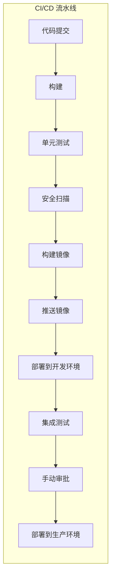

## 监控与日志

### Prometheus + Grafana 监控

```yaml
# docker-compose.monitoring.yml
version: '3.8'

services:
  prometheus:
    image: prom/prometheus:latest
    ports:
      - "9090:9090"
    volumes:
      - ./prometheus.yml:/etc/prometheus/prometheus.yml:ro
      - prometheus-data:/prometheus
    command:
      - '--config.file=/etc/prometheus/prometheus.yml'
      - '--storage.tsdb.path=/prometheus'
      - '--storage.tsdb.retention.time=30d'
      - '--web.enable-lifecycle'

  grafana:
    image: grafana/grafana:latest
    ports:
      - "3000:3000"
    environment:
      - GF_SECURITY_ADMIN_USER=admin
      - GF_SECURITY_ADMIN_PASSWORD=admin
      - GF_USERS_ALLOW_SIGN_UP=false
    volumes:
      - grafana-data:/var/lib/grafana
      - ./grafana/provisioning:/etc/grafana/provisioning:ro
    depends_on:
      - prometheus

  # Spring Boot 应用
  app:
    build: .
    ports:
      - "8080:8080"
    environment:
      - MANAGEMENT_ENDPOINTS_WEB_EXPOSURE_INCLUDE=health,info,metrics,prometheus
      - MANAGEMENT_PROMETHEUS_METRICS_EXPORT_ENABLED=true
    depends_on:
      - prometheus

volumes:
  prometheus-data:
  grafana-data:
```

```yaml
# prometheus.yml
global:
  scrape_interval: 15s
  evaluation_interval: 15s

scrape_configs:
  # Prometheus 自身监控
  - job_name: 'prometheus'
    static_configs:
      - targets: ['localhost:9090']

  # Spring Boot 应用监控
  - job_name: 'spring-boot'
    metrics_path: '/actuator/prometheus'
    static_configs:
      - targets: ['app:8080']
    # 基于 Kubernetes 服务发现
    # kubernetes_sd_configs:
    #   - role: pod
    # relabel_configs:
    #   - source_labels: [__meta_kubernetes_pod_annotation_prometheus_io_scrape]
    #     action: keep
    #     regex: true
```

```yaml
# application.yml - Spring Boot Actuator 配置
management:
  endpoints:
    web:
      exposure:
        include: health,info,metrics,prometheus,env,loggers
  endpoint:
    health:
      show-details: always
    prometheus:
      enabled: true
  prometheus:
    metrics:
      export:
        enabled: true   # Boot 3.x 属性（2.x 为 management.metrics.export.prometheus.enabled）
  metrics:
    tags:
      application: ${spring.application.name}
    distribution:
      percentiles-histogram:
        http.server.requests: true
      percentiles:
        http.server.requests: 0.5,0.95,0.99
```

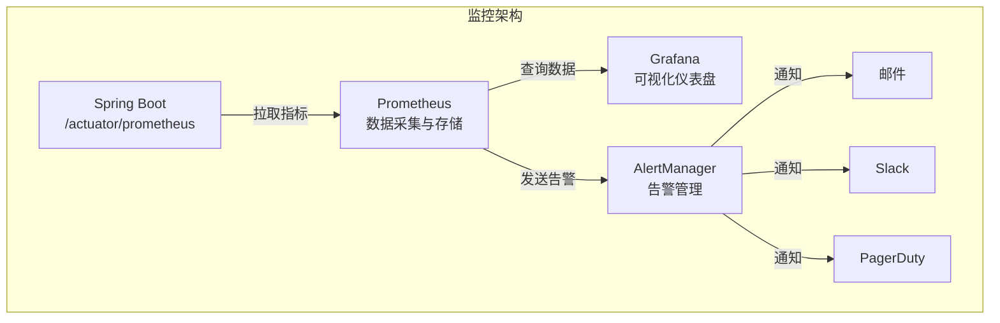

### ELK/EFK 日志收集

```yaml
# docker-compose.logging.yml
version: '3.8'

services:
  # Elasticsearch - 日志存储
  elasticsearch:
    image: docker.elastic.co/elasticsearch/elasticsearch:8.11.0
    environment:
      - discovery.type=single-node
      - xpack.security.enabled=false
      - "ES_JAVA_OPTS=-Xms512m -Xmx512m"
    ports:
      - "9200:9200"
    volumes:
      - elasticsearch-data:/usr/share/elasticsearch/data

  # Logstash - 日志处理
  logstash:
    image: docker.elastic.co/logstash/logstash:8.11.0
    ports:
      - "5044:5044"
    volumes:
      - ./logstash/pipeline:/usr/share/logstash/pipeline:ro
    depends_on:
      - elasticsearch

  # Kibana - 日志可视化
  kibana:
    image: docker.elastic.co/kibana/kibana:8.11.0
    ports:
      - "5601:5601"
    environment:
      - ELASTICSEARCH_HOSTS=http://elasticsearch:9200
    depends_on:
      - elasticsearch

  # Filebeat - 日志采集
  filebeat:
    image: docker.elastic.co/beats/filebeat:8.11.0
    user: root
    volumes:
      - ./filebeat/filebeat.yml:/usr/share/filebeat/filebeat.yml:ro
      - /var/lib/docker/containers:/var/lib/docker/containers:ro
      - /var/run/docker.sock:/var/run/docker.sock:ro
    depends_on:
      - logstash

volumes:
  elasticsearch-data:
```

```yaml
# filebeat/filebeat.yml
filebeat.inputs:
- type: container
  paths:
    - '/var/lib/docker/containers/*/*.log'
  processors:
  - add_docker_metadata:
      host: "unix:///var/run/docker.sock"
  - decode_json_fields:
      fields: ["message"]
      target: "json"
      overwrite_keys: true

output.logstash:
  hosts: ["logstash:5044"]

logging.level: info
```

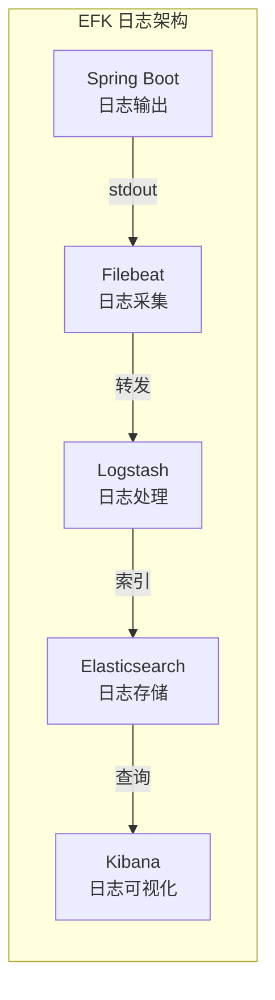

### Jaeger 链路追踪

```yaml
# docker-compose.tracing.yml
version: '3.8'

services:
  jaeger:
    image: jaegertracing/all-in-one:latest
    ports:
      - "16686:16686"  # UI
      - "14268:14268"  # HTTP 收集
      - "6831:6831/udp"  # UDP 收集
    environment:
      - COLLECTOR_ZIPKIN_HOST_PORT=:9411

  app:
    build: .
    environment:
      - SPRING_APPLICATION_NAME=myapp
      - MANAGEMENT_TRACING_ENABLED=true
      - MANAGEMENT_TRACING_SAMPLING_PROBABILITY=1.0
      - MANAGEMENT_OPENTELEMETRY_TRACING_EXPORT_OTLP_ENDPOINT=http://jaeger:4317
    depends_on:
      - jaeger
```

```yaml
# application.yml - OpenTelemetry 配置
management:
  tracing:
    enabled: true
    sampling:
      probability: 1.0  # 生产环境建议降低采样率
  opentelemetry:
    tracing:
      export:
        otlp:
          endpoint: http://jaeger:4317
```

```xml
<!-- pom.xml - 添加依赖 -->
<dependency>
    <groupId>io.micrometer</groupId>
    <artifactId>micrometer-tracing-bridge-otel</artifactId>
</dependency>
<dependency>
    <groupId>io.opentelemetry</groupId>
    <artifactId>opentelemetry-exporter-otlp</artifactId>
</dependency>
```

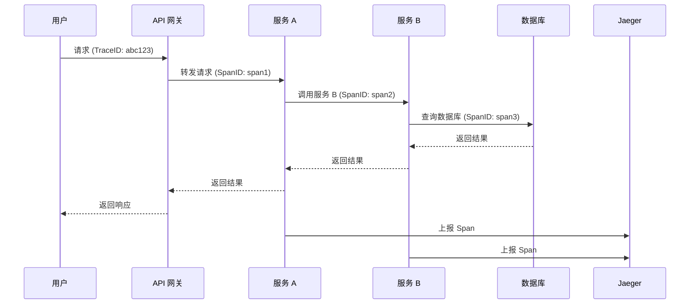

## 安全实践

### 容器安全基础

```dockerfile
# 安全的 Dockerfile 实践
FROM eclipse-temurin:21-jre-alpine

# 1. 使用非 root 用户
RUN addgroup -S appgroup && \
    adduser -S appuser -G appgroup

WORKDIR /app

# 2. 设置正确的文件权限
COPY --chown=appuser:appgroup target/myapp.jar app.jar

# 3. 切换到非 root 用户
USER appuser

# 4. 只暴露必要的端口
EXPOSE 8080

# 5. 使用 exec 形式的 ENTRYPOINT（正确处理信号）
ENTRYPOINT ["java", "-jar", "app.jar"]

# 6. 设置只读文件系统（需要配合 tmpfs）
# docker run --read-only --tmpfs /tmp myapp:1.0
```

### 镜像签名与验证

```bash
# 使用 Docker Content Trust 签名镜像
export DOCKER_CONTENT_TRUST=1
docker push myapp:1.0

# 验证镜像签名
docker trust inspect myapp:1.0 --pretty

# 使用 Notary 管理签名
notary list myapp
notary verify myapp 1.0

# 使用 Cosign 签名（推荐）
cosign sign --key cosign.key myapp:1.0
cosign verify --key cosign.pub myapp:1.0
```

```yaml
# 在 Kubernetes 中验证镜像签名
apiVersion: kyverno.io/v1
kind: ClusterPolicy
metadata:
  name: verify-image-signatures
spec:
  validationFailureAction: enforce
  background: false
  rules:
  - name: verify-signature
    match:
      resources:
        kinds:
        - Pod
    verifyImages:
    - imageReferences:
      - "registry.example.com/*"
      attestors:
      - entries:
        - keys:
            publicKeys: |-
              -----BEGIN PUBLIC KEY-----
              ...
              -----END PUBLIC KEY-----
```

### 网络安全策略

```yaml
# Kubernetes NetworkPolicy
apiVersion: networking.k8s.io/v1
kind: NetworkPolicy
metadata:
  name: myapp-network-policy
  namespace: production
spec:
  podSelector:
    matchLabels:
      app: myapp
  
  # 入站规则
  ingress:
  # 只允许来自 Ingress Controller 的流量
  - from:
    - namespaceSelector:
        matchLabels:
          name: ingress-11-Nginx基础概述
    ports:
    - protocol: TCP
      port: 8080
  
  # 只允许来自同一命名空间的其他 Pod
  - from:
    - podSelector: {}
    ports:
    - protocol: TCP
      port: 8080
  
  # 出站规则
  egress:
  # 允许 DNS 查询
  - to:
    - namespaceSelector: {}
      podSelector:
        matchLabels:
          k8s-app: kube-dns
    ports:
    - protocol: UDP
      port: 53
  
  # 允许访问数据库
  - to:
    - podSelector:
        matchLabels:
          app: mysql
    ports:
    - protocol: TCP
      port: 3306
  
  # 允许访问外部 API
  - to:
    - ipBlock:
        cidr: 0.0.0.0/0
        except:
        - 10.0.0.0/8      # 禁止访问内网
        - 172.16.0.0/12
        - 192.168.0.0/16
    ports:
    - protocol: TCP
      port: 443
  
  # 默认拒绝所有其他流量
  policyTypes:
  - Ingress
  - Egress
```

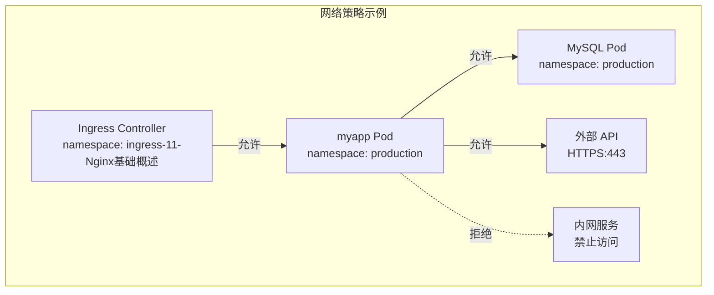

### Pod 安全策略

```yaml
# Pod Security Standards - Restricted
apiVersion: apps/v1
kind: Deployment
metadata:
  name: myapp
  annotations:
    # 强制执行 Restricted 级别安全策略
    pod-security.kubernetes.io/enforce: restricted
    pod-security.kubernetes.io/enforce-version: latest
spec:
  template:
    spec:
      # 必须指定 runAsNonRoot
      securityContext:
        runAsNonRoot: true
        runAsUser: 1000
        runAsGroup: 1000
        fsGroup: 1000
        seccompProfile:
          type: RuntimeDefault
      
      containers:
      - name: myapp
        securityContext:
          allowPrivilegeEscalation: false
          readOnlyRootFilesystem: true
          capabilities:
            drop:
            - ALL
        
        # 使用 tmpfs 挂载可写目录
        volumeMounts:
        - name: tmp
          mountPath: /tmp
        - name: cache
          mountPath: /app/cache
      
      volumes:
      - name: tmp
        emptyDir: {}
      - name: cache
        emptyDir: {}
```

::: danger 容器安全最佳实践
1. **最小权限原则**：使用非 root 用户，禁用特权模式
2. **只读文件系统**：防止恶意写入
3. **资源限制**：设置 CPU/内存限制，防止资源耗尽攻击
4. **网络隔离**：使用 NetworkPolicy 限制网络访问
5. **镜像安全**：定期扫描漏洞，使用可信镜像源
6. **密钥管理**：使用 Kubernetes Secrets 或外部密钥管理系统
:::

## 实战场景

### 蓝绿部署

蓝绿部署是一种零停机部署策略，通过维护两套完整的环境（蓝和绿），在切换时只需修改路由配置。

```yaml
# 蓝环境 Deployment
apiVersion: apps/v1
kind: Deployment
metadata:
  name: myapp-blue
spec:
  replicas: 3
  selector:
    matchLabels:
      app: myapp
      version: blue
  template:
    metadata:
      labels:
        app: myapp
        version: blue
    spec:
      containers:
      - name: myapp
        image: myapp:1.0.0

---
# 绿环境 Deployment
apiVersion: apps/v1
kind: Deployment
metadata:
  name: myapp-green
spec:
  replicas: 3
  selector:
    matchLabels:
      app: myapp
      version: green
  template:
    metadata:
      labels:
        app: myapp
        version: green
    spec:
      containers:
      - name: myapp
        image: myapp:2.0.0

---
# Service - 指向蓝环境
apiVersion: v1
kind: Service
metadata:
  name: myapp-service
spec:
  selector:
    app: myapp
    version: blue  # 切换时改为 green
  ports:
  - port: 80
    targetPort: 8080
```

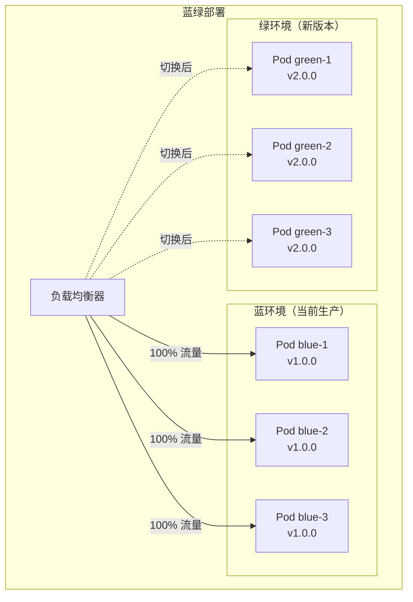

```bash
# 切换到绿环境
kubectl patch service myapp-service -p '{"spec":{"selector":{"version":"green"}}}'

# 回滚到蓝环境
kubectl patch service myapp-service -p '{"spec":{"selector":{"version":"blue"}}}'
```

### 金丝雀发布

金丝雀发布是一种渐进式发布策略，先将新版本部署到少量实例，观察无问题后逐步扩大范围。

```yaml
# 使用 Flagger 实现金丝雀发布
apiVersion: flagger.app/v1beta1
kind: Canary
metadata:
  name: myapp
spec:
  targetRef:
    apiVersion: apps/v1
    kind: Deployment
    name: myapp
  progressDeadlineSeconds: 600
  service:
    port: 8080
  analysis:
    # 分析间隔
    interval: 1m
    # 分析阈值
    threshold: 5
    # 最大权重
    maxWeight: 50
    # 每次增加的权重
    stepWeight: 10
    # 分析指标
    metrics:
    - name: request-success-rate
      thresholdRange:
        min: 99
      interval: 1m
    - name: request-duration
      thresholdRange:
        max: 500
      interval: 1m
    webhooks:
    - name: load-test
      url: http://flagger-loadtester/
      timeout: 5s
      metadata:
        type: cmd
        cmd: "hey -z 1m -q 10 -c 2 http://myapp-canary:8080"
```

```mermaid
graph LR
    subgraph "金丝雀发布流程"
        A["v1.0.0<br/>100% 流量"]
        B["v2.0.0<br/>10% 流量"]
        C["v2.0.0<br/>30% 流量"]
        D["v2.0.0<br/>50% 流量"]
        E["v2.0.0<br/>100% 流量"]
        
        A -->|"部署 v2"| B
        B -->|"指标正常"| C
        C -->|"指标正常"| D
        D -->|"指标正常"| E
        
        B -.->|"指标异常<br/>自动回滚"| A
    end
```

### 多环境管理

```yaml
# Kustomize 目录结构
# ├── base/
# │   ├── deployment.yaml
# │   ├── service.yaml
# │   └── kustomization.yaml
# └── overlays/
#     ├── development/
#     │   ├── kustomization.yaml
#     │   └── patches/
#     ├── staging/
#     │   ├── kustomization.yaml
#     │   └── patches/
#     └── production/
#         ├── kustomization.yaml
#         └── patches/

# base/kustomization.yaml
apiVersion: kustomize.config.k8s.io/v1beta1
kind: Kustomization

resources:
- deployment.yaml
- service.yaml

commonLabels:
  app: myapp
```

```yaml
# overlays/development/kustomization.yaml
apiVersion: kustomize.config.k8s.io/v1beta1
kind: Kustomization

namespace: development

resources:
- ../../base

patchesStrategicMerge:
- patches/deployment-replicas.yaml

configMapGenerator:
- name: app-config
  literals:
  - SPRING_PROFILES_ACTIVE=dev
  - LOGGING_LEVEL_ROOT=DEBUG
```

```yaml
# overlays/production/kustomization.yaml
apiVersion: kustomize.config.k8s.io/v1beta1
kind: Kustomization

namespace: production

resources:
- ../../base

patchesStrategicMerge:
- patches/deployment-replicas.yaml
- patches/deployment-resources.yaml

configMapGenerator:
- name: app-config
  literals:
  - SPRING_PROFILES_ACTIVE=prod
  - LOGGING_LEVEL_ROOT=INFO

secretGenerator:
- name: db-secret
  type: Opaque
  files:
  - password=secrets/db-password.txt
```

```bash
# 使用 Kustomize 部署不同环境
kubectl apply -k overlays/development/
kubectl apply -k overlays/staging/
kubectl apply -k overlays/production/

# 预览生成的 YAML
kubectl kustomize overlays/production/
```

### 配置中心集成

```yaml
# Spring Cloud Kubernetes Config
apiVersion: v1
kind: ConfigMap
metadata:
  name: myapp-config
  namespace: production
data:
  application.yaml: |
    spring:
      datasource:
        url: jdbc:mysql://mysql:3306/mydb
        username: ${DB_USERNAME}
        password: ${DB_PASSWORD}
      redis:
        host: redis
        port: 6379
    logging:
      level:
        root: INFO
```

```yaml
# application.yml - Spring Cloud Kubernetes 配置
spring:
  application:
    name: myapp
  cloud:
    kubernetes:
      config:
        enabled: true
        sources:
        - name: myapp-config
          namespace: production
      secrets:
        enabled: true
        sources:
        - name: db-secret
          namespace: production
      reload:
        enabled: true
        mode: event
        strategy: refresh
```

```xml
<!-- pom.xml -->
<dependency>
    <groupId>org.springframework.cloud</groupId>
    <artifactId>spring-cloud-starter-kubernetes-fabric8-config</artifactId>
</dependency>
```

```mermaid
graph TB
    subgraph "配置中心架构"
        App["Spring Boot 应用"]
        K8sConfig["Kubernetes ConfigMap"]
        K8sSecret["Kubernetes Secret"]
        Vault["HashiCorp Vault<br/>（可选）"]
        
        App -->|"读取配置"| K8sConfig
        App -->|"读取密钥"| K8sSecret
        App -->|"读取敏感配置"| Vault
        
        K8sConfig -->|"变更事件"| App
        App -->|"热重载配置"| App
    end
```

## 面试要点

### 1. Docker 多阶段构建的好处？

**答案：** 多阶段构建将构建环境和运行环境分离，最终镜像只包含运行时所需的文件（JRE + JAR），镜像更小、更安全、构建更一致。

### 2. Spring Boot 容器中如何设置 JVM 内存？

**答案：** ① 使用 `-Xms`/`-Xmx` 显式设置（推荐）；② 使用 `-XX:MaxRAMPercentage=75.0` 按容器内存百分比设置；③ JDK 11+ 自动感知容器内存限制，但仍建议显式设置。

### 3. Docker 镜像分层原理是什么？如何优化？

**答案：** Docker 镜像采用分层存储，每个指令创建一个只读层。优化策略：
1. 变化少的指令放前面（利用缓存）
2. 合并多个 RUN 指令减少层数
3. 使用多阶段构建减小最终镜像
4. 使用 `.dockerignore` 排除不必要文件

### 4. Kubernetes 的 Pod 探针有哪些？如何与 Spring Boot 集成？

**答案：** 三种探针：
- **livenessProbe**：检测应用是否存活，失败则重启 Pod
- **readinessProbe**：检测应用是否就绪，失败则停止路由流量
- **startupProbe**：给慢启动应用更长的等待时间

Spring Boot 集成：启用 Actuator 的 `/actuator/health/liveness` 和 `/actuator/health/readiness` 端点。

### 5. 什么是优雅停机？Spring Boot 如何实现？

**答案：** 优雅停机是指在关闭应用前，先停止接收新请求，等待现有请求处理完成，再释放资源。Spring Boot 实现：
1. 配置 `server.shutdown=graceful`
2. 设置 `spring.lifecycle.timeout-per-shutdown-phase`
3. Kubernetes 配置 `terminationGracePeriodSeconds`
4. 使用 Actuator readiness 探针标记 Pod 为未就绪

### 6. Docker Compose 中 depends_on 的 condition 有哪些？

**答案：** 三种条件：
- `service_started`：依赖服务启动后即可（默认）
- `service_healthy`：依赖服务健康检查通过后
- `service_completed_successfully`：依赖服务成功完成后（适用于初始化任务）

### 7. Kubernetes HPA 的工作原理是什么？

**答案：** HPA（Horizontal Pod Autoscaler）根据指标自动调整 Pod 副本数：
1. Metrics Server 收集 Pod 资源指标
2. HPA Controller 计算期望副本数 = 当前副本数 × (当前指标值 / 目标指标值)
3. 调整 Deployment 的 replicas
4. 支持基于 CPU、内存、自定义指标扩缩容

### 8. 容器安全最佳实践有哪些？

**答案：**
1. 使用非 root 用户运行容器
2. 设置只读文件系统
3. 配置资源限制（CPU/内存）
4. 使用 NetworkPolicy 限制网络访问
5. 定期扫描镜像漏洞
6. 使用镜像签名验证
7. 敏感信息使用 Secrets 管理
8. 最小化基础镜像（Alpine/Distroless）

### 9. 蓝绿部署和金丝雀发布的区别？

**答案：**
| 特性 | 蓝绿部署 | 金丝雀发布 |
|------|----------|------------|
| 环境数量 | 两套完整环境 | 一套环境，渐进更新 |
| 流量切换 | 一次性切换 | 渐进式增加 |
| 回滚速度 | 瞬间回滚 | 需要逐步回滚 |
| 资源占用 | 需要双倍资源 | 资源占用较少 |
| 风险 | 切换时风险集中 | 风险分散 |

### 10. 如何实现 CI/CD 流水线中的安全扫描？

**答案：**
1. **静态代码扫描**：使用 SonarQube、Checkstyle
2. **依赖漏洞扫描**：使用 OWASP Dependency-Check、Snyk
3. **镜像漏洞扫描**：使用 Trivy、Clair、Docker Scout
4. **动态安全测试**：使用 OWASP ZAP、Burp Suite
5. **镜像签名验证**：使用 Docker Content Trust、Cosign
6. **策略执行**：使用 Kyverno、OPA Gatekeeper

>  相关文档：[7-性能优化](07-性能优化) · [8-微服务架构](08-微服务架构) · [13-Actuator与可观测性接入](13-Actuator与可观测性接入) · [18-SpringBoot国际化与本地化](18-SpringBoot国际化与本地化) · [19-SpringBoot文件上传与Multipart](19-SpringBoot文件上传与Multipart)

## 版本差异(旧版 → Spring Boot 3.5.x)

| 特性 | 旧版(Spring Boot 2.x) | Spring Boot 3.5.x |
|------|----------------------|-------------------|
| 基础镜像 | openjdk:8/11 | eclipse-temurin:21-jre（推荐） |
| 容器化 | Dockerfile | 不变；支持 Buildpacks/Cloud Native Buildpacks |
| JVM 容器感知 | 手动 Xmx | 不变；UseContainerSupport 默认开启 |
| 内存限制 | 无 | 虚拟线程内存开销需纳入容器配额 |
| K8s 探针 | 手动 | Actuator Liveness/Readiness 集成 |
