# 启动流程源码剖析


## 启动流程源码剖析

### 概述

Spring Boot 的启动流程是理解框架运行机制的基础。从 `main()` 方法到应用就绪，整个过程涉及类加载、环境准备、容器创建、Bean 注册、自动配置、内嵌容器启动等多个阶段。理解这条链路，是排查启动问题、优化启动性能、定制启动行为的前提。

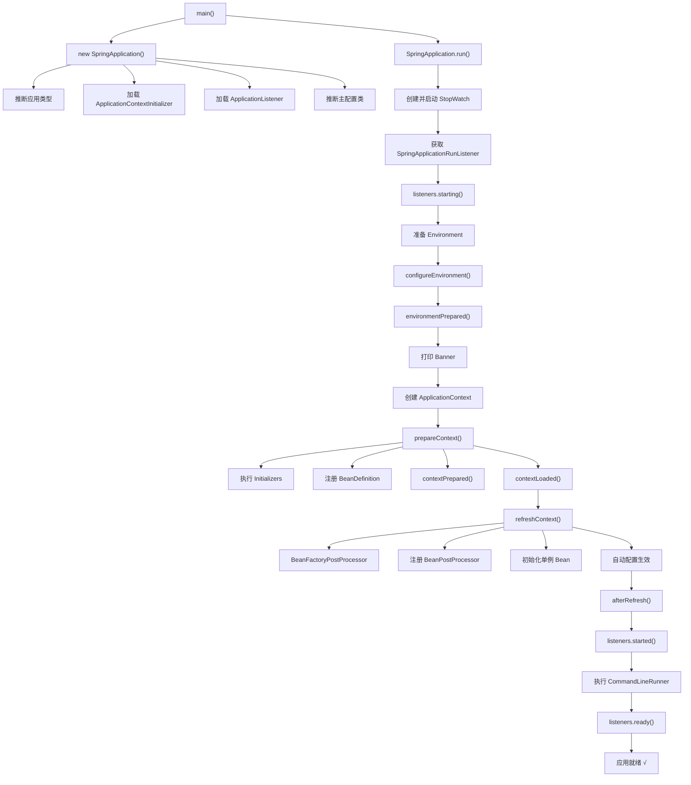

### SpringApplication 构造阶段

#### 源码入口

```java
// SpringApplication.java
public static ConfigurableApplicationContext run(Class<?> primarySource, String... args) {
    return run(new Class<?>[] { primarySource }, args);
}

public static ConfigurableApplicationContext run(Class<?>[] primarySources, String[] args) {
    return new SpringApplication(primarySources).run(args);
}
```

启动分为两步：**构造 SpringApplication** → **执行 run()**。

#### 构造函数源码

```java
// SpringApplication.java
public SpringApplication(ResourceLoader resourceLoader, Class<?>... primarySources) {
    this.resourceLoader = resourceLoader;
    Assert.notNull(primarySources, "PrimarySources must not be null");
    this.primarySources = new LinkedHashSet<>(Arrays.asList(primarySources));

    // 1. 推断应用类型（Servlet / Reactive / None）
    this.webApplicationType = WebApplicationType.deduceFromClasspath();

    // 2. 从 spring.factories 加载 ApplicationContextInitializer
    setInitializers((Collection) getSpringFactoriesInstances(ApplicationContextInitializer.class));

    // 3. 从 spring.factories 加载 ApplicationListener
    setListeners((Collection) getSpringFactoriesInstances(ApplicationListener.class));

    // 4. 推断主配置类（main 方法所在类）
    this.mainApplicationClass = deduceMainApplicationClass();
}
```

#### 应用类型推断

```java
// WebApplicationType.java
static WebApplicationType deduceFromClasspath() {
    // 如果有 Reactive 的 DispatcherHandler 且没有 Servlet 的 DispatcherServlet
    if (ClassUtils.isPresent("org.springframework.web.reactive.DispatcherHandler", null)
        && !ClassUtils.isPresent("org.springframework.web.servlet.DispatcherServlet", null)) {
        return REACTIVE;
    }
    // 如果没有 Servlet 或 Spring MVC 的核心类
    for (String className : SERVLET_INDICATOR_CLASSES) {
        if (!ClassUtils.isPresent(className, null)) {
            return NONE;
        }
    }
    // 默认：Servlet Web 应用
    return SERVLET;
}
```

| 应用类型 | 条件 | 创建的 ApplicationContext |
|---------|------|--------------------------|
| `SERVLET` | classpath 有 `jakarta.servlet.Servlet` + `DispatcherServlet` | `AnnotationConfigServletWebServerApplicationContext` |
| `REACTIVE` | classpath 有 `DispatcherHandler` 无 `DispatcherServlet` | `AnnotationConfigReactiveWebServerApplicationContext` |
| `NONE` | 都没有 | `AnnotationConfigApplicationContext` |

::: tip 强制指定应用类型
如果自动推断不符合预期，可以手动设置：
```java
SpringApplication app = new SpringApplication(Application.class);
app.setWebApplicationType(WebApplicationType.SERVLET); // 强制 Servlet
app.run(args);
```
这在引入了 Reactive 依赖但实际使用 Servlet 的项目中很有用。
:::

### run() 执行阶段

#### 完整时序图

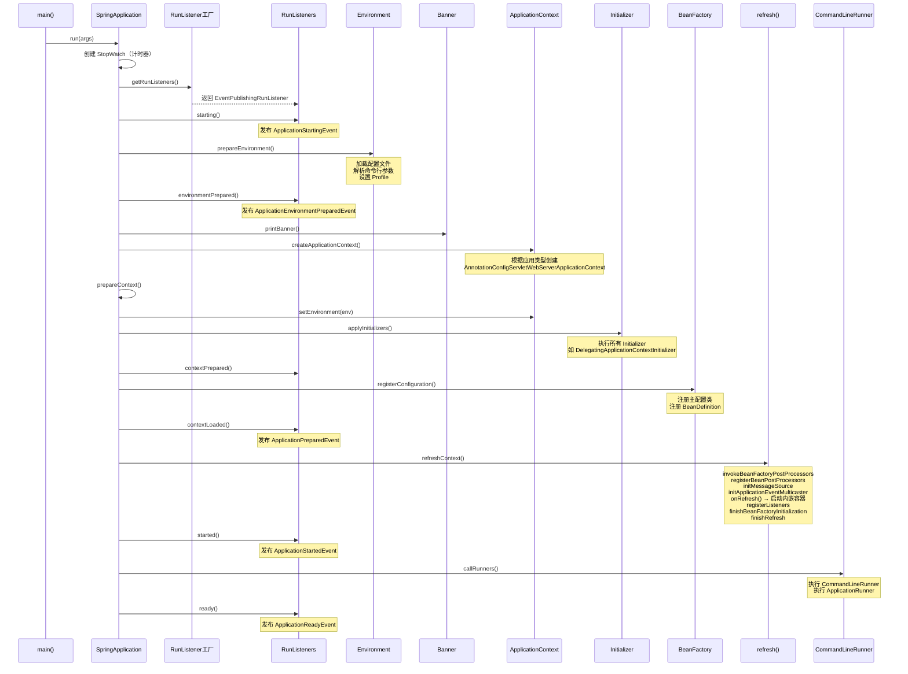

#### 关键步骤详解

##### 1. 准备 Environment

```java
// SpringApplication.java
private ConfigurableEnvironment prepareEnvironment(
        SpringApplicationRunListeners listeners,
        ApplicationArguments applicationArguments) {
    // 创建 Environment（Servlet → StandardServletEnvironment）
    ConfigurableEnvironment environment = getOrCreateEnvironment();

    // 配置 Environment：命令行参数、Profile 等
    configureEnvironment(environment, applicationArguments.getSourceArgs());

    // 将 ConfigurationProperties 绑定到 SpringApplication
    ConfigurationPropertySources.attach(environment);

    // 发布 EnvironmentPrepared 事件
    listeners.environmentPrepared(environment);

    return environment;
}
```

::: warning Environment 准备阶段
`environmentPrepared()` 事件触发时，`ApplicationContext` 还没创建。这意味着此时不能使用任何 Bean，但可以利用 `EnvironmentPostProcessor` 修改配置——这是在容器创建前注入自定义配置的官方扩展点。
:::

##### 2. 创建 ApplicationContext

```java
// SpringApplication.java
protected ConfigurableApplicationContext createApplicationContext() {
    return this.applicationContextFactory.create(this.webApplicationType);
}

// ApplicationContextFactory 默认实现
switch (webApplicationType) {
    case SERVLET:
        return new AnnotationConfigServletWebServerApplicationContext();
    case REACTIVE:
        return new AnnotationConfigReactiveWebServerApplicationContext();
    default:
        return new AnnotationConfigApplicationContext();
}
```

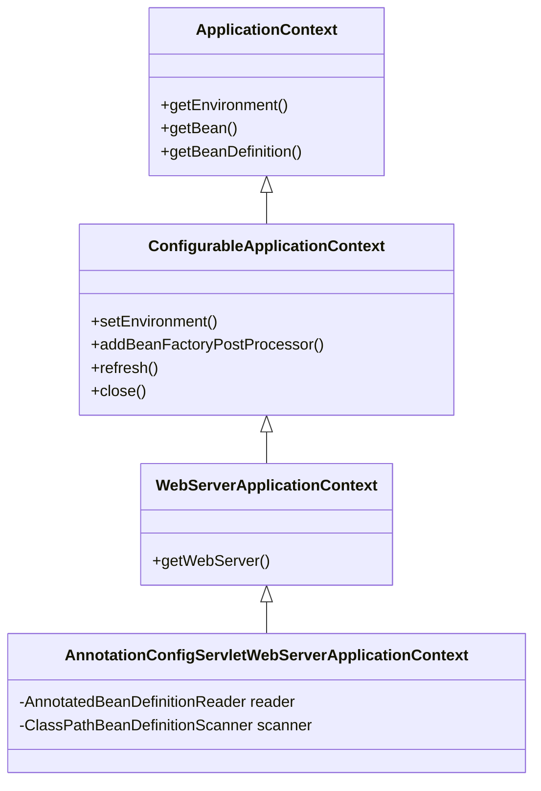

##### 2.5 prepareContext() 详解

`prepareContext()` 是 `createApplicationContext()` 和 `refreshContext()` 之间的桥梁，完成以下关键工作：

```java
// SpringApplication.java
private void prepareContext(ConfigurableApplicationContext context,
        ConfigurableEnvironment environment, SpringApplicationRunListeners listeners,
        ApplicationArguments applicationArguments, Banner banner) {

    // 1. 设置 Environment
    context.setEnvironment(environment);

    // 2. 后处理 ApplicationContext（设置 BeanNameGenerator、ResourceLoader 等）
    postProcessApplicationContext(context);

    // 3. 执行所有 ApplicationContextInitializer
    applyInitializers(context);

    // 4. 发布 ApplicationContextInitializedEvent
    listeners.contextPrepared(context);

    // 5. 关闭 DefaultBootstrapContext（早期引导阶段到此结束）
    bootstrapContext.close();

    // 6. 注册主配置类的 BeanDefinition
    Set<Object> sources = getAllSources();
    Assert.notEmpty(sources, "No sources found");
    load(context, sources.toArray(new Object[0]));

    // 7. 发布 ApplicationPreparedEvent
    listeners.contextLoaded(context);
}
```

::: tip prepareContext 的扩展窗口
`applyInitializers()` 是 `prepareContext()` 中最重要的扩展点。此时 `ApplicationContext` 已创建但未刷新，可以：
1. 注册额外的 `BeanDefinition`
2. 修改 `Environment`
3. 添加 `BeanFactoryPostProcessor`
4. 设置 `ApplicationContext` 的属性

但注意：**此时 Bean 还没实例化**，不能调用 `getBean()`。
:::

##### 3. refresh() — 最核心的步骤

`refresh()` 是 Spring 容器初始化的核心方法，定义在 `AbstractApplicationContext` 中：

> **版本注**: 以下为 Spring Framework 6.0.x 及更早版本的方法签名（`synchronized` 保护）。Spring Framework 6.1（Spring Boot 3.2+）起已将 `startupShutdownMonitor` 的监视器锁替换为 `ReentrantLock`（`startShutdown`），但 **12 个初始化步骤本身完全不变**。

```java
// AbstractApplicationContext.java
public void refresh() throws BeansException, IllegalStateException {
    synchronized (this.startupShutdownMonitor) {
        // 1. 准备刷新：记录启动时间、设置状态标志
        prepareRefresh();

        // 2. 获取 BeanFactory（刚创建的空工厂）
        ConfigurableListableBeanFactory beanFactory = obtainFreshBeanFactory();

        // 3. 配置 BeanFactory：注册标准 BeanPostProcessor
        prepareBeanFactory(beanFactory);

        try {
            // 4. 子类后处理：注册 Web 相关的 Scope 等
            postProcessBeanFactory(beanFactory);

            // 5. 执行 BeanFactoryPostProcessor（关键！）
            invokeBeanFactoryPostProcessors(beanFactory);

            // 6. 注册 BeanPostProcessor
            registerBeanPostProcessors(beanFactory);

            // 7. 初始化 MessageSource（国际化）
            initMessageSource();

            // 8. 初始化事件广播器
            initApplicationEventMulticaster();

            // 9. 子类特殊初始化：启动内嵌 Web 容器
            onRefresh();

            // 10. 注册监听器
            registerListeners();

            // 11. 初始化所有单例 Bean（非 lazy-init）
            finishBeanFactoryInitialization(beanFactory);

            // 12. 完成刷新：发布 ContextRefreshedEvent
            finishRefresh();
        } catch (BeansException ex) {
            destroyBeans();
            cancelRefresh(ex);
            throw ex;
        }
    }
}
```

::: tip invokeBeanFactoryPostProcessors 是自动配置生效的入口
步骤 5 `invokeBeanFactoryPostProcessors()` 会执行所有 `BeanFactoryPostProcessor`，其中包括 `ConfigurationClassPostProcessor`——它负责解析 `@Configuration` 类、处理 `@Import`、加载自动配置类。**自动配置的协商就发生在这里。**
:::

##### 4. onRefresh() — 启动内嵌容器

```java
// ServletWebServerApplicationContext.java
protected void onRefresh() {
    super.onRefresh();
    try {
        createWebServer();  // 创建并启动 Tomcat/Jetty/Undertow
    } catch (Throwable ex) {
        throw new ApplicationContextException("Unable to start web server", ex);
    }
}

private void createWebServer() {
    WebServer webServer = this.webServer;
    ServletContext servletContext = getServletContext();

    if (webServer == null && servletContext == null) {
        // 获取 ServletWebServerFactory（TomcatServletWebServerFactory 等）
        ServletWebServerFactory factory = getWebServerFactory();
        this.webServer = factory.getWebServer(getSelfInitializer());
    }
    // ...
}
```

##### 5. finishBeanFactoryInitialization() — 创建所有单例 Bean

```java
// AbstractApplicationContext.java
protected void finishBeanFactoryInitialization(ConfigurableListableBeanFactory beanFactory) {
    // 初始化 ConversionService
    if (beanFactory.containsBean(CONVERSION_SERVICE_BEAN_NAME)
        && beanFactory.isTypeMatch(CONVERSION_SERVICE_BEAN_NAME, ConversionService.class)) {
        beanFactory.setConversionService(
            beanFactory.getBean(CONVERSION_SERVICE_BEAN_NAME, ConversionService.class));
    }

    // 注册嵌入式值解析器（解析 ${...} 占位符）
    if (!beanFactory.hasEmbeddedValueResolver()) {
        beanFactory.addEmbeddedValueResolver(strVal -> getEnvironment().resolveRequiredPlaceholders(strVal));
    }

    // 初始化所有单例 Bean
    beanFactory.preInstantiateSingletons();
}
```

```mermaid
sequenceDiagram
    participant PreInstantiate as preInstantiateSingletons()
    participant BD as BeanDefinition
    participant GetBean as getBean()
    participant Create as createBean()
    participant Populate as populateBean()
    participant Init as initializeBean()
    participant Post as BeanPostProcessor

    PreInstantiate->>BD: 遍历所有 BeanDefinition
    BD->>GetBean: getBean(beanName)
    GetBean->>Create: createBean()
    Create->>Create: 实例化（反射调用构造器）
    Create->>Populate: populateBean() — 属性注入
    Populate->>Post: InstantiationAwareBeanPostProcessor<br/>.postProcessProperties()
    Post->>Init: initializeBean()
    Init->>Post: BeanPostProcessor.postProcessBeforeInitialization()<br/>（@PostConstruct 在此处理）
    Init->>Init: invokeInitMethods()<br/>（InitializingBean.afterPropertiesSet()）
    Init->>Post: BeanPostProcessor.postProcessAfterInitialization()<br/>（AOP 代理在此生成）
```

### 启动事件体系

Spring Boot 启动过程中发布的事件按顺序如下：

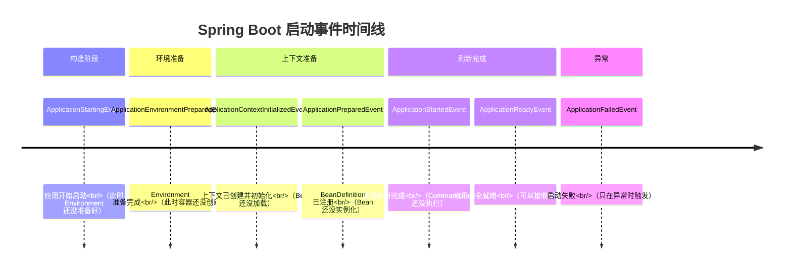

#### 监听事件的两种方式

**方式一：@EventListener（推荐）**

```java
@Component
public class StartupListener {

    @EventListener
    public void onReady(ApplicationReadyEvent event) {
        // 所有 Bean 已就绪，可以执行预热逻辑
        log.info("应用已就绪，开始预热缓存...");
    }

    @EventListener
    public void onFailed(ApplicationFailedEvent event) {
        // 启动失败，发送告警
        log.error("应用启动失败：{}", event.getException().getMessage());
    }
}
```

**方式二：实现 ApplicationListener**

```java
// 在容器创建之前生效的事件，需要通过 spring.factories 注册
public class EarlyListener implements ApplicationListener<ApplicationEnvironmentPreparedEvent> {
    @Override
    public void onApplicationEvent(ApplicationEnvironmentPreparedEvent event) {
        // 修改 Environment 配置
        event.getEnvironment().getSystemProperties().put("custom.key", "custom.value");
    }
}
```

```properties
## META-INF/spring.factories
org.springframework.context.ApplicationListener=\
  com.example.EarlyListener
```

::: warning 早期事件的监听方式
`ApplicationStartingEvent` 和 `ApplicationEnvironmentPreparedEvent` 发生在 `ApplicationContext` 创建之前，此时还没有 Bean 容器，因此 `@EventListener` 不起作用——必须通过 `spring.factories` 或 `SpringApplication.addListeners()` 注册。
:::

### ApplicationContextInitializer 扩展点

`ApplicationContextInitializer` 在上下文刷新之前执行，可以用来编程式地修改 `ApplicationContext` 的内部结构。

```java
// 自定义 Initializer
public class MyInitializer implements ApplicationContextInitializer<ConfigurableApplicationContext> {
    @Override
    public void initialize(ConfigurableApplicationContext context) {
        // 在容器刷新前添加自定义 BeanDefinition
        context.getBeanFactory().registerSingleton("myBean", new MyBean());

        // 或修改 Environment
        context.getEnvironment().getSystemProperties().put("my.key", "my.value");
    }
}
```

**注册方式：**

```properties
## META-INF/spring.factories
org.springframework.context.ApplicationContextInitializer=\
  com.example.MyInitializer
```

```java
// 或通过代码注册
SpringApplication app = new SpringApplication(Application.class);
app.addInitializers(new MyInitializer());
app.run(args);
```

#### Spring Boot 内置的 Initializer

| Initializer | 作用 |
|------------|------|
| `DelegatingApplicationContextInitializer` | 委托给 `context.initializer.classes` 配置的 Initializer |
| `ContextIdApplicationContextInitializer` | 设置 ApplicationContext 的 ID |
| `ConfigurationWarningsApplicationContextInitializer` | 检查常见的配置问题（如 @ComponentScan 位置不当） |
| `SharedMetadataReaderFactoryContextInitializer` | 创建共享的 `CachingMetadataReaderFactory`，避免重复 ASM 字节码解析 |
| `LifecycleProperiesInitializer` | 处理 `spring.lifecycle.timeout-per-shutdown-phase` 配置 |

### EnvironmentPostProcessor 扩展点

`EnvironmentPostProcessor` 在 `ApplicationContext` 创建之前执行，是修改 `Environment` 的官方推荐方式。比 `ApplicationContextInitializer` 更早，且专门为环境配置设计。

```java
// 自定义 EnvironmentPostProcessor
public class MyEnvironmentPostProcessor implements EnvironmentPostProcessor {
    @Override
    public void postProcessEnvironment(ConfigurableEnvironment environment,
                                       SpringApplication application) {
        // 根据运行环境动态设置配置
        String env = environment.getProperty("app.env", "dev");

        Map<String, Object> defaults = new HashMap<>();
        if ("prod".equals(env)) {
            defaults.put("server.tomcat.max-threads", "500");
            defaults.put("spring.datasource.hikari.maximum-pool-size", "50");
        } else {
            defaults.put("server.tomcat.max-threads", "100");
            defaults.put("spring.datasource.hikari.maximum-pool-size", "10");
        }

        // 添加默认属性（优先级最低，可被其他配置源覆盖）
        environment.getPropertySources()
            .addLast(new MapPropertySource("myDefaults", defaults));
    }
}
```

**注册方式：**

```properties
## META-INF/spring.factories
org.springframework.boot.env.EnvironmentPostProcessor=\
  com.example.MyEnvironmentPostProcessor
```

::: tip EnvironmentPostProcessor 的典型用途
1. **根据运行环境动态设置配置**：如生产环境自动调大连接池
2. **从外部配置中心加载配置**：如从 Vault、Consul 拉取敏感配置
3. **设置合理的默认值**：确保关键配置有兜底值
4. **配置加密解密**：自动解密 `ENC(xxx)` 格式的加密配置
:::

::: warning EnvironmentPostProcessor 的执行时机
`EnvironmentPostProcessor` 在 `environmentPrepared` 事件中执行，此时 `ApplicationContext` 还没创建。因此：
1. 不能使用任何 Bean（包括 `@Autowired`）
2. 不能使用 `@Value` 注解
3. 如果需要依赖其他 Bean，应该使用 `@ConfigurationProperties` + `@Bean` 的方式，而非 `EnvironmentPostProcessor`
:::

### getSpringFactoriesInstances 加载机制

`SpringFactoriesLoader` 是 Spring Boot 加载扩展点的核心机制，几乎所有启动阶段的扩展组件都通过它加载。

#### Spring Boot 2.x 的加载方式

```java
// SpringFactoriesLoader.java
public static <T> List<T> loadFactories(Class<T> factoryType, @Nullable ClassLoader classLoader) {
    ClassLoader classLoaderToUse = classLoader;
    if (classLoaderToUse == null) {
        classLoaderToUse = SpringFactoriesLoader.class.getClassLoader();
    }
    // 加载所有 META-INF/spring.factories 中指定类型的实现类名
    List<String> factoryImplementationNames = loadFactoryNames(factoryType, classLoaderToUse);
    // 实例化每个实现类
    List<T> result = new ArrayList<>(factoryImplementationNames.size());
    for (String factoryImplementationName : factoryImplementationNames) {
        result.add(instantiateFactory(factoryImplementationName, factoryType, classLoaderToUse));
    }
    AnnotationAwareOrderComparator.sort(result);  // 按 @Order 排序
    return result;
}
```

#### Spring Boot 3.x 的变化

Spring Boot 3.x 引入了 `AutoConfiguration.imports` 文件替代 `spring.factories` 中的自动配置类注册：

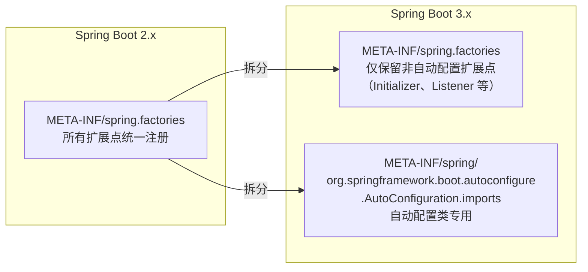

::: details spring.factories 文件示例（Spring Boot 2.x）
```properties
## org.springframework.boot.autoconfigure.EnableAutoConfiguration
org.springframework.boot.autoconfigure.web.servlet.WebMvcAutoConfiguration,\
org.springframework.boot.autoconfigure.web.servlet.DispatcherServletAutoConfiguration,\
org.springframework.boot.autoconfigure.jdbc.DataSourceAutoConfiguration,\
org.springframework.boot.autoconfigure.data.redis.RedisAutoConfiguration

## org.springframework.context.ApplicationContextInitializer
org.springframework.boot.context.ConfigurationWarningsApplicationContextInitializer,\
org.springframework.boot.context.ContextIdApplicationContextInitializer

## org.springframework.context.ApplicationListener
org.springframework.boot.context.config.AnsiOutputApplicationListener,\
org.springframework.boot.context.listener.LoggingApplicationListener
```
:::

::: details AutoConfiguration.imports 文件示例（Spring Boot 3.x）
```
org.springframework.boot.autoconfigure.web.servlet.WebMvcAutoConfiguration
org.springframework.boot.autoconfigure.web.servlet.DispatcherServletAutoConfiguration
org.springframework.boot.autoconfigure.jdbc.DataSourceAutoConfiguration
org.springframework.boot.autoconfigure.data.redis.RedisAutoConfiguration
```
每行一个全限定类名，不再需要转义符 `\`，更易维护。
:::

### CommandLineRunner 与 ApplicationRunner

两者都在应用就绪后执行，区别在于参数类型：

```java
// ApplicationRunner：接收 ApplicationArguments（解析好的参数）
@Component
@Order(1)  // 数字越小优先级越高
public class MyApplicationRunner implements ApplicationRunner {
    @Override
    public void run(ApplicationArguments args) throws Exception {
        // args.getOptionValues("key") 获取选项参数
        // args.getNonOptionArgs() 获取非选项参数
        log.info("ApplicationRunner 执行，参数：{}", args.getSourceArgs());
    }
}

// CommandLineRunner：接收原始 String[]
@Component
@Order(2)
public class MyCommandLineRunner implements CommandLineRunner {
    @Override
    public void run(String... args) throws Exception {
        log.info("CommandLineRunner 执行，参数：{}", Arrays.toString(args));
    }
}
```

::: tip CommandLineRunner 的典型用途
1. **数据预热**：启动时加载热点数据到缓存
2. **健康检查**：验证外部依赖（数据库、Redis、MQ）是否可用
3. **一次性任务**：数据迁移、初始化管理员账号等
4. **通知**：启动完成后发送就绪信号（如注册到服务发现）
:::

### 启动性能优化

#### 1. 延迟初始化

```java
@SpringBootApplication
public class Application {
    public static void main(String[] args) {
        SpringApplication app = new SpringApplication(Application.class);
        app.setLazyInitialization(true);  // 所有单例 Bean 延迟初始化
        app.run(args);
    }
}
```

```yaml
## 或通过配置
spring:
  main:
    lazy-initialization: true
```

::: warning 延迟初始化的风险
- 启动更快，但首次请求会触发 Bean 创建，响应时间增加
- 延迟创建意味着启动时不会发现配置错误——可能在运行时才报错
- **生产环境慎用**，更适合开发环境加速启动
:::

#### 2. 排除不必要的自动配置

```java
@SpringBootApplication(exclude = {
    DataSourceAutoConfiguration.class,     // 不需要数据库
    HibernateJpaAutoConfiguration.class,   // 不需要 JPA
    RedisAutoConfiguration.class           // 不需要 Redis
})
public class Application { ... }
```

#### 3. 使用 GraalVM Native Image（Spring Boot 3.x）

```bash
## 使用 GraalVM 编译为原生镜像
mvn -Pnative native:compile

## 启动时间从秒级降到毫秒级
./target/myapp
```

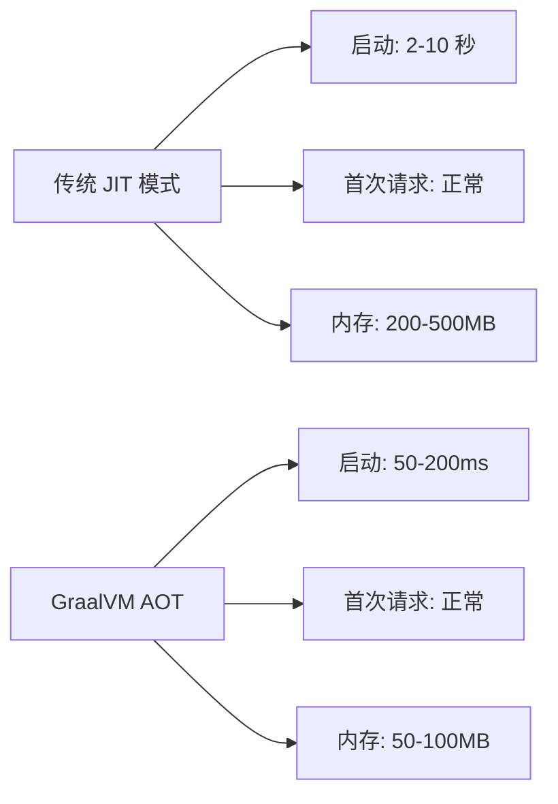

::: danger Native Image 的限制
1. 不支持动态类加载和反射（需通过 AOT 配置预先声明）
2. 不支持 CGLIB 代理（需使用接口代理）
3. 部分第三方库可能不兼容
4. 构建时间长（编译需要 1-5 分钟）
5. 调试体验不如 JIT 模式
:::

#### 4. JVM 启动参数优化

```bash
# 推荐 JVM 启动参数
java -jar myapp.jar \
  -Xms512m -Xmx512m \
  -XX:+UseG1GC \
  -XX:MaxGCPauseMillis=200 \
  -XX:+HeapDumpOnOutOfMemoryError \
  -XX:HeapDumpPath=/logs/heap.hprof \
  -Djava.security.egd=file:/dev/./urandom

# 说明: 堆内存固定避免动态扩展开销;G1 GC 目标停顿 200ms;OOM 时自动 dump;
# /dev/./urandom 加快 SecureRandom 初始化。注意 bash 续行符 \ 之后不能跟行内注释。
```

### Environment 配置源加载详解

#### PropertySource 链式结构

Spring Boot 的 `Environment` 由多个 `PropertySource` 组成，按优先级从高到低排列：

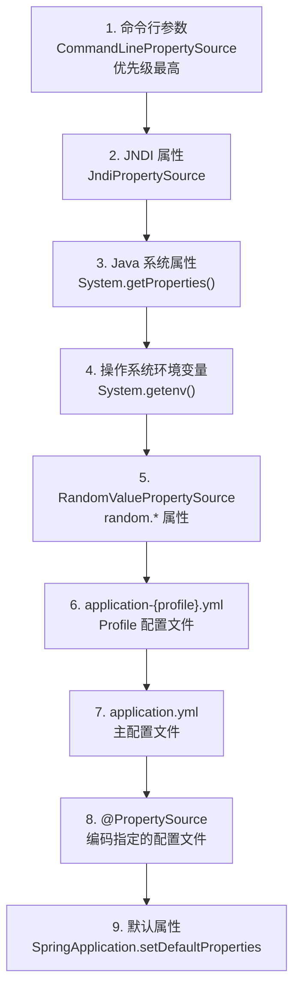

::: tip 配置优先级核心原则
**高优先级覆盖低优先级**。命令行参数优先级最高，默认属性最低。这就是为什么 `--server.port=8081` 能覆盖 `application.yml` 中的 `server.port: 8080`。
:::

#### prepareEnvironment() 源码深度追踪

```java
// SpringApplication.java
private ConfigurableEnvironment prepareEnvironment(
        SpringApplicationRunListeners listeners,
        DefaultBootstrapContext bootstrapContext,
        ApplicationArguments applicationArguments) {

    // 1. 创建或获取 Environment
    ConfigurableEnvironment environment = getOrCreateEnvironment();

    // 2. 配置 Environment：设置命令行参数、Profile
    configureEnvironment(environment, applicationArguments.getSourceArgs());

    // 3. 将 ConfigurationPropertySources 附加到 Environment
    //    这一步把所有 PropertySource 包装为 ConfigurationPropertySource
    ConfigurationPropertySources.attach(environment);

    // 4. 发布 ApplicationEnvironmentPreparedEvent
    //    触发所有 EnvironmentPostProcessor 执行
    listeners.environmentPrepared(bootstrapContext, environment);

    // 5. 将默认属性移到末尾（确保优先级最低）
    DefaultPropertiesPropertySource.moveToEnd(environment);

    // 6. 断言必须的属性是否存在
    Assert.state(!environment.containsProperty("spring.main.environment-prefix"),
        "Environment prefix cannot be set via properties");

    // 7. 绑定 spring.main.* 配置到 SpringApplication
    bindToSpringApplication(environment);

    // 8. 如果用户没有指定应用类型，根据配置再次推断
    if (!this.isCustomEnvironment) {
        environment = convertEnvironment(environment);
    }

    // 9. 创建 ConfigurationPropertySourcesPropertySource
    //    并添加到 Environment 的 PropertySource 列表首位
    ConfigurationPropertySources.finish(environment);

    return environment;
}
```

#### configureEnvironment() 详解

```java
// SpringApplication.java
protected void configureEnvironment(ConfigurableEnvironment environment, String[] args) {
    // 1. 添加命令行参数转换的 PropertySource
    if (this.addCommandLineProperties && args.length > 0) {
        // 将 --key=value 格式的参数转为 PropertySource
        // 优先级：命令行非选项参数 > 命令行选项参数
        CommandLinePropertySource<?> commandLinePropertySource =
            new SimpleCommandLinePropertySource(args);
        environment.getPropertySources().addFirst(commandLinePropertySource);
    }

    // 2. 配置 ConversionService（类型转换器）
    ConfigurationPropertySources.attach(environment);

    // 3. 设置活跃 Profile
    Set<String> profiles = new LinkedHashSet<>(this.additionalProfiles);
    profiles.addAll(Arrays.asList(environment.getActiveProfiles()));
    environment.setActiveProfiles(profiles.toArray(new String[0]));
}
```

#### ConfigData 加载机制（Spring Boot 2.4+）

Spring Boot 2.4 引入了全新的 `ConfigData` 机制来加载配置文件，替代了之前的 `ConfigFileApplicationListener`：

```java
// ConfigDataEnvironmentPostProcessor.java
public class ConfigDataEnvironmentPostProcessor implements EnvironmentPostProcessor, Ordered {

    @Override
    public void postProcessEnvironment(ConfigurableEnvironment environment,
                                       SpringApplication application) {
        // 1. 创建 ConfigDataEnvironment
        ConfigDataEnvironment configDataEnvironment =
            ConfigDataEnvironment.from(environment, this.resolvers, this.importers);

        // 2. 处理 ConfigData 导入
        //    包括 application.yml、application-{profile}.yml 等
        configDataEnvironment.processAndApply();
    }
}
```

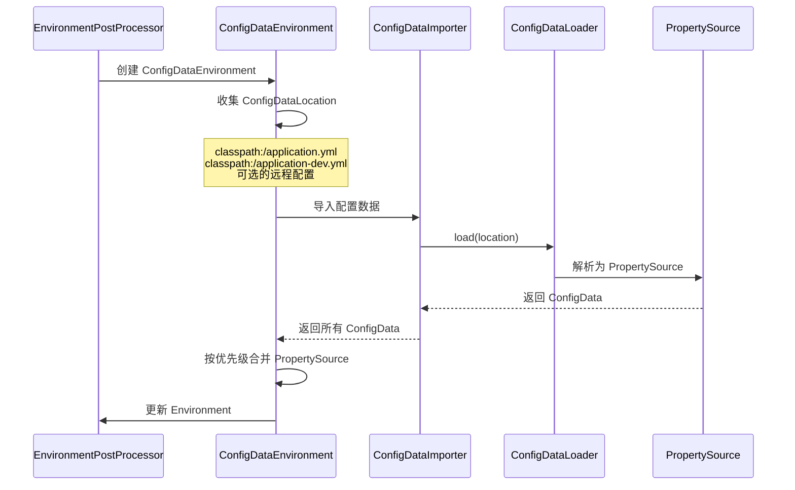

::: warning application.yml 的加载顺序变化
Spring Boot 2.4+ 对 `application.yml` 的加载顺序做了重大调整：
1. **先加载主配置** → **再加载 Profile 配置**（之前是反过来的）
2. Profile 配置不再简单地覆盖主配置，而是按导入顺序决定优先级
3. 新增 `spring.config.import` 属性，支持导入额外的配置源（如 Vault、Consul、Nacos）
:::

#### 自定义 PropertySource

```java
// 自定义 PropertySource：从数据库加载配置
public class DatabasePropertySource extends PropertySource<JdbcTemplate> {

    private final Map<String, Object> properties = new ConcurrentHashMap<>();

    public DatabasePropertySource(String name, JdbcTemplate source) {
        super(name, source);
        loadProperties();
    }

    private void loadProperties() {
        // 从数据库加载配置
        List<Map<String, Object>> rows = getSource()
            .queryForList("SELECT config_key, config_value FROM app_config");
        for (Map<String, Object> row : rows) {
            properties.put((String) row.get("config_key"), row.get("config_value"));
        }
    }

    @Override
    public Object getProperty(String name) {
        return properties.get(name);
    }
}
```

```java
// 通过 EnvironmentPostProcessor 注册自定义 PropertySource
public class DatabaseEnvironmentPostProcessor implements EnvironmentPostProcessor {

    @Override
    public void postProcessEnvironment(ConfigurableEnvironment environment,
                                       SpringApplication application) {
        // 从已有的数据源配置中获取连接信息
        String url = environment.getProperty("spring.datasource.url");
        String username = environment.getProperty("spring.datasource.username");
        String password = environment.getProperty("spring.datasource.password");

        if (url != null) {
            DataSource dataSource = DataSourceBuilder.create()
                .url(url).username(username).password(password).build();
            JdbcTemplate jdbcTemplate = new JdbcTemplate(dataSource);

            // 创建并注册 PropertySource（优先级高于 application.yml）
            DatabasePropertySource propertySource =
                new DatabasePropertySource("databaseConfig", jdbcTemplate);
            environment.getPropertySources().addAfter(
                "applicationConfigurationProperties", propertySource);
        }
    }
}
```

### Banner 自定义机制

#### Banner 加载流程

```java
// SpringApplication.java
private Banner printBanner(ConfigurableEnvironment environment) {
    if (this.bannerMode == Banner.Mode.OFF) {
        return null;
    }

    // 如果没有自定义 Banner，使用默认的 Spring Boot Banner
    if (this.bannerMode == Banner.Mode.LOG) {
        // 输出到日志
    } else {
        // 输出到控制台
    }

    ResourceLoader resourceLoader = this.resourceLoader;
    if (resourceLoader == null) {
        resourceLoader = new DefaultResourceLoader(null);
    }

    // 查找 banner.txt 文件
    SpringApplicationBannerPrinter bannerPrinter =
        new SpringApplicationBannerPrinter(resourceLoader, this.banner);

    // 优先查找图片 Banner：banner.gif / banner.jpg / banner.png
    // 其次查找文本 Banner：banner.txt
    if (this.bannerMode == Mode.LOG) {
        return bannerPrinter.print(environment, this.mainApplicationClass, logger);
    }
    return bannerPrinter.print(environment, this.mainApplicationClass, System.out);
}
```

#### Banner 查找顺序

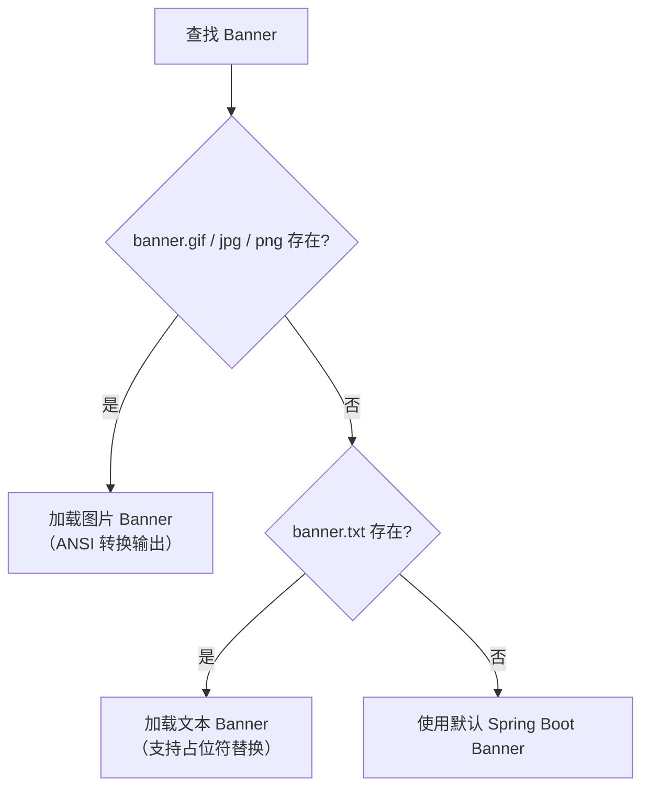

#### 自定义 Banner 示例

在 `src/main/resources/banner.txt` 中：

```text
${AnsiColor.BRIGHT_CYAN}
  ____  _     _       _
 / ___|| |__ (_)___  (_)___
| |    | '_ \| / __| | / __|
| |___ | | | | \__ \ | \__ \
 \____||_| |_|_|___/ |_|___/

${AnsiColor.DEFAULT}
:: Spring Boot ::  ${spring-boot.version}
:: Application ::  ${spring.application.name:vitepress}
:: Profile ::     ${spring.profiles.active:default}
:: Port ::        ${server.port:8080}
```

::: tip Banner 支持的占位符
- `${AnsiColor.xxx}`：ANSI 颜色控制
- `${spring-boot.version}`：Spring Boot 版本号
- `${application.title}`：应用标题（来自 MANIFEST.MF）
- `${application.version}`：应用版本
- `${spring.application.name}`：应用名称
- `${server.port}`：服务端口
- 任何 `Environment` 中的属性都可以引用
:::

#### 编程式 Banner

```java
@SpringBootApplication
public class Application {
    public static void main(String[] args) {
        SpringApplication app = new SpringApplication(Application.class);
        app.setBanner((environment, sourceClass, out) -> {
            out.println("========================================");
            out.println("  自定义应用启动中...");
            out.println("  环境: " + environment.getActiveProfiles()[0]);
            out.println("  端口: " + environment.getProperty("server.port", "8080"));
            out.println("========================================");
        });
        app.setBannerMode(Banner.Mode.CONSOLE);  // 输出到控制台
        app.run(args);
    }
}
```

#### 关闭 Banner

```java
// 方式一：代码关闭
SpringApplication app = new SpringApplication(Application.class);
app.setBannerMode(Banner.Mode.OFF);
app.run(args);

// 方式二：配置关闭
spring:
  main:
    banner-mode: off

// 方式三：命令行关闭
java -jar myapp.jar --spring.main.banner-mode=off
```

### prepareBeanFactory() 详解

`prepareBeanFactory()` 是 `refresh()` 的第 3 步，为 `BeanFactory` 配置标准特性：

```java
// AbstractApplicationContext.java
protected void prepareBeanFactory(ConfigurableListableBeanFactory beanFactory) {
    // 1. 设置 ClassLoader
    beanFactory.setBeanClassLoader(getClassLoader());

    // 2. 注册标准表达式解析器（解析 #{...} SpEL 表达式）
    beanFactory.setBeanExpressionResolver(new StandardBeanExpressionResolver(beanFactory.getBeanClassLoader()));

    // 3. 注册属性编辑器注册器（处理 XML 配置中的类型转换）
    beanFactory.addPropertyEditorRegistrar(new ResourceEditorRegistrar(this, getEnvironment()));

    // 4. 注册 ApplicationContextAwareProcessor（处理 Aware 接口回调）
    beanFactory.addBeanPostProcessor(new ApplicationContextAwareProcessor(this));

    // 5. 忽略以下接口的自动装配（因为由 AwareProcessor 处理）
    beanFactory.ignoreDependencyInterface(EnvironmentAware.class);
    beanFactory.ignoreDependencyInterface(EmbeddedValueResolverAware.class);
    beanFactory.ignoreDependencyInterface(ResourceLoaderAware.class);
    beanFactory.ignoreDependencyInterface(ApplicationEventPublisherAware.class);
    beanFactory.ignoreDependencyInterface(MessageSourceAware.class);
    beanFactory.ignoreDependencyInterface(ApplicationContextAware.class);

    // 6. 注册特殊依赖的解析规则
    //    当 Bean 声明注入这些类型时，直接返回固定对象而非去容器查找
    beanFactory.registerResolvableDependency(BeanFactory.class, beanFactory);
    beanFactory.registerResolvableDependency(ResourceLoader.class, this);
    beanFactory.registerResolvableDependency(ApplicationEventPublisher.class, this);
    beanFactory.registerResolvableDependency(ApplicationContext.class, this);

    // 7. 注册 ApplicationListenerDetector（检测实现了 ApplicationListener 的 Bean）
    beanFactory.addBeanPostProcessor(new ApplicationListenerDetector(this));

    // 8. 检测 LoadTimeWeaver（AOP 织入支持）
    if (beanFactory.containsBean(LOAD_TIME_WEAVER_BEAN_NAME)) {
        beanFactory.addBeanPostProcessor(new LoadTimeWeaverAwareProcessor(beanFactory));
        beanFactory.setTempClassLoader(new ContextTypeMatchClassLoader(beanFactory.getBeanClassLoader()));
    }

    // 9. 注册默认的环境 Bean
    if (!beanFactory.containsLocalBean(ENVIRONMENT_BEAN_NAME)) {
        beanFactory.registerSingleton(ENVIRONMENT_BEAN_NAME, getEnvironment());
    }
    if (!beanFactory.containsLocalBean(SYSTEM_PROPERTIES_BEAN_NAME)) {
        beanFactory.registerSingleton(SYSTEM_PROPERTIES_BEAN_NAME, getEnvironment().getSystemProperties());
    }
    if (!beanFactory.containsLocalBean(SYSTEM_ENVIRONMENT_BEAN_NAME)) {
        beanFactory.registerSingleton(SYSTEM_ENVIRONMENT_BEAN_NAME, getEnvironment().getSystemEnvironment());
    }
}
```

#### Aware 接口回调机制

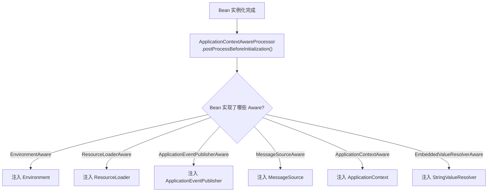

```java
// ApplicationContextAwareProcessor 核心逻辑
class ApplicationContextAwareProcessor implements BeanPostProcessor {

    private final ConfigurableApplicationContext applicationContext;

    @Override
    public Object postProcessBeforeInitialization(Object bean, String beanName) throws BeansException {
        // 依次检查并注入 Aware 接口的依赖
        invokeAwareInterfaces(bean);
        return bean;
    }

    private void invokeAwareInterfaces(Object bean) {
        if (bean instanceof EnvironmentAware environmentAware) {
            environmentAware.setEnvironment(this.applicationContext.getEnvironment());
        }
        if (bean instanceof EmbeddedValueResolverAware resolverAware) {
            resolverAware.setEmbeddedValueResolver(this.applicationContext);
        }
        if (bean instanceof ResourceLoaderAware loaderAware) {
            loaderAware.setResourceLoader(this.applicationContext);
        }
        if (bean instanceof ApplicationEventPublisherAware publisherAware) {
            publisherAware.setApplicationEventPublisher(this.applicationContext);
        }
        if (bean instanceof MessageSourceAware sourceAware) {
            sourceAware.setMessageSource(this.applicationContext);
        }
        if (bean instanceof ApplicationContextAware contextAware) {
            contextAware.setApplicationContext(this.applicationContext);
        }
    }
}
```

::: tip 为什么 Aware 接口用 ignoreDependencyInterface 忽略？
`beanFactory.ignoreDependencyInterface(EnvironmentAware.class)` 的作用是：**不让自动装配（`@Autowired`）去注入 `Environment` 类型的依赖给 `EnvironmentAware` 的 setter 方法**。因为 `ApplicationContextAwareProcessor` 已经在 `postProcessBeforeInitialization` 阶段手动调用了 setter，如果不忽略，Spring 还会尝试用自动装配再注入一次，可能导致冲突或重复调用。
:::

### invokeBeanFactoryPostProcessors() 深度剖析

这是 `refresh()` 中最核心的步骤——自动配置在此生效。

#### 执行顺序规则

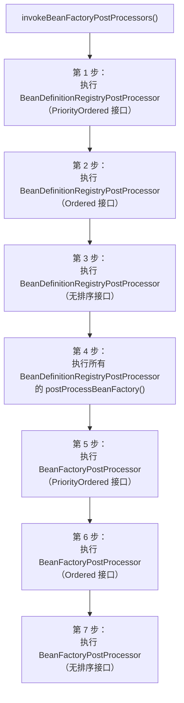

::: warning 关键理解
`BeanDefinitionRegistryPostProcessor` 是 `BeanFactoryPostProcessor` 的子接口，多了一个 `postProcessBeanDefinitionRegistry()` 方法。执行顺序的核心规则：
1. `BeanDefinitionRegistryPostProcessor` 先于 `BeanFactoryPostProcessor` 执行
2. 同类中，`PriorityOrdered` > `Ordered` > 无排序接口
3. `ConfigurationClassPostProcessor` 实现了 `PriorityOrdered`，所以最先执行——这是自动配置生效的前提
:::

#### ConfigurationClassPostProcessor 全链路

```java
// ConfigurationClassPostProcessor.java
public void postProcessBeanDefinitionRegistry(BeanDefinitionRegistry registry) {
    int registryId = registry.hashCode();
    // 防止重复处理
    if (this.registriesPostProcessed.contains(registryId)) {
        throw new IllegalStateException("postProcessBeanDefinitionRegistry already called");
    }
    this.registriesPostProcessed.add(registryId);
    processConfigBeanDefinitions(registry);
}
```

```java
public void processConfigBeanDefinitions(BeanDefinitionRegistry registry) {
    // 1. 从已有 BeanDefinition 中找出配置类
    List<BeanDefinitionHolder> configCandidates = new ArrayList<>();
    for (String beanName : registry.getBeanDefinitionNames()) {
        BeanDefinition beanDef = registry.getBeanDefinition(beanName);
        // 检查是否是 @Configuration 类
        if (ConfigurationClassUtils.checkConfigurationClassCandidate(beanDef, this.metadataReaderFactory)) {
            configCandidates.add(new BeanDefinitionHolder(beanDef, beanName));
        }
    }

    // 2. 创建配置类解析器
    ConfigurationClassParser parser = new ConfigurationClassParser(
        this.metadataReaderFactory, this.problemReporter, this.environment,
        this.resourceLoader, this.componentScanBeanNameGenerator, registry);

    // 3. 解析配置类（递归处理 @Import、@ComponentScan 等）
    Set<BeanDefinitionHolder> candidates = new LinkedHashSet<>(configCandidates);
    Set<ConfigurationClass> alreadyParsed = new HashSet<>(configCandidates.size());
    do {
        parser.parse(candidates);
        parser.validate();

        Set<ConfigurationClass> configClasses = new LinkedHashSet<>(parser.getConfigurationClasses());
        configClasses.removeAll(alreadyParsed);

        // 4. 读取配置类中定义的 Bean 并注册 BeanDefinition
        this.reader.loadBeanDefinitions(configClasses);
        alreadyParsed.addAll(configClasses);

        // 本轮解析若通过 @Import 等发现了新的配置类，则继续循环解析
        candidates = removeAlreadyParsed(candidates, alreadyParsed);
    }
    while (!candidates.isEmpty());
}
```

#### 配置类解析的递归过程

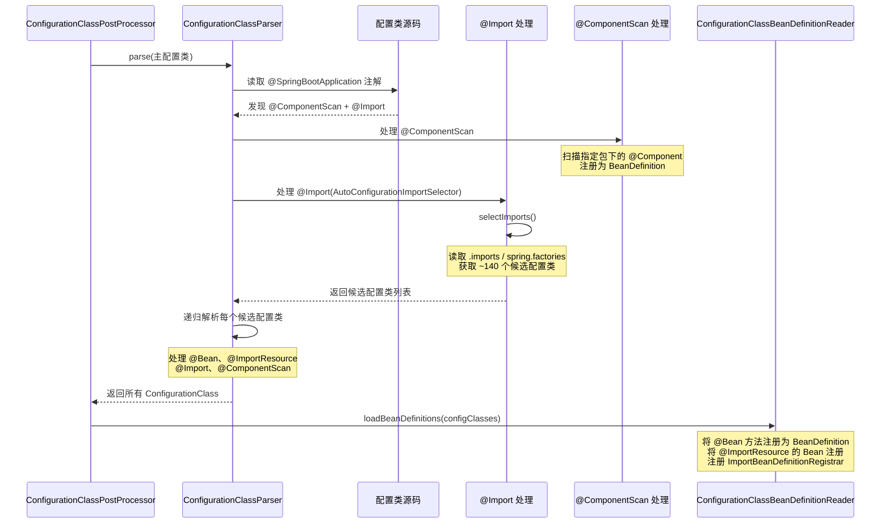

#### 自动配置协商的完整流程

```java
// AutoConfigurationImportSelector.java
protected AutoConfigurationEntry getAutoConfigurationEntry(AnnotationMetadata annotationMetadata) {
    if (!isEnabled(annotationMetadata)) {
        return EMPTY_ENTRY;
    }

    // 步骤 1：获取注解属性（exclude 等）
    AnnotationAttributes attributes = getAttributes(annotationMetadata);

    // 步骤 2：获取所有候选配置类（~140 个）
    List<String> configurations = getCandidateConfigurations(annotationMetadata, attributes);

    // 步骤 3：去重
    configurations = removeDuplicates(configurations);

    // 步骤 4：排除指定的配置类
    Set<String> exclusions = getExclusions(annotationMetadata, attributes);
    checkExcludedClasses(configurations, exclusions);
    configurations.removeAll(exclusions);

    // 步骤 5：过滤——根据条件注解快速排除不满足的配置类
    //    使用 AutoConfigurationImportFilter 进行高效过滤
    //    不需要实际加载配置类，只检查 @ConditionalOnClass 等注解元数据
    configurations = getConfigurationClassFilter().filter(configurations);

    // 步骤 6：触发自动配置导入事件
    fireAutoConfigurationImportEvents(configurations, exclusions);

    return new AutoConfigurationEntry(configurations, exclusions);
}
```

::: details 过滤器的性能优化原理
Spring Boot 2.7+ 使用 `AutoConfigurationImportFilter` 在加载配置类之前进行快速过滤。其核心思想是：**不需要把 ~140 个配置类全部加载到 JVM 中再判断条件**，而是通过读取编译时生成的元数据文件 `META-INF/spring/autoconfigure-metadata.properties` 来判断 `@ConditionalOnClass` 条件。

```properties
## META-INF/spring/autoconfigure-metadata.properties
## 编译时自动生成，记录每个自动配置类的条件（Boot 3.x 中 Servlet 类为 jakarta 命名空间）
org.springframework.boot.autoconfigure.web.servlet.WebMvcAutoConfiguration.ConditionalOnClass=jakarta.servlet.Servlet
org.springframework.boot.autoconfigure.jdbc.DataSourceAutoConfiguration.ConditionalOnClass=javax.sql.DataSource
```

这样，Spring Boot 只需检查类路径上是否有 `jakarta.servlet.Servlet`，就能判断 `WebMvcAutoConfiguration` 是否需要加载，避免了加载配置类本身的开销。
:::

### registerBeanPostProcessors() 详解

`registerBeanPostProcessors()` 是 `refresh()` 的第 6 步，负责注册所有 `BeanPostProcessor`。与 `BeanFactoryPostProcessor` 不同，`BeanPostProcessor` 作用于 **Bean 实例化之后**，可以修改 Bean 的属性或替换 Bean。

#### 注册顺序

```java
// PostProcessorRegistrationDelegate.java
public static void registerBeanPostProcessors(
        ConfigurableListableBeanFactory beanFactory, AbstractApplicationContext applicationContext) {

    // 1. 获取所有 BeanPostProcessor 的 BeanName
    String[] postProcessorNames = beanFactory.getBeanNamesForType(BeanPostProcessor.class, true, false);

    int beanProcessorTargetCount = beanFactory.getBeanPostProcessorCount() + 1 + postProcessorNames.length;

    // 2. 分类处理
    List<BeanPostProcessor> priorityOrderedPostProcessors = new ArrayList<>();
    List<BeanPostProcessor> internalPostProcessors = new ArrayList<>();
    List<String> orderedPostProcessorNames = new ArrayList<>();
    List<String> nonOrderedPostProcessorNames = new ArrayList<>();

    for (String ppName : postProcessorNames) {
        if (beanFactory.isTypeMatch(ppName, PriorityOrdered.class)) {
            BeanPostProcessor pp = beanFactory.getBean(ppName, BeanPostProcessor.class);
            priorityOrderedPostProcessors.add(pp);
            if (pp instanceof MergedBeanDefinitionPostProcessor) {
                internalPostProcessors.add(pp);
            }
        } else if (beanFactory.isTypeMatch(ppName, Ordered.class)) {
            orderedPostProcessorNames.add(ppName);
        } else {
            nonOrderedPostProcessorNames.add(ppName);
        }
    }

    // 3. 按 PriorityOrdered → Ordered → 无排序 的顺序注册
    sortPostProcessors(priorityOrderedPostProcessors, beanFactory);
    registerBeanPostProcessors(beanFactory, priorityOrderedPostProcessors);

    List<BeanPostProcessor> orderedPostProcessors = new ArrayList<>();
    for (String ppName : orderedPostProcessorNames) {
        BeanPostProcessor pp = beanFactory.getBean(ppName, BeanPostProcessor.class);
        orderedPostProcessors.add(pp);
        // ...
    }
    sortPostProcessors(orderedPostProcessors, beanFactory);
    registerBeanPostProcessors(beanFactory, orderedPostProcessors);

    List<BeanPostProcessor> nonOrderedPostProcessors = new ArrayList<>();
    for (String ppName : nonOrderedPostProcessorNames) {
        BeanPostProcessor pp = beanFactory.getBean(ppName, BeanPostProcessor.class);
        nonOrderedPostProcessors.add(pp);
        // ...
    }
    registerBeanPostProcessors(beanFactory, nonOrderedPostProcessors);

    // 4. 最后注册 MergedBeanDefinitionPostProcessor
    sortPostProcessors(internalPostProcessors, beanFactory);
    registerBeanPostProcessors(beanFactory, internalPostProcessors);

    // 5. 注册 ApplicationListenerDetector
    beanFactory.addBeanPostProcessor(new ApplicationListenerDetector(applicationContext));
}
```

#### Spring Boot 内置的关键 BeanPostProcessor

| BeanPostProcessor | 作用 | 优先级 |
|---|---|---|
| `ApplicationContextAwareProcessor` | 处理 Aware 接口回调 | 最高（在 `prepareBeanFactory()` 中注册） |
| `AutowiredAnnotationBeanPostProcessor` | 处理 `@Autowired`、`@Value` 注入 | PriorityOrdered |
| `CommonAnnotationBeanPostProcessor` | 处理 `@Resource`、`@PostConstruct`、`@PreDestroy` | PriorityOrdered |
| `ConfigurationPropertiesBindingPostProcessor` | 处理 `@ConfigurationProperties` 绑定 | PriorityOrdered |
| `MethodValidationPostProcessor` | 处理 `@Validated` 方法级校验 | 无排序 |
| `AsyncAnnotationBeanPostProcessor` | 处理 `@Async` 代理创建 | 无排序 |
| `AutoProxyCreator`（多种） | 处理 AOP 代理创建 | 低优先级 |

```mermaid
flowchart LR
    A["Bean 实例化"] --> B["InstantiationAwareBPP<br/>.postProcessBeforeInstantiation()"]
    B --> C["MergedBeanDefinitionBPP<br/>.postProcessMergedBeanDefinition()"]
    C --> D["属性填充<br/>populateBean()"]
    D --> E["InstantiationAwareBPP<br/>.postProcessProperties()"]
    E --> F["BeanPostProcessor<br/>.postProcessBeforeInitialization()"]
    F --> G["@PostConstruct<br/>初始化方法"]
    G --> H["BeanPostProcessor<br/>.postProcessAfterInitialization()"]
    H --> I["AOP 代理生成"]

```

### finishRefresh() 与容器生命周期

#### finishRefresh() 源码

```java
// AbstractApplicationContext.java
protected void finishRefresh() {
    // 1. 清除资源缓存
    clearResourceCaches();

    // 2. 初始化 LifecycleProcessor（生命周期处理器）
    initLifecycleProcessor();

    // 3. 调用 LifecycleProcessor.onRefresh()——启动所有 SmartLifecycle Bean
    getLifecycleProcessor().onRefresh();

    // 4. 发布 ContextRefreshedEvent
    publishEvent(new ContextRefreshedEvent(this));

    // 5. 向 MBeanServer 注册 JMX 信息（如果启用）
    if (!NativeDetector.inNativeImage()) {
        LiveBeansView.registerApplicationContext(this);
    }
}
```

#### Lifecycle 接口体系

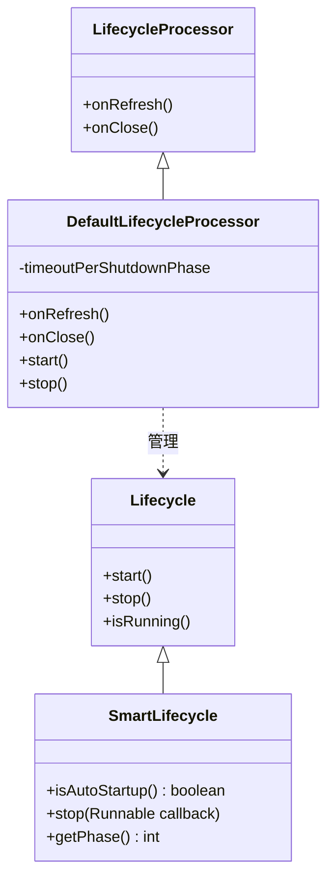

#### SmartLifecycle 的 Phase 机制

```java
// 自定义 Lifecycle Bean
@Component
public class MyLifecycleBean implements SmartLifecycle {

    private volatile boolean running = false;

    @Override
    public void start() {
        log.info("MyLifecycleBean 启动");
        this.running = true;
    }

    @Override
    public void stop() {
        log.info("MyLifecycleBean 停止");
        this.running = false;
    }

    @Override
    public void stop(Runnable callback) {
        // 支持异步停止，完成后调用 callback
        new Thread(() -> {
            try {
                Thread.sleep(1000);  // 模拟优雅停机
                stop();
            } finally {
                callback.run();
            }
        }).start();
    }

    @Override
    public boolean isRunning() {
        return this.running;
    }

    @Override
    public boolean isAutoStartup() {
        return true;  // 容器刷新时自动启动
    }

    @Override
    public int getPhase() {
        return 0;  // 数字越小越先启动、越后停止
    }
}
```

::: tip Phase 数字的含义
- **启动顺序**：Phase 数字小的先启动
- **停止顺序**：Phase 数字大的先停止
- 默认 Phase = 0
- Web Server 的 Phase = `Integer.MAX_VALUE - 1`（最后启动，最先停止——确保 Bean 都就绪后再接收请求）
:::

### 容器关闭流程详解

#### 关闭入口

```java
// SpringApplication.java
public ConfigurableApplicationContext run(String... args) {
    // ...
    try {
        // 注册 Shutdown Hook
        if (this.registerShutdownHook) {
            shutdownHook.registerApplicationContext(context);
        }
        // ...
    } catch (Throwable ex) {
        handleRunFailure(context, ex, listeners);
    }
}
```

#### doClose() 完整流程

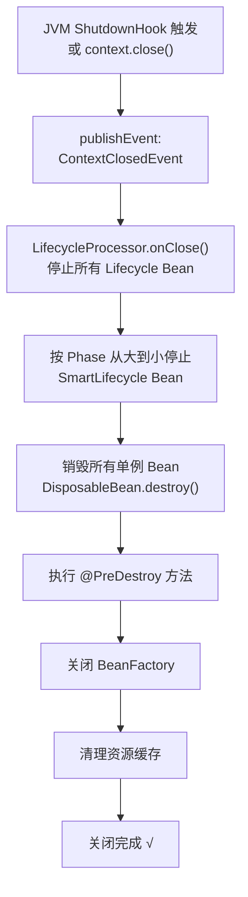

```java
// AbstractApplicationContext.java
protected void doClose() {
    // 检查是否正在运行
    if (this.active.get() && this.closed.compareAndSet(false, true)) {
        // 1. 发布 ContextClosedEvent
        publishEvent(new ContextClosedEvent(this));

        // 2. 停止所有 Lifecycle Bean
        if (this.lifecycleProcessor != null) {
            this.lifecycleProcessor.onClose();
        }

        // 3. 销毁所有单例 Bean
        destroyBeans();

        // 4. 关闭 BeanFactory
        closeBeanFactory();

        // 5. 子类清理
        onClose();

        // 6. 重置状态
        this.active.set(false);
    }
}
```

#### 优雅停机配置

```yaml
## application.yml
server:
  shutdown: graceful  # 启用优雅停机

spring:
  lifecycle:
    timeout-per-shutdown-phase: 30s  # 每个关闭阶段超时时间
```

```java
// Spring Boot 2.3+ 优雅停机工作原理
// 1. 接收 SIGTERM 信号
// 2. Web Server 停止接收新请求
// 3. 等待现有请求处理完成（最多 30s）
// 4. 关闭 Spring 容器
// 5. 销毁所有 Bean
```

::: danger 优雅停机的常见坑
1. **默认不开启**：必须显式设置 `server.shutdown=graceful`
2. **超时即强杀**：超过 `timeout-per-shutdown-phase` 后，Spring 会强制销毁 Bean，正在处理的请求会被中断
3. **只对嵌入式容器有效**：部署到外部 Tomcat 时需要配合 Tomcat 自身的 shutdown 机制
4. **线程池未关闭**：`@Async` 使用的线程池默认不会优雅关闭，需要自定义 `TaskExecutor` 并实现 `SmartLifecycle`
5. **Kubernetes 场景**：需要配合 `terminationGracePeriodSeconds`，且 `preStop` 钩子建议用 `sleep` 让 Service 注册表更新
:::

```java
// 自定义优雅停机的线程池
@Configuration
public class AsyncConfig {

    @Bean
    public TaskExecutor taskExecutor() {
        ThreadPoolTaskExecutor executor = new ThreadPoolTaskExecutor();
        executor.setCorePoolSize(10);
        executor.setMaxPoolSize(50);
        executor.setQueueCapacity(200);
        executor.setWaitForTasksToCompleteOnShutdown(true);  // 等待任务完成
        executor.setAwaitTerminationSeconds(60);  // 最多等 60 秒
        executor.initialize();
        return executor;
    }
}
```

```yaml
## Kubernetes 部署配置
## 确保 Pod 优雅终止
spec:
  terminationGracePeriodSeconds: 60
  containers:
    - name: myapp
      lifecycle:
        preStop:
          exec:
            command: ["sh", "-c", "sleep 10"]  # 等待 Service 注册表更新
```

### BootstrapContext 机制

Spring Boot 2.4 引入了 `BootstrapContext`，用于在 `ApplicationContext` 创建之前提供基础设施支持。

#### BootstrapContext 的生命周期

```mermaid
flowchart TD
    A["run() 开始"] --> B["创建 DefaultBootstrapContext"]
    B --> C["执行 BootstrapRegistryInitializer"]
    C --> D["prepareEnvironment()"]
    D --> E["EnvironmentPostProcessor 可使用 BootstrapContext"]
    E --> F["createApplicationContext()"]
    F --> G["prepareContext()"]
    G --> H["bootstrapContext.close()"]
    Note over H: 生命周期结束<br/>ApplicationContext 已就绪

```

#### 注册自定义 BootstrapRegistryInitializer

```java
// 自定义 BootstrapRegistryInitializer
public class MyBootstrapRegistryInitializer implements BootstrapRegistryInitializer {

    @Override
    public void initialize(BootstrapRegistry registry) {
        // 在 ApplicationContext 创建之前注册基础设施 Bean
        registry.register(MyInfrastructureService.class, context ->
            new MyInfrastructureService(context.get(ClassLoader.class))
        );
    }
}
```

```java
// 注册方式
SpringApplication app = new SpringApplication(Application.class);
app.addBootstrapRegistryInitializer(new MyBootstrapRegistryInitializer());
app.run(args);
```

```properties
## 或通过 spring.factories 注册
org.springframework.boot.BootstrapRegistryInitializer=\
com.example.MyBootstrapRegistryInitializer
```

::: tip BootstrapContext 与 ApplicationContext 的区别
| 特性 | BootstrapContext | ApplicationContext |
|------|-----------------|-------------------|
| 存在阶段 | 容器创建之前 | 容器创建之后 |
| 功能 | 提供基础设施支持 | 完整的 IoC 容器 |
| Bean 管理 | 不支持 `@Autowired` | 支持完整的依赖注入 |
| 典型用途 | 注册早期需要的基础设施 | 注册业务 Bean |
| 生命周期 | `run()` 开始到 `prepareContext()` 结束 | 从 `createApplicationContext()` 到应用关闭 |
:::

### FailureAnalyzer 启动失败分析器

#### 工作机制

当 Spring Boot 启动失败时，`FailureAnalyzers` 会捕获异常并生成人类可读的错误报告：

```java
// Spring Boot 启动失败处理
private void handleRunFailure(ConfigurableApplicationContext context,
        Throwable exception, SpringApplicationRunListeners listeners) {

    try {
        // 1. 尝试分析异常
        FailureAnalyzers analyzers = null;
        if (context != null) {
            analyzers = new FailureAnalyzers(context);
        }

        // 2. 如果有匹配的 Analyzer，输出友好的错误报告
        FailureAnalysis analysis = analyzeFailure(exception, analyzers);
        if (analysis != null) {
            reportFailure(analysis);
        } else {
            // 3. 没有 Analyzer 能处理，输出原始异常堆栈
            log.error("Application run failed", exception);
        }
    } catch (Throwable ex) {
        log.error("Unable to provide failure analysis", ex);
    } finally {
        // 4. 清理资源
        if (context != null) {
            context.close();
        }
        listeners.failed(context, exception);
    }
}
```

#### 内置的 FailureAnalyzer

| FailureAnalyzer | 处理的异常 | 输出的建议 |
|---|---|---|
| `PortInUseFailureAnalyzer` | `PortInUseException` | 端口被占用，建议修改端口或停止占用进程 |
| `NoSuchBeanDefinitionFailureAnalyzer` | `NoSuchBeanDefinitionException` | Bean 不存在，建议检查 `@ComponentScan` 或添加依赖 |
| `MissingParameterNamesFailureAnalyzer` | `ParameterCountException` | 构造器参数名未保留，建议开启 `-parameters` 编译选项 |
| `BindFailureAnalyzer` | `BindException` | 配置绑定失败，提示具体属性和原因 |
| `UnboundConfigurationPropertyFailureAnalyzer` | `UnboundConfigurationPropertyException` | 配置属性未被绑定，提示未识别的属性 |
| `DataSourceBeanCreationFailureAnalyzer` | 数据源创建失败 | 缺少数据库配置，建议添加 `spring.datasource.*` |
| `NoSuchMethodFailureAnalyzer` | `NoSuchMethodError` | 版本冲突，建议检查依赖 |
| `NoUniqueBeanDefinitionFailureAnalyzer` | `NoUniqueBeanDefinitionException` | 多个同类型 Bean，建议使用 `@Primary` 或 `@Qualifier` |
| `ValidationExceptionFailureAnalyzer` | 配置校验异常 | 提示具体的校验错误 |

#### 自定义 FailureAnalyzer

```java
// 自定义 FailureAnalyzer：处理 Redis 连接失败
public class RedisConnectionFailureAnalyzer extends AbstractFailureAnalyzer<RedisConnectionFailureException> {

    @Override
    protected FailureAnalysis analyze(Throwable rootFailure,
                                      RedisConnectionFailureException cause) {
        return new FailureAnalysis(
            // 问题描述
            "Redis 连接失败: " + cause.getMessage(),
            // 建议的修复方案
            "请检查以下配置:\n" +
            "1. Redis 服务是否已启动\n" +
            "2. spring.data.redis.host 和 port 是否正确\n" +
            "3. 如果是远程 Redis，检查防火墙和网络连通性\n" +
            "4. 如果不需要 Redis，排除 RedisAutoConfiguration:\n" +
            "   @SpringBootApplication(exclude = RedisAutoConfiguration.class)",
            cause
        );
    }
}
```

```properties
## META-INF/spring.factories
org.springframework.boot.diagnostics.FailureAnalyzer=\
com.example.RedisConnectionFailureAnalyzer
```

### Spring Boot 3.x 启动流程变化

#### 关键变化对比

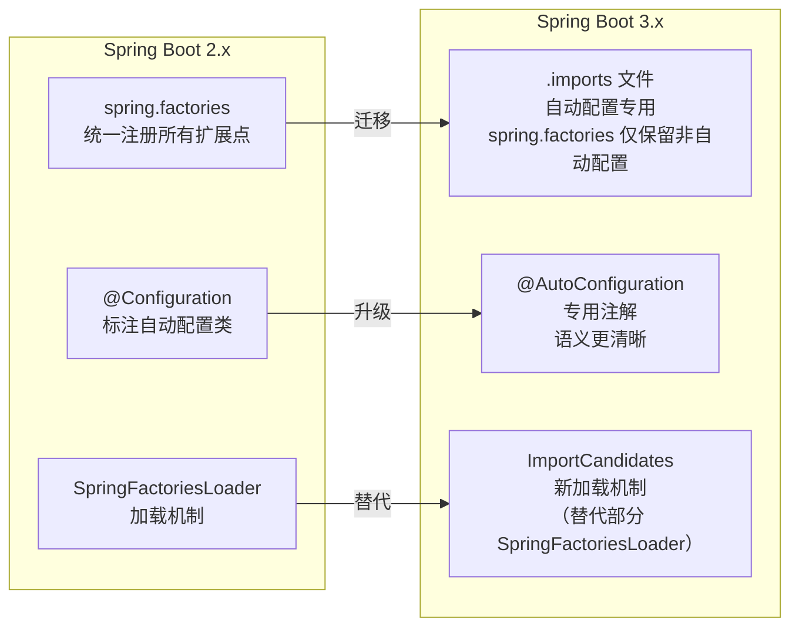

#### GraalVM AOT 处理

Spring Boot 3.x 在启动前新增了 AOT（Ahead-Of-Time）处理阶段：

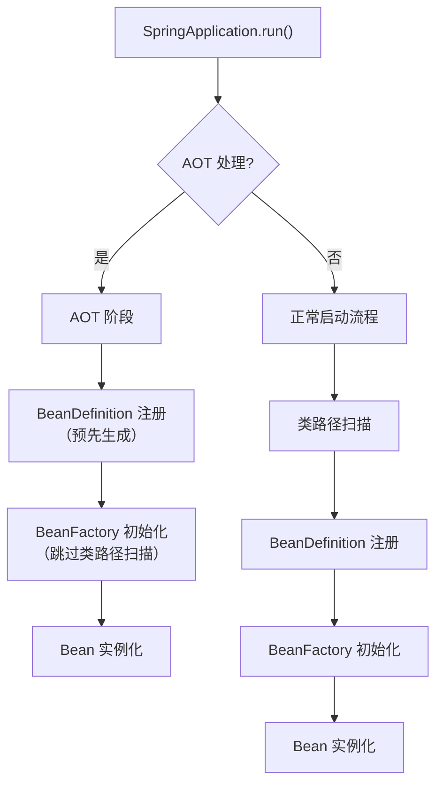

```java
// AOT 处理生成的代码（构建时自动生成）
// target/generated/aot/com/example/Application__BeanDefinitions.java
public class Application__BeanDefinitions implements BeanDefinitions {

    @Override
    public void accept(BeanDefinitionRegistry registry) {
        // 预先生成的 BeanDefinition 注册代码
        // 跳过了运行时的类路径扫描和条件判断
        registerBeanDefinition(registry, "myController", MyController.class);
        registerBeanDefinition(registry, "myService", MyService.class);
    }
}
```

::: tip AOT 的性能收益
1. **跳过类路径扫描**：构建时已确定所有 Bean
2. **跳过条件判断**：构建时已评估 `@Conditional` 条件
3. **跳过反射**：构建时已生成直接调用代码
4. **更快的启动**：从秒级降到毫秒级（Native Image 模式）
5. **更低的内存**：50-100MB vs 200-500MB（JIT 模式）
:::

#### 新的启动事件

Spring Boot 3.x 新增了 `AvailabilityChangeEvent`，替代了部分原有的启动事件：

```java
// Spring Boot 3.x 启动事件序列
@Component
public class StartupEventListener {

    // 容器就绪前的可用性状态变化
    @EventListener
    public void onAvailabilityChange(AvailabilityChangeEvent<ReadinessState> event) {
        if (event.getState() == ReadinessState.ACCEPTING_TRAFFIC) {
            // 应用已准备好接收流量
            log.info("应用已就绪，可以接收请求");
        } else if (event.getState() == ReadinessState.REFUSING_TRAFFIC) {
            // 应用拒绝流量（正在关闭）
            log.info("应用正在关闭，拒绝新请求");
        }
    }

    // 存活状态变化
    @EventListener
    public void onLivenessChange(AvailabilityChangeEvent<LivenessState> event) {
        if (event.getState() == LivenessState.CORRECT) {
            // 应用内部状态正常
            log.info("应用存活状态正常");
        } else if (event.getState() == LivenessState.BROKEN) {
            // 应用内部状态异常（如死锁、资源耗尽）
            log.error("应用存活状态异常！");
        }
    }
}
```

::: warning Readiness vs Liveness 的区别
这是 Kubernetes 探针概念的映射：
- **Readiness（就绪）**：应用是否可以接收流量？→ `ReadinessState.ACCEPTING_TRAFFIC / REFUSING_TRAFFIC`
- **Liveness（存活）**：应用内部状态是否正常？→ `LivenessState.CORRECT / BROKEN`

Spring Boot Actuator 将这些状态暴露为 `/actuator/health/readiness` 和 `/actuator/health/liveness` 端点，可以直接对接 Kubernetes 的 `readinessProbe` 和 `livenessProbe`。
:::

### 实战场景深度解析

#### 场景一：启动时动态加载配置

```java
// 从远程配置中心（如 Nacos）加载配置
public class NacosConfigEnvironmentPostProcessor implements EnvironmentPostProcessor, Ordered {

    @Override
    public void postProcessEnvironment(ConfigurableEnvironment environment,
                                       SpringApplication application) {
        String serverAddr = environment.getProperty("nacos.server-addr", "localhost:8848");
        String namespace = environment.getProperty("nacos.namespace", "public");
        String dataId = environment.getProperty("nacos.data-id", "application");

        try {
            // 从 Nacos 拉取配置
            NacosConfigService configService = new NacosConfigService(serverAddr, namespace);
            String config = configService.getConfig(dataId, "DEFAULT_GROUP", 5000);

            if (config != null) {
                // 将远程配置解析为 PropertySource 并添加到 Environment
                YamlPropertySourceLoader loader = new YamlPropertySourceLoader();
                List<PropertySource<?>> propertySources =
                    loader.load("nacosConfig", new ByteArrayResource(config.getBytes()));

                // 优先级高于 application.yml，低于命令行参数
                for (PropertySource<?> ps : propertySources) {
                    environment.getPropertySources().addAfter("applicationConfigurationProperties", ps);
                }
                log.info("从 Nacos 加载配置成功: dataId={}", dataId);
            }
        } catch (NacosException e) {
            log.warn("从 Nacos 加载配置失败，使用本地配置: {}", e.getMessage());
        }
    }

    @Override
    public int getOrder() {
        return Ordered.LOWEST_PRECEDENCE - 1;  // 在内置 EnvironmentPostProcessor(如 ConfigData)之后执行
    }
}
```

#### 场景二：启动耗时分析

```java
// 使用 BufferingApplicationStartup 记录启动耗时
@SpringBootApplication
public class Application {

    public static void main(String[] args) {
        SpringApplication app = new SpringApplication(Application.class);
        // 开启启动步骤记录
        app.setApplicationStartup(new BufferingApplicationStartup(2048));
        ConfigurableApplicationContext context = app.run(args);

        // 分析启动耗时
        analyzeStartupTime(context);
    }

    private static void analyzeStartupTime(ConfigurableApplicationContext context) {
        ApplicationStartup startup = context.getApplicationStartup();
        if (!(startup instanceof BufferingApplicationStartup buffering)) {
            return;
        }

        List<StartupStep> steps = buffering.drain();

        // 1. 找出最耗时的 10 个步骤
        System.out.println("=== 启动耗时 Top 10 ===");
        steps.stream()
            .sorted(Comparator.comparing(
                (StartupStep s) -> s.getDuration().toMillis()).reversed())
            .limit(10)
            .forEach(s -> System.out.printf(
                "%-50s %5dms%n", s.getName(), s.getDuration().toMillis()));

        // 2. 按 Category 分组统计
        System.out.println("\n=== 分类耗时统计 ===");
        Map<String, Long> categoryTime = steps.stream()
            .collect(Collectors.groupingBy(
                s -> s.getName().split("\\.")[0],
                Collectors.summingLong(s -> s.getDuration().toMillis())));

        categoryTime.entrySet().stream()
            .sorted(Map.Entry.<String, Long>comparingByValue().reversed())
            .forEach(e -> System.out.printf("%-30s %5dms%n", e.getKey(), e.getValue()));

        // 3. Bean 初始化耗时统计
        System.out.println("\n=== Bean 初始化耗时 Top 10 ===");
        steps.stream()
            .filter(s -> s.getName().equals("spring.bean.instantiate"))
            .sorted(Comparator.comparing(
                (StartupStep s) -> s.getDuration().toMillis()).reversed())
            .limit(10)
            .forEach(s -> {
                String beanName = s.getTags().stream()
                    .filter(t -> t.getKey().equals("beanName"))
                    .map(StartupStep.Tag::getValue)
                    .findFirst().orElse("unknown");
                System.out.printf("%-50s %5dms%n", beanName, s.getDuration().toMillis());
            });
    }
}
```

::: details 典型启动耗时分析结果
```text
=== 启动耗时 Top 10 ===
spring.context.refresh                                3200ms
spring.bean.instantiate                               2100ms
spring.context.beans.post-process                     1500ms
spring.context.config.import                          800ms
spring.boot.autoconfigure                             600ms

=== 分类耗时统计 ===
spring                                                7500ms
spring.beans                                          3200ms
spring.boot                                           1200ms

=== Bean 初始化耗时 Top 10 ===
dataSource                                            450ms
entityManagerFactory                                  380ms
redisConnectionFactory                                200ms
tomcatServletWebServerFactory                         180ms
```
:::

#### 场景三：条件化启动组件

```java
// 根据 Profile 动态注册不同的 Bean
public class ProfileAwareInitializer implements ApplicationContextInitializer<ConfigurableApplicationContext> {

    @Override
    public void initialize(ConfigurableApplicationContext context) {
        String[] activeProfiles = context.getEnvironment().getActiveProfiles();

        if (Arrays.asList(activeProfiles).contains("dev")) {
            // 开发环境：注册 Mock 服务
            context.getBeanFactory().registerSingleton("paymentService",
                new MockPaymentService());
            context.getBeanFactory().registerSingleton("notificationService",
                new MockNotificationService());
        } else if (Arrays.asList(activeProfiles).contains("prod")) {
            // 生产环境：注册真实服务
            // 这里只注册 BeanDefinition，实际实例化由 Spring 管理
            GenericBeanDefinition beanDefinition = new GenericBeanDefinition();
            beanDefinition.setBeanClass(RealPaymentService.class);
            context.getBeanFactory().registerBeanDefinition("paymentService", beanDefinition);
        }
    }
}
```

#### 场景四：防止重复启动

```java
// 使用文件锁防止同一应用重复启动
public class SingleInstanceInitializer implements ApplicationContextInitializer<ConfigurableApplicationContext> {

    private FileLock fileLock;
    private FileOutputStream fileOutputStream;

    @Override
    public void initialize(ConfigurableApplicationContext context) {
        try {
            String lockFile = System.getProperty("java.io.tmpdir") +
                "/myapp-" + context.getEnvironment().getProperty("server.port", "8080") + ".lock";

            fileOutputStream = new FileOutputStream(lockFile);
            fileLock = fileOutputStream.getChannel().tryLock();

            if (fileLock == null) {
                throw new IllegalStateException(
                    "应用已在运行中！请先停止已有实例。锁定文件: " + lockFile);
            }

            // 注册关闭钩子释放文件锁
            Runtime.getRuntime().addShutdownHook(new Thread(() -> {
                try {
                    if (fileLock != null) fileLock.release();
                    if (fileOutputStream != null) fileOutputStream.close();
                    new File(lockFile).delete();
                } catch (IOException e) {
                    // 忽略关闭异常
                }
            }));
        } catch (IOException e) {
            throw new RuntimeException("无法创建实例锁定文件", e);
        }
    }
}
```

::: danger 生产事故案例：重复启动导致数据错乱
某团队在定时任务服务上部署了两个实例，但未做分布式锁。结果：
1. 两个实例同时拉取消息队列消息，导致消息重复处理
2. 定时任务双倍执行，重复扣款
3. 数据库乐观锁频繁冲突

**教训：** 分布式环境下，不能仅靠文件锁防止重复启动。应使用分布式锁（Redis / ZooKeeper）或任务调度框架（XXL-JOB）来保证单实例执行。
:::

#### 场景五：启动阶段的自检

```java
// 启动完成后自动执行健康检查
@Component
@Order(1)
public class StartupHealthChecker implements ApplicationRunner {

    private final Environment environment;
    private final ApplicationContext applicationContext;

    public StartupHealthChecker(Environment environment,
                                ApplicationContext applicationContext) {
        this.environment = environment;
        this.applicationContext = applicationContext;
    }

    @Override
    public void run(ApplicationArguments args) throws Exception {
        String appName = environment.getProperty("spring.application.name", "unknown");
        String port = environment.getProperty("server.port", "8080");
        String[] activeProfiles = environment.getActiveProfiles();

        log.info("========== 启动自检 ==========");
        log.info("应用名称: {}", appName);
        log.info("服务端口: {}", port);
        log.info("活跃 Profile: {}", Arrays.toString(activeProfiles));

        // 检查关键 Bean 是否存在
        checkBean("dataSource", "数据源");
        checkBean("redisConnectionFactory", "Redis 连接工厂");

        // 检查关键配置
        checkProperty("spring.datasource.url", "数据库连接地址");
        checkProperty("spring.data.redis.host", "Redis 主机地址");

        log.info("========== 自检完成 ==========");
    }

    private void checkBean(String beanName, String description) {
        if (applicationContext.containsBean(beanName)) {
            log.info("√ {} ({}) 已加载", description, beanName);
        } else {
            log.warn(" {} ({}) 未加载", description, beanName);
        }
    }

    private void checkProperty(String key, String description) {
        String value = environment.getProperty(key);
        if (value != null) {
            log.info("√ {}: {}", description, maskSensitive(value));
        } else {
            log.warn(" {} 未配置 ({})", description, key);
        }
    }

    private String maskSensitive(String value) {
        // 脱敏处理
        if (value.contains("password") || value.contains("secret")) {
            return "******";
        }
        return value;
    }
}
```

### 常见启动问题排查

#### 1. 启动失败但错误信息不明确

```bash
## 开启 debug 模式
java -jar myapp.jar --debug

## 或设置
debug: true

## 查看 Auto-Configuration 报告
## 查看 CONDITIONS EVALUATION REPORT
```

#### 2. Bean 创建失败

```
Error creating bean with name 'xxx': Unsatisfied dependency expressed through...
```

**排查步骤：**
1. 检查 `@ComponentScan` 范围
2. 检查条件注解是否满足
3. 使用 `--debug` 查看自动配置报告
4. 检查循环依赖

#### 3. 端口冲突

```bash
## 查看端口占用
lsof -i :8080

## 修改端口
java -jar myapp.jar --server.port=8081
```

#### 4. 启动慢

```java
// 使用 SpringBootStartupReport 分析启动耗时
@SpringBootApplication
public class Application {
    public static void main(String[] args) {
        SpringApplication app = new SpringApplication(Application.class);
        app.setApplicationStartup(new BufferingApplicationStartup(2048));
        ConfigurableApplicationContext context = app.run(args);

        // 输出启动耗时报告
        ApplicationStartup startup = context.getApplicationStartup();
        if (startup instanceof BufferingApplicationStartup buffering) {
            buffering.drain()
                .stream()
                .sorted(Comparator.comparing(StartupStep::getDuration).reversed())
                .limit(10)
                .forEach(step -> log.info("Step: {} - Duration: {}ms",
                    step.getName(), step.getDuration().toMillis()));
        }
    }
}
```

### 面试要点

#### 1. Spring Boot 启动流程分几个阶段？

**答案：** 两大阶段——`SpringApplication 构造` 和 `run() 执行`。构造阶段推断应用类型、加载 Initializer 和 Listener；run 阶段按序执行：Environment 准备 → Banner 打印 → 容器创建 → 上下文准备 → 容器刷新（最核心）→ CommandLineRunner → 就绪。

#### 2. refresh() 方法做了什么？

**答案：** 12 个标准步骤，核心是：
- `invokeBeanFactoryPostProcessors()`：执行自动配置协商
- `registerBeanPostProcessors()`：注册 Bean 后处理器
- `onRefresh()`：启动内嵌容器
- `finishBeanFactoryInitialization()`：创建所有单例 Bean

#### 3. ApplicationStartingEvent 什么时候触发？能通过 @EventListener 监听吗？

**答案：** 在 run() 开始时触发，此时 ApplicationContext 还没创建，`@EventListener` 不起作用。需要通过 `spring.factories` 或 `SpringApplication.addListeners()` 注册。

#### 4. 如何优化 Spring Boot 启动速度？

**答案：**
- 延迟初始化（`spring.main.lazy-initialization=true`）
- 排除不需要的自动配置
- 使用 GraalVM Native Image（毫秒级启动）
- JVM 参数优化（`-Xms`=`-Xmx`、UseG1GC、urandom）
- 减少组件扫描范围

#### 5. Environment 的 PropertySource 优先级是怎样的？

**答案：** 从高到低：命令行参数 > JNDI > Java 系统属性 > 操作系统环境变量 > Random > application-{profile}.yml > application.yml > @PropertySource > 默认属性。高优先级覆盖低优先级。

#### 6. BeanFactoryPostProcessor 和 BeanPostProcessor 的区别？

**答案：**
- **BeanFactoryPostProcessor**：在 Bean 实例化之前执行，可以修改 BeanDefinition（如修改属性值、添加 BeanDefinition）。典型实现：`ConfigurationClassPostProcessor`
- **BeanPostProcessor**：在 Bean 实例化之后执行，可以修改 Bean 实例（如 AOP 代理）。典型实现：`AutowiredAnnotationBeanPostProcessor`
- 执行时机不同：前者在 `invokeBeanFactoryPostProcessors()` 中执行，后者在 Bean 创建过程中执行

#### 7. 优雅停机如何实现？有哪些注意事项？

**答案：**
- Spring Boot 2.3+ 设置 `server.shutdown=graceful` 开启优雅停机
- 配合 `spring.lifecycle.timeout-per-shutdown-phase` 设置超时时间
- Web Server 先停止接收新请求，等待已有请求处理完成
- 注意：默认不开启；超时会强制销毁；线程池需要单独配置优雅关闭；Kubernetes 需配合 `terminationGracePeriodSeconds`

#### 8. Spring Boot 3.x 相比 2.x 启动流程有什么变化？

**答案：**
1. 自动配置注册从 `spring.factories` 迁移到 `.imports` 文件
2. 自动配置类使用 `@AutoConfiguration` 注解替代 `@Configuration`
3. 新增 AOT 处理阶段，支持 GraalVM Native Image
4. 新增 `AvailabilityChangeEvent`（Readiness/Liveness 状态），对接 Kubernetes 探针
5. `SpringFactoriesLoader` 部分功能被 `ImportCandidates` 替代

#### 9. ConfigurationClassPostProcessor 的作用是什么？

**答案：** 它是自动配置生效的核心处理器，实现了 `BeanDefinitionRegistryPostProcessor` 和 `PriorityOrdered`。其作用：
1. 找出所有 `@Configuration` 配置类
2. 解析配置类中的 `@ComponentScan`、`@Import`、`@Bean` 等注解
3. 处理 `@EnableAutoConfiguration` 导入的 `AutoConfigurationImportSelector`
4. 加载自动配置类并注册 BeanDefinition

#### 10. 如何在容器刷新之前修改 Environment？

**答案：** 三种方式：
1. **EnvironmentPostProcessor**（推荐）：在 `environmentPrepared` 事件中执行，最早修改 Environment 的官方扩展点
2. **ApplicationContextInitializer**：在 `prepareContext()` 中执行，可修改已创建的 ApplicationContext 的 Environment
3. **自定义 SpringApplicationRunListener**：在 `environmentPrepared()` 回调中修改

优先使用 `EnvironmentPostProcessor`，因为它的执行时机最早且专为环境配置设计。

>  相关文档：[1-SpringBoot介绍](00-SpringBoot介绍) · [12-自动配置与Starter机制](21-自动配置与Starter机制) · [16-Bean生命周期与容器原理](23-Bean生命周期与循环依赖源码)


## SpringBoot启动引导与包扫描

> **版本注**: 本节及后续"IOC""JarLauncher"各节源自基于 **Spring Boot 2.1.9** 的源码剖析（`javax.servlet` 命名空间、自动配置经 `spring.factories` 注册）。迁移到 Boot 3.x 时需注意：① `WebApplicationType` 的 `SERVLET_INDICATOR_CLASSES` 已改为 `jakarta.servlet.Servlet` 与 `org.springframework.web.context.ConfigurableWebApplicationContext`；② 自动配置类注册已从 `spring.factories` 迁移到 `META-INF/spring/...AutoConfiguration.imports`（`AutoConfigurationExcludeFilter` 读取方式同步变化）；③ Boot 3.2 起 `spring-boot-loader` 重构到 `org.springframework.boot.loader.launch` 包，fat jar 的 MANIFEST `Main-Class` 变为 `org.springframework.boot.loader.launch.JarLauncher`，但"loader 解压嵌套 jar + 自定义 ClassLoader 引导 Start-Class"的机制不变。引导流程本身（构造 → run → 环境 → 容器）两个大版本是一致的。

### 启动引导：SpringBoot入门程序原理概述和包扫描

启动引导部分大纲：

#### 1. 入门程序创建

如何创建 SpringBoot 应用我就不多提了吧，过程非常简单。如果通过 IDEA/eclipse 的 SpringInitializer 创建就更简单了。这里我选择使用 SpringInitializer 来快速创建 SpringBoot 应用。

入门程序中，pom文件我只引入了 `spring-boot-starter-web`：

```xml
<dependency>
    <groupId>org.springframework.boot</groupId>
    <artifactId>spring-boot-starter-web</artifactId>
</dependency>
```

下面我们先来编写一个 SpringBoot 的主启动类：

```java
@SpringBootApplication
public class DemoApplication {
    public static void main(String[] args) {
        SpringApplication.run(DemoApplication.class, args);
    }
}
```

这可能是一个最简单的 SpringBoot 应用启动引导类了，运行主启动类的main方法就可以启动 SpringBoot 应用。

主启动类上必须要标注 `@SpringBootApplication` 注解，如果主启动类没有被 `@SpringBootApplication` 标注，启动时会报一个错误：

```text
org.springframework.context.ApplicationContextException: Unable to start web server; nested exception is org.springframework.context.ApplicationContextException: Unable to start ServletWebServerApplicationContext due to missing ServletWebServerFactory bean.
	at org.springframework.boot.web.servlet.context.ServletWebServerApplicationContext.onRefresh(ServletWebServerApplicationContext.java:155) ~[spring-boot-2.1.9.RELEASE.jar:2.1.9.RELEASE]
	......
```

我们来划重点：**Unable to start ServletWebServerApplicationContext due to missing ServletWebServerFactory bean.**

因为没有 `ServletWebServerFactory`，而导致无法启动IOC容器。

所以被传入的类要被 `@SpringBootApplication` 标注。

为什么需要 `@SpringBootApplication`，就需要从它入手。

#### 2. SpringBootApplication

```java
/**
 * ......
 * @since 1.2.0
 */
@SpringBootConfiguration
@EnableAutoConfiguration
@ComponentScan(excludeFilters = { @Filter(type = FilterType.CUSTOM, classes = TypeExcludeFilter.class),
		@Filter(type = FilterType.CUSTOM, classes = AutoConfigurationExcludeFilter.class) })
public @interface SpringBootApplication
```

由文档注释可见，它是来自 SpringBoot1.2.0，其实在 SpringBoot1.1 及以前的版本，在启动类上标注的注解应该是三个：`@Configuration` + `@EnableAutoConfiguration` + `@ComponentScan`，只不过从1.2以后 SpringBoot 帮我们整合起来了。

文档注释原文翻译：

> Indicates a configuration class that declares one or more @Bean methods and also triggers auto-configuration and component scanning. This is a convenience annotation that is equivalent to declaring @Configuration, @EnableAutoConfiguration and @ComponentScan.标识了一个配置类，这个配置类上声明了一个或多个 @Bean 的方法，并且它会触发自动配置和组件扫描。这是一个很方便的注解，它等价于同时标注 @Configuration + @EnableAutoConfiguration + @ComponentScan 。

文档注释已经描述的很详细：它是一个**组合注解**，包括3个注解。标注它之后就会触发自动配置（`@EnableAutoConfiguration`）和组件扫描（`@ComponentScan`）。

至于这几个注解分别都起什么作用，咱们来一个一个看。

#### 3. @ComponentScan

这个注解咱们在 SpringFramework 中有接触过，它可以指定包扫描的根路径，让 SpringFramework 来扫描指定包及子包下的组件，也可以不指定路径，默认扫描当前配置类所在包及子包里的所有组件**（其实这就解释了为什么 SpringBoot 的启动类要放到所有类所在包的最外层）**。

不过在上面的声明中有显式的指定了两个过滤条件：

```java
@ComponentScan(excludeFilters = { @Filter(type = FilterType.CUSTOM, classes = TypeExcludeFilter.class),
		@Filter(type = FilterType.CUSTOM, classes = AutoConfigurationExcludeFilter.class) })
```

这两个过滤器估计有猫腻，咱还得研究一下它们。

##### 3.1 TypeExcludeFilter

文档注释原文翻译：

> Provides exclusion TypeFilters that are loaded from the BeanFactory and automatically applied to SpringBootApplication scanning. Can also be used directly with @ComponentScan as follows: @ComponentScan(excludeFilters = @Filter(type = FilterType.CUSTOM, classes = TypeExcludeFilter.class))
> Implementations should provide a subclass registered with BeanFactory and override the match(MetadataReader, MetadataReaderFactory) method. They should also implement a valid hashCode and equals methods so that they can be used as part of Spring test's application context caches. Note that TypeExcludeFilters are initialized very early in the application lifecycle, they should generally not have dependencies on any other beans. They are primarily used internally to support spring-boot-test.提供从 BeanFactory 加载并自动应用于 @SpringBootApplication 扫描的排除 TypeFilter 。实现应提供一个向 BeanFactory 注册的子类，并重写 match(MetadataReader, MetadataReaderFactory) 方法。它们还应该实现一个有效的 hashCode 和 equals 方法，以便可以将它们用作Spring测试的应用程序上下文缓存的一部分。注意，TypeExcludeFilters 在应用程序生命周期的很早就初始化了，它们通常不应该依赖于任何其他bean。它们主要在内部用于支持 spring-boot-test 。

从文档注释中大概能看出来，它是给了一种扩展机制，能让我们**向IOC容器中注册一些自定义的组件过滤器，以在包扫描的过程中过滤它们**。

这种Filter的核心方法是 `match` 方法，它实现了过滤的判断逻辑：

```java
public boolean match(MetadataReader metadataReader, MetadataReaderFactory metadataReaderFactory)
        throws IOException {
    if (this.beanFactory instanceof ListableBeanFactory && getClass() == TypeExcludeFilter.class) {
        Collection<TypeExcludeFilter> delegates = ((ListableBeanFactory) this.beanFactory)
                .getBeansOfType(TypeExcludeFilter.class).values();
        for (TypeExcludeFilter delegate : delegates) {
            if (delegate.match(metadataReader, metadataReaderFactory)) {
                return true;
            }
        }
    }
    return false;
}
```

注意看if结构体中的第一句，它会从 `BeanFactory` （可以暂时理解成IOC容器）中获取所有类型为 `TypeExcludeFilter` 的组件，去执行自定义的过滤方法。

由此可见，`TypeExcludeFilter` 的作用是做**扩展的组件过滤**。

##### 3.2 AutoConfigurationExcludeFilter

看这个类名，总感觉跟自动配置相关，还是看一眼它的源码：

```java
public boolean match(MetadataReader metadataReader, MetadataReaderFactory metadataReaderFactory)
        throws IOException {
    return isConfiguration(metadataReader) && isAutoConfiguration(metadataReader);
}

private boolean isConfiguration(MetadataReader metadataReader) {
    return metadataReader.getAnnotationMetadata().isAnnotated(Configuration.class.getName());
}

private boolean isAutoConfiguration(MetadataReader metadataReader) {
    return getAutoConfigurations().contains(metadataReader.getClassMetadata().getClassName());
}

protected List<String> getAutoConfigurations() {
    if (this.autoConfigurations == null) {
        this.autoConfigurations = SpringFactoriesLoader.loadFactoryNames(EnableAutoConfiguration.class,
                this.beanClassLoader);
    }
    return this.autoConfigurations;
}
```

它的 `match` 方法要判断两个部分：**是否是一个配置类，是否是一个自动配置类**。其实光从方法名上也就看出来了，下面的方法是其调用实现，里面有一个很关键的机制：`SpringFactoriesLoader.loadFactoryNames`，我们留到第21篇再解释。

#### 4. @SpringBootConfiguration

```java
@Configuration
public @interface SpringBootConfiguration
```

文档注释原文翻译：

> Indicates that a class provides Spring Boot application @Configuration . Can be used as an alternative to the Spring's standard @Configuration annotation so that configuration can be found automatically (for example in tests).Application should only ever include one @SpringBootConfiguration and most idiomatic Spring Boot applications will inherit it from @SpringBootApplication.标识一个类作为 SpringBoot 的配置类，它可以是Spring原生的 @Configuration 的一种替换方案，目的是这个配置可以被自动发现。应用应当只在主启动类上标注 @SpringBootConfiguration，大多数情况下都是直接使用 @SpringBootApplication。

从文档注释以及它的声明上可以看出，它被 `@Configuration` 标注，说明它实际上是标注配置类的，而且是标注主启动类的。

【如果小伙伴没太有接触过 `@Configuration` 的使用，请继续往下看；熟悉的小伙伴请直接跳过4.1节】

##### 4.1 @Configuration的作用

被 `@Configuration` 标注的类，会被 Spring 的IOC容器认定为配置类。

一个被 `@Configuration` 标注的类，相当于一个 `applicationContext.xml` 的配置文件。

例如：声明一个类，并标注 `@Configuration` 注解：

```java
@Configuration
public class ConfigurationDemo {
    @Bean
    public Date currentDate() {
        return new Date();
    }
}
```

> 上述注册Bean的方式类比于xml：xml<bean id="currentDate" class="java.util.Date"/>

之后使用注解启动方式，初始化一个IOC容器，并打印IOC容器中的所有bean的name：

```java
public class MainApp {
    public static void main(String[] args) throws Exception {
        AnnotationConfigApplicationContext ctx = new AnnotationConfigApplicationContext(ConfigurationDemo.class);
        String[] beanDefinitionNames = ctx.getBeanDefinitionNames();
        Stream.of(beanDefinitionNames).forEach(System.out::println);
    }
}
```

输出结果：

```java
org.springframework.context.annotation.internalConfigurationAnnotationProcessor
org.springframework.context.annotation.internalAutowiredAnnotationProcessor
org.springframework.context.annotation.internalCommonAnnotationProcessor
org.springframework.context.event.internalEventListenerProcessor
org.springframework.context.event.internalEventListenerFactory
configurationDemo
currentDate
```

可以发现组件，以及配置类本身被成功加载。

##### 4.2 @SpringBootConfiguration的附加作用

借助IDEA搜索 `@SpringBootConfiguration` 的出现位置，发现除了 `@SpringBootApplication` 外，只有一个位置使用了它：

发现是一个测试包中的usage（默认的 `SpringInitializer` 会把 `spring-boot-starter-test` 一起带进来，故可以搜到这个usage。如果小伙伴手动使用Maven创建 SpringBoot 应用且没有导入 `spring-boot-start-test` 依赖，则这个usage都不会搜到）。

它的作用我们不剖析源码了（毕竟作为刚开始就看那么复杂的东西属实是会把你吓跑），我们来翻看 SpringBoot 的官方文档，发现通篇只有两个位置提到了 `@SpringBootConfiguration`，还真有一个跟测试相关：

[https://docs.spring.io/spring-boot/docs/2.1.9.RELEASE/reference/htmlsingle/#boot-features-testing-spring-boot-applications-detecting-config](https://docs.spring.io/spring-boot/docs/2.1.9.RELEASE/reference/htmlsingle/#boot-features-testing-spring-boot-applications-detecting-config)

第三段中有对 `@SpringBootConfiguration` 的描述：

> The search algorithm works up from the package that contains the test until it finds a class annotated with @SpringBootApplication or @SpringBootConfiguration. As long as you structured your code in a sensible way, your main configuration is usually found.搜索算法从包含测试的程序包开始工作，直到找到带有 @SpringBootApplication 或 @SpringBootConfiguration 标注的类。只要您以合理的方式对代码进行结构化，通常就可以找到您的主要配置。

这很明显是解释了 SpringBoot 主启动类与测试的关系，标注 `@SpringBootApplication` 或 `@SpringBootConfiguration` 的主启动类会被 Spring测试框架 的搜索算法找到。回过头看上面的截图，引用 `@SpringBootConfiguration` 的方法恰好叫 **getOrFindConfigurationClasses**，与文档一致。

至此，`@SpringBootConfiguration` 的作用解析完毕。

#### 小结

1. `@SpringBootApplication` 是组合注解。
2. `@ComponentScan` 默认扫描当前配置类所在包及子包下的所有组件， `exclude` 属性会将主启动类、自动配置类屏蔽掉。
3. `@Configuration` 可标注配置类，`@SpringBootConfiguration` 并没有对其做实质性扩展。

【`@EnableAutoConfiguration` 的作用篇幅较长，单独成篇。小伙伴最好一步一个脚印，确保前面的已经记扎实，再继续往后学习】

### IOC：SpringFramework与SpringBoot的IOC

在正式开始我们的IOC容器分析之前，我特意留了一篇，咱来先了解一下 SpringFramework 中的IOC容器，以及 SpringBoot 又是如何利用它的。

#### 1. 重新认识ApplicationContext

我们在初学 SpringFramework 的时候，你接触的第一样IOC容器一般都是 `ClassPathXmlApplicationContext` ，而且我们使用 `ApplicationContext` 来接收它。如下所示：

`ApplicationContext ctx = new ClassPathXmlApplicationContext("applicationContext.xml");`

所以我们的一般认知中，`ApplicationContext` 是最顶级的IOC容器，那实际上是这样吗？

##### 1.1 ApplicationContext并不是最顶级容器

翻看 `ApplicationContext` 的源码：

```java
public interface ApplicationContext extends EnvironmentCapable, ListableBeanFactory, HierarchicalBeanFactory,
		MessageSource, ApplicationEventPublisher, ResourcePatternResolver
```

发现它继承了好多个接口！换句话说，他根本算不上最顶级的IOC容器。那最顶级的容器是什么呢？文档注释中没有很明确的表述，我们来翻看 SpringFramework 的官方文档：

[https://docs.spring.io/spring/docs/5.1.10.RELEASE/spring-framework-reference/core.html#spring-core](https://docs.spring.io/spring/docs/5.1.10.RELEASE/spring-framework-reference/core.html#spring-core)

第一章就叫**The IoC Container** ，在1.1节就已经明确的给出了答案：

> The BeanFactory interface provides an advanced configuration mechanism capable of managing any type of object.ApplicationContext is a sub-interface of BeanFactory.BeanFactory 接口提供了一种高级配置机制，能够管理任何类型的对象。ApplicationContext 是 BeanFactory 的子接口。

由此可见 `BeanFactory` 才是IOC容器最顶级的接口。

为什么SpringFramework建议使用 `ApplicationContext` 而不是 `BeanFactory`，以至于我们一开始都不知道他呢？官方文档的1.16.1节有给出解释：

[https://docs.spring.io/spring/docs/5.1.10.RELEASE/spring-framework-reference/core.html#context-introduction-ctx-vs-beanfactory](https://docs.spring.io/spring/docs/5.1.10.RELEASE/spring-framework-reference/core.html#context-introduction-ctx-vs-beanfactory)

> You should use an ApplicationContext unless you have a good reason for not doing so, with GenericApplicationContext and its subclass AnnotationConfigApplicationContext as the common implementations for custom bootstrapping. These are the primary entry points to Spring’s core container for all common purposes: loading of configuration files, triggering a classpath scan, programmatically registering bean definitions and annotated classes, and (as of 5.0) registering functional bean definitions.Because an ApplicationContext includes all the functionality of a BeanFactory, it is generally recommended over a plain BeanFactory, except for scenarios where full control over bean processing is needed. Within an ApplicationContext (such as the GenericApplicationContext implementation), several kinds of beans are detected by convention (that is, by bean name or by bean type — in particular, post-processors), while a plain DefaultListableBeanFactory is agnostic about any special beans.For many extended container features, such as annotation processing and AOP proxying, the BeanPostProcessor extension point is essential. If you use only a plain DefaultListableBeanFactory, such post-processors do not get detected and activated by default. This situation could be confusing, because nothing is actually wrong with your bean configuration. Rather, in such a scenario, the container needs to be fully bootstrapped through additional setup.除非有充分的理由，否则你应使用 ApplicationContext，除非将 GenericApplicationContext 及其子类 AnnotationConfigApplicationContext 作为自定义引导的常见实现，否则应使用 ApplicationContext。这些是用于所有常见目的的Spring核心容器的主要入口点：加载配置文件，触发类路径扫描，以编程方式注册Bean定义和带注解的类，以及（从5.0版本开始）注册功能性Bean定义。因为 ApplicationContext 包含 BeanFactory 的所有功能，所以通常建议在纯 BeanFactory 上使用，除非需要对Bean处理的完全控制。在 ApplicationContext（例如 GenericApplicationContext 实现）中，按照约定（即，按Bean名称或Bean类型（尤其是后处理器））检测到几种Bean，而普通的 DefaultListableBeanFactory 不知道任何特殊的Bean。对于许多扩展的容器功能（例如注解处理和AOP代理），BeanPostProcessor 扩展点是必不可少的。如果仅使用普通的 DefaultListableBeanFactory，则默认情况下不会检测到此类后处理器并将其激活。这种情况可能会造成混淆，因为您的bean配置实际上并没有错。而是在这种情况下，需要通过其他设置完全引导容器。

文档已经描述的很清楚了，`ApplicationContext` 的功能更强大，所以选择用它。

##### 1.2 ApplicationContext的接口继承

利用IDEA查看 `ApplicationContext` 接口的继承关系，我们只关注它与 `BeanFactory` 的关系：

它通过两个中间的接口，最终继承到 `BeanFactory` 中。那这两个接口分别又是什么呢？

###### 1.2.1 ListableBeanFactory

它的文档注释原文翻译：

> Extension of the BeanFactory interface to be implemented by bean factories that can enumerate all their bean instances, rather than attempting bean lookup by name one by one as requested by clients. BeanFactory implementations that preload all their bean definitions (such as XML-based factories) may implement this interface. If this is a HierarchicalBeanFactory, the return values will not take any BeanFactory hierarchy into account, but will relate only to the beans defined in the current factory. Use the BeanFactoryUtils helper class to consider beans in ancestor factories too. The methods in this interface will just respect bean definitions of this factory. They will ignore any singleton beans that have been registered by other means like org.springframework.beans.factory.config.ConfigurableBeanFactory's registerSingleton method, with the exception of getBeanNamesOfType and getBeansOfType which will check such manually registered singletons too. Of course, BeanFactory's getBean does allow transparent access to such special beans as well. However, in typical scenarios, all beans will be defined by external bean definitions anyway, so most applications don't need to worry about this differentiation.它是 BeanFactory 接口的扩展，它可以实现枚举其所有bean实例，而不是按客户的要求按名称一一尝试进行bean查找。预加载其所有bean定义的 BeanFactory 实现（例如，基于XML的工厂）可以实现此接口。如果实现类同时也实现了 HierarchicalBeanFactory，返回值也不会考虑任何 BeanFactory 层次结构，而仅与当前工厂中定义的bean有关。但可以使用 BeanFactoryUtils 工具类来获取父工厂中的bean。该接口中的方法将仅遵守该工厂的bean定义。他们将忽略通过其他方式（例如 ConfigurableBeanFactory 的 registerSingleton 方法）注册的任何单例bean，但 getBeanNamesOfType 和 getBeansOfType 除外，它们也将检查此类手动注册的单例。当然，BeanFactory 的getBean 确实也允许透明访问此类特殊bean。但是，在典型情况下，无论如何，所有bean都将由外部bean定义来定义，因此大多数应用程序不必担心这种区别。

从文档注释中可以获取到的最重要的信息：**它可以提供Bean的迭代**！

###### 1.2.2 HierarchicalBeanFactory

它的文档注释原文翻译：

> Sub-interface implemented by bean factories that can be part of a hierarchy. The corresponding setParentBeanFactory method for bean factories that allow setting the parent in a configurable fashion can be found in the ConfigurableBeanFactory interface.由Bean工厂实现的子接口，可以是层次结构的一部分。可以在 ConfigurableBeanFactory 接口中找到用于bean工厂的相应 setParentBeanFactory 方法，该方法允许以可配置的方式设置父对象。

文档注释中写的比较模糊，但可以大概看出来它涉及到层次。这个接口有一个方法，可以彻底帮我们解决疑惑：

```java
/**
 * Return the parent bean factory, or {@code null} if there is none.
 */
@Nullable
BeanFactory getParentBeanFactory();
```

获取父工厂？我们在一开始学 SpringMVC 的时候了解到，在原生的Web开发中，配置 SpringFramework 和 SpringMVC，是需要配置父子容器的！

换言之，这个接口是**实现多层嵌套容器的支撑**。

##### 1.3 ApplicationContext的其他特征

```java
public interface ApplicationContext extends EnvironmentCapable, ListableBeanFactory, HierarchicalBeanFactory,
		MessageSource, ApplicationEventPublisher, ResourcePatternResolver
```

回到 `ApplicationContext` 的接口定义，它还继承了几个接口：

###### 1.3.1 EnvironmentCapable

文档注释原文翻译：

> Interface indicating a component that contains and exposes an Environment reference.实现了此接口的类有应该有一个 Environment 类型的域，并且可以通过 getEnvironment 方法取得。

这个接口只有一个方法：

```java
public interface EnvironmentCapable {

/**
	 * Return the {@link Environment} associated with this component.
	 */
	Environment getEnvironment();

}
```

发现是跟 `Environment` 相关的。这个 **`Environment`** 的概念非常重要，会在后续IOC容器的解析时起到很大作用，后面会详细解释。

###### 1.3.2 MessageSource

翻看它的文档注释：

> Strategy interface for resolving messages, with support for the parameterization and internationalization of such messages.用于解析消息的策略接口，并支持此类消息的参数化和国际化。

很明显，它是实现国际化的接口。说明 `ApplicationContext` 还支持国际化。

###### 1.3.3 ApplicationEventPublisher

字面意思都很容易理解：应用事件发布器。它的文档注释：

> Interface that encapsulates event publication functionality.封装事件发布功能的接口。

###### 1.3.4 ResourcePatternResolver

字面意思也能理解：资源模式解析器。它的文档注释：

> Strategy interface for resolving a location pattern (for example, an Ant-style path pattern) into Resource objects. This is an extension to the ResourceLoader interface. A passed-in ResourceLoader (for example, an org.springframework.context.ApplicationContext passed in via org.springframework.context.ResourceLoaderAware when running in a context) can be checked whether it implements this extended interface too. PathMatchingResourcePatternResolver is a standalone implementation that is usable outside an ApplicationContext, also used by ResourceArrayPropertyEditor for populating Resource array bean properties. Can be used with any sort of location pattern (e.g. "/WEB-INF/*-context.xml"): Input patterns have to match the strategy implementation. This interface just specifies the conversion method rather than a specific pattern format. This interface also suggests a new resource prefix "classpath*:" for all matching resources from the class path. Note that the resource location is expected to be a path without placeholders in this case (e.g. "/beans.xml"); JAR files or classes directories can contain multiple files of the same name.策略接口，用于将位置模式（例如，Ant样式的路径模式）解析为Resource对象。这是 ResourceLoader 接口的扩展。可以检查传入的 ResourceLoader（例如，在上下文中运行时通过 ResourceLoaderAware 传入的 ApplicationContext）是否也实现了此扩展接口。PathMatchingResourcePatternResolver 是一个独立的实现，可在 ApplicationContext 外部使用，ResourceArrayPropertyEditor 也使用它来填充Resource数组Bean属性。可以与任何类型的位置模式一起使用（例如 "/WEB-INF/*-context.xml"）：输入模式必须与策略实现相匹配。该接口仅指定转换方法，而不是特定的模式格式。 此接口还为类路径中的所有匹配资源建议一个新的资源前缀 "classpath*:"。请注意，在这种情况下，资源位置应该是没有占位符的路径（例如 "/beans.xml"）； jar包或类目录可以包含多个相同名称的文件。

有过SSH/SSM整合的小伙伴，一定能很清晰的理解上面的意思。我们之前在web.xml中配置 `ContextLoaderListener` ，并且声明 `contextConfigLocation` 时，配置的参数值就是类似于上面的格式。

至此，`ApplicationContext` 的结构已经分析完毕，下面咱来看 `ApplicationContext` 的子接口和一些重要的实现类。

##### 1.4 ConfigurableApplicationContext

很明显，它是一个可配置的 `ApplicationContext`。它可配置在什么地方呢？我们来对比一下 `ConfigurableApplicationContext` 和 `ApplicationContext`：

```java
//ApplicationContext
public interface ApplicationContext extends EnvironmentCapable, ListableBeanFactory, HierarchicalBeanFactory,
        MessageSource, ApplicationEventPublisher, ResourcePatternResolver {

@Nullable
    String getId();

String getApplicationName();

//......
}

//ConfigurableApplicationContext
public interface ConfigurableApplicationContext extends ApplicationContext, Lifecycle, Closeable {

void setId(String id);

void setParent(@Nullable ApplicationContext parent);

    //......
}
```

发现 `ApplicationContext` 中全部都是**get**方法，但在 `ConfigurableApplicationContext` 中开始出现了**set**方法。

`ConfigurableApplicationContext` 的文档注释原文翻译：

> SPI interface to be implemented by most if not all application contexts. Provides facilities to configure an application context in addition to the application context client methods in the ApplicationContext interface. Configuration and lifecycle methods are encapsulated here to avoid making them obvious to ApplicationContext client code. The present methods should only be used by startup and shutdown code.它是一种SPI接口，将由大多数（如果不是全部）ApplicationContext 的子类实现。除了 ApplicationContext 接口中的应用程序上下文客户端方法外，还提供了用于配置 ApplicationContext 的功能。配置和生命周期方法都封装在这里，以避免这些代码显式的暴露给 ApplicationContext 客户端代码。本方法仅应由启动和关闭容器的代码使用。

其实这个接口是一个非常关键的核心接口。它包含了最核心的方法：**refresh**，它的作用会在后续IOC容器的启动刷新时详细解析。

##### 1.5 AbstractApplicationContext

它是 `ConfigurableApplicationContext` 的第一级实现类，同时也是抽象类。它的文档注释原文翻译：

> Abstract implementation of the ApplicationContext interface. Doesn't mandate the type of storage used for configuration; simply implements common context functionality. Uses the Template Method design pattern, requiring concrete subclasses to implement abstract methods. In contrast to a plain BeanFactory, an ApplicationContext is supposed to detect special beans defined in its internal bean factory: Therefore, this class automatically registers BeanFactoryPostProcessors, BeanPostProcessors, and ApplicationListeners which are defined as beans in the context. A MessageSource may also be supplied as a bean in the context, with the name "messageSource"; otherwise, message resolution is delegated to the parent context. Furthermore, a multicaster for application events can be supplied as an "applicationEventMulticaster" bean of type ApplicationEventMulticaster in the context; otherwise, a default multicaster of type SimpleApplicationEventMulticaster will be used. Implements resource loading by extending DefaultResourceLoader. Consequently treats non-URL resource paths as class path resources (supporting full class path resource names that include the package path, e.g. "mypackage/myresource.dat"), unless the getResourceByPath method is overridden in a subclass.ApplicationContext 接口的抽象实现。不强制用于配置的存储类型；简单地实现通用上下文功能。这个类使用模板方法模式，需要具体的子类来实现抽象方法。与普通 BeanFactory 相比，ApplicationContext 应该检测其内部bean工厂中定义的特殊bean：因此，此类自动注册在上下文中定义为bean的 BeanFactoryPostProcessors，BeanPostProcessors 和 ApplicationListeners。一个 MessageSource 也可以在上下文中作为bean提供，名称为“messageSource”。否则，将消息解析委托给父上下文。此外，可以在上下文中将用于应用程序事件的广播器作为类型为 ApplicationEventMulticaster 的 "applicationEventMulticaster" bean提供。否则，将使用类型为 SimpleApplicationEventMulticaster 的默认广播器。通过扩展 DefaultResourceLoader 实现资源加载。因此，除非在子类中覆盖了 getResourceByPath 方法，否则将非URL资源路径视为类路径资源（支持包含包路径的完整类路径资源名称，例如 "mypackage / myresource.dat"）。

从文档注释中可以看出，它已经实现了 `ConfigurableApplicationContext` 接口，但里面提供了几个模板方法，用于子类重写（多态）。

这个类的refresh方法是将来IOC容器启动刷新时要分析的核心方法，后续会详细解析。

##### 1.6 常用的ApplicationContext的实现类

前面我们了解完 `ApplicationContext` 和 `BeanFactory` 的关系，对这个接口以及子接口、抽象实现类也有了一个最基本的认知。下面我们对 SpringFramework 中最常用的两个IOC容器实现类来简单介绍一下。

###### 1.6.1 ClassPathXmlApplicationContext

我们都很熟悉，在一开始 SpringFramework 入门的时候就用过了。它的类定义和继承结构图：

` public class ClassPathXmlApplicationContext extends AbstractXmlApplicationContext`

在继承关系图中，可以发现 `ClassPathXmlApplicationContext` 的几个特征：**基于XML**，**可刷新的**，**可配置的**。

在 SpringFramework 的官方文档1.2节有介绍基础IOC容器的使用，这里面大量介绍了 ClassPathXmlApplicationContext，文档不作过多解释。

[https://docs.spring.io/spring/docs/5.1.10.RELEASE/spring-framework-reference/core.html#beans-basics](https://docs.spring.io/spring/docs/5.1.10.RELEASE/spring-framework-reference/core.html#beans-basics)

###### 1.6.2 AnnotationConfigApplicationContext

我们在一开始学习启动原理时也用过了，它是使用注解配置来加载初始化IOC容器的。它的类定义和继承结构图：

` public class AnnotationConfigApplicationContext extends GenericApplicationContext implements AnnotationConfigRegistry`

它的继承关系相对简单，而且还实现了 Annotation 相关的接口。

在 SpringFramework 的官方文档1.12节，有专门的基于Java配置的容器的介绍。

[https://docs.spring.io/spring/docs/5.1.10.RELEASE/spring-framework-reference/core.html#beans-java](https://docs.spring.io/spring/docs/5.1.10.RELEASE/spring-framework-reference/core.html#beans-java)

它配合的注解咱也见过不少了。由于文档主要讲解原理和源码，对于这些容器和注解的基本使用不作过多介绍。

#### 2. SpringBoot对IOC容器的扩展

【该部分只作为前置知识，可以先不了解】

在spring-boot的jar包中，`org.springframework.boot.web` 路径下有一个 context 包，里面有两个接口：`WebServerApplicationContext`、`ConfigurableWebServerApplicationContext`。

翻看 `WebServerApplicationContext` 的接口定义：

` public interface WebServerApplicationContext extends ApplicationContext`

发现它直接继承了 `ApplicationContext`，说明它与上面的提到的 `ApplicationContext` 的子接口都没关系了，这是独成一套。它的文档注释原文翻译：

> Interface to be implemented by application contexts that create and manage the lifecycle of an embedded WebServer.由创建和管理嵌入式Web服务器的生命周期的应用程序上下文实现的接口。

它与嵌入式Web服务器有关系。而我们之前学习 SpringBoot 的时候，就已经了解 SpringBoot 的一大优势就是嵌入式Web服务器。它在后续的IOC容器启动时也会有相关介绍。

利用IDEA查看这个接口的子接口和实现类：

发现一共有5个实现类，一个子接口（恰好就是之前看到的 `ConfigurableWebServerApplicationContext`）。这里面的 ApplicationContext 会在后续分析启动过程时会遇见，此处仅做接触了解。

#### 小结

1. SpringFramework 原生的IOC容器有几个特点：分层次的、可列举的、可配置的。
2. SpringBoot 在 SpringFramework 原生的IOC容器上做了扩展，且都是基于注解的扩展。

【下面我们要正式开始IOC的原理解析了，IOC是 SpringFramework 和 SpringBoot 的基础，一定要慢慢仔细阅读和理解】

### IOC：SpringBoot准备IOC容器

了解背景后，下面咱一步一步来研究，SpringBoot 如何启动IOC容器。

先对本篇内容有个整体了解：

#### 1. main方法进入

从最简单的入门程序开始：

```java
@SpringBootApplication
public class DemoApplication {

public static void main(String[] args) {
        SpringApplication.run(DemoApplication.class, args);
    }

}
```

#### 2. 进入SpringApplication.run方法

进入run方法，可以发现执行的 SpringBoot 应用启动操作分为两步：

```java
    public static ConfigurableApplicationContext run(Class<?> primarySource, String... args) {
        // 调下面重载的方法
        return run(new Class<?>[] { primarySource }, args);
    }

    public static ConfigurableApplicationContext run(Class<?>[] primarySources, String[] args) {
        return new SpringApplication(primarySources).run(args);
    }
```

run方法返回的是 `ApplicationContext` 的子接口：`ConfigurableApplicationContext` ，之前我们已经了解过了，不再赘述。

底下的run方法分为两步，分开来看：

#### 3. new SpringApplication(primarySources)：创建SpringApplication

最终调用的构造方法是下面的两参数方法。

```java
private Set<Class<?>> primarySources;

public SpringApplication(Class<?>... primarySources) {
    this(null, primarySources);
}

@SuppressWarnings({ "unchecked", "rawtypes" })
public SpringApplication(ResourceLoader resourceLoader, Class<?>... primarySources) {
    // resourceLoader为null
    this.resourceLoader = resourceLoader;
    Assert.notNull(primarySources, "PrimarySources must not be null");
    // 将传入的DemoApplication启动类放入primarySources中，这样应用就知道主启动类在哪里，叫什么了
    // SpringBoot一般称呼这种主启动类叫primarySource（主配置资源来源）
    this.primarySources = new LinkedHashSet<>(Arrays.asList(primarySources));
    // 3.1 判断当前应用环境
    this.webApplicationType = WebApplicationType.deduceFromClasspath();
    // 3.2 设置初始化器
    setInitializers((Collection) getSpringFactoriesInstances(ApplicationContextInitializer.class));
    // 3.3 设置监听器
    setListeners((Collection) getSpringFactoriesInstances(ApplicationListener.class));
    // 3.4 确定主配置类
    this.mainApplicationClass = deduceMainApplicationClass();
}
```

暂且不看这个方法的具体实现，先看一眼构造方法的文档注释：

> Create a new SpringApplication instance. The application context will load beans from the specified primary sources (see class-level documentation for details. The instance can be customized before calling run(String...).创建一个新的 SpringApplication 实例。应用程序上下文将从指定的主要源加载Bean（有关详细信息，请参见类级别的文档）。可以在调用run(String...)之前自定义实例。

文档中描述可以在run方法之前自定义实例，换句话说，可以手动配置一些 SpringApplication 的属性。

【如果小伙伴没有见过自定义配置 `SpringApplication`，请继续往下看；了解的小伙伴请跳过3.0节】

##### 3.0 自定义SpringApplication

```java
@SpringBootApplication
public class DemoApplication {

public static void main(String[] args) {
        SpringApplication springApplication = new SpringApplication(DemoApplication.class);
        springApplication.setWebApplicationType(WebApplicationType.SERVLET); //强制使用WebMvc环境
        springApplication.setBannerMode(Banner.Mode.OFF); //不打印Banner
        springApplication.run(args);
    }

}
```

下面对 SpringApplication 的构造方法实现中每一步作详细解析：

##### 3.1 WebApplicationType.deduceFromClasspath：判断当前应用环境

```java
private static final String[] SERVLET_INDICATOR_CLASSES = { "javax.servlet.Servlet",
        "org.springframework.web.context.ConfigurableWebApplicationContext" };
private static final String WEBMVC_INDICATOR_CLASS = "org.springframework." + "web.servlet.DispatcherServlet";
private static final String WEBFLUX_INDICATOR_CLASS = "org." + "springframework.web.reactive.DispatcherHandler";
private static final String JERSEY_INDICATOR_CLASS = "org.glassfish.jersey.servlet.ServletContainer";
private static final String SERVLET_APPLICATION_CONTEXT_CLASS = "org.springframework.web.context.WebApplicationContext";
private static final String REACTIVE_APPLICATION_CONTEXT_CLASS = "org.springframework.boot.web.reactive.context.ReactiveWebApplicationContext";

static WebApplicationType deduceFromClasspath() {
    if (ClassUtils.isPresent(WEBFLUX_INDICATOR_CLASS, null) && !ClassUtils.isPresent(WEBMVC_INDICATOR_CLASS, null)
            && !ClassUtils.isPresent(JERSEY_INDICATOR_CLASS, null)) {
        return WebApplicationType.REACTIVE;
    }
    for (String className : SERVLET_INDICATOR_CLASSES) {
        if (!ClassUtils.isPresent(className, null)) {
            return WebApplicationType.NONE;
        }
    }
    return WebApplicationType.SERVLET;
}
```

这个方法没有文档注释，但方法名和返回值类型已经可以描述方法用途：**从classpath下判断当前SpringBoot应用应该使用哪种环境启动**。

上面的代码块中我把一些这个类中定义的常量也贴了进来，方便小伙伴们阅读。它们是描述了一些 `Servlet` 的全限定名、`DispatcherServlet` 的全限定名等等，它们的用途是**配合下面的方法判断应用的classpath里是否有这些类**。

下面的方法实现中：

- 第一个if结构先判断是否是 **Reactive** 环境，发现有 WebFlux 的类但没有 WebMvc 的类，则判定为 Reactive 环境（全NIO）
- 之后的for循环要检查是否有跟 Servlet 相关的类，如果有任何一个类没有，则判定为非Web环境
- 如果for循环走完了，证明所有类均在当前 classpath 下，则为 Servlet（WebMvc） 环境

##### 3.2 setInitializers：设置初始化器

setInitializers方法会将一组类型为 `ApplicationContextInitializer` 的初始化器放入 `SpringApplication` 中。

而这组 **`ApplicationContextInitializer`**，是在构造方法中，通过 `getSpringFactoriesInstances` 得到的。

在阅读这部分源码之前，先来了解一下 `ApplicationContextInitializer` 是什么。

###### 3.2.0 【重要】ApplicationContextInitializer

```java
public interface ApplicationContextInitializer<C extends ConfigurableApplicationContext>
```

文档注释原文翻译：

> Callback interface for initializing a Spring ConfigurableApplicationContext prior to being refreshed. Typically used within web applications that require some programmatic initialization of the application context. For example, registering property sources or activating profiles against the context's environment. See ContextLoader and FrameworkServlet support for declaring a "contextInitializerClasses" context-param and init-param, respectively. ApplicationContextInitializer processors are encouraged to detect whether Spring's Ordered interface has been implemented or if the @Order annotation is present and to sort instances accordingly if so prior to invocation.用于在刷新容器之前初始化Spring ConfigurableApplicationContext 的回调接口。通常在需要对应用程序上下文进行某些编程初始化的Web应用程序中使用。例如，根据上下文环境注册属性源或激活配置文件。请参阅 ContextLoader 和FrameworkServlet 支持，分别声明 "contextInitializerClasses" 的 context-param 和 init-param。鼓励 ApplicationContextInitializer 处理器检测是否已实现Spring的 Ordered 接口，或者是否标注了 @Order 注解，并在调用之前相应地对实例进行排序。

第一句注释已经解释的很明白了，它是在IOC容器之前的回调。它的使用方式有三种：

###### 3.2.0.1 运行SpringApplication之前手动添加

先编写一个Demo：

```java
public class ApplicationContextInitializerDemo implements ApplicationContextInitializer {

@Override
    public void initialize(ConfigurableApplicationContext applicationContext) {
        System.out.println("ApplicationContextInitializerDemo#initialize run...");
    }

}
```

之后在主启动类上手动添加：

```java
@SpringBootApplication
public class DemoApplication {

public static void main(String[] args) {
        // SpringApplication.run(DemoApplication.class, args);
        SpringApplication springApplication = new SpringApplication(DemoApplication.class);
        springApplication.addInitializers(new ApplicationContextInitializerDemo());
        springApplication.run(args);
    }

}
```

运行主启动类，控制台打印（看Banner下面的第一行）：

```text
  .   ____          _            __ _ _
 /\\ / ___'_ __ _ _(_)_ __  __ _ \ \ \ \
( ( )\___ | '_ | '_| | '_ \/ _` | \ \ \ \
 \\/  ___)| |_)| | | | | || (_| |  ) ) ) )
  '  |____| .__|_| |_|_| |_\__, | / / / /
 =========|_|==============|___/=/_/_/_/
 :: Spring Boot ::        (v2.1.9.RELEASE)

ApplicationContextInitializerDemo#initialize run...
1970-01-01 00:00:00.000  INFO 7876 --- [  restartedMain] com.example.demo.DemoApplication         : Starting DemoApplication on DESKTOP with PID 7876 (D:\IDEA\spring-boot-demo\target\classes started by LinkedBear in D:\IDEA\spring-boot-demo)
................
```

###### 3.2.0.2 application.properties中配置

在 `application.properties` 中配置如下内容：

```properties
context.initializer.classes=com.example.demo.ApplicationContextInitializerDemo
```

###### 3.2.0.3 spring.factories中配置

在工程的 resources 目录下新建 **“META-INF”** 目录，并在下面创建一个 `spring.factories` 文件。在文件内声明：

```properties
org.springframework.context.ApplicationContextInitializer=com.example.demo.ApplicationContextInitializerDemo
```

三种方式效果都是一样的。

回到上面的方法中：

```java
public void setInitializers(Collection<? extends ApplicationContextInitializer<?>> initializers) {
    this.initializers = new ArrayList<>();
    this.initializers.addAll(initializers);
}

private <T> Collection<T> getSpringFactoriesInstances(Class<T> type) {
    return getSpringFactoriesInstances(type, new Class<?>[] {});
}

private <T> Collection<T> getSpringFactoriesInstances(Class<T> type, Class<?>[] parameterTypes, Object... args) {
    ClassLoader classLoader = getClassLoader();
    // Use names and ensure unique to protect against duplicates （使用名称并确保唯一，以防止重复）
    // 3.2.1 SpringFactoriesLoader.loadFactoryNames：加载指定类型的所有已配置组件的全限定类名
    Set<String> names = new LinkedHashSet<>(SpringFactoriesLoader.loadFactoryNames(type, classLoader));
    // 3.2.2 createSpringFactoriesInstances：创建这些组件的实例
    List<T> instances = createSpringFactoriesInstances(type, parameterTypes, classLoader, args, names);
    AnnotationAwareOrderComparator.sort(instances);
    return instances;
}
```

方法中有两步是比较重要的，下面分别来看：

###### 3.2.1 SpringFactoriesLoader.loadFactoryNames

这个方法我们已经在之前详细解析过，这里不重复解释，不过我们可以看一眼 ` spring-boot` 和 `spring-boot-autoconfigure` 包下的 `spring.factories` 里面对于 `ApplicationContextInitializer` 的配置：

```properties
## Application Context Initializers
org.springframework.context.ApplicationContextInitializer=\
org.springframework.boot.context.ConfigurationWarningsApplicationContextInitializer,\
org.springframework.boot.context.ContextIdApplicationContextInitializer,\
org.springframework.boot.context.config.DelegatingApplicationContextInitializer,\
org.springframework.boot.web.context.ServerPortInfoApplicationContextInitializer
```

```properties
## Initializers
org.springframework.context.ApplicationContextInitializer=\
org.springframework.boot.autoconfigure.SharedMetadataReaderFactoryContextInitializer,\
org.springframework.boot.autoconfigure.logging.ConditionEvaluationReportLoggingListener
```

它一共配置了6个 `ApplicationContextInitializer`，对这些Initializer作简单介绍：

- ConfigurationWarningsApplicationContextInitializer：报告IOC容器的一些常见的错误配置
- ContextIdApplicationContextInitializer：设置Spring应用上下文的ID
- DelegatingApplicationContextInitializer：加载 `application.properties` 中 `context.initializer.classes` 配置的类
- ServerPortInfoApplicationContextInitializer：将内置servlet容器实际使用的监听端口写入到 `Environment` 环境属性中
- SharedMetadataReaderFactoryContextInitializer：创建一个 SpringBoot 和 `ConfigurationClassPostProcessor` 共用的 `CachingMetadataReaderFactory` 对象
- ConditionEvaluationReportLoggingListener：将 `ConditionEvaluationReport` 写入日志

###### 3.2.2 createSpringFactoriesInstances：反射创建这些组件的实例

```java
private <T> List<T> createSpringFactoriesInstances(Class<T> type, Class<?>[] parameterTypes,
        ClassLoader classLoader, Object[] args, Set<String> names) {
    List<T> instances = new ArrayList<>(names.size());
    for (String name : names) {
        try {
            // 反射创建这些对象
            Class<?> instanceClass = ClassUtils.forName(name, classLoader);
            Assert.isAssignable(type, instanceClass);
            Constructor<?> constructor = instanceClass.getDeclaredConstructor(parameterTypes);
            T instance = (T) BeanUtils.instantiateClass(constructor, args);
            instances.add(instance);
        }
        catch (Throwable ex) {
            throw new IllegalArgumentException("Cannot instantiate " + type + " : " + name, ex);
        }
    }
    return instances;
}
```

##### 3.3 setListeners：设置监听器

与上面一样，先了解下 `ApplicationListener` ：

###### 3.3.0 【重要】ApplicationListener

```java
import java.util.EventListener;

public interface ApplicationListener<E extends ApplicationEvent> extends EventListener
```

它的文档注释原文翻译：

> Interface to be implemented by application event listeners. Based on the standard java.util.EventListener interface for the Observer design pattern. As of Spring 3.0, an ApplicationListener can generically declare the event type that it is interested in. When registered with a Spring ApplicationContext, events will be filtered accordingly, with the listener getting invoked for matching event objects only.由应用程序事件监听器实现的接口。基于观察者模式的标准 java.util.EventListener 接口。从Spring 3.0开始，ApplicationListener 可以一般性地声明监听的事件类型。向IOC容器注册后，将相应地过滤事件，并且仅针对匹配事件对象调用监听器。

文档注释也写的很明白，它就是监听器，用于监听IOC容器中发布的各种事件。至于事件是干嘛的，要到后续看IOC容器的刷新过程时才能看到。

###### 3.3.1 加载Listener

```java
// 加载所有类型为ApplicationListener的已配置的组件的全限定类名
setListeners((Collection) getSpringFactoriesInstances(ApplicationListener.class));
```

套路与 `setInitializers` 一致，同样的我们来看看它加载了的 Listener：

```properties
## Application Listeners
org.springframework.context.ApplicationListener=\
org.springframework.boot.ClearCachesApplicationListener,\
org.springframework.boot.builder.ParentContextCloserApplicationListener,\
org.springframework.boot.context.FileEncodingApplicationListener,\
org.springframework.boot.context.config.AnsiOutputApplicationListener,\
org.springframework.boot.context.config.ConfigFileApplicationListener,\
org.springframework.boot.context.config.DelegatingApplicationListener,\
org.springframework.boot.context.logging.ClasspathLoggingApplicationListener,\
org.springframework.boot.context.logging.LoggingApplicationListener,\
org.springframework.boot.liquibase.LiquibaseServiceLocatorApplicationListener
```

```properties
## Application Listeners
org.springframework.context.ApplicationListener=\
org.springframework.boot.autoconfigure.BackgroundPreinitializer
```

- ClearCachesApplicationListener：应用上下文加载完成后对缓存做清除工作
- ParentContextCloserApplicationListener：监听双亲应用上下文的关闭事件并往自己的子应用上下文中传播
- FileEncodingApplicationListener：检测系统文件编码与应用环境编码是否一致，如果系统文件编码和应用环境的编码不同则终止应用启动
- AnsiOutputApplicationListener：根据 `spring.output.ansi.enabled` 参数配置 AnsiOutput
- ConfigFileApplicationListener：从常见的那些约定的位置读取配置文件
- DelegatingApplicationListener：监听到事件后转发给 `application.properties` 中配置的 `context.listener.classes` 的监听器
- ClasspathLoggingApplicationListener：对环境就绪事件 `ApplicationEnvironmentPreparedEvent` 和应用失败事件 `ApplicationFailedEvent` 做出响应
- LoggingApplicationListener：配置 `LoggingSystem`。使用 `logging.config` 环境变量指定的配置或者缺省配置
- LiquibaseServiceLocatorApplicationListener：使用一个可以和 SpringBoot 可执行jar包配合工作的版本替换 LiquibaseServiceLocator
- BackgroundPreinitializer：使用一个后台线程尽早触发一些耗时的初始化任务

##### 3.4 deduceMainApplicationClass：确定主配置类

```java
private Class<?> deduceMainApplicationClass() {
    try {
        StackTraceElement[] stackTrace = new RuntimeException().getStackTrace();
        for (StackTraceElement stackTraceElement : stackTrace) {
            // 从本方法开始往上爬，哪一层调用栈上有main方法，方法对应的类就是主配置类
            if ("main".equals(stackTraceElement.getMethodName())) {
                return Class.forName(stackTraceElement.getClassName());
            }
        }
    }
    catch (ClassNotFoundException ex) {
        // Swallow and continue
    }
    return null;
}
```

源码很简单，从 `deduceMainApplicationClass` 方法开始往上爬，哪一层调用栈上有main方法，方法对应的类就是主配置类，就返回这个类。

实际上通过Debug可以发现，发现这部分的 stackTrace 就是调用栈：

那自然最下面调用的方法是main方法，由此可确定主配置类。

##### 3.5 【补充】与SpringBoot1.x的区别

```java
private final Set<Object> sources = new LinkedHashSet<Object>();

private void initialize(Object[] sources) {
    // sources为null时没有终止应用继续启动
    // sources为SpringBoot1.x中使用的成员，SpringBoot2.x保留了它，但启动过程中不再使用
    if (sources != null && sources.length > 0) {
        this.sources.addAll(Arrays.asList(sources));
    }
    // deduceWebEnvironment方法在SpringApplication中，没有抽取成一个工具方法
    // 且SpringBoot1.x使用Spring4.x版本，没有WebFlux模块，故这里面只判断是否为WebMvc环境
    this.webEnvironment = deduceWebEnvironment();
    setInitializers((Collection) getSpringFactoriesInstances(ApplicationContextInitializer.class));
    setListeners((Collection) getSpringFactoriesInstances(ApplicationListener.class));
    this.mainApplicationClass = deduceMainApplicationClass();
}
```

#### 小结

1. `SpringApplication` 的创建和运行是两个不同的步骤。
2. SpringBoot 会根据当前classpath下的类来决定Web应用类型。
3. SpringBoot 的应用中包含两个关键组件：`ApplicationContextInitializer` 和 `ApplicationListener` ，分别是初始化器和监听器，它们都在构建 `SpringApplication` 时注册。

【至此，`SpringApplication` 的初始化完成，下面会开始真正的启动 SpringApplication 】

### IOC：准备运行时环境


```java
public static ConfigurableApplicationContext run(Class<?>[] primarySources, String[] args) {
    return new SpringApplication(primarySources).run(args);
}
```

`new SpringApplication()` 完成后，下面开始执行run方法：

在开始走 run 方法之前，咱先大体对这部分有一个宏观的认识，便于咱接下来理解。

#### 4. run()：启动SpringApplication

源码很长，这里我们拆成几篇来看，本篇先来看前置准备和运行时环境的准备。

```java
public ConfigurableApplicationContext run(String... args) {
    // 4.1 创建StopWatch对象
    StopWatch stopWatch = new StopWatch();
    stopWatch.start();
    // 4.2 创建空的IOC容器，和一组异常报告器
    ConfigurableApplicationContext context = null;
    Collection<SpringBootExceptionReporter> exceptionReporters = new ArrayList<>();
    // 4.3 配置与awt相关的信息
    configureHeadlessProperty();
    // 4.4 获取SpringApplicationRunListeners，并调用starting方法（回调机制）
    SpringApplicationRunListeners listeners = getRunListeners(args);
    // 【回调】首次启动run方法时立即调用。可用于非常早期的初始化（准备运行时环境之前）。
    listeners.starting();
    try {
        // 将main方法的args参数封装到一个对象中
        ApplicationArguments applicationArguments = new DefaultApplicationArguments(args);
        // 4.5 准备运行时环境
        ConfigurableEnvironment environment = prepareEnvironment(listeners, applicationArguments);
        //.............
    }
```

##### 4.1 new StopWatch()：创建StopWatch对象

这个组件看上去貌似跟时间相关，看它的文档注释（最后一句）：

> This class is normally used to verify performance during proof-of-concepts and in development, rather than as part of production applications.常用于在概念验证和开发过程中验证性能，而不是作为生产应用程序的一部分。

注释已经解释的很明确了：**仅用于验证性能**。也就是说，这个组件是用来监控启动时间的，不是很重要，我们不作深入研究。看一眼源码吧：

```java
public void start() throws IllegalStateException {
    start("");
}

public void start(String taskName) throws IllegalStateException {
    if (this.currentTaskName != null) {
        throw new IllegalStateException("Can't start StopWatch: it's already running");
    }
    this.currentTaskName = taskName;
    // 记录启动时的当前系统时间
    this.startTimeMillis = System.currentTimeMillis();
}
```

##### 4.2 创建空的IOC容器，和一组异常报告器

```java
    ConfigurableApplicationContext context = null;
    Collection<SpringBootExceptionReporter> exceptionReporters = new ArrayList<>();
```

这段源码本身非常简单，但 `SpringBootExceptionReporter` 是什么呢？

###### 4.2.0 SpringBootExceptionReporter

```java
public interface SpringBootExceptionReporter {
    boolean reportException(Throwable failure);
}
```

这个接口是SpringBoot2.0出现的，它是一种异常分析器。它的文档注释原文翻译：

> Callback interface used to support custom reporting of SpringApplication startup errors. reporters are loaded via the SpringFactoriesLoader and must declare a public constructor with a single ConfigurableApplicationContext parameter.用于支持 SpringApplication 启动错误报告的自定义报告的回调接口，它通过 SpringFactoriesLoader 加载，并且必须使用单个 ConfigurableApplicationContext 参数声明公共构造函数。

文档注释已经写明白了，它是启动错误报告的报告器，并且也是用 `SpringFactoriesLoader` 加载。通过使用IDEA的实现继承关系查看，发现它的实现类只有一个： `FailureAnalyzers`。

###### 4.2.1 与SpringBoot1.x的对比

```java
    ConfigurableApplicationContext context = null;
    FailureAnalyzers analyzers = null;
```

SpringBoot1.x中声明的直接是 `FailureAnalyzers`，而且是一个。

##### 4.3 configureHeadlessProperty：设置awt相关

```java
private void configureHeadlessProperty() {
    System.setProperty(SYSTEM_PROPERTY_JAVA_AWT_HEADLESS,
            System.getProperty(SYSTEM_PROPERTY_JAVA_AWT_HEADLESS, Boolean.toString(this.headless)));
}
```

这段源码很诡异，它从 `System` 中取了一个配置，又给设置回去了。这样做的目的是什么呢？

这就要看jdk中 `System` 类的这两个方法了：

```java
public static String getProperty(String key) {
    checkKey(key);
    SecurityManager sm = getSecurityManager();
    if (sm != null) {
        sm.checkPropertyAccess(key);
    }
    // 从Properties中取值
    return props.getProperty(key);
}

public static String getProperty(String key, String def) {
    checkKey(key);
    SecurityManager sm = getSecurityManager();
    if (sm != null) {
        sm.checkPropertyAccess(key);
    }
    // 从Properties中取值，如果取不到，返回默认值
    return props.getProperty(key, def);
}

public static String setProperty(String key, String value) {
    checkKey(key);
    SecurityManager sm = getSecurityManager();
    if (sm != null) {
        sm.checkPermission(new PropertyPermission(key,
            SecurityConstants.PROPERTY_WRITE_ACTION));
    }

    return (String) props.setProperty(key, value);
}
```

发现 `System` 类中有两个重载的 `getProperty` 方法，但只有一个 `setProperty`！仔细观察源码，发现重载的方法有一点微妙的区别。这里要提一下 `Properties` 的机制：

`setProperty` 方法中调用的是 `Properties` 的两参数 `setProperty` 方法，分别代表key和value，这自然不必多说。`getProperty` 方法的两个重载的方法唯一的区别是调用 `Properties` 的一参数和两参数方法，它的区别类似于Map中的`get`和`getOrDefault`。换句话说，`getProperty` 的两参数方法如果取不到指定的key，则会返回一个默认值；一个参数的方法调用时没有则返回null。

经过上述源码的设置后，这样无论如何都能取到这个key为 `SYSTEM_PROPERTY_JAVA_AWT_HEADLESS` 的value了。那这个 `SYSTEM_PROPERTY_JAVA_AWT_HEADLESS` 又是什么呢？

` private static final String SYSTEM_PROPERTY_JAVA_AWT_HEADLESS = "java.awt.headless";` ——显示器缺失

由此可得，这段源码的真正作用是：设置应用在启动时，**即使没有检测到显示器也允许其继续启动**。（服务器嘛，没显示器照样得运行。）

##### 4.4 getRunListeners：获取SpringApplicationRunListeners

```java
private SpringApplicationRunListeners getRunListeners(String[] args) {
    Class<?>[] types = new Class<?>[] { SpringApplication.class, String[].class };
    // 又是调getSpringFactoriesInstances方法，取spring.factories中所有SpringApplicationRunListener
    return new SpringApplicationRunListeners(logger,
            getSpringFactoriesInstances(SpringApplicationRunListener.class, types, this, args));
}
```

加载机制我们懂，那 `SpringApplicationRunListeners` 是什么呢？

###### 4.4.0 【重要】SpringApplicationRunListeners

文档注释已在源码中直接标注，不再拆分到正文。

```java
/**
 * Listener for the SpringApplication code run method.
 * SpringApplicationRunListeners are loaded via the SpringFactoriesLoader
 * and should declare a public constructor that accepts a SpringApplication
 * instance and a String[] of arguments. A new
 * SpringApplicationRunListener instance will be created for each run.
 *
 * 监听SpringApplication运行方法。
 * SpringApplicationRunListener 通过 SpringFactoriesLoader 加载，应声明一个接受SpringApplication实例和String[]参数的公共构造函数。
 * 将为每次运行创建一个新的SpringApplicationRunListener的instance。
 */
public interface SpringApplicationRunListener {

/**
     * Called immediately when the run method has first started. Can be used for very
     * early initialization.
     * 首次启动run方法时立即调用。可用于非常早期的初始化。
     */
    void starting();

/**
     * Called once the environment has been prepared, but before the
     * ApplicationContext has been created.
     * 准备好环境（Environment构建完成），但在创建ApplicationContext之前调用。
     */
    void environmentPrepared(ConfigurableEnvironment environment);

/**
     * Called once the ApplicationContext has been created and prepared, but
     * before sources have been loaded.
     * 在创建和构建ApplicationContext之后，但在加载之前调用。
     */
    void contextPrepared(ConfigurableApplicationContext context);

/**
     * Called once the application context has been loaded but before it has been
     * refreshed.
     * ApplicationContext已加载但在刷新之前调用。
     */
    void contextLoaded(ConfigurableApplicationContext context);

/**
     * The context has been refreshed and the application has started but
     * CommandLineRunners and ApplicationRunners have not been called.
     * @since 2.0.0
     * ApplicationContext已刷新，应用程序已启动，但尚未调用CommandLineRunners和ApplicationRunners。
     */
    void started(ConfigurableApplicationContext context);

/**
     * Called immediately before the run method finishes, when the application context has
     * been refreshed and all CommandLineRunners and ApplicationRunners have been called.
     * @since 2.0.0
     * 在运行方法彻底完成之前立即调用，刷新ApplicationContext并调用所有CommandLineRunners和ApplicationRunner。
     */
    void running(ConfigurableApplicationContext context);

    /**
     * Called when a failure occurs when running the application.
     * @since 2.0.0
     * 在运行应用程序时失败时调用。
     */
    void failed(ConfigurableApplicationContext context, Throwable exception);
}
```

值得注意的是，started、running、failed方法是 SpringBoot2.0 才加入的。

后续这个run方法中会常出现这些 `SpringApplicationRunListeners` 的身影，我会特别标注出来的，小伙伴们也多加留意。

通过Debug，发现默认情况下加载的listeners有一个，类型为 `EventPublishingRunListener`：

回到 run 方法中：

```java
    //......
    SpringApplicationRunListeners listeners = getRunListeners(args);
    listeners.starting(); //【回调】首次启动run方法时立即调用。可用于非常早期的初始化（准备运行时环境之前）。
    try {
        // 将main方法的args参数封装到一个对象中
        ApplicationArguments applicationArguments = new DefaultApplicationArguments(args);
        ConfigurableEnvironment environment = prepareEnvironment(listeners, applicationArguments);
        //......
```

在 `prepareEnvironment` 之前，run方法中调用了：`listeners.starting()` ，已经开始了事件回调。

接下来要执行的方法：`prepareEnvironment`

##### 4.5 prepareEnvironment：准备运行时环境

暂且不看方法实现，先了解一下 `Environment` 是什么东西（之前说过 `Environment` 非常重要）。

【如果小伙伴不了解 `Environment`，请继续往下看；熟悉的小伙伴请直接跳过4.5.0节】

###### 4.5.0 【重要】Environment与ConfigurableEnvironment

###### 4.5.0.1 Environment

它的文档注释非常长：

> Interface representing the environment in which the current application is running. Models two key aspects of the application environment: profiles and properties. Methods related to property access are exposed via the PropertyResolver superinterface. A profile is a named, logical group of bean definitions to be registered with the container only if the given profile is active. Beans may be assigned to a profile whether defined in XML or via annotations; see the spring-beans 3.1 schema or the @Profile annotation for syntax details. The role of the Environment object with relation to profiles is in determining which profiles (if any) are currently active, and which profiles (if any) should be active by default. Properties play an important role in almost all applications, and may originate from a variety of sources: properties files, JVM system properties, system environment variables, JNDI, servlet context parameters, ad-hoc Properties objects, Maps, and so on. The role of the environment object with relation to properties is to provide the user with a convenient service interface for configuring property sources and resolving properties from them. Beans managed within an ApplicationContext may register to be EnvironmentAware or @Inject the Environment in order to query profile state or resolve properties directly. In most cases, however, application-level beans should not need to interact with the Environment directly but instead may have to have ${...} property values replaced by a property placeholder configurer such as PropertySourcesPlaceholderConfigurer, which itself is EnvironmentAware and as of Spring 3.1 is registered by default when using <context:property-placeholder/>. Configuration of the environment object must be done through the ConfigurableEnvironment interface, returned from all AbstractApplicationContext subclass getEnvironment() methods. See ConfigurableEnvironment Javadoc for usage examples demonstrating manipulation of property sources prior to application context refresh().表示当前应用程序正在其中运行的环境的接口。它为应用环境制定了两个关键的方面：profile 和 properties。与属性访问有关的方法通过 PropertyResolver 这个父接口公开。profile机制保证了仅在给定 profile 处于激活状态时，才向容器注册的Bean定义的命名逻辑组。无论是用XML定义还是通过注解定义，都可以将Bean分配给指定的 profile。有关语法的详细信息，请参见spring-beans 3.1规范文档 或 @Profile 注解。Environment 的作用是决定当前哪些配置文件（如果有）处于活动状态，以及默认情况下哪些配置文件（如果有）应处于活动状态。Properties 在几乎所有应用程序中都起着重要作用，并且可能来源自多种途径：属性文件，JVM系统属性，系统环境变量，JNDI，ServletContext 参数，临时属性对象，Map等。Environment 与 Properties 的关系是为用户提供方便的服务接口，以配置属性源，并从中解析属性值。在 ApplicationContext 中管理的Bean可以注册为 EnvironmentAware 或使用 @Inject 标注在 Environment 上，以便直接查询profile的状态或解析 Properties。但是，在大多数情况下，应用程序级Bean不必直接与 Environment 交互，而是通过将${...}属性值替换为属性占位符配置器进行属性注入（例如 PropertySourcesPlaceholderConfigurer），该属性本身是 EnvironmentAware，当配置了 <context:property-placeholder/> 时，默认情况下会使用Spring 3.1的规范注册。必须通过从所有 AbstractApplicationContext 子类的 getEnvironment() 方法返回的 ConfigurableEnvironment 接口完成环境对象的配置。请参阅 ConfigurableEnvironment 的Javadoc以获取使用示例，这些示例演示在应用程序上下文 refresh() 方法被调用之前对属性源进行的操作。

简单概括一下：**它是IOC容器的运行环境，它包括Profile和Properties两大部分，它可由一个到几个激活的Profile共同配置，它的配置可在应用级Bean中获取**。

可以这样理解：

###### 4.5.0.2 ConfigurableEnvironment

它的文档注释更长，我们只摘选最核心的部分，举例部分不作阅读：

> Configuration interface to be implemented by most if not all Environment types. Provides facilities for setting active and default profiles and manipulating underlying property sources. Allows clients to set and validate required properties, customize the conversion service and more through the ConfigurablePropertyResolver superinterface.大多数（如果不是全部）Environment 类型的类都将实现的配置接口。提供用于设置 Profile 和默认配置文件以及操纵基础属性源的工具。允许客户端通过ConfigurablePropertyResolver 根接口设置和验证所需的属性、自定义转换服务以及其他功能。

从文档注释中发现这种机制与 `ApplicationContext`、`ConfigurableApplicationContext` 类似，都是一个只提供get，另一个扩展的提供set。具体源码文档不再贴出，小伙伴们可以借助IDE自行查看。

回到方法实现：

```java
private ConfigurableEnvironment prepareEnvironment(SpringApplicationRunListeners listeners,
        ApplicationArguments applicationArguments) {
    // Create and configure the environment
    // 4.5.1 创建运行时环境
    ConfigurableEnvironment environment = getOrCreateEnvironment();
    // 4.5.2 配置运行时环境
    configureEnvironment(environment, applicationArguments.getSourceArgs());
    // 【回调】SpringApplicationRunListener的environmentPrepared方法（Environment构建完成，但在创建ApplicationContext之前）
    listeners.environmentPrepared(environment);
    // 4.5.3 环境与应用绑定
    bindToSpringApplication(environment);
    if (!this.isCustomEnvironment) {
        environment = new EnvironmentConverter(getClassLoader()).convertEnvironmentIfNecessary(environment,
                deduceEnvironmentClass());
    }
    ConfigurationPropertySources.attach(environment);
    return environment;
}
```

###### 4.5.1 getOrCreateEnvironment：创建运行时环境

```java
private ConfigurableEnvironment getOrCreateEnvironment() {
    if (this.environment != null) {
        return this.environment;
    }
    // 判断当前Web应用类型
    switch (this.webApplicationType) {
        case SERVLET:
            return new StandardServletEnvironment();
        case REACTIVE:
            return new StandardReactiveWebEnvironment();
        default:
            return new StandardEnvironment();
    }
}
```

源码很简单，还是根据当前的应用运行环境类型，创建不同的 `Environment` 。默认 SpringBoot 环境下会创建 `StandardServletEnvironment` 。

###### 4.5.2 configureEnvironment：配置运行时环境

```java
protected void configureEnvironment(ConfigurableEnvironment environment, String[] args) {
    if (this.addConversionService) {
        ConversionService conversionService = ApplicationConversionService.getSharedInstance();
        environment.setConversionService((ConfigurableConversionService) conversionService);
    }
    configurePropertySources(environment, args);
    configureProfiles(environment, args);
}
```

前面的if结构是向 `Environment` 中添加一个 `ConversionService`。至于 `ConversionService` 是什么，把这个方法先大概看一遍再了解。

添加完 `ConversionService` 之后，要分别配置 PropertySource 和 Profiles，底层比较简单且一般情况不会执行，不再展开描述。

###### 4.5.2.1 ConversionService是什么

文档注释原文翻译：

> A service interface for type conversion. This is the entry point into the convert system. Call convert(Object, Class) to perform a thread-safe type conversion using this system.用于类型转换的服务接口。这是转换系统的入口，调用 convert(Object, Class) 使用此系统执行线程安全的类型转换。

可以看出它是一个类型转换的根接口。利用IDEA查看它的实现类，发现有一个实现类叫 `DefaultConversionService` 。不出意外的话，它至少能把这个接口所要描述的方法能实现了。

翻看 `DefaultConversionService` 的源码，发现里面有好多的 `addXXXConverters` 的方法。而这里面不乏有一些我们看上去比较熟悉的也比较容易猜测的：

- StringToNumberConverterFactory
- StringToBooleanConverter
- IntegerToEnumConverterFactory
- ArrayToCollectionConverter
- StringToArrayConverter
- ......

果然它能做得类型转换还不少。实际上就是它**在 SpringWebMvc 中做参数类型转换**。

###### 4.5.3 bindToSpringApplication：环境与应用绑定

```java
protected void bindToSpringApplication(ConfigurableEnvironment environment) {
    try {
        Binder.get(environment).bind("spring.main", Bindable.ofInstance(this));
    }
    catch (Exception ex) {
        throw new IllegalStateException("Cannot bind to SpringApplication", ex);
    }
}
```

这里面的核心源码就一句话，`Binder` 的 bind 方法：

```java
public <T> BindResult<T> bind(String name, Bindable<T> target) {
    return bind(ConfigurationPropertyName.of(name), target, null);
}

public <T> BindResult<T> bind(ConfigurationPropertyName name, Bindable<T> target, BindHandler handler) {
    Assert.notNull(name, "Name must not be null");
    Assert.notNull(target, "Target must not be null");
    handler = (handler != null) ? handler : BindHandler.DEFAULT;
    Context context = new Context();
    T bound = bind(name, target, handler, context, false);
    return BindResult.of(bound);
}
```

手头有IDE的小伙伴，当你再点开下面bind方法的时候，你的心情可能跟我一样是非常复杂的。随着调用的方法一层一层深入，可以发现这部分非常复杂。这里我们不作过多深入的探究，仅从方法的文档注释上来看它的解释：

> Bind the specified target Bindable using this binder's property sources.使用此绑定器的属性源，绑定指定的 可绑定的目标。

说白了，也就是把配置内容绑定到指定的属性配置类中（类似于 `@ConfigurationProperties`）。

#### 小结

1. SpringApplication 应用中可以使用 `SpringApplicationRunListener` 来监听 SpringBoot 应用的启动过程。
2. 在创建IOC容器前，SpringApplication会准备运行时环境 `Environment` 。

### JarLauncher：应用打jar包后的运行原理

完成了整个 Web 的部分，咱来研究最后一个主题。前面在 WebMvc 的部分咱有解析过，打war包运行，使用外部Servlet容器启动 SpringBoot 应用时，需要一个 `ServletInitializer` 来引导启动 SpringBoot 应用。那在使用jar包启动时，咱只是知道会走主启动类的 main 方法，但那是在开发时直接指定走主启动类的 main 方法，在jar包启动时是另一种方式。咱这最后一篇就来看看jar包启动 SpringBoot 应用的原理。

翻开打好的jar包，会发现3个文件夹：

- BOOT-INF：存放自己编写并编译好的 .class 文件和静态资源文件、配置文件等
- META-INF：有一个 `MANIFEST.MF` 的文件
- org：`spring-boot-loader` 的一些 .class 文件

其中，`org.springframework.boot.loader` 里开始能找到 .class 文件了。

翻看 `META-INF` 下面的 `MANIFEST.MF` 文件，发现里面的内容如下：

```properties
Manifest-Version: 1.0
Implementation-Title: demo
Implementation-Version: 0.0.1-SNAPSHOT
Start-Class: com.example.demo.DemoApplication
Spring-Boot-Classes: BOOT-INF/classes/
Spring-Boot-Lib: BOOT-INF/lib/
Build-Jdk-Spec: 1.8
Spring-Boot-Version: 2.1.9.RELEASE
Created-By: Maven Archiver 3.4.0
Main-Class:org.springframework.boot.loader.JarLauncher
```

这个文件中有两个值得关注的：

- 在 `Start-Class` 中注明了 SpringBoot 的主启动类
- 在 `Main-Class` 中注明了一个类： `JarLauncher`

如果能靠 SpringBoot 的主启动类完成应用的启动，那为什么还要标注下面的那个 `JarLauncher` 呢？

#### 1. JarLauncher是什么东西

```java
public class JarLauncher extends ExecutableArchiveLauncher {

static final String BOOT_INF_CLASSES = "BOOT-INF/classes/";

static final String BOOT_INF_LIB = "BOOT-INF/lib/";

public JarLauncher() {
    }

protected JarLauncher(Archive archive) {
        super(archive);
    }

@Override
    protected boolean isNestedArchive(Archive.Entry entry) {
        if (entry.isDirectory()) {
            return entry.getName().equals(BOOT_INF_CLASSES);
        }
        return entry.getName().startsWith(BOOT_INF_LIB);
    }

public static void main(String[] args) throws Exception {
        new JarLauncher().launch(args);
    }

}
```

发现有个 **main** 方法！而且上面定义了两个常量，恰好就是在jar包中 `BOOT-INF` 里面的两个部分：自己的源码，和第三方jar包。

#### 2. 测试直接启动两个带main方法的类

##### 2.1 SpringBootApplication

**错误: 找不到或无法加载主类 `com.example.demo.DemoApplication`**

发现启动失败，根本就找不到这个类。

##### 2.2 JarLauncher

能正常启动，打印 Banner 等。

#### 3. 【拓展】主启动类无法正常引导启动的原理

用正常的指令启动时，java 指令没有指定 classpath，而当前 SpringBoot 应用依赖的jar包均放在 `BOOT-INF/lib` 下，这部分无法被识别。

##### 3.1 标准jar包的启动规范

在可执行jar包中，有一个规范：**被标记为Main-Class的类必须连同自己的包，直接放在jar包的最外层（没有额外的文件夹包含）。**

- `SpringBootApplication` 的位置：`"BOOT-INF/classes/com.example.demo.DemoApplication.class"`
- `JarLauncher` 的位置：`"org.springframework.boot.loader.JarLauncher"`

所以 `JarLauncher` 能引导成功，而直接运行主启动类却无法成功启动。

这也解释了另外一个现象：

SpringBoot 在打jar包时，没有直接将 `spring-boot-loader` 包直接依赖到lib目录，而是将这个包下面的所有 .class 文件都复制到要打的jar包中。

##### 3.2 标准jar包的内嵌jar规范

可执行jar包中还有一个规范：**jar包中原则上不允许嵌套jar包。**

传统的打jar包的方式是将所有依赖的jar包都复制到一个新的jar包中。这样会出现一个致命问题：

如果两个不同的jar包中有一个**全限定类名相同的文件**，会出现**覆盖**现象。

SpringBoot 使用自定义的 `ClassLoader`，可以解决这个问题，具体的部分要剖析源码才能看到实现机制。

#### 4. JarLauncher的main方法都做了什么

```java
public static void main(String[] args) throws Exception {
    new JarLauncher().launch(args);
}
```

只有这一句，而且从上面的源码中可以发现，调用的空参数构造方法没有任何实际作用，也没有调父类的构造方法。

那一切的功能都在 `launch` 方法中。`launch` 方法不在 `JarLauncher` 里，在父类的 `Launcher` 内有定义：

```java
// 这个方法是一个入口点，且应该被一个public static void main(String[] args)调用
protected void launch(String[] args) throws Exception {
    //注册URL协议并清除应用缓存
    JarFile.registerUrlProtocolHandler();
    //设置类加载路径
    ClassLoader classLoader = createClassLoader(getClassPathArchives());
    //执行main方法
    launch(args, getMainClass(), classLoader);
}
```

从文档注释可以发现，这个方法必须被 main 方法调用，这跟上面的 `JarLauncher` 中 main 方法直接调用一致。

##### 4.1 registerUrlProtocolHandler

```java
private static final String MANIFEST_NAME = "META-INF/MANIFEST.MF";

private static final String PROTOCOL_HANDLER = "java.protocol.handler.pkgs";

private static final String HANDLERS_PACKAGE = "org.springframework.boot.loader";

public static void registerUrlProtocolHandler() {
    String handlers = System.getProperty(PROTOCOL_HANDLER, "");
    System.setProperty(PROTOCOL_HANDLER,
           ("".equals(handlers) ? HANDLERS_PACKAGE : handlers + "|" + HANDLERS_PACKAGE));
    resetCachedUrlHandlers();
}

// 重置任何缓存的处理程序，以防万一已经使用了jar协议。
// 我们通过尝试设置null URLStreamHandlerFactory来重置处理程序，除了清除处理程序缓存之外，它应该没有任何效果。
private static void resetCachedUrlHandlers() {
    try {
        URL.setURLStreamHandlerFactory(null);
    }
    catch (Error ex) {
        // Ignore
    }
}
```

先设置当前系统的一个变量 **`java.protocol.handler.pkgs`**，而这个变量的作用，是设置 `URLStreamHandler` 实现类的包路径。

之后要重置缓存，目的是清除之前启动的残留（文档注释已标明）。

##### 4.2 createClassLoader

它要来创建 `ClassLoader`，而创建之前先调了 `getClassPathArchives` 方法来取一些 `Archive` 对象。

```java
protected ClassLoader createClassLoader(List<Archive> archives) throws Exception {
    List<URL> urls = new ArrayList<>(archives.size());
    for (Archive archive : archives) {
        urls.add(archive.getUrl());
    }
    return createClassLoader(urls.toArray(new URL[0]));
}
```

###### 4.2.1 getClassPathArchives

```java
protected List<Archive> getClassPathArchives() throws Exception {
    List<Archive> archives = new ArrayList<>(this.archive.getNestedArchives(this::isNestedArchive));
    postProcessClassPathArchives(archives);
    return archives;
}
```

从最后看起，`isNestedArchive` 方法在调用时要传入 `Archive.Entry`，而这个参数的来源尚不明确，先搁置一边。

往前看，有一个 `this.archive`，而这个 `archive` 的成员属性是在这个类创建时被调用的。

```java
private final Archive archive;

public ExecutableArchiveLauncher() {
    try {
        this.archive = createArchive();
    }
    catch (Exception ex) {
        throw new IllegalStateException(ex);
    }
}

protected final Archive createArchive() throws Exception {
    ProtectionDomain protectionDomain = getClass().getProtectionDomain();
    CodeSource codeSource = protectionDomain.getCodeSource();
    URI location = (codeSource != null) ? codeSource.getLocation().toURI() : null;
    String path = (location != null) ? location.getSchemeSpecificPart() : null;
    if (path == null) {
        throw new IllegalStateException("Unable to determine code source archive");
    }
    File root = new File(path);
    if (!root.exists()) {
        throw new IllegalStateException("Unable to determine code source archive from " + root);
    }
    return (root.isDirectory() ? new ExplodedArchive(root) : new JarFileArchive(root));
}
```

`Archive` 对象最终创建在下面的 `createArchive` 方法。

到 `File root = new File` 之前的部分，这段代码都是在找当前类的所在jar包的绝对路径

之后下面把这个文件创建出来，并以此创建一个 `JarFileArchive` 对象。

而这个 `JarFileArchive` 是 `Archive` 的子类，这个 `Archive` 就可以被 `Launcher` 启动。文档注释和类定义：

```java
/**
 * An archive that can be launched by the Launcher
 */
public interface Archive extends Iterable<Archive.Entry>
```

恰巧从 `Archive` 中得到一个意外收获：`Archive` 里的 `Archive.Entry` 可以被迭代！

跟前面的那个方法引用刚好能对应上了。

`isNestedArchive` 方法传入的参数就是 `archive` 对象中的那一组 `Entry` 对象（一个 `Entry` 相当于一个 `"File"`）。

###### 4.2.2 getNestedArchives

```java
public List<Archive> getNestedArchives(EntryFilter filter) throws IOException {
    List<Archive> nestedArchives = new ArrayList<>();
    for (Entry entry : this) {
        if (filter.matches(entry)) {
            nestedArchives.add(getNestedArchive(entry));
        }
    }
    return Collections.unmodifiableList(nestedArchives);
}
```

`archive` 对象要执行 `getNestedArchives` 时，会传入一个 `EntryFilter`，以此来获取一组被嵌套的 `Archive` 。

而这个 `EntryFilter` 的工作机制就是上面的 `isNestedArchive` 方法，在 `JarLauncher` 中也有定义：

```java
protected boolean isNestedArchive(Archive.Entry entry) {
    if (entry.isDirectory()) {
        return entry.getName().equals(BOOT_INF_CLASSES);
    }
    return entry.getName().startsWith(BOOT_INF_LIB);
}
```

很明显，看看是不是 `BOOT-INF/lib` 开头的jar包，如果不是，看看是不是 `BOOT-INF/classes` 文件夹。

这部分的意义正好跟前面测试主启动类与 `JarLauncher` 的启动相呼应：

位于 `BOOT-INF/classes` 的启动类**需要后续被扫描到，才能被处理**。

由此可见，得到的 `archives` 集合就是 **`BOOT-INF/classes`** 与 **`BOOT-INF/lib`** 下面的所有文件。

###### 4.2.3 postProcessClassPathArchives

```java
// 在使用之前调用后处理存档条目。实现可以添加和删除Entry。
protected void postProcessClassPathArchives(List<Archive> archives) throws Exception {
}
```

这个后置处理的方法是空的，且没有子类重写，说明默认就是拿 **`BOOT-INF/classes`** 与 **`BOOT-INF/lib`** 下面的文件了。

##### 4.3 createClassLoader

```java
// 为指定的归档文件创建一个类加载器
protected ClassLoader createClassLoader(List<Archive> archives) throws Exception {
    List<URL> urls = new ArrayList<>(archives.size());
    for (Archive archive : archives) {
        urls.add(archive.getUrl());
    }
    return createClassLoader(urls.toArray(new URL[0]));
}

protected ClassLoader createClassLoader(URL[] urls) throws Exception {
    return new LaunchedURLClassLoader(urls, getClass().getClassLoader());
}
```

上面部分的源码很容易可以看出是将每个 `Archive` 的绝对路径保存到一个 `List` 中，之后调用下面的 `createClassLoader` 方法。

下面直接创建了一个 `LaunchedURLClassLoader`，传入的 `ClassLoader` 很明显是默认的，也就是 `AppClassLoader` 。

###### 4.3.1 构造方法

```java
public LaunchedURLClassLoader(URL[] urls, ClassLoader parent) {
    super(urls, parent);
}
```

很简单，直接调用父类的构造方法（指定 `ClassLoader` 是双亲委托机制）

而 `LaunchedURLClassLoader` 的父类是： `java.net.URLClassLoader` ，是jdk内部的 `ClassLoader`，不再深入描述。

##### 4.4 launch

```java
launch(args, getMainClass(), classLoader);
```

调用 `launch` 之前会先调用 `getMainClass` 方法获取主启动类。

```java
protected String getMainClass() throws Exception {
    Manifest manifest = this.archive.getManifest();
    String mainClass = null;
    if (manifest != null) {
        mainClass = manifest.getMainAttributes().getValue("Start-Class");
    }
    if (mainClass == null) {
        throw new IllegalStateException("No 'Start-Class' manifest entry specified in " + this);
    }
    return mainClass;
}
```

它要从 `Launcher` 类的成员 `archive` 中获取 `Manifest` 文件，这个文件就是之前在 `META-INF` 下面的 `MANIFEST.MF` 文件。

之后从这个文件中取出 `Start-Class` 的值，这个值就是主启动类的全限定类名。

之后调用 `launch` 方法：

```java
// 根据一个Archive文件和一个完全配置好的ClassLoader启动应用。
protected void launch(String[] args, String mainClass, ClassLoader classLoader) throws Exception {
    Thread.currentThread().setContextClassLoader(classLoader);
    createMainMethodRunner(mainClass, args, classLoader).run();
}
```

先设置当前线程的上下文类加载器为新的类加载器，也就是 `LaunchedURLClassLoader` （默认为 `AppClassLoader`）。

之后要开始创建 main 方法的运行器，并运行。

##### 4.5 mainMethodRunner.run

```java
protected MainMethodRunner createMainMethodRunner(String mainClass, String[] args, ClassLoader classLoader) {
    return new MainMethodRunner(mainClass, args);
}
```

简单的创建了 `MainMethodRunner` 的对象，之后上面会调用 run 方法。

`MainMethodRunner` 的结构：

```java
// 用于Launcher调用main方法的辅助类。使用当前线程上下文类加载器加载包含main方法的类。
public class MainMethodRunner {

private final String mainClassName;

private final String[] args;

public MainMethodRunner(String mainClass, String[] args) {
        this.mainClassName = mainClass;
        this.args = (args != null) ? args.clone() : null;
    }

public void run() throws Exception {
        Class<?> mainClass = Thread.currentThread().getContextClassLoader().loadClass(this.mainClassName);
        Method mainMethod = mainClass.getDeclaredMethod("main", String[].class);
        mainMethod.invoke(null, new Object[] { this.args });
    }

}
```

核心是 **run** 方法。

先拿到当前线程的上下文类加载器，就是 `LaunchedURLClassLoader` 。

之后用这个 `ClassLoader` 加载主启动类，之后运行 main 方法。

这也解释了为什么 `SpringBoot` 应用在开发期间只需要写 main 方法，引导启动即可。

【至此，主启动类的 main 方法被引导运行成功，jar包方式启动成功】

## 版本差异(旧版 → Spring Boot 3.5.x)

| 特性 | 旧版(Spring Boot 2.x) | Spring Boot 3.5.x |
|------|----------------------|-------------------|
| 启动流程 | SpringApplication.run | 不变；核心流程稳定 |
| 启动横幅 | Banner | 不变 |
| 启动器 | spring.factories | 3.x 改 `META-INF/spring/org.springframework.boot.autoconfigure.AutoConfiguration.imports` |
| 事件监听 | ApplicationListener | 不变；新增 ApplicationStartup 指标 |
| 延迟初始化 | spring.main.lazy-initialization | 不变 |
