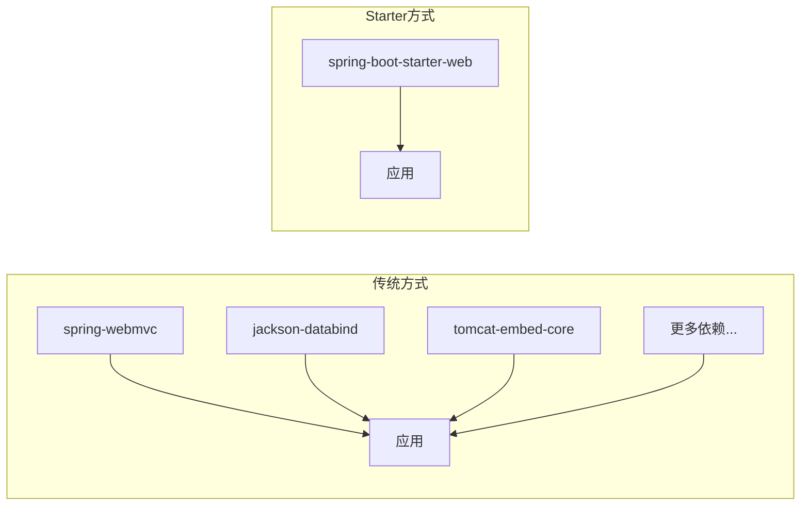
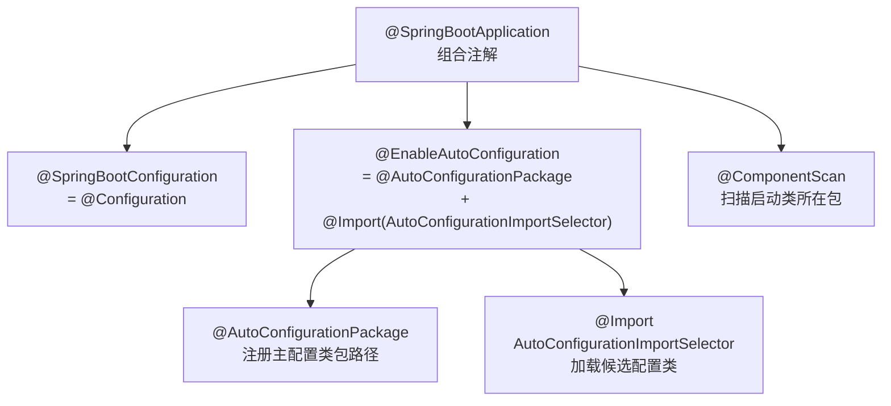
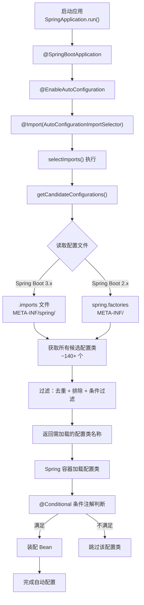
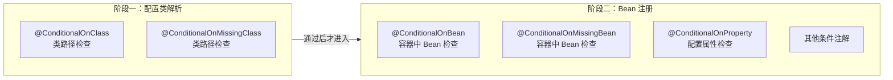
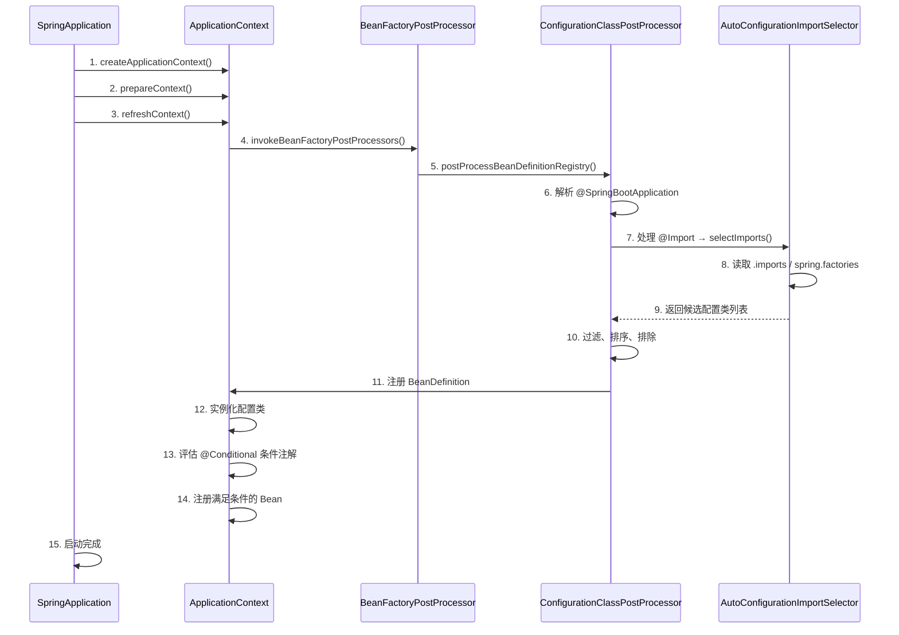

# 自动配置与 Starter 机制


## 应用视角：Starter 与 @EnableAutoConfiguration

Spring Boot 真正把开发效率拉开的地方，不是"能启动项目"，而是自动配置和 Starter 机制。它们解决的是传统 Spring 项目里最麻烦的几件事：

- 依赖版本难协调
- 基础设施配置重复
- Bean 装配样板代码太多

理解这两块内容，才算真正理解 Spring Boot 在帮你做什么。

::: tip 核心认知
自动配置不是"黑盒魔法"，而是**有条件地按需装配 Bean**。理解条件注解和加载流程，才能知道为什么某个配置生效、为什么不生效、如何覆盖默认行为。
:::

---

### 一、Starter 机制详解

#### 1.1 Starter 的本质

Starter 可以理解成"一组经过验证的依赖组合入口"。它不是框架功能本身，而是把常见功能所需依赖打包成统一接入方式。

**核心价值：**

1. **依赖管理**：解决依赖冲突和版本协调问题
2. **约定优于配置**：提供经过验证的依赖组合
3. **简化构建配置**：一个依赖搞定一整套功能

#### 1.2 常见官方 Starter

| Starter 名称 | 功能说明 | 核心依赖 |
|-------------|---------|---------|
| `spring-boot-starter-web` | Web 开发 | Spring MVC + Jackson + Tomcat |
| `spring-boot-starter-data-jpa` | JPA 数据访问 | Hibernate + Spring Data JPA |
| `spring-boot-starter-data-redis` | Redis 集成 | Lettuce + Spring Data Redis |
| `spring-boot-starter-security` | 安全框架 | Spring Security |
| `spring-boot-starter-validation` | 参数校验 | Hibernate Validator |
| `spring-boot-starter-actuator` | 监控端点 | Micrometer + Actuator |
| `spring-boot-starter-test` | 测试支持 | JUnit 5 + Mockito + AssertJ |
| `spring-boot-starter-aop` | AOP 支持 | Spring AOP + AspectJ |
| `spring-boot-starter-cache` | 缓存支持 | Spring Cache + Caffeine |
| `spring-boot-starter-websocket` | WebSocket | Spring WebSocket |

#### 1.3 Starter 的内部结构

一个标准 Starter 通常包含：

```
my-spring-boot-starter/
├── pom.xml                           # 依赖声明
├── src/main/java/
│   └── com/example/
│       ├── autoconfigure/
│       │   ├── MyAutoConfiguration.java        # 自动配置类
│       │   ├── MyProperties.java               # 配置属性类
│       │   └── MyService.java                  # 核心功能类
│       └── MyStarter.java                      # 可选，标记类
└── src/main/resources/
    └── META-INF/
        └── spring/
            └── org.springframework.boot.autoconfigure.AutoConfiguration.imports
```

**关键文件说明：**

1. **pom.xml**：声明依赖和父工程
2. **AutoConfiguration 类**：自动配置逻辑
3. **Properties 类**：映射配置文件
4. **imports 文件**：注册自动配置类（Spring Boot 2.7+）
5. **spring.factories**：旧版注册方式（Spring Boot 2.7 之前）

#### 1.4 Starter 和普通依赖的区别

普通依赖只解决"把某个 jar 引进来"，Starter 解决的是"把某一类能力的推荐依赖组合一起引进来"。



**示例对比：**

```xml
<!-- 传统方式：需要手动引入多个依赖 -->
<dependency>
    <groupId>org.springframework</groupId>
    <artifactId>spring-webmvc</artifactId>
    <version>5.3.20</version>
</dependency>
<dependency>
    <groupId>com.fasterxml.jackson.core</groupId>
    <artifactId>jackson-databind</artifactId>
    <version>2.13.3</version>
</dependency>
<dependency>
    <groupId>org.apache.tomcat.embed</groupId>
    <artifactId>tomcat-embed-core</artifactId>
    <version>9.0.62</version>
</dependency>
<!-- 还需要更多依赖... -->

<!-- Starter 方式：一个依赖搞定 -->
<dependency>
    <groupId>org.springframework.boot</groupId>
    <artifactId>spring-boot-starter-web</artifactId>
</dependency>
```

引入 `spring-boot-starter-web` 后，一起带来：

- Spring MVC（Web 框架）
- Jackson（JSON 序列化）
- Hibernate Validator（参数校验）
- 嵌入式 Tomcat（Web 容器）
- Spring Web 相关自动配置

---

### 二、@EnableAutoConfiguration 原理

#### 2.1 注解继承关系

`@EnableAutoConfiguration` 是自动配置的核心入口，其继承关系如下：



::: warning 注意
`@SpringBootApplication` 不是简单的一个注解，而是三个注解的组合。面试中经常问"它包含了哪些注解"，回答时要完整说明 `@SpringBootConfiguration`、`@EnableAutoConfiguration` 和 `@ComponentScan` 三部分。
:::

```java
@Target(ElementType.TYPE)
@Retention(RetentionPolicy.RUNTIME)
@Documented
@Inherited
@AutoConfigurationPackage
@Import(AutoConfigurationImportSelector.class)
public @interface EnableAutoConfiguration {
    
    String ENABLED_OVERRIDE_PROPERTY = "spring.boot.enableautoconfiguration";

    Class<?>[] exclude() default {};

    String[] excludeName() default {};
}
```

**关键组成：**

1. **@AutoConfigurationPackage**：自动配置包注册
2. **@Import(AutoConfigurationImportSelector.class)**：导入自动配置选择器

#### 2.2 @AutoConfigurationPackage 作用

```java
@Target(ElementType.TYPE)
@Retention(RetentionPolicy.RUNTIME)
@Documented
@Inherited
@Import(AutoConfigurationPackages.Registrar.class)
public @interface AutoConfigurationPackage {
}
```

**作用：**将主配置类所在包及其子包下的所有组件注册到 Spring 容器。

**Registrar 内部类：**

```java
static class Registrar implements ImportBeanDefinitionRegistrar, DeterminableImports {

    @Override
    public void registerBeanDefinitions(AnnotationMetadata metadata, BeanDefinitionRegistry registry) {
        // 注册包路径，默认是主配置类所在包
        register(registry, new PackageImports(metadata).getPackageNames().toArray(new String[0]));
    }

    @Override
    public Set<Object> determineImports(AnnotationMetadata metadata) {
        return Collections.singleton(new PackageImports(metadata));
    }
}
```

#### 2.3 AutoConfigurationImportSelector 核心逻辑

这是自动配置的核心类：

```java
public class AutoConfigurationImportSelector implements DeferredImportSelector,
        BeanClassLoaderAware, ResourceLoaderAware, BeanFactoryAware, 
        EnvironmentAware, Ordered {

    @Override
    public String[] selectImports(AnnotationMetadata annotationMetadata) {
        if (!isEnabled(annotationMetadata)) {
            return NO_IMPORTS;
        }
        
        // 1. 获取自动配置条目
        AutoConfigurationEntry autoConfigurationEntry = 
            getAutoConfigurationEntry(annotationMetadata);
        
        return StringUtils.toStringArray(autoConfigurationEntry.getConfigurations());
    }

    protected AutoConfigurationEntry getAutoConfigurationEntry(AnnotationMetadata annotationMetadata) {
        if (!isEnabled(annotationMetadata)) {
            return EMPTY_ENTRY;
        }
        
        // 1. 获取注解属性（exclude 等）
        AnnotationAttributes attributes = getAttributes(annotationMetadata);
        
        // 2. 获取候选配置类
        List<String> configurations = getCandidateConfigurations(
            annotationMetadata, attributes);
        
        // 3. 去重
        configurations = removeDuplicates(configurations);
        
        // 4. 排除指定的配置类
        Set<String> exclusions = getExclusions(annotationMetadata, attributes);
        checkExcludedClasses(configurations, exclusions);
        configurations.removeAll(exclusions);
        
        // 5. 过滤（根据条件）
        configurations = filter(configurations, getAutoConfigurationMetadata());
        
        // 6. 触发自动配置导入事件
        fireAutoConfigurationImportEvents(configurations, exclusions);
        
        return new AutoConfigurationEntry(configurations, exclusions);
    }
}
```

#### 2.4 自动配置类的加载流程



---

### 三、SpringFactoriesLoader 机制

#### 3.1 SpringFactoriesLoader 简介

`SpringFactoriesLoader` 是 Spring 框架提供的工厂加载机制，用于从类路径下的配置文件中加载并实例化指定的类。

```java
public final class SpringFactoriesLoader {

    public static final String FACTORIES_RESOURCE_LOCATION = "META-INF/spring.factories";

    public static <T> List<T> loadFactories(Class<T> factoryType, @Nullable ClassLoader classLoader) {
        ClassLoader classLoaderToUse = classLoader;
        if (classLoaderToUse == null) {
            classLoaderToUse = SpringFactoriesLoader.class.getClassLoader();
        }
        List<String> factoryImplementationNames = 
            loadFactoryNames(factoryType, classLoaderToUse);
        
        List<T> result = new ArrayList<>(factoryImplementationNames.size());
        for (String factoryImplementationName : factoryImplementationNames) {
            result.add(instantiateFactory(factoryImplementationName, factoryType, classLoaderToUse));
        }
        
        return result;
    }

    public static List<String> loadFactoryNames(Class<?> factoryType, @Nullable ClassLoader classLoader) {
        String factoryTypeName = factoryType.getName();
        return loadSpringFactories(classLoader)
            .getOrDefault(factoryTypeName, Collections.emptyList());
    }

    private static Map<String, List<String>> loadSpringFactories(@Nullable ClassLoader classLoader) {
        // 缓存机制
        Map<String, List<String>> result = cache.get(classLoader);
        if (result != null) {
            return result;
        }

        result = new HashMap<>();
        try {
            // 加载所有 META-INF/spring.factories 文件
            Enumeration<URL> urls = classLoader.getResources(FACTORIES_RESOURCE_LOCATION);
            while (urls.hasMoreElements()) {
                URL url = urls.nextElement();
                UrlResource resource = new UrlResource(url);
                Properties properties = PropertiesLoaderUtils.loadProperties(resource);
                for (Map.Entry<?, ?> entry : properties.entrySet()) {
                    String factoryTypeName = ((String) entry.getKey()).trim();
                    String[] factoryImplementationNames =
                            StringUtils.commaDelimitedListToStringArray((String) entry.getValue());
                    for (String factoryImplementationName : factoryImplementationNames) {
                        result.computeIfAbsent(factoryTypeName, key -> new ArrayList<>())
                              .add(factoryImplementationName.trim());
                    }
                }
            }
            
            // Replace all lists with unmodifiable lists containing unique elements
            result.replaceAll((factoryType, implementations) -> 
                implementations.stream().distinct().collect(Collectors.toList()));
            
            cache.put(classLoader, result);
        } catch (IOException ex) {
            throw new IllegalArgumentException("Unable to load factories from location [" +
                    FACTORIES_RESOURCE_LOCATION + "]", ex);
        }
        return result;
    }
}
```

#### 3.2 spring.factories 文件格式

**位置：** `META-INF/spring.factories`

**格式示例：**

```properties
## Auto Configure
org.springframework.boot.autoconfigure.EnableAutoConfiguration=\
com.example.autoconfigure.MyAutoConfiguration,\
com.example.autoconfigure.AnotherAutoConfiguration

## Enable ConfigurationProperties
org.springframework.boot.context.properties.EnableConfigurationProperties=\
com.example.config.MyProperties

## Application Listeners
org.springframework.context.ApplicationListener=\
com.example.listener.MyApplicationListener

## Failure Analyzers
org.springframework.boot.diagnostics.FailureAnalyzer=\
com.example.analyzer.MyFailureAnalyzer
```

#### 3.3 Spring Boot 2.7+ 新的加载机制

从 Spring Boot 2.7 开始，自动配置类推荐使用新的文件：

**位置：** `META-INF/spring/org.springframework.boot.autoconfigure.AutoConfiguration.imports`

**格式：** 每行一个配置类全限定名

```
com.example.autoconfigure.MyAutoConfiguration
com.example.autoconfigure.AnotherAutoConfiguration
com.example.autoconfigure.WebAutoConfiguration
```

**兼容性：**

- Spring Boot 2.7+：两种方式都支持
- Spring Boot 3.0+：仅支持新的 `.imports` 文件

#### 3.4 SpringFactoriesLoader 的其他应用场景

除了自动配置，SpringFactoriesLoader 还用于：

1. **ApplicationListener**：应用启动监听器
2. **ApplicationContextInitializer**：上下文初始化器
3. **FailureAnalyzer**：启动失败分析器
4. **EnvironmentPostProcessor**：环境后处理器
5. **ConfigDataLocationResolver**：配置数据位置解析器

**示例：自定义 FailureAnalyzer**

```java
public class MyFailureAnalyzer extends AbstractFailureAnalyzer<MyException> {

    @Override
    protected FailureAnalysis analyze(Throwable rootFailure, MyException cause) {
        return new FailureAnalysis(
            "My component failed to initialize: " + cause.getMessage(),
            "Please check your configuration and ensure all required properties are set.",
            cause
        );
    }
}
```

在 `spring.factories` 中注册：

```properties
org.springframework.boot.diagnostics.FailureAnalyzer=\
com.example.analyzer.MyFailureAnalyzer
```

---

### 四、条件注解原理

#### 4.1 条件注解体系

Spring Boot 提供了丰富的条件注解：

| 注解 | 作用 |
|------|------|
| `@ConditionalOnClass` | 类路径存在指定类时生效 |
| `@ConditionalOnMissingClass` | 类路径不存在指定类时生效 |
| `@ConditionalOnBean` | 容器中存在指定 Bean 时生效 |
| `@ConditionalOnMissingBean` | 容器中不存在指定 Bean 时生效 |
| `@ConditionalOnProperty` | 配置属性满足条件时生效 |
| `@ConditionalOnResource` | 资源存在时生效 |
| `@ConditionalOnWebApplication` | Web 应用时生效 |
| `@ConditionalOnNotWebApplication` | 非 Web 应用时生效 |
| `@ConditionalOnExpression` | SpEL 表达式为 true 时生效 |
| `@ConditionalOnJava` | Java 版本满足条件时生效 |
| `@ConditionalOnJndi` | JNDI 存在时生效 |
| `@ConditionalOnCloudPlatform` | 指定云平台时生效 |

#### 4.2 @Conditional 核心接口

所有条件注解都基于 `@Conditional` 元注解：

```java
@Target({ElementType.TYPE, ElementType.METHOD})
@Retention(RetentionPolicy.RUNTIME)
public @interface Conditional {
    Class<? extends Condition>[] value();
}
```

**Condition 接口：**

```java
@FunctionalInterface
public interface Condition {
    boolean matches(ConditionContext context, AnnotatedTypeMetadata metadata);
}
```

**ConditionContext 提供的能力：**

```java
public interface ConditionContext {
    BeanDefinitionRegistry getRegistry();          // Bean 定义注册表
    ConfigurableListableBeanFactory getBeanFactory(); // Bean 工厂
    Environment getEnvironment();                   // 环境信息
    ResourceLoader getResourceLoader();            // 资源加载器
    ClassLoader getClassLoader();                   // 类加载器
}
```

#### 4.3 @ConditionalOnClass 实现原理

```java
@Target({ElementType.TYPE, ElementType.METHOD})
@Retention(RetentionPolicy.RUNTIME)
@Documented
@Conditional(OnClassCondition.class)
public @interface ConditionalOnClass {
    Class<?>[] value() default {};
    String[] name() default {};
}
```

**OnClassCondition 实现：**

```java
class OnClassCondition extends FilteringSpringBootCondition {

    @Override
    public ConditionOutcome getMatchOutcome(ConditionContext context, 
            AnnotatedTypeMetadata metadata) {
        ClassLoader classLoader = context.getClassLoader();
        ConditionMessage matchMessage = ConditionMessage.empty();
        
        // 获取注解属性
        List<String> onClasses = getCandidates(metadata, ConditionalOnClass.class);
        
        if (onClasses != null) {
            List<String> missing = getMissingClasses(classLoader, onClasses);
            
            if (!missing.isEmpty()) {
                return ConditionOutcome.noMatch(
                    ConditionMessage.forCondition(ConditionalOnClass.class)
                        .didNotFind("required class", "required classes")
                        .items(Style.QUOTE, missing));
            }
            
            matchMessage = matchMessage.andCondition(ConditionalOnClass.class)
                .found("required class", "required classes")
                .items(Style.QUOTE, filter(onClasses, classLoader));
        }
        
        return ConditionOutcome.match(matchMessage);
    }

    private List<String> getMissingClasses(ClassLoader classLoader, List<String> classes) {
        List<String> missing = new ArrayList<>();
        for (String className : classes) {
            if (!isPresent(className, classLoader)) {
                missing.add(className);
            }
        }
        return missing;
    }

    private boolean isPresent(String className, ClassLoader classLoader) {
        try {
            Class.forName(className, false, classLoader);
            return true;
        } catch (Throwable ex) {
            return false;
        }
    }
}
```

#### 4.4 @ConditionalOnMissingBean 实现原理

```java
@Target({ElementType.TYPE, ElementType.METHOD})
@Retention(RetentionPolicy.RUNTIME)
@Documented
@Conditional(OnBeanCondition.class)
public @interface ConditionalOnMissingBean {
    Class<?>[] value() default {};
    String[] type() default {};
    Class<?>[] ignored() default {};
    String[] ignoredType() default {};
    Class<? extends Annotation>[] annotation() default {};
    String[] name() default {};
    SearchStrategy search() default SearchStrategy.ALL;
}
```

**OnBeanCondition 核心逻辑：**

```java
class OnBeanCondition extends FilteringSpringBootCondition {

    @Override
    public ConditionOutcome getMatchOutcome(ConditionContext context, 
            AnnotatedTypeMetadata metadata) {
        
        ConditionMessage matchMessage = ConditionMessage.empty();
        
        // 检查 @ConditionalOnBean
        if (metadata.isAnnotated(ConditionalOnBean.class.getName())) {
            List<String> onBeanTypes = getAttributeValues(metadata, ConditionalOnBean.class, "value");
            
            for (String type : onBeanTypes) {
                if (!hasBean(context, type)) {
                    return ConditionOutcome.noMatch(
                        ConditionMessage.forCondition(ConditionalOnBean.class)
                            .didNotFind("bean", "beans")
                            .items(Style.QUOTE, type));
                }
            }
        }
        
        // 检查 @ConditionalOnMissingBean
        if (metadata.isAnnotated(ConditionalOnMissingBean.class.getName())) {
            List<String> missingBeanTypes = getAttributeValues(metadata, 
                ConditionalOnMissingBean.class, "value");
            
            for (String type : missingBeanTypes) {
                if (hasBean(context, type)) {
                    return ConditionOutcome.noMatch(
                        ConditionMessage.forCondition(ConditionalOnMissingBean.class)
                            .found("bean", "beans")
                            .items(Style.QUOTE, type));
                }
            }
        }
        
        return ConditionOutcome.match(matchMessage);
    }

    private boolean hasBean(ConditionContext context, String type) {
        String[] beanNames = context.getBeanFactory().getBeanNamesForType(type);
        return beanNames.length > 0;
    }
}
```

#### 4.5 @ConditionalOnProperty 实现原理

```java
@Target({ElementType.TYPE, ElementType.METHOD})
@Retention(RetentionPolicy.RUNTIME)
@Documented
@Conditional(OnPropertyCondition.class)
public @interface ConditionalOnProperty {
    String[] value() default {};
    String prefix() default "";
    String[] name() default {};
    String havingValue() default "";
    boolean matchIfMissing() default false;
}
```

**使用示例：**

```java
@Configuration
@ConditionalOnProperty(
    prefix = "app.feature",
    name = "enabled",
    havingValue = "true",
    matchIfMissing = false
)
public class FeatureAutoConfiguration {
    
    @Bean
    public FeatureService featureService() {
        return new FeatureService();
    }
}
```

**OnPropertyCondition 核心逻辑：**

```java
class OnPropertyCondition extends SpringBootCondition {

    @Override
    public ConditionOutcome getMatchOutcome(ConditionContext context, 
            AnnotatedTypeMetadata metadata) {
        
        List<AnnotationAttributes> allAnnotationAttributes = 
            annotationAttributesFromMultiValueMap(
                metadata.getAllAnnotationAttributes(ConditionalOnProperty.class.getName()));
        
        List<ConditionMessage> noMatch = new ArrayList<>();
        List<ConditionMessage> match = new ArrayList<>();
        
        for (AnnotationAttributes annotationAttributes : allAnnotationAttributes) {
            // 构建属性名
            String prefix = annotationAttributes.getString("prefix").trim();
            String name = annotationAttributes.getString("name");
            String key = prefix + "." + name;
            
            // 获取配置值
            String value = context.getEnvironment().getProperty(key);
            String havingValue = annotationAttributes.getString("havingValue");
            boolean matchIfMissing = annotationAttributes.getBoolean("matchIfMissing");
            
            if (value == null) {
                if (!matchIfMissing) {
                    return ConditionOutcome.noMatch(
                        ConditionMessage.forCondition(ConditionalOnProperty.class)
                            .didNotFind("property", "properties")
                            .items(Style.QUOTE, key));
                }
            } else {
                if (!value.equals(havingValue)) {
                    return ConditionOutcome.noMatch(
                        ConditionMessage.forCondition(ConditionalOnProperty.class)
                            .found("different value in property", "different value in properties")
                            .items(Style.QUOTE, key));
                }
            }
            // 注：实际实现中，havingValue 为空串时，只要属性存在即视为匹配
        }
        
        return ConditionOutcome.match();
    }
}
```

#### 4.6 条件注解的评估时机

条件注解的评估分为两个阶段：



**Phase 1：配置类解析阶段（Configuration Class Parsing）**

- `@ConditionalOnClass`
- `@ConditionalOnMissingClass`

这些条件在类加载阶段评估，如果条件不满足，配置类根本不会被加载。

**Phase 2：Bean 注册阶段（Bean Registration）**

- `@ConditionalOnBean`
- `@ConditionalOnMissingBean`
- `@ConditionalOnProperty`
- 其他条件注解

这些条件在 Bean 定义注册时评估。

#### 4.7 条件注解组合使用

```java
@Configuration
public class DataSourceAutoConfiguration {

    @Bean
    @ConditionalOnClass({DataSource.class, HikariDataSource.class})
    @ConditionalOnMissingBean(DataSource.class)
    @ConditionalOnProperty(prefix = "spring.datasource", name = "type", 
        havingValue = "com.zaxxer.hikari.HikariDataSource", matchIfMissing = true)
    public DataSource dataSource(DataSourceProperties properties) {
        return properties.initializeDataSourceBuilder()
            .type(HikariDataSource.class)
            .build();
    }
}
```

---

### 五、自动配置类的加载流程详解

#### 5.1 完整加载流程



#### 5.2 自动配置类的排序机制

**@AutoConfigureOrder 注解：**

```java
@Configuration
@AutoConfigureOrder(Ordered.HIGHEST_PRECEDENCE)
public class FirstAutoConfiguration {
    // 最先加载
}

@Configuration
@AutoConfigureOrder(Ordered.LOWEST_PRECEDENCE)
public class LastAutoConfiguration {
    // 最后加载
}
```

**@AutoConfigureBefore / @AutoConfigureAfter 注解：**

```java
@Configuration
@AutoConfigureAfter(DataSourceAutoConfiguration.class)
public class MyBatisAutoConfiguration {
    // 在数据源配置之后加载
}

@Configuration
@AutoConfigureBefore(JpaAutoConfiguration.class)
public class MyBatisAutoConfiguration {
    // 在 JPA 配置之前加载
}
```

#### 5.3 自动配置类过滤机制

Spring Boot 2.7+ 引入了自动配置过滤机制：

```java
public interface AutoConfigurationImportFilter {
    boolean[] match(String[] autoConfigurationClasses, 
                     AutoConfigurationMetadata autoConfigurationMetadata);
}
```

**示例实现：**

```java
public class OnClassConditionAutoConfigurationImportFilter 
        implements AutoConfigurationImportFilter {

    @Override
    public boolean[] match(String[] autoConfigurationClasses, 
                           AutoConfigurationMetadata autoConfigurationMetadata) {
        boolean[] matches = new boolean[autoConfigurationClasses.length];
        
        for (int i = 0; i < autoConfigurationClasses.length; i++) {
            String className = autoConfigurationClasses[i];
            // 检查条件注解中的类是否存在
            matches[i] = checkCondition(className);
        }
        
        return matches;
    }
}
```

#### 5.4 自动配置报告

启用自动配置报告：

```yaml
debug: true
```

或在启动参数中添加：

```bash
java -jar myapp.jar --debug
```

**输出示例：**

```
============================
CONDITIONS EVALUATION REPORT
============================

Positive matches:
-----------------
   AopAutoConfiguration matched:
      - @ConditionalOnProperty (spring.aop.auto) matched true (OnPropertyCondition)
      - @ConditionalOnClass found required classes 'org.aspectj.lang.annotation.Aspect' (OnClassCondition)

   DataSourceAutoConfiguration matched:
      - @ConditionalOnClass found required classes 'javax.sql.DataSource' (OnClassCondition)
      
Negative matches:
-----------------
   ActiveMQAutoConfiguration:
      Did not match:
         - @ConditionalOnClass did not find required class 'javax.jms.ConnectionFactory' (OnClassCondition)

Exclusions:
-----------
    None

Unconditional classes:
----------------------
    org.springframework.boot.autoconfigure.context.ConfigurationPropertiesAutoConfiguration
```

---

### 六、Spring Boot 启动流程详解

#### 6.1 SpringApplication 构造过程

```java
public SpringApplication(ResourceLoader resourceLoader, Class<?>... primarySources) {
    this.resourceLoader = resourceLoader;
    Assert.notNull(primarySources, "PrimarySources must not be null");
    this.primarySources = new LinkedHashSet<>(Arrays.asList(primarySources));
    
    // 1. 判断应用类型
    this.webApplicationType = WebApplicationType.deduceFromClasspath();
    
    // 2. 加载 Bootstrap Registry Initializers
    this.bootstrapRegistryInitializers = getBootstrapRegistryInitializersFromSpringFactories();
    
    // 3. 加载 ApplicationContextInitializer
    setInitializers((Collection) getSpringFactoriesInstances(ApplicationContextInitializer.class));
    
    // 4. 加载 ApplicationListener
    setListeners((Collection) getSpringFactoriesInstances(ApplicationListener.class));
    
    // 5. 推断主配置类
    this.mainApplicationClass = deduceMainApplicationClass();
}
```

#### 6.2 run() 方法执行流程

```java
public ConfigurableApplicationContext run(String... args) {
    // 1. 创建启动计时器
    long startTime = System.nanoTime();
    
    // 2. 创建 BootstrapContext
    DefaultBootstrapContext bootstrapContext = createBootstrapContext();
    
    // 获取并启动运行监听器
    SpringApplicationRunListeners listeners = getRunListeners(args);
    listeners.starting();
    
    ConfigurableApplicationContext context = null;
    try {
        // 3. 准备环境
        ConfigurableEnvironment environment = prepareEnvironment(listeners, bootstrapContext, args);
        
        // 4. 打印 Banner
        Banner printedBanner = printBanner(environment);
        
        // 5. 创建 ApplicationContext
        context = createApplicationContext();
        
        // 6. 准备上下文
        prepareContext(bootstrapContext, context, environment, listeners, args, printedBanner);
        
        // 7. 刷新上下文（核心）
        refreshContext(context);
        
        // 8. 刷新后处理
        afterRefresh(context, args);
        
        // 9. 启动完成
        Duration timeTakenToStartup = Duration.ofNanos(System.nanoTime() - startTime);
        if (this.logStartupInfo) {
            new StartupInfoLogger(this.mainApplicationClass).logStarted(getApplicationLog(), timeTakenToStartup);
        }
        
        // 10. 调用 Runner
        callRunners(context, args);
        
        return context;
    } catch (Throwable ex) {
        // 异常处理
        handleRunFailure(context, ex, listeners);
        throw new IllegalStateException(ex);
    }
}
```

#### 6.3 prepareContext() 详细流程

```java
private void prepareContext(DefaultBootstrapContext bootstrapContext, 
                           ConfigurableApplicationContext context,
                           ConfigurableEnvironment environment, 
                           SpringApplicationRunListeners listeners,
                           ApplicationArguments args, 
                           Banner printedBanner) {
    
    // 1. 设置环境
    context.setEnvironment(environment);
    
    // 2. 后置处理 ApplicationContext
    postProcessApplicationContext(context);
    
    // 3. 应用 ApplicationContextInitializer
    applyInitializers(context);
    
    // 4. 发布 contextPrepared 事件
    listeners.contextPrepared(context);
    
    // 5. 注册启动参数 Bean
    context.getBeanFactory().registerSingleton("springApplicationArguments", args);
    
    // 6. 注册 Banner Bean
    if (printedBanner != null) {
        context.getBeanFactory().registerSingleton("springBootBanner", printedBanner);
    }
    
    // 7. 加载主配置类
    Set<Object> sources = getAllSources();
    Assert.notEmpty(sources, "Sources must not be empty");
    
    // 8. 注册 BeanDefinition
    load(context, sources.toArray(new Object[0]));
    
    // 9. 发布 contextLoaded 事件
    listeners.contextLoaded(context);
}
```

#### 6.4 refreshContext() 核心流程

```java
private void refreshContext(ConfigurableApplicationContext context) {
    if (this.registerShutdownHook) {
        shutdownHook.registerApplicationContext(context);
    }
    refresh(context);
}

protected void refresh(ConfigurableApplicationContext applicationContext) {
    applicationContext.refresh();
}
```

**AbstractApplicationContext.refresh() 方法：**

```java
public void refresh() throws BeansException, IllegalStateException {
    synchronized (this.startupShutdownMonitor) {
        StartupStep contextRefresh = this.applicationStartup.start("spring.context.refresh");

        // 1. 准备刷新
        prepareRefresh();

        // 2. 获取 BeanFactory
        ConfigurableListableBeanFactory beanFactory = obtainFreshBeanFactory();

        // 3. 准备 BeanFactory
        prepareBeanFactory(beanFactory);

        try {
            // 4. 后置处理 BeanFactory
            postProcessBeanFactory(beanFactory);

            StartupStep beanPostProcess = this.applicationStartup.start("spring.context.beans.post-process");
            
            // 5. 调用 BeanFactoryPostProcessor
            invokeBeanFactoryPostProcessors(beanFactory);

            // 6. 注册 BeanPostProcessor
            registerBeanPostProcessors(beanFactory);
            beanPostProcess.end();

            // 7. 初始化消息源
            initMessageSource();

            // 8. 初始化事件广播器
            initApplicationEventMulticaster();

            // 9. 初始化其他特殊 Bean
            onRefresh();

            // 10. 注册监听器
            registerListeners();

            // 11. 实例化所有非懒加载单例 Bean
            finishBeanFactoryInitialization(beanFactory);

            // 12. 完成刷新
            finishRefresh();
        } catch (BeansException ex) {
            // 异常处理
            destroyBeans();
            cancelRefresh(ex);
            throw ex;
        } finally {
            // 重置缓存
            resetCommonCaches();
        }
    }
}
```

#### 6.5 invokeBeanFactoryPostProcessors() 关键步骤

这是自动配置生效的关键环节：

```java
protected void invokeBeanFactoryPostProcessors(ConfigurableListableBeanFactory beanFactory) {
    PostProcessorRegistrationDelegate.invokeBeanFactoryPostProcessors(beanFactory, getBeanFactoryPostProcessors());
}
```

**处理顺序：**

1. **BeanDefinitionRegistryPostProcessor**（优先级最高）
   - `ConfigurationClassPostProcessor`

2. **BeanFactoryPostProcessor**
   - `PropertySourcesPlaceholderConfigurer`
   - `ConfigurationPropertiesBindingPostProcessor`

**ConfigurationClassPostProcessor 的作用：**

```java
public void postProcessBeanDefinitionRegistry(BeanDefinitionRegistry registry) {
    processConfigBeanDefinitions(registry);
}

public void processConfigBeanDefinitions(BeanDefinitionRegistry registry) {
    // 1. 找出所有配置类
    List<BeanDefinitionHolder> configCandidates = findConfigBeanDefinitions(registry);
    
    // 2. 解析配置类
    ConfigurationClassParser parser = new ConfigurationClassParser(...);
    for (BeanDefinitionHolder holder : configCandidates) {
        parser.parse(holder.getBeanName());
    }
    
    // 3. 处理 @Import 注解
    // 这里会处理 @EnableAutoConfiguration 导入的 AutoConfigurationImportSelector
    
    // 4. 加载自动配置类
    // 读取 spring.factories 或 .imports 文件
    
    // 5. 注册 BeanDefinition
    this.reader.loadBeanDefinitions(configClasses);
}
```

---

### 七、自定义 Starter 开发

#### 7.1 完整的 Starter 开发流程

**步骤 1：创建项目结构**

```
my-spring-boot-starter/
├── pom.xml
├── src/main/java/
│   └── com/example/
│       ├── MyService.java                    # 核心服务
│       ├── MyProperties.java                # 配置属性
│       └── MyAutoConfiguration.java         # 自动配置类
└── src/main/resources/
    └── META-INF/
        └── spring/
            └── org.springframework.boot.autoconfigure.AutoConfiguration.imports
```

**步骤 2：定义配置属性类**

```java
package com.example;

import org.springframework.boot.context.properties.ConfigurationProperties;

@ConfigurationProperties(prefix = "my.service")
public class MyProperties {
    
    /**
     * 是否启用服务
     */
    private boolean enabled = true;
    
    /**
     * 服务名称
     */
    private String name = "default-service";
    
    /**
     * 超时时间（毫秒）
     */
    private int timeout = 5000;
    
    /**
     * 重试次数
     */
    private int retryTimes = 3;
    
    // Getters and Setters
    public boolean isEnabled() {
        return enabled;
    }

    public void setEnabled(boolean enabled) {
        this.enabled = enabled;
    }

    public String getName() {
        return name;
    }

    public void setName(String name) {
        this.name = name;
    }

    public int getTimeout() {
        return timeout;
    }

    public void setTimeout(int timeout) {
        this.timeout = timeout;
    }

    public int getRetryTimes() {
        return retryTimes;
    }

    public void setRetryTimes(int retryTimes) {
        this.retryTimes = retryTimes;
    }
}
```

**步骤 3：定义核心服务类**

```java
package com.example;

import org.slf4j.Logger;
import org.slf4j.LoggerFactory;

public class MyService {
    
    private static final Logger log = LoggerFactory.getLogger(MyService.class);
    
    private final MyProperties properties;
    
    public MyService(MyProperties properties) {
        this.properties = properties;
    }
    
    public String doSomething(String input) {
        log.info("MyService [{}] processing: {}", properties.getName(), input);
        
        if (!properties.isEnabled()) {
            return "Service is disabled";
        }
        
        // 模拟处理逻辑
        int attempts = 0;
        while (attempts < properties.getRetryTimes()) {
            try {
                // 模拟业务处理
                Thread.sleep(100);
                return "Processed: " + input + " by " + properties.getName();
            } catch (InterruptedException e) {
                attempts++;
                if (attempts >= properties.getRetryTimes()) {
                    Thread.currentThread().interrupt();
                    throw new RuntimeException("Process failed after " + attempts + " attempts", e);
                }
            }
        }
        
        return "Failed to process: " + input;
    }
    
    public void init() {
        log.info("MyService initialized with name: {}, timeout: {}, retryTimes: {}", 
            properties.getName(), properties.getTimeout(), properties.getRetryTimes());
    }
    
    public void destroy() {
        log.info("MyService destroyed");
    }
}
```

**步骤 4：创建自动配置类**

```java
package com.example;

import org.springframework.boot.autoconfigure.AutoConfiguration;
import org.springframework.boot.autoconfigure.condition.ConditionalOnClass;
import org.springframework.boot.autoconfigure.condition.ConditionalOnMissingBean;
import org.springframework.boot.autoconfigure.condition.ConditionalOnProperty;
import org.springframework.boot.context.properties.EnableConfigurationProperties;
import org.springframework.context.annotation.Bean;

@AutoConfiguration
@ConditionalOnClass(MyService.class)
@EnableConfigurationProperties(MyProperties.class)
@ConditionalOnProperty(prefix = "my.service", name = "enabled", havingValue = "true", matchIfMissing = true)
public class MyAutoConfiguration {
    
    @Bean
    @ConditionalOnMissingBean
    public MyService myService(MyProperties properties) {
        MyService service = new MyService(properties);
        service.init();
        return service;
    }
}
```

**步骤 5：创建注册文件**

`META-INF/spring/org.springframework.boot.autoconfigure.AutoConfiguration.imports`:

```
com.example.MyAutoConfiguration
```

**兼容旧版本（可选）**

`META-INF/spring.factories`:

```properties
org.springframework.boot.autoconfigure.EnableAutoConfiguration=\
com.example.MyAutoConfiguration
```

**步骤 6：pom.xml 配置**

```xml
<?xml version="1.0" encoding="UTF-8"?>
<project xmlns="http://maven.apache.org/POM/4.0.0"
         xmlns:xsi="http://www.w3.org/2001/XMLSchema-instance"
         xsi:schemaLocation="http://maven.apache.org/POM/4.0.0 
         http://maven.apache.org/xsd/maven-4.0.0.xsd">
    <modelVersion>4.0.0</modelVersion>
    
    <groupId>com.example</groupId>
    <artifactId>my-spring-boot-starter</artifactId>
    <version>1.0.0</version>
    <packaging>jar</packaging>
    
    <name>My Spring Boot Starter</name>
    <description>A custom Spring Boot Starter</description>
    
    <properties>
        <java.version>17</java.version>
        <spring-boot.version>3.2.0</spring-boot.version>
    </properties>
    
    <dependencyManagement>
        <dependencies>
            <dependency>
                <groupId>org.springframework.boot</groupId>
                <artifactId>spring-boot-dependencies</artifactId>
                <version>${spring-boot.version}</version>
                <type>pom</type>
                <scope>import</scope>
            </dependency>
        </dependencies>
    </dependencyManagement>
    
    <dependencies>
        <!-- Spring Boot Autoconfigure (Optional) -->
        <dependency>
            <groupId>org.springframework.boot</groupId>
            <artifactId>spring-boot-autoconfigure</artifactId>
            <optional>true</optional>
        </dependency>
        
        <!-- Configuration Processor (Optional, for IDE hints) -->
        <dependency>
            <groupId>org.springframework.boot</groupId>
            <artifactId>spring-boot-configuration-processor</artifactId>
            <optional>true</optional>
        </dependency>
        
        <!-- Lombok (Optional) -->
        <dependency>
            <groupId>org.projectlombok</groupId>
            <artifactId>lombok</artifactId>
            <optional>true</optional>
        </dependency>
    </dependencies>
    
    <build>
        <plugins>
            <plugin>
                <groupId>org.apache.maven.plugins</groupId>
                <artifactId>maven-compiler-plugin</artifactId>
                <version>3.11.0</version>
                <configuration>
                    <source>${java.version}</source>
                    <target>${java.version}</target>
                </configuration>
            </plugin>
        </plugins>
    </build>
</project>
```

#### 7.2 进阶：带条件的多配置

```java
@AutoConfiguration
@EnableConfigurationProperties(MyProperties.class)
public class MyAutoConfiguration {
    
    @Configuration(proxyBeanMethods = false)
    @ConditionalOnClass(RedisClient.class)
    static class RedisConfiguration {
        
        @Bean
        @ConditionalOnMissingBean
        @ConditionalOnProperty(prefix = "my.service.cache", name = "type", havingValue = "redis")
        public MyRedisCacheService myRedisCacheService() {
            return new MyRedisCacheService();
        }
    }
    
    @Configuration(proxyBeanMethods = false)
    @ConditionalOnClass(CacheManager.class)
    static class LocalCacheConfiguration {
        
        @Bean
        @ConditionalOnMissingBean
        @ConditionalOnProperty(prefix = "my.service.cache", name = "type", havingValue = "local", matchIfMissing = true)
        public MyLocalCacheService myLocalCacheService() {
            return new MyLocalCacheService();
        }
    }
    
    @Bean
    @ConditionalOnMissingBean
    public MyService myService(MyProperties properties, MyCacheService cacheService) {
        return new MyService(properties, cacheService);
    }
}
```

#### 7.3 使用自定义 Starter

**引入依赖：**

```xml
<dependency>
    <groupId>com.example</groupId>
    <artifactId>my-spring-boot-starter</artifactId>
    <version>1.0.0</version>
</dependency>
```

**配置参数：**

```yaml
my:
  service:
    enabled: true
    name: my-application
    timeout: 10000
    retry-times: 5
```

**使用服务：**

```java
@RestController
public class MyController {
    
    @Autowired
    private MyService myService;
    
    @GetMapping("/process")
    public String process(@RequestParam String input) {
        return myService.doSomething(input);
    }
}
```

#### 7.4 Starter 开发最佳实践

1. **命名规范**
   - 官方 Starter：`spring-boot-starter-*`
   - 第三方 Starter：`*-spring-boot-starter`

2. **配置属性**
   - 使用 `@ConfigurationProperties` 绑定配置
   - 提供合理的默认值
   - 添加 Javadoc 说明

3. **条件判断**
   - 使用 `@ConditionalOnClass` 检查依赖
   - 使用 `@ConditionalOnMissingBean` 允许覆盖
   - 使用 `@ConditionalOnProperty` 控制开关

4. **自动配置顺序**
   - 使用 `@AutoConfigureBefore/@After` 控制顺序
   - 避免循环依赖

5. **文档完善**
   - 提供 README.md 说明用法
   - 提供配置示例
   - 说明自动配置了哪些 Bean

---

### 八、实战场景深度解析

#### 8.1 场景一：接入 Web 能力

引入 `spring-boot-starter-web` 后的自动配置：

```java
// WebMvcAutoConfiguration 部分代码
@Configuration(proxyBeanMethods = false)
@ConditionalOnWebApplication(type = Type.SERVLET)
@ConditionalOnClass({ Servlet.class, DispatcherServlet.class, WebMvcConfigurer.class })
@ConditionalOnMissingBean(WebMvcConfigurationSupport.class)
@AutoConfigureOrder(Ordered.HIGHEST_PRECEDENCE + 10)
@AutoConfigureAfter({ DispatcherServletAutoConfiguration.class, TaskExecutionAutoConfiguration.class,
        ValidationAutoConfiguration.class })
public class WebMvcAutoConfiguration {
    
    @Bean
    @ConditionalOnMissingBean
    public InternalResourceViewResolver defaultViewResolver() {
        InternalResourceViewResolver resolver = new InternalResourceViewResolver();
        resolver.setPrefix("/WEB-INF/views/");
        resolver.setSuffix(".jsp");
        return resolver;
    }
    
    @Bean
    @ConditionalOnMissingBean
    @ConditionalOnProperty(prefix = "spring.mvc.contentnegotiation", name = "favor-parameter", havingValue = "true")
    public ParameterContentNegotiationStrategy parameterContentNegotiationStrategy() {
        return new ParameterContentNegotiationStrategy(getMediaTypes());
    }
}
```

**配置的 Bean：**

- `DispatcherServlet`
- `InternalResourceViewResolver`
- `ContentNegotiatingViewResolver`
- `BeanNameViewResolver`
- `RequestMappingHandlerMapping`
- `RequestMappingHandlerAdapter`
- `ExceptionHandlerExceptionResolver`
- `HttpMessageConverter`（Jackson、String 等）

#### 8.2 场景二：接入数据源

```java
// DataSourceAutoConfiguration 部分代码
@Configuration(proxyBeanMethods = false)
@ConditionalOnClass({ DataSource.class, EmbeddedDatabaseType.class })
@ConditionalOnMissingBean(type = "io.r2dbc.spi.ConnectionFactory")
@EnableConfigurationProperties(DataSourceProperties.class)
@Import({ DataSourcePoolMetadataProvidersConfiguration.class, DataSourceInitializationConfiguration.InitializationSpecificRegistrar.class })
public class DataSourceAutoConfiguration {

    @Configuration(proxyBeanMethods = false)
    @Conditional(EmbeddedDatabaseCondition.class)
    @ConditionalOnMissingBean({ DataSource.class, XADataSource.class })
    @Import(EmbeddedDataSourceConfiguration.class)
    protected static class EmbeddedDatabaseConfiguration {
    }

    @Configuration(proxyBeanMethods = false)
    @Conditional(PooledDataSourceCondition.class)
    @ConditionalOnMissingBean({ DataSource.class, XADataSource.class })
    @Import({ HikariConfiguration.class, Tomcat.class, Dbcp2.class, OracleUcp.class })
    protected static class PooledDataSourceConfiguration {
    }
}
```

**自动配置流程：**

1. 检查 `DataSource` 类是否存在
2. 检查是否已有用户自定义数据源
3. 根据配置选择连接池（HikariCP 优先）
4. 自动配置事务管理器

#### 8.3 场景三：排查 Bean 冲突

**问题：** 自定义的 `ObjectMapper` 没有生效

::: danger 生产事故案例
某团队在生产环境遇到 JSON 序列化日期格式不一致的问题——前端期望 `yyyy-MM-dd`，但实际返回了时间戳格式。根因是：团队以为自定义的 `ObjectMapper` Bean 生效了，但该 Bean 所在的配置类受 `@Profile` 条件限制，在生产环境根本没被加载，实际生效的仍是 `JacksonAutoConfiguration` 自动配置的 `ObjectMapper`。

**教训：** 覆盖自动配置 Bean 后，务必验证容器中实际注入的实例（如打印 `applicationContext.getBean(ObjectMapper.class)`）。同时分清两种覆盖机制：用户配置类中的 Bean 会先于自动配置注册，配合自动配置方的 `@ConditionalOnMissingBean` 即可自然覆盖；`@Primary` 用于解决多个候选 Bean 并存时的歧义。
:::

**排查步骤：**

1. 开启自动配置报告

```yaml
debug: true
```

2. 检查自动配置条件

```
JacksonAutoConfiguration matched:
   - @ConditionalOnClass found required class 'com.fasterxml.jackson.databind.ObjectMapper' (OnClassCondition)
   
JacksonAutoConfiguration.Jackson2ObjectMapperBuilderCustomizerConfiguration matched:
   - @ConditionalOnClass found required class 'org.springframework.http.converter.json.Jackson2ObjectMapperBuilder' (OnClassCondition)
```

3. 检查是否有冲突的 Bean

```java
@Configuration
public class MyJacksonConfig {
    
    @Bean
    @Primary  // 添加 @Primary 提高优先级
    public ObjectMapper objectMapper() {
        return new ObjectMapper()
            .registerModule(new JavaTimeModule())
            .disable(SerializationFeature.WRITE_DATES_AS_TIMESTAMPS);
    }
}
```

4. 使用 `@ConditionalOnMissingBean` 确保覆盖

```java
@Configuration
public class MyJacksonConfig {
    
    @Bean
    @Primary
    @ConditionalOnMissingBean(ObjectMapper.class)  // 确保覆盖
    public ObjectMapper objectMapper() {
        return new ObjectMapper();
    }
}
```

#### 8.4 场景四：排除不需要的自动配置

**方式一：注解排除**

```java
@SpringBootApplication(exclude = {
    DataSourceAutoConfiguration.class,
    HibernateJpaAutoConfiguration.class
})
public class MyApplication {
    public static void main(String[] args) {
        SpringApplication.run(MyApplication.class, args);
    }
}
```

**方式二：配置排除**

```yaml
spring:
  autoconfigure:
    exclude:
      - org.springframework.boot.autoconfigure.jdbc.DataSourceAutoConfiguration
      - org.springframework.boot.autoconfigure.orm.jpa.HibernateJpaAutoConfiguration
```

**方式三：排除特定 Starter 的自动配置**

```java
@SpringBootApplication
@EnableAutoConfiguration(excludeName = {
    "org.springframework.boot.autoconfigure.data.redis.RedisAutoConfiguration"
})
public class MyApplication {
}
```

---

### 九、常见问题与面试要点

#### 9.1 常见问题

##### Q1：自动配置为什么不会加载所有配置类？

**答：** 自动配置类都有条件注解限制，只有满足条件才会加载。

```java
@Configuration
@ConditionalOnClass(DataSource.class)  // 类路径有 DataSource 才加载
public class DataSourceAutoConfiguration {
    // 只有引入了 JDBC 依赖，这个类才会被加载
}
```

##### Q2：为什么用户自定义 Bean 能覆盖自动配置？

**答：** 自动配置类中使用了 `@ConditionalOnMissingBean`：

```java
@Bean
@ConditionalOnMissingBean
public DataSource dataSource() {
    // 如果容器中已有 DataSource Bean，这个方法不会执行
    return new HikariDataSource();
}
```

##### Q3：自动配置的加载顺序如何控制？

**答：** 使用以下注解：

```java
@AutoConfigureOrder(Ordered.HIGHEST_PRECEDENCE)  // 数字越小优先级越高
@AutoConfigureBefore(DataSourceAutoConfiguration.class)  // 在指定配置之前
@AutoConfigureAfter(JpaAutoConfiguration.class)  // 在指定配置之后
```

##### Q4：如何查看自动配置报告？

**答：** 三种方式：

1. 启动参数：`--debug`
2. 配置文件：`debug: true`
3. Actuator 端点：`/actuator/conditions`

##### Q5：Spring Boot 2.7 和 3.0 的自动配置有什么区别？

**答：**

| 特性 | Spring Boot 2.7 | Spring Boot 3.0 |
|------|----------------|-----------------|
| 注册文件 | 支持 `.imports` 和 `spring.factories` | 仅支持 `.imports` |
| 文件位置 | `META-INF/spring/` | `META-INF/spring/` |
| 注解 | `@Configuration` + `@ConditionalOnClass` | `@AutoConfiguration` |

##### Q6：如何禁用所有自动配置？

**答：**

```java
@SpringBootApplication
@EnableAutoConfiguration(exclude = {})
public class MyApplication {
    // 不推荐，失去了 Spring Boot 的核心价值
}
```

或：

```java
@SpringBootConfiguration
@ComponentScan
public class MyApplication {
    // 完全手动配置
}
```

#### 9.2 面试要点

##### 要点 1：Starter 的本质是什么？

**答：** Starter 是一组经过验证的依赖组合入口，它的核心价值：
1. 统一依赖管理，解决版本冲突
2. 约定优于配置，提供最佳实践
3. 简化构建配置，一个依赖搞定一整套功能

##### 要点 2：@EnableAutoConfiguration 的作用是什么？

**答：**
1. 通过 `@Import` 导入 `AutoConfigurationImportSelector`
2. 读取 `spring.factories` 或 `.imports` 文件
3. 加载符合条件的自动配置类
4. 注册 Bean 到 Spring 容器

##### 要点 3：SpringFactoriesLoader 的作用是什么？

**答：**
1. Spring 框架提供的工厂加载机制
2. 从 `META-INF/spring.factories` 文件加载类
3. 用于自动配置、监听器、初始化器等扩展点
4. 是 Spring Boot 自动配置的核心支撑

##### 要点 4：条件注解的工作原理是什么？

**答：**
1. 基于 `@Conditional` 元注解
2. 实现 `Condition` 接口
3. 在配置类解析或 Bean 注册时评估条件
4. 根据条件决定是否创建 Bean

##### 要点 5：如何自定义 Starter？

**答：** 核心步骤：
1. 创建 `AutoConfiguration` 类
2. 定义 `Properties` 类绑定配置
3. 使用条件注解控制装配
4. 创建 `.imports` 或 `spring.factories` 文件
5. 发布到 Maven 仓库

##### 要点 6：Spring Boot 启动流程的关键步骤？

**答：**
1. `SpringApplication` 构造：推断应用类型、加载初始化器和监听器
2. `run()` 方法：准备环境、创建上下文、刷新上下文
3. `refreshContext()`：调用 `BeanFactoryPostProcessor`
4. `ConfigurationClassPostProcessor`：解析配置类、处理 `@Import`
5. `AutoConfigurationImportSelector`：加载自动配置类
6. 条件注解评估：决定哪些 Bean 需要创建
7. Bean 实例化：创建单例 Bean

##### 要点 7：自动配置为什么可控？

**答：**
1. **条件限制**：只有满足条件才会生效
2. **可覆盖**：用户自定义 Bean 优先级更高
3. **可排除**：支持排除不需要的自动配置
4. **可调试**：提供自动配置报告

##### 要点 8：@ConditionalOnBean 和 @ConditionalOnMissingBean 有什么坑？

::: warning 常见陷阱
`@ConditionalOnBean` / `@ConditionalOnMissingBean` 的判断时机取决于 Bean 的创建顺序。如果配置类 A 依赖配置类 B 中的 Bean，但 B 还未被解析，条件判断可能得到错误结果。

**关键原则：** 在自动配置类中，尽量使用 `@ConditionalOnClass`（检查类路径）而非 `@ConditionalOnBean`（检查容器），因为类路径检查在更早的阶段执行，不受 Bean 创建顺序影响。
:::

**答：**

**问题：** Bean 的创建顺序可能导致条件判断错误

```java
@Configuration
public class ConfigA {
    
    @Bean
    @ConditionalOnMissingBean(ServiceB.class)  // 此时 ServiceB 还未创建
    public ServiceA serviceA() {
        return new ServiceA();
    }
}

@Configuration
public class ConfigB {
    
    @Bean
    public ServiceB serviceB() {
        return new ServiceB();
    }
}
```

**解决方案：**
1. 使用 `@AutoConfigureBefore/@After` 控制配置类顺序
2. 使用 `@DependsOn` 控制 Bean 创建顺序
3. 避免在条件注解中依赖其他配置类的 Bean

---

### 十、最佳实践总结

#### 10.1 Starter 使用最佳实践

1. **按需引入**
   - 只引入必要的 Starter
   - 避免依赖膨胀

2. **理解默认行为**
   - 查看自动配置源码
   - 了解配置了哪些 Bean

3. **合理覆盖**
   - 优先使用配置文件覆盖
   - 必要时自定义 Bean

4. **定期清理**
   - 移除不使用的 Starter
   - 检查依赖冲突

#### 10.2 自定义 Starter 最佳实践

1. **命名规范**
   - 第三方使用 `*-spring-boot-starter`
   - 避免与官方冲突

2. **条件完善**
   - 使用 `@ConditionalOnClass` 检查依赖
   - 使用 `@ConditionalOnMissingBean` 允许覆盖

3. **配置友好**
   - 提供合理的默认值
   - 支持 IDE 提示（配置处理器）

4. **文档完善**
   - 提供 README
   - 说明自动配置的内容

#### 10.3 性能优化建议

1. **懒加载**
   ```yaml
   spring:
     main:
       lazy-initialization: true
   ```

2. **排除不必要的自动配置**
   ```java
   @SpringBootApplication(exclude = {
       DataSourceAutoConfiguration.class  // 不使用数据库时排除
   })
   ```

3. **使用 Actuator 监控**
   ```yaml
   management:
     endpoints:
       web:
         exposure:
           include: conditions,beans
   ```

---

### 十一、总结

Spring Boot 的自动配置和 Starter 机制是其核心特性：

1. **Starter**：统一依赖管理，简化构建配置
2. **@EnableAutoConfiguration**：自动配置的入口注解
3. **SpringFactoriesLoader**：工厂加载机制，扩展点支持
4. **条件注解**：灵活控制 Bean 的创建时机
5. **自定义 Starter**：标准化企业级组件开发

理解这些机制，才能真正做到：
- 知道为什么自动配置能生效
- 知道什么时候会失效
- 知道如何优雅覆盖默认行为
- 能够开发高质量的 Starter

掌握 Spring Boot 自动配置原理，是成为 Spring 高手的必经之路。


## 源码视角：自动装配原理

> **版本基准**：本部分源码基于 Spring Boot 2.x 撰写（`PackageImport`、`AutoConfigurationMetadataLoader`、`spring.factories` 注册等均为 2.x 形态；2.2+ 中 `PackageImport` 已更名为 `PackageImports`）。Spring Boot 3.x 改用 `AutoConfiguration.imports` 注册自动配置类，装配思路不变，差异见文末版本差异表。

### 启动引导：SpringBoot的核心-自动装配（一）


在了解 `@EnableAutoConfiguration` 之前，先了解 SpringFramework 的原生手动装配机制，这对后续阅读 `@EnableAutoConfiguration` 有很大帮助。

【如果小伙伴没有很熟悉 SpringFramework 的组件装配方式，请继续往下看；熟悉的小伙伴请直接跳过第5章节】

#### 5. SpringFramework的手动装配

在原生的 SpringFramework 中，装配组件有三种方式：

- 使用模式注解 `@Component` 等（Spring2.5+）
- 使用配置类 `@Configuration` 与 `@Bean` （Spring3.0+）
- 使用模块装配 `@EnableXXX` 与 `@Import` （Spring3.1+）

其中使用 `@Component` 及衍生注解很常见，咱开发中常用的套路，不再赘述。

但模式注解只能在自己编写的代码中标注，无法装配jar包中的组件。为此可以使用 `@Configuration` 与 `@Bean`，手动装配组件（如上一篇的 `@Configuration` 示例）。

但这种方式一旦注册过多，会导致编码成本高，维护不灵活等问题。

SpringFramework 提供了模块装配功能，通过给配置类标注 `@EnableXXX` 注解，再在注解上标注 `@Import` 注解，即可完成组件装配的效果。

下面介绍模块装配的使用方式。

##### 5.1 @EnableXXX与@Import的使用

创建几个颜色的实体类，如Red，Yellow，Blue，Green，Black等。

新建 **@EnableColor** 注解，并声明 `@Import`。**（注意注解上有三个必须声明的元注解）**

```java
@Documented
@Retention(RetentionPolicy.RUNTIME)
@Target(ElementType.TYPE)
public @interface EnableColor {

}
```

`@Import` 可以传入四种类型：普通类、配置类、`ImportSelector` 的实现类，`ImportBeanDefinitionRegistrar` 的实现类。具体如文档注释中描述：

```java
public @interface Import {

/**
	 * {@link Configuration @Configuration}, {@link ImportSelector},
	 * {@link ImportBeanDefinitionRegistrar}, or regular component classes to import.
	 */
	Class<?>[] value();

}
```

value中写的很明白了，可以导入**配置类**、**`ImportSelector` 的实现类**，**`ImportBeanDefinitionRegistrar` 的实现类**，或者**普通类**。

下面介绍 `@Import` 的用法。

###### 5.1.1 导入普通类

直接在 `@Import` 注解中标注Red类：

```java
@Import({Red.class})
public @interface EnableColor {

}
```

之后启动类标注 **@EnableColor**，引导启动IOC容器：

```java
@EnableColor
@Configuration
public class ColorConfiguration {

}

public class App {
    public static void main(String[] args) throws Exception {
        AnnotationConfigApplicationContext ctx = new AnnotationConfigApplicationContext(ColorConfiguration.class);
        String[] beanDefinitionNames = ctx.getBeanDefinitionNames();
        Stream.of(beanDefinitionNames).forEach(System.out::println);
    }
}
```

控制台打印：

```text
org.springframework.context.annotation.internalConfigurationAnnotationProcessor
org.springframework.context.annotation.internalAutowiredAnnotationProcessor
org.springframework.context.annotation.internalCommonAnnotationProcessor
org.springframework.context.event.internalEventListenerProcessor
org.springframework.context.event.internalEventListenerFactory
colorConfiguration
com.example.demo.enablexxx.Red
```

可见Red类已经被注册。

###### 5.1.2 导入配置类

新建 **ColorRegistrarConfiguration**，并标注 `@Configuration` ：

```java
@Configuration
public class ColorRegistrarConfiguration {

@Bean
    public Yellow yellow() {
        return new Yellow();
    }

}
```

之后在 **@EnableColor** 的 `@Import` 注解中加入 **ColorRegistrarConfiguration**：

```java
@Import({Red.class, ColorRegistrarConfiguration.class})
public @interface EnableColor {

}
```

重新启动IOC容器，打印结果：

```text
org.springframework.context.annotation.internalConfigurationAnnotationProcessor
org.springframework.context.annotation.internalAutowiredAnnotationProcessor
org.springframework.context.annotation.internalCommonAnnotationProcessor
org.springframework.context.event.internalEventListenerProcessor
org.springframework.context.event.internalEventListenerFactory
colorConfiguration
com.example.demo.enablexxx.Red
com.example.demo.enablexxx.ColorRegistrarConfiguration
yellow
```

可见配置类 ColorRegistrarConfiguration 和 Yellow 都已注册到IOC容器中。

###### 5.1.3 导入ImportSelector

新建 **ColorImportSelector**，实现 `ImportSelector` 接口：

```java
public class ColorImportSelector implements ImportSelector {

@Override
    public String[] selectImports(AnnotationMetadata importingClassMetadata) {
        return new String[] {Blue.class.getName(), Green.class.getName()};
    }

}
```

之后在 **@EnableColor** 的 `@Import` 注解中加入 **ColorImportSelector**：

```java
@Import({Red.class, ColorRegistrarConfiguration.class, ColorImportSelector.class})
public @interface EnableColor {

}
```

重新启动IOC容器，打印结果：

```text
org.springframework.context.annotation.internalConfigurationAnnotationProcessor
org.springframework.context.annotation.internalAutowiredAnnotationProcessor
org.springframework.context.annotation.internalCommonAnnotationProcessor
org.springframework.context.event.internalEventListenerProcessor
org.springframework.context.event.internalEventListenerFactory
colorConfiguration
com.example.demo.enablexxx.Red
com.example.demo.enablexxx.ColorRegistrarConfiguration
yellow
com.example.demo.enablexxx.Blue
com.example.demo.enablexxx.Green
```

**ColorImportSelector** 没有注册到IOC容器中，两个新的颜色类被注册。

###### 5.1.4 导入ImportBeanDefinitionRegistrar

新建 **ColorImportBeanDefinitionRegistrar**，实现 `ImportBeanDefinitionRegistrar` 接口：

```java
public class ColorImportBeanDefinitionRegistrar implements ImportBeanDefinitionRegistrar {

@Override
    public void registerBeanDefinitions(AnnotationMetadata importingClassMetadata, BeanDefinitionRegistry registry) {
        registry.registerBeanDefinition("black", new RootBeanDefinition(Black.class));
    }

}
```

之后在 **@EnableColor** 的 `@Import` 注解中加入 **ColorImportBeanDefinitionRegistrar**：

```java
@Import({Red.class, ColorRegistrarConfiguration.class, ColorImportSelector.class, ColorImportBeanDefinitionRegistrar.class})
public @interface EnableColor {

}
```

重新启动IOC容器，打印结果：

```text
org.springframework.context.annotation.internalConfigurationAnnotationProcessor
org.springframework.context.annotation.internalAutowiredAnnotationProcessor
org.springframework.context.annotation.internalCommonAnnotationProcessor
org.springframework.context.event.internalEventListenerProcessor
org.springframework.context.event.internalEventListenerFactory
colorConfiguration
com.example.demo.enablexxx.Red
com.example.demo.enablexxx.ColorRegistrarConfiguration
yellow
com.example.demo.enablexxx.Blue
com.example.demo.enablexxx.Green
black
```

由于在注册Black的时候要指定Bean的id，而上面已经标明了使用 "black" 作为id，故打印的 beanDefinitionName 就是black。

以上就是 SpringFramework 的手动装配方法。那 SpringBoot 又是如何做自动装配的呢？

#### 6. SpringBoot的自动装配

SpringBoot的自动配置完全由 `@EnableAutoConfiguration` 开启。

`@EnableAutoConfiguration` 的内容：

```java
@AutoConfigurationPackage
@Import(AutoConfigurationImportSelector.class)
public @interface EnableAutoConfiguration
```

文档注释原文翻译：（文档注释很长，但句句精华）

> Enable auto-configuration of the Spring Application Context, attempting to guess and configure beans that you are likely to need. Auto-configuration classes are usually applied based on your classpath and what beans you have defined. For example, if you have tomcat-embedded.jar on your classpath you are likely to want a TomcatServletWebServerFactory (unless you have defined your own ServletWebServerFactory bean).When using SpringBootApplication, the auto-configuration of the context is automatically enabled and adding this annotation has therefore no additional effect.Auto-configuration tries to be as intelligent as possible and will back-away as you define more of your own configuration. You can always manually exclude() any configuration that you never want to apply (use excludeName() if you don't have access to them). You can also exclude them via the spring.autoconfigure.exclude property. Auto-configuration is always applied after user-defined beans have been registered.The package of the class that is annotated with @EnableAutoConfiguration, usually via @SpringBootApplication, has specific significance and is often used as a 'default'. For example, it will be used when scanning for @Entity classes. It is generally recommended that you place @EnableAutoConfiguration (if you're not using @SpringBootApplication) in a root package so that all sub-packages and classes can be searched.Auto-configuration classes are regular Spring Configuration beans. They are located using the SpringFactoriesLoader mechanism (keyed against this class). Generally auto-configuration beans are @Conditional beans (most often using @ConditionalOnClass and @ConditionalOnMissingBean annotations).启用Spring-ApplicationContext的自动配置，并且会尝试猜测和配置您可能需要的Bean。通常根据您的类路径和定义的Bean来应用自动配置类。例如，如果您的类路径上有 tomcat-embedded.jar，则可能需要 TomcatServletWebServerFactory （除非自己已经定义了 ServletWebServerFactory 的Bean）。使用 @SpringBootApplication 时，将自动启用上下文的自动配置，因此再添加该注解不会产生任何其他影响。自动配置会尝试尽可能地智能化，并且在您定义更多自定义配置时会自动退出（被覆盖）。您始终可以手动排除掉任何您不想应用的配置（如果您无法访问它们，请使用 excludeName() 方法），您也可以通过 spring.autoconfigure.exclude 属性排除它们。自动配置始终在注册用户自定义的Bean之后应用。通常被 @EnableAutoConfiguration 标注的类（如 @SpringBootApplication）的包具有特定的意义，通常被用作“默认值”。例如，在扫描@Entity类时将使用它。通常建议您将 @EnableAutoConfiguration（如果您未使用 @SpringBootApplication）放在根包中，以便可以搜索所有包及子包下的类。自动配置类也是常规的Spring配置类。它们使用 SpringFactoriesLoader 机制定位（针对此类）。通常自动配置类也是 @Conditional Bean（最经常的情况下是使用 @ConditionalOnClass 和 @ConditionalOnMissingBean 标注）。

文档注释已经写得很明白了，后续源码会一点一点体现文档注释中描述的内容。

`@EnableAutoConfiguration` 是一个组合注解，分别来看：

##### 6.1 @AutoConfigurationPackage

```java
@Import(AutoConfigurationPackages.Registrar.class)
public @interface AutoConfigurationPackage
```

文档注释原文翻译：

> Indicates that the package containing the annotated class should be registered with AutoConfigurationPackages.表示包含该注解的类所在的包应该在 AutoConfigurationPackages 中注册。

咱从一开始学 SpringBoot 就知道一件事：主启动类必须放在所有自定义组件的包的最外层，以保证Spring能扫描到它们。由此可知是它起的作用。

它的实现原理是在注解上标注了 `@Import`，导入了一个 `AutoConfigurationPackages.Registrar` 。

###### 6.1.1 AutoConfigurationPackages.Registrar

```java
/**
 * {@link ImportBeanDefinitionRegistrar} to store the base package from the importing
 * configuration.
 */
static class Registrar implements ImportBeanDefinitionRegistrar, DeterminableImports {

@Override
    public void registerBeanDefinitions(AnnotationMetadata metadata, BeanDefinitionRegistry registry) {
        register(registry, new PackageImport(metadata).getPackageName());
    }

@Override
    public Set<Object> determineImports(AnnotationMetadata metadata) {
        return Collections.singleton(new PackageImport(metadata));
    }

}
```

文档注释原文翻译：

> ImportBeanDefinitionRegistrar to store the base package from the importing configuration.用于保存导入的配置类所在的根包。

很明显，它就是实现把主配置所在根包保存起来以便后期扫描用的。分析源码：

`Registrar` 实现了 ` ImportBeanDefinitionRegistrar` 接口，它向IOC容器中要手动注册组件。

在重写的 `registerBeanDefinitions` 方法中，它要调用外部类 `AutoConfigurationPackages` 的register方法。

且不说这个方法的具体作用，看传入的参数：**new PackageImport(metadata).getPackageName()**

它实例化的 `PackageImport` 对象的构造方法：

```java
PackageImport(AnnotationMetadata metadata) {
    this.packageName = ClassUtils.getPackageName(metadata.getClassName());
}
```

它取了一个 metadata 的所在包名。那 metadata 又是什么呢？

翻看 `ImportBeanDefinitionRegistrar `的文档注释：

```java
public interface ImportBeanDefinitionRegistrar {
    /**
     * ......
     * @param importingClassMetadata annotation metadata of the importing class
     * @param registry current bean definition registry
     */
    void registerBeanDefinitions(AnnotationMetadata importingClassMetadata, BeanDefinitionRegistry registry);
}
```

注意 **importingClassMetadata** 的参数说明：**导入类的注解元数据**。

它实际代表的是被 `@Import` 标记的类的信息。

那在 SpringBoot 的主启动类中，被标记的肯定就是最开始案例里的 `DemoApplication`。

也就是说它是 `DemoApplication` 的类信息，那获取它的包名就是获取主启动类的所在包。

拿到这个包有什么意义呢？不清楚，那就回到那个 `Registrar ` 中，看它调用的 register 方法都干了什么：

###### 6.1.2 register方法

```java
private static final String BEAN = AutoConfigurationPackages.class.getName();

public static void register(BeanDefinitionRegistry registry, String... packageNames) {
    // 判断 BeanFactory 中是否包含 AutoConfigurationPackages
    if (registry.containsBeanDefinition(BEAN)) {
        BeanDefinition beanDefinition = registry.getBeanDefinition(BEAN);
        ConstructorArgumentValues constructorArguments = beanDefinition.getConstructorArgumentValues();
        // addBasePackages：添加根包扫描包
        constructorArguments.addIndexedArgumentValue(0, addBasePackages(constructorArguments, packageNames));
    }
    else {
        GenericBeanDefinition beanDefinition = new GenericBeanDefinition();
        beanDefinition.setBeanClass(BasePackages.class);
        beanDefinition.getConstructorArgumentValues().addIndexedArgumentValue(0, packageNames);
        beanDefinition.setRole(BeanDefinition.ROLE_INFRASTRUCTURE);
        registry.registerBeanDefinition(BEAN, beanDefinition);
    }
}
```

划重点：它要判断当前IOC容器中是否包含 `AutoConfigurationPackages` 。如果有，就会拿到刚才传入的包名，设置到一个 **basePackage** 里面！basePackage 的意义很明显是根包。

换句话说，它要**取主启动类所在包及子包下的组件**。

不过，在实际Debug时，并不是走的上面流程，因为 `AutoConfigurationPackages` 对应的 Bean 还没有创建，所以走的下面的 else 部分，直接把主启动类所在包放入 `BasePackages` 中，与上面 if 结构中最后一句一样，都是调用 `addIndexedArgumentValue` 方法。那这个 `BasePackages` 中设置了构造器参数，一定会有对应的成员：

```java
static final class BasePackages {

private final List<String> packages;

    BasePackages(String... names) {
        List<String> packages = new ArrayList<>();
        for (String name : names) {
            if (StringUtils.hasText(name)) {
                packages.add(name);
            }
        }
        this.packages = packages;
    }
```

果然，它有一个专门的成员存放这些 basePackage 。

###### 6.1.3 basePackage的作用

如果这个 basePackage 的作用仅仅是提供给 SpringFramework 和 SpringBoot 的内部使用，那这个设计似乎有一点多余。回想一下，SpringBoot 的强大之处，有一点就是整合第三方技术可以非常的容易。以咱最熟悉的 MyBatis 为例，咱看看 basePackage 如何在整合第三方技术时被利用。

引入 `mybatis-spring-boot-starter` 依赖后，可以在 IDEA 中打开 `MyBatisAutoConfiguration` 类。在这个配置类中，咱可以找到这样一个组件：`AutoConfiguredMapperScannerRegistrar`

```java
public static class AutoConfiguredMapperScannerRegistrar implements BeanFactoryAware, ImportBeanDefinitionRegistrar {

private BeanFactory beanFactory;

@Override
    public void registerBeanDefinitions(AnnotationMetadata importingClassMetadata, BeanDefinitionRegistry registry) {
        if (!AutoConfigurationPackages.has(this.beanFactory)) {
            logger.debug("Could not determine auto-configuration package, automatic mapper scanning disabled.");
            return;
        }
        logger.debug("Searching for mappers annotated with @Mapper");

        List<String> packages = AutoConfigurationPackages.get(this.beanFactory);
        // logger ......
        // 注册Mapper ......
    }
```

看类名也能看的出来，它是扫描 `Mapper` 并注册到 IOC 容器的 `ImportBeanDefinitionRegistrar` ！那这里头，取扫描根包的动作就是 `AutoConfigurationPackages.get(this.beanFactory)` ，由此就可以把事先准备好的 basePackages 都拿出来，之后进行扫描。

到这里，就呼应了文档注释中的描述，也解释了为什么 **SpringBoot 的启动器一定要在所有类的最外层**。

#### 小结

1. SpringFramework 提供了模式注解、`@EnableXXX` + `@Import` 的组合手动装配。
2. ` @SpringBootApplication` 标注的主启动类所在包会被视为扫描包的根包。


#### 6. SpringBoot的自动装配（续）

##### 6.2 @Import(AutoConfigurationImportSelector.class)

根据上一章节的基础，看到这个也不难理解，它导入了一个 `ImportSelector`，来向容器中导入组件。

导入的组件是：`AutoConfigurationImportSelector`

###### 6.2.1 AutoConfigurationImportSelector

```java
public class AutoConfigurationImportSelector implements DeferredImportSelector, BeanClassLoaderAware,
		ResourceLoaderAware, BeanFactoryAware, EnvironmentAware, Ordered
```

文档注释原文翻译：

> DeferredImportSelector to handle auto-configuration. This class can also be subclassed if a custom variant of @EnableAutoConfiguration is needed.DeferredImportSelector 处理自动配置。如果需要自定义扩展 @EnableAutoConfiguration，则也可以编写该类的子类。

咱能看出来它是 `ImportSelector` , 可它又特别提到了 `DeferredImportSelector`，它又是什么呢？

###### 6.2.2 DeferredImportSelector

```java
public interface DeferredImportSelector extends ImportSelector
```

它是 `ImportSelector` 的子接口，它的文档注释原文和翻译：

> A variation of ImportSelector that runs after all @Configuration beans have been processed. This type of selector can be particularly useful when the selected imports are @Conditional . Implementations can also extend the org.springframework.core.Ordered interface or use the org.springframework.core.annotation.Order annotation to indicate a precedence against other DeferredImportSelectors . Implementations may also provide an import group which can provide additional sorting and filtering logic across different selectors.ImportSelector 的一种扩展，在处理完所有 @Configuration 类型的Bean之后运行。当所选导入为 @Conditional 时，这种类型的选择器特别有用。实现类还可以扩展 Ordered 接口，或使用 @Order 注解来指示相对于其他 DeferredImportSelector 的优先级。实现类也可以提供导入组，该导入组可以提供跨不同选择器的其他排序和筛选逻辑。

由此我们可以知道，`DeferredImportSelector` 的执行时机，是**在 `@Configuration` 注解中的其他逻辑被处理完毕之后（包括对 `@ImportResource`、`@Bean` 这些注解的处理）再执行**，换句话说，**`DeferredImportSelector` 的执行时机比 `ImportSelector` 更晚**。

回到 `AutoConfigurationImportSelector`，它的核心部分，就是 `ImportSelector` 的 `selectImports` 方法：

```java
@Override
public String[] selectImports(AnnotationMetadata annotationMetadata) {
    if (!isEnabled(annotationMetadata)) {
        return NO_IMPORTS;
    }

    AutoConfigurationMetadata autoConfigurationMetadata = AutoConfigurationMetadataLoader
            .loadMetadata(this.beanClassLoader);
    // 加载自动配置类
    AutoConfigurationEntry autoConfigurationEntry = getAutoConfigurationEntry(autoConfigurationMetadata,
            annotationMetadata);
    return StringUtils.toStringArray(autoConfigurationEntry.getConfigurations());
}
```

关键的源码在 `getAutoConfigurationEntry(autoConfigurationMetadata, annotationMetadata)` ：

【小伙伴在断点调试时，请把断点打在 `getAutoConfigurationEntry` 方法的内部实现中，不要直接打在这个 `selectImports` 方法！！！】

###### 6.2.3 getAutoConfigurationEntry(autoConfigurationMetadata, annotationMetadata)

```java
/**
 * Return the {@link AutoConfigurationEntry} based on the {@link AnnotationMetadata}
 * of the importing {@link Configuration @Configuration} class.
 *
 * 根据导入的@Configuration类的AnnotationMetadata返回AutoConfigurationImportSelector.AutoConfigurationEntry。
 */
protected AutoConfigurationEntry getAutoConfigurationEntry(AutoConfigurationMetadata autoConfigurationMetadata,
         AnnotationMetadata annotationMetadata) {
    if (!isEnabled(annotationMetadata)) {
        return EMPTY_ENTRY;
    }
    AnnotationAttributes attributes = getAttributes(annotationMetadata);
    // 【核心】加载候选的自动配置类
    List<String> configurations = getCandidateConfigurations(annotationMetadata, attributes);
    configurations = removeDuplicates(configurations);
    Set<String> exclusions = getExclusions(annotationMetadata, attributes);
    checkExcludedClasses(configurations, exclusions);
    configurations.removeAll(exclusions);
    configurations = filter(configurations, autoConfigurationMetadata);
    fireAutoConfigurationImportEvents(configurations, exclusions);
    return new AutoConfigurationEntry(configurations, exclusions);
}
```

这个方法里有一个非常关键的集合：**configurations**（最后直接拿他来返回出去了，给 `selectImports` 方法转成 `String[]`）。

既然最后拿它返回出去，必然它是导入其他组件的核心。

这个 `configurations` 集合的数据，都是通过 `getCandidateConfigurations` 方法来获取：

```java
protected Class<?> getSpringFactoriesLoaderFactoryClass() {
    return EnableAutoConfiguration.class;
}

protected List<String> getCandidateConfigurations(AnnotationMetadata metadata, AnnotationAttributes attributes) {
    // SPI机制加载自动配置类
    List<String> configurations = SpringFactoriesLoader.loadFactoryNames(getSpringFactoriesLoaderFactoryClass(),
             getBeanClassLoader());
    Assert.notEmpty(configurations, "No auto configuration classes found in META-INF/spring.factories. If you "
             + "are using a custom packaging, make sure that file is correct.");
    return configurations;
}
```

这个方法又调用了 `SpringFactoriesLoader.loadFactoryNames` 方法，传入的Class就是 `@EnableAutoConfiguration`：

###### 6.2.4 SpringFactoriesLoader.loadFactoryNames

```java
public static final String FACTORIES_RESOURCE_LOCATION = "META-INF/spring.factories";

public static List<String> loadFactoryNames(Class<?> factoryClass, @Nullable ClassLoader classLoader) {
    String factoryClassName = factoryClass.getName();
    //     ↓ ↓ ↓ ↓ ↓ ↓ ↓ ↓ ↓ ↓ ↓ ↓ ↓ ↓ ↓ ↓
    return loadSpringFactories(classLoader).getOrDefault(factoryClassName, Collections.emptyList());
}

private static Map<String, List<String>> loadSpringFactories(@Nullable ClassLoader classLoader) {
    MultiValueMap<String, String> result = cache.get(classLoader);
    if (result != null) {
        return result;
    }

    try {
        // ↓ ↓ ↓ ↓ ↓ ↓ ↓ ↓ ↓ ↓ ↓ ↓ ↓ ↓ ↓ ↓ ↓ ↓ ↓ ↓ ↓ ↓
        Enumeration<URL> urls = (classLoader != null ?
                 classLoader.getResources(FACTORIES_RESOURCE_LOCATION) :
                 ClassLoader.getSystemResources(FACTORIES_RESOURCE_LOCATION));
        result = new LinkedMultiValueMap<>();
        while (urls.hasMoreElements()) {
            URL url = urls.nextElement();
            UrlResource resource = new UrlResource(url);
            Properties properties = PropertiesLoaderUtils.loadProperties(resource);
            for (Map.Entry<?, ?> entry : properties.entrySet()) {
                String factoryClassName = ((String) entry.getKey()).trim();
                for (String factoryName : StringUtils.commaDelimitedListToStringArray((String) entry.getValue())) {
                    result.add(factoryClassName, factoryName.trim());
                }
            }
        }
        cache.put(classLoader, result);
        return result;
    }
    catch (IOException ex) {
        throw new IllegalArgumentException("Unable to load factories from location [" +
                                       FACTORIES_RESOURCE_LOCATION + "]", ex);
    }
}
```

源码中使用 classLoader 去加载了指定常量路径下的资源： `FACTORIES_RESOURCE_LOCATION` ，而这个常量指定的路径实际是：**META-INF/spring.factories** 。

这个文件在 `spring-boot-autoconfiguration` 包下可以找到。

`spring-boot-autoconfiguration` 包下 `META-INF/spring.factories` 节选：

```properties
## Initializers
org.springframework.context.ApplicationContextInitializer=\
org.springframework.boot.autoconfigure.SharedMetadataReaderFactoryContextInitializer,\
org.springframework.boot.autoconfigure.logging.ConditionEvaluationReportLoggingListener

## Application Listeners
org.springframework.context.ApplicationListener=\
org.springframework.boot.autoconfigure.BackgroundPreinitializer

## Auto Configuration Import Listeners
org.springframework.boot.autoconfigure.AutoConfigurationImportListener=\
org.springframework.boot.autoconfigure.condition.ConditionEvaluationReportAutoConfigurationImportListener

## Auto Configuration Import Filters
org.springframework.boot.autoconfigure.AutoConfigurationImportFilter=\
org.springframework.boot.autoconfigure.condition.OnBeanCondition,\
org.springframework.boot.autoconfigure.condition.OnClassCondition,\
org.springframework.boot.autoconfigure.condition.OnWebApplicationCondition

## Auto Configure
org.springframework.boot.autoconfigure.EnableAutoConfiguration=\
org.springframework.boot.autoconfigure.admin.SpringApplicationAdminJmxAutoConfiguration,\
org.springframework.boot.autoconfigure.aop.AopAutoConfiguration,\
org.springframework.boot.autoconfigure.amqp.RabbitAutoConfiguration,\
org.springframework.boot.autoconfigure.batch.BatchAutoConfiguration,\
org.springframework.boot.autoconfigure.cache.CacheAutoConfiguration,\
......
```

之后拿到这个资源文件，以 Properties 的形式加载，并取出 `org.springframework.boot.autoconfigure.EnableAutoConfiguration` 指定的所有自动配置类（是一个很大的字符串，里面都是自动配置类的全限定类名），装配到IOC容器中，之后自动配置类就会通过 `ImportSelector` 和 `@Import` 的机制被创建出来，之后就生效了。

这也就解释了为什么 **即便没有任何配置文件，SpringBoot的Web应用都能正常运行**。

###### 6.2.5 【总结规律】

从上面的 Properties 中发现，所有配置的 `EnableAutoConfiguration` 的自动配置类，都**以 AutoConfiguration 结尾**！由此规律，以后我们要了解一个 SpringBoot 的模块或者第三方集成的模块时，就可以**大胆猜测基本上一定会有 XXXAutoConfiguration 类出现**！

##### 6.3 【扩展】SpringBoot使用的工厂机制

SpringBoot 在非常多的位置都利用类似于上面 “通过读取 `spring.factories` 加载一组预先配置的类” 的机制，而这个机制的核心源码来自 `SpringFactoriesLoader` 。这一章节我们来详细了解一下这个类，对于后续 SpringBoot 的应用启动过程的源码阅读和原理的理解都有所帮助。

```java
package org.springframework.core.io.support;

/**
 * ......
 *
 * @since 3.2
 */
public final class SpringFactoriesLoader
```

我们发现它不是来自 SpringBoot，而是在 SpringFramework3.2 就已经有了的类。它的文档注释原文翻译：

> General purpose factory loading mechanism for internal use within the framework. SpringFactoriesLoader loads and instantiates factories of a given type from "META-INF/spring.factories" files which may be present in multiple JAR files in the classpath. The spring.factories file must be in Properties format, where the key is the fully qualified name of the interface or abstract class, and the value is a comma-separated list of implementation class names. For example: example.MyService=example.MyServiceImpl1,example.MyServiceImpl2 where example.MyService is the name of the interface, and MyServiceImpl1 and MyServiceImpl2 are two implementations.它是一个框架内部使用的通用工厂加载机制。SpringFactoriesLoader 从 META-INF/spring.factories 文件中加载并实例化给定类型的工厂，这些文件可能存在于类路径中的多个jar包中。spring.factories 文件必须采用 properties 格式，其中key是接口或抽象类的全限定名，而value是用逗号分隔的实现类的全限定类名列表。例如：example.MyService=example.MyServiceImpl1,example.MyServiceImpl2其中 example.MyService 是接口的名称，而 MyServiceImpl1 和 MyServiceImpl2 是两个该接口的实现类。

到这里已经能够发现，这个思路跟Java原生的SPI非常类似。

###### 6.3.1 【扩展】Java的SPI

SPI全称为 **Service Provider Interface**，是jdk内置的一种服务提供发现机制。简单来说，它就是一种动态替换发现的机制。

SPI规定，所有要预先声明的类都应该放在 `META-INF/services` 中。配置的文件名是接口/抽象类的全限定名，文件内容是抽象类的子类或接口的实现类的全限定类名，如果有多个，借助换行符，一行一个。

具体使用时，使用jdk内置的 `ServiceLoader` 类来加载预先配置好的实现类。

举个例子：

在 `META-INF/services` 中声明一个文件名为 `com.linkedbear.boot.demo.SpiDemoInterface` 的文件，文件内容为：

```text
com.linkedbear.boot.demo.SpiDemoInterfaceImpl
```

在 `com.linkedbear.boot.demo` 包下新建一个接口，类名必须跟上面配置的文件名一样：`SpiDemoInterface`。

在接口中声明一个 `test()` 方法：

```java
public interface SpiDemoInterface {
    void test();
}
```

接下来再新建一个类 `SpiDemoInterfaceImpl`，并实现 `SpiDemoInterface`：

```java
public class SpiDemoInterfaceImpl implements SpiDemoInterface {
    @Override
    public void test() {
        System.out.println("SpiDemoInterfaceImpl#test() run...");
    }
}
```

编写主运行类，测试效果：

```java
public class App {
    public static void main(String[] args) {
        ServiceLoader<SpiDemoInterface> loaders = ServiceLoader.load(SpiDemoInterface.class);
        loaders.forEach(SpiDemoInterface::test);
    }
}
```

运行结果：

```text
SpiDemoInterfaceImpl#test() run...
```

###### 6.3.2 SpringFramework的SpringFactoriesLoader

SpringFramework 利用 `SpringFactoriesLoader` 都是调用 `loadFactoryNames` 方法：

```java
/**
 * Load the fully qualified class names of factory implementations of the
 * given type from {@value #FACTORIES_RESOURCE_LOCATION}, using the given
 * class loader.
 * @param factoryClass the interface or abstract class representing the factory
 * @param classLoader the ClassLoader to use for loading resources; can be
 * {@code null} to use the default
 * @throws IllegalArgumentException if an error occurs while loading factory names
 * @see #loadFactories
 */
public static List<String> loadFactoryNames(Class<?> factoryClass, @Nullable ClassLoader classLoader) {
    String factoryClassName = factoryClass.getName();
    return loadSpringFactories(classLoader).getOrDefault(factoryClassName, Collections.emptyList());
}
```

文档注释原文翻译：

> Load the fully qualified class names of factory implementations of the given type from "META-INF/spring.factories", using the given class loader.使用给定的类加载器从 META-INF/spring.factories 中加载给定类型的工厂实现的全限定类名。

文档注释中没有提到接口、抽象类、实现类的概念，结合之前看到过的 `spring.factories` 文件，应该能意识到它**只是key-value的关系**！

这么设计的好处：**不再局限于接口-实现类的模式，key可以随意定义！** （如上面的 `org.springframework.boot.autoconfigure.EnableAutoConfiguration` 是一个注解）

来看方法实现，第一行代码获取的是要被加载的接口/抽象类的全限定名，下面的 return 分为两部分：`loadSpringFactories` 和 `getOrDefault`。`getOrDefault` 方法很明显是Map中的方法，不再解释，主要来详细看 `loadSpringFactories` 方法。

###### 6.3.3 loadSpringFactories

```java
public static final String FACTORIES_RESOURCE_LOCATION = "META-INF/spring.factories";

private static final Map<ClassLoader, MultiValueMap<String, String>> cache = new ConcurrentReferenceHashMap<>();

// 这个方法仅接收了一个类加载器
private static Map<String, List<String>> loadSpringFactories(@Nullable ClassLoader classLoader) {
    MultiValueMap<String, String> result = cache.get(classLoader);
    if (result != null) {
        return result;
    }

    try {
        Enumeration<URL> urls = (classLoader != null ?
                 classLoader.getResources(FACTORIES_RESOURCE_LOCATION) :
                 ClassLoader.getSystemResources(FACTORIES_RESOURCE_LOCATION));
        result = new LinkedMultiValueMap<>();
        while (urls.hasMoreElements()) {
            URL url = urls.nextElement();
            UrlResource resource = new UrlResource(url);
            Properties properties = PropertiesLoaderUtils.loadProperties(resource);
            for (Map.Entry<?, ?> entry : properties.entrySet()) {
                String factoryClassName = ((String) entry.getKey()).trim();
                for (String factoryName : StringUtils.commaDelimitedListToStringArray((String) entry.getValue())) {
                    result.add(factoryClassName, factoryName.trim());
                }
            }
        }
        cache.put(classLoader, result);
        return result;
    }
    catch (IOException ex) {
        throw new IllegalArgumentException("Unable to load factories from location [" +
                                       FACTORIES_RESOURCE_LOCATION + "]", ex);
    }
}
```

我们分段来看。

###### 6.3.3.1 获取本地缓存

```java
    MultiValueMap<String, String> result = cache.get(classLoader);
    if (result != null) {
        return result;
    }
```

进入方法后先从本地缓存中根据当前的类加载器获取是否有一个类型为 `MultiValueMap<String, String>` 的值，这个类型有些陌生，我们先看看这是个什么东西：

```java
package org.springframework.util;

/**
 * Extension of the {@code Map} interface that stores multiple values.
 *
 * @since 3.0
 * @param <K> the key type
 * @param <V> the value element type
 */
public interface MultiValueMap<K, V> extends Map<K, List<V>>
```

发现它实际上就是一个 `Map<K, List<V>>`。

那第一次从cache中肯定获取不到值，故下面的if结构肯定不进入，进入下面的try块。

###### 6.3.3.2 加载spring.factories

```java
        Enumeration<URL> urls = (classLoader != null ?
                 classLoader.getResources(FACTORIES_RESOURCE_LOCATION) :
                 ClassLoader.getSystemResources(FACTORIES_RESOURCE_LOCATION));
        result = new LinkedMultiValueMap<>();
```

这部分动作就是获取当前 classpath 下**所有jar包**中有的 `spring.factories` 文件，并将它们加载到内存中。

###### 6.3.3.3 缓存到本地

```java
        while (urls.hasMoreElements()) {
            URL url = urls.nextElement();
            UrlResource resource = new UrlResource(url);
            Properties properties = PropertiesLoaderUtils.loadProperties(resource);
            for (Map.Entry<?, ?> entry : properties.entrySet()) {
                String factoryClassName = ((String) entry.getKey()).trim();
                for (String factoryName : StringUtils.commaDelimitedListToStringArray((String) entry.getValue())) {
                    result.add(factoryClassName, factoryName.trim());
                }
            }
        }
        cache.put(classLoader, result);
```

它拿到每一个文件，并用 `Properties` 方式加载文件，之后把这个文件中每一组键值对都加载出来，放入 `MultiValueMap` 中。

如果一个接口/抽象类有多个对应的目标类，则使用英文逗号隔开。`StringUtils.commaDelimitedListToStringArray `会将大字符串拆成一个一个的全限定类名。

整理完后，整个result放入cache中。下一次再加载时就无需再次加载 `spring.factories` 文件了。

#### 小结

1. `AutoConfigurationImportSelector` 配合 `SpringFactoriesLoader` 可加载 **“META-INF/spring.factories”** 中配置的 `@EnableAutoConfiguration` 对应的自动配置类。
2. `DeferredImportSelector` 的执行时机比 `ImportSelector` 更晚。
3. SpringFramework 实现了自己的SPI技术，相比较于Java原生的SPI更灵活。


（本篇文章篇幅较长，小伙伴们可以分段阅读哦）

本节按大纲解析 SpringWebMvc 的自动装配。

在引入 `spring-boot-starter-web` 的依赖后，SpringBoot 会自动进行Web环境的装载。

借由上一篇我们总结的规律，那么 SpringWebMvc 的自动配置就应该叫：`WebMvcAutoConfiguration`

#### 1. WebMvcAutoConfiguration

```java
@Configuration
//当前环境必须是WebMvc（Servlet）环境
@ConditionalOnWebApplication(type = Type.SERVLET)
//当前运行环境的classpath中必须有Servlet类，DispatcherServlet类，WebMvcConfigurer类
@ConditionalOnClass({ Servlet.class, DispatcherServlet.class, WebMvcConfigurer.class })
//如果没有自定义WebMvc的配置类，则使用本自动配置
@ConditionalOnMissingBean(WebMvcConfigurationSupport.class)
@AutoConfigureOrder(Ordered.HIGHEST_PRECEDENCE + 10)
@AutoConfigureAfter({ DispatcherServletAutoConfiguration.class, TaskExecutionAutoConfiguration.class,
		ValidationAutoConfiguration.class })
public class WebMvcAutoConfiguration
```

在配置中标注了，`WebMvcAutoConfiguration` 必须在 `DispatcherServletAutoConfiguration`、`TaskExecutionAutoConfiguration`、`ValidationAutoConfiguration` 执行完后再执行。故要先看他们都干了什么。

#### 2. DispatcherServletAutoConfiguration

```java
@AutoConfigureOrder(Ordered.HIGHEST_PRECEDENCE)
@Configuration
@ConditionalOnWebApplication(type = Type.SERVLET)
@ConditionalOnClass(DispatcherServlet.class)
@AutoConfigureAfter(ServletWebServerFactoryAutoConfiguration.class)
public class DispatcherServletAutoConfiguration
```

文档注释原文翻译：

> Auto-configuration for the Spring DispatcherServlet. Should work for a standalone application where an embedded web server is already present and also for a deployable application using SpringBootServletInitializer.DispatcherServlet 的自动配置。它起作用应该依赖于一个已经存在嵌入式Web服务器的独立应用程序，也适用于使用 SpringBootServletInitializer 的可部署应用程序。

其中 `SpringBootServletInitializer` 是SpringBoot用于打war包时留给Web容器初始化应用的钩子。

至于它的作用，咱们暂且放在一边，留在**WebMvc**部分详细来看。

`DispatcherServletAutoConfiguration` 的源码中又标注了 `@AutoConfigureAfter` ，说明它又要在 `ServletWebServerFactoryAutoConfiguration` 之后再执行。

#### 3. ServletWebServerFactoryAutoConfiguration

```java
@Configuration
//在自动配置中具有最高优先级执行
@AutoConfigureOrder(Ordered.HIGHEST_PRECEDENCE)
@ConditionalOnClass(ServletRequest.class)
@ConditionalOnWebApplication(type = Type.SERVLET)
@EnableConfigurationProperties(ServerProperties.class)
@Import({ ServletWebServerFactoryAutoConfiguration.BeanPostProcessorsRegistrar.class,
        ServletWebServerFactoryConfiguration.EmbeddedTomcat.class,
        ServletWebServerFactoryConfiguration.EmbeddedJetty.class,
        ServletWebServerFactoryConfiguration.EmbeddedUndertow.class })
public class ServletWebServerFactoryAutoConfiguration
```

这个类又导入了几个组件：`EmbeddedTomcat`、`EmbeddedJetty`、`EmbeddedUndertow`、`BeanPostProcessorsRegistrar`

##### 3.1 EmbeddedTomcat

```java
@Configuration
@ConditionalOnClass({ Servlet.class, Tomcat.class, UpgradeProtocol.class })
@ConditionalOnMissingBean(value = ServletWebServerFactory.class, search = SearchStrategy.CURRENT)
public static class EmbeddedTomcat {

@Bean
    public TomcatServletWebServerFactory tomcatServletWebServerFactory() {
        return new TomcatServletWebServerFactory();
    }

}
```

由条件装配的注解 `@ConditionalOnClass` 可以看到，当前 classpath 下必须有 `Tomcat` 这个类，该配置类才会生效。对比 Jetty：

```java
import org.eclipse.jetty.server.Server;
import org.eclipse.jetty.util.Loader;
import org.eclipse.jetty.webapp.WebAppContext;

@Configuration
@ConditionalOnClass({ Servlet.class, Server.class, Loader.class, WebAppContext.class })
@ConditionalOnMissingBean(value = ServletWebServerFactory.class, search = SearchStrategy.CURRENT)
public static class EmbeddedJetty
```

默认导入的 `spring-boot-starter-web` 中导入的是 `Tomcat` 的依赖，故 `Jetty` 不会生效。

##### 3.2 ServletWebServerFactoryAutoConfiguration.BeanPostProcessorsRegistrar

```java
public static class BeanPostProcessorsRegistrar implements ImportBeanDefinitionRegistrar, BeanFactoryAware {

// ......

@Override
    public void registerBeanDefinitions(AnnotationMetadata importingClassMetadata,
            BeanDefinitionRegistry registry) {
        if (this.beanFactory == null) {
            return;
        }
        // 编程式注入组件
        registerSyntheticBeanIfMissing(registry, "webServerFactoryCustomizerBeanPostProcessor",
                WebServerFactoryCustomizerBeanPostProcessor.class);
        registerSyntheticBeanIfMissing(registry, "errorPageRegistrarBeanPostProcessor",
                ErrorPageRegistrarBeanPostProcessor.class);
    }

private void registerSyntheticBeanIfMissing(BeanDefinitionRegistry registry, String name, Class<?> beanClass) {
        if (ObjectUtils.isEmpty(this.beanFactory.getBeanNamesForType(beanClass, true, false))) {
            RootBeanDefinition beanDefinition = new RootBeanDefinition(beanClass);
            beanDefinition.setSynthetic(true);
            registry.registerBeanDefinition(name, beanDefinition);
        }
    }

}
```

它实现了 `ImportBeanDefinitionRegistrar` 接口，在registerBeanDefinitions中可以编程式向IOC容器中注入组件。它注册的两个组件是：`WebServerFactoryCustomizerBeanPostProcessor`、`ErrorPageRegistrarBeanPostProcessor`。

###### 3.2.1 WebServerFactoryCustomizerBeanPostProcessor

文档注释原文翻译：

> BeanPostProcessor that applies all WebServerFactoryCustomizer beans from the bean factory to WebServerFactory beans.Bean的后置处理器，它将 Bean 工厂中的所有 WebServerFactoryCustomizer 类型的 Bean 应用于 WebServerFactory 类型的 Bean。

可以看出它的作用是执行组件**定制器**的，定制器下面会有介绍。

###### 3.2.2 ErrorPageRegistrarBeanPostProcessor

文档注释原文翻译：

> BeanPostProcessor that applies all ErrorPageRegistrars from the bean factory to ErrorPageRegistry beans.Bean的后置处理器，它将Bean工厂中的所有 ErrorPageRegistrars 应用于 ErrorPageRegistry 类型的Bean。

可推测出它的作用是将所有设置的错误页跳转规则注册到错误处理器中。

附： `ErrorPageRegistry` 接口的源码：

```java
public interface ErrorPageRegistry {

/**
    * Adds error pages that will be used when handling exceptions.
    * 添加错误页面
    */
   void addErrorPages(ErrorPage... errorPages);

}
```

##### 3.3 SpringBoot中的Customizer

一般情况下，修改 SpringBoot 的配置，都是通过 `application.yml` 显式地声明配置。除此之外，还可以使用 **Customizer** 定制器机制。

在WebMvc模块中，使用 Customizer 修改配置，可以实现 `WebServerFactoryCustomizer` 接口。该接口可以传入泛型，泛型的类型是 `ServletWebServerFactory`。

以下是举例：

```java
@Order(0)
@Component
public class WebMvcCustomizer implements WebServerFactoryCustomizer<TomcatServletWebServerFactory>, Ordered {

@Override
    public void customize(TomcatServletWebServerFactory factory) {
        factory.setPort(9090);
        factory.setContextPath("/demo");
    }

@Override
    public int getOrder() {
        return 0;
    }

}
```

Customizer 可以设置配置顺序（上面的 `@Order` 注解，或 `Ordered` 接口），通过配置执行顺序，可以自定义的覆盖某些自动配置，达到个性化配置的目的。

提这个 Customizer 机制，是为了看下面的配置类：

##### 3.4 ServletWebServerFactoryAutoConfiguration中注册的其他组件

```java
public class ServletWebServerFactoryAutoConfiguration {

@Bean
	public ServletWebServerFactoryCustomizer servletWebServerFactoryCustomizer(ServerProperties serverProperties) {
		return new ServletWebServerFactoryCustomizer(serverProperties);
	}

	@Bean
	@ConditionalOnClass(name = "org.apache.catalina.startup.Tomcat")
	public TomcatServletWebServerFactoryCustomizer tomcatServletWebServerFactoryCustomizer(
			ServerProperties serverProperties) {
		return new TomcatServletWebServerFactoryCustomizer(serverProperties);
	}
```

巧了，它就创建了两个定制器，并把 `ServerProperties` 传入，让定制器根据配置信息做自动化配置。

###### 3.4.1 ServerProperties的来源

```java
@ConfigurationProperties(prefix = "server", ignoreUnknownFields = true)
public class ServerProperties {

/**
	 * Server HTTP port.
	 */
	private Integer port;

/**
	 * Network address to which the server should bind.
	 */
	private InetAddress address;

    // ......
```

`@ConfigurationProperties` 的作用：可用于某个类上，设置属性prefix用于指定在工程的全局配置文件（`application.properties` 或 `application.yml`）中的配置的根信息。

简言之， `@ConfigurationProperties` 可以实现指定属性开头的属性值注入。

那么 `ServerProperties` 的属性值来源，就是全局配置文件中的server开头的所有配置。

以上执行完毕后，`ServletWebServerFactoryAutoConfiguration` 的全部配置也就完成了，下面执行 `DispatcherServletAutoConfiguration` 。

#### 4. DispatcherServletAutoConfiguration

```java
// 最高配置优先级
@AutoConfigureOrder(Ordered.HIGHEST_PRECEDENCE)
@Configuration
// Servlet环境下才生效
@ConditionalOnWebApplication(type = Type.SERVLET)
@ConditionalOnClass(DispatcherServlet.class)
@AutoConfigureAfter(ServletWebServerFactoryAutoConfiguration.class)
public class DispatcherServletAutoConfiguration {

public static final String DEFAULT_DISPATCHER_SERVLET_BEAN_NAME = "dispatcherServlet";

public static final String DEFAULT_DISPATCHER_SERVLET_REGISTRATION_BEAN_NAME = "dispatcherServletRegistration";

// 注册DispatcherServlet的配置类
    @Configuration
    @Conditional(DefaultDispatcherServletCondition.class)
    @ConditionalOnClass(ServletRegistration.class)
    // 启用配置文件与Properties的映射
    @EnableConfigurationProperties({ HttpProperties.class, WebMvcProperties.class })
    protected static class DispatcherServletConfiguration {

private final HttpProperties httpProperties;

private final WebMvcProperties webMvcProperties;

public DispatcherServletConfiguration(HttpProperties httpProperties, WebMvcProperties webMvcProperties) {
            this.httpProperties = httpProperties;
            this.webMvcProperties = webMvcProperties;
        }

// 构造DispatcherServlet
        @Bean(name = DEFAULT_DISPATCHER_SERVLET_BEAN_NAME)
        public DispatcherServlet dispatcherServlet() {
            DispatcherServlet dispatcherServlet = new DispatcherServlet();
            dispatcherServlet.setDispatchOptionsRequest(this.webMvcProperties.isDispatchOptionsRequest());
            dispatcherServlet.setDispatchTraceRequest(this.webMvcProperties.isDispatchTraceRequest());
            dispatcherServlet
                .setThrowExceptionIfNoHandlerFound(this.webMvcProperties.isThrowExceptionIfNoHandlerFound());
            dispatcherServlet.setEnableLoggingRequestDetails(this.httpProperties.isLogRequestDetails());
            return dispatcherServlet;
        }

// 注册文件上传组件
        @Bean
        @ConditionalOnBean(MultipartResolver.class)
        @ConditionalOnMissingBean(name = DispatcherServlet.MULTIPART_RESOLVER_BEAN_NAME)
        public MultipartResolver multipartResolver(MultipartResolver resolver) {
            // Detect if the user has created a MultipartResolver but named it incorrectly
            return resolver;
        }
    }

// 注册DispatcherServletRegistration的配置类
    @Configuration
    @Conditional(DispatcherServletRegistrationCondition.class)
    @ConditionalOnClass(ServletRegistration.class)
    @EnableConfigurationProperties(WebMvcProperties.class)
    @Import(DispatcherServletConfiguration.class)
    protected static class DispatcherServletRegistrationConfiguration {

private final WebMvcProperties webMvcProperties;

private final MultipartConfigElement multipartConfig;

public DispatcherServletRegistrationConfiguration(WebMvcProperties webMvcProperties,
                ObjectProvider<MultipartConfigElement> multipartConfigProvider) {
            this.webMvcProperties = webMvcProperties;
            this.multipartConfig = multipartConfigProvider.getIfAvailable();
        }

        // 辅助注册DispatcherServlet的RegistrationBean
        @Bean(name = DEFAULT_DISPATCHER_SERVLET_REGISTRATION_BEAN_NAME)
        @ConditionalOnBean(value = DispatcherServlet.class, name = DEFAULT_DISPATCHER_SERVLET_BEAN_NAME)
        public DispatcherServletRegistrationBean dispatcherServletRegistration(DispatcherServlet dispatcherServlet) {
            DispatcherServletRegistrationBean registration = new DispatcherServletRegistrationBean(dispatcherServlet,
                    this.webMvcProperties.getServlet().getPath());
            registration.setName(DEFAULT_DISPATCHER_SERVLET_BEAN_NAME);
            registration.setLoadOnStartup(this.webMvcProperties.getServlet().getLoadOnStartup());
            if (this.multipartConfig != null) {
                registration.setMultipartConfig(this.multipartConfig);
            }
            return registration;
        }
    }
//......
```

里面嵌套了两个内部类，分别注册 `DispatcherServlet` 和 `DispatcherServletRegistrationBean` 。

在继续阅读注册 `DispatcherServlet` 之前，先了解 SpringBoot 注册Servlet的机制。

【如果小伙伴没有接触过或使用过 `SpringBoot注册Servlet等组件`，请继续往下看；熟悉的小伙伴请直接跳过4.1节】

##### 4.1 SpringBoot注册传统Servlet三大组件

由于 SpringBoot 项目中没有 web.xml（Servlet3.0规范中就没有了），故有另外的方式注册Servlet三大组件。SpringBoot 提供两种方式。

###### 4.1.1 组件扫描@ServletComponentScan

在启动类上标注 `@ServletComponentScan` 注解，指定 `value/basePackage`，即可扫描指定包及子包下所有的 Servlet 组件。

之后注册 `Servlet`、`Filter`、`Listener` 组件，就可以像 Servlet3.0 规范后的方式，直接在 Servlet 上标注 `@WebServlet` 等注解即可。

###### 4.1.2 借助RegistrationBean

自定义的Servlet可以创建 `ServletRegistrationBean<T extends Servlet>`。

使用时，只需要在配置类中注册一个 `ServletRegistrationBean`，创建它的对象时，使用有参构造方法，传入 Servlet 和 urlMapping 即可。

一个简单的例子：

```java
public class DemoServlet extends HttpServlet {
    @Override
    protected void doGet(HttpServletRequest req, HttpServletResponse resp) throws ServletException, IOException {
        resp.getWriter().println("demo servlet");
    }
}

public class DemoServletRegistryBean extends ServletRegistrationBean<DemoServlet> {
    public DemoServletRegistryBean(DemoServlet servlet, String... urlMappings) {
        super(servlet, urlMappings);
    }
}

@Configuration
public class ServletConfiguration {
    @Bean
    public DemoServletRegistryBean demoServletRegistryBean() {
        return new DemoServletRegistryBean(new DemoServlet(), "/demo/servlet");
    }
}
```

##### 4.2 注册DispatcherServlet

只关注核心部分源码：

```java
@EnableConfigurationProperties({ HttpProperties.class, WebMvcProperties.class })
protected static class DispatcherServletConfiguration {

private final HttpProperties httpProperties;

private final WebMvcProperties webMvcProperties;

public DispatcherServletConfiguration(HttpProperties httpProperties, WebMvcProperties webMvcProperties) {
        this.httpProperties = httpProperties;
        this.webMvcProperties = webMvcProperties;
    }

    @Bean(name = DEFAULT_DISPATCHER_SERVLET_BEAN_NAME)
    public DispatcherServlet dispatcherServlet() {
        DispatcherServlet dispatcherServlet = new DispatcherServlet();
        dispatcherServlet.setDispatchOptionsRequest(this.webMvcProperties.isDispatchOptionsRequest());
        dispatcherServlet.setDispatchTraceRequest(this.webMvcProperties.isDispatchTraceRequest());
        dispatcherServlet
                .setThrowExceptionIfNoHandlerFound(this.webMvcProperties.isThrowExceptionIfNoHandlerFound());
        dispatcherServlet.setEnableLoggingRequestDetails(this.httpProperties.isLogRequestDetails());
        return dispatcherServlet;
    }
```

`DispatcherServletConfiguration` 类上标注了 `@EnableConfigurationProperties`，代表启用指定类的 `ConfigurationProperties` 功能。

下面创建 `DispatcherServlet`，并将默认的一些配置设置到 `DispatcherServlet` 中。这些属性就来自于已经被启用的 `HttpProperties`、`WebMvcProperties` 中。

至此，`DispatcherServletAutoConfiguration` 执行完毕，回到 `WebMvcAutoConfiguration` 中。

#### 5. WebMvcAutoConfiguration

##### 5.1 WebMvcConfiguration

```java
@Configuration
// 导入配置类
@Import(EnableWebMvcConfiguration.class)
// 启用WebMvcProperties、ResourceProperties
@EnableConfigurationProperties({ WebMvcProperties.class, ResourceProperties.class })
@Order(0)
public static class WebMvcAutoConfigurationAdapter implements WebMvcConfigurer, ResourceLoaderAware
```

在SpringBoot2.x中，自定义的WebMvc配置需要实现 `WebMvcConfigurer` 接口，并重写接口中需要配置的方法即可。

`WebMvcAutoConfigurationAdapter` 也实现了该接口，并进行默认配置。

###### 5.1.1 配置HttpMessageConverter

```java
@Override
public void configureMessageConverters(List<HttpMessageConverter<?>> converters) {
    this.messageConvertersProvider
            .ifAvailable((customConverters) -> converters.addAll(customConverters.getConverters()));
}
```

###### 5.1.2 ViewResolver的组件注册

```java
// 最常用的视图解析器
@Bean
@ConditionalOnMissingBean
public InternalResourceViewResolver defaultViewResolver() {
    InternalResourceViewResolver resolver = new InternalResourceViewResolver();
    // 使用前后缀拼接的方式
    resolver.setPrefix(this.mvcProperties.getView().getPrefix());
    resolver.setSuffix(this.mvcProperties.getView().getSuffix());
    return resolver;
}

@Bean
@ConditionalOnBean(View.class)
@ConditionalOnMissingBean
public BeanNameViewResolver beanNameViewResolver() {
    BeanNameViewResolver resolver = new BeanNameViewResolver();
    resolver.setOrder(Ordered.LOWEST_PRECEDENCE - 10);
    return resolver;
}

@Bean
@ConditionalOnBean(ViewResolver.class)
@ConditionalOnMissingBean(name = "viewResolver", value = ContentNegotiatingViewResolver.class)
public ContentNegotiatingViewResolver viewResolver(BeanFactory beanFactory) {
    ContentNegotiatingViewResolver resolver = new ContentNegotiatingViewResolver();
    resolver.setContentNegotiationManager(beanFactory.getBean(ContentNegotiationManager.class));
    // ContentNegotiatingViewResolver uses all the other view resolvers to locate
    // a view so it should have a high precedence
    resolver.setOrder(Ordered.HIGHEST_PRECEDENCE);
    return resolver;
}

// 国际化组件
@Bean
@ConditionalOnMissingBean
@ConditionalOnProperty(prefix = "spring.mvc", name = "locale")
public LocaleResolver localeResolver() {
    if (this.mvcProperties.getLocaleResolver() == WebMvcProperties.LocaleResolver.FIXED) {
        return new FixedLocaleResolver(this.mvcProperties.getLocale());
    }
    AcceptHeaderLocaleResolver localeResolver = new AcceptHeaderLocaleResolver();
    localeResolver.setDefaultLocale(this.mvcProperties.getLocale());
    return localeResolver;
}
```

注册了`ViewResolver`、`LocaleResolver`。

- `ContentNegotiatingViewResolver`：最高级的 ViewResolver，负责将视图解析的工作代理给不同的 ViewResolver 来处理不同的View
- `BeanNameViewResolver`：如果 Controller 中返回的视图名称恰好有一个Bean的名称与之相同，则会交予Bean处理
- `InternalResourceViewResolver`：最常用的 ViewResolver，通过设置前后缀来匹配视图

###### 5.1.3 静态资源映射

```java
@Override
public void addResourceHandlers(ResourceHandlerRegistry registry) {
    if (!this.resourceProperties.isAddMappings()) {
        logger.debug("Default resource handling disabled");
        return;
    }
    Duration cachePeriod = this.resourceProperties.getCache().getPeriod();
    CacheControl cacheControl = this.resourceProperties.getCache().getCachecontrol().toHttpCacheControl();
    // 映射webjars
    if (!registry.hasMappingForPattern("/webjars/**")) {
        customizeResourceHandlerRegistration(registry.addResourceHandler("/webjars/**")
                .addResourceLocations("classpath:/META-INF/resources/webjars/")
                .setCachePeriod(getSeconds(cachePeriod)).setCacheControl(cacheControl));
    }
    // 映射静态资源路径
    String staticPathPattern = this.mvcProperties.getStaticPathPattern();
    if (!registry.hasMappingForPattern(staticPathPattern)) {
        customizeResourceHandlerRegistration(registry.addResourceHandler(staticPathPattern)
                .addResourceLocations(getResourceLocations(this.resourceProperties.getStaticLocations()))
                .setCachePeriod(getSeconds(cachePeriod)).setCacheControl(cacheControl));
    }
}
```

注册静态资源路径。可以看到，它将 `/webjars` 路径下的资源都映射到 `classpath:/META-INF/resources/webjars` 中。

> webjars 可以将前端的框架变成Maven依赖，减少手动加入静态资源的工作。

除了注册 webjars 的资源路径，倒数第二行，还取到 `resourceProperties` 中的 `staticLocations`，也加入进去。

而 `ResourceProperties` 中的 staticLocations：

```java
private static final String[] CLASSPATH_RESOURCE_LOCATIONS = { "classpath:/META-INF/resources/",
        "classpath:/resources/", "classpath:/static/", "classpath:/public/" };

private String[] staticLocations = CLASSPATH_RESOURCE_LOCATIONS;
```

这也解释了为什么静态资源文件放在 resources 中和放在 static 中都能被正常加载的原因。

###### 5.1.4 主页的设置

```java
@Bean
public WelcomePageHandlerMapping welcomePageHandlerMapping(ApplicationContext applicationContext) {
    // 调用getWelcomePage，跳转到下面的方法中
    return new WelcomePageHandlerMapping(new TemplateAvailabilityProviders(applicationContext),
            applicationContext, getWelcomePage(), this.mvcProperties.getStaticPathPattern());
}

static String[] getResourceLocations(String[] staticLocations) {
    String[] locations = new String[staticLocations.length + SERVLET_LOCATIONS.length];
    System.arraycopy(staticLocations, 0, locations, 0, staticLocations.length);
    System.arraycopy(SERVLET_LOCATIONS, 0, locations, staticLocations.length, SERVLET_LOCATIONS.length);
    return locations;
}

private Optional<Resource> getWelcomePage() {
    String[] locations = getResourceLocations(this.resourceProperties.getStaticLocations());
    // this::getIndexHtml调用下面的方法
    return Arrays.stream(locations).map(this::getIndexHtml).filter(this::isReadable).findFirst();
}

private Resource getIndexHtml(String location) {
    return this.resourceLoader.getResource(location + "index.html");
}
```

由此可以看出，欢迎页面/主页的设置，是取的**静态资源路径中的 `index.html` 文件**。

###### 5.1.5 应用图标的设置

```java
@Configuration
@ConditionalOnProperty(value = "spring.mvc.favicon.enabled", matchIfMissing = true)
public static class FaviconConfiguration implements ResourceLoaderAware {
    // ......
    // 配置图标映射器
    @Bean
    public SimpleUrlHandlerMapping faviconHandlerMapping() {
        SimpleUrlHandlerMapping mapping = new SimpleUrlHandlerMapping();
        mapping.setOrder(Ordered.HIGHEST_PRECEDENCE + 1);
        mapping.setUrlMap(Collections.singletonMap("**/favicon.ico", faviconRequestHandler()));
        return mapping;
    }
    // .......
}
```

可以明显的看到默认的图标名称是 `favicon.ico`，且放在静态路径下的任意位置都可以被扫描到。

> 注意：默认 favicon 自动配置在 Spring Boot 2.2 中已被移除（相关配置项 `spring.mvc.favicon.enabled` 一并删除），2.2+ 及 3.x 中如需 favicon 请自行放置 `favicon.ico` 到静态资源目录并配置映射。本段源码仅适用于 Boot 2.1 及更早版本。

##### 5.2 EnableWebMvcConfiguration

###### 5.2.1 注册的核心组件

```java
// 处理器适配器
@Bean
@Override
public RequestMappingHandlerAdapter requestMappingHandlerAdapter() {
    RequestMappingHandlerAdapter adapter = super.requestMappingHandlerAdapter();
    adapter.setIgnoreDefaultModelOnRedirect(
            this.mvcProperties == null || this.mvcProperties.isIgnoreDefaultModelOnRedirect());
    return adapter;
}

// 处理器映射器
@Bean
@Primary
@Override
public RequestMappingHandlerMapping requestMappingHandlerMapping() {
    // Must be @Primary for MvcUriComponentsBuilder to work
    return super.requestMappingHandlerMapping();
}
```

SpringWebMvc 中最核心的两个组件：处理器适配器、处理器映射器。

```java
// 校验器
@Bean
@Override
public Validator mvcValidator() {
    if (!ClassUtils.isPresent("javax.validation.Validator", getClass().getClassLoader())) {
        return super.mvcValidator();
    }
    return ValidatorAdapter.get(getApplicationContext(), getValidator());
}
```

注册了 Hibernate-Validator 参数校验器。

```java
@Override
// 全局异常处理器
protected ExceptionHandlerExceptionResolver createExceptionHandlerExceptionResolver() {
    if (this.mvcRegistrations != null && this.mvcRegistrations.getExceptionHandlerExceptionResolver() != null) {
        return this.mvcRegistrations.getExceptionHandlerExceptionResolver();
    }
    return super.createExceptionHandlerExceptionResolver();
}

@Override
protected void configureHandlerExceptionResolvers(List<HandlerExceptionResolver> exceptionResolvers) {
    super.configureHandlerExceptionResolvers(exceptionResolvers);
    if (exceptionResolvers.isEmpty()) {
        addDefaultHandlerExceptionResolvers(exceptionResolvers);
    }
    if (this.mvcProperties.isLogResolvedException()) {
        for (HandlerExceptionResolver resolver : exceptionResolvers) {
            if (resolver instanceof AbstractHandlerExceptionResolver) {
                ((AbstractHandlerExceptionResolver) resolver).setWarnLogCategory(resolver.getClass().getName());
            }
        }
    }
}
```

注册了全局异常处理器。

#### 小结

1. 自动配置类是有执行顺序的， ` WebMvcAutoConfiguration` 的执行顺序在 `ServletWebServerFactoryAutoConfiguration` 、`DispatcherServletAutoConfiguration` 之后。
2. SpringBoot会根据当前classpath下的类来决定装配哪些组件，启动哪种类型的Web容器。
3. WebMvc的配置包括消息转换器、视图解析器、处理器映射器、处理器适配器、静态资源映射配置、主页设置、应用图标设置等。
4. 配置 SpringBoot 应用除了可以使用 properties、yml 之外，还可以使用 Customizer 来编程式配置。

【至此，SpringBoot 的应用启动和引导原理解析章节结束。接下来，我们来研究入门启动程序中的main方法，来深入探究IOC容器的初始化和工作原理。】

## 版本差异(旧版 → Spring Boot 3.5.x)

| 特性 | 旧版(Spring Boot 2.x) | Spring Boot 3.5.x |
|------|----------------------|-------------------|
| 自动配置声明 | spring.factories | `AutoConfiguration.imports` 文件（3.x） |
| 条件注解 | @ConditionalOnClass 等 | 不变；新增 @ConditionalOnVirtualThread |
| Starter 命名 | spring-boot-starter-* | 不变 |
| 自定义 Starter | 手动 | 不变；官方文档支持 |
| 自动配置顺序 | @AutoConfigureAfter | 不变；可用 @AutoConfiguration(after=...) |
