# Bean 生命周期与循环依赖源码

> **版本基准**：本文基于 Spring Boot 2.x / Spring Framework 5.x 源码撰写。Spring Boot 2.6 起默认禁止循环依赖（`spring.main.allow-circular-references=false`），Boot 3.x 中 `@PostConstruct`/`@PreDestroy` 位于 `jakarta.annotation` 包，机制本身不变。

## 应用视角：Bean 生命周期与容器原理

### 概述

Spring 的 IoC 容器是整个框架的核心。理解 Bean 的生命周期——从创建到销毁——是掌握 Spring Boot 运行机制的基础。本篇深入源码层面剖析 Bean 的完整生命周期和容器的工作原理。

**学习目标：**
1. 理解 BeanDefinition 注册与合并的完整流程
2. 掌握 Bean 实例化、属性填充、初始化的源码机制
3. 深入三级缓存解决循环依赖的原理
4. 了解 @Autowired 注入的源码实现
5. 掌握 AOP 代理生成的时机和机制
6. 熟悉 BeanFactory 和 ApplicationContext 的体系结构
7. 能够排查 Bean 创建失败、循环依赖、事务失效等生产问题

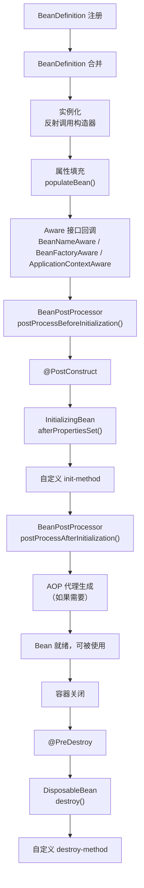

### BeanDefinition 注册

#### 三种注册方式

```java
// 1. @ComponentScan 扫描（最常用）
@ComponentScan(basePackages = "com.example")
// 扫描到 @Service → 注册 ServiceBeanDefinition

// 2. @Bean 方法注册
@Configuration
public class AppConfig {
    @Bean
    public DataSource dataSource() {
        return new HikariDataSource();
    }
}

// 3. XML / 手动注册
BeanDefinitionBuilder builder = BeanDefinitionBuilder.genericBeanDefinition(MyBean.class);
registry.registerBeanDefinition("myBean", builder.getBeanDefinition());
```

#### BeanDefinition 的关键属性

```java
// BeanDefinition 控制 Bean 的创建方式
public interface BeanDefinition {
    String getBeanClassName();        // Bean 的类名
    String getParentName();           // 父 BeanDefinition
    String getScope();                // 作用域：singleton / prototype
    boolean isLazyInit();             // 是否延迟初始化
    boolean isSingleton();            // 是否单例
    ConstructorArgumentValues getConstructorArgumentValues();  // 构造器参数
    MutablePropertyValues getPropertyValues();                 // 属性值
}
```

### Bean 实例化阶段

#### 创建方式

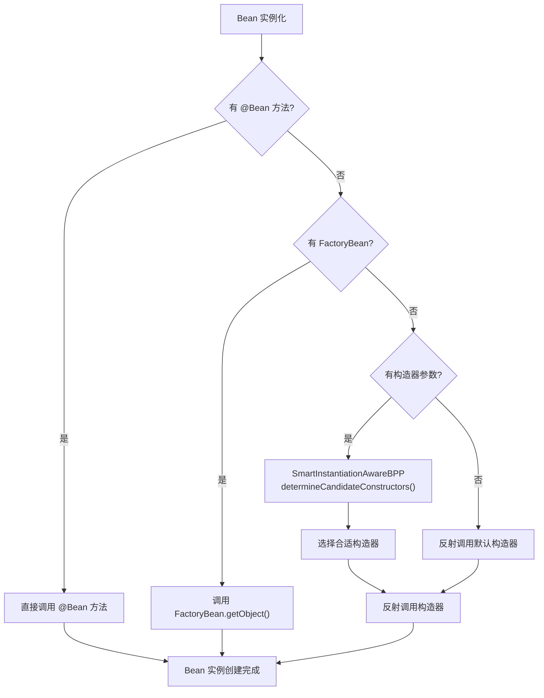

::: tip 三级缓存解决循环依赖
Spring 通过三级缓存解决单例 Bean 的循环依赖问题：

1. **singletonObjects**：存放完全初始化好的 Bean（一级缓存）
2. **earlySingletonObjects**：存放早期引用（未完成属性填充的 Bean，二级缓存）
3. **singletonFactories**：存放 Bean 工厂（用于生成早期引用，三级缓存）

当 A 依赖 B 且 B 依赖 A 时：
- A 创建 → 发现需要 B → B 创建 → 发现需要 A → 从三级缓存获取 A 的早期引用 → B 完成创建 → A 属性填充完成

::: warning Spring Boot 2.6+ 默认禁止循环依赖
`spring.main.allow-circular-references` 默认为 `false`。循环依赖是设计问题，应该通过重构解决（如提取公共逻辑到第三个 Bean），而不是依赖缓存机制绕过。
:::

### 属性填充阶段

```java
// AbstractAutowireCapableBeanFactory.java
protected void populateBean(String beanName, RootBeanDefinition mbd, @Nullable BeanWrapper bw) {
    // 1. InstantiationAwareBeanPostProcessor.postProcessAfterInstantiation()
    //    可以在此阻止属性填充（返回 false）

    // 2. 自动注入：按名称或按类型
    if (mbd.getResolvedAutowireMode() == AUTOWIRE_BY_NAME || AUTOWIRE_BY_TYPE) {
        // 自动查找依赖并注入
    }

    // 3. InstantiationAwareBeanPostProcessor.postProcessProperties()
    //    @Autowired 由 AutowiredAnnotationBeanPostProcessor 在此处理

    // 4. 应用 PropertyValues（XML/注解配置的显式属性）
    applyPropertyValues(beanName, mbd, bw, pvs);
}
```

### Aware 接口回调

```java
// Spring 自动注入容器感知信息
@Component
public class MyBean implements BeanNameAware, BeanFactoryAware, ApplicationContextAware {

    private String beanName;
    private BeanFactory beanFactory;
    private ApplicationContext applicationContext;

    @Override
    public void setBeanName(String name) {
        this.beanName = name;  // 注入 Bean 名称
    }

    @Override
    public void setBeanFactory(BeanFactory factory) {
        this.beanFactory = factory;  // 注入 BeanFactory
    }

    @Override
    public void setApplicationContext(ApplicationContext ctx) {
        this.applicationContext = ctx;  // 注入 ApplicationContext
    }
}
```

| Aware 接口 | 注入的内容 | 使用场景 |
|-----------|----------|---------|
| `BeanNameAware` | Bean 的名称 | 日志记录、自注册 |
| `BeanFactoryAware` | BeanFactory 实例 | 手动获取 Bean |
| `ApplicationContextAware` | ApplicationContext 实例 | 获取环境信息、发布事件 |
| `EnvironmentAware` | Environment 实例 | 读取配置属性 |
| `ResourceLoaderAware` | ResourceLoader 实例 | 加载资源文件 |
| `ApplicationEventPublisherAware` | 事件发布器 | 发布自定义事件 |

::: warning Aware 接口的侵入性
Aware 接口让 Bean 与 Spring 容器耦合。如果 Bean 只需要获取配置值，推荐使用 `@Value` 或 `@ConfigurationProperties`，而不是实现 `EnvironmentAware`。如果需要发布事件，推荐使用 `@Autowired ApplicationEventPublisher`，而不是实现 `ApplicationEventPublisherAware`。
:::

### 初始化阶段

#### 三个初始化回调的执行顺序

```java
// 执行顺序：@PostConstruct → afterPropertiesSet() → init-method
@Component
public class MyBean implements InitializingBean {

    @PostConstruct  // 第1个执行
    public void postConstruct() {
        log.info("1. @PostConstruct 执行");
    }

    @Override
    public void afterPropertiesSet() {  // 第2个执行
        log.info("2. InitializingBean.afterPropertiesSet() 执行");
    }

    // @Bean(initMethod = "customInit")  // 第3个执行
    public void customInit() {
        log.info("3. 自定义 init-method 执行");
    }
}
```

### BeanPostProcessor — 最强大的扩展点

#### 核心接口

```java
public interface BeanPostProcessor {
    // 初始化前回调
    @Nullable
    default Object postProcessBeforeInitialization(Object bean, String beanName) {
        return bean;
    }

    // 初始化后回调（AOP 代理在此生成）
    @Nullable
    default Object postProcessAfterInitialization(Object bean, String beanName) {
        return bean;
    }
}
```

#### 常见 BeanPostProcessor 及其作用

| BeanPostProcessor | 作用 |
|-------------------|------|
| `AutowiredAnnotationBeanPostProcessor` | 处理 `@Autowired` / `@Value` 注入 |
| `CommonAnnotationBeanPostProcessor` | 处理 `@PostConstruct` / `@PreDestroy` |
| `ApplicationContextAwareProcessor` | 处理各种 Aware 接口回调 |
| `AbstractAutoProxyCreator` | AOP 代理生成（`@Transactional`、`@Async` 等） |
| `ConfigurationPropertiesBindingPostProcessor` | 处理 `@ConfigurationProperties` 绑定 |

::: tip AOP 代理的生成时机
`AbstractAutoProxyCreator` 在 `postProcessAfterInitialization()` 中创建代理。这意味着 Bean 的初始化回调（`@PostConstruct`、`afterPropertiesSet()`）在代理生成之前执行——**@PostConstruct 中调用 `this.method()` 不会走代理逻辑**。如果需要在初始化时调用需要代理的方法，应该通过 `@Lazy` 自注入或 `ApplicationContext.getBean()` 获取代理对象。
:::

### 销毁阶段

#### 三个销毁回调的执行顺序

```java
// 执行顺序：@PreDestroy → destroy() → destroy-method
@Component
public class MyBean implements DisposableBean {

    @PreDestroy  // 第1个执行
    public void preDestroy() {
        log.info("1. @PreDestroy 执行");
    }

    @Override
    public void destroy() {  // 第2个执行
        log.info("2. DisposableBean.destroy() 执行");
    }

    // @Bean(destroyMethod = "customDestroy")  // 第3个执行
    public void customDestroy() {
        log.info("3. 自定义 destroy-method 执行");
    }
}
```

#### 优雅停机

```yaml
## application.yml
server:
  shutdown: graceful  # 启用优雅停机

spring:
  lifecycle:
    timeout-per-shutdown-phase: 30s  # 停机超时时间
```

```java
// 自定义停机逻辑
@Component
public class GracefulShutdown {

    private final ExecutorService executor = Executors.newSingleThreadExecutor();

    @PreDestroy
    public void onShutdown() {
        log.info("应用开始停机...");
        executor.shutdown();  // 不再接受新任务
        try {
            // 等待现有任务完成（最长 30 秒）
            if (!executor.awaitTermination(30, TimeUnit.SECONDS)) {
                executor.shutdownNow();  // 超时强制终止
            }
        } catch (InterruptedException e) {
            executor.shutdownNow();
        }
        log.info("应用停机完成");
    }
}
```

### Bean 作用域

#### 五种标准作用域

| 作用域 | 说明 | 生命周期 | 使用场景 |
|-------|------|---------|---------|
| `singleton` | 默认值，单例 | 容器生命周期 | 无状态 Service、配置类 |
| `prototype` | 每次获取创建新实例 | 调用方控制 | 有状态对象、临时任务 |
| `request` | 每个 HTTP 请求一个实例 | 请求生命周期 | 请求上下文数据 |
| `session` | 每个 HTTP Session 一个实例 | Session 生命周期 | 用户会话数据 |
| `application` | 每个 ServletContext 一个实例 | 应用生命周期 | 全局共享数据 |

```java
// 设置 Bean 作用域
@Component
@Scope("prototype")  // 每次注入创建新实例
public class TaskWorker {
    // 有状态的任务处理器
}

// 使用 Web 作用域（需要 @EnableRequestScopeInvalidateAtLogin 等配置）
@Component
@RequestScope  // 等价于 @Scope(value = WebApplicationContext.SCOPE_REQUEST, proxyMode = ScopedProxyMode.TARGET_CLASS)
public class RequestContext {
    // 每个请求独立的数据
}
```

#### 作用域代理模式

当 singleton Bean 注入 scope 较短的 Bean（如 request/session）时，需要使用代理：

```java
// 方式一：proxyMode
@Component
@Scope(value = WebApplicationContext.SCOPE_REQUEST,
       proxyMode = ScopedProxyMode.TARGET_CLASS)
public class RequestContext {
    private String requestId;
    // ...
}

// 方式二：@RequestScope 注解（内置 proxyMode）
@Component
@RequestScope
public class RequestContext {
    private String requestId;
}
```

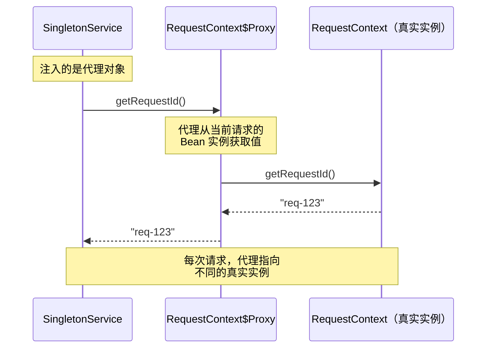

::: warning prototype Bean 的陷阱
1. **Spring 不管理 prototype Bean 的完整生命周期**：Spring 只负责创建，不负责销毁。需要调用方自行释放资源
2. **singleton 中注入 prototype 不会每次获取新实例**：因为注入只发生一次。解决方案：使用 `@Lookup` 方法注入、`ObjectProvider`/`Provider` 接口，或 `proxyMode = ScopedProxyMode.TARGET_CLASS`
3. **prototype Bean 的 @PreDestroy 不生效**：Spring 容器不跟踪 prototype Bean 的销毁
:::

#### @Lookup 方法注入

```java
// singleton Bean 中获取 prototype Bean 的正确方式
@Component
public class OrderService {

    // × 错误：直接注入 prototype，永远拿到同一个实例
    // @Autowired
    // private TaskWorker taskWorker;

    // √ 方式1：@Lookup 方法注入
    @Lookup
    protected TaskWorker createTaskWorker() {
        return null;  // Spring 会覆盖此方法，返回新实例
    }

    // √ 方式2：ObjectProvider
    @Autowired
    private ObjectProvider<TaskWorker> taskWorkerProvider;

    // √ 方式3：Provider（JSR-330 标准接口）
    @Autowired
    private Provider<TaskWorker> taskWorkerProviderJsr;

    public void processOrder() {
        TaskWorker worker = createTaskWorker();  // 每次获取新实例
        // 或
        TaskWorker worker2 = taskWorkerProvider.getObject();  // 每次获取新实例
        // 或
        TaskWorker worker3 = taskWorkerProviderJsrJsr.get();  // 每次获取新实例
        worker.execute();
    }
}
```

::: tip 三种 prototype 注入方式对比
| 方式 | 优点 | 缺点 |
|------|------|------|
| `@Lookup` | 简单直观，CGLIB 生成子类 | 需要 class 可被继承（不能 final）|
| `ObjectProvider` | Spring 专有，支持 `getIfAvailable`、`stream()` | Spring API 耦合 |
| `Provider<T>` | JSR-330 标准，可跨框架 | 功能较少 |
:::

### FactoryBean 机制

#### 核心接口

```java
public interface FactoryBean<T> {
    T getObject() throws Exception;    // 创建 Bean 实例
    Class<?> getObjectType();          // 返回 Bean 的类型
    default boolean isSingleton() {    // 是否单例
        return true;
    }
}
```

#### 自定义 FactoryBean 示例

```java
// 创建自定义 Client 的 FactoryBean
public class MyClientFactoryBean implements FactoryBean<MyClient> {

    private String host;
    private int port;
    private int timeout;

    @Override
    public MyClient getObject() {
        // 创建并初始化 Client
        MyClient client = new MyClient();
        client.setHost(host);
        client.setPort(port);
        client.setTimeout(timeout);
        client.init();  // 建立连接
        return client;
    }

    @Override
    public Class<?> getObjectType() {
        return MyClient.class;
    }

    @Override
    public boolean isSingleton() {
        return true;  // 单例，容器中只有一个 Client 实例
    }
}
```

```java
// 通过 @Bean 注册 FactoryBean
@Configuration
public class ClientConfig {

    @Bean
    public MyClientFactoryBean myClient() {
        MyClientFactoryBean factory = new MyClientFactoryBean();
        factory.setHost("localhost");
        factory.setPort(8080);
        factory.setTimeout(3000);
        return factory;  // 注册的是 FactoryBean，获取的是 MyClient
    }
}
```

::: tip FactoryBean 的实际用途
Spring 中大量使用 FactoryBean：
- `SqlSessionFactoryBean`（MyBatis 整合）
- `RestTemplate` 的 `HttpComponentsClientHttpRequestFactory`
- `RedisConnectionFactory`（Spring Data Redis）
- `ThreadPoolTaskExecutor`（异步线程池）

当你看到 `@Bean` 返回的是 FactoryBean 类型，但 `@Autowired` 注入的是另一个类型时，就是 FactoryBean 在起作用——容器调用 `getObject()` 返回真正的实例。
:::

### initializeBean() 初始化详解

初始化阶段是 Bean 生命周期中最关键的阶段之一，涵盖了 Aware 回调、初始化方法和 AOP 代理生成。

#### initializeBean() 源码

```java
// AbstractAutowireCapableBeanFactory.java
protected Object initializeBean(String beanName, Object bean, RootBeanDefinition mbd) {
    // 1. 执行 Aware 接口回调
    invokeAwareMethods(beanName, bean);

    Object wrappedBean = bean;
    if (mbd == null || !mbd.isSynthetic()) {
        // 2. BeanPostProcessor.postProcessBeforeInitialization()
        //    @PostConstruct 在此处理（由 CommonAnnotationBeanPostProcessor 处理）
        wrappedBean = applyBeanPostProcessorsBeforeInitialization(wrappedBean, beanName);
    }

    try {
        // 3. 执行初始化方法
        invokeInitMethods(beanName, wrappedBean, mbd);
    } catch (Throwable ex) {
        throw new BeanCreationException(beanName, "Invocation of init method failed", ex);
    }

    if (mbd == null || !mbd.isSynthetic()) {
        // 4. BeanPostProcessor.postProcessAfterInitialization()
        //    AOP 代理在此生成（由 AbstractAutoProxyCreator 处理）
        wrappedBean = applyBeanPostProcessorsAfterInitialization(wrappedBean, beanName);
    }

    return wrappedBean;
}
```

#### invokeAwareMethods() 源码

```java
private void invokeAwareMethods(String beanName, Object bean) {
    if (bean instanceof Aware aware) {
        if (aware instanceof BeanNameAware beanNameAware) {
            beanNameAware.setBeanName(beanName);
        }
        if (aware instanceof BeanClassLoaderAware beanClassLoaderAware) {
            beanClassLoaderAware.setBeanClassLoader(getBeanClassLoader());
        }
        if (aware instanceof BeanFactoryAware beanFactoryAware) {
            beanFactoryAware.setBeanFactory(this);
        }
    }
}
```

::: tip 两套 Aware 回调的区别
Spring 有两套 Aware 回调机制：

1. **invokeAwareMethods()**：只处理 `BeanNameAware`、`BeanClassLoaderAware`、`BeanFactoryAware`——这三个是 BeanFactory 级别的
2. **ApplicationContextAwareProcessor**：处理 `EnvironmentAware`、`ApplicationContextAware` 等——这些是 ApplicationContext 级别的

为什么分两套？因为 `BeanFactory` 本身不知道 `ApplicationContext` 的存在，只有 `ApplicationContextAwareProcessor`（一个 BeanPostProcessor）才能注入这些高级依赖。
:::

#### invokeInitMethods() 源码

```java
protected void invokeInitMethods(String beanName, Object bean, RootBeanDefinition mbd)
        throws Throwable {

    // 1. 如果 Bean 实现了 InitializingBean，调用 afterPropertiesSet()
    if (bean instanceof InitializingBean initializingBean) {
        if (System.getSecurityManager() != null) {
            AccessController.doPrivileged((PrivilegedExceptionAction<Object>) () -> {
                initializingBean.afterPropertiesSet();
                return null;
            });
        } else {
            initializingBean.afterPropertiesSet();
        }
    }

    // 2. 调用自定义 init-method
    if (mbd != null && mbd.getInitMethodName() != null) {
        String initMethodName = mbd.getInitMethodName();
        // 如果 init-method 名是 "afterPropertiesSet" 且 Bean 已实现 InitializingBean
        // 则不再重复调用
        if (!(bean instanceof InitializingBean && "afterPropertiesSet".equals(initMethodName))) {
            invokeCustomInitMethod(beanName, bean, mbd);
        }
    }
}
```

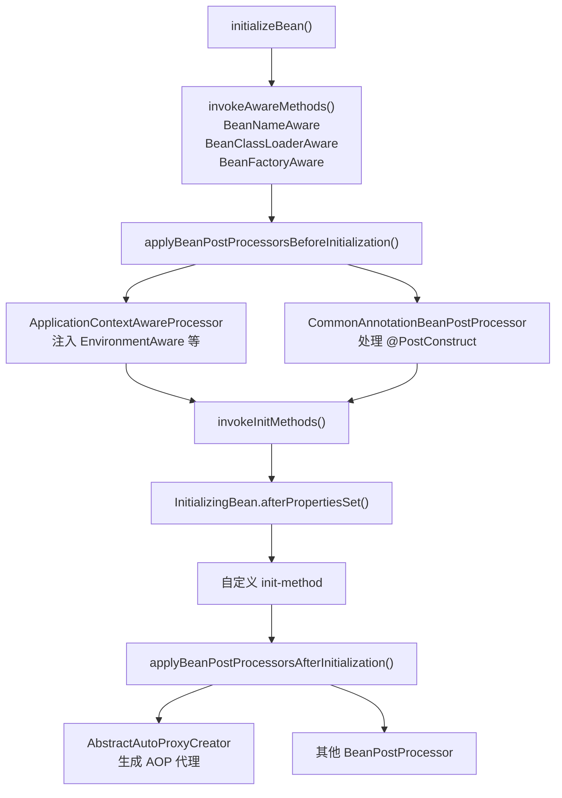

### Spring 事件机制与 Bean 生命周期

Spring 的事件机制与 Bean 生命周期紧密关联，容器在 Bean 的各个阶段都会发布事件。

#### 容器级事件

| 事件 | 触发时机 | 可获取的信息 |
|------|---------|------------|
| `ContextRefreshedEvent` | 容器刷新完成（所有 Bean 已就绪） | ApplicationContext |
| `ContextStartedEvent` | 调用 `context.start()` 时 | ApplicationContext |
| `ContextStoppedEvent` | 调用 `context.stop()` 时 | ApplicationContext |
| `ContextClosedEvent` | 容器关闭时 | ApplicationContext |

#### Bean 级事件

| 事件 | 触发时机 |
|------|---------|
| `BeanCreatedEvent` | Bean 实例化完成 |
| `BeanDefinitionUpdatedEvent` | BeanDefinition 被修改 |

#### 自定义事件的发布与监听

```java
// 自定义事件
public class OrderCreatedEvent extends ApplicationEvent {
    private final Order order;

    public OrderCreatedEvent(Object source, Order order) {
        super(source);
        this.order = order;
    }

    public Order getOrder() {
        return order;
    }
}

// 发布事件
@Service
public class OrderService {
    @Autowired
    private ApplicationEventPublisher eventPublisher;

    public void createOrder(Order order) {
        // 业务逻辑...
        eventPublisher.publishEvent(new OrderCreatedEvent(this, order));
    }
}

// 监听事件
@Component
public class OrderEventListener {

    @EventListener
    public void onOrderCreated(OrderCreatedEvent event) {
        log.info("订单创建：{}", event.getOrder().getId());
        // 发送通知、更新统计等
    }

    // 异步监听
    @Async
    @EventListener
    public void onOrderCreatedAsync(OrderCreatedEvent event) {
        // 异步处理：发送邮件、短信通知
    }

    // 条件监听：只处理大额订单
    @EventListener(condition = "#event.order.amount > 10000")
    public void onHighValueOrder(OrderCreatedEvent event) {
        log.info("大额订单：{}", event.getOrder().getId());
    }
}
```

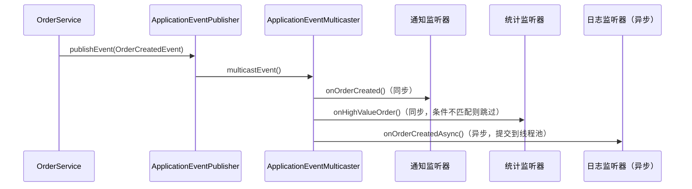

::: warning @EventListener 的陷阱
1. **默认同步执行**：监听器在发布者的线程中同步执行，如果监听器耗时，会阻塞业务逻辑。使用 `@Async` 异步化
2. **事务边界**：`@EventListener` 在事务内执行，如果监听器抛异常，会导致事务回滚。使用 `@TransactionalEventListener(phase = AFTER_COMMIT)` 在事务提交后执行
3. **循环事件**：监听器中再发布事件，可能导致死循环
:::

#### @TransactionalEventListener

```java
@Component
public class OrderTransactionEventListener {

    // 事务提交后执行，确保数据已持久化
    @TransactionalEventListener(phase = TransactionPhase.AFTER_COMMIT)
    public void onOrderCommitted(OrderCreatedEvent event) {
        // 事务已提交，可以安全地执行：
        // - 发送消息队列消息
        // - 更新缓存
        // - 发送通知
        log.info("订单事务已提交，订单ID：{}", event.getOrder().getId());
    }

    // 事务回滚后执行
    @TransactionalEventListener(phase = TransactionPhase.AFTER_ROLLBACK)
    public void onOrderRollback(OrderCreatedEvent event) {
        log.warn("订单事务回滚，订单ID：{}", event.getOrder().getId());
    }
}
```

### 条件装配与 Bean 注册控制

#### @Conditional 系列注解

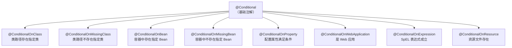

#### @ConditionalOnMissingBean 的设计哲学

```java
// 自动配置类中的典型模式
@Configuration(proxyBeanMethods = false)
@ConditionalOnClass(DataSource.class)
@EnableConfigurationProperties(DataSourceProperties.class)
public class DataSourceAutoConfiguration {

    @Bean
    @ConditionalOnMissingBean  // 只有用户没有自定义 DataSource 时才生效
    public DataSource dataSource(DataSourceProperties properties) {
        return properties.initializeDataSourceBuilder().build();
    }
}
```

::: tip @ConditionalOnMissingBean = 用户优先
`@ConditionalOnMissingBean` 体现了 Spring Boot 的核心设计哲学：**自动配置提供合理的默认值，但用户自定义始终优先。** 如果用户自己定义了 `DataSource` Bean，自动配置的 `DataSource` 就不会创建。这就是为什么你可以通过简单地定义一个 `@Bean` 方法来覆盖自动配置的默认行为。
:::

### BeanDefinition 合并过程

Bean 在实例化之前，需要先将其 `BeanDefinition` 从定义态合并为可执行的 `RootBeanDefinition`。

#### 为什么要合并？

```java
// 子 BeanDefinition 可以继承父 BeanDefinition 的属性
// 合并过程将父子定义合并为一个完整的 RootBeanDefinition

// 示例：XML 配置中的继承
// <bean id="baseDao" abstract="true" class="com.example.BaseDao">
//     <property name="timeout" value="5000"/>
// </bean>
// <bean id="userDao" parent="baseDao" class="com.example.UserDao">
//     <property name="entityClass" value="com.example.User"/>
// </bean>
```

```java
// AbstractBeanFactory.java
protected RootBeanDefinition getMergedBeanDefinition(
        String beanName, BeanDefinition bd, @Nullable BeanDefinition containingBd) {

    synchronized (this.mergedBeanDefinitions) {
        RootBeanDefinition mbd = null;
        RootBeanDefinition previous = null;

        // 检查缓存
        if (containingBd == null) {
            mbd = this.mergedBeanDefinitions.get(beanName);
        }

        if (mbd == null || mbd.stale) {
            previous = mbd;

            if (bd.getParentName() == null) {
                // 没有父定义，直接转为 RootBeanDefinition
                if (bd instanceof RootBeanDefinition rootBeanDef) {
                    mbd = rootBeanDef.cloneBeanDefinition();
                } else {
                    mbd = new RootBeanDefinition(bd);
                }
            } else {
                // 有父定义，递归合并
                BeanDefinition pbd = getBeanDefinition(bd.getParentName());
                RootBeanDefinition mergedPbd = getMergedBeanDefinition(bd.getParentName(), pbd);
                // 子定义覆盖父定义
                mbd = new RootBeanDefinition(mergedPbd);
                mbd.overrideFrom(bd);  // 子属性覆盖父属性
            }

            // 缓存合并后的 BeanDefinition
            if (containingBd == null && isCacheBeanMetadata()) {
                this.mergedBeanDefinitions.put(beanName, mbd);
            }
        }
        return mbd;
    }
}
```

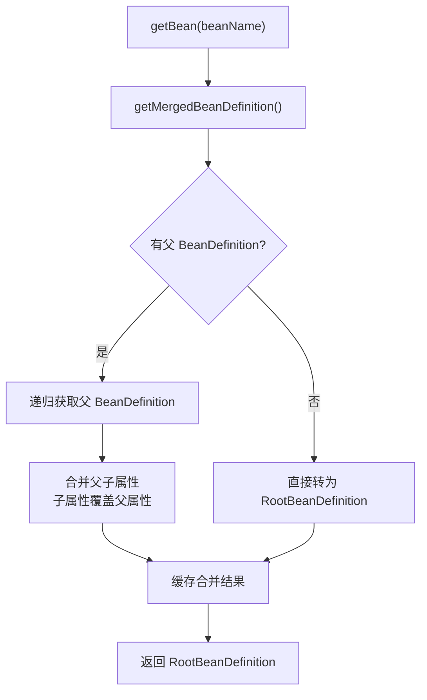

::: tip BeanDefinition 合并的意义
1. **继承复用**：子 BeanDefinition 可以继承父 BeanDefinition 的通用属性
2. **统一类型**：合并后都是 `RootBeanDefinition`，后续处理逻辑统一
3. **缓存性能**：合并结果缓存，避免重复计算
4. **占位符解析**：合并在属性填充之前，确保所有属性值都已就绪
:::

### 构造器推断与 SmartInstantiationAwareBPP

#### 构造器选择策略

当 Bean 没有默认构造器，或有多个构造器时，Spring 需要推断使用哪个构造器：

```java
// AbstractAutowireCapableBeanFactory.java
protected BeanWrapper createBeanInstance(String beanName, RootBeanDefinition mbd, Object[] args) {
    Class<?> beanClass = resolveBeanClass(mbd, beanName);

    // 1. 如果有 Supplier，直接用 Supplier 创建
    Supplier<?> instanceSupplier = mbd.getInstanceSupplier();
    if (instanceSupplier != null) {
        return obtainFromSupplier(instanceSupplier, beanName);
    }

    // 2. 如果有工厂方法，用工厂方法创建
    if (mbd.getFactoryMethodName() != null) {
        return instantiateUsingFactoryMethod(beanName, mbd, args);
    }

    // 3. 推断构造器
    Constructor<?>[] ctors = determineConstructorsFromPostProcessors(beanClass, beanName);
    if (ctors != null || mbd.getResolvedAutowireMode() == AUTOWIRE_CONSTRUCTOR ||
            mbd.hasConstructorArgumentValues() || !ObjectUtils.isEmpty(args)) {
        return autowireConstructor(beanName, mbd, ctors, args);
    }

    // 4. 使用默认构造器
    return instantiateBean(beanName, mbd);
}
```

```java
// SmartInstantiationAwareBeanPostProcessor.determineCandidateConstructors()
// AutowiredAnnotationBeanPostProcessor 的实现
public Constructor<?>[] determineCandidateConstructors(Class<?> beanClass, String beanName) {
    // 查找 @Autowired 标注的构造器
    Constructor<?>[] candidates = this.candidateConstructorsCache.get(beanClass);
    if (candidates == null) {
        synchronized (this.candidateConstructorsCache) {
            candidates = this.candidateConstructorsCache.get(beanClass);
            if (candidates == null) {
                List<Constructor<?>> candidatesList = new ArrayList<>();

                // 遍历所有构造器，查找 @Autowired 标注的
                for (Constructor<?> ctor : rawCtors) {
                    AnnotationAttributes ann = findAutowiredAnnotation(ctor);
                    if (ann != null) {
                        if (ann.getBoolean("required")) {
                            requiredConstructor = ctor;
                        }
                        candidatesList.add(ctor);
                    }
                }

                if (!candidatesList.isEmpty()) {
                    candidates = candidatesList.toArray(new Constructor<?>[0]);
                }
                this.candidateConstructorsCache.put(beanClass, candidates);
            }
        }
    }
    return candidates;
}
```

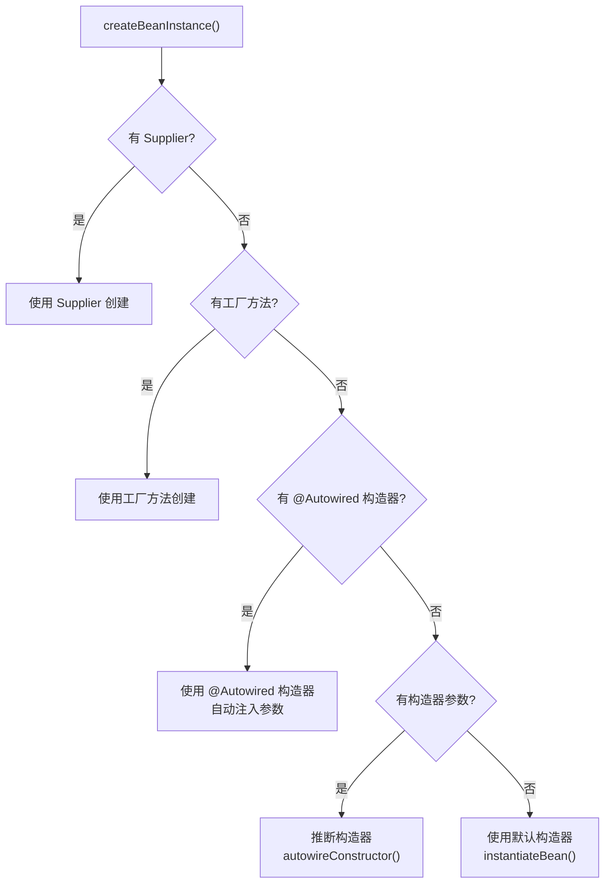

::: warning 构造器注入 vs 字段注入
- **构造器注入**（推荐）：在构造阶段就能保证依赖不为 null，Bean 创建后即可用。适合强制依赖
- **字段注入**（`@Autowired` 在字段上）：代码简洁，但隐藏了依赖关系，不利于测试，无法声明不可变字段
- **Setter 注入**：适合可选依赖，允许重新配置

**最佳实践：** 强制依赖用构造器注入，可选依赖用 Setter 注入，避免字段注入。
:::

### Bean 创建完整源码追踪

#### createBean() → doCreateBean()

```java
// AbstractAutowireCapableBeanFactory.java
protected Object createBean(String beanName, RootBeanDefinition mbd, Object[] args) {
    RootBeanDefinition mbdToUse = mbd;

    // 1. 解析 Bean 的类型
    Class<?> resolvedClass = resolveBeanClass(mbd, beanName);

    // 2. 准备方法覆盖（XML 配置的 lookup-method / replace-method）
    mbdToUse.prepareMethodOverrides();

    // 3. 给 BeanPostProcessor 一个机会返回代理对象（短路创建）
    Object bean = resolveBeforeInstantiation(beanName, mbdToUse);
    if (bean != null) {
        return bean;  // 如果 BPP 返回了代理，直接返回，不走后续流程
    }

    // 4. 真正创建 Bean
    Object beanInstance = doCreateBean(beanName, mbdToUse, args);
    return beanInstance;
}
```

```java
protected Object doCreateBean(String beanName, RootBeanDefinition mbd, Object[] args) {
    BeanWrapper instanceWrapper = null;

    // 1. 创建 Bean 实例（调用构造器）
    if (mbd.isSingleton()) {
        instanceWrapper = this.factoryBeanInstanceCache.remove(beanName);
    }
    if (instanceWrapper == null) {
        instanceWrapper = createBeanInstance(beanName, mbd, args);
    }
    Object bean = instanceWrapper.getWrappedInstance();

    // 2. 提前暴露早期引用（解决循环依赖的关键）
    boolean earlySingletonExposure = (mbd.isSingleton() &&
        this.allowCircularReferences &&
        isSingletonCurrentlyInCreation(beanName));

    if (earlySingletonExposure) {
        // 将 Bean 工厂放入三级缓存
        addSingletonFactory(beanName,
            () -> getEarlyBeanReference(beanName, mbd, bean));
    }

    Object exposedObject = bean;
    try {
        // 3. 属性填充（@Autowired 在此处理）
        populateBean(beanName, mbd, instanceWrapper);

        // 4. 初始化（@PostConstruct、InitializingBean、AOP 代理）
        exposedObject = initializeBean(beanName, exposedObject, mbd);
    } catch (Throwable ex) {
        // 异常处理
    }

    // 5. 循环依赖检查
    if (earlySingletonExposure) {
        Object earlySingletonReference = getSingleton(beanName, false);
        if (earlySingletonReference != null) {
            if (exposedObject == bean) {
                exposedObject = earlySingletonReference;
            } else if (!this.allowRawInjectionDespiteWrapping) {
                // 提前暴露的引用和最终 Bean 不一致，抛出异常
                throw new BeanCurrentlyInCreationException(beanName);
            }
        }
    }

    // 6. 注册 DisposableBean（用于容器关闭时销毁）
    registerDisposableBeanIfNecessary(beanName, bean, mbd);

    return exposedObject;
}
```

```mermaid
sequenceDiagram
    participant Get as getBean()
    participant Create as createBean()
    participant DoCreate as doCreateBean()
    participant Instance as createBeanInstance()
    participant Populate as populateBean()
    participant Init as initializeBean()
    participant Cache as 三级缓存

    Get->>Create: createBean(beanName, mbd, args)
    Create->>Create: resolveBeforeInstantiation()<br/>（InstantiationAwareBPP 短路）
    Create->>DoCreate: doCreateBean()

    DoCreate->>Instance: createBeanInstance()<br/>调用构造器创建实例
    Instance-->>DoCreate: 返回 BeanWrapper

    DoCreate->>Cache: addSingletonFactory()<br/>提前暴露到三级缓存

    DoCreate->>Populate: populateBean()<br/>属性填充（@Autowired）
    Populate-->>DoCreate: 属性填充完成

    DoCreate->>Init: initializeBean()<br/>初始化（@PostConstruct、AOP）
    Init-->>DoCreate: 返回最终 Bean（可能是代理）

    DoCreate->>DoCreate: 循环依赖检查
    DoCreate-->>Get: 返回完整 Bean
```

### 三级缓存源码深度剖析

#### 缓存数据结构

```java
// DefaultSingletonBeanRegistry.java
public class DefaultSingletonBeanRegistry {

    /** 一级缓存：存放完全初始化好的 Bean */
    private final Map<String, Object> singletonObjects = new ConcurrentHashMap<>(256);

    /** 二级缓存：存放早期引用（未完成属性填充的 Bean） */
    private final Map<String, Object> earlySingletonObjects = new ConcurrentHashMap<>(16);

    /** 三级缓存：存放 Bean 工厂（用于生成早期引用） */
    private final Map<String, ObjectFactory<?>> singletonFactories = new HashMap<>(16);

    /** 正在创建中的 Bean 名称集合 */
    private final Set<String> singletonsCurrentlyInCreation = Collections.newSetFromMap(new ConcurrentHashMap<>(16));
}
```

#### getSingleton() 获取 Bean 的完整流程

```java
// DefaultSingletonBeanRegistry.java
public Object getSingleton(String beanName, boolean allowEarlyReference) {
    // 1. 先从一级缓存获取（完全初始化好的 Bean）
    Object singletonObject = this.singletonObjects.get(beanName);

    // 2. 如果一级缓存没有，且 Bean 正在创建中（说明有循环依赖）
    if (singletonObject == null && isSingletonCurrentlyInCreation(beanName)) {
        // 从二级缓存获取（早期引用）
        singletonObject = this.earlySingletonObjects.get(beanName);

        // 3. 如果二级缓存也没有，且允许早期引用
        if (singletonObject == null && allowEarlyReference) {
            synchronized (this.singletonObjects) {
                // 双重检查
                singletonObject = this.singletonObjects.get(beanName);
                if (singletonObject == null) {
                    singletonObject = this.earlySingletonObjects.get(beanName);
                    if (singletonObject == null) {
                        // 从三级缓存获取工厂，调用工厂方法获取早期引用
                        ObjectFactory<?> singletonFactory = this.singletonFactories.get(beanName);
                        if (singletonFactory != null) {
                            singletonObject = singletonFactory.getObject();
                            // 升级到二级缓存
                            this.earlySingletonObjects.put(beanName, singletonObject);
                            // 移除三级缓存
                            this.singletonFactories.remove(beanName);
                        }
                    }
                }
            }
        }
    }
    return singletonObject;
}
```

#### 循环依赖解决的完整时序

以 A 依赖 B、B 依赖 A 为例：

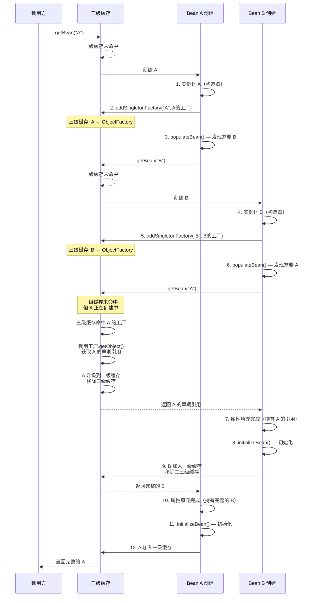

#### 为什么需要三级缓存而不是二级？

```java
// 关键：三级缓存存的是 ObjectFactory，不是直接的 Bean 实例
addSingletonFactory(beanName, () -> getEarlyBeanReference(beanName, mbd, bean));

// getEarlyBeanReference 的作用
protected Object getEarlyBeanReference(String beanName, RootBeanDefinition mbd, Object bean) {
    Object exposedObject = bean;

    // 允许 BeanPostProcessor 在早期引用阶段创建代理
    // 例如：AbstractAutoProxyCreator 可以在此创建 AOP 代理
    if (!mbd.isSynthetic() && hasInstantiationAwareBeanPostProcessors()) {
        for (SmartInstantiationAwareBeanPostProcessor bp : getBeanPostProcessorCache().smartInstantiationAware) {
            exposedObject = bp.getEarlyBeanReference(exposedObject, beanName);
        }
    }
    return exposedObject;
}
```

::: danger 为什么二级缓存不够？
假设只有二级缓存：
1. A 创建 → 暴露早期引用到二级缓存
2. B 获取 A 的早期引用 → 如果 A 需要 AOP 代理，此时还不知道
3. A 初始化 → 发现需要 AOP 代理 → 生成代理对象
4. **问题**：B 持有的是 A 的原始引用，不是代理对象

三级缓存通过 `ObjectFactory` 延迟决定：当 B 获取 A 的早期引用时，才调用工厂方法。如果 A 需要 AOP 代理，工厂方法会返回代理对象，确保 B 持有的是代理引用。同时二级缓存保证代理对象只创建一次。

**简单理解**：三级缓存 = 延迟代理创建 + 保证代理单例。
:::

#### 构造器循环依赖无法解决

```java
// × 构造器循环依赖，Spring 无法解决
@Component
public class A {
    private final B b;
    public A(B b) { this.b = b; }  // 构造器注入 B
}

@Component
public class B {
    private final A a;
    public B(A a) { this.a = a; }  // 构造器注入 A
}

// 启动报错：
// The dependencies of some of the beans in the application context form a cycle:
// ┌─────┐
// |  a defined in file [...]
// ↑     ↓
// |  b defined in file [...]
// └─────┘
```

::: danger 构造器循环依赖无解
三级缓存只能解决 **setter 注入和字段注入（@Autowired）** 的循环依赖，因为这两类注入在实例化之后（`populateBean()`）才处理依赖。构造器循环依赖在实例化阶段就需要依赖，此时 Bean 还没创建，无法提前暴露。

**解决方案：**
1. 重构设计，消除循环依赖（最佳方案）
2. 将构造器注入改为 setter 注入
3. 使用 `@Lazy` 延迟注入
```java
@Component
public class A {
    private final B b;
    public A(@Lazy B b) { this.b = b; }  // @Lazy 生成代理，延迟解析
}
```
:::

### @Autowired 注入源码分析

#### AutowiredAnnotationBeanPostProcessor 工作原理

```java
// AutowiredAnnotationBeanPostProcessor.java
public class AutowiredAnnotationBeanPostProcessor extends InstantiationAwareBeanPostProcessorAdapter
        implements MergedBeanDefinitionPostProcessor, PriorityOrdered {

    // 支持的注解类型
    private final Set<Class<? extends Annotation>> autowiredAnnotationTypes = new LinkedHashSet<>(4);

    public AutowiredAnnotationBeanPostProcessor() {
        this.autowiredAnnotationTypes.add(Autowired.class);
        this.autowiredAnnotationTypes.add(Value.class);
        // 如果有 JSR-330 的 @Inject，也支持
        try {
            this.autowiredAnnotationTypes.add(
                Class.forName("javax.inject.Inject"));
        } catch (ClassNotFoundException ex) {
            // JSR-330 不存在，忽略
        }
    }
}
```

#### 注入元数据收集

```java
// MergedBeanDefinitionPostProcessor.postProcessMergedBeanDefinition()
// 在 Bean 实例化后、属性填充前调用，收集注入元数据
public void postProcessMergedBeanDefinition(RootBeanDefinition beanDefinition,
        Class<?> beanType, String beanName) {

    // 查找 Bean 中的 @Autowired / @Value 注解
    InjectionMetadata metadata = findAutowiringMetadata(beanName, beanType, null);
    metadata.checkConfigMembers(beanDefinition);
}

private InjectionMetadata findAutowiringMetadata(String beanName, Class<?> clazz,
        @Nullable PropertyValues pvs) {
    String cacheKey = (StringUtils.hasLength(beanName) ? beanName : clazz.getName());
    InjectionMetadata metadata = this.injectionMetadataCache.get(cacheKey);

    if (metadata == null || metadata.needsRefresh(clazz)) {
        synchronized (this.injectionMetadataCache) {
            metadata = this.injectionMetadataCache.get(cacheKey);
            if (metadata == null || metadata.needsRefresh(clazz)) {
                // 构建 @Autowired 注入元数据
                metadata = buildAutowiringMetadata(clazz);
                this.injectionMetadataCache.put(cacheKey, metadata);
            }
        }
    }
    return metadata;
}
```

#### 属性注入执行

```java
// InstantiationAwareBeanPostProcessor.postProcessProperties()
public PropertyValues postProcessProperties(PropertyValues pvs, Object bean, String beanName) {
    InjectionMetadata metadata = findAutowiringMetadata(beanName, bean.getClass(), pvs);
    try {
        // 执行注入
        metadata.inject(bean, beanName, pvs);
    } catch (BeanCreationException ex) {
        throw ex;
    }
    return pvs;
}
```

```java
// InjectionMetadata.java
public void inject(Object target, @Nullable String beanName, @Nullable PropertyValues pvs) {
    Collection<InjectedElement> checkedElements = this.checkedElements;
    for (InjectedElement element : checkedElements) {
        element.inject(target, beanName, pvs);
    }
}

// AutowiredFieldElement.inject() — 字段注入
protected void inject(Object bean, @Nullable String beanName, @Nullable PropertyValues pvs) {
    Field field = (Field) this.member;
    Object value;

    // 解析依赖
    DependencyDescriptor desc = new DependencyDescriptor(field, this.required);
    desc.setContainingClass(bean.getClass());

    value = beanFactory.resolveDependency(desc, beanName, autowiredBeanNames, typeConverter);

    if (value != null) {
        // 反射设置字段值
        field.setAccessible(true);
        field.set(bean, value);
    }
}
```

#### 依赖解析核心：resolveDependency()

```java
// DefaultListableBeanFactory.java
public Object resolveDependency(DependencyDescriptor descriptor,
        @Nullable String requestingBeanName, @Nullable Set<String> autowiredBeanNames,
        @Nullable TypeConverter typeConverter) {

    // 1. 处理特殊类型（Optional、ObjectFactory、Provider 等）
    if (Optional.class == descriptor.getDependencyType()) {
        return createOptionalDependency(descriptor, requestingBeanName);
    }
    if (ObjectFactory.class == descriptor.getDependencyType() ||
            ObjectProvider.class == descriptor.getDependencyType()) {
        return new DependencyObjectProvider(descriptor, requestingBeanName);
    }
    if (javaxInjectProviderClass != null &&
            javaxInjectProviderClass == descriptor.getDependencyType()) {
        return new Jsr330Factory().createDependencyProvider(descriptor, requestingBeanName);
    }

    // 2. 处理 @Lazy — 返回代理对象
    Object result = getAutowireCandidateResolver().getLazyResolutionProxyIfNecessary(
        descriptor, requestingBeanName);
    if (result != null) {
        return result;
    }

    // 3. 正常解析依赖
    return doResolveDependency(descriptor, requestingBeanName, autowiredBeanNames, typeConverter);
}
```

```mermaid
flowchart TD
    A["resolveDependency()"] --> B{"特殊类型?"}
    B -->|Optional| C["createOptionalDependency()"]
    B -->|ObjectFactory/Provider| D["创建 DependencyObjectProvider"]
    B -->|@Lazy| E["返回代理对象"]
    B -->|普通类型| F["doResolveDependency()"]
    F --> G["查找候选 Bean<br/>findAutowireCandidates()"]
    G --> H{"候选 Bean 数量"}
    H -->|0| I{"required=true?"}
    I -->|是| J["抛出 NoSuchBeanDefinitionException"]
    I -->|否| K["返回 null"]
    H -->|1| L["直接返回"]
    H -->|>1| M["确定最佳候选<br/>determineAutowireCandidate()"]
    M --> N{"有 @Primary?"}
    N -->|是| O["返回 @Primary Bean"]
    N -->|否| P{"有 @Priority?"}
    P -->|是| Q["返回 @Priority 最高 Bean"]
    P -->|否| R{"按名称匹配?"}
    R -->|是| S["返回名称匹配的 Bean"]
    R -->|否| T["抛出 NoUniqueBeanDefinitionException"]

```

### AOP 代理生成机制

#### 代理生成的时机

AOP 代理在 `BeanPostProcessor.postProcessAfterInitialization()` 中生成：

```java
// AbstractAutoProxyCreator.java
public Object postProcessAfterInitialization(Object bean, String beanName) {
    if (bean != null) {
        Object cacheKey = getCacheKey(bean.getClass(), beanName);
        if (this.earlyProxyReferences.remove(cacheKey) != bean) {
            // 如果早期引用阶段没有创建代理，在此创建
            return wrapIfNecessary(bean, beanName, cacheKey);
        }
    }
    return bean;
}

protected Object wrapIfNecessary(Object bean, String beanName, Object cacheKey) {
    // 1. 检查是否已经处理过
    if (StringUtils.hasLength(beanName) && this.targetSourcedBeans.contains(beanName)) {
        return bean;
    }

    // 2. 检查是否不需要代理
    if (Boolean.FALSE.equals(this.advisedBeans.get(cacheKey))) {
        return bean;
    }

    // 3. 检查是否是基础设施类（Advice、Pointcut 等）
    if (isInfrastructureClass(bean.getClass()) || shouldSkip(bean.getClass(), beanName)) {
        this.advisedBeans.put(cacheKey, Boolean.FALSE);
        return bean;
    }

    // 4. 获取匹配当前 Bean 的所有 Advisor
    Object[] specificInterceptors = getAdvicesAndAdvisorsForBean(
        bean.getClass(), beanName, null);

    // 5. 如果有匹配的 Advisor，创建代理
    if (specificInterceptors != DO_NOT_PROXY) {
        this.advisedBeans.put(cacheKey, Boolean.TRUE);
        Object proxy = createProxy(bean.getClass(), beanName,
            specificInterceptors, new SingletonTargetSource(bean));
        this.proxyTypes.put(cacheKey, proxy.getClass());
        return proxy;
    }

    this.advisedBeans.put(cacheKey, Boolean.FALSE);
    return bean;
}
```

#### JDK 动态代理 vs CGLIB 代理

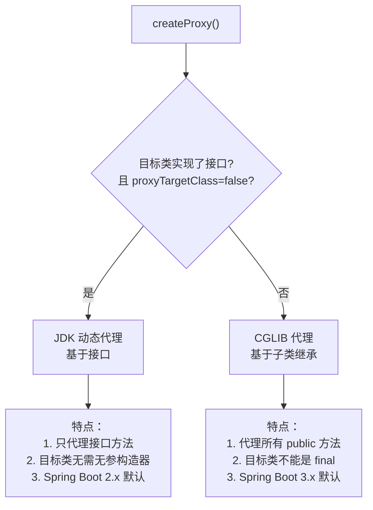

::: warning Spring Boot 3.x 代理策略变化
Spring Boot 2.x 默认使用 JDK 动态代理（如果有接口），3.x 默认使用 CGLIB 代理（`spring.aop.proxy-target-class=true`）。这是因为：
1. CGLIB 代理更一致，不会因为接口方法遗漏而失效
2. Spring Boot 3.x 基于 Spring 6，Spring 6 默认 `proxyTargetClass=true`
3. 如果需要 JDK 代理，显式设置 `spring.aop.proxy-target-class=false`
:::

#### 自调用问题与解决方案

```java
@Service
public class OrderService {

    // 场景：外部调用 createOrder() 有事务，内部调用 validateOrder() 也有事务
    // 但 this.validateOrder() 不会走代理，事务不生效

    @Transactional
    public void createOrder() {
        // ...
        this.validateOrder();  // × 不走代理，@Transactional 不生效
    }

    @Transactional(propagation = Propagation.REQUIRES_NEW)
    public void validateOrder() {
        // 独立事务验证
    }
}
```

```java
// 解决方案一：自注入（推荐）
@Service
public class OrderService {

    @Autowired
    @Lazy  // 避免循环依赖
    private OrderService self;

    @Transactional
    public void createOrder() {
        self.validateOrder();  // √ 走代理，事务生效
    }

    @Transactional(propagation = Propagation.REQUIRES_NEW)
    public void validateOrder() {
        // 独立事务验证
    }
}

// 解决方案二：AopContext（需要开启 exposeProxy）
@EnableAspectJAutoProxy(exposeProxy = true)
@Service
public class OrderService {

    @Transactional
    public void createOrder() {
        ((OrderService) AopContext.currentProxy()).validateOrder();  // √ 走代理
    }
}
```

::: danger 生产事故案例：自调用导致事务失效
某支付系统中，`PaymentService.processPayment()` 方法内部直接调用了 `this.refund()` 方法。`refund()` 方法标注了 `@Transactional(propagation = REQUIRES_NEW)`，期望在独立事务中执行退款。但由于自调用不走代理，退款和支付在同一个事务中——支付失败时退款也回滚了，导致用户支付成功但退款丢失。

**教训：** 同一个 Bean 中方法互调时，如果依赖 AOP 特性（事务、日志、权限），必须通过代理对象调用。
:::

### 完整的 BeanFactory 体系

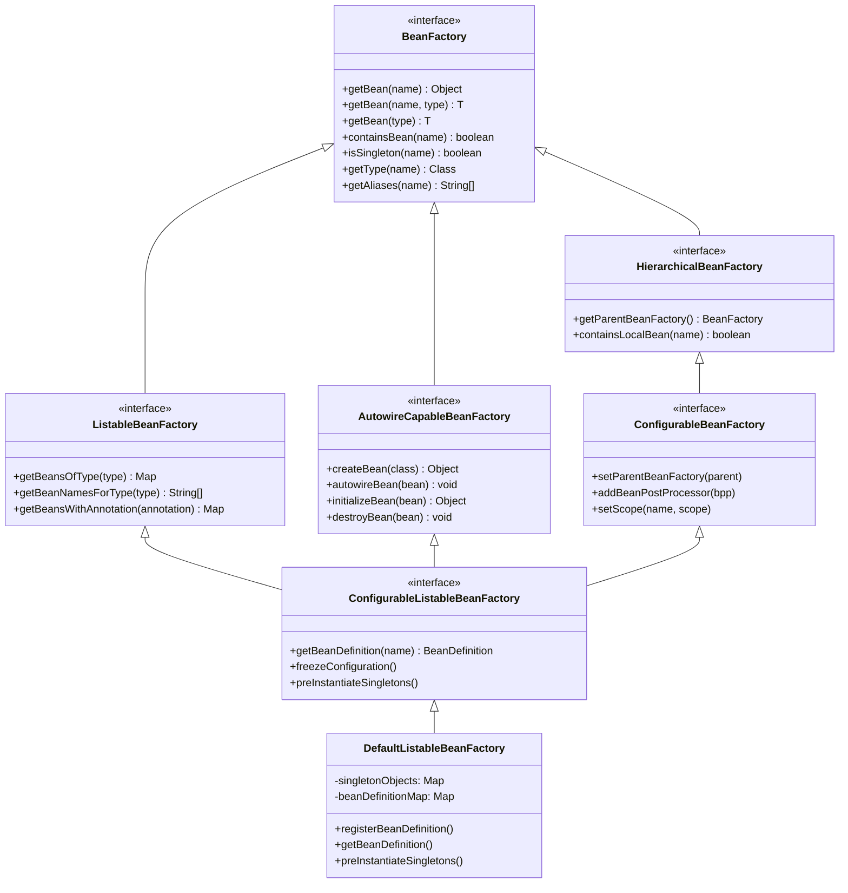

#### BeanFactory 核心接口职责

| 接口 | 核心职责 |
|------|---------|
| `BeanFactory` | 基础 Bean 查询：`getBean()`、`containsBean()`、`getType()` |
| `ListableBeanFactory` | 批量查询：按类型查找、按注解查找 |
| `HierarchicalBeanFactory` | 父子容器：`getParentBeanFactory()`、`containsLocalBean()` |
| `AutowireCapableBeanFactory` | Bean 生命周期管理：创建、注入、初始化、销毁 |
| `ConfigurableBeanFactory` | 配置：添加 BeanPostProcessor、设置 Scope |
| `ConfigurableListableBeanFactory` | 综合：BeanDefinition 管理、单例预初始化 |
| `DefaultListableBeanFactory` | 默认实现：IoC 容器的核心实现类 |

::: tip 为什么接口分这么多层？
这是**接口隔离原则**的体现。每个接口只暴露必要的能力：
- 绝大多数代码只需要 `BeanFactory`（获取 Bean）
- 需要批量查询时用 `ListableBeanFactory`
- 框架内部才需要 `AutowireCapableBeanFactory`（创建 Bean）
- 配置时才需要 `ConfigurableBeanFactory`

这种设计让不同角色只能访问自己需要的功能，降低了误用的风险。
:::

### 实战场景深度解析

#### 场景一：自定义 BeanPostProcessor 实现日志增强

```java
// 自动为 Service Bean 添加方法调用日志
@Component
public class ServiceLoggingPostProcessor implements BeanPostProcessor {

    @Override
    public Object postProcessAfterInitialization(Object bean, String beanName) {
        // 只对 @Service 标注的 Bean 增强
        if (bean.getClass().isAnnotationPresent(Service.class)) {
            return createLoggingProxy(bean);
        }
        return bean;
    }

    private Object createLoggingProxy(Object target) {
        Class<?> targetClass = target.getClass();
        // 使用 JDK 动态代理（Service 通常有接口）
        return Proxy.newProxyInstance(
            targetClass.getClassLoader(),
            targetClass.getInterfaces(),
            (proxy, method, args) -> {
                long start = System.currentTimeMillis();
                try {
                    Object result = method.invoke(target, args);
                    long duration = System.currentTimeMillis() - start;
                    if (duration > 1000) {
                        log.warn("[慢方法] {}.{}() 耗时 {}ms",
                            targetClass.getSimpleName(), method.getName(), duration);
                    } else {
                        log.debug("[方法调用] {}.{}() 耗时 {}ms",
                            targetClass.getSimpleName(), method.getName(), duration);
                    }
                    return result;
                } catch (InvocationTargetException e) {
                    long duration = System.currentTimeMillis() - start;
                    log.error("[方法异常] {}.{}() 耗时 {}ms, 异常: {}",
                        targetClass.getSimpleName(), method.getName(), duration,
                        e.getTargetException().getMessage());
                    throw e.getTargetException();
                }
            }
        );
    }
}
```

#### 场景二：Bean 创建失败的自定义处理

```java
// 自定义 Bean 创建失败的处理策略
@Component
public class FallbackBeanPostProcessor implements BeanPostProcessor, PriorityOrdered {

    @Override
    public int getOrder() {
        return Ordered.LOWEST_PRECEDENCE;  // 最后执行
    }

    @Override
    public Object postProcessAfterInitialization(Object bean, String beanName) {
        // 为标记了 @Fallback 的 Bean 创建降级代理
        if (bean.getClass().isAnnotationPresent(Fallback.class)) {
            return createFallbackProxy(bean, beanName);
        }
        return bean;
    }

    private Object createFallbackProxy(Object bean, String beanName) {
        Fallback fallback = bean.getClass().getAnnotation(Fallback.class);
        Class<?> fallbackClass = fallback.value();

        return Proxy.newProxyInstance(
            bean.getClass().getClassLoader(),
            bean.getClass().getInterfaces(),
            (proxy, method, args) -> {
                try {
                    return method.invoke(bean, args);
                } catch (Exception e) {
                    log.warn("Bean [{}] 方法 {} 调用失败，使用降级策略: {}",
                        beanName, method.getName(), fallbackClass.getSimpleName());
                    Object fallbackBean = applicationContext.getBean(fallbackClass);
                    return method.invoke(fallbackBean, args);
                }
            }
        );
    }
}
```

#### 场景三：动态注册 Bean

```java
// 运行时动态注册 Bean
@Component
public class DynamicBeanRegistrar implements ApplicationContextAware {

    private ConfigurableApplicationContext context;

    @Override
    public void setApplicationContext(ApplicationContext applicationContext) {
        this.context = (ConfigurableApplicationContext) applicationContext;
    }

    /**
     * 动态注册单例 Bean
     */
    public void registerSingleton(String beanName, Object bean) {
        context.getBeanFactory().registerSingleton(beanName, bean);
    }

    /**
     * 动态注册 BeanDefinition
     */
    public void registerBeanDefinition(String beanName, Class<?> beanClass) {
        GenericBeanDefinition beanDefinition = new GenericBeanDefinition();
        beanDefinition.setBeanClass(beanClass);
        beanDefinition.setScope(BeanDefinition.SCOPE_SINGLETON);
        beanDefinition.setAutowireMode(AbstractBeanDefinition.AUTOWIRE_BY_TYPE);
        context.getBeanFactory().registerBeanDefinition(beanName, beanDefinition);
    }

    /**
     * 移除 Bean
     */
    public void removeBean(String beanName) {
        DefaultListableBeanFactory beanFactory =
            (DefaultListableBeanFactory) context.getBeanFactory();
        beanFactory.removeBeanDefinition(beanName);
    }
}
```

#### 场景四：监听 Bean 生命周期事件

```java
// 监听所有 Bean 的创建和销毁
@Component
public class BeanLifecycleMonitor {

    private final AtomicInteger createdCount = new AtomicInteger(0);
    private final AtomicInteger destroyedCount = new AtomicInteger(0);

    @EventListener
    public void onContextRefreshed(ContextRefreshedEvent event) {
        String[] beanNames = event.getApplicationContext().getBeanNamesForType(Object.class);
        log.info("容器刷新完成，共加载 {} 个 Bean", beanNames.length);
    }

    @EventListener
    public void onContextClosed(ContextClosedEvent event) {
        log.info("容器关闭，已销毁 {} 个 Bean", destroyedCount.get());
    }
}
```

#### 场景五：多实例 Bean 的资源清理

```java
// prototype Bean 的资源清理方案
@Component
public class PrototypeBeanCleaner implements DisposableBean {

    // 使用 WeakReference 追踪 prototype Bean
    private final List<WeakReference<Disposable>> prototypeBeans =
        Collections.synchronizedList(new ArrayList<>());

    /**
     * 注册需要清理的 prototype Bean
     */
    public void registerForCleanup(Disposable bean) {
        prototypeBeans.add(new WeakReference<>(bean));
    }

    @Override
    public void destroy() {
        // 容器关闭时，清理所有存活的 prototype Bean
        for (WeakReference<Disposable> ref : prototypeBeans) {
            Disposable bean = ref.get();
            if (bean != null) {
                try {
                    bean.destroy();
                } catch (Exception e) {
                    log.warn("清理 prototype Bean 失败", e);
                }
            }
        }
        prototypeBeans.clear();
    }
}

// 使用示例
@Component
@Scope("prototype")
public class TempFileProcessor implements Disposable {

    private final Path tempFile;

    public TempFileProcessor() {
        this.tempFile = Files.createTempFile("process", ".tmp");
    }

    @Override
    public void destroy() {
        Files.deleteIfExists(tempFile);  // 清理临时文件
    }
}
```

#### 场景六：Bean 初始化顺序控制

```java
// 方式一：@DependsOn — 声明 Bean 依赖关系
@Configuration
public class AppConfig {

    @Bean
    @DependsOn("databaseInitializer")  // 确保 databaseInitializer 先初始化
    public DataSource dataSource() {
        return new HikariDataSource();
    }

    @Bean
    public DatabaseInitializer databaseInitializer() {
        return new DatabaseInitializer();  // 先执行建表、初始化数据
    }
}

// 方式二：SmartLifecycle — 控制启动和停止顺序
@Component
public class CacheWarmer implements SmartLifecycle {

    private volatile boolean running = false;

    @Override
    public void start() {
        // 预热缓存
        running = true;
    }

    @Override
    public void stop() {
        running = false;
    }

    @Override
    public boolean isRunning() {
        return running;
    }

    @Override
    public int getPhase() {
        return 1;  // Phase 越大越后启动、越先停止
    }
}

// 方式三：@AutoConfigureBefore/After（自动配置类之间）
@AutoConfigureAfter(DataSourceAutoConfiguration.class)
public class MyBatisAutoConfiguration {
    // 在 DataSource 配置之后加载
}
```

::: tip @DependsOn vs @Order vs SmartLifecycle
| 机制 | 控制对象 | 作用 |
|------|---------|------|
| `@DependsOn` | 单个 Bean 的创建顺序 | 确保依赖 Bean 先初始化 |
| `@Order` | Bean 集合的排序（如 List 注入） | 控制注入顺序 |
| `SmartLifecycle.getPhase()` | 生命周期 Bean 的启动/停止顺序 | 控制启动和优雅停机顺序 |
| `@AutoConfigureBefore/After` | 自动配置类的加载顺序 | Starter 之间的顺序控制 |
:::

#### 场景七：避免 Bean 覆盖冲突

```java
// Spring Boot 2.1+ 默认禁止 Bean 定义覆盖
// 如果两个 Bean 定义了相同的名称，会抛出 BeanDefinitionOverrideException

// 场景：第三方库注册了一个 "myService" Bean，你也想注册同名的
@Configuration
public class MyConfig {

    @Bean
    public MyService myService() {
        return new CustomMyService();  // × 默认报错：Bean 定义被覆盖
    }
}
```

```yaml
## 允许 Bean 定义覆盖（不推荐，仅应急使用）
spring:
  main:
    allow-bean-definition-overriding: true
```

```java
// √ 正确做法：自定义 Bean 使用独立名称 + @Primary 声明优先级
@Configuration
public class MyConfig {

    @Bean("customMyService")
    @Primary  // 当有多个同类型 Bean 并存时，注入优先使用此 Bean
    public MyService myService() {
        return new CustomMyService();
    }
}
```

::: danger Bean 覆盖的生产事故
某团队在升级依赖后，第三方库新增了一个 `ObjectMapper` Bean，覆盖了项目自定义的 `ObjectMapper`。导致：
1. 日期序列化格式从 `yyyy-MM-dd` 变回时间戳
2. null 值开始被序列化（之前配置了 `NON_NULL`）
3. 前端解析大量失败

**教训：** 自定义 Bean 始终使用 `@Primary` 标注，并开启 `allow-bean-definition-overriding: false`（默认值）以尽早发现冲突。
:::

### 面试要点

#### 1. Bean 的完整生命周期是什么？

**答案：** BeanDefinition 注册 → 合并 → 实例化 → 属性填充 → Aware 回调 → BeanPostProcessor.postProcessBeforeInitialization → @PostConstruct → InitializingBean.afterPropertiesSet() → init-method → BeanPostProcessor.postProcessAfterInitialization（AOP代理） → 使用 → @PreDestroy → DisposableBean.destroy() → destroy-method

#### 2. Spring 如何解决循环依赖？

**答案：** 通过三级缓存（singletonObjects / earlySingletonObjects / singletonFactories）。创建 A 时发现需要 B，创建 B 时发现需要 A，从三级缓存获取 A 的早期引用完成 B 的创建，再回填 A 的属性。但 Spring Boot 2.6+ 默认禁止循环依赖。

#### 3. @PostConstruct 中调用 this.method() 为什么不走代理？

**答案：** 因为 @PostConstruct 在 BeanPostProcessor.postProcessAfterInitialization() 之前执行，此时 AOP 代理还没生成。`this` 是原始对象而非代理对象。解决方案：使用 `@Lazy` 自注入或通过 ApplicationContext 获取代理对象。

#### 4. 三级缓存为什么不能简化为二级？

**答案：** 三级缓存存的是 `ObjectFactory`（工厂），可以延迟决定是否创建 AOP 代理。当发生循环依赖时，B 获取 A 的早期引用时调用工厂方法，如果 A 需要代理，工厂返回代理对象。二级缓存无法保证代理单例——每次获取早期引用可能创建新的代理对象。

#### 5. BeanFactory 和 ApplicationContext 的区别？

**答案：**
- `BeanFactory`：IoC 容器基础接口，只提供 Bean 查询能力
- `ApplicationContext`：高级容器，扩展了事件发布、国际化、资源加载、AOP 集成、自动注册 BeanPostProcessor
- Spring Boot 默认使用 `ApplicationContext`，不要手动降级到 `BeanFactory`

#### 6. prototype Bean 注入 singleton 时为什么不是每次获取新实例？

**答案：** singleton Bean 的属性注入只发生一次。解决方案：使用 `@Lookup` 方法注入、`ObjectProvider<T>`、`Provider<T>`，或 `proxyMode = ScopedProxyMode.TARGET_CLASS`。

#### 7. @Autowired 注入的匹配规则是什么？

**答案：**
1. 先按类型查找候选 Bean
2. 如果候选 Bean 超过 1 个，按 `@Primary` → `@Priority` → 字段名/参数名匹配的顺序确定
3. 如果仍然无法确定，抛出 `NoUniqueBeanDefinitionException`

#### 9. 构造器注入 vs 字段注入？

**答案：**
- **构造器注入**（推荐）：强制依赖在创建时就保证不为 null，Bean 创建后即可用，利于测试和不可变设计。适合强制依赖
- **字段注入**：代码简洁但隐藏依赖关系，不利于测试，无法声明 final 字段。Spring 官方不推荐
- **Setter 注入**：适合可选依赖，允许重新配置。适合可变依赖

**Spring 官方推荐**：强制依赖用构造器注入，可选依赖用 Setter 注入，避免字段注入。

```java
// √ 推荐的构造器注入方式
@Service
@RequiredArgsConstructor  // Lombok 自动生成构造器
public class OrderService {
    private final OrderRepository orderRepository;  // final = 强制依赖
    private PaymentGateway paymentGateway;           // 非 final = 可选依赖（Setter 注入）
}
```

#### 10. Bean 定义覆盖是什么？如何避免？

**答案：** 当两个 Bean 定义具有相同的名称时，后注册的会覆盖前注册的。Spring Boot 2.1+ 默认禁止覆盖（`allow-bean-definition-overriding=false`）。

避免方式：
1. 使用 `@Primary` 标注优先 Bean
2. 使用 `@ConditionalOnMissingBean` 避免重复注册
3. 使用不同的 Bean 名称
4. 不要随意开启 `allow-bean-definition-overriding=true`

---

**本篇总结：** Bean 生命周期是 Spring 框架最核心的知识之一。从 BeanDefinition 注册到实例化、属性填充、初始化、AOP 代理，再到销毁，每个阶段都有对应的扩展点。理解这些机制，才能在生产环境中快速排查 Bean 相关问题——循环依赖、事务失效、代理失效、初始化顺序等，都是 Bean 生命周期知识的直接应用。

>  相关文档：[15-启动流程源码剖析](20-启动流程源码剖析) · [12-自动配置与Starter机制](21-自动配置与Starter机制) · [5-注解](04-注解)


## 单例 Bean 初始化

### IOC：刷新容器-初始化剩余的单实例Bean

（这部分是Bean的初始化全程剖析，篇幅巨长，小伙伴们可以分段理解，这里面涉及到的原理实在是太多了，这也解释了为什么Spring的IOC是如此的牛啤）


这一篇我们只看这一个方法：

```java
    // Instantiate all remaining (non-lazy-init) singletons.
    finishBeanFactoryInitialization(beanFactory);
```

#### 11. finishBeanFactoryInitialization：初始化单实例Bean

源码分为好几部分，前面的部分都不算很关键，注释已标注在源码中，最后一句代码是核心关键点：

```java
protected void finishBeanFactoryInitialization(ConfigurableListableBeanFactory beanFactory) {
    // Initialize conversion service for this context.
    // 初始化ConversionService，这个ConversionService是用于类型转换的服务接口。
    // 它的工作，是将配置文件/properties中的数据，进行类型转换，得到Spring真正想要的数据类型。
    if (beanFactory.containsBean(CONVERSION_SERVICE_BEAN_NAME) &&
            beanFactory.isTypeMatch(CONVERSION_SERVICE_BEAN_NAME, ConversionService.class)) {
        beanFactory.setConversionService(
                beanFactory.getBean(CONVERSION_SERVICE_BEAN_NAME, ConversionService.class));
    }

// Register a default embedded value resolver if no bean post-processor
    // (such as a PropertyPlaceholderConfigurer bean) registered any before:
    // at this point, primarily for resolution in annotation attribute values.
    // 嵌入式值解析器EmbeddedValueResolver的组件注册，它负责解析占位符和表达式
    if (!beanFactory.hasEmbeddedValueResolver()) {
        beanFactory.addEmbeddedValueResolver(strVal -> getEnvironment().resolvePlaceholders(strVal));
    }

// Initialize LoadTimeWeaverAware beans early to allow for registering their transformers early.
    // 尽早初始化LoadTimeWeaverAware类型的bean，以允许尽早注册其变换器。
    // 这部分与LoadTimeWeaverAware有关部分，它实际上是与AspectJ有关
    String[] weaverAwareNames = beanFactory.getBeanNamesForType(LoadTimeWeaverAware.class, false, false);
    for (String weaverAwareName : weaverAwareNames) {
        getBean(weaverAwareName);
    }

// Stop using the temporary ClassLoader for type matching.
    // 停用临时类加载器（单行注释解释的很清楚）
    beanFactory.setTempClassLoader(null);

// Allow for caching all bean definition metadata, not expecting further changes.
    // 允许缓存所有bean定义元数据
    beanFactory.freezeConfiguration();

    // Instantiate all remaining (non-lazy-init) singletons.
    // 【初始化】实例化所有非延迟加载的单例Bean
    beanFactory.preInstantiateSingletons();
}
```

##### 11.1 preInstantiateSingletons

它跳转到了 `DefaultListableBeanFactory` 的 `preInstantiateSingletons` 方法：

```java
public void preInstantiateSingletons() throws BeansException {
    if (this.logger.isDebugEnabled()) {
        this.logger.debug("Pre-instantiating singletons in " + this);
    }

// Iterate over a copy to allow for init methods which in turn register new bean definitions.
    // While this may not be part of the regular factory bootstrap, it does otherwise work fine.
    // 拿到了所有的Bean定义信息，这些信息已经在前面的步骤中都准备完毕了
    List<String> beanNames = new ArrayList<>(this.beanDefinitionNames);

// Trigger initialization of all non-lazy singleton beans...
    // 这里面有一些Bean已经在之前的步骤中已经创建过了，这里只创建剩余的那些非延迟加载的单例Bean
    for (String beanName : beanNames) {
        // 合并父BeanFactory中同名的BeanDefinition，
        RootBeanDefinition bd = getMergedLocalBeanDefinition(beanName);
        // 这个Bean不是抽象Bean、是单例Bean、是非延迟加载的Bean
        if (!bd.isAbstract() && bd.isSingleton() && !bd.isLazyInit()) {
            // 是否为工厂Bean（如果是工厂Bean，还需要实现FactoryBean接口）
            if (isFactoryBean(beanName)) {
                // 如果是工厂Bean：判断该工厂Bean是否需要被迫切加载，如果需要，则直接实例化该工厂Bean
                Object bean = getBean(FACTORY_BEAN_PREFIX + beanName);
                if (bean instanceof FactoryBean) {
                    final FactoryBean<?> factory = (FactoryBean<?>) bean;
                    boolean isEagerInit;
                    if (System.getSecurityManager() != null && factory instanceof SmartFactoryBean) {
                        isEagerInit = AccessController.doPrivileged((PrivilegedAction<Boolean>)
                                        ((SmartFactoryBean<?>) factory)::isEagerInit,
                                getAccessControlContext());
                    }
                    else {
                        isEagerInit = (factory instanceof SmartFactoryBean &&
                                ((SmartFactoryBean<?>) factory).isEagerInit());
                    }
                    if (isEagerInit) {
                        getBean(beanName);
                    }
                }
            }
            // 如果不是工厂Bean，直接调用getBean方法
            else {
                // 11.2 getBean
                getBean(beanName);
            }
        }
    }

    // Trigger post-initialization callback for all applicable beans...
    // 到这里，所有非延迟加载的单实例Bean都已经创建好。
    // 如果有Bean实现了SmartInitializingSingleton接口，还会去回调afterSingletonsInstantiated方法
    for (String beanName : beanNames) {
        Object singletonInstance = getSingleton(beanName);
        if (singletonInstance instanceof SmartInitializingSingleton) {
            final SmartInitializingSingleton smartSingleton = (SmartInitializingSingleton) singletonInstance;
            if (System.getSecurityManager() != null) {
                AccessController.doPrivileged((PrivilegedAction<Object>) () -> {
                    smartSingleton.afterSingletonsInstantiated();
                    return null;
                }, getAccessControlContext());
            }
            else {
                smartSingleton.afterSingletonsInstantiated();
            }
        }
    }
}
```

上面的一系列判断后（判断逻辑已标注在源码上），如果不是工厂Bean，则会来到一个我们超级熟悉的方法： **`getBean`** ：

##### 11.2 【核心】getBean

（源码超级长。）

```java
public Object getBean(String name) throws BeansException {
    return doGetBean(name, null, null, false);
}

protected <T> T doGetBean(final String name, @Nullable final Class<T> requiredType,
        @Nullable final Object[] args, boolean typeCheckOnly) throws BeansException {

// 11.2.1 此处是解决别名 -> BeanName的映射，getBean时可以传入bean的别名，此处可以根据别名找到BeanName
    final String beanName = transformedBeanName(name);
    Object bean;

// Eagerly check singleton cache for manually registered singletons.
    // 先尝试从之前实例化好的Bean中找有没有这个Bean，如果能找到，说明已经被实例化了，可以直接返回
    // 11.2.2 getSingleton
    Object sharedInstance = getSingleton(beanName);
    if (sharedInstance != null && args == null) {
        if (logger.isDebugEnabled()) {
            if (isSingletonCurrentlyInCreation(beanName)) {
                logger.debug("Returning eagerly cached instance of singleton bean '" + beanName +
                        "' that is not fully initialized yet - a consequence of a circular reference");
            }
            else {
                logger.debug("Returning cached instance of singleton bean '" + beanName + "'");
            }
        }
        bean = getObjectForBeanInstance(sharedInstance, name, beanName, null);
    }

// 11.2.3 上面get不到bean
    else {
        // Fail if we're already creating this bean instance:
        // We're assumably within a circular reference.
        // 如果搜不到，但该Bean正在被创建，说明产生了循环引用且无法处理，只能抛出异常
        if (isPrototypeCurrentlyInCreation(beanName)) {
            throw new BeanCurrentlyInCreationException(beanName);
        }

// Check if bean definition exists in this factory.
        // 检查这个Bean对应的BeanDefinition在IOC容器中是否存在
        BeanFactory parentBeanFactory = getParentBeanFactory();
        if (parentBeanFactory != null && !containsBeanDefinition(beanName)) {
            // Not found -> check parent.
            // 如果检查不存在，看看父容器有没有（Web环境会存在父子容器现象）
            String nameToLookup = originalBeanName(name);
            if (parentBeanFactory instanceof AbstractBeanFactory) {
                return ((AbstractBeanFactory) parentBeanFactory).doGetBean(
                        nameToLookup, requiredType, args, typeCheckOnly);
            }
            else if (args != null) {
                // Delegation to parent with explicit args.
                return (T) parentBeanFactory.getBean(nameToLookup, args);
            }
            else {
                // No args -> delegate to standard getBean method.
                return parentBeanFactory.getBean(nameToLookup, requiredType);
            }
        }

// 11.2.4 走到这个地方，证明Bean确实要被创建了，标记Bean被创建
        // 该设计是防止多线程同时到这里，引发多次创建的问题
        if (!typeCheckOnly) {
            markBeanAsCreated(beanName);
        }

try {
            // 11.2.5 合并BeanDefinition
            final RootBeanDefinition mbd = getMergedLocalBeanDefinition(beanName);
            checkMergedBeanDefinition(mbd, beanName, args);

// Guarantee initialization of beans that the current bean depends on.
            // 处理当前bean的bean依赖（@DependsOn注解的依赖）
            // 在创建一个Bean之前，可能这个Bean需要依赖其他的Bean。
            // 通过这个步骤，可以先递归的将这个Bean显式声明的需要的其他Bean先创建出来。
            // 通过bean标签的depends-on属性或@DependsOn注解进行显式声明。
            String[] dependsOn = mbd.getDependsOn();
            if (dependsOn != null) {
                for (String dep : dependsOn) {
                    if (isDependent(beanName, dep)) {
                        throw new BeanCreationException(mbd.getResourceDescription(), beanName,
                                "Circular depends-on relationship between '" + beanName + "' and '" + dep + "'");
                    }
                    registerDependentBean(dep, beanName);
                    getBean(dep);
                }
            }

// Create bean instance.
            // 作用域为singleton，单实例Bean，创建
            if (mbd.isSingleton()) {
                // 11.3,7 匿名内部类执行完成后的getSingleton调用
                sharedInstance = getSingleton(beanName, () -> {
                    try {
                        // 11.4 createBean
                        return createBean(beanName, mbd, args);
                    }
                    catch (BeansException ex) {
                        // Explicitly remove instance from singleton cache: It might have been put there
                        // eagerly by the creation process, to allow for circular reference resolution.
                        // Also remove any beans that received a temporary reference to the bean.
                        destroySingleton(beanName);
                        throw ex;
                    }
                });
                bean = getObjectForBeanInstance(sharedInstance, name, beanName, mbd);
            }

// 作用域为prototype类型
            else if (mbd.isPrototype()) {
                // It's a prototype -> create a new instance.
                Object prototypeInstance = null;
                try {
                    beforePrototypeCreation(beanName);
                    prototypeInstance = createBean(beanName, mbd, args);
                }
                finally {
                    afterPrototypeCreation(beanName);
                }
                bean = getObjectForBeanInstance(prototypeInstance, name, beanName, mbd);
            }

// 作用域既不是singleton，又不是prototype，那就按照实际情况来创建吧。
            else {
                String scopeName = mbd.getScope();
                final Scope scope = this.scopes.get(scopeName);
                if (scope == null) {
                    throw new IllegalStateException("No Scope registered for scope name '" + scopeName + "'");
                }
                try {
                    Object scopedInstance = scope.get(beanName, () -> {
                        beforePrototypeCreation(beanName);
                        try {
                            return createBean(beanName, mbd, args);
                        }
                        finally {
                            afterPrototypeCreation(beanName);
                        }
                    });
                    bean = getObjectForBeanInstance(scopedInstance, name, beanName, mbd);
                }
                catch (IllegalStateException ex) {
                    throw new BeanCreationException(beanName,
                            "Scope '" + scopeName + "' is not active for the current thread; consider " +
                            "defining a scoped proxy for this bean if you intend to refer to it from a singleton",
                            ex);
                }
            }
        }
        catch (BeansException ex) {
            cleanupAfterBeanCreationFailure(beanName);
            throw ex;
        }
    }

    // Check if required type matches the type of the actual bean instance.
    // 检查所需的类型是否与实际bean实例的类型匹配，类型不匹配则抛出异常
    if (requiredType != null && !requiredType.isInstance(bean)) {
        try {
            T convertedBean = getTypeConverter().convertIfNecessary(bean, requiredType);
            if (convertedBean == null) {
                throw new BeanNotOfRequiredTypeException(name, requiredType, bean.getClass());
            }
            return convertedBean;
        }
        catch (TypeMismatchException ex) {
            if (logger.isDebugEnabled()) {
                logger.debug("Failed to convert bean '" + name + "' to required type '" +
                        ClassUtils.getQualifiedName(requiredType) + "'", ex);
            }
            throw new BeanNotOfRequiredTypeException(name, requiredType, bean.getClass());
        }
    }
    return (T) bean;
}
```

这部分源码超级长！先大概浏览一下上面的源码和主干注释，下面咱们分段来看。

###### 11.2.1 transformedBeanName：别名-BeanName的映射

```java
protected <T> T doGetBean(final String name, @Nullable final Class<T> requiredType,
        @Nullable final Object[] args, boolean typeCheckOnly) throws BeansException {

    final String beanName = transformedBeanName(name);
    Object bean;
```

`transformedBeanName` 方法往下调：

```java
protected String transformedBeanName(String name) {
    return canonicalName(BeanFactoryUtils.transformedBeanName(name));
}

public String canonicalName(String name) {
    String canonicalName = name;
    // Handle aliasing...
    String resolvedName;
    do {
        resolvedName = this.aliasMap.get(canonicalName);
        if (resolvedName != null) {
            canonicalName = resolvedName;
        }
    }
    while (resolvedName != null);
    return canonicalName;
}
```

发现它就是拿aliasMap去一个个的取，找别名映射的BeanName，找不到就返回原始名。

###### 11.2.2 getSingleton：尝试获取单实例Bean（解决循环依赖）

```java
    // Eagerly check singleton cache for manually registered singletons.
    // 先尝试从之前实例化好的Bean中找有没有这个Bean，如果能找到，说明已经被实例化了，可以直接返回
    Object sharedInstance = getSingleton(beanName);
    if (sharedInstance != null && args == null) {
        if (logger.isDebugEnabled()) {
            if (isSingletonCurrentlyInCreation(beanName)) {
                logger.debug("Returning eagerly cached instance of singleton bean '" + beanName +
                        "' that is not fully initialized yet - a consequence of a circular reference");
            }
            else {
                logger.debug("Returning cached instance of singleton bean '" + beanName + "'");
            }
        }
        bean = getObjectForBeanInstance(sharedInstance, name, beanName, null);
    }
```

可以发现这段代码是在处理重复实例化的。IOC容器会对单实例Bean单独存储，这个地方就是从IOC容器中找是否已经被实例化。由于**这部分源码复杂度过高**，咱们在下一篇咱专门研究IOC容器如何解决循环依赖的。

###### 11.2.3 创建前的检查

```java
    //上面get不到bean
    else {
        // Fail if we're already creating this bean instance:
        // We're assumably within a circular reference.
        // 如果搜不到，但该Bean正在被创建，说明产生了循环引用且无法处理，只能抛出异常
        if (isPrototypeCurrentlyInCreation(beanName)) {
            throw new BeanCurrentlyInCreationException(beanName);
        }

        // Check if bean definition exists in this factory.
        // 检查这个Bean对应的BeanDefinition在IOC容器中是否存在
        BeanFactory parentBeanFactory = getParentBeanFactory();
        if (parentBeanFactory != null && !containsBeanDefinition(beanName)) {
            // Not found -> check parent.
            // 如果检查不存在，看看父容器有没有（Web环境会存在父子容器现象）
            String nameToLookup = originalBeanName(name);
            if (parentBeanFactory instanceof AbstractBeanFactory) {
                return ((AbstractBeanFactory) parentBeanFactory).doGetBean(
                        nameToLookup, requiredType, args, typeCheckOnly);
            }
            else if (args != null) {
                // Delegation to parent with explicit args.
                return (T) parentBeanFactory.getBean(nameToLookup, args);
            }
            else {
                // No args -> delegate to standard getBean method.
                return parentBeanFactory.getBean(nameToLookup, requiredType);
            }
        }
```

这里面有一个检查循环依赖的方法： `isPrototypeCurrentlyInCreation`：

```java
// 返回指定的原型bean是否当前正在创建（在当前线程内）
protected boolean isPrototypeCurrentlyInCreation(String beanName) {
    Object curVal = this.prototypesCurrentlyInCreation.get();
    return (curVal != null &&
            (curVal.equals(beanName) || (curVal instanceof Set && ((Set<?>) curVal).contains(beanName))));
}
```

它这个方法是创建原型Bean时会校验的。如果当前线程中在创建一个 **scope=prototype** 的Bean，并且当前要创建的Bean跟这个线程中创建的Bean的name一致，则会认为出现了多实例Bean的循环依赖，会引发异常。

###### 11.2.4 标记准备创建的Bean

```java
        // 走到这个地方，证明Bean确实要被创建了，标记Bean被创建
        // 该设计是防止多线程同时到这里，引发多次创建的问题
        if (!typeCheckOnly) {
            markBeanAsCreated(beanName);
        }
```

这里的标记过程：

```java
protected void markBeanAsCreated(String beanName) {
    if (!this.alreadyCreated.contains(beanName)) {
        synchronized (this.mergedBeanDefinitions) {
            if (!this.alreadyCreated.contains(beanName)) {
                // Let the bean definition get re-merged now that we're actually creating
                // the bean... just in case some of its metadata changed in the meantime.
                clearMergedBeanDefinition(beanName);
                this.alreadyCreated.add(beanName);
            }
        }
    }
}
```

最后一句：`this.alreadyCreated.add(beanName);` ，已经足够理解了。IOC容器会把所有创建过的Bean的name都存起来。

###### 11.2.5 合并BeanDefinition，处理显式依赖

```java
        try {
            // 合并BeanDefinition
            final RootBeanDefinition mbd = getMergedLocalBeanDefinition(beanName);
            checkMergedBeanDefinition(mbd, beanName, args);

            // Guarantee initialization of beans that the current bean depends on.
            // 处理当前bean的bean依赖（@DependsOn注解的依赖）
            // 在创建一个Bean之前，可能这个Bean需要依赖其他的Bean。
            // 通过这个步骤，可以先递归的将这个Bean显式声明的需要的其他Bean先创建出来。
            // 通过bean标签的depends-on属性或@DependsOn注解进行显式声明。
            String[] dependsOn = mbd.getDependsOn();
            if (dependsOn != null) {
                for (String dep : dependsOn) {
                    if (isDependent(beanName, dep)) {
                        throw new BeanCreationException(mbd.getResourceDescription(), beanName,
                                "Circular depends-on relationship between '" + beanName + "' and '" + dep + "'");
                    }
                    registerDependentBean(dep, beanName);
                    getBean(dep);
                }
            }
```

这部分会解析 `@DependsOn` 注解标注声明的Bean，并预先的构建它，被依赖的Bean也是通过 `getBean` 方法来创建，思路一致，不再赘述。

###### 11.2.6 准备创建Bean

```java
            // Create bean instance.
            // 作用域为singleton，单实例Bean，创建
            if (mbd.isSingleton()) {
                // 匿名内部类执行完成后的getSingleton调用
                sharedInstance = getSingleton(beanName, () -> {
                    try {
                        return createBean(beanName, mbd, args);
                    }
                    catch (BeansException ex) {
                        // Explicitly remove instance from singleton cache: It might have been put there
                        // eagerly by the creation process, to allow for circular reference resolution.
                        // Also remove any beans that received a temporary reference to the bean.
                        destroySingleton(beanName);
                        throw ex;
                    }
                });
                bean = getObjectForBeanInstance(sharedInstance, name, beanName, mbd);
            }
```

在try块中，要真正的创建Bean了。注意 `createBean` 方法是通过 `getSingleton` 方法传入匿名内部类，调用的 `createBean` 方法。先来看 `getSingleton` 方法：

##### 11.3 getSingleton

```java
public Object getSingleton(String beanName, ObjectFactory<?> singletonFactory) {
    Assert.notNull(beanName, "Bean name must not be null");
    synchronized (this.singletonObjects) {
        // 先试着从已经加载好的单实例Bean缓存区中获取是否有当前BeanName的Bean，显然没有
        Object singletonObject = this.singletonObjects.get(beanName);
        if (singletonObject == null) {
            if (this.singletonsCurrentlyInDestruction) {
                throw new BeanCreationNotAllowedException(beanName,
                        "Singleton bean creation not allowed while singletons of this factory are in destruction " +
                        "(Do not request a bean from a BeanFactory in a destroy method implementation!)");
            }
            if (logger.isDebugEnabled()) {
                logger.debug("Creating shared instance of singleton bean '" + beanName + "'");
            }
            // 11.3.1 标记当前bean
            beforeSingletonCreation(beanName);
            boolean newSingleton = false;
            boolean recordSuppressedExceptions = (this.suppressedExceptions == null);
            if (recordSuppressedExceptions) {
                this.suppressedExceptions = new LinkedHashSet<>();
            }
            try {
                // 11.4 创建Bean
                singletonObject = singletonFactory.getObject();
                newSingleton = true;
            }
            catch (IllegalStateException ex) {
                // Has the singleton object implicitly appeared in the meantime ->
                // if yes, proceed with it since the exception indicates that state.
                singletonObject = this.singletonObjects.get(beanName);
                if (singletonObject == null) {
                    throw ex;
                }
            }
            catch (BeanCreationException ex) {
                if (recordSuppressedExceptions) {
                    for (Exception suppressedException : this.suppressedExceptions) {
                        ex.addRelatedCause(suppressedException);
                    }
                }
                throw ex;
            }
            finally {
                if (recordSuppressedExceptions) {
                    this.suppressedExceptions = null;
                }
                afterSingletonCreation(beanName);
            }
            if (newSingleton) {
                // 将这个创建好的Bean放到单实例Bean缓存区中
                addSingleton(beanName, singletonObject);
            }
        }
        return singletonObject;
    }
}
```

注意这里做了很重要的一步：如果当前准备创建的Bean还没有在IOC容器中，就标记一下它：

###### 11.3.1 beforeSingletonCreation

```java
protected void beforeSingletonCreation(String beanName) {
    if (!this.inCreationCheckExclusions.contains(beanName) && !this.singletonsCurrentlyInCreation.add(beanName)) {
        throw new BeanCurrentlyInCreationException(beanName);
    }
}
```

注意if的判断结构中，有一个 `this.singletonsCurrentlyInCreation.add(beanName)` ，它的作用就是把当前准备创建的beanName放入 `singletonsCurrentlyInCreation` 中。它的作用是解决循环依赖，咱下一篇专门来解释循环依赖的处理。

##### 11.4 createBean

注意跳转到的类：**`AbstractAutowireCapableBeanFactory`**

```java
protected Object createBean(String beanName, RootBeanDefinition mbd, @Nullable Object[] args)
        throws BeanCreationException {

if (logger.isDebugEnabled()) {
        logger.debug("Creating instance of bean '" + beanName + "'");
    }
    RootBeanDefinition mbdToUse = mbd;

// Make sure bean class is actually resolved at this point, and
    // clone the bean definition in case of a dynamically resolved Class
    // which cannot be stored in the shared merged bean definition.
    // 先拿到这个Bean的定义信息，获取Bean的类型
    Class<?> resolvedClass = resolveBeanClass(mbd, beanName);
    if (resolvedClass != null && !mbd.hasBeanClass() && mbd.getBeanClassName() != null) {
        mbdToUse = new RootBeanDefinition(mbd);
        mbdToUse.setBeanClass(resolvedClass);
    }

// Prepare method overrides.
    // 方法重写的准备工作
    // 利用反射，对该Bean对应类及其父类的方法定义进行获取和加载，确保能够正确实例化出该对象
    try {
        mbdToUse.prepareMethodOverrides();
    }
    catch (BeanDefinitionValidationException ex) {
        throw new BeanDefinitionStoreException(mbdToUse.getResourceDescription(),
                beanName, "Validation of method overrides failed", ex);
    }

try {
        // Give BeanPostProcessors a chance to return a proxy instead of the target bean instance.
        // 11.5 给BeanPostProcessors一个机会，来返回代理而不是目标bean实例
        // 这个步骤是确保可以创建的是被增强的代理对象而不是原始对象（AOP）
        Object bean = resolveBeforeInstantiation(beanName, mbdToUse);
        if (bean != null) {
            //如果动态代理创建完毕，将直接返回该Bean
            return bean;
        }
    }
    catch (Throwable ex) {
        throw new BeanCreationException(mbdToUse.getResourceDescription(), beanName,
                "BeanPostProcessor before instantiation of bean failed", ex);
    }

    // 如果不需要创建动态代理对象，则执行下面的doCreateBean
    try {
        // 11.6 doCreateBean
        Object beanInstance = doCreateBean(beanName, mbdToUse, args);
        if (logger.isDebugEnabled()) {
            logger.debug("Finished creating instance of bean '" + beanName + "'");
        }
        return beanInstance;
    }
    catch (BeanCreationException ex) {
        // A previously detected exception with proper bean creation context already...
        throw ex;
    }
    catch (ImplicitlyAppearedSingletonException ex) {
        // An IllegalStateException to be communicated up to DefaultSingletonBeanRegistry...
        throw ex;
    }
    catch (Throwable ex) {
        throw new BeanCreationException(
                mbdToUse.getResourceDescription(), beanName, "Unexpected exception during bean creation", ex);
    }
}
```

这段源码中重要的部分已经标注了注释，这里面两个重要的部分：**AOP的入口**，**真正创建Bean的入口**。

##### 11.5 resolveBeforeInstantiation：AOP

```java
protected Object resolveBeforeInstantiation(String beanName, RootBeanDefinition mbd) {
    Object bean = null;
    if (!Boolean.FALSE.equals(mbd.beforeInstantiationResolved)) {
        // Make sure bean class is actually resolved at this point.
        //
        if (!mbd.isSynthetic() && hasInstantiationAwareBeanPostProcessors()) {
            Class<?> targetType = determineTargetType(beanName, mbd);
            if (targetType != null) {
                bean = applyBeanPostProcessorsBeforeInstantiation(targetType, beanName);
                if (bean != null) {
                    bean = applyBeanPostProcessorsAfterInitialization(bean, beanName);
                }
            }
        }
        mbd.beforeInstantiationResolved = (bean != null);
    }
    return bean;
}
```

**`InstantiationAwareBeanPostProcessor`** 是 `BeanPostProcessor` 的子接口，它的文档注释：

> Subinterface of BeanPostProcessor that adds a before-instantiation callback, and a callback after instantiation but before explicit properties are set or autowiring occurs. Typically used to suppress default instantiation for specific target beans, for example to create proxies with special TargetSources (pooling targets, lazily initializing targets, etc), or to implement additional injection strategies such as field injection. NOTE: This interface is a special purpose interface, mainly for internal use within the framework. It is recommended to implement the plain BeanPostProcessor interface as far as possible, or to derive from InstantiationAwareBeanPostProcessorAdapter in order to be shielded from extensions to this interface.BeanPostProcessor 的子接口，它添加实例化之前的回调，以及在实例化之后但在设置显式属性或发生自动装配之前的回调。通常用于抑制特定目标Bean的默认实例化，例如创建具有特殊 TargetSource 的代理（池目标，延迟初始化目标等），或实现其他注入策略，例如字段注入。注意：此接口是专用接口，主要供框架内部使用。建议尽可能实现普通的 BeanPostProcessor 接口，或从 InstantiationAwareBeanPostProcessorAdapter 派生，以免对该接口进行扩展。

划重点：**抑制特定目标Bean的默认实例化**。也就是说这个接口对应的部分是真正的**AOP创建代理对象**的部分！

关于AOP的部分，后面有专门的篇章来分析AOP的原理，此处先跳过。

##### 11.6 doCreateBean

```java
protected Object doCreateBean(final String beanName, final RootBeanDefinition mbd, final @Nullable Object[] args)
        throws BeanCreationException {

// Instantiate the bean.
    // 实例化Bean，并创建一个BeanWrapper，对Bean进行包装
    BeanWrapper instanceWrapper = null;
    if (mbd.isSingleton()) {
        instanceWrapper = this.factoryBeanInstanceCache.remove(beanName);
    }
    // 确保已经实例化的Bean中没有当前要创建的bean，而且不是工厂Bean，才可以开始创建
    if (instanceWrapper == null) {
        // 11.6.1 createBeanInstance
        instanceWrapper = createBeanInstance(beanName, mbd, args);
    }
    final Object bean = instanceWrapper.getWrappedInstance();
    Class<?> beanType = instanceWrapper.getWrappedClass();
    if (beanType != NullBean.class) {
        mbd.resolvedTargetType = beanType;
    }

// Allow post-processors to modify the merged bean definition.
    // MergedBeanDefinitionPostProcessor可以修改Bean的定义
    synchronized (mbd.postProcessingLock) {
        if (!mbd.postProcessed) {
            try {
                // 这个方法只允许MergedBeanDefinitionPostProcessor执行
                // MergedBeanDefinitionPostProcessor也是BeanPostProcessor的子接口，之前介绍过了
                applyMergedBeanDefinitionPostProcessors(mbd, beanType, beanName);
            }
            catch (Throwable ex) {
                throw new BeanCreationException(mbd.getResourceDescription(), beanName,
                        "Post-processing of merged bean definition failed", ex);
            }
            mbd.postProcessed = true;
        }
    }

// Eagerly cache singletons to be able to resolve circular references
    // even when triggered by lifecycle interfaces like BeanFactoryAware.
    // 缓存单例对象，以便能够解析循环引用，甚至在生命周期接口(如BeanFactoryAware)触发时也是如此
    boolean earlySingletonExposure = (mbd.isSingleton() && this.allowCircularReferences &&
            isSingletonCurrentlyInCreation(beanName));
    if (earlySingletonExposure) {
        if (logger.isDebugEnabled()) {
            logger.debug("Eagerly caching bean '" + beanName +
                    "' to allow for resolving potential circular references");
        }
        addSingletonFactory(beanName, () -> getEarlyBeanReference(beanName, mbd, bean));
    }

// Initialize the bean instance.
    // 给Bean赋值
    Object exposedObject = bean;
    try {
        // 11.6.2 populateBean：属性赋值和自动注入
        populateBean(beanName, mbd, instanceWrapper);
        // 11.6.3 initializeBean：初始化Bean
        exposedObject = initializeBean(beanName, exposedObject, mbd);
    }
    catch (Throwable ex) {
        if (ex instanceof BeanCreationException && beanName.equals(((BeanCreationException) ex).getBeanName())) {
            throw (BeanCreationException) ex;
        }
        else {
            throw new BeanCreationException(
                    mbd.getResourceDescription(), beanName, "Initialization of bean failed", ex);
        }
    }

// 又获取那个单例Bean，前面已经创建好了，但还没有缓存到IOC容器中，所以这里仍然返回null，故这部分是会跳过的
    if (earlySingletonExposure) {
        Object earlySingletonReference = getSingleton(beanName, false);
        if (earlySingletonReference != null) {
            if (exposedObject == bean) {
                exposedObject = earlySingletonReference;
            }
            else if (!this.allowRawInjectionDespiteWrapping && hasDependentBean(beanName)) {
                String[] dependentBeans = getDependentBeans(beanName);
                Set<String> actualDependentBeans = new LinkedHashSet<>(dependentBeans.length);
                for (String dependentBean : dependentBeans) {
                    if (!removeSingletonIfCreatedForTypeCheckOnly(dependentBean)) {
                        actualDependentBeans.add(dependentBean);
                    }
                }
                if (!actualDependentBeans.isEmpty()) {
                    throw new BeanCurrentlyInCreationException(beanName,
                            "Bean with name '" + beanName + "' has been injected into other beans [" +
                            StringUtils.collectionToCommaDelimitedString(actualDependentBeans) +
                            "] in its raw version as part of a circular reference, but has eventually been " +
                            "wrapped. This means that said other beans do not use the final version of the " +
                            "bean. This is often the result of over-eager type matching - consider using " +
                            "'getBeanNamesOfType' with the 'allowEagerInit' flag turned off, for example.");
                }
            }
        }
    }

// Register bean as disposable.
    // 注册Bean的销毁方法，销毁方法在IOC容器关闭后再销毁
    try {
        registerDisposableBeanIfNecessary(beanName, bean, mbd);
    }
    catch (BeanDefinitionValidationException ex) {
        throw new BeanCreationException(
                mbd.getResourceDescription(), beanName, "Invalid destruction signature", ex);
    }

    return exposedObject;
}
```

源码中发现Bean的创建需要几个重要的步骤：

1. createBeanInstance：创建Bean对象
2. addSingletonFactory：Bean放入缓存（涉及到循环依赖，下一篇详细介绍）
3. populateBean：属性复制和自动注入
4. initializeBean：初始化后处理

###### 11.6.1 【真正实例化】createBeanInstance

```java
protected BeanWrapper createBeanInstance(String beanName, RootBeanDefinition mbd, @Nullable Object[] args) {
    // Make sure bean class is actually resolved at this point.
    // 解析Bean的类型
    Class<?> beanClass = resolveBeanClass(mbd, beanName);

if (beanClass != null && !Modifier.isPublic(beanClass.getModifiers()) && !mbd.isNonPublicAccessAllowed()) {
        throw new BeanCreationException(mbd.getResourceDescription(), beanName,
                "Bean class isn't public, and non-public access not allowed: " + beanClass.getName());
    }

// 11.6.1.1 判断是否有用于创建bean实例的特殊的回调方法
    // 如果存在，会使用特殊的callback回调方法，通过这个callback创建bean
    Supplier<?> instanceSupplier = mbd.getInstanceSupplier();
    if (instanceSupplier != null) {
        return obtainFromSupplier(instanceSupplier, beanName);
    }

// 11.6.1.2 判断是否有工厂方法，如果存在，会尝试调用该Bean定义信息中的工厂方法来获取实例
    // 如果使用注解方式注册的Bean，会跳到该Bean的注册方法中（配置类中定义的那些Bean）
    if (mbd.getFactoryMethodName() != null)  {
        return instantiateUsingFactoryMethod(beanName, mbd, args);
    }

// Shortcut when re-creating the same bean...
    // 一个类可能有多个构造器，所以Spring得根据参数个数、类型确定需要调用的构造器
    boolean resolved = false;
    boolean autowireNecessary = false;
    if (args == null) {
        synchronized (mbd.constructorArgumentLock) {
            if (mbd.resolvedConstructorOrFactoryMethod != null) {
                // 在使用构造器创建实例后，会将解析过后确定下来的构造器或工厂方法保存在缓存中，避免再次创建相同bean时再次解析，导致循环依赖
                resolved = true;
                autowireNecessary = mbd.constructorArgumentsResolved;
            }
        }
    }

if (resolved) {
        // 构造器注入创建Bean
        if (autowireNecessary) {
            return autowireConstructor(beanName, mbd, null, null);
        }
        else {
            // 普通创建
            return instantiateBean(beanName, mbd);
        }
    }

// Need to determine the constructor...
    Constructor<?>[] ctors = determineConstructorsFromBeanPostProcessors(beanClass, beanName);
    if (ctors != null ||
            mbd.getResolvedAutowireMode() == RootBeanDefinition.AUTOWIRE_CONSTRUCTOR ||
            mbd.hasConstructorArgumentValues() || !ObjectUtils.isEmpty(args))  {
        return autowireConstructor(beanName, mbd, ctors, args);
    }

    // No special handling: simply use no-arg constructor.
    return instantiateBean(beanName, mbd);
}
```

这里面的几个重要环节简单总结：

###### 11.6.1.1 getInstanceSupplier：特殊的callback回调方法

这两个方法来自 `AbstractBeanDefinition`：

```java
public void setInstanceSupplier(@Nullable Supplier<?> instanceSupplier) {
    this.instanceSupplier = instanceSupplier;
}

@Nullable
public Supplier<?> getInstanceSupplier() {
    return this.instanceSupplier;
}
```

它只是简单地get和set而已，那它这个 `Supplier` 又是从哪里来的呢？借助IDEA，发现在 `GenericApplicationContext` 中有一个调用：

```java
public <T> void registerBean(@Nullable String beanName, Class<T> beanClass,
        @Nullable Supplier<T> supplier, BeanDefinitionCustomizer... customizers) {

ClassDerivedBeanDefinition beanDefinition = new ClassDerivedBeanDefinition(beanClass);
    if (supplier != null) {
        beanDefinition.setInstanceSupplier(supplier);
    }
    for (BeanDefinitionCustomizer customizer : customizers) {
        customizer.customize(beanDefinition);
    }

    String nameToUse = (beanName != null ? beanName : beanClass.getName());
    registerBeanDefinition(nameToUse, beanDefinition);
}
```

这个方法我们还是比较熟悉的，它用来向 `BeanFactory` 中注册 Bean 的定义信息。这个方法又是从哪里调用的呢？继续借助IDEA查看：

发现在 `GenericApplicationContext` 中只有这一个地方有传入 supplier，其余的地方都是null。再索引这个方法的调用位置，发现跟上面图中的 `DefaultControllerSpec` 位置差不多了，都在这个类中。而这个类所在包是 `org.springframework.test`，是测试包中，我们不作关心。

那到这里来看，这个 `Supplier` 通常就是null了。

###### 11.6.1.2 instantiateUsingFactoryMethod：工厂方法

这个工厂方法的由来，需要我们回到整个 `refresh` 方法的第5步：`invokeBeanFactoryPostProcessors` 。还记得当时在处理 `BeanFactory` 时回调了一组 `BeanDefinitionRegistryPostProcessor` 吗？它执行了一个很关键的后置处理器：`ConfigurationClassPostProcessor` 。不太记得的小伙伴请先翻回**第12篇5.2章节**回顾一下这部分，重要的环节是5.2.4章节。

在5.2.4章节中介绍了 `@Bean` 注解标注的方法的解析过程，这里面就有一个工厂方法的设置。那回到 `doCreateBean` 中，这里的 `instantiateUsingFactoryMethod` 方法就是对这种被 `@Bean` 注解标注的Bean进行创建。这个方法比较简单：

```java
protected BeanWrapper instantiateUsingFactoryMethod(
        String beanName, RootBeanDefinition mbd, @Nullable Object[] explicitArgs) {

    return new ConstructorResolver(this).instantiateUsingFactoryMethod(beanName, mbd, explicitArgs);
}
```

从方法名就可以很容易看出它是借助一个构造器处理器，来执行这个工厂方法中定义的Bean。这个方法的内容实在是太长了（220行+），我把关键的部分标注上注释，小伙伴们大概看一下整体思路就可以了：

```java
public BeanWrapper instantiateUsingFactoryMethod(
        String beanName, RootBeanDefinition mbd, @Nullable Object[] explicitArgs) {

// 构造BeanWrapper
    BeanWrapperImpl bw = new BeanWrapperImpl();
    this.beanFactory.initBeanWrapper(bw);

Object factoryBean;
    Class<?> factoryClass;
    boolean isStatic;

// 获取工厂方法名称
    String factoryBeanName = mbd.getFactoryBeanName();
    if (factoryBeanName != null) {
        if (factoryBeanName.equals(beanName)) {
            throw new BeanDefinitionStoreException(mbd.getResourceDescription(), beanName,
                    "factory-bean reference points back to the same bean definition");
        }
        // 如果工厂方法不为空，则获取工厂实例，并标记该工厂方法不是静态方法
        factoryBean = this.beanFactory.getBean(factoryBeanName);
        if (mbd.isSingleton() && this.beanFactory.containsSingleton(beanName)) {
            throw new ImplicitlyAppearedSingletonException();
        }
        factoryClass = factoryBean.getClass();
        isStatic = false;
    }
    else {
        // It's a static factory method on the bean class.
        // 如果获取不到工厂方法名，则这应该是一个静态工厂，需要提供完整的工厂全限定类名，否则会抛出异常
        if (!mbd.hasBeanClass()) {
            throw new BeanDefinitionStoreException(mbd.getResourceDescription(), beanName,
                    "bean definition declares neither a bean class nor a factory-bean reference");
        }
        factoryBean = null;
        factoryClass = mbd.getBeanClass();
        isStatic = true;
    }

Method factoryMethodToUse = null;
    ArgumentsHolder argsHolderToUse = null;
    Object[] argsToUse = null;

// 这个explicitArgs是从这个方法的参数中传过来的，它是从getBean方法中传过来的
    // 默认情况下getBean只有BeanName（AbstractBeanFactory的getBean(String name)方法），故这里为null
    if (explicitArgs != null) {
        argsToUse = explicitArgs;
    }
    else {
        Object[] argsToResolve = null;
        synchronized (mbd.constructorArgumentLock) {
            factoryMethodToUse = (Method) mbd.resolvedConstructorOrFactoryMethod;
            if (factoryMethodToUse != null && mbd.constructorArgumentsResolved) {
                // Found a cached factory method...
                argsToUse = mbd.resolvedConstructorArguments;
                if (argsToUse == null) {
                    argsToResolve = mbd.preparedConstructorArguments;
                }
            }
        }
        if (argsToResolve != null) {
            argsToUse = resolvePreparedArguments(beanName, mbd, bw, factoryMethodToUse, argsToResolve, true);
        }
    }

// 上面的东西统统没有，进入下面的结构体中
    if (factoryMethodToUse == null || argsToUse == null) {
        // Need to determine the factory method...
        // Try all methods with this name to see if they match the given arguments.
        factoryClass = ClassUtils.getUserClass(factoryClass);

// 获取配置类中所有的方法（包括父类），称为候选方法
        Method[] rawCandidates = getCandidateMethods(factoryClass, mbd);
        List<Method> candidateList = new ArrayList<>();
        for (Method candidate : rawCandidates) {
            if (Modifier.isStatic(candidate.getModifiers()) == isStatic && mbd.isFactoryMethod(candidate)) {
                candidateList.add(candidate);
            }
        }

// 因为@Bean只对当前要创建的Bean标注了一次，所以这里candidateList的大小必为1
        if (candidateList.size() == 1 && explicitArgs == null && !mbd.hasConstructorArgumentValues()) {
            Method uniqueCandidate = candidateList.get(0);
            if (uniqueCandidate.getParameterCount() == 0) {
                mbd.factoryMethodToIntrospect = uniqueCandidate;
                synchronized (mbd.constructorArgumentLock) {
                    mbd.resolvedConstructorOrFactoryMethod = uniqueCandidate;
                    mbd.constructorArgumentsResolved = true;
                    mbd.resolvedConstructorArguments = EMPTY_ARGS;
                }
                bw.setBeanInstance(instantiate(beanName, mbd, factoryBean, uniqueCandidate, EMPTY_ARGS));
                return bw;
            }
        }

// 按照构造方法参数的数量降序排序
        Method[] candidates = candidateList.toArray(new Method[0]);
        AutowireUtils.sortFactoryMethods(candidates);

ConstructorArgumentValues resolvedValues = null;
        boolean autowiring = (mbd.getResolvedAutowireMode() == AutowireCapableBeanFactory.AUTOWIRE_CONSTRUCTOR);
        int minTypeDiffWeight = Integer.MAX_VALUE;
        Set<Method> ambiguousFactoryMethods = null;

int minNrOfArgs;
        if (explicitArgs != null) {
            minNrOfArgs = explicitArgs.length;
        }
        else {
            // We don't have arguments passed in programmatically, so we need to resolve the
            // arguments specified in the constructor arguments held in the bean definition.
            // 没有以编程方式在getBean方法中传递参数，因此需要解析在bean定义中保存的构造函数参数中指定的参数
            if (mbd.hasConstructorArgumentValues()) {
                ConstructorArgumentValues cargs = mbd.getConstructorArgumentValues();
                resolvedValues = new ConstructorArgumentValues();
                minNrOfArgs = resolveConstructorArguments(beanName, mbd, bw, cargs, resolvedValues);
            }
            else {
                minNrOfArgs = 0;
            }
        }

LinkedList<UnsatisfiedDependencyException> causes = null;

for (Method candidate : candidates) {
            // 解析被@Bean标注的方法的参数
            Class<?>[] paramTypes = candidate.getParameterTypes();

if (paramTypes.length >= minNrOfArgs) {
                ArgumentsHolder argsHolder;

if (explicitArgs != null) {
                    // Explicit arguments given -> arguments length must match exactly.
                    if (paramTypes.length != explicitArgs.length) {
                        continue;
                    }
                    argsHolder = new ArgumentsHolder(explicitArgs);
                }
                // getBean中没有传入参数，这里需要解析构造方法中的参数
                else {
                    // Resolved constructor arguments: type conversion and/or autowiring necessary.
                    // 解决的构造函数参数：类型转换、自动装配是必需的
                    try {
                        String[] paramNames = null;
                        ParameterNameDiscoverer pnd = this.beanFactory.getParameterNameDiscoverer();
                        if (pnd != null) {
                            paramNames = pnd.getParameterNames(candidate);
                        }
                        // 在已经解析的构造函数参数值的情况下，创建一个参数持有者对象
                        argsHolder = createArgumentArray(beanName, mbd, resolvedValues, bw,
                                paramTypes, paramNames, candidate, autowiring, candidates.length == 1);
                    }
                    catch (UnsatisfiedDependencyException ex) {
                        if (logger.isTraceEnabled()) {
                            logger.trace("Ignoring factory method [" + candidate + "] of bean '" + beanName + "': " + ex);
                        }
                        // Swallow and try next overloaded factory method.
                        if (causes == null) {
                            causes = new LinkedList<>();
                        }
                        causes.add(ex);
                        continue;
                    }
                }

// 【扩展】解析构造方法的参数时使用严格模式还是宽松模式
                int typeDiffWeight = (mbd.isLenientConstructorResolution() ?
                        argsHolder.getTypeDifferenceWeight(paramTypes) : argsHolder.getAssignabilityWeight(paramTypes));
                // Choose this factory method if it represents the closest match.
                if (typeDiffWeight < minTypeDiffWeight) {
                    factoryMethodToUse = candidate;
                    argsHolderToUse = argsHolder;
                    argsToUse = argsHolder.arguments;
                    minTypeDiffWeight = typeDiffWeight;
                    ambiguousFactoryMethods = null;
                }
                // Find out about ambiguity: In case of the same type difference weight
                // for methods with the same number of parameters, collect such candidates
                // and eventually raise an ambiguity exception.
                // However, only perform that check in non-lenient constructor resolution mode,
                // and explicitly ignore overridden methods (with the same parameter signature).
                else if (factoryMethodToUse != null && typeDiffWeight == minTypeDiffWeight &&
                        !mbd.isLenientConstructorResolution() &&
                        paramTypes.length == factoryMethodToUse.getParameterCount() &&
                        !Arrays.equals(paramTypes, factoryMethodToUse.getParameterTypes())) {
                    if (ambiguousFactoryMethods == null) {
                        ambiguousFactoryMethods = new LinkedHashSet<>();
                        ambiguousFactoryMethods.add(factoryMethodToUse);
                    }
                    ambiguousFactoryMethods.add(candidate);
                }
            }
        }

// 如果发现没有可执行的工厂方法，进行一系列检查后可能会抛出异常
        if (factoryMethodToUse == null) {
            if (causes != null) {
                UnsatisfiedDependencyException ex = causes.removeLast();
                for (Exception cause : causes) {
                    this.beanFactory.onSuppressedException(cause);
                }
                throw ex;
            }
            List<String> argTypes = new ArrayList<>(minNrOfArgs);
            if (explicitArgs != null) {
                for (Object arg : explicitArgs) {
                    argTypes.add(arg != null ? arg.getClass().getSimpleName() : "null");
                }
            }
            else if (resolvedValues != null) {
                Set<ValueHolder> valueHolders = new LinkedHashSet<>(resolvedValues.getArgumentCount());
                valueHolders.addAll(resolvedValues.getIndexedArgumentValues().values());
                valueHolders.addAll(resolvedValues.getGenericArgumentValues());
                for (ValueHolder value : valueHolders) {
                    String argType = (value.getType() != null ? ClassUtils.getShortName(value.getType()) :
                            (value.getValue() != null ? value.getValue().getClass().getSimpleName() : "null"));
                    argTypes.add(argType);
                }
            }
            String argDesc = StringUtils.collectionToCommaDelimitedString(argTypes);
            throw new BeanCreationException(mbd.getResourceDescription(), beanName,
                    "No matching factory method found: " +
                    (mbd.getFactoryBeanName() != null ?
                        "factory bean '" + mbd.getFactoryBeanName() + "'; " : "") +
                    "factory method '" + mbd.getFactoryMethodName() + "(" + argDesc + ")'. " +
                    "Check that a method with the specified name " +
                    (minNrOfArgs > 0 ? "and arguments " : "") +
                    "exists and that it is " +
                    (isStatic ? "static" : "non-static") + ".");
        }
        else if (void.class == factoryMethodToUse.getReturnType()) {
            throw new BeanCreationException(mbd.getResourceDescription(), beanName,
                    "Invalid factory method '" + mbd.getFactoryMethodName() +
                    "': needs to have a non-void return type!");
        }
        else if (ambiguousFactoryMethods != null) {
            throw new BeanCreationException(mbd.getResourceDescription(), beanName,
                    "Ambiguous factory method matches found in bean '" + beanName + "' " +
                    "(hint: specify index/type/name arguments for simple parameters to avoid type ambiguities): " +
                    ambiguousFactoryMethods);
        }

if (explicitArgs == null && argsHolderToUse != null) {
            mbd.factoryMethodToIntrospect = factoryMethodToUse;
            argsHolderToUse.storeCache(mbd, factoryMethodToUse);
        }
    }

    Assert.state(argsToUse != null, "Unresolved factory method arguments");
    // 实例化Bean，包装BeanWraper
    bw.setBeanInstance(instantiate(beanName, mbd, factoryBean, factoryMethodToUse, argsToUse));
    return bw;
}
```

源码好长，但总结下来就干了一件事：确定工厂方法 + 实例化、包装 `BeanWrapper` 。

源码中提到了一个比较有意思的概念：**解析构造方法参数的严格模式/宽松模式**。

###### 11.6.1.3 【扩展】严格模式/宽松模式

咱们单独把这一段摘出来：

```java
    int typeDiffWeight = (mbd.isLenientConstructorResolution() ?
            argsHolder.getTypeDifferenceWeight(paramTypes) : argsHolder.getAssignabilityWeight(paramTypes));
    // Choose this factory method if it represents the closest match.
    if (typeDiffWeight < minTypeDiffWeight) {
        factoryMethodToUse = candidate;
        argsHolderToUse = argsHolder;
        argsToUse = argsHolder.arguments;
        minTypeDiffWeight = typeDiffWeight;
        ambiguousFactoryMethods = null;
    }
```

默认情况下 `lenientConstructorResolution` 的值为**true**， 为严格模式。下面先看一眼这两种模式下的计算规则：

```java
// 严格模式
public int getTypeDifferenceWeight(Class<?>[] paramTypes) {
    // If valid arguments found, determine type difference weight.
    // Try type difference weight on both the converted arguments and
    // the raw arguments. If the raw weight is better, use it.
    // Decrease raw weight by 1024 to prefer it over equal converted weight.
    // 如果找到有效的参数，请确定类型差异权重。尝试对转换后的参数和原始参数都使用类型差异权重。
    // 如果原始权重更好，请使用它。将原始权重减少1024，以使其优于相等的转换权重。

// 先拿转换之后的参数对比
    int typeDiffWeight = MethodInvoker.getTypeDifferenceWeight(paramTypes, this.arguments);
    // 再拿原始参数对比
    int rawTypeDiffWeight = MethodInvoker.getTypeDifferenceWeight(paramTypes, this.rawArguments) - 1024;
    // 由值确定选哪一个，值越小越接近参数声明类型
    return (rawTypeDiffWeight < typeDiffWeight ? rawTypeDiffWeight : typeDiffWeight);
}

// 宽松模式
public int getAssignabilityWeight(Class<?>[] paramTypes) {
    for (int i = 0; i < paramTypes.length; i++) {
        if (!ClassUtils.isAssignableValue(paramTypes[i], this.arguments[i])) {
            return Integer.MAX_VALUE;
        }
    }
    for (int i = 0; i < paramTypes.length; i++) {
        if (!ClassUtils.isAssignableValue(paramTypes[i], this.rawArguments[i])) {
            return Integer.MAX_VALUE - 512;
        }
    }
    return Integer.MAX_VALUE - 1024;
}
```

- 严格模式下，必须要求参数类型完全一致 这个方法的实现涉及到算法，不作细致研究，小伙伴们了解即可，感兴趣的小伙伴可以Debug运行看一下机制。
- 宽松模式，只要参数是声明类型或子类型即可 如果使用宽松模式，会出现一个问题：如果构造方法中传入两个接口，而这两个接口分别有两个实现类，此时IOC容器会觉得这两个对象都可以放到这两个参数中，造成权重一致，出现构造方法歧义。

###### 11.6.2 populateBean：属性赋值和自动注入

```java
protected void populateBean(String beanName, RootBeanDefinition mbd, @Nullable BeanWrapper bw) {
    if (bw == null) {
        if (mbd.hasPropertyValues()) {
            throw new BeanCreationException(
                    mbd.getResourceDescription(), beanName, "Cannot apply property values to null instance");
        }
        else {
            // Skip property population phase for null instance.
            return;
        }
    }

// Give any InstantiationAwareBeanPostProcessors the opportunity to modify the
    // state of the bean before properties are set. This can be used, for example,
    // to support styles of field injection.
    boolean continueWithPropertyPopulation = true;

// 执行所有InstantiationAwareBeanPostProcessor的postProcessAfterInstantiation方法
    if (!mbd.isSynthetic() && hasInstantiationAwareBeanPostProcessors()) {
        for (BeanPostProcessor bp : getBeanPostProcessors()) {
            if (bp instanceof InstantiationAwareBeanPostProcessor) {
                InstantiationAwareBeanPostProcessor ibp = (InstantiationAwareBeanPostProcessor) bp;
                if (!ibp.postProcessAfterInstantiation(bw.getWrappedInstance(), beanName)) {
                    continueWithPropertyPopulation = false;
                    break;
                }
            }
        }
    }

if (!continueWithPropertyPopulation) {
        return;
    }

PropertyValues pvs = (mbd.hasPropertyValues() ? mbd.getPropertyValues() : null);

if (mbd.getResolvedAutowireMode() == RootBeanDefinition.AUTOWIRE_BY_NAME ||
            mbd.getResolvedAutowireMode() == RootBeanDefinition.AUTOWIRE_BY_TYPE) {
        MutablePropertyValues newPvs = new MutablePropertyValues(pvs);

// Add property values based on autowire by name if applicable.
        if (mbd.getResolvedAutowireMode() == RootBeanDefinition.AUTOWIRE_BY_NAME) {
            autowireByName(beanName, mbd, bw, newPvs);
        }

// Add property values based on autowire by type if applicable.
        if (mbd.getResolvedAutowireMode() == RootBeanDefinition.AUTOWIRE_BY_TYPE) {
            autowireByType(beanName, mbd, bw, newPvs);
        }

pvs = newPvs;
    }

boolean hasInstAwareBpps = hasInstantiationAwareBeanPostProcessors();
    boolean needsDepCheck = (mbd.getDependencyCheck() != RootBeanDefinition.DEPENDENCY_CHECK_NONE);

// 11.6.2.1 又拿了那些InstantiationAwareBeanPostProcessor，不过这次执行的方法不同：postProcessPropertyValues
    // 这些InstantiationAwareBeanPostProcessor其中有一个能实现 @Autowired、@Value 等注入
    if (hasInstAwareBpps || needsDepCheck) {
        if (pvs == null) {
            pvs = mbd.getPropertyValues();
        }
        PropertyDescriptor[] filteredPds = filterPropertyDescriptorsForDependencyCheck(bw, mbd.allowCaching);
        if (hasInstAwareBpps) {
            for (BeanPostProcessor bp : getBeanPostProcessors()) {
                if (bp instanceof InstantiationAwareBeanPostProcessor) {
                    InstantiationAwareBeanPostProcessor ibp = (InstantiationAwareBeanPostProcessor) bp;
                    pvs = ibp.postProcessPropertyValues(pvs, filteredPds, bw.getWrappedInstance(), beanName);
                    if (pvs == null) {
                        return;
                    }
                }
            }
        }
        if (needsDepCheck) {
            checkDependencies(beanName, mbd, filteredPds, pvs);
        }
    }

    // 11.6.2. 使用setter方式，给Bean赋值和自动注入
    if (pvs != null) {
        applyPropertyValues(beanName, mbd, bw, pvs);
    }
}
```

在源码中，通过那一组 `InstantiationAwareBeanPostProcessor` 就可以实现 `@Autowired` 、`@Value` 等自动注入。

如果是通过 `setter` 的方式进行自动注入，会走最后的一个if结构，调用 `applyPropertyValues` 方法。

下面分别分析这两种注入机制。

###### 11.6.2.1 @Autowired 的自动注入

咱在之前13篇的6.1.1章节中介绍过一个后置处理器：**`AutowiredAnnotationBeanPostProcessor`** 。咱之前也说过，它就是实现 `@Autowired` 的自动注入。

它的类定义：

```java
public class AutowiredAnnotationBeanPostProcessor extends InstantiationAwareBeanPostProcessorAdapter
		implements MergedBeanDefinitionPostProcessor, PriorityOrdered, BeanFactoryAware
public abstract class InstantiationAwareBeanPostProcessorAdapter implements SmartInstantiationAwareBeanPostProcessor
public interface SmartInstantiationAwareBeanPostProcessor extends InstantiationAwareBeanPostProcessor
```

它集成了 `InstantiationAwareBeanPostProcessorAdapter` ，而 `InstantiationAwareBeanPostProcessorAdapter` 又实现了 `SmartInstantiationAwareBeanPostProcessor` 接口，`SmartInstantiationAwareBeanPostProcessor` 接口最终继承了 `InstantiationAwareBeanPostProcessor` 接口。那上面看到的核心回调方法就是 `postProcessProperties` ：

```java
public PropertyValues postProcessProperties(PropertyValues pvs, Object bean, String beanName) {
    InjectionMetadata metadata = findAutowiringMetadata(beanName, bean.getClass(), pvs);
    try {
        metadata.inject(bean, beanName, pvs);
    }
    catch (BeanCreationException ex) {
        throw ex;
    }
    catch (Throwable ex) {
        throw new BeanCreationException(beanName, "Injection of autowired dependencies failed", ex);
    }
    return pvs;
}
```

第一句咱们之前看过了，知道是构建自动注入的元数据，下面的 `inject` 方法是真正的自动注入。

###### 11.6.2.2 [Autowired] inject

```java
public void inject(Object target, @Nullable String beanName, @Nullable PropertyValues pvs) throws Throwable {
    Collection<InjectedElement> checkedElements = this.checkedElements;
    Collection<InjectedElement> elementsToIterate =
            (checkedElements != null ? checkedElements : this.injectedElements);
    if (!elementsToIterate.isEmpty()) {
        for (InjectedElement element : elementsToIterate) {
            if (logger.isTraceEnabled()) {
                logger.trace("Processing injected element of bean '" + beanName + "': " + element);
            }
            element.inject(target, beanName, pvs);
        }
    }
}
```

这里面最底下调了 `element.inject` 方法。借助IDEA，在打开这个方法时发现这个方法有两个子类重写了这个方法，分别是 `AutowiredFieldElement` 和 `AutowiredMethodElement` 。很明显它们是给属性注入和方法注入的。我们以属性注入为例分析（关键源码的注释已标注在源码中）：

```java
protected void inject(Object bean, @Nullable String beanName, @Nullable PropertyValues pvs) throws Throwable {
    Field field = (Field) this.member;
    Object value;
    // 如果这个值在前面的注入中有缓存过，直接取缓存
    if (this.cached) {
        value = resolvedCachedArgument(beanName, this.cachedFieldValue);
    }
    else {
        // 没有缓存，要在下面的try块中利用BeanFactory处理依赖关系
        DependencyDescriptor desc = new DependencyDescriptor(field, this.required);
        desc.setContainingClass(bean.getClass());
        Set<String> autowiredBeanNames = new LinkedHashSet<>(1);
        Assert.state(beanFactory != null, "No BeanFactory available");
        TypeConverter typeConverter = beanFactory.getTypeConverter();
        try {
            // 【关联创建】value应该被找出 / 创建出
            value = beanFactory.resolveDependency(desc, beanName, autowiredBeanNames, typeConverter);
        }
        catch (BeansException ex) {
            throw new UnsatisfiedDependencyException(null, beanName, new InjectionPoint(field), ex);
        }
        synchronized (this) {
            // 处理完成后要对这个属性进行缓存
            if (!this.cached) {
                if (value != null || this.required) {
                    this.cachedFieldValue = desc;
                    // 把这个依赖的Bean添加到BeanFactory的依赖关系映射上缓存起来
                    registerDependentBeans(beanName, autowiredBeanNames);
                    if (autowiredBeanNames.size() == 1) {
                        String autowiredBeanName = autowiredBeanNames.iterator().next();
                        if (beanFactory.containsBean(autowiredBeanName) &&
                                beanFactory.isTypeMatch(autowiredBeanName, field.getType())) {
                            this.cachedFieldValue = new ShortcutDependencyDescriptor(
                                    desc, autowiredBeanName, field.getType());
                        }
                    }
                }
                else {
                    this.cachedFieldValue = null;
                }
                this.cached = true;
            }
        }
    }
    // 如果找到 / 创建好了value，就给它注入
    if (value != null) {
        ReflectionUtils.makeAccessible(field);
        field.set(bean, value);
    }
}
```

上面的检查完成后，在try块中的核心方法可以用来关联创建被依赖的Bean：`beanFactory.resolveDependency` 。

###### 11.6.2.3 [Autowired] beanFactory.resolveDependency

```java
public Object resolveDependency(DependencyDescriptor descriptor, @Nullable String requestingBeanName,
        @Nullable Set<String> autowiredBeanNames, @Nullable TypeConverter typeConverter) throws BeansException {

    descriptor.initParameterNameDiscovery(getParameterNameDiscoverer());
    if (Optional.class == descriptor.getDependencyType()) {
        return createOptionalDependency(descriptor, requestingBeanName);
    }
    else if (ObjectFactory.class == descriptor.getDependencyType() ||
            ObjectProvider.class == descriptor.getDependencyType()) {
        return new DependencyObjectProvider(descriptor, requestingBeanName);
    }
    else if (javaxInjectProviderClass == descriptor.getDependencyType()) {
        return new Jsr330Factory().createDependencyProvider(descriptor, requestingBeanName);
    }
    else {
        Object result = getAutowireCandidateResolver().getLazyResolutionProxyIfNecessary(
                descriptor, requestingBeanName);
        if (result == null) {
            result = doResolveDependency(descriptor, requestingBeanName, autowiredBeanNames, typeConverter);
        }
        return result;
    }
}
```

上面的一些if-else结构判断都是检验被标注 `@Autowired` 注解的属性类型，显然上面的一些类型一般都不用，直接来看下面的最后一个else结构：它调用 `doResolveDependency` 方法来解决依赖：

###### 11.6.2.4 [Autowired] doResolveDependency

（核心步骤的注释已标注在源码中）

```java
public Object doResolveDependency(DependencyDescriptor descriptor, @Nullable String beanName,
        @Nullable Set<String> autowiredBeanNames, @Nullable TypeConverter typeConverter) throws BeansException {

InjectionPoint previousInjectionPoint = ConstructorResolver.setCurrentInjectionPoint(descriptor);
    try {
        // 该方法默认是调用DependencyDescriptor的方法，没有子类，默认实现是返回null
        Object shortcut = descriptor.resolveShortcut(this);
        if (shortcut != null) {
            return shortcut;
        }

Class<?> type = descriptor.getDependencyType();
        // 处理@Value注解
        Object value = getAutowireCandidateResolver().getSuggestedValue(descriptor);
        if (value != null) {
            if (value instanceof String) {
                String strVal = resolveEmbeddedValue((String) value);
                BeanDefinition bd = (beanName != null && containsBean(beanName) ?
                        getMergedBeanDefinition(beanName) : null);
                value = evaluateBeanDefinitionString(strVal, bd);
            }
            TypeConverter converter = (typeConverter != null ? typeConverter : getTypeConverter());
            try {
                return converter.convertIfNecessary(value, type, descriptor.getTypeDescriptor());
            }
            catch (UnsupportedOperationException ex) {
                // A custom TypeConverter which does not support TypeDescriptor resolution...
                return (descriptor.getField() != null ?
                        converter.convertIfNecessary(value, type, descriptor.getField()) :
                        converter.convertIfNecessary(value, type, descriptor.getMethodParameter()));
            }
        }

// 处理数组、集合、Map等
        Object multipleBeans = resolveMultipleBeans(descriptor, beanName, autowiredBeanNames, typeConverter);
        if (multipleBeans != null) {
            return multipleBeans;
        }

// 从现有的已经创建好的Bean实例中找可以匹配到该自动注入的字段上的Bean
        Map<String, Object> matchingBeans = findAutowireCandidates(beanName, type, descriptor);
        if (matchingBeans.isEmpty()) {
            if (isRequired(descriptor)) {
                raiseNoMatchingBeanFound(type, descriptor.getResolvableType(), descriptor);
            }
            return null;
        }

String autowiredBeanName;
        Object instanceCandidate;

// 如果找到了，超过1个，会决定使用哪个Bean更合适，如果真的分辨不出来，则会抛出异常
        if (matchingBeans.size() > 1) {
            autowiredBeanName = determineAutowireCandidate(matchingBeans, descriptor);
            if (autowiredBeanName == null) {
                if (isRequired(descriptor) || !indicatesMultipleBeans(type)) {
                    return descriptor.resolveNotUnique(descriptor.getResolvableType(), matchingBeans);
                }
                else {
                    // In case of an optional Collection/Map, silently ignore a non-unique case:
                    // possibly it was meant to be an empty collection of multiple regular beans
                    // (before 4.3 in particular when we didn't even look for collection beans).
                    return null;
                }
            }
            instanceCandidate = matchingBeans.get(autowiredBeanName);
        }
        else {
            // We have exactly one match.
            // 匹配不到，要走下面的创建流程
            Map.Entry<String, Object> entry = matchingBeans.entrySet().iterator().next();
            autowiredBeanName = entry.getKey();
            instanceCandidate = entry.getValue();
        }

        if (autowiredBeanNames != null) {
            autowiredBeanNames.add(autowiredBeanName);
        }
        // 关联创建
        if (instanceCandidate instanceof Class) {
            instanceCandidate = descriptor.resolveCandidate(autowiredBeanName, type, this);
        }
        Object result = instanceCandidate;
        if (result instanceof NullBean) {
            if (isRequired(descriptor)) {
                raiseNoMatchingBeanFound(type, descriptor.getResolvableType(), descriptor);
            }
            result = null;
        }
        if (!ClassUtils.isAssignableValue(type, result)) {
            throw new BeanNotOfRequiredTypeException(autowiredBeanName, type, instanceCandidate.getClass());
        }
        return result;
    }
    finally {
        ConstructorResolver.setCurrentInjectionPoint(previousInjectionPoint);
    }
}
```

注意看源码中靠下部分的 `descriptor.resolveCandidate(autowiredBeanName, type, this);` ，在一开始什么Bean都匹配不到的情况下，Debug发现会来到这里，而这个方法的实现：

```java
public Object resolveCandidate(String beanName, Class<?> requiredType, BeanFactory beanFactory)
        throws BeansException {
    return beanFactory.getBean(beanName);
}
```

它回到**getBean**中，开始关联创建。

创建好后，回到 `inject` 方法：

```java
    // 如果找到 / 创建好了value，就给它注入
    if (value != null) {
        ReflectionUtils.makeAccessible(field);
        field.set(bean, value);
    }
```

利用反射注入属性值。至此，可以发现 `@Autowired` 的自动注入和关联创建流程。

###### 11.6.2.5 [setter] applyPropertyValues

使用setter方法，前面的一大段都不走了，直接来到最后的 `applyPropertyValues` 方法。

进入到 `applyPropertyValues` 方法中（不太关键的部分注释已标注在源码中）：

```java
protected void applyPropertyValues(String beanName, BeanDefinition mbd, BeanWrapper bw, PropertyValues pvs) {
    // 没有任何要属性赋值/自动注入，直接返回
    if (pvs.isEmpty()) {
        return;
    }

if (System.getSecurityManager() != null && bw instanceof BeanWrapperImpl) {
        ((BeanWrapperImpl) bw).setSecurityContext(getAccessControlContext());
    }

MutablePropertyValues mpvs = null;
    // 需要转换的属性
    List<PropertyValue> original;

if (pvs instanceof MutablePropertyValues) {
        mpvs = (MutablePropertyValues) pvs;
        if (mpvs.isConverted()) {
            // Shortcut: use the pre-converted values as-is.
            try {
                bw.setPropertyValues(mpvs);
                return;
            }
            catch (BeansException ex) {
                throw new BeanCreationException(
                        mbd.getResourceDescription(), beanName, "Error setting property values", ex);
            }
        }
        original = mpvs.getPropertyValueList();
    }
    else {
        original = Arrays.asList(pvs.getPropertyValues());
    }

// 类型转换器是可以自定义的
    TypeConverter converter = getCustomTypeConverter();
    if (converter == null) {
        converter = bw;
    }
    // BeanDefinitionValueResolver是真正实现属性赋值和自动注入的
    BeanDefinitionValueResolver valueResolver = new BeanDefinitionValueResolver(this, beanName, mbd, converter);

// Create a deep copy, resolving any references for values.
    List<PropertyValue> deepCopy = new ArrayList<>(original.size());
    boolean resolveNecessary = false;
    for (PropertyValue pv : original) {
        if (pv.isConverted()) {
            deepCopy.add(pv);
        }
        else {
            String propertyName = pv.getName();
            Object originalValue = pv.getValue();
            // 11.6.2.6 【核心】解析、注入值
            Object resolvedValue = valueResolver.resolveValueIfNecessary(pv, originalValue);
            Object convertedValue = resolvedValue;
            boolean convertible = bw.isWritableProperty(propertyName) &&
                    !PropertyAccessorUtils.isNestedOrIndexedProperty(propertyName);
            if (convertible) {
                convertedValue = convertForProperty(resolvedValue, propertyName, bw, converter);
            }
            // Possibly store converted value in merged bean definition,
            // in order to avoid re-conversion for every created bean instance.
            // 将已经转换过的值放入缓存，避免重复解析降低效率
            if (resolvedValue == originalValue) {
                if (convertible) {
                    pv.setConvertedValue(convertedValue);
                }
                deepCopy.add(pv);
            }
            else if (convertible && originalValue instanceof TypedStringValue &&
                    !((TypedStringValue) originalValue).isDynamic() &&
                    !(convertedValue instanceof Collection || ObjectUtils.isArray(convertedValue))) {
                pv.setConvertedValue(convertedValue);
                deepCopy.add(pv);
            }
            else {
                resolveNecessary = true;
                deepCopy.add(new PropertyValue(pv, convertedValue));
            }
        }
    }
    // 标记已经转换完毕
    if (mpvs != null && !resolveNecessary) {
        mpvs.setConverted();
    }

    // Set our (possibly massaged) deep copy.
    try {
        bw.setPropertyValues(new MutablePropertyValues(deepCopy));
    }
    catch (BeansException ex) {
        throw new BeanCreationException(
                mbd.getResourceDescription(), beanName, "Error setting property values", ex);
    }
}
```

这里面的核心方法：**`valueResolver.resolveValueIfNecessary`**

###### 11.6.2.6 [setter] resolveValueIfNecessary

```java
public Object resolveValueIfNecessary(Object argName, @Nullable Object value) {
    // We must check each value to see whether it requires a runtime reference
    // to another bean to be resolved.
    // 11.6.2.7 如果依赖了另外一个Bean时，进入下面的分支
    if (value instanceof RuntimeBeanReference) {
        RuntimeBeanReference ref = (RuntimeBeanReference) value;
        return resolveReference(argName, ref);
    }
    // 如果根据另一个Bean的name进行依赖，进入下面的分支
    else if (value instanceof RuntimeBeanNameReference) {
        String refName = ((RuntimeBeanNameReference) value).getBeanName();
        refName = String.valueOf(doEvaluate(refName));
        if (!this.beanFactory.containsBean(refName)) {
            throw new BeanDefinitionStoreException(
                    "Invalid bean name '" + refName + "' in bean reference for " + argName);
        }
        return refName;
    }
    // 解析BeanDefinitionHolder
    else if (value instanceof BeanDefinitionHolder) {
        // Resolve BeanDefinitionHolder: contains BeanDefinition with name and aliases.
        BeanDefinitionHolder bdHolder = (BeanDefinitionHolder) value;
        return resolveInnerBean(argName, bdHolder.getBeanName(), bdHolder.getBeanDefinition());
    }
    // 解析纯BeanDefinition
    else if (value instanceof BeanDefinition) {
        // Resolve plain BeanDefinition, without contained name: use dummy name.
        BeanDefinition bd = (BeanDefinition) value;
        String innerBeanName = "(inner bean)" + BeanFactoryUtils.GENERATED_BEAN_NAME_SEPARATOR +
                ObjectUtils.getIdentityHexString(bd);
        return resolveInnerBean(argName, innerBeanName, bd);
    }
    // 解析数组
    else if (value instanceof ManagedArray) {
        // May need to resolve contained runtime references.
        ManagedArray array = (ManagedArray) value;
        Class<?> elementType = array.resolvedElementType;
        if (elementType == null) {
            String elementTypeName = array.getElementTypeName();
            if (StringUtils.hasText(elementTypeName)) {
                try {
                    elementType = ClassUtils.forName(elementTypeName, this.beanFactory.getBeanClassLoader());
                    array.resolvedElementType = elementType;
                }
                catch (Throwable ex) {
                    // Improve the message by showing the context.
                    throw new BeanCreationException(
                            this.beanDefinition.getResourceDescription(), this.beanName,
                            "Error resolving array type for " + argName, ex);
                }
            }
            else {
                elementType = Object.class;
            }
        }
        return resolveManagedArray(argName, (List<?>) value, elementType);
    }
    // 11.6.2.8 解析List
    else if (value instanceof ManagedList) {
        // May need to resolve contained runtime references.
        return resolveManagedList(argName, (List<?>) value);
    }
    // 解析Set
    else if (value instanceof ManagedSet) {
        // May need to resolve contained runtime references.
        return resolveManagedSet(argName, (Set<?>) value);
    }
    // 解析Map
    else if (value instanceof ManagedMap) {
        // May need to resolve contained runtime references.
        return resolveManagedMap(argName, (Map<?, ?>) value);
    }
    // 解析Properties
    else if (value instanceof ManagedProperties) {
        Properties original = (Properties) value;
        Properties copy = new Properties();
        original.forEach((propKey, propValue) -> {
            if (propKey instanceof TypedStringValue) {
                propKey = evaluate((TypedStringValue) propKey);
            }
            if (propValue instanceof TypedStringValue) {
                propValue = evaluate((TypedStringValue) propValue);
            }
            if (propKey == null || propValue == null) {
                throw new BeanCreationException(
                        this.beanDefinition.getResourceDescription(), this.beanName,
                        "Error converting Properties key/value pair for " + argName + ": resolved to null");
            }
            copy.put(propKey, propValue);
        });
        return copy;
    }
    // 解析String
    else if (value instanceof TypedStringValue) {
        // Convert value to target type here.
        TypedStringValue typedStringValue = (TypedStringValue) value;
        Object valueObject = evaluate(typedStringValue);
        try {
            Class<?> resolvedTargetType = resolveTargetType(typedStringValue);
            if (resolvedTargetType != null) {
                return this.typeConverter.convertIfNecessary(valueObject, resolvedTargetType);
            }
            else {
                return valueObject;
            }
        }
        catch (Throwable ex) {
            // Improve the message by showing the context.
            throw new BeanCreationException(
                    this.beanDefinition.getResourceDescription(), this.beanName,
                    "Error converting typed String value for " + argName, ex);
        }
    }
    else if (value instanceof NullBean) {
        return null;
    }
    else {
        return evaluate(value);
    }
}
```

解析上面几个标号的分支，了解属性赋值和自动注入的核心

###### 11.6.2.7 [setter] RuntimeBeanReference

```java
    if (value instanceof RuntimeBeanReference) {
        RuntimeBeanReference ref = (RuntimeBeanReference) value;
        return resolveReference(argName, ref);
    }
```

这部分跳转到了 `resolveReference` 方法：

```java
private Object resolveReference(Object argName, RuntimeBeanReference ref) {
    try {
        Object bean;
        // 获取BeanName
        String refName = ref.getBeanName();
        refName = String.valueOf(doEvaluate(refName));
        // 如果Bean在父容器，则去父容器取
        if (ref.isToParent()) {
            if (this.beanFactory.getParentBeanFactory() == null) {
                throw new BeanCreationException(
                        this.beanDefinition.getResourceDescription(), this.beanName,
                        "Can't resolve reference to bean '" + refName +
                                "' in parent factory: no parent factory available");
            }
            bean = this.beanFactory.getParentBeanFactory().getBean(refName);
        }
        else {
            // 在本容器，调用getBean
            bean = this.beanFactory.getBean(refName);
            this.beanFactory.registerDependentBean(refName, this.beanName);
        }
        if (bean instanceof NullBean) {
            bean = null;
        }
        return bean;
    }
    catch (BeansException ex) {
        throw new BeanCreationException(
                this.beanDefinition.getResourceDescription(), this.beanName,
                "Cannot resolve reference to bean '" + ref.getBeanName() + "' while setting " + argName, ex);
    }
}
```

发现这里面的核心还是**getBean**方法！开始触发关联创建Bean。

###### 11.6.2.8 [setter] 解析List

```java
    else if (value instanceof ManagedList) {
        // May need to resolve contained runtime references.
        return resolveManagedList(argName, (List<?>) value);
    }
```

跳转到 `resolveManagedList` 方法：

```java
private List<?> resolveManagedList(Object argName, List<?> ml) {
    List<Object> resolved = new ArrayList<>(ml.size());
    for (int i = 0; i < ml.size(); i++) {
        resolved.add(resolveValueIfNecessary(new KeyedArgName(argName, i), ml.get(i)));
    }
    return resolved;
}
```

这里面直接把 `List` 集合塞入属性中即可。

至此，属性赋值和自动注入得以体现，至于这里面如何解决循环依赖，下一篇详细描述。

###### 11.6.3 initializeBean：初始化Bean

```java
protected Object initializeBean(final String beanName, final Object bean, @Nullable RootBeanDefinition mbd) {
    if (System.getSecurityManager() != null) {
        AccessController.doPrivileged((PrivilegedAction<Object>) () -> {
            invokeAwareMethods(beanName, bean);
            return null;
        }, getAccessControlContext());
    }
    else {
        // 11.6.3.1 将那些实现xxxAware接口的类，注入一些属性（beanName、ClassLoader、BeanFactory）
        invokeAwareMethods(beanName, bean);
    }

Object wrappedBean = bean;
    if (mbd == null || !mbd.isSynthetic()) {
        // 11.6.3.2 后置处理器在做初始化之前的处理
        wrappedBean = applyBeanPostProcessorsBeforeInitialization(wrappedBean, beanName);
    }

try {
        // 11.6.3.3 初始化Bean，执行@PostConstruct，InitializingBean接口的方法
        invokeInitMethods(beanName, wrappedBean, mbd);
    }
    catch (Throwable ex) {
        throw new BeanCreationException(
                (mbd != null ? mbd.getResourceDescription() : null),
                beanName, "Invocation of init method failed", ex);
    }
    if (mbd == null || !mbd.isSynthetic()) {
        // 后置处理器在做初始化之后的处理
        wrappedBean = applyBeanPostProcessorsAfterInitialization(wrappedBean, beanName);
    }

    return wrappedBean;
}
```

###### 11.6.3.1 invokeAwareMethods：执行注入的功能

```java
private void invokeAwareMethods(final String beanName, final Object bean) {
    if (bean instanceof Aware) {
        if (bean instanceof BeanNameAware) {
            ((BeanNameAware) bean).setBeanName(beanName);
        }
        if (bean instanceof BeanClassLoaderAware) {
            ClassLoader bcl = getBeanClassLoader();
            if (bcl != null) {
                ((BeanClassLoaderAware) bean).setBeanClassLoader(bcl);
            }
        }
        if (bean instanceof BeanFactoryAware) {
            ((BeanFactoryAware) bean).setBeanFactory(AbstractAutowireCapableBeanFactory.this);
        }
    }
}
```

可以发现这里面是对 BeanName 的注入，`BeanClassLoader` 的注入，以及 `BeanFactory` 的注入，实现很简单，不再展开。

###### 11.6.3.2 applyBeanPostProcessorsBeforeInitialization：执行后置处理器

```java
public Object applyBeanPostProcessorsBeforeInitialization(Object existingBean, String beanName)
        throws BeansException {

    Object result = existingBean;
    for (BeanPostProcessor processor : getBeanPostProcessors()) {
        Object current = processor.postProcessBeforeInitialization(result, beanName);
        if (current == null) {
            return result;
        }
        result = current;
    }
    return result;
}
```

发现这里是真正的执行 `BeanPostProcessor` 的方法了，调用逻辑也很简单，不再展开。

###### 11.6.3.3 invokeInitMethods：执行初始化Bean的操作

```java
protected void invokeInitMethods(String beanName, final Object bean, @Nullable RootBeanDefinition mbd)
        throws Throwable {

// 不是InitializiingBean，而且也没声明afterPropertiesSet方法，则不执行下面的逻辑
    boolean isInitializingBean = (bean instanceof InitializingBean);
    if (isInitializingBean && (mbd == null || !mbd.isExternallyManagedInitMethod("afterPropertiesSet"))) {
        if (logger.isDebugEnabled()) {
            logger.debug("Invoking afterPropertiesSet() on bean with name '" + beanName + "'");
        }
        if (System.getSecurityManager() != null) {
            try {
                AccessController.doPrivileged((PrivilegedExceptionAction<Object>) () -> {
                    ((InitializingBean) bean).afterPropertiesSet();
                    return null;
                }, getAccessControlContext());
            }
            catch (PrivilegedActionException pae) {
                throw pae.getException();
            }
        }
        else {
            ((InitializingBean) bean).afterPropertiesSet();
        }
    }

    if (mbd != null && bean.getClass() != NullBean.class) {
        String initMethodName = mbd.getInitMethodName();
        if (StringUtils.hasLength(initMethodName) &&
                !(isInitializingBean && "afterPropertiesSet".equals(initMethodName)) &&
                !mbd.isExternallyManagedInitMethod(initMethodName)) {
            invokeCustomInitMethod(beanName, bean, mbd);
        }
    }
}
```

可以发现这里只有执行了 `InitializiingBean` 接口的 `afterPropertiesSet` 方法，没有找到 `@PostConstruct` 标注的方法。根据之前的分析，知道 `@PostConstruct` 标注的方法会先执行。那上面的源码中，执行 `InitializingBean` 的方法之前只有执行 `BeanPostProcessor` 了，那可以大概猜测是一个 `BeanPostProcessor` 执行了 `@PostConstruct` 方法。

通过给一个自定义的组件声明测试方法，并标注 `PostConstruct` ，发现它的调用栈里有一个 `InitDestroyAnnotationBeanPostProcessor` ，它的执行方法 `postProcessBeforeInitilization` 方法如下：

```java
public Object postProcessBeforeInitialization(Object bean, String beanName) throws BeansException {
    LifecycleMetadata metadata = findLifecycleMetadata(bean.getClass());
    try {
        metadata.invokeInitMethods(bean, beanName);
    }
    catch (InvocationTargetException ex) {
        throw new BeanCreationException(beanName, "Invocation of init method failed", ex.getTargetException());
    }
    catch (Throwable ex) {
        throw new BeanCreationException(beanName, "Failed to invoke init method", ex);
    }
    return bean;
}
```

可以发现调用了 `metadata.invokeInitMethods` 方法执行了 `@PostConstruct` 标注的方法。

至此，可以发现初始化Bean的逻辑也调用完成，整个 `doCreateBean` 方法执行完毕。

回到 `getBean` 方法中：

```java
    if (mbd.isSingleton()) {
        // 11.7 匿名内部类执行完成后的getSingleton调用
        sharedInstance = getSingleton(beanName, () -> {
            try {
                // 11.3 createBean
                return createBean(beanName, mbd, args);
            }
            catch (BeansException ex) {
                // Explicitly remove instance from singleton cache: It might have been put there
                // eagerly by the creation process, to allow for circular reference resolution.
                // Also remove any beans that received a temporary reference to the bean.
                destroySingleton(beanName);
                throw ex;
            }
        });
        bean = getObjectForBeanInstance(sharedInstance, name, beanName, mbd);
    }
```

在 `createBean` 执行完后，回到了匿名内部类的 `getSingleton` 方法：

##### 11.7 匿名内部类执行完成后的getSingleton调用

```java
public Object getSingleton(String beanName, ObjectFactory<?> singletonFactory) {
    Assert.notNull(beanName, "Bean name must not be null");
    synchronized (this.singletonObjects) {
        Object singletonObject = this.singletonObjects.get(beanName);
        if (singletonObject == null) {
            // ......
            try {
                // createBean方法在getObject中
                singletonObject = singletonFactory.getObject();
                newSingleton = true;
            } // catch ......
            finally {
                if (recordSuppressedExceptions) {
                    this.suppressedExceptions = null;
                }
                afterSingletonCreation(beanName);
            }
            if (newSingleton) {
                // 将这个创建好的Bean放到IOC容器的单实例Bean缓存区中
                addSingleton(beanName, singletonObject);
            }
        }
        return singletonObject;
    }
}
```

调用完成后，finally 块中还有一步操作：

```java
protected void afterSingletonCreation(String beanName) {
    if (!this.inCreationCheckExclusions.contains(beanName) && !this.singletonsCurrentlyInCreation.remove(beanName)) {
        throw new IllegalStateException("Singleton '" + beanName + "' isn't currently in creation");
    }
}
```

在if条件中，它要把当前Bean的name从 `singletonsCurrentlyInCreation` （正在被创建的Bean）中清除。

最终，将这个Bean添加到 `singletonObjects` （一级缓存）中，`createBean` 方法彻底完成。

##### 11.8 最后的工作

回到 `preInstantiateSingletons` 中。

```java
    // Trigger post-initialization callback for all applicable beans...
    for (String beanName : beanNames) {
        Object singletonInstance = getSingleton(beanName);
        if (singletonInstance instanceof SmartInitializingSingleton) {
            final SmartInitializingSingleton smartSingleton = (SmartInitializingSingleton) singletonInstance;
            if (System.getSecurityManager() != null) {
                AccessController.doPrivileged((PrivilegedAction<Object>) () -> {
                    smartSingleton.afterSingletonsInstantiated();
                    return null;
                }, getAccessControlContext());
            }
            else {
                smartSingleton.afterSingletonsInstantiated();
            }
        }
    }
```

它又回调了一组类型为 `SmartInitializingSingleton` 的组件，来回调它们的 `afterSingletonsInstantiated` 方法。

###### 11.8.1 SmartInitializingSingleton

它的文档注释原文翻译：

> Callback interface triggered at the end of the singleton pre-instantiation phase during BeanFactory bootstrap. This interface can be implemented by singleton beans in order to perform some initialization after the regular singleton instantiation algorithm, avoiding side effects with accidental early initialization (e.g. from ListableBeanFactory.getBeansOfType calls). In that sense, it is an alternative to InitializingBean which gets triggered right at the end of a bean's local construction phase. This callback variant is somewhat similar to org.springframework.context.event.ContextRefreshedEvent but doesn't require an implementation of org.springframework.context.ApplicationListener, with no need to filter context references across a context hierarchy etc. It also implies a more minimal dependency on just the beans package and is being honored by standalone ListableBeanFactory implementations, not just in an org.springframework.context.ApplicationContext environment. NOTE: If you intend to start/manage asynchronous tasks, preferably implement org.springframework.context.Lifecycle instead which offers a richer model for runtime management and allows for phased startup/shutdown.在 BeanFactory 引导期间的单实例bean的初始化阶段结束时触发的回调接口。该接口可以由单例bean实现，以便在常规的单例实例化算法之后执行一些初始化，避免意外的早期初始化带来的副作用（例如，来自 ListableBeanFactory.getBeansOfType 调用）。从这个意义上讲，它是 InitializingBean 的替代方法，后者在bean的本地构造阶段结束时立即触发。 这个回调变体有点类似于 org.springframework.context.event.ContextRefreshedEvent，但是不需要 org.springframework.context.ApplicationListener 的实现，不需要在整个上下文层次结构中过滤上下文引用。这也意味着更多对bean包的依赖性最小，并且由独立的ListableBeanFactory实现兑现，而不仅仅是在 ApplicationContext 环境中。 注意：如果要启动/管理异步任务，则最好实现 org.springframework.context.Lifecycle，它为运行时管理提供了更丰富的模型，并允许分阶段启动/关闭。

从文档注释来看，它是 `InitializingBean` 的替代方案，但通过上面的代码也了解，它的执行时机是：**所有单实例Bean都创建完毕**。小伙伴们大概对这个地方有个印象即可，后续的源码分析中可能会遇到，我会再往回提的。

#### 小结

1. IOC容器初始化单实例Bean使用 `getBean` 方法。
2. 真正创建Bean的步骤是 `doCreateBean` 。
3. 创建Bean的过程： 实例化Bean属性赋值&自动注入执行初始化方法
4. `BeanPostProcessor` 中before方法真正的执行时机是在注入之后，初始化方法调用之前。


## 循环依赖与解决方案

### IOC：刷新容器-循环依赖与解决方案

【本篇独立于IOC容器刷新步骤的全过程，由于此部分理解比较困难，小伙伴在阅读时一定要仔细、速度放慢，有必要的话一定要配合IDE和自己编写的测试代码，实际Debug走一遍来看】

#### 1. 编写测试代码

为演示循环依赖的效果，咱来编写两个组件，模拟人与猫的关系：人养猫，猫依赖人。

```java
@Component
public class Person {
    @Autowired
    Cat cat;
}

@Component
public class Cat {
    @Autowired
    Person person;
}
```

之后使用包扫描来启动IOC容器：

```java
public class App {
    public static void main(String[] args) throws Exception {
        AnnotationConfigApplicationContext ctx = new AnnotationConfigApplicationContext("com.example.demo.component");
        String[] beanDefinitionNames = ctx.getBeanDefinitionNames();
        Stream.of(beanDefinitionNames).forEach(System.out::println);
    }
}
```

运行，发现可以正常打印cat和dog：

```text
org.springframework.context.annotation.internalConfigurationAnnotationProcessor
org.springframework.context.annotation.internalAutowiredAnnotationProcessor
org.springframework.context.annotation.internalCommonAnnotationProcessor
org.springframework.context.event.internalEventListenerProcessor
org.springframework.context.event.internalEventListenerFactory
person
cat
```

下面来结合上一篇中的bean创建流程，分析IOC容器是如何解决循环依赖的。

【下面的源码不再使用通篇+描述，而是使用步骤来一步步描述过程，小伙伴要跟上思路来一起分析】

#### 2. 流程全分析 - 初始化IOC容器

##### 2.1 new AnnotationConfigApplicationContext

```java
public AnnotationConfigApplicationContext(String... basePackages) {
    this();
    scan(basePackages);
    refresh();
}
```

前面的创建和包扫描部分，会把Cat和Dog都读进 `BeanFactory` 。

下面的refresh方法：

##### 2.2 refresh

```java
	public void refresh() throws BeansException, IllegalStateException {
		synchronized (this.startupShutdownMonitor) {
			// ......
			try {
				// ......
				// Instantiate all remaining (non-lazy-init) singletons.
				finishBeanFactoryInitialization(beanFactory);
				// ...
			}
             // ......
		}
	}
```

最终会调用到11步：**初始化剩余的单实例Bean**。

##### 2.3 finishBeanFactoryInitialization

```java
protected void finishBeanFactoryInitialization(ConfigurableListableBeanFactory beanFactory) {
    // ...

    // Instantiate all remaining (non-lazy-init) singletons.
    beanFactory.preInstantiateSingletons();
}
```

直接走到最后一步：`preInstantiateSingletons` ：

##### 2.4 DefaultListableBeanFactory#preInstantiateSingletons

```java
public void preInstantiateSingletons() throws BeansException {
    // ......

// Trigger initialization of all non-lazy singleton beans...
    for (String beanName : beanNames) {
        RootBeanDefinition bd = getMergedLocalBeanDefinition(beanName);
        if (!bd.isAbstract() && bd.isSingleton() && !bd.isLazyInit()) {
            if (isFactoryBean(beanName)) {
                // ......
            }
            else {
                getBean(beanName);
            }
        }
    }

    // Trigger post-initialization callback for all applicable beans...
    // ......
}
```

到此为止，开始进行真正的Bean创建。

Debug中可以看到，由于Cat在Person之前，所以先来创建Cat：

#### 3. 流程全分析 - 初始化Cat

由上面的 `getBean`，跳转到 `AbstractBeanFactory` 的 `getBean` 方法：

```java
public Object getBean(String name) throws BeansException {
    return doGetBean(name, null, null, false);
}
```

紧接着调 `doGetBean`：

##### 3.1 doGetBean(cat)

```java
protected <T> T doGetBean(final String name, @Nullable final Class<T> requiredType,
        @Nullable final Object[] args, boolean typeCheckOnly) throws BeansException {

// ......

// Create bean instance.
            if (mbd.isSingleton()) {
                sharedInstance = getSingleton(beanName, () -> {
                    try {
                        return createBean(beanName, mbd, args);
                    }
                    catch (BeansException ex) {
                        // Explicitly remove instance from singleton cache: It might have been put there
                        // eagerly by the creation process, to allow for circular reference resolution.
                        // Also remove any beans that received a temporary reference to the bean.
                        destroySingleton(beanName);
                        throw ex;
                    }
                });
                bean = getObjectForBeanInstance(sharedInstance, name, beanName, mbd);
            }

            // ......
    return (T) bean;
}
```

在Lambda表达式中要调用 `createBean` ，但在调用之前先看一眼 `getSingleton` 方法：

##### 3.2 【重要】getSingleton

这个方法来自 **`DefaultSingletonBeanRegistry`** ，这个类中有几个很重要的概念，就是它的几个成员（这几个成员都有文档注释）：

- **`singletonObjects`**：一级缓存，存放**完全初始化好的Bean**的集合，从这个集合中取出来的Bean可以立马返回
- **`earlySingletonObjects`：**二级缓存，存放**创建好但没有初始化属性的Bean**的集合，它用来解决循环依赖
- **`singletonFactories`**：三级缓存，存放**单实例Bean工厂**的集合
- **`singletonsCurrentlyInCreation`**：存放**正在被创建的Bean**的集合

```java
/** Cache of singleton objects: bean name to bean instance. */
private final Map<String, Object> singletonObjects = new ConcurrentHashMap<>(256);

/** Cache of singleton factories: bean name to ObjectFactory. */
private final Map<String, ObjectFactory<?>> singletonFactories = new HashMap<>(16);

/** Cache of early singleton objects: bean name to bean instance. */
private final Map<String, Object> earlySingletonObjects = new HashMap<>(16);

/** Names of beans that are currently in creation. */
private final Set<String> singletonsCurrentlyInCreation = Collections.newSetFromMap(new ConcurrentHashMap<>(16));
```

这几个成员相当重要，下面会慢慢看见他们。下面是 `getSingleton` 方法：

```java
public Object getSingleton(String beanName, ObjectFactory<?> singletonFactory) {
    // ......
            // 标记当前bean
            beforeSingletonCreation(beanName);
            // .....
            try {
                // 创建Bean
                singletonObject = singletonFactory.getObject();
                newSingleton = true;
            }
            // ......
}
```

`beforeSingletonCreation` 方法咱之前看过了：

```java
protected void beforeSingletonCreation(String beanName) {
    if (!this.inCreationCheckExclusions.contains(beanName) && !this.singletonsCurrentlyInCreation.add(beanName)) {
        throw new BeanCurrentlyInCreationException(beanName);
    }
}
```

它把当前的 **cat** 放入 `singletonsCurrentlyInCreation` **（正在创建的Bean）**中。

接下来准备调用 `singletonFactory.getObject()` ，也就是调用下面的 `createBean` 方法：

##### 3.3 createBean(cat)

```java
// AbstractAutowireCapableBeanFactory
protected Object createBean(String beanName, RootBeanDefinition mbd, @Nullable Object[] args)
        throws BeanCreationException {

    // ......
    try {
        Object beanInstance = doCreateBean(beanName, mbdToUse, args);
        if (logger.isTraceEnabled()) {
            logger.trace("Finished creating instance of bean '" + beanName + "'");
        }
        return beanInstance;
    }
    // ......
}
```

最终调到 `doCreateBean` 方法：

##### 3.4 doCreateBean(cat) & createBeanInstance

```java
protected Object doCreateBean(final String beanName, final RootBeanDefinition mbd, final @Nullable Object[] args)
        throws BeanCreationException {
    // ......
    // 创建Bean实例
    if (instanceWrapper == null) {
        instanceWrapper = createBeanInstance(beanName, mbd, args);
    }
    // ......

// Eagerly cache singletons to be able to resolve circular references
    // even when triggered by lifecycle interfaces like BeanFactoryAware.
    boolean earlySingletonExposure = (mbd.isSingleton() && this.allowCircularReferences &&
            isSingletonCurrentlyInCreation(beanName));
    if (earlySingletonExposure) {
        if (logger.isTraceEnabled()) {
            logger.trace("Eagerly caching bean '" + beanName +
                    "' to allow for resolving potential circular references");
        }
        addSingletonFactory(beanName, () -> getEarlyBeanReference(beanName, mbd, bean));
    }

    // ......
    Object exposedObject = bean;
    try {
        // 属性赋值&自动注入
        populateBean(beanName, mbd, instanceWrapper);
        exposedObject = initializeBean(beanName, exposedObject, mbd);
    }
    //......
    return exposedObject;
}
```

Bean的实例化过程咱就不看了，当 `createBeanInstance` 方法运行完后，此时的cat中：

此时：这个cat被称为 **“早期Bean”** ，而且被包装为 `BeanWrapper` 。

继续往下走，中间有一个非常关键的步骤：`earlySingletonExposure` 的判断。

```java
protected Object doCreateBean(final String beanName, final RootBeanDefinition mbd, final @Nullable Object[] args)
        throws BeanCreationException {
    // ......
    // Eagerly cache singletons to be able to resolve circular references
    // even when triggered by lifecycle interfaces like BeanFactoryAware.
    boolean earlySingletonExposure = (mbd.isSingleton() && this.allowCircularReferences &&
            isSingletonCurrentlyInCreation(beanName));
    if (earlySingletonExposure) {
        if (logger.isTraceEnabled()) {
            logger.trace("Eagerly caching bean '" + beanName +
                    "' to allow for resolving potential circular references");
        }
        addSingletonFactory(beanName, () -> getEarlyBeanReference(beanName, mbd, bean));
    }
    // ......
}
```

##### 3.5 earlySingletonExposure的判断 & addSingletonFactory

这个判断非常关键，它要同时成立三个条件才能进if结构：

- 这个Bean是一个单实例Bean
- IOC容器允许循环依赖（Spring Framework 默认是true；注意 Spring Boot 2.6+ 默认改为 false，需显式开启）
- 正在创建的单实例Bean对象中有当前的这个Bean

由于在3.2环节中，`singletonsCurrentlyInCreation` 这个集合中已经把 **cat** 放进去了，此时这个判断也为**true**。

三个条件全为true，进入if结构中，它干了这么一件事：

`addSingletonFactory(beanName, () -> getEarlyBeanReference(beanName, mbd, bean));`

来看 `addSingletonFactory` 的源码：

```java
protected void addSingletonFactory(String beanName, ObjectFactory<?> singletonFactory) {
    Assert.notNull(singletonFactory, "Singleton factory must not be null");
    synchronized (this.singletonObjects) {
        if (!this.singletonObjects.containsKey(beanName)) {
            this.singletonFactories.put(beanName, singletonFactory);
            this.earlySingletonObjects.remove(beanName);
            this.registeredSingletons.add(beanName);
        }
    }
}
```

这一步的动作可以看出来，是**将当前正在创建的Bean保存到三级缓存中，并从二级缓存中移除**（由于本来二级缓存中没有，故可以只认定为放入三级缓存）。

下面的属性赋值&自动注入点：

```java
protected Object doCreateBean(final String beanName, final RootBeanDefinition mbd, final @Nullable Object[] args)
        throws BeanCreationException {
    // ......
    try {
        // 属性赋值&自动注入
        populateBean(beanName, mbd, instanceWrapper);
        exposedObject = initializeBean(beanName, exposedObject, mbd);
    }
    //......
    return exposedObject;
}
```

##### 3.6 populateBean(cat)

```java
protected void populateBean(String beanName, RootBeanDefinition mbd, @Nullable BeanWrapper bw) {
    // ......
    PropertyDescriptor[] filteredPds = null;
    if (hasInstAwareBpps) {
        if (pvs == null) {
            pvs = mbd.getPropertyValues();
        }
        for (BeanPostProcessor bp : getBeanPostProcessors()) {
            if (bp instanceof InstantiationAwareBeanPostProcessor) {
                InstantiationAwareBeanPostProcessor ibp = (InstantiationAwareBeanPostProcessor) bp;
                PropertyValues pvsToUse = ibp.postProcessProperties(pvs, bw.getWrappedInstance(), beanName);
                if (pvsToUse == null) {
                    if (filteredPds == null) {
                        filteredPds = filterPropertyDescriptorsForDependencyCheck(bw, mbd.allowCaching);
                    }
                    pvsToUse = ibp.postProcessPropertyValues(pvs, filteredPds, bw.getWrappedInstance(), beanName);
                    if (pvsToUse == null) {
                        return;
                    }
                }
                pvs = pvsToUse;
            }
        }
    }
    //......
}
```

在这个 `InstantiationAwareBeanPostProcessor` 的for循环中，会调用 `AutowiredAnnotationBeanPostProcessor` 的 `postProcessProperties` 方法，触发自动注入。

##### 3.7 AutowiredAnnotationBeanPostProcessor#postProcessProperties

```java
public PropertyValues postProcessProperties(PropertyValues pvs, Object bean, String beanName) {
    InjectionMetadata metadata = findAutowiringMetadata(beanName, bean.getClass(), pvs);
    try {
        metadata.inject(bean, beanName, pvs);
    }
    catch (BeanCreationException ex) {
        throw ex;
    }
    catch (Throwable ex) {
        throw new BeanCreationException(beanName, "Injection of autowired dependencies failed", ex);
    }
    return pvs;
}
```

在上面收集好要注入的属性后，下面的 `metadata.inject` 方法：

##### 3.8 【注入】metadata.inject

跳转到 `AutowiredFieldElement#inject` 中：

```java
protected void inject(Object bean, @Nullable String beanName, @Nullable PropertyValues pvs) throws Throwable {
    Field field = (Field) this.member;
    Object value;
    // ......
        try {
            value = beanFactory.resolveDependency(desc, beanName, autowiredBeanNames, typeConverter);
        }
    // ......
    if (value != null) {
        ReflectionUtils.makeAccessible(field);
        field.set(bean, value);
    }
}
```

一开始初始化的时候肯定找不到 Person ，要走 `beanFactory.resolveDependency` 方法：

##### 3.9 beanFactory.resolveDependency

此时跳转到 `DefaultListableBeanFactory` 类中：

```java
public Object resolveDependency(DependencyDescriptor descriptor, @Nullable String requestingBeanName,
        @Nullable Set<String> autowiredBeanNames, @Nullable TypeConverter typeConverter) throws BeansException {
    descriptor.initParameterNameDiscovery(getParameterNameDiscoverer());
    // if-else ......
    else {
        Object result = getAutowireCandidateResolver().getLazyResolutionProxyIfNecessary(
                descriptor, requestingBeanName);
        if (result == null) {
            result = doResolveDependency(descriptor, requestingBeanName, autowiredBeanNames, typeConverter);
        }
        return result;
    }
}
```

来到最后的 `doResolveDependency` 方法中：

##### 3.10 doResolveDependency

```java
public Object doResolveDependency(DependencyDescriptor descriptor, @Nullable String beanName,
        @Nullable Set<String> autowiredBeanNames, @Nullable TypeConverter typeConverter) throws BeansException {

    // try ......
        if (instanceCandidate instanceof Class) {
            instanceCandidate = descriptor.resolveCandidate(autowiredBeanName, type, this);
        }
        // ......
}
```

Debug走到这一步，跳转进去的方法就是 `getBean`：

#### 4. 流程全分析 - 初始化Person

##### 4.1 getBean(person)

```java
public Object resolveCandidate(String beanName, Class<?> requiredType, BeanFactory beanFactory)
        throws BeansException {
    return beanFactory.getBean(beanName);
}
```

继续往下走，回到 `AbstractBeanFactory` 了：

##### 4.2 doGetBean(person) - getSingleton(person)

与上面的思路类似，不再贴源码，当执行到getSingleton方法时，要知道 beforeSingletonCreation 方法又执行了，此时正在创建的Bean有两个了：

##### 4.3 createBean(person) - doCreateBean(person) -> addSingletonFactory

这几步操作最终完成的动作：**将person放入三级缓存，并从二级缓存中移除**。

##### 4.4 populateBean(person)

跟上面一样，也是同样的执行后置处理器，走inject方法。

##### 4.5 metadata.inject - resolveDependency - doResolveDependency

最终也会像上面一样，执行到这一步：

```java
public Object doResolveDependency(DependencyDescriptor descriptor, @Nullable String beanName,
        @Nullable Set<String> autowiredBeanNames, @Nullable TypeConverter typeConverter) throws BeansException {

    // try ......
        if (instanceCandidate instanceof Class) {
            instanceCandidate = descriptor.resolveCandidate(autowiredBeanName, type, this);
        }
        // ......
}
```

进去会调getBean(cat)。

##### 4.6 再次getBean(cat)

其实这里进的还是我们熟悉的那个getBean：

```java
public Object getBean(String name) throws BeansException {
    return doGetBean(name, null, null, false);
}
```

下面还是那一套，不过进入 `doGetBean` 方法后有一个很重要的环节：**`getSingleton`**

##### 4.7 【二次获取】getSingleton(cat)

```java
protected Object getSingleton(String beanName, boolean allowEarlyReference) {
    Object singletonObject = this.singletonObjects.get(beanName);
    if (singletonObject == null && isSingletonCurrentlyInCreation(beanName)) {
        synchronized (this.singletonObjects) {
            singletonObject = this.earlySingletonObjects.get(beanName);
            if (singletonObject == null && allowEarlyReference) {
                ObjectFactory<?> singletonFactory = this.singletonFactories.get(beanName);
                if (singletonFactory != null) {
                    singletonObject = singletonFactory.getObject();
                    this.earlySingletonObjects.put(beanName, singletonObject);
                    this.singletonFactories.remove(beanName);
                }
            }
        }
    }
    return singletonObject;
}
```

注意在这里第二次获取 **cat** 的时候，由于现在 **正在被创建的Bean** 中有 **cat** 了，所以 `isSingletonCurrentlyInCreation(cat)` 将返回true！会进入到下面的if结构体中！

进入之后，它要确定 **`earlySingletonObjects` 二级缓存** 中是否有当前**创建好但没有赋值初始化的Bean**（当前cat），此时根据前面的步骤，person和cat均只在三级缓存，所以取出的 `singletonObject` 为null，进入第二层if的结构体中。再往下来，它又从 **`singletonFactories` 三级缓存** 中取**当前正在创建的Bean**（cat），这次可以查到，于是进入第三层if的结构体。它干了两件事：**将这个 cat 放入二级缓存，并从三级缓存中移除**。

操作完成后的状态：

那既然这里已经获取到了，那 `singletonObject` 自然有值，就可以正常返回那个 **正在创建，但还没有注入依赖项的cat** 。

##### 4.8 回到doGetBean(cat)

```java
    Object sharedInstance = getSingleton(beanName);
    if (sharedInstance != null && args == null) {
        // log ......
        bean = getObjectForBeanInstance(sharedInstance, name, beanName, null);
    }
```

获取到 cat 后，下面会调用一个 `getObjectForBeanInstance` 方法：

##### 4.9 getObjectForBeanInstance(cat)

```java
private final NamedThreadLocal<String> currentlyCreatedBean = new NamedThreadLocal<>("Currently created bean");

protected Object getObjectForBeanInstance(
        Object beanInstance, String name, String beanName, @Nullable RootBeanDefinition mbd) {
    String currentlyCreatedBean = this.currentlyCreatedBean.get();
    if (currentlyCreatedBean != null) {
        registerDependentBean(beanName, currentlyCreatedBean);
    }

    return super.getObjectForBeanInstance(beanInstance, name, beanName, mbd);
}
```

这里先通过 `this.currentlyCreatedBean.get()` 取到当前线程中正在创建的Bean的名称，发现为null（到目前为止也没发现谁在操作它，通过IDEA的提示，发现是 `obtainFromSupplier` 方法中有对它的操作，之前提过了我们不关心它），则直接调父类的 `getObjectForBeanInstance` 方法：

##### 4.10 AbstractBeanFactory#getObjectForBeanInstance(cat)

```java
protected Object getObjectForBeanInstance(
        Object beanInstance, String name, String beanName, @Nullable RootBeanDefinition mbd) {

// Don't let calling code try to dereference the factory if the bean isn't a factory.
    // 如果Bean不是工厂，则不要让调用代码尝试取消引用工厂
    if (BeanFactoryUtils.isFactoryDereference(name)) {
        if (beanInstance instanceof NullBean) {
            return beanInstance;
        }
        if (!(beanInstance instanceof FactoryBean)) {
            throw new BeanIsNotAFactoryException(beanName, beanInstance.getClass());
        }
    }

// Now we have the bean instance, which may be a normal bean or a FactoryBean.
    // If it's a FactoryBean, we use it to create a bean instance, unless the
    // caller actually wants a reference to the factory.
    if (!(beanInstance instanceof FactoryBean) || BeanFactoryUtils.isFactoryDereference(name)) {
        return beanInstance;
    }

    // ......
}
```

第一段if中，因为 cat 不是被工厂引用的Bean，这部分不进入。

第二段if中，因为 cat 不是一个工厂Bean，前半段返回true，直接返回cat。

这段方法走完后，cat还是那个cat。

回到doGetBean方法：

##### 4.11 再回到doGetBean(cat)

```java
    // Check if required type matches the type of the actual bean instance.
    // 检查所需的类型是否与实际bean实例的类型匹配
    if (requiredType != null && !requiredType.isInstance(bean)) {
        // ......
    }
    return (T) bean;
```

这一段if判断是确定bean与返回的类型是否一致，这里很明显一致，直接强转返回即可。

##### 4.12 回到注入的部分(person)

```java
public Object doResolveDependency(DependencyDescriptor descriptor, @Nullable String beanName,
        @Nullable Set<String> autowiredBeanNames, @Nullable TypeConverter typeConverter) throws BeansException {

    // ......
        if (instanceCandidate instanceof Class) {
            instanceCandidate = descriptor.resolveCandidate(autowiredBeanName, type, this);
        }
        Object result = instanceCandidate;
        if (result instanceof NullBean) {
            if (isRequired(descriptor)) {
                raiseNoMatchingBeanFound(type, descriptor.getResolvableType(), descriptor);
            }
            result = null;
        }
        if (!ClassUtils.isAssignableValue(type, result)) {
            throw new BeanNotOfRequiredTypeException(autowiredBeanName, type, instanceCandidate.getClass());
        }
        return result;
    }
    finally {
        ConstructorResolver.setCurrentInjectionPoint(previousInjectionPoint);
    }
}
```

`descriptor.resolveCandidate` 方法执行完后，下面把bean交给result，确定没问题，返回出去。

##### 4.13 回到resolveDependency(person)

```java
public Object resolveDependency(DependencyDescriptor descriptor, @Nullable String requestingBeanName,
        @Nullable Set<String> autowiredBeanNames, @Nullable TypeConverter typeConverter) throws BeansException {
    // if-else ......
    else {
        Object result = getAutowireCandidateResolver().getLazyResolutionProxyIfNecessary(
                descriptor, requestingBeanName);
        if (result == null) {
            result = doResolveDependency(descriptor, requestingBeanName, autowiredBeanNames, typeConverter);
        }
        return result;
    }
}
```

这个方法也就成功返回cat了。

##### 4.14 返回inject方法(person)

```java
protected void inject(Object bean, @Nullable String beanName, @Nullable PropertyValues pvs) throws Throwable {
    // ......
        try {
            value = beanFactory.resolveDependency(desc, beanName, autowiredBeanNames, typeConverter);
        }
        // ......
    }
    if (value != null) {
        ReflectionUtils.makeAccessible(field);
        field.set(bean, value);
    }
}
```

取到value，也就是那个cat的Bean后，最底下利用反射赋值，自动注入结束。

此时二级缓存和三级缓存中还是那个状态：

##### 4.15 回到doCreateBean(person)

```java
protected Object doCreateBean(final String beanName, final RootBeanDefinition mbd, final @Nullable Object[] args)
        throws BeanCreationException {
    // ......
    Object exposedObject = bean;
    try {
        populateBean(beanName, mbd, instanceWrapper);
        exposedObject = initializeBean(beanName, exposedObject, mbd);
    }
    //......
    return exposedObject;
}
```

person的属性赋值和自动注入完成后，执行初始化方法（没定义），最后返回出去。

##### 4.16 回到createBean(person)

```java
protected Object createBean(String beanName, RootBeanDefinition mbd, @Nullable Object[] args)
        throws BeanCreationException {
    // ......
    try {
        Object beanInstance = doCreateBean(beanName, mbdToUse, args);
        // log ......
        return beanInstance;
    }
    // ......
}
```

也是直接返回出去。

##### 4.17 回到DefaultSingletonBeanRegistry#getSingleton(person)

```java
public Object getSingleton(String beanName, ObjectFactory<?> singletonFactory) {
    // ......
            try {
                singletonObject = singletonFactory.getObject();
                newSingleton = true;
            }
            // catch ......
            finally {
                if (recordSuppressedExceptions) {
                    this.suppressedExceptions = null;
                }
                afterSingletonCreation(beanName);
            }
            if (newSingleton) {
                addSingleton(beanName, singletonObject);
            }
        }
        return singletonObject;
    }
}
```

`createBean` 返回后回到Lambda表达式，又回到 `getSingleton` 方法中。创建的这个单实例**Person**会被 `newSingleton` 标记为true，在下面的finally块中，要执行两个重要的方法：`afterSingletonCreation` 和 `addSingleton` ：

##### 4.18 afterSingletonCreation

```java
protected void afterSingletonCreation(String beanName) {
    if (!this.inCreationCheckExclusions.contains(beanName) && !this.singletonsCurrentlyInCreation.remove(beanName)) {
        throw new IllegalStateException("Singleton '" + beanName + "' isn't currently in creation");
    }
}
```

这部分的作用：**将创建好的Bean从“正在创建中的Bean”中移除**。

##### 4.19 【重要】addSingleton

```java
protected void addSingleton(String beanName, Object singletonObject) {
    synchronized (this.singletonObjects) {
        this.singletonObjects.put(beanName, singletonObject);
        this.singletonFactories.remove(beanName);
        this.earlySingletonObjects.remove(beanName);
        this.registeredSingletons.add(beanName);
    }
}
```

这部分的作用：**将创建的这个Bean放入一级缓存，从二级缓存和三级缓存中移除，并记录已经创建了的单实例Bean**。

至此，Person的创建完全结束。

#### 5. 回到Cat的创建

##### 5.1 回到DependencyDescriptor#resolveCandidate(cat)

```java
public Object resolveCandidate(String beanName, Class<?> requiredType, BeanFactory beanFactory)
        throws BeansException {
    return beanFactory.getBean(beanName);
}
```

这个 `getBean(person)` 结束了，真正完全创建好的Person也返回来了。下面的步骤就与上面一样了，快速过一遍。

##### 5.2 返回注入的部分(cat)

```java
public Object doResolveDependency(DependencyDescriptor descriptor, @Nullable String beanName,
        @Nullable Set<String> autowiredBeanNames, @Nullable TypeConverter typeConverter) throws BeansException {

    // ......
        if (instanceCandidate instanceof Class) {
            // person
            instanceCandidate = descriptor.resolveCandidate(autowiredBeanName, type, this);
        }
        Object result = instanceCandidate;
        // ......
        return result;
    }
    // ......
}
```

##### 5.3 回到resolveDependency(cat)

```java
public Object resolveDependency(DependencyDescriptor descriptor, @Nullable String requestingBeanName,
        @Nullable Set<String> autowiredBeanNames, @Nullable TypeConverter typeConverter) throws BeansException {
    // if-else ......
    else {
        Object result = getAutowireCandidateResolver().getLazyResolutionProxyIfNecessary(
                descriptor, requestingBeanName);
        if (result == null) {
            // person
            result = doResolveDependency(descriptor, requestingBeanName, autowiredBeanNames, typeConverter);
        }
        return result;
    }
}
```

##### 5.4 返回inject方法(cat)

```java
protected void inject(Object bean, @Nullable String beanName, @Nullable PropertyValues pvs) throws Throwable {
    // ......
        try {
            // person
            value = beanFactory.resolveDependency(desc, beanName, autowiredBeanNames, typeConverter);
        }
        // ......
    }
    if (value != null) {
        //缓存person
        ReflectionUtils.makeAccessible(field);
        field.set(bean, value);
    }
}
```

##### 5.5 回到doCreateBean(cat)

```java
protected Object doCreateBean(final String beanName, final RootBeanDefinition mbd, final @Nullable Object[] args)
        throws BeanCreationException {
    // ......
    Object exposedObject = bean;
    try {
        // 自动注入完成
        populateBean(beanName, mbd, instanceWrapper);
        exposedObject = initializeBean(beanName, exposedObject, mbd);
    }
    //......
    return exposedObject;
}
```

##### 5.6 回到createBean(cat)

```java
protected Object createBean(String beanName, RootBeanDefinition mbd, @Nullable Object[] args)
        throws BeanCreationException {
    // ......
    try {
        Object beanInstance = doCreateBean(beanName, mbdToUse, args);
        // log ......
        // 直接返回出去了
        return beanInstance;
    }
    // ......
}
```

##### 5.7 回到DefaultSingletonBeanRegistry#getSingleton(cat)

```java
public Object getSingleton(String beanName, ObjectFactory<?> singletonFactory) {
    // ......
            try {
                singletonObject = singletonFactory.getObject();
                newSingleton = true;
            }
            // catch ......
            finally {
                if (recordSuppressedExceptions) {
                    this.suppressedExceptions = null;
                }
                // 清除正在创建的缓存
                afterSingletonCreation(beanName);
            }
            if (newSingleton) {
                // 创建完cat后也要调这个方法
                addSingleton(beanName, singletonObject);
            }
        }
        return singletonObject;
    }
}
```

##### 5.8 afterSingletonCreation

```java
protected void afterSingletonCreation(String beanName) {
    // 清除正在创建的缓存
    if (!this.inCreationCheckExclusions.contains(beanName) && !this.singletonsCurrentlyInCreation.remove(beanName)) {
        throw new IllegalStateException("Singleton '" + beanName + "' isn't currently in creation");
    }
}
```

##### 5.9 【重要】addSingleton

```java
protected void addSingleton(String beanName, Object singletonObject) {
    synchronized (this.singletonObjects) {
        // 将cat放入一级缓存
        this.singletonObjects.put(beanName, singletonObject);
        // 从二级缓存和三级缓存中移除
        this.singletonFactories.remove(beanName);
        this.earlySingletonObjects.remove(beanName);
        // 记录已经创建了的cat
        this.registeredSingletons.add(beanName);
    }
}
```

至此，Cat的创建完全结束。

#### 6. @Autowired解决循环依赖的核心思路

整个IOC容器解决循环依赖，用到的几个重要成员：

- **`singletonObjects`**：一级缓存，存放**完全初始化好的Bean**的集合，从这个集合中取出来的Bean可以立马返回
- **`earlySingletonObjects`：**二级缓存，存放**创建好但没有初始化属性的Bean**的集合，它用来解决循环依赖
- **`singletonFactories`**：三级缓存，存放**单实例Bean工厂**的集合
- **`singletonsCurrentlyInCreation`**：存放**正在被创建的Bean**的集合

咱来总结一下，IOC容器解决循环依赖的思路：

1. 创建 Bean 之前，先把这个 bean 的 name 放入 `singletonsCurrentlyInCreation`（正在创建的 Bean 集合）
2. 实例化（createBeanInstance）完成后，执行 `addSingletonFactory`，把“实例化了但还没完成属性赋值”的 Bean 以 `ObjectFactory` 的形式**放入三级缓存，并从二级缓存中移除**（一般情况下初次创建的 bean 不会存在于二级缓存，故该移除只是防御性操作）
3. 属性赋值&自动注入时，引发关联 Bean 的创建
4. 关联创建时：检查“正在被创建的 Bean ”中是否有即将注入的 Bean，如果有，则依次检查一级缓存、二级缓存、三级缓存——一般三级缓存会命中，调用工厂的 `getObject()` 拿到早期引用（可能已被 `SmartInstantiationAwareBeanPostProcessor` 替换为代理对象），**将结果放入二级缓存，并从三级缓存中移除**
5. 关联 Bean 注入完成并初始化好后，最后执行 `addSingleton`，将这个完全创建好的Bean**放入一级缓存，从二级缓存和三级缓存移除**，并记录到 `registeredSingletons`

## 版本差异(旧版 → Spring Boot 3.5.x)

| 特性 | 旧版(Spring Framework 5.x) | Spring Framework 6.x |
|------|---------------------------|----------------------|
| 三级缓存 | 单例缓存设计 | 不变；核心机制稳定 |
| 循环依赖 | 默认允许三级缓存解决 | Boot 2.6+ 默认禁止（allow-circular-references=false） |
| Bean 初始化 | initializeBean | 不变 |
| 生命周期回调 | @PostConstruct(@javax) | @PostConstruct 迁至 jakarta.annotation |
| AOT | 无 | Spring 6 支持 AOT，循环依赖在 AOT 下不可用 |

> **注意**：`@PostConstruct`/`@PreDestroy` 在 Spring Boot 3.x 中从 `javax.annotation` 迁移到 `jakarta.annotation` 包。
