# WebMvc 请求处理流程源码

> **版本基准**：本文源码基于 Spring Framework 5.x（Spring Boot 2.x），如 `NestedServletException`、`useSuffixPatternMatch` 等均为 5.x 形态（6.x 中已移除/调整）。DispatcherServlet 的整体处理流程在 6.x 中不变。

## 应用视角：SpringMVC 请求处理流程

### 概述

Spring MVC 是 Spring Boot Web 模块的核心，理解 HTTP 请求从到达服务器到返回响应的完整处理链路，是排查 Web 层问题、定制请求处理逻辑、优化接口性能的基础。

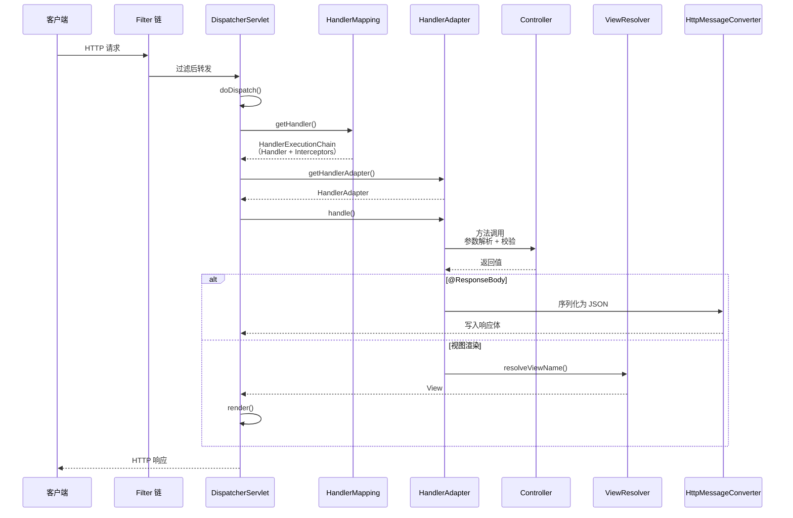

### DispatcherServlet 核心方法

#### doDispatch() 源码

```java
// DispatcherServlet.java
protected void doDispatch(HttpServletRequest request, HttpServletResponse response) {
    HttpServletRequest processedRequest = request;
    HandlerExecutionChain mappedHandler = null;

    try {
        ModelAndView mv = null;
        Exception dispatchException = null;

        try {
            // 1. 检查是否是 multipart 请求（文件上传）
            processedRequest = checkMultipart(request);

            // 2. 根据 URL 查找 Handler（Controller 方法）
            mappedHandler = getHandler(processedRequest);
            if (mappedHandler == null) {
                noHandlerFound(processedRequest, response);
                return;
            }

            // 3. 获取 HandlerAdapter
            HandlerAdapter ha = getHandlerAdapter(mappedHandler.getHandler());

            // 4. 执行拦截器 preHandle
            if (!mappedHandler.applyPreHandle(processedRequest, response)) {
                return;  // 拦截器返回 false，中止请求
            }

            // 5. 执行 Handler（Controller 方法）
            mv = ha.handle(processedRequest, response, mappedHandler.getHandler());

            // 6. 执行拦截器 postHandle
            mappedHandler.applyPostHandle(processedRequest, response, mv);
        } catch (Exception ex) {
            dispatchException = ex;
        }

        // 7. 处理结果（渲染视图或写 JSON + 处理异常）
        processDispatchResult(processedRequest, response, mappedHandler, mv, dispatchException);
    }
}
```

### HandlerMapping 匹配机制

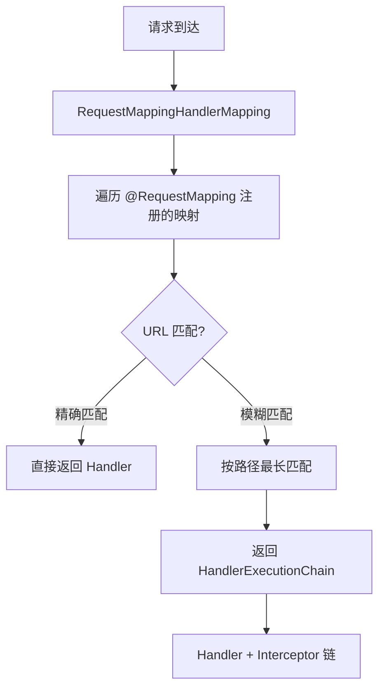

#### 请求映射的注册过程

```java
// Spring Boot 启动时自动注册所有 @RequestMapping 方法
// RequestMappingHandlerMapping.isHandler()
@Override
protected boolean isHandler(Class<?> beanType) {
    return AnnotatedElementUtils.hasAnnotation(beanType, Controller.class)
        || AnnotatedElementUtils.hasAnnotation(beanType, RequestMapping.class);
}

// 检测到 @Controller 或 @RequestMapping 注解的类
// 扫描其中所有 @GetMapping/@PostMapping 等方法
// 注册到 MappingRegistry
```

::: tip 路径匹配规则
Spring Boot 3.x 默认使用 `PathPatternParser`（替代 AntPathMatcher）：
- `/api/users/{id}` — 路径变量
- `/api/**` — 通配符
- 精确匹配优先于模糊匹配
- 路径末尾的 `/` 默认不敏感（可配置）
:::

### 参数解析机制

#### HandlerMethodArgumentResolver 体系

```mermaid
flowchart TD
    A["Controller 方法参数"] --> B{"参数类型?"}
    B -->|@PathVariable| C["PathVariableMethodArgumentResolver"]
    B -->|@RequestParam| D["RequestParamMethodArgumentResolver"]
    B -->|@RequestBody| E["RequestResponseBodyMethodProcessor"]
    B -->|@RequestHeader| F["RequestHeaderMethodArgumentResolver"]
    B -->|@CookieValue| G["ServletCookieValueMethodArgumentResolver"]
    B -->|Model| H["ModelMethodProcessor"]
    B -->|HttpServletRequest| I["ServletRequestMethodArgumentResolver"]

    C --> J["从 URI 模板变量提取"]
    D --> K["从查询参数提取"]
    E --> L["从请求体反序列化<br/>Jackson → Java 对象"]

```

### 拦截器 vs 过滤器

#### 执行顺序

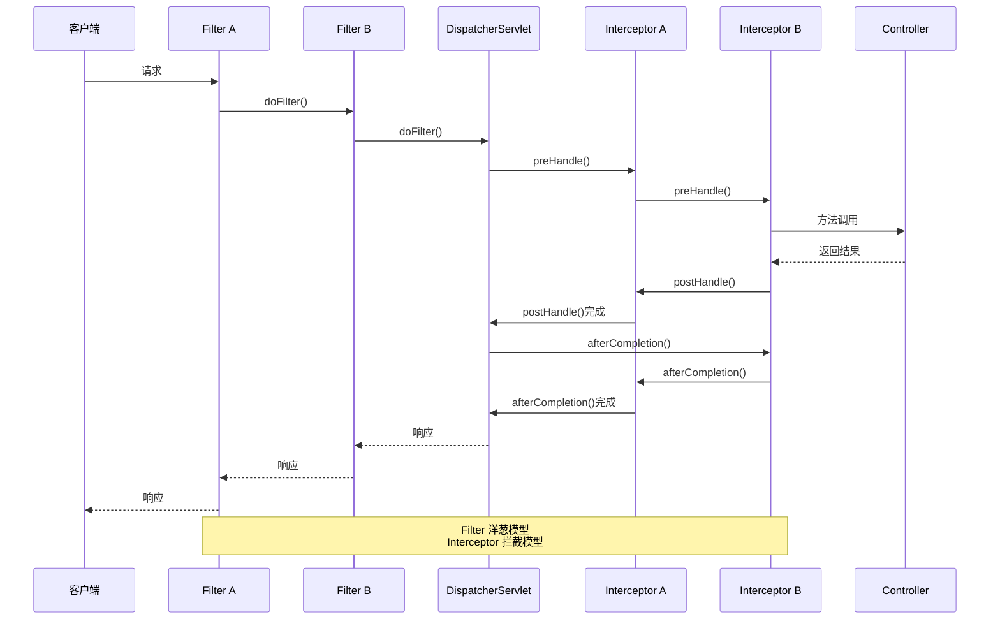

#### 对比

| 对比项 | Filter | HandlerInterceptor |
|-------|--------|-------------------|
| 规范 | Servlet 规范 | Spring MVC 规范 |
| 作用范围 | 所有请求（包括静态资源） | 只拦截 Handler |
| 执行时机 | DispatcherServlet 之前 | Handler 执行前后 |
| 获取 Bean | 需要额外处理 | 直接 @Autowired |
| 异常处理 | 自行处理 | 被 DispatcherServlet 捕获 |
| 典型用途 | 编码、CORS、认证 | 权限校验、日志、性能监控 |
| 注册方式 | `@Bean` + `FilterRegistrationBean` | `WebMvcConfigurer.addInterceptors()` |

#### Filter 链的配置

```java
// 注册 Filter 并控制执行顺序
@Configuration
public class FilterConfig {

    @Bean
    public FilterRegistrationBean<EncodingFilter> encodingFilter() {
        FilterRegistrationBean<EncodingFilter> registration = new FilterRegistrationBean<>();
        registration.setFilter(new EncodingFilter());
        registration.addUrlPatterns("/*");
        registration.setOrder(1);  // 数字越小越先执行
        return registration;
    }

    @Bean
    public FilterRegistrationBean<AuthFilter> authFilter() {
        FilterRegistrationBean<AuthFilter> registration = new FilterRegistrationBean<>();
        registration.setFilter(new AuthFilter());
        registration.addUrlPatterns("/api/*");
        registration.setOrder(2);
        return registration;
    }
}
```

#### Spring Security Filter Chain

Spring Security 本质上就是一组 Filter，通过 `DelegatingFilterProxy` 代理到 Spring 容器中的 Bean：

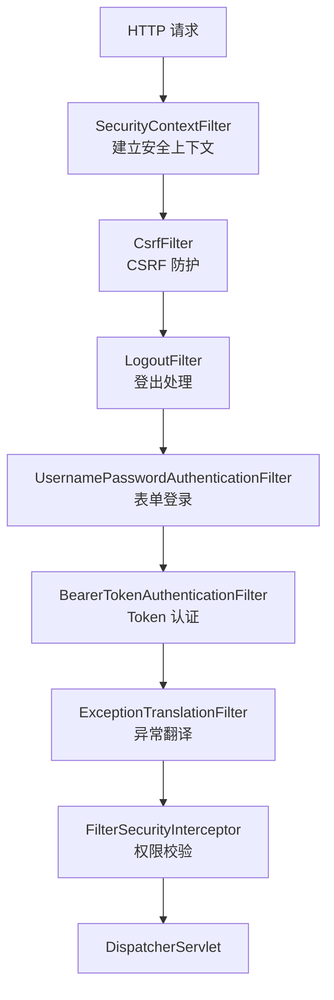

::: tip 何时用 Filter，何时用 Interceptor？
**选 Filter 的场景：**
- 编码转换、GZIP 压缩
- CORS 预检处理
- 全局限流（包括静态资源）
- Spring Security 认证/授权

**选 Interceptor 的场景：**
- 需要 Handler 信息的日志记录
- 基于业务逻辑的权限校验
- 需要注入 Spring Bean 的操作
- 性能监控（只关注 API 请求）
:::

#### 自定义拦截器

```java
@Component
public class AuthInterceptor implements HandlerInterceptor {

    private final AuthService authService;

    public AuthInterceptor(AuthService authService) {
        this.authService = authService;
    }

    @Override
    public boolean preHandle(HttpServletRequest request,
                             HttpServletResponse response,
                             Object handler) throws Exception {
        String token = request.getHeader("Authorization");

        if (token == null || !authService.validate(token)) {
            response.setStatus(HttpStatus.UNAUTHORIZED.value());
            response.setContentType("application/json;charset=UTF-8");
            response.getWriter().write("{\"code\":401,\"message\":\"未认证\"}");
            return false;  // 拦截请求
        }

        request.setAttribute("currentUser", authService.getUser(token));
        return true;  // 继续执行
    }

    @Override
    public void afterCompletion(HttpServletRequest request,
                                HttpServletResponse response,
                                Object handler,
                                Exception ex) throws Exception {
        // 请求完成后，用于清理资源和记录日志
        long startTime = (Long) request.getAttribute("startTime");
        log.info("请求耗时: {}ms, URI: {}",
            System.currentTimeMillis() - startTime, request.getRequestURI());
    }
}
```

#### 注册拦截器

```java
@Configuration
public class WebMvcConfig implements WebMvcConfigurer {

    private final AuthInterceptor authInterceptor;
    private final LoggingInterceptor loggingInterceptor;

    public WebMvcConfig(AuthInterceptor authInterceptor, LoggingInterceptor loggingInterceptor) {
        this.authInterceptor = authInterceptor;
        this.loggingInterceptor = loggingInterceptor;
    }

    @Override
    public void addInterceptors(InterceptorRegistry registry) {
        // 拦截器按添加顺序执行
        // 1. 日志拦截器（最先执行，记录所有请求）
        registry.addInterceptor(loggingInterceptor)
            .addPathPatterns("/api/**")
            .order(1);

        // 2. 认证拦截器（其次执行）
        registry.addInterceptor(authInterceptor)
            .addPathPatterns("/api/**")
            .excludePathPatterns(
                "/api/auth/login",
                "/api/auth/register",
                "/api/public/**",
                "/api/swagger-ui/**",
                "/api/v3/api-docs/**"
            )
            .order(2);
    }
}
```

#### 日志拦截器实现

```java
// 请求日志拦截器
@Component
public class LoggingInterceptor implements HandlerInterceptor {

    private static final String START_TIME = "requestStartTime";

    @Override
    public boolean preHandle(HttpServletRequest request,
            HttpServletResponse response, Object handler) {
        request.setAttribute(START_TIME, System.currentTimeMillis());
        log.info("[请求开始] {} {} from {}",
            request.getMethod(), request.getRequestURI(),
            request.getRemoteAddr());
        return true;
    }

    @Override
    public void postHandle(HttpServletRequest request,
            HttpServletResponse response, Object handler,
            ModelAndView modelAndView) {
        // Handler 正常执行完成
    }

    @Override
    public void afterCompletion(HttpServletRequest request,
            HttpServletResponse response, Object handler,
            Exception ex) {
        long startTime = (Long) request.getAttribute(START_TIME);
        long duration = System.currentTimeMillis() - startTime;

        if (ex != null) {
            log.error("[请求异常] {} {} 耗时 {}ms, 异常: {}",
                request.getMethod(), request.getRequestURI(),
                duration, ex.getMessage());
        } else if (duration > 3000) {
            log.warn("[慢请求] {} {} 耗时 {}ms",
                request.getMethod(), request.getRequestURI(), duration);
        } else {
            log.info("[请求完成] {} {} 耗时 {}ms 状态 {}",
                request.getMethod(), request.getRequestURI(),
                duration, response.getStatus());
        }
    }
}
```

#### 限流拦截器

```java
// 基于 Redis 的分布式限流拦截器
@Component
public class RateLimitInterceptor implements HandlerInterceptor {

    private final StringRedisTemplate redisTemplate;

    @Override
    public boolean preHandle(HttpServletRequest request,
            HttpServletResponse response, Object handler) throws Exception {

        // 从 Handler 方法上获取限流注解
        if (handler instanceof HandlerMethod handlerMethod) {
            RateLimit rateLimit = handlerMethod.getMethodAnnotation(RateLimit.class);
            if (rateLimit == null) {
                return true;  // 没有限流注解，放行
            }

            String key = "rate_limit:" + request.getRequestURI() + ":" + getClientId(request);
            int limit = rateLimit.count();
            int period = rateLimit.period();

            // 使用 Redis Lua 脚本实现滑动窗口限流
            Long current = redisTemplate.execute(rateLimitScript,
                Collections.singletonList(key),
                String.valueOf(limit), String.valueOf(period));

            if (current != null && current > limit) {
                response.setStatus(429);  // Too Many Requests
                response.setContentType("application/json;charset=UTF-8");
                response.getWriter().write("{\"code\":429,\"message\":\"请求过于频繁\"}");
                return false;
            }
        }
        return true;
    }
}

// 限流注解
@Target(ElementType.METHOD)
@Retention(RetentionPolicy.RUNTIME)
public @interface RateLimit {
    int count() default 100;   // 允许的请求次数
    int period() default 60;   // 时间窗口（秒）
}
```

::: warning 拦截器中不要做耗时操作
| 获取 Bean | 需要额外处理 | 直接 @Autowired |
| 典型用途 | 编码、CORS、认证 | 权限校验、日志、性能监控 |

::: warning 拦截器中不要做耗时操作
`preHandle()` 在每个请求中同步执行。如果在此做数据库查询、远程调用等耗时操作，会显著影响所有接口的响应时间。认证、限流等逻辑应该使用 Filter + Redis 缓存的方式，而非在拦截器中同步查询。
:::

### CORS 跨域处理

#### CORS 工作原理

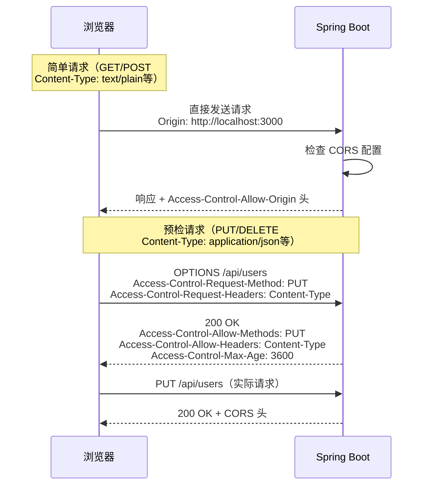

#### 三种配置方式

```java
// 方式1：@CrossOrigin 注解（方法/类级别）
@RestController
@RequestMapping("/api/users")
@CrossOrigin(origins = "http://localhost:3000", maxAge = 3600)
public class UserController { ... }

// 方式2：全局配置（推荐）
@Configuration
public class WebMvcConfig implements WebMvcConfigurer {

    @Override
    public void addCorsMappings(CorsRegistry registry) {
        registry.addMapping("/api/**")
            .allowedOrigins("http://localhost:3000", "https://example.com")
            .allowedMethods("GET", "POST", "PUT", "DELETE", "PATCH")
            .allowedHeaders("*")
            .allowCredentials(true)
            .maxAge(3600);
    }
}

// 方式3：CorsFilter（适合需要细粒度控制的场景）
@Bean
public CorsFilter corsFilter() {
    CorsConfiguration config = new CorsConfiguration();
    config.addAllowedOrigin("http://localhost:3000");
    config.addAllowedMethod("*");
    config.addAllowedHeader("*");
    config.setAllowCredentials(true);

    UrlBasedCorsConfigurationSource source = new UrlBasedCorsConfigurationSource();
    source.registerCorsConfiguration("/api/**", config);
    return new CorsFilter(source);
}
```

::: danger CORS 安全注意事项
1. **不要使用 `allowedOrigins("*")` + `allowCredentials(true)`**：这是 CORS 规范明确禁止的组合，浏览器会拒绝响应
2. **生产环境必须明确指定允许的源**：不要用通配符
3. **Spring Security 和 CORS 的交互**：如果同时使用 Spring Security，CORS 需要在 Security 过滤器链之前处理，否则预检请求（OPTIONS）会被 Security 拦截返回 401

```java
// Spring Security + CORS 配置
@Configuration
@EnableWebSecurity
public class SecurityConfig {

    @Bean
    public SecurityFilterChain filterChain(HttpSecurity http) throws Exception {
        http.cors()  // 先启用 CORS（必须在其他配置之前）
            .and()
            .csrf().disable()
            .authorizeHttpRequests()
            .anyRequest().authenticated();
        return http.build();
    }

    @Bean
    public CorsConfigurationSource corsConfigurationSource() {
        CorsConfiguration configuration = new CorsConfiguration();
        configuration.setAllowedOrigins(List.of("https://example.com"));
        configuration.setAllowedMethods(List.of("GET", "POST", "PUT", "DELETE"));
        configuration.setAllowedHeaders(List.of("*"));
        configuration.setAllowCredentials(true);

        UrlBasedCorsConfigurationSource source = new UrlBasedCorsConfigurationSource();
        source.registerCorsConfiguration("/api/**", configuration);
        return source;
    }
}
```
:::

### 数据绑定与校验

#### WebDataBinder 工作流程

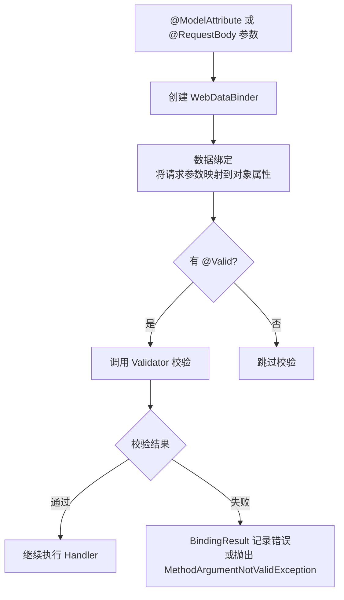

#### 参数校验注解

```java
// 常用校验注解
@Data
public class CreateUserRequest {

    @NotBlank(message = "用户名不能为空")
    @Size(min = 2, max = 20, message = "用户名长度 2-20 字符")
    private String username;

    @NotBlank(message = "密码不能为空")
    @Size(min = 6, max = 32, message = "密码长度 6-32 字符")
    @Pattern(regexp = "^(?=.*[A-Za-z])(?=.*\\d).+$", message = "密码必须包含字母和数字")
    private String password;

    @Email(message = "邮箱格式不正确")
    private String email;

    @Min(value = 0, message = "年龄不能小于 0")
    @Max(value = 150, message = "年龄不能大于 150")
    private Integer age;

    @Pattern(regexp = "^1[3-9]\\d{9}$", message = "手机号格式不正确")
    private String phone;
}
```

```java
// Controller 中使用校验
@RestController
@RequestMapping("/api/users")
public class UserController {

    @PostMapping
    public ApiResponse<User> createUser(
            @Valid @RequestBody CreateUserRequest request,
            BindingResult bindingResult) {  // 必须紧跟 @Valid 参数

        if (bindingResult.hasErrors()) {
            // 手动处理校验错误
            List<String> errors = bindingResult.getFieldErrors()
                .stream()
                .map(e -> e.getField() + ": " + e.getDefaultMessage())
                .collect(Collectors.toList());
            return ApiResponse.error(400, "参数校验失败", errors);
        }

        // 校验通过，继续业务逻辑
        return ApiResponse.success(userService.create(request));
    }
}
```

::: tip BindingResult 必须紧跟 @Valid 参数
如果 Controller 方法中不声明 `BindingResult` 参数，校验失败时会直接抛出 `MethodArgumentNotValidException`，由全局异常处理器处理。如果声明了 `BindingResult`，则不会抛出异常，需要手动判断和处理校验结果。

**最佳实践：** API 开发中推荐不声明 `BindingResult`，让全局异常处理器统一处理；需要精细控制的场景才手动处理。
:::

#### 分组校验

```java
// 不同场景使用不同校验规则
public interface CreateGroup {}
public interface UpdateGroup {}

@Data
public class UserRequest {
    @Null(groups = CreateGroup.class, message = "创建时 ID 必须为空")
    @NotNull(groups = UpdateGroup.class, message = "更新时 ID 不能为空")
    private Long id;

    @NotBlank(groups = {CreateGroup.class, UpdateGroup.class}, message = "用户名不能为空")
    private String username;
}

@RestController
public class UserController {
    @PostMapping
    public User create(@Validated(CreateGroup.class) @RequestBody UserRequest request) {
        // 只校验 CreateGroup 的规则
    }

    @PutMapping
    public User update(@Validated(UpdateGroup.class) @RequestBody UserRequest request) {
        // 只校验 UpdateGroup 的规则
    }
}
```

#### 自定义校验注解

```java
// 自定义 @Phone 校验注解
@Target({ElementType.FIELD})
@Retention(RetentionPolicy.RUNTIME)
@Constraint(validatedBy = PhoneValidator.class)
public @interface Phone {
    String message() default "手机号格式不正确";
    Class<?>[] groups() default {};
    Class<? extends Payload>[] payload() default {};
}

// 校验器实现
public class PhoneValidator implements ConstraintValidator<Phone, String> {

    private static final Pattern PHONE_PATTERN =
        Pattern.compile("^1[3-9]\\d{9}$");

    @Override
    public boolean isValid(String value, ConstraintValidatorContext context) {
        if (value == null) {
            return true;  // null 由 @NotBlank 处理
        }
        return PHONE_PATTERN.matcher(value).matches();
    }
}
```

### 文件上传处理

#### MultipartResolver 配置

Spring Boot 自动配置了 `StandardServletMultipartResolver`：

```yaml
## 文件上传配置
spring:
  servlet:
    multipart:
      enabled: true          # 启用文件上传
      max-file-size: 10MB    # 单个文件最大大小
      max-request-size: 100MB # 整个请求最大大小
      file-size-threshold: 0  # 超过此大小写入临时文件
      location: /tmp         # 临时文件目录
```

#### 文件上传 Controller

```java
@RestController
@RequestMapping("/api/files")
public class FileController {

    // 单文件上传
    @PostMapping("/upload")
    public ApiResponse<String> upload(@RequestParam("file") MultipartFile file) {
        if (file.isEmpty()) {
            return ApiResponse.error(400, "文件不能为空");
        }

        // 校验文件大小
        if (file.getSize() > 10 * 1024 * 1024) {
            return ApiResponse.error(400, "文件大小不能超过 10MB");
        }

        // 校验文件类型
        String contentType = file.getContentType();
        Set<String> allowedTypes = Set.of("image/jpeg", "image/png", "application/pdf");
        if (!allowedTypes.contains(contentType)) {
            return ApiResponse.error(400, "不支持的文件类型");
        }

        try {
            String fileName = UUID.randomUUID() + "_" + file.getOriginalFilename();
            Path filePath = Paths.get("/data/uploads", fileName);
            file.transferTo(filePath);
            return ApiResponse.success(fileName);
        } catch (IOException e) {
            return ApiResponse.error(500, "文件上传失败");
        }
    }

    // 多文件上传
    @PostMapping("/upload-batch")
    public ApiResponse<List<String>> uploadBatch(
            @RequestParam("files") MultipartFile[] files) {
        List<String> fileNames = new ArrayList<>();
        for (MultipartFile file : files) {
            String fileName = UUID.randomUUID() + "_" + file.getOriginalFilename();
            file.transferTo(Paths.get("/data/uploads", fileName));
            fileNames.add(fileName);
        }
        return ApiResponse.success(fileNames);
    }

    // 文件下载
    @GetMapping("/download/{fileName}")
    public ResponseEntity<Resource> download(@PathVariable String fileName) {
        Path filePath = Paths.get("/data/uploads", fileName);
        Resource resource = new FileSystemResource(filePath);

        if (!resource.exists()) {
            return ResponseEntity.notFound().build();
        }

        return ResponseEntity.ok()
            .header(HttpHeaders.CONTENT_DISPOSITION,
                "attachment; filename=\"" + fileName + "\"")
            .contentType(MediaType.APPLICATION_OCTET_STREAM)
            .body(resource);
    }
}
```

::: danger 文件上传安全风险
1. **路径遍历攻击**：文件名可能包含 `../`，导致文件被写到任意目录。使用 `UUID.randomUUID()` 生成文件名，不要直接使用用户提供的文件名
2. **文件类型伪造**：仅检查 Content-Type 不够，攻击者可以伪造。检查文件扩展名 + 文件内容（魔数校验）
3. **大文件攻击**：不限制文件大小可能导致磁盘空间耗尽。设置 `max-file-size` 和 `max-request-size`
4. **病毒上传**：允许上传可执行文件（.exe、.sh）可能导致服务器被感染。严格限制允许的文件类型
:::

### WebMvcConfigurer 全局配置

`WebMvcConfigurer` 是定制 Spring MVC 行为的核心接口，提供了多个回调方法：

| 方法 | 作用 | 典型用途 |
|------|------|---------|
| `addInterceptors()` | 注册拦截器 | 认证、日志 |
| `addCorsMappings()` | 配置 CORS | 跨域 |
| `addResourceHandlers()` | 静态资源处理 | 自定义资源路径 |
| `configureMessageConverters()` | 消息转换器 | 自定义 JSON 序列化 |
| `addArgumentResolvers()` | 参数解析器 | 自定义参数解析 |
| `addReturnValueHandlers()` | 返回值处理器 | 自定义响应格式 |
| `configureAsyncSupport()` | 异步支持 | 超时、线程池 |
| `configurePathMatch()` | 路径匹配 | URL 规则定制 |
| `configureContentNegotiation()` | 内容协商 | 响应格式选择 |
| `configureDefaultServletHandling()` | 默认 Servlet | 静态资源兜底 |

#### 自定义 JSON 序列化

```java
@Configuration
public class WebMvcConfig implements WebMvcConfigurer {

    // 自定义 Jackson ObjectMapper
    @Override
    public void configureMessageConverters(List<HttpMessageConverter<?>> converters) {
        MappingJackson2HttpMessageConverter converter = new MappingJackson2HttpMessageConverter();
        ObjectMapper mapper = new ObjectMapper();

        // 不序列化 null 值
        mapper.setSerializationInclusion(JsonInclude.Include.NON_NULL);

        // 日期格式化（不使用时间戳）
        mapper.disable(SerializationFeature.WRITE_DATES_AS_TIMESTAMPS);
        mapper.registerModule(new JavaTimeModule());

        // 反序列化时忽略未知属性
        mapper.configure(DeserializationFeature.FAIL_ON_UNKNOWN_PROPERTIES, false);

        // 自定义日期格式
        mapper.setDateFormat(new SimpleDateFormat("yyyy-MM-dd HH:mm:ss"));

        converter.setObjectMapper(mapper);
        converters.add(0, converter);  // 优先级最高
    }

    // 静态资源缓存
    @Override
    public void addResourceHandlers(ResourceHandlerRegistry registry) {
        registry.addResourceHandler("/static/**")
            .addResourceLocations("classpath:/static/")
            .setCacheControl(CacheControl.maxAge(30, TimeUnit.DAYS));
    }

    // 异步请求超时配置
    @Override
    public void configureAsyncSupport(AsyncSupportConfigurer configurer) {
        configurer.setDefaultTimeout(30000);  // 30 秒超时
        configurer.setTaskExecutor(new SimpleAsyncTaskExecutor());
    }

    // 路径匹配配置（Spring Boot 3.x）
    @Override
    public void configurePathMatch(PathMatchConfigurer configurer) {
        configurer.setPatternParser(new PathPatternParser());  // 使用新解析器
        configurer.setUseTrailingSlashMatch(true);  // 路径末尾 / 不敏感
    }
}
```

#### 内容协商配置

```java
@Configuration
public class WebMvcConfig implements WebMvcConfigurer {

    @Override
    public void configureContentNegotiation(ContentNegotiationConfigurer configurer) {
        configurer
            .favorParameter(true)           // 支持 ?format=json 参数
            .parameterName("format")        // 参数名
            .ignoreAcceptHeader(false)       // 不忽略 Accept 头
            .defaultContentType(MediaType.APPLICATION_JSON)  // 默认 JSON
            .mediaType("json", MediaType.APPLICATION_JSON)
            .mediaType("xml", MediaType.APPLICATION_XML);
    }
}
```

::: tip WebMvcConfigurer vs @EnableWebMvc
- **WebMvcConfigurer**：只添加自定义配置，Spring Boot 的自动配置仍然生效
- **@EnableWebMvc**：完全接管 Spring MVC 配置，Spring Boot 的自动配置失效

**绝大多数场景使用 `WebMvcConfigurer`**，不要加 `@EnableWebMvc`——否则你会失去 Spring Boot 自动配置的所有便利（静态资源、消息转换器、CORS 等）。
:::

### 静态资源处理

#### 默认静态资源路径

Spring Boot 默认的静态资源路径：

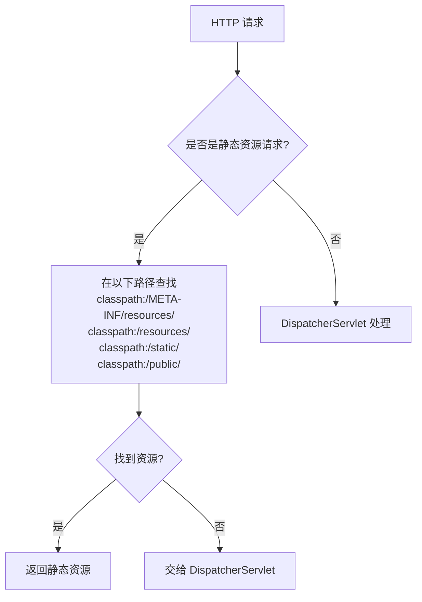

#### 静态资源查找优先级

| 路径 | 优先级 | 说明 |
|------|--------|------|
| `/META-INF/resources/` | 最高 | Web JAR 资源（如 Swagger UI） |
| `/resources/` | 中 | 较少使用 |
| `/static/` | 中 | 默认推荐路径 |
| `/public/` | 低 | 公共资源 |

```yaml
## 自定义静态资源配置
spring:
  web:
    resources:
      static-locations:
        - classpath:/static/
        - classpath:/public/
      cache:
        period: 30d  # 缓存 30 天
      add-mappings: true  # 启用静态资源映射
```

#### Web JAR 支持

Spring Boot 自动支持 Web JAR——将前端库打包为 JAR 并通过 classpath 提供：

```xml
<!-- 引入 Bootstrap Web JAR -->
<dependency>
    <groupId>org.webjars</groupId>
    <artifactId>bootstrap</artifactId>
    <version>5.3.0</version>
</dependency>
```

访问路径：`/webjars/bootstrap/5.3.0/css/bootstrap.min.css`

#### 缓存控制

```java
// 为不同类型的静态资源设置不同的缓存策略
@Configuration
public class WebMvcConfig implements WebMvcConfigurer {

    @Override
    public void addResourceHandlers(ResourceHandlerRegistry registry) {
        // JS/CSS/图片：长期缓存
        registry.addResourceHandler("/static/**")
            .addResourceLocations("classpath:/static/")
            .setCacheControl(CacheControl.maxAge(365, TimeUnit.DAYS)
                .cachePublic());

        // HTML：短期缓存（内容可能变化）
        registry.addResourceHandler("/templates/**")
            .addResourceLocations("classpath:/templates/")
            .setCacheControl(CacheControl.maxAge(1, TimeUnit.HOURS)
                .mustRevalidate());
    }
}
```

#### 请求转发与重定向

```java
@RestController
public class RedirectController {

    // 转发（服务器内部，URL 不变）
    @GetMapping("/forward-example")
    public ModelAndView forwardExample() {
        return new ModelAndView("forward:/api/users");
    }

    // 重定向（客户端重新请求，URL 变化）
    @GetMapping("/redirect-example")
    public ModelAndView redirectExample() {
        return new ModelAndView("redirect:/api/users");
    }

    // 使用 RedirectAttributes 传递参数
    @GetMapping("/redirect-with-params")
    public String redirectWithParams(RedirectAttributes attributes) {
        attributes.addFlashAttribute("message", "操作成功");
        attributes.addAttribute("id", "123");  // 出现在 URL 查询参数中
        return "redirect:/api/result";
    }
}
```

::: tip forward vs redirect
| 特性 | forward | redirect |
|------|---------|----------|
| URL 变化 | 不变 | 变化 |
| 请求次数 | 1 次 | 2 次 |
| 请求参数 | 保留 | 丢失（Flash 属性除外） |
| 适用场景 | 服务端内部路由 | 跳转到外部 URL、防止表单重复提交 |
:::

### DispatcherServlet 初始化流程

#### Servlet 容器中的 Spring MVC

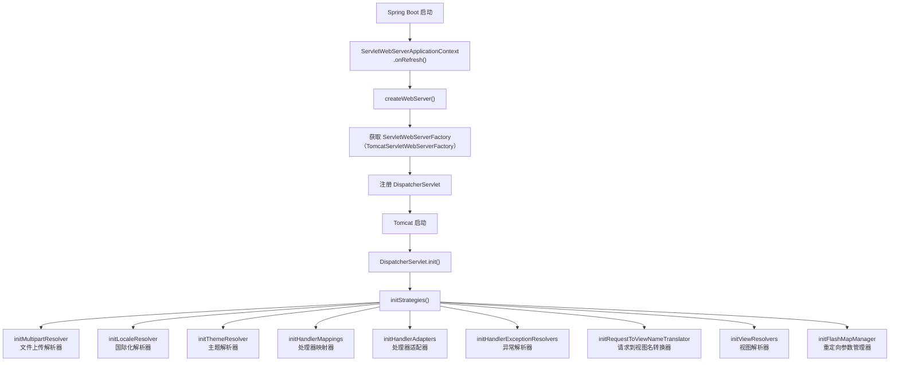

#### initHandlerMappings() 加载策略

```java
// DispatcherServlet.java
private void initHandlerMappings(ApplicationContext context) {
    this.handlerMappings = null;

    if (this.detectAllHandlerMappings) {
        // 默认：从 ApplicationContext 中查找所有 HandlerMapping
        Map<String, HandlerMapping> matchingBeans =
            BeanFactoryUtils.beansOfTypeIncludingAncestors(context, HandlerMapping.class, true, false);
        if (!matchingBeans.isEmpty()) {
            this.handlerMappings = new ArrayList<>(matchingBeans.values());
            AnnotationAwareOrderComparator.sort(this.handlerMappings);
        }
    } else {
        // 只查找名为 "handlerMapping" 的 Bean
        HandlerMapping hm = context.getBean(HANDLER_MAPPING_BEAN_NAME, HandlerMapping.class);
        this.handlerMappings = Collections.singletonList(hm);
    }

    // 兜底：如果没有找到任何 HandlerMapping，使用默认的
    if (this.handlerMappings == null) {
        this.handlerMappings = getDefaultStrategies(context, HandlerMapping.class);
    }
}
```

#### Spring Boot 自动注册的 HandlerMapping

| HandlerMapping | 优先级 | 作用 |
|---|---|---|
| `RequestMappingHandlerMapping` | 最高 | 处理 `@RequestMapping` 注解映射 |
| `WelcomePageHandlerMapping` | 中 | 处理首页 `/` 映射 |
| `BeanNameUrlHandlerMapping` | 低 | 处理 Bean 名称作为 URL 映射 |
| `RouterFunctionMapping` | 中 | 处理 WebFlux 函数式路由 |
| `SimpleUrlHandlerMapping` | 最低 | 处理静态资源、`/favicon.ico` 等 |

### HandlerMapping 体系详解

#### RequestMappingHandlerMapping 的工作原理

```java
// RequestMappingHandlerMapping.java
public class RequestMappingHandlerMapping extends RequestMappingInfoHandlerMapping
        implements MatchableHandlerMapping {

    // 1. 检测哪些类是 Handler（@Controller 或 @RequestMapping）
    @Override
    protected boolean isHandler(Class<?> beanType) {
        return AnnotatedElementUtils.hasAnnotation(beanType, Controller.class)
            || AnnotatedElementUtils.hasAnnotation(beanType, RequestMapping.class);
    }

    // 2. 从 Handler 类中提取映射方法
    @Override
    protected void detectHandlerMethods(Object handler) {
        Class<?> handlerType = (handler instanceof String beanName ?
            obtainApplicationContext().getType(beanName) : handler.getClass());

        if (handlerType != null) {
            // 查找所有标注了 @RequestMapping 的方法
            Map<Method, RequestMappingInfo> methods = MethodIntrospector.selectMethods(
                handlerType,
                (MethodIntrospector.MetadataLookup<RequestMappingInfo>) method ->
                    getMappingForMethod(method, handlerType));

            methods.forEach((method, mapping) -> {
                // 注册映射关系
                registerHandlerMethod(handler, method, mapping);
            });
        }
    }

    // 3. 构建方法的映射信息
    @Override
    protected RequestMappingInfo getMappingForMethod(Method method, Class<?> handlerType) {
        RequestMappingInfo methodInfo = createRequestMappingInfo(method);
        if (methodInfo != null) {
            RequestMappingInfo typeInfo = createRequestMappingInfo(handlerType);
            if (typeInfo != null) {
                // 合并类级别和方法级别的 @RequestMapping
                methodInfo = typeInfo.combine(methodInfo);
            }
        }
        return methodInfo;
    }
}
```

#### 请求匹配的完整流程

```java
// AbstractHandlerMethodMapping.java
public HandlerMethod lookupHandlerMethod(HttpServletRequest request) {
    List<Match> matches = new ArrayList<>();

    // 1. 遍历所有注册的映射
    for (RequestMappingInfo mapping : this.mappingRegistry.getMappings()) {
        // 2. 逐个匹配
        RequestMappingInfo match = mapping.getMatchingCondition(request);
        if (match != null) {
            matches.add(new Match(match, this.mappingRegistry.getHandlerMethod(mapping)));
        }
    }

    if (matches.isEmpty()) {
        return null;  // 404
    }

    // 3. 如果有多个匹配，选择最佳匹配
    if (matches.size() > 1) {
        // 按条件排序：精确匹配 > 路径变量 > 通配符
        matches.sort((m1, m2) -> m1.mapping.compareTo(m2.mapping, request));
    }

    return matches.get(0).handlerMethod;
}
```

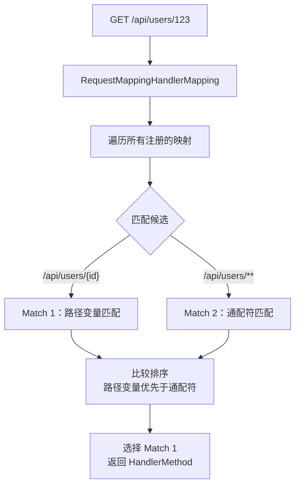

::: tip 路径匹配的优先级
1. 精确匹配 > 路径变量 > 通配符
2. 路径越长、越具体的优先级越高
3. HTTP 方法也参与匹配（`GET /api/users` ≠ `POST /api/users`）
4. Spring Boot 3.x 使用 `PathPatternParser`，性能优于 `AntPathMatcher`
:::

### HandlerAdapter 体系详解

#### 为什么需要 HandlerAdapter？

Spring MVC 使用适配器模式将不同类型的 Handler 统一为相同的调用方式：

```java
// DispatcherServlet.java
protected HandlerAdapter getHandlerAdapter(Object handler) throws ServletException {
    if (this.handlerAdapters != null) {
        for (HandlerAdapter adapter : this.handlerAdapters) {
            if (adapter.supports(handler)) {
                return adapter;
            }
        }
    }
    throw new ServletException("No adapter for handler [...]");
}
```

#### 内置的 HandlerAdapter

| HandlerAdapter | 支持的 Handler 类型 |
|---|---|
| `RequestMappingHandlerAdapter` | `HandlerMethod`（`@RequestMapping` 标注的方法） |
| `HttpRequestHandlerAdapter` | `HttpRequestHandler`（静态资源处理） |
| `SimpleControllerHandlerAdapter` | `Controller` 接口（传统 MVC） |
| `HandlerFunctionAdapter` | `HandlerFunction`（WebFlux 函数式路由） |

#### RequestMappingHandlerAdapter 执行流程

```java
// RequestMappingHandlerAdapter.java
protected ModelAndView handleInternal(HttpServletRequest request,
        HttpServletResponse response, HandlerMethod handlerMethod) {

    ModelAndView mav;
    // 1. 检查是否支持 Session 和请求头缓存
    checkRequest(request);

    // 2. 执行 Handler 方法
    if (isSynchronizeOnSession()) {
        // Session 同步执行
        HttpSession session = request.getSession(false);
        synchronized (session) {
            mav = invokeHandlerMethod(request, response, handlerMethod);
        }
    } else {
        mav = invokeHandlerMethod(request, response, handlerMethod);
    }

    return mav;
}
```

```java
protected ModelAndView invokeHandlerMethod(HttpServletRequest request,
        HttpServletResponse response, HandlerMethod handlerMethod) {

    ServletWebRequest webRequest = new ServletWebRequest(request, response);

    try {
        // 1. 创建数据绑定工厂（@Valid、@ModelAttribute 支持）
        WebDataBinderFactory binderFactory = getDataBinderFactory(handlerMethod);

        // 2. 创建模型工厂
        ModelFactory modelFactory = getModelFactory(handlerMethod, binderFactory);

        // 3. 创建方法调用器
        ServletInvocableHandlerMethod invocableMethod =
            new ServletInvocableHandlerMethod(handlerMethod);

        // 4. 设置参数解析器
        invocableMethod.setHandlerMethodArgumentResolvers(this.argumentResolvers);

        // 5. 设置返回值处理器
        invocableMethod.setHandlerMethodReturnValueHandlers(this.returnValueHandlers);

        // 6. 执行 Controller 方法
        invocableMethod.invokeAndHandle(webRequest, mavContainer, providdArgs);

        // 7. 返回 ModelAndView
        return getModelAndView(mavContainer, model, webRequest);
    } finally {
        webRequest.requestCompleted();
    }
}
```

### 参数解析机制

#### HandlerMethodArgumentResolver 体系

```mermaid
flowchart TD
    A["Controller 方法参数"] --> B{"参数类型?"}
    B -->|@PathVariable| C["PathVariableMethodArgumentResolver"]
    B -->|@RequestParam| D["RequestParamMethodArgumentResolver"]
    B -->|@RequestBody| E["RequestResponseBodyMethodProcessor"]
    B -->|@RequestHeader| F["RequestHeaderMethodArgumentResolver"]
    B -->|@CookieValue| G["ServletCookieValueMethodArgumentResolver"]
    B -->|@ModelAttribute| H["ModelAttributeMethodProcessor"]
    B -->|Model| I["ModelMethodProcessor"]
    B -->|HttpServletRequest| J["ServletRequestMethodArgumentResolver"]
    B -->|Principal| K["PrincipalMethodArgumentResolver"]
    B -->|HttpEntity| L["HttpEntityMethodProcessor"]
    B -->|RedirectAttributes| M["RedirectAttributesMethodArgumentResolver"]

    C --> N["从 URI 模板变量提取"]
    D --> O["从查询参数提取"]
    E --> P["从请求体反序列化<br/>Jackson → Java 对象"]
    H --> Q["数据绑定 + 校验<br/>@Valid + BindingResult"]

```

#### 参数解析器的匹配逻辑

```java
// HandlerMethodArgumentResolverComposite.java
public Object resolveArgument(MethodParameter parameter,
        @Nullable ModelAndViewContainer mavContainer,
        NativeWebRequest webRequest,
        @Nullable WebDataBinderFactory binderFactory) throws Exception {

    // 1. 查找匹配的解析器
    HandlerMethodArgumentResolver resolver = getArgumentResolver(parameter);
    if (resolver == null) {
        throw new IllegalArgumentException("Unsupported parameter type [...]");
    }

    // 2. 解析参数值
    return resolver.resolveArgument(parameter, mavContainer, webRequest, binderFactory);
}

private HandlerMethodArgumentResolver getArgumentResolver(MethodParameter parameter) {
    HandlerMethodArgumentResolver result = this.argumentResolverCache.get(parameter);
    if (result == null) {
        for (HandlerMethodArgumentResolver resolver : this.argumentResolvers) {
            if (resolver.supportsParameter(parameter)) {
                result = resolver;
                this.argumentResolverCache.put(parameter, result);
                break;
            }
        }
    }
    return result;
}
```

#### 自定义参数解析器

```java
// 场景：自动将请求头中的 Token 解析为当前用户
public class CurrentUserArgumentResolver implements HandlerMethodArgumentResolver {

    private final AuthService authService;

    public CurrentUserArgumentResolver(AuthService authService) {
        this.authService = authService;
    }

    @Override
    public boolean supportsParameter(MethodParameter parameter) {
        // 支持 @CurrentUser 注解标注的 User 参数
        return parameter.hasParameterAnnotation(CurrentUser.class)
            && parameter.getParameterType().equals(User.class);
    }

    @Override
    public Object resolveArgument(MethodParameter parameter,
            ModelAndViewContainer mavContainer,
            NativeWebRequest webRequest,
            WebDataBinderFactory binderFactory) {

        HttpServletRequest request = webRequest.getNativeRequest(HttpServletRequest.class);
        String token = request.getHeader("Authorization");

        if (token == null) {
            throw new UnauthenticatedException("未登录");
        }

        return authService.getUserByToken(token);
    }
}

// 注册自定义参数解析器
@Configuration
public class WebMvcConfig implements WebMvcConfigurer {

    private final AuthService authService;

    public WebMvcConfig(AuthService authService) {
        this.authService = authService;
    }

    @Override
    public void addArgumentResolvers(List<HandlerMethodArgumentResolver> resolvers) {
        resolvers.add(new CurrentUserArgumentResolver(authService));
    }
}

// 使用
@RestController
@RequestMapping("/api/orders")
public class OrderController {

    @GetMapping("/my")
    public List<Order> myOrders(@CurrentUser User currentUser) {
        return orderService.getOrdersByUserId(currentUser.getId());
    }
}
```

### 返回值处理机制

#### HandlerMethodReturnValueHandler 体系

```mermaid
flowchart TD
    A["Controller 方法返回值"] --> B{"返回值类型?"}
    B -->|@ResponseBody| C["RequestResponseBodyMethodProcessor<br/>JSON 序列化"]
    B -->|String| D["ViewNameMethodReturnValueHandler<br/>视图名"]
    B -->|ModelAndView| E["ModelAndViewMethodReturnValueHandler"]
    B -->|ResponseEntity| F["HttpEntityMethodProcessor"]
    B -->|DeferredResult| G["DeferredResultMethodReturnValueHandler<br/>异步结果"]
    B -->|SseEmitter| H["SseEmitterReturnValueHandler<br/>Server-Sent Events"]
    B -->|void| I["无返回值处理"]

```

#### @ResponseBody 的序列化流程

```java
// RequestResponseBodyMethodProcessor.java
public void handleReturnValue(@Nullable Object returnValue,
        MethodParameter returnType, ModelAndViewContainer mavContainer,
        NativeWebRequest webRequest) {

    // 1. 标记请求已处理
    mavContainer.setRequestHandled(true);

    // 2. 遍历 HttpMessageConverter，找到能处理返回类型的
    for (HttpMessageConverter<?> converter : this.messageConverters) {
        if (converter.canWrite(returnType, selectedMediaType)) {
            // 3. 序列化并写入响应体
            ((HttpMessageConverter<Object>) converter).write(
                returnValue, selectedMediaType, outputMessage);
            return;
        }
    }
}
```

#### HttpMessageConverter 体系

| HttpMessageConverter | 支持的 Media Type | 支持的 Java 类型 |
|---|---|---|
| `MappingJackson2HttpMessageConverter` | `application/json` | 所有对象 |
| `StringHttpMessageConverter` | `text/plain` | String |
| `ByteArrayHttpMessageConverter` | `*/*` | byte[] |
| `ResourceHttpMessageConverter` | `*/*` | Resource |
| `FormHttpMessageConverter` | `application/x-www-form-urlencoded` | MultiValueMap |
| `MappingJackson2XmlHttpMessageConverter` | `application/xml` | 所有对象（需 jackson-dataformat-xml） |

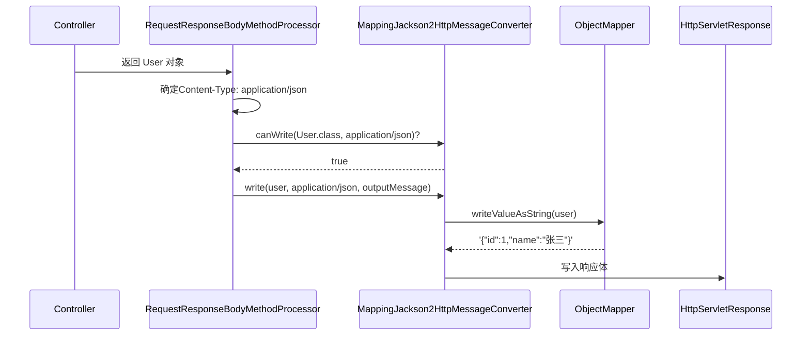

### 异步请求处理

#### DeferredResult 异步处理

```java
// 长轮询场景：订单支付结果等待
@RestController
@RequestMapping("/api/orders")
public class OrderController {

    private final Map<String, DeferredResult<PaymentResult>> pendingRequests = new ConcurrentHashMap<>();

    @GetMapping("/{orderId}/payment-result")
    public DeferredResult<PaymentResult> getPaymentResult(@PathVariable String orderId) {
        // 超时时间 30 秒
        DeferredResult<PaymentResult> deferredResult = new DeferredResult<>(30000L);

        // 超时回调
        deferredResult.onTimeout(() -> {
            deferredResult.setResult(new PaymentResult("TIMEOUT", "等待超时"));
        });

        // 完成回调
        deferredResult.onCompletion(() -> {
            pendingRequests.remove(orderId);
        });

        // 注册等待
        pendingRequests.put(orderId, deferredResult);

        return deferredResult;  // 立即返回，Servlet 线程释放
    }

    // 支付回调接口
    @PostMapping("/{orderId}/payment-callback")
    public String paymentCallback(@PathVariable String orderId,
                                  @RequestBody PaymentNotification notification) {
        DeferredResult<PaymentResult> deferredResult = pendingRequests.get(orderId);
        if (deferredResult != null) {
            deferredResult.setResult(new PaymentResult("SUCCESS", notification.getMessage()));
        }
        return "OK";
    }
}
```

#### Server-Sent Events (SSE)

```java
// SSE 实时推送
@RestController
@RequestMapping("/api/events")
public class SseController {

    @GetMapping(value = "/stream", produces = MediaType.TEXT_EVENT_STREAM_VALUE)
    public SseEmitter stream() {
        SseEmitter emitter = new SseEmitter(60000L);  // 超时 60 秒

        // 模拟实时推送
        new Thread(() -> {
            try {
                for (int i = 0; i < 100; i++) {
                    emitter.send(SseEmitter.event()
                        .name("message")
                        .data("Event #" + i)
                        .id(String.valueOf(i)));
                    Thread.sleep(1000);
                }
                emitter.complete();
            } catch (Exception e) {
                emitter.completeWithError(e);
            }
        }).start();

        return emitter;
    }
}
```

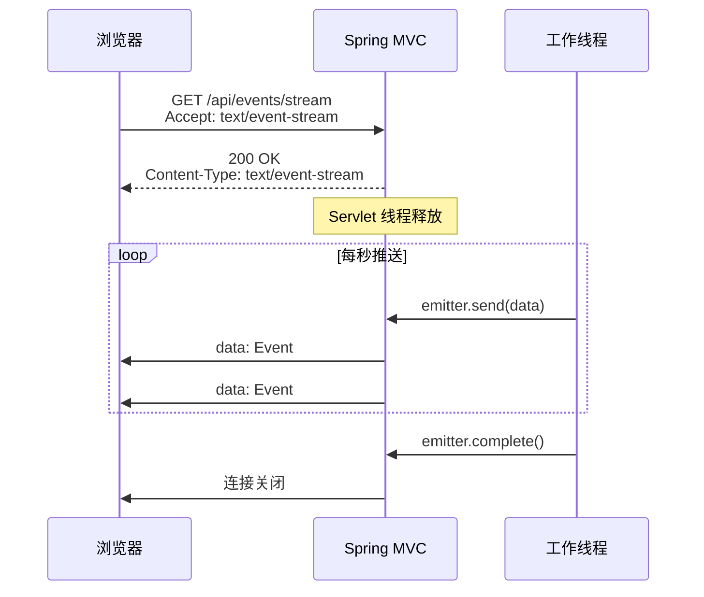

::: tip DeferredResult vs Callable vs SSE
| 特性 | DeferredResult | Callable | SSE |
|------|--------------|---------|-----|
| 返回时机 | 外部线程触发 | 异步计算完成 | 持续推送 |
| 典型场景 | 长轮询、WebHook | 耗时计算 | 实时通知、日志流 |
| 线程模型 | Servlet 线程释放 | 使用 AsyncTaskExecutor | Servlet 线程释放 |
| 连接数 | 1 次 | 1 次 | 持续 |
:::

### 异常处理流程

#### HandlerExceptionResolver 体系

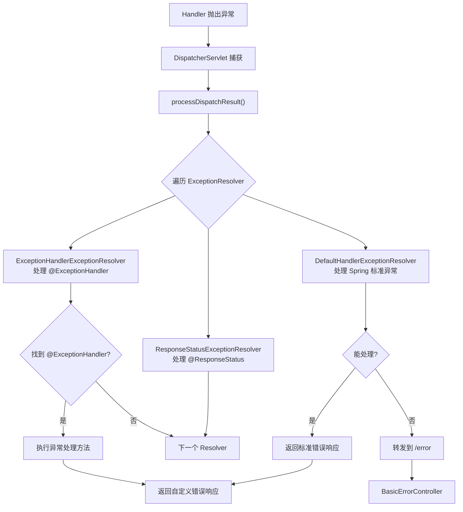

#### 全局异常处理最佳实践

```java
// 全局异常处理器
@RestControllerAdvice
public class GlobalExceptionHandler {

    // 处理业务异常
    @ExceptionHandler(BusinessException.class)
    public ResponseEntity<ErrorResponse> handleBusiness(BusinessException ex) {
        return ResponseEntity.status(ex.getCode())
            .body(new ErrorResponse(ex.getCode(), ex.getMessage()));
    }

    // 处理参数校验异常
    @ExceptionHandler(MethodArgumentNotValidException.class)
    public ResponseEntity<ErrorResponse> handleValidation(MethodArgumentNotValidException ex) {
        List<String> errors = ex.getBindingResult().getFieldErrors()
            .stream()
            .map(e -> e.getField() + ": " + e.getDefaultMessage())
            .collect(Collectors.toList());
        return ResponseEntity.badRequest()
            .body(new ErrorResponse(400, "参数校验失败", errors));
    }

    // 处理权限异常
    @ExceptionHandler(AccessDeniedException.class)
    public ResponseEntity<ErrorResponse> handleAccessDenied(AccessDeniedException ex) {
        return ResponseEntity.status(403)
            .body(new ErrorResponse(403, "无权限访问"));
    }

    // 处理所有未捕获异常
    @ExceptionHandler(Exception.class)
    public ResponseEntity<ErrorResponse> handleAll(Exception ex) {
        log.error("未捕获异常", ex);
        return ResponseEntity.internalServerError()
            .body(new ErrorResponse(500, "服务器内部错误"));
    }
}

// 统一错误响应格式
@Data
@AllArgsConstructor
public class ErrorResponse {
    private int code;
    private String message;
    @JsonProperty("details")
    private List<String> details;
}
```

::: danger 生产事故案例：异常处理不当导致信息泄露
某团队的全局异常处理器直接将 `Exception.getMessage()` 返回给前端：
```java
@ExceptionHandler(Exception.class)
public String handleAll(Exception ex) {
    return ex.getMessage();  // × 可能泄露数据库表名、SQL 语句等敏感信息
}
```
当数据库连接异常时，前端收到 `"Table 'app_db.user_info' doesn't exist"`——直接暴露了数据库表名。

**教训：** 生产环境永远不要将原始异常信息返回给前端。使用统一错误响应格式，内部异常只记录日志。
:::

#### Spring Boot 的 /error 端点

```java
// BasicErrorController 处理转发到 /error 的请求
@Controller
@RequestMapping("${server.error.path:/error}")
public class BasicErrorController extends AbstractErrorController {

    // HTML 错误页面（浏览器访问）
    @RequestMapping(produces = MediaType.TEXT_HTML_VALUE)
    public ModelAndView errorHtml(HttpServletRequest request, HttpServletResponse response) {
        HttpStatus status = getStatus(request);
        Map<String, Object> model = getErrorAttributes(request, getErrorAttributeOptions(request));
        response.setStatus(status.value());
        return new ModelAndView("error", model);
    }

    // JSON 错误响应（API 客户端访问）
    @RequestMapping
    public ResponseEntity<Map<String, Object>> error(HttpServletRequest request) {
        HttpStatus status = getStatus(request);
        Map<String, Object> body = getErrorAttributes(request, getErrorAttributeOptions(request));
        return ResponseEntity.status(status).body(body);
    }
}
```

```yaml
## 自定义错误配置
server:
  error:
    include-message: always      # 包含错误消息
    include-binding-errors: always # 包含参数校验错误
    include-stacktrace: on-param  # 仅在 debug 参数时包含堆栈
    include-exception: false      # 不包含异常类名
    path: /error                  # 错误端点路径
```

### 视图解析流程

虽然 Spring Boot 主要用于 REST API 开发，但视图解析机制在某些场景仍有用（如错误页面、邮件模板）。

#### ViewResolver 体系

```java
// ContentNegotiatingViewResolver：根据 Accept 头选择视图
// InternalResourceViewResolver：JSP 视图解析
// ThymeleafViewResolver：Thymeleaf 模板解析（引入 thymeleaf Starter 时自动配置）

// 视图解析流程
protected void render(ModelAndView mv, HttpServletRequest request, HttpServletResponse response) {
    // 1. 确定视图名称
    String viewName = mv.getViewName();

    // 2. 通过 ViewResolver 解析视图
    View view = resolveViewName(viewName, mv.getModel(), request);

    // 3. 渲染视图
    view.render(mv.getModel(), request, response);
}
```

#### 错误页面自定义

```java
// 自定义错误页面（替代 Whitelabel Error Page）
@Configuration
public class ErrorPageConfig {

    @Bean
    public ErrorPageRegistrar errorPageRegistrar() {
        return registry -> {
            registry.addErrorPages(
                new ErrorPage(HttpStatus.NOT_FOUND, "/error/404"),
                new ErrorPage(HttpStatus.INTERNAL_SERVER_ERROR, "/error/500"),
                new ErrorPage(Exception.class, "/error/general")
            );
        };
    }
}

// 或直接在 resources/templates/error/ 目录下放置 Thymeleaf 模板
// error/404.html — 404 页面
// error/500.html — 500 页面
// error.html — 默认错误页面
```

### 实战场景深度解析

#### 场景一：请求耗时监控

```java
// 使用 Filter + ThreadLocal 实现请求耗时统计
@Component
public class RequestTimingFilter implements Filter {

    private static final String START_TIME_ATTR = "requestStartTime";

    @Override
    public void doFilter(ServletRequest request, ServletResponse response,
            FilterChain chain) throws IOException, ServletException {
        HttpServletRequest httpRequest = (HttpServletRequest) request;
        long startTime = System.currentTimeMillis();
        httpRequest.setAttribute(START_TIME_ATTR, startTime);

        chain.doFilter(request, response);

        long duration = System.currentTimeMillis() - startTime;
        String uri = httpRequest.getRequestURI();
        String method = httpRequest.getMethod();

        if (duration > 3000) {
            log.warn("[慢请求] {} {} 耗时 {}ms", method, uri, duration);
        } else if (duration > 1000) {
            log.info("[中等请求] {} {} 耗时 {}ms", method, uri, duration);
        } else {
            log.debug("[正常请求] {} {} 耗时 {}ms", method, uri, duration);
        }
    }
}
```

#### 场景二：请求日志记录

```java
// 记录请求和响应的完整日志（调试/排查用）
@Component
public class RequestLoggingFilter extends OncePerRequestFilter {

    @Override
    protected void doFilterInternal(HttpServletRequest request,
            HttpServletResponse response, FilterChain filterChain)
            throws ServletException, IOException {

        // 只记录 API 请求
        if (!request.getRequestURI().startsWith("/api/")) {
            filterChain.doFilter(request, response);
            return;
        }

        // 包装 request 和 response 以便读取内容
        ContentCachingRequestWrapper wrappedRequest = new ContentCachingRequestWrapper(request);
        ContentCachingResponseWrapper wrappedResponse = new ContentCachingResponseWrapper(response);

        try {
            filterChain.doFilter(wrappedRequest, wrappedResponse);
        } finally {
            // 记录请求日志
            String requestBody = getRequestBody(wrappedRequest);
            String responseBody = getResponseBody(wrappedResponse);

            log.info("请求: {} {} | 请求体: {} | 响应状态: {} | 响应体: {}",
                request.getMethod(), request.getRequestURI(),
                truncate(requestBody, 500),
                response.getStatus(),
                truncate(responseBody, 500));

            // 必须调用 copyBodyToResponse，否则客户端收不到响应
            wrappedResponse.copyBodyToResponse();
        }
    }

    private String truncate(String content, int maxLength) {
        if (content == null || content.length() <= maxLength) {
            return content;
        }
        return content.substring(0, maxLength) + "...(truncated)";
    }
}
```

::: warning 生产环境的日志注意事项
1. **不要在生产环境记录完整的请求/响应体**：可能包含敏感信息（密码、Token、个人信息）
2. **大请求体会消耗大量内存**：`ContentCachingRequestWrapper` 会缓存整个请求体
3. **脱敏处理**：对包含敏感字段的 JSON 做 Mask 处理
4. **异步日志**：使用异步 Appender（如 Logback 的 AsyncAppender）避免日志 IO 阻塞请求
:::

#### 场景三：统一响应格式

```java
// 统一 API 响应格式
@Data
@AllArgsConstructor
@NoArgsConstructor
public class ApiResponse<T> {
    private int code;
    private String message;
    private T data;
    private long timestamp;

    public static <T> ApiResponse<T> success(T data) {
        return new ApiResponse<>(200, "success", data, System.currentTimeMillis());
    }

    public static <T> ApiResponse<T> error(int code, String message) {
        return new ApiResponse<>(code, message, null, System.currentTimeMillis());
    }
}

// 自动包装 Controller 返回值
@RestControllerAdvice
public class ResponseWrapperAdvice implements ResponseBodyAdvice<Object> {

    @Override
    public boolean supports(MethodParameter returnType,
            Class<? extends HttpMessageConverter<?>> converterType) {
        // 不包装错误响应和已经是 ApiResponse 的返回值
        return !returnType.getParameterType().equals(ApiResponse.class)
            && !returnType.hasMethodAnnotation(ExceptionHandler.class);
    }

    @Override
    public Object beforeBodyWrite(Object body, MethodParameter returnType,
            MediaType selectedContentType,
            Class<? extends HttpMessageConverter<?>> selectedConverterType,
            ServerHttpRequest request, ServerHttpResponse response) {
        if (body instanceof String) {
            // String 特殊处理：需要先序列化为 JSON 字符串
            // 否则会被 StringHttpMessageConverter 处理，导致格式错误
            ObjectMapper mapper = new ObjectMapper();
            try {
                return mapper.writeValueAsString(ApiResponse.success(body));
            } catch (JsonProcessingException e) {
                return ApiResponse.error(500, "序列化失败");
            }
        }
        return ApiResponse.success(body);
    }
}
```

#### 场景四：多语言 REST API

```java
// 基于 Accept-Language 的多语言 API
@Configuration
public class WebMvcConfig implements WebMvcConfigurer {

    @Override
    public void addInterceptors(InterceptorRegistry registry) {
        registry.addInterceptor(new LocaleChangeInterceptor());
    }
}

// LocaleContextHolder 在拦截器中设置
@Component
public class LocaleInterceptor implements HandlerInterceptor {

    @Override
    public boolean preHandle(HttpServletRequest request,
            HttpServletResponse response, Object handler) {
        String language = request.getHeader("Accept-Language");
        if (language != null) {
            Locale locale = Locale.forLanguageTag(language);
            LocaleContextHolder.setLocale(locale);
        } else {
            LocaleContextHolder.setLocale(Locale.SIMPLIFIED_CHINESE);  // 默认中文
        }
        return true;
    }

    @Override
    public void afterCompletion(HttpServletRequest request,
            HttpServletResponse response, Object handler, Exception ex) {
        LocaleContextHolder.resetLocaleContext();  // 清理
    }
}

// 使用 MessageSource 获取多语言文本
@Service
public class ErrorMessageService {

    @Autowired
    private MessageSource messageSource;

    public String getMessage(String code, Object... args) {
        Locale locale = LocaleContextHolder.getLocale();
        return messageSource.getMessage(code, args, locale);
    }
}
```

#### 场景五：API 版本控制

```java
// 基于 URL 路径的版本控制
@RestController
@RequestMapping("/api/v1/users")
public class UserV1Controller {
    @GetMapping("/{id}")
    public UserV1Response getUser(@PathVariable Long id) { ... }
}

@RestController
@RequestMapping("/api/v2/users")
public class UserV2Controller {
    @GetMapping("/{id}")
    public UserV2Response getUser(@PathVariable Long id) { ... }
}

// 基于自定义 Header 的版本控制
public class ApiVersionRequestCondition implements RequestCondition<ApiVersionRequestCondition> {
    private final int version;

    @Override
    public ApiVersionRequestCondition combine(ApiVersionRequestCondition other) {
        return new ApiVersionRequestCondition(other.version);
    }

    @Override
    public ApiVersionRequestCondition getMatchingCondition(HttpServletRequest request) {
        String versionHeader = request.getHeader("X-API-Version");
        if (versionHeader != null && Integer.parseInt(versionHeader) >= this.version) {
            return this;
        }
        return null;
    }
}

// 注册版本化 HandlerMapping
@Configuration
public class ApiVersionConfig implements WebMvcRegistrations {
    @Override
    public RequestMappingHandlerMapping getRequestMappingHandlerMapping() {
        return new ApiVersionRequestMappingHandlerMapping("v1");
    }
}
```

::: tip API 版本控制策略对比
| 策略 | 优点 | 缺点 |
|------|------|------|
| URL 路径（/api/v1/） | 简单直观，易于缓存 | URL 冗余 |
| 请求头（X-API-Version） | URL 干净 | 不直观，需要文档说明 |
| Accept 头（application/vnd.api.v1+json） | RESTful 标准 | 实现复杂 |
| 查询参数（?version=1） | 最简单 | 不够优雅，影响缓存 |
:::

### 面试要点

#### 1. DispatcherServlet 的处理流程？

**答案：** 请求到达 → Filter 链 → DispatcherServlet.doDispatch() → HandlerMapping 查找 Handler → HandlerAdapter 执行 → Interceptor.preHandle → Controller 方法 → Interceptor.postHandle → 视图渲染/JSON 序列化 → Interceptor.afterCompletion → 响应返回

#### 2. Filter 和 Interceptor 的区别？

**答案：** Filter 是 Servlet 规范的，在 DispatcherServlet 之前执行，作用范围更广；Interceptor 是 Spring MVC 的，在 Handler 执行前后执行，可以获取 Handler 信息。认证/编码用 Filter，业务逻辑拦截用 Interceptor。

#### 3. DispatcherServlet 的初始化做了什么？

**答案：** DispatcherServlet 初始化时通过 `initStrategies()` 加载九大核心组件：MultipartResolver、LocaleResolver、ThemeResolver、HandlerMapping、HandlerAdapter、HandlerExceptionResolver、RequestToViewNameTranslator、ViewResolver、FlashMapManager。Spring Boot 自动注册这些组件的默认实现。

#### 4. HandlerMapping 的匹配优先级？

**答案：** 精确匹配 > 路径变量匹配 > 通配符匹配。多个匹配时，路径越长越具体的优先级越高。Spring Boot 3.x 使用 PathPatternParser 替代 AntPathMatcher，性能更好。

#### 5. @RequestBody 的反序列化流程？

**答案：** `RequestResponseBodyMethodProcessor` 作为参数解析器，遍历所有 `HttpMessageConverter`，找到能处理请求 Content-Type 的转换器（通常是 `MappingJackson2HttpMessageConverter`），调用 `read()` 方法将请求体反序列化为 Java 对象。

#### 6. 异步请求处理的三种方式？

**答案：**
- **Callable**：简单异步，由 Spring 的 AsyncTaskExecutor 执行
- **DeferredResult**：由外部线程触发结果，适合长轮询/WebHook 场景
- **SseEmitter**：持续推送数据，适合实时通知

#### 7. 如何自定义参数解析器？

**答案：** 实现 `HandlerMethodArgumentResolver` 接口的 `supportsParameter()` 和 `resolveArgument()` 方法，然后在 `WebMvcConfigurer.addArgumentResolvers()` 中注册。

#### 8. 全局异常处理的最佳实践？

**答案：** 使用 `@RestControllerAdvice` + `@ExceptionHandler`，按异常类型分别处理：业务异常返回具体错误码，参数校验异常返回 400 + 详细信息，权限异常返回 403，未知异常返回 500 + 通用消息（不泄露内部信息）。统一使用 `ErrorResponse` 格式。

>  相关文档：[2-RESTfulAPI注解](01-RESTfulAPI注解) · [6-Java异常深度处理](05-Java异常深度处理) · [16-Bean生命周期与容器原理](23-Bean生命周期与循环依赖源码)


## WebMvc 自动装配与组件

### WebMvc：自动装配回顾与DispatcherServlet组件

我们把应用重置回刚初始化的状态，也或者新创建一个干净的工程，还是只导入 `spring-boot-starter-web` 依赖，接下来咱开始分析WebMvc的一些原理。

之前分析自动装配时，咱们拿WebMvc来解析实例了。咱简单回顾一下WebMvc的自动装配都干了什么。

#### 1. WebMvc自动配置装配的核心组件

##### 1.1 WebMvcAutoConfiguration

配置 `Converter`：

```java
    @Override
    public void configureMessageConverters(List<HttpMessageConverter<?>> converters) {
        this.messageConvertersProvider
              .ifAvailable((customConverters) -> converters.addAll(customConverters.getConverters()));
    }
```

`ViewResolver`：

```java
// 最常用的视图解析器
@Bean
public InternalResourceViewResolver defaultViewResolver() {}
@Bean
public BeanNameViewResolver beanNameViewResolver() {}
@Bean
public ContentNegotiatingViewResolver viewResolver(BeanFactory beanFactory) {}
// 国际化组件
@Bean
public LocaleResolver localeResolver() {}
```

静态资源映射，`webjars` 映射：

```java
public void addResourceHandlers(ResourceHandlerRegistry registry) {
    // ......
    // 映射webjars
    if (!registry.hasMappingForPattern("/webjars/**")) {
        customizeResourceHandlerRegistration(registry.addResourceHandler("/webjars/**")
                .addResourceLocations("classpath:/META-INF/resources/webjars/")
                .setCachePeriod(getSeconds(cachePeriod)).setCacheControl(cacheControl));
    }
    // 映射静态资源路径
    String staticPathPattern = this.mvcProperties.getStaticPathPattern();
    if (!registry.hasMappingForPattern(staticPathPattern)) {
        customizeResourceHandlerRegistration(registry.addResourceHandler(staticPathPattern)
                .addResourceLocations(getResourceLocations(this.resourceProperties.getStaticLocations()))
                .setCachePeriod(getSeconds(cachePeriod)).setCacheControl(cacheControl));
    }
}
```

设置 `index.html`：

```java
private Resource getIndexHtml(String location) {
    return this.resourceLoader.getResource(location + "index.html");
}
```

应用图标：

```java
@Bean
public SimpleUrlHandlerMapping faviconHandlerMapping() {
    // ......
    mapping.setUrlMap(Collections.singletonMap("**/favicon.ico", faviconRequestHandler()));
    return mapping;
}
```

##### 1.2 DispatcherServletAutoConfiguration

DispatcherServlet：

```java
@Bean(name = DEFAULT_DISPATCHER_SERVLET_BEAN_NAME)
public DispatcherServlet dispatcherServlet() {
    DispatcherServlet dispatcherServlet = new DispatcherServlet();
    // ......
    return dispatcherServlet;
}
```

##### 1.3 ServletWebServerFactoryAutoConfiguration

TomcatServletWebServerFactory：

```java
@Bean
public TomcatServletWebServerFactory tomcatServletWebServerFactory() {
    return new TomcatServletWebServerFactory();
}
```

WebServerFactoryCustomizerBeanPostProcessor + ErrorPageRegistrarBeanPostProcessor：

```java
public void registerBeanDefinitions(AnnotationMetadata importingClassMetadata,
        BeanDefinitionRegistry registry) {
    if (this.beanFactory == null) {
        return;
    }
    // 编程式注入组件
    registerSyntheticBeanIfMissing(registry, "webServerFactoryCustomizerBeanPostProcessor",
            WebServerFactoryCustomizerBeanPostProcessor.class);
    registerSyntheticBeanIfMissing(registry, "errorPageRegistrarBeanPostProcessor",
            ErrorPageRegistrarBeanPostProcessor.class);
}
```

##### 1.4 官方文档的说明

[https://docs.spring.io/spring-boot/docs/2.1.9.RELEASE/reference/htmlsingle/#boot-features-spring-mvc-auto-configuration](https://docs.spring.io/spring-boot/docs/2.1.9.RELEASE/reference/htmlsingle/#boot-features-spring-mvc-auto-configuration)

官方文档列举的组件如下：

- 视图解析器
- webjars的资源映射
- 自动配置的转换器、格式化器（Converter、Formatter）
- Http请求转换器（HttpMessageConverter）
- 响应代码解析器
- 静态主页映射
- 网站图标映射
- 可配置的Web初始化绑定器

基本上面列举的部分都在官方文档中有描述了。

咱们都知道，SpringWebMvc的核心是 `DispatcherServlet` ，那对于WebMvc部分咱就着重来看启动、配置，以及与 `DispatcherServlet` 相关的部分。

#### 2. 启动应用相关原理

在了解启动原理之前，先来了解一下Servlet3.0的一些规范，这对后续了解 **SpringWebMvc** 和 **SpringBootWebMvc** 有很大帮助。

##### 2.1 Servlet3.0规范中引导应用启动的说明

在Servlet3.0的规范文档（小伙伴可点击链接下载：[https://download.oracle.com/otn-pub/jcp/servlet-3.0-fr-eval-oth-JSpec/servlet-3_0-final-spec.pdf?AuthParam=1571470730_c5c9dee74deeafbfdeb7cb7f87ea17f4），8.2.4章节，有对运行时插件的描述。文档把关键部分的原文引入进来，方便小伙伴们阅读。](https://download.oracle.com/otn-pub/jcp/servlet-3.0-fr-eval-oth-JSpec/servlet-3_0-final-spec.pdf?AuthParam=1571470730_c5c9dee74deeafbfdeb7cb7f87ea17f4%EF%BC%89%EF%BC%8C8.2.4%E7%AB%A0%E8%8A%82%EF%BC%8C%E6%9C%89%E5%AF%B9%E8%BF%90%E8%A1%8C%E6%97%B6%E6%8F%92%E4%BB%B6%E7%9A%84%E6%8F%8F%E8%BF%B0%E3%80%82%E5%B0%8F%E5%86%8C%E6%8A%8A%E5%85%B3%E9%94%AE%E9%83%A8%E5%88%86%E7%9A%84%E5%8E%9F%E6%96%87%E5%BC%95%E5%85%A5%E8%BF%9B%E6%9D%A5%EF%BC%8C%E6%96%B9%E4%BE%BF%E5%B0%8F%E4%BC%99%E4%BC%B4%E4%BB%AC%E9%98%85%E8%AF%BB%E3%80%82)

> An instance of the ServletContainerInitializer is looked up via the jar services API by the container at container / application startup time. The framework providing an implementation of the ServletContainerInitializer MUST bundle in the META-INF/services directory of the jar file a file called javax.servlet.ServletContainerInitializer, as per the jar services API, that points to the implementation class of the ServletContainerInitializer.

咱也不贴正儿八经的翻译了，咱用自己的语言描述一下。

在Servlet容器（Tomcat、Jetty等）启动应用时，会扫描应用jar包中 `ServletContainerInitializer` 的实现类。框架必须在jar包的 `META-INF/services` 的文件夹中提供一个名为 `javax.servlet.ServletContainerInitializer` 的文件，文件内容要写明 `ServletContainerInitializer` 的实现类的全限定名。

而这个 `ServletContainerInitializer` 是一个接口，实现它的类必须实现一个方法：`onStartUp` 。

```java
public interface ServletContainerInitializer {
    void onStartup(Set<Class<?>> c, ServletContext ctx) throws ServletException;
}
```

那不难猜出，要这个接口肯定是为了要执行这个 `onStartUp` 方法。

另外，还可以在这个 `ServletContainerInitializer` 的实现类上标注 `@HandlesTypes` 注解，在应用启动的时候自行加载一些附加的类，这些类会以字节码的集合形式传入 `onStartup` 方法的第一个参数中。

了解了这部分Servlet3.0规范后，咱来回顾之前遇到的一个陌生的类：`SpringBootServletInitializer` 。

##### 2.2 SpringBootServletInitializer的作用和原理

回顾 `SpringBoot` 应用打包启动的两种方式：

- 打jar包启动时，先创建IOC容器，在创建过程中创建了嵌入式Web容器。（详细的jar包启动会在 `JarLauncher` 篇解析）
- 打war包启动时，要先启动外部的Web服务器，Web服务器再去启动 `SpringBoot` 应用，然后才是创建IOC容器。

那么在打war包启动时，里面最核心的步骤：**Web服务器启动SpringBoot应用** 。

而这个步骤，就需要依靠 `SpringBootServletInitializer` 。下面咱来看看外置Web容器是如何成功引导 `SpringBoot` 应用启动的：

1. 外部Web容器（Tomcat、Jetty、Undertow等）启动，开始加载 SpringBoot 的war 包并解压。
2. 去 SpringBoot 应用中的每一个被依赖的jar中寻找 META-INF/services/javax.servlet.SpringBootServletInitializer 的文件。
3. 根据文件中标注的全限定类名，去找这个类（就是 SpringServletContainerInitializer）。
4. 这个类的 onStartup 方法中会将 @HandlesTypes 中标注的类型的所有普通实现类（也就是非抽象子类）都实例化出来，之后分别调他们自己的 onStartup 方法。java@HandlesTypes(WebApplicationInitializer.class)
public class SpringServletContainerInitializer implements ServletContainerInitializer {
    @Override
    public void onStartup(Set<Class<?>> webAppInitializerClasses, ServletContext servletContext)
            throws ServletException {
        // SpringServletContainerInitializer会加载所有的WebApplicationInitializer类型的普通实现类

List<WebApplicationInitializer> initializers = new LinkedList<WebApplicationInitializer>();

if (webAppInitializerClasses != null) {
            for (Class<?> waiClass : webAppInitializerClasses) {
                // 如果不是接口，不是抽象类
                if (!waiClass.isInterface() && !Modifier.isAbstract(waiClass.getModifiers()) &&
                        WebApplicationInitializer.class.isAssignableFrom(waiClass)) {
                    try {
                        // 创建该类的实例
                        initializers.add((WebApplicationInitializer) waiClass.newInstance());
                    }
                    catch (Throwable ex) {
                        throw new ServletException("Failed to instantiate WebApplicationInitializer class", ex);
                    }
                }
            }
        }

if (initializers.isEmpty()) {
            servletContext.log("No Spring WebApplicationInitializer types detected on classpath");
            return;
        }

servletContext.log(initializers.size() + " Spring WebApplicationInitializers detected on classpath");
        AnnotationAwareOrderComparator.sort(initializers);
        // 调用各自的onStartup方法
        for (WebApplicationInitializer initializer : initializers) {
            initializer.onStartup(servletContext);
        }
    }
}这个 onStartup 方法的文档注释原文翻译：Delegate the ServletContext to any WebApplicationInitializer implementations present on the application classpath. Because this class declares @HandlesTypes(WebApplicationInitializer.class), Servlet 3.0+ containers will automatically scan the classpath for implementations of Spring's WebApplicationInitializer interface and provide the set of all such types to the webAppInitializerClasses parameter of this method. If no WebApplicationInitializer implementations are found on the classpath, this method is effectively a no-op. An INFO-level log message will be issued notifying the user that the ServletContainerInitializer has indeed been invoked but that no WebApplicationInitializer implementations were found. Assuming that one or more WebApplicationInitializer types are detected, they will be instantiated (and sorted if the @@Order annotation is present or the Ordered interface has been implemented). Then the WebApplicationInitializer.onStartup(ServletContext) method will be invoked on each instance, delegating the ServletContext such that each instance may register and configure servlets such as Spring's DispatcherServlet, listeners such as Spring's ContextLoaderListener, or any other Servlet API componentry such as filters.将 ServletContext 委托给应用程序类路径上存在的任何 WebApplicationInitializer 实现。 因为此类声明了 @HandlesTypes(WebApplicationInitializer.class)，所以 Servlet 3.0+ 容器将自动扫描类路径以查找 Spring 的 WebApplicationInitializer 接口的实现，并将所有此类的类型的集合提供给此方法的 webAppInitializerClasses 参数。 如果在类路径上没有找到 WebApplicationInitializer 实现，则此方法实际上是无操作的。将发出info级别的日志消息，通知用户确实已调用 ServletContainerInitializer，但是未找到 WebApplicationInitializer 实现。 假设检测到一个或多个 WebApplicationInitializer 类型，将对其进行实例化（如果存在 @Order 注解或已实现 Ordered 接口，则将对其进行排序）。然后将在每个实例上调用 WebApplicationInitializer.onStartup(ServletContext) 方法，委派 ServletContext，以便每个实例可以注册和配置 Servlet（例如 Spring 的 DispatcherServlet），监听器（例如 Spring 的 ContextLoaderListener）或任何其他 Servlet API组件（例如Filter）。
5. 因为打war包的 SpringBoot 工程会在启动类的同包下创建 ServletInitializer ，并且必须继承 SpringBootServletInitializer，所以会被服务器创建对象。
6. SpringBootServletInitializer 没有重写 onStartup 方法，去父类 SpringServletContainerInitializer 中寻找父类 SpringServletContainerInitializer 中的 onStartup 方法中有一句核心源码：WebApplicationContextrootAppContext rootAppContext = createRootApplicationContext(servletContext);java@Override
public void onStartup(ServletContext servletContext) throws ServletException {
    // Logger initialization is deferred in case an ordered
    // LogServletContextInitializer is being used
    this.logger = LogFactory.getLog(getClass());
    // 创建 父IOC容器
    WebApplicationContext rootAppContext = createRootApplicationContext(servletContext);
    if (rootAppContext != null) {
        servletContext.addListener(new ContextLoaderListener(rootAppContext) {
            @Override
            public void contextInitialized(ServletContextEvent event) {
                // no-op because the application context is already initialized
            }
        });
    }
    else {
        this.logger.debug("No ContextLoaderListener registered, as " + "createRootApplicationContext() did not "
                      + "return an application context");
    }
}

protected WebApplicationContext createRootApplicationContext(ServletContext servletContext) {
    // 使用Builder机制，前面也介绍过
    SpringApplicationBuilder builder = createSpringApplicationBuilder();
    builder.main(getClass());
    ApplicationContext parent = getExistingRootWebApplicationContext(servletContext);
    if (parent != null) {
        this.logger.info("Root context already created (using as parent).");
        servletContext.setAttribute(WebApplicationContext.ROOT_WEB_APPLICATION_CONTEXT_ATTRIBUTE, null);
        builder.initializers(new ParentContextApplicationContextInitializer(parent));
    }
    // 设置Initializer
    builder.initializers(new ServletContextApplicationContextInitializer(servletContext));
    // 在这里设置了容器启动类：AnnotationConfigServletWebServerApplicationContext
    builder.contextClass(AnnotationConfigServletWebServerApplicationContext.class);
    // 【引导】多态进入子类（自己定义）的方法中
    builder = configure(builder);
    builder.listeners(new WebEnvironmentPropertySourceInitializer(servletContext));
    // builder.build()，创建SpringApplication
    SpringApplication application = builder.build();
    if (application.getAllSources().isEmpty()
          && AnnotationUtils.findAnnotation(getClass(), Configuration.class) != null) {
        application.addPrimarySources(Collections.singleton(getClass()));
    }
    Assert.state(!application.getAllSources().isEmpty(),
               "No SpringApplication sources have been defined. Either override the "
               + "configure method or add an @Configuration annotation");
    // Ensure error pages are registered
    if (this.registerErrorPageFilter) {
        application.addPrimarySources(Collections.singleton(ErrorPageFilterConfiguration.class));
    }
    // 启动SpringBoot应用
    return run(application);
}
7. 在这个方法中：先创建 SpringApplicationBuilder 应用构建器；再创建一些环境配置；下面中间部分有一句： builder = configure(builder);这句源码由于多态，执行了子类（SpringBoot 工程中必须写的那个启动类的同包下的 ServletInitializer）重写的方法；又因为重写的格式固定，是传入了 SpringBoot 的目标运行主程序； return builder.sources(DemoApplication.class);所以下一步才能启动 SpringBoot 工程。
8. 之后就跟启动运行主程序 SpringBootApplication 没什么区别了。

以上就是 `SpringBootServletInitializer` 的作用和原理。

#### 3. @Controller标注的Bean装配MVC原理

做过Controller开发的小伙伴都知道，自己写的Controller类只需要打上 `@Controller` 或 `@RestController` 注解，即可加载到WebMvc中，被 `DispatcherServlet` 找到，这一章节咱来看WebMvc是如何将这些Bean注册到WebMvc中的。

##### 3.0 回顾IOC和AOP原理

先回想一下IOC和AOP的几个原理：

- `@Autowired` 是什么时机被解析的：`AutowiredAnnotationBeanPostProcessor` 在 `postProcessMergedBeanDefinition` 中触发。
- 代理对象是什么时机创建的：**Bean的初始化之后，`AnnotationAwareAspectJAutoProxyCreator` 负责创建代理对象** 。

那由此可以猜测，解析 `@Controller` 中 `@RequestMapping` 的时机可能也在这两种情况之内，暂且保存这个猜想。

下面根据IOC容器的启动过程，来实际探究 `@RequestMapping` 的解析时机。

##### 3.1 初始化 RequestMapping 的入口

这个入口讲真一开始我找的时候找了好久，抓后置处理器死活抓不到关键的解析部分，后来我换了一个思路（小伙伴们可以一起来跟我体会一下这个寻找的思路）：解析 `@Controller` 中的所有映射的方法，就是解析被 `@RequestMapping` 标注的方法。之前看 `WebMvcAutoConfiguration` 时又知道注册了一个 `RequestMappingHandlerMapping` 的组件，那估计可以从这个组件中找到一些端倪。

打开这个类，借助IDEA列举所有方法时，第一个吸引我的信息是：它实现了 `InitializingBean` 。可是它为什么要这么干呢？咱来进到实现中：

```java
public void afterPropertiesSet() {
    this.config = new RequestMappingInfo.BuilderConfiguration();
    this.config.setUrlPathHelper(getUrlPathHelper());
    this.config.setPathMatcher(getPathMatcher());
    this.config.setSuffixPatternMatch(this.useSuffixPatternMatch);
    this.config.setTrailingSlashMatch(this.useTrailingSlashMatch);
    this.config.setRegisteredSuffixPatternMatch(this.useRegisteredSuffixPatternMatch);
    this.config.setContentNegotiationManager(getContentNegotiationManager());

    super.afterPropertiesSet();
}
```

这里面都是一些设置，不稀奇啊，继续进到父类的 `afterPropertiesSet` 中：

```java
public void afterPropertiesSet() {
    initHandlerMethods();
}
```

它只是调了 `initHandlerMethods` 方法，但这个方法的字面意思貌似就有些问题：初始化 `HandlerMethod` ？难不成这个方法有关键的含义吗？

##### 3.2 initHandlerMethods

```java
private static final String SCOPED_TARGET_NAME_PREFIX = "scopedTarget.";

protected void initHandlerMethods() {
    for (String beanName : getCandidateBeanNames()) {
        if (!beanName.startsWith(SCOPED_TARGET_NAME_PREFIX)) {
            processCandidateBean(beanName);
        }
    }
    handlerMethodsInitialized(getHandlerMethods());
}
```

可以发现它把IOC容器中所有Bean的名称前缀不是 `"scopedTarget."` 的都拿出来，执行一个 `processCandidateBean` 方法。

##### 3.3 processCandidateBean

```java
protected void processCandidateBean(String beanName) {
    Class<?> beanType = null;
    try {
        beanType = obtainApplicationContext().getType(beanName);
    }
    catch (Throwable ex) {
        // An unresolvable bean type, probably from a lazy bean - let's ignore it.
        if (logger.isTraceEnabled()) {
            logger.trace("Could not resolve type for bean '" + beanName + "'", ex);
        }
    }
    if (beanType != null && isHandler(beanType)) {
        detectHandlerMethods(beanName);
    }
}
```

上面的步骤是根据Bean的名称来获取Bean的类型，下面有一个判断：`isHandler`

```java
protected boolean isHandler(Class<?> beanType) {
    return (AnnotatedElementUtils.hasAnnotation(beanType, Controller.class) ||
            AnnotatedElementUtils.hasAnnotation(beanType, RequestMapping.class));
}
```

很明显它要看当前Bean是否有 `@Controller` 或 `@RequestMapping` 标注。

至此发现了重大关键点：**它真的在解析 `@Controller` 和 `@RequestMapping` 了**！证明咱的寻找思路是正确的。

那判断成功后，if中的结构体就一定是解析类中标注了 `@RequestMapping` 的方法了。

##### 3.4 detectHandlerMethods

```java
protected void detectHandlerMethods(Object handler) {
    Class<?> handlerType = (handler instanceof String ?
            obtainApplicationContext().getType((String) handler) : handler.getClass());

    if (handlerType != null) {
        Class<?> userType = ClassUtils.getUserClass(handlerType);
        // 3.5 解析筛选方法
        Map<Method, T> methods = MethodIntrospector.selectMethods(userType,
                (MethodIntrospector.MetadataLookup<T>) method -> {
                    try {
                        return getMappingForMethod(method, userType);
                    }
                    catch (Throwable ex) {
                        throw new IllegalStateException("Invalid mapping on handler class [" +
                                userType.getName() + "]: " + method, ex);
                    }
                });
        if (logger.isTraceEnabled()) {
            logger.trace(formatMappings(userType, methods));
        }
        // 3.6 注册方法映射
        methods.forEach((method, mapping) -> {
            Method invocableMethod = AopUtils.selectInvocableMethod(method, userType);
            registerHandlerMethod(handler, invocableMethod, mapping);
        });
    }
}
```

上面的一开始还是拿到这个Bean的类型，下面会使用一个 `MethodInterceptor` 来筛选一些方法。

###### 3.4.0 MethodIntrospector.selectMethods

```java
public static <T> Map<Method, T> selectMethods(Class<?> targetType, final MetadataLookup<T> metadataLookup) {
    final Map<Method, T> methodMap = new LinkedHashMap<>();
    Set<Class<?>> handlerTypes = new LinkedHashSet<>();
    Class<?> specificHandlerType = null;

if (!Proxy.isProxyClass(targetType)) {
        specificHandlerType = ClassUtils.getUserClass(targetType);
        handlerTypes.add(specificHandlerType);
    }
    handlerTypes.addAll(ClassUtils.getAllInterfacesForClassAsSet(targetType));

for (Class<?> currentHandlerType : handlerTypes) {
        final Class<?> targetClass = (specificHandlerType != null ? specificHandlerType : currentHandlerType);

ReflectionUtils.doWithMethods(currentHandlerType, method -> {
            Method specificMethod = ClassUtils.getMostSpecificMethod(method, targetClass);
            T result = metadataLookup.inspect(specificMethod);
            if (result != null) {
                Method bridgedMethod = BridgeMethodResolver.findBridgedMethod(specificMethod);
                if (bridgedMethod == specificMethod || metadataLookup.inspect(bridgedMethod) == null) {
                    methodMap.put(specificMethod, result);
                }
            }
        }, ReflectionUtils.USER_DECLARED_METHODS);
    }

    return methodMap;
}
```

核心是中间的 for 循环：它会循环类中所有的方法，并且根据一个 `MetadataLookup` 类型来确定是否可以符合匹配条件。

注意 `MetadataLookup` 是一个函数式接口：

```java
@FunctionalInterface
public interface MetadataLookup<T> {
    T inspect(Method method);
}
```

回到上面的方法中，筛选方法中传入的 Lambda 表达式如下：

```java
    Map<Method, T> methods = MethodIntrospector.selectMethods(userType,
            (MethodIntrospector.MetadataLookup<T>) method -> {
                try {
                    // 3.5
                    return getMappingForMethod(method, userType);
                }
                catch (Throwable ex) {
                    throw new IllegalStateException("Invalid mapping on handler class [" +
                            userType.getName() + "]: " + method, ex);
                }
            });
```

它最终是调 `getMappingForMethod` 方法：

##### 3.5 getMappingForMethod

```java
protected RequestMappingInfo getMappingForMethod(Method method, Class<?> handlerType) {
    // 创建方法级别的RequestMappingInfo
    RequestMappingInfo info = createRequestMappingInfo(method);
    if (info != null) {
        // 创建类级别的RequestMappingInfo
        RequestMappingInfo typeInfo = createRequestMappingInfo(handlerType);
        if (typeInfo != null) {
            info = typeInfo.combine(info);
        }
        // 拼接路径前缀
        String prefix = getPathPrefix(handlerType);
        if (prefix != null) {
            info = RequestMappingInfo.paths(prefix).build().combine(info);
        }
    }
    return info;
}
```

这里面分为几个步骤：创建方法级别的 `RequestMappingInfo` ，创建类级别的 `RequestMappingInfo` ，拼接路径前缀。一步一步来看：

###### 3.5.1 createRequestMappingInfo(method)

```java
private RequestMappingInfo createRequestMappingInfo(AnnotatedElement element) {
    RequestMapping requestMapping = AnnotatedElementUtils.findMergedAnnotation(element, RequestMapping.class);
    RequestCondition<?> condition = (element instanceof Class ?
            getCustomTypeCondition((Class<?>) element) : getCustomMethodCondition((Method) element));
    return (requestMapping != null ? createRequestMappingInfo(requestMapping, condition) : null);
}
```

这部分很明显就是在解析 `@RequestMapping` 注解了！最终会把 `@RequestMapping` 及相关的属性封装到一个 `RequestMappingInfo` 对象中，逻辑比较简单。

###### 3.5.2 createRequestMappingInfo(handlerType)

这部分也是一样的道理，不过这里面有个关键的部分：如果类上声明了 `@RequestMapping` 注解，会把这段注解跟方法上的 `@RequestMapping` 做一个拼接。

```java
RequestMappingInfo typeInfo = createRequestMappingInfo(handlerType);
if (typeInfo != null) {
    info = typeInfo.combine(info); // 拼接
}
```

###### 3.5.3 getPathPrefix(handlerType)

```java
private Map<String, Predicate<Class<?>>> pathPrefixes = new LinkedHashMap<>();

String getPathPrefix(Class<?> handlerType) {
    for (Map.Entry<String, Predicate<Class<?>>> entry : this.pathPrefixes.entrySet()) {
        if (entry.getValue().test(handlerType)) {
            String prefix = entry.getKey();
            if (this.embeddedValueResolver != null) {
                prefix = this.embeddedValueResolver.resolveStringValue(prefix);
            }
            return prefix;
        }
    }
    return null;
}
```

这里面提到了一个陌生的属性：`pathPrefixes` 。

这个属性，借助IDEA发现有对应的set方法，而set方法只有一个位置有调用它：`WebMvcAutoConfiguration` ，初始化时调用过（不过它直接回调了父类 `WebMvcConfigurationSupport` 的方法）。

###### 3.5.3.1 WebMvcConfigurationSupport#requestMappingHandlerMapping

```java
public RequestMappingHandlerMapping requestMappingHandlerMapping() {
    RequestMappingHandlerMapping mapping = createRequestMappingHandlerMapping();
    // ......
    PathMatchConfigurer configurer = getPathMatchConfigurer();
    // ......
    Map<String, Predicate<Class<?>>> pathPrefixes = configurer.getPathPrefixes();
    if (pathPrefixes != null) {
        mapping.setPathPrefixes(pathPrefixes);
    }

    return mapping;
}
```

可以发现调用的set方法来自于上面的 `configurer.getPathPrefixes` ，而 `configurer` 又来源于 `getPathMatchConfigurer` 。

###### 3.5.3.2 getPathMatchConfigurer

```java
protected PathMatchConfigurer getPathMatchConfigurer() {
    if (this.pathMatchConfigurer == null) {
        this.pathMatchConfigurer = new PathMatchConfigurer();
        configurePathMatch(this.pathMatchConfigurer);
    }
    return this.pathMatchConfigurer;
}
```

这里面它专门有一个 `configurePathMatch` 方法用来配置 `PathMatch` 。

###### 3.5.2.3 configurePathMatch

```java
protected void configurePathMatch(PathMatchConfigurer configurer) {
    this.configurers.configurePathMatch(configurer);
}

public void configurePathMatch(PathMatchConfigurer configurer) {
    for (WebMvcConfigurer delegate : this.delegates) {
        delegate.configurePathMatch(configurer);
    }
}
```

可以发现这一部分是将所有IOC容器中的 `WebMvcConfigurer` 都拿出来回调 `configurePathMatch` 方法。（这也启发我们可以自定义一些配置类，实现 `WebMvcConfigurer` 接口来重写 `configurePathMatch` 方法，添加自定义规则）

到这里位置，方法的前缀路径就拼好了，下面到了最后一步：注册方法映射

##### 3.6 registerHandlerMethod：注册方法映射

```java
    methods.forEach((method, mapping) -> {
        Method invocableMethod = AopUtils.selectInvocableMethod(method, userType);
        registerHandlerMethod(handler, invocableMethod, mapping);
    });
```

这部分会根据已经筛选好的方法，来注册 `HandlerMethod` 。

```java
private final MappingRegistry mappingRegistry = new MappingRegistry();

protected void registerHandlerMethod(Object handler, Method method, T mapping) {
    this.mappingRegistry.register(mapping, handler, method);
}
```

进到 `register` 中：（关键部分注释已标注在源码中）

```java
public void register(T mapping, Object handler, Method method) {
    // 读写锁加锁
    this.readWriteLock.writeLock().lock();
    try {
        // 将Controller的类型和Controller中的方法包装为一个HandlerMethod对象
        HandlerMethod handlerMethod = createHandlerMethod(handler, method);
        assertUniqueMethodMapping(handlerMethod, mapping);
        // 将RequestMappingInfo和Controller的目标方法存入Map中
        this.mappingLookup.put(mapping, handlerMethod);

// 将注解中的映射url和RequestMappingInfo存入Map
        List<String> directUrls = getDirectUrls(mapping);
        for (String url : directUrls) {
            this.urlLookup.add(url, mapping);
        }

String name = null;
        if (getNamingStrategy() != null) {
            name = getNamingStrategy().getName(handlerMethod, mapping);
            addMappingName(name, handlerMethod);
        }

// 将Controller目标方法和跨域配置存入Map
        CorsConfiguration corsConfig = initCorsConfiguration(handler, method, mapping);
        if (corsConfig != null) {
            this.corsLookup.put(handlerMethod, corsConfig);
        }

        // uri 映射 HandlerMethod封装的MappingRegistration对象，存入Map中
        this.registry.put(mapping, new MappingRegistration<>(mapping, handlerMethod, directUrls, name));
    }
    finally {
        this.readWriteLock.writeLock().unlock();
    }
}
```

上面的源码逻辑也算比较清晰的了，外层它会保证线程安全，中间的try块会封装 `Controller` 和它的方法，变成一个 `HandlerMethod` 对象，之后分别保存三组Map映射（源码中已标注注释），完成注册。

至此，`@Controller` 中的 `@RequestMapping` 信息已经被装载进 `RequestMappingHandlerMapping` 中。

#### 小结

1. Servlet3.0规范中取消了 `web.xml`，改用 `ServletContainerInitializer` 来接管应用启动。
2. `SpringBootServletInitializer` 实现了 `WebApplicationInitializer` ，用于被 `ServletContainerInitializer` 引导 SpringBoot 应用启动。
3. Controller 中的 `@RequestMapping` 标注的方法装载时机是 `RequestMappingHandlerMapping` 的初始化阶段。

### 嵌入式容器：嵌入式Tomcat的优化和配置

前一篇咱完整的解析了嵌入式 Tomcat 的启动原理，在以往的开发中我们可能会根据项目本身对 Tomcat 进行一些调整，以达到最大化利用 Tomcat 的目的。SpringBoot 使用嵌入式 Tomcat，再像之前那样做 Tomcat 性能调优就显得不那么现实了，为此我们需要了解如何在 SpringBoot 内部给嵌入式 Tomcat 做性能调优。这部分文档只做定**性**的解析，深入到**量**的控制文档不作详细探讨。

#### 0. 调优前的准备

为测试当前 SpringBoot 中嵌入式 Tomcat 的最大性能，需要一个压力测试工具来辅助我们测试性能，目前应用比较多的压测工具有 **Bench** 和 **JMeter** ，文档中使用 `Bench` 作为压测工具。

测试之前，咱先把工具准备好：

- Bench：[https://www.apachelounge.com/download/](https://www.apachelounge.com/download/)
- JMeter：[http://jmeter.apache.org/download_jmeter.cgi](http://jmeter.apache.org/download_jmeter.cgi)

下载好之后，把这两个工具的环境变量都配置好，方便直接从控制台执行。

除此之外，把一开始的测试工程中加入一个测试的 `DemoController` ，用于接收请求压测（为模拟真实业务场景，会在 `DemoController` 中让线程随机阻塞 `100 - 500ms` ，以代替数据库连接和业务查询）。最后，把工程打成可执行jar包并启动，等待测试。

jar包启动的方式非常简单：`java -jar demo-0.0.1-SNAPSHOT.jar`

（本文档在进行压测时的物理环境：Windows10 + Intel Core i7-8750H）

#### 1. 使用Bench进行压测

在cmd中执行如下命令：

`ab -n 10000 -c 500 http://localhost:8080/test`

执行完成后会在控制台打印测试报告（**以下数据为原作者本机实测，仅供演示调优方法参考，具体数值因机器与环境而异**；报告中的指标解释已标注在行尾）：

```text
This is ApacheBench, Version 2.3 <$Revision: 1843412 $>
Copyright 1996 Adam Twiss, Zeus Technology Ltd, http://www.zeustech.net/
Licensed to The Apache Software Foundation, http://www.apache.org/

Benchmarking localhost (be patient)
Completed 1000 requests
Completed 2000 requests
Completed 3000 requests
Completed 4000 requests
Completed 5000 requests
Completed 6000 requests
Completed 7000 requests
Completed 8000 requests
Completed 9000 requests
Completed 10000 requests
Finished 10000 requests

Server Software:
Server Hostname:        localhost // 主机名
Server Port:            8080      // 端口号

Document Path:          /test
Document Length:        4 bytes

Concurrency Level:      500            // 并发量
Time taken for tests:   15.670 seconds // 所有请求的总耗时
Complete requests:      10000          // 成功的请求数
Failed requests:        0
Total transferred:      1360000 bytes  // 总传输数据量
HTML transferred:       40000 bytes    // 总响应数据量
Requests per second:    638.17 [#/sec] (mean) // 【重要】每秒执行的请求数量（吞吐量）
Time per request:       783.493 [ms] (mean)   // 【重要】客户端平均响应时间
Time per request:       1.567 [ms] (mean, across all concurrent requests) // 服务器平均请求等待时间
Transfer rate:          84.76 [Kbytes/sec] received // 每秒传输的数据量

Connection Times (ms)
              min  mean[+/-sd] median   max
Connect:        0    0   0.2      0       1
Processing:   105  738 135.1    742     993
Waiting:      105  738 135.2    742     993
Total:        105  738 135.1    742     993

Percentage of the requests served within a certain time (ms)
  50%    742
  66%    810
  75%    847
  80%    868
  90%    909
  95%    931
  98%    945
  99%    952
 100%    993 (longest request)
```

在测试报告中有两个重要的指标需要咱来关注：

- **Requests per second**：每秒执行的请求数量（吞吐量） 吞吐量越高，代表性能越好
- **Time per request**：客户端平均响应时间 响应时间越短，代表性能越好

在这里面测得的结果是 638.17 的吞吐量，783.493ms 的平均响应时间，这个响应时间比代码中控制的阻塞时间更长，说明 Tomcat 对500的并发已经有一些吃力了。

下面咱再用更大的并发量来测试效果：

`ab -n 50000 -c 2000 http://localhost:8080/test`

测得的结果（截取主要部分）：

```text
Concurrency Level:      2000
Time taken for tests:   75.689 seconds
Complete requests:      50000
Failed requests:        0
Total transferred:      6800000 bytes
HTML transferred:       200000 bytes
Requests per second:    660.60 [#/sec] (mean)
Time per request:       3027.564 [ms] (mean)
Time per request:       1.514 [ms] (mean, across all concurrent requests)
Transfer rate:          87.74 [Kbytes/sec] received
```

发现**吞吐量没有什么太大的变化**，但**平均响应时间大幅提升，且大概为上面的4倍**。可以看得出来，Tomcat 的处理速度已经远远跟不上请求到来的速度，需要进行性能调优。

#### 2. 嵌入式Tomcat调优依据

调优一定要有依据，咱根据现状和之前对 SpringBoot 的学习和原理剖析，应该知道配置大多都是两种形式：

- 声明式配置：`application.properties` 或 `application.yml`
- 编程式配置：`XXXConfigurer` 或 `XXXCustomizer`

其中，利用配置文件进行配置，最终会映射到 SpringBoot 中的一些 Properties 类中，例如 `server.port` 配置会映射到 `ServerProperties` 类中：

```java
@ConfigurationProperties(prefix = "server", ignoreUnknownFields = true)
public class ServerProperties {
    private Integer port;
```

那我们来大体分析一下对于 Tomcat 的声明式配置，都有哪些可以控制的部分：

##### 2.1 Tomcat的声明式配置

在 `ServerProperties` 类中，有一个 Tomcat 的静态内部类：

```java
	/**
	 * Tomcat properties.
	 */
	public static class Tomcat {
        // ......
```

这里面就是配置嵌入式 Tomcat 的可以供我们配置的映射配置类。咱来看里面的核心属性：

```java
/**
 * Maximum amount of worker threads.
 * 最大工作线程数
 */
private int maxThreads = 200;

/**
 * Minimum amount of worker threads.
 * 最小工作线程数
 */
private int minSpareThreads = 10;

/**
 * Maximum number of connections that the server accepts and processes at any
 * given time. Once the limit has been reached, the operating system may still
 * accept connections based on the "acceptCount" property.
 * 服务器最大连接数
 */
private int maxConnections = 10000;

/**
 * Maximum queue length for incoming connection requests when all possible request
 * processing threads are in use.
 * 最大请求队列等待长度
 */
private int acceptCount = 100;
```

可以发现这里面的几个指标，分别控制连接数、线程数、等待数。

咱来分析为什么上面的吞吐量不够大：请求中的关键耗时动作是 `Thread.sheep` 卡线程，导致吞吐量变大。`Thread.sleep` 模拟了IO操作、数据库交互等**非CPU高速计算的行为**，在数据库交互时，CPU资源被浪费，导致无法处理后来的请求，出现资源利用率低的现象。为此，我们需要提高请求并发数，以此来提高CPU利用率。提高请求并发的方法在上面的几个参数中很明显是 **`maxThreads`** 。

#### 3. 调整maxThreads

从源码中很明显看到默认的最大线程数是200，我们在 `application.properties` 中修改值为 500：

`server.tomcat.max-threads=500`

修改之后的测试：

```text
Concurrency Level:      2000
Time taken for tests:   30.910 seconds
Complete requests:      50000
Failed requests:        0
Total transferred:      6800000 bytes
HTML transferred:       200000 bytes
Requests per second:    1617.61 [#/sec] (mean)
Time per request:       1236.391 [ms] (mean)
Time per request:       0.618 [ms] (mean, across all concurrent requests)
Transfer rate:          214.84 [Kbytes/sec] received
```

发现吞吐量有明显的提升，且吞吐量的放大倍数大概是前面线程数为 200 时的2.5倍。继续放大该值为 2000：

`server.tomcat.max-threads=2000`

重新测试效果：

```text
Concurrency Level:      2000
Time taken for tests:   12.050 seconds
Complete requests:      50000
Failed requests:        0
Total transferred:      6800000 bytes
HTML transferred:       200000 bytes
Requests per second:    4149.38 [#/sec] (mean)
Time per request:       482.000 [ms] (mean)
Time per request:       0.241 [ms] (mean, across all concurrent requests)
Transfer rate:          551.09 [Kbytes/sec] received
```

吞吐量又一次明显上升，但注意此时的吞吐量并没有扩大到上一次的 4 倍。继续放大该值为 10000：

`server.tomcat.max-threads=10000`

重新测试效果：

```text
Concurrency Level:      2000
Time taken for tests:   13.808 seconds
Complete requests:      50000
Failed requests:        0
Total transferred:      6800000 bytes
HTML transferred:       200000 bytes
Requests per second:    3621.22 [#/sec] (mean)
Time per request:       552.300 [ms] (mean)
Time per request:       0.276 [ms] (mean, across all concurrent requests)
Transfer rate:          480.94 [Kbytes/sec] received
```

发现吞吐量竟然下降了！为什么会出现这种现象呢？

#### 4. 现象解释

要解释这个原因，就不得不提到 CPU 的工作原理了。当CPU的**核心线程数**小于当前应用线程时，CPU为了保证所有应用线程都正常执行，它会**在多个线程中来回切换**，以保证每个线程都能获得CPU时间。在一个确定的时间点中，一个CPU只能处理一个线程。

所以这个现象就可以这样解释：当开启的 Tomcat 线程过多时，CPU会消耗大量时间在这些 Tomcat 线程中来回切换，导致真正处理业务请求的时间变少，最终导致整体应用处理速度变慢。

由此也可以推出另一种可能：如果业务逻辑中有大量CPU处理工作（如运算、处理数据等），则CPU需要更多的时间用于计算，此时若 Tomcat 线程过多，则处理速度会更慢。

#### 5. 总结

由上面的情况可以总结出以下结论：

- 应用中大部分业务逻辑都是阻塞型处理（IO、数据库操作等），这种情况下CPU的压力较低，可以适当调大 `maxThreads` 的值大小。
- 应用中大部分业务逻辑都是数据处理和计算，这种情况下CPU的压力较大，应适当调小 `maxThreads` 的值大小。

【至此，嵌入式容器的解析和优化配置部分就完结了。SpringFramework5.x 最大的新特性莫过于 WebFlux ，且响应式编程正逐步开始在开发界使用，咱也不能落下，接下来的几篇咱来对 WebFlux 快速上手，以及源码解析】


## DispatcherServlet 工作原理

### WebMvc：DispatcherServlet的工作原理

这一篇的内容算是面试中可能比较经常问的基础吧，`DispatcherServlet` 的工作流程步骤简直跟背圣经一样，背的熟不如来源码底层一探究竟。

#### 0. DispatcherServlet工作流程步骤

1. 浏览器向服务器发起请求，由 `DispatcherServlet` 接收请求；
2. `DispatcherServlet` 委托 `HandlerMapping`，根据 url 来选择一个合适的 Controller 中的方法；
3. `HandlerMapping` 找到合适的 Controller 后，并根据已配置的拦截器，整理出一个 Handler，返回给 `DispatcherServlet`；
4. `DispatcherServlet` 收到 Handler 后委托 `HandlerAdapter`，将该请求代理给 `HandlerMapping` 选定的 Controller 中的 Handler；
5. Handler 收到请求后，实际执行 Controller 中的方法，执行完毕后会返回 ModelAndView；
6. Controller 方法执行完毕后会返回 `ModelAndView`；
7. `HandlerAdapter` 收到 Handler 返回的 `ModelAndView` 后返回给 `DispatcherServlet`；
8. `DispatcherServlet` 拿到 `ModelAndView` 后委托 `ViewResolver`，由 `ViewResolver` 负责渲染视图；
9. `ViewResolver` 渲染视图完成后，返回给 `DispatcherServlet`，由 `DispatcherServlet` 负责响应视图。

下面来根据一个测试Demo来实际Debug演示 `DispatcherServlet` 的工作流程机制（为保证视图能正常渲染，demo中附加导入了 **thymeleaf** 的依赖）。

```java
@Controller
public class DemoController {
    @GetMapping("/test")
    public String test() {
        return "test";
    }
}
```

这是一个再简单不过的 Controller 类了。Debug启动 SpringBoot 应用，浏览器发送 `/test` 请求，并在 `DispatcherServlet` 的 `service` 方法（实际上是 **`HttpServlet`**）打断点开始Debug。

#### 1. HttpServlet#service

```java
public void service(ServletRequest req, ServletResponse res)
    throws ServletException, IOException {

HttpServletRequest  request;
    HttpServletResponse response;

    try {
        request = (HttpServletRequest) req;
        response = (HttpServletResponse) res;
    } catch (ClassCastException e) {
        throw new ServletException(lStrings.getString("http.non_http"));
    }
    service(request, response);
}
```

这部分很简单，相当于把请求类型转为http，后调用重载的方法。

```java
protected void service(HttpServletRequest req, HttpServletResponse resp)
    throws ServletException, IOException {

String method = req.getMethod();

if (method.equals(METHOD_GET)) {
        long lastModified = getLastModified(req);
        if (lastModified == -1) {
            // servlet doesn't support if-modified-since, no reason
            // to go through further expensive logic
            doGet(req, resp);
        } else {
            long ifModifiedSince;
            try {
                ifModifiedSince = req.getDateHeader(HEADER_IFMODSINCE);
            } catch (IllegalArgumentException iae) {
                // Invalid date header - proceed as if none was set
                ifModifiedSince = -1;
            }
            if (ifModifiedSince < (lastModified / 1000 * 1000)) {
                // If the servlet mod time is later, call doGet()
                // Round down to the nearest second for a proper compare
                // A ifModifiedSince of -1 will always be less
                maybeSetLastModified(resp, lastModified);
                doGet(req, resp);
            } else {
                resp.setStatus(HttpServletResponse.SC_NOT_MODIFIED);
            }
        }

} else if (method.equals(METHOD_HEAD)) {
        long lastModified = getLastModified(req);
        maybeSetLastModified(resp, lastModified);
        doHead(req, resp);

} else if (method.equals(METHOD_POST)) {
        doPost(req, resp);

} else if (method.equals(METHOD_PUT)) {
        doPut(req, resp);

} else if (method.equals(METHOD_DELETE)) {
        doDelete(req, resp);

    } // ......
}
```

这还是属于 `HttpServlet` 的源码，它会根据请求类型来转发请求，由于 `HttpServlet` 采用模板方法模式，而模板方法是在 `DispatcherServlet` 中实现，上面的测试Demo选用GET方式，最终来到 `doGet` 方法。

#### 2. doGet

来到 `DispatcherServlet` 的父类 `FrameworkServlet` ，发现 `doGet` 、`doPost` 等方法的方法体都只有一句话：

```java
protected final void doGet(HttpServletRequest request, HttpServletResponse response)
        throws ServletException, IOException {
    processRequest(request, response);
}

protected final void doPost(HttpServletRequest request, HttpServletResponse response)
        throws ServletException, IOException {
    processRequest(request, response);
}
```

发现核心方法都是 `processRequest` ，那就去这个方法：

#### 3. processRequest

（关键步骤的注释已标注在源码中）

```java
protected final void processRequest(HttpServletRequest request, HttpServletResponse response)
        throws ServletException, IOException {

// 记录请求接收时间
    long startTime = System.currentTimeMillis();
    Throwable failureCause = null;

// 3.1 得到当前线程的LocaleContext
    LocaleContext previousLocaleContext = LocaleContextHolder.getLocaleContext();
    LocaleContext localeContext = buildLocaleContext(request);

// 3.2 得到当前线程的RequestAttributes
    RequestAttributes previousAttributes = RequestContextHolder.getRequestAttributes();
    ServletRequestAttributes requestAttributes = buildRequestAttributes(request, response, previousAttributes);

WebAsyncManager asyncManager = WebAsyncUtils.getAsyncManager(request);
    asyncManager.registerCallableInterceptor(FrameworkServlet.class.getName(), new RequestBindingInterceptor());

// 3.3 初始化ContextHolder，传入新封装好的请求参数和上下文，目的是线程隔离
    initContextHolders(request, localeContext, requestAttributes);

try {
        // 4. 进入DispatcherServlet
        doService(request, response);
    }
    catch (ServletException | IOException ex) {
        failureCause = ex;
        throw ex;
    }
    catch (Throwable ex) {
        failureCause = ex;
        throw new NestedServletException("Request processing failed", ex);
    }

    finally {
        // 重新获得当前线程的LocaleContext和RequestAttributes
        resetContextHolders(request, previousLocaleContext, previousAttributes);
        if (requestAttributes != null) {
            requestAttributes.requestCompleted();
        }
        logResult(request, response, failureCause, asyncManager);
        // 发布ServletRequestHandledEvent事件
        publishRequestHandledEvent(request, response, startTime, failureCause);
    }
}
```

咱以try-catch块为分界，前面的部分是隔离当前线程，最后的finally块又是恢复当前线程，由此可以发现 SpringWebMvc 在处理之前已经做好了**线程隔离**。

中间的 `doService` 方法，就是真正处理请求的部分。

【由此可以发现一个 SpringWebMvc 的设计思想：**父类把处理流程抽象化，子类负责每个流程的具体实现**】

上面源码中有几个标注的部分，简单看一眼都是怎么隔离线程的：

##### 3.1 LocaleContextHolder.getLocaleContext

```java
private static final ThreadLocal<LocaleContext> localeContextHolder = new NamedThreadLocal<>("LocaleContext");

public static LocaleContext getLocaleContext() {
    LocaleContext localeContext = localeContextHolder.get();
    if (localeContext == null) {
        localeContext = inheritableLocaleContextHolder.get();
    }
    return localeContext;
}
```

可以发现 `localeContextHolder` 是 `ThreadLocal` 类型，是取的当前线程。

##### 3.2 RequestContextHolder.getRequestAttributes

```java
private static final ThreadLocal<RequestAttributes> requestAttributesHolder = new NamedThreadLocal<>("Request attributes");

public static RequestAttributes getRequestAttributes() {
    RequestAttributes attributes = requestAttributesHolder.get();
    if (attributes == null) {
        attributes = inheritableRequestAttributesHolder.get();
    }
    return attributes;
}
```

`requestAttributesHolder` 也是 `ThreadLocal` 类型，它也是取的当前线程。

##### 3.3 initContextHolders

```java
private void initContextHolders(HttpServletRequest request,
        @Nullable LocaleContext localeContext, @Nullable RequestAttributes requestAttributes) {

    if (localeContext != null) {
        LocaleContextHolder.setLocaleContext(localeContext, this.threadContextInheritable);
    }
    if (requestAttributes != null) {
        RequestContextHolder.setRequestAttributes(requestAttributes, this.threadContextInheritable);
    }
}
```

可以发现这里面是将新的 `localeContext` 、`requestAttributes` 设置到当前线程，原有线程中的对象被暂时缓存在 `processRequest` 方法中。

下面进入 `DispatcherServlet` 的核心：**`doService`** 方法。

#### 4. doService

```java
protected void doService(HttpServletRequest request, HttpServletResponse response) throws Exception {
    logRequest(request);

// Keep a snapshot of the request attributes in case of an include,
    // to be able to restore the original attributes after the include.
    Map<String, Object> attributesSnapshot = null;
    // 4.1 判断请求参数中是否存在javax.servlet.include.request_uri
    if (WebUtils.isIncludeRequest(request)) {
        attributesSnapshot = new HashMap<>();
        Enumeration<?> attrNames = request.getAttributeNames();
        while (attrNames.hasMoreElements()) {
            String attrName = (String) attrNames.nextElement();
            if (this.cleanupAfterInclude || attrName.startsWith(DEFAULT_STRATEGIES_PREFIX)) {
                attributesSnapshot.put(attrName, request.getAttribute(attrName));
            }
        }
    }

// Make framework objects available to handlers and view objects.
    // 将IOC容器及特定组件放入request供开发使用
    request.setAttribute(WEB_APPLICATION_CONTEXT_ATTRIBUTE, getWebApplicationContext());
    request.setAttribute(LOCALE_RESOLVER_ATTRIBUTE, this.localeResolver);
    request.setAttribute(THEME_RESOLVER_ATTRIBUTE, this.themeResolver);
    request.setAttribute(THEME_SOURCE_ATTRIBUTE, getThemeSource());

// 4.2 flashMapManager
    if (this.flashMapManager != null) {
        FlashMap inputFlashMap = this.flashMapManager.retrieveAndUpdate(request, response);
        if (inputFlashMap != null) {
            request.setAttribute(INPUT_FLASH_MAP_ATTRIBUTE, Collections.unmodifiableMap(inputFlashMap));
        }
        request.setAttribute(OUTPUT_FLASH_MAP_ATTRIBUTE, new FlashMap());
        request.setAttribute(FLASH_MAP_MANAGER_ATTRIBUTE, this.flashMapManager);
    }

    try {
        // 5. doDispatch
        doDispatch(request, response);
    }
    finally {
        if (!WebAsyncUtils.getAsyncManager(request).isConcurrentHandlingStarted()) {
            // Restore the original attribute snapshot, in case of an include.
            if (attributesSnapshot != null) {
                restoreAttributesAfterInclude(request, attributesSnapshot);
            }
        }
    }
}
```

`doService` 方法中的核心是try-catch中继续往 DispatcherServlet 最核心的方法中调用，但调用之前它又额外干了几件事，咱一一来看。

##### 4.1 WebUtils.isIncludeRequest

这个方法的内容我们比较陌生：

```java
public static final String INCLUDE_REQUEST_URI_ATTRIBUTE = "javax.servlet.include.request_uri";

public static boolean isIncludeRequest(ServletRequest request) {
    return (request.getAttribute(INCLUDE_REQUEST_URI_ATTRIBUTE) != null);
}
```

它会从 request 中查看是否有 `"javax.servlet.include.request_uri"` 这个属性，那它又是什么呢？

这又要回到 Servlet 规范中来解释了。

翻看 Servlet3.0 的规范文档，在9.3.1章节中有这样一段描述：

> Except for servlets obtained by using the getNamedDispatcher method, a servlet that has been invoked by another servlet using the include method of RequestDispatcher has access to the path by which it was invoked.javax.servlet.include.request_urijavax.servlet.include.context_pathjavax.servlet.include.servlet_pathjavax.servlet.include.path_infojavax.servlet.include.query_stringThese attributes are accessible from the included servlet via the getAttribute method on the request object and their values must be equal to the request URI, context path, servlet path, path info, and query string of the included servlet, respectively. If the request is subsequently included, these attributes are replaced for that include.

这里面刚好提到了 `javax.servlet.include.request_uri` 。

这段规范中的描述大概可以这么理解：已经被另一个 `Servlet` 使用 `RequestDispatcher` 的 `include` 方法调用过的 `Servlet`，有权访问被调用过的 `Servlet`的路径。

等会。include。咱在之前学习jsp的时候有过这样一个标签：`<jsp:incluede page="xxx.jsp"/>` ，用它可以组合其它页面。

那到这里就大概可以猜测出，判断是否有这个属性，是**为了区别页面的加载是否由include标签而来**。

##### 4.2 flashMapManager

这个 `flashMapManager` 我们也很陌生，而且通过Debug发现它不为null：

对此我们就要产生疑惑了，它又是什么？

###### 4.2.1 FlashMapManager的产生背景

做过开发的小伙伴都知道登录操作吧，咱都知道登录是**POST**请求，最终跳转到主页必须是一个redirect的**GET**请求，以防止表单重复提交。但是这样还是会存在一个问题，如果提交表单时传入的一些数据，在重定向的GET请求还要拿到来渲染到页面上，这个问题就不好解决了。传统的解决方案是把要渲染的数据作为url中的参数一起组合进请求路径，但这样做url太长，而且内容长度也有限。

`SpringWebMvc3.1` 版本以后引入了 `FlashMapManager` 来解决这个问题。它引入了一个 `Flash Attribute` 的机制，可以在重定向跳转时将需要渲染的数据暂时放入 session 中，这样浏览器即便刷新也不会影响数据渲染。

###### 4.2.2 SessionFlashMapManager

上面的背景中也描述了，默认暂时会放入 session 域来保证数据渲染，`SpringWebMvc` 提供的默认实现也就是基于 session 的 `FlashMapManager` 。

从类继承结构来看，它又是体现了WebMvc的类设计思想：**父类抽象化流程，子类实现**。

更细致的使用，小伙伴们可以自行搜索相关资料，文档这里只起引入作用。

`doService` 方法中上面的准备工作都完成后，下面进入 `doDispatch` 方法：

#### 5. doDispatch

暂且不看源码实现，先看一眼文档注释原文翻译：

> Process the actual dispatching to the handler. The handler will be obtained by applying the servlet's HandlerMappings in order. The HandlerAdapter will be obtained by querying the servlet's installed HandlerAdapters to find the first that supports the handler class. All HTTP methods are handled by this method. It's up to HandlerAdapters or handlers themselves to decide which methods are acceptable.真正地调度处理器。通过按顺序应用 Servlet 的 HandlerMappings 可以获得处理程序。通过查询Servlet安装的所有 HandlerAdapter 来查找支持该处理程序类的第一个 HandlerAdapter，从而获得 HandlerAdapter 。所有HTTP方法都由该方法处理。由 HandlerAdapters 或处理程序本身来决定可接受的方法。

这段文档注释几乎把 `DispatcherServlet` 的核心处理流程的前半部分都描述到位了。下面是方法实现：（关键步骤已在源码中标号）

```java
protected void doDispatch(HttpServletRequest request, HttpServletResponse response) throws Exception {
    HttpServletRequest processedRequest = request;
    HandlerExecutionChain mappedHandler = null;
    boolean multipartRequestParsed = false;

WebAsyncManager asyncManager = WebAsyncUtils.getAsyncManager(request);

try {
        ModelAndView mv = null;
        Exception dispatchException = null;

try {
            // 5.1 文件上传解析
            processedRequest = checkMultipart(request);
            multipartRequestParsed = (processedRequest != request);

// Determine handler for the current request.
            // 5.2 获取Handler，Handler中包含真正地处理器（Controller中的方法）和一组HandlerInterceptor拦截器
            mappedHandler = getHandler(processedRequest);
            if (mappedHandler == null) {
                noHandlerFound(processedRequest, response);
                return;
            }

// Determine handler adapter for the current request.
            // 5.3 获取HandlerAdapter
            HandlerAdapter ha = getHandlerAdapter(mappedHandler.getHandler());

// Process last-modified header, if supported by the handler.
            String method = request.getMethod();
            boolean isGet = "GET".equals(method);
            if (isGet || "HEAD".equals(method)) {
                long lastModified = ha.getLastModified(request, mappedHandler.getHandler());
                if (new ServletWebRequest(request, response).checkNotModified(lastModified) && isGet) {
                    return;
                }
            }

// 5.4 回调拦截器
            if (!mappedHandler.applyPreHandle(processedRequest, response)) {
                return;
            }

// Actually invoke the handler.
            // 5.5 执行Handler，返回ModelAndView
            mv = ha.handle(processedRequest, response, mappedHandler.getHandler());

if (asyncManager.isConcurrentHandlingStarted()) {
                return;
            }

            applyDefaultViewName(processedRequest, mv);
            // 5.6 回调拦截器
            mappedHandler.applyPostHandle(processedRequest, response, mv);
        }
        catch (Exception ex) {
            dispatchException = ex;
        }
        catch (Throwable err) {
            // As of 4.3, we're processing Errors thrown from handler methods as well,
            // making them available for @ExceptionHandler methods and other scenarios.
            dispatchException = new NestedServletException("Handler dispatch failed", err);
        }
        // 5.7 处理视图，解析异常
        processDispatchResult(processedRequest, response, mappedHandler, mv, dispatchException);
    }
    catch (Exception ex) {
        triggerAfterCompletion(processedRequest, response, mappedHandler, ex);
    }
    catch (Throwable err) {
        triggerAfterCompletion(processedRequest, response, mappedHandler,
                new NestedServletException("Handler processing failed", err));
    }
    finally {
        if (asyncManager.isConcurrentHandlingStarted()) {
            // Instead of postHandle and afterCompletion
            if (mappedHandler != null) {
                // 5.8 回调拦截器
                mappedHandler.applyAfterConcurrentHandlingStarted(processedRequest, response);
            }
        }
        else {
            // Clean up any resources used by a multipart request.
            if (multipartRequestParsed) {
                cleanupMultipart(processedRequest);
            }
        }
    }
}
```

下面咱分步骤来看，体会步骤的执行流程：

##### 5.1 checkMultipart：文件上传解析

```java
protected HttpServletRequest checkMultipart(HttpServletRequest request) throws MultipartException {
    if (this.multipartResolver != null && this.multipartResolver.isMultipart(request)) {
        if (WebUtils.getNativeRequest(request, MultipartHttpServletRequest.class) != null) {
            if (request.getDispatcherType().equals(DispatcherType.REQUEST)) {
                logger.trace("Request already resolved to MultipartHttpServletRequest, e.g. by MultipartFilter");
            }
        }
        else if (hasMultipartException(request)) {
            logger.debug("Multipart resolution previously failed for current request - " +
                    "skipping re-resolution for undisturbed error rendering");
        }
        else {
            try {
                return this.multipartResolver.resolveMultipart(request);
            }
            catch (MultipartException ex) {
                if (request.getAttribute(WebUtils.ERROR_EXCEPTION_ATTRIBUTE) != null) {
                    logger.debug("Multipart resolution failed for error dispatch", ex);
                    // Keep processing error dispatch with regular request handle below
                }
                else {
                    throw ex;
                }
            }
        }
    }
    // If not returned before: return original request.
    return request;
}
```

上面的源码逻辑比较简单，它要判断当前是否有可以处理 Multipart 类型的 Resolver，并且判断当前 request 是否为 `MultipartRequest` ，最终会执行 `multipartResolver.resolveMultipart` 方法。

###### 5.1.1 multipartResolver.resolveMultipart

根据Debug发现`multipartResolver` 的类型是 `StandardServletMultipartResolver` ，翻看它的 `resolveMultipart` 方法：

```java
public MultipartHttpServletRequest resolveMultipart(HttpServletRequest request) throws MultipartException {
    return new StandardMultipartHttpServletRequest(request, this.resolveLazily);
}
```

它直接创建了一个 `StandardMultipartHttpServletRequest` ，那它跟普通的 `HttpServletRequest` 有什么扩展的地方呢？

###### 5.1.2 StandardMultipartHttpServletRequest

它上面只是调了个构造方法而已，那构造方法中大概率会有扩展部分：

```java
public StandardMultipartHttpServletRequest(HttpServletRequest request, boolean lazyParsing)
        throws MultipartException {
    super(request);
    if (!lazyParsing) {
        parseRequest(request);
    }
}
```

它这里有个 `parseRequest` 方法：

```java
private void parseRequest(HttpServletRequest request) {
    try {
        Collection<Part> parts = request.getParts();
        this.multipartParameterNames = new LinkedHashSet<>(parts.size());
        MultiValueMap<String, MultipartFile> files = new LinkedMultiValueMap<>(parts.size());
        for (Part part : parts) {
            String headerValue = part.getHeader(HttpHeaders.CONTENT_DISPOSITION);
            ContentDisposition disposition = ContentDisposition.parse(headerValue);
            String filename = disposition.getFilename();
            if (filename != null) {
                if (filename.startsWith("=?") && filename.endsWith("?=")) {
                    filename = MimeDelegate.decode(filename);
                }
                files.add(part.getName(), new StandardMultipartFile(part, filename));
            }
            else {
                this.multipartParameterNames.add(part.getName());
            }
        }
        setMultipartFiles(files);
    }
    catch (Throwable ex) {
        handleParseFailure(ex);
    }
}
```

可以发现到这里开始解析 `MultipartRequest` 中的文件了。由于咱测试的是GET请求页面跳转，这部分就不展开描述了，感兴趣的小伙伴可以写一个POST表单来测一下这部分是如何解析上传文件的。

##### 5.2 getHandler：搜索第一个可用的Handler

```java
    processedRequest = checkMultipart(request);
    multipartRequestParsed = (processedRequest != request);

    // Determine handler for the current request.
    mappedHandler = getHandler(processedRequest);
    // ......
```

文件解析完毕后，下一步就要获取处理器映射器了。

```java
protected HandlerExecutionChain getHandler(HttpServletRequest request) throws Exception {
    if (this.handlerMappings != null) {
        for (HandlerMapping mapping : this.handlerMappings) {
            HandlerExecutionChain handler = mapping.getHandler(request);
            if (handler != null) {
                return handler;
            }
        }
    }
    return null;
}
```

可以很明显的看出，这部分是要从所有 的`HandlerMapping` 组件中选择一个能适配当前 **uri** 的，并组合请求的核心处理方法（`Controller`）和拦截器，返回给 `DispatcherServlet` 。这个方法的核心是 `mapping.getHandler` ，而所有的 `HandlerMapping` 都继承自 `AbstractHandlerMapping` ，`getHandler` 方法也只在 `AbstractHandlerMapping` 中定义：

```java
public final HandlerExecutionChain getHandler(HttpServletRequest request) throws Exception {
    // 【核心】5.2.1 获得处理器映射器
    Object handler = getHandlerInternal(request);
    if (handler == null) {
        handler = getDefaultHandler();
    }
    if (handler == null) {
        return null;
    }
    // Bean name or resolved handler?
    // 如果取到的Handler是一个String，则会认为要从IOC容器中获得对应的Bean
    if (handler instanceof String) {
        String handlerName = (String) handler;
        handler = obtainApplicationContext().getBean(handlerName);
    }

// 5.2.2 获得拦截器链
    HandlerExecutionChain executionChain = getHandlerExecutionChain(handler, request);

if (logger.isTraceEnabled()) {
        logger.trace("Mapped to " + handler);
    }
    else if (logger.isDebugEnabled() && !request.getDispatcherType().equals(DispatcherType.ASYNC)) {
        logger.debug("Mapped to " + executionChain.getHandler());
    }

// 处理跨域
    if (CorsUtils.isCorsRequest(request)) {
        CorsConfiguration globalConfig = this.corsConfigurationSource.getCorsConfiguration(request);
        CorsConfiguration handlerConfig = getCorsConfiguration(handler, request);
        CorsConfiguration config = (globalConfig != null ? globalConfig.combine(handlerConfig) : handlerConfig);
        executionChain = getCorsHandlerExecutionChain(request, executionChain, config);
    }

    return executionChain;
}
```

这个方法的第一步就要先根据 **uri** 获取能处理它的 `Handler` ，之后拿这个 `handler` 跟一组拦截器组合形成 `HandlerExecutionChain` ，最后处理跨域情况。首先进入 `getHandlerInternal` 方法：

###### 5.2.1 getHandlerInternal

对于解析普通请求 uri 的，都会跳转到 `AbstractHandlerMethodMapping` 中：

```java
protected HandlerMethod getHandlerInternal(HttpServletRequest request) throws Exception {
    // 获取要搜索的uri
    String lookupPath = getUrlPathHelper().getLookupPathForRequest(request);
    // 加锁处理
    this.mappingRegistry.acquireReadLock();
    try {
        // 5.2.1.1 搜索处理器方法（真正处理请求的RequestMapping）
        HandlerMethod handlerMethod = lookupHandlerMethod(lookupPath, request);
        // 5.2.1.2 将方法分离出来，单独形成一个Bean
        return (handlerMethod != null ? handlerMethod.createWithResolvedBean() : null);
    }
    finally {
        this.mappingRegistry.releaseReadLock();
    }
}
```

上面解析好本次请求的uri后，加锁处理，接下来进入try块，开始真正的寻找能处理该请求的Controller方法，找到之后包装为一个单独的Bean。先看看搜索是怎么实现的：

###### 5.2.1.1 lookupHandlerMethod

```java
protected HandlerMethod lookupHandlerMethod(String lookupPath, HttpServletRequest request) throws Exception {
    List<Match> matches = new ArrayList<>();
    // 根据uri获取对应的RequestMapping信息（T的类型为RequestMappingInfo）
    List<T> directPathMatches = this.mappingRegistry.getMappingsByUrl(lookupPath);
    if (directPathMatches != null) {
        addMatchingMappings(directPathMatches, matches, request);
    }
    if (matches.isEmpty()) {
        // No choice but to go through all mappings...
        addMatchingMappings(this.mappingRegistry.getMappings().keySet(), matches, request);
    }

    // 排序选择最适合的Handler
    if (!matches.isEmpty()) {
        Comparator<Match> comparator = new MatchComparator(getMappingComparator(request));
        matches.sort(comparator);
        Match bestMatch = matches.get(0);
        if (matches.size() > 1) {
            if (logger.isTraceEnabled()) {
                logger.trace(matches.size() + " matching mappings: " + matches);
            }
            if (CorsUtils.isPreFlightRequest(request)) {
                return PREFLIGHT_AMBIGUOUS_MATCH;
            }
            Match secondBestMatch = matches.get(1);
            if (comparator.compare(bestMatch, secondBestMatch) == 0) {
                Method m1 = bestMatch.handlerMethod.getMethod();
                Method m2 = secondBestMatch.handlerMethod.getMethod();
                String uri = request.getRequestURI();
                throw new IllegalStateException(
                        "Ambiguous handler methods mapped for '" + uri + "': {" + m1 + ", " + m2 + "}");
            }
        }
        request.setAttribute(BEST_MATCHING_HANDLER_ATTRIBUTE, bestMatch.handlerMethod);
        handleMatch(bestMatch.mapping, lookupPath, request);
        return bestMatch.handlerMethod;
    }
    else {
        return handleNoMatch(this.mappingRegistry.getMappings().keySet(), lookupPath, request);
    }
}
```

在走完第二行时，从 `mappingRegistry` 中取出所有 Mapping 后，通过Debug发现已经能看到所有映射好的路径和对应的 Controller 中方法了。

之后的部分要根据所有能匹配上的 Handler ，选择一个最适合的，最后返回出去。具体的思路文档不详细展开了，逻辑不算复杂，小伙伴们可以实际的测试一次来Debug走一遍，大概有个印象即可，实际开发中也不会说两个Controller方法处理一个 `url+method` 。

###### 5.2.1.2 handlerMethod.createWithResolvedBean

```java
    try {
        HandlerMethod handlerMethod = lookupHandlerMethod(lookupPath, request);
        return (handlerMethod != null ? handlerMethod.createWithResolvedBean() : null);
    }
```

搜索到最适合的 `HandlerMethod` 后，要处理 `handlerMethod` 对象中封装的 bean 属性为 `beanName` 时的特殊情况：

```java
public HandlerMethod createWithResolvedBean() {
    Object handler = this.bean;
    if (this.bean instanceof String) {
        Assert.state(this.beanFactory != null, "Cannot resolve bean name without BeanFactory");
        String beanName = (String) this.bean;
        handler = this.beanFactory.getBean(beanName);
    }
    return new HandlerMethod(this, handler);
}
```

这里面的处理逻辑也很简单，它会判断当前 `handlerMethod` 的 bean 属性是否为 `String`，如果是，会从IOC容器中找到这个 `beanName` 对应的Bean，之后走下面的return，new出来一个 `HandlerMethod` 对象。值得注意的是，这个构造方法中保存的属性比较多：

```java
private HandlerMethod(HandlerMethod handlerMethod, Object handler) {
    Assert.notNull(handlerMethod, "HandlerMethod is required");
    Assert.notNull(handler, "Handler object is required");
    this.bean = handler;
    this.beanFactory = handlerMethod.beanFactory;
    this.beanType = handlerMethod.beanType;
    this.method = handlerMethod.method;
    this.bridgedMethod = handlerMethod.bridgedMethod;
    this.parameters = handlerMethod.parameters;
    this.responseStatus = handlerMethod.responseStatus;
    this.responseStatusReason = handlerMethod.responseStatusReason;
    this.resolvedFromHandlerMethod = handlerMethod;
}
```

这基本上把能存的都存好了。至此我们发现，`getHandlerInternal` 方法完成的工作是**将可以处理当前请求的 Controller 方法找出来，封装成一个 `HandlerMethod` 对象**。

###### 5.2.2 getHandlerExecutionChain

```java
HandlerExecutionChain executionChain = getHandlerExecutionChain(handler, request);
```

HandlerMethod 获取到之后，下一步还需要组合所有可以作用于当前请求的拦截器（这个思想很类似于AOP中对Bean的后置处理，产生代理对象）：

```java
protected HandlerExecutionChain getHandlerExecutionChain(Object handler, HttpServletRequest request) {
    HandlerExecutionChain chain = (handler instanceof HandlerExecutionChain ?
            (HandlerExecutionChain) handler : new HandlerExecutionChain(handler));

    String lookupPath = this.urlPathHelper.getLookupPathForRequest(request);
    for (HandlerInterceptor interceptor : this.adaptedInterceptors) {
        if (interceptor instanceof MappedInterceptor) {
            MappedInterceptor mappedInterceptor = (MappedInterceptor) interceptor;
            if (mappedInterceptor.matches(lookupPath, this.pathMatcher)) {
                chain.addInterceptor(mappedInterceptor.getInterceptor());
            }
        }
        else {
            chain.addInterceptor(interceptor);
        }
    }
    return chain;
}
```

这一步的思路也比较简单，它会把所有的拦截器都取出来，并且匹配是否为 `MappedInterceptor` 类型，还要匹配是否能处理当前请求 **uri** ，逻辑不很复杂。至于这里面的关键类 `HandlerExecutionChain` ，咱到后面执行的时候再看。

##### 5.3 getHandlerAdapter：根据Handler找对应的Adapter

```java
    mappedHandler = getHandler(processedRequest);
    if (mappedHandler == null) {
        noHandlerFound(processedRequest, response);
        return;
    }

    // Determine handler adapter for the current request.
    HandlerAdapter ha = getHandlerAdapter(mappedHandler.getHandler());
```

上一步确定好真正能处理当前请求的 `Controller` 和对应的方法后，接下来要借助 `HandlerAdapter` 来找到对应的这个 `Controller` 和方法：

```java
protected HandlerAdapter getHandlerAdapter(Object handler) throws ServletException {
    if (this.handlerAdapters != null) {
        for (HandlerAdapter adapter : this.handlerAdapters) {
            // 5.3.1 判断是否能处理当前Handler
            if (adapter.supports(handler)) {
                return adapter;
            }
        }
    }
    throw new ServletException("No adapter for handler [" + handler +
            "]: The DispatcherServlet configuration needs to include a HandlerAdapter that supports this handler");
}
```

逻辑也很简单，它会找所有的 `HandlerAdapter` ，来判断谁能处理当前的 `handler` 。当进入该方法时，发现当前一共有3个 `HandlerAdapter`：

这里面判断是否能处理，核心方法是 `adapter.supports` ：

###### 5.3.1 adapter.supports

咱直接进到 `DemoController` 的这个 `Handler` 吧，它的类型是 `RequestMappingHandlerAdapter` ，它的 `support` 方法来自父类 `AbstractHandlerMethodAdapter` ：

```java
public final boolean supports(Object handler) {
    return (handler instanceof HandlerMethod && supportsInternal((HandlerMethod) handler));
}

protected boolean supportsInternal(HandlerMethod handlerMethod) {
    return true;
}
```

这个方法倒是简单，它只判断一下 `handler` 的类型是不是 `HandlerMethod` ，因为后面的 `supportsInternal` 方法稳定返回 **true** 。上面的截图中很明显 `handler` 是 `HandlerMethod` 类型，故这部分会直接返回当前 `DemoController` 对应的 `HandlerAdapter` 。

##### 5.4 applyPreHandle：执行Controller方法前回调拦截器

```java
    // Determine handler adapter for the current request.
    HandlerAdapter ha = getHandlerAdapter(mappedHandler.getHandler());

// Process last-modified header, if supported by the handler.
    // ......

    if (!mappedHandler.applyPreHandle(processedRequest, response)) {
        return;
    }
```

上面取到 `adapter` 后，先不着急用它，先把 `handler` 中的拦截器都调一遍：

```java
boolean applyPreHandle(HttpServletRequest request, HttpServletResponse response) throws Exception {
    HandlerInterceptor[] interceptors = getInterceptors();
    if (!ObjectUtils.isEmpty(interceptors)) {
        for (int i = 0; i < interceptors.length; i++) {
            HandlerInterceptor interceptor = interceptors[i];
            if (!interceptor.preHandle(request, response, this.handler)) {
                triggerAfterCompletion(request, response, null);
                return false;
            }
            this.interceptorIndex = i;
        }
    }
    return true;
}
```

第一行先取出所有的拦截器，通过Debug发现此时有两个拦截器：

接下来的逻辑就是取到拦截器，回调 `preHandle` 方法，如果拦截器返回true，代表继续向后执行剩余的拦截器；如果返回false，代表拦截器将该方法拦截，不执行后续的拦截器和 `Controller` 中的方法。这部分逻辑也比较简单，而且咱之前学SpringWebMvc时也了解拦截器这部分如何编写。

下面看看这两个拦截器都是什么吧：

###### 5.4.1 ConversionServiceExposingInterceptor

文档注释原文翻译：

> Interceptor that places the configured ConversionService in request scope so it's available during request processing. The request attribute name is "org.springframework.core.convert.ConversionService", the value of ConversionService.class.getName().Mainly for use within JSP tags such as the spring:eval tag.将已配置的 ConversionService 放置在请求范围内的拦截器，以便在请求处理期间可用。请求属性名称是 " org.springframework.core.convert.ConversionService"，即 ConversionService.class.getName() 的值。主要用于 spring:eval 标签的使用。

最后一句已经解释到位了，它是配个 `spring:eval` 标签用的，而且是在jsp页面里用的，SpringBoot 都默认不用jsp了，咱也不展开描述了。不过咱可以从类名上大概获取一个信息：`ConversionService` ，它跟类型转换有关系，了解到这里就可以了。

###### 5.4.2 ResourceUrlProviderExposingInterceptor

文档注释原文翻译：

> An interceptor that exposes the ResourceUrlProvider instance it is configured with as a request attribute.该拦截器会将 ResourceUrlProvider 实例放入 request 的属性中。

文档注释描述的也比较清楚，看一眼它的源码能更好的理解文档注释的含义：

```java
public static final String RESOURCE_URL_PROVIDER_ATTR = ResourceUrlProvider.class.getName();

public boolean preHandle(HttpServletRequest request, HttpServletResponse response, Object handler)
        throws Exception {
    try {
        // 只是调了setAttribute而已
        request.setAttribute(RESOURCE_URL_PROVIDER_ATTR, this.resourceUrlProvider);
    }
    catch (ResourceUrlEncodingFilter.LookupPathIndexException ex) {
        throw new ServletRequestBindingException(ex.getMessage(), ex);
    }
    return true;
}
```

##### 5.5 【核心】ha.handle

```java
    if (!mappedHandler.applyPreHandle(processedRequest, response)) {
        return;
    }

    // Actually invoke the handler.
    mv = ha.handle(processedRequest, response, mappedHandler.getHandler());
```

上面的拦截器都执行完了，下面要真正的拿 `HandlerAdapter` 来执行目标 `Controller` 的方法了。

```java
public final ModelAndView handle(HttpServletRequest request, HttpServletResponse response, Object handler)
        throws Exception {
    return handleInternal(request, response, (HandlerMethod) handler);
}
```

它会直接调用到 `handleInternal` 方法：

###### 5.5.1 handleInternal

```java
protected ModelAndView handleInternal(HttpServletRequest request,
        HttpServletResponse response, HandlerMethod handlerMethod) throws Exception {
    ModelAndView mav;
    checkRequest(request);

// Execute invokeHandlerMethod in synchronized block if required.
    // 同步Session的配置
    if (this.synchronizeOnSession) {
        HttpSession session = request.getSession(false);
        if (session != null) {
            Object mutex = WebUtils.getSessionMutex(session);
            synchronized (mutex) {
                mav = invokeHandlerMethod(request, response, handlerMethod);
            }
        }
        else {
            // No HttpSession available -> no mutex necessary
            mav = invokeHandlerMethod(request, response, handlerMethod);
        }
    }
    else {
        // No synchronization on session demanded at all...
        // 默认不同步，直接走invokeHandlerMethod方法
        mav = invokeHandlerMethod(request, response, handlerMethod);
    }

    if (!response.containsHeader(HEADER_CACHE_CONTROL)) {
        if (getSessionAttributesHandler(handlerMethod).hasSessionAttributes()) {
            applyCacheSeconds(response, this.cacheSecondsForSessionAttributeHandlers);
        }
        else {
            prepareResponse(response);
        }
    }
    return mav;
}
```

这部分动作中有对 Session 同步的内容，咱暂且不关心，在一般情况下都会直接来到else中执行 `invokeHandlerMethod` 方法：

###### 5.5.2 invokeHandlerMethod

（关键步骤的注释已标注在源码中）

```java
protected ModelAndView invokeHandlerMethod(HttpServletRequest request,
        HttpServletResponse response, HandlerMethod handlerMethod) throws Exception {

ServletWebRequest webRequest = new ServletWebRequest(request, response);
    try {
        // 5.5.2.1 参数绑定器初始化
        WebDataBinderFactory binderFactory = getDataBinderFactory(handlerMethod);
        // 5.5.2.2 参数预绑定
        ModelFactory modelFactory = getModelFactory(handlerMethod, binderFactory);

// 5.5.2.3 创建方法执行对象
        ServletInvocableHandlerMethod invocableMethod = createInvocableHandlerMethod(handlerMethod);
        if (this.argumentResolvers != null) {
            invocableMethod.setHandlerMethodArgumentResolvers(this.argumentResolvers);
        }
        if (this.returnValueHandlers != null) {
            invocableMethod.setHandlerMethodReturnValueHandlers(this.returnValueHandlers);
        }
        invocableMethod.setDataBinderFactory(binderFactory);
        invocableMethod.setParameterNameDiscoverer(this.parameterNameDiscoverer);

// 创建ModelAndView的容器
        ModelAndViewContainer mavContainer = new ModelAndViewContainer();
        mavContainer.addAllAttributes(RequestContextUtils.getInputFlashMap(request));
        modelFactory.initModel(webRequest, mavContainer, invocableMethod);
        mavContainer.setIgnoreDefaultModelOnRedirect(this.ignoreDefaultModelOnRedirect);

AsyncWebRequest asyncWebRequest = WebAsyncUtils.createAsyncWebRequest(request, response);
        asyncWebRequest.setTimeout(this.asyncRequestTimeout);

// 处理异步请求
        WebAsyncManager asyncManager = WebAsyncUtils.getAsyncManager(request);
        asyncManager.setTaskExecutor(this.taskExecutor);
        asyncManager.setAsyncWebRequest(asyncWebRequest);
        asyncManager.registerCallableInterceptors(this.callableInterceptors);
        asyncManager.registerDeferredResultInterceptors(this.deferredResultInterceptors);

if (asyncManager.hasConcurrentResult()) {
            Object result = asyncManager.getConcurrentResult();
            mavContainer = (ModelAndViewContainer) asyncManager.getConcurrentResultContext()[0];
            asyncManager.clearConcurrentResult();
            LogFormatUtils.traceDebug(logger, traceOn -> {
                String formatted = LogFormatUtils.formatValue(result, !traceOn);
                return "Resume with async result [" + formatted + "]";
            });
            invocableMethod = invocableMethod.wrapConcurrentResult(result);
        }

// 5.5.3 执行Controller的方法
        invocableMethod.invokeAndHandle(webRequest, mavContainer);
        if (asyncManager.isConcurrentHandlingStarted()) {
            return null;
        }

        // 包装ModelAndView
        return getModelAndView(mavContainer, modelFactory, webRequest);
    }
    finally {
        webRequest.requestCompleted();
    }
}
```

中间几个步骤展开来看：

###### 5.5.2.1 getDataBinderFactory：参数绑定器初始化

```java
public static final MethodFilter INIT_BINDER_METHODS = method ->
        AnnotatedElementUtils.hasAnnotation(method, InitBinder.class);

private WebDataBinderFactory getDataBinderFactory(HandlerMethod handlerMethod) throws Exception {
    Class<?> handlerType = handlerMethod.getBeanType();
    Set<Method> methods = this.initBinderCache.get(handlerType);
    if (methods == null) {
        // 方法过滤
        methods = MethodIntrospector.selectMethods(handlerType, INIT_BINDER_METHODS);
        this.initBinderCache.put(handlerType, methods);
    }
    List<InvocableHandlerMethod> initBinderMethods = new ArrayList<>();
    // Global methods first
    this.initBinderAdviceCache.forEach((clazz, methodSet) -> {
        if (clazz.isApplicableToBeanType(handlerType)) {
            Object bean = clazz.resolveBean();
            for (Method method : methodSet) {
                initBinderMethods.add(createInitBinderMethod(bean, method));
            }
        }
    });
    for (Method method : methods) {
        Object bean = handlerMethod.getBean();
        initBinderMethods.add(createInitBinderMethod(bean, method));
    }
    return createDataBinderFactory(initBinderMethods);
}
```

注意最上面 `INIT_BINDER_METHODS` 的判断规则是方法上是否有 `@InitBinder` 注解。

看方法实现，这个方法会拿一个 `MethodFilter` ，去准备执行的 `Controller` 中寻找有没有提前显式绑定参数的方法。过滤的方法调用在第一个if结构中的 `MethodIntrospector.selectMethods` 。其实从这里来看，就已经明白这一步的规则了，**它会预初始化这个 `Controller` 中的一个 `WebDataBinder` ，来对这个控制器中的数据绑定器做定制修改**。通常情况下我们不会操作 `WebDataBinder` ，此处不会有动作发生，直接返回。

（如果小伙伴对 `WebDataBinder` 和 `@InitBinder` 不了解，可以借助搜索引擎查阅一些资料，文档不再展开介绍）

###### 5.5.2.2 getModelFactory：参数预绑定

```java
public static final MethodFilter MODEL_ATTRIBUTE_METHODS = method ->
        (!AnnotatedElementUtils.hasAnnotation(method, RequestMapping.class) &&
                AnnotatedElementUtils.hasAnnotation(method, ModelAttribute.class));

private ModelFactory getModelFactory(HandlerMethod handlerMethod, WebDataBinderFactory binderFactory) {
    SessionAttributesHandler sessionAttrHandler = getSessionAttributesHandler(handlerMethod);
    Class<?> handlerType = handlerMethod.getBeanType();
    Set<Method> methods = this.modelAttributeCache.get(handlerType);
    if (methods == null) {
        methods = MethodIntrospector.selectMethods(handlerType, MODEL_ATTRIBUTE_METHODS);
        this.modelAttributeCache.put(handlerType, methods);
    }
    List<InvocableHandlerMethod> attrMethods = new ArrayList<>();
    // Global methods first
    this.modelAttributeAdviceCache.forEach((clazz, methodSet) -> {
        if (clazz.isApplicableToBeanType(handlerType)) {
            Object bean = clazz.resolveBean();
            for (Method method : methodSet) {
                attrMethods.add(createModelAttributeMethod(binderFactory, bean, method));
            }
        }
    });
    for (Method method : methods) {
        Object bean = handlerMethod.getBean();
        attrMethods.add(createModelAttributeMethod(binderFactory, bean, method));
    }
    return new ModelFactory(attrMethods, binderFactory, sessionAttrHandler);
}
```

如果只是看方法实现，那思路几乎跟上面一样，但注意看这一次的过滤器 `MODEL_ATTRIBUTE_METHODS`：它要确定那些 **不带 `@RequestMapping` 但带 `@ModelAttribute` 的方法**。这个在 SpringWebMvc 中也有初始化的作用：**进入 `Controller` 的指定方法之前，标有 `@ModelAttribute` 注解的方法会先执行**。

（如果小伙伴对 `@ModelAttribute` 不太了解，可以借助搜索引擎查阅一些资料，实际动手写一些简单Demo体会一下作用，文档不再展开介绍）

###### 5.5.2.3 createInvocableHandlerMethod：创建方法执行对象

```java
protected ServletInvocableHandlerMethod createInvocableHandlerMethod(HandlerMethod handlerMethod) {
    return new ServletInvocableHandlerMethod(handlerMethod);
}
```

可以看出只是将 `HandlerMethod` 封装为 `ServletInvocableHandlerMethod` 而已，它封装的目的是为了下面能执行重写的 `invokeAndHandle` 方法。

上面的方法（参数预绑定，异步处理等）都执行完毕后，来到 `invokeAndHandle` 方法：

###### 5.5.3 invocableMethod.invokeAndHandle

先暂且不看下面的源码，第一句就是重点：

```java
public void invokeAndHandle(ServletWebRequest webRequest, ModelAndViewContainer mavContainer,
        Object... providedArgs) throws Exception {
    // 5.5.4 反射调用
    Object returnValue = invokeForRequest(webRequest, mavContainer, providedArgs);
    // ......
}
```

###### 5.5.4 invokeForRequest

```java
public Object invokeForRequest(NativeWebRequest request, @Nullable ModelAndViewContainer mavContainer,
        Object... providedArgs) throws Exception {
    Object[] args = getMethodArgumentValues(request, mavContainer, providedArgs);
    if (logger.isTraceEnabled()) {
        logger.trace("Arguments: " + Arrays.toString(args));
    }
    return doInvoke(args);
}
```

这个方法分为两步：参数取值，反射调用 `Controller` 。其中参数取值和类型转换的过程从 `getMethodArgumentValues` 方法开始：

###### 5.5.4.1 getMethodArgumentValues

（关键部分的注释已标注在源码中）

```java
protected Object[] getMethodArgumentValues(NativeWebRequest request, @Nullable ModelAndViewContainer mavContainer,
        Object... providedArgs) throws Exception {
    // 获取目标Controller中方法的参数类型
    MethodParameter[] parameters = getMethodParameters();
    if (ObjectUtils.isEmpty(parameters)) {
        return EMPTY_ARGS;
    }

    Object[] args = new Object[parameters.length];
    for (int i = 0; i < parameters.length; i++) {
        MethodParameter parameter = parameters[i];
        parameter.initParameterNameDiscovery(this.parameterNameDiscoverer);
        // 获得参数值
        args[i] = findProvidedArgument(parameter, providedArgs);
        if (args[i] != null) {
            continue;
        }
        // 5.5.4.2 判断参数解析器是否能处理当前参数类型
        if (!this.resolvers.supportsParameter(parameter)) {
            throw new IllegalStateException(formatArgumentError(parameter, "No suitable resolver"));
        }
        try {
            // 5.5.4.3 参数可以被解析，将参数转换为Controller中目标方法对应位置的参数类型
            args[i] = this.resolvers.resolveArgument(parameter, mavContainer, request, this.dataBinderFactory);
        }
        catch (Exception ex) {
            // Leave stack trace for later, exception may actually be resolved and handled...
            if (logger.isDebugEnabled()) {
                String exMsg = ex.getMessage();
                if (exMsg != null && !exMsg.contains(parameter.getExecutable().toGenericString())) {
                    logger.debug(formatArgumentError(parameter, exMsg));
                }
            }
            throw ex;
        }
    }
    return args;
}
```

可以发现上面的思路还是比较清晰的，首先获取值，之后判断是否可以处理，如果可以，转换；解析不了，抛出异常。

这里咱以一个实例来看：**String转int** 。

###### 5.5.4.2 resolvers.supportsParameter：判断是否可以处理

```java
public boolean supportsParameter(MethodParameter parameter) {
    return getArgumentResolver(parameter) != null;
}

private HandlerMethodArgumentResolver getArgumentResolver(MethodParameter parameter) {
    HandlerMethodArgumentResolver result = this.argumentResolverCache.get(parameter);
    if (result == null) {
        for (HandlerMethodArgumentResolver resolver : this.argumentResolvers) {
            if (resolver.supportsParameter(parameter)) {
                result = resolver;
                this.argumentResolverCache.put(parameter, result);
                break;
            }
        }
    }
    return result;
}
```

这部分判断是否能处理当前参数，实际上就是把所有的 `HandlerMethodArgumentResolver` 都拿出来检验一遍，如果找到了能处理的，会将当前参数和对应的 `ArgumentResolver` 绑定起来，方便下一次快速获取。

###### 5.5.4.3 resolvers.resolveArgument：转换参数

参数确定好，接下来转换参数：

```java
public Object resolveArgument(MethodParameter parameter, @Nullable ModelAndViewContainer mavContainer,
        NativeWebRequest webRequest, @Nullable WebDataBinderFactory binderFactory) throws Exception {

    HandlerMethodArgumentResolver resolver = getArgumentResolver(parameter);
    if (resolver == null) {
        throw new IllegalArgumentException("Unsupported parameter type [" +
                parameter.getParameterType().getName() + "]. supportsParameter should be called first.");
    }
    return resolver.resolveArgument(parameter, mavContainer, webRequest, binderFactory);
}
```

上面取到前一步缓存的 `ArgumentResolver` （类型为 `RequestParamMethodArgumentResolver` ），去调它的 `resolveArgument` 方法：

```java
public final Object resolveArgument(MethodParameter parameter, @Nullable ModelAndViewContainer mavContainer,
        NativeWebRequest webRequest, @Nullable WebDataBinderFactory binderFactory) throws Exception {

NamedValueInfo namedValueInfo = getNamedValueInfo(parameter);
    MethodParameter nestedParameter = parameter.nestedIfOptional();

// 获取实际参数的key
    Object resolvedName = resolveStringValue(namedValueInfo.name);
    if (resolvedName == null) {
        throw new IllegalArgumentException(
                "Specified name must not resolve to null: [" + namedValueInfo.name + "]");
    }

// 5.5.4.4 获取实际参数的值
    Object arg = resolveName(resolvedName.toString(), nestedParameter, webRequest);
    if (arg == null) {
        if (namedValueInfo.defaultValue != null) {
            arg = resolveStringValue(namedValueInfo.defaultValue);
        }
        else if (namedValueInfo.required && !nestedParameter.isOptional()) {
            handleMissingValue(namedValueInfo.name, nestedParameter, webRequest);
        }
        arg = handleNullValue(namedValueInfo.name, arg, nestedParameter.getNestedParameterType());
    }
    else if ("".equals(arg) && namedValueInfo.defaultValue != null) {
        arg = resolveStringValue(namedValueInfo.defaultValue);
    }

if (binderFactory != null) {
        WebDataBinder binder = binderFactory.createBinder(webRequest, null, namedValueInfo.name);
        try {
            // 5.5.4.5 参数类型转换
            arg = binder.convertIfNecessary(arg, parameter.getParameterType(), parameter);
        }
        catch (ConversionNotSupportedException ex) {
            throw new MethodArgumentConversionNotSupportedException(arg, ex.getRequiredType(),
                    namedValueInfo.name, parameter, ex.getCause());
        }
        catch (TypeMismatchException ex) {
            throw new MethodArgumentTypeMismatchException(arg, ex.getRequiredType(),
                    namedValueInfo.name, parameter, ex.getCause());

}
    }

handleResolvedValue(arg, namedValueInfo.name, parameter, mavContainer, webRequest);

    return arg;
}
```

方法实现中的大体思路也很清晰：先获取参数的key，后根据key获取value，最后拿value去做必要的类型转换。重要的两步是获取value和类型转换，分开来看：

###### 5.5.4.4 resolveName：获取参数的值

```java
protected Object resolveName(String name, MethodParameter parameter, NativeWebRequest request) throws Exception {
    HttpServletRequest servletRequest = request.getNativeRequest(HttpServletRequest.class);

if (servletRequest != null) {
        Object mpArg = MultipartResolutionDelegate.resolveMultipartArgument(name, parameter, servletRequest);
        if (mpArg != MultipartResolutionDelegate.UNRESOLVABLE) {
            return mpArg;
        }
    }

    Object arg = null;
    MultipartRequest multipartRequest = request.getNativeRequest(MultipartRequest.class);
    if (multipartRequest != null) {
        List<MultipartFile> files = multipartRequest.getFiles(name);
        if (!files.isEmpty()) {
            arg = (files.size() == 1 ? files.get(0) : files);
        }
    }
    if (arg == null) {
        String[] paramValues = request.getParameterValues(name);
        if (paramValues != null) {
            arg = (paramValues.length == 1 ? paramValues[0] : paramValues);
        }
    }
    return arg;
}
```

可以发现第一行和最后的一个if结构，是 `HttpServletRequest` 的原生API操作，可以由此取到参数的值。

###### 5.5.4.5 binder.convertIfNecessary：参数类型转换

```java
public <T> T convertIfNecessary(@Nullable Object value, @Nullable Class<T> requiredType,
        @Nullable MethodParameter methodParam) throws TypeMismatchException {
    return getTypeConverter().convertIfNecessary(value, requiredType, methodParam);
}

public <T> T convertIfNecessary(@Nullable Object value, @Nullable Class<T> requiredType,
        @Nullable MethodParameter methodParam) throws TypeMismatchException {
    return convertIfNecessary(value, requiredType,
            (methodParam != null ? new TypeDescriptor(methodParam) : TypeDescriptor.valueOf(requiredType)));
}

public <T> T convertIfNecessary(@Nullable Object value, @Nullable Class<T> requiredType,
        @Nullable TypeDescriptor typeDescriptor) throws TypeMismatchException {
    Assert.state(this.typeConverterDelegate != null, "No TypeConverterDelegate");
    try {
        return this.typeConverterDelegate.convertIfNecessary(null, null, value, requiredType, typeDescriptor);
    }
    catch (ConverterNotFoundException | IllegalStateException ex) {
        throw new ConversionNotSupportedException(value, requiredType, ex);
    }
    catch (ConversionException | IllegalArgumentException ex) {
        throw new TypeMismatchException(value, requiredType, ex);
    }
}
```

`binder` 的方法一路调到底下，它会利用 `typeConverterDelegate` 来做实际的参数类型转换。由于 `typeConverterDelegate` 中的参数转换逻辑很复杂，文档不作记录，小伙伴们可以借助IDE自行Debug体会一下参数转换的过程。

参数处理完成后，接下来就可以真正的调用 Controller 中的方法了：

###### 5.5.5 【反射】doInvoke

```java
protected Object doInvoke(Object... args) throws Exception {
    ReflectionUtils.makeAccessible(getBridgedMethod());
    try {
        return getBridgedMethod().invoke(getBean(), args);
    }
    // catch ......
}
```

发现了原生的反射机制，这里会真正的执行 Controller 里的方法。

###### 5.5.6 Controller执行完成后

回到 `invocableMethod.invokeAndHandle` ：

```java
public void invokeAndHandle(ServletWebRequest webRequest, ModelAndViewContainer mavContainer,
        Object... providedArgs) throws Exception {
    Object returnValue = invokeForRequest(webRequest, mavContainer, providedArgs);
    setResponseStatus(webRequest);

if (returnValue == null) {
        if (isRequestNotModified(webRequest) || getResponseStatus() != null || mavContainer.isRequestHandled()) {
            disableContentCachingIfNecessary(webRequest);
            mavContainer.setRequestHandled(true);
            return;
        }
    }
    else if (StringUtils.hasText(getResponseStatusReason())) {
        mavContainer.setRequestHandled(true);
        return;
    }

    mavContainer.setRequestHandled(false);
    Assert.state(this.returnValueHandlers != null, "No return value handlers");
    try {
        // 5.5.6.1 处理返回值
        this.returnValueHandlers.handleReturnValue(
                returnValue, getReturnValueType(returnValue), mavContainer, webRequest);
    }
    catch (Exception ex) {
        if (logger.isTraceEnabled()) {
            logger.trace(formatErrorForReturnValue(returnValue), ex);
        }
        throw ex;
    }
}
```

`Controller` 的目标方法执行完毕后，回到 `invokeAndHandle` 方法，

###### 5.5.6.1 returnValueHandlers.handleReturnValue

```java
public void handleReturnValue(@Nullable Object returnValue, MethodParameter returnType,
        ModelAndViewContainer mavContainer, NativeWebRequest webRequest) throws Exception {
    HandlerMethodReturnValueHandler handler = selectHandler(returnValue, returnType);
    if (handler == null) {
        throw new IllegalArgumentException("Unknown return value type: " + returnType.getParameterType().getName());
    }
    handler.handleReturnValue(returnValue, returnType, mavContainer, webRequest);
}
```

首先它会从所有的 `ReturnValueHandler` 中匹配一个最合适的来处理 `Controller` 的目标方法的返回值：

```java
private HandlerMethodReturnValueHandler selectHandler(@Nullable Object value, MethodParameter returnType) {
    boolean isAsyncValue = isAsyncReturnValue(value, returnType);
    for (HandlerMethodReturnValueHandler handler : this.returnValueHandlers) {
        if (isAsyncValue && !(handler instanceof AsyncHandlerMethodReturnValueHandler)) {
            continue;
        }
        if (handler.supportsReturnType(returnType)) {
            return handler;
        }
    }
    return null;
}
```

通过Debug，发现如果返回视图，则会使用 `ViewNameMethodReturnValueHandler` 作为 `ReturnValueHandler` 。

###### 5.5.6.2 handler.handleReturnValue

```java
public void handleReturnValue(@Nullable Object returnValue, MethodParameter returnType,
        ModelAndViewContainer mavContainer, NativeWebRequest webRequest) throws Exception {
    if (returnValue instanceof CharSequence) {
        String viewName = returnValue.toString();
        mavContainer.setViewName(viewName);
        if (isRedirectViewName(viewName)) {
            mavContainer.setRedirectModelScenario(true);
        }
    }
    else if (returnValue != null) {
        // should not happen
        throw new UnsupportedOperationException("Unexpected return type: " +
                returnType.getParameterType().getName() + " in method: " + returnType.getMethod());
    }
}
```

这部分逻辑也很简单，它会判断返回值是否属于 `CharSequence` 类型，如果是，会给 `ModelAndViewContainer` 中设置 `viewName` 。

###### 5.5.7 回到invokeHandlerMethod方法

```java
protected ModelAndView invokeHandlerMethod(HttpServletRequest request,
        HttpServletResponse response, HandlerMethod handlerMethod) throws Exception {
    // ......
        invocableMethod.invokeAndHandle(webRequest, mavContainer);
        if (asyncManager.isConcurrentHandlingStarted()) {
            return null;
        }

        return getModelAndView(mavContainer, modelFactory, webRequest);
    }
    finally {
        webRequest.requestCompleted();
    }
}
```

回到 `invokeHandlerMethod` 后，最后一步就是获取 `ModelAndView` 了：

```java
private ModelAndView getModelAndView(ModelAndViewContainer mavContainer,
        ModelFactory modelFactory, NativeWebRequest webRequest) throws Exception {

    modelFactory.updateModel(webRequest, mavContainer);
    if (mavContainer.isRequestHandled()) {
        return null;
    }
    ModelMap model = mavContainer.getModel();
    ModelAndView mav = new ModelAndView(mavContainer.getViewName(), model, mavContainer.getStatus());
    if (!mavContainer.isViewReference()) {
        mav.setView((View) mavContainer.getView());
    }
    if (model instanceof RedirectAttributes) {
        Map<String, ?> flashAttributes = ((RedirectAttributes) model).getFlashAttributes();
        HttpServletRequest request = webRequest.getNativeRequest(HttpServletRequest.class);
        if (request != null) {
            RequestContextUtils.getOutputFlashMap(request).putAll(flashAttributes);
        }
    }
    return mav;
}
```

从方法实现中发现它其实底层也是现new出来的 `ModelAndView` 对象，之后把 `ModelAndViewContainer` 中的东西都设置到 `ModelAndView` 中，最后返回。

###### 5.5.8 回到handleInternal方法

```java
protected static final String HEADER_CACHE_CONTROL = "Cache-Control";

protected ModelAndView handleInternal(HttpServletRequest request,
        HttpServletResponse response, HandlerMethod handlerMethod) throws Exception {
    // ......
    else {
        // No synchronization on session demanded at all...
        mav = invokeHandlerMethod(request, response, handlerMethod);
    }

if (!response.containsHeader(HEADER_CACHE_CONTROL)) {
        if (getSessionAttributesHandler(handlerMethod).hasSessionAttributes()) {
            applyCacheSeconds(response, this.cacheSecondsForSessionAttributeHandlers);
        }
        else {
            prepareResponse(response);
        }
    }

    return mav;
}
```

方法执行完返回 `ModelAndView` 后，最后一步要根据 header 中是否有 `"Cache-Control"` 来决定最后的跳转。很明显默认请求下不会带缓存相关的请求头，进入最后一步 `prepareResponse` 方法：

###### 5.5.8.1 prepareResponse

```java
protected final void prepareResponse(HttpServletResponse response) {
    if (this.cacheControl != null) {
        applyCacheControl(response, this.cacheControl);
    }
    else {
        applyCacheSeconds(response, this.cacheSeconds);
    }
    if (this.varyByRequestHeaders != null) {
        for (String value : getVaryRequestHeadersToAdd(response, this.varyByRequestHeaders)) {
            response.addHeader("Vary", value);
        }
    }
}
```

可以发现也是跟缓存相关的简单设置，逻辑很简单，不再深入研究。

##### 5.6 回到doDispatch

```java
protected void doDispatch(HttpServletRequest request, HttpServletResponse response) throws Exception {
    // .....
    try {
            // ......
            mv = ha.handle(processedRequest, response, mappedHandler.getHandler());

if (asyncManager.isConcurrentHandlingStarted()) {
                return;
            }

            // 如果ModelAndView不为空，但viewName为空时，指定默认view的名称
            applyDefaultViewName(processedRequest, mv);
            mappedHandler.applyPostHandle(processedRequest, response, mv);
        }
    // ......
}
```

在处理默认 viewName 后，下面会回调拦截器的 `postHandle` 方法：

```java
void applyPostHandle(HttpServletRequest request, HttpServletResponse response, @Nullable ModelAndView mv)
        throws Exception {
    HandlerInterceptor[] interceptors = getInterceptors();
    if (!ObjectUtils.isEmpty(interceptors)) {
        for (int i = interceptors.length - 1; i >= 0; i--) {
            HandlerInterceptor interceptor = interceptors[i];
            interceptor.postHandle(request, response, this.handler, mv);
        }
    }
}
```

##### 5.7 processDispatchResult：处理视图，解析异常

```java
processDispatchResult(processedRequest, response, mappedHandler, mv, dispatchException);
```

这一步算是 `doDispatch` 的最后一步：

```java
private void processDispatchResult(HttpServletRequest request, HttpServletResponse response,
        @Nullable HandlerExecutionChain mappedHandler, @Nullable ModelAndView mv,
        @Nullable Exception exception) throws Exception {

boolean errorView = false;

// 5.7.1 如果有抛出异常，则根据异常的类型处理ModelAndView
    if (exception != null) {
        if (exception instanceof ModelAndViewDefiningException) {
            logger.debug("ModelAndViewDefiningException encountered", exception);
            mv = ((ModelAndViewDefiningException) exception).getModelAndView();
        }
        else {
            Object handler = (mappedHandler != null ? mappedHandler.getHandler() : null);
            mv = processHandlerException(request, response, handler, exception);
            errorView = (mv != null);
        }
    }

// Did the handler return a view to render?
    if (mv != null && !mv.wasCleared()) {
        // 5.7.2 渲染结果视图
        render(mv, request, response);
        if (errorView) {
            WebUtils.clearErrorRequestAttributes(request);
        }
    }
    else {
        if (logger.isTraceEnabled()) {
            logger.trace("No view rendering, null ModelAndView returned.");
        }
    }

if (WebAsyncUtils.getAsyncManager(request).isConcurrentHandlingStarted()) {
        // Concurrent handling started during a forward
        return;
    }

    if (mappedHandler != null) {
        mappedHandler.triggerAfterCompletion(request, response, null);
    }
}
```

这段源码主要分两部分：处理异常，渲染结果视图。分别来看：

###### 5.7.1 处理异常

修改测试Controller里的方法，加入一个除零异常，重新Debug后发现抛出的异常直到 `processDispatchResult` 方法传入时，还是刚抛出的 `ArithmeticException` ，它自然不属于 `ModelAndViewDefiningException` 类型，进入else：

```java
    Object handler = (mappedHandler != null ? mappedHandler.getHandler() : null);
    mv = processHandlerException(request, response, handler, exception);
    errorView = (mv != null);
```

上面先把出现异常的 Controller 和目标方法获取到，下面会根据这个异常来执行 `processHandlerException` 方法：

```java
protected ModelAndView processHandlerException(HttpServletRequest request, HttpServletResponse response,
        @Nullable Object handler, Exception ex) throws Exception {

// Success and error responses may use different content types
    request.removeAttribute(HandlerMapping.PRODUCIBLE_MEDIA_TYPES_ATTRIBUTE);

// Check registered HandlerExceptionResolvers...
    // 遍历所有可以处理异常的异常处理器
    ModelAndView exMv = null;
    if (this.handlerExceptionResolvers != null) {
        for (HandlerExceptionResolver resolver : this.handlerExceptionResolvers) {
            exMv = resolver.resolveException(request, response, handler, ex);
            if (exMv != null) {
                break;
            }
        }
    }
    // 如果有成功处理，则返回异常视图
    if (exMv != null) {
        if (exMv.isEmpty()) {
            request.setAttribute(EXCEPTION_ATTRIBUTE, ex);
            return null;
        }
        // We might still need view name translation for a plain error model...
        if (!exMv.hasView()) {
            String defaultViewName = getDefaultViewName(request);
            if (defaultViewName != null) {
                exMv.setViewName(defaultViewName);
            }
        }
        if (logger.isTraceEnabled()) {
            logger.trace("Using resolved error view: " + exMv, ex);
        }
        if (logger.isDebugEnabled()) {
            logger.debug("Using resolved error view: " + exMv);
        }
        WebUtils.exposeErrorRequestAttributes(request, ex, getServletName());
        return exMv;
    }

    // 无法处理该异常，继续抛出
    throw ex;
}
```

默认情况下，如果没有额外注册异常处理器，IOC容器中只会有两个处理器：

而且通过Debug，发现这两个 `ExceptionResolver` 都无法处理这个除零异常，最终到方法最底部继续 throw 出去。

###### 5.7.1.1 手动注册一个异常处理器后的效果

在测试工程中加入一个异常处理器：

```java
@ControllerAdvice
public class ArithmeticExceptionHandler {
    @ExceptionHandler(ArithmeticException.class)
    public void resolve(ArithmeticException e) {
        // 异常处理逻辑
    }
}
```

重新Debug来到 processDispatchResult 方法，进入到 processHandlerException 中：

```java
    for (HandlerExceptionResolver resolver : this.handlerExceptionResolvers) {
        exMv = resolver.resolveException(request, response, handler, ex);
        if (exMv != null) {
            break;
        }
    }
```

这一段还是会获取那两个处理器，但在这里面有了一个新的变化，进到 `HandlerExceptionResolverComposite` 的 `resolveException` 中：

###### 5.7.1.2 HandlerExceptionResolverComposite.resolveException

```java
public ModelAndView resolveException(
        HttpServletRequest request, HttpServletResponse response, @Nullable Object handler, Exception ex) {
    if (this.resolvers != null) {
        for (HandlerExceptionResolver handlerExceptionResolver : this.resolvers) {
            ModelAndView mav = handlerExceptionResolver.resolveException(request, response, handler, ex);
            if (mav != null) {
                return mav;
            }
        }
    }
    return null;
}
```

它会循环获取一组 `HandlerExceptionResolver` ，通过Debug发现它有3个：

第一个我们看上去会有一种既熟悉又陌生的感觉：我们在做异常处理的时候用的注解就是 `@ExceptionHandler` ，所以一定会从这个 `ExceptionResolver` 中进去：

###### 5.7.1.3 ExceptionHandlerExceptionResolver

```java
public ModelAndView resolveException(
        HttpServletRequest request, HttpServletResponse response, @Nullable Object handler, Exception ex) {
    if (shouldApplyTo(request, handler)) {
        prepareResponse(ex, response);
        ModelAndView result = doResolveException(request, response, handler, ex);
        if (result != null) {
            // Print debug message when warn logger is not enabled.
            if (logger.isDebugEnabled() && (this.warnLogger == null || !this.warnLogger.isWarnEnabled())) {
                logger.debug("Resolved [" + ex + "]" + (result.isEmpty() ? "" : " to " + result));
            }
            // Explicitly configured warn logger in logException method.
            logException(ex, request);
        }
        return result;
    }
    else {
        return null;
    }
}
```

又看到了 doXXX方法，直接直接来看 `doResolveException` ：

###### 5.7.1.4 doResolveException

```java
protected final ModelAndView doResolveException(
        HttpServletRequest request, HttpServletResponse response, @Nullable Object handler, Exception ex) {
    return doResolveHandlerMethodException(request, response, (HandlerMethod) handler, ex);
}

protected ModelAndView doResolveHandlerMethodException(HttpServletRequest request,
        HttpServletResponse response, @Nullable HandlerMethod handlerMethod, Exception exception) {
    ServletInvocableHandlerMethod exceptionHandlerMethod = getExceptionHandlerMethod(handlerMethod, exception);
    // ......

    try {
        if (logger.isDebugEnabled()) {
            logger.debug("Using @ExceptionHandler " + exceptionHandlerMethod);
        }
        Throwable cause = exception.getCause();
        if (cause != null) {
            // Expose cause as provided argument as well
            exceptionHandlerMethod.invokeAndHandle(webRequest, mavContainer, exception, cause, handlerMethod);
        }
        else {
            // Otherwise, just the given exception as-is
            exceptionHandlerMethod.invokeAndHandle(webRequest, mavContainer, exception, handlerMethod);
        }
    }
    // catch and other ......
}
```

不重要的片段已经省略掉了，注意看这个 `doResolveHandlerMethodException` 的设计，是不是有那么一点似曾相识？是不是很像前面5.5.2章节中 `invokeHandlerMethod` 的设计？它先创建 `ServletInvocableHandlerMethod` ，后执行方法，而且执行的方法还都叫 `invokeAndHandle` ，实际Debug进去发现就是跟之前的一致。

至此，自定义异常处理器的执行流程完毕。

###### 5.7.2 render：渲染视图

回到 `processDispatchResult` 方法的中间部分：

```java
    if (mv != null && !mv.wasCleared()) {
        // 5.7.2 渲染结果视图
        render(mv, request, response);
        if (errorView) {
            WebUtils.clearErrorRequestAttributes(request);
        }
    }
```

它要拿到 `ModelAndView` 对象，来实际渲染：

```java
protected void render(ModelAndView mv, HttpServletRequest request, HttpServletResponse response) throws Exception {
    // Determine locale for request and apply it to the response.
    // 国际化处理
    Locale locale =
            (this.localeResolver != null ? this.localeResolver.resolveLocale(request) : request.getLocale());
    response.setLocale(locale);

View view;
    String viewName = mv.getViewName();
    if (viewName != null) {
        // We need to resolve the view name.
        // 5.7.2.1 解析viewName获取对应View
        view = resolveViewName(viewName, mv.getModelInternal(), locale, request);
        // 如果没有解析到View，则抛出异常
        if (view == null) {
            throw new ServletException("Could not resolve view with name '" + mv.getViewName() +
                    "' in servlet with name '" + getServletName() + "'");
        }
    }
    else {
        // No need to lookup: the ModelAndView object contains the actual View object.
        view = mv.getView();
        if (view == null) {
            throw new ServletException("ModelAndView [" + mv + "] neither contains a view name nor a " +
                    "View object in servlet with name '" + getServletName() + "'");
        }
    }

    // Delegate to the View object for rendering.
    if (logger.isTraceEnabled()) {
        logger.trace("Rendering view [" + view + "] ");
    }
    try {
        if (mv.getStatus() != null) {
            response.setStatus(mv.getStatus().value());
        }
        // 5.7.2.3 带入Model的数据来真正渲染视图
        view.render(mv.getModelInternal(), request, response);
    }
    catch (Exception ex) {
        if (logger.isDebugEnabled()) {
            logger.debug("Error rendering view [" + view + "]", ex);
        }
        throw ex;
    }
}
```

这部分渲染要先处理国际化，接下来才是借助 `ViewResolver` 来获取视图，之后由视图来组合数据，进行渲染。先来看看 ViewResolver是如何解析出 View 的：

###### 5.7.2.1 resolveViewName

```java
protected View resolveViewName(String viewName, @Nullable Map<String, Object> model,
        Locale locale, HttpServletRequest request) throws Exception {
    if (this.viewResolvers != null) {
        for (ViewResolver viewResolver : this.viewResolvers) {
            View view = viewResolver.resolveViewName(viewName, locale);
            if (view != null) {
                return view;
            }
        }
    }
    return null;
}
```

通过Debug发现默认有5个 `ViewResolver` ：

之前咱介绍过，`ContentNegotiatingViewResolver` 是最高级的 `ViewResolver` ，来看它的 `resolveViewName` 方法：

```java
public View resolveViewName(String viewName, Locale locale) throws Exception {
    RequestAttributes attrs = RequestContextHolder.getRequestAttributes();
    Assert.state(attrs instanceof ServletRequestAttributes, "No current ServletRequestAttributes");
    List<MediaType> requestedMediaTypes = getMediaTypes(((ServletRequestAttributes) attrs).getRequest());
    if (requestedMediaTypes != null) {
        // 5.7.2.2 搜索所有匹配的View
        List<View> candidateViews = getCandidateViews(viewName, locale, requestedMediaTypes);
        // 选一个最合适的
        View bestView = getBestView(candidateViews, requestedMediaTypes, attrs);
        if (bestView != null) {
            return bestView;
        }
    }

    // log......
}
```

源码中的思路很简单，它会先从当前所有的 `View` 中找出来所有可以匹配上的 `View` ，之后再从这里面选一个最合适的，返回出去。

###### 5.7.2.2 getCandidateViews：搜索所有匹配的View

```java
private List<View> getCandidateViews(String viewName, Locale locale, List<MediaType> requestedMediaTypes)
        throws Exception {

    List<View> candidateViews = new ArrayList<>();
    if (this.viewResolvers != null) {
        Assert.state(this.contentNegotiationManager != null, "No ContentNegotiationManager set");
        // 借助ViewResolver
        for (ViewResolver viewResolver : this.viewResolvers) {
            View view = viewResolver.resolveViewName(viewName, locale);
            if (view != null) {
                candidateViews.add(view);
            }
            for (MediaType requestedMediaType : requestedMediaTypes) {
                List<String> extensions = this.contentNegotiationManager.resolveFileExtensions(requestedMediaType);
                for (String extension : extensions) {
                    String viewNameWithExtension = viewName + '.' + extension;
                    view = viewResolver.resolveViewName(viewNameWithExtension, locale);
                    if (view != null) {
                        candidateViews.add(view);
                    }
                }
            }
        }
    }
    if (!CollectionUtils.isEmpty(this.defaultViews)) {
        candidateViews.addAll(this.defaultViews);
    }
    return candidateViews;
}
```

发现它会拿剩余的所有的 `ViewResolver` 去匹配 `View` 对象，之后根据下面的 `MediaType` 过滤来决定是否可以被渲染。

这也就解释了前面 `ContentNegotiatingViewResolver` 的功能，它负责分发给真正的 `ViewResolver` 。

当最合适的 View 选出来之后，通过Debug发现它确实来自 `ContentNegotiatingViewResolver` ，而且 `View` 的类型是 `ThymeleafView`：

###### 5.7.2.3 回到render：view.render

```java
    try {
        if (mv.getStatus() != null) {
            response.setStatus(mv.getStatus().value());
        }
        // 带入Model的数据来真正渲染视图
        view.render(mv.getModelInternal(), request, response);
    }
```

找到 `View` 后下面要实际带入 `Model` 的数据来渲染视图了。

由于 `ThymeleafView` 中的渲染逻辑很复杂且带有 **Thymeleaf** 的语法，文档不展开解析了，感兴趣的小伙伴可以Debug进去看一眼，感受模板引擎的复杂。

##### 5.8 applyAfterConcurrentHandlingStarted：回调拦截器

```java
    finally {
        if (asyncManager.isConcurrentHandlingStarted()) {
            // Instead of postHandle and afterCompletion
            if (mappedHandler != null) {
                mappedHandler.applyAfterConcurrentHandlingStarted(processedRequest, response);
            }
        }
        else {
            // Clean up any resources used by a multipart request.
            if (multipartRequestParsed) {
                cleanupMultipart(processedRequest);
            }
        }
    }
```

很明显跟之前一样，它又会回调拦截器：

```java
void applyAfterConcurrentHandlingStarted(HttpServletRequest request, HttpServletResponse response) {
    HandlerInterceptor[] interceptors = getInterceptors();
    if (!ObjectUtils.isEmpty(interceptors)) {
        for (int i = interceptors.length - 1; i >= 0; i--) {
            if (interceptors[i] instanceof AsyncHandlerInterceptor) {
                try {
                    AsyncHandlerInterceptor asyncInterceptor = (AsyncHandlerInterceptor) interceptors[i];
                    asyncInterceptor.afterConcurrentHandlingStarted(request, response, this.handler);
                }
                catch (Throwable ex) {
                    logger.error("Interceptor [" + interceptors[i] + "] failed in afterConcurrentHandlingStarted", ex);
                }
            }
        }
    }
}
```

不过这一次回调的方法都是 `AsyncHandlerInterceptor` 类型的 `afterConcurrentHandlingStarted` 方法，它用来处理异步请求，感兴趣的小伙伴们可以接触一下这个类型的拦截器。

至此，`doDispatch` 方法执行完毕。

#### 6. @ResponseBody响应json数据的原理

上面是响应视图，在前后端分离的微服务开发时都是用 `@RestController` 或 `@ResponseBody` 来响应json数据而不是视图。这部分对应的原理要追回到5.5.6章节的 `invocableMethod.invokeAndHandle` 方法：

```java
public void invokeAndHandle(ServletWebRequest webRequest, ModelAndViewContainer mavContainer,
        Object... providedArgs) throws Exception {
    Object returnValue = invokeForRequest(webRequest, mavContainer, providedArgs);
    // ......
    try {
        // 处理返回值
        this.returnValueHandlers.handleReturnValue(
                returnValue, getReturnValueType(returnValue), mavContainer, webRequest);
    }
    // ......
}
```

在处理返回值时，就不再使用 `ViewNameMethodReturnValueHandler` 作为 `ReturnValueHandler` 了，而是使用 `RequestResponseBodyMethodProcessor`：

接下来进入它的 `handleReturnValue` 方法：

```java
public void handleReturnValue(@Nullable Object returnValue, MethodParameter returnType,
        ModelAndViewContainer mavContainer, NativeWebRequest webRequest)
        throws IOException, HttpMediaTypeNotAcceptableException, HttpMessageNotWritableException {
    mavContainer.setRequestHandled(true);
    ServletServerHttpRequest inputMessage = createInputMessage(webRequest);
    ServletServerHttpResponse outputMessage = createOutputMessage(webRequest);

    // Try even with null return value. ResponseBodyAdvice could get involved.
    writeWithMessageConverters(returnValue, returnType, inputMessage, outputMessage);
}
```

可以发现最后一句是直接写响应内容了。这个 writeWithMessageConverters 方法很复杂，感兴趣的小伙伴可以跟进去看一下，它最终也是用的 response 的 outputStream 来写入响应内容。

#### 小结

1. `DispatcherServlet` 最终继承了 `HttpServlet` ，核心方法是 `doDispatch` 。
2. `DispatcherServlet` 的核心流程是先获取 `HandlerMapping` ，后获取 `HandlerAdapter` ，最终执行目标 Controller 的方法，最终返回 View 或响应 json。

## 版本差异(旧版 → Spring Boot 3.5.x)

| 特性 | 旧版(Spring MVC 5.x) | Spring MVC 6.x |
|------|----------------------|----------------|
| 请求处理 | DispatcherServlet | 不变；核心流程稳定 |
| Servlet API | javax.servlet.* | jakarta.servlet.* |
| HandlerMapping | RequestMappingHandlerMapping | 不变；新增虚拟线程适配 |
| 参数解析 | HandlerMethodArgumentResolver | 不变 |
| 虚拟线程 | 无 | Tomcat 10.1 + Boot 3.2+ 支持虚拟线程协议 |
