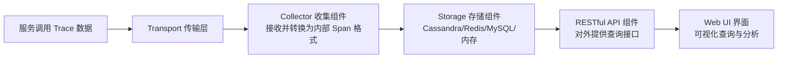

# 监控可视：如何整合 Spring Cloud Sleuth 与 Zipkin 实现可视化监控？

上一节，我们引入了 Spring Cloud Sleuth 框架来为微服务系统访问链路自动添加 TraceId 和 SpanId。而 Spring Cloud Sleuth 的强大之处实际上并不是体现在独立的服务跟踪和日志处理能力上，而是体现在框架整合能力上。业界关于日志聚合的主流实现方案包括 ELK 等，Spring Cloud Sleuth 能够整合这些日志聚合方案。但从功能层面讲，ELK 的作用主要体现在检索功能上，而不是对请求链路中各阶段时间延迟的关注。而像 Zipkin 这样的框架正是用来处理这种问题，Spring Cloud Sleuth 在框架整合上可以很方便地引入 Zipkin 等工具实现这一难题。本文就将介绍两者之间的集成方案，以及如何使用 Zipkin 实现可视化的服务调用链路。

## 集成 Spring Cloud Sleuth 与 Zipkin

在完成 Spring Cloud Sleuth 与 Zipkin 的整合之前，我们有必要先对 Zipkin 的基本结构做一些介绍。

### Zipkin 简介

Zipkin 是一个开源的分布式跟踪系统，每个服务向 Zipkin 报告运行时数据，Zipkin 会根据调用关系通过 Zipkin UI 对整个调用链路中的数据实现可视化。在结构上 Zipkin 包含几个核心的组件，如下图所示：



从上面的结构中，首先我们看到的是日志的收集组件 Collector，接收来自外部传输（Transport）的数据，将这些数据转换为 Zipkin 内部处理的 Span 格式，相当于兼顾数据收集和格式化的功能。这些收集的数据通过存储组件 Storage 进行存储，当前支持 Cassandra、Redis、HBase、MySQL、PostgreSQL、SQLite 等工具，默认存储在内存中。然后，所存储数据可以通过 RESTful API 对外暴露查询接口。更为有用的是，Zipkin 还提供了一套简单的 Web 界面，基于 API 组件的上层应用，可以方便而直观的查询和分析跟踪信息。

在运行过程中，Zipkin 能够给出服务调用链路的可视化管理功能，包括各服务之间的调用时序、依赖关系等，关于这些细节将在本文后续内容中全面展开。

在 Spring Cloud Sleuth 中整合 Zipkin 也非常简单，只需要启动 Zipkin 服务器并为各个微服务配置集成 Zipkin 服务即可完成准备工作。

Zipkin 服务器本身不需要开发人员构建，我们直接从 Zipkin 的官网上进行下载即可。下载下来的是一个可执行的 jar 包，如 zipkin-server-2.21.7-exec.jar。我们通过 java 命令直接启动这个 jar 包即可，如下所示：

```shell
java -jar zipkin-server-2.21.7-exec.jar
```

### 集成 Zipkin 服务器

为了集成 Zipkin 服务器，在各个微服务中，需要确保添加了对 Spring Cloud Sleuth 和 Zipkin 的 Maven 依赖，如下所示。

```xml
<dependency>
     <groupId>org.springframework.cloud</groupId>
     <artifactId>spring-cloud-starter-sleuth</artifactId>
</dependency>

<dependency>
     <groupId>org.springframework.cloud</groupId>
     <artifactId>spring-cloud-sleuth-zipkin</artifactId>
</dependency>
```

然后，在配置文件中添加对 Zipkin 服务器的引用即可，配置内容如下所示。

```yaml
spring:
  zipkin:
    baseUrl: http://localhost:9411
```

至此，Zipkin 环境已经搭建完毕，我们可以通过访问 [http://localhost:9411](http://localhost:9411) 来获取 Zipkin 所提供的所有可视化结果，接下来将演示如何使用 Zipkin 跟踪服务调用链路。

## 使用 Zipkin 可视化服务调用链路

Zipkin 可视化服务调用链路的构建包含三大维度：可视化服务依赖关系、可视化服务调用时序和可视化服务调用数据。接下来，我们分别围绕这三个维度介绍 Zipkin 的强大功能。

### 可视化服务依赖关系

依赖在某种程度上不可避免，但是过多地依赖势必会增加系统复杂性和降低代码维护性，从而成为团队开发的一种阻碍。在微服务系统中一般存在多个服务，服务需要管理相互之间的依赖关系。当系统规模越来越大后，各个业务服务之间的直接依赖和间接依赖关系就会变得十分复杂。我们需要通过一个简洁明了的可视化工具来查看当前服务链路中的依赖关系，Zipkin 就提供了这方面的支持。

在 SpringHealth 案例系统中，当我们通过访问 intervention-service 中的 HTTP 端点[http://localhost:5555/springhealth/intervention/interventions/springhealth_admin/device1](http://localhost:5555/springhealth/intervention/interventions/springhealth_admin/device1)时，通过 Zipkin 获取的服务调用依赖关系如下。可以看到在这个服务调用链路中，我们首先通过 zuulservice 访问 interventionservice，然后 interventionservice 又通过 zuulservice 分别访问 userservice 和 deviceservice，从而形成一次完整的业务调用。

那么这张图中的依赖关系是否正确呢？让我们回顾 intervention-service 中生成健康干预信息的代码结构：

```java
public Intervention generateIntervention(String userName, String deviceCode) {
        Intervention intervention = new Intervention();

//通过 UserServiceClient 获取远程 User 信息
        UserMapper user = getUser(userName);
        …

//通过 DeviceServiceClient 获取远程 Device 信息
        DeviceMapper device = getDevice(deviceCode);
        …

        return intervention;
}
```

可以看到在 intervention-service 的 generateIntervention 方法中会通过 UserServiceClient 和 DeviceServiceClient 分别访问 user-service 和 device-service。而在这些远程访问中，都将通过 zuul-service 进行路由转发，所以这与上图中的服务依赖关系完全一致。

### 可视化服务调用时序

可视化服务调用时序是 Zipkin 最重要的功能，对于服务监控而言，服务调用链数据收集、分析和管理的目的是发现服务调用过程的问题并采取相应的优化措施。Zipkin 可视化服务调用时序的主界面是一个面向查询的操作界面，其中我们需要关注服务名称和端点，因为服务调用链路中的所有服务都会出现在服务名称列表中，同时，针对每个服务，我们也可以选择自身感兴趣的端点信息。同时，我们也发现了多个用于灵活查询的过滤器，包括 TraceId、SpanName、时间访问、调用时长以及标签功能。

当然，我们最应该关注的是查询结果。针对某个服务，Zipkin 的查询结果展示了包含该服务的所有调用链路。现在，让我们关注于 user-service 中根据用户名获取用户信息的[http://localhost:5555/springhealth/user/users/username/](http://localhost:5555/springhealth/user/users/username/){userName} 端点，Zipkin 上的执行效果是一张展示各 Span 调用时序的明细图。当发起这个 HTTP 请求时，该请求会先到达 Zuul 网关，然后再通过路由转发到 userservice。通过观察服务之间的调用时序，我们在前面介绍的服务依赖关系的基础上给出了更为明确的服务调用关系。

上图中最重要的就是各个 Span 信息。一个服务调用链路被分解成若干个 Span，每个 Span 代表完整调用链路中的一个可以衡量的部分。我们通过可视化的界面，可以看到整个访问链路的整体时长以及各个 Span 所花费的时间。每个 Span 的时延都已经被量化，并通过背景颜色的深浅来表示时延的大小。注意到这里 userservice 出现了两个 Span，原因在于 userservice 在该请求中还访问了 OAuth2 的授权服务器。

### 可视化服务调用数据

点击任何一个感兴趣的 Span，就可以获取该 Span 对应的各项服务调用数据明细，其中包括本次调用中用于监控的最重要的元数据 TraceId 和 SpanId，以及代表各个关键事件的 Annotation 可视化长条。点击长条下的 “SHOW ALL ANNOTATIONS” 按钮，可以得到该 Span 对应的 cs、sr、ss 和 cr 这四个关键事件数据。对于这个 Span 而言，zuulservice 相当于是 userservice 的客户端，所以 zuulservice 触发了 cs 事件，然后通过 (17.160 – 2.102)ms 到达了 userservice，以此类推。从这些关键事件数据中可以得出一个结论，即该请求的整个服务响应时间主要取决于 userservice 自身的处理时间。

当然，针对这个 Span，也可以获取其对应的标签明细数据。可以看到这些数据包括 HTTP 请求相关的方法、路径等各项基础数据，也包括使用 Spring 构建 RESTful 风格调用时的 Controller 类以及端点信息。

最后，作为数据管理和展示的统一平台，Zipkin 还实现了更为低层的数据表现形式，也就是通过 JSON 数据提供对调用过程的详细描述。如下所示的就是一份示例 JSON 数据，描述的也是关键事件所应该具备的各项信息：

```text
[
     {
         "traceId":"81d66b6e43e71faa",
         "parentId":"6df220755223fb6e",
         "id":"abfed1d715052b08",
         "kind":"CLIENT",
         "name":"get",
         "timestamp":1602337321490104,
         "duration":8594,
         "localEndpoint":{
             "serviceName":"userservice",
             "ipv4":"192.168.247.1"
         },
         "tags":{
             "http.method":"GET",
             "http.path":"/userinfo"
         }
     },
     {
         "traceId":"81d66b6e43e71faa",
         "parentId":"81d66b6e43e71faa",
         "id":"6df220755223fb6e",
         "kind":"SERVER",
         "name":"get /users/username/{username}",
         "timestamp":1602337321489229,
         "duration":135785,
         "localEndpoint":{
             "serviceName":"userservice",
             "ipv4":"192.168.247.1"
         },
         "remoteEndpoint":{
             "ipv6":"::1"
         },
         "tags":{
             "http.method":"GET",
             "http.path":"/users/username/springhealth_user1",
             "mvc.controller.class":"UserController",
             "mvc.controller.method":"getUserByUserName"
         },
         "shared":true
     },
    // 其他 Span 信息省略
 ]
```

在介绍 Zipkin 的基本结构时，我们提到 Zipkin 还提供了专门的 RESTful API 获取一次服务调用链路中所有 Span 对应的 JSON 数据，例如本例中的 SpanName 为“get /users/username/{username}”，所以对应的 API 即为 localhost:9411/zipkin/?serviceName=userservice&spanName=get+%2Fusers%2Fusername%2F{username}，我们可以根据需要获取所需的各项信息。你可以自己多进行尝试。

## 小结

承接上一节内容，今天的内容重点关注如何实现监控数据的可视化管理。我们引入了 Zipkin 这款优秀的开源框架，并完成与 Spring Cloud Sleuth 的无缝集成。基于 Zipkin，我们可以完成可视化服务依赖关系、可视化服务调用时序和可视化服务调用数据等三大维度的可视化监控功能，本文对如何实现这些功能进行了详细的展开。

这里给你留一道思考题：Zipkin 中所提供的可视化功能主要包括哪几个维度？

## 版本差异（Spring Cloud 旧版 → 2025.x）

| 组件 | 旧版（本文编写时） | 当前（Spring Cloud 2025.x / Boot 3.5.x） |
|------|-------------------|------------------------------------------|
| 服务注册 | Eureka 1.x（Eureka 2.x 已终止开发） | Nacos 2.x / Consul（Eureka 1.x 仍随 Spring Cloud Netflix 维护） |
| 负载均衡 | Ribbon（已停止维护） | Spring Cloud LoadBalancer |
| 网关 | Zuul 1.x（已停止维护） | Spring Cloud Gateway（基于 WebFlux） |
| 熔断 | Hystrix（已停止维护） | Resilience4j / Sentinel |
| 配置中心 | Spring Cloud Config | Nacos Config / Apollo |
| 版本对应 | Hoxton/2020.x + Boot 2.x + JDK 8 | 2025.x + Boot 3.5.x + JDK 17+ |

> 本文为 Spring Cloud 旧版课程（Hoxton/2020.x 时代）。Hystrix、Ribbon、Zuul 1.x、Eureka 已停止维护，新项目请使用 Spring Cloud Gateway + LoadBalancer + Resilience4j（或 Alibaba 系 Nacos/Sentinel/Seata），并升级到 Spring Cloud 2025.x + Spring Boot 3.5.x。
