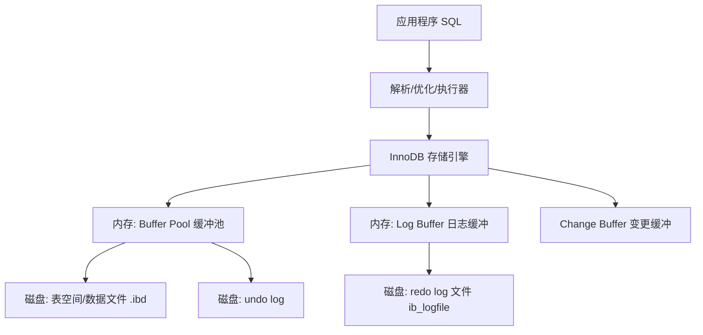

# InnoDB 存储引擎架构与缓冲池

MySQL 最常用的存储引擎是 **InnoDB**。理解 InnoDB 的底层架构——尤其是**缓冲池（Buffer Pool）**、**页（Page）**、**日志体系（redo/undo）** 和**磁盘文件体系**——是理解 MySQL 为什么"快"、为什么能"崩溃恢复"、以及如何调优的根基。本文从存储引擎视角系统讲解这些核心机制。

> 说明：事务隔离与 MVCC、redo/undo 的事务视角见「[MVCC 与事务隔离级别](05-MVCC与事务隔离级别)」；B+ 树索引原理见「[索引原理](03-索引与事务排障)」。本文聚焦**存储引擎的内存与磁盘架构**。

## 一、InnoDB 整体架构

InnoDB 架构可概括为"**内存 + 磁盘 + 日志**"三部分协同工作：



- **Buffer Pool（缓冲池）**：内存中的数据页缓存，减少磁盘 I/O。
- **Log Buffer（日志缓冲）**：redo log 的内存缓冲，批量刷盘。
- **表空间（Tablespace）**：存储表数据与索引的磁盘文件（`.ibd`）。
- **redo log / undo log**：保证崩溃恢复（持久性）与事务回滚（原子性）。

InnoDB 一切设计都以**减少磁盘随机 I/O** 为核心目标。

## 二、Buffer Pool 缓冲池

### 2.1 缓冲池的作用

数据库的瓶颈在磁盘 I/O。InnoDB 把**数据页缓存到内存（Buffer Pool）**，读取时优先命中内存，写入时先改内存（脏页），由后台线程**异步刷盘**。这样绝大部分操作都发生在内存中，性能大幅提升。

**配置**：`innodb_buffer_pool_size`（MySQL 8 通常建议设为物理内存的 60%~80%）。

### 2.2 缓冲池中的页类型

Buffer Pool 按 **16KB 的页（Page）** 组织，存放多种页：

- **索引页（Index Page）**：B+ 树的叶子/非叶子节点。
- **数据页（Data Page）**：实际行数据。
- **undo 页**：事务回滚段。
- **自适应哈希索引页**：加速等值查询。
- **change buffer（插入缓冲）**：辅助索引的变更缓冲。

### 2.3 LRU 淘汰机制

Buffer Pool 空间有限，需要**淘汰不常用的页**。InnoDB 使用 **LRU（最近最少使用）算法**，并针对数据库场景做了**冷热分离优化**：

```
Buffer Pool LRU 被分为两部分：
+-------------------------+--------------------------+
|     young 区（热数据）     |     old 区（冷数据）       |
|   默认占 5/8 (约63%)      |   默认占 3/8 (约37%)      |
+-------------------------+--------------------------+
```

- **新读入的页先放到 old 区头部**：避免一次全表扫描就把热数据全部挤出（防止"预读污染"）。
- 只有页在 old 区停留超过 `innodb_old_blocks_time`（默认 1000ms）后再次被访问，才会**晋升到 young 区**——防止短时间内频繁访问但随后不再使用的页（如临时表）霸占热区。
- young 区再按 LRU 淘汰。

### 2.4 预读（Read Ahead）

InnoDB 有**顺序预读**和**随机预读**：当检测到大量顺序访问相邻页时，会**提前把一批页读入 Buffer Pool**，减少随机 I/O 等待。

### 2.5 脏页与刷盘

- 被修改但尚未写回磁盘的页称为**脏页（dirty page）**。
- 后台线程（`page cleaner`）通过 **checkpoint（检查点）机制**把脏页刷盘。
- 刷盘时机：Checkpoint 推进、`innodb_max_dirty_pages_pct`（脏页比例阈值）、redo log 写满时强制刷盘。

**为什么不是每次写都直接落盘**？因为直接落盘是**随机 I/O**，极慢。先改内存 + 记录 redo log（顺序写），再由后台批量刷盘（尽量顺序），是"**用内存换随机 I/O，用顺序日志换随机落盘**"的核心思想。

## 三、页（Page）与行结构

### 3.1 数据页结构

InnoDB 每个数据页 **16KB**，页内结构如下：

```text
+---------------------------+
| File Header（38字节）       | 记录页的校验和、页号、上/下一页指针（双向链表）
+---------------------------+
| Page Header（56字节）       | 记录页的状态、记录数、槽位信息
+---------------------------+
| Infimum + Supremum 记录     | 页内最小/最大伪记录（排序边界）
+---------------------------+
| 用户记录（User Records）     | 实际行数据（按主键有序存放）
+---------------------------+
| 自由空间（Free Space）       | 剩余可分配空间
+---------------------------+
| Page Directory（页目录）    | 槽位目录，加速页内二分查找
+---------------------------+
| File Trailer（8字节）        | 页尾部校验和（与头部对比，判断页是否损坏）
+---------------------------+
```

- **页之间**通过 File Header 的"上一页/下一页"指针构成**双向链表**。
- **页目录 + 槽位**让页内查询可以**二分查找**，而非全页扫描。
- **File Trailer** 与 File Header 的校验和配合，用于检测**页是否完整写入**（防止掉电导致半页损坏）。

### 3.2 记录结构（行格式）

InnoDB 行格式（如 `COMPACT`）每条记录包含**额外信息**（变长字段长度列表、NULL 标志位、记录头）和**真实数据**，记录通过**下一行记录的偏移**构成单向链表。

### 3.3 B+ 树如何用页

- 聚簇索引的**叶子节点**就是存行数据的数据页，**非叶子节点**存主键 + 下一页指针。
- 索引树的每个节点对应一个页，从根到叶逐层查页，每层一次内存/磁盘访问。
- **页分裂**：页满时插入新记录会触发页分裂，影响性能（这也是为什么推荐**自增主键**，减少随机分裂）。

## 四、redo log 与 undo log

> 事务视角的完整讲解见「MVCC 与事务隔离级别」篇，这里从存储引擎角度说明。

### 4.1 redo log（重做日志）

- **作用**：保证**持久性（D）**。记录"页的物理修改"，用于崩溃后重放恢复。
- **顺序写**：redo log 是**追加顺序写**，比随机写快得多，因此"先写日志再改内存"成本低。
- **WAL（Write-Ahead Logging）**：事务提交前，先把 redo log 刷盘（`innodb_flush_log_at_trx_commit=1` 时），数据页可稍后刷盘。
- 存储于 `ib_logfile`，通过 **checkpoint** 循环覆盖。

### 4.2 undo log（回滚日志）

- **作用**：保证**原子性（A）**与 MVCC。记录"怎么改回去"，用于事务回滚和版本链。
- 存储于回滚段（rollback segment），可存放在独立表空间 `ibdata1` 或 undo 表空间。

### 4.3 崩溃恢复流程

```text
1. 启动时扫描 redo log
2. 对已提交但未刷盘的事务，用 redo log 重放（redo 恢复）
3. 对未提交的事务，用 undo log 回滚（undo 回滚）
4. 完成恢复后对外开放
```

## 五、double write（双写）

**解决的问题**：InnoDB 数据页 16KB，而磁盘扇区通常 512B~4KB。**刷盘时如果发生掉电/宕机，可能只写了一部分页**（partial page），导致**页损坏**，且 redo log 无法修复（redo 记录的是对原页的修改，页损坏后无法重放）。

**双写方案**：在 `dblwr` 文件中为脏页**先写一份副本**，再写实际数据文件。若数据页损坏，可用双写副本恢复。

```text
写脏页前：
1. 先顺序写入 doublewrite buffer（内存）
2. 批量刷到系统表空间的双写文件 dblwr（磁盘，顺序写）
3. 再写回实际的数据页文件
若第3步部分失败 -> 从双写文件副本恢复
```

> 双写本质是用**额外的顺序写**换取**随机写的数据完整性**。SSD 时代部分场景会考虑关闭双写以提升性能，但默认开启保证安全。

## 六、change buffer（变更缓冲）

**解决的问题**：辅助索引（二级索引）不是按主键顺序的，更新辅助索引时，若目标页不在 Buffer Pool，直接读盘再改是**随机 I/O**，很慢。

**change buffer 策略**：对二级索引的**插入/删除/更新**，如果目标页不在缓冲池，**先记录到 change buffer（内存）**，等目标页被读到 Buffer Pool 时，再合并（merge）应用。这样避免了频繁的随机 I/O。

```text
更新二级索引:
1. 目标页在 Buffer Pool? -> 直接改
2. 不在 -> 先写入 change buffer（内存/落盘）
3. 后续读到该页 -> merge 合并变更
```

**注意**：
- `innodb_change_buffering` 可配置（`all`/`inserts`/`none` 等）。
- **写多读少的场景**效果最佳；如果二级索引频繁被读到，change buffer 合并成本可能反而高。

## 七、自适应哈希索引（AHI）

InnoDB 会**根据频繁访问的查询模式**，在 B+ 树上自动为热点页建立**哈希索引**，加速等值查询（`O(1)`）。它不需要人工维护，是"自适应"的，且只存于内存，重启后重建。

## 八、InnoDB 磁盘文件体系

```text
数据目录
├── ibdata1            # 系统表空间（数据字典、默认 undo）
├── ib_logfile0/1      # redo log 文件
├── undo_001/undo_002  # undo 表空间（MySQL 8 独立 undo）
└── 数据库名/
    └── 表名.ibd       # 每表的独立表空间（数据 + 索引）
```

**表空间（Tablespace）**是逻辑上的存储容器，分为**系统表空间**、**独立表空间（每表一个 .ibd，默认）**、**通用表空间**。表空间内部按"**段（Segment）→ 区（Extent，1MB=64个页）→ 页（Page，16KB）→ 行（Row）**"四级组织。

## 九、性能调优要点

| 参数 | 作用 | 建议 |
|------|------|------|
| `innodb_buffer_pool_size` | 缓冲池大小 | 物理内存 60%~80% |
| `innodb_old_blocks_time` | 冷区页晋升热区的驻留时间 | 默认 1000ms，防预读污染 |
| `innodb_flush_log_at_trx_commit` | redo 刷盘策略 | 高可靠=1，高性能=0/2 |
| `innodb_max_dirty_pages_pct` | 脏页比例阈值 | 触发刷盘 |
| `innodb_change_buffering` | 变更缓冲范围 | 写多读少可开 |
| `innodb_buffer_pool_instances` | 缓冲池实例数 | 提升并发减少锁竞争 |

## 小结

- InnoDB = **内存（Buffer Pool）+ 磁盘（表空间）+ 日志（redo/undo）** 的协同架构。
- **Buffer Pool** 用 LRU（冷热分离）+ 预读缓存数据页，减少随机 I/O；脏页由 checkpoint 异步刷盘。
- **页（16KB）** 是数据读写的最小单位，页内用目录二分查找，页间用双向链表。
- **redo log** 保证持久性（WAL），**undo log** 保证原子性与 MVCC，二者协同实现崩溃恢复。
- **double write** 防页损坏，**change buffer** 优化二级索引随机写，**自适应哈希**加速热点等值查询。
- 理解这套架构，才能真正读懂 MySQL 的慢查询与调优。

## 版本差异(MySQL 5.7 → 8.0/8.4)

| 特性 | 旧版（本文编写时，MySQL 5.7） | 当前（MySQL 8.0/8.4 LTS） |
|------|-----------------------------|--------------------------|
| 默认字符集 | utf8（需显式配置 utf8mb4） | utf8mb4（MySQL 8.0 起默认） |
| 索引 | 普通 B+Tree | 降序索引、隐藏索引、函数索引（8.0+） |
| SQL 能力 | 常规查询 | 递归 CTE、窗口函数（8.0+） |
| 版本策略 | 5.7 | 8.0（主流）/ 8.4 LTS / 9.x（创新版） |
| Java 驱动 | mysql-connector-java 5.x/8.0 | mysql-connector-j 8.x/9.x |

> 本文基于 MySQL 5.7 编写，核心概念（索引、事务、锁、MVCC、InnoDB）在 8.0/8.4 中依然适用；8.0 的默认字符集、隐藏索引与 SQL 增强（CTE/窗口函数）是升级后的主要差异。
