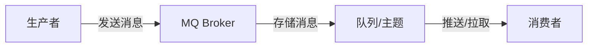

# 消息队列基础与可靠性设计

## 概念与背景

消息队列(Message Queue,简称 MQ)是一种通过消息中间件在系统之间传递数据的通信方式。它常用于解耦、异步处理、削峰填谷和事件驱动架构。

真正要理解的,不只是"有生产者和消费者",而是:

- **为什么要引入 MQ**
- **引入后系统获得了什么**
- **同时又多了哪些可靠性问题**

### MQ 的本质

从架构角度看,MQ 是一个**异步通信中间件**,它将同步调用转变为异步消息传递:



从数据角度看,MQ 是一个**缓冲区**,它暂时存储消息,等待消费者处理。

从系统角度看,MQ 是一个**解耦器**,它让生产者和消费者不必直接依赖。

## MQ 解决什么问题

消息队列最常见的价值包括:

### 1. 系统解耦

**传统同步调用的问题:**

```
订单服务 → 库存服务
         → 积分服务
         → 短信服务
         → 通知服务
```

- 订单服务需要知道所有下游服务的接口
- 任何下游服务变更都需要修改订单服务
- 下游服务故障会影响订单服务

**使用 MQ 解耦后:**

```
订单服务 → MQ → 库存服务
              → 积分服务
              → 短信服务
              → 通知服务
```

- 订单服务只需要知道 MQ,不需要知道下游
- 下游服务可以随时增减,订单服务无需修改
- 下游服务故障不影响订单服务

**代码示例:**

```java
// 传统同步调用 - 强耦合
public void createOrder(Order order) {
    orderDao.save(order);           // 保存订单
    inventoryService.deduct(order); // 调用库存服务
    pointsService.grant(order);     // 调用积分服务
    smsService.send(order);         // 调用短信服务
    // 任何一个服务失败,整个订单创建失败
}

// 使用 MQ 解耦
public void createOrder(Order order) {
    orderDao.save(order);
    mqTemplate.send("order.created", new OrderCreatedEvent(order));
    // 只发送消息,不关心下游如何处理
}
```

### 2. 异步处理

**同步处理的问题:**

假设下单后需要:
- 订单落库: 50ms
- 发短信: 200ms
- 发优惠券: 100ms
- 记积分: 100ms

总耗时 = 50 + 200 + 100 + 100 = **450ms**

**异步处理优化:**

- 订单落库: 50ms
- 发送消息到 MQ: 5ms

总耗时 = 50 + 5 = **55ms** (提升 8 倍)

**代码示例:**

```java
// 同步处理
public Result createOrderSync(Order order) {
    long start = System.currentTimeMillis();
    
    orderService.save(order);           // 50ms
    smsService.sendSms(order);          // 200ms
    couponService.grantCoupon(order);   // 100ms
    pointsService.grantPoints(order);   // 100ms
    
    long cost = System.currentTimeMillis() - start;
    log.info("订单创建耗时: {}ms", cost); // 约 450ms
    return Result.success();
}

// 异步处理
public Result createOrderAsync(Order order) {
    long start = System.currentTimeMillis();
    
    orderService.save(order);  // 50ms
    mqTemplate.send("order.topic", order);  // 5ms
    
    long cost = System.currentTimeMillis() - start;
    log.info("订单创建耗时: {}ms", cost); // 约 55ms
    return Result.success();
}
```

### 3. 削峰填谷

**场景:秒杀活动**

```
秒杀开始瞬间 → 10万请求/秒
数据库承受能力 → 1000请求/秒
```

直接访问数据库会导致:
- 数据库连接池耗尽
- 数据库响应超时
- 系统崩溃

**使用 MQ 削峰:**

```
秒杀请求 → MQ(队列) → 消费者 → 数据库
 10万/秒   缓冲      1000/秒   正常处理
```

**代码示例:**

```java
// 秒杀接口 - 接收请求
@PostMapping("/seckill")
public Result seckill(@RequestBody SeckillRequest request) {
    // 快速验证
    if (!seckillService.checkToken(request.getToken())) {
        return Result.fail("无效请求");
    }
    
    // 发送到 MQ,立即返回
    mqTemplate.send("seckill.queue", request);
    return Result.success("排队中,请稍后查询结果");
}

// 秒杀消费者 - 限速处理
@RabbitListener(queues = "seckill.queue", concurrency = "1-1")
public void handleSeckill(SeckillRequest request) {
    // 消费者并发度控制为 1,保证数据库不被打垮
    seckillService.processSeckill(request);
}
```

### 4. 事件驱动架构

**场景:订单支付成功后需要通知多个系统**

传统方式:订单服务主动调用各系统

```java
// 紧耦合的方式
public void onPaymentSuccess(String orderId) {
    orderService.updateStatus(orderId);
    inventoryService.deduct(orderId);
    pointsService.grant(orderId);
    couponService.use(orderId);
    notificationService.send(orderId);
    // 新增系统需要修改此处代码
}
```

**事件驱动方式:**

```java
// 发布事件
public void onPaymentSuccess(String orderId) {
    PaymentSuccessEvent event = new PaymentSuccessEvent(orderId);
    eventPublisher.publish("payment.success", event);
    // 不关心谁订阅了这个事件
}

// 各系统独立订阅(伪代码:示意多个订阅方各自监听同一事件,各自维护独立队列)
@EventListener // 实际使用时按 MQ 客户端 API 声明订阅,如 @RabbitListener(queues = "inventory.queue")
public void onInventoryPaymentSuccess(PaymentSuccessEvent event) {
    // 库存系统处理
}

@EventListener // 实际使用时按 MQ 客户端 API 声明订阅,如 @RabbitListener(queues = "points.queue")
public void onPointsPaymentSuccess(PaymentSuccessEvent event) {
    // 积分系统处理
}
```

### MQ 价值对比表

| 场景 | 传统方式的问题 | MQ 解决方案 | 收益 |
|------|--------------|------------|------|
| 系统解耦 | 上下游强依赖 | 通过消息解耦 | 系统独立演进 |
| 异步处理 | 同步等待,响应慢 | 异步消息,快速返回 | 响应时间缩短 80%+ |
| 削峰填谷 | 流量洪峰打垮系统 | MQ 缓冲,平滑处理 | 系统稳定性提升 |
| 事件驱动 | 需要主动通知 | 发布订阅模式 | 新增订阅方无需修改代码 |

## 一个最基本的 MQ 链路

一个最基本的 MQ 链路通常包含四个角色:

```
生产者 → Broker → 队列/主题 → 消费者
```

### 核心角色详解

#### 1. 生产者(Producer)

**职责:**
- 构建消息(Message)
- 连接到 Broker
- 发送消息到指定队列或主题

**代码示例:**

```java
@Service
public class OrderProducer {
    @Autowired
    private RabbitTemplate rabbitTemplate;
    
    public void sendOrderCreatedMessage(Order order) {
        // 构建消息
        OrderCreatedEvent event = new OrderCreatedEvent(
            order.getId(),
            order.getUserId(),
            order.getAmount()
        );
        
        // 发送消息
        rabbitTemplate.convertAndSend(
            "order.exchange",    // 交换机
            "order.created",     // 路由键
            event                // 消息内容
        );
        
        log.info("订单创建消息已发送: orderId={}", order.getId());
    }
}
```

#### 2. Broker(消息代理)

**职责:**
- 接收生产者的消息
- 存储消息(内存或磁盘)
- 将消息投递给消费者
- 管理队列、主题、订阅关系

**主流 Broker 对比:**

| 特性 | RabbitMQ | Kafka | RocketMQ |
|------|----------|-------|----------|
| 开发语言 | Erlang | Scala/Java | Java |
| 单机吞吐量 | 万级 | 十万级 | 十万级 |
| 消息延迟 | 微秒级 | 毫秒级 | 毫秒级 |
| 可用性 | 高(主从) | 非常高(分布式) | 非常高(分布式) |
| 消息可靠性 | 高 | 高(配置后) | 高 |
| 功能特性 | 路由灵活 | 日志型,流处理 | 事务消息,顺序消息 |
| 适用场景 | 业务系统 | 日志采集,大数据 | 电商,金融 |

#### 3. 消费者(Consumer)

**职责:**
- 连接到 Broker
- 订阅队列或主题
- 接收并处理消息
- 发送确认(ACK)

**代码示例:**

```java
@Service
public class OrderConsumer {
    @Autowired
    private OrderService orderService;
    
    @RabbitListener(queues = "order.queue")
    public void handleOrderCreated(OrderCreatedEvent event) {
        try {
            // 处理消息
            orderService.processOrderCreated(event);
            
            // 消息处理成功,自动 ACK(RabbitMQ 默认)
            log.info("订单创建消息处理成功: orderId={}", event.getOrderId());
            
        } catch (Exception e) {
            log.error("订单创建消息处理失败: orderId={}", event.getOrderId(), e);
            // 抛出异常,消息重新入队或进入死信队列
            throw new AmqpRejectAndDontRequeueException("处理失败", e);
        }
    }
}
```

#### 4. 队列(Queue)与主题(Topic)

**队列(Queue) - 点对点模式:**
- 一条消息只能被一个消费者消费
- 消费者之间竞争关系

```
队列: order.queue
消费者A ← 消息1
消费者B ← 消息2
消费者C ← 消息3
```

**主题(Topic) - 发布订阅模式:**
- 一条消息可以被多个消费者消费
- 每个消费者都收到完整消息

```
主题: order.topic
消费者A ← 消息1, 消息2, 消息3
消费者B ← 消息1, 消息2, 消息3
消费者C ← 消息1, 消息2, 消息3
```

**选择建议:**

| 场景 | 推荐模式 | 原因 |
|------|---------|------|
| 任务分发 | Queue | 多个消费者分担任务,提高吞吐 |
| 事件通知 | Topic | 多个系统都需要收到同一事件 |
| 日志采集 | Topic | 多个消费者分别处理(存储、分析、告警) |

## 为什么用了 MQ 也不代表系统就稳了

很多人以为引入 MQ 后系统就天然高可用、天然解耦,但真实情况是:

- √ 同步耦合确实减少了
- × 但消息可靠性、一致性、重复消费、积压问题会随之出现

### MQ 引入的新问题

```
                    ┌─────────────┐
                    │  生产者问题  │
                    │ - 发送失败   │
                    │ - 消息丢失   │
                    └─────────────┘
                           ↓
┌──────────────┐    ┌─────────────┐    ┌──────────────┐
│ 系统复杂度上升 │←→ │  Broker问题  │ ←→│ 运维成本增加  │
│ - 架构更复杂  │    │ - 宕机丢失   │    │ - 需要监控   │
│ - 排障更困难  │    │ - 磁盘故障   │    │ - 需要备份   │
└──────────────┘    └─────────────┘    └──────────────┘
                           ↓
                    ┌─────────────┐
                    │  消费者问题  │
                    │ - 重复消费   │
                    │ - 消息积压   │
                    └─────────────┘
```

所以 MQ 设计重点已经从"能不能发消息"转向:

- **会不会丢?** (消息可靠性)
- **会不会重复?** (幂等性)
- **会不会积压?** (性能与监控)

## 消息会不会丢?

消息丢失通常要从三段来看:

### 1. 生产者发送时会不会丢

**问题场景:**
- 网络超时
- Broker 宕机
- 消息格式错误

**解决方案:**

```java
// 方案1: 同步确认
public void sendWithConfirm(Message message) {
    try {
        rabbitTemplate.convertAndSend("exchange", "routingKey", message);
        // 同步等待确认
        rabbitTemplate.waitForConfirms(5000);
        log.info("消息发送成功");
    } catch (Exception e) {
        log.error("消息发送失败", e);
        // 重试或记录到数据库
        messageStore.saveFailedMessage(message);
    }
}

// 方案2: 异步确认
public void sendWithAsyncConfirm(Message message) {
    rabbitTemplate.setConfirmCallback((correlationData, ack, cause) -> {
        if (ack) {
            log.info("消息确认成功");
        } else {
            log.error("消息确认失败: {}", cause);
            // 重试或补偿
            retryService.retry(message);
        }
    });
    
    rabbitTemplate.convertAndSend("exchange", "routingKey", message);
}

// 方案3: 事务消息(RocketMQ)
public void sendTransactionMessage(Message message) {
    // 发送半消息
    TransactionSendResult result = rocketMQTemplate.sendMessageInTransaction(
        "order.group",
        "order.topic",
        MessageBuilder.withPayload(message).build(),
        null
    );
    
    if (result.getSendStatus() == SendStatus.SEND_OK) {
        log.info("事务消息发送成功");
    }
}

@RocketMQTransactionListener
class OrderTransactionListener implements RocketMQLocalTransactionListener {
    @Override
    public RocketMQLocalTransactionState executeLocalTransaction(Message msg, Object arg) {
        // 执行本地事务
        try {
            orderService.createOrder((Order) msg.getPayload());
            return RocketMQLocalTransactionState.COMMIT;
        } catch (Exception e) {
            return RocketMQLocalTransactionState.ROLLBACK;
        }
    }
    
    @Override
    public RocketMQLocalTransactionState checkLocalTransaction(Message msg) {
        // 检查本地事务状态
        Order order = (Order) msg.getPayload();
        if (orderService.exists(order.getId())) {
            return RocketMQLocalTransactionState.COMMIT;
        }
        return RocketMQLocalTransactionState.ROLLBACK;
    }
}
```

### 2. Broker 存储时会不会丢

**问题场景:**
- Broker 宕机,内存消息丢失
- 磁盘故障,持久化消息丢失
- 主从切换,数据不一致

**解决方案:**

```java
// RabbitMQ: 开启消息持久化
@Bean
public Queue orderQueue() {
    return QueueBuilder.durable("order.queue")  // 持久化队列
        .withArgument("x-message-ttl", 86400000)  // 消息过期时间
        .build();
}

// 发送持久化消息
public void sendPersistentMessage(Order order) {
    Message message = MessageBuilder
        .withBody(JSON.toJSONString(order).getBytes())
        .setDeliveryMode(MessageDeliveryMode.PERSISTENT)  // 持久化消息
        .build();
    
    rabbitTemplate.send("order.exchange", "order.created", message);
}

// Kafka: 配置副本因子
// server.properties
// default.replication.factor=3
// min.insync.replicas=2

// RocketMQ: 配置同步刷盘
// broker.conf
// flushDiskType=SYNC_FLUSH
// brokerRole=SYNC_MASTER
```

**持久化策略对比:**

| 策略 | 性能 | 可靠性 | 适用场景 |
|------|------|--------|---------|
| 内存存储 | 最高 | 最低 | 允许少量丢失 |
| 异步刷盘 | 高 | 中 | 一般业务 |
| 同步刷盘 | 低 | 高 | 金融交易 |
| 多副本同步 | 最低 | 最高 | 核心交易 |

### 3. 消费者处理完成前会不会丢

**问题场景:**
- 消费者收到消息,处理失败
- 消费者宕机,消息未确认
- 自动确认后业务失败

**错误示例:**

```java
// × 错误: 自动确认后业务失败
@RabbitListener(queues = "order.queue")
public void handleOrder(Order order) {
    // 自动 ACK(RabbitMQ 默认)
    // 如果下面业务失败,消息已经丢失
    orderService.process(order);
}
```

**正确示例:**

```java
// √ 正确: 手动确认
@RabbitListener(queues = "order.queue", ackMode = "MANUAL")
public void handleOrder(Order order, Channel channel, 
                        @Header(AmqpHeaders.DELIVERY_TAG) long tag) {
    try {
        // 1. 先执行业务逻辑
        orderService.process(order);
        
        // 2. 业务成功后再 ACK
        channel.basicAck(tag, false);
        log.info("消息处理成功: orderId={}", order.getId());
        
    } catch (Exception e) {
        log.error("消息处理失败: orderId={}", order.getId(), e);
        
        try {
            // 3. 业务失败,NACK 并重新入队
            channel.basicNack(tag, false, true);
        } catch (IOException ex) {
            log.error("NACK 失败", ex);
        }
    }
}
```

### 消息可靠性解决方案对比

| 环节 | 问题 | 解决方案 | 性能影响 |
|------|------|---------|---------|
| 生产者 | 发送失败 | 确认机制、重试 | 中 |
| Broker | 宕机丢失 | 持久化、多副本 | 高 |
| 消费者 | 处理失败 | 手动 ACK、重试 | 低 |

**推荐配置:**

```yaml
# RabbitMQ 配置
spring:
  rabbitmq:
    publisher-confirm-type: correlated  # 开启确认机制
    publisher-returns: true              # 开启退回机制
    template:
      mandatory: true                    # 路由失败返回生产者
    listener:
      simple:
        acknowledge-mode: manual         # 手动确认
        prefetch: 1                      # 预取数量
```

## 消息会不会重复?

现实里"至少一次"(At Least Once)通常比"绝不重复"(Exactly Once)更容易做到,所以业务层通常必须做幂等。

### 为什么会重复?

```
生产者                    Broker                   消费者
  │                         │                        │
  ├──── 发送消息 ──────────>│                        │
  │                         ├── 投递消息 ───────────>│
  │                         │                        ├─ 处理成功
  │                         │<─── ACK ───────────────┤
  │                         │                        │
  │<─── 确认超时 ───────────┤                        │
  │                         │                        │
  ├─── 重新发送 ───────────>│                        │
  │                         ├── 投递消息 ───────────>│
  │                         │                        ├─ 再次处理(重复!)
  │                         │                        │
```

**常见原因:**

1. **生产者重试:** 网络超时,生产者重发
2. **消费者 ACK 失败:** 消费成功,但 ACK 丢失
3. **Broker 重启:** 未持久化的 ACK 丢失
4. **消费者重启:** 消息已处理,但未提交 ACK

### 幂等性设计

#### 1. 业务唯一键去重

```java
@Service
public class OrderConsumer {
    @Autowired
    private StringRedisTemplate redisTemplate;
    
    @RabbitListener(queues = "order.queue")
    public void handleOrderCreated(OrderCreatedEvent event) {
        // 使用业务唯一键(订单ID)
        String bizKey = "order:created:" + event.getOrderId();
        
        // SETNX: 如果 key 不存在则设置,返回 true;如果已存在,返回 false
        Boolean isFirst = redisTemplate.opsForValue()
            .setIfAbsent(bizKey, "1", Duration.ofHours(24));
        
        if (Boolean.FALSE.equals(isFirst)) {
            log.warn("重复消息,跳过: orderId={}", event.getOrderId());
            return;  // 直接返回,消息已被处理
        }
        
        // 执行业务逻辑
        orderService.processOrderCreated(event);
    }
}
```

#### 2. 数据库唯一约束

```sql
-- 创建订单表,订单号唯一
CREATE TABLE `t_order` (
  `id` bigint NOT NULL AUTO_INCREMENT,
  `order_no` varchar(64) NOT NULL COMMENT '订单号(唯一)',
  `user_id` bigint NOT NULL,
  `amount` decimal(10,2) NOT NULL,
  `status` varchar(20) NOT NULL,
  PRIMARY KEY (`id`),
  UNIQUE KEY `uk_order_no` (`order_no`)  -- 唯一约束
) ENGINE=InnoDB;
```

```java
@Service
public class OrderService {
    @Transactional
    public void createOrder(OrderCreatedEvent event) {
        Order order = new Order();
        order.setOrderNo(event.getOrderNo());
        order.setUserId(event.getUserId());
        order.setAmount(event.getAmount());
        
        try {
            orderMapper.insert(order);
        } catch (DuplicateKeyException e) {
            // 唯一约束冲突,说明订单已存在,直接返回
            log.warn("订单已存在,跳过: orderNo={}", event.getOrderNo());
            return;
        }
    }
}
```

#### 3. Redis 幂等标记

```java
@Service
public class PaymentConsumer {
    @Autowired
    private StringRedisTemplate redisTemplate;
    @Autowired
    private PaymentService paymentService;
    
    public void handlePayment(PaymentEvent event) {
        String key = "payment:idempotent:" + event.getPaymentId();
        String requestId = UUID.randomUUID().toString();
        
        // 1. 尝试获取幂等标记
        Boolean success = redisTemplate.opsForValue()
            .setIfAbsent(key, requestId, Duration.ofDays(7));
        
        if (Boolean.FALSE.equals(success)) {
            log.warn("重复支付请求: paymentId={}", event.getPaymentId());
            return;
        }
        
        try {
            // 2. 执行业务逻辑
            paymentService.processPayment(event);
            
        } catch (Exception e) {
            // 3. 业务失败,删除幂等标记,允许重试
            redisTemplate.delete(key);
            throw e;
        }
    }
}
```

#### 4. 状态机约束

```java
@Service
public class OrderService {
    // 订单状态流转: CREATED → PAID → SHIPPED → COMPLETED
    public boolean markPaid(Long orderId) {
        Order order = orderMapper.selectById(orderId);
        
        // 只有 CREATED 状态才能变为 PAID
        if (order.getStatus() != OrderStatus.CREATED) {
            log.warn("订单状态不允许支付: orderId={}, status={}", 
                     orderId, order.getStatus());
            return false;  // 状态已流转,幂等返回
        }
        
        // 更新状态(使用乐观锁)
        int rows = orderMapper.updateStatus(
            orderId, 
            OrderStatus.PAID, 
            OrderStatus.CREATED  // 期望原状态
        );
        
        return rows > 0;
    }
}

// Mapper
@Update("UPDATE t_order SET status = #{newStatus} " +
        "WHERE id = #{orderId} AND status = #{oldStatus}")
int updateStatus(@Param("orderId") Long orderId,
                 @Param("newStatus") OrderStatus newStatus,
                 @Param("oldStatus") OrderStatus oldStatus);
```

### 幂等性方案对比

| 方案 | 优点 | 缺点 | 适用场景 |
|------|------|------|---------|
| 业务唯一键 | 简单,性能好 | 需要业务有唯一键 | 订单号、流水号 |
| 数据库唯一约束 | 强一致性 | 影响性能,需要表设计 | 核心业务 |
| Redis 标记 | 高性能,支持过期 | 需要考虑 Redis 故障 | 高并发场景 |
| 状态机 | 业务语义清晰 | 状态设计复杂 | 订单、工单等 |

**最佳实践:**

```java
// 组合方案: Redis 快速去重 + 数据库兜底
@Service
public class OrderConsumer {
    @Autowired
    private StringRedisTemplate redisTemplate;
    @Autowired
    private OrderService orderService;
    
    @RabbitListener(queues = "order.queue")
    public void handleOrderCreated(OrderCreatedEvent event) {
        // 1. Redis 快速去重(第一道防线)
        String key = "order:dedup:" + event.getOrderId();
        Boolean isFirst = redisTemplate.opsForValue()
            .setIfAbsent(key, "1", Duration.ofDays(7));
        
        if (Boolean.FALSE.equals(isFirst)) {
            log.info("Redis 去重命中: orderId={}", event.getOrderId());
            return;
        }
        
        try {
            // 2. 数据库唯一约束兜底(第二道防线)
            orderService.createOrder(event);
            
        } catch (DuplicateKeyException e) {
            // 数据库层面也已存在,确认是重复消息
            log.warn("数据库去重命中: orderId={}", event.getOrderId());
        } catch (Exception e) {
            // 其他异常,删除 Redis 标记,允许重试
            redisTemplate.delete(key);
            throw e;
        }
    }
}
```

## 消息会不会积压?

积压本质上是:

**生产速度 > 消费速度**

### 积压的原因分析

```
生产速度: 10000 消息/秒
消费速度: 1000 消息/秒
积压速度: 9000 消息/秒
```

**常见原因:**

1. **消费逻辑太慢**
   - 单条消息处理耗时长
   - 频繁查数据库
   - 调用外部接口超时

2. **下游依赖慢**
   - 数据库慢查询
   - Redis 响应慢
   - 第三方接口超时

3. **消费并发不够**
   - 消费者实例数少
   - 分区数少
   - 线程池配置小

4. **异常消息阻塞**
   - 毒消息反复重试
   - 占满消费线程
   - 正常消息无法消费

### 积压监控指标

**必须监控的核心指标:**

```java
// 监控示例
@Component
public class MqMonitor {
    @Scheduled(fixedRate = 60000)  // 每分钟监控一次
    public void monitorLag() {
        // 1. 队列积压量
        long messageCount = rabbitTemplate.execute(channel -> {
            AMQP.Queue.DeclareOk declareOk = channel.queueDeclarePassive("order.queue");
            return declareOk.getMessageCount();
        });
        
        // 2. 消费延迟
        long lagTime = System.currentTimeMillis() - getLastMessageTime();
        
        // 3. 消费速率
        double consumeRate = getConsumeRate();
        
        // 4. 告警
        if (messageCount > 10000) {
            alertService.sendAlert("消息积压告警", 
                String.format("队列: order.queue, 积压: %d, 建议: 扩容消费者", messageCount));
        }
    }
}
```

**监控指标表:**

| 指标 | 正常值 | 告警阈值 | 处理建议 |
|------|--------|---------|---------|
| 队列深度 | < 1000 | > 10000 | 扩容消费者 |
| 消费延迟 | < 1秒 | > 60秒 | 优化消费逻辑 |
| 消费速率 | 稳定 | 突降 50% | 检查下游依赖 |
| 失败率 | < 1% | > 5% | 检查消息内容 |

### 积压治理方案

#### 1. 临时扩容

```bash
# RabbitMQ: 增加消费者并发
# application.yml
spring:
  rabbitmq:
    listener:
      simple:
        concurrency: 10     # 最小并发数(原: 5)
        max-concurrency: 20 # 最大并发数(原: 10)
```

```java
// Kafka: 增加分区数
// 注意: 分区数只能增加,不能减少
kafka-topics.sh --alter --topic order.topic \
  --partitions 10 \
  --bootstrap-server localhost:9092

// 增加消费者实例
// Kubernetes: 扩容 Pod
kubectl scale deployment order-consumer --replicas=5
```

#### 2. 优化消费逻辑

```java
// × 优化前: 每条消息查数据库
@RabbitListener(queues = "order.queue")
public void handleOrder(OrderEvent event) {
    Order order = orderMapper.selectById(event.getOrderId());  // 查 DB
    User user = userMapper.selectById(order.getUserId());      // 查 DB
    productService.getProduct(order.getProductId());           // 查 DB
    // 单条消息耗时: 50ms+
}

// √ 优化后: 批量查询 + 缓存
@RabbitListener(queues = "order.queue", containerFactory = "batchFactory")
public void handleOrders(List<OrderEvent> events) {
    // 批量查询
    List<Long> orderIds = events.stream()
        .map(OrderEvent::getOrderId)
        .collect(Collectors.toList());
    Map<Long, Order> orderMap = orderMapper.selectBatchIds(orderIds)
        .stream()
        .collect(Collectors.toMap(Order::getId, Function.identity()));
    
    // 批量处理
    events.forEach(event -> {
        Order order = orderMap.get(event.getOrderId());
        // 处理逻辑
    });
    
    // 单条消息耗时: 5ms
}
```

#### 3. 毒消息隔离

```java
@Service
public class OrderConsumer {
    @Autowired
    private DeadLetterService deadLetterService;
    
    private static final int MAX_RETRY = 3;
    
    @RabbitListener(queues = "order.queue")
    public void handleOrder(OrderEvent event, 
                           @Header("retry_count", required = false) Integer retryCount) {
        
        // 检查重试次数
        if (retryCount != null && retryCount >= MAX_RETRY) {
            // 超过最大重试次数,转入死信队列
            deadLetterService.sendToDeadLetter(event, "重试次数超限");
            return;
        }
        
        try {
            orderService.process(event);
            
        } catch (BusinessException e) {
            // 业务异常,不应该重试
            deadLetterService.sendToDeadLetter(event, e.getMessage());
            
        } catch (Exception e) {
            // 系统异常,可以重试
            throw new AmqpRejectAndDontRequeueException("重试", e);
        }
    }
}
```

#### 4. 限流降级

```java
@Service
public class OrderConsumer {
    @Autowired
    private RateLimiter rateLimiter;  // Guava RateLimiter
    
    @RabbitListener(queues = "order.queue")
    public void handleOrder(OrderEvent event) {
        // 限流: 每秒最多处理 100 条
        if (!rateLimiter.tryAcquire()) {
            log.warn("触发限流,消息延迟处理");
            throw new AmqpRejectAndDontRequeueException("限流中");
        }
        
        // 降级: 非核心业务跳过
        if (event.isNonCritical()) {
            log.info("非核心业务,降级处理");
            return;
        }
        
        orderService.process(event);
    }
}
```

### 积压治理流程

```
发现积压
    ↓
确认原因
    ├─ 生产突增 → 临时扩容
    ├─ 消费变慢 → 优化逻辑
    ├─ 异常阻塞 → 隔离毒消息
    └─ 下游故障 → 限流降级
    ↓
执行治理
    ↓
持续监控
    ↓
恢复后复盘
```

## Java 侧实现关注点

### 1. 生产者最佳实践

```java
@Service
@Slf4j
public class OrderProducer {
    @Autowired
    private RabbitTemplate rabbitTemplate;
    
    @PostConstruct
    public void init() {
        // 开启确认机制
        rabbitTemplate.setConfirmCallback((correlationData, ack, cause) -> {
            if (!ack) {
                log.error("消息发送失败: {}", cause);
                // 发送失败,记录到数据库或重试
                if (correlationData != null) {
                    failedMessageStore.save(correlationData);
                }
            }
        });
        
        // 开启退回机制
        rabbitTemplate.setReturnsCallback(returned -> {
            log.error("消息路由失败: {}", returned.getReplyText());
            // 路由失败,告警
            alertService.sendAlert("消息路由失败", returned.toString());
        });
    }
    
    public void sendOrderCreated(Order order) {
        OrderCreatedEvent event = new OrderCreatedEvent(order);
        
        // 设置消息 ID,用于确认回调
        CorrelationData correlationData = new CorrelationData(
            UUID.randomUUID().toString()
        );
        
        // 发送消息
        rabbitTemplate.convertAndSend(
            "order.exchange",
            "order.created",
            event,
            message -> {
                // 设置消息持久化
                message.getMessageProperties().setDeliveryMode(
                    MessageDeliveryMode.PERSISTENT
                );
                // 设置过期时间
                message.getMessageProperties().setExpiration("86400000");
                return message;
            },
            correlationData
        );
    }
}
```

### 2. 消费者最佳实践

```java
@Service
@Slf4j
public class OrderConsumer {
    @Autowired
    private StringRedisTemplate redisTemplate;
    @Autowired
    private OrderService orderService;
    @Autowired
    private DeadLetterService deadLetterService;
    
    @RabbitListener(
        queues = "order.queue",
        ackMode = "MANUAL",
        concurrency = "5-10"  // 并发数
    )
    public void handleOrderCreated(
            OrderCreatedEvent event,
            Channel channel,
            @Header(AmqpHeaders.DELIVERY_TAG) long tag) {
        
        String orderId = event.getOrderId();
        String dedupKey = "order:dedup:" + orderId;
        
        try {
            // 1. 幂等性检查
            Boolean isFirst = redisTemplate.opsForValue()
                .setIfAbsent(dedupKey, "1", Duration.ofDays(7));
            
            if (Boolean.FALSE.equals(isFirst)) {
                log.info("重复消息,跳过: orderId={}", orderId);
                // 重复消息,直接 ACK,不重新入队
                channel.basicAck(tag, false);
                return;
            }
            
            // 2. 执行业务逻辑
            orderService.processOrderCreated(event);
            
            // 3. 业务成功,ACK
            channel.basicAck(tag, false);
            log.info("订单创建处理成功: orderId={}", orderId);
            
        } catch (BusinessException e) {
            // 4. 业务异常,不应该重试,转入死信
            log.error("业务异常,转入死信: orderId={}", orderId, e);
            deadLetterService.sendToDeadLetter(event, e.getMessage());
            channel.basicAck(tag, false);
            
        } catch (Exception e) {
            // 5. 系统异常,可以重试
            log.error("系统异常,准备重试: orderId={}", orderId, e);
            redisTemplate.delete(dedupKey);  // 删除幂等标记,允许重试
            
            try {
                // NACK,重新入队
                channel.basicNack(tag, false, true);
            } catch (IOException ex) {
                log.error("NACK 失败", ex);
            }
        }
    }
}
```

### 3. 监控与告警

```java
@Component
@Slf4j
public class MqMonitor {
    @Autowired
    private RabbitAdmin rabbitAdmin;
    @Autowired
    private AlertService alertService;
    
    @Scheduled(fixedRate = 60000)
    public void monitor() {
        // 获取队列信息
        Properties props = rabbitAdmin.getQueueProperties("order.queue");
        if (props == null) {
            log.error("队列不存在: order.queue");
            return;
        }
        
        // 队列深度
        Integer messageCount = (Integer) props.get("messageCount");
        // 消费者数量
        Integer consumerCount = (Integer) props.get("consumerCount");
        
        log.info("队列监控: messageCount={}, consumerCount={}", 
                 messageCount, consumerCount);
        
        // 告警规则
        if (messageCount > 10000) {
            alertService.sendAlert(
                "消息积压告警",
                String.format("队列: order.queue, 积压: %d, 消费者: %d", 
                              messageCount, consumerCount)
            );
        }
        
        if (consumerCount == 0) {
            alertService.sendAlert(
                "消费者离线告警",
                "队列: order.queue 没有消费者"
            );
        }
    }
}
```

## 实战场景

### 场景一:下单后异步通知

**需求:** 订单创建成功后,需要发送短信、邮件、站内通知

**传统方案(同步):**

```java
// × 问题: 同步调用,响应慢
public Result createOrder(Order order) {
    orderService.save(order);           // 50ms
    smsService.sendSms(order);          // 200ms
    emailService.sendEmail(order);      // 300ms
    notificationService.notify(order);  // 100ms
    return Result.success();            // 总耗时: 650ms
}
```

**MQ 方案(异步):**

```java
// √ 改进: 异步处理,快速响应
@Service
public class OrderService {
    @Autowired
    private OrderMapper orderMapper;
    @Autowired
    private RabbitTemplate rabbitTemplate;
    
    @Transactional
    public Result createOrder(Order order) {
        // 1. 保存订单
        orderMapper.insert(order);
        
        // 2. 发送订单创建事件
        OrderCreatedEvent event = new OrderCreatedEvent(
            order.getId(),
            order.getUserId(),
            order.getAmount()
        );
        rabbitTemplate.convertAndSend("order.exchange", "order.created", event);
        
        return Result.success();
        // 总耗时: 50ms(订单落库) + 5ms(发送消息) = 55ms
    }
}

// 短信消费者
@Service
public class SmsConsumer {
    @RabbitListener(queues = "sms.queue")
    public void handleOrderCreated(OrderCreatedEvent event) {
        smsService.sendSms(event.getOrderId());
    }
}

// 邮件消费者
@Service
public class EmailConsumer {
    @RabbitListener(queues = "email.queue")
    public void handleOrderCreated(OrderCreatedEvent event) {
        emailService.sendEmail(event.getOrderId());
    }
}

// 站内通知消费者
@Service
public class NotificationConsumer {
    @RabbitListener(queues = "notification.queue")
    public void handleOrderCreated(OrderCreatedEvent event) {
        notificationService.notify(event.getOrderId());
    }
}
```

### 场景二:支付成功驱动多个系统

**需求:** 支付成功后,需要更新订单状态、扣库存、发优惠券、记积分

**架构设计:**

```java
// 支付服务发布事件
@Service
public class PaymentService {
    @Autowired
    private PaymentMapper paymentMapper;
    @Autowired
    private RocketMQTemplate rocketMQTemplate;
    
    @Transactional
    public void paymentSuccess(String paymentId) {
        // 1. 更新支付状态
        Payment payment = paymentMapper.selectById(paymentId);
        payment.setStatus(PaymentStatus.SUCCESS);
        paymentMapper.updateById(payment);
        
        // 2. 发送支付成功事件
        PaymentSuccessEvent event = new PaymentSuccessEvent(
            payment.getOrderId(),
            payment.getUserId(),
            payment.getAmount()
        );
        
        // 使用事务消息,保证支付状态和消息发送的一致性
        rocketMQTemplate.sendMessageInTransaction(
            "payment-group",
            "payment-success-topic",
            MessageBuilder.withPayload(event).build(),
            null
        );
    }
}

// 订单服务订阅
@Service
public class OrderConsumer {
    @RocketMQMessageListener(
        topic = "payment-success-topic",
        consumerGroup = "order-group"
    )
    public void onMessage(PaymentSuccessEvent event) {
        orderService.markPaid(event.getOrderId());
    }
}

// 库存服务订阅
@Service
public class InventoryConsumer {
    @RocketMQMessageListener(
        topic = "payment-success-topic",
        consumerGroup = "inventory-group"
    )
    public void onMessage(PaymentSuccessEvent event) {
        inventoryService.deduct(event.getOrderId());
    }
}

// 优惠券服务订阅
@Service
public class CouponConsumer {
    @RocketMQMessageListener(
        topic = "payment-success-topic",
        consumerGroup = "coupon-group"
    )
    public void onMessage(PaymentSuccessEvent event) {
        couponService.grant(event.getUserId());
    }
}
```

### 场景三:秒杀流量削峰

**需求:** 秒杀活动,瞬间 10万请求,数据库只能承受 1000 TPS

**架构设计:**

```java
// 秒杀服务
@Service
public class SeckillService {
    @Autowired
    private RedisTemplate redisTemplate;
    @Autowired
    private RabbitTemplate rabbitTemplate;
    
    // 秒杀接口
    public Result seckill(Long userId, Long productId) {
        // 1. 快速校验
        String token = (String) redisTemplate.opsForValue()
            .get("seckill:token:" + productId);
        if (token == null) {
            return Result.fail("秒杀已结束");
        }
        
        // 2. Redis 预扣库存
        Long stock = redisTemplate.opsForValue().decrement("seckill:stock:" + productId);
        if (stock < 0) {
            redisTemplate.opsForValue().increment("seckill:stock:" + productId);
            return Result.fail("库存不足");
        }
        
        // 3. 发送到 MQ
        SeckillRequest request = new SeckillRequest(userId, productId);
        rabbitTemplate.convertAndSend("seckill.exchange", "seckill.request", request);
        
        return Result.success("排队中,请稍后查询结果");
    }
}

// 秒杀消费者(限速处理)
@Service
public class SeckillConsumer {
    @Autowired
    private SeckillService seckillService;
    
    @RabbitListener(
        queues = "seckill.queue",
        concurrency = "1-1"  // 并发度为 1,限速处理
    )
    public void handleSeckill(SeckillRequest request) {
        try {
            seckillService.createOrder(request.getUserId(), request.getProductId());
            log.info("秒杀成功: userId={}, productId={}", 
                     request.getUserId(), request.getProductId());
        } catch (Exception e) {
            // 失败时恢复库存
            redisTemplate.opsForValue().increment("seckill:stock:" + request.getProductId());
            log.error("秒杀失败", e);
        }
    }
}
```

## 常见误区

### × 误区一:以为用了 MQ 就天然高可用

**错误认知:**
- "用了 RabbitMQ,系统就高可用了"
- "消息不会丢"

**实际情况:**
- 需要配置持久化、确认机制、多副本
- 需要处理生产失败、消费失败
- 需要监控和告警

### × 误区二:不做幂等,直接重复消费业务

**错误示例:**

```java
// × 没有幂等保护
@RabbitListener(queues = "order.queue")
public void handleOrder(OrderEvent event) {
    // 直接处理,可能导致重复发货、重复扣款
    orderService.ship(event.getOrderId());
}
```

**正确做法:**

```java
// √ 幂等处理
@RabbitListener(queues = "order.queue")
public void handleOrder(OrderEvent event) {
    String key = "order:ship:" + event.getOrderId();
    if (!redisTemplate.opsForValue().setIfAbsent(key, "1", Duration.ofDays(1))) {
        return;  // 已处理
    }
    orderService.ship(event.getOrderId());
}
```

### × 误区三:把 MQ 当同步调用替代品,到处乱引入

**错误场景:**

```java
// × 不适合用 MQ 的场景: 需要立即返回结果
public Result queryOrder(Long orderId) {
    // 查询操作,不应该用 MQ
    rabbitTemplate.convertAndSend("query.exchange", "query.order", orderId);
    // 无法立即返回结果
}
```

**适合用 MQ 的场景:**

- 异步通知
- 任务分发
- 事件驱动
- 流量削峰

### × 误区四:没有监控积压与失败重试

**问题:**
- 积压了不知道
- 失败了没人处理
- 死信队列满了才发现

**正确做法:**

```java
// 监控队列积压
@Scheduled(fixedRate = 60000)
public void monitor() {
    Properties props = rabbitAdmin.getQueueProperties("order.queue");
    Integer messageCount = (Integer) props.get("messageCount");
    
    if (messageCount > 10000) {
        alertService.sendAlert("队列积压", messageCount);
    }
}
```

### × 误区五:只看消息投递成功,不看业务是否真正处理成功

**错误示例:**

```java
// × 消息投递成功,但业务失败
@RabbitListener(queues = "order.queue")
public void handleOrder(OrderEvent event) {
    try {
        orderService.process(event);
    } catch (Exception e) {
        log.error("处理失败", e);
        // 吞掉异常,消息被 ACK,但业务未成功
    }
}
```

**正确做法:**

```java
// √ 业务失败,消息重试或转死信
@RabbitListener(queues = "order.queue", ackMode = "MANUAL")
public void handleOrder(OrderEvent event, Channel channel, 
                        @Header(AmqpHeaders.DELIVERY_TAG) long tag) {
    try {
        orderService.process(event);
        channel.basicAck(tag, false);
    } catch (Exception e) {
        log.error("处理失败", e);
        // 业务失败,NACK,让消息重新入队或转死信
        channel.basicNack(tag, false, true);
    }
}
```

## MQ 技术选型对比

| 特性 | RabbitMQ | Kafka | RocketMQ |
|------|----------|-------|----------|
| **开发语言** | Erlang | Scala/Java | Java |
| **单机吞吐量** | 万级 | 十万级 | 十万级 |
| **消息延迟** | 微秒级 | 毫秒级 | 毫秒级 |
| **可用性** | 高(主从) | 非常高(分布式) | 非常高(分布式) |
| **消息可靠性** | 高 | 高(配置后) | 高 |
| **功能特性** | 路由灵活,延迟队列 | 日志型,流处理 | 事务消息,顺序消息 |
| **适用场景** | 业务系统 | 日志采集,大数据 | 电商,金融 |
| **学习曲线** | 平缓 | 陡峭 | 中等 |
| **社区活跃度** | 高 | 非常高 | 中 |

**选型建议:**

| 场景 | 推荐 | 原因 |
|------|------|------|
| 订单系统 | RabbitMQ | 路由灵活,延迟队列 |
| 日志采集 | Kafka | 高吞吐,持久化 |
| 电商交易 | RocketMQ | 事务消息,顺序消息 |
| 金融支付 | RocketMQ | 高可靠,事务消息 |
| 简单异步 | RabbitMQ | 易用,功能够用 |

## 面试要点

### 1. MQ 为什么能解耦?

**答案:**
因为上下游不再直接同步等待。生产者只需要把消息发送到 MQ,不需要知道消费者的存在。消费者只需要从 MQ 拉取消息,不需要知道生产者的存在。双方通过 MQ 这个中介解耦。

### 2. 为什么 MQ 不等于最终一致性自动达成?

**答案:**
消息到了 MQ,不代表业务一定正确处理了。需要考虑:
- 消费者是否成功处理
- 消费者是否幂等
- 失败是否有重试和补偿
- 死信消息是否有人处理

### 3. 为什么消费者幂等是高频考点?

**答案:**
因为重复消息在真实系统里很常见。MQ 的"至少一次"投递语义决定了消息可能重复。如果消费逻辑没有幂等保护,会导致重复扣款、重复发货等严重问题。

### 4. 为什么积压问题不能只靠扩容解决?

**答案:**
因为根因往往在单条消息处理速度和下游瓶颈。如果消费逻辑本身慢(如慢 SQL、外部接口超时),扩容只能缓解,不能根治。需要优化消费逻辑、优化下游依赖。

### 5. 如何保证消息不丢失?

**答案:**
需要从三个环节保证:
1. **生产者:** 开启确认机制(confirm/transaction)
2. **Broker:** 开启持久化、多副本
3. **消费者:** 手动 ACK,业务成功后再确认

### 6. 如何保证消息顺序?

**答案:**
- **RabbitMQ:** 单队列单消费者
- **Kafka:** 单分区单消费者
- **RocketMQ:** 顺序消息(相同订单号发到同一队列)

### 7. 如何处理消息积压?

**答案:**
1. **确认原因:** 生产突增?消费变慢?异常阻塞?
2. **临时扩容:** 增加消费者实例、分区数
3. **优化逻辑:** 批量处理、异步处理、减少 IO
4. **隔离毒消息:** 转死信队列
5. **限流降级:** 非核心业务延后处理

## 实战理解题

### 题目一:设计订单系统的 MQ 架构

**需求:**
- 用户下单后,需要扣库存、发优惠券、记积分、发通知
- 要保证订单创建和库存扣减的一致性
- 要支持高并发场景

**参考方案:**

```
用户下单
    ↓
订单服务 → MQ(order.created)
              ↓
         ┌────┴────┬────────┬────────┐
         ↓         ↓        ↓        ↓
      库存服务  优惠券服务  积分服务  通知服务

关键设计:
1. 库存扣减: 使用事务消息,保证订单和库存一致性
2. 幂等性: 所有消费者都需要幂等处理
3. 监控: 监控队列积压、消费延迟、失败率
4. 降级: 通知服务失败不影响订单创建
```

### 题目二:设计秒杀系统的 MQ 架构

**需求:**
- 秒杀活动,瞬间 10万请求
- 数据库只能承受 1000 TPS
- 要保证不超卖

**参考方案:**

```
秒杀请求
    ↓
秒杀服务 → Redis 预扣库存 → MQ(seckill.request)
                                  ↓
                            秒杀消费者(限速 1000 TPS)
                                  ↓
                             创建订单

关键设计:
1. Redis 预扣库存: 快速过滤无效请求
2. MQ 削峰: 缓冲请求,平滑处理
3. 限速消费: 并发度=1,保证数据库不被打垮
4. 失败恢复: 库存回滚
```

---

**参考资料:**

- [RabbitMQ 官方文档](https://www.rabbitmq.com/documentation.html)
- [Kafka 官方文档](https://kafka.apache.org/documentation/)
- [RocketMQ 官方文档](https://rocketmq.apache.org/docs/quick-start/)
- 《深入理解 Kafka:核心设计与实践原理》
- 《RabbitMQ 实战指南》

**最后更新:** 2026-03-30

## 版本差异(旧版 → 当前)

| 组件 | 旧版（本文编写时） | 当前 |
|------|-------------------|------|
| RabbitMQ | 3.8/3.9 | 3.13/4.x（quorum queue 为默认推荐） |
| Kafka | 2.x/3.0 | 3.7+/4.x（KRaft 模式取代 ZooKeeper） |
| RocketMQ | 4.x | 5.x（gRPC 通信、简化运维） |
| Java 版本 | JDK 8 | JDK 17+（Kafka 3.7+ 客户端要求） |

> 本文讲解的消息可靠性设计（投递确认、死信、幂等、顺序）原理不变；注意各中间件版本升级后的配置差异，如 Kafka 的 KRaft 模式、RabbitMQ 的 quorum queue。
