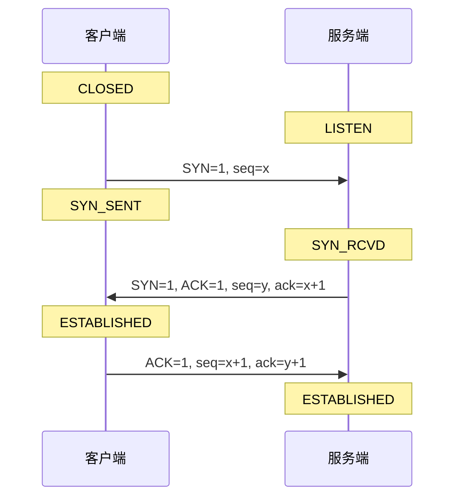
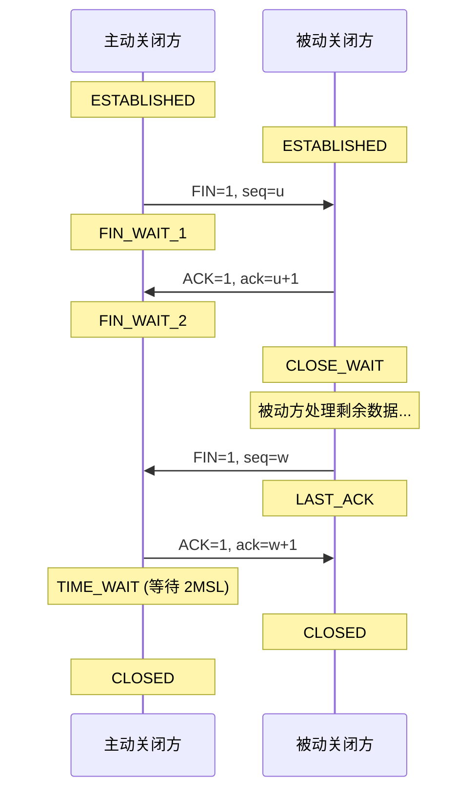
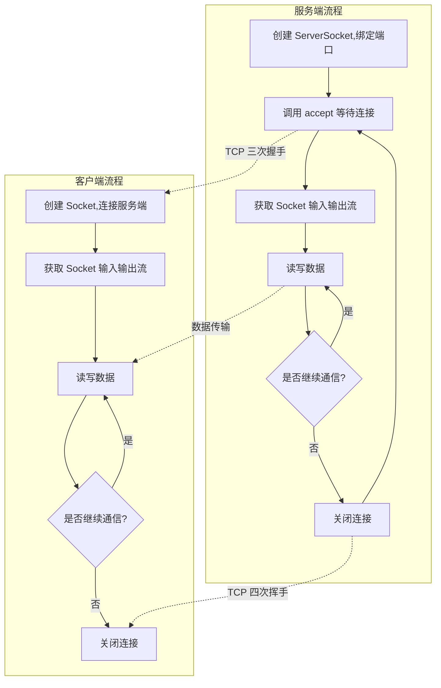
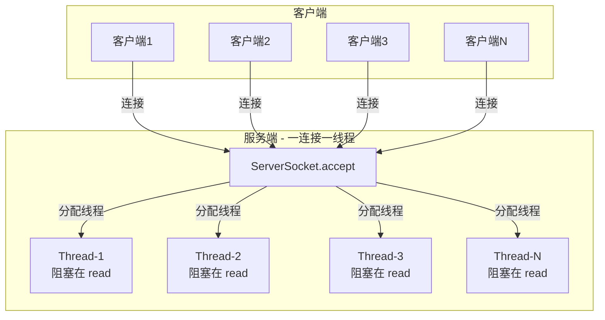
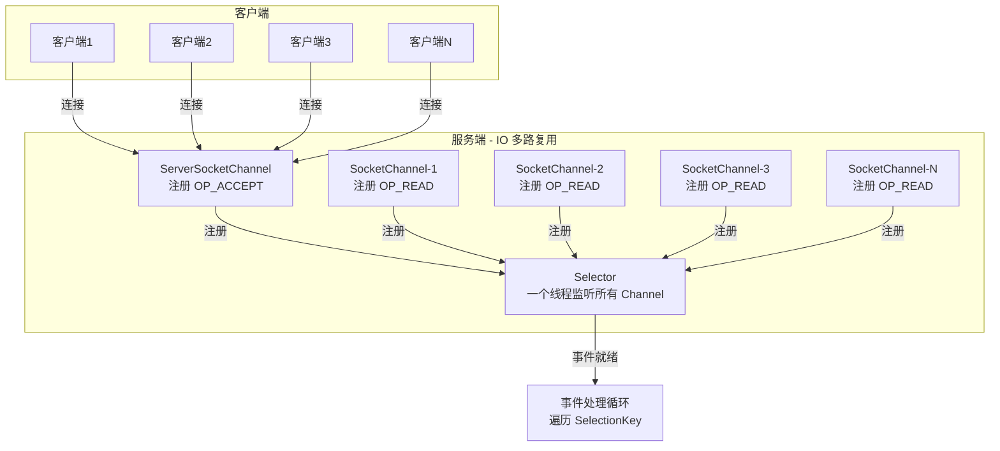
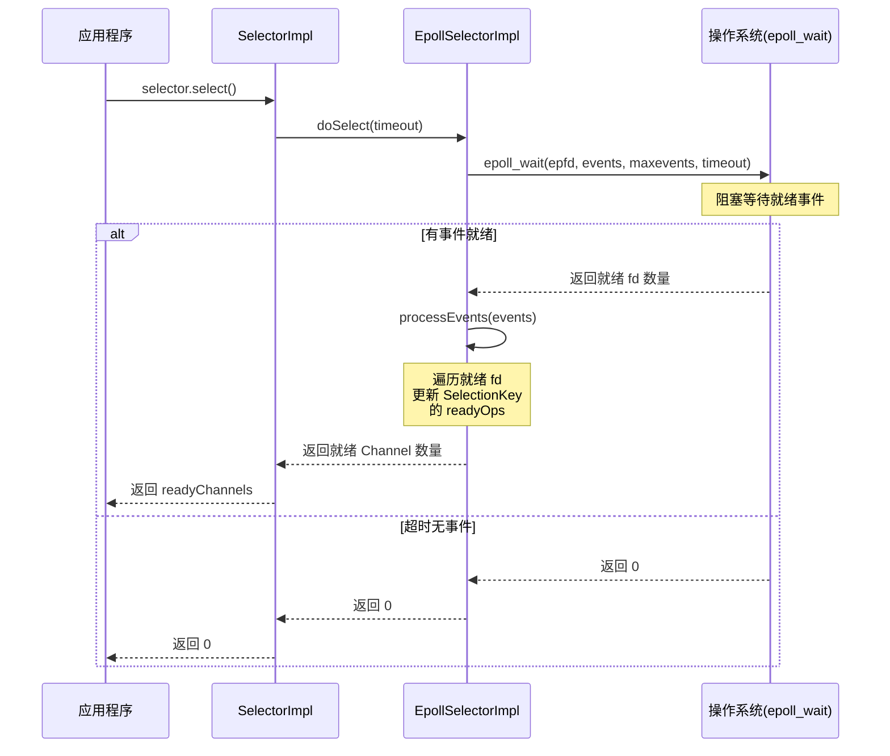
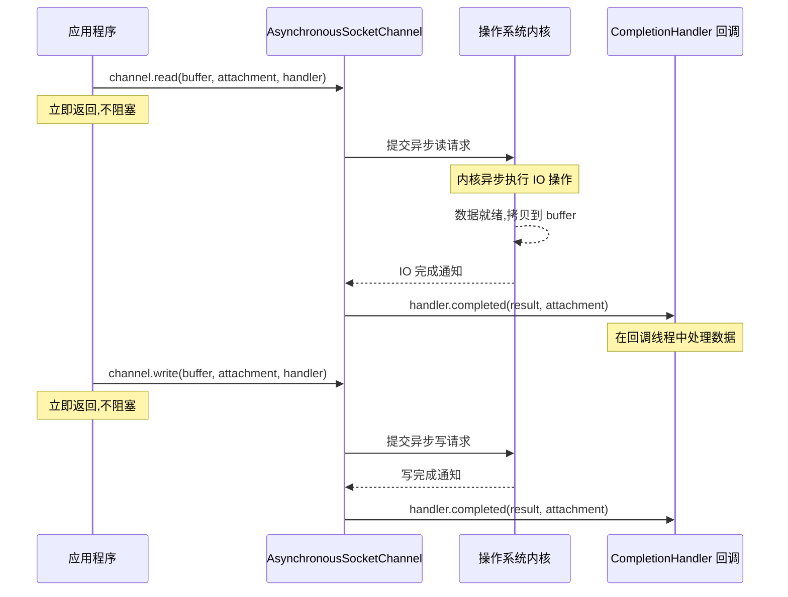
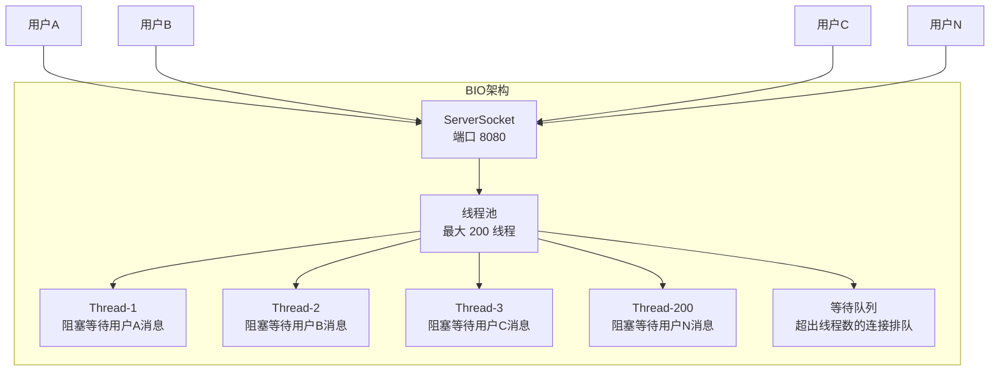
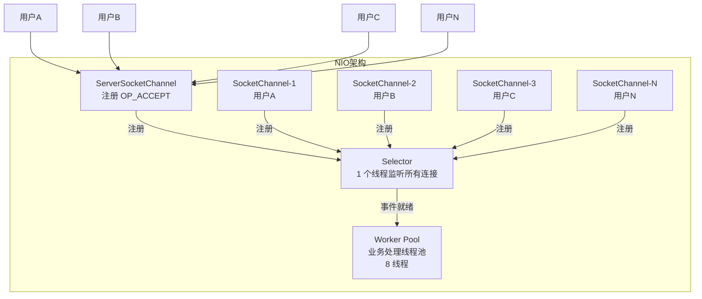
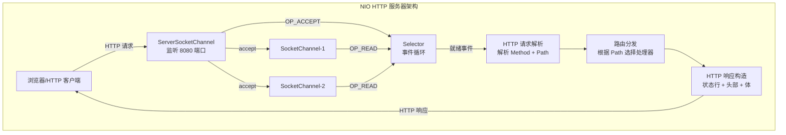

# TCP、UDP 与 NIO 基础

这一篇是网络编程的基础篇。很多 Java 开发日常写的是 Spring MVC、RPC 或消息队列，但底层请求是怎么到达服务端的、为什么连接会阻塞、为什么线程会被占满，最终都离不开 `TCP`、`Socket`、`BIO/NIO` 这些基础概念。

学习这一部分的目标，不是手写复杂网络框架，而是建立最基本的网络通信认知，为后续理解 Netty、长连接、网关和高并发通信模型打基础。

## 为什么要先学 TCP、UDP 和 NIO

Java 服务端程序本质上是在处理网络请求。无论上层封装多高级,底层总绕不开这些问题:

- 请求是基于 `TCP` 还是 `UDP` 传输
- 一个连接是如何建立和关闭的
- 服务端是一个连接一个线程,还是一个线程处理多个连接
- 为什么高并发场景下线程数和连接数不能简单画等号
- 为什么现代高性能网络框架普遍基于 `NIO`

如果这些基础概念不清楚,后面学习 Netty、WebSocket、RPC、网关调优时,很容易只停留在 API 使用层面。

## TCP 与 UDP

### TCP 是什么

`TCP`（Transmission Control Protocol，传输控制协议）是面向连接、可靠传输、保证顺序的传输层协议。可以把它理解为一种"先建立连接,再稳定传输数据"的通信方式。

它有几个关键特征:

- **面向连接**:通信前需要先建立连接,通信结束后释放连接
- **可靠传输**:通过确认应答、超时重传机制保证数据可靠送达
- **有序交付**:保证数据按发送顺序到达接收端
- **流量控制**:通过滑动窗口机制防止发送方淹没接收方
- **拥塞控制**:通过慢启动、拥塞避免等算法防止网络拥塞

因此,`TCP` 更适合这些场景:

- HTTP / HTTPS（网页浏览、API 调用）
- 数据库连接（MySQL、PostgreSQL、Redis）
- RPC 调用（Dubbo、gRPC）
- 文件传输（FTP、SFTP）
- 大多数业务系统的服务间通信

### TCP 连接的建立与断开

理解 TCP 的关键是掌握三次握手和四次挥手的过程。

#### 三次握手（连接建立）

TCP 三次握手是建立可靠连接的过程:



**为什么需要三次握手?**

- **两次不够**:如果只有两次握手,服务端无法确认客户端是否收到了确认,可能导致服务端为已失效的连接请求浪费资源
- **三次刚好**:第三次握手让服务端确认客户端确实收到了确认,双方都准备好通信

**握手过程中的状态变化:**

- 客户端:CLOSED → SYN_SENT → ESTABLISHED
- 服务端:CLOSED → LISTEN → SYN_RCVD → ESTABLISHED

#### 四次挥手（连接断开）

TCP 四次挥手是断开连接的过程:



**为什么需要四次挥手?**

- **TCP 是全双工**:每个方向的数据传输需要单独关闭
- **被动方可能还有数据**:被动方收到 FIN 后可能还有数据要发送,不能立即关闭
- **四次刚好**:双方各发送一个 FIN 和一个 ACK,确保双向都正常关闭

**挥手过程中的状态变化:**

- 主动关闭方:ESTABLISHED → FIN_WAIT_1 → FIN_WAIT_2 → TIME_WAIT → CLOSED
- 被动关闭方:ESTABLISHED → CLOSE_WAIT → LAST_ACK → CLOSED

**为什么需要 TIME_WAIT 状态?**

- 保证最后的 ACK 能到达被动方
- 让旧连接的延迟数据在网络中消失
- 持续时间:2MSL（Maximum Segment Lifetime,通常为 2 分钟）

::: danger TIME_WAIT 堆积问题
在高并发短连接场景下（如 HTTP 1.0 短连接服务端主动关闭），主动关闭方会大量积累 TIME_WAIT 状态的连接，每个占用一个五元组（本地 IP、本地端口、远程 IP、远程端口、协议），导致端口耗尽，新连接无法建立。

**解决方案**:
- 设置 `tcp_tw_reuse = 1`，允许将 TIME_WAIT 连接用于新的 TCP 连接（仅客户端生效）
- 使用长连接（HTTP Keep-Alive）减少连接频繁关闭
- 让客户端主动关闭，将 TIME_WAIT 转移到客户端
- 调低 `tcp_max_tw_buckets` 限制 TIME_WAIT 总量（超限后内核强制清理，需谨慎评估）
:::

### UDP 是什么

`UDP`（User Datagram Protocol，用户数据报协议）是无连接、不保证可靠送达、也不保证顺序的传输层协议。

它的特点是:

- **无连接**:发送前不需要建立连接,直接发送数据报
- **协议头更轻量**:UDP 头部只有 8 字节,TCP 头部至少 20 字节
- **延迟通常更低**:没有连接建立、确认重传的开销
- **不保证可靠**:不负责重传、排序、拥塞控制
- **支持组播和广播**:可以一对多传输数据

因此,`UDP` 更适合这些场景:

- 音视频实时传输（视频会议、直播）
- 游戏状态同步（在线游戏、实时对战）
- 广播、组播（DNS 查询、NTP 时间同步）
- 对实时性要求高、允许少量丢包的场景

### UDP DatagramSocket 编程示例

与 TCP 的 `ServerSocket/Socket` 不同,UDP 使用 `DatagramSocket`（套接字）+ `DatagramPacket`（数据报）。UDP 无连接,服务端和客户端都只需一个 `DatagramSocket`,通过收发 `DatagramPacket` 通信。

**UDP 服务端（接收 + 回显）示例:**

```java
import java.net.DatagramPacket;
import java.net.DatagramSocket;

public class UdpServer {
  public static void main(String[] args) throws Exception {
    try (DatagramSocket serverSocket = new DatagramSocket(9001)) {  // 监听 9001 端口
      byte[] buffer = new byte[1024];
      System.out.println("UDP 服务端已启动,监听端口 9001...");
      // 服务端通常循环接收
      while (true) {
        // 准备接收数据报
        DatagramPacket packet = new DatagramPacket(buffer, buffer.length);
        serverSocket.receive(packet);   // 阻塞等待,收到后填充 packet

        String msg = new String(packet.getData(), 0, packet.getLength());
        System.out.println("收到客户端消息: " + msg);

        // 回显: 把收到的数据原样发回给客户端
        DatagramPacket response = new DatagramPacket(
            packet.getData(), packet.getLength(),
            packet.getAddress(), packet.getPort());   // 使用发送方的地址与端口
        serverSocket.send(response);
      }
    }
  }
}
```

**UDP 客户端（发送 + 接收回显）示例:**

```java
import java.net.DatagramPacket;
import java.net.DatagramSocket;
import java.net.InetAddress;

public class UdpClient {
  public static void main(String[] args) throws Exception {
    try (DatagramSocket socket = new DatagramSocket()) {
      InetAddress serverAddr = InetAddress.getByName("localhost");
      String msg = "Hello UDP Server";
      byte[] data = msg.getBytes();

      // 发送数据报给服务端
      DatagramPacket sendPacket = new DatagramPacket(
          data, data.length, serverAddr, 9001);
      socket.send(sendPacket);

      // 接收服务端回显
      byte[] buffer = new byte[1024];
      DatagramPacket recvPacket = new DatagramPacket(buffer, buffer.length);
      socket.receive(recvPacket);

      String reply = new String(recvPacket.getData(), 0, recvPacket.getLength());
      System.out.println("收到服务端回显: " + reply);
    }
  }
}
```

**UDP 编程要点:**

- **无连接**:客户端不用 `connect`,直接 `send` 到目标地址;服务端 `receive` 后通过 `packet.getAddress()/getPort()` 知道发送方。
- **数据报边界**:UDP 一次 `send` 对应一次 `receive`,天然保留消息边界（不会像 TCP 那样产生粘包半包）。
- **不保证可靠**:数据报可能丢失、乱序,应用层需自行处理（如需可靠可加序号、重传、ACK）。
- **超时设置**:`socket.setSoTimeout(ms)` 可让 `receive` 超时,避免永久阻塞。
- **消息大小**:单个 UDP 数据报建议不超过 65507 字节（受 MTU 限制,通常用几百到几 KB）。

### TCP 和 UDP 的核心区别

| 对比项 | TCP | UDP |
|---|---|---|
| 连接方式 | 面向连接 | 无连接 |
| 可靠性 | 可靠传输（确认、重传） | 不保证可靠送达 |
| 顺序性 | 保证顺序 | 不保证顺序 |
| 传输形式 | 字节流 | 数据报（保留消息边界） |
| 开销 | 相对更高（头部 20+ 字节） | 相对更低（头部 8 字节） |
| 流量控制 | 有（滑动窗口） | 无 |
| 拥塞控制 | 有（慢启动、拥塞避免） | 无 |
| 典型场景 | Web、数据库、RPC、文件传输 | 音视频、游戏、广播、DNS |

**最重要的区别:**

- `TCP` 是字节流,应用层消息边界需要自己定义
- `UDP` 是数据报,天然保留一次发送对应一次接收的边界

这也是为什么后面学习 `TCP` 编程时,一定会遇到粘包半包问题,而 `UDP` 通常不会从这个角度出问题。

::: details TCP 拥塞控制算法详解

TCP 拥塞控制是防止过多数据注入网络、导致网络过载的核心机制。它包含四个关键算法:

**1. 慢启动（Slow Start）**

- 连接建立后,拥塞窗口（cwnd）从 1 个 MSS 开始
- 每收到一个 ACK,cwnd 加 1（指数增长）
- 当 cwnd 达到慢启动阈值（ssthresh）时,转入拥塞避免阶段

**2. 拥塞避免（Congestion Avoidance）**

- 每经过一个 RTT,cwnd 加 1（线性增长）
- 增长速度远慢于慢启动,避免窗口增长过快导致拥塞

**3. 快速重传（Fast Retransmit）**

- 当收到 3 个重复 ACK 时,立即重传丢失的报文段
- 不必等待超时定时器触发,减少延迟

**4. 快速恢复（Fast Recovery）**

- 执行快速重传后,将 ssthresh 设为当前 cwnd 的一半
- cwnd 设为新的 ssthresh + 3（因为已收到 3 个重复 ACK）
- 进入拥塞避免阶段继续线性增长

**不同 TCP 版本的差异**:

| 版本 | 特点 |
|---|---|
| TCP Tahoe | 快速重传后 cwnd 降为 1,重新慢启动 |
| TCP Reno | 快速重传后进入快速恢复,不从头慢启动 |
| TCP Cubic | Linux 默认,基于三次函数调整窗口,适合高带宽长延迟网络 |
| BBR | Google 提出,基于带宽和 RTT 测量而非丢包信号,适合有一定丢包的网络 |

:::

### TCP 粘包和半包问题

#### 什么是粘包和半包

**粘包**:发送方发送了多个独立的数据包,接收方一次性读到了多个数据包粘在一起的数据。

**半包**:发送方发送了一个数据包,接收方只读到了数据包的一部分。

**根本原因:**

- TCP 是字节流协议,不维护应用层消息边界
- 发送方的多个小数据包可能被 Nagle 算法合并发送
- 接收方可能因为缓冲区大小限制,一次性读取多个包或只读取部分包

#### 解决方案

**方案一:固定长度消息**

每个消息固定长度,不够补空格或特殊字符:

```java
// 发送方：固定长度消息编码
public void sendFixedLengthMessage(SocketChannel channel, String message) throws IOException {
    // 固定消息长度为 100 字节
    byte[] bytes = message.getBytes(StandardCharsets.UTF_8);
    ByteBuffer buffer = ByteBuffer.allocate(100);
    buffer.put(bytes);
    // 不足部分用空字节填充
    while (buffer.hasRemaining()) {
        buffer.put((byte) 0);
    }
    buffer.flip();
    channel.write(buffer);
}

// 接收方：固定长度消息解码
public String receiveFixedLengthMessage(SocketChannel channel) throws IOException {
    ByteBuffer buffer = ByteBuffer.allocate(100);
    int totalRead = 0;
    while (totalRead < 100) {
        int read = channel.read(buffer);
        if (read == -1) {
            throw new IOException("连接已关闭");
        }
        totalRead += read;
    }
    buffer.flip();
    byte[] bytes = new byte[buffer.remaining()];
    buffer.get(bytes);
    // 去除填充字节
    return new String(bytes, StandardCharsets.UTF_8).trim();
}
```

**缺点**:浪费带宽,消息长度受限

**方案二:特殊分隔符**

使用特定分隔符标记消息结束:

```java
public class DelimiterBasedMessage {
    private static final String DELIMITER = "\r\n";

    // 发送方：追加分隔符
    public void sendDelimitedMessage(SocketChannel channel, String message) throws IOException {
        String delimitedMessage = message + DELIMITER;
        ByteBuffer buffer = StandardCharsets.UTF_8.encode(delimitedMessage);
        channel.write(buffer);
    }

    // 接收方：按分隔符切分消息
    public String receiveDelimitedMessage(SocketChannel channel, ByteBuffer readBuffer) throws IOException {
        while (true) {
            int read = channel.read(readBuffer);
            if (read == -1) {
                throw new IOException("连接已关闭");
            }

            readBuffer.flip();
            String data = StandardCharsets.UTF_8.decode(readBuffer).toString();

            int delimiterIndex = data.indexOf(DELIMITER);
            if (delimiterIndex != -1) {
                String message = data.substring(0, delimiterIndex);
                // 保留剩余数据到 readBuffer
                readBuffer.compact();
                return message;
            }

            readBuffer.compact();
        }
    }
}
```

**缺点**:消息内容不能包含分隔符,需要转义

**方案三:长度字段（推荐）**

在消息头部添加长度字段,表示消息体的长度:

```java
public class LengthFieldBasedMessage {
    // 消息头:4 字节长度字段 + 消息体

    // 发送方：先写长度再写消息体
    public void sendMessage(SocketChannel channel, String message) throws IOException {
        byte[] body = message.getBytes(StandardCharsets.UTF_8);
        int length = body.length;

        ByteBuffer buffer = ByteBuffer.allocate(4 + length);
        buffer.putInt(length);  // 长度字段
        buffer.put(body);       // 消息体
        buffer.flip();

        channel.write(buffer);
    }

    // 接收方：先读长度再按长度读消息体
    public String receiveMessage(SocketChannel channel, ByteBuffer readBuffer) throws IOException {
        while (true) {
            int read = channel.read(readBuffer);
            if (read == -1) {
                throw new IOException("连接已关闭");
            }

            readBuffer.flip();

            // 至少要有 4 字节才能读取长度
            if (readBuffer.remaining() < 4) {
                readBuffer.compact();
                continue;
            }

            // 读取长度字段
            int length = readBuffer.getInt();

            // 检查是否收到完整的消息体
            if (readBuffer.remaining() < length) {
                readBuffer.rewind();  // 重置 position
                readBuffer.compact();
                continue;
            }

            // 读取消息体
            byte[] body = new byte[length];
            readBuffer.get(body);

            readBuffer.compact();
            return new String(body, StandardCharsets.UTF_8);
        }
    }
}
```

**优点**:通用性强,Netty 提供了 `LengthFieldPrepender` 和 `LengthFieldBasedFrameDecoder` 支持

::: tip 生产环境推荐使用长度字段方案
**生产环境推荐使用方案三**,这也是 Netty、Dubbo 等框架的默认方案。Netty 提供的 `LengthFieldBasedFrameDecoder` 支持灵活的长度字段配置:

- `lengthFieldOffset`:长度字段在消息中的偏移量
- `lengthFieldLength`:长度字段本身的字节数（1/2/3/4/8）
- `lengthAdjustment`:长度字段值与消息体长度的差值
- `initialBytesToStrip`:解码后跳过的字节数

如果业务需要自定义协议头,可以配合 `LengthFieldPrepender` 编码器使用,无需手写粘包半包处理逻辑。
:::

## Socket 通信模型

### 什么是 Socket

`Socket`（套接字）可以理解为操作系统提供给应用程序的网络通信接口。Java 网络编程最基础的写法,就是通过:

- 服务端监听端口
- 客户端发起连接
- 双方通过输入输出流或通道读写数据

对于服务端来说,一个基本过程通常是:

1. 监听某个端口
2. 接收客户端连接
3. 读取请求数据
4. 处理业务
5. 返回响应
6. 关闭连接或复用连接

### Socket 与 TCP 的关系

- **Socket 是应用层与 TCP/IP 协议栈的接口**
- 一个 Socket 由本地 IP、本地端口、远程 IP、远程端口、协议组成
- Java 中 `Socket` 类封装了 TCP 连接的创建和管理

### Socket 编程模型



## 传统 BIO 模型

### BIO 模型是什么

Java 最直观的网络编程方式就是阻塞式 IO,也就是 `BIO`（Blocking I/O）。

在这种模型下:

- `accept()` 会阻塞等待新连接
- `read()` 会阻塞等待数据到达
- `write()` 在某些情况下也可能阻塞

如果采用"一个连接一个线程"的写法,代码虽然容易理解,但会带来明显问题:

- 连接数上来后线程数量急剧上升
- 上下文切换成本增大
- 线程栈内存占用增多（每个线程默认 1MB）
- 大量线程可能长期阻塞在 IO 上,资源浪费严重

这就是传统 `BIO` 在高并发场景下的核心瓶颈。

### BIO 模型架构



::: warning BIO 线程数限制
BIO 模型下每个连接独占一个线程,线程数受以下因素制约:

- **操作系统限制**:Linux 单进程默认最大线程数约 3000~10000（取决于 `ulimit -u` 和栈大小）
- **内存限制**:每个线程默认栈大小 1MB（`-Xss` 参数），1 万个线程至少需要 10GB 栈内存
- **CPU 限制**:大量线程上下文切换导致 CPU 利用率下降,实际有效工作时间占比极低
- **线程池限制**:即使使用线程池,池大小固定后,超出线程数的连接只能排队等待

当连接数达到数千级别时,BIO 模型基本无法正常工作。
:::

### BIO 服务端示例

下面是一个典型的阻塞式服务端写法:

```java
import java.io.BufferedReader;
import java.io.InputStreamReader;
import java.io.OutputStreamWriter;
import java.io.PrintWriter;
import java.net.ServerSocket;
import java.net.Socket;
import java.nio.charset.StandardCharsets;
import java.util.concurrent.ExecutorService;
import java.util.concurrent.Executors;

public class BioServer {

    public static void main(String[] args) throws Exception {
        ServerSocket serverSocket = new ServerSocket(8080);
        System.out.println("BIO 服务端已启动,端口:8080");

        // 使用线程池避免无限创建线程
        ExecutorService threadPool = Executors.newFixedThreadPool(100);

        while (true) {
            Socket socket = serverSocket.accept(); // 阻塞等待连接
            System.out.println("客户端连接:" + socket.getRemoteSocketAddress());
            threadPool.submit(() -> handleClient(socket));
        }
    }

    private static void handleClient(Socket socket) {
        try (
            Socket clientSocket = socket;
            BufferedReader reader = new BufferedReader(
                new InputStreamReader(clientSocket.getInputStream(), StandardCharsets.UTF_8));
            PrintWriter writer = new PrintWriter(
                new OutputStreamWriter(clientSocket.getOutputStream(), StandardCharsets.UTF_8), true)
        ) {
            String line;
            while ((line = reader.readLine()) != null) {
                System.out.println("收到请求:" + line);
                writer.println("服务端响应:" + line);
            }
        } catch (Exception e) {
            e.printStackTrace();
        } finally {
            System.out.println("客户端断开:" + socket.getRemoteSocketAddress());
        }
    }
}
```

### BIO 客户端示例

```java
import java.io.BufferedReader;
import java.io.InputStreamReader;
import java.io.OutputStreamWriter;
import java.io.PrintWriter;
import java.net.Socket;
import java.nio.charset.StandardCharsets;

public class BioClient {

    public static void main(String[] args) throws Exception {
        Socket socket = new Socket("localhost", 8080);

        try (
            BufferedReader reader = new BufferedReader(
                new InputStreamReader(socket.getInputStream(), StandardCharsets.UTF_8));
            PrintWriter writer = new PrintWriter(
                new OutputStreamWriter(socket.getOutputStream(), StandardCharsets.UTF_8), true);
            BufferedReader consoleReader = new BufferedReader(
                new InputStreamReader(System.in))
        ) {
            System.out.println("已连接到服务端,输入消息(输入 quit 退出):");

            String input;
            while ((input = consoleReader.readLine()) != null) {
                if ("quit".equals(input)) {
                    break;
                }

                writer.println(input);
                String response = reader.readLine();
                System.out.println("服务端响应:" + response);
            }
        }
    }
}
```

### BIO 模型的问题

这个例子很适合理解 Socket 通信流程,但它的问题也很明显:

- **线程数限制**:每个连接需要一个线程,线程数受操作系统限制（通常几千到上万）
- **资源浪费**:大量线程阻塞在 IO 上,占用内存和 CPU 上下文切换成本
- **扩展性差**:连接数大时性能急剧下降
- **不适合长连接**:大量空闲连接也会占用线程资源

::: danger 连接泄漏风险
BIO 编程中最常见的问题之一是连接泄漏。当异常发生时,如果没有正确关闭 Socket,连接会一直占用线程和文件描述符:

```java
// 错误示例：异常时未关闭 Socket
Socket socket = serverSocket.accept();
try {
    // 处理请求...
} catch (IOException e) {
    e.printStackTrace();
    // Socket 未关闭！线程不会释放！
}
```

**必须使用 try-with-resources 或在 finally 中关闭 Socket**。一个未关闭的连接不仅占用线程,还会占用文件描述符。Linux 默认单进程文件描述符上限为 1024（`ulimit -n`），超过后新连接会被拒绝,抛出 `java.net.SocketException: Too many open files`。
:::

这正是 `NIO` 诞生的现实背景。

## NIO 为什么重要

### NIO 解决了什么问题

`NIO`（Non-blocking I/O，非阻塞 IO）的核心目标不是"让代码更短",而是让一个线程可以更高效地管理多个连接,从而降低"一连接一线程"的成本。

它重点解决的是:

- 高并发连接下线程数不可控
- 大量线程阻塞等待导致资源浪费
- 服务端难以高效处理大量空闲连接

### NIO 的三个核心组件

学习 `NIO` 时,最重要的是理解这三个概念:

- `Channel`（通道）
- `Buffer`（缓冲区）
- `Selector`（选择器）

### Channel 通道

`Channel` 可以理解为比 `InputStream`、`OutputStream` 更适合网络编程的通道抽象。它是双向的,既可以读也可以写。

常见类型包括:

- `ServerSocketChannel`:服务端通道,用于监听连接
- `SocketChannel`:客户端通道,用于读写数据
- `FileChannel`:文件通道,用于文件读写
- `DatagramChannel`:UDP 通道,用于 UDP 数据报传输

在网络编程里,最常见的是前两个:

```java
// ServerSocketChannel 使用示例
ServerSocketChannel serverChannel = ServerSocketChannel.open();
serverChannel.configureBlocking(false); // 设置为非阻塞模式
serverChannel.bind(new InetSocketAddress(8080));

// SocketChannel 使用示例
SocketChannel socketChannel = SocketChannel.open();
socketChannel.configureBlocking(false); // 设置为非阻塞模式
socketChannel.connect(new InetSocketAddress("localhost", 8080));
```

### Buffer 缓冲区

`Buffer` 是 `NIO` 中承载数据的缓冲区。网络数据不会直接读进字符串或对象里,而是先进入缓冲区,再由程序解析。

最常见的是:

- `ByteBuffer`:字节缓冲区
- `CharBuffer`:字符缓冲区
- `IntBuffer`、`LongBuffer`、`DoubleBuffer` 等基本类型缓冲区

使用 `Buffer` 时要特别注意几个核心属性:

- `capacity`:缓冲区容量
- `position`:当前位置
- `limit`:限制位置（读模式下是可读数据大小,写模式下是容量）
- `mark`:标记位置

核心操作:

```java
ByteBuffer buffer = ByteBuffer.allocate(1024); // 分配缓冲区

// 写入数据到缓冲区
buffer.put("Hello".getBytes(StandardCharsets.UTF_8));

// 切换到读模式
buffer.flip();

// 从缓冲区读取数据
byte[] data = new byte[buffer.remaining()];
buffer.get(data);

// 清空缓冲区,准备下次写入
buffer.clear();

// compact():保留未读数据,将 position 移到未读数据之后
buffer.compact();
```

**Buffer 的读写模式切换**:

```mermaid
flowchart LR
    A["写模式<br/>position=0<br/>limit=capacity"] -->|put() 写入数据| B["position 移动到<br/>已写入数据之后"]
    B -->|flip() 切换到读模式| C["读模式<br/>position=0<br/>limit=已写入数据大小"]
    C -->|get() 读取数据| D["position 移动到<br/>已读取数据之后"]
    D -->|clear() 或 compact()| A
```

::: warning Buffer flip() 常见混淆
很多初学者不是不会 `NIO`,而是经常被 `Buffer` 的读写状态切换绕晕。最常见的错误:

1. **写完数据后忘记 flip() 就直接读** — 此时 position 在末尾,`get()` 读不到任何数据
2. **读完数据后忘记 clear() 或 compact() 就继续写** — position 和 limit 状态不对,写入位置错误
3. **混淆 clear() 和 compact()** — `clear()` 清空所有数据,`compact()` 保留未读数据并前移

**记忆口诀**:
- `flip()` = 写完切读（flip the switch from write to read）
- `clear()` = 读完清空,从头开始写
- `compact()` = 读完部分,保留未读,继续写

**调试技巧**:在关键步骤后打印 `buffer.position()`、`buffer.limit()`、`buffer.remaining()` 来确认状态。
:::

### Selector 选择器

`Selector` 是 `NIO` 中最关键的组件。它的价值在于:

- 一个线程可以监听多个 `Channel`
- 哪个连接有事件,就处理哪个连接
- 没有事件时,不必为每个连接单独占用一个线程

它通常监听的事件包括:

- `OP_ACCEPT`:有新连接到来
- `OP_CONNECT`:连接建立完成
- `OP_READ`:有数据可读
- `OP_WRITE`:可以写数据

这就是所谓的 IO 多路复用思想。

```java
// Selector 使用示例
Selector selector = Selector.open();

// 将 Channel 注册到 Selector
ServerSocketChannel serverChannel = ServerSocketChannel.open();
serverChannel.configureBlocking(false);
serverChannel.bind(new InetSocketAddress(8080));
serverChannel.register(selector, SelectionKey.OP_ACCEPT);

// 事件循环
while (true) {
    int readyChannels = selector.select(); // 阻塞等待就绪事件
    if (readyChannels == 0) continue;

    Set<SelectionKey> selectedKeys = selector.selectedKeys();
    Iterator<SelectionKey> iterator = selectedKeys.iterator();

    while (iterator.hasNext()) {
        SelectionKey key = iterator.next();
        iterator.remove();

        if (key.isAcceptable()) {
            // 处理连接
        } else if (key.isReadable()) {
            // 处理读
        } else if (key.isWritable()) {
            // 处理写
        }
    }
}
```

### NIO 模型架构



::: tip Java 17+ NIO 变化
从 Java 17 开始,NIO 相关 API 有一些值得关注的改进:

- **Socket API 重构**:Java 13 引入的 `SocketImpl` 重构在后续版本中逐步稳定,底层实现更现代化
- **NIO 支持 Unix Domain Socket**:Java 16+ 通过 `StandardProtocolFamily.UNIX` 支持 Unix 域套接字,适合本地进程间通信
- **Foreign Function & Memory API（预览）**:Java 19+ 引入的外部内存 API 可能替代部分 `ByteBuffer` 直接内存操作场景
- **Virtual Thread（虚拟线程）**:Java 21 正式引入的虚拟线程让 BIO 模型也能高效处理大量连接,一个虚拟线程仅占用几 KB,不再受 1MB 栈内存限制。这意味着在某些场景下,使用虚拟线程 + BIO 可能比 NIO 更简单且性能相当
:::

## NIO 服务端完整示例

下面是一个完整的 `NIO` 服务端示例,包含连接处理、消息读取、消息发送:

```java
import java.net.InetSocketAddress;
import java.nio.ByteBuffer;
import java.nio.channels.*;
import java.nio.charset.StandardCharsets;
import java.util.Iterator;
import java.util.Set;

public class NioServer {

    private Selector selector;
    private ServerSocketChannel serverChannel;
    private static final int BUFFER_SIZE = 1024;

    public static void main(String[] args) throws Exception {
        NioServer server = new NioServer();
        server.start(8080);
    }

    public void start(int port) throws Exception {
        // 1. 打开 Selector
        selector = Selector.open();

        // 2. 创建 ServerSocketChannel
        serverChannel = ServerSocketChannel.open();
        serverChannel.configureBlocking(false);
        serverChannel.bind(new InetSocketAddress(port));

        // 3. 注册 ACCEPT 事件
        serverChannel.register(selector, SelectionKey.OP_ACCEPT);

        System.out.println("NIO 服务端已启动,端口:" + port);

        // 4. 事件循环
        while (true) {
            int readyChannels = selector.select();
            if (readyChannels == 0) continue;

            Set<SelectionKey> selectedKeys = selector.selectedKeys();
            Iterator<SelectionKey> iterator = selectedKeys.iterator();

            while (iterator.hasNext()) {
                SelectionKey key = iterator.next();
                iterator.remove();

                try {
                    if (key.isAcceptable()) {
                        handleAccept(key);
                    } else if (key.isReadable()) {
                        handleRead(key);
                    } else if (key.isWritable()) {
                        handleWrite(key);
                    }
                } catch (Exception e) {
                    e.printStackTrace();
                    closeChannel(key);
                }
            }
        }
    }

    private void handleAccept(SelectionKey key) throws Exception {
        ServerSocketChannel serverChannel = (ServerSocketChannel) key.channel();
        SocketChannel socketChannel = serverChannel.accept();
        socketChannel.configureBlocking(false);

        // 注册 READ 事件,并附加一个 Buffer
        socketChannel.register(selector, SelectionKey.OP_READ, ByteBuffer.allocate(BUFFER_SIZE));
        System.out.println("客户端已连接:" + socketChannel.getRemoteAddress());
    }

    private void handleRead(SelectionKey key) throws Exception {
        SocketChannel socketChannel = (SocketChannel) key.channel();
        ByteBuffer buffer = (ByteBuffer) key.attachment();
        buffer.clear();

        int readBytes = socketChannel.read(buffer);
        if (readBytes == -1) {
            // 客户端关闭连接
            System.out.println("客户端断开:" + socketChannel.getRemoteAddress());
            closeChannel(key);
            return;
        }

        if (readBytes > 0) {
            buffer.flip();
            String message = StandardCharsets.UTF_8.decode(buffer).toString();
            System.out.println("收到消息[" + socketChannel.getRemoteAddress() + "]:" + message);

            // 发送响应
            buffer.clear();
            buffer.put(("服务端响应:" + message).getBytes(StandardCharsets.UTF_8));
            buffer.flip();
            socketChannel.write(buffer);
        }
    }

    private void handleWrite(SelectionKey key) throws Exception {
        SocketChannel socketChannel = (SocketChannel) key.channel();
        // 写操作通常在 read 处理中完成
        // 如果写缓冲区满,才需要注册 OP_WRITE 事件
        key.interestOps(SelectionKey.OP_READ);
    }

    private void closeChannel(SelectionKey key) {
        try {
            key.channel().close();
            key.cancel();
        } catch (Exception e) {
            e.printStackTrace();
        }
    }
}
```

## NIO 客户端完整示例

```java
import java.net.InetSocketAddress;
import java.nio.ByteBuffer;
import java.nio.channels.SelectionKey;
import java.nio.channels.Selector;
import java.nio.channels.SocketChannel;
import java.nio.charset.StandardCharsets;
import java.util.Iterator;
import java.util.Scanner;
import java.util.Set;

public class NioClient {

    private Selector selector;
    private SocketChannel socketChannel;
    private static final int BUFFER_SIZE = 1024;

    public static void main(String[] args) throws Exception {
        NioClient client = new NioClient();
        client.start("localhost", 8080);
    }

    public void start(String host, int port) throws Exception {
        // 1. 打开 Selector
        selector = Selector.open();

        // 2. 创建 SocketChannel
        socketChannel = SocketChannel.open();
        socketChannel.configureBlocking(false);

        // 3. 连接服务端
        boolean connected = socketChannel.connect(new InetSocketAddress(host, port));

        if (connected) {
            // 连接成功,注册 READ 事件
            socketChannel.register(selector, SelectionKey.OP_READ, ByteBuffer.allocate(BUFFER_SIZE));
            System.out.println("已连接到服务端");
        } else {
            // 连接中,注册 CONNECT 事件
            socketChannel.register(selector, SelectionKey.OP_CONNECT);
        }

        // 4. 启动读线程
        new Thread(this::readFromServer).start();

        // 5. 主线程处理用户输入
        Scanner scanner = new Scanner(System.in);
        while (scanner.hasNextLine()) {
            String message = scanner.nextLine();
            if ("quit".equals(message)) {
                break;
            }
            sendMessage(message);
        }

        socketChannel.close();
        selector.close();
    }

    private void readFromServer() {
        try {
            while (true) {
                int readyChannels = selector.select();
                if (readyChannels == 0) continue;

                Set<SelectionKey> selectedKeys = selector.selectedKeys();
                Iterator<SelectionKey> iterator = selectedKeys.iterator();

                while (iterator.hasNext()) {
                    SelectionKey key = iterator.next();
                    iterator.remove();

                    if (key.isConnectable()) {
                        handleConnect(key);
                    } else if (key.isReadable()) {
                        handleRead(key);
                    }
                }
            }
        } catch (Exception e) {
            e.printStackTrace();
        }
    }

    private void handleConnect(SelectionKey key) throws Exception {
        SocketChannel socketChannel = (SocketChannel) key.channel();
        if (socketChannel.isConnectionPending()) {
            socketChannel.finishConnect();
        }
        socketChannel.register(selector, SelectionKey.OP_READ, ByteBuffer.allocate(BUFFER_SIZE));
        System.out.println("已连接到服务端");
    }

    private void handleRead(SelectionKey key) throws Exception {
        SocketChannel socketChannel = (SocketChannel) key.channel();
        ByteBuffer buffer = (ByteBuffer) key.attachment();
        buffer.clear();

        int readBytes = socketChannel.read(buffer);
        if (readBytes == -1) {
            System.out.println("服务端关闭连接");
            socketChannel.close();
            return;
        }

        if (readBytes > 0) {
            buffer.flip();
            String message = StandardCharsets.UTF_8.decode(buffer).toString();
            System.out.println("服务端响应:" + message);
        }
    }

    private void sendMessage(String message) throws Exception {
        ByteBuffer buffer = ByteBuffer.wrap(message.getBytes(StandardCharsets.UTF_8));
        while (buffer.hasRemaining()) {
            socketChannel.write(buffer);
        }
    }
}
```

## NIO 的基本工作流程

一个典型的 `NIO` 服务端,大致按下面流程运行:

1. 打开 `Selector`
2. 创建 `ServerSocketChannel` 并设置为非阻塞
3. 绑定端口并注册 `OP_ACCEPT` 事件
4. 循环调用 `select()` 等待就绪事件
5. 遍历就绪事件集合,根据事件类型分别处理:
   - `OP_ACCEPT`:接收新连接,注册 `OP_READ`
   - `OP_READ`:读取数据,处理业务
   - `OP_WRITE`:写入数据
6. 处理完毕后移除事件,避免重复处理

它和 `BIO` 的根本差异在于:

- `BIO` 更像每个连接自己占一个线程等待
- `NIO` 更像一个线程统一调度多个连接上的事件

## 源码剖析

### Selector.select() 核心实现

`Selector.select()` 是 NIO 事件循环的核心调用。理解它的内部实现,有助于排查线上问题。



**核心源码路径（JDK 17+，Linux 平台）**:

1. `Selector.open()` → 调用 `EPollSelectorImpl` 构造函数 → 创建 epoll 实例（`epoll_create`）
2. `channel.register(selector, ops)` → 调用 `EPollSelectionKeyImpl` → 执行 `epoll_ctl(epfd, EPOLL_CTL_ADD, fd, event)` 注册 fd
3. `selector.select()` → 调用 `EPollSelectorImpl.doSelect()` → 执行 `epoll_wait(epfd, events, maxevents, timeout)` 等待事件
4. 事件返回后 → `processEvents()` 遍历就绪 fd 数组 → 更新对应 `SelectionKey` 的 `readyOps`
5. 应用程序通过 `selectedKeys()` 获取就绪的 `SelectionKey` 集合

**关键源码片段（简化）**:

```java
// EPollSelectorImpl.doSelect() 核心逻辑（简化版）
protected int doSelect(SelectorImpl selector, long timeout) throws IOException {
    // ... 省略中断和唤醒检查 ...

    try {
        // 调用操作系统 epoll_wait
        // pollArray 是存放就绪事件的本地内存区域
        int updated = epollWait(pollArray.address(), NUM_EPOLLEVENTS, timeout, epfd);
        // ... 省略 ...
    } finally {
        // ... 省略 ...
    }

    // 处理就绪事件
    processEvents();
    return selectedKeys.size();
}

// processEvents() 遍历就绪 fd
private void processEvents() {
    for (int i = 0; i < updated; i++) {
        // 从 pollArray 读取就绪的 fd 和事件
        long event = pollArray.getEvent(i);
        int fd = pollArray.getDescriptor(i);
        // 根据 fd 找到对应的 SelectionKey
        SelectionKeyImpl ski = fdToKey.get(fd);
        if (ski != null) {
            // 更新 readyOps
            int ops = eventOps(event);
            ski.channel.translateAndSetReadyOps(ops, ski);
            // 将 ski 加入 selectedKeys 集合
            selectedKeys.add(ski);
        }
    }
}
```

### JDK epoll 空轮询 Bug

::: warning Selector 空轮询 Bug
这是 JDK NIO 在 Linux 上的一个著名 Bug（JDK-6670302），表现为 `selector.select()` 在没有就绪事件时也会立即返回,导致事件循环变成死循环,CPU 飙升到 100%。

**触发条件**:
- Linux 平台使用 epoll
- 连接频繁建立和断开
- 在 `select()` 返回和处理事件之间,某个 fd 被关闭/注销

**根本原因**:
当某个 fd 已经被 epoll 标记为就绪,但在应用程序处理该事件前,该 fd 被关闭了。此时 epoll 会将该 fd 从兴趣列表中移除,但已经放入就绪队列的事件仍然存在。下次 `epoll_wait` 调用时,这个"孤儿"事件会导致立即返回,但应用程序找不到对应的 `SelectionKey`,于是 `selectedKeys` 为空,`select()` 返回 0,循环继续,形成空轮询。
:::

**Netty 的修复方案**:

Netty 通过检测空轮询次数来规避这个 Bug:

```java
// Netty NioEventLoop 的修复逻辑（简化版）
int selectCnt = 0; // 空轮询计数器

for (;;) {
    int selectedKeys = selector.select(timeoutMillis);
    selectCnt++;

    // 如果 select 返回了事件,或者被唤醒,或者有定时任务,重置计数器
    if (selectedKeys != 0 || oldWakenUp || wakenUp || hasTasks()) {
        selectCnt = 0; // 正常情况,重置计数器
    }
    // 如果空轮询次数超过阈值（默认 512）
    else if (selectCnt >= SELECTOR_AUTO_REBUILD_THRESHOLD) {
        // 重建 Selector:创建新的 Selector,将所有 Channel 迁移过去
        selector = selectRebuildSelector(selectCnt);
        selectCnt = 0; // 重置计数器
    }

    // 处理事件和任务...
}
```

**重建 Selector 的过程**:

```java
// Netty 重建 Selector 的核心逻辑（简化版）
private Selector selectRebuildSelector(int selectCnt) {
    // 1. 创建新的 Selector
    Selector newSelector = Selector.open();

    // 2. 将所有注册在旧 Selector 上的 Channel 迁移到新 Selector
    for (SelectionKey key : oldSelector.keys()) {
        if (!key.isValid()) continue;

        // 获取 Channel 和兴趣事件
        SelectableChannel channel = key.channel();
        int interestOps = key.interestOps();
        Object attachment = key.attachment();

        // 取消旧 Selector 上的注册
        key.cancel();

        // 注册到新 Selector
        channel.register(newSelector, interestOps, attachment);
    }

    // 3. 关闭旧 Selector
    oldSelector.close();

    return newSelector;
}
```

::: tip SPI 机制与 Selector 实现
Java NIO 的 Selector 实现通过 SPI（Service Provider Interface）机制选择不同平台的实现:

- **Linux**: `EPollSelectorProvider` → `EPollSelectorImpl`（基于 epoll）
- **macOS**: `KQueueSelectorProvider` → `KQueueSelectorImpl`（基于 kqueue）
- **Windows**: `WindowsSelectorProvider` → `WindowsSelectorImpl`（基于 select/poll）

`Selector.open()` 内部调用 `SelectorProvider.provider()` 获取平台对应的 Provider,再由 Provider 创建 Selector 实例。也可以通过系统属性 `-Djava.nio.channels.spi.SelectorProvider=xxx` 强制指定实现类。

Netty 正是利用 SPI 机制,提供了自己的 `NioEventLoop` 和优化后的 `SelectedSelectionKeySet`,在不修改 JDK 源码的前提下提升了 NIO 性能。
:::

## AIO 简介

### AIO 是什么

`AIO`（Asynchronous I/O，异步 IO）是 JDK 7 引入的异步非阻塞 IO 模型。与 NIO 不同,AIO 完全由操作系统完成 IO 操作,应用程序只需要提供回调函数。

### AIO 与 NIO 的区别

| 对比项 | NIO | AIO |
|---|---|---|
| IO 模型 | 非阻塞同步 IO | 非阻塞异步 IO |
| IO 操作 | 应用程序调用 read/write | 操作系统完成,回调通知 |
| 复杂度 | 中等 | 较高 |
| 适用场景 | 连接数多且连接时间短 | 连接数多且连接时间长 |

### AIO 模型架构



### AIO 服务端示例

```java
import java.net.InetSocketAddress;
import java.nio.ByteBuffer;
import java.nio.channels.AsynchronousServerSocketChannel;
import java.nio.channels.AsynchronousSocketChannel;
import java.nio.channels.CompletionHandler;
import java.nio.charset.StandardCharsets;

public class AioServer {

    public static void main(String[] args) throws Exception {
        AsynchronousServerSocketChannel serverChannel = AsynchronousServerSocketChannel.open();
        serverChannel.bind(new InetSocketAddress(8080));
        System.out.println("AIO 服务端已启动,端口:8080");

        // 异步接收连接
        serverChannel.accept(null, new CompletionHandler<AsynchronousSocketChannel, Void>() {
            @Override
            public void completed(AsynchronousSocketChannel clientChannel, Void attachment) {
                // 继续接收下一个连接
                serverChannel.accept(null, this);

                // 处理客户端连接
                handleClient(clientChannel);
            }

            @Override
            public void failed(Throwable exc, Void attachment) {
                exc.printStackTrace();
            }
        });

        // 防止主线程退出
        Thread.sleep(Long.MAX_VALUE);
    }

    private static void handleClient(AsynchronousSocketChannel clientChannel) {
        ByteBuffer buffer = ByteBuffer.allocate(1024);

        clientChannel.read(buffer, buffer, new CompletionHandler<Integer, ByteBuffer>() {
            @Override
            public void completed(Integer result, ByteBuffer attachment) {
                if (result == -1) {
                    try {
                        clientChannel.close();
                    } catch (Exception e) {
                        e.printStackTrace();
                    }
                    return;
                }

                attachment.flip();
                String message = StandardCharsets.UTF_8.decode(attachment).toString();
                System.out.println("收到消息:" + message);

                // 发送响应
                ByteBuffer responseBuffer = StandardCharsets.UTF_8.encode("服务端响应:" + message);
                clientChannel.write(responseBuffer);

                // 继续读取下一条消息
                attachment.clear();
                clientChannel.read(attachment, attachment, this);
            }

            @Override
            public void failed(Throwable exc, ByteBuffer attachment) {
                exc.printStackTrace();
                try {
                    clientChannel.close();
                } catch (Exception e) {
                    e.printStackTrace();
                }
            }
        });
    }
}
```

## 横向对比

### BIO vs NIO vs AIO 详细对比

| 对比项 | BIO | NIO | AIO |
|---|---|---|---|
| IO 模型 | 阻塞同步 | 非阻塞同步 | 非阻塞异步 |
| 连接处理方式 | 一连接一线程 | 一线程管理多连接 | 操作系统完成 IO |
| 编程复杂度 | 低 | 中 | 高 |
| 高并发表现 | 受线程数限制 | 好 | 更好 |
| 适用场景 | 连接数少且固定 | 连接数多且短 | 连接数多且长 |
| 典型框架 | 传统 Socket | Netty、Mina | Windows IOCP |
| 线程与连接关系 | 1:1 | N:1 | N:M |
| 数据读取方式 | 阻塞 read() | 非阻塞 read() + Selector | 回调 completed() |
| 内存管理 | 流式,由 OS 管理 | Buffer 自行管理 | Buffer + 回调 |
| Linux 支持 | 完整 | 完整（epoll） | 不完善（模拟实现） |

**性能基准参考**（基于 4 核 8G Linux 服务器，简单 Echo 服务）:

| 指标 | BIO（线程池 200） | NIO（单 Reactor） | NIO（主从 Reactor） |
|---|---|---|---|
| 最大并发连接数 | ~2,000 | ~50,000 | ~100,000+ |
| QPS（短连接） | ~5,000 | ~20,000 | ~50,000+ |
| QPS（长连接） | ~2,000 | ~15,000 | ~40,000+ |
| CPU 利用率 | 高（上下文切换） | 中 | 高（有效工作占比高） |
| 内存占用 | 高（线程栈） | 低 | 低 |

> 注：上表数字为**示意性量级估算**，用于说明三种模型的能力差异，并非实测基准。实际性能因硬件配置、内核参数（`somaxconn`、`ulimit` 等）、实现细节不同会有显著差异。

::: danger TCP 连接安全类比 SQL 注入
正如 SQL 注入是因为没有对用户输入做边界校验,TCP 粘包半包问题也是因为没有对数据做边界定义。两者本质都是"信任了不该信任的输入格式":

- **SQL 注入**:将用户输入直接拼入 SQL 语句,没有参数化 → 被注入恶意 SQL
- **粘包半包**:将 TCP 字节流直接当作消息,没有定义边界 → 消息被错误切分或合并

**教训**:任何来自网络的输入都不应该被"裸"使用,必须经过协议层的编解码和校验。Netty 的 `ByteToMessageDecoder` 体系正是为此而生。
:::

### Java NIO vs Go net vs Rust tokio

| 对比项 | Java NIO | Go net | Rust tokio |
|---|---|---|---|
| IO 模型 | epoll/kqueue + Selector | epoll/kqueue + goroutine 调度 | epoll/kqueue + Future/Waker |
| 并发单元 | 线程 / 事件循环 | goroutine（协程） | async task（协程） |
| 编程范式 | 事件驱动 + 回调 | 同步阻塞式（运行时自动调度） | async/await |
| 心智负担 | 高（Buffer、flip、Selector） | 低（像写同步代码） | 中（生命周期 + async） |
| 零拷贝 | FileChannel.transferTo | sendfile 系统调用 | splice/sendfile |
| 典型框架 | Netty | 标准库 net 包 | tokio + hyper |
| 生态成熟度 | 非常成熟 | 成熟 | 快速成长中 |

**核心差异**:

- **Java NIO**:需要手动管理 Selector 事件循环和 Buffer 状态,复杂但控制力强,Netty 封装后大幅降低复杂度
- **Go net**:运行时在 goroutine 阻塞时自动切换,开发者写同步风格代码即可享受非阻塞 IO 的性能,心智负担最低
- **Rust tokio**:编译期保证内存安全,零成本抽象,性能极致,但学习曲线陡峭

## 生产实践案例

### 案例一:BIO → NIO 迁移 — 高并发聊天服务

某在线教育平台的实时聊天服务,最初使用 BIO 实现。随着用户量增长,遇到了严重的性能瓶颈。

**迁移前的 BIO 架构**:



**问题**:
- 200 个线程中,80% 时间阻塞在 `read()` 上等待用户发消息
- 高峰期 5000+ 在线用户,线程池严重不足,大量连接排队超时
- 每个线程 1MB 栈内存,200 线程仅栈就占 200MB
- CPU 大量时间花在线程上下文切换上

**迁移后的 NIO 架构**:



**迁移效果**:

| 指标 | BIO（迁移前） | NIO（迁移后） | 提升 |
|---|---|---|---|
| 最大在线用户数 | ~2,000 | ~50,000 | 25x |
| 线程数 | 200 | 1（IO）+ 8（业务） | 22x 减少 |
| 内存占用 | ~500MB | ~100MB | 5x 减少 |
| 消息延迟（P99） | ~200ms | ~20ms | 10x 降低 |
| CPU 利用率 | 60%（上下文切换） | 40%（有效工作） | 1.5x 提升 |

**迁移关键步骤**:

1. 将 `ServerSocket` 替换为 `ServerSocketChannel` + `Selector`
2. 将 `Socket` 替换为 `SocketChannel`，设置非阻塞模式
3. 将 `InputStream/OutputStream` 替换为 `ByteBuffer` 读写
4. 将"一连接一线程"改为"Selector 事件循环 + 业务线程池"
5. 添加粘包半包处理（使用长度字段方案）
6. 添加 Selector 空轮询 Bug 修复（参考 Netty 方案）

### 案例二:不同业务场景的 IO 模型选择

::: tip IO 模型选择指南
不同业务场景适合不同的 IO 模型,没有"万能最优解":

| 业务场景 | 推荐模型 | 原因 |
|---|---|---|
| 内部管理后台（< 100 并发） | BIO | 连接数少,编程简单,维护成本低 |
| REST API 服务（< 1000 并发） | BIO + 线程池 / Servlet | Spring MVC 默认模型,够用且简单 |
| 即时通讯 / 聊天服务 | NIO | 大量长连接,空闲连接多,需要多路复用 |
| 游戏服务器 | NIO | 实时性要求高,连接数多,消息频繁 |
| API 网关 | NIO（Netty） | 超高并发,需要非阻塞转发 |
| 文件传输服务 | NIO / AIO | 大文件传输,零拷贝优化 |
| IoT 设备接入 | NIO | 海量设备长连接,心跳频繁,数据量小 |
| 数据库连接池 | BIO | 连接数有限且固定,阻塞式更简单 |

**选择原则**:
- 连接数 < 1000 且业务简单 → BIO 足够
- 连接数 > 1000 或长连接为主 → NIO
- 需要极致性能和工程化 → NIO + Netty
- Java 21+ 且团队不熟悉 NIO → 虚拟线程 + BIO 也是好选择
:::

## 为什么说 NIO 是 Netty 的基础

Netty 不是绕过 `NIO`,而是在 `NIO` 之上做工程化封装。

可以把关系理解为:

- `TCP` 解决传输层通信问题
- `Socket` / `NIO` 提供 Java 层面的网络编程能力
- Netty 在 `NIO` 之上提供更成熟的事件驱动、编解码、线程模型和内存管理

**Netty 解决的问题:**

1. **API 简化**:NIO API 复杂,容易出错
2. **粘包半包**:提供多种解码器
3. **线程模型**:提供 Reactor 线程模型
4. **内存管理**:提供零拷贝、池化 Buffer
5. **异常处理**:统一异常处理机制
6. **性能优化**:提供多种优化选项

所以学习顺序通常应该是:

1. 先理解 `TCP` 和 `UDP` 的差异
2. 再理解 `BIO` 和 `NIO` 分别怎么处理连接
3. 理解 NIO 的三大核心组件:Channel、Buffer、Selector
4. 掌握粘包半包的解决方案
5. 最后再看 Netty 如何把这些能力封装成高性能框架

## 实战案例

### 案例一:简单的聊天室服务端

使用 NIO 实现一个简单的聊天室,支持多客户端同时在线聊天:

```java
import java.net.InetSocketAddress;
import java.nio.ByteBuffer;
import java.nio.channels.*;
import java.nio.charset.StandardCharsets;
import java.util.*;

public class ChatServer {

    private Selector selector;
    private ServerSocketChannel serverChannel;
    private static final int BUFFER_SIZE = 1024;
    private Map<SocketChannel, String> clientNames = new HashMap<>();

    public static void main(String[] args) throws Exception {
        ChatServer server = new ChatServer();
        server.start(8080);
    }

    public void start(int port) throws Exception {
        selector = Selector.open();
        serverChannel = ServerSocketChannel.open();
        serverChannel.configureBlocking(false);
        serverChannel.bind(new InetSocketAddress(port));
        serverChannel.register(selector, SelectionKey.OP_ACCEPT);

        System.out.println("聊天室服务端已启动,端口:" + port);

        while (true) {
            selector.select();
            Iterator<SelectionKey> iterator = selector.selectedKeys().iterator();

            while (iterator.hasNext()) {
                SelectionKey key = iterator.next();
                iterator.remove();

                if (key.isAcceptable()) {
                    handleAccept(key);
                } else if (key.isReadable()) {
                    handleRead(key);
                }
            }
        }
    }

    private void handleAccept(SelectionKey key) throws Exception {
        ServerSocketChannel serverChannel = (ServerSocketChannel) key.channel();
        SocketChannel socketChannel = serverChannel.accept();
        socketChannel.configureBlocking(false);
        socketChannel.register(selector, SelectionKey.OP_READ, ByteBuffer.allocate(BUFFER_SIZE));

        String clientName = "用户" + System.currentTimeMillis();
        clientNames.put(socketChannel, clientName);

        System.out.println(clientName + " 已加入聊天室");
        broadcast(clientName + " 已加入聊天室", socketChannel);
    }

    private void handleRead(SelectionKey key) throws Exception {
        SocketChannel socketChannel = (SocketChannel) key.channel();
        ByteBuffer buffer = (ByteBuffer) key.attachment();
        buffer.clear();

        int readBytes = socketChannel.read(buffer);
        if (readBytes == -1) {
            String clientName = clientNames.remove(socketChannel);
            System.out.println(clientName + " 已离开聊天室");
            broadcast(clientName + " 已离开聊天室", socketChannel);
            socketChannel.close();
            return;
        }

        if (readBytes > 0) {
            buffer.flip();
            String message = StandardCharsets.UTF_8.decode(buffer).toString();
            String clientName = clientNames.get(socketChannel);

            System.out.println(clientName + ":" + message);
            broadcast(clientName + ":" + message, socketChannel);
        }
    }

    private void broadcast(String message, SocketChannel excludeChannel) throws Exception {
        ByteBuffer buffer = StandardCharsets.UTF_8.encode(message);

        for (SelectionKey key : selector.keys()) {
            if (key.isValid() && key.channel() instanceof SocketChannel) {
                SocketChannel clientChannel = (SocketChannel) key.channel();
                if (clientChannel != excludeChannel) {
                    buffer.rewind();
                    clientChannel.write(buffer);
                }
            }
        }
    }
}
```

### 案例二:HTTP 服务器

使用 NIO 实现一个简单的 HTTP 服务器:

```java
import java.net.InetSocketAddress;
import java.nio.ByteBuffer;
import java.nio.channels.*;
import java.nio.charset.StandardCharsets;
import java.util.Iterator;

public class SimpleHttpServer {

    public static void main(String[] args) throws Exception {
        Selector selector = Selector.open();
        ServerSocketChannel serverChannel = ServerSocketChannel.open();
        serverChannel.configureBlocking(false);
        serverChannel.bind(new InetSocketAddress(8080));
        serverChannel.register(selector, SelectionKey.OP_ACCEPT);

        System.out.println("HTTP 服务器已启动,端口:8080");

        while (true) {
            selector.select();
            Iterator<SelectionKey> iterator = selector.selectedKeys().iterator();

            while (iterator.hasNext()) {
                SelectionKey key = iterator.next();
                iterator.remove();

                if (key.isAcceptable()) {
                    handleAccept(selector, key);
                } else if (key.isReadable()) {
                    handleHttpRequest(key);
                }
            }
        }
    }

    private static void handleAccept(Selector selector, SelectionKey key) throws Exception {
        ServerSocketChannel serverChannel = (ServerSocketChannel) key.channel();
        SocketChannel socketChannel = serverChannel.accept();
        socketChannel.configureBlocking(false);
        socketChannel.register(selector, SelectionKey.OP_READ);
    }

    private static void handleHttpRequest(SelectionKey key) throws Exception {
        SocketChannel socketChannel = (SocketChannel) key.channel();
        ByteBuffer buffer = ByteBuffer.allocate(4096);
        int readBytes = socketChannel.read(buffer);

        if (readBytes == -1) {
            socketChannel.close();
            return;
        }

        if (readBytes > 0) {
            buffer.flip();
            String request = StandardCharsets.UTF_8.decode(buffer).toString();

            // 解析 HTTP 请求
            String[] lines = request.split("\r\n");
            if (lines.length > 0) {
                String[] requestLine = lines[0].split(" ");
                if (requestLine.length >= 2) {
                    String method = requestLine[0];
                    String path = requestLine[1];

                    System.out.println("收到请求:" + method + " " + path);

                    // 构造 HTTP 响应
                    String responseBody = "<html><body><h1>Hello from NIO Server</h1></body></html>";
                    String response = "HTTP/1.1 200 OK\r\n" +
                                     "Content-Type: text/html; charset=UTF-8\r\n" +
                                     "Content-Length: " + responseBody.getBytes(StandardCharsets.UTF_8).length + "\r\n" +
                                     "\r\n" +
                                     responseBody;

                    ByteBuffer responseBuffer = StandardCharsets.UTF_8.encode(response);
                    socketChannel.write(responseBuffer);
                }
            }

            socketChannel.close();
        }
    }
}
```

**HTTP 服务器架构图**:



## 常见误区

### 误区一:NIO 一定比 BIO 性能更好

错误。`NIO` 解决的是高并发连接场景下的性能和扩展性问题。在连接数较少、业务逻辑简单的场景下,BIO 的性能可能更好,因为 NIO 的选择器循环和数据拷贝也有开销。

### 误区二:用了 NIO 就自动高性能

错误。`NIO` 只是提供了一种更适合高并发的 IO 模型。真正的性能还取决于:

- 线程模型设计
- 业务代码是否阻塞
- 协议设计是否合理
- 内存和缓冲区管理是否得当
- 粘包半包处理是否正确

### 误区三:Selector 就是"监听很多连接"

这句话不算错,但太浅。更准确地说,`Selector` 监听的是多个 `Channel` 上的就绪事件,核心价值在于事件驱动和线程复用,而不是简单地"记住了很多连接"。

### 误区四:TCP 保证可靠,就不用考虑消息边界

错误。`TCP` 只保证字节流可靠到达,不保证一次 `write` 对应一次 `read`。应用层仍然必须自己定义消息边界,否则会出现粘包半包问题。

### 误区五:AIO 一定比 NIO 好

错误。在 Linux 系统上,AIO 的支持不完善,Netty 底层仍使用 NIO。选择 IO 模型要根据操作系统、业务场景、性能要求综合考虑。

::: details epoll vs select vs poll 机制对比

这三种都是 Linux 提供的 IO 多路复用系统调用,Selector 底层在 Linux 上默认使用 epoll。

**select**:

- 将 fd 集合从用户空间拷贝到内核空间
- 内核线性遍历所有 fd,检查就绪状态
- 返回后,应用程序也需要线性遍历所有 fd 找出就绪的
- 限制:单个进程最多监听 1024 个 fd（FD_SETSIZE）
- 每次调用都需要重新传入 fd 集合（无状态）

**poll**:

- 与 select 类似,但使用 pollfd 数组代替 bitmap
- 没有最大 fd 数量限制（受系统资源限制）
- 同样需要线性遍历所有 fd
- 同样每次调用都需要重新传入 fd 集合

**epoll**:

- 使用 epoll_create 创建 epoll 实例,在内核中维护 fd 集合（有状态）
- 使用 epoll_ctl 增删 fd,只需传入变化的 fd（增量更新）
- 使用 epoll_wait 等待就绪事件,只返回就绪的 fd（O(1) 获取就绪 fd）
- 支持边缘触发（ET）和水平触发（LT）两种模式
- 没有最大 fd 数量限制（受系统资源限制）

| 对比项 | select | poll | epoll |
|---|---|---|---|
| 最大 fd 数 | 1024 | 无限制 | 无限制 |
| fd 集合传递 | 每次全量拷贝 | 每次全量拷贝 | 增量更新 |
| 就绪 fd 查找 | O(n) 遍历 | O(n) 遍历 | O(1) 只返回就绪 |
| 触发模式 | 水平触发 | 水平触发 | 水平触发 / 边缘触发 |
| 适用场景 | 少量 fd | 中等数量 fd | 大量 fd（万级以上） |

**Java NIO 在 Linux 上的演进**:

- JDK 5 及之前:使用 `select` 系统调用
- JDK 6+:使用 `epoll` 系统调用（`EPollSelectorProvider`）
- JDK 会根据操作系统自动选择最优实现

**边缘触发（ET）vs 水平触发（LT）**:

- **水平触发（LT,Level Triggered）**:只要 fd 上有数据可读,每次 `epoll_wait` 都会返回该 fd。Java NIO 默认使用 LT 模式
- **边缘触发（ET,Edge Triggered）**:只有 fd 状态发生变化时才通知一次,如果一次没有读完数据,下次 `epoll_wait` 不会再通知。ET 模式效率更高,但编程更复杂,必须使用非阻塞 IO 并一次性读完数据

:::

## 开发实践中的注意事项

### 先理解模型,再记 API

学习网络编程时,先搞清楚下面这些问题比背方法名更重要:

- 连接什么时候建立
- 数据什么时候可读
- 为什么会阻塞
- 一个线程为什么能处理多个连接
- 为什么 `TCP` 还会出现粘包半包

### 初学阶段不要过早陷入底层细节

对于大多数 Java 业务开发者来说,重点不是手写完整 `NIO` 框架,而是:

- 能理解线上请求和连接的基本行为
- 能理解高并发下线程模型为什么重要
- 能看懂 Netty 或中间件里的基础网络概念

### 真实项目中通常不会长期直接写原生 NIO

原生 `NIO` 更适合理解底层原理。真正做复杂长连接服务、RPC 框架、网关时,通常会使用 Netty 这类成熟框架,而不是从 `Selector` 循环开始自己搭。

### 正确处理异常和资源释放

NIO 编程中常见的资源泄漏问题:

```java
// 错误示例:未关闭 Channel
private void handleRead(SelectionKey key) {
    SocketChannel socketChannel = (SocketChannel) key.channel();
    try {
        // 读取数据
    } catch (IOException e) {
        // 异常后未关闭 Channel,导致资源泄漏
        e.printStackTrace();
    }
}

// 正确示例:异常时关闭 Channel
private void handleRead(SelectionKey key) {
    SocketChannel socketChannel = (SocketChannel) key.channel();
    try {
        // 读取数据
    } catch (IOException e) {
        e.printStackTrace();
        try {
            socketChannel.close();
            key.cancel();
        } catch (IOException ex) {
            ex.printStackTrace();
        }
    }
}
```

## 面试要点

### TCP 与 UDP

#### 1. TCP 和 UDP 的本质区别是什么?

**答案**:
- `TCP` 面向连接、可靠传输、保证顺序,适用于对数据可靠性要求高的场景
- `UDP` 无连接、轻量、实时性更好,但不保证可靠性和顺序,适用于实时性要求高、允许少量丢包的场景

#### 2. 为什么 TCP 需要三次握手?

**答案**:
- 防止已失效的连接请求突然传到服务端,导致服务端错误建立连接
- 三次握手让双方都确认自己和对方的发送、接收能力正常
- 两次握手无法确认客户端是否收到了服务端的确认

#### 3. 为什么 TCP 断开连接需要四次挥手?

**答案**:
- TCP 是全双工协议,每个方向的数据传输需要单独关闭
- 被动关闭方收到 FIN 后可能还有数据要发送,不能立即关闭
- 四次挥手确保双方都能正常关闭连接

#### 4. 为什么 TIME_WAIT 状态需要等待 2MSL?

**答案**:
- 保证最后的 ACK 能到达被动方,如果丢失被动方会重发 FIN
- 让旧连接的延迟数据在网络中消失,避免影响新连接
- 2MSL 确保数据在网络中的最大生存时间

### NIO 核心

#### 5. BIO 和 NIO 的核心区别是什么?

**答案**:
- `BIO` 是阻塞式 IO,常见模式是一连接一线程,适合连接数少且固定的场景
- `NIO` 是非阻塞 IO,基于多路复用,一个线程可以管理多个连接事件,适合高并发场景

#### 6. NIO 的三大核心组件是什么?各自的作用?

**答案**:
- `Channel`:双向通道,用于读写数据
- `Buffer`:缓冲区,承载数据,提供读写模式切换
- `Selector`:选择器,实现 IO 多路复用,一个线程监听多个 Channel

#### 7. Selector 解决了什么问题?

**答案**:
- 它让服务端不必为每个连接单独分配线程,而是通过事件驱动机制统一处理多个连接的就绪事件
- 大幅降低了高并发场景下的线程数,减少了上下文切换和内存开销

#### 8. 什么是 IO 多路复用?

**答案**:
- 一个线程可以同时监控多个 IO 通道的就绪状态
- 当某个通道有读写事件就绪时,才进行处理
- 避免了为每个通道创建独立线程的开销
- Linux 支持 select、poll、epoll 三种多路复用机制

### TCP 粘包半包

#### 9. 为什么 TCP 会有粘包半包问题?

**答案**:
- `TCP` 是字节流协议,不维护应用层消息边界
- 发送方的多个小数据包可能被 Nagle 算法合并发送
- 接收方可能因为缓冲区大小限制,一次性读取多个包或只读取部分包

#### 10. 如何解决 TCP 粘包半包问题?

**答案**:
- **固定长度消息**:每个消息固定长度,不够补齐(浪费带宽)
- **特殊分隔符**:使用分隔符标记消息结束(需要转义)
- **长度字段**(推荐):在消息头部添加长度字段,表示消息体长度(通用性强)

### AIO 与 Netty

#### 11. AIO 与 NIO 的区别是什么?

**答案**:
- `NIO` 是非阻塞同步 IO,需要应用程序主动调用 read/write
- `AIO` 是非阻塞异步 IO,由操作系统完成 IO 操作,通过回调通知应用程序
- Linux 对 AIO 支持不完善,Netty 底层仍使用 NIO

#### 12. 为什么 Netty 会流行?

**答案**:
- 在 `NIO` 基础上封装了事件驱动模型、编解码体系、线程模型和内存管理
- 解决了 NIO API 复杂、容易出错的问题
- 提供粘包半包、零拷贝、池化 Buffer 等工程化能力
- 性能优秀,社区活跃,文档完善

### 实战场景

#### 13. 如何选择 BIO、NIO、AIO?

**答案**:
- **BIO**:连接数少且固定,编程简单
- **NIO**:连接数多且连接时间短,适合高并发场景(推荐)
- **AIO**:连接数多且连接时间长,但 Linux 支持不完善

#### 14. 什么情况下需要考虑粘包半包问题?

**答案**:
- 使用 TCP 协议时
- 应用层需要区分消息边界时
- 发送多条消息,接收方需要正确识别每条消息时

#### 15. NIO 编程需要注意哪些问题?

**答案**:
- 正确处理 Buffer 的读写模式切换
- 异常时及时关闭 Channel,避免资源泄漏
- 正确处理粘包半包问题
- 合理设计线程模型
- 避免在 IO 线程中执行耗时业务逻辑

#### 16. 什么是 Selector 空轮询 Bug?如何解决?

**答案**:
- JDK 在 Linux epoll 上的 Bug,`selector.select()` 在没有就绪事件时也会立即返回,导致 CPU 100%
- 触发原因:fd 被关闭后,epoll 已放入就绪队列的事件变成"孤儿",导致 `epoll_wait` 立即返回
- Netty 的解决方案:检测空轮询次数,超过阈值（默认 512）后重建 Selector,将所有 Channel 迁移到新 Selector

## 小结

这一篇至少要真正理解下面几点:

- `TCP` 和 `UDP` 的差异,决定了它们适用的业务场景
- TCP 三次握手和四次挥手的过程及原因
- TCP 粘包半包问题的原因和解决方案
- `BIO` 容易理解,但在高并发连接下扩展性差
- `NIO` 的关键不只是非阻塞,更是 `Selector` 带来的多路复用能力
- `Buffer`、`Channel`、`Selector` 是理解 `NIO` 的三大核心组件
- AIO 是异步 IO,但 Linux 支持不完善
- 学懂这一篇,后面再看 Netty 的事件驱动和高性能模型会顺很多

## 版本差异(旧版 → 当前)

| 特性 | 旧版（本文编写时） | 当前 |
|------|-------------------|------|
| Java NIO | JDK 8 | JDK 21 NIO 不变；虚拟线程可简化 IO 密集编程 |
| Netty | 4.1.x | 4.1.x 持续维护（最主流高性能网络框架） |
| HTTP | HTTP/1.1 | HTTP/2、HTTP/3（QUIC）逐步普及 |
| 心跳机制 | 自定义 | 不变；可结合 HTTP/2 PING 帧 |

> 网络编程基础（TCP/UDP、NIO、事件驱动）原理不变；Java 21 虚拟线程为 IO 密集场景提供新选择，Netty 4.1 仍是最主流的高性能网络框架选择。
