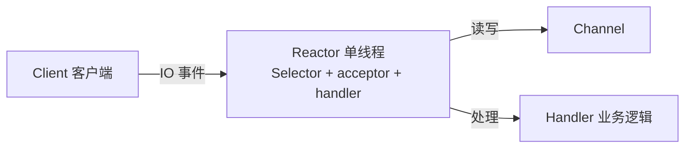
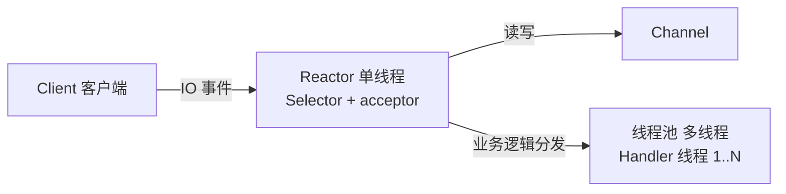
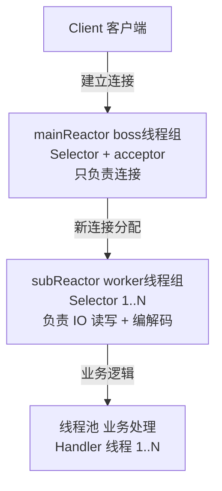

# Netty 与高性能网络模型

Netty 是 Java 生态中最常用的高性能网络通信框架之一。很多 RPC 框架、消息中间件客户端、网关、IM 服务、WebSocket 服务，底层都直接或间接使用了 Netty。

学习 Netty 的重点不是死记硬背 API，而是理解它如何围绕 `NIO`、事件驱动、线程模型、内存管理和协议编解码，构建出一套适合高并发场景的网络编程模型。

## 概念与背景

### 什么是 Netty

Netty 可以看作是对 Java `NIO` 的工程化封装。它在 `Selector`、`Channel`、`Buffer` 这些底层能力之上，补齐了网络开发真正难写、也最容易写错的部分，例如：

- 连接生命周期管理
- 线程模型组织
- 编解码与协议拆包
- 粘包半包处理
- 异常传播与资源释放
- 内存池与高性能缓冲区

因此，Netty 并不是"更快的 Socket API"，而是一套成熟的异步事件驱动网络框架。

### 为什么需要 Netty

直接使用原生 `BIO` 或 `NIO` 都有明显问题。

`BIO` 的典型问题是一个连接往往对应一个线程。当连接数上升到几千、几万时，会出现：

- 线程数量膨胀
- 上下文切换成本变高
- 栈内存占用显著增加
- 线程阻塞导致吞吐下降

原生 `NIO` 虽然解决了"一连接一线程"的问题，但实际开发仍然很繁琐，常见痛点包括：

- `Selector` 事件循环代码模板化且冗长
- 连接状态与异常处理容易遗漏
- 自定义协议的拆包组包复杂
- `ByteBuffer` 使用不够灵活
- 业务逻辑和网络逻辑容易耦合在一起

Netty 的价值就在于：把这些通用且复杂的网络编程问题抽象成稳定的组件和处理链，让业务代码更多聚焦在协议和业务本身。

### Netty 适合什么场景

Netty 常见于以下场景：

- RPC 框架
- 网关、代理、反向代理
- WebSocket、IM、推送服务
- 自定义二进制协议通信
- 对连接数、吞吐量、延迟敏感的服务端程序
- 需要长期维护长连接的基础设施组件

如果只是一个并发量不高、协议也很简单的短连接接口，未必必须使用 Netty。框架选择应基于复杂度和收益，而不是只看"性能"两个字。

## Netty 解决了什么问题

从工程角度看，Netty 主要解决了四类问题：

### 连接管理复杂

网络程序不仅要处理"收到消息"，还要处理：

- 建连成功
- 连接断开
- 异常触发
- 空闲超时
- 写缓冲区状态变化

这些事件如果直接自己维护，代码会很散。Netty 通过 `Channel` 和 `ChannelHandler` 把连接生命周期统一了起来。

### 原生 NIO 编程成本高

原生 `NIO` 的基本思路不复杂，但写成稳定、可维护、能扩展的服务并不简单。Netty 用：

- `EventLoop`
- `ChannelPipeline`
- `Future/Promise`
- 编解码器体系

把底层模板代码封装成了可组合、可扩展的开发模型。

### 协议边界处理困难

TCP 是字节流协议，不保证消息边界。真实项目里如果没有明确协议设计，就会遇到：

- 粘包
- 半包
- 包体解析失败
- 消息错位

Netty 提供了成熟的拆包器和编码器，可以显著降低协议处理错误率。

### 高并发场景下性能与稳定性要求更高

高性能从来不只是"跑得快"，还包括：

- 线程数是否可控
- 内存是否可控
- 是否容易产生阻塞
- 故障时是否容易隔离和恢复

Netty 在这些方面提供了系统化支持。

## Reactor 模型与 EventLoop

Netty 的底层思想可以概括为 Reactor 模型。可以先这样理解：

- Reactor 负责感知 IO 事件
- `EventLoop` 负责轮询事件并分发任务
- `Handler` 负责处理连接、解码、业务逻辑和响应

在 Netty 中，一个 `EventLoop` 通常绑定一个固定线程，这个线程会持续执行两类工作：

- 处理该线程负责的 `Channel` 上的 IO 事件
- 执行提交到该 `EventLoop` 的普通任务和定时任务

这种设计的关键价值是：

- 避免频繁创建线程
- 降低线程切换开销
- 保证同一个 `Channel` 上的事件串行执行

这也是 Netty 非常强调的一条实践原则：不要阻塞 `EventLoop` 线程。

### Reactor 线程模型详解

Reactor 模式是一种基于事件驱动的设计模式,用于处理一个或多个输入源并发产生的 IO 事件。Netty 支持 Reactor 模式的三种演进形态:

#### 单 Reactor 单线程模型



**特点:**
- 所有 IO 操作都在一个线程中完成
- 实现简单,没有线程通信开销

**问题:**
- 单线程无法利用多核 CPU
- 一个 Handler 阻塞会导致所有客户端请求被阻塞
- 适用于客户端数量少、业务逻辑简单的场景

#### 单 Reactor 多线程模型



**特点:**
- Reactor 线程只负责连接建立和 IO 读写
- 业务逻辑交给线程池处理
- 充分利用多核 CPU

**问题:**
- Reactor 线程仍需处理所有 IO 操作
- 高并发时可能成为性能瓶颈

#### 主从 Reactor 多线程模型 (Netty 默认)



**特点:**
- mainReactor 只负责连接建立,建立后交给 subReactor
- subReactor 负责 IO 读写和编解码
- 业务逻辑可以在线程池中异步处理
- 性能最优,是生产环境推荐方案

**优势:**
- 职责分离,每个 Reactor 专注于自己的任务
- 可以根据负载动态调整线程数
- 一个 Reactor 故障不会影响其他 Reactor

### EventLoop 源码分析

`EventLoop` 是 Netty 的核心组件,其继承关系如下:

```text
EventLoop (接口)
    └─ OrderedEventExecutor (接口,保证任务顺序执行)
        └─ EventExecutor (接口,事件执行器)
            └─ AbstractEventExecutor (抽象类)
                └─ AbstractScheduledEventExecutor (支持定时任务)
                    └─ SingleThreadEventExecutor (单线程执行器)
                        └─ SingleThreadEventLoop (单线程事件循环)
                            └─ NioEventLoop (NIO 实现)
                            └─ EpollEventLoop (Linux epoll 实现)
```

**核心方法:**

```java
// NioEventLoop 的核心执行逻辑
@Override
protected void run() {
    int selectCnt = 0;
    for (;;) {
        try {
            int strategy;
            try {
                // 1. 计算选择策略(是否有任务需要执行)
                strategy = selectStrategy.calculateStrategy(selectNowSupplier, hasTasks());
                switch (strategy) {
                    case SelectStrategy.CONTINUE:
                        continue;
                    case SelectStrategy.BUSY_WAIT:
                        // fall through to SELECT since busy wait is not supported
                    case SelectStrategy.SELECT:
                        // 2. 阻塞等待 IO 事件
                        long curDeadlineNanos = nextScheduledTaskDeadlineNanos();
                        if (curDeadlineNanos == -1L) {
                            curDeadlineNanos = NONE; // nothing on the calendar
                        }
                        nextWakeupNanos.set(curDeadlineNanos);
                        try {
                            if (!hasTasks()) {
                                strategy = select(curDeadlineNanos);
                            }
                        } finally {
                            // This timeout is applied to correct the timeout of select,
                            // so this needs to be reset every time.
                            nextWakeupNanos.set(AWAKE);
                        }
                        // fall through
                    default:
                }
            } catch (IOException e) {
                // 处理异常
                rebuildSelector0();
                selectCnt = 0;
                handleLoopException(e);
                continue;
            }

            // 3. 处理 IO 事件
            selectCnt++;
            cancelledKeys = 0;
            needsToSelectAgain = false;
            final int ioRatio = this.ioRatio;
            boolean ranTasks;
            if (ioRatio == 100) {
                try {
                    if (strategy > 0) {
                        processSelectedKeys();
                    }
                } finally {
                    // 4. 执行所有任务
                    ranTasks = runAllTasks();
                }
            } else {
                final long ioStartTime = System.nanoTime();
                try {
                    if (strategy > 0) {
                        processSelectedKeys();
                    }
                } finally {
                    final long ioTime = System.nanoTime() - ioStartTime;
                    // 5. 根据 ioRatio 控制任务执行时间
                    ranTasks = runAllTasks(ioTime * (100 - ioRatio) / ioRatio);
                }
            }

            if (ranTasks || strategy > 0) {
                if (selectCnt >= MIN_PREMATURE_SELECTOR_RETURNS && logger.isDebugEnabled()) {
                    logger.debug("Selector.select() returned prematurely {} times in a row for Selector {}.",
                            selectCnt - 1, selector);
                }
                selectCnt = 0;
            } else if (unexpectedSelectorWakeup(selectCnt)) { // Unexpected wakeup
                selectCnt = 0;
            }
        } catch (CancelledKeyException e) {
            // 处理异常
        } catch (Error e) {
            throw (Error) e;
        } catch (Throwable t) {
            handleLoopException(t);
        } finally {
            // Always handle shutdown even if the loop processing threw an exception.
            try {
                if (isShuttingDown()) {
                    closeAll();
                    if (confirmShutdown()) {
                        return;
                    }
                }
            } catch (Error e) {
                throw (Error) e;
            } catch (Throwable t) {
                handleLoopException(t);
            }
        }
    }
}
```

**关键点解析:**

1. **ioRatio 参数控制 IO 和任务执行时间比例**
   - 默认值 50,表示 IO 操作和任务执行各占一半时间
   - 设置为 100 表示优先处理 IO,任务可能饥饿
   - 设置为 0 表示任务执行时间无限制

2. **避免 JDK Epoll Bug**
   - `selectCnt` 计数器检测空轮询
   - 超过阈值会重建 Selector

3. **任务队列分类**
   - 普通任务队列 (taskQueue)
   - 定时任务队列 (scheduledTaskQueue)
   - 尾部任务队列 (tailQueue,用于任务执行后的清理)

### bossGroup 与 workerGroup

服务端通常会有两个线程组：

- `bossGroup`：负责接收客户端连接
- `workerGroup`：负责处理连接建立后的读写事件

可以把它理解为"接待线程"和"工作线程"的分工。常见流程是：

1. 服务端端口绑定完成，等待新的连接
2. `bossGroup` 收到连接请求
3. 新连接注册到某个 `workerGroup` 中的 `EventLoop`
4. 之后这个连接的读写、编解码、业务处理，都主要由对应的 `worker` 线程推进

这也是为什么同一个连接上的大部分处理具备天然的顺序性。

#### EventLoopGroup 配置最佳实践

```java
// 推荐配置
EventLoopGroup bossGroup = new NioEventLoopGroup(1); // boss 只需 1 个线程
EventLoopGroup workerGroup = new NioEventLoopGroup(); // 默认 CPU 核心数 * 2

// 高性能配置 (Linux 环境)
EventLoopGroup bossGroup = new EpollEventLoopGroup(1);
EventLoopGroup workerGroup = new EpollEventLoopGroup();

// 线程数计算公式
int threadCount = Math.max(1, SystemPropertyUtil.getInt(
    "io.netty.eventLoopThreads", 
    NettyRuntime.availableProcessors() * 2
));
```

**配置建议:**

1. **bossGroup 线程数**
   - 通常设置为 1,因为服务端端口绑定是单线程操作
   - 多个线程反而会增加竞争开销

2. **workerGroup 线程数**
   - 默认 CPU 核心数 * 2
   - IO 密集型可以适当增加(如 CPU 核心数 * 3)
   - CPU 密集型可以适当减少(如 CPU 核心数 + 1)

3. **ioRatio 调整**
   ```java
   // 根据 IO 和业务处理时间比例调整(ioRatio 设置在 NioEventLoop 上,而非 EventLoopGroup)
   ((NioEventLoop) workerGroup.next()).setIoRatio(70); // IO 占 70%, 任务占 30%
   ```

4. **线程命名**
   ```java
   EventLoopGroup workerGroup = new NioEventLoopGroup(
       Runtime.getRuntime().availableProcessors() * 2,
       new ThreadFactoryBuilder()
           .setNameFormat("netty-worker-%d")
           .setDaemon(true)
           .build()
   );
   ```

## Netty 核心组件详解

### Channel 组件体系

`Channel` 是 Netty 对网络连接或 IO 通道的抽象。它代表一个实体(如硬件设备、文件、网络套接字或能够执行 I/O 操作的程序组件)的开放连接。

#### Channel 继承体系

```text
Channel (接口)
    └─ AttributeMap (接口,属性映射)
        └─ AbstractChannel (抽象类)
            ├─ AbstractServerChannel (服务端通道基类)
            │   ├─ LocalServerChannel (本地通信)
            │   ├─ NioServerSocketChannel (NIO 服务端)
            │   └─ EpollServerSocketChannel (Linux epoll 服务端)
            └─ AbstractClientChannel (客户端通道基类)
                ├─ LocalChannel (本地通信)
                ├─ NioSocketChannel (NIO 客户端)
                └─ EpollSocketChannel (Linux epoll 客户端)
```

#### 常见 Channel 类型对比

| Channel 类型 | 描述 | 适用场景 | 性能 |
|---|---|---|---|
| NioSocketChannel | 基于 Java NIO 的 Socket 通道 | 跨平台通用 | 中等 |
| EpollSocketChannel | 基于 Linux epoll 的 Socket 通道 | Linux 高并发 | 高 |
| KQueueSocketChannel | 基于 macOS/BSD kqueue | macOS/BSD | 高 |
| LocalChannel | 本地进程内通信 | 测试、管道通信 | 最高 |
| EmbeddedChannel | 嵌入式测试通道 | 单元测试 | 测试用 |

#### Channel 核心方法

```java
public interface Channel extends AttributeMap, Comparable<Channel> {
    // 获取 EventLoop
    EventLoop eventLoop();
    
    // 获取父 Channel (服务端 Channel 的子 Channel)
    Channel parent();
    
    // 获取 Channel 配置
    ChannelConfig config();
    
    // 判断是否打开
    boolean isOpen();
    
    // 判断是否已注册
    boolean isRegistered();
    
    // 判断是否活跃 (已连接)
    boolean isActive();
    
    // 获取本地地址
    SocketAddress localAddress();
    
    // 获取远程地址
    SocketAddress remoteAddress();
    
    // 获取 Pipeline
    ChannelPipeline pipeline();
    
    // 获取 Unsafe (内部使用)
    Unsafe unsafe();
    
    // 异步绑定地址
    ChannelFuture bind(SocketAddress localAddress);
    
    // 异步连接远程地址
    ChannelFuture connect(SocketAddress remoteAddress);
    
    // 异步断开连接
    ChannelFuture disconnect();
    
    // 异步关闭
    ChannelFuture close();
    
    // 异步注销
    ChannelFuture deregister();
    
    // 同步写入消息
    ChannelFuture writeAndFlush(Object msg);
}
```

#### Channel 生命周期状态

```java
// Channel 状态流转图
@Sharable
public class ChannelStateHandler extends ChannelInboundHandlerAdapter {
    @Override
    public void channelRegistered(ChannelHandlerContext ctx) {
        // 状态 1: Channel 已注册到 EventLoop
        System.out.println("Channel 已注册: " + ctx.channel());
        ctx.fireChannelRegistered();
    }
    
    @Override
    public void channelUnregistered(ChannelHandlerContext ctx) {
        // 状态 2: Channel 从 EventLoop 注销
        System.out.println("Channel 已注销: " + ctx.channel());
        ctx.fireChannelUnregistered();
    }
    
    @Override
    public void channelActive(ChannelHandlerContext ctx) {
        // 状态 3: Channel 已激活 (可以读写)
        System.out.println("Channel 已激活: " + ctx.channel().remoteAddress());
        ctx.fireChannelActive();
    }
    
    @Override
    public void channelInactive(ChannelHandlerContext ctx) {
        // 状态 4: Channel 已失活 (连接断开)
        System.out.println("Channel 已失活: " + ctx.channel().remoteAddress());
        ctx.fireChannelInactive();
    }
}

// 状态转换图
/*
    [未注册] --register()--> [已注册] --channelActive()--> [活跃]
       ↑                        ↓                              ↓
       |                    channelInactive()              disconnect()
       |                        ↓                              ↓
    [已注销] <--unregister()-- [已注册] <--channelInactive()-- [失活]
*/
```

### ChannelPipeline 详解

每个 `Channel` 都会绑定一个 `ChannelPipeline`。它本质上是一条责任链，用来组织一组 `ChannelHandler`。

#### Pipeline 内部结构

```text
    I/O Request
       │
       ▼
┌──────────────────────────────────────────────────┐
│              ChannelPipeline                      │
│                                                   │
│  ┌─────────┬─────────┬─────────┬─────────┐      │
│  │ Handler │ Handler │ Handler │ Handler │      │
│  │   (1)   │   (2)   │   (3)   │   (4)   │      │
│  │ Inbound │ Inbound │Outbound │Outbound │      │
│  └────┬────┴────┬────┴────┬────┴────┬────┘      │
│       │         │         │         │            │
│       ▼         ▼         ▼         ▼            │
│  Inbound ←─── Inbound ←──│──→ Outbound → Outbound│
│  Head ───────────────────┼─────────────────── Tail│
└──────────────────────────────────────────────────┘
       │         ▲                   │
       ▼         │                   ▼
   SocketRead    │              SocketWrite
                 │
            TailContext
         (自动释放资源)
```

#### Pipeline 核心源码

```java
public class DefaultChannelPipeline implements ChannelPipeline {
    // 头节点和尾节点
    final AbstractChannelHandlerContext head;
    final AbstractChannelHandlerContext tail;
    
    // 添加 Handler
    @Override
    public final ChannelPipeline addLast(String name, ChannelHandler handler) {
        return addLast(null, name, handler);
    }
    
    @Override
    public final ChannelPipeline addLast(EventExecutorGroup group, String name, ChannelHandler handler) {
        final AbstractChannelHandlerContext newCtx;
        synchronized (this) {
            // 1. 检查是否重复添加非 @Sharable 的 Handler
            checkMultiplicity(handler);
            
            // 2. 创建 Context 节点
            newCtx = newContext(group, filterName(name, handler), handler);
            
            // 3. 添加到链表尾部
            addLast0(newCtx);
            
            // 4. 如果 Channel 未注册,设置为待添加状态
            if (!registered) {
                newCtx.setAddPending();
                callHandlerCallbackLater(newCtx, true);
                return this;
            }
            
            // 5. 回调 handlerAdded
            callHandlerAdded0(newCtx);
        }
        return this;
    }
    
    private void addLast0(AbstractChannelHandlerContext newCtx) {
        AbstractChannelHandlerContext prev = tail.prev;
        newCtx.prev = prev;
        newCtx.next = tail;
        prev.next = newCtx;
        tail.prev = newCtx;
    }
}
```

#### Pipeline 典型配置示例

```java
// 服务端 Pipeline 典型配置
channel.pipeline()
    // ===== 入站处理器 (从前到后) =====
    .addLast("frameDecoder", new LengthFieldBasedFrameDecoder(1024, 0, 4, 0, 4))
    .addLast("stringDecoder", new StringDecoder(StandardCharsets.UTF_8))
    .addLast("idleStateHandler", new IdleStateHandler(60, 0, 0))
    .addLast("heartbeatHandler", new HeartbeatHandler())
    .addLast("businessHandler", new BusinessHandler())
    
    // ===== 出站处理器 (从后到前) =====
    .addLast("stringEncoder", new StringEncoder(StandardCharsets.UTF_8))
    .addLast("frameEncoder", new LengthFieldPrepender(4))
    .addLast("exceptionHandler", new ExceptionHandler());
```

### ChannelHandler 核心体系

`ChannelHandler` 是 Netty 里最核心的扩展点。它分为入站和出站两大类。

#### Handler 继承体系

```text
ChannelHandler (接口)
    ├─ ChannelInboundHandler (入站接口)
    │   └─ ChannelInboundHandlerAdapter (入站适配器)
    │       ├─ SimpleChannelInboundHandler<I> (自动释放消息)
    │       ├─ ByteToMessageDecoder (字节解码器)
    │       │   ├─ LineBasedFrameDecoder (换行符拆包)
    │       │   ├─ DelimiterBasedFrameDecoder (分隔符拆包)
    │       │   ├─ LengthFieldBasedFrameDecoder (长度字段拆包)
    │       │   └─ ReplayingDecoder<S> (可重放解码器)
    │       └─ MessageToMessageDecoder<I> (消息到消息解码器)
    │
    └─ ChannelOutboundHandler (出站接口)
        └─ ChannelOutboundHandlerAdapter (出站适配器)
            ├─ MessageToByteEncoder<I> (消息编码器)
            │   └─ LengthFieldPrepender (长度字段编码)
            └─ MessageToMessageEncoder<I> (消息到消息编码器)
```

#### 入站与出站处理器对比

| 特性 | ChannelInboundHandler | ChannelOutboundHandler |
|---|---|---|
| 处理方向 | 入站 (从网络到应用) | 出站 (从应用到网络) |
| 事件流向 | 从 Head 到 Tail | 从 Tail 到 Head |
| 典型事件 | channelRegistered、channelActive、channelRead、channelInactive | bind、connect、write、flush、close |
| 典型用途 | 解码、认证、业务处理、心跳 | 编码、日志、统计 |
| 异常处理 | exceptionCaught | close、disconnect |

#### Handler 生命周期方法

```java
public interface ChannelHandler {
    // Handler 被添加到 Pipeline 时调用
    void handlerAdded(ChannelHandlerContext ctx) throws Exception;
    
    // Handler 从 Pipeline 移除时调用
    void handlerRemoved(ChannelHandlerContext ctx) throws Exception;
    
    // 标记该 Handler 是否可被多个 Pipeline 共享
    @Deprecated
    void exceptionCaught(ChannelHandlerContext ctx, Throwable cause) throws Exception;
    
    // Sharable 注解
    @Inherited
    @Documented
    @Target(ElementType.TYPE)
    @Retention(RetentionPolicy.RUNTIME)
    @interface Sharable {
        // 标记 Handler 可以被多个 Pipeline 共享
    }
}

// 入站 Handler 生命周期
public interface ChannelInboundHandler extends ChannelHandler {
    void channelRegistered(ChannelHandlerContext ctx) throws Exception;
    void channelUnregistered(ChannelHandlerContext ctx) throws Exception;
    void channelActive(ChannelHandlerContext ctx) throws Exception;
    void channelInactive(ChannelHandlerContext ctx) throws Exception;
    void channelRead(ChannelHandlerContext ctx, Object msg) throws Exception;
    void channelReadComplete(ChannelHandlerContext ctx) throws Exception;
    void userEventTriggered(ChannelHandlerContext ctx, Object evt) throws Exception;
    void channelWritabilityChanged(ChannelHandlerContext ctx) throws Exception;
    void exceptionCaught(ChannelHandlerContext ctx, Throwable cause) throws Exception;
}
```

### Inbound 与 Outbound 的传播方向

这是 Netty 初学者最容易混淆的点之一：

- 入站事件从前往后传播，例如 `channelActive`、`channelRead`
- 出站事件从后往前传播，例如 `write`、`flush`

#### 事件传播示例

```java
// Pipeline 配置
pipeline.addLast("A", new InboundHandlerA());  // 入站
pipeline.addLast("B", new InboundHandlerB());  // 入站
pipeline.addLast("C", new OutboundHandlerC()); // 出站
pipeline.addLast("D", new OutboundHandlerD()); // 出站

// 入站事件传播顺序: A -> B -> C -> D (C 和 D 不处理入站事件)
// 出站事件传播顺序: D -> C -> B -> A (B 和 A 不处理出站事件)

// 典型示例
public class InboundHandlerA extends ChannelInboundHandlerAdapter {
    @Override
    public void channelRead(ChannelHandlerContext ctx, Object msg) {
        System.out.println("InboundHandler A: " + msg);
        ctx.fireChannelRead(msg); // 传播给下一个 InboundHandler
    }
}

public class OutboundHandlerC extends ChannelOutboundHandlerAdapter {
    @Override
    public void write(ChannelHandlerContext ctx, Object msg, ChannelPromise promise) {
        System.out.println("OutboundHandler C: " + msg);
        ctx.write(msg, promise); // 传播给下一个 OutboundHandler
    }
}
```

#### Handler 顺序重要性

```java
// × 错误示例:编码器放在业务处理器之前
pipeline.addLast("encoder", new StringEncoder());      // 出站
pipeline.addLast("decoder", new StringDecoder());      // 入站
pipeline.addLast("business", new BusinessHandler());   // 入站

// 问题: 写入 String 时,编码器在业务处理器之前,无法拦截处理
// 出站顺序: business(不处理出站) -> decoder(不处理出站) -> encoder

// √ 正确示例:编码器放在业务处理器之后
pipeline.addLast("decoder", new StringDecoder());      // 入站
pipeline.addLast("business", new BusinessHandler());   // 入站
pipeline.addLast("encoder", new StringEncoder());      // 出站

// 出站顺序: encoder -> business(不处理) -> decoder(不处理) -> network
```

#### ShortCircuit 示例 (短路处理)

```java
// 在某个 Handler 中不调用 fireXxx 方法,则事件传播终止
public class AuthHandler extends ChannelInboundHandlerAdapter {
    @Override
    public void channelRead(ChannelHandlerContext ctx, Object msg) {
        if (!isAuthenticated(ctx)) {
            // 认证失败,不传播事件,直接关闭连接
            ctx.writeAndFlush("Authentication failed");
            ctx.close();
            return; // 不调用 fireChannelRead,事件传播终止
        }
        // 认证成功,继续传播
        ctx.fireChannelRead(msg);
    }
}
```

## ByteBuf 与内存管理

### 为什么不直接使用 ByteBuffer

Netty 没有直接把原生 `ByteBuffer` 作为主要缓冲区抽象，而是设计了 `ByteBuf`。原因主要有：

- 读写索引分离，使用更直观
- 动态扩容能力更好
- 支持堆内与堆外内存
- 更容易配合内存池复用
- 提供切片、组合等更高效的能力

在高并发网络场景下，缓冲区的分配和回收频率非常高。如果每次都创建新的对象，GC 压力会明显增大。

### ByteBuf 核心原理

#### ByteBuffer vs ByteBuf 对比

| 特性 | ByteBuffer (JDK) | ByteBuf (Netty) |
|---|---|---|
| 读写索引 | 单指针,需 flip() 切换 | 双指针,无需切换 |
| 动态扩容 | 不支持,需手动创建新缓冲区 | 支持,自动扩容 |
| 堆外内存 | 支持 (DirectByteBuffer) | 支持 (DirectByteBuf) |
| 内存池 | 不支持 | 支持 (PooledByteBuf) |
| 引用计数 | 不支持 | 支持 (ReferenceCounted) |
| 切片与组合 | 支持切片 | 支持切片与组合 (CompositeByteBuf) |
| 零拷贝 | 不支持 | 支持 (FileRegion、slice、composite) |
| 线程安全 | 不安全 | 部分实现支持 (如 UnpooledUnsafeDirectByteBuf) |

#### ByteBuf 内部结构

```text
      +-------------------+------------------+------------------+
      | discardable bytes |  readable bytes  |  writable bytes  |
      |                   |     (content)    |                  |
      +-------------------+------------------+------------------+
      |                   |                  |                  |
      0      <=      readerIndex   <=   writerIndex    <=    capacity
```

```java
// ByteBuf 核心属性
public abstract class AbstractByteBuf extends ByteBuf {
    int readerIndex;  // 读索引
    int writerIndex;  // 写索引
    int markedReaderIndex;  // 标记的读索引
    int markedWriterIndex;  // 标记的写索引
    int maxCapacity;  // 最大容量
}
```

#### ByteBuf 核心方法

```java
public abstract class ByteBuf implements ReferenceCounted, Comparable<ByteBuf> {
    // ===== 读写操作 =====
    
    // 读取数据
    public abstract byte readByte();
    public abstract ByteBuf readBytes(byte[] dst);
    public abstract ByteBuf readBytes(ByteBuf dst);
    public abstract int readInt();
    public abstract long readLong();
    
    // 写入数据
    public abstract ByteBuf writeByte(int value);
    public abstract ByteBuf writeBytes(byte[] src);
    public abstract ByteBuf writeBytes(ByteBuf src);
    public abstract ByteBuf writeInt(int value);
    public abstract ByteBuf writeLong(long value);
    
    // ===== 索引操作 =====
    
    public abstract int readerIndex();
    public abstract ByteBuf readerIndex(int readerIndex);
    public abstract int writerIndex();
    public abstract ByteBuf writerIndex(int writerIndex);
    public abstract int readableBytes();  // writerIndex - readerIndex
    public abstract int writableBytes();  // capacity - writerIndex
    
    // ===== 标记与重置 =====
    
    public abstract ByteBuf markReaderIndex();
    public abstract ByteBuf resetReaderIndex();
    public abstract ByteBuf markWriterIndex();
    public abstract ByteBuf resetWriterIndex();
    
    // ===== 容量操作 =====
    
    public abstract int capacity();
    public abstract ByteBuf capacity(int newCapacity);
    public abstract ByteBuf ensureWritable(int minWritableBytes);
    
    // ===== 零拷贝操作 =====
    
    public abstract ByteBuf slice();  // 切片,共享底层数组
    public abstract ByteBuf slice(int index, int length);
    public abstract ByteBuf duplicate();  // 复制,共享底层数组
    public abstract ByteBuf copy();  // 深拷贝
    
    // ===== 组合缓冲区 =====
    
    public abstract ByteBuf retainedSlice();
    public abstract ByteBuf retainedDuplicate();
}
```

#### ByteBuf 类型体系

```text
ByteBuf (抽象类)
    ├─ AbstractByteBuf (抽象基类)
    │   ├─ AbstractReferenceCountedByteBuf (引用计数)
    │   │   ├─ PooledByteBuf (池化)
    │   │   │   ├─ PooledHeapByteBuf (池化堆内存)
    │   │   │   ├─ PooledDirectByteBuf (池化直接内存)
    │   │   │   ├─ PooledUnsafeHeapByteBuf (池化不安全堆内存)
    │   │   │   └─ PooledUnsafeDirectByteBuf (池化不安全直接内存)
    │   │   └─ UnpooledByteBuf (非池化)
    │   │       ├─ UnpooledHeapByteBuf (非池化堆内存)
    │   │       └─ UnpooledDirectByteBuf (非池化直接内存)
    │   └─ EmptyByteBuf (空缓冲区)
    └─ CompositeByteBuf (组合缓冲区)
```

#### ByteBuf 创建方式

```java
// 1. 使用 Unpooled 工具类创建 (推荐)
ByteBuf heapBuffer = Unpooled.buffer(256);  // 堆内存
ByteBuf directBuffer = Unpooled.directBuffer(256);  // 直接内存
ByteBuf wrappedBuffer = Unpooled.wrappedBuffer(new byte[128]);  // 包装字节数组
ByteBuf copiedBuffer = Unpooled.copiedBuffer("Hello", StandardCharsets.UTF_8);  // 复制字符串

// 2. 使用 ByteBufAllocator 创建 (推荐,支持池化)
ByteBufAllocator allocator = ByteBufAllocator.DEFAULT;
ByteBuf buffer = allocator.buffer(256);  // 自动选择堆或直接内存
ByteBuf heapBuffer = allocator.heapBuffer(256);  // 堆内存
ByteBuf directBuffer = allocator.directBuffer(256);  // 直接内存
ByteBuf ioBuffer = allocator.ioBuffer(256);  // IO 缓冲区 (通常为直接内存)

// 3. 从 Channel 获取 Allocator
ByteBufAllocator alloc = ctx.alloc();
ByteBuf buffer = alloc.buffer();

// 4. 组合多个 ByteBuf (零拷贝)
ByteBuf header = Unpooled.copiedBuffer("Header", StandardCharsets.UTF_8);
ByteBuf body = Unpooled.copiedBuffer("Body", StandardCharsets.UTF_8);
CompositeByteBuf composite = Unpooled.wrappedBuffer(header, body);
```

### 零拷贝技术详解

Netty 的零拷贝体现在多个层面,不仅仅是操作系统层面的零拷贝,更包括应用层面的数据零拷贝。

#### 零拷贝技术应用场景

```java
// 1. slice() 切片 - 共享底层数组
ByteBuf source = Unpooled.copiedBuffer("Hello World", StandardCharsets.UTF_8);
ByteBuf slice = source.slice(0, 5);  // 切片 "Hello"
// slice 和 source 共享同一个底层数组,没有数据复制

// 2. duplicate() 复制 - 共享底层数组
ByteBuf duplicate = source.duplicate();
// duplicate 和 source 共享底层数组,只是独立的读写索引

// 3. CompositeByteBuf 组合缓冲区 - 多个缓冲区逻辑组合
ByteBuf header = Unpooled.copiedBuffer("Header\n", StandardCharsets.UTF_8);
ByteBuf body = Unpooled.copiedBuffer("Body\n", StandardCharsets.UTF_8);
ByteBuf footer = Unpooled.copiedBuffer("Footer", StandardCharsets.UTF_8);

// × 传统方式:复制数据到新缓冲区
ByteBuf traditional = Unpooled.buffer(header.readableBytes() + body.readableBytes() + footer.readableBytes());
traditional.writeBytes(header);
traditional.writeBytes(body);
traditional.writeBytes(footer);

// √ 零拷贝方式:逻辑组合,无内存复制
CompositeByteBuf composite = Unpooled.wrappedBuffer(header, body, footer);

// 4. FileRegion 文件传输 - 操作系统零拷贝
File file = new File("large-file.txt");
FileInputStream in = new FileInputStream(file);
FileRegion region = new DefaultFileRegion(in.getChannel(), 0, file.length());
ctx.writeAndFlush(region);  // 使用 sendfile 系统调用,零拷贝

// 5. transferTo 实现文件传输
public void transferFile(ChannelHandlerContext ctx, File file) throws IOException {
    RandomAccessFile raf = new RandomAccessFile(file, "r");
    long length = raf.length();
    DefaultFileRegion region = new DefaultFileRegion(raf.getChannel(), 0, length);
    ctx.writeAndFlush(region).addListener(future -> {
        raf.close();
        if (!future.isSuccess()) {
            future.cause().printStackTrace();
        }
    });
}
```

#### 零拷贝对比表格

| 方式 | 数据复制次数 | CPU 开销 | 内存占用 | 适用场景 |
|---|---|---|---|---|
| 传统方式 | 4 次 (磁盘→内核→用户→内核→网卡) | 高 | 高 | 小文件 |
| mmap + write | 3 次 | 中 | 中 | 中等文件 |
| sendfile (FileRegion) | 2 次 (磁盘→内核→网卡) | 低 | 低 | 大文件 |
| slice/duplicate | 0 次 | 最低 | 最低 | 缓冲区操作 |
| CompositeByteBuf | 0 次 | 最低 | 最低 | 多缓冲区组合 |

### 内存池化技术

Netty 通过内存池大幅降低 GC 压力,提升性能。

#### 内存池架构

```text
Arena (内存区域)
    ├─ HeapArena (堆内存区域)
    │   ├─ SmallSubpagePools (小页内存池)
    │   └─ NormalPool (普通内存池)
    └─ DirectArena (直接内存区域)
        ├─ SmallSubpagePools (小页内存池)
        └─ NormalPool (普通内存池)

PoolThreadCache (线程本地缓存)
    ├─ HeapArena (绑定到当前线程的 Arena)
    └─ DirectArena (绑定到当前线程的 Arena)
```

#### 池化与非池化性能对比

```java
// 测试代码
public class ByteBufPerformanceTest {
    private static final int COUNT = 10000000;
    
    public static void main(String[] args) {
        // 非池化测试
        long start = System.nanoTime();
        for (int i = 0; i < COUNT; i++) {
            ByteBuf buf = Unpooled.buffer(1024);
            buf.release();
        }
        long unpooledTime = System.nanoTime() - start;
        
        // 池化测试
        ByteBufAllocator pooledAllocator = new PooledByteBufAllocator(true);
        start = System.nanoTime();
        for (int i = 0; i < COUNT; i++) {
            ByteBuf buf = pooledAllocator.buffer(1024);
            buf.release();
        }
        long pooledTime = System.nanoTime() - start;
        
        System.out.println("Unpooled: " + unpooledTime / 1_000_000 + " ms");
        System.out.println("Pooled: " + pooledTime / 1_000_000 + " ms");
        System.out.println("Pooled is " + (unpooledTime * 1.0 / pooledTime) + "x faster");
    }
}

// 结果示例:
// Unpooled: 2845 ms
// Pooled: 856 ms
// Pooled is 3.32x faster
```

#### 池化配置参数

```java
// 启动参数配置
// -Dio.netty.allocator.type=pooled  # 使用池化分配器 (默认)
// -Dio.netty.allocator.type=unpooled  # 使用非池化分配器

// 代码配置
Bootstrap bootstrap = new Bootstrap();
bootstrap.option(ChannelOption.ALLOCATOR, PooledByteBufAllocator.DEFAULT);

ServerBootstrap serverBootstrap = new ServerBootstrap();
serverBootstrap.option(ChannelOption.ALLOCATOR, PooledByteBufAllocator.DEFAULT);
serverBootstrap.childOption(ChannelOption.ALLOCATOR, PooledByteBufAllocator.DEFAULT);

// 自定义池化配置
PooledByteBufAllocator allocator = new PooledByteBufAllocator(
    true,  // preferDirect
    0,     // nHeapArena
    0,     // nDirectArena
    8192,  // pageSize
    11,    // maxOrder
    0,     // tinyCacheSize
    0,     // smallCacheSize
    0      // normalCacheSize
);
```

### 引用计数机制

Netty 的很多缓冲区对象采用引用计数机制。简单理解就是：

- 使用中：引用计数大于 0
- 不再使用：需要释放，引用计数归零

如果消息对象没有正确释放，可能导致直接内存泄漏。为了降低使用难度，业务处理中通常优先使用：

- `SimpleChannelInboundHandler`

它在处理完成后会自动释放入站消息对象，更适合大多数教学和业务场景。

#### 引用计数核心接口

```java
public interface ReferenceCounted {
    // 获取引用计数
    int refCnt();
    
    // 增加引用计数
    ReferenceCounted retain();
    ReferenceCounted retain(int increment);
    
    // 记录引用计数 (用于调试)
    boolean touch();
    boolean touch(Object hint);
    
    // 减少引用计数,如果计数为 0 则释放资源
    boolean release();
    boolean release(int decrement);
}
```

#### 引用计数使用示例

```java
// 方式 1: 使用 SimpleChannelInboundHandler (推荐)
public class SimpleHandler extends SimpleChannelInboundHandler<ByteBuf> {
    @Override
    protected void channelRead0(ChannelHandlerContext ctx, ByteBuf msg) {
        // SimpleChannelInboundHandler 会自动释放 msg
        String data = msg.toString(StandardCharsets.UTF_8);
        System.out.println("Received: " + data);
    }
}

// 方式 2: 使用 ChannelInboundHandlerAdapter 手动释放
public class ManualHandler extends ChannelInboundHandlerAdapter {
    @Override
    public void channelRead(ChannelHandlerContext ctx, Object msg) {
        try {
            ByteBuf buf = (ByteBuf) msg;
            String data = buf.toString(StandardCharsets.UTF_8);
            System.out.println("Received: " + data);
        } finally {
            // 手动释放,必须调用
            ReferenceCountUtil.release(msg);
        }
    }
}

// 方式 3: 使用 try-with-resources (ByteBuf 实现了 ReferenceCounted)
public class TryWithResourcesHandler extends ChannelInboundHandlerAdapter {
    @Override
    public void channelRead(ChannelHandlerContext ctx, Object msg) {
        ByteBuf buf = (ByteBuf) msg;
        try {
            String data = buf.toString(StandardCharsets.UTF_8);
            System.out.println("Received: " + data);
        } finally {
            buf.release();
        }
    }
}

// 方式 4: 传递给下一个 Handler
public class ForwardHandler extends ChannelInboundHandlerAdapter {
    @Override
    public void channelRead(ChannelHandlerContext ctx, Object msg) {
        // 增加引用计数
        ReferenceCountUtil.retain(msg);
        
        // 传递给下一个 Handler
        ctx.fireChannelRead(msg);
        
        // 释放当前引用
        ReferenceCountUtil.release(msg);
    }
}
```

#### 内存泄漏检测工具

```java
// 启用内存泄漏检测 (开发环境)
// -Dio.netty.leakDetection.level=SIMPLE  # 简单检测 (默认)
// -Dio.netty.leakDetection.level=ADVANCED  # 高级检测
// -Dio.netty.leakDetection.level=PARANOID  # 偏执检测 (最详细,性能影响大)

// ResourceLeakDetector 源码关键逻辑
public enum Level {
    DISABLED,   // 禁用泄漏检测
    SIMPLE,     // 简单检测,1/128 采样率
    ADVANCED,   // 高级检测,1/128 采样率,报告泄漏对象的访问记录
    PARANOID    // 偏执检测,100% 采样,报告所有对象的访问记录
}

// 检测到泄漏时的日志示例
// LEAK: ByteBuf.release() was not called before it's garbage-collected. 
// Recent access records: 
// #1: io.netty.handler.codec.ByteToMessageDecoder.channelRead(ByteToMessageDecoder.java:286)
// #2: io.netty.channel.DefaultChannelPipeline.touch(DefaultChannelPipeline.java:116)
```

## 粘包、半包与协议设计

### 为什么会出现粘包和半包

TCP 只保证字节流可靠传输，不保证应用层消息边界。发送端写入两条消息：

- 消息 A
- 消息 B

接收端可能一次读取到：

- 只读到 A 的一部分
- 正好读到一个完整 A
- 一次读到完整 A 和完整 B
- 读到完整 A 加上 B 的前半部分

所以问题的本质不是"网络不稳定"，而是应用层没有定义好消息边界。

### 常见解决方案

| 方案 | 思路 | 适用场景 | 特点 |
|---|---|---|---|
| 固定长度协议 | 每条消息长度固定 | 长度稳定的简单协议 | 实现简单，但空间利用率低 |
| 分隔符协议 | 用特殊字符分隔消息 | 文本协议 | 直观，但要考虑转义问题 |
| 长度字段协议 | 消息头中声明包体长度 | 二进制协议、变长消息 | 最常见，也最通用 |

真实项目里最常见的是长度字段协议，因为它更适合可扩展的二进制通信格式。

### Netty 编解码器详解

Netty 提供了丰富的编解码器,帮助开发者快速实现各种协议。

#### 编解码器继承体系

```text
ByteToMessageDecoder (字节到消息解码器)
    ├─ FixedLengthFrameDecoder (固定长度拆包)
    ├─ LineBasedFrameDecoder (换行符拆包)
    ├─ DelimiterBasedFrameDecoder (分隔符拆包)
    ├─ LengthFieldBasedFrameDecoder (长度字段拆包)
    ├─ JsonObjectDecoder (JSON 对象解码)
    ├─ Base64Decoder (Base64 解码)
    └─ ReplayingDecoder<S> (可重放解码器)

MessageToMessageDecoder<I> (消息到消息解码器)
    ├─ StringDecoder (字符串解码)
    ├─ JsonObjectDecoder (JSON 解码)
    └─ 自定义解码器

MessageToByteEncoder<I> (消息到字节编码器)
    ├─ LengthFieldPrepender (长度字段编码)
    ├─ Base64Encoder (Base64 编码)
    └─ 自定义编码器

MessageToMessageEncoder<I> (消息到消息编码器)
    ├─ StringEncoder (字符串编码)
    └─ 自定义编码器
```

### Netty 中的典型拆包器

Netty 提供了很多现成组件：

- `LineBasedFrameDecoder`
- `DelimiterBasedFrameDecoder`
- `LengthFieldBasedFrameDecoder`

其中 `LengthFieldBasedFrameDecoder` 最值得掌握，因为很多自定义协议都可以套用这个思路。

假设协议格式如下：

```text
+----------------+----------------------+
| 4字节消息长度   |     真实消息内容       |
+----------------+----------------------+
```

那么服务端可以根据前 4 个字节先读取出包长，再继续读取完整消息体，而不是盲目按一次 `read` 的结果直接解析。

#### FixedLengthFrameDecoder 固定长度拆包

```java
// 每条消息固定 20 字节
pipeline.addLast(new FixedLengthFrameDecoder(20));

// 适用场景:
// - 消息长度固定
// - 简单的二进制协议
// - 空间利用率低,不推荐
```

#### LineBasedFrameDecoder 换行符拆包

```java
// 使用换行符 \n 或 \r\n 作为消息分隔符
pipeline.addLast(new LineBasedFrameDecoder(1024));  // 最大帧长度 1024
pipeline.addLast(new StringDecoder());

// 适用场景:
// - 文本协议
// - 简单的命令行协议
// - HTTP 头部解析
```

#### DelimiterBasedFrameDecoder 分隔符拆包

```java
// 使用自定义分隔符
ByteBuf delimiter = Unpooled.copiedBuffer("$$$", StandardCharsets.UTF_8);
pipeline.addLast(new DelimiterBasedFrameDecoder(1024, delimiter));
pipeline.addLast(new StringDecoder());

// 多个分隔符
ByteBuf delimiter1 = Unpooled.copiedBuffer("\r\n", StandardCharsets.UTF_8);
ByteBuf delimiter2 = Unpooled.copiedBuffer("\n", StandardCharsets.UTF_8);
pipeline.addLast(new DelimiterBasedFrameDecoder(1024, delimiter1, delimiter2));

// 适用场景:
// - 自定义文本协议
// - 需要特殊分隔符的场景
```

#### LengthFieldBasedFrameDecoder 长度字段拆包详解

这是最强大的拆包器,支持多种协议格式。

```java
public LengthFieldBasedFrameDecoder(
    int maxFrameLength,         // 最大帧长度
    int lengthFieldOffset,      // 长度字段偏移量
    int lengthFieldLength,      // 长度字段长度 (1/2/3/4/8 字节)
    int lengthAdjustment,       // 长度调整值
    int initialBytesToStrip     // 跳过的字节数
)
```

**参数详解示例:**

```text
示例 1: 最简单的情况
协议格式: [长度(4字节)][消息体]
数据:     [00 00 00 0C][48 65 6C 6C 6F 20 57 6F 72 6C 64 21]
          (长度=12)    (Hello World!)

参数:
  maxFrameLength = 1024
  lengthFieldOffset = 0      // 长度字段从第 0 字节开始
  lengthFieldLength = 4      // 长度字段占 4 字节
  lengthAdjustment = 0       // 无需调整
  initialBytesToStrip = 4    // 跳过长度字段

解码后: [48 65 6C 6C 6F 20 57 6F 72 6C 64 21] (Hello World!)

示例 2: 带版本号的协议
协议格式: [版本号(2字节)][长度(4字节)][消息体]
数据:     [00 01][00 00 00 0C][48 65 6C 6C 6F 20 57 6F 72 6C 64 21]
          (v1)  (长度=12)    (Hello World!)

参数:
  maxFrameLength = 1024
  lengthFieldOffset = 2      // 长度字段从第 2 字节开始
  lengthFieldLength = 4      // 长度字段占 4 字节
  lengthAdjustment = 0       // 无需调整
  initialBytesToStrip = 6    // 跳过版本号和长度字段

解码后: [48 65 6C 6C 6F 20 57 6F 72 6C 64 21] (Hello World!)

示例 3: 长度字段包含自身长度
协议格式: [总长度(4字节)][消息体]
数据:     [00 00 00 10][48 65 6C 6C 6F 20 57 6F 72 6C 64 21]
          (长度=16)     (Hello World!)
          注: 16 = 4(长度字段) + 12(消息体)

参数:
  maxFrameLength = 1024
  lengthFieldOffset = 0      // 长度字段从第 0 字节开始
  lengthFieldLength = 4      // 长度字段占 4 字节
  lengthAdjustment = -4      // 减去长度字段本身
  initialBytesToStrip = 4    // 跳过长度字段

解码后: [48 65 6C 6C 6F 20 57 6F 72 6C 64 21] (Hello World!)

示例 4: 带魔数和版本号
协议格式: [魔数(4字节)][版本号(2字节)][长度(4字节)][消息体]
数据:     [CA FE BA BE][00 01][00 00 00 0C][48 65 6C 6C 6F ...]

参数:
  maxFrameLength = 1024
  lengthFieldOffset = 6      // 长度字段从第 6 字节开始
  lengthFieldLength = 4      // 长度字段占 4 字节
  lengthAdjustment = 0       // 无需调整
  initialBytesToStrip = 10   // 跳过魔数、版本号、长度字段

解码后: [48 65 6C 6C 6F 20 57 6F 72 6C 64 21] (Hello World!)
```

**完整示例代码:**

```java
// 协议格式: [长度(4字节)][消息体]
pipeline.addLast(new LengthFieldBasedFrameDecoder(
    1024,   // 最大帧长度 1024 字节
    0,      // 长度字段从第 0 字节开始
    4,      // 长度字段占 4 字节
    0,      // 无需调整
    4       // 跳过长度字段
));
pipeline.addLast(new StringDecoder(StandardCharsets.UTF_8));
pipeline.addLast(new StringEncoder(StandardCharsets.UTF_8));
pipeline.addLast(new LengthFieldPrepender(4));  // 出站时自动添加长度字段
```

#### 自定义编解码器

```java
// 自定义消息格式: [魔数(4字节)][版本号(2字节)][长度(4字节)][消息体]
public class CustomMessage {
    private int magic;       // 魔数
    private short version;   // 版本号
    private byte[] body;     // 消息体
}

// 编码器
public class CustomEncoder extends MessageToByteEncoder<CustomMessage> {
    @Override
    protected void encode(ChannelHandlerContext ctx, CustomMessage msg, ByteBuf out) {
        out.writeInt(msg.getMagic());
        out.writeShort(msg.getVersion());
        out.writeInt(msg.getBody().length);
        out.writeBytes(msg.getBody());
    }
}

// 解码器
public class CustomDecoder extends ByteToMessageDecoder {
    @Override
    protected void decode(ChannelHandlerContext ctx, ByteBuf in, List<Object> out) {
        // 检查是否可读至少 10 字节 (魔数 + 版本号 + 长度)
        if (in.readableBytes() < 10) {
            return;
        }
        
        // 标记读索引
        in.markReaderIndex();
        
        // 读取魔数
        int magic = in.readInt();
        if (magic != 0xCAFEBAFE) {
            ctx.close();
            return;
        }
        
        // 读取版本号
        short version = in.readShort();
        
        // 读取长度
        int length = in.readInt();
        if (length < 0 || length > 1024) {
            ctx.close();
            return;
        }
        
        // 检查是否可读完整的消息体
        if (in.readableBytes() < length) {
            in.resetReaderIndex();
            return;
        }
        
        // 读取消息体
        byte[] body = new byte[length];
        in.readBytes(body);
        
        // 创建消息对象
        CustomMessage message = new CustomMessage(magic, version, body);
        out.add(message);
    }
}
```

### ReplayingDecoder 可重放解码器

`ReplayingDecoder` 是 `ByteToMessageDecoder` 的特殊实现,它允许你像操作完整缓冲区一样操作部分缓冲区,无需手动检查可读字节数。

```java
public class CustomReplayingDecoder extends ReplayingDecoder<Void> {
    @Override
    protected void decode(ChannelHandlerContext ctx, ByteBuf in, List<Object> out) {
        // ReplayingDecoder 会自动检查可读字节数
        // 如果不够会自动等待,无需手动检查
        
        int magic = in.readInt();    // 如果可读字节不够,会等待
        short version = in.readShort();
        int length = in.readInt();
        
        byte[] body = new byte[length];
        in.readBytes(body);          // 如果可读字节不够,会等待
        
        out.add(new CustomMessage(magic, version, body));
    }
}
```

**ReplayingDecoder 注意事项:**

1. 性能比 `ByteToMessageDecoder` 稍慢
2. 某些操作不支持 (如 `readBytes(byte[] dst, int dstIndex, int length)`)
3. 所有 `ByteBuf` 方法都可能抛出 `ReplayError`
4. 适合简单的解码场景

### 编解码最佳实践

```java
// 1. 拆包器 + 解码器组合
pipeline.addLast("frameDecoder", new LengthFieldBasedFrameDecoder(1024, 0, 4, 0, 4));
pipeline.addLast("messageDecoder", new CustomDecoder());

// 2. 编码器组合
pipeline.addLast("messageEncoder", new CustomEncoder());

// 3. 使用 @Sharable 共享编解码器 (注意线程安全)
@Sharable
public class SharedStringDecoder extends MessageToMessageDecoder<ByteBuf> {
    @Override
    protected void decode(ChannelHandlerContext ctx, ByteBuf msg, List<Object> out) {
        out.add(msg.toString(StandardCharsets.UTF_8));
    }
}

// 4. 异常处理
pipeline.addLast(new ChannelInboundHandlerAdapter() {
    @Override
    public void exceptionCaught(ChannelHandlerContext ctx, Throwable cause) {
        if (cause instanceof TooLongFrameException) {
            // 帧长度超过限制
            ctx.close();
        } else if (cause instanceof CorruptedFrameException) {
            // 帧数据损坏
            ctx.close();
        }
    }
});
```

## 一个可教学的 Netty 服务端示例

下面示例演示一个"长度字段 + 字符串消息"的基础服务端。它虽然是教学示例，但结构已经接近真实项目中的最小可用写法。

### 示例目标

- 服务端监听 `8080`
- 使用长度字段解决粘包半包
- 把字节流解码成字符串
- 处理业务后返回响应

### 服务端示例

```java
package com.example.netty;

import io.netty.bootstrap.ServerBootstrap;
import io.netty.channel.ChannelFuture;
import io.netty.channel.ChannelHandlerContext;
import io.netty.channel.ChannelInitializer;
import io.netty.channel.ChannelOption;
import io.netty.channel.EventLoopGroup;
import io.netty.channel.SimpleChannelInboundHandler;
import io.netty.channel.nio.NioEventLoopGroup;
import io.netty.channel.socket.SocketChannel;
import io.netty.channel.socket.nio.NioServerSocketChannel;
import io.netty.handler.codec.LengthFieldBasedFrameDecoder;
import io.netty.handler.codec.LengthFieldPrepender;
import io.netty.handler.codec.string.StringDecoder;
import io.netty.handler.codec.string.StringEncoder;

import java.nio.charset.StandardCharsets;

public class NettyEchoServer {

    public static void main(String[] args) throws InterruptedException {
        EventLoopGroup bossGroup = new NioEventLoopGroup(1);
        EventLoopGroup workerGroup = new NioEventLoopGroup();

        try {
            ServerBootstrap serverBootstrap = new ServerBootstrap();
            serverBootstrap.group(bossGroup, workerGroup)
                    .channel(NioServerSocketChannel.class)
                    .option(ChannelOption.SO_BACKLOG, 1024)
                    .childOption(ChannelOption.SO_KEEPALIVE, true)
                    .childHandler(new ChannelInitializer<SocketChannel>() {
                        @Override
                        protected void initChannel(SocketChannel channel) {
                            channel.pipeline()
                                    // 入站：先按长度字段拆包
                                    .addLast(new LengthFieldBasedFrameDecoder(1024, 0, 4, 0, 4))
                                    // 入站：把 ByteBuf 解码成字符串
                                    .addLast(new StringDecoder(StandardCharsets.UTF_8))
                                    // 出站：在响应前补 4 字节长度字段
                                    .addLast(new LengthFieldPrepender(4))
                                    // 出站：把字符串编码成字节流
                                    .addLast(new StringEncoder(StandardCharsets.UTF_8))
                                    // 业务处理
                                    .addLast(new SimpleChannelInboundHandler<String>() {
                                        @Override
                                        public void channelActive(ChannelHandlerContext ctx) {
                                            System.out.println("客户端已连接：" + ctx.channel().remoteAddress());
                                        }

                                        @Override
                                        protected void channelRead0(ChannelHandlerContext ctx, String message) {
                                            System.out.println("收到消息：" + message);
                                            ctx.writeAndFlush("服务端响应：" + message);
                                        }

                                        @Override
                                        public void exceptionCaught(ChannelHandlerContext ctx, Throwable cause) {
                                            cause.printStackTrace();
                                            ctx.close();
                                        }
                                    });
                        }
                    });

            ChannelFuture channelFuture = serverBootstrap.bind(8080).sync();
            System.out.println("Netty 服务端已启动，端口：8080");
            channelFuture.channel().closeFuture().sync();
        } finally {
            bossGroup.shutdownGracefully().sync();
            workerGroup.shutdownGracefully().sync();
        }
    }
}
```

### 这个示例体现了什么

- `bossGroup` 只负责接收连接，不负责复杂业务
- `workerGroup` 负责连接上的读写事件处理
- `LengthFieldBasedFrameDecoder` 负责解决半包、粘包问题
- `StringDecoder` 和 `StringEncoder` 负责编解码
- `SimpleChannelInboundHandler` 负责业务逻辑，并自动释放入站消息资源

如果你把这段代码中的拆包器拿掉，再直接按字符串读取，在客户端高频发送消息时就可能出现边界错乱。

## Netty 高性能设计

Netty 的性能来自一整套设计，而不是某一个点的"黑科技"。

### 事件驱动减少线程成本

Netty 通过 `EventLoop` 把多个连接复用到较少的线程上处理，降低了：

- 线程数量
- 阻塞等待时间
- 上下文切换成本

### Pipeline 机制便于拆分职责

编解码、鉴权、心跳、业务处理、异常处理可以拆成多个 `Handler`，这让系统更容易演进，也更容易定位瓶颈。

### ByteBuf 与池化降低内存压力

Netty 提供了比 `ByteBuffer` 更适合网络场景的缓冲区模型，并通过池化减少频繁分配回收带来的 GC 压力。

### 支持零拷贝思路

Netty 在文件传输、缓冲区切片、组合缓冲区等场景中支持零拷贝或接近零拷贝的优化思路，例如：

- `FileRegion`
- `CompositeByteBuf`
- `slice()`

这里的重点不是"完全没有复制"，而是尽量减少不必要的数据复制与中间对象创建。

### 对底层传输能力做了工程化封装

除了标准 `NIO`，Netty 还支持基于本地传输实现的优化能力，例如 Linux 下更高效的 `epoll`。这让它在高连接数场景下更有优势，但前提仍然是业务代码本身不能拖后腿。

### 高性能参数优化

Netty 提供了丰富的参数配置选项,合理配置可以显著提升性能。

#### ChannelOption 核心参数

```java
// 服务端配置
ServerBootstrap serverBootstrap = new ServerBootstrap();
serverBootstrap
    .group(bossGroup, workerGroup)
    .channel(NioServerSocketChannel.class)
    
    // ===== 服务端 Socket 参数 =====
    .option(ChannelOption.SO_BACKLOG, 1024)  // 等待连接队列最大长度
    .option(ChannelOption.SO_REUSEADDR, true)  // 允许重用本地地址
    
    // ===== 客户端 Socket 参数 =====
    .childOption(ChannelOption.SO_KEEPALIVE, true)  // 启用心跳检测
    .childOption(ChannelOption.TCP_NODELAY, true)  // 禁用 Nagle 算法
    .childOption(ChannelOption.SO_SNDBUF, 32 * 1024)  // 发送缓冲区 32KB
    .childOption(ChannelOption.SO_RCVBUF, 32 * 1024)  // 接收缓冲区 32KB
    
    // ===== Netty 特有参数 =====
    .childOption(ChannelOption.ALLOCATOR, PooledByteBufAllocator.DEFAULT)  // 池化分配器
    .childOption(ChannelOption.WRITE_BUFFER_WATER_MARK, 
        new WriteBufferWaterMark(32 * 1024, 64 * 1024))  // 写缓冲区水位
    .childOption(ChannelOption.CONNECT_TIMEOUT_MILLIS, 5000);  // 连接超时 5 秒
```

#### 关键参数详解

**1. SO_BACKLOG (等待连接队列长度)**

```java
// TCP 三次握手过程中有两个队列:
// 1. SYN 队列: 存放已收到 SYN 包但未完成三次握手的连接
// 2. Accept 队列: 存放已完成三次握手但未被应用 accept() 的连接

// SO_BACKLOG 在 Linux 中定义了 Accept 队列的最大长度
// 如果队列满了,客户端会收到 ECONNREFUSED 错误

// 推荐配置:
.option(ChannelOption.SO_BACKLOG, 1024)  // 高并发场景

// Linux 默认值:
// /proc/sys/net/ipv4/tcp_max_syn_backlog  (SYN 队列长度,默认 128)
// /proc/sys/net/core/somaxconn  (Accept 队列最大长度,默认 128)
```

**2. TCP_NODELAY (禁用 Nagle 算法)**

```java
// Nagle 算法:
// 将多个小包合并成一个大包发送,减少网络负载
// 但会增加延迟,不适合实时性要求高的场景

// 禁用 Nagle 算法后:
// 每次写入都会立即发送,减少延迟

// 推荐配置:
.childOption(ChannelOption.TCP_NODELAY, true)  // 低延迟场景 (推荐)
.childOption(ChannelOption.TCP_NODELAY, false)  // 大数据传输场景
```

**3. WRITE_BUFFER_WATER_MARK (写缓冲区水位)**

```java
// Netty 写缓冲区水位控制
// 当写缓冲区中的字节数超过高水位时,channel.isWritable() 返回 false
// 当写缓冲区中的字节数低于低水位时,channel.isWritable() 返回 true

WriteBufferWaterMark waterMark = new WriteBufferWaterMark(
    32 * 1024,  // 低水位 32KB
    64 * 1024   // 高水位 64KB
);
.childOption(ChannelOption.WRITE_BUFFER_WATER_MARK, waterMark);

// 使用示例
if (ctx.channel().isWritable()) {
    ctx.writeAndFlush(message);
} else {
    // 写缓冲区满,等待或丢弃消息
    System.out.println("Write buffer is full");
}
```

**4. SO_SNDBUF 和 SO_RCVBUF (发送/接收缓冲区)**

```java
// 缓冲区大小影响吞吐量和延迟
// 太小: 频繁阻塞,降低吞吐量
// 太大: 占用过多内存,增加 GC 压力

// 推荐配置 (根据业务场景调整):
.childOption(ChannelOption.SO_SNDBUF, 32 * 1024)  // 发送缓冲区 32KB
.childOption(ChannelOption.SO_RCVBUF, 32 * 1024)  // 接收缓冲区 32KB

// 高吞吐量场景:
.childOption(ChannelOption.SO_SNDBUF, 256 * 1024)  // 发送缓冲区 256KB
.childOption(ChannelOption.SO_RCVBUF, 256 * 1024)  // 接收缓冲区 256KB

// 查看系统默认值:
// Linux: cat /proc/sys/net/ipv4/tcp_wmem
//        cat /proc/sys/net/ipv4/tcp_rmem
```

**5. SO_KEEPALIVE (TCP 心跳)**

```java
// 启用 TCP 层面的心跳检测
// 如果连接空闲超过一定时间,TCP 会发送心跳包检测连接是否存活

.childOption(ChannelOption.SO_KEEPALIVE, true)

// Linux 默认参数:
// /proc/sys/net/ipv4/tcp_keepalive_time = 7200 (秒,2 小时)
// /proc/sys/net/ipv4/tcp_keepalive_intvl = 75 (秒,心跳间隔)
// /proc/sys/net/ipv4/tcp_keepalive_probes = 9 (失败次数)

// 注意: Netty 的 IdleStateHandler 是应用层心跳,更灵活
```

#### Epoll 原生支持

在 Linux 环境下,Netty 提供了基于 epoll 的原生实现,性能比 NIO 更好。

```java
// 检测是否支持 epoll
if (Epoll.isAvailable()) {
    // 使用 epoll
    EventLoopGroup bossGroup = new EpollEventLoopGroup(1);
    EventLoopGroup workerGroup = new EpollEventLoopGroup();
    
    ServerBootstrap serverBootstrap = new ServerBootstrap();
    serverBootstrap
        .group(bossGroup, workerGroup)
        .channel(EpollServerSocketChannel.class)
        .option(ChannelOption.SO_BACKLOG, 1024)
        .childOption(ChannelOption.EPOLL_MODE, EpollMode.LEVEL_TRIGGERED);
} else {
    // 回退到 NIO
    EventLoopGroup bossGroup = new NioEventLoopGroup(1);
    EventLoopGroup workerGroup = new NioEventLoopGroup();
    
    ServerBootstrap serverBootstrap = new ServerBootstrap();
    serverBootstrap
        .group(bossGroup, workerGroup)
        .channel(NioServerSocketChannel.class);
}
```

**Epoll vs NIO 性能对比:**

| 特性 | NIO (Selector) | Epoll |
|---|---|---|
| 触发方式 | 水平触发 (LT) | 水平触发 (LT) / 边缘触发 (ET) |
| 性能 | 中等 | 高 (无系统调用开销) |
| 连接数支持 | 数万 | 百万级 |
| CPU 占用 | 中等 | 低 |
| 平台支持 | 跨平台 | 仅 Linux |

**Epoll 模式选择:**

```java
// 水平触发 (Level Triggered,默认)
.childOption(ChannelOption.EPOLL_MODE, EpollMode.LEVEL_TRIGGERED);
// 特点: 只要文件描述符就绪,就会一直触发事件
// 适用: 大多数场景

// 边缘触发 (Edge Triggered)
.childOption(ChannelOption.EPOLL_MODE, EpollMode.EDGE_TRIGGERED);
// 特点: 只在文件描述符状态变化时触发事件
// 适用: 高性能场景,需要一次性读完所有数据
```

### 性能优化最佳实践

#### 1. 减少 GC 压力

```java
// 使用池化 ByteBuf
.childOption(ChannelOption.ALLOCATOR, PooledByteBufAllocator.DEFAULT);

// 对象复用
public class Request {
    private static final ObjectPool<Request> RECYCLER = ObjectPool.newPool(
        handle -> new Request(handle)
    );
    
    public static Request newInstance() {
        return RECYCLER.get();
    }
    
    public void recycle() {
        handle.recycle(this);
    }
}

// 避免在 Handler 中创建大量临时对象
public class OptimizedHandler extends ChannelInboundHandlerAdapter {
    private final ByteBuf buffer = Unpooled.buffer(1024);  // 复用缓冲区
    
    @Override
    public void channelRead(ChannelHandlerContext ctx, Object msg) {
        // 复用 buffer
        buffer.clear();
        // ... 处理逻辑
    }
}
```

#### 2. 减少锁竞争

```java
// 使用 @Sharable 共享无状态的 Handler
@Sharable
public class StatelessHandler extends ChannelInboundHandlerAdapter {
    @Override
    public void channelRead(ChannelHandlerContext ctx, Object msg) {
        // 无状态处理,线程安全
        ctx.fireChannelRead(msg);
    }
}

// 注册为单例
public class ServerInitializer extends ChannelInitializer<SocketChannel> {
    private static final StatelessHandler SHARED_HANDLER = new StatelessHandler();
    
    @Override
    protected void initChannel(SocketChannel ch) {
        ch.pipeline().addLast(SHARED_HANDLER);  // 共享同一个实例
    }
}
```

#### 3. 异步处理耗时操作

```java
public class AsyncBusinessHandler extends SimpleChannelInboundHandler<String> {
    private static final ExecutorService BUSINESS_POOL = Executors.newFixedThreadPool(16);
    
    @Override
    protected void channelRead0(ChannelHandlerContext ctx, String request) {
        // 提交到业务线程池
        BUSINESS_POOL.submit(() -> {
            String result = processBusiness(request);
            
            // 回到 EventLoop 发送响应
            ctx.channel().eventLoop().execute(() -> {
                ctx.writeAndFlush(result);
            });
        });
    }
    
    private String processBusiness(String request) {
        // 耗时业务逻辑
        return "Processed: " + request;
    }
}
```

#### 4. 批量写入优化

```java
public class BatchWriteHandler extends ChannelInboundHandlerAdapter {
    private final List<String> batch = new ArrayList<>();
    private final int batchSize = 100;
    
    @Override
    public void channelRead(ChannelHandlerContext ctx, Object msg) {
        batch.add((String) msg);
        
        if (batch.size() >= batchSize) {
            // 批量写入
            ctx.writeAndFlush(new ArrayList<>(batch));
            batch.clear();
        }
    }
    
    @Override
    public void channelReadComplete(ChannelHandlerContext ctx) {
        // 刷新剩余消息
        if (!batch.isEmpty()) {
            ctx.writeAndFlush(new ArrayList<>(batch));
            batch.clear();
        }
        ctx.flush();
    }
}
```

#### 5. 内存泄漏检测

```java
// 生产环境配置
// -Dio.netty.leakDetection.level=SIMPLE

// 开发环境配置
// -Dio.netty.leakDetection.level=PARANOID

// 代码中检测
ByteBuf buf = ctx.alloc().buffer();
try {
    // ... 使用 buf
} finally {
    int refCnt = buf.refCnt();
    if (refCnt > 0) {
        buf.release(refCnt);  // 释放所有引用
    }
}
```

## Netty 实战案例

### 案例 1: IM 即时通讯系统

实现一个简单的 IM 系统,支持用户登录、私聊、群聊。

#### 消息协议设计

```java
// 消息类型
public enum MessageType {
    LOGIN_REQUEST(1),      // 登录请求
    LOGIN_RESPONSE(2),     // 登录响应
    PRIVATE_MESSAGE(3),    // 私聊消息
    GROUP_MESSAGE(4),      // 群聊消息
    HEARTBEAT(5);          // 心跳包
    
    private final int type;
    
    MessageType(int type) {
        this.type = type;
    }
    
    public int getType() {
        return type;
    }
    
    public static MessageType valueOf(int type) {
        for (MessageType mt : values()) {
            if (mt.type == type) {
                return mt;
            }
        }
        return null;
    }
}

// 消息头
public class MessageHeader {
    private int magic;           // 魔数 0xCAFE
    private short version;       // 版本号
    private int type;            // 消息类型
    private long sequenceId;     // 序列号
    private int length;          // 消息体长度
}

// 消息体
public class Message {
    private MessageHeader header;
    private Object body;         // JSON 字符串或二进制数据
}
```

#### 编解码器实现

```java
// 消息编码器
public class MessageEncoder extends MessageToByteEncoder<Message> {
    @Override
    protected void encode(ChannelHandlerContext ctx, Message msg, ByteBuf out) {
        // 1. 写魔数
        out.writeInt(0xCAFE);
        
        // 2. 写版本号
        out.writeShort(1);
        
        // 3. 写消息类型
        out.writeInt(msg.getHeader().getType());
        
        // 4. 写序列号
        out.writeLong(msg.getHeader().getSequenceId());
        
        // 5. 写消息体
        byte[] bodyBytes = serialize(msg.getBody());
        out.writeInt(bodyBytes.length);
        out.writeBytes(bodyBytes);
    }
    
    private byte[] serialize(Object obj) {
        // JSON 序列化
        return JSON.toJSONString(obj).getBytes(StandardCharsets.UTF_8);
    }
}

// 消息解码器
public class MessageDecoder extends ByteToMessageDecoder {
    @Override
    protected void decode(ChannelHandlerContext ctx, ByteBuf in, List<Object> out) {
        // 检查魔数
        if (in.readableBytes() < 22) {  // 最小头部大小
            return;
        }
        
        in.markReaderIndex();
        
        int magic = in.readInt();
        if (magic != 0xCAFE) {
            ctx.close();
            return;
        }
        
        short version = in.readShort();
        int type = in.readInt();
        long sequenceId = in.readLong();
        int length = in.readInt();
        
        if (length < 0 || length > 1024 * 1024) {  // 最大 1MB
            ctx.close();
            return;
        }
        
        if (in.readableBytes() < length) {
            in.resetReaderIndex();
            return;
        }
        
        byte[] bodyBytes = new byte[length];
        in.readBytes(bodyBytes);
        
        MessageHeader header = new MessageHeader(magic, version, type, sequenceId, length);
        Object body = deserialize(bodyBytes, MessageType.valueOf(type));
        
        out.add(new Message(header, body));
    }
    
    private Object deserialize(byte[] bytes, MessageType type) {
        String json = new String(bytes, StandardCharsets.UTF_8);
        switch (type) {
            case LOGIN_REQUEST:
                return JSON.parseObject(json, LoginRequest.class);
            case PRIVATE_MESSAGE:
                return JSON.parseObject(json, PrivateMessage.class);
            case GROUP_MESSAGE:
                return JSON.parseObject(json, GroupMessage.class);
            default:
                return json;
        }
    }
}
```

#### IM 服务端实现

```java
public class IMServer {
    private final EventLoopGroup bossGroup;
    private final EventLoopGroup workerGroup;
    private final Map<String, Channel> userChannels = new ConcurrentHashMap<>();
    
    public IMServer() {
        bossGroup = new NioEventLoopGroup(1);
        workerGroup = new NioEventLoopGroup();
    }
    
    public void start(int port) throws InterruptedException {
        ServerBootstrap bootstrap = new ServerBootstrap();
        bootstrap.group(bossGroup, workerGroup)
            .channel(NioServerSocketChannel.class)
            .option(ChannelOption.SO_BACKLOG, 1024)
            .childOption(ChannelOption.SO_KEEPALIVE, true)
            .childOption(ChannelOption.TCP_NODELAY, true)
            .childHandler(new ChannelInitializer<SocketChannel>() {
                @Override
                protected void initChannel(SocketChannel ch) {
                    ch.pipeline()
                        // 空闲检测
                        .addLast(new IdleStateHandler(60, 0, 0))
                        // 编解码器
                        .addLast(new MessageDecoder())
                        .addLast(new MessageEncoder())
                        // 业务处理器
                        .addLast(new LoginHandler(userChannels))
                        .addLast(new PrivateMessageHandler(userChannels))
                        .addLast(new GroupMessageHandler(userChannels))
                        .addLast(new HeartbeatHandler())
                        // 异常处理
                        .addLast(new ExceptionHandler());
                }
            });
        
        ChannelFuture future = bootstrap.bind(port).sync();
        System.out.println("IM Server started on port " + port);
        future.channel().closeFuture().sync();
    }
    
    public void shutdown() {
        bossGroup.shutdownGracefully();
        workerGroup.shutdownGracefully();
    }
}

// 登录处理器
public class LoginHandler extends SimpleChannelInboundHandler<LoginRequest> {
    private final Map<String, Channel> userChannels;
    
    public LoginHandler(Map<String, Channel> userChannels) {
        this.userChannels = userChannels;
    }
    
    @Override
    protected void channelRead0(ChannelHandlerContext ctx, LoginRequest request) {
        String userId = request.getUserId();
        
        // 保存用户连接
        userChannels.put(userId, ctx.channel());
        
        // 绑定用户ID到 Channel
        ctx.channel().attr(AttributeKey.valueOf("userId")).set(userId);
        
        // 发送登录成功响应
        LoginResponse response = new LoginResponse(true, "Login success");
        ctx.writeAndFlush(new Message(
            new MessageHeader(0xCAFE, (short) 1, MessageType.LOGIN_RESPONSE.getType(), 
                System.currentTimeMillis(), 0),
            response
        ));
        
        System.out.println("User " + userId + " logged in");
    }
}

// 私聊处理器
public class PrivateMessageHandler extends SimpleChannelInboundHandler<PrivateMessage> {
    private final Map<String, Channel> userChannels;
    
    public PrivateMessageHandler(Map<String, Channel> userChannels) {
        this.userChannels = userChannels;
    }
    
    @Override
    protected void channelRead0(ChannelHandlerContext ctx, PrivateMessage msg) {
        String toUserId = msg.getToUserId();
        Channel targetChannel = userChannels.get(toUserId);
        
        if (targetChannel != null && targetChannel.isActive()) {
            // 转发消息
            targetChannel.writeAndFlush(new Message(
                new MessageHeader(0xCAFE, (short) 1, MessageType.PRIVATE_MESSAGE.getType(),
                    System.currentTimeMillis(), 0),
                msg
            ));
        } else {
            // 用户不在线
            ctx.writeAndFlush(new Message(
                new MessageHeader(0xCAFE, (short) 1, MessageType.PRIVATE_MESSAGE.getType(),
                    System.currentTimeMillis(), 0),
                new PrivateMessage("system", msg.getFromUserId(), 
                    "User " + toUserId + " is offline")
            ));
        }
    }
}
```

### 案例 2: 文件服务器

实现一个高性能文件上传下载服务器。

#### 文件上传实现

```java
public class FileServerHandler extends SimpleChannelInboundHandler<FileUploadRequest> {
    private final String baseDir = "/data/uploads";
    
    @Override
    protected void channelRead0(ChannelHandlerContext ctx, FileUploadRequest request) {
        String fileName = request.getFileName();
        long fileSize = request.getFileSize();
        String fileMd5 = request.getFileMd5();
        
        // 创建临时文件
        Path tempFile = Paths.get(baseDir, fileName + ".tmp");
        
        // 保存文件信息到 Channel 属性
        ctx.channel().attr(AttributeKey.valueOf("tempFile")).set(tempFile);
        ctx.channel().attr(AttributeKey.valueOf("fileMd5")).set(fileMd5);
        ctx.channel().attr(AttributeKey.valueOf("receivedBytes")).set(0L);
        ctx.channel().attr(AttributeKey.valueOf("fileSize")).set(fileSize);
        
        // 发送准备接收响应
        ctx.writeAndFlush(new FileUploadResponse(true, "Ready to receive"));
    }
    
    @Override
    public void channelRead(ChannelHandlerContext ctx, Object msg) {
        if (msg instanceof FileChunk) {
            FileChunk chunk = (FileChunk) msg;
            handleFileChunk(ctx, chunk);
        } else {
            // 交给父类按泛型类型分发到 channelRead0(否则 channelRead0 永远不会被调用)
            super.channelRead(ctx, msg);
        }
    }
    
    private void handleFileChunk(ChannelHandlerContext ctx, FileChunk chunk) {
        Path tempFile = (Path) ctx.channel().attr(AttributeKey.valueOf("tempFile")).get();
        long receivedBytes = (Long) ctx.channel().attr(AttributeKey.valueOf("receivedBytes")).get();
        long fileSize = (Long) ctx.channel().attr(AttributeKey.valueOf("fileSize")).get();
        
        try {
            // 写入文件块
            Files.write(tempFile, chunk.getData(), 
                StandardOpenOption.CREATE, StandardOpenOption.APPEND);
            
            receivedBytes += chunk.getData().length;
            ctx.channel().attr(AttributeKey.valueOf("receivedBytes")).set(receivedBytes);
            
            // 发送进度
            double progress = (double) receivedBytes / fileSize * 100;
            ctx.writeAndFlush(new FileProgress(progress));
            
            // 检查是否接收完成
            if (receivedBytes >= fileSize) {
                verifyAndRenameFile(ctx, tempFile);
            }
        } catch (IOException e) {
            ctx.writeAndFlush(new FileUploadResponse(false, "Upload failed: " + e.getMessage()));
        }
    }
    
    private void verifyAndRenameFile(ChannelHandlerContext ctx, Path tempFile) {
        try {
            // 计算 MD5
            String md5 = calculateMD5(tempFile);
            String expectedMd5 = (String) ctx.channel().attr(AttributeKey.valueOf("fileMd5")).get();
            
            if (md5.equals(expectedMd5)) {
                // 重命名为正式文件
                String fileName = tempFile.getFileName().toString().replace(".tmp", "");
                Path finalFile = tempFile.resolveSibling(fileName);
                Files.move(tempFile, finalFile, StandardCopyOption.REPLACE_EXISTING);
                
                ctx.writeAndFlush(new FileUploadResponse(true, "Upload completed"));
            } else {
                Files.delete(tempFile);
                ctx.writeAndFlush(new FileUploadResponse(false, "MD5 verification failed"));
            }
        } catch (Exception e) {
            ctx.writeAndFlush(new FileUploadResponse(false, "Verification failed: " + e.getMessage()));
        }
    }
    
    private String calculateMD5(Path file) throws IOException {
        MessageDigest md = MessageDigest.getInstance("MD5");
        try (InputStream is = Files.newInputStream(file)) {
            byte[] buffer = new byte[8192];
            int read;
            while ((read = is.read(buffer)) != -1) {
                md.update(buffer, 0, read);
            }
        }
        return Hex.encodeHexString(md.digest());
    }
}
```

#### 文件下载实现 (零拷贝)

```java
public class FileDownloadHandler extends SimpleChannelInboundHandler<FileDownloadRequest> {
    private final String baseDir = "/data/files";
    
    @Override
    protected void channelRead0(ChannelHandlerContext ctx, FileDownloadRequest request) {
        String fileName = request.getFileName();
        Path file = Paths.get(baseDir, fileName);
        
        if (!Files.exists(file)) {
            ctx.writeAndFlush(new FileDownloadResponse(false, "File not found"));
            return;
        }
        
        try {
            long fileSize = Files.size(file);
            
            // 发送文件信息
            ctx.writeAndFlush(new FileDownloadResponse(true, fileName, fileSize));
            
            // 使用 FileRegion 零拷贝传输
            RandomAccessFile raf = new RandomAccessFile(file.toFile(), "r");
            FileRegion region = new DefaultFileRegion(raf.getChannel(), 0, fileSize);
            
            ctx.writeAndFlush(region).addListener((ChannelFutureListener) future -> {
                raf.close();
                if (!future.isSuccess()) {
                    future.cause().printStackTrace();
                }
            });
        } catch (IOException e) {
            ctx.writeAndFlush(new FileDownloadResponse(false, "Download failed: " + e.getMessage()));
        }
    }
}
```

### 案例 3: WebSocket 聊天室

实现一个基于 WebSocket 的实时聊天室。

#### WebSocket 服务端配置

```java
public class WebSocketChatServer {
    public static void main(String[] args) throws InterruptedException {
        EventLoopGroup bossGroup = new NioEventLoopGroup(1);
        EventLoopGroup workerGroup = new NioEventLoopGroup();
        
        try {
            ServerBootstrap bootstrap = new ServerBootstrap();
            bootstrap.group(bossGroup, workerGroup)
                .channel(NioServerSocketChannel.class)
                .childHandler(new ChannelInitializer<SocketChannel>() {
                    @Override
                    protected void initChannel(SocketChannel ch) {
                        ch.pipeline()
                            // HTTP 编解码器
                            .addLast(new HttpServerCodec())
                            .addLast(new HttpObjectAggregator(65536))
                            // WebSocket 协议升级
                            .addLast(new WebSocketServerProtocolHandler("/chat"))
                            // 心跳检测
                            .addLast(new IdleStateHandler(60, 0, 0))
                            // WebSocket 消息处理
                            .addLast(new WebSocketChatHandler())
                            .addLast(new WebSocketHeartbeatHandler());
                    }
                });
            
            ChannelFuture future = bootstrap.bind(8080).sync();
            System.out.println("WebSocket Chat Server started on port 8080");
            future.channel().closeFuture().sync();
        } finally {
            bossGroup.shutdownGracefully();
            workerGroup.shutdownGracefully();
        }
    }
}

// WebSocket 消息处理器
public class WebSocketChatHandler extends SimpleChannelInboundHandler<TextWebSocketFrame> {
    private static final ChannelGroup channels = new DefaultChannelGroup(GlobalEventExecutor.INSTANCE);
    
    @Override
    public void handlerAdded(ChannelHandlerContext ctx) {
        // 新用户加入
        channels.add(ctx.channel());
        channels.writeAndFlush(new TextWebSocketFrame(
            "User " + ctx.channel().id().asShortText() + " joined"
        ));
    }
    
    @Override
    protected void channelRead0(ChannelHandlerContext ctx, TextWebSocketFrame frame) {
        String message = frame.text();
        
        // 广播消息给所有用户
        channels.writeAndFlush(new TextWebSocketFrame(
            "[" + ctx.channel().id().asShortText() + "] " + message
        ));
    }
    
    @Override
    public void handlerRemoved(ChannelHandlerContext ctx) {
        // 用户离开
        channels.writeAndFlush(new TextWebSocketFrame(
            "User " + ctx.channel().id().asShortText() + " left"
        ));
    }
    
    @Override
    public void userEventTriggered(ChannelHandlerContext ctx, Object evt) {
        if (evt instanceof IdleStateEvent) {
            // 空闲超时,关闭连接
            ctx.close();
        }
    }
}
```

#### WebSocket 客户端示例 (JavaScript)

```html
<!DOCTYPE html>
<html>
<head>
    <meta charset="UTF-8">
    <title>WebSocket Chat</title>
</head>
<body>
    <div id="messages"></div>
    <input type="text" id="messageInput">
    <button onclick="sendMessage()">Send</button>
    
    <script>
        const ws = new WebSocket('ws://localhost:8080/chat');
        const messagesDiv = document.getElementById('messages');
        const messageInput = document.getElementById('messageInput');
        
        ws.onopen = () => {
            addMessage('Connected to server');
        };
        
        ws.onmessage = (event) => {
            addMessage(event.data);
        };
        
        ws.onclose = () => {
            addMessage('Disconnected from server');
        };
        
        function sendMessage() {
            const message = messageInput.value;
            if (message) {
                ws.send(message);
                messageInput.value = '';
            }
        }
        
        function addMessage(message) {
            const div = document.createElement('div');
            div.textContent = message;
            messagesDiv.appendChild(div);
        }
        
        // 支持回车发送
        messageInput.addEventListener('keypress', (e) => {
            if (e.key === 'Enter') {
                sendMessage();
            }
        });
    </script>
</body>
</html>
```

## 常见问题与解决方案

### 问题 1: 内存泄漏

**现象:**
- 服务运行一段时间后内存持续增长
- 日志中出现 `LEAK: ByteBuf.release() was not called`

**原因分析:**
```java
// × 错误示例
public class LeakyHandler extends ChannelInboundHandlerAdapter {
    @Override
    public void channelRead(ChannelHandlerContext ctx, Object msg) {
        ByteBuf buf = (ByteBuf) msg;
        String data = buf.toString(StandardCharsets.UTF_8);
        // 忘记释放 buf
        process(data);
    }
}
```

**解决方案:**
```java
// √ 方案 1: 使用 SimpleChannelInboundHandler
public class SafeHandler extends SimpleChannelInboundHandler<ByteBuf> {
    @Override
    protected void channelRead0(ChannelHandlerContext ctx, ByteBuf msg) {
        String data = msg.toString(StandardCharsets.UTF_8);
        process(data);
        // SimpleChannelInboundHandler 会自动释放 msg
    }
}

// √ 方案 2: 手动释放
public class ManualReleaseHandler extends ChannelInboundHandlerAdapter {
    @Override
    public void channelRead(ChannelHandlerContext ctx, Object msg) {
        try {
            ByteBuf buf = (ByteBuf) msg;
            String data = buf.toString(StandardCharsets.UTF_8);
            process(data);
        } finally {
            ReferenceCountUtil.release(msg);
        }
    }
}

// √ 方案 3: 启用内存泄漏检测
// 启动参数: -Dio.netty.leakDetection.level=PARANOID
```

### 问题 2: 连接超时

**现象:**
- 客户端连接服务端时超时
- 日志中出现 `ConnectTimeoutException`

**原因分析:**
```java
// × 错误示例
Bootstrap bootstrap = new Bootstrap();
bootstrap.group(group)
    .channel(NioSocketChannel.class)
    .handler(new ChannelInitializer<SocketChannel>() {
        @Override
        protected void initChannel(SocketChannel ch) {
            // 没有配置连接超时
        }
    });

ChannelFuture future = bootstrap.connect("example.com", 8080);
future.sync();  // 无限等待
```

**解决方案:**
```java
// √ 配置连接超时
Bootstrap bootstrap = new Bootstrap();
bootstrap.group(group)
    .channel(NioSocketChannel.class)
    .option(ChannelOption.CONNECT_TIMEOUT_MILLIS, 5000)  // 5 秒超时
    .handler(new ChannelInitializer<SocketChannel>() {
        @Override
        protected void initChannel(SocketChannel ch) {
            // 配置处理器
        }
    });

ChannelFuture future = bootstrap.connect("example.com", 8080);
future.addListener((ChannelFutureListener) f -> {
    if (f.isSuccess()) {
        System.out.println("Connected");
    } else {
        System.out.println("Connect failed: " + f.cause().getMessage());
    }
});
```

### 问题 3: 消息拆包失败

**现象:**
- 日志中出现 `TooLongFrameException`
- 消息解析异常

**原因分析:**
```java
// × 错误示例:最大帧长度设置过小
pipeline.addLast(new LengthFieldBasedFrameDecoder(
    100,   // 最大帧长度 100 字节
    0, 4, 0, 4
));
```

**解决方案:**
```java
// √ 调整最大帧长度
pipeline.addLast(new LengthFieldBasedFrameDecoder(
    1024 * 1024,   // 最大帧长度 1MB
    0, 4, 0, 4
));

// √ 自定义异常处理
public class FrameExceptionHandler extends ChannelInboundHandlerAdapter {
    @Override
    public void exceptionCaught(ChannelHandlerContext ctx, Throwable cause) {
        if (cause instanceof TooLongFrameException) {
            // 记录日志
            logger.warn("Frame too long from {}", ctx.channel().remoteAddress());
            // 关闭连接
            ctx.close();
        } else {
            ctx.fireExceptionCaught(cause);
        }
    }
}
```

### 问题 4: EventLoop 阻塞

**现象:**
- 服务响应缓慢
- 心跳超时
- CPU 使用率低

**原因分析:**
```java
// × 错误示例:在 EventLoop 中执行耗时操作
public class BlockingHandler extends SimpleChannelInboundHandler<String> {
    @Override
    protected void channelRead0(ChannelHandlerContext ctx, String msg) {
        // 阻塞 EventLoop 线程
        try {
            Thread.sleep(5000);  // 模拟耗时操作
        } catch (InterruptedException e) {
            e.printStackTrace();
        }
        ctx.writeAndFlush("Response");
    }
}
```

**解决方案:**
```java
// √ 方案 1: 使用业务线程池
public class AsyncHandler extends SimpleChannelInboundHandler<String> {
    private static final ExecutorService BUSINESS_POOL = Executors.newFixedThreadPool(16);
    
    @Override
    protected void channelRead0(ChannelHandlerContext ctx, String msg) {
        BUSINESS_POOL.submit(() -> {
            // 耗时操作
            String result = processBusiness(msg);
            
            // 回到 EventLoop 发送响应
            ctx.channel().eventLoop().execute(() -> {
                ctx.writeAndFlush(result);
            });
        });
    }
}

// √ 方案 2: 使用 DefaultEventExecutorGroup
EventExecutorGroup businessGroup = new DefaultEventExecutorGroup(16);

pipeline.addLast(businessGroup, "businessHandler", new BusinessHandler());
```

### 问题 5: 高并发下连接拒绝

**现象:**
- 日志中出现 `Connection reset by peer`
- 客户端连接失败

**原因分析:**
- SO_BACKLOG 设置过小
- 文件描述符限制
- 线程数不足

**解决方案:**
```java
// √ 调整系统参数
// Linux:
// echo 65535 > /proc/sys/net/core/somaxconn
// echo 65535 > /proc/sys/net/ipv4/tcp_max_syn_backlog
// ulimit -n 65535

// √ 调整 Netty 参数
ServerBootstrap bootstrap = new ServerBootstrap();
bootstrap.group(bossGroup, workerGroup)
    .channel(NioServerSocketChannel.class)
    .option(ChannelOption.SO_BACKLOG, 65535)  // 加大队列
    .option(ChannelOption.SO_REUSEADDR, true);  // 允许重用端口
```

## 面试要点

### 1. Netty 核心概念类

**Q1: Netty 是什么?为什么使用 Netty?**

**A:**
- Netty 是一个异步的、基于事件驱动的网络应用框架,用于快速开发可维护、高性能的网络服务器和客户端
- 使用 Netty 的原因:
  1. **API 简单**: 封装了 NIO 的复杂细节,提供简洁的 API
  2. **性能高**: 零拷贝、内存池、多路复用等技术
  3. **功能完善**: 提供编解码器、粘包拆包、心跳检测等开箱即用的组件
  4. **稳定可靠**: 解决了 NIO 的 Epoll Bug,经过大规模生产验证
  5. **社区活跃**: 文档丰富,生态完善

**Q2: Netty 的线程模型是什么?**

**A:**
- Netty 基于 Reactor 模型,采用主从 Reactor 多线程模型
- **bossGroup**: 负责 Accept 连接,通常 1 个线程
- **workerGroup**: 负责 IO 读写和编解码,默认 CPU 核心数 * 2
- **业务线程池**: 处理耗时业务逻辑,避免阻塞 IO 线程
- 每个 Channel 绑定一个 EventLoop,保证同一个 Channel 的事件串行执行

**Q3: Netty 如何解决粘包半包问题?**

**A:**
- 粘包半包本质是 TCP 字节流没有边界
- 解决方案:
  1. **固定长度**: `FixedLengthFrameDecoder`
  2. **分隔符**: `LineBasedFrameDecoder`、`DelimiterBasedFrameDecoder`
  3. **长度字段**: `LengthFieldBasedFrameDecoder` (最常用)
- 长度字段协议格式: `[长度字段][消息体]`

### 2. 技术实现类

**Q4: ByteBuf 和 ByteBuffer 有什么区别?**

**A:**
| 特性 | ByteBuffer | ByteBuf |
|---|---|---|
| 读写索引 | 单指针,需 flip() | 双指针,无需切换 |
| 动态扩容 | 不支持 | 支持 |
| 内存池 | 不支持 | 支持 |
| 引用计数 | 不支持 | 支持 |
| 零拷贝 | 不支持 | 支持 |

**Q5: Netty 的零拷贝体现在哪里?**

**A:**
1. **CompositeByteBuf**: 多个缓冲区逻辑组合,无内存复制
2. **slice() / duplicate()**: 共享底层数组,无复制
3. **FileRegion**: 使用 sendfile 系统调用,零拷贝传输文件
4. **DirectByteBuf**: 使用堆外内存,避免 JVM 堆与内核态之间的复制

**Q6: Netty 的内存池是如何实现的?**

**A:**
- **Arena**: 内存区域,分为 HeapArena 和 DirectArena
- **PoolThreadCache**: 线程本地缓存,减少锁竞争
- **Page**: 内存页,默认 8KB
- **SubPage**: 小于 Page 的内存分配
- **Chunk**: 内存块,早期默认 16MB（maxOrder=11）,Netty 4.1.52+ 默认 maxOrder 调整为 9,即 4MB
- 内存池通过复用 ByteBuf 对象,大幅降低 GC 压力

### 3. 实战应用类

**Q7: 如何避免 EventLoop 阻塞?**

**A:**
1. **不要在 Handler 中执行耗时操作**:
   - 同步数据库查询
   - 同步 RPC 调用
   - 大文件 IO
   - 复杂计算
2. **使用业务线程池**:
   ```java
   BUSINESS_POOL.submit(() -> {
       // 耗时操作
       String result = process();
       // 回到 EventLoop 发送响应
       ctx.channel().eventLoop().execute(() -> {
           ctx.writeAndFlush(result);
       });
   });
   ```
3. **使用 DefaultEventExecutorGroup**:
   ```java
   EventExecutorGroup businessGroup = new DefaultEventExecutorGroup(16);
   pipeline.addLast(businessGroup, "business", new BusinessHandler());
   ```

**Q8: Netty 如何实现心跳检测?**

**A:**
```java
// 服务端
pipeline.addLast(new IdleStateHandler(60, 0, 0));  // 60秒读空闲
pipeline.addLast(new HeartbeatHandler());

public class HeartbeatHandler extends ChannelInboundHandlerAdapter {
    @Override
    public void userEventTriggered(ChannelHandlerContext ctx, Object evt) {
        if (evt instanceof IdleStateEvent) {
            IdleStateEvent event = (IdleStateEvent) evt;
            if (event.state() == IdleState.READER_IDLE) {
                // 读空闲超时,关闭连接
                ctx.close();
            }
        }
    }
}
```

**Q9: Netty 如何处理内存泄漏?**

**A:**
1. **使用 SimpleChannelInboundHandler**: 自动释放消息
2. **手动释放**: 在 finally 块中调用 `ReferenceCountUtil.release(msg)`
3. **启用泄漏检测**: `-Dio.netty.leakDetection.level=PARANOID`
4. **监控日志**: 检查 `LEAK: ByteBuf.release() was not called`

**Q10: Netty 的高性能体现在哪些方面?**

**A:**
1. **IO 模型**: 非阻塞 IO + 多路复用
2. **线程模型**: Reactor 模型,线程复用,减少切换
3. **零拷贝**: FileRegion、CompositeByteBuf、slice
4. **内存池**: ByteBuf 对象复用,降低 GC 压力
5. **参数优化**: TCP_NODELAY、SO_BACKLOG、缓冲区大小
6. **原生支持**: Linux epoll,性能更好
7. **无锁设计**: 每个 Channel 绑定一个 EventLoop,串行执行

### 4. 架构设计类

**Q11: 如何设计一个高性能的 Netty 服务器?**

**A:**
1. **线程模型**:
   - bossGroup: 1 个线程
   - workerGroup: CPU 核心数 * 2
   - 业务线程池: 根据业务类型配置
2. **内存管理**:
   - 使用池化 ByteBuf
   - 合理配置内存大小
   - 避免内存泄漏
3. **协议设计**:
   - 使用长度字段协议
   - 合理设置最大帧长度
   - 编解码器优化
4. **参数优化**:
   - SO_BACKLOG: 1024+
   - TCP_NODELAY: true
   - SO_KEEPALIVE: true
   - 合理的缓冲区大小
5. **监控运维**:
   - 连接数监控
   - 消息堆积监控
   - 内存使用监控
   - 异常日志记录

**Q12: Netty 在生产环境中有哪些注意事项?**

**A:**
1. **资源释放**: 确保 ByteBuf 正确释放,避免内存泄漏
2. **异常处理**: 实现完整的异常处理链,区分异常类型
3. **线程隔离**: 耗时操作使用业务线程池,避免阻塞 IO 线程
4. **心跳机制**: 及时检测失效连接,释放资源
5. **流量控制**: 使用写缓冲区水位控制,避免 OOM
6. **监控告警**: 监控连接数、消息堆积、内存使用
7. **优雅关闭**: 正确处理 shutdownGracefully
8. **参数调优**: 根据业务场景调整参数

## 长连接场景下的心跳处理

Netty 很适合处理长连接，因此心跳机制也是常见考点和实战点。服务端通常会在连接长时间无读写时触发空闲事件。

```java
import io.netty.channel.ChannelHandlerContext;
import io.netty.channel.ChannelInboundHandlerAdapter;
import io.netty.handler.timeout.IdleState;
import io.netty.handler.timeout.IdleStateEvent;
import io.netty.handler.timeout.IdleStateHandler;

// pipeline 中增加：
// .addLast(new IdleStateHandler(60, 0, 0))
// .addLast(new HeartbeatHandler())

public class HeartbeatHandler extends ChannelInboundHandlerAdapter {

    @Override
    public void userEventTriggered(ChannelHandlerContext ctx, Object evt) {
        if (evt instanceof IdleStateEvent event && event.state() == IdleState.READER_IDLE) {
            System.out.println("读空闲超时，关闭连接：" + ctx.channel().remoteAddress());
            ctx.close();
            return;
        }
        ctx.fireUserEventTriggered(evt);
    }
}
```

这个机制适合：

- WebSocket
- IM 服务
- 长连接网关
- 自定义 TCP 长连接协议

它的价值不是"定时发包本身"，而是及时识别失效连接，避免僵尸连接长期占用资源。

## 常见误区

### 误区一：Netty 等于高性能，多线程越多越快

错误。Netty 的优势来自事件驱动和线程复用，而不是简单地增加线程。线程过多反而会增加切换成本，降低整体稳定性。

### 误区二：使用了 Netty 就不需要关心协议设计

错误。Netty 帮你提供了拆包器和编解码框架，但消息边界、字段设计、兼容性策略仍然需要你自己定义。

### 误区三：Handler 中写任何逻辑都没问题

错误。`Handler` 里可以写业务代码，但不能把 IO 线程当通用线程池使用。耗时逻辑必须明确隔离。

### 误区四：只要能跑通，ByteBuf 就不会出问题

错误。引用计数与直接内存泄漏在压测场景下才更容易暴露，一旦出问题通常比普通堆内存泄漏更难排查。

## 面试与实战补充

### Netty 和原生 NIO 的关系

- `NIO` 提供非阻塞 IO 和多路复用能力
- Netty 在此基础上封装出更完整的事件驱动网络开发模型

### 为什么同一个 Channel 上的事件通常是串行的

因为一个 `Channel` 会绑定到某个固定的 `EventLoop`，而 `EventLoop` 本质上对应一个固定线程，因此同一连接上的 IO 事件通常按顺序执行。

### 为什么说阻塞 EventLoop 是大问题

因为一个 `EventLoop` 往往不只服务一个连接。一旦线程被耗时任务卡住，它负责的多个连接都会一起受影响。

### LengthFieldBasedFrameDecoder 解决了什么问题

它通过"先读取长度字段，再按长度读取完整消息"的方式，为 TCP 字节流建立应用层消息边界，从而解决粘包半包问题。

### Netty 的高性能体现在哪些方面

- 非阻塞 IO
- 事件驱动线程模型
- 更灵活的 `ByteBuf`
- 内存池与更少的对象分配
- 成熟的编解码与连接管理机制
- 对高连接数场景更友好的工程化封装

## 小结

理解 Netty，至少要真正掌握下面几件事：

- 它是对 `NIO` 的工程化封装，而不是单纯的 API 包装
- 高性能的核心在于事件驱动、线程模型和内存管理
- `Channel`、`Pipeline`、`Handler` 构成了 Netty 的主干
- 粘包半包本质上是协议边界问题，不是"读几次"的问题
- 阻塞 `EventLoop`、忽视 `ByteBuf` 生命周期、协议设计粗糙，都是典型的实战坑

如果把这些点真正理解透，再去学习 Netty 的编解码器、心跳、WebSocket、RPC 协议实现，会顺畅很多。

## 版本差异(旧版 → 当前)

| 特性 | 旧版（本文编写时） | 当前 |
|------|-------------------|------|
| Java NIO | JDK 8 | JDK 21 NIO 不变；虚拟线程可简化 IO 密集编程 |
| Netty | 4.1.x | 4.1.x 持续维护（最主流高性能网络框架） |
| HTTP | HTTP/1.1 | HTTP/2、HTTP/3（QUIC）逐步普及 |
| 心跳机制 | 自定义 | 不变；可结合 HTTP/2 PING 帧 |

> 网络编程基础（TCP/UDP、NIO、事件驱动）原理不变；Java 21 虚拟线程为 IO 密集场景提供新选择，Netty 4.1 仍是最主流的高性能网络框架选择。
