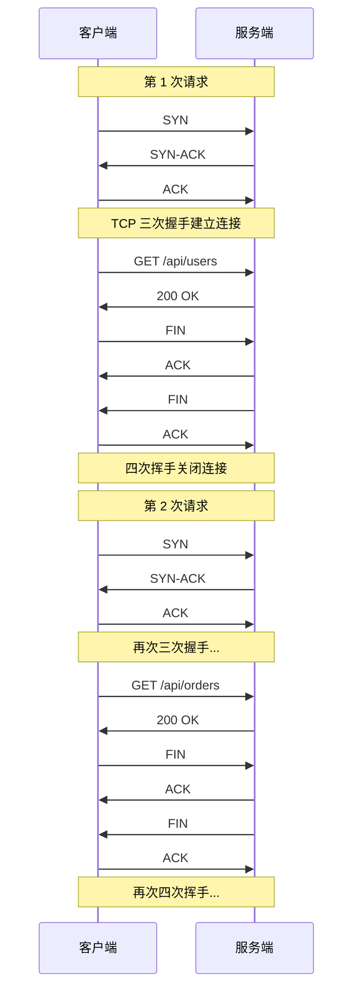
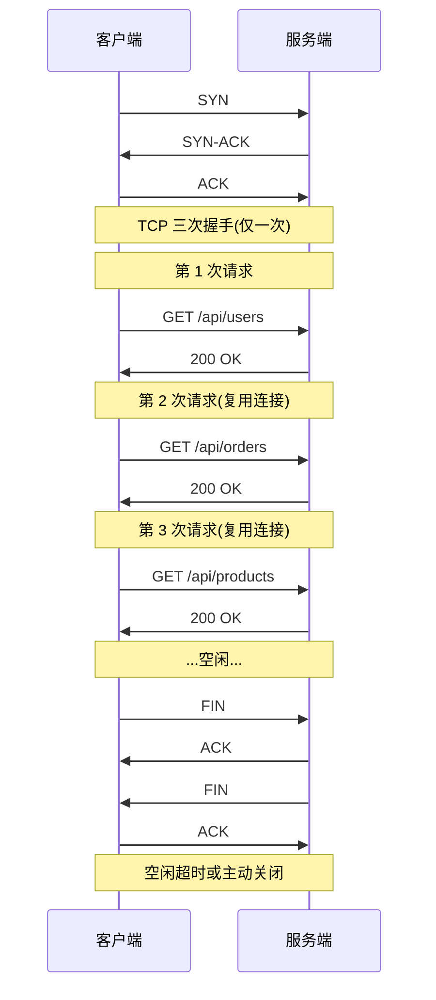
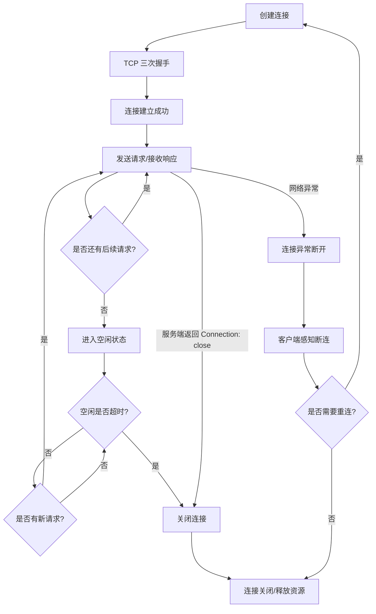
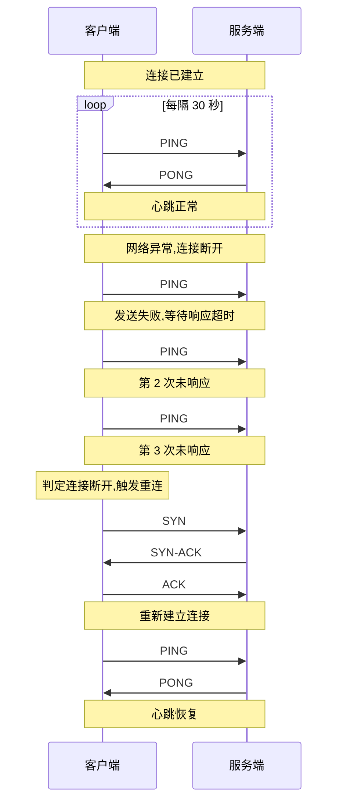
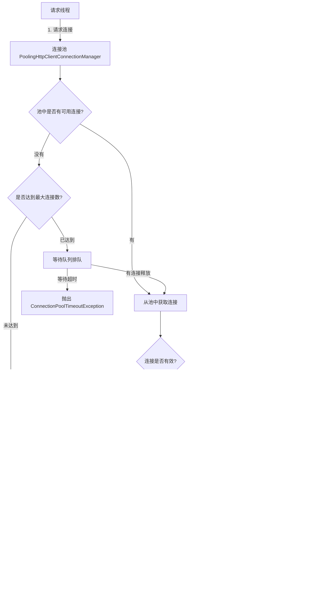
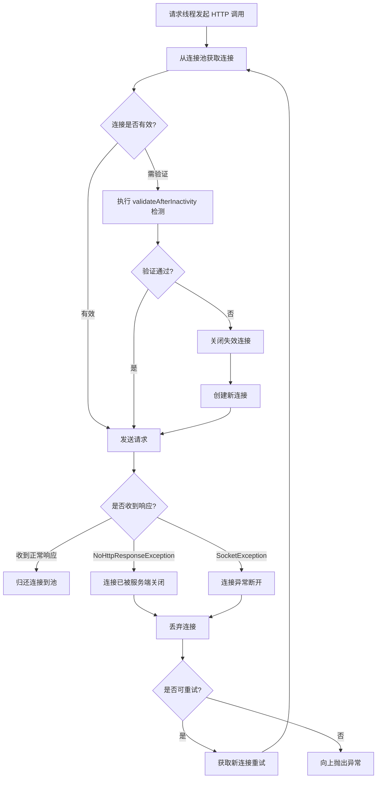
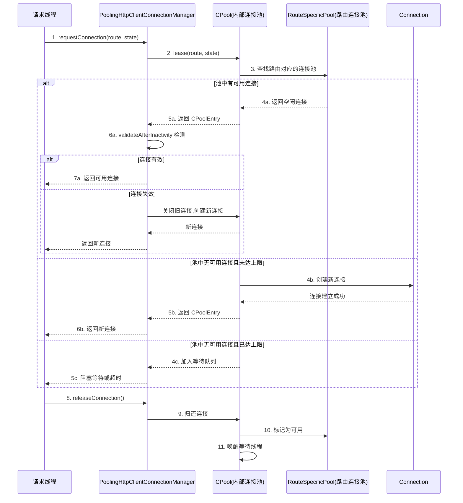
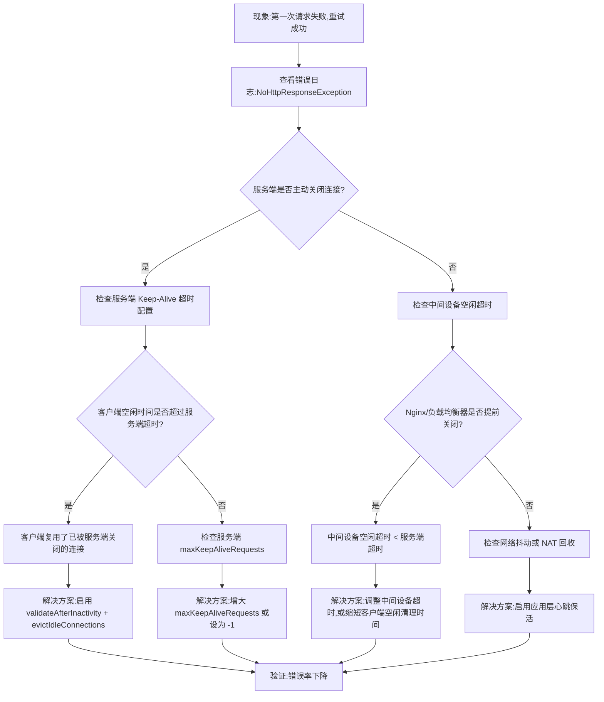
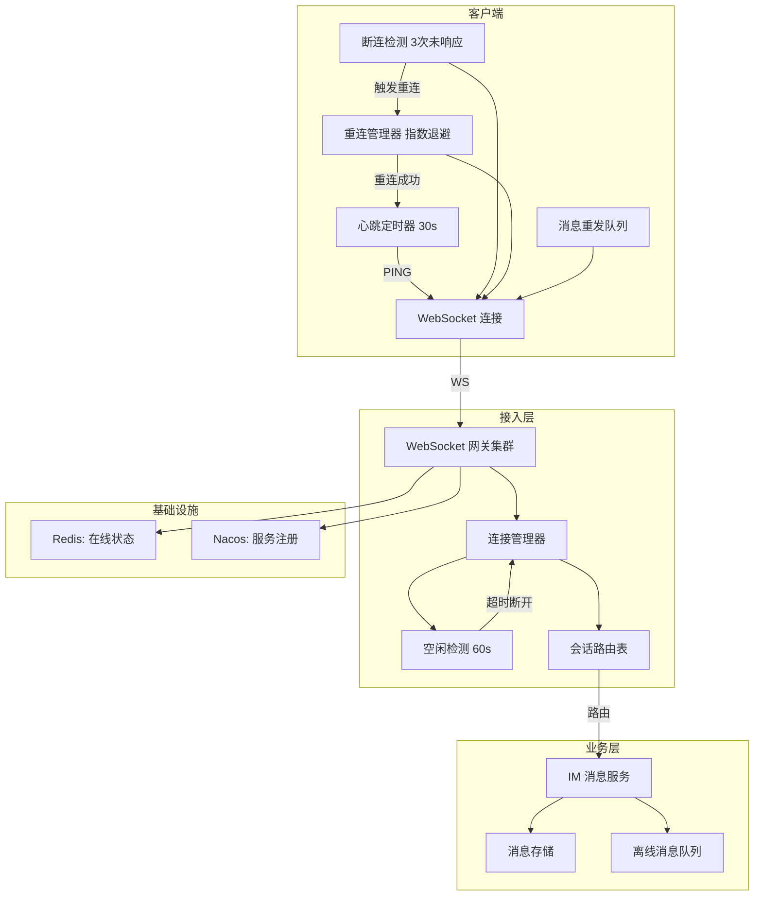

# HTTP 长连接与心跳机制

HTTP 长连接和心跳机制,是很多 Java 服务稳定运行的基础能力。它们看起来像网络细节,但在真实项目里会直接影响:

- 连接数是否可控
- 请求延迟是否稳定
- 线程是否会阻塞等待连接
- 网关和客户端调用是否容易抖动
- 长连接服务是否能及时发现断连

理解这一篇的重点,不是记几个 Keep-Alive 参数,而是搞清楚"连接为什么要复用""连接为什么会失效""应用层为什么还要心跳"。

## 概念与背景

### 什么是 HTTP 长连接

HTTP 长连接（Persistent Connection）,指的是客户端和服务端在一次 TCP 建连后,复用同一条连接完成多次请求和响应,而不是每次请求都重新建立 TCP 连接。

在 HTTP/1.0 中,默认使用短连接,每次请求都会新建连接。HTTP/1.1 开始,默认开启长连接。

它的核心价值包括:

- **减少握手开销**:避免频繁三次握手和四次挥手
- **降低延迟**:省去连接建立时间,请求响应更快
- **提高效率**:连接复用,减少连接创建和销毁的开销
- **节省资源**:降低客户端和服务端的 socket、CPU、线程消耗

在现代 HTTP 客户端和服务端里,连接复用通常是默认能力。但"默认支持"不代表"可以不理解"。

### 短连接与长连接对比

#### 短连接流程



**短连接缺点**:
- 每次请求都要三次握手,延迟高
- 频繁创建和销毁连接,消耗资源
- 服务端需要处理大量连接请求

#### 长连接流程



**长连接优点**:
- 一次握手,多次请求,延迟低
- 减少连接创建销毁开销
- 服务端并发连接数可控

### 为什么连接复用很重要

如果每次请求都重新建连,代价通常包括:

- **更高的请求延迟**:TCP 三次握手通常需要 1-3 个 RTT
- **更多的短连接抖动**:连接频繁创建销毁,影响稳定性
- **服务端压力大**:需要频繁处理建连和断连
- **客户端资源消耗**:不断创建和回收连接对象
- **端口耗尽风险**:客户端端口占用 TIME_WAIT 状态

::: warning TIME_WAIT 堆积风险
短连接场景下,主动关闭连接的一方会进入 TIME_WAIT 状态(默认 60 秒)。如果客户端高频使用短连接,大量端口被 TIME_WAIT 占用,最终导致端口耗尽,新连接无法建立。在高 QPS 微服务调用中,这是最常见的连接抖动根因之一。

可通过以下方式缓解:
- 启用长连接(根本解决)
- 调整 `tcp_tw_reuse`(允许复用 TIME_WAIT 端口)
- 增大端口范围 `ip_local_port_range`
:::

对于高频调用场景,例如:

- 微服务之间的 HTTP 调用
- 网关转发下游服务
- Java 客户端频繁请求第三方接口
- 移动端 APP 频繁请求后端 API

连接复用几乎是默认前提,而不是可选优化。

### 长连接不等于永不关闭

这是最常见的误解之一。HTTP 长连接只是表示:

- 一条 TCP 连接可以被复用

它并不表示:

- 连接会一直存在
- 中间网络设备不会回收它
- 客户端连接池里的连接永远可用

::: warning Keep-Alive 不等于永久连接
Keep-Alive 只表示"请求完成后不立即关闭连接,保留给后续请求复用",并不保证连接永远存活。以下因素都可能导致连接失效:
- 服务端超时关闭
- 负载均衡器/NAT/网关清理空闲会话
- 网络抖动导致连接中断
- 服务端重启或实例摘除

因此,客户端必须同时具备连接复用、空闲清理、有效性检测和失败重试能力。
:::

连接仍然可能因为以下原因失效:

- **服务端主动关闭**:服务端配置了最大请求数或空闲超时
- **服务端返回 `Connection: close`**:明确告知客户端关闭连接
- **空闲时间过长**:超过 Keep-Alive 超时时间被回收
- **代理、NAT、负载均衡器清理**:中间设备清理空闲会话
- **网络抖动**:连接异常断开
- **服务端重启或实例摘除**:服务端进程终止

所以真实项目中必须同时考虑:

- 连接复用
- 空闲连接清理
- 连接有效性检测
- 断开后的失败重试与重建

### 连接生命周期



## HTTP Keep-Alive 详解

### Keep-Alive 头部参数

HTTP/1.1 中,`Connection: keep-alive` 表示希望保持长连接。服务端也可以在响应中返回 Keep-Alive 相关参数:

```http
Connection: keep-alive
Keep-Alive: timeout=5, max=100
```

**参数含义**:

- `timeout`:连接空闲超时时间(秒),超过此时间服务端可能关闭连接
- `max`:连接上最多处理的请求数,超过后服务端可能关闭连接

::: tip Keep-Alive 参数调优建议
- `timeout` 建议设置为 30-120 秒,过短会导致连接频繁重建,过长会占用服务端资源
- `max` 建议设置 100-1000,避免单个连接长期占用导致内存泄漏(如 ThreadLocal 未清理)
- 客户端 Keep-Alive 超时应该小于服务端超时,避免客户端复用已被服务端关闭的连接
- 在 Nginx 反向代理场景中,`keepalive_timeout` 应略小于下游服务的 Keep-Alive 超时
:::

### 客户端如何处理 Keep-Alive

不同 HTTP 客户端的处理方式:

**浏览器**:
- 默认启用长连接
- 自动管理连接池
- 自动处理连接失效和重连

**Apache HttpClient**:
- 需要配置连接池
- 支持空闲连接清理
- 支持连接验证

**OkHttp**:
- 默认启用连接池
- 自动清理空闲连接
- 支持连接复用和重试

**Java 11 HttpClient**:
- 默认启用 HTTP/2,支持多路复用
- HTTP/1.1 默认启用长连接
- 自动管理连接池

::: tip Java 11 HttpClient 的 HTTP/2 优势
Java 11 HttpClient 默认优先协商 HTTP/2。HTTP/2 的多路复用机制在单条 TCP 连接上支持并发请求,从根本上解决了 HTTP/1.1 连接池需要维护多条连接的问题。在微服务内部调用中,如果双方都支持 HTTP/2,可以显著减少连接数和连接管理复杂度。但需注意:HTTP/2 多路复用在单连接上的队头阻塞(TCP 层)仍然是潜在风险,QUIC/HTTP/3 才是最终解决方案。
:::

### 服务端如何配置 Keep-Alive

**Tomcat 配置**:

```xml
<!-- server.xml -->
<Connector port="8080" protocol="HTTP/1.1"
           connectionTimeout="20000"
           keepAliveTimeout="60000"
           maxKeepAliveRequests="100" />
```

**参数说明**:
- `connectionTimeout`:连接建立超时(毫秒)
- `keepAliveTimeout`:长连接空闲超时(毫秒)
- `maxKeepAliveRequests`:单个连接最大请求数,-1 表示无限制

**Nginx 配置**:

```11-Nginx基础概述
http {
    keepalive_timeout  65;    # 空闲超时(秒)
    keepalive_requests 100;   # 最大请求数
}
```

**Spring Boot 配置**:

```yaml
server:
  tomcat:
    connection-timeout: 20000  # 连接超时(毫秒)
    keep-alive-timeout: 60000  # Keep-Alive 超时(毫秒)
    max-keep-alive-requests: 100  # 最大请求数
```

### Keep-Alive 解决了什么问题

Keep-Alive 的核心作用,是让客户端可以在请求完成后不立即关闭连接,而是把连接保留下来供后续请求继续使用。

它主要解决的是:

- 重复建连成本高
- 高频请求下延迟偏高
- 连接创建和销毁太频繁
- 客户端端口与服务端 socket 资源浪费

### Keep-Alive 的本质是什么

从本质上说,Keep-Alive 解决的是:

- 连接复用问题

也就是说,它关注的是:

- 连接能不能重复用
- 连接池该不该保留这条连接
- 请求发起时是否能从池里拿到现成连接

它不直接解决:

- 长时间空闲连接是否失效
- 对端是否还活着
- 中间网络设备是否已经回收会话

这些问题往往需要空闲探测、健康检查或应用层心跳一起配合。

## 为什么还需要心跳或空闲探测

### 长连接复用后引出的新问题

连接复用带来性能收益的同时,也引入了一个新的现实问题:

- 连接可能已经失效,但应用层暂时还不知道

典型场景包括:

- 服务端已经关闭连接,但客户端连接池里还保留旧连接
- 负载均衡器回收了空闲连接
- NAT 或网关提前清理了会话状态
- WebSocket / IM 长时间没有业务消息,连接变成僵尸连接
- 服务端实例下线,但客户端不知道

这时,如果客户端直接复用旧连接,常见现象就是:

- 第一次请求失败
- 重试后又成功
- RT 偶尔出现尖刺
- 客户端报错"Connection reset"或"Broken pipe"

### 心跳解决什么问题

心跳（Heartbeat）是应用层主动发送的一种轻量消息,目的通常不是传业务数据,而是:

- **判断对端是否还活着**:确认连接是否正常
- **维持中间设备上的连接状态**:防止被 NAT、负载均衡器清理
- **及时发现僵尸连接**:缩短断连感知时间
- **触发连接重建**:失效后自动重连

对 HTTP 短连接调用来说,更多依赖连接池和空闲清理;但对 WebSocket、IM、网关长连接和自定义协议连接来说,心跳几乎是必备能力。

### 心跳机制流程



## 心跳、空闲探测与 TCP Keepalive 的区别

这几个概念经常被混在一起,但关注点并不相同。

| 机制 | 所在层次 | 主要作用 | 典型特点 | 配置方式 |
|---|---|---|---|---|
| HTTP Keep-Alive | 应用协议层 | 连接复用 | 关注请求之间是否复用已有连接 | HTTP 头部 |
| TCP Keepalive | 传输层 | 系统级保活 | 粒度较粗,间隔通常较长 | 操作系统参数 |
| 应用层心跳 | 应用协议层 | 失效探测、保活、断连感知 | 灵活可控,可按业务定制 | 应用代码 |
| 空闲探测 | 客户端/服务端连接管理层 | 清理长期未活跃连接 | 常结合连接池和超时策略使用 | 连接池配置 |

### TCP Keepalive 详解

TCP Keepalive 是操作系统提供的保活机制:

**Linux 配置**:

```bash
# 查看 TCP Keepalive 参数
cat /proc/sys/net/ipv4/tcp_keepalive_time    # 空闲多久开始发送探测(秒,默认7200)
cat /proc/sys/net/ipv4/tcp_keepalive_intvl   # 探测间隔(秒,默认75)
cat /proc/sys/net/ipv4/tcp_keepalive_probes  # 探测次数(默认9)

# 修改配置(临时)
echo 600 > /proc/sys/net/ipv4/tcp_keepalive_time
echo 30 > /proc/sys/net/ipv4/tcp_keepalive_intvl
echo 3 > /proc/sys/net/ipv4/tcp_keepalive_probes
```

**Java 中开启 TCP Keepalive**:

```java
Socket socket = new Socket();
socket.setKeepAlive(true);  // 开启 TCP Keepalive
```

**TCP Keepalive 的局限性**:
- 间隔时间长(默认 2 小时),不适合快速感知断连
- 只检测 TCP 连接是否存活,不检测应用层是否正常
- 无法传递应用层状态信息
- 可能被中间设备拦截

### 应用层心跳的优势

**为什么需要应用层心跳?**

- **快速感知**:可以设置更短的间隔,快速发现断连
- **应用层状态**:可以携带业务状态信息
- **灵活可控**:可以根据业务需求定制心跳逻辑
- **穿透性强**:应用层消息不会被中间设备拦截

实践中可以这样理解:

- HTTP 调用更关注连接池、超时、空闲回收
- WebSocket / IM / 长连接网关更关注应用层心跳
- TCP Keepalive 可以作为辅助机制,但通常不能替代应用层治理

::: details TCP Keepalive vs 应用层心跳:机制深度对比

**TCP Keepalive 工作原理**:

1. TCP 层检测到连接空闲时间超过 `tcp_keepalive_time`(默认 7200 秒)
2. 向对端发送一个保活探测报文(不含数据,仅 ACK)
3. 如果收到响应,重置空闲计时器
4. 如果未收到响应,每隔 `tcp_keepalive_intvl`(默认 75 秒)重发探测
5. 连续 `tcp_keepalive_probes`(默认 9 次)未响应,则判定连接断开,通知应用层

**应用层心跳工作原理**:

1. 应用层定时器触发(通常 30-60 秒)
2. 发送一个应用层心跳消息(如 PING 帧、WebSocket Ping、自定义协议报文)
3. 等待对端响应(如 PONG 帧)
4. 超时未收到响应则判定连接异常

**关键差异对比**:

| 维度 | TCP Keepalive | 应用层心跳 |
|---|---|---|
| 检测粒度 | TCP 连接是否存活 | 应用是否正常(连接+服务) |
| 默认间隔 | 7200 秒(2 小时) | 自定义(通常 30-60 秒) |
| 探测内容 | 空 ACK 报文 | 可携带业务状态信息 |
| 失败判定 | 9 次探测失败(约 11 分钟) | 自定义(通常 3 次未响应) |
| 穿透性 | 可能被中间设备过滤 | 应用层数据,不会被过滤 |
| 可编程性 | 仅操作系统参数 | 完全可编程 |
| 代理感知 | 代理可能不会转发 | 端到端感知 |
| 半开连接检测 | 能检测 | 能检测 |

**生产环境建议**:
- 两者同时启用,互为补充
- TCP Keepalive 作为兜底(防止应用层心跳失效)
- 应用层心跳作为主要检测手段(快速感知)
- 应用层心跳间隔应小于中间设备(NAT/负载均衡器)的空闲超时
:::

## 连接池与空闲连接管理

### 为什么客户端需要连接池

大多数 Java 客户端不会自己手工管理 socket,而是使用连接池统一管理连接,例如:

- Apache HttpClient
- OkHttp
- Java 11 `HttpClient`
- HikariCP(数据库连接池)

连接池通常需要管理这些维度:

- **最大总连接数**:连接池最大容量
- **单个目标地址的最大连接数**:对单个服务的并发连接数
- **获取连接超时时间**:从连接池获取连接的超时
- **建立连接超时时间**:建立 TCP 连接的超时
- **读响应超时时间**:读取响应数据的超时
- **空闲连接存活时间**:连接空闲多久后关闭
- **连接验证**:使用前验证连接是否有效

如果这些参数配置不合理,常见问题包括:

- 连接池耗尽,线程阻塞等待
- 使用到已经失效的空闲连接
- RT 抖动明显
- 服务端连接数过多

### 连接池架构



### 为什么要清理空闲连接

客户端连接池里的连接,并不一定一直有效。因为在连接池空闲期间,服务端或中间网络设备可能已经把它关掉了。

如果连接池下一次直接复用这条旧连接,就可能出现:

- 第一次调用报错
- 自动重试后恢复
- 偶发超时、偶发连接重建

::: warning 失效连接的风险
复用已失效的连接是生产环境中"第一次请求失败,重试成功"现象的最常见根因。以下场景尤为突出:
- 客户端空闲时间超过服务端 Keep-Alive 超时
- 中间 Nginx/负载均衡器提前关闭了空闲连接
- 服务端重启或滚动发布导致连接失效

解决方案:
- 启用 `validateAfterInactivity`(使用前验证)
- 定期清理空闲连接(`evictIdleConnections`)
- 配合重试策略(对 `NoHttpResponseException` 重试)
:::

因此客户端通常要具备这些能力:

- 定期清理空闲连接
- 在连接空闲过久后重新校验
- 失败后快速丢弃无效连接并重建

### 连接池问题为什么会放大成线程问题

这也是线上排障里非常常见的一个链式问题。

如果连接池拿不到连接,请求线程通常会:

- 阻塞等待连接

然后就会继续引发:

- 线程池堆积
- 请求 RT 飙升
- 超时数上升
- 下游调用雪崩

::: danger 连接池耗尽导致线程池雪崩
这是一个典型的级联故障链路:

```
连接池耗尽
  → 请求线程阻塞等待连接
    → 线程池堆积
      → 新请求被拒绝或排队
        → 上游调用超时
          → 上游线程池也开始堆积
            → 服务整体雪崩
```

**关键预防措施**:
1. 设置合理的 `connectionRequestTimeout`(1-2 秒),快速失败而非无限等待
2. 监控连接池的 `pending` 指标,设置告警阈值
3. 连接池大小要覆盖峰值并发,留有余量
4. 使用断路器(Sentinel/Resilience4j),在连接池持续耗尽时快速熔断
:::

所以排查 HTTP 问题时,不能只看"请求超时"这一个现象,还要看:

- 连接池是否已耗尽
- 线程是否卡在等待连接
- 服务端是否过早关闭长连接

### 断连检测流程



## 客户端与服务端各自要做什么

### 客户端要关注什么

客户端通常需要负责:

- **正确配置连接池**:
  - 总连接数和单路由连接数要合理
  - 获取连接、建立连接、读取响应要分别设置超时

- **区分不同类型的超时**:
  - 连接超时(Connection Timeout):建立 TCP 连接的超时
  - 读取超时(Read Timeout):等待响应数据的超时
  - 获取连接超时(Connection Request Timeout):从连接池获取连接的超时

- **定期清理空闲连接**:
  - 避免使用已失效的连接
  - 及时释放资源

- **失败时快速重试或重建连接**:
  - 捕获连接异常
  - 判断是否可重试
  - 控制重试次数,避免雪崩放大

- **避免无限重试导致雪崩放大**:
  - 设置合理的重试次数
  - 使用断路器模式
  - 记录失败日志,便于排查

::: danger 重试风暴:重试如何放大故障
不合理的重试策略可以在几秒内让一个微小抖动演变为服务雪崩:

```
下游 1% 请求超时(正常波动)
  → 客户端对超时请求重试 3 次
    → 实际请求量变为原来的 3 倍
      → 下游负载激增
        → 更多请求超时
          → 更多重试...
            → 雪崩
```

**正确做法**:
- 超时异常(SocketTimeoutException)不重试——可能是下游过载
- 连接已关闭(NoHttpResponseException)可重试——连接失效是确定的
- 重试间隔使用指数退避 + 随机抖动
- 结合断路器,在错误率超阈值时停止重试
:::

### 服务端要关注什么

服务端通常需要负责:

- **合理设置连接空闲超时**:
  - 避免空闲连接占用资源
  - 考虑客户端请求频率

- **控制最大并发连接数**:
  - 防止连接数过多导致资源耗尽
  - 限制单个客户端的连接数

- **正确处理 Keep-Alive 和 `Connection: close`**:
  - 响应客户端的 Keep-Alive 请求
  - 需要关闭连接时返回 `Connection: close`

- **在长连接场景下设计心跳与超时剔除策略**:
  - 记录连接最后活跃时间
  - 超时主动断开
  - 支持客户端心跳

- **保证连接关闭行为和实例下线行为一致**:
  - 优雅关闭,不强制断开正在处理的请求
  - 提前通知客户端实例即将下线

如果客户端和服务端只做好其中一边,系统仍然会出现连接抖动和偶发失败。

## Java 客户端连接池配置示例

### Apache HttpClient 5 示例

下面是一个基于 Apache HttpClient 5 的完整示例,用来说明长连接调用时常见的配置点:

```java
import org.apache.hc.client5.http.config.RequestConfig;
import org.apache.hc.client5.http.impl.classic.CloseableHttpClient;
import org.apache.hc.client5.http.impl.classic.HttpClients;
import org.apache.hc.client5.http.impl.io.PoolingHttpClientConnectionManager;
import org.apache.hc.client5.http.impl.io.PoolingHttpClientConnectionManagerBuilder;
import org.apache.hc.core5.http.HttpHost;
import org.apache.hc.core5.util.TimeValue;
import org.apache.hc.core5.util.Timeout;

import java.util.concurrent.TimeUnit;

public class HttpClientFactory {

    public static CloseableHttpClient createClient() {
        // 请求配置
        RequestConfig requestConfig = RequestConfig.custom()
                .setConnectionRequestTimeout(Timeout.ofSeconds(2))  // 获取连接超时
                .setConnectTimeout(Timeout.ofSeconds(3))            // 建立连接超时
                .setResponseTimeout(Timeout.ofSeconds(5))           // 响应超时
                .build();

        // 连接池配置
        PoolingHttpClientConnectionManager connectionManager = PoolingHttpClientConnectionManagerBuilder.create()
                .setMaxConnTotal(200)           // 最大总连接数
                .setMaxConnPerRoute(50)         // 单路由最大连接数
                .setValidateAfterInactivity(TimeValue.ofSeconds(10))  // 空闲多久后验证连接
                .build();

        return HttpClients.custom()
                .setConnectionManager(connectionManager)
                .setDefaultRequestConfig(requestConfig)
                // 定期清理空闲连接(后台线程)
                .evictIdleConnections(TimeValue.ofSeconds(30))
                // 开启后台清理线程
                .evictExpiredConnections()
                .build();
    }

    // 为特定服务配置独立路由
    public static CloseableHttpClient createClientWithCustomRoute() {
        PoolingHttpClientConnectionManager connectionManager = PoolingHttpClientConnectionManagerBuilder.create()
                .setMaxConnTotal(200)
                .setMaxConnPerRoute(20)
                .build();

        // 为特定服务设置更大的连接数
        HttpHost customHost = new HttpHost("http", "api.example.com", 8080);
        connectionManager.setMaxPerRoute(customHost, 100);

        return HttpClients.custom()
                .setConnectionManager(connectionManager)
                .build();
    }
}
```

**关键配置说明**:

```java
// 三个超时的含义不同,线上排障时经常被混淆

// 1. connectionRequestTimeout:等待连接池中连接的超时
//    - 连接池满了,等待其他请求释放连接
//    - 超时后抛出 ConnectionPoolTimeoutException

// 2. connectTimeout:建立 TCP 连接的超时
//    - 三次握手的时间
//    - 网络不通、服务端未启动时会超时
//    - 超时后抛出 ConnectTimeoutException

// 3. responseTimeout:连接建立后等待响应的超时
//    - 等待服务端返回数据的时间
//    - 包括服务端处理时间
//    - 超时后抛出 SocketTimeoutException
```

::: tip 连接池大小计算公式
连接池大小不是拍脑袋定的,有一个经典的计算公式:

```
连接数 = QPS × 平均响应时间(秒) × 安全系数
```

示例:
- QPS = 1000
- 平均响应时间 = 100ms = 0.1s
- 安全系数 = 1.5~2.0(应对突发流量)
- 连接数 = 1000 × 0.1 × 2 = 200

**单路由连接数**也按同样公式计算,只是把 QPS 替换为单服务的 QPS。

注意:连接池大小还需考虑服务端的承载能力,不是越大越好。过大的连接池会导致:
- 服务端连接数过多,资源消耗大
- 客户端空闲连接多,失效概率高
- 连接利用率低,浪费资源
:::

**使用示例**:

```java
import org.apache.hc.client5.http.classic.methods.HttpGet;
import org.apache.hc.client5.http.impl.classic.CloseableHttpClient;
import org.apache.hc.core5.http.ClassicHttpResponse;
import org.apache.hc.core5.http.io.entity.EntityUtils;

public class HttpClientExample {

    public static void main(String[] args) throws Exception {
        try (CloseableHttpClient httpClient = HttpClientFactory.createClient()) {
            HttpGet request = new HttpGet("http://localhost:8080/api/users");

            httpClient.execute(request, response -> {
                System.out.println("响应状态:" + response.getCode());
                String body = EntityUtils.toString(response.getEntity());
                System.out.println("响应内容:" + body);
                return null;
            });
        }
    }
}
```

### OkHttp 示例

```java
import okhttp3.ConnectionPool;
import okhttp3.OkHttpClient;
import okhttp3.Request;
import okhttp3.Response;

import java.util.concurrent.TimeUnit;

public class OkHttpExample {

    public static void main(String[] args) {
        OkHttpClient client = new OkHttpClient.Builder()
                .connectionPool(new ConnectionPool(50, 5, TimeUnit.MINUTES))
                .connectTimeout(3, TimeUnit.SECONDS)      // 连接超时
                .readTimeout(5, TimeUnit.SECONDS)         // 读取超时
                .writeTimeout(5, TimeUnit.SECONDS)        // 写入超时
                .retryOnConnectionFailure(true)           // 连接失败自动重试
                .build();

        Request request = new Request.Builder()
                .url("http://localhost:8080/api/users")
                .build();

        try (Response response = client.newCall(request).execute()) {
            System.out.println("响应状态:" + response.code());
            System.out.println("响应内容:" + response.body().string());
        } catch (Exception e) {
            e.printStackTrace();
        }
    }
}
```

**OkHttp 连接池参数说明**:

```java
// ConnectionPool(50, 5, TimeUnit.MINUTES)
// - 50: 最大空闲连接数
// - 5: 空闲连接存活时间
// - TimeUnit.MINUTES: 时间单位

// OkHttp 自动清理空闲连接,无需手动管理
```

### Java 11 HttpClient 示例

```java
import java.net.URI;
import java.net.http.HttpClient;
import java.net.http.HttpRequest;
import java.net.http.HttpResponse;
import java.time.Duration;

public class Java11HttpClientExample {

    public static void main(String[] args) throws Exception {
        HttpClient client = HttpClient.newBuilder()
                .connectTimeout(Duration.ofSeconds(3))  // 连接超时
                .version(HttpClient.Version.HTTP_2)      // 优先使用 HTTP/2
                .build();

        HttpRequest request = HttpRequest.newBuilder()
                .uri(URI.create("http://localhost:8080/api/users"))
                .timeout(Duration.ofSeconds(5))          // 请求超时
                .GET()
                .build();

        HttpResponse<String> response = client.send(
                request,
                HttpResponse.BodyHandlers.ofString()
        );

        System.out.println("响应状态:" + response.statusCode());
        System.out.println("响应内容:" + response.body());
    }
}
```

**Java 11 HttpClient 特点**:

- 默认启用连接池
- 支持 HTTP/2 多路复用
- 支持 WebSocket
- 异步非阻塞(CompletableFuture)

## 源码剖析:Apache HttpClient 连接池内部机制

### PoolingHttpClientConnectionManager 内部结构

Apache HttpClient 的连接池核心是 `PoolingHttpClientConnectionManager`,它内部维护了 `CPool`(全局连接池) → `RouteSpecificPool`(路由连接池) 的层级结构:



### validateAfterInactivity 的工作原理

`validateAfterInactivity` 是连接池中一个非常关键的参数,它决定了连接在使用前是否需要验证有效性:

```java
// PoolingHttpClientConnectionManager 内部逻辑(简化版)
public void connect(CPoolEntry entry) {
    // 获取连接的空闲时间
    long idleTime = System.currentTimeMillis() - entry.getLastUsedTime();

    // 如果空闲时间超过 validateAfterInactivity,则验证连接
    if (validateAfterInactivity > 0 && idleTime > validateAfterInactivity) {
        // isStale() 返回 true 表示连接已经失效(对端已关闭)
        boolean stale = entry.getConnection().isStale();
        if (stale) {
            // 连接已失效,关闭并重建
            entry.closeConnection();
            // 重新建立连接
            establishConnection(entry);
        }
        // 未失效则直接使用
    }
    // 如果空闲时间未超过阈值,直接使用(不验证,性能更优)
}
```

**工作机制详解**:

1. 当线程从连接池获取连接时,检查连接的空闲时间
2. 如果空闲时间 < `validateAfterInactivity`,直接使用(不验证,零开销)
3. 如果空闲时间 >= `validateAfterInactivity`,先验证连接是否仍然有效
4. 验证方式:尝试从 socket 读取数据(不消耗数据),如果读取失败说明连接已断开
5. 如果连接失效,关闭旧连接并创建新连接;如果有效,直接使用

**参数配置建议**:

```java
// 推荐配置:10-30 秒
// 过短:每次获取连接都验证,增加延迟
// 过长:可能使用已失效的连接
PoolingHttpClientConnectionManagerBuilder.create()
    .setValidateAfterInactivity(TimeValue.ofSeconds(10))  // 空闲 10 秒后验证
    .build();
```

::: tip validateAfterInactivity vs evictIdleConnections 的区别
这两个机制经常被混淆,但作用不同:

- **validateAfterInactivity**:被动验证,在获取连接时才检查,是一种"懒清理"
- **evictIdleConnections**:主动清理,后台线程定期扫描并关闭空闲超时的连接,是一种"主动清理"

两者配合使用效果最佳:
- `evictIdleConnections(30s)` 保证池中不会有空闲超过 30 秒的连接
- `validateAfterInactivity(10s)` 保证即使池中连接在 10 秒内失效,使用前也能检测到
:::

## 长连接场景下的心跳示例

### WebSocket 心跳示例

对 WebSocket、IM、Netty 长连接服务而言,通常需要在服务端记录连接活跃状态,并在连接长时间无读写时主动剔除。

**服务端心跳检测(Netty)**:

```java
import io.netty.bootstrap.ServerBootstrap;
import io.netty.channel.*;
import io.netty.channel.nio.NioEventLoopGroup;
import io.netty.channel.socket.SocketChannel;
import io.netty.channel.socket.nio.NioServerSocketChannel;
import io.netty.handler.codec.string.StringDecoder;
import io.netty.handler.codec.string.StringEncoder;
import io.netty.handler.timeout.IdleStateEvent;
import io.netty.handler.timeout.IdleStateHandler;

import java.util.concurrent.TimeUnit;

public class WebSocketHeartbeatServer {

    public static void main(String[] args) throws Exception {
        EventLoopGroup bossGroup = new NioEventLoopGroup(1);
        EventLoopGroup workerGroup = new NioEventLoopGroup();

        try {
            ServerBootstrap bootstrap = new ServerBootstrap();
            bootstrap.group(bossGroup, workerGroup)
                    .channel(NioServerSocketChannel.class)
                    .childHandler(new ChannelInitializer<SocketChannel>() {
                        @Override
                        protected void initChannel(SocketChannel ch) {
                            ChannelPipeline pipeline = ch.pipeline();

                            // 空闲检测:60秒未读取数据触发空闲事件
                            pipeline.addLast(new IdleStateHandler(60, 0, 0, TimeUnit.SECONDS));

                            // 编解码器
                            pipeline.addLast(new StringDecoder());
                            pipeline.addLast(new StringEncoder());

                            // 业务处理器
                            pipeline.addLast(new HeartbeatHandler());
                        }
                    });

            ChannelFuture future = bootstrap.bind(8080).sync();
            System.out.println("WebSocket 服务端已启动,端口:8080");
            future.channel().closeFuture().sync();
        } finally {
            bossGroup.shutdownGracefully();
            workerGroup.shutdownGracefully();
        }
    }
}

// 心跳处理器
class HeartbeatHandler extends ChannelInboundHandlerAdapter {

    private static final String PING = "PING";
    private static final String PONG = "PONG";

    @Override
    public void userEventTriggered(ChannelHandlerContext ctx, Object evt) throws Exception {
        if (evt instanceof IdleStateEvent) {
            IdleStateEvent event = (IdleStateEvent) evt;
            if (event.state() == IdleState.READER_IDLE) {
                System.out.println("连接读空闲超时,关闭连接:" + ctx.channel().remoteAddress());
                ctx.close();
                return;
            }
        }
        super.userEventTriggered(ctx, evt);
    }

    @Override
    public void channelRead(ChannelHandlerContext ctx, Object msg) throws Exception {
        String message = (String) msg;

        // 处理心跳消息
        if (PING.equals(message)) {
            System.out.println("收到心跳:" + message);
            ctx.writeAndFlush(PONG);
            return;
        }

        // 处理业务消息
        System.out.println("收到业务消息:" + message);
        super.channelRead(ctx, msg);
    }

    @Override
    public void exceptionCaught(ChannelHandlerContext ctx, Throwable cause) throws Exception {
        cause.printStackTrace();
        ctx.close();
    }
}
```

**客户端心跳发送**:

```java
import io.netty.bootstrap.Bootstrap;
import io.netty.channel.*;
import io.netty.channel.nio.NioEventLoopGroup;
import io.netty.channel.socket.SocketChannel;
import io.netty.channel.socket.nio.NioSocketChannel;
import io.netty.handler.codec.string.StringDecoder;
import io.netty.handler.codec.string.StringEncoder;

import java.util.concurrent.TimeUnit;

public class WebSocketHeartbeatClient {

    private static final String PING = "PING";

    public static void main(String[] args) throws Exception {
        EventLoopGroup group = new NioEventLoopGroup();

        try {
            Bootstrap bootstrap = new Bootstrap();
            bootstrap.group(group)
                    .channel(NioSocketChannel.class)
                    .handler(new ChannelInitializer<SocketChannel>() {
                        @Override
                        protected void initChannel(SocketChannel ch) {
                            ch.pipeline()
                                    .addLast(new StringDecoder())
                                    .addLast(new StringEncoder())
                                    .addLast(new ClientHandler());
                        }
                    });

            Channel channel = bootstrap.connect("localhost", 8080).sync().channel();
            System.out.println("已连接到服务端");

            // 定时发送心跳
            group.scheduleAtFixedRate(() -> {
                if (channel.isActive()) {
                    channel.writeAndFlush(PING);
                    System.out.println("发送心跳:" + PING);
                }
            }, 0, 30, TimeUnit.SECONDS);

            channel.closeFuture().sync();
        } finally {
            group.shutdownGracefully();
        }
    }
}

class ClientHandler extends ChannelInboundHandlerAdapter {

    @Override
    public void channelRead(ChannelHandlerContext ctx, Object msg) throws Exception {
        System.out.println("收到消息:" + msg);
    }

    @Override
    public void channelInactive(ChannelHandlerContext ctx) throws Exception {
        System.out.println("连接断开,尝试重连...");
        // 实现重连逻辑
    }
}
```

### 断线重连机制

**自动重连实现**:

```java
import io.netty.bootstrap.Bootstrap;
import io.netty.channel.*;
import io.netty.channel.nio.NioEventLoopGroup;
import io.netty.channel.socket.SocketChannel;
import io.netty.channel.socket.nio.NioSocketChannel;
import io.netty.handler.codec.string.StringDecoder;
import io.netty.handler.codec.string.StringEncoder;

import java.util.concurrent.TimeUnit;

public class ReconnectingClient {

    private final String host;
    private final int port;
    private Bootstrap bootstrap;
    private Channel channel;
    private EventLoopGroup group;

    // 重连参数
    private int retryInterval = 5;  // 重连间隔(秒)
    private int maxRetries = 10;    // 最大重连次数
    private int retryCount = 0;

    public ReconnectingClient(String host, int port) {
        this.host = host;
        this.port = port;
    }

    public void start() throws Exception {
        group = new NioEventLoopGroup();

        bootstrap = new Bootstrap();
        bootstrap.group(group)
                .channel(NioSocketChannel.class)
                .handler(new ChannelInitializer<SocketChannel>() {
                    @Override
                    protected void initChannel(SocketChannel ch) {
                        ch.pipeline()
                                .addLast(new StringDecoder())
                                .addLast(new StringEncoder())
                                .addLast(new ReconnectHandler(ReconnectingClient.this));
                    }
                });

        connect();
    }

    public void connect() {
        if (retryCount >= maxRetries) {
            System.out.println("达到最大重连次数,停止重连");
            return;
        }

        System.out.println("尝试连接 " + host + ":" + port + " (第" + (retryCount + 1) + "次)");

        bootstrap.connect(host, port).addListener((ChannelFuture future) -> {
            if (future.isSuccess()) {
                System.out.println("连接成功");
                channel = future.channel();
                retryCount = 0;  // 重置重连计数
            } else {
                System.out.println("连接失败:" + future.cause().getMessage());
                retryCount++;

                // 延迟重连(指数退避)
                long delay = Math.min(retryInterval * (1L << Math.min(retryCount, 5)), 60);
                future.channel().eventLoop().schedule(() -> connect(), delay, TimeUnit.SECONDS);
            }
        });
    }

    public static void main(String[] args) throws Exception {
        ReconnectingClient client = new ReconnectingClient("localhost", 8080);
        client.start();
    }
}

class ReconnectHandler extends ChannelInboundHandlerAdapter {

    private final ReconnectingClient client;

    public ReconnectHandler(ReconnectingClient client) {
        this.client = client;
    }

    @Override
    public void channelInactive(ChannelHandlerContext ctx) throws Exception {
        System.out.println("连接断开,尝试重连...");
        client.connect();
    }

    @Override
    public void exceptionCaught(ChannelHandlerContext ctx, Throwable cause) throws Exception {
        cause.printStackTrace();
        ctx.close();
    }
}
```

## 生产实践案例

### 案例一:排查"第一次请求失败,重试成功"

**背景**:某微服务线上偶现 HTTP 调用第一次失败、重试成功的现象,错误日志为 `NoHttpResponseException`,每天出现数十次。

**排查过程**:



**实际排查步骤**:

```java
// 1. 确认错误类型
// NoHttpResponseException 说明客户端尝试向已关闭的连接写数据
// 这意味着服务端已经关闭了连接,但客户端不知道

// 2. 检查服务端配置
// Tomcat keepAliveTimeout = 60s
// Nginx keepalive_timeout = 65s
// 客户端 evictIdleConnections 未配置!

// 3. 分析时间线
// 客户端获取连接 -> 空闲 70 秒 -> 再次使用
// 服务端 60 秒超时已关闭连接
// Nginx 65 秒超时已关闭连接
// 客户端复用旧连接 -> NoHttpResponseException

// 4. 解决方案
PoolingHttpClientConnectionManager connectionManager = PoolingHttpClientConnectionManagerBuilder.create()
        .setMaxConnTotal(200)
        .setMaxConnPerRoute(50)
        .setValidateAfterInactivity(TimeValue.ofSeconds(10))  // 使用前验证
        .build();

CloseableHttpClient httpClient = HttpClients.custom()
        .setConnectionManager(connectionManager)
        .evictIdleConnections(TimeValue.ofSeconds(30))  // 30 秒清理空闲连接
        .build();
// 空闲清理时间(30s) < 服务端超时(60s),确保连接在服务端关闭前被客户端主动回收
```

**修复效果**:
- 修复前:每天 30+ 次 `NoHttpResponseException`
- 修复后:每天 0-1 次,偶发来自极端网络抖动场景

### 案例二:WebSocket IM 系统心跳设计

**背景**:某 IM 系统使用 WebSocket 长连接,客户端连接数约 10 万,需要设计可靠的心跳和断线重连机制。

**架构设计**:



**心跳参数设计**:

```java
// 心跳参数配置
public class HeartbeatConfig {

    // 客户端心跳间隔
    // 必须小于中间设备(NAT/负载均衡器)的空闲超时
    // 负载均衡器空闲超时通常 90 秒,所以心跳设为 30 秒
    private static final int HEARTBEAT_INTERVAL = 30;  // 秒

    // 客户端断连判定
    // 连续 3 次心跳未响应则判定连接断开
    private static final int MAX_MISSED_HEARTBEATS = 3;

    // 服务端空闲超时
    // 应为心跳间隔的 2-3 倍,容忍 1-2 次心跳丢失
    private static final int SERVER_IDLE_TIMEOUT = 90;  // 秒

    // 重连参数
    // 指数退避:5, 10, 20, 40, 60, 60, 60...
    private static final int BASE_RETRY_INTERVAL = 5;   // 秒
    private static final int MAX_RETRY_INTERVAL = 60;   // 秒
    private static final int MAX_RETRY_COUNT = 100;     // 无限重连(但限流)
}
```

**服务端空闲检测实现**:

```java
import io.netty.channel.ChannelHandlerContext;
import io.netty.channel.ChannelInboundHandlerAdapter;
import io.netty.handler.timeout.IdleStateEvent;
import io.netty.handler.timeout.IdleState;

import java.util.concurrent.ConcurrentHashMap;
import java.util.concurrent.atomic.AtomicLong;

public class IMHeartbeatHandler extends ChannelInboundHandlerAdapter {

    // 连接活跃时间记录
    private static final ConcurrentHashMap<String, AtomicLong> lastActiveTime =
            new ConcurrentHashMap<>();

    @Override
    public void channelActive(ChannelHandlerContext ctx) {
        // 连接建立时记录活跃时间
        String channelId = ctx.channel().id().asLongText();
        lastActiveTime.put(channelId, new AtomicLong(System.currentTimeMillis()));
        System.out.println("连接建立:" + ctx.channel().remoteAddress());
    }

    @Override
    public void channelInactive(ChannelHandlerContext ctx) {
        // 连接断开时清理记录
        String channelId = ctx.channel().id().asLongText();
        lastActiveTime.remove(channelId);
        System.out.println("连接断开:" + ctx.channel().remoteAddress());
    }

    @Override
    public void userEventTriggered(ChannelHandlerContext ctx, Object evt) throws Exception {
        if (evt instanceof IdleStateEvent) {
            IdleStateEvent event = (IdleStateEvent) evt;
            if (event.state() == IdleState.READER_IDLE) {
                // 读空闲超时,说明客户端可能已断开
                System.out.println("读空闲超时,关闭僵尸连接:" + ctx.channel().remoteAddress());

                // 通知客户端连接即将关闭
                ctx.writeAndFlush("{\"type\":\"disconnect\",\"reason\":\"idle_timeout\"}");

                // 延迟 1 秒后关闭,确保通知消息能发出
                ctx.channel().eventLoop().schedule(() -> ctx.close(), 1, java.util.concurrent.TimeUnit.SECONDS);
                return;
            }
        }
        super.userEventTriggered(ctx, evt);
    }

    @Override
    public void channelRead(ChannelHandlerContext ctx, Object msg) throws Exception {
        // 更新活跃时间
        String channelId = ctx.channel().id().asLongText();
        AtomicLong time = lastActiveTime.get(channelId);
        if (time != null) {
            time.set(System.currentTimeMillis());
        }

        // 处理心跳
        if ("PING".equals(msg)) {
            ctx.writeAndFlush("PONG");
            return;
        }

        // 处理业务消息
        super.channelRead(ctx, msg);
    }
}
```

**生产环境关键指标**:

| 指标 | 告警阈值 | 说明 |
|---|---|---|
| 心跳成功率 | < 95% | 客户端 PING 收到 PONG 的比例 |
| 僵尸连接数 | > 100 | 服务端检测到空闲超时关闭的连接数 |
| 重连成功率 | < 90% | 客户端断线后重连成功的比例 |
| 平均重连时间 | > 10 秒 | 客户端从断连到恢复的平均时间 |
| 消息丢失率 | > 0.1% | 因断连导致的业务消息丢失比例 |

## 横向对比

### HTTP 客户端对比

| 特性 | Apache HttpClient 5 | OkHttp | Java 11 HttpClient | Spring WebClient |
|---|---|---|---|---|
| 连接池实现 | PoolingHttpClientConnectionManager | ConnectionPool | 内置连接池 | 基于 Reactor Netty |
| 最大空闲连接数 | setMaxConnTotal / setMaxConnPerRoute | ConnectionPool(maxIdle, keepAliveDuration) | 不暴露配置 | 默认 500,可配置 |
| 空闲连接清理 | evictIdleConnections | 自动清理(Daemon 线程) | 自动管理 | 自动管理 |
| 连接验证 | validateAfterInactivity | 无(使用时检测) | 无 | responseTimeout |
| HTTP/2 支持 | 需额外配置 | 支持(需 ALPN) | 默认支持 | 支持 |
| 异步支持 | Future / Callback | Call.enqueue | CompletableFuture | 响应式(Mono/Flux) |
| 重试策略 | DefaultHttpRequestRetryStrategy | retryOnConnectionFailure | 内置重试 | retry / retryWhen |
| 超时粒度 | 3 种(连接请求/连接/响应) | 3 种(连接/读取/写入) | 2 种(连接/请求) | 3 种(连接/读取/写入) |
| 适用场景 | 企业级复杂配置 | Android / 轻量服务 | JDK 原生 / HTTP/2 | 响应式 / WebFlux |
| 维护状态 | 活跃 | 活跃 | JDK 内置 | 活跃 |

### 长连接协议对比

| 维度 | HTTP/1.1 Keep-Alive | HTTP/2 多路复用 | WebSocket 持久连接 |
|---|---|---|---|
| 连接复用 | 同一连接串行复用 | 同一连接并行多路复用 | 全双工持久连接 |
| 并发请求 | 需要多条连接 | 单连接支持并发(Stream) | 天然支持 |
| 队头阻塞 | 应用层队头阻塞(串行) | TCP 层队头阻塞 | 无(全双工) |
| 心跳机制 | 依赖连接池空闲检测 | 内置 PING/PONG 帧 | 应用层心跳或 WebSocket Ping |
| 服务器推送 | 不支持 | Server Push | 天然支持 |
| 协议开销 | 文本协议,头部较大 | 二进制帧,头部压缩(HPACK) | 二进制帧,开销小 |
| 典型场景 | 微服务 HTTP 调用 | 浏览器 / gRPC | IM / 实时推送 / 游戏服 |
| 连接管理 | 连接池 + Keep-Alive | 单连接 + Stream 管理 | 心跳 + 断线重连 |
| 保活方式 | 连接池空闲清理 | HTTP/2 PING 帧 | 应用层心跳 / WebSocket Ping |

::: details Nginx 反向代理 Keep-Alive 配置深度解析

在 Nginx 反向代理场景中,Keep-Alive 涉及两段连接,需要分别配置:

**客户端 ↔ Nginx** 和 **Nginx ↔ 上游服务**

```
客户端 <──Keep-Alive──> Nginx <──Keep-Alive──> 上游服务
     (第一段连接)              (第二段连接)
```

两段连接的 Keep-Alive 配置需要协调,否则容易出现"中间断裂"问题。

**Nginx 完整配置示例**:

```11-Nginx基础概述
http {
    # === 第一段:客户端 ↔ Nginx ===
    keepalive_timeout  65;     # 客户端连接空闲超时(秒)
    keepalive_requests 100;    # 客户端单连接最大请求数

    # === 第二段:Nginx ↔ 上游服务 ===
    upstream backend {
        server 127.0.0.1:8080;
        keepalive 50;          # 保留 50 个到上游的空闲连接
        keepalive_timeout 60;  # 上游连接空闲超时(秒)
        keepalive_requests 200; # 上游单连接最大请求数
    }

    server {
        listen 80;

        location /api/ {
            proxy_pass http://backend;

            # 必须设置:让 Nginx 与上游使用 HTTP/1.1
            proxy_http_version 1.1;

            # 必须设置:清除 Connection 头,避免透传客户端的 close
            proxy_set_header Connection "";

            # 上游连接超时
            proxy_connect_timeout 5s;   # 连接上游超时
            proxy_read_timeout 30s;     # 读取上游响应超时
            proxy_send_timeout 30s;     # 发送请求到上游超时
        }
    }
}
```

**常见陷阱**:

1. **未设置 `proxy_http_version 1.1`**:Nginx 默认使用 HTTP/1.0 代理上游,HTTP/1.0 不支持 Keep-Alive,每次请求都会新建连接。这是最常见的"明明配了 Keep-Alive 但不生效"的原因。

2. **未清除 `Connection` 头**:如果客户端发送了 `Connection: close`,Nginx 会透传给上游,导致上游连接被关闭。必须显式设置 `proxy_set_header Connection ""`。

3. **两段超时不匹配**:
   - 如果 Nginx 的 `keepalive_timeout`(65s) > 上游 Tomcat 的 `keepAliveTimeout`(60s),上游会先关闭连接,但 Nginx 可能还会把已关闭的连接分配给新请求
   - 建议上游超时 > Nginx 超时,让 Nginx 主动控制连接生命周期

4. **`keepalive` 参数含义**:`upstream` 中的 `keepalive 50` 表示 Nginx 为每个 worker 进程保留 50 个到上游的空闲连接,不是最大连接数。活跃连接 + 空闲连接可以超过这个值,但空闲连接最多保留 50 个。

5. **长连接与负载均衡**:当 upstream 有多个 server 时,`keepalive` 连接是按 server 独立计算的。如果某个 server 下线,其连接会被关闭,但不影响其他 server 的连接。
:::

## 实战场景分析

### 场景一:微服务高频调用下游接口

如果一个 Java 服务高频调用下游 HTTP 接口,但没有正确配置连接池和超时,常见问题是:

- 请求线程卡在等待连接
- RT 抖动明显
- 偶尔第一次请求失败,重试后恢复

**排查步骤**:

```java
// 1. 检查连接池配置
PoolingHttpClientConnectionManager connectionManager =
    (PoolingHttpClientConnectionManager) httpClient.getConnectionManager();

System.out.println("总连接数:" + connectionManager.getTotalStats().getLeased());
System.out.println("最大连接数:" + connectionManager.getMaxTotal());
System.out.println("可用连接数:" + connectionManager.getTotalStats().getAvailable());

// 2. 检查超时配置
// 注: HttpClient 5 未提供公开的 RequestConfig getter,建议在创建客户端时自行保存该引用
RequestConfig config = this.requestConfig; // 构建客户端时保存的引用
System.out.println("获取连接超时:" + config.getConnectionRequestTimeout());
System.out.println("连接超时:" + config.getConnectTimeout());
System.out.println("响应超时:" + config.getResponseTimeout());
```

**优化方案**:

```java
// 增加连接池大小
connectionManager.setMaxTotal(300);
connectionManager.setDefaultMaxPerRoute(100);

// 缩短超时时间,快速失败
RequestConfig requestConfig = RequestConfig.custom()
        .setConnectionRequestTimeout(Timeout.ofSeconds(1))
        .setConnectTimeout(Timeout.ofSeconds(2))
        .setResponseTimeout(Timeout.ofSeconds(3))
        .build();

// 定期清理空闲连接
httpClient = HttpClients.custom()
        .setConnectionManager(connectionManager)
        .setDefaultRequestConfig(requestConfig)
        .evictIdleConnections(TimeValue.ofSeconds(30))
        .build();
```

### 场景二:WebSocket / IM 长连接

这类场景下,连接不是一次请求结束就关闭,而是长期存在。因此通常要具备:

- 客户端定时发送心跳
- 服务端记录最后活跃时间
- 长时间未收到心跳时主动断开
- 客户端断线重连

**完整架构设计**:

```
客户端心跳机制:
- 连接建立后启动心跳定时器
- 每 30 秒发送一次心跳
- 3 次心跳未响应则认为连接断开,触发重连

服务端空闲检测:
- 记录每个连接的最后活跃时间
- 定时扫描所有连接
- 超过 60 秒未收到心跳则主动断开
- 断开前通知客户端

断线重连:
- 检测到连接断开后延迟 5 秒重连
- 重连失败则延迟加倍(5, 10, 20, 40...)
- 最大延迟 60 秒
- 重连成功后恢复心跳
```

### 场景三:网关和反向代理

网关场景中最容易被忽略的一点是,中间设备本身也可能回收空闲连接。因此排查时不能只盯着应用代码,还要看:

- 网关空闲超时配置
- 负载均衡器空闲超时
- 下游服务 Keep-Alive 策略
- 客户端连接池复用策略

**Nginx 配置排查**:

```11-Nginx基础概述
http {
    # 连接超时配置
    keepalive_timeout  65;    # 保持连接超时(秒)
    keepalive_requests 100;   # 最大请求数
    send_timeout 60;          # 响应超时

    # 代理超时配置
    proxy_connect_timeout 30;  # 代理连接超时
    proxy_read_timeout 60;     # 代理读取超时
    proxy_send_timeout 60;     # 代理发送超时

    # 代理 Keep-Alive
    proxy_http_version 1.1;
    proxy_set_header Connection "";

    upstream backend {
        server 127.0.0.1:8080;
        keepalive 50;  # 保留 50 个空闲连接
    }
}
```

**常见问题**:

```
问题:偶发"第一次请求失败,重试成功"

原因:
1. 客户端连接池中的连接已失效(服务端或中间设备关闭)
2. Keep-Alive 超时设置不合理
3. 连接池未清理空闲连接

解决方案:
1. 客户端定期清理空闲连接
2. 使用前验证连接有效性
3. 失败后自动重试
4. 调整 Keep-Alive 超时时间
```

## 生产环境最佳实践

### 客户端配置建议

```java
// 推荐的客户端配置
public class HttpClientBestPractice {

    public static CloseableHttpClient createHttpClient() {
        // 1. 连接池配置
        PoolingHttpClientConnectionManager connectionManager =
            PoolingHttpClientConnectionManagerBuilder.create()
                .setMaxConnTotal(200)              // 最大总连接数
                .setMaxConnPerRoute(50)             // 单路由最大连接数
                .setValidateAfterInactivity(TimeValue.ofSeconds(10))  // 空闲验证
                .build();

        // 2. 超时配置
        RequestConfig requestConfig = RequestConfig.custom()
                .setConnectionRequestTimeout(Timeout.ofSeconds(1))   // 获取连接超时
                .setConnectTimeout(Timeout.ofSeconds(3))             // 连接超时
                .setResponseTimeout(Timeout.ofSeconds(5))            // 响应超时
                .build();

        // 3. 重试配置
        HttpRequestRetryHandler retryHandler = (exception, executionCount, context) -> {
            if (executionCount > 3) {
                return false;  // 最多重试 3 次
            }
            if (exception instanceof org.apache.hc.core5.http.NoHttpResponseException) {
                return true;  // 连接已关闭,可以重试
            }
            if (exception instanceof java.net.SocketTimeoutException) {
                return false;  // 超时不重试
            }
            return false;
        };

        // 4. 构建 HttpClient
        return HttpClients.custom()
                .setConnectionManager(connectionManager)
                .setDefaultRequestConfig(requestConfig)
                .setRetryStrategy(new DefaultHttpRequestRetryStrategy(3, TimeValue.ofSeconds(1)))
                .evictIdleConnections(TimeValue.ofSeconds(30))  // 清理空闲连接
                .build();
    }
}
```

### 服务端配置建议

**Tomcat 配置(server.xml)**:

```xml
<!-- connectionTimeout: 连接超时 20 秒; keepAliveTimeout: Keep-Alive 超时 60 秒;
     maxKeepAliveRequests: 最大请求数 100; maxThreads: 最大线程数 200;
     acceptCount: 等待队列长度 100 -->
<Connector port="8080" protocol="HTTP/1.1"
           connectionTimeout="20000"
           keepAliveTimeout="60000"
           maxKeepAliveRequests="100"
           maxThreads="200"
           acceptCount="100"
           enableLookups="false"
           compression="on"
           compressionMinSize="2048" />
```

**Spring Boot 配置(application.yml)**:

```yaml
server:
  port: 8080
  tomcat:
    connection-timeout: 20000        # 连接超时(毫秒)
    keep-alive-timeout: 60000        # Keep-Alive 超时(毫秒)
    max-keep-alive-requests: 100     # 最大请求数
    threads:
      max: 200                       # 最大线程数
      min-spare: 10                  # 最小空闲线程数
    accept-count: 100                # 等待队列长度
```

### 监控指标

**客户端监控**:

```java
// 监控连接池状态
PoolingHttpClientConnectionManager connectionManager = ...;

Set<HttpRoute> routes = connectionManager.getRoutes();
for (HttpRoute route : routes) {
    PoolStats stats = connectionManager.getStats(route);
    System.out.println("路由:" + route);
    System.out.println("  租用连接数:" + stats.getLeased());
    System.out.println("  可用连接数:" + stats.getAvailable());
    System.out.println("  等待连接数:" + stats.getPending());
}

PoolStats totalStats = connectionManager.getTotalStats();
System.out.println("总租用连接数:" + totalStats.getLeased());
System.out.println("总可用连接数:" + totalStats.getAvailable());
System.out.println("总等待连接数:" + totalStats.getPending());
```

**服务端监控**:

```java
// Spring Boot Actuator 监控
@RestController
public class MetricsController {

    @Autowired
    private MeterRegistry meterRegistry;

    @GetMapping("/metrics/http")
    public Map<String, Object> httpMetrics() {
        Map<String, Object> metrics = new HashMap<>();

        // 连接数指标
        metrics.put("http.server.requests.active",
            meterRegistry.get("http.server.requests.active").gauge().value());

        // 请求延迟
        metrics.put("http.server.requests",
            meterRegistry.get("http.server.requests").timer().mean());

        return metrics;
    }
}
```

## 常见误区

### 误区一:开启 Keep-Alive 就万事大吉

错误。Keep-Alive 只解决连接复用问题,不代表连接永远有效,也不代表客户端就不需要管理连接池。

**实际情况**:
- 连接可能因为空闲超时被服务端关闭
- 中间设备可能清理空闲连接
- 网络抖动可能导致连接断开
- 服务端重启会使连接失效

**正确做法**:
- 配置合理的 Keep-Alive 超时
- 客户端定期清理空闲连接
- 使用前验证连接有效性
- 实现失败重试机制

### 误区二:心跳和 Keep-Alive 是同一件事

错误。Keep-Alive 关注的是连接复用,心跳关注的是保活和失效探测。两者有关,但并不等价。

**对比**:

| 特性 | Keep-Alive | 心跳 |
|---|---|---|
| 目的 | 连接复用 | 保活、失效探测 |
| 触发时机 | 请求完成后 | 定时触发 |
| 携带数据 | 无 | 可携带业务数据 |
| 适用场景 | HTTP 短连接调用 | WebSocket、IM、长连接 |

### 误区三:只要请求超时,就是下游处理慢

错误。很多所谓"下游慢",其实是线程卡在等待连接、连接池耗尽,或者复用了失效连接。

**排查思路**:

```java
// 检查是否是连接池问题
if (connectionManager.getTotalStats().getPending() > 0) {
    System.out.println("有线程在等待连接,可能是连接池耗尽");
}

// 检查是否是超时配置问题
RequestConfig config = ...;
if (config.getConnectionRequestTimeout().toSeconds() < 1) {
    System.out.println("获取连接超时时间太短");
}

// 检查是否是连接失效问题
if (exception instanceof NoHttpResponseException) {
    System.out.println("连接已失效,可能是服务端关闭了连接");
}
```

### 误区四:心跳越频繁越好

错误。心跳过于频繁会带来额外网络流量、CPU 开销和服务端处理压力。心跳间隔应该结合:

- 负载均衡器空闲超时
- NAT 回收策略
- 业务对断连发现速度的要求

**推荐配置**:

```
心跳间隔:30-60 秒
空闲超时:心跳间隔的 2-3 倍
最大重连次数:根据业务重要性设置
重连间隔:指数退避(5, 10, 20, 40...)
```

### 误区五:连接池越大越好

错误。连接池过大也会带来问题:

- 连接数过多,服务端压力大
- 连接利用率低,资源浪费
- 空闲连接失效概率高

**推荐配置**:

```java
// 根据实际并发量设置
int maxTotal = 并发请求数 * 2;  // 总连接数
int maxPerRoute = 单服务并发请求数 * 2;  // 单路由连接数

// 示例:并发 100,QPS 1000,平均响应 100ms
// 并发连接数 ≈ QPS * 平均响应时间 = 1000 * 0.1 = 100
// 连接池大小 ≈ 并发连接数 * 2 = 200
```

## 排障时应该看什么

如果线上出现:

- HTTP 调用偶发失败
- 第一次请求失败、重试成功
- 请求 RT 突然升高
- 线程池堆积

可以优先排查这些方向:

### 1. 连接池是否耗尽

```java
// 检查连接池状态
PoolingHttpClientConnectionManager connectionManager = ...;
PoolStats stats = connectionManager.getTotalStats();

System.out.println("租用连接数:" + stats.getLeased());
System.out.println("可用连接数:" + stats.getAvailable());
System.out.println("等待连接数:" + stats.getPending());
System.out.println("最大连接数:" + connectionManager.getMaxTotal());

if (stats.getPending() > 0) {
    System.out.println("警告:有线程在等待连接!");
}
```

### 2. 是否存在大量空闲失效连接

```java
// 检查各路由的连接状态
for (HttpRoute route : connectionManager.getRoutes()) {
    PoolStats routeStats = connectionManager.getStats(route);
    System.out.println("路由:" + route);
    System.out.println("  可用连接:" + routeStats.getAvailable());
    System.out.println("  租用连接:" + routeStats.getLeased());
}
```

### 3. 超时配置是否合理

```java
// 检查超时配置(建议在创建客户端时自行保存 RequestConfig 引用)
RequestConfig config = this.requestConfig;

System.out.println("获取连接超时:" + config.getConnectionRequestTimeout());
System.out.println("连接超时:" + config.getConnectTimeout());
System.out.println("响应超时:" + config.getResponseTimeout());

// 建议:
// 获取连接超时:1-2 秒
// 连接超时:2-3 秒
// 响应超时:根据业务设置,建议 3-10 秒
```

### 4. 服务端是否提前关闭空闲连接

```bash
# 查看服务端 Keep-Alive 配置
# Tomcat:查看 server.xml 中的 keepAliveTimeout
# Nginx:查看 11-Nginx基础概述.conf 中的 keepalive_timeout

# 抓包分析
tcpdump -i eth0 port 8080 -w http.pcap
# 使用 Wireshark 分析是否有大量 TCP Keep-Alive 或 FIN 包
```

### 5. 长连接场景是否缺少心跳

```java
// 检查心跳配置
// 1. 心跳间隔是否合理(30-60 秒)
// 2. 空闲超时是否是心跳间隔的 2-3 倍
// 3. 是否有断线重连机制
```

## 面试要点

### HTTP 长连接

#### 1. HTTP 长连接的核心价值是什么?

**答案**:
- 减少重复建连的成本(三次握手)
- 降低请求延迟
- 提高连接复用效率
- 降低资源消耗(socket、CPU、线程)

#### 2. Keep-Alive 为什么不等于连接永不失效?

**答案**:
因为服务端、代理、负载均衡器、NAT 或网络波动,都可能导致连接在空闲期间被关闭。Keep-Alive 只解决连接复用问题,不保证连接一直有效。

#### 3. HTTP/1.0 和 HTTP/1.1 在长连接上的区别?

**答案**:
- HTTP/1.0:默认短连接,需要手动添加 `Connection: keep-alive` 头部
- HTTP/1.1:默认长连接,所有连接都是 Keep-Alive,除非明确指定 `Connection: close`

#### 4. Keep-Alive 的 timeout 和 max 参数含义?

**答案**:
- `timeout`:连接空闲超时时间(秒),超过此时间服务端可能关闭连接
- `max`:连接上最多处理的请求数,超过后服务端可能关闭连接

### 心跳机制

#### 5. 心跳和 TCP Keepalive 的区别是什么?

**答案**:
- TCP Keepalive 是传输层的保活机制,粒度较粗,默认间隔 2 小时
- 应用层心跳更灵活,可以自定义间隔和内容,适合长连接业务做失效探测和状态维护

#### 6. 为什么需要应用层心跳?

**答案**:
- TCP Keepalive 间隔太长,无法快速感知断连
- 应用层心跳可以携带业务状态信息
- 可以根据业务需求定制心跳逻辑
- 不会被中间设备拦截

#### 7. 心跳间隔如何设置?

**答案**:
- 根据负载均衡器空闲超时设置(小于空闲超时)
- 根据业务对断连发现速度的要求设置
- 推荐值:30-60 秒
- 空闲超时:心跳间隔的 2-3 倍

### 连接池

#### 8. 为什么连接池问题会放大成线程问题?

**答案**:
因为线程可能阻塞在等待连接,进一步导致线程池堆积、超时扩散和整体 RT 上升。连接池耗尽会导致所有请求线程阻塞,系统进入"假死"状态。

#### 9. 连接池大小如何设置?

**答案**:
- 总连接数 = 并发请求数 * 2
- 单路由连接数 = 单服务并发请求数 * 2
- 需要根据实际 QPS 和平均响应时间计算
- 并发连接数 ≈ QPS * 平均响应时间

#### 10. 获取连接超时、连接超时、响应超时的区别?

**答案**:
- **获取连接超时**:从连接池获取连接的超时,连接池满了会超时
- **连接超时**:建立 TCP 连接的超时(三次握手)
- **响应超时**:等待服务端响应数据的超时

### 实战场景

#### 11. 偶发"第一次请求失败,重试成功"的原因?

**答案**:
- 客户端连接池中的连接已失效
- 服务端或中间设备关闭了空闲连接
- 连接池未清理空闲连接
- 未在使用前验证连接有效性

#### 12. WebSocket 长连接如何设计心跳?

**答案**:
- 客户端:每 30 秒发送一次心跳
- 服务端:记录最后活跃时间,超过 60 秒未收到心跳则断开
- 客户端:检测到连接断开后自动重连
- 心跳消息:可以是简单的 PING/PONG,也可以携带业务数据

#### 13. 如何实现断线重连?

**答案**:
- 检测到连接断开(异常或心跳超时)
- 延迟一段时间后重连
- 重连失败则延迟加倍(指数退避)
- 设置最大重连次数和最大延迟时间
- 重连成功后恢复心跳

#### 14. 网关场景下需要注意什么?

**答案**:
- 网关空闲超时配置
- 负载均衡器空闲超时
- 下游服务 Keep-Alive 策略
- 客户端连接池复用策略
- 中间设备可能清理空闲连接

#### 15. 如何监控连接池状态?

**答案**:
- 监控连接池租用数、可用数、等待数
- 监控连接池耗尽事件
- 监控连接失败率
- 监控请求延迟和超时率
- 使用 Spring Boot Actuator 或 Micrometer

## 小结

这一篇至少要掌握下面几点:

- Keep-Alive 解决的是连接复用,不是永久保活
- 长连接复用之后,必须考虑空闲连接失效和重建问题
- 心跳和空闲探测的核心价值,是更早发现断连和僵尸连接
- 连接池、超时、空闲回收和线程状态,要放在一起看
- 很多 HTTP 调用抖动问题,本质上不是业务代码慢,而是连接治理没有做好
- 客户端需要正确配置连接池、超时、清理策略
- 服务端需要合理设置 Keep-Alive 超时和最大请求数
- 长连接场景必须设计心跳和断线重连机制

## 版本差异(旧版 → 当前)

| 特性 | 旧版（本文编写时） | 当前 |
|------|-------------------|------|
| Java NIO | JDK 8 | JDK 21 NIO 不变；虚拟线程可简化 IO 密集编程 |
| Netty | 4.1.x | 4.1.x 持续维护（最主流高性能网络框架） |
| HTTP | HTTP/1.1 | HTTP/2、HTTP/3（QUIC）逐步普及 |
| 心跳机制 | 自定义 | 不变；可结合 HTTP/2 PING 帧 |

> 网络编程基础（TCP/UDP、NIO、事件驱动）原理不变；Java 21 虚拟线程为 IO 密集场景提供新选择，Netty 4.1 仍是最主流的高性能网络框架选择。
