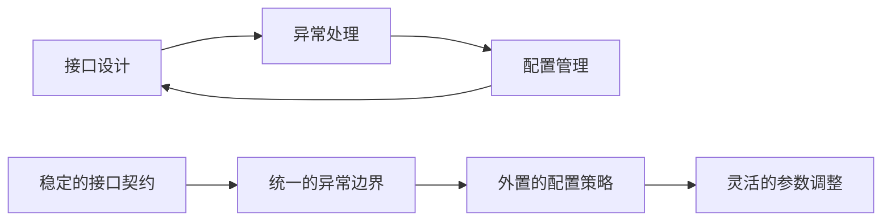
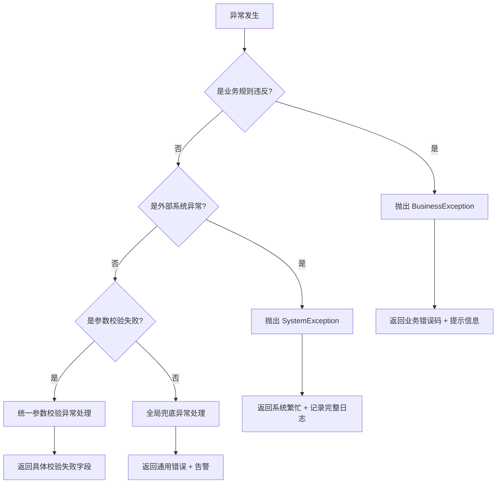

# 接口、异常与配置最佳实践

本章聚焦三件工程上最容易失守的事：**接口设计**（对外的契约）、**异常处理**（出错时的行为）和**配置管理**（随环境变化的部分）。三者共同决定了服务边界是否清晰、故障是否可定位，下面依次展开。

## 三大领域的关系



这三个领域不是孤立的：接口定义了入口边界，异常处理定义了出口边界，配置管理则让这两者可以在不重新部署的情况下调整行为。

## 接口设计最佳实践

### 核心原则

| 原则       | 说明                                          |
| ---------- | --------------------------------------------- |
| **稳定性** | URL、请求体、返回体保持清晰稳定，避免频繁变更 |
| **隔离性** | 不把内部实体直接暴露给前端，使用 DTO/VO 隔离  |
| **一致性** | 对分页、排序、筛选做统一规范                  |
| **可追溯** | 请求要有唯一标识，便于日志追踪                |

### URL 设计规范

**RESTful 风格**：

```
GET    /api/v1/users          # 获取用户列表
GET    /api/v1/users/{id}     # 获取单个用户
POST   /api/v1/users          # 创建用户
PUT    /api/v1/users/{id}     # 更新用户（全量）
PATCH  /api/v1/users/{id}     # 更新用户（部分）
DELETE /api/v1/users/{id}     # 删除用户
```

**命名规范**：

| 规范             | 示例                 | 说明         |
| ---------------- | -------------------- | ------------ |
| 使用小写字母     | `/api/users`         | 不使用驼峰   |
| 使用连字符分隔   | `/api/user-profiles` | 不使用下划线 |
| 使用名词复数     | `/api/users`         | 不使用动词   |
| 版本号放在路径中 | `/api/v1/users`      | 便于版本管理 |

### 请求参数设计

**查询参数**：

```java
@Data
public class UserQueryRequest {
    private String username;
    private Integer status;
    private Integer pageNum = 1;
    private Integer pageSize = 10;
    private String sortBy = "createTime";
    private String sortOrder = "DESC";
}
```

**请求体设计**：

```java
@Data
public class CreateUserRequest {
    @NotBlank(message = "用户名不能为空")
    @Size(min = 2, max = 20, message = "用户名长度2-20个字符")
    private String username;

    @NotBlank(message = "密码不能为空")
    @Pattern(regexp = "^(?=.*[a-z])(?=.*[A-Z])(?=.*\\d).{8,}$",
             message = "密码必须包含大小写字母和数字，至少8位")
    private String password;

    @Email(message = "邮箱格式不正确")
    private String email;

    @Pattern(regexp = "^1[3-9]\\d{9}$", message = "手机号格式不正确")
    private String phone;
}
```

### 响应体设计

**统一响应结构**：

```java
@Data
@AllArgsConstructor
@NoArgsConstructor
public class ApiResponse<T> {
    private int code;
    private String message;
    private T data;
    private long timestamp;

    public static <T> ApiResponse<T> success(T data) {
        return new ApiResponse<>(0, "success", data, System.currentTimeMillis());
    }

    public static <T> ApiResponse<T> fail(int code, String message) {
        return new ApiResponse<>(code, message, null, System.currentTimeMillis());
    }

    public static <T> ApiResponse<T> fail(ErrorCode errorCode) {
        return new ApiResponse<>(errorCode.getCode(), errorCode.getMessage(),
                                 null, System.currentTimeMillis());
    }
}
```

**分页响应**：

```java
@Data
public class PageResponse<T> {
    private List<T> list;
    private long total;
    private int pageNum;
    private int pageSize;
    private int totalPages;

    public static <T> PageResponse<T> of(List<T> list, long total,
                                          int pageNum, int pageSize) {
        PageResponse<T> response = new PageResponse<>();
        response.setList(list);
        response.setTotal(total);
        response.setPageNum(pageNum);
        response.setPageSize(pageSize);
        response.setTotalPages((int) Math.ceil((double) total / pageSize));
        return response;
    }
}
```

### 接口版本管理

接口变更不可避免，但必须通过版本管理来保证向后兼容。

**版本策略对比**：

| 策略 | 示例 | 优点 | 缺点 |
|------|------|------|------|
| **URL 路径版本** | `/api/v1/users` | 直观明确 | 需要维护多套 Controller |
| **请求头版本** | `X-API-Version: 1` | URL 不变 | 不够直观 |
| **参数版本** | `/api/users?version=1` | 简单 | 污染 URL |

**推荐做法**：使用 URL 路径版本，每个大版本维护独立的 Controller。

```java
// V1 版本：基础字段
@RestController
@RequestMapping("/api/v1/users")
public class UserV1Controller {
    @GetMapping("/{id}")
    public ApiResponse<UserDTO> getUser(@PathVariable Long id) {
        return ApiResponse.success(userService.getUserV1(id));
    }
}

// V2 版本：增加了角色信息
@RestController
@RequestMapping("/api/v2/users")
public class UserV2Controller {
    @GetMapping("/{id}")
    public ApiResponse<UserDTOV2> getUser(@PathVariable Long id) {
        return ApiResponse.success(userService.getUserV2(id));
    }
}
```

::: tip 版本管理原则
1. **只增不改**：新增字段可以，修改或删除字段必须升版本
2. **旧版本保留期**：至少保留一个版本的兼容期，给调用方迁移时间
3. **版本废弃通知**：通过响应头 `Sunset` 或 `Deprecation` 提前通知
4. **文档同步更新**：接口变更时必须同步更新 API 文档
:::

### 接口文档规范

```java
// 使用 SpringDoc (OpenAPI 3) 自动生成接口文档
@Tag(name = "用户管理", description = "用户相关的增删改查接口")
@RestController
@RequestMapping("/api/v1/users")
public class UserController {

    @Operation(summary = "获取用户详情", description = "根据用户ID获取用户详细信息")
    @ApiResponses({
        @ApiResponse(responseCode = "200", description = "成功"),
        @ApiResponse(responseCode = "404", description = "用户不存在"),
        @ApiResponse(responseCode = "500", description = "系统异常")
    })
    @GetMapping("/{id}")
    public ApiResponse<UserDTO> getUser(
            @Parameter(description = "用户ID", required = true)
            @PathVariable Long id) {
        return ApiResponse.success(userService.getUser(id));
    }
}
```

### DTO/VO/Entity 分层

**分层职责**：

| 层级                       | 职责           | 生命周期       |
| -------------------------- | -------------- | -------------- |
| DTO (Data Transfer Object) | 接口层数据传输 | 请求/响应范围  |
| VO (View Object)           | 视图展示数据   | 响应范围       |
| Entity                     | 数据库映射     | 数据库事务范围 |
| BO (Business Object)       | 业务逻辑处理   | 业务方法范围   |

**转换示例**：

```java
@Component
public class UserConverter {

    public UserDTO toDTO(UserEntity entity) {
        if (entity == null) return null;
        UserDTO dto = new UserDTO();
        dto.setId(entity.getId());
        dto.setUsername(entity.getUsername());
        dto.setEmail(entity.getEmail());
        dto.setCreateTime(entity.getCreateTime());
        return dto;
    }

    public UserEntity toEntity(CreateUserRequest request) {
        if (request == null) return null;
        UserEntity entity = new UserEntity();
        entity.setUsername(request.getUsername());
        entity.setPassword(passwordEncoder.encode(request.getPassword()));
        entity.setEmail(request.getEmail());
        entity.setCreateTime(LocalDateTime.now());
        return entity;
    }

    public List<UserDTO> toDTOList(List<UserEntity> entities) {
        return entities.stream()
            .map(this::toDTO)
            .collect(Collectors.toList());
    }
}
```

## 异常处理最佳实践

### 异常分类

```
异常体系
├── 业务异常 (BusinessException)
│   ├── 参数校验异常
│   ├── 业务规则异常
│   └── 资源不存在异常
├── 系统异常 (SystemException)
│   ├── 数据库异常
│   ├── 网络异常
│   └── 第三方服务异常
└── 运行时异常 (RuntimeException)
    ├── 空指针异常
    ├── 类型转换异常
    └── 数组越界异常
```

### 自定义异常类

```java
@Getter
public class BusinessException extends RuntimeException {
    private final int code;
    private final String message;

    public BusinessException(ErrorCode errorCode) {
        super(errorCode.getMessage());
        this.code = errorCode.getCode();
        this.message = errorCode.getMessage();
    }

    public BusinessException(int code, String message) {
        super(message);
        this.code = code;
        this.message = message;
    }

    public BusinessException(ErrorCode errorCode, Throwable cause) {
        super(errorCode.getMessage(), cause);
        this.code = errorCode.getCode();
        this.message = errorCode.getMessage();
    }
}

@Getter
public class SystemException extends RuntimeException {
    private final int code;

    public SystemException(String message) {
        super(message);
        this.code = 50000;
    }

    public SystemException(String message, Throwable cause) {
        super(message, cause);
        this.code = 50000;
    }
}
```

### 全局异常处理

```java
@Slf4j
@RestControllerAdvice
public class GlobalExceptionHandler {

    @ExceptionHandler(BusinessException.class)
    public ApiResponse<Void> handleBusinessException(BusinessException ex) {
        log.warn("业务异常: code={}, message={}", ex.getCode(), ex.getMessage());
        return ApiResponse.fail(ex.getCode(), ex.getMessage());
    }

    @ExceptionHandler(MethodArgumentNotValidException.class)
    public ApiResponse<Void> handleValidationException(MethodArgumentNotValidException ex) {
        String message = ex.getBindingResult().getFieldErrors().stream()
            .map(error -> error.getField() + ": " + error.getDefaultMessage())
            .collect(Collectors.joining(", "));
        log.warn("参数校验失败: {}", message);
        return ApiResponse.fail(40001, message);
    }

    @ExceptionHandler(BindException.class)
    public ApiResponse<Void> handleBindException(BindException ex) {
        String message = ex.getBindingResult().getFieldErrors().stream()
            .map(error -> error.getField() + ": " + error.getDefaultMessage())
            .collect(Collectors.joining(", "));
        log.warn("参数绑定失败: {}", message);
        return ApiResponse.fail(40002, message);
    }

    @ExceptionHandler(HttpRequestMethodNotSupportedException.class)
    public ApiResponse<Void> handleMethodNotSupported(HttpRequestMethodNotSupportedException ex) {
        log.warn("请求方法不支持: {}", ex.getMessage());
        return ApiResponse.fail(40003, "不支持的请求方法");
    }

    @ExceptionHandler(MissingServletRequestParameterException.class)
    public ApiResponse<Void> handleMissingParameter(MissingServletRequestParameterException ex) {
        log.warn("缺少必要参数: {}", ex.getParameterName());
        return ApiResponse.fail(40004, "缺少必要参数: " + ex.getParameterName());
    }

    @ExceptionHandler(Exception.class)
    public ApiResponse<Void> handleException(Exception ex) {
        log.error("系统异常", ex);
        return ApiResponse.fail(50000, "系统繁忙，请稍后重试");
    }
}
```

### 异常处理决策流程



### 异常处理最佳实践

**1. 业务异常 vs 系统异常**：

```java
public class OrderService {

    public Order createOrder(CreateOrderRequest request) {
        User user = userService.findById(request.getUserId());
        if (user == null) {
            throw new BusinessException(ErrorCode.USER_NOT_FOUND);
        }

        Product product = productService.findById(request.getProductId());
        if (product == null) {
            throw new BusinessException(ErrorCode.PRODUCT_NOT_FOUND);
        }

        if (product.getStock() < request.getQuantity()) {
            throw new BusinessException(ErrorCode.INSUFFICIENT_STOCK);
        }

        try {
            return doCreateOrder(user, product, request);
        } catch (DataAccessException e) {
            throw new SystemException("创建订单失败", e);
        }
    }
}
```

**2. 异常上下文记录**：

```java
@Slf4j
public class PaymentService {

    public void processPayment(String orderId, BigDecimal amount) {
        try {
            doProcessPayment(orderId, amount);
        } catch (Exception e) {
            log.error("支付处理失败 - orderId: {}, amount: {}", orderId, amount, e);
            throw new SystemException("支付处理失败", e);
        }
    }
}
```

## 配置管理最佳实践

### 配置分类

| 配置类型 | 示例                 | 管理方式              |
| -------- | -------------------- | --------------------- |
| 环境配置 | 数据库地址、服务端口 | application-{env}.yml |
| 业务配置 | 功能开关、阈值参数   | 配置中心              |
| 敏感配置 | 密码、密钥           | 环境变量/密钥管理     |
| 框架配置 | 线程池、连接池       | 配置类绑定            |

### 配置文件结构

```yaml
application.yml
├── application-dev.yml     # 开发环境
├── application-test.yml    # 测试环境
├── application-prod.yml    # 生产环境
└── application-local.yml   # 本地开发（不提交）
```

**application.yml**：

```yaml
spring:
  profiles:
    active: ${SPRING_PROFILES_ACTIVE:dev}
  application:
    name: user-service

server:
  port: ${SERVER_PORT:8080}

logging:
  level:
    root: INFO
    com.example: DEBUG
  pattern:
    console: "%d{yyyy-MM-dd HH:mm:ss} [%thread] %-5level %logger{36} - %msg%n"
```

**application-dev.yml**：

```yaml
spring:
  datasource:
    url: jdbc:mysql://localhost:3306/mydb?useSSL=false&serverTimezone=Asia/Shanghai
    username: ${DB_USERNAME:root}
    password: ${DB_PASSWORD:root1234}
    driver-class-name: com.mysql.cj.jdbc.Driver

app:
  storage:
    endpoint: http://localhost:9000
    bucket: dev-bucket
    access-key: ${MINIO_ACCESS_KEY:minioadmin}
    secret-key: ${MINIO_SECRET_KEY:minioadmin}
```

**application-prod.yml**：

```yaml
spring:
  datasource:
    url: jdbc:mysql://${DB_HOST}:${DB_PORT}/${DB_NAME}?useSSL=true&serverTimezone=Asia/Shanghai
    username: ${DB_USERNAME}
    password: ${DB_PASSWORD}
    hikari:
      maximum-pool-size: 20
      minimum-idle: 5

app:
  storage:
    endpoint: ${STORAGE_ENDPOINT}
    bucket: ${STORAGE_BUCKET}
    access-key: ${STORAGE_ACCESS_KEY}
    secret-key: ${STORAGE_SECRET_KEY}
```

### 配置绑定类

```java
@Data
@Component
@ConfigurationProperties(prefix = "app.storage")
public class StorageProperties {
    private String endpoint;
    private String bucket;
    private String accessKey;
    private String secretKey;
    private int timeoutSeconds = 30;
    private int maxRetries = 3;
}

@Data
@Component
@ConfigurationProperties(prefix = "app.security")
public class SecurityProperties {
    private String jwtSecret;
    private long jwtExpiration = 86400000;
    private List<String> whiteList = new ArrayList<>();
}
```

### 配置使用示例

```java
@Service
@Slf4j
public class StorageService {

    private final StorageProperties properties;
    private MinioClient minioClient;

    public StorageService(StorageProperties properties) {
        this.properties = properties;
        initClient();
    }

    private void initClient() {
        this.minioClient = MinioClient.builder()
            .endpoint(properties.getEndpoint())
            .credentials(properties.getAccessKey(), properties.getSecretKey())
            .build();
        log.info("Storage client initialized: endpoint={}, bucket={}",
                 properties.getEndpoint(), properties.getBucket());
    }

    public String uploadFile(String objectName, InputStream inputStream,
                             long size, String contentType) {
        try {
            minioClient.putObject(
                PutObjectArgs.builder()
                    .bucket(properties.getBucket())
                    .object(objectName)
                    .stream(inputStream, size, -1)
                    .contentType(contentType)
                    .build()
            );
            return String.format("%s/%s/%s",
                properties.getEndpoint(), properties.getBucket(), objectName);
        } catch (Exception e) {
            log.error("文件上传失败: objectName={}", objectName, e);
            throw new SystemException("文件上传失败", e);
        }
    }
}
```

### 敏感配置管理

**方式一：环境变量**：

```bash
export DB_USERNAME=prod_user
export DB_PASSWORD=secure_password
export JWT_SECRET=your_jwt_secret_key
```

**方式二：配置文件加密**：

```xml
<dependency>
    <groupId>com.github.ulisesbocchio</groupId>
    <artifactId>jasypt-spring-boot-starter</artifactId>
    <version>3.0.5</version>
</dependency>
```

```yaml
app:
  security:
    jwt-secret: ENC(加密后的密文)
```

**方式三：密钥管理服务**：

```java
@Service
public class SecretManager {

    @Value("${aws.secretsmanager.secret-name}")
    private String secretName;

    private final AWSSecretsManager client;

    public String getSecret(String key) {
        GetSecretValueRequest request = new GetSecretValueRequest()
            .withSecretId(secretName);
        GetSecretValueResult result = client.getSecretValue(request);
        JSONObject secrets = new JSONObject(result.getSecretString());
        return secrets.getString(key);
    }
}
```

### 配置变更审计

配置变更和代码变更一样需要审计。生产环境中配置错误是常见的故障来源。

```java
// 配置变更审计日志
@Slf4j
@Component
public class ConfigurationAuditListener {

    @EventListener
    public void onEnvironmentChangeEvent(EnvironmentChangeEvent event) {
        event.getKeys().forEach(key -> {
            log.info("配置变更 - key: {}, 新值: {}, 来源: {}",
                key,
                // 敏感配置脱敏
                isSensitive(key) ? "******" : event.getNewValue(key),
                event.getSource()
            );
        });
    }

    private boolean isSensitive(String key) {
        return key.contains("password") || key.contains("secret")
            || key.contains("key") || key.contains("token");
    }
}
```

::: warning 配置管理红线
1. **敏感配置绝不提交到代码仓库**——密码、密钥必须通过环境变量或密钥管理服务注入
2. **生产配置变更必须有审批流程**——不能直接在配置中心修改生产配置
3. **配置变更必须有回滚方案**——知道改之前的值是什么
4. **配置变更必须有监控**——变更后观察关键指标是否正常
:::

### 配置验证

```java
// 启动时校验关键配置，防止配置错误导致运行时异常
@Data
@Component
@ConfigurationProperties(prefix = "app.datasource")
@Validated
public class DataSourceProperties {

    @NotBlank(message = "数据库地址不能为空")
    private String url;

    @NotBlank(message = "数据库用户名不能为空")
    private String username;

    @Min(value = 1, message = "最小连接数不能小于1")
    @Max(value = 100, message = "最小连接数不能超过100")
    private int minimumIdle = 5;

    @Min(value = 1, message = "最大连接数不能小于1")
    @Max(value = 500, message = "最大连接数不能超过500")
    private int maximumPoolSize = 20;

    @Min(value = 1000, message = "连接超时不能小于1秒")
    private long connectionTimeout = 30000;
}
```

```java
// 启动后校验关键 Bean 是否正常
@Component
public class ConfigurationValidator implements ApplicationRunner {

    private final DataSource dataSource;
    private final RedisConnectionFactory redisConnectionFactory;

    @Override
    public void run(ApplicationArguments args) throws Exception {
        // 校验数据库连接
        try (Connection conn = dataSource.getConnection()) {
            log.info("数据库连接验证成功: {}", conn.getMetaData().getURL());
        } catch (SQLException e) {
            throw new SystemException("数据库连接验证失败: " + e.getMessage(), e);
        }

        // 校验 Redis 连接
        try (RedisConnection conn = redisConnectionFactory.getConnection()) {
            conn.ping();
            log.info("Redis 连接验证成功");
        } catch (Exception e) {
            throw new SystemException("Redis 连接验证失败: " + e.getMessage(), e);
        }
    }
}
```

## 常见问题与解决方案

### 问题一：接口直接返回数据库实体

**问题**：

```java
@GetMapping("/users/{id}")
public UserEntity getUser(@PathVariable Long id) {
    return userRepository.findById(id).orElse(null);
}
```

**风险**：

- 暴露敏感字段（密码、内部标识）
- 数据库结构变更影响接口
- 循环引用导致序列化问题

**解决方案**：

```java
@GetMapping("/users/{id}")
public ApiResponse<UserDTO> getUser(@PathVariable Long id) {
    UserEntity entity = userRepository.findById(id)
        .orElseThrow(() -> new BusinessException(ErrorCode.USER_NOT_FOUND));
    return ApiResponse.success(userConverter.toDTO(entity));
}
```

### 问题二：异常处理不统一

**问题**：

```java
@GetMapping("/orders/{id}")
public Order getOrder(@PathVariable Long id) {
    try {
        return orderService.findById(id);
    } catch (Exception e) {
        e.printStackTrace();
        return null;
    }
}
```

**风险**：

- 异常信息丢失
- 前端无法判断成功失败
- 日志不完整

**解决方案**：

```java
@GetMapping("/orders/{id}")
public ApiResponse<OrderDTO> getOrder(@PathVariable Long id) {
    OrderDTO order = orderService.findById(id);
    return ApiResponse.success(order);
}
```

### 问题三：配置写死在代码中

**问题**：

```java
public class PaymentService {
    private static final String API_URL = "https://api.payment.com";
    private static final String API_KEY = "sk_live_xxxxx";
}
```

**风险**：

- 无法区分环境
- 敏感信息泄露
- 配置变更需要重新部署

**解决方案**：

```java
@Service
public class PaymentService {
    private final PaymentProperties properties;

    public PaymentService(PaymentProperties properties) {
        this.properties = properties;
    }
}
```

## 最佳实践总结

| 领域     | 核心原则                   |
| -------- | -------------------------- |
| 接口设计 | 稳定、隔离、一致、可追溯   |
| 异常处理 | 分类、统一、上下文、不暴露 |
| 配置管理 | 外置、分类、加密、绑定     |

**下一步**：学习统一返回与错误码设计

## 版本差异(实践要点 → Java 21 / Spring Boot 3.5.x)

| 特性 | 旧实践 | 当前实践 |
|------|--------|----------|
| 接口异常 | 自定义异常 + 全局异常处理器 | 不变；@RestControllerAdvice 在 Boot 3.x 中推荐搭配 ProblemDetail（RFC 9457）|
| 配置管理 | 多环境 profile | 不变；新增 spring.config.import 导入外部配置、@ConfigurationProperties 校验 |
| 虚拟线程 | 线程池配置 | Boot 3.2+ 可启用虚拟线程，I/O 密集型接口无需自定义线程池 |
| 参数校验 | javax.validation | jakarta.validation（Boot 3 强制） |

> 接口设计、异常分级、配置外置等核心思路不随版本变化；差异集中在包名（javax → jakarta）与新特性（ProblemDetail、虚拟线程）上。
