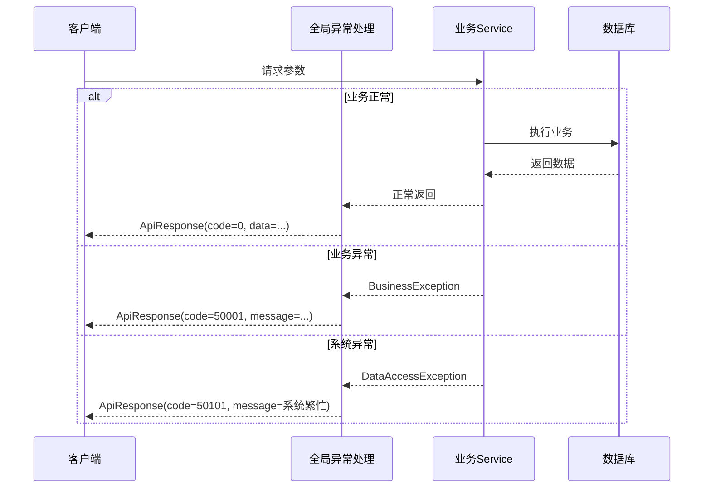
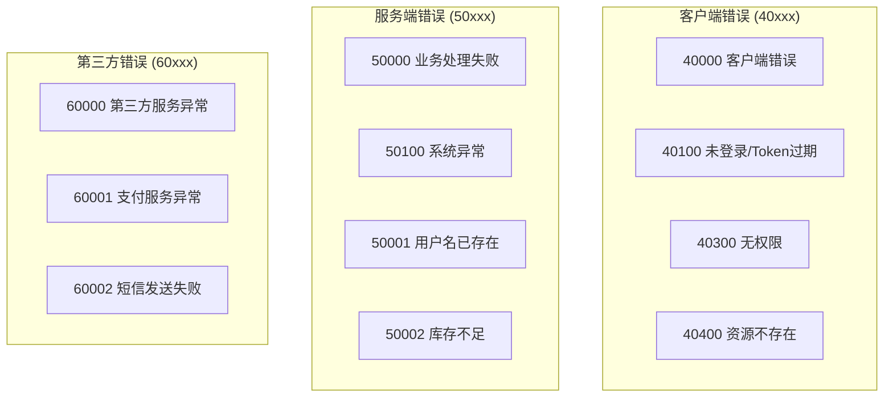

# 统一返回与错误码设计

一个项目里最常见的协作摩擦，往往从"这个接口返回的字段怎么又变了"开始。统一返回结构让所有接口用同一副"信封"装数据，错误码设计则让失败原因可分层、可登记、可追踪。本章围绕这两件事给出可直接落地的方案。

## 请求响应全链路



## 统一返回结构

### 为什么需要统一返回

| 问题 | 影响 |
| --- | --- |
| 每个接口返回格式不同 | 前端需要针对每个接口写特殊处理逻辑 |
| 成功失败判断方式不一致 | 无法统一做错误拦截和提示 |
| 错误信息缺乏结构化 | 无法做自动化监控和告警 |
| 数据位置不固定 | 前端解析逻辑复杂，容易出错 |

### 统一返回的目标

统一返回的目标是让调用方稳定理解：

| 信息 | 说明 |
| --- | --- |
| 请求状态 | 成功还是失败 |
| 失败类型 | 属于哪一类问题 |
| 数据主体 | 返回数据在哪里 |
| 提示信息 | 能否直接展示给用户 |

### 标准响应结构

```java
@Data
@AllArgsConstructor
@NoArgsConstructor
public class ApiResponse<T> {
    
    private int code;
    private String message;
    private T data;
    private long timestamp;
    private String traceId;
    
    public static <T> ApiResponse<T> success(T data) {
        ApiResponse<T> response = new ApiResponse<>();
        response.setCode(0);
        response.setMessage("success");
        response.setData(data);
        response.setTimestamp(System.currentTimeMillis());
        response.setTraceId(TraceContext.getTraceId());
        return response;
    }
    
    public static <T> ApiResponse<T> success() {
        return success(null);
    }
    
    public static <T> ApiResponse<T> fail(int code, String message) {
        ApiResponse<T> response = new ApiResponse<>();
        response.setCode(code);
        response.setMessage(message);
        response.setTimestamp(System.currentTimeMillis());
        response.setTraceId(TraceContext.getTraceId());
        return response;
    }
    
    public static <T> ApiResponse<T> fail(ErrorCode errorCode) {
        return fail(errorCode.getCode(), errorCode.getMessage());
    }
    
    public boolean isSuccess() {
        return this.code == 0;
    }
}
```

### 分页响应结构

```java
@Data
public class PageResponse<T> {
    
    private List<T> list;
    private long total;
    private int pageNum;
    private int pageSize;
    private int totalPages;
    private boolean hasNext;
    
    public static <T> PageResponse<T> of(List<T> list, long total, 
                                          int pageNum, int pageSize) {
        PageResponse<T> response = new PageResponse<>();
        response.setList(list);
        response.setTotal(total);
        response.setPageNum(pageNum);
        response.setPageSize(pageSize);
        response.setTotalPages((int) Math.ceil((double) total / pageSize));
        response.setHasNext(pageNum < response.getTotalPages());
        return response;
    }
    
    public static <T> PageResponse<T> empty(int pageNum, int pageSize) {
        return of(Collections.emptyList(), 0, pageNum, pageSize);
    }
}
```

### 使用示例

**Controller 层**：

```java
@RestController
@RequestMapping("/api/v1/users")
public class UserController {
    
    private final UserService userService;
    
    @GetMapping("/{id}")
    public ApiResponse<UserDTO> getUser(@PathVariable Long id) {
        UserDTO user = userService.findById(id);
        return ApiResponse.success(user);
    }
    
    @GetMapping
    public ApiResponse<PageResponse<UserDTO>> listUsers(UserQueryRequest request) {
        PageResponse<UserDTO> page = userService.findByPage(request);
        return ApiResponse.success(page);
    }
    
    @PostMapping
    public ApiResponse<Long> createUser(@RequestBody @Valid CreateUserRequest request) {
        Long userId = userService.create(request);
        return ApiResponse.success(userId);
    }
}
```

## 错误码设计

### 错误码分层原则

错误码最忌讳的问题是：

- 一堆魔法数字没人知道含义
- 同一个错误不同模块返回不同码
- 业务错误和系统错误混在一起

**推荐分层方式**：

```
错误码结构: XXYYZZ
├── XX: 错误类型（2位）
│   ├── 40: 客户端错误
│   ├── 50: 服务端错误
│   └── 60: 第三方服务错误
├── YY: 错误模块（2位）
│   ├── 01: 用户模块
│   ├── 02: 订单模块
│   ├── 03: 支付模块
│   └── 04: 商品模块
└── ZZ: 具体错误（2位）
    ├── 01: 具体错误类型
    └── ...
```



### 错误码定义

```java
@Getter
@AllArgsConstructor
public enum ErrorCode {
    
    SUCCESS(0, "成功"),
    
    CLIENT_ERROR(40000, "客户端错误"),
    INVALID_PARAMETER(40001, "参数校验失败"),
    MISSING_PARAMETER(40002, "缺少必要参数"),
    INVALID_FORMAT(40003, "格式不正确"),
    
    UNAUTHORIZED(40100, "未登录"),
    TOKEN_EXPIRED(40101, "登录已过期"),
    TOKEN_INVALID(40102, "无效的登录凭证"),
    
    FORBIDDEN(40300, "无权限访问"),
    RESOURCE_FORBIDDEN(40301, "无权访问该资源"),
    
    NOT_FOUND(40400, "资源不存在"),
    USER_NOT_FOUND(40401, "用户不存在"),
    ORDER_NOT_FOUND(40402, "订单不存在"),
    PRODUCT_NOT_FOUND(40403, "商品不存在"),
    
    METHOD_NOT_ALLOWED(40500, "请求方法不支持"),
    
    BUSINESS_ERROR(50000, "业务处理失败"),
    USER_EXISTS(50001, "用户名已存在"),
    INSUFFICIENT_STOCK(50002, "库存不足"),
    ORDER_STATUS_ERROR(50003, "订单状态异常"),
    BALANCE_NOT_ENOUGH(50004, "余额不足"),
    
    SYSTEM_ERROR(50100, "系统繁忙，请稍后重试"),
    DATABASE_ERROR(50101, "数据库操作失败"),
    NETWORK_ERROR(50102, "网络连接失败"),
    
    THIRD_PARTY_ERROR(60000, "第三方服务异常"),
    PAYMENT_ERROR(60001, "支付服务异常"),
    SMS_ERROR(60002, "短信发送失败"),
    STORAGE_ERROR(60003, "存储服务异常");
    
    private final int code;
    private final String message;
}
```

### 错误码枚举扩展

**按模块定义错误码**：单一枚举膨胀到上百个常量后难以维护，标准做法是把 `ErrorCode` 抽象为接口，公共错误码与各模块错误码分别用枚举实现。注意：**枚举不能被 `new`**，模块错误码不能写成 `new ErrorCode(...)` 的常量类，正确姿势如下：

```java
// 1. 公共接口：统一 getCode/getMessage 契约
public interface ErrorCode {
    int getCode();
    String getMessage();
}

// 2. 原公共枚举实现该接口（BusinessException、ApiResponse.fail 的参数类型改为 ErrorCode 接口后无需其他改动）
@Getter
@AllArgsConstructor
public enum CommonErrorCode implements ErrorCode {

    SUCCESS(0, "成功"),
    USER_NOT_FOUND(40401, "用户不存在"),
    ORDER_NOT_FOUND(40402, "订单不存在");
    // ... 其余常量同前文，此处省略

    private final int code;
    private final String message;
}

// 3. 用户模块：只定义本模块私有错误码，编号继续沿用 XXYYZZ 分层，不与公共码冲突
@Getter
@AllArgsConstructor
public enum UserErrorCode implements ErrorCode {

    PASSWORD_ERROR(50010, "密码错误"),
    ACCOUNT_DISABLED(50011, "账号已禁用"),
    PHONE_EXISTS(50012, "手机号已注册");

    private final int code;
    private final String message;
}

// 4. 订单模块
@Getter
@AllArgsConstructor
public enum OrderErrorCode implements ErrorCode {

    ORDER_EXPIRED(50020, "订单已过期"),
    ORDER_PAID(50021, "订单已支付");

    private final int code;
    private final String message;
}
```

改造时将原 `ErrorCode` 枚举更名为 `CommonErrorCode`（实现 `ErrorCode` 接口），原有 `ErrorCode.XXX` 引用统一替换为 `CommonErrorCode.XXX` 即可；`BusinessException` 抛出模块错误码的用法不变：`throw new BusinessException(UserErrorCode.PASSWORD_ERROR)`。

## 业务异常处理

### 自定义业务异常

```java
@Getter
public class BusinessException extends RuntimeException {
    
    private final int code;
    private final String message;
    private final Object[] args;
    private final ErrorCode errorCode;
    
    public BusinessException(ErrorCode errorCode) {
        super(errorCode.getMessage());
        this.code = errorCode.getCode();
        this.message = errorCode.getMessage();
        this.args = null;
        this.errorCode = errorCode;
    }
    
    public BusinessException(ErrorCode errorCode, Object... args) {
        super(String.format(errorCode.getMessage(), args));
        this.code = errorCode.getCode();
        this.message = String.format(errorCode.getMessage(), args);
        this.args = args;
        this.errorCode = errorCode;
    }
    
    public BusinessException(int code, String message) {
        super(message);
        this.code = code;
        this.message = message;
        this.args = null;
        this.errorCode = null;
    }
}
```

### 全局异常处理

```java
@Slf4j
@RestControllerAdvice
public class GlobalExceptionHandler {

    @ExceptionHandler(BusinessException.class)
    public ApiResponse<Void> handleBusinessException(BusinessException ex) {
        log.warn("业务异常: code={}, message={}", ex.getCode(), ex.getMessage());
        return ApiResponse.fail(ex.getCode(), ex.getMessage());
    }

    @ExceptionHandler(MethodArgumentNotValidException.class)
    public ApiResponse<Void> handleValidationException(MethodArgumentNotValidException ex) {
        BindingResult bindingResult = ex.getBindingResult();
        String message = bindingResult.getFieldErrors().stream()
            .map(error -> String.format("%s: %s", error.getField(), error.getDefaultMessage()))
            .collect(Collectors.joining("; "));
        log.warn("参数校验失败: {}", message);
        return ApiResponse.fail(ErrorCode.INVALID_PARAMETER.getCode(), message);
    }

    @ExceptionHandler(ConstraintViolationException.class)
    public ApiResponse<Void> handleConstraintViolation(ConstraintViolationException ex) {
        String message = ex.getConstraintViolations().stream()
            .map(violation -> String.format("%s: %s", 
                violation.getPropertyPath(), violation.getMessage()))
            .collect(Collectors.joining("; "));
        log.warn("约束校验失败: {}", message);
        return ApiResponse.fail(ErrorCode.INVALID_PARAMETER.getCode(), message);
    }

    @ExceptionHandler(HttpRequestMethodNotSupportedException.class)
    public ApiResponse<Void> handleMethodNotSupported(HttpRequestMethodNotSupportedException ex) {
        log.warn("请求方法不支持: {}", ex.getMethod());
        return ApiResponse.fail(ErrorCode.METHOD_NOT_ALLOWED);
    }

    @ExceptionHandler(NoHandlerFoundException.class)
    public ApiResponse<Void> handleNotFound(NoHandlerFoundException ex) {
        log.warn("接口不存在: {}", ex.getRequestURL());
        return ApiResponse.fail(ErrorCode.NOT_FOUND);
    }

    @ExceptionHandler(DataAccessException.class)
    public ApiResponse<Void> handleDataAccess(DataAccessException ex) {
        log.error("数据库操作异常", ex);
        return ApiResponse.fail(ErrorCode.DATABASE_ERROR);
    }

    @ExceptionHandler(Exception.class)
    public ApiResponse<Void> handleException(Exception ex) {
        log.error("系统异常", ex);
        return ApiResponse.fail(ErrorCode.SYSTEM_ERROR);
    }
}
```

## 实战场景

### 场景一：前后端联调

**统一返回前**：

```java
@GetMapping("/users/{id}")
public Map<String, Object> getUser(@PathVariable Long id) {
    Map<String, Object> result = new HashMap<>();
    try {
        User user = userService.findById(id);
        if (user != null) {
            result.put("status", "ok");
            result.put("data", user);
        } else {
            result.put("status", "error");
            result.put("msg", "用户不存在");
        }
    } catch (Exception e) {
        result.put("status", "error");
        result.put("msg", e.getMessage());
    }
    return result;
}
```

**统一返回后**：

```java
@GetMapping("/users/{id}")
public ApiResponse<UserDTO> getUser(@PathVariable Long id) {
    UserDTO user = userService.findById(id);
    return ApiResponse.success(user);
}
```

前端统一处理：

```javascript
axios.interceptors.response.use(
    response => {
        const { code, message, data } = response.data;
        if (code === 0) {
            return data;
        }
        Message.error(message);
        return Promise.reject(new Error(message));
    },
    error => {
        const { code, message } = error.response?.data || {};
        if (code === 40100) {
            router.push('/login');
        } else {
            Message.error(message || '系统异常');
        }
        return Promise.reject(error);
    }
);
```

### 场景二：内部服务调用

```java
@Service
public class OrderService {
    
    private final UserService userService;
    private final ProductService productService;
    
    public Order createOrder(CreateOrderRequest request) {
        UserDTO user = userService.findById(request.getUserId());
        if (user == null) {
            throw new BusinessException(ErrorCode.USER_NOT_FOUND);
        }
        
        ProductDTO product = productService.findById(request.getProductId());
        if (product == null) {
            throw new BusinessException(ErrorCode.PRODUCT_NOT_FOUND);
        }
        
        if (product.getStock() < request.getQuantity()) {
            throw new BusinessException(ErrorCode.INSUFFICIENT_STOCK);
        }
        
        return doCreateOrder(user, product, request);
    }
}
```

### 场景三：日志与监控

```java
@Aspect
@Slf4j
@Component
public class ApiLogAspect {
    
    @Around("@annotation(org.springframework.web.bind.annotation.RequestMapping)")
    public Object logApi(ProceedingJoinPoint joinPoint) throws Throwable {
        String traceId = UUID.randomUUID().toString().replace("-", "");
        TraceContext.setTraceId(traceId);
        
        long startTime = System.currentTimeMillis();
        String methodName = joinPoint.getSignature().getName();
        
        try {
            Object result = joinPoint.proceed();
            long duration = System.currentTimeMillis() - startTime;
            
            if (result instanceof ApiResponse) {
                ApiResponse<?> response = (ApiResponse<?>) result;
                log.info("API调用成功 - traceId: {}, method: {}, duration: {}ms, code: {}", 
                    traceId, methodName, duration, response.getCode());
            }
            
            return result;
        } catch (BusinessException e) {
            log.warn("API业务异常 - traceId: {}, method: {}, code: {}, message: {}", 
                traceId, methodName, e.getCode(), e.getMessage());
            throw e;
        } catch (Exception e) {
            log.error("API系统异常 - traceId: {}, method: {}", traceId, methodName, e);
            throw e;
        } finally {
            TraceContext.clear();
        }
    }
}
```

## 错误码治理

### 错误码冲突检测

多人协作时，错误码冲突是常见问题。可以通过单元测试在构建阶段自动检测：

```java
@Test
void 错误码不应重复() {
    ErrorCode[] codes = ErrorCode.values();
    Map<Integer, String> codeToName = new HashMap<>();
    
    for (ErrorCode errorCode : codes) {
        String existing = codeToName.put(errorCode.getCode(), errorCode.name());
        if (existing != null) {
            fail(String.format("错误码冲突: %d 同时被 %s 和 %s 使用",
                errorCode.getCode(), existing, errorCode.name()));
        }
    }
}
```

::: tip CI 集成
将错误码冲突检测加入 CI 流水线，确保新增错误码不会与现有冲突。这是防止"魔法数字"蔓延的有效手段。
:::

### 错误码注册表

```java
@Component
public class ErrorCodeRegistry {
    
    private final Map<Integer, ErrorCode> errorCodeMap = new ConcurrentHashMap<>();
    
    @PostConstruct
    public void init() {
        register(ErrorCode.values());
    }
    
    public void register(ErrorCode... errorCodes) {
        for (ErrorCode errorCode : errorCodes) {
            ErrorCode existing = errorCodeMap.putIfAbsent(errorCode.getCode(), errorCode);
            if (existing != null) {
                throw new IllegalStateException(
                    String.format("错误码冲突: %d 已被 %s 使用", 
                        errorCode.getCode(), existing.name()));
            }
        }
    }
    
    public ErrorCode get(int code) {
        return errorCodeMap.get(code);
    }

    public Collection<ErrorCode> getAll() {
        return errorCodeMap.values();
    }

    public String getMessage(int code) {
        ErrorCode errorCode = errorCodeMap.get(code);
        return errorCode != null ? errorCode.getMessage() : "未知错误";
    }
}
```

### 错误码文档生成

```java
@RestController
@RequestMapping("/api/internal/error-codes")
public class ErrorCodeController {
    
    private final ErrorCodeRegistry registry;
    
    @GetMapping
    public List<ErrorCodeDocument> listErrorCodes() {
        return registry.getAll().stream()
            .map(e -> new ErrorCodeDocument(e.getCode(), e.name(), e.getMessage()))
            .sorted(Comparator.comparing(ErrorCodeDocument::getCode))
            .collect(Collectors.toList());
    }
}

@Data
@AllArgsConstructor
class ErrorCodeDocument {
    private int code;
    private String name;
    private String message;
}
```

## 常见误区

### 误区一：只用 HTTP 状态码

**问题**：

```java
@GetMapping("/users/{id}")
public ResponseEntity<User> getUser(@PathVariable Long id) {
    User user = userService.findById(id);
    if (user == null) {
        return ResponseEntity.notFound().build();
    }
    return ResponseEntity.ok(user);
}
```

**风险**：
- 无法区分不同类型的业务错误
- 错误信息不够详细
- 前端需要根据 HTTP 状态码判断

**解决方案**：

```java
@GetMapping("/users/{id}")
public ApiResponse<UserDTO> getUser(@PathVariable Long id) {
    UserDTO user = userService.findById(id);
    return ApiResponse.success(user);
}
```

### 误区二：错误码随意定义

**问题**：

```java
if (user == null) {
    throw new BusinessException(1001, "用户不存在");
}
if (order == null) {
    throw new BusinessException(1001, "订单不存在");
}
```

**风险**：
- 错误码重复
- 无法区分错误类型
- 维护困难

**解决方案**：

```java
if (user == null) {
    throw new BusinessException(ErrorCode.USER_NOT_FOUND);
}
if (order == null) {
    throw new BusinessException(ErrorCode.ORDER_NOT_FOUND);
}
```

### 误区三：暴露系统内部信息

**问题**：

```java
@ExceptionHandler(Exception.class)
public ApiResponse<Void> handleException(Exception ex) {
    return ApiResponse.fail(50000, ex.getMessage());
}
```

**风险**：
- 暴露数据库结构
- 暴露内部实现细节
- 安全隐患

**解决方案**：

```java
@ExceptionHandler(Exception.class)
public ApiResponse<Void> handleException(Exception ex) {
    log.error("系统异常", ex);
    return ApiResponse.fail(ErrorCode.SYSTEM_ERROR);
}
```

## 错误码国际化

面向多语言用户时，错误提示需要支持国际化（i18n）：

```java
@Component
public class I18nErrorCodeResolver {

    private final MessageSource messageSource;

    public String resolve(ErrorCode errorCode, Locale locale) {
        try {
            return messageSource.getMessage(
                "error." + errorCode.name(),
                null,
                errorCode.getMessage(),  // 默认消息（枚举中的值）
                locale
            );
        } catch (NoSuchMessageException e) {
            return errorCode.getMessage();  // 找不到翻译时回退
        }
    }
}
```

```properties
# messages_zh_CN.properties
error.USER_NOT_FOUND=用户不存在
error.INSUFFICIENT_STOCK=库存不足，当前库存：{0}

# messages_en_US.properties
error.USER_NOT_FOUND=User not found
error.INSUFFICIENT_STOCK=Insufficient stock, current stock: {0}
```

在全局异常处理中使用：

```java
@RestControllerAdvice
public class I18nGlobalExceptionHandler {

    private final I18nErrorCodeResolver i18nResolver;
    private final LocaleResolver localeResolver; // 注入 Spring 的 LocaleResolver（如 AcceptHeaderLocaleResolver）

    public I18nGlobalExceptionHandler(I18nErrorCodeResolver i18nResolver, LocaleResolver localeResolver) {
        this.i18nResolver = i18nResolver;
        this.localeResolver = localeResolver;
    }

    @ExceptionHandler(BusinessException.class)
    public ApiResponse<Void> handleBusinessException(
            BusinessException ex,
            HttpServletRequest request) {
        // 从请求头获取语言（LocaleResolver 解析 Accept-Language）
        Locale locale = localeResolver.resolveLocale(request);
        String message = ex.getErrorCode() != null
                ? i18nResolver.resolve(ex.getErrorCode(), locale)
                : ex.getMessage();

        log.warn("业务异常: code={}, message={}", ex.getCode(), message);
        return ApiResponse.fail(ex.getCode(), message);
    }
}
```

::: warning 国际化注意事项
1. 错误码编号本身不国际化，始终是数字
2. 只有 `message` 字段做国际化，`code` 保持不变
3. 给前端的信息要做国际化，但**日志中记录原始英文标识**，方便统一搜索
4. 避免在错误消息中拼接用户输入，防止 XSS
:::

## 微服务间的错误码传递

在微服务架构中，内部服务调用失败时，需要把上游的错误码正确传递给最终调用方：

```java
// Feign 调用失败时的解码器
@Component
public class CustomErrorDecoder implements ErrorDecoder {

    @Override
    public Exception decode(String methodKey, Response response) {
        try {
            String body = Util.toString(response.body().asReader());
            ApiResponse<?> apiResponse = objectMapper.readValue(body, ApiResponse.class);
            
            // 将上游错误码直接包装为 BusinessException 向上传递
            return new BusinessException(apiResponse.getCode(), apiResponse.getMessage());
        } catch (Exception e) {
            return new SystemException("服务调用失败: " + methodKey, e);
        }
    }
}
```

::: danger 错误码传递原则
- **上游的错误码应当原样传递**，不要重新包装成新的错误码
- 如果必须转换（如统一规范），在 `traceId` 中记录原始错误码
- 调用链中每层服务都应该在日志中记录自己收到的错误码和上下文
:::

**下一步**：学习 [日志校验与幂等最佳实践](02-日志校验与幂等最佳实践.md)

## 最佳实践总结

| 领域 | 核心原则 |
| --- | --- |
| 统一返回 | 结构一致、语义清晰、便于解析 |
| 错误码设计 | 分层定义、集中管理、避免冲突 |
| 异常处理 | 业务/系统分离、统一处理、不暴露细节 |

## 版本差异(统一返回 → Spring Boot 3.5.x)

| 特性 | 旧实践 | 当前实践 |
|------|--------|----------|
| 统一返回包装 | 自定义 Result 包装类 | 不变；可继续使用，或按 RFC 9457 使用 ProblemDetail |
| 错误码 | 数字码 + 枚举 | 不变；建议字符串码（如 A1001）便于扩展 |
| traceId | 手动生成 | Micrometer Tracing（Boot 3.x 起默认引入，替代 Spring Cloud Sleuth）自动生成并透传 |
| 序列化 | Jackson 默认 | 不变；Boot 3.5.x 默认 Jackson 2.19+，支持 record 序列化 |

> 统一返回与错误码设计是团队规范而非框架能力，思路完全不变；新项目可评估是否采用 Spring 官方 ProblemDetail 方案替代自定义包装。
