# Node.js 概述

## Node.js 是什么

Node.js 是一个基于 **Chrome V8 引擎**的 JavaScript 运行时（Runtime），并非语言、框架或库。它让 JavaScript 能够脱离浏览器，运行在服务器端、命令行、桌面应用等场景中。Node.js 的核心定位是**构建高可扩展的网络应用**——通过事件驱动和非阻塞 I/O 模型，单线程即可处理海量并发连接。

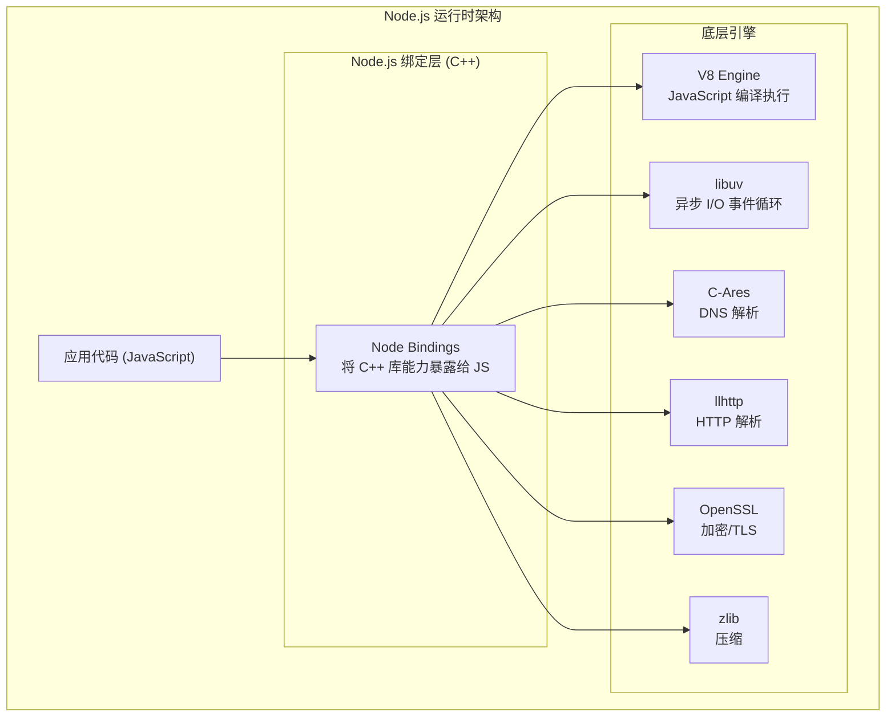

## 核心架构

Node.js 的架构可分层理解：

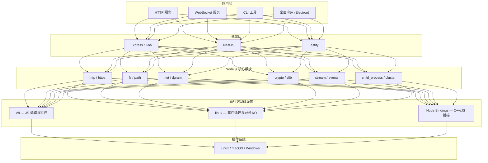

### V8 引擎

V8 是 Google 开发的 JavaScript 引擎，负责将 JavaScript 代码编译为机器码并执行：

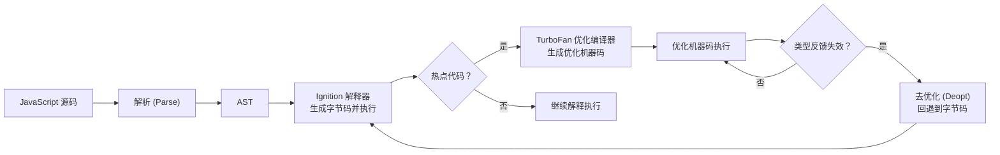

- **Ignition**：V8 的解释器，将 AST 编译为字节码并执行
- **TurboFan**：V8 的优化编译器，将热点代码编译为高度优化的机器码
- **去优化（Deoptimization）**：当类型反馈失效时，回退到字节码执行

### libuv — 事件循环

libuv 是 Node.js 异步 I/O 的核心——它封装了不同操作系统的 I/O 多路复用机制（epoll/kqueue/IOCP），提供统一的事件循环抽象：

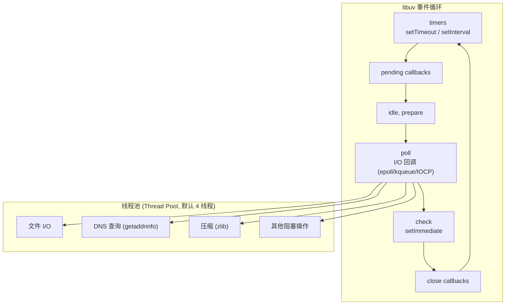

> **关键理解**：Node.js 的"单线程"是指 JavaScript 代码在**单个主线程**中执行，但 libuv 内部使用**线程池**处理文件 I/O、DNS 查询等阻塞操作。网络 I/O（TCP/UDP）则由操作系统内核的多路复用机制处理，不经过线程池。

## Node.js 的设计哲学

### 1. 事件驱动

Node.js 中几乎一切操作都通过事件和回调处理：

```javascript
const server = http.createServer();
server.on('request', (req, res) => { /* 处理请求 */ });
server.on('connection', (socket) => { /* 新连接 */ });
server.on('close', () => { /* 服务器关闭 */ });
```

### 2. 非阻塞 I/O

与传统的"一个连接一个线程"模型不同，Node.js 使用**单线程事件循环**处理所有 I/O：

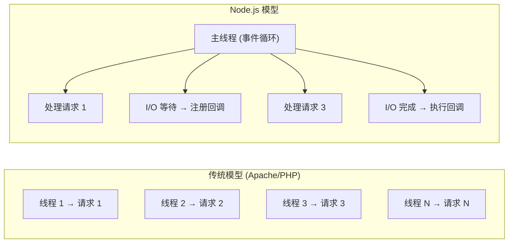

| 模型 | 并发方式 | 内存消耗 | C10K 问题 |
|------|---------|---------|----------|
| 线程模型 | 每连接一线程 | 高（每线程 ~8MB 栈） | 难以解决 |
| 事件驱动 | 单线程 + 事件循环 | 低 | 天然支持 |

### 3. 流（Stream）

Node.js 将数据视为流——分块处理而非一次性加载：

```javascript
// 文件复制 — 流式处理（内存友好）
fs.createReadStream('source.bin')
  .pipe(fs.createWriteStream('dest.bin'));
```

### 4. 模块化

Node.js 同时支持 CJS 和 ESM 两种模块系统，拥有世界上最大的开源包生态——npm。

## Node.js 适合什么

| 场景 | 适合 | 原因 |
|------|------|------|
| RESTful API | ✅ | 高并发 I/O，开发效率高 |
| 实时应用（聊天、协作） | ✅ | WebSocket 天然支持 |
| 微服务 | ✅ | 轻量、启动快 |
| CLI 工具 | ✅ | npm 生态丰富 |
| 流式数据处理 | ✅ | Stream 模型天然适合 |
| CPU 密集计算 | ❌ | 单线程阻塞事件循环 |
| 大规模数值计算 | ❌ | V8 优化不如编译型语言 |

**CPU 密集场景的解决方案**：`child_process`（子进程）、`worker_threads`（工作线程）、`cluster`（多进程）、N-API（C++ 扩展）。

## Node.js 核心能力全景图

通过分析 Webpack 等 Node 生态中的大型项目，可以直观地看到 Node 核心模块在实际工程中的使用频次与重要性：

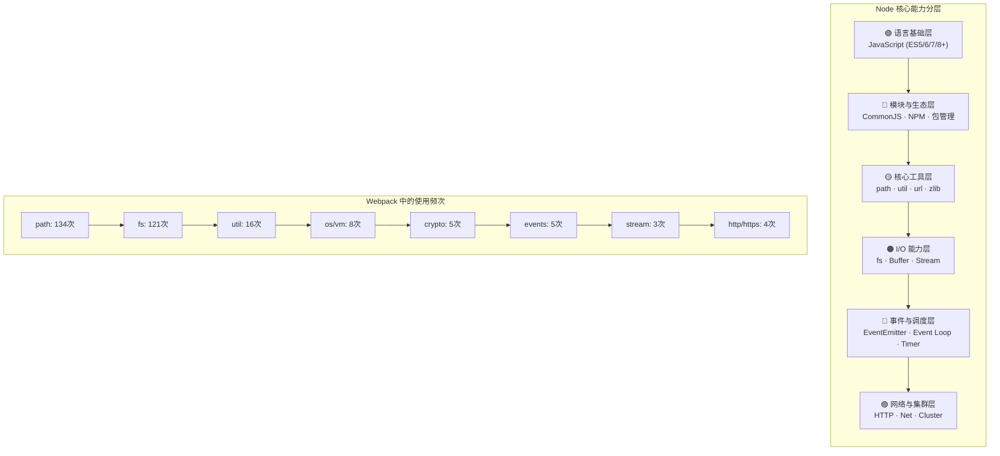

### 各层能力详解

| 能力层 | 核心模块 | 工程中的角色 | Webpack 使用场景 |
|--------|---------|-------------|-----------------|
| 语言基础 | ES6+ 语法 | 所有 Node 代码的基石 | Promise/Class/箭头函数/Set/Symbol 大规模使用 |
| 模块与生态 | CommonJS / NPM | 代码组织与依赖管理 | 2000+ 文件的模块关系管理，依赖树解析 |
| 核心工具 | path / util / url / zlib | 路径处理、工具函数、压缩 | path 调用 134 次，util.deprecate 标记废弃 API |
| I/O 能力 | fs / Buffer / Stream | 文件读写、二进制处理、流式传输 | 文件拷贝、编译产物写入、缓存读写 |
| 事件与调度 | EventEmitter / Event Loop | 异步流程控制、任务调度 | Stream 继承 EventEmitter，process.nextTick 调度任务 |
| 网络与集群 | HTTP / Cluster | 服务端能力、多进程扩展 | Dev Server、代理转发、负载均衡 |

> **理解路径**：从语言基础出发，经模块系统组织代码，掌握工具集简化开发，深入 I/O 操作处理数据，理解事件机制驱动异步，最终抵达网络编程与集群扩展。这正是本文档体系的编排逻辑。

## Node.js 版本演进

| 版本 | 发布年份 | 里程碑特性 |
|------|---------|-----------|
| v0.10 | 2013 | 首个稳定版 |
| v4 | 2015 | io.js 合并，ES6 特性 |
| v6 | 2016 | V8 升级，性能大幅提升 |
| v8 | 2017 | ESM 实验性支持 |
| v10 | 2018 | N-API 稳定，`fs.promises`（实验性） |
| v12 | 2019 | Worker Threads 稳定 |
| v14 | 2020 | AsyncLocalStorage，ESM 移除实验警告 |
| v16 | 2021 | Web Streams，CompressionStream |
| v18 | 2022 | 全局 `fetch`，Web Crypto |
| v20 | 2023 | 稳定的 Test Runner，权限模型 |
| v22 | 2024 | 内置 WebSocket，require(ESM) 支持 |
| v24 | 2025 | V8 13.6，npm 11（同年 10 月进入 LTS） |

## 源码级架构解析

### 三层架构与模块加载

Node.js 的架构自上而下分为三层，每一层职责明确：

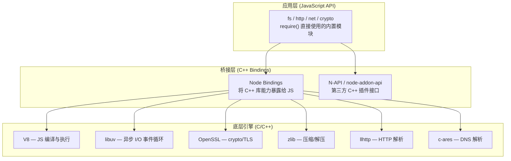

### 启动流程与模块加载链路

当在命令行输入 `node app.js` 时，Node.js 内部经历了以下关键步骤：

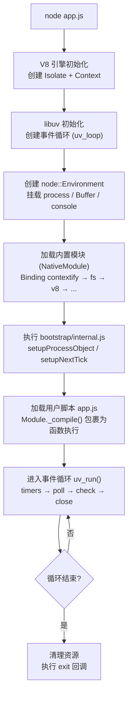

### global 与 process 的内部结构

在 Node.js 运行时，所有 JavaScript 代码都活跃在 `global` 对象下（类比浏览器中的 `window`）。`global` 挂载了以下关键成员：

```javascript
// global 对象的关键成员（简化）
global = {
  process: {
    argv: [],           // 命令行参数
    env: {},            // 环境变量
    version: 'v22.x',   // Node 版本
    versions: {},       // 各组件版本（v8, uv, zlib...）
    moduleLoadList: [], // 模块加载顺序记录
    binding: Function,  // 访问 C++ Binding 的内部接口
  },
  Buffer: [Function: Buffer],
  setTimeout, setInterval, setImmediate,
  console,
  require, module, exports,  // 模块系统（在模块作用域内）
  __dirname, __filename,     // 路径信息（在模块作用域内）
}
```

`process.moduleLoadList` 记录了 Node 启动时按顺序加载的模块，包含三类：

| 类型 | 前缀 | 说明 | 示例 |
|------|------|------|------|
| C++ Binding | `Binding` | 通过 C++ 实现的底层模块 | `Binding contextify`, `Binding fs` |
| 内部 Binding | `Internal Binding` | 仅内部使用的 C++ 模块 | `Internal Binding worker` |
| JS 原生模块 | `NativeModule` | 纯 JavaScript 实现的内置模块 | `NativeModule events`, `NativeModule util` |

### 模块包裹函数与作用域隔离

每个 JS 文件在 Node 中并非直接执行，而是被包裹在一个函数中，实现了模块作用域隔离：

```javascript
// Node 内部对每个模块的包裹方式
(function(exports, require, module, __filename, __dirname) {
  // 用户的代码写在这里
  // exports — 模块导出对象的引用
  // require — 模块加载函数
  // module — 当前模块对象（含 id, filename, children, paths 等）
  // __filename — 当前文件绝对路径
  // __dirname — 当前文件所在目录绝对路径
});
```

这正是 `require`、`module`、`exports`、`__filename`、`__dirname` 这五个变量无需声明即可使用的原因——它们是包裹函数的参数。

> **深入理解**：`module.exports` 与 `exports` 初始指向同一对象，但直接对 `exports` 赋值会断开引用关系。这是 CommonJS 模块系统中最常见的陷阱。

## 开发环境

```bash
# 版本管理（推荐 nvm 或 fnm）
nvm install 22
nvm use 22

# 验证安装
node --version
npm --version

# 运行脚本
node app.js
node app.mjs  # ESM（v12.17+ 无需任何标志）

# 调试
node --inspect app.js
node --inspect-brk app.js  # 首行断点
```

## 源码解读：Node 程序架构与启动流程

> 本节涉及 C++ 源码层面，建议在掌握前面章节内容后再深入阅读。

### Node 源码目录结构

Node.js 源码（以 v10.x 为例）的目录结构如下：

```
node-10.x/
├── deps               # Node 依赖的底层库
│   ├── acorn          # JavaScript 解析库
│   ├── cares          # 异步 DNS 解析库 (c-ares)
│   ├── gtest          # C/C++ 单元测试框架
│   ├── http_parser    # C 语言 HTTP 解析库 (llhttp 前身)
│   ├── icu-small      # 跨平台 Unicode 编码集
│   ├── nghttp2        # HTTP/2 协议库
│   ├── node-inspect   # Node 调试工具
│   ├── npm            # Node 包管理工具
│   ├── openssl        # 通信/加密算法库
│   ├── uv (libuv)     # 异步 I/O 库
│   ├── v8             # JavaScript 引擎
│   └── zlib           # 数据压缩/解压库
├── lib                # 原生 JavaScript 模块
│   ├── fs.js
│   ├── http.js
│   ├── buffer.js
│   ├── events.js
│   └── internal/      # 内部模块
│       ├── bootstrap/ # 启动引导模块
│       │   ├── cache.js
│       │   ├── loaders.js
│       │   └── node.js
│       ├── modules/   # 模块系统实现
│       │   ├── cjs/
│       │   └── esm/
│       └── process/
├── src                # Node 核心 C++ 源码
│   ├── node_main.cc   # Node 启动入口
│   └── node.cc        # Node 启动主逻辑
└── tools              # 编译所需工具
```

**关键目录说明**：

| 目录 | 语言 | 职责 |
|------|------|------|
| `deps/` | C/C++ | 底层依赖库，包括 V8、libuv、OpenSSL 等 |
| `lib/` | JavaScript | Node 内置模块的 JS 实现 |
| `src/` | C++ | Node 运行时核心，桥接 JS 与底层库 |

### 启动流程源码追踪

当执行 `node server.js` 时，Node.js 内部经历以下启动流程：

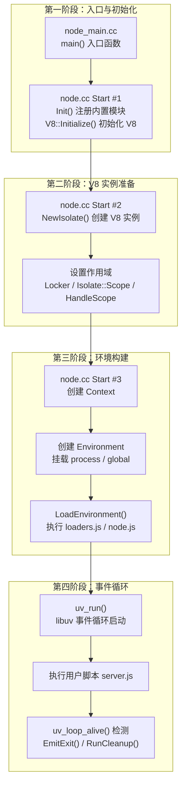

#### 第一阶段：入口函数 main

Node 的启动入口位于 `src/node_main.cc`：

```c++
// node_main.cc (简化)
int main(int argc, char* argv[]) {
  #ifdef _WIN32
    // Windows 平台特殊处理
    return node::Start(argc, argv);
  #else
    // Unix/macOS 平台
    return node::Start(argc, argv);
  #endif
}
```

`main` 函数接收命令行参数（如 `node server.js` 中的 `server.js`），然后调用 `node::Start`。

#### 第二阶段：三个 Start 函数的链式调用

`src/node.cc` 中定义了三个重载的 `Start` 函数，依次调用：

**Start #1**（约 3034 行）：初始化与 V8 启动

```c++
int Start(int argc, char** argv) {
  // 1. 注册内置模块、处理命令行参数
  Init(&args, &exec_args);

  // 2. 初始化 V8 引擎
  V8::Initialize();

  // 3. 调用第二个 Start，传入默认事件循环
  Start(uv_default_loop(), args, exec_args);
}
```

**Start #2**（约 2987 行）：创建 V8 实例

```c++
inline int Start(uv_loop_t* event_loop,
                 std::vector<std::string>& args,
                 std::vector<std::string>& exec_args) {
  // 1. 创建独立的 V8 引擎实例
  Isolate* isolate = NewIsolate(allocator.get());

  // 2. 配置 V8 实例作用域
  Locker locker(isolate);
  Isolate::Scope isolate_scope(isolate);
  HandleScope handle_scope(isolate);

  // 3. 调用第三个 Start
  Start(isolate, isolate_data.get(), args, exec_args);
}
```

**V8 核心概念**：

| 概念 | 说明 |
|------|------|
| **Isolate** | V8 引擎实例，代表一个独立的 JS 运行环境，拥有自己的堆内存、垃圾回收器 |
| **Context** | JS 执行上下文，包含全局对象（global）、内置对象、函数 |
| **HandleScope** | 句柄作用域，管理 V8 对象的生命周期，防止内存泄漏 |
| **Locker** | 多线程环境下锁定 Isolate，确保线程安全 |

**Start #3**（约 2891 行）：环境构建与模块加载

```c++
inline int Start(Isolate* isolate,
                 IsolateData* isolate_data,
                 std::vector<std::string>& args,
                 std::vector<std::string>& exec_args) {
  // 1. 创建 V8 Context
  Context::Scope context_scope(context);

  // 2. 创建 Node 运行环境
  Environment env(isolate_data, context, ...);
  env.Start(args, exec_args, v8_is_profiling);

  // 3. 加载模块和用户代码
  LoadEnvironment(&env);

  // 4. 启动 libuv 事件循环
  uv_run(env.event_loop(), UV_RUN_DEFAULT);

  // 5. 事件循环结束，清理退出
  EmitExit(&env);
  env.RunCleanup();
  RunAtExit(&env);
}
```

#### 第三阶段：LoadEnvironment 模块加载

`LoadEnvironment` 函数（约 2120 行）负责加载 Node 的启动引导模块：

```c++
void LoadEnvironment(Environment* env) {
  // 1. 获取 loaders.js 和 node.js 的源码
  Local<String> loaders_name = ...("internal/bootstrap/loaders.js");
  Local<Function> loaders_bootstrapper = ...(LoadersBootstrapperSource(env), loaders_name);

  Local<String> node_name = ...("internal/bootstrap/node.js");
  Local<Function> node_bootstrapper = ...(NodeBootstrapperSource(env), node_name);

  // 2. 将 global 挂载到 Context
  Local<Object> global = env->context()->Global();
  global->Set(env->isolate(), "global", global);

  // 3. 执行启动引导函数
  ExecuteBootstrapper(env, loaders_bootstrapper, ...);
  ExecuteBootstrapper(env, node_bootstrapper, ...);
}
```

`ExecuteBootstrapper` 通过 `bootstrapper->Call()` 执行 JS 函数：

```c++
static bool ExecuteBootstrapper(
    Environment* env,
    Local<Function> bootstrapper,
    int argc, Local<Value> argv[],
    Local<Value>* out) {
  return bootstrapper->Call(
      env->context(), Null(env->isolate()), argc, argv).ToLocal(out);
}
```

#### 启动引导模块的作用

| 模块 | 路径 | 职责 |
|------|------|------|
| `loaders.js` | `lib/internal/bootstrap/loaders.js` | 配置模块加载器，暴露 `process.binding` |
| `node.js` | `lib/internal/bootstrap/node.js` | 配置全局对象，初始化 `process`、`Buffer`、`console` 等 |

执行完这两个引导模块后，Node 的模块系统就绪，`require()` 可以正常工作。

### 启动流程总结

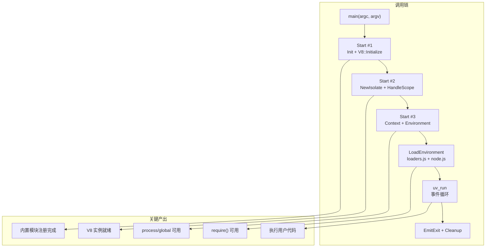

**启动流程要点**：

1. **入口**：`node_main.cc` 的 `main` 函数接收命令行参数
2. **初始化**：第一个 `Start` 注册内置模块、初始化 V8
3. **实例创建**：第二个 `Start` 创建 V8 Isolate 实例
4. **环境构建**：第三个 `Start` 创建 Context、Environment，挂载全局对象
5. **模块加载**：`LoadEnvironment` 执行引导模块，建立模块系统
6. **事件循环**：`uv_run` 启动 libuv，执行用户代码中的异步任务
7. **退出清理**：事件循环结束后，执行 exit 回调、清理资源

## 实战视角：Webpack 源码中的 Node 能力应用

通过分析 Webpack（v4.23.1）源码，可以直观地观察 Node 核心模块在大型工程中的实际应用。使用 `countapi` 工具统计 Webpack 源码中 Node API 的引用频次：

```bash
$ countapi ./
Node API Used Times
┌────────────────┬───────┐
│ module         │ count │
├────────────────┼───────┤
│ path           │ 134   │
│ fs             │ 121   │
│ util           │ 16    │
│ os             │ 8     │
│ vm             │ 8     │
│ child_process  │ 7     │
│ crypto         │ 5     │
│ assert         │ 5     │
│ events         │ 5     │
│ stream         │ 3     │
│ url            │ 2     │
│ zlib           │ 2     │
│ http           │ 2     │
│ https          │ 2     │
└────────────────┴───────┘
```

### 能力一：JavaScript 语言基础

Webpack 主仓库约 6 万行 JavaScript 代码，大规模使用了现代 JS 语法特性：

| 语法特性 | 应用场景 |
|---------|---------|
| `Promise` | 异步编译流程、插件钩子 |
| `Class` | Compiler、Compilation 等核心类 |
| 箭头函数 | 回调简化、上下文绑定 |
| `Set` / `Map` | 模块依赖去重、缓存管理 |
| `Symbol` | 私有属性、插件标识 |

### 能力二：CommonJS 模块系统

Webpack 源码包含 2000+ 个 JS 文件，通过 CommonJS 规范组织模块关系：

```javascript
// webpack/lib/webpack.js - 入口文件的模块依赖
const Compiler = require('./Compiler')
const MultiCompiler = require('./MultiCompiler')
const NodeEnvironmentPlugin = require('./node/NodeEnvironmentPlugin')
const WebpackOptionsApply = require('./WebpackOptionsApply')
const WebpackOptionsDefaulter = require('./WebpackOptionsDefaulter')
const validateSchema = require('./validateSchema')
const WebpackOptionsValidationError = require('./WebpackOptionsValidationError')
const webpackOptionsSchema = require('../schemas/WebpackOptions.json')
const RemovedPluginError = require('./RemovedPluginError')
```

### 能力三：NPM 生态与依赖管理

Webpack 依赖树深度嵌套，通过 `package.json` 声明依赖：

```json
"dependencies": {
  "@webassemblyjs/ast": "1.7.8",
  "@webassemblyjs/helper-module-context": "1.7.8",
  "acorn": "^5.6.2",
  "ajv": "^6.1.0",
  "chrome-trace-event": "^1.0.0",
  "memory-fs": "~0.4.1",
  "mkdirp": "~0.5.0",
  "neo-async": "^2.5.0",
  "uglifyjs-webpack-plugin": "^1.2.4",
  "watchpack": "^1.5.0",
  "webpack-sources": "^1.3.0"
}
```

### 能力四：工具集（path / util / url）

`path` 模块以 134 次调用位居榜首，处理路径拼接、目录提取等操作：

```javascript
// webpack/lib/Compiler.js
if (targetFile.match(/\/|\\/)) {
  const dir = path.dirname(targetFile)
}

// webpack/lib/ContextModuleFactory.js
const subResource = path.join(directory, segment)

// webpack/lib/ContextReplacementPlugin.js
result.resource = path.resolve(result.resource, newContentResource)
```

`util` 模块用于标记废弃 API：

```javascript
// webpack/lib/Chunk.js
Object.defineProperty(Chunk.prototype, "forEachModule", {
  configurable: false,
  value: util.deprecate(function() { /* ... */ }, 'deprecated')
})
```

### 能力五：文件操作能力（fs）

Webpack 的文件操作能力通过多层依赖最终追溯到 `fs` 模块：

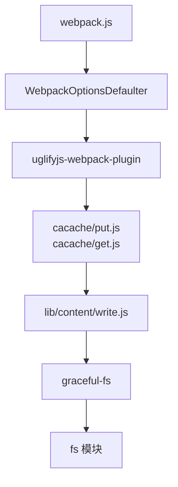

文件操作贯穿 Webpack 构建全流程：配置读取、编译产物写入、缓存读写、跨目录复制。

### 能力六：Buffer 与 Stream

Webpack 使用流式处理提升大文件操作效率：

```javascript
// copy-concurrently/copy.js - 文件拷贝的流式实现
fs.createReadStream(from)
  .once('error', onError)
  .pipe(writeStreamAtomic(to, writeOpts))
  .once('error', onError)
  .once('close', function () {
    if (errored) return
    if (opts.mode != null) {
      resolve(chmod(to, opts.mode))
    } else {
      resolve()
    }
  })
```

### 能力七：EventEmitter 事件机制

Node.js 的 Stream 继承自 EventEmitter，实现事件驱动的数据流：

```javascript
// node/lib/internal/streams/legacy.js
const EE = require('events')
const util = require('util')

function Stream () {
  EE.call(this)
}
util.inherits(Stream, EE)

Stream.prototype.pipe = function(dest, options) {
  source.on('data', ondata)
  source.on('end', onend)
  source.on('close', onclose)
  source.on('error', onerror)
  dest.on('drain', ondrain)
  dest.emit('pipe', source)
  return dest
}
```

所有继承 Stream 的模块都具备事件订阅/发布能力。

### 能力八：HTTP 处理能力

Webpack Dev Server 基于 Express，提供本地开发环境、静态资源代理、接口转发等能力。定制改造需理解 Node HTTP 模块。

### 能力九：Event Loop 任务调度

Webpack 构建流程中大量使用异步任务调度：

```javascript
// webpack/lib/Compilation.js
waitForBuildingFinished(module, callback) {
  let callbackList = this._buildingModules.get(module)
  if (callbackList) {
    callbackList.push(() => callback())
  } else {
    process.nextTick(callback)  // 使用 nextTick 调度任务
  }
}
```

Event Loop 执行顺序示例：

```javascript
const EventEmitter = require('events')
class EE extends EventEmitter {}
const yy = new EE()

yy.on('event', () => console.log('事件触发'))
setTimeout(() => console.log('0ms 定时器'), 0)
setTimeout(() => console.log('100ms 定时器'), 100)
setImmediate(() => console.log('immediate 回调'))
process.nextTick(() => console.log('nextTick 回调'))

Promise.resolve().then(() => {
  yy.emit('event')
  process.nextTick(() => console.log('Promise 内 nextTick'))
  console.log('Promise 第一次回调')
})
.then(() => console.log('Promise 第二次回调'))

// 输出顺序（Node 实测）：
// nextTick 回调
// 事件触发
// Promise 第一次回调
// Promise 第二次回调
// Promise 内 nextTick
// 0ms 定时器
// immediate 回调
// 100ms 定时器
```

### 能力十：Cluster 进程集群

Node.js 单线程事件驱动模型适合 I/O 密集场景，但无法充分利用多核 CPU。`cluster` 模块通过多进程扩展实现负载均衡，生产环境常配合 PM2 使用。

### 学习路径总结

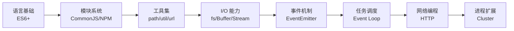

前端工程工具体系建立在 Node 生态之上，掌握这些核心能力是深入理解 Webpack、Babel、Vite 等工具的基础。
