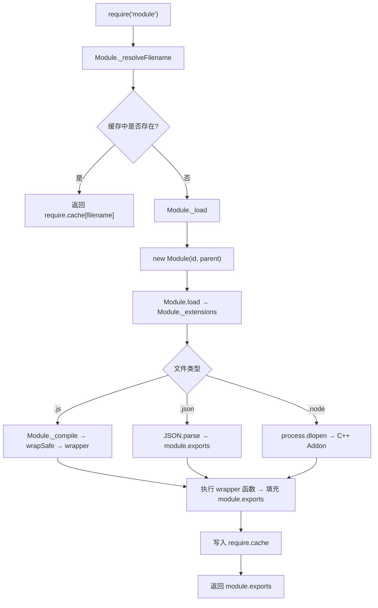
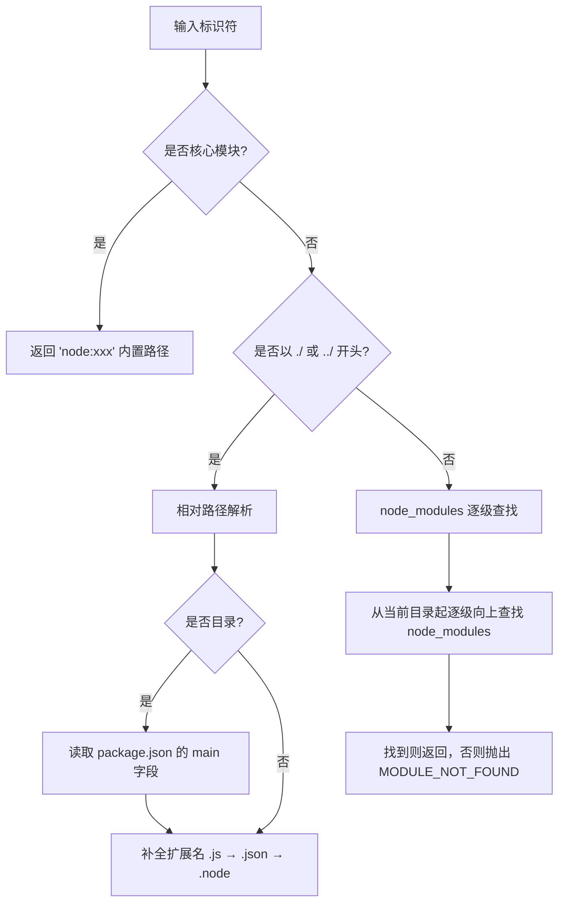
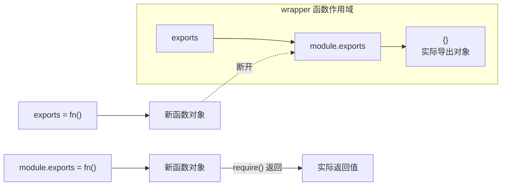
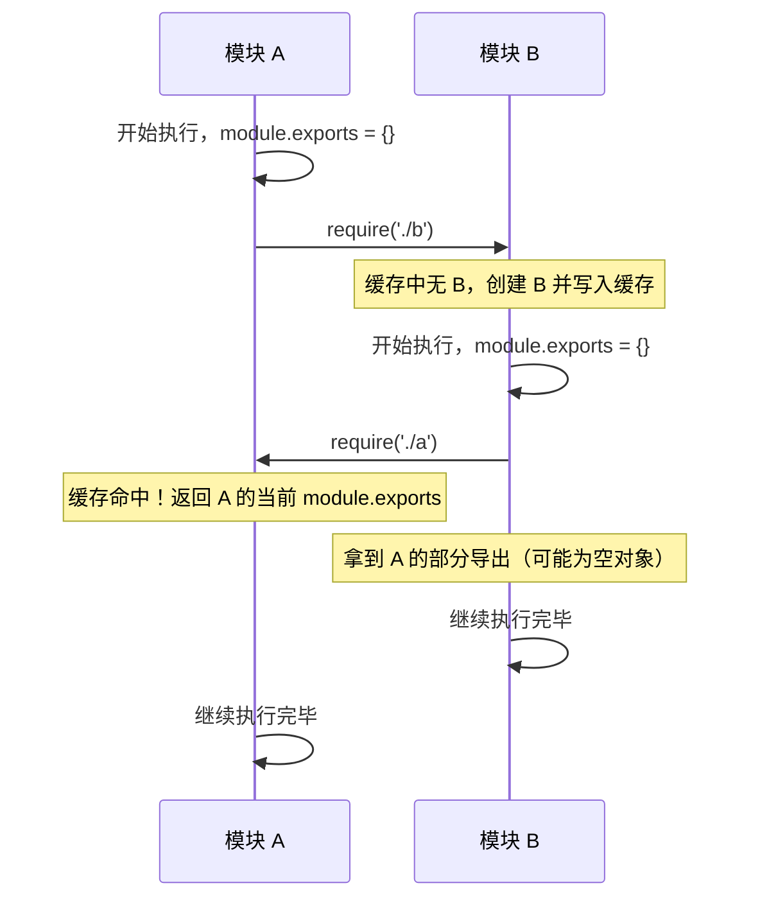
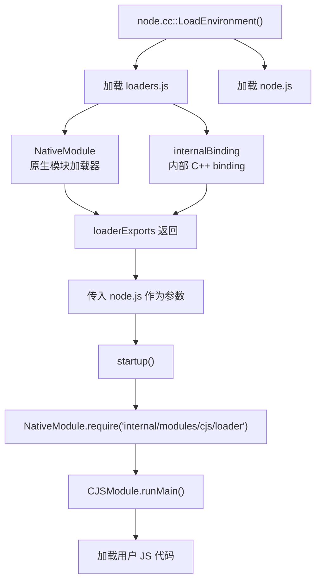

# CommonJS 模块系统

## 概述

CommonJS（简称 CJS）是 Node.js 最初采用的模块规范，由 Kevin Dangoor 于 2009 年提出，目标是让 JavaScript 具备服务端开发所需的模块化能力。Node.js 的 CJS 实现并非直接照搬规范，而是在其基础上做了大量工程化扩展——`require` 的解析算法、模块缓存策略、wrapper 函数机制等，都是 Node.js 运行时的核心基础设施。



## require 的完整加载链路

### 1. Module._resolveFilename — 模块解析

`require()` 的第一步并非加载文件，而是**解析出文件的绝对路径**。`Module._resolveFilename` 实现了 Node.js 的完整模块解析算法：



**核心解析优先级**：

1. **核心模块**（如 `fs`、`path`）— 直接返回内置模块，不走文件系统
2. **相对/绝对路径**（以 `./`、`../`、`/` 开头）— 基于调用文件所在目录解析
3. **第三方模块**（无路径前缀）— 沿 `node_modules` 链逐级向上查找
4. **全局目录** — `HOME/.node_modules`、`HOME/.node_libraries`、`NODE_PATH`

```javascript
// Module._resolveFilename 的简化逻辑
Module._resolveFilename = function (request, parent) {
  // 1. 核心模块优先
  if (NativeModule.canBeRequiredByUsers(request)) {
    return request;
  }

  // 2. 解析路径
  let paths;
  if (request.startsWith('./') || request.startsWith('../') || request.startsWith('/')) {
    paths = [path.dirname(parent.filename)];
  } else {
    paths = Module._nodeModulePaths(path.dirname(parent.filename));
  }

  // 3. 逐路径查找
  const filename = Module._findPath(request, paths);
  if (filename) return filename;

  throw new Error(`Cannot find module '${request}'`);
};
```

### 2. Module._load — 加载与缓存

解析出文件名后，`Module._load` 负责实际的加载逻辑，核心是**缓存优先**：

```javascript
Module._load = function (request, parent, isMain) {
  const filename = Module._resolveFilename(request, parent, isMain);

  // 缓存命中 — 直接返回
  const cachedModule = Module._cache[filename];
  if (cachedModule !== undefined) {
    updateChildren(cachedModule, parent);
    return cachedModule.exports;
  }

  // 内置模块 — 走 NativeModule
  const mod = NativeModule.map[filename];
  if (mod && mod.canBeRequiredByUsers) {
    return mod.exports;
  }

  // 创建新模块实例
  const module = new Module(filename, parent);

  // 写入缓存（在执行之前！这是防止循环引用的关键）
  Module._cache[filename] = module;

  // 尝试加载
  tryModuleLoad(module, filename);

  return module.exports;
};
```

> **缓存写入时机的精妙设计**：缓存是在模块**执行之前**写入的。这意味着如果模块 A require 模块 B，而模块 B 又 require 模块 A（循环引用），模块 B 拿到的将是模块 A 的**部分导出**——即此时 `module.exports` 上已经赋值的属性，而非最终完整导出。这是 Node.js 处理循环依赖的核心策略。

### 3. Module._compile — 编译与执行

对于 `.js` 文件，加载链路最终到达 `Module._compile`，它会将源码包装到一个**wrapper 函数**中执行：

```javascript
Module._compile = function (content, filename) {
  const wrapper = wrapSafe(filename, content, this);
  // wrapper = '(function (exports, require, module, __filename, __dirname) { ' +
  //            content +
  //            '\n});'
  const compiledWrapper = vm.runInThisContext(wrapper, {
    filename: filename,
    lineOffset: 0,
    displayErrors: true,
  });

  const dirname = path.dirname(filename);

  // 调用 wrapper，注入 require、module 等参数
  compiledWrapper.call(
    this.exports,       // this → module.exports
    this.exports,       // exports
    this.require,       // require（已绑定此模块的 paths）
    this,               // module
    filename,           // __filename
    dirname             // __dirname
  );
};
```

## Wrapper 函数机制

这是 CJS 最核心的设计——每个模块文件在执行前都会被包裹进一个函数：

```javascript
(function (exports, require, module, __filename, __dirname) {
  // 你的模块代码实际上在这里面运行
  const fs = require('fs');
  module.exports = { /* ... */ };
});
```

**这解释了为什么模块内可以"凭空"使用 `require`、`module`、`__filename` 等变量**——它们都是 wrapper 函数的参数。

### 五个参数的本质

| 参数 | 类型 | 说明 |
|------|------|------|
| `exports` | `Object` | `module.exports` 的引用别名，仅当未重新赋值 `module.exports` 时有效 |
| `require` | `Function` | 绑定了当前模块解析路径的 `Module._load` 封装 |
| `module` | `Module` | 当前模块实例，包含 `id`、`filename`、`paths`、`children`、`exports` 等 |
| `__filename` | `String` | 当前模块文件的绝对路径 |
| `__dirname` | `String` | 当前模块文件所在目录的绝对路径 |

### exports vs module.exports 的陷阱

```javascript
// ❌ 错误：给 exports 重新赋值不会影响 module.exports
exports = function () { /* ... */ };

// ✅ 正确：直接赋值 module.exports
module.exports = function () { /* ... */ };

// ✅ 正确：给 exports 的属性赋值（等效于 module.exports.xxx）
exports.foo = 'bar';
```

**原理**：wrapper 函数传入的是 `this.exports`（即 `module.exports` 的引用），`exports` 只是一个局部变量指向同一个对象。重新赋值 `exports` 只是改变了局部变量的指向，不会影响 `module.exports`。



## Module 对象

每个 CJS 模块都是 `Module` 类的实例，其核心属性：

```javascript
function Module(id, parent) {
  this.id = id;                    // 模块标识符（通常等于 filename）
  this.path = path.dirname(id);   // 模块所在目录
  this.exports = {};              // 模块导出对象
  this.filename = id;             // 模块文件绝对路径
  this.loaded = false;            // 是否加载完成
  this.children = [];             // 此模块 require 的子模块
  this.paths = [];                // 模块搜索路径（node_modules 链）
}

if (parent) {
  parent.children.push(this);     // 注册到父模块的 children 中
}
```

### require.cache

所有已加载的模块都缓存在 `require.cache` 中，键为模块的绝对路径：

```javascript
// 查看缓存
console.log(Object.keys(require.cache));

// 清除缓存（热更新原理）
delete require.cache[require.resolve('./my-module')];

// 重新加载
const freshModule = require('./my-module');
```

## require.resolve 的查找路径

`require.resolve` 与 `require` 使用相同的解析算法，但只返回路径而不加载模块。可以查看模块搜索路径链：

```javascript
// 查看当前模块的搜索路径
console.log(module.paths);
// [
//   '/Users/me/project/node_modules',
//   '/Users/me/node_modules',
//   '/Users/node_modules',
//   '/node_modules'
// ]
```

**`NODE_PATH` 环境变量**可以追加全局搜索路径，但不推荐在生产环境中使用——它破坏了模块解析的可预测性。

## 循环依赖

CJS 的循环依赖处理策略是**部分导出**——当检测到循环时，返回当前已执行部分导出的 `module.exports`：



```javascript
// a.js
console.log('a: starting');
exports.done = false;
const b = require('./b');
console.log('a: b.done =', b.done);  // true
exports.done = true;
console.log('a: done');

// b.js
console.log('b: starting');
exports.done = false;
const a = require('./a');
console.log('b: a.done =', a.done);  // false（拿到的是部分导出）
exports.done = true;
console.log('b: done');
```

**实践建议**：循环依赖通常意味着架构设计存在问题。如果无法避免，确保在 `require` 语句**之前**完成关键的 `exports` 赋值。

## 目录作为模块

当 `require` 一个目录时，Node.js 按以下顺序查找：

1. 目录下的 `package.json` 的 `main` 字段
2. 目录下的 `index.js`
3. 目录下的 `index.json`
4. 目录下的 `index.node`

```javascript
// 目录结构
// utils/
//   ├── package.json  → {"main": "lib/index.js"}
//   ├── lib/
//   │   └── index.js
//   └── index.js

require('./utils');  // 加载 utils/lib/index.js（main 字段优先）
```

## 与 ESM 的互操作

CJS 与 ESM 之间的互操作是 Node.js 生态过渡期的核心痛点：

| 方向 | 支持 | 说明 |
|------|------|------|
| ESM → CJS | ✅ 完整支持 | `import` 可以引入 CJS 模块的 `module.exports` |
| CJS → ESM | ⚠️ 受限 | Node 22.12+ 的 `require()` 可直接加载不含顶层 await 的 ESM 模块；含顶层 await 时或更早版本须用 `await import()` |

```javascript
// CJS 中加载 ESM 的变通方案（所有版本可用）
async function loadESM() {
  const { default: esmModule } = await import('./esm-module.mjs');
  return esmModule;
}
```

## CJS 的局限性

1. **同步加载**：`require` 是阻塞式的，不适合在性能敏感的加载链中使用
2. **无法 Tree-shake**：CJS 的动态特性（`require(variable)`）使静态分析无法确定模块依赖
3. **顶层 await 不支持**：CJS wrapper 是普通函数，不支持 `await`
4. **模块解析无法自定义**：不像 ESM 的 loader hook，CJS 的解析逻辑是固定的
5. **循环依赖处理粗糙**：部分导出策略容易导致运行时错误

## 源码视角：Node 模块加载机制源码分析

以上内容描述了 CJS 模块系统在用户层面的行为。要真正理解 `module` 和 `require` 的来源，需要深入 Node 源码，追踪从进程启动到模块加载的完整链路。（本节源码以 Node 10.x 为例，新版源码结构已有演进，但核心链路一致。）

### 启动流程中的模块加载准备

Node 的启动入口是 `node_main.cc` 的 `main` 函数，经过 V8 初始化后，最终调用 `node.cc` 中的 `LoadEnvironment` 函数。该函数是 Node 从 C++ 层面进入 JS 语言世界的关键节点，负责加载两个核心引导脚本：



`LoadEnvironment` 的核心流程（`src/node.cc`）：

```c++
void LoadEnvironment(Environment* env) {
  // 1. 将 loaders.js 和 node.js 的源码编译为可执行的 C++ Function
  Local<String> loaders_name = FIXED_STRING(env->isolate(), "internal/bootstrap/loaders.js");
  Local<Function> loaders_bootstrapper = GetBootstrapper(env, LoadersBootstrapperSource(env), loaders_name);
  Local<String> node_name = FIXED_STRING(env->isolate(), "internal/bootstrap/node.js");
  Local<Function> node_bootstrapper = GetBootstrapper(env, NodeBootstrapperSource(env), node_name);

  // 2. 为 loaders.js 拼装参数：process 对象 + binding 函数
  Local<Value> loaders_bootstrapper_args[] = {
      env->process_object(),
      get_binding_fn,
      get_linked_binding_fn,
      get_internal_binding_fn
  };

  // 3. 执行 loaders.js，获得 loaderExports
  ExecuteBootstrapper(env, loaders_bootstrapper.ToLocalChecked(),
                           arraysize(loaders_bootstrapper_args),
                           loaders_bootstrapper_args,
                           &bootstrapped_loaders)

  // 4. 为 node.js 拼装参数，其中第三个参数即为 loaders 的导出
  Local<Value> node_bootstrapper_args[] = {
    env->process_object(),
    bootstrapper,
    bootstrapped_loaders
  };

  // 5. 执行 node.js，启动 Node 运行时
  ExecuteBootstrapper(env, node_bootstrapper.ToLocalChecked(),
                           arraysize(node_bootstrapper_args),
                           node_bootstrapper_args,
                           &bootstrapped_node)
}
```

其中 `ExecuteBootstrapper` 的核心是调用 `bootstrapper->Call()`，在 V8 上下文中执行对应的 JS 函数表达式，同时传入 C++ 层构造的 `process` 对象和 `binding` 函数，使 JS 代码能够调用 C++ 底层能力。

### internal/bootstrap/loaders.js — 原生模块加载器

`loaders.js` 是 Node 启动的前置条件，它的职责是：

1. **将 C++ binding 能力挂载到 `process` 对象上**：
   - `process.binding()` — C++ binding loader，用户可直接访问
   - `process._linkedBinding()` — 供 C++ 扩展嵌入项目的 binding 接口
   - `internalBinding()` — 私有内部 C++ binding loader，用户无权访问，仅供 `NativeModule.require()` 使用

2. **提供原生模块的 loader 能力**（`NativeModule`）：
   - 加载 `lib/**/*.js` 和 `deps/**/*.js` 中的核心 JS 模块
   - 核心模块被 `node_javascript.cc` 编译进 Node 二进制文件，无 I/O 开销
   - 允许核心模块访问 `lib/internal/*` 和 `deps/internal/*` 中的内部模块

3. **返回 `loaderExports`**，将 `internalBinding` 和 `NativeModule` 以类似 CommonJS 的方式暴露出去

```javascript
(function bootstrapInternalLoaders(process,
  getBinding, getLinkedBinding, getInternalBinding) {
  function NativeModule(id) {}

  return loaderExports;
});
```

#### NativeModule 的实现

`NativeModule` 是一个迷你模块系统，专门用于加载 Node 的核心 JS 模块：

```javascript
function NativeModule(id) {
  this.filename = `${id}.js`;
  this.id = id;
  this.exports = {};
  this.script = null;
}

NativeModule.require = function (id) {
  const nativeModule = new NativeModule(id);
  nativeModule.compile();
  return nativeModule.exports;
};

NativeModule.prototype.compile = function () {
  // 获取模块源码并包裹为 CommonJS 格式
  let source = NativeModule.getSource(id);
  source = NativeModule.wrap(source);

  // 通过 ContextifyScript 编译并执行
  const { ContextifyScript } = process.binding('contextify');
  const script = new ContextifyScript(source, this.filename, 0, 0, cache, false, undefined);
  const fn = script.runInThisContext(-1, true, false);

  // 区分 internal 模块和普通核心模块的 require
  const requireFn = this.id.startsWith('internal/deps/')
    ? NativeModule.requireForDeps
    : NativeModule.require;

  fn(this.exports, requireFn, this, process);
};

// Wrapper 格式：注意与 CJS Loader 的 wrapper 不同
NativeModule.wrapper = ['(function (exports, require, module, process) {', '\n});'];
NativeModule.wrap = (script) => (NativeModule.wrapper[0] + script + NativeModule.wrapper[1]);
```

> **NativeModule wrapper 与 CJS Loader wrapper 的关键区别**：NativeModule 的 wrapper 只有 4 个参数 `(exports, require, module, process)`，而 CJS Loader 的 wrapper 有 5 个参数 `(exports, require, module, __filename, __dirname)`。这是因为核心模块编译在二进制文件中，不存在文件路径的概念。

#### NativeModule 加载示例

以加载 `internal/stream.js` 为例，源码为：

```javascript
const { Buffer } = require('buffer');
const Stream = module.exports = require('internal/streams/legacy');
Stream.Readable = require('_stream_readable');
Stream.Writable = require('_stream_writable');
Stream.Duplex = require('_stream_duplex');
Stream.Transform = require('_stream_transform');
Stream.PassThrough = require('_stream_passthrough');
```

经 NativeModule 编译后，实际在 V8 中运行的是：

```javascript
(function (exports, require, module, process) {
  const { Buffer } = require('buffer');
  const Stream = module.exports = require('internal/streams/legacy');
  Stream.Readable = require('_stream_readable');
  Stream.Writable = require('_stream_writable');
  Stream.Duplex = require('_stream_duplex');
  Stream.Transform = require('_stream_transform');
  Stream.PassThrough = require('_stream_passthrough');
})
```

### internal/bootstrap/node.js — 启动用户代码

`loaders.js` 执行完毕后，`loaderExports`（包含 `internalBinding` 和 `NativeModule`）作为参数传入 `node.js`：

```javascript
(function bootstrapNodeJSCore(process,
  { _setupProcessObject, _setupNextTick, _setupPromises, ... },
  { internalBinding, NativeModule }) {
  startup();
});
```

`startup()` 的核心操作是通过 `NativeModule` 获取 CJS Loader，然后调用其 `runMain` 方法加载用户代码：

```javascript
function startup() {
  // 获取 CJS Loader — 这是加载用户 JS 代码的入口
  const CJSModule = NativeModule.require('internal/modules/cjs/loader');
  preloadModules();
  // 执行用户入口文件
  CJSModule.runMain();
}
```

此后，用户代码的模块加载便由 `lib/internal/modules/cjs/loader.js` 全面接管。

### NativeModule 与 CJS Loader 的对比

| 维度 | NativeModule | CJS Loader |
|------|-------------|------------|
| 源码位置 | `lib/internal/bootstrap/loaders.js` | `lib/internal/modules/cjs/loader.js` |
| 加载目标 | Node 核心模块（`lib/**/*.js`、`deps/**/*.js`） | 用户 JS 代码及 `node_modules` 中的第三方模块 |
| 模块存储 | 编译进二进制文件，无文件 I/O | 从文件系统读取，有 I/O 开销 |
| Wrapper 参数 | `(exports, require, module, process)` | `(exports, require, module, __filename, __dirname)` |
| 依赖关系 | 独立运行，不依赖 CJS Loader | 依赖 NativeModule 加载自身 |
| 规范归属 | 非 CommonJS 规范 | CommonJS 规范的 Node 实现 |
| 缓存机制 | `NativeModule._cache` | `Module._cache`（即 `require.cache`） |
| require 函数 | `NativeModule.require` / `NativeModule.requireForDeps` | `Module.prototype.require` → `Module._load` |

核心结论：**Node 的模块系统由两层 Loader 构成**——NativeModule 负责加载内置核心模块，CJS Loader 负责加载用户代码。CJS Loader 本身也是通过 NativeModule 加载的，二者构成依赖链。

### CommonJS 规范与 Node Modules 的差异清单

Node 的模块体系虽基于 CommonJS 规范实现，但经过长期演化，已形成独立体系。以下是与 CommonJS 原始规范的主要差异：

| 维度 | CommonJS 规范 | Node Modules |
|------|-------------|-------------|
| `require` 静态属性 | 定义了 `main` 和 `paths` | 不支持 `require.paths`；新增 `cache` 属性和 `resolve()` 方法 |
| `module` 对象 | 仅含 `id` 和 `uri` | 新增 `children`、`exports`、`filename`、`loaded`、`parent` 属性及 `require()` 方法 |
| 模块 API 暴露 | 唯一方式是对 `exports` 对象增加属性或方法 | 支持 `module.exports` 整体替换导出对象 |
| 扩展名解析 | 未定义 | 优先级：`.js` > `.json` > `.node` |
| 目录模块入口 | 未定义 | `package.json` 的 `main` 字段 → `index.js` → `index.json` → `index.node` |
| 依赖管理 | 未定义 | 统一由 `node_modules` 目录管理，沿目录树逐级向上查找 |
| Wrapper 函数 | 未定义 | 自动包裹 `(function(exports, require, module, __filename, __dirname) { ... })` |
| 缓存机制 | 未定义 | `require.cache` 缓存已加载模块，缓存写入先于模块执行 |

正如 Node 社区所言："CommonJS is dead"——Node 的模块体系已不再是严格意义上的 CommonJS，只是沿用了这一叫法。其中的大量设计仍源于 CommonJS，但 Node Modules 的实际行为已远超规范范畴。

## 案例实战：视频时长统计工具

以下实现一个统计目录中所有 MP4 文件总时长与数量的工具，综合运用 CJS 模块系统（`fs`、`path`、`util`）及 `Promise` 并发控制。

**核心原理**：MP4 文件的 `moov` box 中包含 `mvhd`（Movie Header）原子，其结构中存储了 `timeScale`（时间尺度）和 `duration`（时长），二者相除即可得到视频秒数。

```javascript
const fs = require('fs')
const path = require('path')
const moment = require('moment')
const util = require('util')
const open = util.promisify(fs.open)
const read = util.promisify(fs.read)

// 从 MP4 文件的 Buffer 中解析 mvhd 原子，计算视频时长（秒）
// mvhd 布局：version+flags(4) + creation_time(4) + modification_time(4) + timeScale(4) + duration(4)
// 因此 timeScale 位于 'mvhd' 字符串偏移 +16，duration 位于 +20（version 0）
function getTime(buffer) {
  const start = buffer.indexOf(Buffer.from('mvhd')) + 16
  const timeScale = buffer.readUInt32BE(start)
  const duration = buffer.readUInt32BE(start + 4)
  const movieLength = Math.floor(duration / timeScale)
  return movieLength
}

// 将秒数格式化为本地化时间字符串
function getLocaleTime(seconds) {
  return moment
    .duration(seconds, 'seconds')
    .toJSON()
    .replace(/[PTHMS]/g, str => {
      switch (str) {
        case 'H': return '小时'
        case 'M': return '分钟'
        case 'S': return '秒'
        default: return ''
      }
    })
}

;(async function () {
  const dir = path.resolve(__dirname + '/video')
  const files = fs.readdirSync(dir).map(file => path.resolve(dir, file))

  // Promise.all 并发读取所有视频文件头部，解析时长
  const videos = await Promise.all(
    files.map(async file => {
      const fd = await open(file, 'r')
      const buff = Buffer.alloc(100)
      const { buffer } = await read(fd, buff, 0, 100, 0)
      const time = getTime(buffer)
      return { file, time }
    })
  )

  const res = {
    '视频总数': videos.length,
    '视频总时长': getLocaleTime(
      videos.reduce((prev, e) => prev + e.time, 0)
    )
  }

  console.log(res)
  return res
})()
```

**要点解析**：

- `util.promisify` 将 `fs.open` 和 `fs.read` 回调风格转为 Promise 风格，支持 `async/await`
- `Buffer.alloc(100)` 仅读取文件前 100 字节，避免将整个视频文件载入内存
- `buffer.indexOf(Buffer.from('mvhd'))` 定位 `mvhd` 原子的偏移位置
- `readUInt32BE` 以大端序读取 32 位无符号整数，解析 `timeScale` 和 `duration`
- `Promise.all` 并发处理所有视频文件，充分利用异步 I/O
