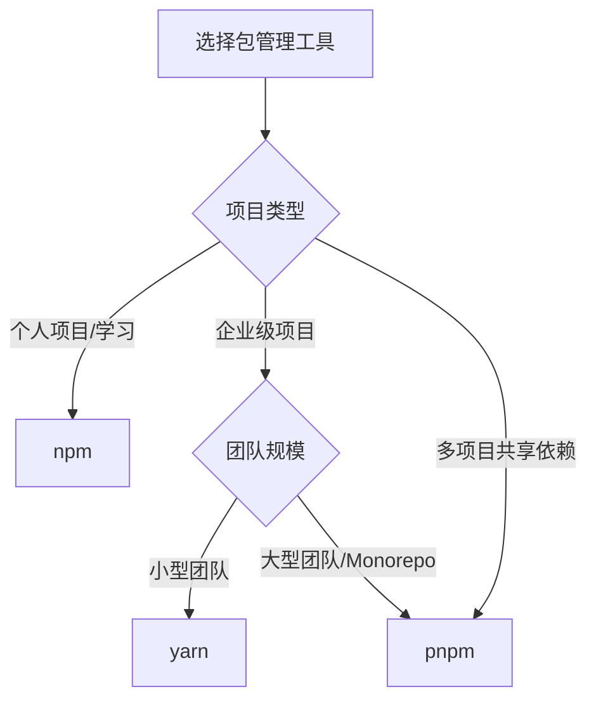

# 包管理工具

npm、yarn、pnpm 三大包管理工具各有侧重：npm 随 Node.js 内置、生态最通用；yarn 以稳定的工作区支持见长；pnpm 凭硬链接存储与严格依赖结构在磁盘占用与安装速度上领先。本文依次讲解三者的常用命令、npm 的安装原理与缓存机制、package.json/package-lock.json 核心配置、nvm/fnm 版本管理与 nrm 镜像源管理，并给出常见问题的排查思路。

## 包管理工具概述

### 主流包管理工具对比

| 特性 | npm | yarn | pnpm |
|------|-----|------|------|
| **安装速度** | 中等 | 快速 | 最快 |
| **磁盘空间** | 较高 | 较高 | 最低（硬链接） |
| **依赖管理** | 扁平化 | 扁平化 | 严格（非扁平化） |
| **幽灵依赖** | 存在 | 存在 | 不存在 |
| **Monorepo 支持** | ✓ | ✓ | ✓ |
| **离线缓存** | ✓ | ✓ | ✓ |
| **适用场景** | 通用项目 | 大型项目 | 多项目环境 |

### 选择建议



---

## npm - Node.js 官方包管理器

npm（Node Package Manager）是 Node.js 的官方包管理器，随 Node.js 一起安装。

### 安装验证

```bash
# 查看 npm 版本
npm --version
npm -v

# 查看 Node.js 版本
node --version
node -v

# 查看 npm 配置
npm config list
```

### 项目初始化

```bash
# 交互式创建 package.json
npm init

# 使用默认配置快速初始化
npm init -y

# 使用自定义配置初始化
npm init -y && npm pkg set name="my-project" version="1.0.0"
```

### 依赖管理

#### 安装依赖

```bash
# 安装所有依赖（根据 package.json）
npm install
npm i

# 安装生产依赖
npm install <package-name>
npm install <package-name> --save  # npm 5+ 可省略 --save
npm i express

# 安装开发依赖
npm install <package-name> --save-dev
npm install <package-name> -D
npm i -D nodemon eslint

# 安装可选依赖
npm install <package-name> --save-optional
npm i -O fsevents

# 全局安装
npm install <package-name> -g
npm install <package-name> --global
npm i -g pm2 nodemon

# 安装指定版本
npm install express@4.18.0      # 精确版本
npm install express@^4.18.0     # 兼容版本（推荐）
npm install express@~4.18.0     # 小版本更新
npm install express@latest      # 最新版本
npm install express@next        # 下一版本（测试版）

# 从不同源安装
npm install <package-name> --registry=https://registry.npmmirror.com

# 安装 GitHub 仓库
npm install user/repo
npm install user/repo#branch
npm install github:user/repo

# 安装本地包
npm install ../my-local-package
npm install file:./local-package

# 安装本地 tar 包
npm install /path/to/package-1.0.0.tar.gz

# 安装远程 tar 包
npm install https://github.com/user/repo/tarball/v1.0.0

# 安装版本范围
npm install lodash@">=2.0.0 <3.0.0"

# 安装 scope 包（用于管理私有模块）
npm install @myorg/my-package
npm install @myorg/my-package@1.0.0
```

#### npm install 支持的安装源完整列表

| 安装源 | 语法 | 示例 |
|--------|------|------|
| 包名 | `[<@scope>/]<name>` | `npm i lodash`、`npm i @babel/core` |
| 带 tag | `[<@scope>/]<name>@<tag>` | `npm i lodash@latest` |
| 精确版本 | `[<@scope>/]<name>@<version>` | `npm i lodash@4.17.11` |
| 版本范围 | `[<@scope>/]<name>@<version range>` | `npm i lodash@">=2.0.0 <3.0.0"` |
| Git 仓库 | `<git-host>:<git-user>/<repo-name>` | `npm i github:user/repo` |
| Git URL | `<git repo url>` | `npm i https://github.com/user/repo.git` |
| 本地 tar 包 | `<tarball file>` | `npm i ./package-1.0.0.tgz` |
| 远程 tar 包 | `<tarball url>` | `npm i https://example.com/pkg.tgz` |
| 本地目录 | `<folder>` | `npm i ../my-local-package` |

> 多样的安装源赋予了灵活的部署能力。例如在强运维保障下，可将所有模块以 tarball 形式从本地上传到服务器，保证模块代码的绝对一致性，即使 npm registry 不稳定也不受影响。

#### 卸载依赖

```bash
# 卸载生产依赖
npm uninstall <package-name>
npm un <package-name>

# 卸载开发依赖
npm uninstall <package-name> -D

# 卸载全局包
npm uninstall <package-name> -g

# 示例
npm uninstall lodash
npm un -D eslint
npm un -g nodemon
```

#### 更新依赖

```bash
# 更新指定包
npm update <package-name>
npm up <package-name>

# 更新所有包
npm update

# 更新到最新主版本
npm install <package-name>@latest

# 检查过时的包
npm outdated

# 交互式更新工具
npx npm-check-updates -u  # 检查并更新 package.json
npm install               # 安装更新后的依赖
```

#### 查看依赖信息

```bash
# 查看已安装的包
npm list
npm ls
npm list --depth=0         # 只显示顶层依赖
npm list --depth=1         # 显示一层依赖

# 查看全局包
npm list -g --depth=0

# 查看包详细信息
npm view <package-name>
npm info <package-name>
npm view express

# 查看包的特定信息
npm view express version        # 当前最新版本
npm view express versions       # 所有历史版本
npm view express dependencies   # 查看依赖
npm view express repository     # 查看仓库地址

# 查看包文档
npm docs <package-name>
npm docs express

# 查看包仓库
npm repo <package-name>

# 查看包主页
npm home <package-name>

# 查看包安装路径
npm root      # 本地 node_modules 路径
npm root -g   # 全局 node_modules 路径
```

### 脚本管理

npm scripts 是自动化任务的核心功能。

#### 基本用法

```json
{
  "scripts": {
    "start": "node index.js",
    "dev": "nodemon index.js",
    "test": "jest",
    "build": "webpack --mode production",
    "lint": "eslint src/",
    "format": "prettier --write \"src/**/*.js\""
  }
}
```

```bash
# 执行脚本
npm start        # 等同于 npm run start
npm test         # 等同于 npm run test
npm run dev      # 必须使用 run
npm run build
npm run lint

# 查看所有可用脚本
npm run
```

#### 生命周期钩子

```json
{
  "scripts": {
    "prestart": "echo '🚀 准备启动...'",
    "start": "node index.js",
    "poststart": "echo '✅ 启动完成'",
    
    "prebuild": "rimraf dist",
    "build": "webpack",
    "postbuild": "echo '构建完成'",
    
    "pretest": "echo '开始测试'",
    "test": "jest",
    "posttest": "echo '测试完成'"
  }
}
```

执行 `npm start` 的流程：
```
1. 执行 prestart
2. 执行 start  
3. 执行 poststart
```

#### 脚本变量

```json
{
  "name": "my-project",
  "version": "1.0.0",
  "config": {
    "port": "3000"
  },
  "scripts": {
    "info": "echo $npm_package_name@$npm_package_version",
    "start": "node server.js --port=$npm_package_config_port",
    "custom": "echo $npm_config_my_var"
  }
}
```

```bash
npm run info
# 输出：my-project@1.0.0

npm run custom --my_var=hello
# 输出：hello

npm start
# 使用 port: 3000

npm start --port=8080
# 覆盖端口为 8080
```

#### 跨平台脚本

Windows 和 Unix 系统命令不同，使用跨平台工具：

```json
{
  "scripts": {
    "build": "cross-env NODE_ENV=production webpack",
    "clean": "rimraf dist",
    "copy": "copyfiles -f src/*.html dist",
    "mkdir": "mkdirp dist/templates"
  },
  "devDependencies": {
    "cross-env": "^7.0.0",
    "rimraf": "^5.0.0",
    "copyfiles": "^2.4.0",
    "mkdirp": "^3.0.0"
  }
}
```

### 配置管理

#### 配置级别（优先级从高到低）

1. **命令行配置**：`npm install --registry=xxx`
2. **项目配置**：`项目根目录/.npmrc`
3. **用户配置**：`~/.npmrc`
4. **全局配置**：`$PREFIX/etc/npmrc`
5. **内置配置**：npm 内置默认值

#### 常用配置命令

```bash
# 查看配置
npm config list              # 查看当前配置
npm config list -l           # 查看所有配置（含默认值）
npm config get <key>         # 获取特定配置
npm config get registry      # 查看当前镜像源

# 设置配置
npm config set <key> <value>
npm config set registry https://registry.npmmirror.com
npm config set init-version 1.0.0
npm config set save-exact true

# 删除配置
npm config delete <key>
npm config delete registry

# 编辑配置文件
npm config edit              # 编辑用户级 .npmrc
```

#### .npmrc 文件详解

```ini
# 项目级 .npmrc（放在项目根目录）

# 镜像源配置
registry=https://registry.npmmirror.com

# 精确版本安装
save-exact=true

# 作用域包配置
@mycompany:registry=https://npm.mycompany.com
@babel:registry=https://registry.npmmirror.com

# 认证信息（不要提交到版本控制）
//registry.npmjs.org/:_authToken=${NPM_TOKEN}
//npm.mycompany.com/:_authToken=xxxx-xxxx-xxxx

# 代理配置
proxy=http://proxy.company.com:8080
https-proxy=http://proxy.company.com:8080

# 缓存配置
cache=~/.npm-cache

# 忽略 SSL 证书（不推荐生产使用）
strict-ssl=false
```

### 镜像源配置

```bash
# 手动设置镜像源
npm config set registry https://registry.npmmirror.com

# 常用镜像源
npm config set registry https://registry.npmjs.org/           # 官方源
npm config set registry https://registry.npmmirror.com/       # 淘宝源
npm config set registry https://r.cnpmjs.org/                 # cnpm 源

# 查看当前镜像源
npm config get registry

# 临时使用镜像源
npm install --registry=https://registry.npmmirror.com
```

### Workspaces（Monorepo 支持）

npm 7+ 支持原生 workspaces，适合管理多包项目。

#### 项目结构

```
my-monorepo/
├── package.json
├── package-lock.json
├── packages/
│   ├── core/
│   │   ├── package.json
│   │   └── index.js
│   ├── utils/
│   │   ├── package.json
│   │   └── index.js
│   └── cli/
│       ├── package.json
│       └── index.js
└── node_modules/
```

#### 根 package.json

```json
{
  "name": "my-monorepo",
  "version": "1.0.0",
  "private": true,
  "workspaces": [
    "packages/*"
  ],
  "scripts": {
    "build": "npm run build --workspaces",
    "test": "npm run test --workspaces",
    "lint": "eslint packages/*/src"
  },
  "devDependencies": {
    "eslint": "^8.0.0",
    "jest": "^29.0.0"
  }
}
```

#### 子包 package.json

```json
// packages/core/package.json
{
  "name": "@my-monorepo/core",
  "version": "1.0.0",
  "main": "index.js",
  "dependencies": {
    "@my-monorepo/utils": "^1.0.0"  // 引用其他子包
  }
}
```

#### Workspaces 常用命令

```bash
# 安装所有 workspaces 依赖
npm install

# 在特定 workspace 执行命令
npm run build --workspace=@my-monorepo/core
npm run build -w @my-monorepo/core

# 在所有 workspaces 执行命令
npm run build --workspaces
npm run test --workspaces

# 给特定 workspace 安装依赖
npm install lodash --workspace=@my-monorepo/core
npm i lodash -w @my-monorepo/core

# 查看工作空间信息
npm ls --all
```

### node_modules 目录结构演变

npm 在版本演进中对 `node_modules` 的安装策略进行了重大调整，从嵌套结构改为扁平化结构。

#### npm2 时代：嵌套安装

npm2 按照依赖关系进行文件夹的递归嵌套安装：

```bash
# npm2 的嵌套结构
.
├── connect-mongo
│   ├── node_modules
│   │   └── mongodb
│   │       ├── node_modules
├── mongoose
│   ├── node_modules
│   │   ├── mongodb
│   │   │   └── node_modules
│   │   └── sliced
├── async
├── grunt
│   ├── node_modules
│   │   ├── async
│   │   └── which
└── underscore
```

更深层嵌套示例（lodash + request）：

```bash
.
├── bluebird
└── request
    ├── node_modules
    │   ├── har-validator
    │   │   ├── node_modules
    │   │   │   ├── ajv
    │   │   │   │   ├── node_modules
    │   │   │   │   │   ├── co
    │   │   │   │   │   └── json-schema-traverse
    │   ├── http-signature
    │   │   ├── node_modules
    │   │   │   └── sshpk
    │   │   │       ├── node_modules
    │   │   │       │   └── tweetnacl
    │   └── uuid
    └── request.js
```

**嵌套结构的问题**：

| 问题 | 说明 |
|------|------|
| 目录层级过深 | 可能触发 Windows 文件路径长度限制（260 字符） |
| 代码冗余 | 同一包的不同版本被重复安装（如 `connect-mongo` 和 `mongoose` 都依赖 `mongodb`） |
| 项目体积臃肿 | 冗余依赖导致 `node_modules` 体积显著增大 |

#### npm3+ 时代：扁平化安装

npm3 将所有依赖尽可能扁平化安装到 `node_modules` 根目录：

```bash
# npm3 的扁平结构
node_modules/
├── ajv
├── asn1
├── assert-plus
├── asynckit
├── aws-sign2
├── aws4
├── bcrypt-pbkdf
├── bluebird
├── caseless
├── co
├── combined-stream
├── delayed-stream
├── fast-deep-equal
├── fast-json-stable-equal
├── forever-agent
├── form-data
├── uuid
└── ...其余依赖
```

**扁平化算法规则**：

1. 同名且同版本的包进行去重，提升到顶层
2. 同名但版本不同的包，第一个安装的版本提升到顶层，其余版本嵌套到依赖它的包内部
3. 尽可能将可复用的模块往高层级安装，最大化模块重用

**体积对比**：

| 安装方式 | node_modules 体积 | 降幅 |
|---------|-------------------|------|
| npm2（嵌套） | 80MB | - |
| npm3（扁平） | 68MB | 约 15% |

> 项目依赖越复杂，扁平化策略带来的体积节省越显著。（表中体积为示意量级，具体数值取决于项目依赖规模。）

#### 嵌套 vs 扁平化对比

| 维度 | 嵌套结构（npm2） | 扁平结构（npm3+） |
|------|-----------------|------------------|
| 目录层级 | 深，按依赖关系递归 | 浅，尽可能平铺 |
| 代码冗余 | 严重（同包多版本重复） | 较少（去重提升） |
| 源码查找 | 直观，按依赖链查找 | 需理解提升规则 |
| 路径限制 | 可能触发 Windows 限制 | 无此问题 |
| 幽灵依赖 | 不存在 | 存在（提升导致可访问未声明依赖） |

### npm install 原理

npm 从版本 5 开始引入缓存机制，安装流程如下：

#### 安装流程图

```
┌─────────────────────────────────────────────────────────┐
│                   npm install 执行                       │
└────────────────────┬────────────────────────────────────┘
                     │
                     ▼
        ┌────────────────────────┐
        │ 检查 package-lock.json │
        └────────────┬───────────┘
                     │
         ┌───────────┴───────────┐
         │                       │
    存在 lock               不存在 lock
         │                       │
         ▼                       ▼
┌─────────────────┐    ┌──────────────────┐
│检查版本一致性    │    │ 分析依赖关系图    │
│(package.json)   │    └────────┬─────────┘
└────────┬────────┘             │
         │                      ▼
    ┌────┴────┐        ┌──────────────────┐
 一致│     不一致│      │ 从 registry 下载 │
    │          │       │ 压缩包           │
    ▼          ▼       └────────┬─────────┘
┌────────┐ ┌────────┐           │
│查找缓存│ │重新构建│           ▼
└───┬────┘ │依赖关系│   ┌──────────────────┐
    │      └────────┘   │ 缓存到本地       │
    │                   └────────┬─────────┘
    ▼                            │
┌────────────┐                   ▼
│ 解压到      │          ┌──────────────────┐
│node_modules│          │ 解压到           │
└────────────┘          │ node_modules     │
                        └──────────────────┘
```

#### 缓存机制

```bash
# 查看缓存路径
npm config get cache

# 清理缓存
npm cache clean --force

# 验证缓存完整性
npm cache verify
```

### 发布 npm 包

#### 准备工作

```bash
# 1. 注册 npm 账号
npm adduser
# 或登录已有账号
npm login

# 2. 验证登录状态
npm whoami

# 3. 确保使用官方源
npm config set registry https://registry.npmjs.org/

# 4. 检查包名是否可用
npm search <package-name>
npm info <package-name>  # 如果存在会显示信息
```

#### 包结构

```
my-npm-package/
├── package.json
├── README.md
├── LICENSE
├── .npmignore        # 发布时忽略的文件
├── src/
│   └── index.js
├── dist/             # 构建产物
└── test/
```

#### .npmignore 配置

```
# 发布时忽略的文件
src/
test/
*.test.js
*.spec.js
.travis.yml
.editorconfig
.gitignore
.DS_Store
node_modules/
```

#### 发布流程

```bash
# 1. 测试包（可选，本地测试）
npm link              # 创建全局链接
# 在其他项目中
npm link my-package   # 使用本地包

# 2. 更新版本号
npm version patch     # 1.0.0 -> 1.0.1 (修复 bug)
npm version minor     # 1.0.0 -> 1.1.0 (新功能)
npm version major     # 1.0.0 -> 2.0.0 (破坏性变更)

# 3. 发布
npm publish

# 发布 beta 版本
npm publish --tag beta

# 发布私有包（需要付费账号）
npm publish --access restricted

# 发布到指定 registry
npm publish --registry https://npm.mycompany.com
```

#### 版本管理

```bash
# 查看当前版本
npm version

# 更新版本（会自动创建 git tag）
npm version patch -m "升级到 %s 版本"

# 发布后推送 tag
git push --tags
```

#### 撤销发布

```bash
# 撤销指定版本（24小时内可撤销）
npm unpublish <package-name>@1.0.0

# 撤销整个包（谨慎使用）
npm unpublish <package-name> --force

# 弃用版本（不删除，但标记为弃用）
npm deprecate <package-name>@1.0.0 "此版本存在严重 bug，请升级到 1.0.1"
```

### 安全审计

```bash
# 审计依赖安全漏洞
npm audit

# 自动修复安全问题
npm audit fix

# 强制修复（可能有破坏性变更）
npm audit fix --force

# 查看详细报告
npm audit --json

# 只审计生产依赖
npm audit --production
```

### 清理和维护

```bash
# 清理缓存
npm cache clean --force

# 验证缓存
npm cache verify

# 清理未使用的包
npm prune

# 清理过时的包
npm prune --production

# 检查重复依赖
npm dedupe
npm ddp
```

### 卸载 Node.js 和 npm

#### 卸载 npm

```bash
# 方法 1：使用 npm 命令
sudo npm uninstall npm -g

# 方法 2：手动删除（如果方法 1 失败）
cd /usr/local/lib/node_modules/npm
sudo make uninstall

# 验证
npm -v  # 应该提示 command not found
```

#### 卸载 Node.js（macOS/Linux）

```bash
# 完全卸载
sudo rm -rf /usr/local/lib/node
sudo rm -rf /usr/local/lib/node_modules
sudo rm -rf /var/db/receipts/org.nodejs.*
sudo rm -rf /usr/local/include/node
sudo rm -rf ~/.npm
sudo rm /usr/local/bin/node
sudo rm /usr/local/share/man/man1/node.1
sudo rm /usr/local/lib/dtrace/node.d

# 验证
node -v  # 应该提示 command not found
```

## pnpm - 高效的包管理器

pnpm（performant npm）使用硬链接和符号链接，节省磁盘空间并保证严格的依赖管理。

### 核心优势

1. **节省磁盘空间**：所有项目共享同一份依赖（硬链接）
2. **更快的安装速度**：并行下载和安装
3. **严格的依赖管理**：避免幽灵依赖
4. **确定性依赖树**：保证依赖结构一致

### 安装

```bash
# 通过 npm 安装
npm install -g pnpm

# macOS 通过 Homebrew 安装
brew install pnpm

# 使用官方安装脚本
# macOS/Linux
curl -fsSL https://get.pnpm.io/install.sh | sh -

# Windows (PowerShell)
iwr https://get.pnpm.io/install.ps1 -useb | iex

# 验证安装
pnpm --version
pnpm -v
```

### 常用命令

```bash
# 初始化项目
pnpm init

# 安装依赖
pnpm install
pnpm i

# 添加依赖
pnpm add <package-name>
pnpm add <package-name> -D        # 开发依赖
pnpm add <package-name> -O        # 可选依赖
pnpm add <package-name> --global  # 全局安装

# 安装指定版本
pnpm add <package-name>@1.2.3
pnpm add <package-name>@next

# 移除依赖
pnpm remove <package-name>
pnpm rm <package-name>

# 更新依赖
pnpm update
pnpm up
pnpm up <package-name>
pnpm up --latest  # 更新到最新版本

# 查看依赖
pnpm list
pnpm ls
pnpm ls --depth=0

# 运行脚本
pnpm <script-name>
pnpm start
pnpm dev
pnpm build
pnpm test
pnpm run <script-name>

# 清理
pnpm store prune  # 清理未使用的缓存
```

### pnpm 存储机制

pnpm 将所有包存储在全局存储区（store），项目中的 node_modules 通过硬链接引用。

```
~/.pnpm-store/
├── v3/
│   └── files/
│       ├── 00/
│       │   └── abc123...  # 实际的包文件
│       └── ...

项目 A/node_modules/
├── express -> 硬链接到 ~/.pnpm-store
└── lodash -> 硬链接到 ~/.pnpm-store

项目 B/node_modules/
├── express -> 硬链接到 ~/.pnpm-store (同一个文件)
└── axios -> 硬链接到 ~/.pnpm-store
```

### 配置文件

创建 `.npmrc` 配置 pnpm：

```ini
# 镜像源
registry=https://registry.npmmirror.com

# 存储路径
store-dir=~/.pnpm-store

# 自动安装对等依赖
auto-install-peers=true

# 严格的对等依赖
strict-peer-dependencies=false

# shamefully-hoist（模仿 npm 的扁平化结构）
shamefully-hoist=true

# node-linker（使用不同模式）
# pnp: 使用 PnP 模式
# hoisted: 使用扁平化模式
node-linker=hoisted
```

### Workspace 配置

```yaml
# pnpm-workspace.yaml
packages:
  - 'packages/*'
  - 'apps/*'
  - '!**/test/**'
```

```json
// package.json
{
  "name": "my-monorepo",
  "private": true,
  "scripts": {
    "build": "pnpm -r build",
    "test": "pnpm -r test"
  }
}
```

```bash
# workspace 命令
pnpm --filter <package-name> <command>
pnpm -F <package-name> <command>

# 示例
pnpm --filter @my-monorepo/core build
pnpm -F core add lodash

# 在所有包中运行
pnpm -r build
```

---

## 核心配置文件

### package.json 详解

`package.json` 是项目的核心配置文件，定义了项目的元数据、依赖和脚本。

#### 基本字段

```json
{
  "name": "my-project",                          // 项目名称（必填）
  "version": "1.0.0",                            // 版本号（必填）
  "description": "项目描述",                      // 项目描述
  "main": "index.js",                            // 主入口文件
  "module": "index.esm.js",                      // ES Module 入口
  "browser": "index.umd.js",                     // 浏览器入口
  "types": "index.d.ts",                         // TypeScript 类型定义
  "bin": {
    "my-cli": "./bin/cli.js"                     // CLI 命令
  },
  "scripts": {                                   // 脚本命令
    "start": "node index.js",
    "dev": "nodemon index.js",
    "test": "jest",
    "build": "webpack --mode production"
  },
  "keywords": ["node", "express", "api"],        // 关键词
  "author": "Your Name <email@example.com>",     // 作者
  "license": "MIT",                              // 许可证
  "repository": {                                // 仓库信息
    "type": "git",
    "url": "https://github.com/user/repo.git"
  },
  "bugs": {                                      // Bug 反馈地址
    "url": "https://github.com/user/repo/issues"
  },
  "homepage": "https://github.com/user/repo",    // 项目主页
  "engines": {                                   // 运行环境要求
    "node": ">=18.0.0",
    "npm": ">=9.0.0"
  },
  "os": ["darwin", "linux"],                     // 支持的操作系统
  "cpu": ["x64", "arm64"]                        // 支持的 CPU 架构
}
```

#### 依赖字段

```json
{
  "dependencies": {                              // 生产环境依赖
    "express": "^4.18.0",
    "lodash": "~4.17.21"
  },
  "devDependencies": {                           // 开发环境依赖
    "nodemon": "^2.0.0",
    "eslint": "^8.0.0",
    "jest": "^29.0.0"
  },
  "peerDependencies": {                          // 对等依赖
    "react": ">=16.8.0",
    "react-dom": ">=16.8.0"
  },
  "peerDependenciesMeta": {                      // 对等依赖元数据
    "react": {
      "optional": true
    }
  },
  "optionalDependencies": {                      // 可选依赖
    "fsevents": "^2.3.0"
  },
  "bundledDependencies": [                       // 打包依赖
    "my-package"
  ]
}
```

#### 依赖类型说明

| 依赖类型 | 用途 | 安装命令 | 示例场景 |
|---------|------|---------|---------|
| `dependencies` | 生产环境必需 | `npm i <pkg>` | express、axios |
| `devDependencies` | 仅开发环境需要 | `npm i <pkg> -D` | eslint、jest |
| `peerDependencies` | 插件需要宿主提供 | 手动声明 | react 插件 |
| `optionalDependencies` | 安装失败不影响 | 手动声明 | fsevents |
| `bundledDependencies` | 发布时一起打包 | 手动声明 | 私有包 |

#### 其他重要字段

```json
{
  "type": "module",                              // 指定模块类型
  "exports": {                                   // 导出配置
    ".": {
      "import": "./index.esm.js",
      "require": "./index.cjs.js",
      "types": "./index.d.ts"
    },
    "./utils": "./lib/utils.js"
  },
  "files": [                                     // 发布时包含的文件
    "dist",
    "lib",
    "index.js"
  ],
  "sideEffects": false,                          // 标记无副作用（用于 tree-shaking）
  "browserslist": [                              // 浏览器兼容性
    "> 1%",
    "last 2 versions",
    "not dead"
  ],
  "private": true,                               // 防止意外发布
  "workspaces": [                                // Monorepo 工作空间
    "packages/*"
  ],
  "publishConfig": {                             // 发布配置
    "registry": "https://npm.mycompany.com",
    "access": "public"
  }
}
```

### 版本号规范（SemVer）

npm 使用语义化版本（Semantic Versioning）：`MAJOR.MINOR.PATCH`

#### 版本含义

```
MAJOR.MINOR.PATCH
  │     │     │
  │     │     └── 向下兼容的 bug 修复
  │     └──────── 向下兼容的功能新增
  └────────────── 破坏性 API 变更
```

#### 版本范围符号

| 符号 | 含义 | 示例 | 匹配版本 |
|------|------|------|----------|
| 无符号 | 精确匹配 | `1.2.3` | 1.2.3 |
| `^` | 兼容版本 | `^1.2.3` | ≥1.2.3 <2.0.0 |
| `~` | 近似版本 | `~1.2.3` | ≥1.2.3 <1.3.0 |
| `>` | 大于 | `>1.2.3` | >1.2.3 |
| `>=` | 大于等于 | `>=1.2.3` | ≥1.2.3 |
| `<` | 小于 | `<1.2.3` | <1.2.3 |
| `<=` | 小于等于 | `<=1.2.3` | ≤1.2.3 |
| `\|\|` | 或 | `1.2.3 \|\| 2.0.0` | 1.2.3 或 2.0.0 |
| `-` | 范围 | `1.2.3 - 2.3.4` | ≥1.2.3 ≤2.3.4 |
| `x` | 通配符 | `1.2.x` | 1.2.0, 1.2.1, ... |
| `*` | 任意版本 | `*` | 所有版本 |
| `latest` | 最新版本 | `latest` | 最新版本 |

#### 实际示例

```json
{
  "dependencies": {
    "exact-version": "1.2.3",           // 只安装 1.2.3
    "patch-updates": "~1.2.3",          // 1.2.3 ≤ version < 1.3.0
    "minor-updates": "^1.2.3",          // 1.2.3 ≤ version < 2.0.0
    "any-version": "*",                 // 任意版本
    "range-version": ">=1.0.0 <2.0.0",  // 范围
    "or-version": "1.x || 2.x",         // 1.x 或 2.x
    "git-repo": "github:user/repo",     // GitHub 仓库
    "local-path": "file:../local-pkg"   // 本地路径
  }
}
```

#### 版本更新策略

```bash
# 更新 PATCH 版本（修复 bug）
npm version patch  # 1.0.0 -> 1.0.1

# 更新 MINOR 版本（新功能）
npm version minor  # 1.0.0 -> 1.1.0

# 更新 MAJOR 版本（破坏性变更）
npm version major  # 1.0.0 -> 2.0.0

# 预发布版本
npm version prerelease  # 1.0.0 -> 1.0.1-0
npm version prerelease --preid=beta  # 1.0.0 -> 1.0.1-beta.0
```

### package-lock.json

`package-lock.json` 用于锁定依赖版本，保证团队依赖一致。

#### 作用

1. **版本锁定**：记录精确的版本号和下载地址
2. **依赖树记录**：完整记录所有依赖关系
3. **加速安装**：npm 可直接使用 lock 文件快速安装
4. **团队协作**：保证不同环境依赖一致

#### 结构示例

```json
{
  "name": "my-project",
  "version": "1.0.0",
  "lockfileVersion": 3,
  "requires": true,
  "packages": {
    "": {
      "name": "my-project",
      "version": "1.0.0",
      "dependencies": {
        "express": "^4.18.0"
      }
    },
    "node_modules/express": {
      "version": "4.18.2",
      "resolved": "https://registry.npmjs.org/express/-/express-4.18.2.tgz",
      "integrity": "sha512-...",
      "dependencies": {
        "accepts": "~1.3.8",
        "body-parser": "1.20.1"
      }
    },
    "node_modules/accepts": {
      "version": "1.3.8",
      "resolved": "https://registry.npmjs.org/accepts/-/accepts-1.3.8.tgz",
      "integrity": "sha512-..."
    }
  }
}
```

#### 最佳实践

```bash
# ✅ 推荐：提交 package-lock.json 到版本控制
git add package-lock.json
git commit -m "chore: lock dependencies"

# CI 环境使用 npm ci 而不是 npm install
npm ci  # 更快、更严格、删除 node_modules 后重新安装

# ❌ 避免：手动编辑 package-lock.json
```

### .npmignore

`.npmignore` 指定发布时忽略的文件，语法类似 `.gitignore`。

```
# 发布时忽略的文件

# 测试文件
test/
*.test.js
*.spec.js
__tests__/

# 配置文件
.travis.yml
.editorconfig
.eslintrc
.prettierrc

# 开发文件
src/
examples/
docs/

# 系统文件
.DS_Store
*.log
.env

# 构建工具
webpack.config.js
rollup.config.js
tsconfig.json

# 版本控制
.git/
.gitignore
```

**注意**：如果项目中有 `.npmignore` 文件，npm 会忽略 `.gitignore`。如果没有 `.npmignore`，npm 会使用 `.gitignore` 的规则。

---

## 版本管理工具

### nvm - Node Version Manager

nvm 用于管理多个 Node.js 版本，方便在不同项目间切换。

#### 安装

**macOS/Linux**

```bash
# 使用 curl 安装
curl -o- https://raw.githubusercontent.com/nvm-sh/nvm/v0.39.0/install.sh | bash

# 使用 wget 安装
wget -qO- https://raw.githubusercontent.com/nvm-sh/nvm/v0.39.0/install.sh | bash

# 重新加载 shell 配置
source ~/.bashrc   # Bash
source ~/.zshrc    # Zsh

# macOS 使用 Homebrew 安装
brew install nvm
mkdir ~/.nvm
```

添加到 `~/.zshrc` 或 `~/.bashrc`：

```bash
export NVM_DIR="$HOME/.nvm"
[ -s "/usr/local/opt/nvm/nvm.sh" ] && \. "/usr/local/opt/nvm/nvm.sh"
[ -s "/usr/local/opt/nvm/etc/bash_completion.d/nvm" ] && \. "/usr/local/opt/nvm/etc/bash_completion.d/nvm"

# 淘宝镜像加速
export NVM_NODEJS_ORG_MIRROR=https://npmmirror.com/mirrors/node
export NVM_IOJS_ORG_MIRROR=https://npmmirror.com/mirrors/iojs
```

**Windows**

使用 [nvm-windows](https://github.com/coreybutler/nvm-windows)：

1. 下载安装包：https://github.com/coreybutler/nvm-windows/releases
2. 安装后配置镜像源（可选）：

```bash
# 在 nvm 安装目录下的 settings.txt 中添加
node_mirror: https://npmmirror.com/mirrors/node/
npm_mirror: https://npmmirror.com/mirrors/npm/
```

#### 常用命令

```bash
# 安装 Node.js
nvm install node           # 安装最新版本
nvm install --lts          # 安装最新 LTS 版本
nvm install 20.11.0        # 安装指定版本
nvm install 18             # 安装 18.x 最新版本

# 切换版本
nvm use 20                 # 切换到 Node 20
nvm use 18.18.0            # 切换到指定版本
nvm use --lts              # 切换到最新 LTS
nvm use node               # 切换到最新版本

# 查看版本
nvm list                   # 查看已安装的版本
nvm ls                     # 同上
nvm current                # 查看当前使用的版本
nvm list-remote            # 查看所有可用版本
nvm ls-remote --lts        # 查看 LTS 版本

# 设置默认版本
nvm alias default 20       # 设置默认版本
nvm alias                  # 查看所有别名

# 卸载版本
nvm uninstall 18.18.0      # 卸载指定版本

# 其他命令
nvm --version              # 查看 nvm 版本
nvm help                   # 查看帮助
nvm which 20               # 查看 Node 20 的安装路径
nvm exec 20 node app.js    # 使用指定版本运行命令
nvm run 20 app.js          # 使用指定版本运行脚本
```

#### 自动切换版本

在项目根目录创建 `.nvmrc` 文件：

```text
20.11.0
```

使用方法：

```bash
# 自动使用 .nvmrc 中指定的版本
nvm use

# 或在进入目录时自动切换（需要配置 shell 钩子）
# ~/.zshrc 或 ~/.bashrc
cdnvm() {
    cd "$@" || return
    if [[ -f .nvmrc ]]; then
        nvm use
    fi
}
```

### fnm - Fast Node Manager

fnm 是用 Rust 编写的 Node 版本管理器，速度更快。

```bash
# macOS/Linux 安装
curl -fsSL https://fnm.vercel.app/install | bash

# macOS 使用 Homebrew
brew install fnm

# 配置 shell
# ~/.zshrc
eval "$(fnm env --use-on-cd)"

# 常用命令
fnm install 20           # 安装 Node 20
fnm use 20               # 使用 Node 20
fnm list                 # 列出已安装版本
fnm default 20           # 设置默认版本
```

---

## 镜像源管理

### nrm - NPM Registry Manager

nrm 可以快速切换 npm 镜像源。

#### 安装

```bash
npm install -g nrm
```

#### 常用命令

```bash
# 列出所有镜像源
nrm ls

# 输出示例：
# * npm -------- https://registry.npmjs.org/
#   yarn ------- https://registry.yarnpkg.com/
#   cnpm ------- https://r.cnpmjs.org/
#   taobao ----- https://registry.npmmirror.com/
#   tencent ---- https://mirrors.cloud.tencent.com/npm/

# 切换镜像源
nrm use taobao           # 切换到淘宝镜像
nrm use npm              # 切换到官方源
nrm use cnpm             # 切换到 cnpm

# 测试镜像源速度
nrm test                 # 测试所有镜像源
nrm test taobao          # 测试指定镜像源

# 添加自定义镜像源
nrm add <name> <url> [home]
nrm add company http://npm.company.com

# 删除镜像源
nrm del <name>

# 查看当前使用的镜像源
nrm current
```

### 手动配置镜像源

```bash
# 淘宝镜像
npm config set registry https://registry.npmmirror.com

# 官方源
npm config set registry https://registry.npmjs.org

# 腾讯镜像
npm config set registry https://mirrors.cloud.tencent.com/npm/

# cnpm
npm config set registry https://r.cnpmjs.org

# 查看当前镜像源
npm config get registry
```

---

## 包执行工具

### npx - Package Runner

npx 是 npm 5.2.0+ 内置的包执行工具，用于临时安装并运行包。

#### 主要特点

1. **临时执行**：无需全局安装即可使用包
2. **自动清理**：执行完成后自动清理临时文件
3. **版本灵活**：可以执行指定版本的包
4. **本地优先**：优先使用本地安装的包

#### 使用场景

##### 1. 执行脚手架工具

```bash
# 传统方式（需要全局安装）
npm install -g create-react-app
create-react-app my-app

# npx 方式（无需全局安装）
npx create-react-app my-app

# 其他脚手架
npx create-next-app my-app
npx create-vue my-app
npx @nestjs/cli new my-api
```

##### 2. 运行本地依赖包

```bash
# 运行项目中安装的工具
npx webpack
npx eslint src/
npx prettier --write .
npx jest
npx tsc --noEmit
```

##### 3. 执行特定版本

```bash
# 使用特定版本
npx cowsay@1.5.0 "Hello"

# 使用最新版本
npx cowsay@latest "Hello"

# 使用下一版本
npx cowsay@next "Hello"
```

##### 4. 执行远程包

```bash
# 从 GitHub 执行
npx github:piuccio/cowsay "Hello"

# 从 gist 执行
npx gist:574872 "Hello"
```

#### npx vs npm exec

npm 7+ 推荐使用 `npm exec` 代替 `npx`：

```bash
# npm exec 语法
npm exec -- create-react-app my-app
npm exec --package=cowsay -- cowsay "Hello"

# 等同于
npx create-react-app my-app
npx -p cowsay cowsay "Hello"
```

#### 执行流程

```
npx <package>
      │
      ▼
检查 node_modules/.bin
      │
      ├─ 存在 ──────> 直接执行
      │
      └─ 不存在
            │
            ▼
      检查全局安装
            │
            ├─ 存在 ──────> 直接执行
            │
            └─ 不存在
                  │
                  ▼
            从 npm 下载
                  │
                  ▼
            执行包
                  │
                  ▼
            清理临时文件
```

---

## 最佳实践

### 1. 使用精确版本或兼容版本

```json
{
  "dependencies": {
    "express": "^4.18.0",      // 推荐：兼容版本
    "lodash": "4.17.21"        // 或：精确版本
  },
  "devDependencies": {
    "eslint": "^8.0.0"         // 开发依赖可以使用宽松版本
  }
}
```

### 2. 定期更新依赖

```bash
# 检查过时的包
npm outdated

# 使用 npm-check-updates 交互式更新
npx npm-check-updates -u
npm install

# 或使用 yarn
yarn upgrade-interactive

# 或使用 pnpm
pnpm up --interactive
```

### 3. 分离开发和生产依赖

```json
{
  "dependencies": {
    "express": "^4.18.0",      // 生产环境必需
    "mongoose": "^7.0.0"
  },
  "devDependencies": {
    "nodemon": "^2.0.0",       // 仅开发环境
    "jest": "^29.0.0",
    "eslint": "^8.0.0"
  }
}
```

```bash
# 生产环境安装（npm 8+ 推荐写作 --omit=dev）
npm install --production

# 仅安装开发依赖
npm install --only=dev
```

### 4. 使用 package-lock.json

```bash
# ✅ 提交 lock 文件
git add package-lock.json
git commit -m "chore: update dependencies"

# CI/CD 环境使用 npm ci
npm ci  # 更快、更严格
```

### 5. 使用 .npmignore

```
# .npmignore
test/
*.test.js
*.spec.js
src/
examples/
.travis.yml
webpack.config.js
```

### 6. 定期清理依赖

```bash
# 清理缓存
npm cache clean --force

# 清理未使用的包
npm prune

# 检查重复依赖
npm dedupe

# 重新安装
rm -rf node_modules package-lock.json
npm install
```

### 7. 使用 Monorepo 管理多包项目

```json
// package.json
{
  "private": true,
  "workspaces": [
    "packages/*"
  ]
}
```

### 8. 安全审计

```bash
# 定期审计
npm audit

# 自动修复
npm audit fix

# 使用 Snyk 进行深度扫描
npx snyk test
```

### 9. 使用跨平台工具

```json
{
  "scripts": {
    "build": "cross-env NODE_ENV=production webpack",
    "clean": "rimraf dist",
    "mkdir": "mkdirp dist"
  },
  "devDependencies": {
    "cross-env": "^7.0.0",
    "rimraf": "^5.0.0",
    "mkdirp": "^3.0.0"
  }
}
```

### 10. 依赖升级策略

```
开发环境 ←─────────────→ 生产环境
宽松版本              精确/兼容版本
(^, ~)               (固定版本)
定期更新              谨慎更新
快速迭代              稳定优先
```

---

## 常见问题

### 1. 权限问题（EACCES）

```bash
# 方案 1：修改 npm 全局路径
mkdir ~/.npm-global
npm config set prefix '~/.npm-global'

# 添加到 ~/.bashrc 或 ~/.zshrc
echo 'export PATH=~/.npm-global/bin:$PATH' >> ~/.zshrc
source ~/.zshrc

# 方案 2：使用 nvm 管理 Node.js（推荐）
```

### 2. 依赖冲突

```bash
# 删除 node_modules 和 lock 文件重新安装
rm -rf node_modules package-lock.json yarn.lock
npm install

# 或使用 yarn
yarn install --force

# 或使用 pnpm
pnpm install --force
```

### 3. 网络问题

```bash
# 使用镜像源
npm config set registry https://registry.npmmirror.com

# 或使用 nrm
nrm use taobao

# 临时使用镜像源
npm install --registry=https://registry.npmmirror.com
```

### 4. 幽灵依赖（Phantom Dependencies）

**问题**：使用未在 package.json 中声明的依赖

```javascript
// ❌ 错误：使用了未声明的依赖
const lodash = require('lodash')  // lodash 可能是其他包的依赖
```

**解决方案**：

```json
{
  "dependencies": {
    "lodash": "^4.17.21"  // ✅ 显式声明
  }
}
```

**使用 pnpm 避免幽灵依赖**：

```bash
# pnpm 默认严格依赖
pnpm install
# 只能访问 package.json 中声明的依赖
```

### 5. 版本锁定问题

```bash
# package.json 和 package-lock.json 版本不一致
# 方案：删除 lock 文件重新生成
rm package-lock.json
npm install
```

### 6. 缓存问题

```bash
# 清理 npm 缓存
npm cache clean --force

# 验证缓存
npm cache verify

# 清理 yarn 缓存
yarn cache clean

# 清理 pnpm 存储
pnpm store prune
```

### 7. 依赖安装慢

```bash
# 使用镜像源
nrm use taobao

# 使用 pnpm（更快）
pnpm install

# 使用 yarn（并行下载）
yarn install

# CI 环境使用 npm ci
npm ci
```

---

## 工具对比总结

| 操作 | npm | yarn | pnpm |
|------|-----|------|------|
| 安装依赖 | `npm install` | `yarn` | `pnpm install` |
| 添加依赖 | `npm i <pkg>` | `yarn add <pkg>` | `pnpm add <pkg>` |
| 添加开发依赖 | `npm i <pkg> -D` | `yarn add <pkg> -D` | `pnpm add <pkg> -D` |
| 移除依赖 | `npm un <pkg>` | `yarn remove <pkg>` | `pnpm rm <pkg>` |
| 更新依赖 | `npm update` | `yarn upgrade` | `pnpm up` |
| 运行脚本 | `npm run <script>` | `yarn <script>` | `pnpm <script>` |
| 全局安装 | `npm i -g <pkg>` | `yarn global add <pkg>` | `pnpm add -g <pkg>` |
| 清理缓存 | `npm cache clean` | `yarn cache clean` | `pnpm store prune` |
| 锁文件 | package-lock.json | yarn.lock | pnpm-lock.yaml |

---

## 参考资料

- [npm 官方文档](https://docs.npmjs.com/)
- [yarn 官方文档](https://yarnpkg.com/getting-started)
- [pnpm 官方文档](https://pnpm.io/)
- [nvm GitHub](https://github.com/nvm-sh/nvm)
- [语义化版本规范](https://semver.org/lang/zh-CN/)
- [Verdaccio - 私有 npm 仓库](https://verdaccio.org/)

---

## Node.js 22+ 包管理新特性

### node --run 替代 npm run

Node.js 23+ 稳定了 `--run` 命令，可直接运行 package.json 中的脚本，无需经过 npm：

```bash
# 传统方式
npm run build
npm run test

# Node.js 22+ 新方式（更快，无 npm 开销）
node --run build
node --run test
```

**优势**：
- 启动速度更快（跳过 npm 解析过程）
- 内存占用更低
- 适合 CI/CD 环境

### npm 10+ 新特性

Node.js 22 自带 npm 10，主要改进：

```bash
# npm query：用 CSS 风格选择器查询依赖树
npm query ".dependencies > [name='lodash']"
npm query "#security"

# npm 10 改进：更快的依赖安装
npm install --prefer-offline

# npm 10 新增：npm pkg 命令
npm pkg set scripts.build="node --run build"
npm pkg get version
```

### Corepack 包管理器管理

Node.js 22+ 内置 Corepack，无需全局安装 pnpm/yarn：

```bash
# 启用 Corepack
corepack enable

# 使用 pnpm（自动下载）
corepack prepare pnpm@latest --activate
pnpm install

# 使用 yarn
corepack prepare yarn@latest --activate
yarn install

# 在 package.json 中指定包管理器
# "packageManager": "pnpm@9.15.0"
```

### overrides 和 resolutions

现代 npm/pnpm 支持依赖覆盖，解决供应链安全问题：

```json
// npm 8.3+ overrides
{
  "overrides": {
    "lodash": "4.17.21",
    "express": {
      "debug": "4.3.4"
    }
  }
}

// pnpm resolutions
{
  "pnpm": {
    "overrides": {
      "lodash": "4.17.21"
    }
  }
}
```
