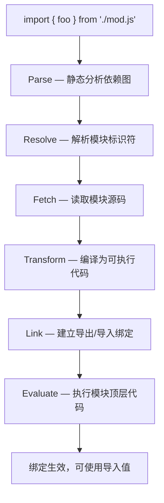
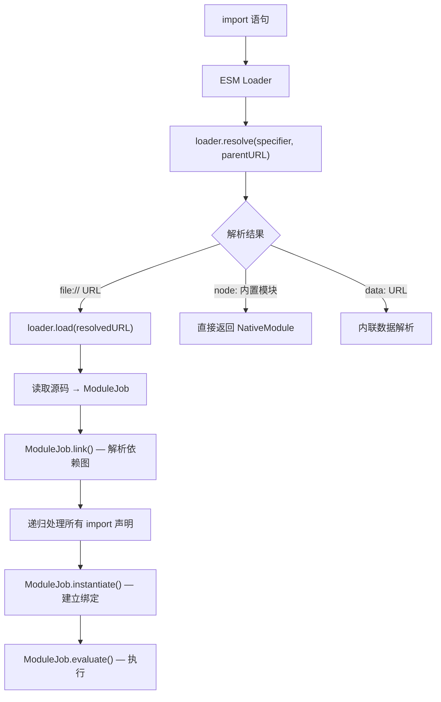
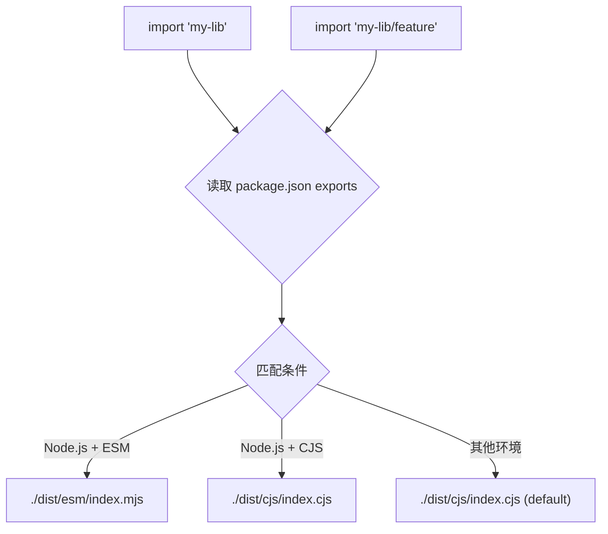
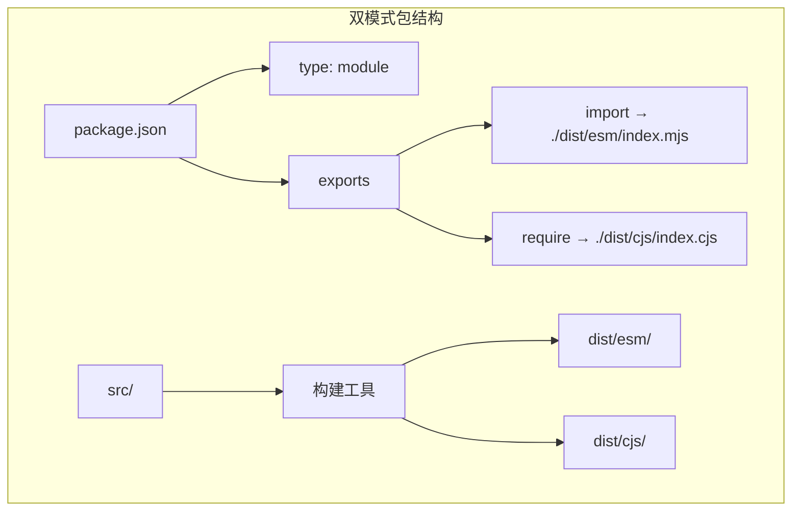
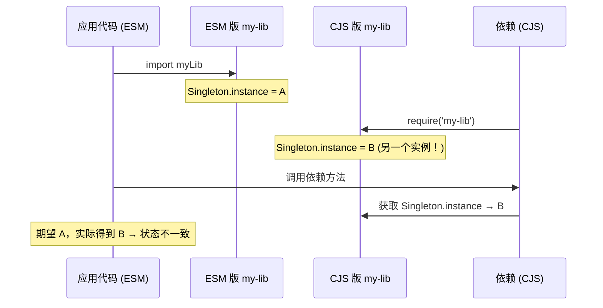
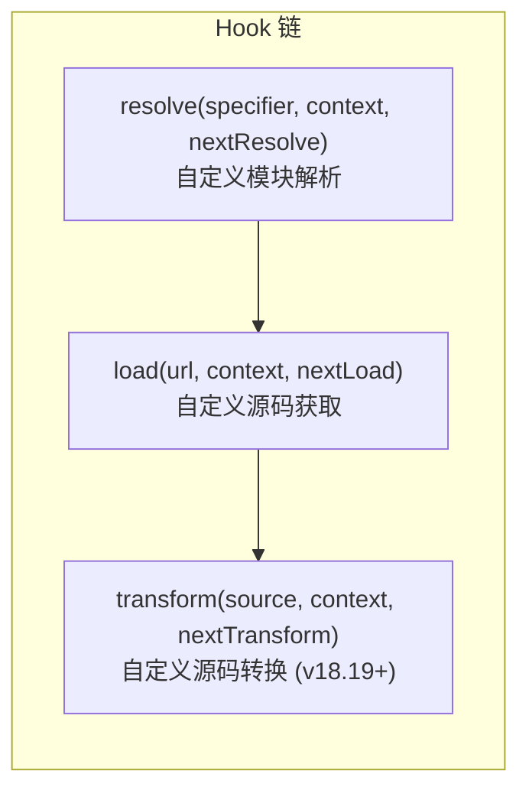

# ECMAScript Modules（ESM）

## 概述

ESM（ECMAScript Modules）是 JavaScript 的官方模块标准，由 TC39 在 ES6（ES2015）中正式引入。Node.js 从 v8.5.0 开始实验性支持 ESM，v12.17.0 起使用 ESM 不再需要标志、也不再打印实验性警告（官方文档将 ESM 稳定标记追溯至 v12.22.0），经历了漫长的过渡期。与 CJS 的同步阻塞加载不同，ESM 采用**异步加载 + 静态分析**的设计，这使 Tree-shaking、顶层 await、条件导出等现代特性成为可能。



## ESM 加载链路详解

Node.js 中 ESM 的加载由 `ESM Loader` 负责，与 CJS 的 `Module._load` 是完全独立的代码路径：



### 与 CJS 加载链路的关键差异

| 维度 | CJS | ESM |
|------|-----|-----|
| 加载时机 | 运行时（`require()` 被调用时） | 解析时（静态分析 `import` 声明） |
| 加载方式 | 同步阻塞 | 异步非阻塞 |
| 解析标识 | 文件路径（相对/绝对/node_modules） | URL（`file://`、`node:`、`data:`） |
| 缓存机制 | `require.cache`（普通对象） | `moduleMap`（Map，按 URL 索引） |
| 循环依赖 | 返回部分导出 | 建立实时绑定（live binding） |
| 顶层 await | 不支持 | 支持 |

## import 与 export 的静态分析

ESM 的 `import`/`export` 声明必须在**模块顶层**，且不能在运行时动态构造——这是静态分析的基础：

```javascript
// ✅ 静态声明 — 可被静态分析
import { readFileSync } from 'node:fs';
export const version = '1.0.0';

// ❌ 动态导入路径 — 非法，ESM 不允许
// const mod = './' + name;
// import { foo } from mod;

// ✅ 动态场景使用 import()
const mod = await import('./' + name);
```

### 实时绑定（Live Binding）

ESM 的 `import` 建立的是**实时绑定**，而非值的拷贝。当导出模块修改变量时，导入模块会感知到变化：

```javascript
// counter.mjs
export let count = 0;
export function increment() {
  count++;
}

// main.mjs
import { count, increment } from './counter.mjs';
console.log(count);  // 0
increment();
console.log(count);  // 1 — 实时绑定，值已更新
```

对比 CJS 中，`require` 返回的是 `module.exports` 的**快照**：

```javascript
// counter.js (CJS)
let count = 0;
module.exports = { count, increment: () => count++ };
// count 是原始值，导出时已被拷贝

// main.js
const { count, increment } = require('./counter');
console.log(count);  // 0
increment();
console.log(count);  // 0 — 值拷贝，不会更新
```

## package.json 中的 ESM 配置

### type 字段

`package.json` 的 `type` 字段决定了 `.js` 文件的模块系统解析规则：

```json
{
  "type": "module"   // .js 文件按 ESM 解析
}
```

```json
{
  "type": "commonjs" // .js 文件按 CJS 解析（默认值）
}
```

| 文件扩展名 | type: "commonjs" | type: "module" |
|------------|-----------------|----------------|
| `.js` | CJS | ESM |
| `.mjs` | ESM | ESM |
| `.cjs` | CJS | CJS |

> `.mjs` 和 `.cjs` 扩展名**始终**优先于 `type` 字段，是明确指定模块类型的硬性方式。

### exports 字段 — 条件导出

`exports` 是 Node.js v12.7.0 引入的**条件导出**机制，允许同一个包根据不同的消费场景暴露不同的入口：

```json
{
  "name": "my-lib",
  "exports": {
    ".": {
      "import": "./dist/esm/index.mjs",
      "require": "./dist/cjs/index.cjs",
      "default": "./dist/cjs/index.cjs"
    },
    "./feature": {
      "import": "./dist/esm/feature.mjs",
      "require": "./dist/cjs/feature.cjs"
    },
    "./package.json": "./package.json"
  }
}
```

**常见条件**：

1. `import` — ESM 导入
2. `require` — CJS require
3. `node` — Node.js 环境（不限模块系统）
4. `default` — 兜底条件

> 条件按 `exports` 对象中的**声明顺序**从上到下匹配，先命中先用——因此惯例是把更具体的条件（如 `import`/`require`）写在 `default` 之前。



### exports 的封装性

`exports` 字段一旦定义，包的**所有导出必须显式声明**。未在 `exports` 中声明的子路径将无法被外部访问：

```json
{
  "exports": {
    ".": "./lib/index.js"
  }
}
```

```javascript
import pkg from 'my-lib';         // ✅ 命中 "."
import internal from 'my-lib/src/internal.js';  // ❌ ERR_PACKAGE_PATH_NOT_EXPORTED
```

> 这与 CJS 的「包内所有文件皆可访问」形成鲜明对比——`exports` 实现了真正的**公共 API 封装**。

### imports 字段 — 包内别名

`imports`（Node.js v12.19.0）为包**内部**提供模块别名，以 `#` 前缀标识：

```json
{
  "imports": {
    "#internal": "./src/internal/index.js",
    "#utils": "./src/utils/index.js"
  }
}
```

```javascript
// 包内代码
import { helper } from '#internal';
import { format } from '#utils';
```

> `imports` 只能被包自身使用，外部包无法访问——与 `exports` 的封装逻辑一致。

## 双模式包（Dual Package）

在 CJS → ESM 的过渡期，库作者需要同时支持两种模块系统。双模式包是当前的主流方案：



### 方案一：条件导出（推荐）

```json
{
  "type": "module",
  "exports": {
    ".": {
      "import": {
        "types": "./dist/esm/index.d.mts",
        "default": "./dist/esm/index.mjs"
      },
      "require": {
        "types": "./dist/cjs/index.d.cts",
        "default": "./dist/cjs/index.cjs"
      }
    }
  }
}
```

### 方案二：ESM wrapper

CJS 作为主入口，ESM 入口仅做代理转发：

```json
{
  "type": "commonjs",
  "main": "./dist/cjs/index.cjs",
  "exports": {
    ".": {
      "import": "./dist/esm/wrapper.mjs",
      "require": "./dist/cjs/index.cjs"
    }
  }
}
```

```javascript
// dist/esm/wrapper.mjs
export * from '../cjs/index.cjs';
export { default } from '../cjs/index.cjs';
```

### 双模式包的状态双份问题

⚠️ **核心陷阱**：同一个包的 CJS 和 ESM 版本是两个不同的模块实例，它们各自维护独立的状态：



**缓解策略**：
1. 避免在模块顶层维护可变状态
2. CJS 和 ESM 版本共享同一个底层实现（wrapper 模式）
3. 在 `package.json` 中明确声明 `sideEffects: false`

## ESM Loader Hooks

Node.js v8.8.0 引入了 ESM 自定义加载器（Loader Hooks），允许开发者拦截和自定义模块加载的各个阶段：



```javascript
// loader.mjs
import fs from 'node:fs';

export async function resolve(specifier, context, nextResolve) {
  if (specifier.startsWith('custom:')) {
    return { url: specifier.replace('custom:', 'file://'), format: 'module' };
  }
  return nextResolve(specifier, context);
}

export async function load(url, context, nextLoad) {
  if (url.endsWith('.txt')) {
    const content = await fs.readFile(new URL(url), 'utf-8');
    return { format: 'module', source: `export default ${JSON.stringify(content)}` };
  }
  return nextLoad(url, context);
}
```

```bash
node --experimental-loader ./loader.mjs app.mjs
```

## 顶层 await

ESM 原生支持顶层 `await`，这使得模块初始化阶段的异步操作无需包裹在 async IIFE 中：

```javascript
// config.mjs — 顶层 await
const response = await fetch('https://api.example.com/config');
const config = await response.json();
export default config;

// app.mjs
import config from './config.mjs';
console.log(config);  // 配置已加载完成
```

> **注意**：顶层 await 会阻塞依赖它的所有模块，可能导致整个依赖图的执行被延迟。在性能敏感场景需谨慎使用。

## ESM 与 CJS 的互操作矩阵

| 消费方 | 被消费方 | 方式 | 说明 |
|--------|---------|------|------|
| ESM | CJS | `import cjs from './cjs.cjs'` | CJS 的 `module.exports` 成为 ESM 的 `default` 导出 |
| ESM | CJS 命名导出 | `import { foo } from './cjs.cjs'` | ⚠️ 通过静态分析启发式检测，不可靠 |
| CJS | ESM | `await import('./esm.mjs')` | 动态 `import()` 在所有版本可用 |
| CJS | ESM 同步 | `const pkg = require('./esm.mjs')` | Node 22.12+ 支持加载不含顶层 await 的 ESM（require(esm)）；含顶层 await 的仍须 `await import()` |

### 命名导出的启发式检测

当 ESM 导入 CJS 模块时，Node.js 会尝试通过**启发式分析**将 `module.exports` 的属性提升为命名导出：

```javascript
// cjs-module.cjs
module.exports = { foo: 1, bar: 2 };

// esm-consumer.mjs
import { foo, bar } from './cjs-module.cjs';  // ✅ 大概率可以
```

但这种检测**不可靠**——如果 `module.exports` 在运行时动态构造，静态分析将失败：

```javascript
// cjs-dynamic.cjs
const key = process.env.KEY;
module.exports = { [key]: 'value' };

// esm-consumer.mjs
import { value } from './cjs-dynamic.cjs';  // ❌ 可能失败
```

**最佳实践**：从 CJS 模块导入时，始终使用 `default` 导出：

```javascript
import cjsModule from './cjs-module.cjs';
const { foo, bar } = cjsModule;
```
