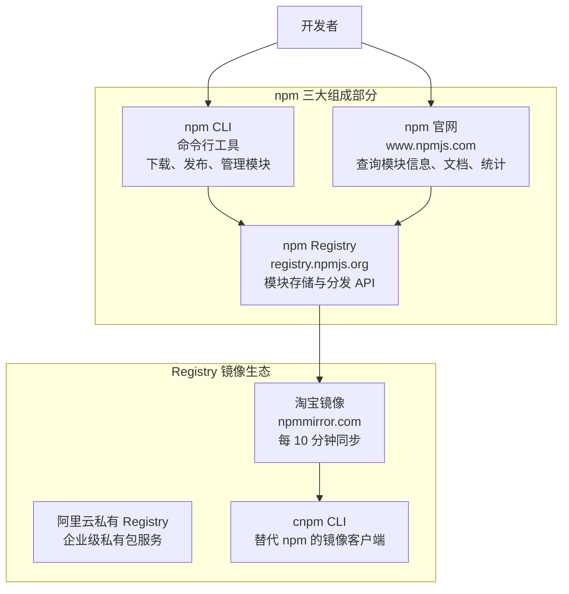

# npm 进阶

在掌握 npm 基本命令之后，本篇进入进阶主题：dependencies/devDependencies/peerDependencies 等依赖类型的深度辨析、npm scripts 的编排与参数传递、npx 执行机制、preinstall/postpublish 等生命周期钩子、package-lock.json 锁包机制与依赖解析算法，并以一个完整 CLI 工具（ltsn）贯穿包的开发、测试、发布与版本迭代全流程。

---

## npm 生态架构

npm 全称 Node Package Manager，但它早已不只是 Node 的包管理工具——前端、全栈、甚至纯后端的模块也被它纳入怀中。npm 生态由三个部分组成：



| 组成 | 地址 | 功能 |
|------|------|------|
| npm 官网 | www.npmjs.com | 模块信息查询、文档、下载统计 |
| npm Registry | registry.npmjs.org | 模块查询下载的 RESTful API 服务 |
| npm CLI | github.com/npm/cli | 命令行下载与管理工具 |

> **Registry 并非唯一**：npm 默认使用的 registry 是 npm,Inc 公司提供的公共服务，但你可以使用第三方 registry（如淘宝镜像 npmmirror.com），或搭建私有 registry（如 cnpmjs.org、阿里云 Registry、Verdaccio）。

---

## 依赖管理进阶

### 依赖类型深度解析

npm 支持多种依赖类型,每种都有特定的应用场景。

#### dependencies vs devDependencies

**依赖类型选择决策树**：

```
这个包是否在运行时被你的代码使用？
    │
    ├─ 是 → dependencies
    │       (express, axios, lodash)
    │
    └─ 否 → 是否在开发、测试、构建时使用？
                │
                ├─ 是 → devDependencies
                │       (jest, eslint, webpack)
                │
                └─ 否 → 不需要添加
```

**错误示例**：

```json
{
  "dependencies": {
    "jest": "^29.0.0",        // ❌ 测试框架不应在生产依赖中
    "webpack": "^5.0.0"       // ❌ 构建工具不应在生产依赖中
  },
  "devDependencies": {
    "express": "^4.18.0"      // ❌ Web 框架应在生产依赖中
  }
}
```

**正确示例**：

```json
{
  "dependencies": {
    "express": "^4.18.0",     // ✅ 运行时需要
    "mongoose": "^7.0.0",     // ✅ 数据库驱动
    "lodash": "^4.17.21"      // ✅ 工具库
  },
  "devDependencies": {
    "jest": "^29.0.0",        // ✅ 仅测试时需要
    "eslint": "^8.0.0",       // ✅ 仅开发时需要
    "nodemon": "^2.0.0"       // ✅ 仅开发时需要
  }
}
```

#### peerDependencies（对等依赖）

**应用场景**：插件开发,需要宿主提供特定依赖。

**示例：React 组件库**

```json
{
  "name": "my-react-components",
  "peerDependencies": {
    "react": ">=16.8.0",
    "react-dom": ">=16.8.0"
  },
  "peerDependenciesMeta": {
    "react-dom": {
      "optional": true  // 标记为可选
    }
  }
}
```

**安装行为**：

```bash
# 用户项目中安装
npm install my-react-components

# npm 会检查宿主项目是否有 react 和 react-dom
# 如果没有或版本不匹配,npm 7+ 会自动安装
# npm 6 会发出警告
```

**版本兼容性矩阵**：

```json
{
  "peerDependencies": {
    "react": "^17.0.0 || ^18.0.0",  // 支持 React 17 和 18
    "typescript": "^4.0.0 || ^5.0.0"  // 支持 TS 4 和 5
  }
}
```

#### optionalDependencies（可选依赖）

**应用场景**：增强功能但不是必需的依赖。

**示例：平台特定功能**

```json
{
  "optionalDependencies": {
    "fsevents": "^2.3.0",     // macOS 文件系统事件
    "sharp": "^0.32.0"        // 图片处理(可能安装失败)
  }
}
```

**错误处理**：

```javascript
// index.js
let sharp;

try {
  sharp = require('sharp');
} catch (error) {
  console.warn('sharp 不可用,图片处理功能将降级');
  sharp = null;
}

function processImage(image) {
  if (sharp) {
    return sharp(image).resize(300, 200).toBuffer();
  }
  // 降级处理
  return image;
}
```

#### bundledDependencies（打包依赖）

**应用场景**：发布时将某些依赖一起打包。

```json
{
  "bundledDependencies": [
    "my-private-package",
    "my-utils"
  ],
  "dependencies": {
    "my-private-package": "^1.0.0",
    "my-utils": "^2.0.0"
  }
}
```

**使用场景**：
- 私有包发布到公开仓库
- 确保 git 仓库依赖可用
- 简化部署流程

### 依赖版本策略

#### 版本范围的语义

```json
{
  "dependencies": {
    "^1.2.3": "1.2.3 ≤ version < 2.0.0",   // 主版本锁定
    "~1.2.3": "1.2.3 ≤ version < 1.3.0",   // 次版本锁定
    "1.2.3": "version === 1.2.3",          // 精确版本
    ">=1.0.0 <2.0.0": "范围版本",           // 范围约束
    "1.x": "1.0.0 ≤ version < 2.0.0",      // 通配符
    "*": "任意版本"                          // 不推荐
  }
}
```

#### 版本更新影响

```
^1.2.3 的版本更新行为：

1.2.3 → 1.2.4  ✅ 允许（PATCH 更新）
1.2.3 → 1.3.0  ✅ 允许（MINOR 更新）
1.2.3 → 2.0.0  ❌ 拒绝（MAJOR 更新）

~1.2.3 的版本更新行为：

1.2.3 → 1.2.4  ✅ 允许（PATCH 更新）
1.2.3 → 1.3.0  ❌ 拒绝（MINOR 更新）
```

#### 版本锁定策略

**策略一：精确版本（最严格）**

```json
{
  "dependencies": {
    "express": "4.18.2",
    "lodash": "4.17.21"
  }
}
```

**优点**：完全可控,依赖永远不会自动升级  
**缺点**：需要手动更新,错过安全修复

**策略二：兼容版本（推荐）**

```json
{
  "dependencies": {
    "express": "^4.18.2",
    "lodash": "^4.17.21"
  }
}
```

**优点**：自动获取功能更新和 bug 修复  
**缺点**：可能引入不兼容的 MINOR 更新

**策略三：混合策略**

```json
{
  "dependencies": {
    "express": "^4.18.2",           // 框架：允许 MINOR 更新
    "lodash": "~4.17.21",           // 工具库：仅 PATCH 更新
    "critical-lib": "1.2.3"         // 关键库：锁定版本
  },
  "devDependencies": {
    "jest": "^29.0.0",              // 开发工具：允许更新
    "eslint": "^8.0.0"
  }
}
```

#### 使用 npm config 控制版本行为

```bash
# 设置默认使用精确版本
npm config set save-exact true

# 设置默认使用兼容版本
npm config set save-prefix ^

# 设置默认使用近似版本
npm config set save-prefix ~
```

### 依赖树管理

#### 扁平化依赖（npm/yarn）

npm 和 yarn 使用扁平化依赖结构：

```
项目依赖：
├── A@1.0.0 (依赖 B@1.0.0)
└── C@1.0.0 (依赖 B@2.0.0)

node_modules 结构：
node_modules/
├── A@1.0.0/
├── C@1.0.0/
└── B@2.0.0/     ← 提升到顶层

node_modules/A/node_modules/
└── B@1.0.0/     ← A 的特殊依赖
```

**潜在问题：幽灵依赖**

```javascript
// package.json 中没有声明 B
const B = require('B');  // ✅ 可以访问（因为 B 被提升）

// 其他包更新后，B 可能不再被提升
// 导致代码突然失败
```

#### 非扁平化依赖（pnpm）

pnpm 使用严格的依赖结构：

```
node_modules/
├── .pnpm/                    # 实际存储
│   ├── A@1.0.0/
│   │   └── node_modules/
│   │       └── B@1.0.0/      # 硬链接
│   └── C@1.0.0/
│       └── node_modules/
│           └── B@2.0.0/      # 硬链接
├── A -> .pnpm/A@1.0.0        # 符号链接
└── C -> .pnpm/C@1.0.0        # 符号链接
```

**优点**：
- 避免幽灵依赖
- 节省磁盘空间
- 更快的安装速度

#### 依赖提升规则

```
提升优先级：
1. 第一个被安装的包的依赖
2. 版本号最高的依赖
3. 纯字母顺序

可以通过 package.json 控制：
{
  "dependencies": {
    "react": "npm:react@18.2.0"  // 别名
  }
}
```

### 依赖别名

npm 6.9+ 支持包别名：

```json
{
  "dependencies": {
    "react18": "npm:react@^18.0.0",
    "react17": "npm:react@^17.0.0",
    "my-fork": "npm:express@github:user/express#branch",
    "local-pkg": "file:../local-package"
  }
}
```

```javascript
// 使用别名导入
import React18 from 'react18';
import React17 from 'react17';
```

---

## npm scripts 高级应用

### 脚本编排模式

#### Shell 操作符编排

npm scripts 支持通过 Shell 操作符实现任务间的级联、并行和容错编排：

```json
{
  "scripts": {
    "clean:dist": "rimraf ./dist",
    "build:prod": "cross-env NODE_ENV=production webpack",

    "build:serial": "npm run clean:dist && npm run build:prod",
    "build:fallback": "npm run clean:dist; npm run build:prod",
    "build:recover": "npm run clean:dist || npm run build:prod",

    "compile": "node ./r.js",
    "compile:prod": "npm run compile -- --prod"
  }
}
```

**操作符语义**：

| 操作符 | 语义 | 执行逻辑 |
|--------|------|---------|
| `&&` | 串联执行 | 前一任务成功才执行后续任务；前一任务失败则中止 |
| `;` | 顺序执行 | 无论前一任务是否成功，都继续执行后续任务 |
| `\|\|` | 容错执行 | 仅当前一任务失败时，才执行后续任务 |
| `--` | 参数透传 | `--` 后的参数传递给被调用的脚本 |

**参数透传示例**：

```bash
# npm run compile:prod 相当于执行 node ./r.js --prod
npm run compile:prod

# 等价于
npm run compile -- --prod
```

> 对于复杂的脚本编排，建议将每个独立任务拆分为原子脚本再组合。若脚本间依赖关系复杂，可考虑将逻辑写入独立脚本文件（如 `scripts/build.js`），在脚本中使用 `shelljs` 调用系统命令。npm scripts 不局限于 Node.js 生态，也可以调用 Python 脚本和 Bash 脚本。

#### 并行执行脚本

使用 `npm-run-all` 或 `concurrently`：

```json
{
  "scripts": {
    "dev": "concurrently \"npm run dev:server\" \"npm run dev:client\"",
    "dev:server": "nodemon server.js",
    "dev:client": "webpack-dev-server",
    
    // 使用 npm-run-all
    "build": "npm-run-all --parallel build:*",
    "build:js": "webpack --mode production",
    "build:css": "sass src/styles:dist/styles",
    "build:assets": "cp -r src/assets dist/"
  },
  "devDependencies": {
    "concurrently": "^8.0.0",
    "npm-run-all": "^4.1.5"
  }
}
```

#### 串行执行脚本

```json
{
  "scripts": {
    "build": "npm-run-all clean lint test build:prod",
    "clean": "rimraf dist",
    "lint": "eslint src/",
    "test": "jest",
    "build:prod": "webpack --mode production"
  }
}
```

#### 条件执行脚本

使用 `if-env` 或环境变量：

```json
{
  "scripts": {
    "build": "if-env NODE_ENV=production && npm run build:prod || npm run build:dev",
    "build:prod": "webpack --mode production",
    "build:dev": "webpack --mode development"
  },
  "devDependencies": {
    "if-env": "^1.0.4"
  }
}
```

### 脚本参数传递

#### 通过 -- 分隔符

```json
{
  "scripts": {
    "test": "jest",
    "test:watch": "npm test -- --watch",
    "test:coverage": "npm test -- --coverage"
  }
}
```

```bash
npm run test:watch
# 等同于 jest --watch

npm test -- --testPathPattern=auth
# 传递自定义参数
```

#### 通过环境变量

```json
{
  "scripts": {
    "build": "cross-env NODE_ENV=production webpack",
    "dev": "cross-env NODE_ENV=development webpack-dev-server",
    "analyze": "cross-env ANALYZE=true npm run build"
  }
}
```

```javascript
// webpack.config.js
const mode = process.env.NODE_ENV;
const analyze = process.env.ANALYZE;

module.exports = {
  mode,
  plugins: analyze ? [new BundleAnalyzerPlugin()] : []
};
```

### 脚本变量系统

#### 内置变量

```json
{
  "name": "my-project",
  "version": "1.0.0",
  "scripts": {
    "info": "echo $npm_package_name@$npm_package_version",
    "main": "echo Main file: $npm_package_main",
    "repo": "echo Repository: $npm_package_repository_url"
  }
}
```

```bash
npm run info
# 输出：my-project@1.0.0
```

#### 自定义变量

```json
{
  "name": "my-project",
  "config": {
    "port": "3000",
    "api_url": "https://api.example.com"
  },
  "scripts": {
    "start": "node server.js --port=$npm_package_config_port",
    "dev": "cross-env API_URL=$npm_package_config_api_url nodemon server.js"
  }
}
```

#### npm config 变量

```json
{
  "scripts": {
    "debug": "echo $npm_config_debug",
    "custom": "echo $npm_config_my_var"
  }
}
```

```bash
npm run debug --debug=true
# 输出：true

npm run custom --my_var=hello
# 输出：hello
```

### 跨平台脚本最佳实践

#### 使用跨平台工具

```json
{
  "scripts": {
    "clean": "rimraf dist coverage .nyc_output",
    "mkdir": "mkdirp dist/templates dist/styles",
    "copy": "copyfiles -f src/*.html dist",
    "env": "cross-env NODE_ENV=production",
    "build": "npm-run-all clean mkdir copy build:js",
    "build:js": "cross-env NODE_ENV=production webpack"
  },
  "devDependencies": {
    "rimraf": "^5.0.0",
    "mkdirp": "^3.0.0",
    "copyfiles": "^2.4.0",
    "cross-env": "^7.0.0",
    "npm-run-all": "^4.1.5"
  }
}
```

#### 跨平台命令对照

| 操作 | Unix | Windows | 跨平台工具 |
|------|------|---------|-----------|
| 删除目录 | `rm -rf dist` | `rmdir /s dist` | `rimraf dist` |
| 创建目录 | `mkdir -p dist` | `mkdir dist` | `mkdirp dist` |
| 复制文件 | `cp src/*.js dist` | `copy src\\*.js dist` | `copyfiles` |
| 设置环境变量 | `NODE_ENV=prod` | `set NODE_ENV=prod` | `cross-env` |
| 并行执行 | `cmd1 & cmd2` | `start cmd1 & start cmd2` | `concurrently` |

### 脚本调试技巧

```json
{
  "scripts": {
    "debug": "node --inspect-brk index.js",
    "profile": "node --prof index.js",
    "trace": "node --trace-warnings index.js"
  }
}
```

---

## npx 深度应用

### node_modules/.bin 机制

当安装包含二进制入口（`package.json` 中的 `bin` 字段）的包时，npm 会在 `node_modules/.bin` 目录下创建符号链接：

```bash
# 安装包含 CLI 的包
npm install cowsay -D

# 查看生成的符号链接
ls -la node_modules/.bin/
# lrwxr-xr-x  cowsay -> ../cowsay/cli.js
# lrwxr-xr-x  cowthink -> ../cowsay/cli.js
```

**bin 字段配置**（包的 package.json）：

```json
{
  "name": "cowsay",
  "bin": {
    "cowsay": "./cli.js",
    "cowthink": "./cli.js"
  }
}
```

npx 的核心作用是直接执行 `node_modules/.bin` 下的二进制文件，无需手动指定完整路径：

```bash
# 不使用 npx：需要指定完整路径
./node_modules/.bin/cowsay "Hello"

# 使用 npx：自动查找并执行
npx cowsay "Hello"
```

### npx 执行流程

```
npx <package>
      │
      ▼
检查 node_modules/.bin
      │
      ├─ 存在 ──────> 直接执行
      │
      └─ 不存在
            │
            ▼
      检查全局安装
            │
            ├─ 存在 ──────> 直接执行
            │
            └─ 不存在
                  │
                  ▼
            从 npm 下载到临时目录
                  │
                  ▼
            执行包
                  │
                  ▼
            清理临时文件
```

### npx 典型应用场景

#### 1. 执行脚手架工具

```bash
# 无需全局安装即可使用脚手架
npx create-react-app my-app
npx create-next-app my-app
npx create-vue my-app
npx @nestjs/cli new my-api
```

#### 2. 运行项目本地依赖

```bash
# 运行项目中已安装的工具
npx webpack
npx eslint src/
npx prettier --write .
npx jest
```

#### 3. 执行特定版本

```bash
# 使用特定版本
npx cowsay@1.5.0 "Hello"

# 使用最新版本
npx cowsay@latest "Hello"
```

#### 4. 执行远程包

```bash
# 从 GitHub 执行
npx github:piuccio/cowsay "Hello"

# 从 gist 执行
npx gist:574872 "Hello"
```

### npx vs npm exec

npm 7+ 推荐使用 `npm exec` 作为 npx 的替代：

```bash
# npm exec 语法
npm exec -- create-react-app my-app
npm exec --package=cowsay -- cowsay "Hello"

# 等同于
npx create-react-app my-app
npx -p cowsay cowsay "Hello"
```

---

## npm 钩子深度应用

### 生命周期钩子完整列表

#### 安装相关钩子

```json
{
  "scripts": {
    "preinstall": "echo '安装前执行'",
    "install": "echo '安装时执行'",
    "postinstall": "echo '安装后执行'",
    
    "preuninstall": "echo '卸载前执行'",
    "uninstall": "echo '卸载时执行'",
    "postuninstall": "echo '卸载后执行'"
  }
}
```

**常见应用场景**：

```json
{
  "scripts": {
    "postinstall": "node scripts/setup.js && husky install",
    "preuninstall": "node scripts/cleanup.js"
  }
}
```

#### 版本相关钩子

```json
{
  "scripts": {
    "preversion": "npm test && npm run lint",
    "version": "npm run build && git add dist/",
    "postversion": "git push && git push --tags"
  }
}
```

**执行流程**：

```
npm version minor
    │
    ├── 1. preversion
    ├── 2. 更新 package.json 版本号
    ├── 3. version
    ├── 4. 创建 git tag
    └── 5. postversion
```

#### 发布相关钩子

```json
{
  "scripts": {
    "prepublishOnly": "npm test && npm run lint",
    "prepack": "npm run build",
    "postpack": "echo '打包完成'",
    "publish": "echo '发布中'",
    "postpublish": "echo '发布成功' && npm run notify"
  }
}
```

**钩子执行顺序**：

```
npm publish
    │
    ├── prepublishOnly (发布前检查)
    ├── prepack (打包前)
    ├── 创建 tarball
    ├── postpack (打包后)
    ├── 上传到 registry
    └── postpublish (发布后通知)
```

### Git Hooks 集成（Husky）

#### 安装和配置

```bash
npm install -D husky lint-staged
npx husky install
npm pkg set scripts.prepare="husky install"
```

#### 配置 pre-commit

```bash
npx husky add .husky/pre-commit "npx lint-staged"
```

```json
{
  "lint-staged": {
    "*.js": ["eslint --fix", "prettier --write"],
    "*.css": ["stylelint --fix", "prettier --write"],
    "*.{json,md}": ["prettier --write"]
  }
}
```

#### 配置 commit-msg

```bash
npx husky add .husky/commit-msg 'npx --no -- commitlint --edit "$1"'
```

```javascript
// commitlint.config.js
module.exports = {
  extends: ['@commitlint/config-conventional'],
  rules: {
    'type-enum': [
      2,
      'always',
      ['feat', 'fix', 'docs', 'style', 'refactor', 'test', 'chore']
    ]
  }
};
```

#### 配置 pre-push

```bash
npx husky add .husky/pre-push "npm test"
```

### 钩子最佳实践

#### 1. 自动化测试

```json
{
  "scripts": {
    "precommit": "lint-staged",
    "prepush": "npm test",
    "prepublishOnly": "npm run test:coverage && npm run build"
  }
}
```

#### 2. 文档生成

```json
{
  "scripts": {
    "postversion": "npm run docs && git add docs/ && git commit --amend --no-edit"
  }
}
```

#### 3. 通知系统

```json
{
  "scripts": {
    "postpublish": "curl -X POST https://hooks.slack.com/services/xxx -d '{\"text\":\"Published $npm_package_name@$npm_package_version\"}'"
  }
}
```

#### 4. 依赖检查

```json
{
  "scripts": {
    "postinstall": "node -e \"if(process.env.NODE_ENV === 'production') process.exit(0); require('child_process').exec('npm outdated', (e, stdout) => console.log(stdout))\""
  }
}
```

---

## 依赖解析机制

### package-lock.json 深度解析

#### 结构剖析

```json
{
  "name": "my-project",
  "version": "1.0.0",
  "lockfileVersion": 3,          // npm 8+
  "requires": true,
  "packages": {
    "": {                         // 项目根目录
      "name": "my-project",
      "version": "1.0.0",
      "dependencies": {
        "express": "^4.18.0"
      }
    },
    "node_modules/express": {     // 具体包信息
      "version": "4.18.2",
      "resolved": "https://registry.npmjs.org/express/-/express-4.18.2.tgz",
      "integrity": "sha512-xxx...",
      "license": "MIT",
      "dependencies": {
        "accepts": "~1.3.8",
        "body-parser": "1.20.1"
      },
      "engines": {
        "node": ">= 0.10.0"
      }
    }
  }
}
```

#### 字段说明

| 字段 | 说明 |
|------|------|
| `lockfileVersion` | 锁文件版本：1(npm 5-6), 2(npm 7), 3(npm 8+) |
| `packages` | 完整的包信息（包含嵌套结构） |
| `resolved` | 包的下载地址 |
| `integrity` | SRI 哈希值，用于验证完整性 |
| `link` | 符号链接标识 |
| `dev` | 是否为开发依赖 |
| `optional` | 是否为可选依赖 |

#### 完整性验证

```bash
# npm 会验证 integrity 值
npm install

# 如果文件被篡改，integrity 不匹配
# npm ERR! code EINTEGRITY
```

### npm ci vs npm install

| 特性 | npm install | npm ci |
|------|-------------|--------|
| 读取 package-lock.json | 可能修改 | 严格遵循 |
| 安装速度 | 较慢 | 更快 |
| node_modules 处理 | 增量更新 | 删除后全新安装 |
| package-lock 更新 | 可能更新 | 不更新 |
| 适用场景 | 开发环境 | CI/CD 环境 |

**使用建议**：

```yaml
# .github/workflows/ci.yml
- name: Install dependencies
  run: npm ci  # CI 环境使用 npm ci

# 本地开发
npm install    # 开发环境使用 npm install
```

### 依赖解析算法

#### 解析流程

```
npm install
    │
    ├── 读取 package.json
    │
    ├── 读取 package-lock.json（如果存在）
    │
    ├── 构建依赖树
    │   ├── 解析版本范围
    │   ├── 查找满足条件的最高版本
    │   └── 处理冲突
    │
    ├── 扁平化处理
    │   ├── 提升公共依赖
    │   └── 处理版本冲突
    │
    ├── 生成 node_modules
    │
    └── 更新 package-lock.json
```

#### 版本冲突处理

```
场景：A 依赖 B@1.0，C 依赖 B@2.0

解析结果：
node_modules/
├── A@1.0/
├── C@1.0/
└── B@2.0/          ← 被提升

node_modules/A/node_modules/
└── B@1.0/          ← A 的特定版本

规则：
1. 第一个安装的依赖优先提升
2. 高版本优先
3. 字母序优先
```

---

## 企业级发布策略

### 版本管理流程

#### 自动化版本发布

```json
{
  "scripts": {
    "release": "standard-version",
    "release:minor": "standard-version --release-as minor",
    "release:major": "standard-version --release-as major",
    "release:first": "standard-version --first-release"
  },
  "devDependencies": {
    "standard-version": "^9.5.0"
  }
}
```

**配置文件**：

```javascript
// .versionrc.js
module.exports = {
  types: [
    { type: 'feat', section: '✨ Features' },
    { type: 'fix', section: '🐛 Bug Fixes' },
    { type: 'perf', section: '⚡ Performance' },
    { type: 'chore', hidden: true },
    { type: 'docs', hidden: true },
    { type: 'style', hidden: true },
    { type: 'refactor', hidden: true },
    { type: 'test', hidden: true }
  ],
  skip: {
    tag: true  // 手动打 tag
  }
};
```

#### 发布流程脚本

```json
{
  "scripts": {
    "prepublishOnly": "npm run lint && npm test && npm run build",
    "prepack": "npm run clean && npm run build",
    "postpublish": "npm run notify",
    "notify": "node scripts/notify-release.js"
  }
}
```

### 多包管理策略

#### 使用 workspaces

```json
{
  "private": true,
  "workspaces": [
    "packages/*"
  ],
  "scripts": {
    "build": "npm run build --workspaces",
    "test": "npm run test --workspaces",
    "publish:all": "npm publish --workspaces"
  }
}
```

#### 使用 Lerna

```bash
npm install -D lerna
npx lerna init
```

```json
// lerna.json
{
  "version": "independent",
  "npmClient": "npm",
  "command": {
    "publish": {
      "conventionalCommits": true,
      "message": "chore(release): publish"
    }
  }
}
```

```bash
# 发布命令
npx lerna version
npx lerna publish from-package
```

### 发布配置最佳实践

#### package.json 发布配置

```json
{
  "name": "@myorg/my-package",
  "version": "1.0.0",
  "main": "dist/index.js",
  "module": "dist/index.esm.js",
  "types": "dist/index.d.ts",
  "files": [
    "dist",
    "README.md",
    "LICENSE"
  ],
  "sideEffects": false,
  "publishConfig": {
    "access": "public",
    "registry": "https://registry.npmjs.org",
    "tag": "latest"
  },
  "repository": {
    "type": "git",
    "url": "https://github.com/myorg/my-package.git"
  },
  "bugs": {
    "url": "https://github.com/myorg/my-package/issues"
  },
  "homepage": "https://github.com/myorg/my-package#readme"
}
```

#### 发布标签管理

```bash
# 发布 latest 版本（默认）
npm publish --tag latest

# 发布 beta 版本
npm publish --tag beta

# 发布 next 版本
npm publish --tag next

# 安装特定标签版本
npm install <package>@beta
npm install <package>@next

# 修改 latest 标签指向
npm dist-tag add <package>@1.0.0 latest
npm dist-tag add <package>@2.0.0-beta.0 beta
```

### npm publish 完整工作流

#### 发布前准备

1. 注册 npm 账号并验证邮箱（部分国内邮箱可能验证失败，建议使用 Gmail 等国际邮箱）
2. 配置 Git 仓库并设置 SSH Key
3. 确认使用官方 registry：`npm config set registry https://registry.npmjs.org/`

#### 发布流程

```bash
# 1. 登录 npm
npm login
# Username: <your-username>
# Password: <your-password>
# Email: (this IS public) <your-email>
# Logged in as <your-username> on https://registry.npmjs.com/

# 2. 本地测试（通过 npm link 创建全局链接）
npm link

# 3. 全局安装本地包进行验证
npm uninstall <package-name> -g   # 先卸载旧版本
npm i ./ -g                       # 从当前目录全局安装

# 4. 发布到 npm
npm publish
# 输出示例：
# npm notice 📦  <package>@1.0.0
# npm notice === Tarball Contents ===
# npm notice 465B  package.json
# npm notice 266B  index.js
# npm notice 307B  README.md
# npm notice === Tarball Details ===
# npm notice name:          <package>
# npm notice version:       1.0.0
# npm notice package size:  1.8 kB
# + <package>@1.0.0

# 5. 线上验证
npm uninstall <package-name> -g
npm i <package-name> -g
```

#### 版本迭代发布

遵循语义化版本规范进行版本更新：

```bash
# 修复 bug → 更新 PATCH 版本
npm version patch    # 1.0.0 -> 1.0.1

# 新增功能（向下兼容）→ 更新 MINOR 版本
npm version minor    # 1.0.0 -> 1.1.0

# 破坏性变更 → 更新 MAJOR 版本
npm version major    # 1.0.0 -> 2.0.0

# 推送代码和 tag
git push && git push --tags

# 发布新版本
npm publish
```

### 私有 Registry 发布

当需要将包发布到私有源而非 npm 公共空间时，可选择以下方案：

#### 方案一：阿里云 Registry

阿里云提供免费的私有 Registry 服务，适合团队使用：

1. 注册阿里云账号，获取用户 ID
2. 打开 [阿里云 Registry 控制台](https://node.console.aliyun.com/registry/home)，创建 registry
3. 获取账号和密码

```bash
# 将包名改为 @scope 格式
# package.json 中 "name": "@your-scope/package-name"

# 切换 registry 到阿里云私有源（具体地址在制品仓库控制台创建后获取）
npm config set registry https://packages.aliyun.com/<your-instance>/npm/<your-repo>/

# 登录私有源
npm login --registry=https://packages.aliyun.com/<your-instance>/npm/<your-repo>/

# 发布到私有源
npm publish --registry=https://packages.aliyun.com/<your-instance>/npm/<your-repo>/
```

#### 方案二：自建私有 Registry

使用 [cnpmjs.org](https://github.com/cnpm/cnpmjs.org) 或 [Verdaccio](https://verdaccio.org/) 搭建私有 Registry：

| 方案 | 优点 | 缺点 |
|------|------|------|
| cnpmjs.org | 功能完整，淘宝镜像同源 | 权限管理不便，大流量可能不稳定 |
| Verdaccio | 轻量级，配置简单，社区活跃 | 功能相对基础 |
| 阿里云 Registry | 免费使用，企业级稳定性 | 依赖阿里云服务 |

#### 方案三：npm 官方私有服务

npm 官方提供付费的私有包服务，支持个人和组织：

```bash
# 发布私有包
npm publish --access restricted

# 发布 scoped 公开包
npm publish --access public
```

---

## 性能优化实践

### 加速安装

#### 使用镜像源

```bash
# 全局配置
npm config set registry https://registry.npmmirror.com

# 项目级配置
echo "registry=https://registry.npmmirror.com" > .npmrc
```

#### 优化 package.json

```json
{
  "dependencies": {
    // ✅ 指定具体版本，避免范围查询
    "express": "4.18.2",
    
    // ✅ 使用精确版本减少解析时间
    "lodash": "4.17.21"
  }
}
```

#### 使用缓存

```bash
# 验证缓存
npm cache verify

# 缓存位置
npm config get cache

# CI 环境缓存 node_modules
# .github/workflows/ci.yml
- name: Cache node modules
  uses: actions/cache@v3
  with:
    path: node_modules
    key: ${{ runner.os }}-node-${{ hashFiles('**/package-lock.json') }}
```

### 减少依赖体积

#### 依赖分析

```bash
# 分析依赖树
npm ls --all

# 查看包大小
npx cost-of-modules

# 查看重复依赖
npm dedupe

# 可视化分析
npx webpack-bundle-analyzer dist/stats.json
```

#### 精简依赖

```bash
# 检查未使用的依赖
npx depcheck

# 输出示例：
# Unused dependencies
# * lodash
# * moment
#
# Unused devDependencies
# * webpack-cli

# 移除未使用的依赖
npm uninstall lodash moment
```

#### 使用轻量替代

```json
{
  "dependencies": {
    // ❌ moment.js (体积大)
    // "moment": "^2.29.0",
    
    // ✅ dayjs (轻量)
    "dayjs": "^1.11.0",
    
    // ❌ lodash (完整包)
    // "lodash": "^4.17.0",
    
    // ✅ lodash-es (按需加载)
    "lodash-es": "^4.17.0",
    
    // ✅ 或只安装需要的函数
    "lodash.get": "^4.4.2",
    "lodash.debounce": "^4.0.8"
  }
}
```

### 并行安装

#### npm 并行安装（npm 5+ 自动并行）

```bash
# npm 默认并行下载
npm install

# 控制并发数
npm install --maxsockets=10
```

#### 使用 pnpm

```bash
# pnpm 天然支持并行安装，速度更快
pnpm install
```

---

## 锁包机制演变与版本稳定性

### npm shrinkwrap 到 package-lock.json 的演进

npm 5 之前的版本依赖版本管理依赖开发者手动执行 `npm shrinkwrap` 来锁定版本，npm 5 起自动生成 `package-lock.json`。

#### 版本稳定性困境

语义化版本规范（SemVer）允许 `~` 和 `^` 范围版本自动晋升：

| 符号 | 匹配范围 | 晋升行为 |
|------|---------|---------|
| `~3.9.0` | 3.9.x | 自动获取 PATCH 更新，不匹配 3.10.0 |
| `^3.9.0` | 3.x.x | 自动获取 MINOR 和 PATCH 更新，不匹配 4.0.0 |

这种静默升级带来了版本稳定性悖论：

- **好处**：无需开发者主动修改 `package.json`，自动获取 bug 修复
- **风险**：包作者自行管理版本，技术实力参差不齐，新版本可能引入不兼容变更
- **深层风险**：即使将版本写死为 `3.9.0`，其子依赖如果使用语义化范围版本，照样会导致依赖树不稳定

#### package-lock.json 的解决方案

`package-lock.json` 通过三个字段锁定每个包的精确身份：

```json
{
  "dependencies": {
    "async": {
      "version": "2.6.1",                    // 精确版本号（无语义化跃迁）
      "resolved": "http://registry.npmjs.org/async/-/async-2.6.1.tgz",  // 唯一 tar 包地址
      "integrity": "sha1-...",                // 内容哈希值
      "requires": {
        "lodash": "^4.17.10"                  // 子依赖声明
      }
    },
    "lodash": {
      "version": "4.17.11",
      "resolved": "http://registry.npmjs.org/lodash/-/lodash-4.17.11.tgz",
      "integrity": "sha1-..."
    }
  }
}
```

- **version**：精确版本号，不受语义化范围跃迁影响
- **resolved**：明确的 tar 包下载地址，唯一不变
- **integrity**：包内容的 SRI 哈希值，用于验证完整性
- **requires**：与每个包内部 `package.json` 的 `dependencies` 一一对应

> `package-lock.json` 可理解为描述 node_modules 代码版本状态的快照文件。任何团队成员拿到项目后，无论在本地还是服务器上执行 `npm install`，都能依据此文件原封不动地复原 node_modules 的代码版本。

#### 关闭锁包功能

```bash
npm config set package-lock false
```

---

## 实战案例：Node LTS 查看工具

通过开发一个查看 Node LTS 版本的命令行工具 `ltsn`，完整演示 npm 包的开发、测试、发布与版本迭代流程。

### 项目初始化

```bash
# 创建项目目录
mkdir ltsn && cd ltsn

# 创建基本文件
touch README.md .gitignore

# .gitignore 内容
.DS_Store
npm-debug.log
node_modules
yarn-error.log
.vscode
.eslintrc.json

# 初始化 package.json
npm init
# 按提示填写：name=ltsn, version=1.0.0, description="CommandLine Tool for Node LTS"
# entry point=index.js, keywords=Node LTS, license=MIT
```

**package.json 生成结果**：

```json
{
  "name": "ltsn",
  "version": "1.0.0",
  "description": "CommandLine Tool for Node LTS",
  "main": "lib/index.js",
  "scripts": {
    "test": "echo \"Error: no test specified\" && exit 1"
  },
  "keywords": ["Node", "LTS"],
  "author": "developer",
  "license": "MIT"
}
```

> 也可以使用脚手架快速初始化：`npm i yo generator-nm -g && yo nm`，它会自动生成 `.gitignore`、`license` 等模块必备文件。

### 功能代码开发

#### 目录结构

```text
ltsn/
├── README.md
├── bin/
│   └── ltsn            # CLI 入口脚本
├── index.js             # 模块入口，暴露 lib 下的方法
├── lib/
│   ├── query.js         # 数据格式化
│   └── update.js        # 数据源获取
├── package-lock.json
└── package.json
```

#### 模块入口 index.js

```javascript
exports.query = require('./lib/query')
exports.update = require('./lib/update')
```

#### 数据获取 lib/update.js

```javascript
const axios = require('axios')
const compareVersions = require('compare-versions')

module.exports = async (v) => {
  // 从 Node 官方获取所有版本数据
  const { data } = await axios
    .get('https://nodejs.org/dist/index.json')

  // 过滤出 LTS 版本（可选按大版本过滤）
  return data.filter(node => {
    const cp = v
      ? (compareVersions(node.version, 'v' + v + '.0.0') >= 0)
      : true
    return node.lts && cp
  }).map(it => {
    const { files, ...rest } = it
    return { ...rest }
  })
}
```

#### 数据格式化 lib/query.js

```javascript
const Table = require('cli-table')

function query(dists) {
  const keys = Object.keys(dists[0])
  // 建立表头
  const table = new Table({
    head: keys
  })

  // 拼接表格每一行
  return dists
    .reduce((res, item) => {
      table.push(Object.values(item))
      return res
    }, table)
    .toString()
}

module.exports = query
```

#### CLI 入口 bin/ltsn

```bash
#!/usr/bin/env node

const pkg = require('../package')
const query = require('..').query
const update = require('..').update

function printResult(v) {
  update(v).then(dists => {
    const results = query(dists, v)
    console.log(results)
    process.exit()
  })
}

function printVersion() {
  console.log('ltsn ' + pkg.version)
  process.exit()
}

function printHelp(code) {
  const lines = [
    '',
    '  Usage:',
    '    ltsn [8]',
    '',
    '  Options:',
    '    -v, --version    print the version of ltsn',
    '    -h, --help       display this message',
    '',
    '  Examples:',
    '    $ ltsn 8',
    ''
  ]
  console.log(lines.join('\n'))
  process.exit(code || 0)
}

function main(argv) {
  if (!argv) printHelp(1)

  const getArg = function() {
    let args = argv.shift()
    args = args.split('=')
    if (args.length > 1) {
      argv.unshift(args.slice(1).join('='))
    }
    return args[0]
  }

  let arg
  while (argv.length) {
    arg = getArg()
    switch(arg) {
      case '-v': case '-V': case '--version':
        printVersion(); break
      case '-h': case '-H': case '--help':
        printHelp(); break
      default:
        printResult(arg); break
    }
  }
}

main(process.argv.slice(2))
module.exports = main
```

> `#!/usr/bin/env node` 定义当前脚本使用 Node 执行，使包可以像二进制文件一样直接运行。

#### package.json 配置 bin 字段

```json
{
  "bin": {
    "ltsn": "bin/ltsn"
  }
}
```

#### 安装依赖

```bash
npm i axios cli-color cli-table compare-versions -S
```

### 本地测试与验证

```bash
# 通过 npm link 创建全局链接进行测试
npm link
# 输出：/Users/dev/.nvm/versions/node/v10.11.0/bin/ltsn -> .../ltsn/bin/ltsn

# 全局安装本地包进行完整验证
npm uninstall ltsn -g
npm i ./ -g
# 或 npm i /path/to/ltsn -g

# 测试运行
ltsn 10
```

### 发布与版本迭代

#### 首次发布

```bash
# 登录 npm
npm login

# 发布
npm publish
# 输出：+ ltsn@1.0.0

# 线上验证
npm uninstall ltsn -g
npm i ltsn -g
```

#### 版本迭代示例

新增 LTS 版本的 API 文档链接功能（向下兼容的 MINOR 更新）：

```javascript
// lib/update.js 完整更新后的代码（新增 terminal-link 功能）
const axios = require('axios')
const compareVersions = require('compare-versions')
const terminalLink = require('terminal-link')
const color = require('cli-color')

module.exports = async (v) => {
  // 从 Node 官方获取所有版本数据
  const { data } = await axios
    .get('https://nodejs.org/dist/index.json')

  // 过滤出 LTS 版本（可选按大版本过滤），并附带 API 文档链接
  return data.filter(node => {
    const cp = v
      ? (compareVersions(node.version, 'v' + v + '.0.0') >= 0)
      : true
    return node.lts && cp
  }).map(it => {
    const { files, ...rest } = it
    const doc = color.yellow(terminalLink('API',
      `https://nodejs.org/dist/${it.version}/docs/api/documentation.html`))
    return { ...rest, doc }
  })
}
```

```bash
# 安装新依赖
npm i terminal-link -S

# 更新版本号（向下兼容的新功能 → MINOR）
# package.json: version 从 1.0.0 改为 1.1.0
npm version minor

# 发布新版本
npm publish
# 输出：+ ltsn@1.1.0

# 线上验证
npm un ltsn -g
npm i ltsn -g
ltsn -v  # 输出：ltsn 1.1.0
```

---

## 故障排除指南

### 常见错误处理

#### EACCES 权限错误

```bash
# 错误信息
# npm ERR! Error: EACCES: permission denied

# 解决方案 1：修改 npm 全局路径
mkdir ~/.npm-global
npm config set prefix '~/.npm-global'
export PATH=~/.npm-global/bin:$PATH

# 解决方案 2：使用 nvm
nvm install node
```

#### ENOENT 文件不存在

```bash
# 错误信息
# npm ERR! enoent ENOENT: no such file or directory

# 解决方案：清理缓存并重新安装
npm cache clean --force
rm -rf node_modules package-lock.json
npm install
```

#### EINTEGRITY 完整性错误

```bash
# 错误信息
# npm ERR! code EINTEGRITY

# 解决方案：清理缓存
npm cache clean --force
rm -rf node_modules package-lock.json
npm install
```

#### 依赖版本冲突

```bash
# 查看依赖树
npm ls <package-name>

# 强制解析
npm install --force

# 或使用 legacy-peer-deps
npm install --legacy-peer-deps
```

### 调试技巧

#### 查看详细日志

```bash
# 查看详细日志
npm install --verbose

# 查看更详细的日志
npm install --loglevel silly

# 输出日志到文件
npm install --verbose > npm-debug.log 2>&1
```

#### Dry Run 模式

```bash
# 模拟安装，不实际执行
npm install --dry-run

# 模拟发布
npm publish --dry-run
```

#### 检查配置

```bash
# 查看所有配置
npm config list -l

# 查看特定配置
npm config get registry
npm config get prefix

# 查看环境变量
npm run env
```

### 包安装失败处理

#### 网络问题

```bash
# 使用镜像源
npm config set registry https://registry.npmmirror.com

# 或临时使用
npm install --registry=https://registry.npmmirror.com

# 使用代理
npm config set proxy http://proxy.company.com:8080
npm config set https-proxy http://proxy.company.com:8080
```

#### 编译依赖失败

```bash
# 安装编译工具
# macOS
xcode-select --install

# Windows (以管理员运行)
# windows-build-tools 已停止维护，现代 Node.js 自带编译支持；
# 如需完整工具链，请安装 Visual Studio Build Tools
npm install --ignore-scripts
```

#### 平台不兼容

```json
{
  "optionalDependencies": {
    "fsevents": "^2.3.0"  // macOS only
  },
  "os": ["darwin", "linux"],  // 指定支持的平台
  "cpu": ["x64", "arm64"]     // 指定 CPU 架构
}
```

---

## 高级使用场景

### Monorepo 管理

#### 使用 npm workspaces

**项目结构**：

```
my-monorepo/
├── package.json
├── package-lock.json
├── packages/
│   ├── core/
│   │   ├── package.json
│   │   └── src/
│   ├── utils/
│   │   ├── package.json
│   │   └── src/
│   └── cli/
│       ├── package.json
│       └── src/
└── docs/
```

**根 package.json**：

```json
{
  "name": "my-monorepo",
  "private": true,
  "workspaces": [
    "packages/*"
  ],
  "scripts": {
    "build": "npm run build --workspaces",
    "test": "npm run test --workspaces",
    "lint": "eslint packages/*/src",
    "clean": "npm run clean --workspaces && rimraf node_modules"
  },
  "devDependencies": {
    "eslint": "^8.0.0",
    "jest": "^29.0.0"
  }
}
```

**子包 package.json**：

```json
// packages/core/package.json
{
  "name": "@my-monorepo/core",
  "version": "1.0.0",
  "main": "dist/index.js",
  "scripts": {
    "build": "tsc",
    "test": "jest",
    "clean": "rimraf dist"
  },
  "dependencies": {
    "@my-monorepo/utils": "^1.0.0"  // 引用其他子包
  }
}
```

**常用命令**：

```bash
# 安装所有依赖
npm install

# 在特定 workspace 执行命令
npm run build -w @my-monorepo/core

# 在所有 workspace 执行命令
npm run test --workspaces

# 给特定 workspace 添加依赖
npm install lodash -w @my-monorepo/core

# 发布特定 workspace
npm publish -w @my-monorepo/core
```

### 私有包管理

#### 使用 .npmrc 配置

```ini
# .npmrc

# 公司私有包使用私有源
@mycompany:registry=https://npm.mycompany.com/

# 公共包使用淘宝镜像
registry=https://registry.npmmirror.com

# 私有源认证
//npm.mycompany.com/:_authToken=${NPM_TOKEN}
```

#### 使用环境变量

```bash
# 设置认证 token
export NPM_TOKEN=xxx-xxx-xxx

# 或在 CI 中
# .github/workflows/publish.yml
- name: Publish to npm
  env:
    NPM_TOKEN: ${{ secrets.NPM_TOKEN }}
  run: npm publish
```

### 本地开发工作流

#### 使用 npm link

```bash
# 在包目录创建全局链接
cd ~/projects/my-package
npm link

# 在项目中使用本地包
cd ~/projects/my-project
npm link my-package

# 取消链接
npm unlink -g my-package
```

#### 使用 file: 协议

```json
{
  "dependencies": {
    "my-local-package": "file:../my-local-package"
  }
}
```

### CI/CD 集成

#### GitHub Actions

```yaml
# .github/workflows/ci.yml
name: CI

on: [push, pull_request]

jobs:
  test:
    runs-on: ubuntu-latest
    
    steps:
      - uses: actions/checkout@v3
      
      - name: Setup Node.js
        uses: actions/setup-node@v3
        with:
          node-version: '20'
          cache: 'npm'
      
      - name: Install dependencies
        run: npm ci
      
      - name: Run tests
        run: npm test
      
      - name: Build
        run: npm run build
      
      - name: Publish
        if: startsWith(github.ref, 'refs/tags/')
        run: npm publish
        env:
          NPM_TOKEN: ${{ secrets.NPM_TOKEN }}
```

#### 缓存优化

```yaml
- name: Cache node modules
  uses: actions/cache@v3
  with:
    path: |
      node_modules
      ~/.npm
    key: ${{ runner.os }}-node-${{ hashFiles('**/package-lock.json') }}
    restore-keys: |
      ${{ runner.os }}-node-
```

---

## 最佳实践清单

### 依赖管理

- [ ] 生产依赖和开发依赖严格分离
- [ ] 使用 `^` 或精确版本，避免使用 `*`
- [ ] 定期运行 `npm audit` 检查安全漏洞
- [ ] 使用 `npm ci` 替代 `npm install`（CI 环境）
- [ ] 提交 `package-lock.json` 到版本控制
- [ ] 定期更新依赖：`npx npm-check-updates -u`

### 脚本管理

- [ ] 使用跨平台工具（cross-env, rimraf）
- [ ] 合理使用钩子函数
- [ ] 脚本命令清晰、语义化
- [ ] 复杂脚本拆分为多个子脚本

### 发布管理

- [ ] 使用 semantic versioning
- [ ] 发布前运行测试和 lint
- [ ] 使用 `.npmignore` 控制发布内容
- [ ] 配置 `publishConfig`
- [ ] 编写详细的 README 和 CHANGELOG

### 性能优化

- [ ] 使用镜像源加速
- [ ] 定期清理缓存：`npm cache clean --force`
- [ ] 精简依赖，移除未使用的包
- [ ] 使用轻量级替代方案

---

## 参考资料

- [npm 官方文档](https://docs.npmjs.com/)
- [npm CLI 命令参考](https://docs.npmjs.com/cli/v9/commands)
- [package.json 规范](https://docs.npmjs.com/cli/v9/configuring-npm/package-json)
- [语义化版本规范](https://semver.org/lang/zh-CN/)
- [npm scripts 高级用法](https://docs.npmjs.com/cli/v9/using-npm/scripts)
- [workspaces 指南](https://docs.npmjs.com/cli/v9/using-npm/workspaces)
