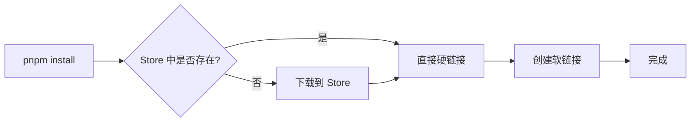

# pnpm 进阶指南

pnpm（performant npm）是一个快速、节省磁盘空间的 JavaScript 包管理工具。它通过独特的依赖管理机制，从根本上解决了 npm 和 Yarn 存在的问题，成为现代前端工程的理想选择。

## 演进历程：npm 的困境到 pnpm 的崛起

在 Node.js 的世界里，包管理工具是开发者不可或缺的利器。从 npm、Yarn 到 pnpm，这不仅仅是工具的更迭，更是技术理念的演进。

### npm v2 的嵌套地狱与性能瓶颈

早期的 npm v2 采用简单直接的嵌套结构来管理 `node_modules`。每个依赖项都在其父项目的 `node_modules` 文件夹中拥有自己独立的 `node_modules`，用于存放其自身的依赖。这种方式虽然直观，但很快就暴露了两个致命缺陷：

| 问题 | 描述 | 影响 |
|------|------|------|
| **依赖重复** | 多个依赖包共享同一个子依赖时，子依赖会被复制多份 | 极大浪费磁盘空间 |
| **路径过长** | Windows 文件路径最大长度约 260 字符 | 深层嵌套导致安装失败 |

**示例：npm v2 的嵌套结构**

```
node_modules/
├── express/
│   └── node_modules/
│       ├── accepts/
│       │   └── node_modules/
│       │       └── mime-types/  # 重复
│       └── body-parser/
│           └── node_modules/
│               └── mime-types/  # 重复
└── koa/
    └── node_modules/
        └── mime-types/          # 第三次重复
```

### npm v3/Yarn 的扁平化与幽灵依赖

为了解决 npm v2 的问题，npm v3 与 Yarn 先后引入了"扁平化"的 `node_modules` 结构。扁平化方案将所有依赖（包括子依赖）都提升到 `node_modules` 的顶层。这样一来，大部分重复的依赖被消除了，路径过长的问题也得到了缓解。

但这种方案却引入了新的、更隐蔽的问题——**幽灵依赖（Phantom Dependencies）**

> **幽灵依赖**：项目中未在 `package.json` 中明确声明，但却可以成功 `require()` 的依赖包。这是因为扁平化结构将所有依赖都提升到了顶层，导致你的代码可以访问到"依赖的依赖"。

**幽灵依赖问题示例**：

```json
// package.json
{
  "dependencies": {
    "express": "^4.18.0"  // express 依赖 debug
  }
}
```

```javascript
// 代码中可以直接使用 debug，但它并未被显式声明
const debug = require('debug');  // ✅ 可以运行，但这是幽灵依赖！

// 当 express 更新不再依赖 debug 时，代码会突然崩溃
```

**幽灵依赖的危害**：

1. **不确定性**：当某个子依赖的版本变化或被移除时，代码可能在毫无征兆的情况下崩溃
2. **维护困难**：难以追踪依赖的真实来源
3. **版本冲突**：不同包可能依赖同一包的不同版本，导致不可预测的行为

### pnpm 的诞生：寻求更优解

pnpm 出现是为了彻底解决上述所有问题。它巧妙地利用了操作系统的**软链接**和**硬链接**机制，创造出一种既能节省磁盘空间、又能保证依赖确定性的全新方案。

pnpm 不再"复制"或"提升"依赖，而是创建了一个全局的、基于内容寻址的存储（content-addressable store），并通过链接的方式来构建 `node_modules`。

### 包管理工具演进对比

| 版本 | 结构特点 | 优点 | 缺点 |
|------|----------|------|------|
| **npm v2** | 嵌套结构 | 结构清晰、依赖隔离 | 依赖重复、路径过长 |
| **npm v3/Yarn** | 扁平化结构 | 节省空间、解决路径问题 | 幽灵依赖、版本不确定 |
| **pnpm** | 非扁平化 + 链接 | 严格依赖管理、节省空间 | 需要理解链接机制 |

## 核心概念：软链接与硬链接

在深入 pnpm 之前，必须先理解两个核心的操作系统概念：硬链接（Hard Link）和软链接（Symbolic Link）。这是 pnpm 实现高效依赖管理的基石。

### 硬链接 (Hard Link)

硬链接可以看作是**同一个文件的多个入口**。它直接指向文件在磁盘上存储的物理数据（inode）。

**核心特性**：

- 多个硬链接指向同一个 inode，它们地位平等
- 删除任意一个硬链接，文件本身不会被删除，只有当指向该文件的所有硬链接都被删除后，文件才会被真正删除
- 不能跨文件系统（分区）创建
- 不能对目录创建硬链接

**创建硬链接**：

```bash
# 创建一个文件
echo "hello world" > source.txt

# 创建一个指向 source.txt 的硬链接
ln source.txt hard-link.txt

# 查看文件信息
ls -li
# 123456 -rw-r--r--  2 user group 12 Jan 1 10:00 hard-link.txt
# 123456 -rw-r--r--  2 user group 12 Jan 1 10:00 source.txt
# 注意：两个文件的 inode 号相同（123456），链接数为 2

# 验证内容一致
cat hard-link.txt  # 输出: hello world

# 修改硬链接会影响原文件
echo "modified" >> hard-link.txt
cat source.txt     # 输出: hello world\nmodified
```

### 软链接 (Symbolic Link)

软链接（或称符号链接）则是一个**特殊的文件**，其内容是另一个文件的路径。它类似于 Windows 系统中的"快捷方式"。

**核心特性**：

- 软链接有自己独立的 inode，它存储的是指向目标的路径信息
- 删除软链接，对源文件没有任何影响。但如果删除了源文件，软链接就会失效（dangling link）
- 可以跨文件系统创建
- 可以对目录创建软链接

**创建软链接**：

```bash
# 创建一个指向 source.txt 的软链接
ln -s source.txt soft-link.txt

# 查看文件信息
ls -li
# 123457 lrwxr-xr-x  1 user group 10 Jan 1 10:00 soft-link.txt -> source.txt
# 注意：软链接有独立的 inode（123457），类型为 l

# 通过软链接访问内容
cat soft-link.txt  # 输出: hello world

# 删除源文件后，软链接失效
rm source.txt
cat soft-link.txt  # 错误: No such file or directory
```

### 对比总结

为了更清晰地理解两者的区别，可以参考下表：

| 特性           | 硬链接 (Hard Link)                   | 软链接 (Symbolic Link)       |
| :------------- | :----------------------------------- | :--------------------------- |
| **本质**       | 指向文件 inode 的指针                | 存储目标路径的特殊文件       |
| **Inode**      | 与源文件共享同一个 inode             | 拥有独立的 inode             |
| **跨文件系统** | 否                                   | 是                           |
| **链接目录**   | 否                                   | 是                           |
| **删除源文件** | 链接依然有效（只要还有一个链接存在） | 链接失效（悬空链接）         |
| **删除链接**   | 不影响源文件和其他链接               | 不影响源文件                 |
| **占用空间**   | 几乎不占用（仅增加一个目录项）       | 占用少量空间（存储路径信息） |

## pnpm 实现原理

pnpm 的核心思想可以概括为：**全局存储 + 硬链接 + 软链接**。它通过这种组合，完美地解决了 npm 和 Yarn 面临的困境。

**架构概览**：

```
┌─────────────────────────────────────────────────────────────┐
│                      全局存储 (Store)                        │
│                    ~/.pnpm-store/v3                         │
│  ┌─────────────┐  ┌─────────────┐  ┌─────────────┐        │
│  │ lodash@4.17 │  │ express@4.18│  │ react@18.2  │        │
│  └─────────────┘  └─────────────┘  └─────────────┘        │
└─────────────────────┬───────────────────────────────────────┘
                      │ 硬链接
                      ▼
┌─────────────────────────────────────────────────────────────┐
│              项目 A: node_modules/.pnpm                      │
│  ┌─────────────┐  ┌─────────────┐  ┌─────────────┐        │
│  │ lodash@4.17 │  │ express@4.18│  │ react@18.2  │        │
│  └──────┬──────┘  └─────────────┘  └─────────────┘        │
└─────────┼───────────────────────────────────────────────────┘
          │ 软链接
          ▼
┌─────────────────────────────────────────────────────────────┐
│              项目 A: node_modules                            │
│  ┌─────────────┐  ┌─────────────┐                          │
│  │ lodash      │  │ express     │  (仅直接依赖)            │
│  └─────────────┘  └─────────────┘                          │
└─────────────────────────────────────────────────────────────┘
```

### 基于内容寻址的全局存储

当使用 pnpm 安装一个包时，它并不会立即将包下载到项目 `node_modules` 中。相反它会将包下载到一个统一的、位于用户主目录下的全局存储区（`~/.pnpm-store`）。

这个存储是**基于内容寻址**的，意味着同一个包的同一个版本在全局只会存储一份。即使在不同的项目中，如果依赖相同的包，pnpm 也会通过链接指向这个全局存储中的唯一实例。

**全局存储结构**：

```bash
~/.pnpm-store/v3/
├── files/
│   └── 00/
│       ├── 00001a...  # 文件内容哈希
│       ├── 00002b...
│       └── ...
└── index-5.12.0.lock
```

**优势**：

- **极大节省磁盘空间**：无论有多少个项目，`lodash@4.17.21` 在你的电脑上永远只有一份实体文件
- **安装速度提升**：已下载的包无需重复下载
- **跨项目共享**：所有项目共享同一份依赖实体

**查看全局存储信息**：

```bash
# 查看存储路径
pnpm store path
# 输出: /Users/username/.pnpm-store/v3

# 查看存储状态
pnpm store status

# 清理未使用的包（释放空间）
pnpm store prune

# 检查 store 中是否有被修改的包
pnpm store status
```

### 虚拟 `node_modules` 与 `.pnpm` 目录

pnpm 安装依赖后 `node_modules` 目录结构会非常整洁：

```
node_modules/
├── .pnpm/                    # 实际存储所有依赖的目录
│   ├── accepts@1.3.8/
│   ├── body-parser@1.20.1/
│   ├── express@4.18.2/
│   │   └── node_modules/     # express 的依赖通过软链接指向 .pnpm 中的对应包
│   │       ├── accepts -> ../../accepts@1.3.8/node_modules/accepts
│   │       └── body-parser -> ../../body-parser@1.20.1/node_modules/body-parser
│   └── ...
├── .modules.yaml             # pnpm 内部元数据
└── express -> .pnpm/express@4.18.2/node_modules/express  # 软链接
```

**关键设计**：

1. **顶层整洁**：`node_modules` 下只有在 `package.json` 中直接声明的依赖（软链接），这从根本上杜绝了"幽灵依赖"

2. **`.pnpm` 目录**：所有包（包括子依赖）的实际文件都存放在这里，采用 `包名@版本` 的命名格式

3. **依赖隔离**：每个包的 `node_modules` 只包含其声明的依赖，确保依赖关系的严格性

**验证结构**：

```bash
# 查看顶层依赖（仅直接依赖）
ls node_modules
# express  .pnpm  .modules.yaml

# 查看实际存储
ls node_modules/.pnpm
# accepts@1.3.8  body-parser@1.20.1  express@4.18.2  ...

# 查看是否为软链接
ls -la node_modules/express
# lrwxr-xr-x ... express -> .pnpm/express@4.18.2/node_modules/express
```

### 硬链接与软链接的协同工作

pnpm 的精髓在于将全局存储、`.pnpm` 目录和顶层 `node_modules` 巧妙地串联起来

1.  **全局存储 -> `.pnpm`**：`.pnpm` 目录下的所有文件，都是从全局存储（`~/.pnpm-store`）通过 **硬链接** 创建的。这意味着它们没有额外的磁盘空间占用，并且保证了全局只有一份物理文件

2.  **`.pnpm` -> 顶层 `node_modules`**：项目 `node_modules` 下的直接依赖（如 `express`），是通过 **软链接** 指向 `.pnpm` 中对应包的。

3.  **`.pnpm` 内部依赖关系**：在 `.pnpm` 内部，包与包之间的依赖关系，同样是通过 **软链接** 来组织的。例如，`express@4.18.2` 的 `node_modules` 文件夹下，会有指向 `accepts@1.3.8`、`body-parser@1.20.1` 等依赖的软链接

官方图非常清晰地展示了 pnpm 的工作流程：


**流程解读**：

1.  `pnpm install` 执行后，依赖包（如 `foo@1.0.0`）被下载到全局 store
2.  在项目的 `node_modules/.pnpm` 目录下，通过**硬链接**创建 `foo@1.0.0` 的文件实体
3.  在项目的 `node_modules` 目录下，通过**软链接**创建 `foo`，指向 `.pnpm/foo@1.0.0`
4.  `foo` 的依赖 `bar@1.0.0` 同样经过此流程，并通过**软链接**被链接到 `.pnpm/foo@1.0.0/node_modules/` 下

这种设计确保了只有 `package.json` 中声明的依赖才能被直接访问，同时又高效地复用了磁盘上的文件。

## pnpm 的核心优势

基于其独特的实现原理，pnpm 带来了以下核心优势：

### 性能对比

以下是在真实项目中的性能对比数据（以安装 React 项目依赖为例）：

| 指标 | npm | Yarn | pnpm | 提升 |
|------|-----|------|------|------|
| **安装时间（首次）** | 32s | 28s | 18s | **44%** |
| **安装时间（有缓存）** | 12s | 8s | 2s | **83%** |
| **磁盘占用** | 180MB | 180MB | 90MB | **50%** |
| **node_modules 文件数** | ~12,000 | ~12,000 | ~1,000 | **92%** |
| **内存占用** | 85MB | 75MB | 55MB | **35%** |

> 注：数据为特定测试环境下的实测参考（安装 express@4.18 + react@18 的项目），非官方基准，实际效果因项目规模与网络环境而异

### 极致的磁盘空间利用率

得益于全局 store 和硬链接机制，pnpm 在磁盘空间管理上远超 npm 和 Yarn。

**实际案例**：

```bash
# 假设有 5 个项目，都依赖 lodash@4.17.21

# npm/Yarn：每个项目独立存储
# 总占用：5 × 1.4MB = 7MB

# pnpm：全局只存一份
# 总占用：1.4MB（节省 80%）
```

**磁盘空间优化对比**：

| 场景 | npm/Yarn | pnpm | 节省 |
|------|----------|------|------|
| 10 个 React 项目 | ~2GB | ~800MB | **60%** |
| 20 个 Vue 项目 | ~3GB | ~1GB | **67%** |
| Monorepo (10 packages) | ~500MB | ~150MB | **70%** |

### 闪电般的安装速度

pnpm 的安装速度同样出色，这主要源于：

**速度优化因素**：



- **增量下载**：只下载本地 store 中不存在的或更新的包
- **链接代替复制**：创建链接的操作远快于文件复制（毫秒级 vs 秒级）
- **高效的依赖解析**：pnpm 拥有优化的依赖解析算法，能更快地构建依赖关系图
- **并行处理**：多包并行下载和链接

### 杜绝幽灵依赖

pnpm 的非扁平化 `node_modules` 结构，使得项目代码只能访问到 `package.json` 中显式声明的依赖。

**对比示例**：

```javascript
// package.json 中只声明了 express
{
  "dependencies": {
    "express": "^4.18.0"
  }
}

// 尝试使用未声明的 debug 包

// npm/Yarn：✅ 可以访问（幽灵依赖）
const debug = require('debug');  // 成功

// pnpm：❌ 无法访问（严格依赖）
const debug = require('debug');  // Error: Cannot find module 'debug'
```

**优势**：

- 增强项目的**健壮性**和**可维护性**
- 依赖关系**清晰明确**
- 避免**隐式依赖**带来的风险
- 团队协作更**规范**

## 安装与基本使用

### 安装 pnpm

**推荐方式（独立安装）**：

```bash
# macOS/Linux (使用安装脚本)
curl -fsSL https://get.pnpm.io/install.sh | sh -

# 或使用 wget
wget -qO- https://get.pnpm.io/install.sh | sh -

# Windows (使用 PowerShell)
iwr https://get.pnpm.io/install.ps1 -useb | iex
```

**其他安装方式**：

```bash
# 使用 npm 安装
npm install -g pnpm

# 使用 Homebrew (macOS)
brew install pnpm

# 使用 Scoop (Windows)
scoop install pnpm

# 使用 Corepack (Node.js 16.13+)
corepack enable
corepack prepare pnpm@latest --activate
```

### 基本命令

**依赖管理**：

```bash
# 安装所有依赖
pnpm install          # 根据 package.json 安装
pnpm i                # 简写

# 添加依赖
pnpm add <package>              # 生产依赖
pnpm add -D <package>           # 开发依赖
pnpm add -O <package>           # 可选依赖
pnpm add -g <package>           # 全局安装

# 安装特定版本
pnpm add lodash@4.17.21
pnpm add express@latest
pnpm add react@next             # 安装 next 标签的版本

# 移除依赖
pnpm remove <package>           # 从 dependencies 移除
pnpm remove -D <package>        # 从 devDependencies 移除
pnpm remove -g <package>        # 移除全局包

# 更新依赖
pnpm update                     # 更新所有依赖（遵循 semver）
pnpm update --latest            # 更新到最新版本（忽略 semver）
pnpm update <package>           # 更新特定包
pnpm up <package>               # 简写

# 查看依赖信息
pnpm list                       # 查看已安装的依赖
pnpm list --depth=1             # 显示深度为 1 的依赖树
pnpm list -g                    # 查看全局安装的包
pnpm why <package>              # 查看某个包为何被安装
```

**运行脚本**：

```bash
# 运行 package.json 中的脚本
pnpm run <script>
pnpm <script>           # run 可以省略

# 示例
pnpm run dev
pnpm test
pnpm build

# 使用 npx 等效功能
pnpm dlx <package>      # 执行包而不安装（类似 npx）
pnpm dlx create-vite    # 创建 Vite 项目
pnpm dlx prettier --write .
```

**项目初始化**：

```bash
# 创建新的 package.json
pnpm init

# 快速初始化（使用默认值）
pnpm init -y

# 导入已有项目的 lock 文件
pnpm import             # 从 package-lock.json/yarn.lock 导入
```

### 从 npm/Yarn 迁移

**迁移步骤**：

```bash
# 1. 删除旧的依赖和 lock 文件
rm -rf node_modules package-lock.json yarn.lock

# 2. 使用 pnpm 安装（会自动生成 pnpm-lock.yaml）
pnpm install

# 3. 更新项目文档，提示团队使用 pnpm
```

**package.json 添加包管理器提示**：

```json
{
  "packageManager": "pnpm@8.15.0",
  "engines": {
    "node": ">=18.0.0",
    "pnpm": ">=8.0.0"
  },
  "scripts": {
    "preinstall": "npx only-allow pnpm"
  }
}
```

## 配置文件详解

### .npmrc 配置文件

pnpm 使用 `.npmrc` 文件进行配置，支持多级配置优先级：

**配置优先级（从高到低）**：

1. 项目根目录的 `.npmrc`
2. 用户目录的 `~/.npmrc`
3. 全局配置 `$PREFIX/etc/npmrc`
4. pnpm 内置默认配置

**常用配置项**：

```ini
# .npmrc

# ========== 镜像源配置 ==========
registry=https://registry.npmmirror.com

# 特定 scope 使用不同的源
@mycompany:registry=https://npm.mycompany.com

# ========== 依赖提升配置 ==========
# 提升所有依赖（模拟扁平化结构，不推荐）
shamefully-hoist=true

# 只提升特定包
public-hoist-pattern[]=*eslint*
public-hoist-pattern[]=*prettier*

# ========== 安装行为配置 ==========
# 自动安装 peer dependencies
auto-install-peers=true

# 严格 peer dependencies 检查
strict-peer-dependencies=true

# 保存时的前缀（默认 ^）
save-prefix=~

# ========== 存储配置 ==========
# 自定义全局存储路径
store-dir=/path/to/pnpm-store

# ========== 其他配置 ==========
# 忽略特定依赖的脚本
ignore-scripts=true

# 模块目录名称
modules-dir=node_modules

# 侧缓存模式（适用于 CI）
side-effects-cache=true
```

### shamefully-hoist 配置详解

某些工具可能无法识别非扁平化的 `node_modules`，可以使用提升配置：

```ini
# .npmrc

# 方式 1：完全提升（不推荐，会引入幽灵依赖）
shamefully-hoist=true

# 方式 2：只提升特定包（推荐）
public-hoist-pattern[]=*react-native*
public-hoist-pattern[]=*webpack*
```

**提升后的目录结构**：

```
# shamefully-hoist=true
node_modules/
├── .pnpm/
├── express/
├── accepts/      # 被提升上来了
├── debug/        # 被提升上来了
└── ...

# public-hoist-pattern（部分提升）
node_modules/
├── .pnpm/
├── express/      # 直接依赖
├── webpack/      # 匹配 pattern 被提升
└── ...
```

### package.json 扩展字段

pnpm 在 `package.json` 中支持额外的配置：

```json
{
  "name": "my-project",
  "version": "1.0.0",
  
  "dependencies": {
    "express": "^4.18.0"
  },
  
  "devDependencies": {
    "typescript": "^5.0.0"
  },
  
  "pnpm": {
    "overrides": {
      "lodash": "4.17.21"          // 强制所有依赖使用此版本
    },
    "patchedDependencies": {
      "express@4.18.0": "patches/express@4.18.0.patch"
    },
    "peerDependencyRules": {
      "ignoreMissing": ["react"],   // 忽略缺失的 peer dependency
      "allowedVersions": {
        "react": "17"               // 允许 React 17
      }
    }
  }
}
```

## Monorepo 支持

pnpm 内置了优秀的 Monorepo 支持，通过 `pnpm-workspace.yaml` 文件配置。

### 创建 Monorepo 项目

**项目结构**：

```
my-monorepo/
├── pnpm-workspace.yaml    # workspace 配置文件
├── package.json           # 根项目配置
├── pnpm-lock.yaml
├── packages/              # 存放各个子项目
│   ├── core/
│   │   ├── package.json
│   │   └── src/
│   ├── utils/
│   │   ├── package.json
│   │   └── src/
│   └── web/
│       ├── package.json
│       └── src/
└── .npmrc
```

**配置 workspace**：

```yaml
# pnpm-workspace.yaml
packages:
  - 'packages/*'           # packages 下的所有目录
  - 'apps/*'               # apps 下的所有目录
  - '!**/test/**'          # 排除 test 目录
```

### workspace 内部依赖

**在子项目中引用其他子项目**：

```json
// packages/web/package.json
{
  "name": "@my-org/web",
  "dependencies": {
    "@my-org/core": "workspace:*",     # 使用最新版本
    "@my-org/utils": "workspace:^1.0.0"  # 使用兼容版本
  }
}
```

**workspace 协议**：

| 协议 | 说明 | 发布后转换 |
|------|------|-----------|
| `workspace:*` | 使用最新版本 | `1.2.0` |
| `workspace:^` | 使用兼容版本 | `^1.2.0` |
| `workspace:~` | 使用相近版本 | `~1.2.0` |
| `workspace:^1.0.0` | 指定版本范围 | `^1.0.0` |

### workspace 常用命令

```bash
# 在根目录执行递归命令
pnpm -r <command>                # 在所有子项目中执行命令
pnpm -r --filter <package> <cmd> # 在特定子项目中执行

# 示例
pnpm -r install                  # 安装所有子项目的依赖
pnpm -r run build                # 构建所有子项目
pnpm -r run test                 # 测试所有子项目

# 过滤执行
pnpm --filter web run dev        # 只在 web 项目运行 dev
pnpm --filter "@my-org/*" run build  # 在所有 @my-org 包中运行

# 按依赖顺序执行（-r 默认即按拓扑序执行）
pnpm -r run build         # 按依赖顺序构建

# 并行执行
pnpm -r run --parallel dev       # 并行启动开发服务器

# 查看项目依赖图
pnpm list --depth=0 -r

# 只更新 workspace 内的包
pnpm update --workspace
```

### Monorepo 实战示例

**场景：搭建组件库 + 文档站点 + 示例项目**

```
my-ui-library/
├── pnpm-workspace.yaml
├── package.json
├── packages/
│   ├── components/          # 组件库
│   │   ├── package.json
│   │   └── src/
│   ├── theme/               # 主题包
│   │   ├── package.json
│   │   └── src/
│   └── utils/               # 工具函数
│       ├── package.json
│       └── src/
└── apps/
    ├── docs/                # 文档站点
    │   ├── package.json
    │   └── src/
    └── playground/          # 示例项目
        ├── package.json
        └── src/
```

**配置文件**：

```yaml
# pnpm-workspace.yaml
packages:
  - 'packages/*'
  - 'apps/*'
```

```json
// package.json（根目录）
{
  "name": "my-ui-library",
  "private": true,
  "scripts": {
    "build": "pnpm -r run build",
    "test": "pnpm -r run test",
    "dev": "pnpm --filter playground run dev"
  },
  "devDependencies": {
    "typescript": "^5.0.0"
  }
}
```

```json
// packages/components/package.json
{
  "name": "@my-ui/components",
  "version": "1.0.0",
  "main": "dist/index.js",
  "dependencies": {
    "@my-ui/theme": "workspace:*",
    "@my-ui/utils": "workspace:*"
  }
}
```

```json
// apps/docs/package.json
{
  "name": "@my-ui/docs",
  "dependencies": {
    "@my-ui/components": "workspace:*",
    "vitepress": "^1.0.0"
  }
}
```

## 高级功能

### Peer Dependencies 处理

pnpm 对 peer dependencies 的处理更加严格：

```bash
# 自动安装 peer dependencies
pnpm config set auto-install-peers true

# 严格检查 peer dependencies（默认）
pnpm config set strict-peer-dependencies true
```

**处理 peer dependency 冲突**：

```json
// package.json
{
  "pnpm": {
    "peerDependencyRules": {
      "ignoreMissing": ["react", "vue"],  // 忽略缺失
      "allowedVersions": {
        "react": "17 || 18",              // 允许的版本
        "typescript": "5"                 // 强制使用 TS 5
      }
    }
  }
}
```

### 依赖覆盖 (Overrides)

强制覆盖依赖版本：

```json
// package.json
{
  "pnpm": {
    "overrides": {
      "lodash": "4.17.21",           // 所有 lodash 使用此版本
      "express@<4.18": "4.18.0",    // 指定版本范围
      "@types/node": "$types-node"   // 引用其他依赖
    }
  }
}
```

### 依赖补丁 (Patching)

修改第三方依赖而不发布 fork：

```bash
# 1. 创建补丁文件
pnpm patch express@4.18.0

# 输出: You can now edit the following folder: /tmp/abc123

# 2. 修改代码后提交补丁
pnpm patch-commit /tmp/abc123
```

**手动配置补丁**：

```json
// package.json
{
  "pnpm": {
    "patchedDependencies": {
      "express@4.18.0": "patches/express@4.18.0.patch"
    }
  }
}
```

**补丁文件示例**（`patches/express@4.18.0.patch`）：

```diff
diff --git a/lib/router/index.js b/lib/router/index.js
--- a/lib/router/index.js
+++ b/lib/router/index.js
@@ -10,7 +10,7 @@
 var parseUrl = require('parseurl');
 
 var proto = module.exports = function(options) {
-  var opts = options || {};
+  var opts = options || { mergeParams: true };
   ...
```

### 环境变量

pnpm 支持的常用环境变量：

```bash
# 设置 pnpm 主目录（全局 bin、全局 store 默认位置等）
PNPM_HOME=/path/to/pnpm-home

# pnpm 的任意配置项都可通过 npm_config_ 前缀的环境变量设置
npm_config_store_dir=/path/to/store
npm_config_registry=https://registry.npmmirror.com

# 设置配置文件路径
NPM_CONFIG_GLOBALCONFIG=/path/to/npmrc

# 使用 CI 模式
CI=true

# 设置网络并发数
npm_config_network_concurrency=16
```

## 命令速查表

### 常用命令

| 命令 | 说明 | npm 等效 |
|------|------|---------|
| `pnpm install` | 安装所有依赖 | `npm install` |
| `pnpm add <pkg>` | 添加依赖 | `npm i <pkg>` |
| `pnpm add -D <pkg>` | 添加开发依赖 | `npm i -D <pkg>` |
| `pnpm remove <pkg>` | 移除依赖 | `npm uninstall <pkg>` |
| `pnpm update` | 更新依赖 | `npm update` |
| `pnpm run <script>` | 运行脚本 | `npm run <script>` |
| `pnpm dlx <pkg>` | 执行包 | `npx <pkg>` |

### 管理命令

```bash
# 查看
pnpm list                      # 列出依赖
pnpm list -g --depth=0         # 全局依赖
pnpm why <pkg>                 # 查看依赖原因
pnpm outdated                  # 检查过时的包
pnpm audit                     # 安全审计

# 清理
pnpm store prune               # 清理未使用的 store 包
pnpm store path                # 查看 store 路径

# 配置
pnpm config list               # 查看配置
pnpm config set <key> <value>  # 设置配置
pnpm config get <key>          # 获取配置

# 其他
pnpm pack                      # 打包项目
pnpm publish                   # 发布包
pnpm link                      # 创建软链接
pnpm unlink                    # 移除软链接
```

### Workspace 命令

```bash
pnpm -r <cmd>                  # 递归执行
pnpm -r run build              # 构建所有
pnpm --filter <pkg> <cmd>      # 过滤执行
pnpm -r run --parallel dev     # 并行执行
```

## 常见问题与解决方案

### Q1: "Cannot find module" 错误

**原因**：尝试使用未在 `package.json` 中声明的依赖

**解决方案**：

```bash
# 方案 1：添加依赖声明
pnpm add <package>

# 方案 2：如果确实需要访问子依赖
pnpm add <package>

# 方案 3：临时使用提升模式（不推荐）
# .npmrc
shamefully-hoist=true
```

### Q2: React Native / Electron 等工具兼容性问题

**问题**：部分工具无法识别非扁平化 `node_modules`

**解决方案**：

```ini
# .npmrc
# 提升特定包
public-hoist-pattern[]=*react-native*
public-hoist-pattern[]=*electron*
public-hoist-pattern[]=*webpack*

# 或完全提升（不推荐）
shamefully-hoist=true
```

### Q3: Peer Dependency 警告或错误

**问题**：peer dependency 版本冲突

**解决方案**：

```json
// package.json
{
  "pnpm": {
    "peerDependencyRules": {
      "ignoreMissing": ["react"],
      "allowedVersions": {
        "react": "17 || 18"
      }
    }
  }
}
```

```bash
# 或自动安装 peer dependencies
pnpm config set auto-install-peers true
```

### Q4: CI/CD 中安装速度慢

**解决方案**：

```yaml
# .npmrc（CI 专用）
side-effects-cache=true
prefer-offline=true
```

```bash
# GitHub Actions 配置
- name: Setup pnpm
  uses: pnpm/action-setup@v2
  with:
    version: 8
    run_install: false

- name: Get pnpm store directory
  shell: bash
  run: |
    echo "STORE_PATH=$(pnpm store path --silent)" >> $GITHUB_OUTPUT
  id: pnpm-cache

- name: Setup pnpm cache
  uses: actions/cache@v3
  with:
    path: ${{ steps.pnpm-cache.outputs.STORE_PATH }}
    key: ${{ runner.os }}-pnpm-store-${{ hashFiles('**/pnpm-lock.yaml') }}
    restore-keys: |
      ${{ runner.os }}-pnpm-store-

- name: Install dependencies
  run: pnpm install --frozen-lockfile
```

### Q5: 如何查看某个包被哪些包依赖

```bash
# 查看依赖关系
pnpm why lodash

# 输出示例
# lodash@4.17.21
#
# dependencies:
# express@4.18.2
# └── lodash@4.17.21
```

### Q6: 多个项目如何共享依赖

pnpm 默认就支持全局共享，无需额外配置：

```bash
# 项目 A 和项目 B 都依赖 lodash@4.17.21
# 磁盘上只有一份实体文件

# 查看共享情况
pnpm store status
```

### Q7: 如何迁移现有的 lock 文件

```bash
# 导入其他包管理器的 lock 文件
pnpm import

# 支持导入：
# - package-lock.json (npm)
# - yarn.lock (Yarn)
```

### Q8: 在 Docker 中使用 pnpm

**Dockerfile 示例**：

```dockerfile
FROM node:20-alpine

# 安装 pnpm
RUN corepack enable && corepack prepare pnpm@latest --activate

WORKDIR /app

# 复制依赖文件
COPY package.json pnpm-lock.yaml ./

# 安装依赖
RUN pnpm install --frozen-lockfile

# 复制代码
COPY . .

# 构建
RUN pnpm run build

CMD ["pnpm", "start"]
```

## 总结

pnpm 通过**全局存储 + 硬链接 + 软链接**的创新方案，从根本上解决了 npm 和 Yarn 存在的问题：

**核心优势回顾**：

| 维度 | 优势 | 量化效果 |
|------|------|---------|
| **磁盘空间** | 内容寻址存储 | 节省 50-70% |
| **安装速度** | 链接替代复制 | 提升 2-3 倍 |
| **依赖管理** | 严格隔离 | 零幽灵依赖 |
| **Monorepo** | 原生支持 | 零配置 |
| **确定性** | lock 文件 | 100% 可复现 |

**适用场景**：

- ✅ 大型项目和团队协作
- ✅ Monorepo 架构
- ✅ 多项目开发环境
- ✅ CI/CD 流水线
- ✅ 对依赖管理有严格要求的场景

**迁移建议**：

对于新项目，强烈推荐直接使用 pnpm。对于现有项目，迁移成本低，收益明显，建议逐步迁移。

> pnpm 不仅是一个包管理工具，更是一种**更好的依赖管理理念**。它让依赖管理变得更加**高效、安全、可预测**，是现代前端工程化的理想选择。
