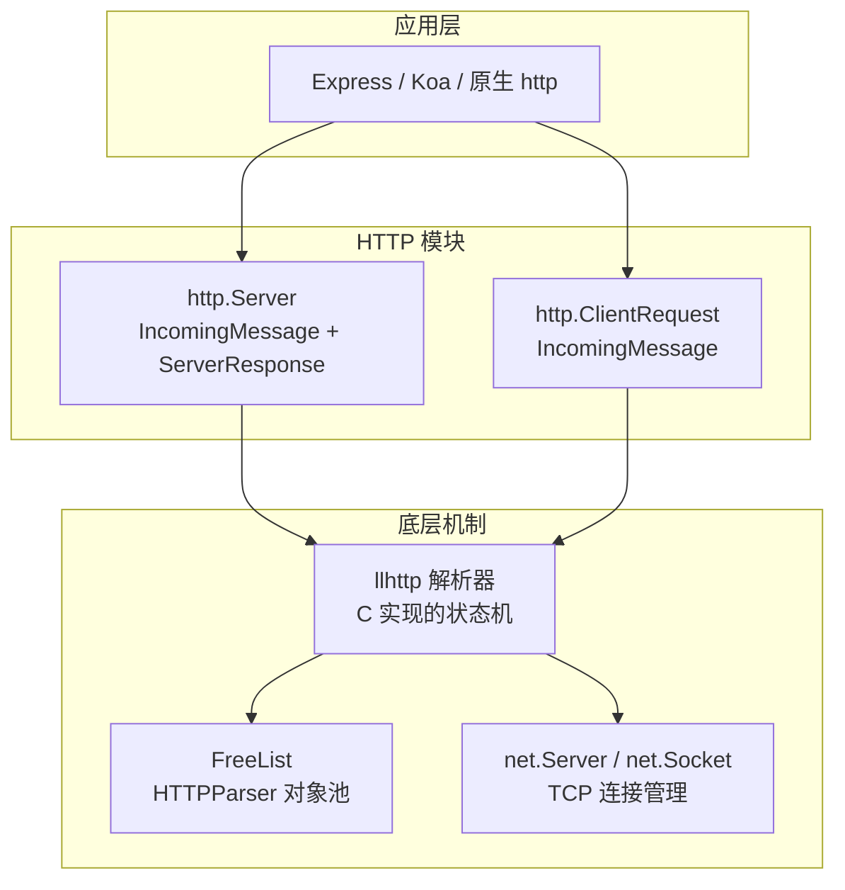
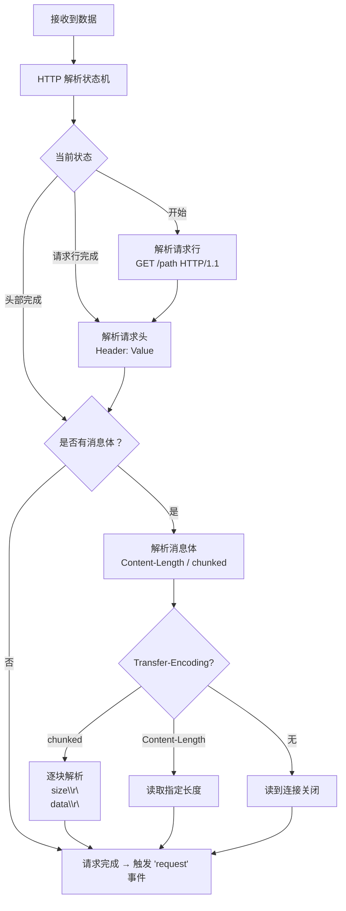
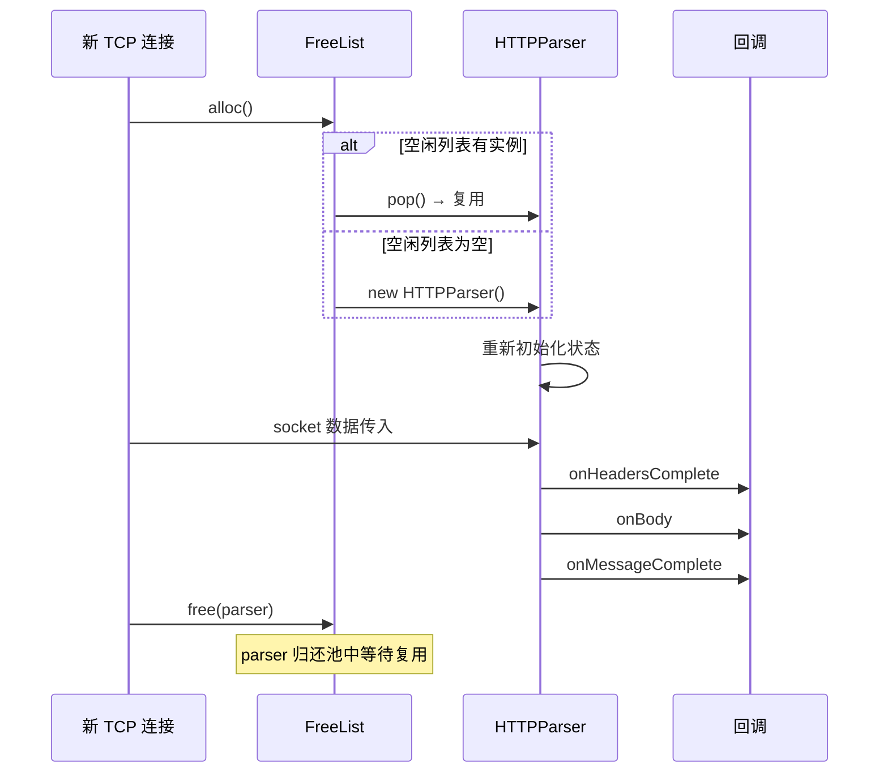
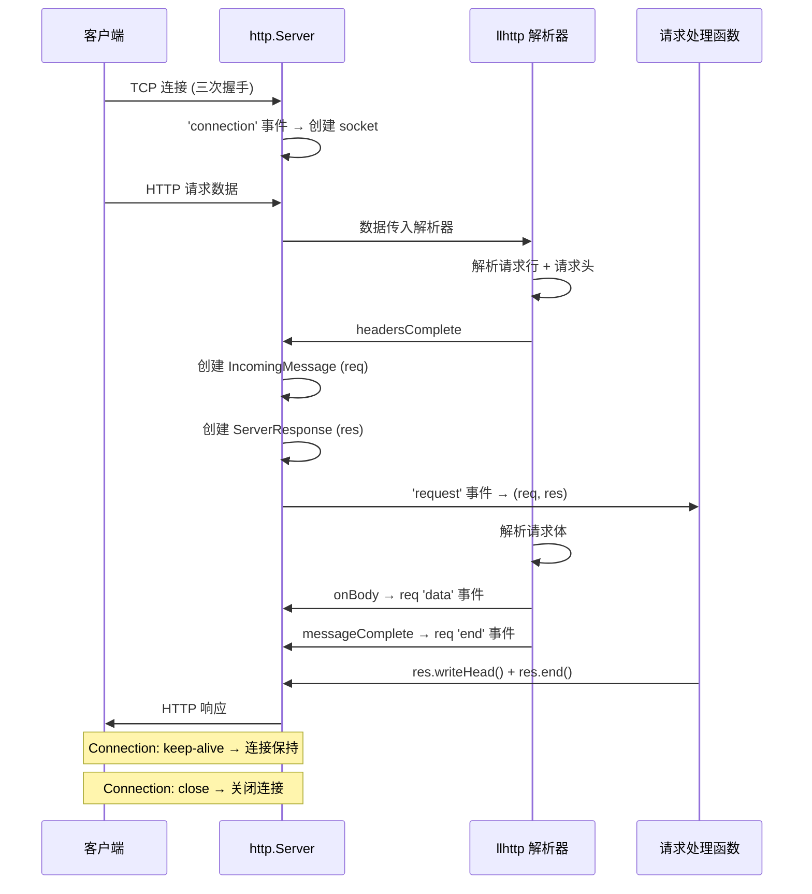
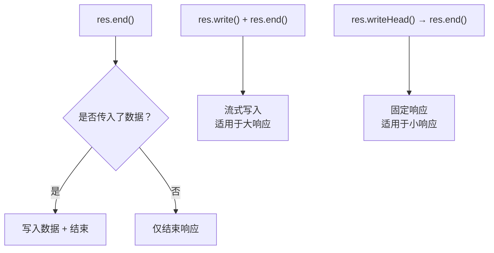
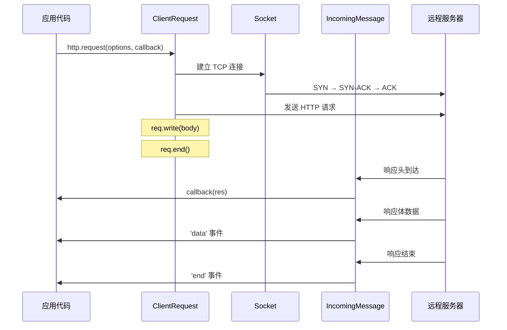
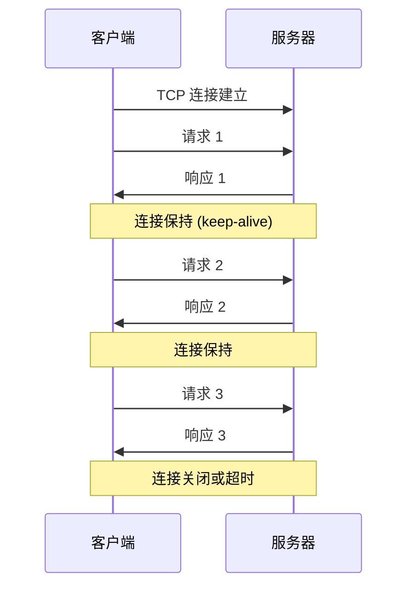
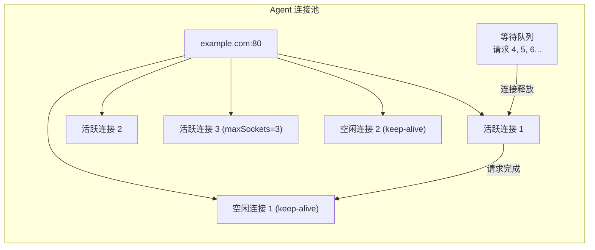

# HTTP 模块

## 概述

`http` 模块是 Node.js 网络编程的核心——它构建在 `net` 模块（TCP）之上，实现了 HTTP/1.1 协议的完整解析与生成能力。从底层的 HTTP 解析器（llhttp）到高层的 `http.Server` / `http.ClientRequest`，http 模块的架构体现了 Node.js "薄封装、大生态"的设计哲学。



## HTTP 解析器架构：llhttp

### 从 http-parser 到 llhttp

Node.js 早期使用 Ryan Dahl 编写的 `http-parser`（C 语言），后来因维护困难和性能瓶颈，于 v12.0.0 切换为 `llhttp`——一个基于 TypeScript 生成 C 代码的 HTTP 解析器：

| 维度 | http-parser | llhttp |
|------|------------|--------|
| 语言 | C（手写） | TypeScript → C（代码生成） |
| 状态机 | 手动实现 | 自动生成 |
| 维护性 | 差（大量宏） | 好（类型安全） |
| 性能 | 基准 | ~20% 更快 |
| 安全性 | 多个 CVE | 更好的边界检查 |

> 注：表中性能数据为社区测试的粗略量级，实际表现因报文大小与负载而异。

### llhttp 的状态机

llhttp 本质是一个**有限状态机**，逐字节解析 HTTP 报文：



> 注意：`'request'` 事件在请求行与请求头解析完成后即触发（此时可开始流式读取请求体），不必等消息体解析完毕。

### HTTPParser 对象池 — FreeList

Node.js 使用 **FreeList** 模式复用 HTTPParser 实例，避免频繁的 C++ 对象创建/销毁：

```javascript
// 简化的 FreeList 实现
class FreeList {
  constructor(name, max, ctor) {
    this.name = name;
    this.ctor = ctor;
    this.max = max;
    this.list = [];  // 空闲列表
  }

  alloc() {
    if (this.list.length > 0) {
      return this.list.pop();  // 复用已有实例
    }
    return new this.ctor();    // 列表为空时创建新实例
  }

  free(obj) {
    if (this.list.length < this.max) {
      this.list.push(obj);    // 归还到池中
    }
    // 超出 max 则丢弃（GC 回收）
  }
}

const parsers = new FreeList('http-parser', 1000, HTTPParser); // HTTPParser 为 Node 内部解析器类，此处仅示意
```



## HTTP 服务端

### 基本创建

```javascript
const http = require('http');

const server = http.createServer((req, res) => {
  res.writeHead(200, { 'Content-Type': 'text/plain' });
  res.end('Hello World\n');
});

server.listen(3000, () => {
  console.log('Server running on port 3000');
});
```

### 请求生命周期



### IncomingMessage — 请求对象

`IncomingMessage` 继承自 `Readable` Stream：

```javascript
const server = http.createServer((req, res) => {
  // 请求行
  req.method;       // 'GET'
  req.url;          // '/path?query=value'
  req.httpVersion;  // '1.1'

  // 请求头
  req.headers;      // { 'content-type': 'application/json', ... }
  req.rawHeaders;   // ['Content-Type', 'application/json', ...]（原始顺序）

  // 请求体（Readable Stream）
  const chunks = [];
  req.on('data', (chunk) => chunks.push(chunk));
  req.on('end', () => {
    const body = Buffer.concat(chunks).toString();
    console.log(body);
  });
});
```

### ServerResponse — 响应对象

`ServerResponse` 继承自 `Writable` Stream：

```javascript
// 设置状态码和响应头
res.statusCode = 200;
res.setHeader('Content-Type', 'application/json');
res.setHeader('X-Custom', 'value');

// 写入响应头（不可更改）
res.writeHead(200, {
  'Content-Type': 'application/json',
  'Set-Cookie': ['type=ninja', 'lang=js'],
});

// 写入响应体
res.write('{"data":');
res.write('"hello"}');
res.end();  // 结束响应

// 简写
res.end(JSON.stringify({ data: 'hello' }));
```

### 响应体的三种模式



#### 1. 固定响应（小数据）

```javascript
res.writeHead(200, { 'Content-Type': 'text/html' });
res.end('<h1>Hello</h1>');
```

#### 2. 流式响应（大数据）

```javascript
const fs = require('fs');

res.writeHead(200, { 'Content-Type': 'application/octet-stream' });
fs.createReadStream('large-file.bin').pipe(res);
```

#### 3. Server-Sent Events

```javascript
res.writeHead(200, {
  'Content-Type': 'text/event-stream',
  'Cache-Control': 'no-cache',
  'Connection': 'keep-alive',
});

setInterval(() => {
  res.write(`data: ${JSON.stringify({ time: Date.now() })}\n\n`);
}, 1000);
```

## HTTP 客户端

### 基本请求

```javascript
const http = require('http');

const req = http.request({
  hostname: 'example.com',
  port: 80,
  path: '/api/data',
  method: 'POST',
  headers: {
    'Content-Type': 'application/json',
  },
}, (res) => {
  console.log(`状态码: ${res.statusCode}`);
  console.log(`响应头: ${JSON.stringify(res.headers)}`);

  let data = '';
  res.on('data', (chunk) => { data += chunk; });
  res.on('end', () => { console.log(data); });
});

req.write(JSON.stringify({ key: 'value' }));
req.end();
```

### GET 请求简写

```javascript
http.get('http://example.com/api/data', (res) => {
  let data = '';
  res.on('data', (chunk) => { data += chunk; });
  res.on('end', () => { console.log(data); });
}).on('error', (err) => {
  console.error(`请求错误: ${err.message}`);
});
```

### 请求生命周期



### 请求超时与错误处理

```javascript
const req = http.request(options, callback);

// 连接超时
req.setTimeout(5000, () => {
  req.destroy(new Error('Connection timeout'));
});

// 错误处理
req.on('error', (err) => {
  if (err.code === 'ECONNREFUSED') {
    console.error('连接被拒绝');
  } else if (err.code === 'ETIMEDOUT') {
    console.error('连接超时');
  } else {
    console.error(err.message);
  }
});

req.end();
```

## Keep-Alive 与连接复用

HTTP/1.1 默认启用 Keep-Alive，同一个 TCP 连接可以发送多个请求：



```javascript
// 服务端 Keep-Alive 配置
const server = http.createServer((req, res) => {
  res.writeHead(200, {
    'Connection': 'keep-alive',
    'Keep-Alive': 'timeout=5, max=100',
  });
  res.end('OK');
});

server.keepAliveTimeout = 5000;   // 空闲超时（默认 5s）
server.maxRequestsPerSocket = 100; // 每个连接最大请求数
```

```javascript
// 客户端 Keep-Alive
const agent = new http.Agent({
  keepAlive: true,
  keepAliveMsecs: 1000,
  maxSockets: Infinity,
  maxFreeSockets: 256,
  timeout: 5000,
});

const req = http.request({
  hostname: 'example.com',
  agent,  // 使用自定义 Agent
}, callback);
```

## Agent — 连接池管理

`http.Agent` 管理客户端的连接池，控制每个 origin 的并发连接数：



```javascript
const agent = new http.Agent({
  maxSockets: 10,          // 每个 origin 最大并发连接数
  maxFreeSockets: 5,       // 每个 origin 最大空闲连接数
  keepAlive: true,         // 启用 Keep-Alive
  keepAliveMsecs: 1000,    // TCP Keep-Alive 探测的初始延迟（毫秒）
  timeout: 30000,          // socket 超时
  scheduling: 'lifo',      // 调度策略：lifo（默认）/ fifo
});
```

| 参数 | 默认值 | 说明 |
|------|--------|------|
| `maxSockets` | `Infinity` | 每个 origin 的最大并发连接 |
| `maxFreeSockets` | `256` | 每个 origin 的最大空闲连接 |
| `keepAlive` | `false` | 是否复用连接 |
| `scheduling` | `'lifo'` | LIFO 倾向复用最近使用的连接 |

## Chunked Transfer Encoding

当不知道响应体大小时，使用 **分块传输编码**：

```javascript
// ⚠️ 以下仅示意 chunked 的报文在线路上的样子；实际代码不要手写块大小，
// Node 会为 res.write() 的每次写入自动添加分块帧
res.writeHead(200, {
  'Transfer-Encoding': 'chunked',
  'Content-Type': 'text/plain',
});

// 写入分块
res.write('3\r\n');       // 块大小（十六进制）
res.write('hel\r\n');     // 块数据
res.write('2\r\n');
res.write('lo\r\n');
res.write('0\r\n');       // 结束块
res.write('\r\n');
res.end();
```

实际上 `res.write()` + `res.end()` 会自动处理 chunked 编码——当没有设置 `Content-Length` 时，Node.js 自动使用 chunked。

## 常见陷阱

### 1. 未消费请求体导致连接挂起

```javascript
// ❌ 未读取请求体，连接不会释放
server.on('request', (req, res) => {
  res.end('ok');
  // 如果客户端发送了 body，但服务端没读，连接可能挂起
});

// ✅ 始终消费请求体
server.on('request', (req, res) => {
  req.resume();  // 丢弃请求体
  res.end('ok');
});
```

### 2. 忘记调用 res.end

```javascript
// ❌ 响应永远不会结束，客户端一直等待
server.on('request', (req, res) => {
  res.write('hello');
  // 忘记调用 res.end()
});

// ✅ 始终调用 res.end()
server.on('request', (req, res) => {
  res.end('hello');
});
```

### 3. 请求体大小无限制导致 OOM

```javascript
// ❌ 无限制地缓存请求体
const chunks = [];
req.on('data', (chunk) => chunks.push(chunk));

// ✅ 限制请求体大小
const MAX_BODY = 1e6;  // 1MB
let bodySize = 0;
req.on('data', (chunk) => {
  bodySize += chunk.length;
  if (bodySize > MAX_BODY) {
    res.writeHead(413, { 'Connection': 'close' });
    res.end('Payload too large');
    req.destroy();
    return;
  }
  chunks.push(chunk);
});
```

### 4. HTTP Agent 的连接泄漏

```javascript
// ❌ 使用了 keep-alive Agent 但未正确清理
const agent = new http.Agent({ keepAlive: true });

// ✅ 在适当时候销毁 Agent
process.on('SIGTERM', () => {
  agent.destroy();
  server.close();
});
```
