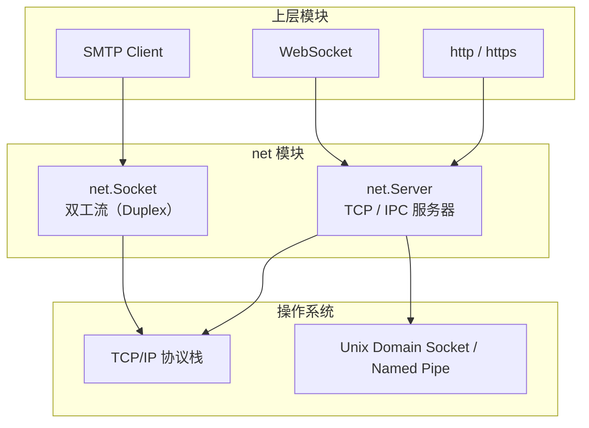
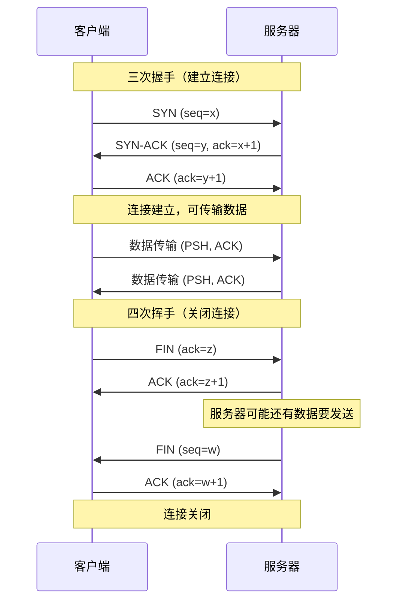
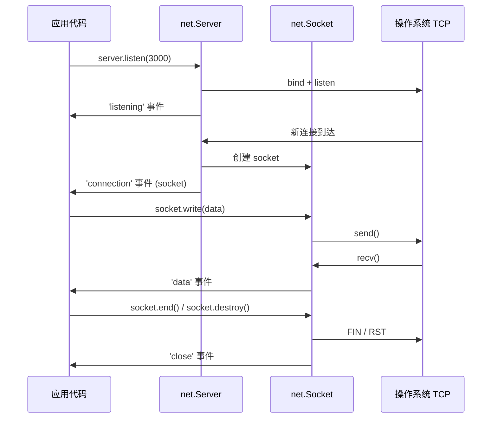
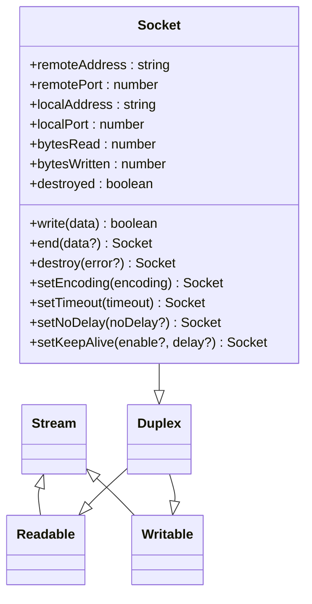
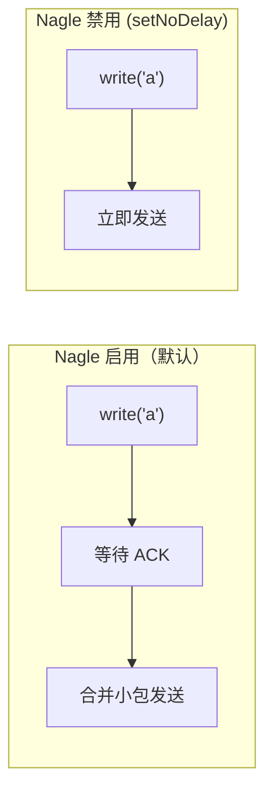
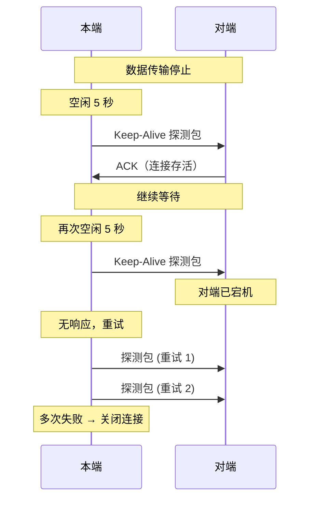
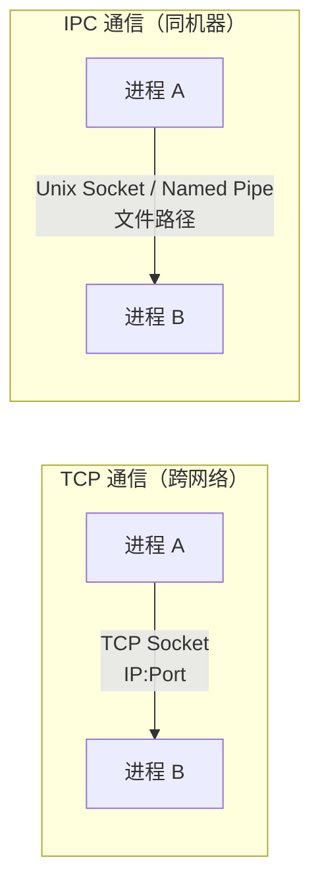
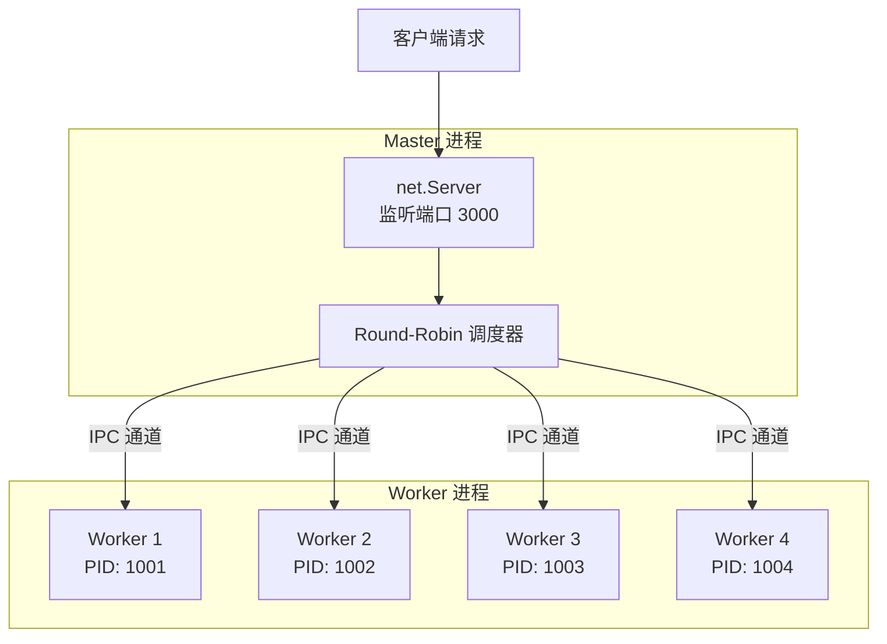
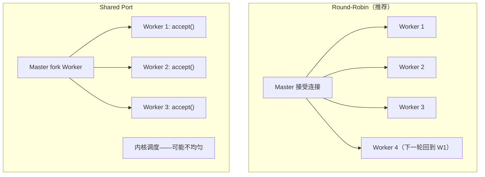
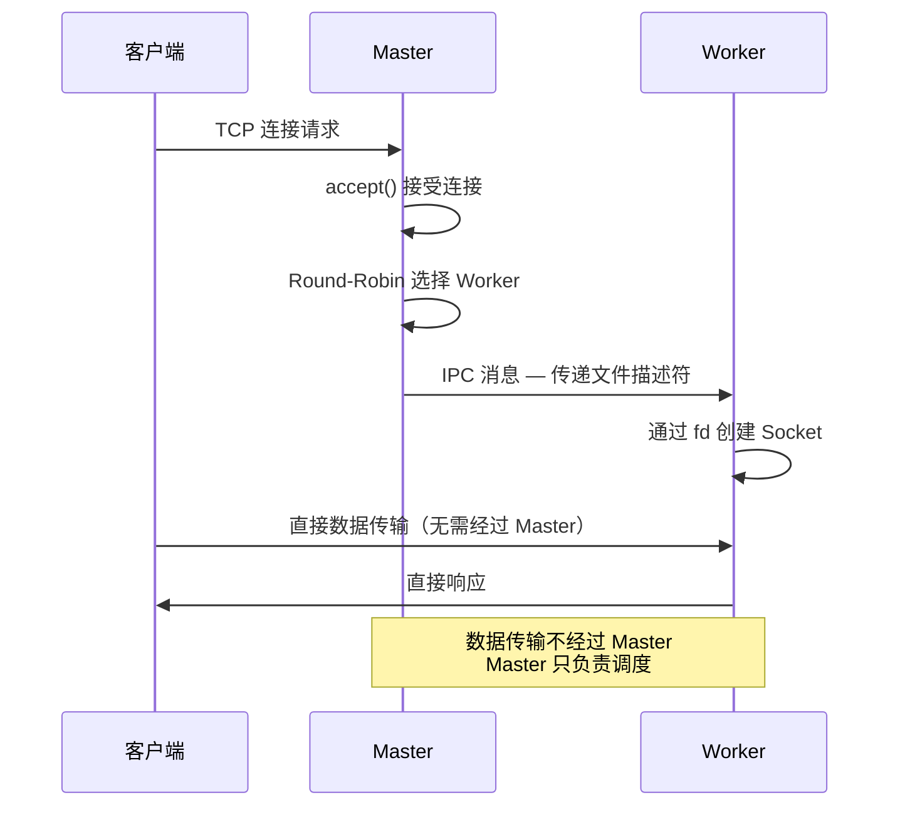

# Net 模块

## 概述

`net` 模块是 Node.js 网络层的基石，提供异步的 TCP 和 IPC（进程间通信）能力。`http`、`https`、`ws` 等上层模块都构建在 `net` 之上。理解 `net` 模块，就是理解 Node.js 网络编程的最底层机制——TCP 连接管理、Socket 生命周期、IPC 通道、Cluster 架构等。



## TCP 连接生命周期

### 三次握手与四次挥手



### Node.js 中的映射



## net.Server — TCP 服务器

### 创建服务器

```javascript
const net = require('net');

const server = net.createServer((socket) => {
  console.log(`新连接: ${socket.remoteAddress}:${socket.remotePort}`);

  socket.on('data', (data) => {
    console.log(`收到数据: ${data}`);
    socket.write(`Echo: ${data}`);
  });

  socket.on('end', () => {
    console.log('客户端断开连接');
  });

  socket.on('error', (err) => {
    console.error('Socket 错误:', err.message);
  });
});

server.listen(3000, () => {
  console.log(`服务器监听 ${JSON.stringify(server.address())}`);
});
```

### Server 事件

| 事件 | 触发时机 | 回调参数 |
|------|---------|---------|
| `listening` | 服务器开始监听 | 无 |
| `connection` | 新连接建立 | `socket` |
| `close` | 服务器关闭 | 无 |
| `error` | 服务器错误 | `Error` |

### Server 配置

```javascript
const server = net.createServer({
  allowHalfOpen: false,    // 半关闭模式（默认 false）
  pauseOnConnect: false,   // 连接时暂停 socket（默认 false）
  keepAlive: true,         // 启用 TCP Keep-Alive
  keepAliveInitialDelay: 5000,  // 首次探测延迟
});

server.maxConnections = 1000;  // 最大连接数
server.getConnections((err, count) => {
  console.log(`当前连接数: ${count}`);
});
```

## net.Socket — 双工连接

`net.Socket` 是 `Duplex` Stream 的子类，同时可读可写：



### Socket 事件

| 事件 | 触发时机 | 回调参数 |
|------|---------|---------|
| `data` | 收到数据 | `Buffer` |
| `end` | 对端发送 FIN | 无 |
| `close` | 连接完全关闭 | `hadError` |
| `error` | 发生错误 | `Error` |
| `timeout` | 连接超时 | 无 |
| `connect` | 客户端连接成功 | 无 |
| `drain` | 写缓冲区清空 | 无 |

### Nagle 算法与 setNoDelay

TCP 默认启用 **Nagle 算法**——将小数据包合并发送以减少网络开销。但这会增加延迟：



```javascript
// 禁用 Nagle 算法 — 适用于需要低延迟的场景
socket.setNoDelay(true);

// 实时游戏、SSH、Redis 协议等需要禁用 Nagle
// HTTP、文件传输等可以保持默认
```

### TCP Keep-Alive

```javascript
// 启用 TCP Keep-Alive
socket.setKeepAlive(true, 5000);  // 空闲 5 秒后开始发送探测包（后续探测间隔由系统 tcp_keepalive_intvl 决定）

// Keep-Alive 探测机制
// 1. 空闲 5 秒后发送探测包
// 2. 对端无响应 → 重试
// 3. 多次无响应 → 关闭连接
```



## TCP 客户端

```javascript
const net = require('net');

const client = net.createConnection({
  host: 'example.com',
  port: 80,
}, () => {
  console.log('连接到服务器');
  client.write('GET / HTTP/1.1\r\nHost: example.com\r\n\r\n');
});

client.on('data', (data) => {
  console.log(data.toString());
  client.end();
});

client.on('end', () => {
  console.log('断开连接');
});

client.on('error', (err) => {
  console.error('连接错误:', err.message);
});
```

## IPC — 进程间通信

`net` 模块除了 TCP，还支持 **IPC（Inter-Process Communication）**，通过 Unix Domain Socket（Linux/macOS）或 Named Pipe（Windows）实现同机进程间的高效通信：



### IPC 服务器

```javascript
const server = net.createServer((socket) => {
  socket.on('data', (data) => {
    console.log('IPC 收到:', data.toString());
  });
});

// Linux/macOS: Unix Domain Socket
server.listen('/tmp/node-ipc.sock');

// Windows: Named Pipe
// server.listen('\\\\.\\pipe\\node-ipc');
```

### IPC 客户端

```javascript
const client = net.createConnection('/tmp/node-ipc.sock', () => {
  client.write('Hello from client');
});
```

### IPC 与 TCP 的性能对比

| 维度 | TCP | IPC (Unix Socket) |
|------|-----|-------------------|
| 传输路径 | 网络协议栈 | 内核内存拷贝 |
| 延迟 | 较高 | 极低 |
| 吞吐量 | 受网络限制 | 接近内存速度 |
| 安全性 | 需防火墙 | 文件系统权限 |
| 跨机器 | ✅ | ❌ |

## Cluster — 多进程架构

`cluster` 模块利用 IPC 通道实现多进程架构——Master 进程监听端口，通过轮询将连接分发给 Worker 进程：



### Cluster 工作原理

```javascript
const cluster = require('cluster');
const http = require('http');
const numCPUs = require('os').cpus().length;

if (cluster.isPrimary) {
  console.log(`Master ${process.pid} 运行中`);

  // Fork Worker 进程
  for (let i = 0; i < numCPUs; i++) {
    cluster.fork();
  }

  cluster.on('exit', (worker, code, signal) => {
    console.log(`Worker ${worker.process.pid} 退出，重启中...`);
    cluster.fork();  // 自动重启
  });
} else {
  http.createServer((req, res) => {
    res.writeHead(200);
    res.end(`Worker ${process.pid} 处理了此请求\n`);
  }).listen(3000);

  console.log(`Worker ${process.pid} 启动`);
}
```

### 两种调度策略

| 策略 | 说明 | 平台默认 |
|------|------|---------|
| **Round-Robin** | Master 轮询分发连接给 Worker | Linux/macOS |
| **Shared Port** | 所有 Worker 共享同一个端口，内核决定分配 | Windows |



```javascript
// 显式设置调度策略
cluster.schedulingPolicy = cluster.SCHED_RR;   // Round-Robin
cluster.schedulingPolicy = cluster.SCHED_NONE;  // Shared Port
```

### Worker 间通信

```javascript
// Master → Worker
worker.send({ type: 'config', data: { port: 3000 } });

// Worker → Master
process.send({ type: 'ready', pid: process.pid });

// Master 监听 Worker 消息
worker.on('message', (msg) => {
  if (msg.type === 'ready') {
    console.log(`Worker ${msg.pid} 已就绪`);
  }
});
```

### 连接分发流程



> **关键点**：Round-Robin 模式下，连接的**接受**由 Master 完成，但建立后的**数据传输**直接在 Worker 和客户端之间进行，不经过 Master 转发——这是通过传递文件描述符（fd）实现的。

## 常见陷阱

### 1. TCP 粘包问题

TCP 是流式协议，不保证消息边界：

```javascript
// 发送方
socket.write('Hello');
socket.write('World');

// 接收方可能收到
// 情况1: 'Hello' 和 'World' 分两次 data 事件
// 情况2: 'HelloWorld' 一次 data 事件（粘包）
```

**解决方案**：在应用层定义消息边界

```javascript
// 方案1：固定长度
// 每条消息固定 64 字节

// 方案2：分隔符
socket.write('Hello\n');
socket.write('World\n');

// 方案3：长度前缀（推荐）
function sendMessage(socket, data) {
  const payload = Buffer.from(data);
  const header = Buffer.alloc(4);
  header.writeUInt32BE(payload.length, 0);
  socket.write(Buffer.concat([header, payload]));
}

function receiveMessage(socket) {
  let buffer = Buffer.alloc(0);
  socket.on('data', (chunk) => {
    buffer = Buffer.concat([buffer, chunk]);
    while (buffer.length >= 4) {
      const len = buffer.readUInt32BE(0);
      if (buffer.length < 4 + len) break;
      const message = buffer.subarray(4, 4 + len).toString();
      console.log('收到消息:', message);
      buffer = buffer.subarray(4 + len);
    }
  });
}
```

### 2. socket.write 返回 false 后未等 drain

```javascript
// ❌ 持续写入可能耗尽内存（示意：dataToWrite/nextChunk() 为业务数据来源）
while (dataToWrite) {
  socket.write(dataToWrite);
}

// ✅ 处理背压：write 返回 false 时等待 drain 再继续写
function writeData(socket, data) {
  const ok = socket.write(data);
  if (!ok) {
    socket.once('drain', () => {
      writeData(socket, nextChunk());  // nextChunk()：获取下一块待写数据
    });
  }
}
```

### 3. 未处理 socket 错误导致进程崩溃

```javascript
// ❌ 未监听 error 事件
const socket = net.createConnection(3000);
// 如果连接失败 → Uncaught Error → 进程崩溃

// ✅ 始终监听 error
socket.on('error', (err) => {
  console.error('Socket error:', err.message);
});
```

### 4. TIME_WAIT 状态导致端口占用

```javascript
// 服务端重启时，端口上残留的 TIME_WAIT 连接可能导致绑定失败
server.listen(3000);  // 可能抛出 EADDRINUSE

// 解决：Node 的 net.Server 默认已设置 SO_REUSEADDR（地址复用，可绑定存在 TIME_WAIT 的端口），
// 正常重启即可；若仍报 EADDRINUSE，通常是端口被其他进程占用，可用重试逻辑兜底
server.on('error', (err) => {
  if (err.code === 'EADDRINUSE') {
    setTimeout(() => server.listen(3000), 1000);
  }
});

server.listen(3000, () => {
  // ...
});
```
