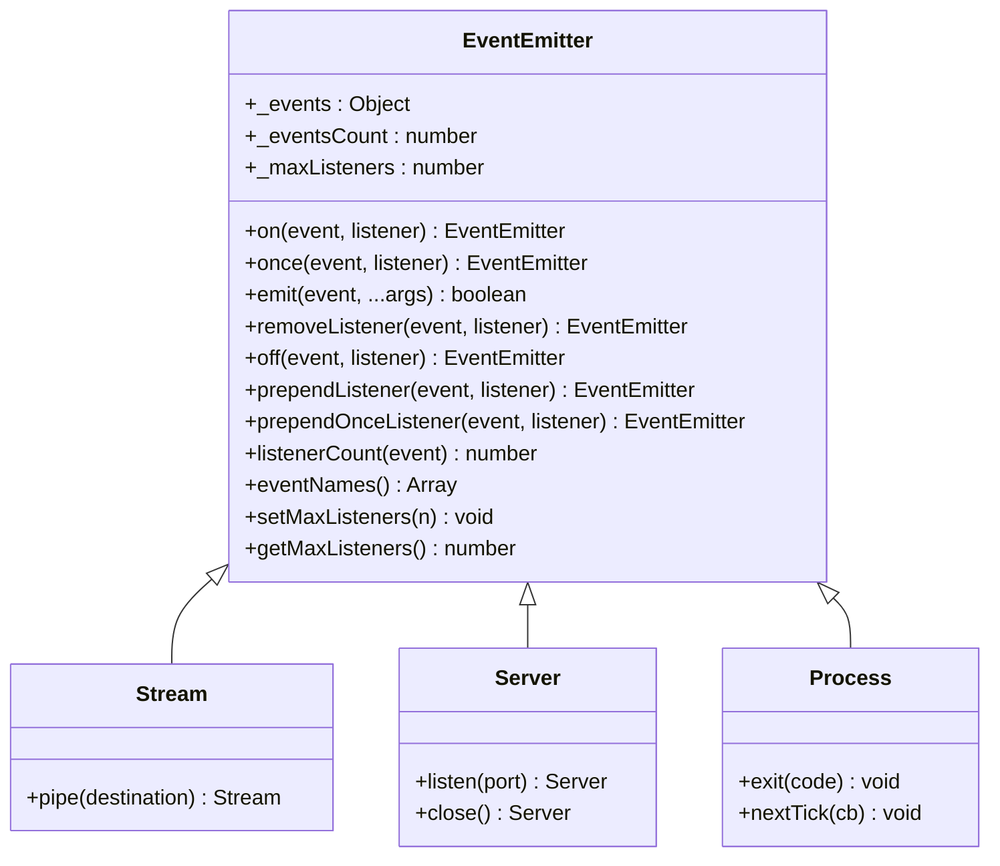
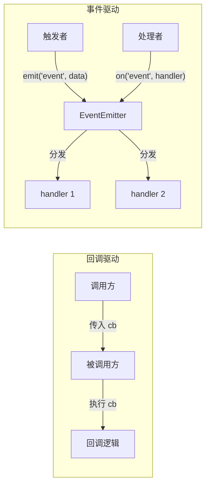
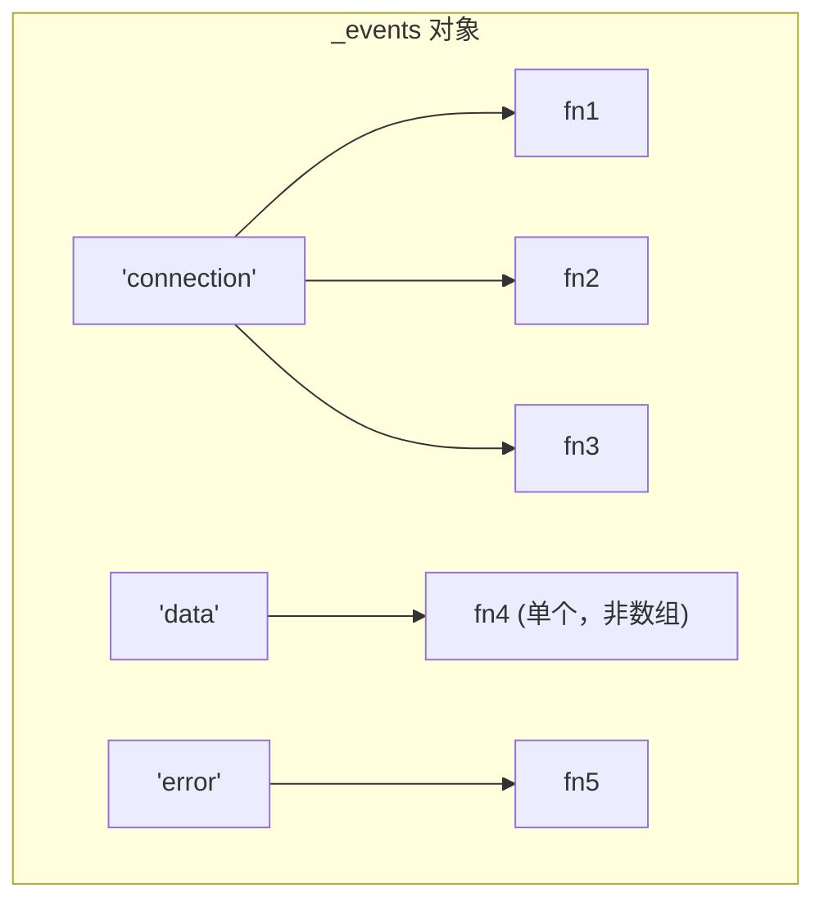
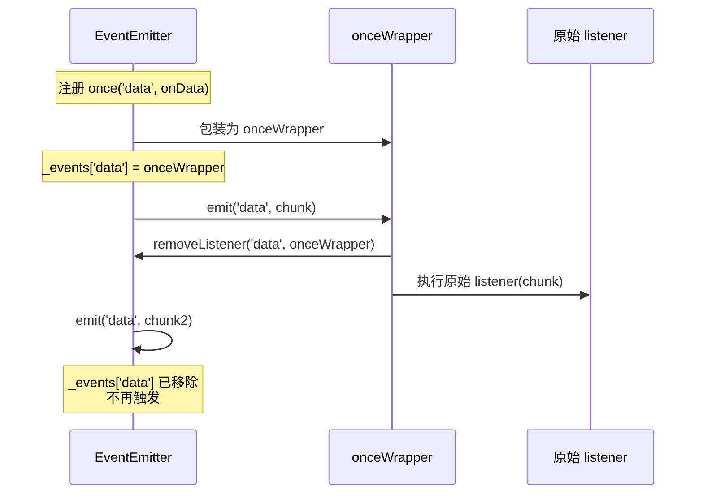
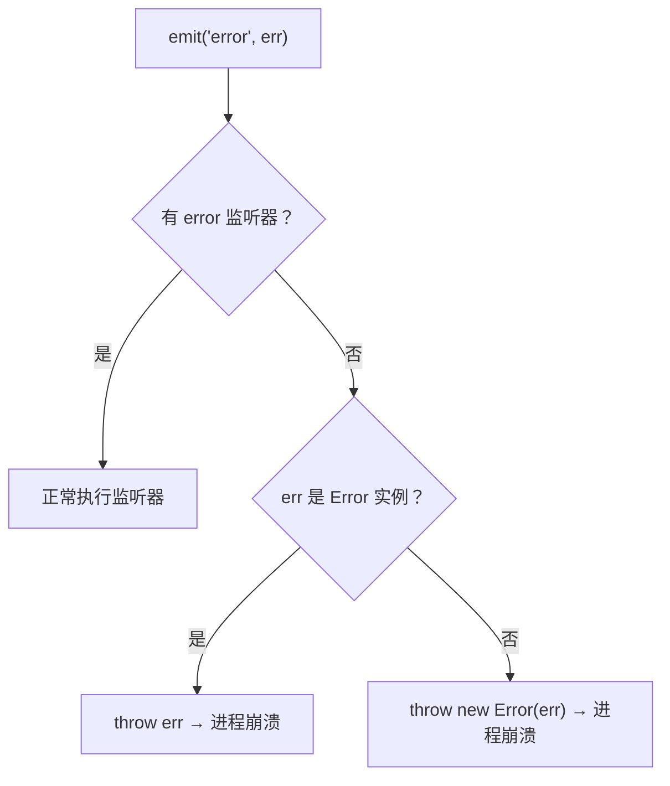
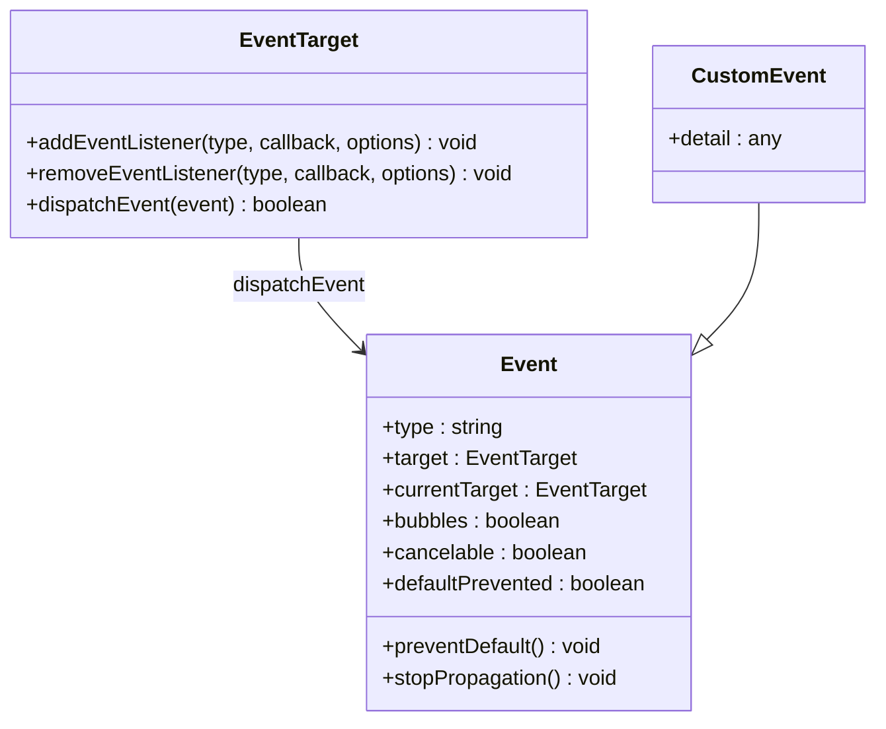
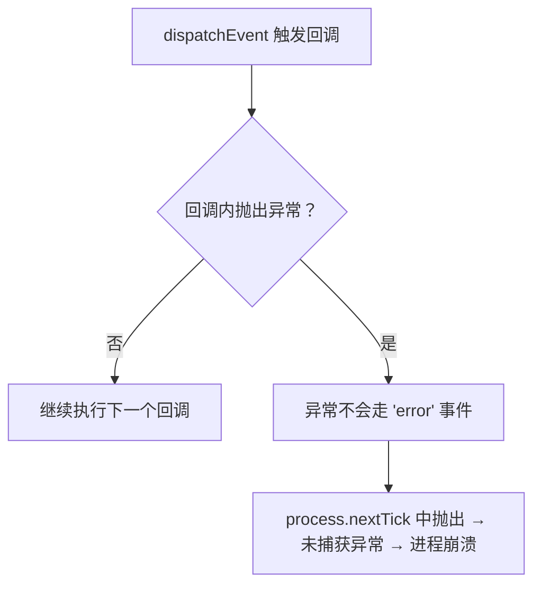
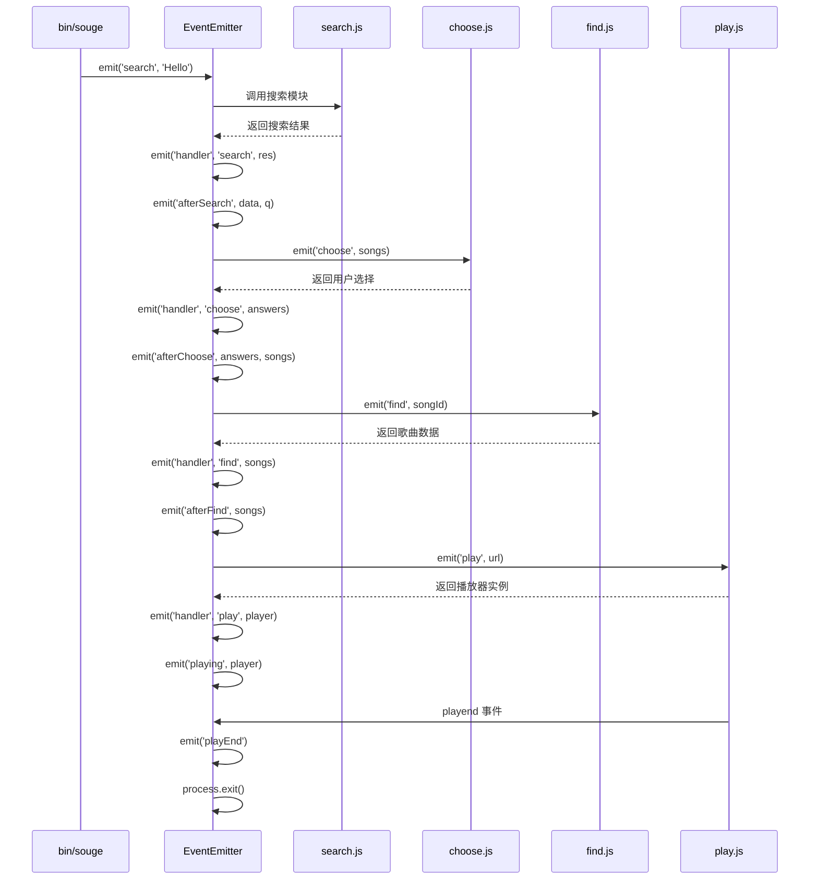

# Events 模块

## 概述

`events` 模块是 Node.js 事件驱动架构的基石。`EventEmitter` 是观察者模式的核心实现——几乎所有 Node.js 核心 API（Stream、Server、Process 等）都继承自它。Node.js v15.4.0 起，`events` 模块还引入了 `EventTarget`——WHATWG 规范定义的浏览器标准事件接口，标志着 Node.js 与 Web 平台的进一步融合。



## 回调驱动与事件驱动

### 回调驱动的本质

回调（Callback）是异步编程中最基础的控制流机制——将后续逻辑封装为函数参数，由被调用方在适当时机执行，实现**控制权的转移**：

```javascript
function doSomething(thing) {
  console.log(thing);
}

function comeTo(place, cb) {
  const thing = '到 ' + place + ' 学习 Node';
  cb(thing);
}

comeTo('Juejin', doSomething);
// 到 Juejin 学习 Node
```

回调模式的特征在于：调用方将回调函数作为参数传递，被调用方决定何时执行该回调。这种"控制权反转"是 Node.js 异步编程的基础，HTTP 服务器的请求处理即是典型应用：

```javascript
require('http').createServer((req, res) => {
  res.write('Hi');
  res.end();
}).listen(3333, '127.0.0.1', () => {});
```

### 事件驱动的本质

当回调函数与事件机制结合——即某个事件发生时才调用回调函数——这种执行方式即为**事件驱动（Event-Driven）**。与纯回调模式不同，事件驱动通过事件名解耦了触发者与处理者：



| 维度 | 回调驱动 | 事件驱动 |
|------|---------|---------|
| 耦合方式 | 调用方直接传递回调 | 通过事件名间接关联 |
| 一对多 | 一个回调只能对应一个处理逻辑 | 一个事件可注册多个监听器 |
| 扩展性 | 新增逻辑需修改调用链 | 新增监听器即可，无需改动已有代码 |
| 控制流 | 线性：嵌套回调组成链式流程 | 扇形：事件分发至多个独立处理器 |
| 典型场景 | 单次异步操作（文件读取） | 多状态流程管理（连接、数据流） |

Node.js 中的大量核心模块（`net.Server`、`fs.ReadStream` 等）均采用事件驱动模式，所有具备事件触发能力的对象都是 `EventEmitter` 的实例。

## EventEmitter 源码解析

### 核心数据结构

EventEmitter 的核心是 `_events` 对象——一个以事件名为键、监听器为值的哈希表：

```javascript
// EventEmitter 内部结构
{
  _events: {
    'connection': [fn1, fn2, fn3],  // 多个监听器存储为数组
    'data': fn4,                     // 单个监听器直接存储为函数
    'error': [fn5],                  // error 事件有特殊处理
  },
  _eventsCount: 4,                   // 已注册事件的数量
  _maxListeners: undefined,          // 单事件最大监听器数（默认 10）
}
```



### on / addListener — 注册监听器

```javascript
EventEmitter.prototype.on = function on(type, listener) {
  // 检查 listener 是否为函数
  if (typeof listener !== 'function') {
    throw new TypeError('The "listener" argument must be of type Function');
  }

  // 首次注册：直接存储函数
  if (!this._events[type]) {
    this._events[type] = listener;
    this._eventsCount++;
  }
  // 已有单个监听器：转为数组
  else if (typeof this._events[type] === 'function') {
    this._events[type] = [this._events[type], listener];
  }
  // 已有多个监听器：追加到数组
  else {
    this._events[type].push(listener);
  }

  // 超过 maxListeners 警告
  const existing = this._events[type];
  if (Array.isArray(existing) && existing.length > this.getMaxListeners()) {
    process.emitWarning(
      `Possible EventEmitter memory leak detected. ${existing.length} ${type} listeners added.`
    );
  }

  return this;
};
```

### emit — 触发事件

```javascript
EventEmitter.prototype.emit = function emit(type, ...args) {
  // 处理 error 事件无监听器的情况
  if (type === 'error' && !this._events.error) {
    const err = args[0] instanceof Error ? args[0] : new Error(args[0]);
    throw err;  // 无 error 监听器 → 抛出异常 → 进程崩溃
  }

  const handler = this._events[type];
  if (!handler) return false;  // 无监听器

  switch (args.length) {
    case 0:
      if (typeof handler === 'function') handler.call(this);
      else handler.forEach(fn => fn.call(this));
      break;
    case 1:
      if (typeof handler === 'function') handler.call(this, args[0]);
      else handler.forEach(fn => fn.call(this, args[0]));
      break;
    // ... 最多优化到 3 个参数的 fast path
    default:
      if (typeof handler === 'function') handler.apply(this, args);
      else handler.forEach(fn => fn.apply(this, args));
  }

  return true;
};
```

> **性能优化细节**：`emit` 对 0–3 个参数做了 fast path 优化（`call` 代替 `apply`），因为大部分事件回调参数不超过 3 个。这是一个微观优化，但在高频事件场景（如 `data` 事件）中能减少 `apply` 的调用开销。

### once — 一次性监听器

`once` 的实现并非简单地在回调后 `removeListener`，而是用了一个 **wrap 函数**来保证原子性：

```javascript
EventEmitter.prototype.once = function once(type, listener) {
  function onceWrapper(...args) {
    // 先移除自身，再执行回调
    this.removeListener(type, onceWrapper);
    Reflect.apply(listener, this, args);
  }

  onceWrapper.listener = listener;  // 保存原始回调，用于 removeListener
  this.on(type, onceWrapper);
  return this;
};
```



### removeListener — 朴素的 O(n) 删除

```javascript
EventEmitter.prototype.removeListener = function removeListener(type, listener) {
  const list = this._events[type];
  if (!list) return this;

  if (list === listener || list.listener === listener) {
    // 单个监听器 → 直接删除键
    this._events[type] = undefined;
    this._eventsCount--;
  } else if (Array.isArray(list)) {
    // 数组中查找 → 逐个比较引用
    for (let i = list.length - 1; i >= 0; i--) {
      if (list[i] === listener || list[i].listener === listener) {
        list.splice(i, 1);
        if (list.length === 0) {
          this._events[type] = undefined;
          this._eventsCount--;
        }
        break;
      }
    }
  }

  return this;
};
```

> **注意**：`removeListener` 在监听器数组中使用 `splice` 删除，这是 O(n) 操作。在高频注册/注销场景下，应考虑使用其他模式（如 `once` 或标志位控制）。

## error 事件的特殊处理

`error` 事件是 EventEmitter 中**唯一有内置特殊行为**的事件——如果没有注册 `error` 监听器，emit error 会抛出异常并终止进程：



```javascript
const { EventEmitter } = require('events');

// ❌ 致命：未处理 error 事件
const ee = new EventEmitter();
ee.emit('error', new Error('something went wrong'));
// Uncaught Error: something went wrong → 进程退出

// ✅ 正确：始终注册 error 监听器
ee.on('error', (err) => {
  console.error('Error caught:', err.message);
});
```

### events.errorMonitor

Node.js v13.6.0 引入了 `events.errorMonitor`，允许在不干扰正常 error 处理的情况下监控所有 error 事件：

```javascript
const events = require('events');
const ee = new events.EventEmitter();

ee.on(events.errorMonitor, (err) => {
  // 监控所有 error，但不消费它们
  monitoringSystem.report(err); // monitoringSystem 为监控服务（示意）
});
ee.on('error', (err) => {
  // 正常的 error 处理
  console.error(err);
});
```

## maxListeners 与内存泄漏检测

默认情况下，单个事件的监听器超过 **10** 个时会打印警告：

```javascript
const { EventEmitter } = require('events');

const ee = new EventEmitter();
for (let i = 0; i < 11; i++) {
  ee.on('event', () => {});
}
// (node:12345) MaxListenersExceededWarning: Possible EventEmitter memory leak detected.
// 11 event listeners added to [EventEmitter]. Use emitter.setMaxListeners() to increase limit
```

```javascript
// 设置最大监听器数
ee.setMaxListeners(20);
ee.getMaxListeners();  // 20

// 全局默认值
EventEmitter.defaultMaxListeners = 15;
```

> **注意**：`setMaxListeners` 应在注册监听器之前调用。`EventEmitter.defaultMaxListeners` 的修改会影响之后创建的所有实例。

## EventEmitter 的异步行为

EventEmitter 的 `emit` 是**同步**的——所有监听器在当前事件循环迭代中立即执行：

```javascript
const { EventEmitter } = require('events');

const ee = new EventEmitter();

ee.on('event', () => console.log('sync 1'));
ee.on('event', () => console.log('sync 2'));

console.log('before emit');
ee.emit('event');
console.log('after emit');

// 输出：
// before emit
// sync 1
// sync 2
// after emit
```

如果需要异步触发，需手动包装：

```javascript
// 方式 1：setImmediate
ee.on('event', (...args) => {
  setImmediate(() => callback(...args));
});

// 方式 2：process.nextTick
ee.on('event', (...args) => {
  process.nextTick(() => callback(...args));
});
```

## EventTarget — Web 标准事件接口

Node.js v15.4.0 引入了 `EventTarget`，这是 WHATWG DOM 标准定义的事件接口，与浏览器的 `EventTarget` 完全一致：



### EventEmitter vs EventTarget

| 维度 | EventEmitter | EventTarget |
|------|-------------|-------------|
| 规范 | Node.js 私有 | WHATWG DOM Standard |
| 回调签名 | `(arg1, arg2, ...)` | `(event: Event)` |
| 错误处理 | 无监听器时抛出异常 | 回调内错误在下一个 tick 直接抛出（不走 `error` 事件） |
| 返回值 | `emit` 返回 boolean | `dispatchEvent` 返回 boolean |
| 监听器类型 | 普通函数 | 普通函数 / 对象（handleEvent） |
| 事件对象 | 无 | `Event` 实例 |
| 捕获/冒泡 | 不支持 | 支持（options.capture） |
| once 支持 | `.once()` 方法 | `options.once: true` |
| 性能 | 高（V8 优化） | 较低（标准化开销） |

### 使用示例

```javascript
const { EventEmitter } = require('events');

// EventEmitter 风格
const ee = new EventEmitter();
ee.on('message', (data) => console.log(data));
ee.emit('message', { text: 'hello' });

// EventTarget 风格
const et = new EventTarget();
et.addEventListener('message', (event) => {
  console.log(event.detail);  // 数据在 event.detail 中
});
et.dispatchEvent(new CustomEvent('message', { detail: { text: 'hello' } }));
```

### EventTarget 的错误处理

与 `EventEmitter` 不同，全局 `EventTarget` 的监听器回调内抛出的异常**不会**被转发为 `error` 事件——即使注册了 `error` 监听器也无济于事，异常会在下一个 tick 中作为未捕获异常直接抛出并使进程崩溃：



```javascript
const et = new EventTarget();

et.addEventListener('click', () => {
  throw new Error('callback error');
});

// 注意：注册 'error' 监听器并不能捕获回调内抛出的异常
et.addEventListener('error', (event) => {
  console.error('EventTarget error:', event.error);
});

et.dispatchEvent(new Event('click'));
// dispatchEvent 正常返回，但进程随后崩溃：
// Error: callback error（未捕获异常）
// 防御方式是在监听器内部自行 try-catch
```

## NodeEventTarget — 混合模式

Node.js 还提供了 `NodeEventTarget`，它是 `EventTarget` 的扩展，融合了 `EventEmitter` 的部分特性：

- 支持 `.on()`、`.once()` 等 EventEmitter 风格 API
- 无 `error` 事件时，回调内的异常会被抛出（类似 EventEmitter）
- 同时兼容 EventTarget 的 `addEventListener`

`NodeEventTarget` 属于 Node.js 内部实现，**并未作为公开 API 导出**（无法通过 `require('internal/event_target')` 获取）。业务代码直接使用 `EventEmitter` 或全局 `EventTarget` 即可：

```javascript
const { EventEmitter } = require('events');

const ee = new EventEmitter();
ee.on('data', (chunk) => console.log('data:', chunk));
ee.emit('data', 'chunk');
```

## 实践模式

### 1. 继承 EventEmitter

```javascript
const { EventEmitter } = require('events');

class JobQueue extends EventEmitter {
  constructor(concurrency) {
    super();
    this.concurrency = concurrency;
    this.running = 0;
    this.queue = [];
  }

  push(job) {
    this.queue.push(job);
    this._run();
  }

  _run() {
    while (this.running < this.concurrency && this.queue.length) {
      const job = this.queue.shift();
      this.running++;
      job()
        .then((result) => {
          this.running--;
          this.emit('success', result);
          this._run();
        })
        .catch((err) => {
          this.running--;
          this.emit('error', err);
          this._run();
        });
    }

    if (this.running === 0 && this.queue.length === 0) {
      this.emit('drain');
    }
  }
}
```

### 2. 组合模式（Composition over Inheritance）

```javascript
class DataProcessor {
  constructor() {
    this.emitter = new EventEmitter();
  }

  on(event, listener) {
    return this.emitter.on(event, listener);
  }

  emit(event, ...args) {
    return this.emitter.emit(event, ...args);
  }

  process(data) {
    this.emitter.emit('processing', data);
    // ...处理逻辑
    const result = data; // 处理后的结果（示意）
    this.emitter.emit('done', result);
  }
}
```

### 3. AsyncIterator 与 EventEmitter

```javascript
const { on } = require('events');

// 将 EventEmitter 事件转换为 AsyncIterable
async function* watchEvents(emitter, event) {
  for await (const [data] of on(emitter, event)) {
    yield data;
  }
}

// 使用
// stream 为任意 Readable 流（示意）
for await (const chunk of watchEvents(stream, 'data')) {
  console.log(chunk);
}
```

### 4. once — Promise 化

```javascript
const { once } = require('events');
const http = require('http');

async function main() {
  const emitter = new EventEmitter();

  // 等待下一个事件
  setImmediate(() => emitter.emit('done', 'ok')); // 模拟异步完成
  const [result] = await once(emitter, 'done');

  // 等待服务器启动
  const server = http.createServer();
  server.listen(3000);
  await once(server, 'listening');
  console.log('Server is ready');
  server.close();
}

main();
```

### 5. 继承 EventEmitter 定制业务类 — 游戏积分系统

通过继承 `EventEmitter`，可以为业务类赋予事件能力，实现比硬编码方法更灵活的控制粒度。以下以游戏积分系统为例，对比传统方法模式与事件驱动模式：

**传统方法模式**——逻辑集中在方法内部，扩展需重写或覆盖：

```javascript
class Player {
  constructor(name) {
    this.name = name;
    this.score = 0;
  }

  killed(target, number) {
    if (target !== 'zombie') return;
    if (number < 10) {
      this.score += 10 * number;
    } else if (number < 20) {
      this.score += 8 * number;
    } else if (number < 30) {
      this.score += 5 * number;
    }
    console.log(`${this.name} 成功击杀 ${number} 个 ${target}，总得分 ${this.score}`);
  }
}

const player = new Player('Nil');
player.killed('zombie', 5);   // Nil 成功击杀 5 个 zombie，总得分 50
player.killed('zombie', 12);  // Nil 成功击杀 12 个 zombie，总得分 146
player.killed('zombie', 22);  // Nil 成功击杀 22 个 zombie，总得分 256
```

**事件驱动模式**——通过继承 EventEmitter，将不同目标的激励策略解耦为独立监听器：

```javascript
const EventEmitter = require('events');

class Player extends EventEmitter {
  constructor(name) {
    super();
    this.name = name;
    this.score = 0;
  }
}

const player = new Player('Nil');

// 为 zombie 目标注册独立的积分策略
player.on('zombie', function (number) {
  if (number < 10) {
    this.score += 10 * number;
  } else if (number < 20) {
    this.score += 8 * number;
  } else if (number < 30) {
    this.score += 5 * number;
  }
  console.log(`${this.name} 成功击杀 ${number} 个 zombie，总得分 ${this.score}`);
});

// 可轻松扩展其他目标（vampire、beast 等），无需修改已有代码
player.on('vampire', function (number) {
  this.score += 15 * number;
  console.log(`${this.name} 成功击杀 ${number} 个 vampire，总得分 ${this.score}`);
});

player.emit('zombie', 5);   // Nil 成功击杀 5 个 zombie，总得分 50
player.emit('zombie', 12);  // Nil 成功击杀 12 个 zombie，总得分 146
player.emit('zombie', 22);  // Nil 成功击杀 22 个 zombie，总得分 256
```

事件驱动模式的优势在于：游戏规则变更时，只需增删监听器，无需修改类定义或已有方法，耦合度更低、维护性更强。

### 6. 完整项目实战 — CLI 音乐播放器

以下通过一个命令行搜歌播放工具，展示 EventEmitter 在多模块协作中的实际应用。项目采用 `bin`/`lib` 多模块结构，通过事件链式触发串联搜索、选择、查找、播放的完整流程。

#### 项目结构

```bash
.
├── README.md
├── bin
│   └── souge            # CLI 入口脚本
├── index.js             # 事件中枢（EventEmitter 实例 + 事件编排）
├── lib
│   ├── choose.js        # 歌曲选择交互
│   ├── find.js          # 歌曲详情查找
│   ├── names.js         # 歌曲名称格式化
│   ├── play.js          # 音频播放
│   ├── request.js       # HTTP 请求封装
│   └── search.js        # 歌曲搜索
├── package-lock.json
└── package.json
```

`package.json` 中配置 CLI 入口：

```json
{
  "bin": {
    "souge": "./bin/souge"
  }
}
```

#### CLI 入口 — bin/souge

```bash
#!/usr/bin/env node

const pkg = require('../package');
const emitter = require('..');

function printVersion() {
  console.log('souge ' + pkg.version);
  process.exit();
}

function printHelp(code) {
  const lines = [
    '',
    '  Usage:',
    '    souge [songName]',
    '',
    '  Options:',
    '    -v, --version    print the version of souge',
    '    -h, --help       display this message',
    '',
    '  Examples:',
    '    $ souge Hello',
    ''
  ];
  console.log(lines.join('\n'));
  process.exit(code || 0);
}

const main = async (argv) => {
  if (!argv || !argv.length) {
    printHelp(1);
  }

  const arg = argv[0];

  switch (arg) {
    case '-v':
    case '-V':
    case '--version':
      printVersion();
      break;
    case '-h':
    case '-H':
    case '--help':
      printHelp();
      break;
    default:
      // 启动搜索逻辑，触发 search 事件
      emitter.emit('search', arg);
      break;
  }
};

main(process.argv.slice(2));
module.exports = main;
```

#### 事件中枢 — index.js

事件中枢是整个项目的核心，负责事件注册与链式触发编排：

```javascript
const names = require('./lib/names');
const EventEmitter = require('events');

class Emitter extends EventEmitter {}
const emitter = new Emitter();

// 批量注册核心事件：search / choose / find / play
;['search', 'choose', 'find', 'play'].forEach(key => {
  const fn = require(`./lib/${key}`);
  emitter.on(key, async function (...args) {
    const res = await fn(...args);
    // 执行模块方法后，触发 handler 事件统一分发
    this.emit('handler', key, res, ...args);
  });
});

// handler：根据事件类型分发到对应的 after* 事件
emitter.on('handler', function (key, res, ...args) {
  switch (key) {
    case 'search':
      return this.emit('afterSearch', res, args[0]);
    case 'choose':
      return this.emit('afterChoose', res, args[0]);
    case 'find':
      return this.emit('afterFind', res);
    case 'play':
      return this.emit('playing', res);
  }
});

// 搜索完成 → 触发歌曲选择
emitter.on('afterSearch', function (data, q) {
  if (!data || !data.result || !data.result.songs) {
    console.log(`没搜索到 ${q} 的相关结果`);
    return process.exit(1);
  }
  const songs = data.result.songs;
  this.emit('choose', songs);
});

// 歌曲选中 → 触发歌曲查找
emitter.on('afterChoose', function (answers, songs) {
  const arr = songs.filter((song, i) => (
    names(song, i) === answers.song
  ));
  if (arr[0] && arr[0].id) {
    this.emit('find', arr[0].id);
  }
});

// 歌曲找到 → 触发播放
emitter.on('afterFind', function (songs) {
  if (songs[0] && songs[0].url) {
    this.emit('play', songs[0].url);
  }
});

// 播放中 → 监听播放结束
emitter.on('playing', function (player) {
  player.on('playend', () => {
    this.emit('playEnd');
  });
});

// 播放结束 → 退出程序
emitter.on('playEnd', function () {
  console.log('播放结束!');
  process.exit();
});

module.exports = emitter;
```

#### 功能模块 — lib/

**search.js** — 歌曲搜索：

```javascript
const request = require('./request');

module.exports = (name) => {
  const url = 'https://api.imjad.cn/cloudmusic/?type=search&search_type=1&s=' + name;
  return request(url);
};
```

**request.js** — HTTP 请求封装：

```javascript
const https = require('https');

module.exports = (url) => new Promise((resolve, reject) => {
  https.get(url, (req, res) => {
    let data = [];
    req.on('data', chunk => data.push(chunk));
    req.on('end', () => {
      let body;
      try {
        body = JSON.parse(data.join(''));
      } catch (err) {
        console.log('<== API 服务器可能挂了，稍后重试！==>');
      }
      resolve(body);
    });
  });
});
```

**choose.js** — 歌曲选择交互（基于 inquirer）：

```javascript
const inquirer = require('inquirer');
const names = require('./names');

module.exports = (songs) => inquirer.prompt([{
  type: 'list',
  name: 'song',
  message: '共有 ' + songs.length + ' 个结果, 按下回车播放',
  choices: songs.map((i, index) => names(i, index))
}]);
```

**names.js** — 歌曲名称格式化：

```javascript
module.exports = (item, index) =>
  `${index + 1} ${item.name} ${item.ar[0].name} ${item.al.name}`;
```

**find.js** — 歌曲详情查找：

```javascript
const request = require('./request');

module.exports = async (id) => {
  const url = 'https://api.imjad.cn/cloudmusic/?type=song&br=128000&id=' + id;
  const { data } = await request(url);
  return data;
};
```

**play.js** — 音频播放（基于 player 模块）：

```javascript
const Player = require('player');

module.exports = (url) => {
  return new Promise((resolve, reject) => {
    const player = new Player(url);
    player.play();

    player.on('playing', function (item) {
      console.log('播放中!');
      resolve(player);
    });

    player.on('error', function (err) {
      console.log('播放出错!');
      reject(err);
    });
  });
};
```

#### 事件链式触发流程

整个播放器的工作流程通过事件链串联，每个阶段完成后触发下一阶段的事件：



事件触发顺序总结：

| 顺序 | 事件 | 触发时机 |
|------|------|---------|
| 1 | `search` | CLI 入口触发，启动搜索 |
| 2 | `afterSearch` | 搜索 API 返回结果 |
| 3 | `choose` | 搜索完成，展示歌曲列表 |
| 4 | `afterChoose` | 用户选中歌曲 |
| 5 | `find` | 根据歌曲 ID 查找详情 |
| 6 | `afterFind` | 获取到歌曲文件数据 |
| 7 | `play` | 开始播放 |
| 8 | `playing` | 播放器开始输出音频 |
| 9 | `playEnd` | 播放结束，退出程序 |

通过事件链式触发，整个多模块流程的状态管理变得清晰可控。新增功能（如歌词显示、收藏等）只需注册新的监听器并插入事件链，无需修改已有模块代码。
