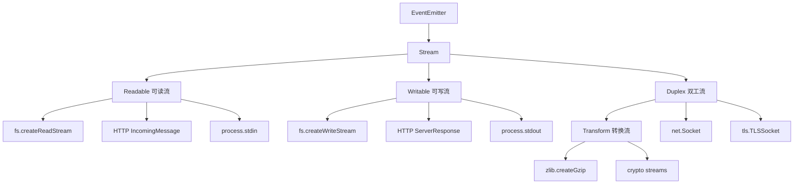
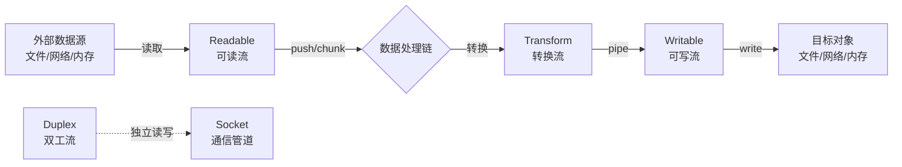
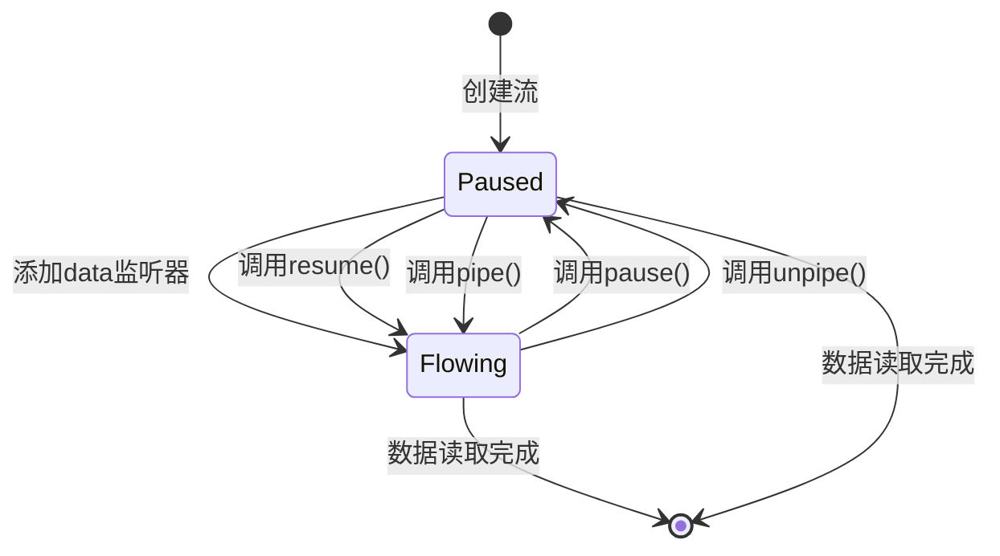
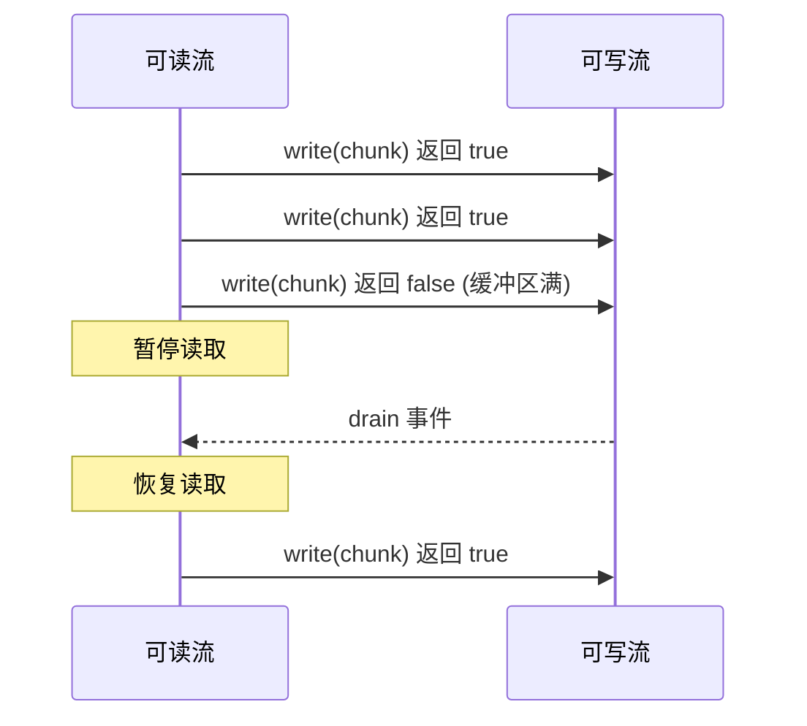
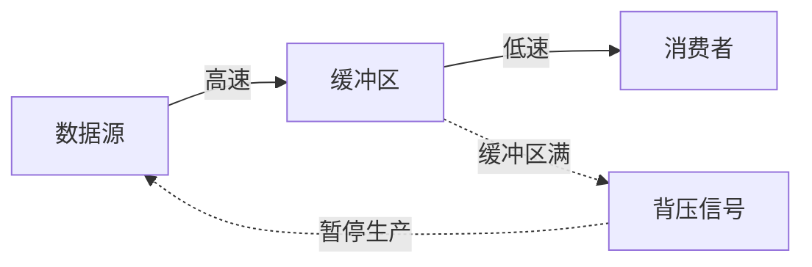
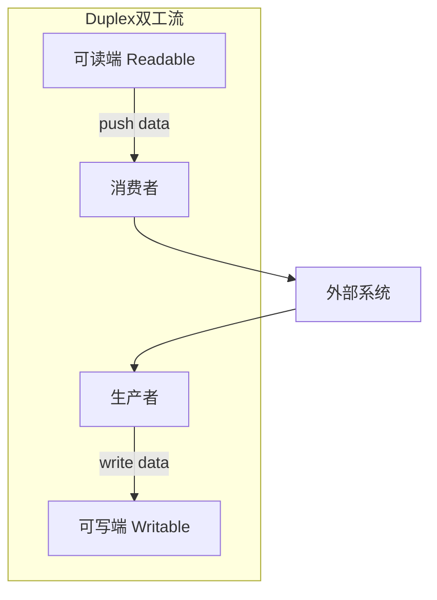
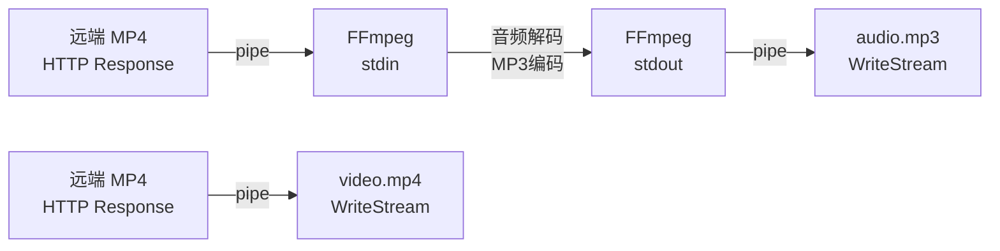

# Stream 流模块

`stream` 模块是 Node.js 处理数据流的基础抽象。流将数据按片段（chunk）逐步处理，避免一次性读入全部数据，适用于文件读写、网络传输、压缩/解压、加密等场景。Node.js 中大多数 I/O 接口都基于流实现，它是执行输入/输出（I/O）操作的关键能力。

```javascript
const fs = require("fs")
const { Readable, Writable, Transform, Duplex, pipeline } = require("stream")
const { pipeline: pipelinePromise, finished } = require("stream/promises")
```

## 流简介

程序中的流是一个抽象概念：当程序需要从某个数据源读取数据时，就会开启一个可读流；当程序向某个目标写入数据时，就会开启一个可写流。数据源或目的地既可以是文件、内存，也可以是网络连接。

如果直接使用 `fs.readFile()` 等一次性读取接口，Node.js 会在整个文件读取完成之前占用事件循环，且需要为文件的全部内容分配内存。使用流则可以分块处理数据，既能提升效率，也能避免占用过多内存。

### 流的类型与关系



### 流的四种基本类型

- **`Readable`（可读流）**：产生数据供消费方读取，如 `fs.createReadStream()`、HTTP 请求体
- **`Writable`（可写流）**：接收数据进行写入，如 `fs.createWriteStream()`、HTTP 响应
- **`Duplex`（双工流）**：同时具备可读和可写能力，读写相互独立，如 `net.Socket`
- **`Transform`（转换流）**：继承自 Duplex，在读写之间转换/处理数据，如 `zlib.createGzip()`

#### 四大流类型概念图解

四种流类型各司其职，形成数据从生产到消费的完整链路：

- **Readable（可读流）** 是数据的生产者，从外部数据源（文件、网络、内存等）获取数据，存储到内部 Buffer 数组中缓存。可读流有两个工作模式：`pause`（暂停模式）按兵不动，不获取数据也不积累缓存；`resume`（流动模式）则源源不断地把数据读进来缓存。
- **Writable（可写流）** 是数据的消费者，从可读流中获取 Buffer 数据，对其进行处理消耗后写入目标对象。它通过 `drain` 事件判定当前缓存数据是否写入完毕，是防爆仓的关键信号。
- **Duplex（双工流）** 同时具备可读和可写能力，且读写相互独立，可理解为两个独立通道的组合。例如 `net.Socket` 既可读取客户端数据，也可向客户端写入响应。`zlib`/`crypto` 模块也实现了双工流。
- **Transform（转换流）** 本身是双工流，但其输出与输入存在关联关系——输出由输入经转换逻辑处理后产生。它通常不保存数据，只负责处理和加工流经的数据，可类比为水管中的阀门控制器或中间处理器。`zlib`/`crypto` 模块同时实现了转换流。



四大流结合使用的核心方式是通过 `pipe()` 管道连接，将数据从源头逐步传递到终点。

所有流对象都继承自 `EventEmitter`，可以监听 `data`、`end`、`error`、`close` 等事件。

### 流的优势

- **时间效率**：可以一边读取一边处理，降低延迟，用户无需等待全部数据加载完成
- **空间效率**：避免一次性加载大文件或大响应，减少内存占用，适合处理 GB 级文件
- **可组合性**：通过 `pipe()`、`pipeline()` 将多个流组合成处理链，实现复杂的数据管道
- **背压机制**：自动感知消费者处理速度，防止写入端冲垮读取端，保证系统稳定性

#### 流式处理 vs 传统处理对比

```javascript
// ❌ 传统方式：一次性加载到内存
const fs = require('fs')
const data = fs.readFileSync('./large-file.mp4') // 占用大量内存
fs.writeFileSync('./copy.mp4', data)

// ✅ 流式处理：分块处理，内存占用恒定
const readStream = fs.createReadStream('./large-file.mp4')
const writeStream = fs.createWriteStream('./copy.mp4')
readStream.pipe(writeStream) // 内存占用约 64KB（默认 highWaterMark）
```

### 核心概念

#### Chunk（数据块）

流中单次传输的数据块，可以是：
- `Buffer`：二进制数据（默认）
- `string`：文本数据（设置了 encoding 时）
- 对象：开启了 `objectMode` 时

```javascript
const reader = fs.createReadStream('./file.txt')
reader.on('data', (chunk) => {
  console.log(typeof chunk) // object (Buffer)
  console.log(chunk.length) // Buffer 长度
})

const textReader = fs.createReadStream('./file.txt', { encoding: 'utf8' })
textReader.on('data', (chunk) => {
  console.log(typeof chunk) // string
})
```

#### Object Mode（对象模式）

当 `objectMode: true` 时，流处理的是任意 JavaScript 值而非 Buffer/String：

```javascript
const { Readable } = require('stream')

// 创建对象模式的可读流
const objectReader = new Readable({
  objectMode: true,
  read() {
    this.push({ id: 1, name: '张三' })
    this.push({ id: 2, name: '李四' })
    this.push(null) // 结束
  }
})

objectReader.on('data', (obj) => {
  console.log('接收到对象:', obj) // { id: 1, name: '张三' }
})
```

#### Flowing vs Paused Mode（流动模式 vs 暂停模式）



**流动模式（Flowing Mode）**：
- 流自动持续产生数据，通过 `data` 事件交付
- 数据像水流一样自动流动，无需手动干预

**暂停模式（Paused Mode）**：
- 默认模式
- 需要手动调用 `read()` 方法拉取数据
- 或通过 `pause()`/`resume()` 控制数据流

```javascript
const reader = fs.createReadStream('./file.txt')

// 查看当前模式
console.log(reader.readableFlowing) // null - 初始状态

// 方式1：流动模式 - 自动推送
reader.on('data', (chunk) => {
  console.log('自动接收:', chunk)
})
console.log(reader.readableFlowing) // true

// 方式2：暂停模式 - 手动拉取
reader.pause()
console.log(reader.readableFlowing) // false

// 方式3：暂停模式 - 使用 readable 事件
reader.removeAllListeners('data')
reader.on('readable', () => {
  let chunk
  while (null !== (chunk = reader.read())) {
    console.log('手动拉取:', chunk)
  }
})
```

#### Backpressure（背压）

当上游生产数据的速度快于下游消费速度时，`write()` 会返回 `false` 并通过 `drain` 事件提示生产者放慢速度，避免内存爆炸。



```javascript
const writer = fs.createWriteStream('./output.txt', {
  highWaterMark: 1024 // 缓冲区阈值
})

let data = Buffer.alloc(2048) // 2KB 数据

// 写入时检测返回值
const canContinue = writer.write(data)
if (!canContinue) {
  console.log('缓冲区已满，等待 drain')
  writer.once('drain', () => {
    console.log('缓冲区已清空，可继续写入')
  })
}
```

### 流的类型对比

| 类型        | 描述                                 | 常见场景                              | 实现方法            |
| ----------- | ------------------------------------ | ------------------------------------- | ------------------- |
| `Readable`  | 产生数据供消费方读取                 | `fs.createReadStream()`、HTTP 响应    | `_read(size)`       |
| `Writable`  | 接收数据进行写入                     | `fs.createWriteStream()`、HTTP 请求体 | `_write(chunk, enc, cb)` |
| `Duplex`    | 同时具备可读和可写能力               | `net.Socket`、`tls.TLSSocket`         | `_read()` + `_write()` |
| `Transform` | 在读写之间转换/处理数据，属于 Duplex | `zlib.createGzip()`、加密/解密        | `_transform(chunk, enc, cb)` |

## 可读流（Readable）

### 读取模式与状态

可读流有两种读取模式：

- **Flowing（流动）模式**：流会自动、持续地产生数据，通过 `data` 事件交付。
- **Paused（暂停）模式**：默认模式，需要手动调用 `read()` 或切换到流动模式。

流的状态可通过 `readableFlowing` 属性获取，其值包括：

- `null`：初始状态，还没有消费者
- `true`：流动模式
- `false`：暂停模式

切换模式的方式：

- 添加 `data` 事件监听器、调用 `resume()` 或 `pipe()` 会进入流动模式
- 调用 `pause()` 或 `unpipe()` 会进入暂停模式

#### 三种消费数据的方式

```javascript
const fs = require('fs')
const reader = fs.createReadStream('./file.txt')

// 方式1：流动模式 - 使用 data 事件（最常用）
reader.on('data', (chunk) => {
  console.log('接收到数据:', chunk.toString())
})
reader.on('end', () => {
  console.log('读取完成')
})

// 方式2：暂停模式 - 使用 readable 事件 + read()
reader.removeAllListeners('data')
reader.on('readable', () => {
  let chunk
  while (null !== (chunk = reader.read())) {
    console.log('手动读取:', chunk.toString())
  }
})

// 方式3：异步迭代器（Node.js 10+，推荐）
async function readFile() {
  const reader = fs.createReadStream('./file.txt', { encoding: 'utf8' })
  for await (const chunk of reader) {
    console.log('异步读取:', chunk)
  }
}
```

### 创建方式

#### 1. 使用 fs 模块创建文件流

```javascript
const fs = require("fs")

// 创建文件可读流
const fileReadable = fs.createReadStream("./input.txt", {
  flags: 'r',              // 文件系统标志，默认 'r'
  encoding: "utf8",        // 编码方式，默认 null（返回 Buffer）
  fd: null,                // 文件描述符，优先于 path
  mode: 0o666,             // 文件权限，默认 0o666
  autoClose: true,         // 错误或完成时是否自动关闭，默认 true
  emitClose: true,         // 流销毁时是否触发 close 事件，默认 true
  start: 0,                // 开始读取位置（字节）
  end: Infinity,           // 结束读取位置（字节）
  highWaterMark: 16 * 1024, // 缓冲区阈值，默认 64KB
})

// 读取文件的指定范围
const partialReader = fs.createReadStream('./large-file.bin', {
  start: 100,   // 从偏移量 100 字节处开始
  end: 199,     // 到偏移量 199 字节处结束（包含）
  highWaterMark: 50 // 每次读取 50 字节
})
```

#### 2. 创建自定义可读流

```javascript
const { Readable } = require("stream")

// 方式1：使用构造函数
const readable = new Readable({
  read(size) {
    this.push("chunk 1\n")
    this.push("chunk 2\n")
    this.push(null) // 推送 null 表示结束
  }
})

// 方式2：继承 Readable 类
class ArrayReadable extends Readable {
  constructor(source, options = {}) {
    super(options)
    this.source = Array.from(source)
  }

  _read() {
    const chunk = this.source.shift()
    if (chunk) {
      this.push(chunk)
    } else {
      this.push(null) // 数据耗尽，结束流
    }
  }
}

const reader = new ArrayReadable(['张三', '李四', '王五'], { objectMode: true })
reader.on('data', (person) => console.log('读取到:', person))

// 方式3：使用 Readable.from() 快速创建（Node.js 12.3+）

async function* generate() {
  yield '第一块数据'
  yield '第二块数据'
  yield '第三块数据'
}

const readableFromIterator = Readable.from(generate())
readableFromIterator.on('data', (chunk) => console.log(chunk))

// 从数组创建对象模式流
const readableFromArray = Readable.from([1, 2, 3, 4, 5])
readableFromArray.on('data', (num) => console.log(num))
```

#### 3. 从字符串或 Buffer 创建流

```javascript
const { Readable } = require('stream')

class StringReadable extends Readable {
  constructor(str, options = {}) {
    super(options)
    this.str = str
    this.pos = 0
  }

  _read(size) {
    if (this.pos >= this.str.length) {
      this.push(null)
      return
    }
    
    const chunk = this.str.slice(this.pos, this.pos + size)
    this.pos += size
    this.push(chunk)
  }
}

const stringStream = new StringReadable('Hello, Stream World!', {
  encoding: 'utf8',
  highWaterMark: 5
})
```

### 构造选项详解

```javascript
const readable = new Readable({
  highWaterMark: 16384,    // 内部缓冲区大小（字节），默认 16KB（对象模式为 16）
  encoding: 'utf8',        // 默认编码
  objectMode: false,       // 是否为对象模式，默认 false
  emitClose: true,         // 销毁时是否触发 close 事件
  autoDestroy: true,       // 结束时是否自动调用 destroy()
  destroy(err, cb) {       // 自定义销毁逻辑
    // 清理资源
    cb(err)
  }
})
```

### 常用属性

| 属性                    | 类型      | 说明                                       |
| ----------------------- | --------- | ------------------------------------------ |
| `destroyed`             | `boolean` | 流是否已销毁                               |
| `readable`              | `boolean` | 流是否可继续读取（非 destroyed 且非 ended）|
| `readableEncoding`      | `string`  | 当前编码，未设置时为 `null`                |
| `readableEnded`         | `boolean` | 是否已触发 `end` 事件                      |
| `readableFlowing`       | `boolean` | 当前模式：`null`/`true`/`false`            |
| `readableHighWaterMark` | `number`  | 构造时指定的 `highWaterMark` 值            |
| `readableLength`        | `number`  | 缓冲区中等待被消费的字节数/对象数          |
| `readableObjectMode`    | `boolean` | 是否为对象模式                             |

```javascript
const reader = fs.createReadStream('./file.txt', {
  highWaterMark: 1024
})

console.log(reader.readable)              // true
console.log(reader.readableEncoding)      // null
console.log(reader.readableHighWaterMark) // 1024
console.log(reader.readableLength)        // 0（缓冲区为空）
console.log(reader.readableFlowing)       // null（初始状态）
```

### 常用方法

#### 读取与控制

| 方法                          | 返回值      | 说明                                       |
| ----------------------------- | ----------- | ------------------------------------------ |
| `read([size])`                | `Buffer\|string\|null` | 按需读取数据，无数据时返回 `null`          |
| `setEncoding(encoding)`       | `this`      | 设置编码，返回流本身以便链式调用           |
| `pause()`                     | `this`      | 暂停 `data` 事件，切换到暂停模式           |
| `resume()`                    | `this`      | 恢复 `data` 事件，切换到流动模式           |
| `pipe(destination[, options])`| `Writable`  | 将可读流绑定到可写流，返回目标可写流       |
| `unpipe([destination])`       | `this`      | 解绑已绑定的可写流，不传参则解绑所有       |
| `destroy([error])`            | `this`      | 销毁流，必要时触发 `error` 事件            |

#### 其他方法

| 方法                          | 返回值      | 说明                                       |
| ----------------------------- | ----------- | ------------------------------------------ |
| `isPaused()`                  | `boolean`   | 判断是否处于暂停状态                       |
| `unshift(chunk)`              | -           | 将数据块推回流的开头（高级用法）           |
| `wrap(stream)`                | `this`      | 将旧式流包装为现代 Readable                |
| `iterator([options])`         | `AsyncIterator` | 创建异步迭代器（Node.js 16.3+）       |

```javascript
const reader = fs.createReadStream('./file.txt')

// 设置编码后，read() 返回字符串
reader.setEncoding('utf8')
const chunk = reader.read(100) // 读取最多 100 字节

// 暂停与恢复
reader.pause()
console.log(reader.isPaused()) // true
reader.resume()
console.log(reader.isPaused()) // false

// unshift 示例：回退已读取的数据
let count = 0
reader.on('data', (chunk) => {
  count++
  if (count === 1) {
    // 将第一块数据放回流中，重新读取
    reader.unshift(chunk)
  } else {
    console.log('处理数据:', chunk)
  }
})
```

### 常用事件

| 事件      | 触发时机                                   | 回调参数       |
| --------- | ------------------------------------------ | -------------- |
| `data`    | 流动模式下产出数据                         | `(chunk)`      |
| `readable`| 缓冲区有数据可读取                         | -              |
| `end`     | 数据读取完成（无更多数据）                 | -              |
| `error`   | 读取过程中发生错误                         | `(error)`      |
| `close`   | 底层资源关闭（文件描述符等）               | -              |
| `open`    | 打开文件（仅 `fs.createReadStream`）       | `(fd)`         |
| `pause`   | 调用 `pause()` 且状态变化时触发            | -              |
| `resume`  | 调用 `resume()` 且状态变化时触发           | -              |

### 示例：完整的文件读取流程

```javascript
const fs = require("fs")

const reader = fs.createReadStream("./input.txt", {
  encoding: "utf8",
  highWaterMark: 16 * 1024 // 16KB
})

// 文件打开事件（仅文件流）
reader.on("open", (fd) => {
  console.log("文件打开，文件描述符:", fd)
})

// 接收数据事件（流动模式）
reader.on("data", (chunk) => {
  console.log(`读取到 ${chunk.length} 字符`)
  console.log("当前缓冲区大小:", reader.readableLength)
  
  // 模拟慢速消费：暂停 100ms
  reader.pause()
  setTimeout(() => reader.resume(), 100)
})

// 可读事件（暂停模式）
reader.on("readable", () => {
  console.log("缓冲区有数据可读")
})

// 读取完成事件
reader.on("end", () => {
  console.log("数据读取完成")
  console.log("readableEnded:", reader.readableEnded) // true
})

// 错误事件
reader.on("error", (err) => {
  console.error("读取错误:", err.message)
})

// 关闭事件
reader.on("close", () => {
  console.log("流已关闭")
  console.log("destroyed:", reader.destroyed) // true
})
```

### 示例：使用异步迭代器（推荐）

```javascript
const fs = require('fs')
const { pipeline } = require('stream/promises')

async function readFileByStream() {
  const reader = fs.createReadStream('./large-file.txt', {
    encoding: 'utf8',
    highWaterMark: 64 * 1024 // 64KB
  })
  
  let lineNumber = 0
  let buffer = ''
  
  // 使用异步迭代器
  for await (const chunk of reader) {
    buffer += chunk
    const lines = buffer.split('\n')
    
    // 保留最后一行（可能不完整）
    buffer = lines.pop()
    
    // 处理完整的行
    for (const line of lines) {
      lineNumber++
      console.log(`第 ${lineNumber} 行:`, line)
    }
  }
  
  // 处理最后一行
  if (buffer) {
    lineNumber++
    console.log(`第 ${lineNumber} 行:`, buffer)
  }
  
  console.log(`总共 ${lineNumber} 行`)
}

readFileByStream().catch(console.error)
```

### 示例：逐行读取文件

```javascript
const fs = require('fs')
const readline = require('readline')

async function processLineByLine() {
  const fileStream = fs.createReadStream('./input.txt')
  
  const rl = readline.createInterface({
    input: fileStream,
    crlfDelay: Infinity // 识别所有类型的换行符
  })
  
  for await (const line of rl) {
    console.log('行内容:', line)
  }
}

processLineByLine().catch(console.error)
```

### 自定义 Readable 流

#### 基本实现模式

```javascript
const { Readable } = require("stream")

// 继承 Readable 类
class ArrayReadable extends Readable {
  constructor(source, options = {}) {
    // 对象模式：处理任意 JS 值
    super({ ...options, objectMode: true })
    this.source = Array.from(source)
    this.index = 0
  }

  // 必须实现 _read 方法
  _read(size) {
    // 模拟异步数据源
    setTimeout(() => {
      if (this.index < this.source.length) {
        const chunk = this.source[this.index++]
        this.push(chunk) // 推送数据
        console.log(`推送数据: ${JSON.stringify(chunk)}`)
      } else {
        this.push(null) // 推送 null 表示结束
        console.log('数据推送完成')
      }
    }, 100)
  }
}

// 使用自定义流
const reader = new ArrayReadable(["张三", "李四", "王五"])

reader.on("data", (person) => {
  console.log("读取到:", person)
})

reader.on("end", () => {
  console.log("流读取结束")
})
```

#### 示例：从数据库流式读取

```javascript
const { Readable } = require('stream')

class DatabaseStream extends Readable {
  constructor(query, options = {}) {
    super({ ...options, objectMode: true })
    this.query = query
    this.cursor = null
    this.batchSize = options.batchSize || 100
    this.buffer = []
  }

  async _read(size) {
    try {
      // 延迟初始化游标
      if (!this.cursor) {
        this.cursor = await this.query.cursor()
      }

      // 如果缓冲区有数据，优先返回
      if (this.buffer.length > 0) {
        const chunk = this.buffer.shift()
        return this.push(chunk)
      }

      // 从数据库批量读取
      const docs = await this.cursor.limit(this.batchSize).toArray()
      
      if (docs.length === 0) {
        this.push(null) // 没有更多数据
        await this.cursor.close()
      } else {
        // 将第一批数据放入缓冲区，其余推送到流
        this.buffer = docs.slice(1)
        this.push(docs[0])
      }
    } catch (err) {
      this.destroy(err) // 发生错误时销毁流
    }
  }

  _destroy(err, callback) {
    // 清理资源
    if (this.cursor) {
      this.cursor.close().catch(console.error)
    }
    callback(err)
  }
}

// 使用示例
const stream = new DatabaseStream(User.find({ status: 'active' }))
stream.on('data', (user) => {
  console.log('处理用户:', user.name)
})
```

#### 示例：定时器流

```javascript
const { Readable } = require('stream')

class TimerStream extends Readable {
  constructor(interval = 1000, maxCount = 10, options = {}) {
    super({ ...options, objectMode: true })
    this.interval = interval
    this.maxCount = maxCount
    this.count = 0
    this.timer = null
  }

  _read(size) {
    if (this.count >= this.maxCount) {
      this.push(null)
      return
    }

    if (this.timer) return // 防止重复设置定时器

    this.timer = setInterval(() => {
      if (this.count >= this.maxCount) {
        clearInterval(this.timer)
        this.push(null)
      } else {
        this.push({
          timestamp: Date.now(),
          count: ++this.count
        })
      }
    }, this.interval)
  }

  _destroy(err, callback) {
    if (this.timer) {
      clearInterval(this.timer)
    }
    callback(err)
  }
}

// 使用示例：每秒输出一个时间戳，共 5 次
const timerStream = new TimerStream(1000, 5)
timerStream.on('data', (data) => {
  console.log(`第 ${data.count} 次触发:`, new Date(data.timestamp).toISOString())
})
```

#### 示例：HTTP 请求流

```javascript
const { Readable } = require('stream')
const https = require('https')

class HttpStream extends Readable {
  constructor(url, options = {}) {
    super(options)
    this.url = url
    this.req = null
    this.started = false
  }

  _read(size) {
    if (this.started) return
    this.started = true

    this.req = https.get(this.url, (res) => {
      if (res.statusCode !== 200) {
        this.destroy(new Error(`HTTP ${res.statusCode}`))
        return
      }

      res.on('data', (chunk) => {
        if (!this.push(chunk)) {
          res.pause() // 背压控制
        }
      })

      res.on('end', () => {
        this.push(null)
      })

      res.on('error', (err) => {
        this.destroy(err)
      })
    })

    this.req.on('error', (err) => {
      this.destroy(err)
    })
  }

  _destroy(err, callback) {
    if (this.req) {
      this.req.destroy()
    }
    callback(err)
  }
}

// 使用示例
const httpStream = new HttpStream('https://api.example.com/data')
httpStream.on('data', (chunk) => {
  console.log('接收到数据:', chunk.length, '字节')
})
```

### 最佳实践

1. **始终处理错误事件**：防止未捕获的异常导致进程崩溃
2. **实现 `_destroy` 方法**：正确清理资源（定时器、文件句柄、网络连接等）
3. **使用对象模式时明确指定**：`new Readable({ objectMode: true })`
4. **避免在 `_read` 中同步推送大量数据**：可能导致内存问题
5. **尊重背压**：检查 `push()` 返回值，必要时暂停数据源

## 可写流（Writable）

### 创建方式

#### 1. 使用 fs 模块创建文件流

```javascript
const fs = require("fs")

// 创建文件可写流
const fileWritable = fs.createWriteStream("./output.log", {
  flags: "w",              // 文件系统标志，默认 'w'
  encoding: "utf8",        // 编码方式，默认 null
  mode: 0o666,             // 文件权限，默认 0o666
  autoClose: true,         // 错误或完成时是否自动关闭，默认 true
  emitClose: true,         // 销毁时是否触发 close 事件，默认 true
  start: 0,                // 开始写入位置（字节）
  highWaterMark: 16 * 1024, // 缓冲区阈值，默认 16KB
})

// 追加写入模式
const appendWritable = fs.createWriteStream("./output.log", {
  flags: "a", // append 模式
  encoding: "utf8"
})

// 从指定位置开始写入
const offsetWritable = fs.createWriteStream("./output.log", {
  flags: "r+", // 读写模式
  start: 100   // 从第 100 字节开始写入
})
```

#### 2. 创建自定义可写流

```javascript
const { Writable } = require("stream")

// 方式1：使用构造函数
const writable = new Writable({
  write(chunk, encoding, callback) {
    console.log('写入数据:', chunk.toString())
    callback() // 调用 callback 表示写入完成
  },
  final(callback) {
    console.log('流即将关闭')
    callback()
  },
  destroy(err, callback) {
    console.log('清理资源')
    callback(err)
  }
})

// 方式2：继承 Writable 类
class ConsoleWritable extends Writable {
  constructor(options = {}) {
    super(options)
  }

  // 必须实现 _write 方法
  _write(chunk, encoding, callback) {
    console.log(`[${new Date().toISOString()}]`, chunk.toString())
    callback()
  }

  // 可选：处理流结束前的最后数据
  _final(callback) {
    console.log('=== 流结束 ===')
    callback()
  }

  // 可选：写入 Buffer 数组（性能优化）
  _writev(chunks, callback) {
    chunks.forEach(({ chunk, encoding }) => {
      console.log('批量写入:', chunk.toString())
    })
    callback()
  }
}

const consoleStream = new ConsoleWritable()
consoleStream.write('Hello')
consoleStream.write('World')
consoleStream.end()
```

#### 3. 创建对象模式的可写流

```javascript
const { Writable } = require('stream')

class ObjectWritable extends Writable {
  constructor(options = {}) {
    super({ ...options, objectMode: true })
    this.data = []
  }

  _write(obj, encoding, callback) {
    console.log('接收对象:', obj)
    this.data.push(obj)
    callback()
  }

  _final(callback) {
    console.log('总共接收对象:', this.data.length)
    callback()
  }
}

const objectWriter = new ObjectWritable()
objectWriter.write({ id: 1, name: '张三' })
objectWriter.write({ id: 2, name: '李四' })
objectWriter.end()
```

### 构造选项详解

```javascript
const writable = new Writable({
  highWaterMark: 16384,    // 写入缓冲区大小（字节），默认 16KB
  decodeStrings: true,     // 是否将字符串解码为 Buffer，默认 true
  defaultEncoding: 'utf8', // 默认编码
  objectMode: false,       // 是否为对象模式，默认 false
  emitClose: true,         // 销毁时是否触发 close 事件
  autoDestroy: true,       // 结束时是否自动调用 destroy()
  
  // 可选方法
  write(chunk, encoding, cb) { /* ... */ },
  writev(chunks, cb) { /* 批量写入 */ },
  final(cb) { /* 结束前的清理 */ },
  destroy(err, cb) { /* 自定义销毁逻辑 */ }
})
```

### 常用属性

| 属性                     | 类型      | 说明                                                   |
| ------------------------ | --------- | ------------------------------------------------------ |
| `destroyed`              | `boolean` | 流是否已销毁                                           |
| `writable`               | `boolean` | 写端是否可继续使用                                     |
| `writableEnded`          | `boolean` | 是否已调用 `end()`                                     |
| `writableFinished`       | `boolean` | 缓冲区数据是否已全部写入完成（触发 `finish` 前为 true）|
| `writableHighWaterMark`  | `number`  | 构造时指定的 `highWaterMark` 值                        |
| `writableLength`         | `number`  | 缓冲区中等待写入的数据长度（字节或对象数）             |
| `writableNeedDrain`      | `boolean` | 是否需要等待 `drain` 事件（背压标志）                  |
| `writableObjectMode`     | `boolean` | 是否为对象模式                                         |
| `writableCorked`         | `number`  | `cork()` 调用次数，用于批量写入优化                    |

```javascript
const writer = fs.createWriteStream('./output.txt', {
  highWaterMark: 1024
})

console.log(writer.writable)              // true
console.log(writer.writableEnded)         // false
console.log(writer.writableHighWaterMark) // 1024
console.log(writer.writableLength)        // 0
console.log(writer.writableNeedDrain)     // false
```

### 常用方法

#### 写入与控制

| 方法                                   | 返回值      | 说明                                           |
| -------------------------------------- | ----------- | ---------------------------------------------- |
| `write(chunk[, encoding][, callback])` | `boolean`   | 写入数据，返回 `false` 时需等待 `drain` 事件   |
| `end([chunk][, encoding][, callback])` | `this`      | 结束写入，可在结束前写入最后一块数据           |
| `setDefaultEncoding(encoding)`         | `this`      | 设置默认编码                                   |
| `cork()`                               | -           | 强制缓冲写入数据，直到调用 `uncork()`          |
| `uncork()`                             | -           | 刷新 `cork()` 缓冲的数据                       |
| `destroy([error])`                     | `this`      | 销毁可写流，可选择传递错误对象                 |

#### 其他方法

| 方法                                   | 返回值      | 说明                                           |
| -------------------------------------- | ----------- | ---------------------------------------------- |
| `writable.write(chunk)`                | `boolean`   | 写入数据                                       |
| `writable.end()`                       | `this`      | 结束写入                                       |

### 写入返回值与背压

```javascript
const writer = fs.createWriteStream('./output.txt', {
  highWaterMark: 1024 // 缓冲区阈值
})

// write() 返回值说明：
// - true：数据已写入缓冲区，缓冲区未满
// - false：缓冲区已满，需要等待 drain 事件

const data = Buffer.alloc(2048) // 2KB 数据
const result = writer.write(data)

if (result) {
  console.log('写入成功，缓冲区未满')
} else {
  console.log('缓冲区已满，等待 drain 事件')
  writer.once('drain', () => {
    console.log('缓冲区已清空，可继续写入')
  })
}
```

### 常见事件

| 事件     | 触发时机                                     | 回调参数       |
| -------- | -------------------------------------------- | -------------- |
| `finish` | 所有数据已写入底层系统（`end()` 且缓冲清空） | -              |
| `drain`  | 缓冲区清空，可继续写入（背压解除）           | -              |
| `error`  | 写入或管道发生错误                           | `(error)`      |
| `close`  | 底层资源关闭                                 | -              |
| `pipe`   | 与可读流建立管道时触发                       | `(src)`        |
| `unpipe` | 与可读流解除管道时触发                       | `(src)`        |
| `open`   | 打开文件（仅 `fs.createWriteStream`）        | `(fd)`         |

### 示例：写入文件并处理背压

```javascript
const fs = require("fs")

const writer = fs.createWriteStream("./output.log", {
  flags: "a",          // 追加模式
  encoding: "utf8",
  highWaterMark: 4 * 1024 // 4KB 缓冲
})

function writeMany() {
  let i = 0
  const max = 10000
  
  function write() {
    let ok = true
    
    // 持续写入直到缓冲区满或达到上限
    while (i < max && ok) {
      // 最后一次写入时调用 end()
      if (i === max - 1) {
        writer.end(`第 ${i} 行\n`)
        console.log('最后一次写入，调用 end()')
      } else {
        ok = writer.write(`第 ${i} 行\n`)
        console.log(`写入第 ${i} 行，返回: ${ok}, 缓冲区大小: ${writer.writableLength}`)
      }
      i++
    }
    
    // 缓冲区满，等待 drain 事件
    if (i < max) {
      console.log(`缓冲区满，暂停写入，已写入 ${i} 行`)
      writer.once("drain", () => {
        console.log('缓冲区清空，继续写入')
        write()
      })
    }
  }
  
  write()
}

writer.on("finish", () => {
  console.log("写入完成")
  console.log("writableFinished:", writer.writableFinished) // true
})

writer.on("error", (err) => {
  console.error("写入失败:", err)
})

writeMany()
```

### 示例：使用 cork 和 uncork 优化写入

```javascript
const fs = require('fs')
const writer = fs.createWriteStream('./output.txt')

// cork() 将数据暂存在缓冲区，直到 uncork() 时一次性写入
// 适用于频繁的小数据写入场景

writer.cork()
writer.write('第一块数据\n')
writer.write('第二块数据\n')
writer.write('第三块数据\n')
writer.uncork() // 此时会将三块数据合并写入

// 可以嵌套调用 cork() 和 uncork()
writer.cork()
writer.cork() // corked 计数器 = 2

writer.write('数据 A\n')
writer.uncork() // corked 计数器 = 1，不会立即写入
writer.write('数据 B\n')
writer.uncork() // corked 计数器 = 0，现在才写入

// 使用 process.nextTick 延迟 uncork
writer.cork()
writer.write('立即 cork 的数据\n')

process.nextTick(() => {
  writer.uncork()
  // 此时数据才会被写入
})

writer.on('finish', () => console.log('写入完成'))
writer.end()
```

### 示例：进度监控

```javascript
const fs = require('fs')

function copyWithProgress(src, dest, onProgress) {
  return new Promise((resolve, reject) => {
    const reader = fs.createReadStream(src)
    const writer = fs.createWriteStream(dest)
    
    let totalSize = 0
    let writtenSize = 0
    
    // 获取文件总大小
    fs.stat(src, (err, stats) => {
      if (err) return reject(err)
      totalSize = stats.size
    })
    
    reader.on('data', (chunk) => {
      writtenSize += chunk.length
      if (onProgress) {
        const progress = totalSize > 0 ? (writtenSize / totalSize * 100).toFixed(2) : 0
        onProgress({
          written: writtenSize,
          total: totalSize,
          progress: `${progress}%`
        })
      }
    })
    
    writer.on('finish', () => {
      resolve({ written: writtenSize })
    })
    
    writer.on('error', reject)
    reader.on('error', reject)
    
    reader.pipe(writer)
  })
}

// 使用示例
copyWithProgress(
  './large-file.mp4',
  './copy.mp4',
  ({ written, total, progress }) => {
    process.stdout.write(`\r进度: ${progress} (${(written / 1024 / 1024).toFixed(2)} MB / ${(total / 1024 / 1024).toFixed(2)} MB)`)
  }
)
  .then(() => console.log('\n复制完成'))
  .catch(err => console.error('复制失败:', err))
```

## 管道与背压（Backpressure）

### 理解背压机制

背压是流式数据处理中的核心概念。当数据生产速度超过消费速度时，如果不加以控制，会导致：
- 内存快速增长，可能导致内存溢出
- 系统性能下降
- 数据丢失或损坏



### pipe 方法

`readable.pipe(writable)` 建立从可读流到可写流的管道，能够自动处理背压并返回目标可写流。

#### readFile vs createReadStream.pipe 对比实验

以下实验使用一个大于 5MB 的文本文件 `big.txt`，对比两种 HTTP 响应方式的实际表现差异：

**方式一：`fs.readFile` —— 一次性加载**

```javascript
const fs = require('fs')
const http = require('http')

http.createServer((req, res) => {
  res.writeHead(200, { 'Content-Type': 'text/html' })
  // 将文件内容全部读入内存，再批量返回
  fs.readFile('./big.txt', (err, data) => {
    res.end(data)
  })
}).listen(5000)
```

客户端需要等待整个文件读入内存后才能看到数据，响应延迟高。

**方式二：`createReadStream().pipe()` —— 流式传输**

```javascript
const fs = require('fs')
const http = require('http')

http.createServer((req, res) => {
  res.writeHead(200, { 'Content-Type': 'text/html' })
  // 流式传输：数据分块发送
  fs.createReadStream('./big.txt').pipe(res)
}).listen(5000)
```

内容以片段形式逐步呈现，响应速度明显加快。

**对比分析**：

| 对比项       | `fs.readFile`                       | `createReadStream().pipe()`               |
| ------------ | ----------------------------------- | ----------------------------------------- |
| 响应延迟     | 高（等待全部数据加载完毕）          | 低（数据片段逐步到达即发送）              |
| 内存占用     | 高（整个文件驻留内存）              | 低（仅缓冲区大小，默认约 64KB）           |
| 用户体验     | 白屏等待后一次性显示                | 内容逐步呈现                              |
| 背压控制     | 无                                  | 自动控制，客户端慢时减少内存缓存          |
| 数据驱动模式 | 主动推送（读完全部再发）            | 被动消费（末端需要数据时才从源头读取）    |

`pipe()` 的核心优势在于：自动监听 `data` 和 `end` 事件，文件中的每一小段数据都会源源不断发送给客户端；同时自动控制后端压力——当客户端连接缓慢时，Node.js 会将尽可能少的缓存放到内存中，通过内存调度自动控制流量，避免目标被快速读取的可读流淹没。

#### 基本用法

```javascript
const fs = require("fs")

// 简单的文件复制
const reader = fs.createReadStream("./large.mp4")
const writer = fs.createWriteStream("./copy.mp4")

reader.pipe(writer)

writer.on('finish', () => {
  console.log('复制完成')
})

reader.on('error', (err) => {
  console.error('读取错误:', err)
})

writer.on('error', (err) => {
  console.error('写入错误:', err)
})
```

#### 管道链（Pipeline Chain）

```javascript
const fs = require('fs')
const zlib = require('zlib')
const crypto = require('crypto')

// 多个流的链式管道
// 注意：createCipher/createDecipher 已在 Node.js 22 中移除（DEP0106），改用 createCipheriv
const key = crypto.scryptSync('secret-key', 'salt', 24) // aes-192 需要 24 字节密钥
const iv = Buffer.alloc(16, 0) // 示例使用固定 IV；生产环境应随机生成并随密文保存
fs.createReadStream('./input.txt')
  .pipe(zlib.createGzip())           // 压缩
  .pipe(crypto.createCipheriv('aes-192-cbc', key, iv)) // 加密
  .pipe(fs.createWriteStream('./encrypted.gz'))
  .on('finish', () => {
    console.log('加密压缩完成')
  })
```

#### 控制管道行为

```javascript
const fs = require("fs")

const reader = fs.createReadStream("./demo.txt")
const writer = fs.createWriteStream("./copy.txt", { flags: "a" })

// end: false 阻止可读流结束时自动关闭可写流
reader.pipe(writer, { end: false })

reader.on('end', () => {
  console.log('读取完成，但写入流保持打开')
  
  // 可以继续写入其他数据
  writer.write('\n追加的内容\n')
  writer.end()
})

// 解除管道绑定（需要时调用）
// reader.unpipe(writer)
```

#### 多目标管道

```javascript
const fs = require('fs')
const zlib = require('zlib')

const reader = fs.createReadStream('./input.txt')
const gzip = zlib.createGzip()
const writer1 = fs.createWriteStream('./output1.txt.gz')
const writer2 = fs.createWriteStream('./output2.txt.gz')

// 一个可读流可以管道到多个可写流
reader.pipe(gzip) // 先压缩
gzip.pipe(writer1) // 写入文件1
gzip.pipe(writer2) // 同时写入文件2

// 同时写入多个文件（不压缩）
const reader2 = fs.createReadStream('./input.txt')
reader2.pipe(fs.createWriteStream('./copy1.txt'))
reader2.pipe(fs.createWriteStream('./copy2.txt'))
```

### pipeline 方法（推荐）

Node.js 10.0+ 提供 `stream.pipeline()`，相比 `pipe()` 有以下优势：
- **自动错误传播**：任何流出错都会传播到其他流
- **自动清理资源**：错误时自动关闭所有流
- **完成回调**：统一处理完成和错误

#### 回调版本

```javascript
const fs = require("fs")
const zlib = require("zlib")
const { pipeline } = require("stream")

pipeline(
  fs.createReadStream("./input.txt"),
  zlib.createGzip(),
  fs.createWriteStream("./input.txt.gz"),
  (err) => {
    if (err) {
      console.error("压缩失败:", err)
    } else {
      console.log("压缩完成")
    }
  }
)
```

#### Promise 版本（Node.js 15+）

```javascript
const fs = require('fs')
const zlib = require('zlib')
const { pipeline } = require('stream/promises')

async function compressFile() {
  try {
    await pipeline(
      fs.createReadStream('./input.txt'),
      zlib.createGzip(),
      fs.createWriteStream('./input.txt.gz')
    )
    console.log('压缩完成')
  } catch (err) {
    console.error('压缩失败:', err)
  }
}

compressFile()
```

#### 多阶段处理

```javascript
const { pipeline } = require('stream/promises')
const fs = require('fs')
const zlib = require('zlib')
const { Transform } = require('stream')

// 自定义转换流：添加行号
class LineNumberTransform extends Transform {
  constructor(options = {}) {
    super(options)
    this.lineNumber = 0
  }

  _transform(chunk, encoding, callback) {
    const lines = chunk.toString().split('\n')
    const numbered = lines.map(line => `${++this.lineNumber}: ${line}`).join('\n')
    this.push(numbered)
    callback()
  }
}

async function processFile() {
  await pipeline(
    fs.createReadStream('./input.txt'),
    new LineNumberTransform(),
    zlib.createGzip(),
    fs.createWriteStream('./numbered.txt.gz')
  )
  console.log('处理完成')
}

processFile().catch(console.error)
```

### 手动处理背压

虽然 `pipe()` 和 `pipeline()` 会自动处理背压，但某些场景需要手动控制：

```javascript
const fs = require('fs')

const reader = fs.createReadStream("./source.dat", { 
  highWaterMark: 1024 
})
const writer = fs.createWriteStream("./target.dat", { 
  highWaterMark: 512 
})

let bytesRead = 0
let bytesWritten = 0

reader.on("data", (chunk) => {
  bytesRead += chunk.length
  
  // 尝试写入，write() 返回 false 表示缓冲区满
  const canContinue = writer.write(chunk)
  
  if (!canContinue) {
    console.log(`缓冲区满，暂停读取。已读: ${bytesRead}, 已写: ${bytesWritten}`)
    
    // 暂停可读流，停止推送数据
    reader.pause()
    
    // 等待可写流缓冲区清空
    writer.once("drain", () => {
      console.log('缓冲区清空，恢复读取')
      reader.resume()
    })
  }
})

reader.on("end", () => {
  console.log('读取完成')
  writer.end()
})

writer.on('finish', () => {
  console.log(`写入完成。总计读取: ${bytesRead}, 写入: ${bytesWritten}`)
})
```

### 流速控制与 drain 防爆仓

磁盘 I/O 的读写速度并不一致。当读取速度大于写入速度时，积压的内存缓冲会不断增长，最终可能导致内存爆仓。`write()` 方法的返回值提供了关键信号：返回 `true` 表示数据已写入缓冲区，返回 `false` 表示缓冲区已满、数据仍停留在缓存中。结合 `drain` 事件即可实现防爆仓机制。

#### 不安全的写法（可能爆仓）

```javascript
const fs = require('fs')
const rs = fs.createReadStream('./logo.png')
const ws = fs.createWriteStream('./logo_write.png')

rs.on('data', (chunk) => {
  // 直接写入，忽略 write() 返回值
  // 当写入速度跟不上读取速度时，数据积压在内存中，大文件场景下可能爆仓
  ws.write(chunk)
})
rs.on('end', () => {
  ws.end()
})
```

#### 安全的写法（drain 防爆仓）

```javascript
const fs = require('fs')
const rs = fs.createReadStream('./logo.png')
const ws = fs.createWriteStream('./logo_write_safe.png')

rs.on('data', (chunk) => {
  // 检查 write() 返回值：false 表示缓冲区已满
  if (ws.write(chunk) === false) {
    // 暂停可读流，停止数据流入
    rs.pause()
  }
})

rs.on('end', () => {
  // 数据读取完毕，关闭可写流
  ws.end()
})

ws.on('drain', () => {
  // 缓冲区数据已被消耗，恢复可读流
  rs.resume()
})
```

核心逻辑：`write()` 返回 `false` 时暂停读取 → `drain` 事件触发时恢复读取。文件越大，越需要这种流速控制机制。使用 `pipe()` 可以自动处理上述逻辑，是更简洁的方案。

### pipe vs pipeline 对比

| 特性               | `pipe()`                    | `pipeline()`                |
| ------------------ | --------------------------- | --------------------------- |
| 错误处理           | 需手动监听每个流的 error 事件 | 自动传播错误到所有流        |
| 资源清理           | 错误时可能资源泄漏           | 自动关闭所有流              |
| API 风格           | 流式链式调用                 | 函数式组合                  |
| Promise 支持       | 不支持                       | 支持（`stream/promises`）   |
| 推荐程度           | 简单场景可用                 | **生产环境推荐**            |

```javascript
// ❌ pipe() 的错误处理问题
const fs = require('fs')
const reader = fs.createReadStream('non-existent.txt')
const writer = fs.createWriteStream('output.txt')

reader.pipe(writer)
// 如果文件不存在，writer 不会被关闭，可能资源泄漏

// ✅ pipeline() 的正确错误处理
const { pipeline } = require('stream')

pipeline(
  fs.createReadStream('non-existent.txt'),
  fs.createWriteStream('output.txt'),
  (err) => {
    if (err) {
      console.error('发生错误:', err)
      // 所有流都会被自动清理
    }
  }
)
```

## Duplex 与 Transform 流

### Duplex（双工流）

双工流既可读又可写，读写相互独立。常用于网络套接字、代理服务器等场景。



#### 继承 Duplex 实现

继承 `Duplex` 时需要实现 `_read()` 和 `_write()` 方法：

```javascript
const { Duplex } = require("stream")

class EchoDuplex extends Duplex {
  constructor(options = {}) {
    super(options)
    this.readBuffer = []
    this.writeBuffer = []
  }

  // 实现可读端的 _read
  _read(size) {
    if (this.readBuffer.length > 0) {
      const chunk = this.readBuffer.shift()
      this.push(chunk)
    } else {
      this.push(null) // 没有数据时结束
    }
  }

  // 实现可写端的 _write
  _write(chunk, encoding, callback) {
    this.writeBuffer.push(chunk)
    console.log('写入数据:', chunk.toString())
    
    // 将写入的数据添加到读取缓冲区（回显）
    this.readBuffer.push(Buffer.concat([
      Buffer.from('回显: '),
      chunk
    ]))
    
    callback()
  }

  _final(callback) {
    console.log('写入结束，写入缓冲区:', this.writeBuffer.length, '块')
    callback()
  }
}

// 使用示例
const duplex = new EchoDuplex()

// 监听可读端的数据
duplex.on("data", (chunk) => {
  console.log("读取到:", chunk.toString())
})

// 写入数据到可写端
duplex.write("hello\n")
duplex.write("world\n")
duplex.end()

// 输出（写入同步完成后，回显数据经缓冲统一送达）：
// 写入数据: hello
// 写入数据: world
// 写入结束，写入缓冲区: 2 块
// 读取到: 回显: hello
// 读取到: 回显: world
```

#### 实用示例：TCP 代理

```javascript
const { Duplex } = require('stream')
const net = require('net')

class ProxyDuplex extends Duplex {
  constructor(targetHost, targetPort, options = {}) {
    super(options)
    this.targetHost = targetHost
    this.targetPort = targetPort
    this.socket = null
    this.connected = false
  }

  _read(size) {
    // 连接由 _write 触发，这里什么都不做
  }

  _write(chunk, encoding, callback) {
    // 延迟建立连接
    if (!this.connected) {
      this.socket = net.connect(this.targetPort, this.targetHost, () => {
        this.connected = true
        console.log('已连接到目标服务器')
        
        // 将目标服务器的响应转发到可读端
        this.socket.on('data', (data) => {
          if (!this.push(data)) {
            this.socket.pause()
          }
        })
        
        this.socket.on('end', () => {
          this.push(null)
        })
        
        // 连接建立后发送第一块数据
        this.socket.write(chunk, callback)
      })
      
      this.socket.on('error', (err) => {
        this.destroy(err)
      })
    } else {
      // 已连接，直接转发数据
      this.socket.write(chunk, callback)
    }
  }

  _destroy(err, callback) {
    if (this.socket) {
      this.socket.destroy(err)
    }
    callback(err)
  }
}

// 使用示例：创建代理服务器
const proxy = new ProxyDuplex('example.com', 80)

proxy.on('data', (chunk) => {
  console.log('代理响应:', chunk.toString())
})

proxy.write('GET / HTTP/1.1\r\nHost: example.com\r\n\r\n')
```

### Transform（转换流）

转换流继承自 `Duplex`，在读写之间转换/处理数据。常用于压缩、加密、格式转换等场景。


#### 基本实现

```javascript
const { Transform } = require("stream")

class UppercaseTransform extends Transform {
  constructor(options = {}) {
    super(options)
  }

  // 必须实现 _transform 方法
  _transform(chunk, encoding, callback) {
    const output = chunk.toString().toUpperCase()
    this.push(output) // 推送转换后的数据
    callback()        // 表示处理完成
  }

  // 可选：实现 _flush 处理剩余数据
  _flush(callback) {
    console.log('转换流即将结束')
    callback()
  }
}

// 使用示例
const upper = new UppercaseTransform()

upper.on("data", (chunk) => {
  console.log("转换后:", chunk.toString())
})

upper.write("hello stream\n")
upper.write("transform example\n")
upper.end()

// 输出：
// 转换后: HELLO STREAM
// 转换后: TRANSFORM EXAMPLE
```

#### 实用示例：JSON 解析器

```javascript
const { Transform } = require('stream')

class JSONParserTransform extends Transform {
  constructor(options = {}) {
    super({ ...options, objectMode: true })
    this.buffer = ''
  }

  _transform(chunk, encoding, callback) {
    this.buffer += chunk.toString()
    
    // 尝试解析完整的 JSON 对象
    let start = 0
    for (let i = 0; i < this.buffer.length; i++) {
      if (this.buffer[i] === '\n') {
        try {
          const jsonStr = this.buffer.slice(start, i)
          const obj = JSON.parse(jsonStr)
          this.push(obj)
          start = i + 1
        } catch (err) {
          // JSON 解析失败，跳过这行
          console.error('JSON 解析错误:', err.message)
          start = i + 1
        }
      }
    }
    
    // 保留未处理的部分
    this.buffer = this.buffer.slice(start)
    callback()
  }

  _flush(callback) {
    if (this.buffer.trim()) {
      try {
        const obj = JSON.parse(this.buffer)
        this.push(obj)
      } catch (err) {
        callback(err)
        return
      }
    }
    callback()
  }
}

// 使用示例
const parser = new JSONParserTransform()

parser.on('data', (obj) => {
  console.log('解析到对象:', obj)
})

parser.write('{"name":"张三","age":25}\n')
parser.write('{"name":"李四","age":30}\n')
parser.end()
```

#### 实用示例：行计数器

```javascript
const { Transform } = require('stream')

class LineCounterTransform extends Transform {
  constructor(options = {}) {
    super({ ...options, objectMode: true })
    this.lineCount = 0
    this.buffer = ''
  }

  _transform(chunk, encoding, callback) {
    this.buffer += chunk.toString()
    const lines = this.buffer.split('\n')
    
    // 最后一个元素可能是不完整的行，保留在 buffer 中
    this.buffer = lines.pop()
    
    // 处理完整的行
    lines.forEach(line => {
      this.lineCount++
      this.push({
        lineNumber: this.lineCount,
        content: line
      })
    })
    
    callback()
  }

  _flush(callback) {
    if (this.buffer) {
      this.lineCount++
      this.push({
        lineNumber: this.lineCount,
        content: this.buffer
      })
    }
    
    // 推送总计
    this.push({
      lineNumber: 'TOTAL',
      content: `${this.lineCount} lines`
    })
    
    callback()
  }
}

// 使用示例
const counter = new LineCounterTransform()

counter.on('data', (line) => {
  console.log(`行 ${line.lineNumber}: ${line.content}`)
})

counter.write('第一行\n第二行\n第三行')
counter.end()
```

#### 与管道结合

```javascript
const fs = require('fs')
const zlib = require('zlib')
const { Transform, pipeline } = require('stream')

// 自定义转换流：过滤注释行
class RemoveCommentsTransform extends Transform {
  constructor(options = {}) {
    super(options)
    this.buffer = ''
  }

  _transform(chunk, encoding, callback) {
    this.buffer += chunk.toString()
    const lines = this.buffer.split('\n')
    this.buffer = lines.pop() // 保留最后一行
    
    const codeLines = lines.filter(line => !line.trim().startsWith('//'))
    this.push(codeLines.join('\n') + '\n')
    callback()
  }

  _flush(callback) {
    if (this.buffer && !this.buffer.trim().startsWith('//')) {
      this.push(this.buffer)
    }
    callback()
  }
}

// 使用 pipeline 组合多个流
pipeline(
  fs.createReadStream('./input.txt'),
  new RemoveCommentsTransform(),
  zlib.createGzip(),
  fs.createWriteStream('./output.txt.gz'),
  (err) => {
    if (err) {
      console.error('处理失败:', err)
    } else {
      console.log('处理完成')
    }
  }
)
```

### Transform vs Duplex 对比

| 特性               | Duplex                        | Transform                      |
| ------------------ | ----------------------------- | ------------------------------ |
| 继承关系           | 继承自 Stream                 | 继承自 Duplex                  |
| 数据处理           | 读写独立，无关联              | 输出由输入转换而来             |
| 实现方法           | `_read()` + `_write()`        | `_transform()` + `_flush()`    |
| 适用场景           | 网络代理、Socket 通信         | 压缩、加密、格式转换           |
| 数据流向           | 双向独立通道                  | 输入 → 处理 → 输出            |

### 自定义 ReadStream/WriteStream/TransformStream 实战

将三种自定义流通过 `pipe()` 串联，形成完整的数据处理管道。以下示例演示了自定义可读流产生数据、转换流加工数据、可写流消费数据的完整流程：

```javascript
const stream = require('stream')

// 自定义可读流：实现 _read() 方法产生数据
class CustomReadStream extends stream.Readable {
  constructor() {
    super()
  }

  _read() {
    this.push('I ')
    this.push('Love ')
    this.push('Node.js!\n')
    this.push(null) // 推送 null 表示数据结束
  }
}

// 自定义可写流：实现 _write() 方法消费数据
class CustomWriteStream extends stream.Writable {
  constructor() {
    super()
    this._storage = Buffer.from('')
  }

  _write(chunk, encode, cb) {
    console.log(chunk.toString())
    cb()
  }
}

// 自定义转换流：实现 _transform() 和 _flush() 方法
class CustomTransformStream extends stream.Transform {
  constructor() {
    super()
    this._storage = Buffer.from('')
  }

  _transform(chunk, encode, cb) {
    // 对流经的数据进行转换处理，此处直接透传
    this.push(chunk)
    cb()
  }

  _flush(cb) {
    // 流结束前追加额外数据
    this.push('--- Transform Done ---')
    cb()
  }
}

// 串联管道：ReadStream → TransformStream → WriteStream
const rs = new CustomReadStream()
const ws = new CustomWriteStream()
const ts = new CustomTransformStream()

rs.pipe(ts).pipe(ws)

// 输出：
// I Love Node.js!
// --- Transform Done ---
```

要点说明：

- **`_read()`**：可读流的数据生产方法，通过 `this.push()` 推送数据，推送 `null` 表示结束
- **`_write(chunk, encode, cb)`**：可写流的数据消费方法，处理完数据后必须调用 `cb()` 通知流继续
- **`_transform(chunk, encode, cb)`**：转换流的核心处理方法，对输入数据进行加工后通过 `this.push()` 输出
- **`_flush(cb)`**：转换流结束前的钩子方法，用于输出剩余数据或追加尾部信息

## 常见内置流

### 流类型总览

| 模块     | 可读流示例                    | 可写流示例                     | 说明               |
| -------- | ----------------------------- | ------------------------------ | ------------------ |
| `fs`     | `fs.createReadStream()`       | `fs.createWriteStream()`       | 文件系统操作       |
| `http`   | `http.IncomingMessage`（req） | `http.ServerResponse`（res）   | HTTP 服务器        |
| `http`   | `http.ClientRequest`（req）   | `http.IncomingMessage`（res）  | HTTP 客户端        |
| `net`    | `net.Socket`                  | `net.Socket`                   | TCP 连接（Duplex） |
| `zlib`   | `zlib.createGzip()`           | `zlib.createGunzip()`          | 压缩/解压（Transform）|
| `crypto` | `crypto.createDecipheriv()`   | `crypto.createCipheriv()`      | 加密/解密（Transform）|
| `stream` | `Readable.from()`             | `Writable.toWeb()`             | 工具方法           |
| `child_process` | `child.stdout`        | `child.stdin`                  | 子进程流           |

### 1. 文件流（fs）

```javascript
const fs = require('fs')

// 可读流
const readStream = fs.createReadStream('./input.txt', {
  encoding: 'utf8',
  highWaterMark: 64 * 1024
})

// 可写流
const writeStream = fs.createWriteStream('./output.txt', {
  flags: 'a', // 追加模式
  encoding: 'utf8'
})

// 使用管道复制文件
readStream.pipe(writeStream)
```

### 2. HTTP 流

```javascript
const http = require('http')

// HTTP 服务器
const server = http.createServer((req, res) => {
  // req 是可读流（IncomingMessage）
  // res 是可写流（ServerResponse）
  
  console.log('请求方法:', req.method)
  console.log('请求头:', req.headers)
  
  let body = ''
  
  // 读取请求体
  req.on('data', (chunk) => {
    body += chunk
  })
  
  req.on('end', () => {
    console.log('请求体:', body)
    
    // 写入响应
    res.writeHead(200, { 'Content-Type': 'text/plain' })
    res.end('Hello, World!')
  })
  
  // 错误处理
  req.on('error', (err) => {
    console.error('请求错误:', err)
    res.statusCode = 400
    res.end('Bad Request')
  })
})

server.listen(3000, () => {
  console.log('服务器运行在 http://localhost:3000')
})

// HTTP 客户端
const options = {
  hostname: 'example.com',
  port: 80,
  path: '/upload',
  method: 'POST',
  headers: {
    'Content-Type': 'application/json',
  }
}

const req = http.request(options, (res) => {
  // res 是可读流
  let data = ''
  res.on('data', (chunk) => {
    data += chunk
  })
  res.on('end', () => {
    console.log('响应数据:', data)
  })
})

// req 是可写流
req.write(JSON.stringify({ name: '张三' }))
req.end()

req.on('error', (err) => {
  console.error('请求错误:', err)
})
```

### 3. 压缩流（zlib）

```javascript
const fs = require('fs')
const zlib = require('zlib')
const { pipeline } = require('stream')

// Gzip 压缩
pipeline(
  fs.createReadStream('./input.txt'),
  zlib.createGzip(),
  fs.createWriteStream('./input.txt.gz'),
  (err) => {
    if (err) console.error('压缩失败:', err)
    else console.log('压缩完成')
  }
)

// Gzip 解压
pipeline(
  fs.createReadStream('./input.txt.gz'),
  zlib.createGunzip(),
  fs.createWriteStream('./output.txt'),
  (err) => {
    if (err) console.error('解压失败:', err)
    else console.log('解压完成')
  }
)

// Deflate 压缩
const deflate = zlib.createDeflate()
const inflate = zlib.createInflate()

// Brotli 压缩（更高压缩率）
const brotliCompress = zlib.createBrotliCompress()
const brotliDecompress = zlib.createBrotliDecompress()
```

### 4. 加密流（crypto）

```javascript
const fs = require('fs')
const crypto = require('crypto')
const { pipeline } = require('stream')

const algorithm = 'aes-256-cbc'
const key = crypto.randomBytes(32)
const iv = crypto.randomBytes(16)

// 加密文件
function encryptFile(inputPath, outputPath) {
  const cipher = crypto.createCipheriv(algorithm, key, iv)
  
  pipeline(
    fs.createReadStream(inputPath),
    cipher,
    fs.createWriteStream(outputPath),
    (err) => {
      if (err) console.error('加密失败:', err)
      else console.log('加密完成')
    }
  )
}

// 解密文件
function decryptFile(inputPath, outputPath) {
  const decipher = crypto.createDecipheriv(algorithm, key, iv)
  
  pipeline(
    fs.createReadStream(inputPath),
    decipher,
    fs.createWriteStream(outputPath),
    (err) => {
      if (err) console.error('解密失败:', err)
      else console.log('解密完成')
    }
  )
}

encryptFile('./plain.txt', './encrypted.bin')
decryptFile('./encrypted.bin', './decrypted.txt')
```

### 5. 子进程流（child_process）

```javascript
const { spawn } = require('child_process')

// 执行命令并流式处理输出
const child = spawn('ls', ['-lh', '/usr'])

// child.stdout 是可读流
child.stdout.on('data', (chunk) => {
  console.log('输出:', chunk.toString())
})

// child.stderr 是可读流
child.stderr.on('data', (chunk) => {
  console.error('错误:', chunk.toString())
})

child.on('close', (code) => {
  console.log('进程退出，代码:', code)
})

// child.stdin 是可写流，可以向进程输入数据
const grep = spawn('grep', ['stream'])

grep.stdin.write('hello stream\n')
grep.stdin.write('world\n')
grep.stdin.end()

grep.stdout.on('data', (data) => {
  console.log('匹配结果:', data.toString())
})

// 管道组合：列出文件并通过 grep 过滤
const ls = spawn('ls', ['-la'])
const grepStream = spawn('grep', ['\.js$'])

ls.stdout.pipe(grepStream.stdin)
grepStream.stdout.pipe(process.stdout)
```

### 6. TCP 流（net）

```javascript
const net = require('net')

// TCP 服务器
const server = net.createServer((socket) => {
  console.log('客户端连接:', socket.remoteAddress)
  
  // socket 是 Duplex 流（既可读又可写）
  socket.on('data', (data) => {
    console.log('接收:', data.toString())
    socket.write('服务器响应: ' + data) // 回显
  })
  
  socket.on('end', () => {
    console.log('客户端断开连接')
  })
  
  socket.on('error', (err) => {
    console.error('Socket 错误:', err)
  })
})

server.listen(8080, () => {
  console.log('TCP 服务器监听端口 8080')
})

// TCP 客户端
const client = net.connect({ port: 8080, host: 'localhost' }, () => {
  console.log('已连接到服务器')
  client.write('Hello, Server!')
})

client.on('data', (data) => {
  console.log('服务器响应:', data.toString())
  client.end() // 断开连接
})

client.on('end', () => {
  console.log('已断开与服务器的连接')
})
```

## 高级 API 与工具

### 1. Readable.from - 从可迭代对象创建流

```javascript
const { Readable } = require('stream')

// 从数组创建
const arrayStream = Readable.from(['apple', 'banana', 'cherry'])
arrayStream.on('data', (chunk) => console.log('水果:', chunk))

// 从字符串创建
const stringStream = Readable.from('Hello World')
stringStream.on('data', (chunk) => console.log('字符:', chunk.toString()))

// 从 Generator 函数创建
function* generateNumbers() {
  for (let i = 1; i <= 5; i++) {
    yield i
  }
}

const numberStream = Readable.from(generateNumbers())
numberStream.on('data', (num) => console.log('数字:', num))

// 从异步 Generator 创建
async function* generateAsyncData() {
  for (let i = 0; i < 3; i++) {
    await new Promise(resolve => setTimeout(resolve, 100))
    yield { timestamp: Date.now(), value: i }
  }
}

const asyncStream = Readable.from(generateAsyncData(), { objectMode: true })
asyncStream.on('data', (data) => console.log('异步数据:', data))

// 从 Map 创建
const map = new Map([['a', 1], ['b', 2], ['c', 3]])
const mapStream = Readable.from(map.entries())
mapStream.on('data', ([key, value]) => {
  console.log(`${key} => ${value}`)
})
```

### 2. finished - 等待流结束

`stream.finished()` 函数在流不再可读/可写、或遇到错误时触发回调。

```javascript
const { finished } = require('stream')
const fs = require('fs')

const rs = fs.createReadStream('./file.txt')

finished(rs, (err) => {
  if (err) {
    console.error('流失败:', err)
  } else {
    console.log('流正常结束')
  }
})

rs.resume() // 开始消费流
```

#### Promise 版本（推荐）

```javascript
const { finished } = require('stream/promises')
const fs = require('fs')

async function readAndProcess() {
  const rs = fs.createReadStream('./file.txt')
  
  rs.on('data', (chunk) => {
    console.log('接收到数据:', chunk.length, '字节')
  })
  
  // 等待流结束
  await finished(rs)
  console.log('流已结束，资源已释放')
}

readAndProcess().catch(console.error)
```

#### 使用 cleanup 选项

```javascript
const { finished } = require('stream/promises')

async function example() {
  const stream = fs.createReadStream('./file.txt')
  
  // cleanup: true 会在回调触发后移除所有监听器
  await finished(stream, { cleanup: true, error: false })
  
  // 此时流已结束，且所有监听器已清理
  console.log('stream.readable:', stream.readable) // false
}

example()
```

### 3. compose - 组合多个流

Node.js 16+ 提供 `stream.compose()` 用于组合多个流：

```javascript
const { compose } = require('stream')
const fs = require('fs')
const zlib = require('zlib')

// 组合多个流为一个 Duplex 流
const composed = compose(
  zlib.createGzip(),
  zlib.createGunzip()
)

fs.createReadStream('./input.txt')
  .pipe(composed)
  .pipe(fs.createWriteStream('./output.txt'))
  .on('finish', () => {
    console.log('处理完成')
  })
```

### 4. Web Streams API 互转

Node.js 提供了与 Web Streams API 的互转功能：

```javascript
const fs = require('fs')
const { Readable, Writable } = require('stream')

// Node.js 流 → Web ReadableStream
const nodeReadable = fs.createReadStream('./file.txt')
const webReadable = Readable.toWeb(nodeReadable)

// 使用 Web Streams API 读取
async function readFromWeb() {
  const reader = webReadable.getReader()
  
  while (true) {
    const { done, value } = await reader.read()
    if (done) break
    console.log('Web Stream 数据:', value)
  }
}

// Web ReadableStream → Node.js 流
const webStream = new ReadableStream({
  start(controller) {
    controller.enqueue('Hello')
    controller.enqueue('World')
    controller.close()
  }
})

const nodeStream = Readable.fromWeb(webStream)
nodeStream.on('data', (chunk) => console.log('Node Stream:', chunk.toString()))

// Node.js Writable → Web WritableStream
const nodeWritable = fs.createWriteStream('./output.txt')
const webWritable = Writable.toWeb(nodeWritable)

// 使用 Web Streams API 写入
async function writeToWeb() {
  const writer = webWritable.getWriter()
  await writer.write('Hello from Web API')
  await writer.close()
}
```

### 5. Duplex.from - 从现有流创建双工流

```javascript
const { Duplex } = require('stream')
const fs = require('fs')

// 从可读流和可写流创建双工流
const duplex = Duplex.from({
  readable: fs.createReadStream('./input.txt'),
  writable: fs.createWriteStream('./output.txt')
})

duplex.on('data', (chunk) => {
  console.log('读取:', chunk.toString())
})

duplex.write('写入数据')
```

### 6. 常用工具函数

#### 流迭代器

```javascript
const fs = require('fs')

async function processStream() {
  const stream = fs.createReadStream('./file.txt', { encoding: 'utf8' })
  
  // 使用 [Symbol.asyncIterator]
  for await (const chunk of stream) {
    console.log('处理块:', chunk.length, '字节')
  }
  
  console.log('流处理完成')
}

processStream()
```

#### 流克隆

```javascript
const { PassThrough } = require('stream')

// 创建多个分支流
const source = fs.createReadStream('./file.txt')
const pass1 = new PassThrough()
const pass2 = new PassThrough()

source.pipe(pass1)
source.pipe(pass2)

// 两个分支可以独立处理
pass1.pipe(fs.createWriteStream('./copy1.txt'))
pass2.pipe(fs.createWriteStream('./copy2.txt'))
```

### 7. 实用工具类

#### PassThrough（透传流）

```javascript
const { PassThrough, pipeline } = require('stream')
const fs = require('fs')

const pass = new PassThrough()

// PassThrough 是一个简单的 Transform 流，不对数据做任何处理
pipeline(
  fs.createReadStream('./input.txt'),
  pass,
  fs.createWriteStream('./output.txt'),
  (err) => {
    if (err) console.error(err)
    else console.log('复制完成')
  }
)

// 常用于监听流数据
pass.on('data', (chunk) => {
  console.log('数据经过:', chunk.toString())
})
```

#### 流量监控

```javascript
const { Transform } = require('stream')

class MeterStream extends Transform {
  constructor(options = {}) {
    super(options)
    this.bytes = 0
    this.chunks = 0
  }

  _transform(chunk, encoding, callback) {
    this.bytes += chunk.length
    this.chunks++
    this.push(chunk)
    callback()
  }

  getStats() {
    return {
      bytes: this.bytes,
      chunks: this.chunks,
      averageChunkSize: this.bytes / this.chunks || 0
    }
  }
}

const meter = new MeterStream()
const source = fs.createReadStream('./large-file.mp4')

source.pipe(meter)

meter.on('data', () => {
  // 消费数据
})

meter.on('end', () => {
  console.log('流量统计:', meter.getStats())
})
```

## 综合示例

### 示例1：下载并压缩文件

```javascript
const fs = require("fs")
const https = require("https")
const zlib = require("zlib")
const { pipeline } = require("stream/promises")

async function downloadAndGzip(url, targetPath) {
  // 创建 HTTP 请求流
  const response = await new Promise((resolve, reject) => {
    https
      .get(url, (res) => {
        if (res.statusCode !== 200) {
          reject(new Error(`请求失败: ${res.statusCode}`))
        } else {
          resolve(res)
        }
      })
      .on("error", reject)
  })

  // 使用 pipeline 组合流
  await pipeline(
    response,              // HTTP 响应流
    zlib.createGzip(),     // Gzip 压缩
    fs.createWriteStream(targetPath) // 写入文件
  )

  console.log("下载并压缩完成:", targetPath)
}

// 使用示例
downloadAndGzip(
  "https://nodejs.org/dist/index.json",
  "./nodejs-index.json.gz"
).catch(console.error)
```

### 示例2：日志处理器

```javascript
const fs = require('fs')
const { Transform, pipeline } = require('stream')
const zlib = require('zlib')

// 日志过滤器
class LogFilter extends Transform {
  constructor(level, options = {}) {
    super({ ...options, objectMode: true })
    this.level = level
  }

  _transform(chunk, encoding, callback) {
    try {
      const log = JSON.parse(chunk.toString())
      if (log.level === this.level) {
        this.push(log)
      }
      callback()
    } catch (err) {
      callback(err)
    }
  }
}

// 日志格式化器
class LogFormatter extends Transform {
  constructor(options = {}) {
    super(options)
  }

  _transform(log, encoding, callback) {
    const formatted = `[${log.timestamp}] [${log.level.toUpperCase()}] ${log.message}\n`
    this.push(formatted)
    callback()
  }
}

// 处理日志文件
function processLogs(inputFile, outputFile, level) {
  pipeline(
    fs.createReadStream(inputFile),
    new Transform({
      objectMode: true,
      transform(chunk, encoding, callback) {
        // 按行分割
        const lines = chunk.toString().split('\n').filter(line => line.trim())
        lines.forEach(line => this.push(line))
        callback()
      }
    }),
    new LogFilter(level),
    new LogFormatter(),
    zlib.createGzip(),
    fs.createWriteStream(outputFile),
    (err) => {
      if (err) console.error('处理失败:', err)
      else console.log('日志处理完成')
    }
  )
}

// 示例日志文件内容
// {"timestamp":"2024-01-01T10:00:00Z","level":"error","message":"Database connection failed"}
// {"timestamp":"2024-01-01T10:01:00Z","level":"info","message":"Server started"}
// {"timestamp":"2024-01-01T10:02:00Z","level":"error","message":"API timeout"}

processLogs('./app.log', './errors.log.gz', 'error')
```

### 示例3：CSV 转 JSON 流

```javascript
const fs = require('fs')
const { Transform, pipeline } = require('stream')

class CSVtoJSON extends Transform {
  constructor(options = {}) {
    super({ ...options, objectMode: true })
    this.headers = null
    this.buffer = ''
  }

  _transform(chunk, encoding, callback) {
    this.buffer += chunk.toString()
    const lines = this.buffer.split('\n')
    this.buffer = lines.pop() // 保留不完整的行

    if (!this.headers && lines.length > 0) {
      // 第一行作为表头
      this.headers = lines.shift().split(',').map(h => h.trim())
    }

    lines.forEach(line => {
      if (line.trim()) {
        const values = line.split(',')
        const obj = {}
        this.headers.forEach((header, index) => {
          obj[header] = values[index]?.trim() || ''
        })
        this.push(obj)
      }
    })

    callback()
  }

  _flush(callback) {
    if (this.buffer.trim() && this.headers) {
      const values = this.buffer.split(',')
      const obj = {}
      this.headers.forEach((header, index) => {
        obj[header] = values[index]?.trim() || ''
      })
      this.push(obj)
    }
    callback()
  }
}

class JSONStringify extends Transform {
  constructor(options = {}) {
    super(options)
    this.first = true
  }

  _transform(obj, encoding, callback) {
    if (this.first) {
      this.push('[\n')
      this.first = false
    } else {
      this.push(',\n')
    }
    this.push('  ' + JSON.stringify(obj))
    callback()
  }

  _flush(callback) {
    if (this.first) {
      this.push('[]')
    } else {
      this.push('\n]')
    }
    callback()
  }
}

// CSV 转 JSON
pipeline(
  fs.createReadStream('./data.csv'),
  new CSVtoJSON(),
  new JSONStringify(),
  fs.createWriteStream('./data.json'),
  (err) => {
    if (err) console.error('转换失败:', err)
    else console.log('转换完成')
  }
)

// 示例 CSV 文件:
// name,age,city
// 张三,25,北京
// 李四,30,上海
// 王五,28,广州
```

### 示例4：实时数据聚合

```javascript
const { Transform, Writable } = require('stream')

class DataAggregator extends Transform {
  constructor(windowSize, options = {}) {
    super({ ...options, objectMode: true })
    this.windowSize = windowSize
    this.buffer = []
    this.startTime = null
  }

  _transform(data, encoding, callback) {
    if (!this.startTime) {
      this.startTime = data.timestamp
    }

    // 检查是否达到窗口大小
    if (data.timestamp - this.startTime >= this.windowSize) {
      // 计算聚合结果
      const aggregated = {
        startTime: this.startTime,
        endTime: data.timestamp,
        count: this.buffer.length,
        average: this.buffer.reduce((sum, d) => sum + d.value, 0) / this.buffer.length,
        max: Math.max(...this.buffer.map(d => d.value)),
        min: Math.min(...this.buffer.map(d => d.value))
      }

      this.push(aggregated)

      // 重置缓冲区
      this.buffer = [data]
      this.startTime = data.timestamp
    } else {
      this.buffer.push(data)
    }

    callback()
  }

  _flush(callback) {
    if (this.buffer.length > 0) {
      const aggregated = {
        startTime: this.startTime,
        endTime: this.buffer[this.buffer.length - 1].timestamp,
        count: this.buffer.length,
        average: this.buffer.reduce((sum, d) => sum + d.value, 0) / this.buffer.length,
        max: Math.max(...this.buffer.map(d => d.value)),
        min: Math.min(...this.buffer.map(d => d.value))
      }
      this.push(aggregated)
    }
    callback()
  }
}

// 模拟实时数据源
class SimulatedDataSource extends require('stream').Readable {
  constructor(rate, options = {}) {
    super({ ...options, objectMode: true })
    this.rate = rate
    this.count = 0
    this.timer = null
  }

  _read(size) {
    if (this.timer) return

    this.timer = setInterval(() => {
      if (this.count >= 100) {
        clearInterval(this.timer)
        this.push(null)
      } else {
        this.push({
          timestamp: Date.now(),
          value: Math.random() * 100,
          id: ++this.count
        })
      }
    }, this.rate)
  }

  _destroy(err, callback) {
    if (this.timer) clearInterval(this.timer)
    callback(err)
  }
}

// 使用聚合器
const source = new SimulatedDataSource(100) // 每100ms一个数据点
const aggregator = new DataAggregator(1000) // 1秒窗口

source
  .pipe(aggregator)
  .pipe(new Writable({
    objectMode: true,
    write(data, encoding, callback) {
      console.log('聚合结果:', data)
      callback()
    }
  }))
```

### 示例5：流式文件加密与校验和

```javascript
const fs = require('fs')
const crypto = require('crypto')
const { Transform, pipeline } = require('stream')

// 加密转换流
class EncryptTransform extends Transform {
  constructor(password, options = {}) {
    super(options)
    this.algorithm = 'aes-256-cbc'
    this.key = crypto.scryptSync(password, 'salt', 32)
    this.iv = crypto.randomBytes(16)
    this.cipher = crypto.createCipheriv(this.algorithm, this.key, this.iv)
    this.ivPushed = false
  }

  _transform(chunk, encoding, callback) {
    // 先推送 IV（初始化向量）
    if (!this.ivPushed) {
      this.push(this.iv)
      this.ivPushed = true
    }
    
    const encrypted = this.cipher.update(chunk)
    this.push(encrypted)
    callback()
  }

  _flush(callback) {
    const final = this.cipher.final()
    this.push(final)
    callback()
  }
}

// 计算校验和
class ChecksumTransform extends Transform {
  constructor(options = {}) {
    super(options)
    this.hash = crypto.createHash('sha256')
    this.totalBytes = 0
  }

  _transform(chunk, encoding, callback) {
    this.hash.update(chunk)
    this.totalBytes += chunk.length
    this.push(chunk)
    callback()
  }

  _flush(callback) {
    const checksum = this.hash.digest('hex')
    this.emit('checksum', {
      checksum,
      totalBytes: this.totalBytes
    })
    callback()
  }
}

// 加密并计算校验和
async function encryptAndChecksum(inputPath, outputPath, password) {
  const checksumTransform = new ChecksumTransform()
  const encryptTransform = new EncryptTransform(password)

  checksumTransform.on('checksum', (info) => {
    console.log('文件校验和:', info.checksum)
    console.log('文件大小:', info.totalBytes, '字节')
  })

  await pipeline(
    fs.createReadStream(inputPath),
    checksumTransform,
    encryptTransform,
    fs.createWriteStream(outputPath)
  )

  console.log('加密完成')
}

// 使用示例
encryptAndChecksum(
  './sensitive-data.txt',
  './encrypted.bin',
  'my-secret-password'
).catch(console.error)
```

### 示例6：ffmpeg 视频流转 MP3 工具

借助 [FFmpeg](http://ffmpeg.org/) 跨平台流媒体库，可以实现从远端 MP4 视频中提取音频流转存为 MP3，或直接下载 MP4 文件。该案例综合运用了 HTTP 流、子进程流、文件流和 `pipe()` 管道连接。

#### 环境准备

安装 FFmpeg（macOS 示例，需先安装 [Homebrew](https://brew.sh/)）：

```bash
brew install ffmpeg
```

#### 完整实现

```javascript
const fs = require('fs')
const http = require('http')
const child_process = require('child_process')
const EventEmitter = require('events').EventEmitter

const spawn = child_process.spawn

// FFmpeg 参数配置
// MP3 提取参数：从标准输入读取，输出为 MP3 格式，双声道，128k 比特率，libmp3lame 编码
const mp3Args = [
  '-i', 'pipe:0',        // 从标准输入读取流
  '-f', 'mp3',           // 输出格式 MP3
  '-ac', '2',            // 双声道
  '-ab', '128k',         // 比特率 128kbps
  '-acodec', 'libmp3lame', // MP3 编码器
  'pipe:1'               // 输出到标准输出
]

// MP4 下载参数：从标准输入读取，直接拷贝流（不重新编码）
const mp4Args = [
  '-i', 'pipe:0',
  '-c', 'copy',          // 直接拷贝，不重新编码
  '-bsf:a', 'aac_adtstoasc', // AAC 比特流过滤器
  'pipe:1'
]

class VideoTool extends EventEmitter {
  constructor(url, filename) {
    super()
    this.url = url
    this.filename = filename
  }

  // 从 MP4 视频中提取音频流转存为 MP3
  mp3() {
    // 创建 FFmpeg 子进程
    this.ffmpeg = spawn('ffmpeg', mp3Args)

    // HTTP 请求获取远端视频流 → pipe 到 FFmpeg 标准输入
    http.get(this.url, (res) => {
      res.pipe(this.ffmpeg.stdin)
    })

    // FFmpeg 标准输出（MP3 音频流）→ pipe 到文件写入流
    this.ffmpeg.stdout.pipe(fs.createWriteStream(this.filename))

    this.ffmpeg.on('exit', () => {
      console.log('MP3 提取完成:', this.filename)
    })
  }

  // 直接下载 MP4 视频
  mp4() {
    const stream = fs.createWriteStream(this.filename)
    http.get(this.url, (res) => {
      res.pipe(stream)
      stream.on('open', () => {
        console.log('开始下载 MP4')
      })
      stream.on('close', () => {
        console.log('MP4 下载完成')
      })
    })
  }
}

// 使用示例
const videoUrl = 'http://example.com/video.mp4'
const mp3Tool = new VideoTool(videoUrl, 'audio.mp3')
const mp4Tool = new VideoTool(videoUrl, __dirname + '/video.mp4')

mp3Tool.mp3()  // 提取音频
mp4Tool.mp4()  // 下载视频
```

#### 数据流管道图解



要点说明：

- **`spawn('ffmpeg', mp3Args)`**：以子进程方式启动 FFmpeg，`pipe:0` 和 `pipe:1` 分别指向子进程的 `stdin` 和 `stdout`
- **`res.pipe(this.ffmpeg.stdin)`**：HTTP 响应流（可读流）管道到 FFmpeg 进程的标准输入（可写流）
- **`this.ffmpeg.stdout.pipe(fs.createWriteStream(...))`**：FFmpeg 进程的标准输出（可读流，MP3 音频流）管道到文件写入流
- 整个过程数据在流中传递，无需将完整视频加载到内存，内存占用恒定

## 最佳实践

### 1. 错误处理

#### 始终监听错误事件

```javascript
const fs = require('fs')

// ❌ 错误示例：未处理错误可能导致进程崩溃
const badReader = fs.createReadStream('non-existent.txt')
badReader.pipe(process.stdout)
// Error: ENOENT: no such file or directory

// ✅ 正确示例：监听所有流的错误
const reader = fs.createReadStream('non-existent.txt')
const writer = fs.createWriteStream('output.txt')

reader.on('error', (err) => {
  console.error('读取错误:', err.message)
})

writer.on('error', (err) => {
  console.error('写入错误:', err.message)
})

reader.pipe(writer)
```

#### 使用 pipeline 自动处理错误

```javascript
const { pipeline } = require('stream/promises')
const fs = require('fs')
const zlib = require('zlib')

// ✅ 推荐：pipeline 自动处理错误传播
async function compressFile(input, output) {
  try {
    await pipeline(
      fs.createReadStream(input),
      zlib.createGzip(),
      fs.createWriteStream(output)
    )
    console.log('压缩成功')
  } catch (err) {
    console.error('压缩失败:', err.message)
    // 所有流都会被自动清理
  }
}

compressFile('./input.txt', './output.gz')
```

#### 使用 finished 清理资源

```javascript
const { finished } = require('stream/promises')
const fs = require('fs')

async function processFile() {
  const stream = fs.createReadStream('./file.txt')
  
  stream.on('data', (chunk) => {
    // 处理数据
  })
  
  // 确保流正确关闭
  await finished(stream)
  console.log('流已结束')
}

processFile().catch(console.error)
```

### 2. 背压控制

```javascript
const fs = require('fs')

// ✅ 使用 pipe 自动处理背压
const reader = fs.createReadStream('./large.txt')
const writer = fs.createWriteStream('./copy.txt')
reader.pipe(writer)

// ✅ 手动控制背压
reader.on('data', (chunk) => {
  const canContinue = writer.write(chunk)
  if (!canContinue) {
    reader.pause()
    writer.once('drain', () => reader.resume())
  }
})

reader.on('end', () => writer.end())

// ❌ 错误示例：忽略背压
reader.on('data', (chunk) => {
  writer.write(chunk) // 可能导致内存爆炸
})
```

### 3. 内存管理

```javascript
const fs = require('fs')

// ❌ 错误示例：大文件一次性读入内存
const data = fs.readFileSync('./large-file.mp4')
fs.writeFileSync('./copy.mp4', data)

// ✅ 正确示例：使用流，内存占用恒定
const reader = fs.createReadStream('./large-file.mp4', {
  highWaterMark: 64 * 1024 // 控制缓冲区大小
})
const writer = fs.createWriteStream('./copy.mp4')
reader.pipe(writer)

// ❌ 避免累积数据到内存
let allData = ''
reader.on('data', (chunk) => {
  allData += chunk // 可能导致内存溢出
})

// ✅ 流式处理
reader.on('data', (chunk) => {
  // 立即处理数据，不累积
  processChunk(chunk)
})
```

### 4. 资源清理

```javascript
const { Readable } = require('stream')

// ✅ 实现 _destroy 方法清理资源
class CustomReadable extends Readable {
  constructor(options = {}) {
    super(options)
    this.timer = null
    this.connection = null
  }

  _read(size) {
    // 数据生成逻辑
  }

  _destroy(err, callback) {
    // 清理定时器
    if (this.timer) {
      clearInterval(this.timer)
      this.timer = null
    }
    
    // 关闭连接
    if (this.connection) {
      this.connection.close()
      this.connection = null
    }
    
    callback(err)
  }
}
```

### 5. 编码设置

```javascript
const fs = require('fs')

// ✅ 创建流时设置编码
const reader = fs.createReadStream('./file.txt', { encoding: 'utf8' })
reader.on('data', (chunk) => {
  console.log(typeof chunk) // string
})

// ✅ 或使用 setEncoding
const reader2 = fs.createReadStream('./file.txt')
reader2.setEncoding('utf8')
reader2.on('data', (chunk) => {
  console.log(typeof chunk) // string
})

// ✅ 写入时设置编码
const writer = fs.createWriteStream('./output.txt', { encoding: 'utf8' })
writer.write('Hello World')
```

### 6. 使用异步迭代器

```javascript
const fs = require('fs')

// ✅ 推荐：使用 for await...of（Node.js 10+）
async function processFile() {
  const stream = fs.createReadStream('./file.txt', { encoding: 'utf8' })
  
  for await (const chunk of stream) {
    console.log('处理块:', chunk.length)
    // 流自动处理背压和错误
  }
  
  console.log('处理完成')
}

processFile().catch(console.error)
```

### 7. 高水位标记调优

```javascript
const fs = require('fs')

// 小文件或高频小数据：降低 highWaterMark
const smallFileReader = fs.createReadStream('./small.txt', {
  highWaterMark: 1024 // 1KB
})

// 大文件或视频流：增加 highWaterMark
const videoReader = fs.createReadStream('./video.mp4', {
  highWaterMark: 256 * 1024 // 256KB
})

// 对象模式：调整对象数量
const objectStream = new Readable({
  objectMode: true,
  highWaterMark: 100 // 缓冲最多 100 个对象
})
```

## 性能优化建议

### 1. 缓冲区大小选择

```javascript
// 默认 highWaterMark = 64KB (65536 字节)
// 选择建议：
// - 文本文件：16KB - 64KB
// - 图片/视频：256KB - 1MB
// - 网络流：16KB - 64KB
// - 对象模式：16 - 100 个对象

const fs = require('fs')

// 优化大文件传输
const optimalReader = fs.createReadStream('./large-file.bin', {
  highWaterMark: 256 * 1024 // 256KB
})

const optimalWriter = fs.createWriteStream('./copy.bin', {
  highWaterMark: 256 * 1024
})
```

### 2. 批量写入优化

```javascript
const fs = require('fs')

const writer = fs.createWriteStream('./output.txt')

// 使用 cork/uncork 批量写入小数据
function writeMultipleChunks() {
  writer.cork()
  
  // 这些小写入会被缓冲
  for (let i = 0; i < 100; i++) {
    writer.write(`第 ${i} 行\n`)
  }
  
  // 一次性刷新到磁盘
  writer.uncork()
}
```

### 3. 对象模式优化

```javascript
const { Readable, Writable } = require('stream')

// ✅ 对象模式避免序列化开销
const objectReader = new Readable({
  objectMode: true,
  read() {
    this.push({ id: 1, name: '张三' })
    this.push(null)
  }
})

const objectWriter = new Writable({
  objectMode: true,
  write(obj, encoding, callback) {
    // 直接处理对象，无需 JSON.parse
    console.log(obj.id, obj.name)
    callback()
  }
})

objectReader.pipe(objectWriter)
```

### 4. 避免不必要的转换

```javascript
const { Transform } = require('stream')

// ❌ 每次都创建新的 Buffer
class InefficientTransform extends Transform {
  _transform(chunk, encoding, callback) {
    const str = chunk.toString() // 转换为字符串
    const upper = str.toUpperCase()
    this.push(Buffer.from(upper)) // 再转回 Buffer
    callback()
  }
}

// ✅ 直接操作 Buffer
class EfficientTransform extends Transform {
  _transform(chunk, encoding, callback) {
    for (let i = 0; i < chunk.length; i++) {
      if (chunk[i] >= 97 && chunk[i] <= 122) { // a-z
        chunk[i] -= 32 // 转大写
      }
    }
    this.push(chunk)
    callback()
  }
}
```

## 常见问题与解决方案

### Q1: 如何判断流是否已结束？

```javascript
const fs = require('fs')
const { finished } = require('stream/promises')

async function main() {
  const reader = fs.createReadStream('./file.txt')

  // 方式1：监听 end 事件
  reader.on('end', () => {
    console.log('读取结束')
  })

  // 方式2：检查 readableEnded 属性（读取完成前为 false，完成后为 true）
  console.log(reader.readableEnded) // false

  // 方式3：使用 finished
  await finished(reader)
  console.log('流已结束')
  console.log(reader.readableEnded) // true
}

main()
```

### Q2: 如何暂停和恢复流？

```javascript
const fs = require('fs')

const reader = fs.createReadStream('./file.txt')

reader.on('data', (chunk) => {
  console.log('数据:', chunk)
  
  // 暂停流
  reader.pause()
  
  // 延迟后恢复
  setTimeout(() => {
    reader.resume()
  }, 1000)
})

// 或使用 isPaused() 检查状态
console.log(reader.isPaused()) // false
reader.pause()
console.log(reader.isPaused()) // true
```

### Q3: 如何处理大文件？

```javascript
const fs = require('fs')
const { pipeline } = require('stream/promises')
const zlib = require('zlib')

// ✅ 使用流处理大文件
async function processLargeFile(input, output) {
  await pipeline(
    fs.createReadStream(input, { highWaterMark: 256 * 1024 }),
    zlib.createGzip(),
    fs.createWriteStream(output, { highWaterMark: 256 * 1024 })
  )
  console.log('处理完成')
}

// ❌ 避免一次性读取
// const data = fs.readFileSync(largeFile) // 可能内存溢出
```

### Q4: 如何复制流数据到多个目标？

```javascript
const fs = require('fs')
const { PassThrough } = require('stream')

const reader = fs.createReadStream('./file.txt')

// 方式1：使用多个 pipe（会重复读取）
reader.pipe(fs.createWriteStream('./copy1.txt'))
reader.pipe(fs.createWriteStream('./copy2.txt'))

// 方式2：使用 PassThrough（推荐）
const pass = new PassThrough()
reader.pipe(pass)

pass.pipe(fs.createWriteStream('./copy1.txt'))
pass.pipe(fs.createWriteStream('./copy2.txt'))
```

### Q5: 如何实现流的超时控制？

```javascript
const fs = require('fs')

const reader = fs.createReadStream('./file.txt')

const timeout = setTimeout(() => {
  reader.destroy(new Error('读取超时'))
}, 5000) // 5秒超时

reader.on('end', () => {
  clearTimeout(timeout)
  console.log('读取完成')
})

reader.on('error', (err) => {
  clearTimeout(timeout)
  console.error('错误:', err.message)
})
```

### Q6: 如何将流转换为 Buffer 或字符串？

```javascript
const fs = require('fs')

// 方式1：累积数据（不推荐大文件）
const chunks = []
reader.on('data', (chunk) => chunks.push(chunk))
reader.on('end', () => {
  const buffer = Buffer.concat(chunks)
  const string = buffer.toString()
})

// 方式2：使用 stream/consumers（Node.js 16.7+）
const { arrayBuffer, buffer, text, json } = require('stream/consumers')

async function consumeStream() {
  const reader = fs.createReadStream('./file.txt')
  
  // 转换为 ArrayBuffer
  const arrayBuf = await arrayBuffer(reader)
  
  // 转换为 Buffer
  const buf = await buffer(reader)
  
  // 转换为字符串
  const str = await text(reader)
  
  // 转换为 JSON
  const obj = await json(reader)
}
```

### Q7: 如何调试流？

```javascript
const fs = require('fs')
const { Transform } = require('stream')

// 创建调试流
function createDebugStream(name) {
  return new Transform({
    transform(chunk, encoding, callback) {
      console.log(`[${name}] 接收:`, chunk.length, '字节')
      console.log(`[${name}] 内容:`, chunk.toString().substring(0, 50))
      this.push(chunk)
      callback()
    }
  })
}

// 使用调试流
fs.createReadStream('./file.txt')
  .pipe(createDebugStream('读取'))
  .pipe(createDebugStream('处理'))
  .pipe(fs.createWriteStream('./output.txt'))
```

## 总结

### 流的核心要点

1. **四种流类型**：Readable、Writable、Duplex、Transform
2. **两种模式**：Flowing（流动）、Paused（暂停）
3. **背压机制**：自动控制数据流速，防止内存溢出
4. **管道组合**：`pipe()` 和 `pipeline()` 组合多个流
5. **异步迭代**：`for await...of` 是最简洁的消费方式

### 最佳实践清单

- ✅ 始终处理 `error` 事件或使用 `pipeline()`
- ✅ 使用流处理大文件，避免 `readFileSync`
- ✅ 监听 `drain` 事件处理背压
- ✅ 实现 `_destroy()` 清理资源
- ✅ 使用 `finished()` 确保流正确关闭
- ✅ 合理设置 `highWaterMark` 优化性能
- ✅ 使用 `stream/promises` 的 Promise API

### 何时使用流

| 场景                     | 使用流 | 不使用流          |
| ------------------------ | ------ | ----------------- |
| 大文件读写（>100MB）     | ✅      |                   |
| 网络数据传输             | ✅      |                   |
| 实时数据处理             | ✅      |                   |
| 文件压缩/加密            | ✅      |                   |
| 需要随机访问文件         |        | ✅ `fs.open` + `read` |
| 配置文件读取             |        | ✅ `fs.readFile`  |
| 小文件操作（<10KB）      |        | ✅ `fs.readFile`  |

---

## Node.js 22+ Stream 新特性

### Web Streams API

Node.js 22+ 完整支持 Web Streams API，与浏览器 API 一致：

```javascript
// Web Streams - ReadableStream
const stream = new ReadableStream({
  async start(controller) {
    controller.enqueue('Hello')
    controller.enqueue('World')
    controller.close()
  }
})

const reader = stream.getReader()
while (true) {
  const { done, value } = await reader.read()
  if (done) break
  console.log(value)
}
```

### Node.js Stream 与 Web Stream 互转

```javascript
import { Readable } from 'node:stream'
import { ReadableStream } from 'node:stream/web'
import fs from 'node:fs'

// Node.js Stream → Web Stream
const nodeStream = fs.createReadStream('./data.txt')
const webStream = Readable.toWeb(nodeStream)

// Web Stream → Node.js Stream
const readable = Readable.fromWeb(webStream)
```

### 流式 fetch 响应

```javascript
// 使用 Web Streams 处理 fetch 响应
const response = await fetch('https://api.example.com/stream')
const reader = response.body.getReader()
const decoder = new TextDecoder()

while (true) {
  const { done, value } = await reader.read()
  if (done) break
  const chunk = decoder.decode(value, { stream: true })
  process.stdout.write(chunk)
}
```
