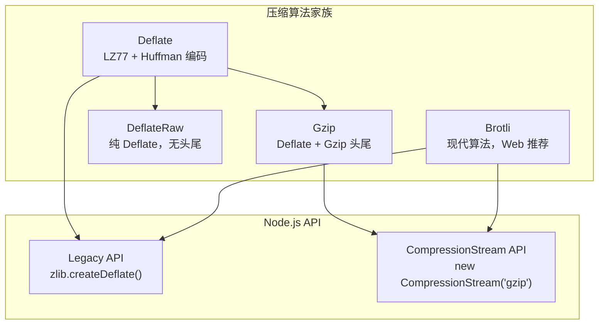
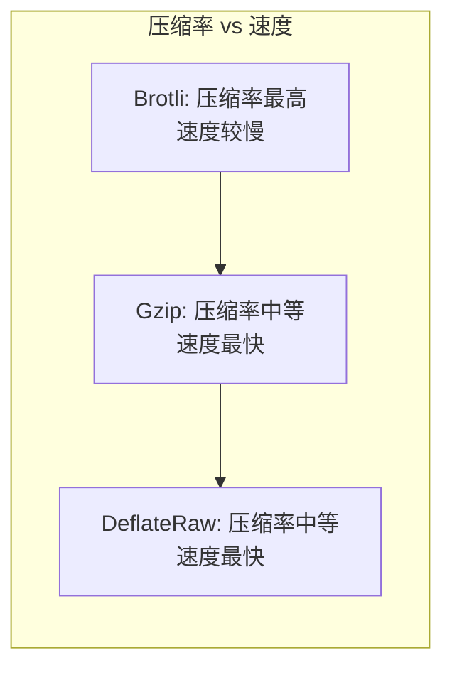
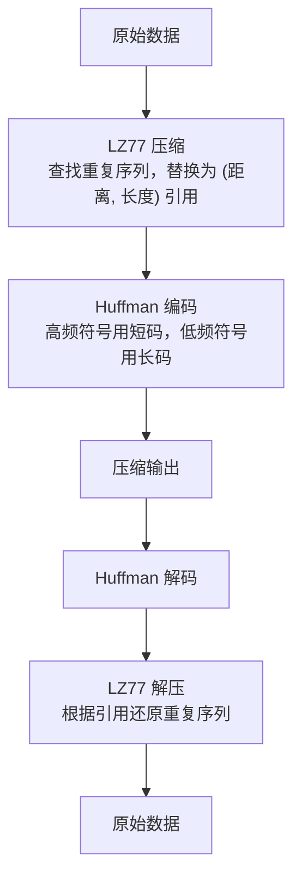
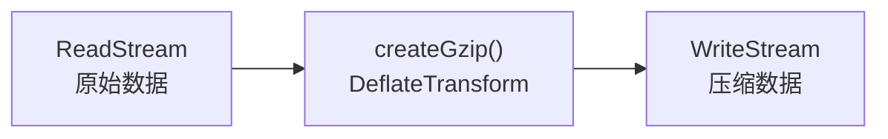
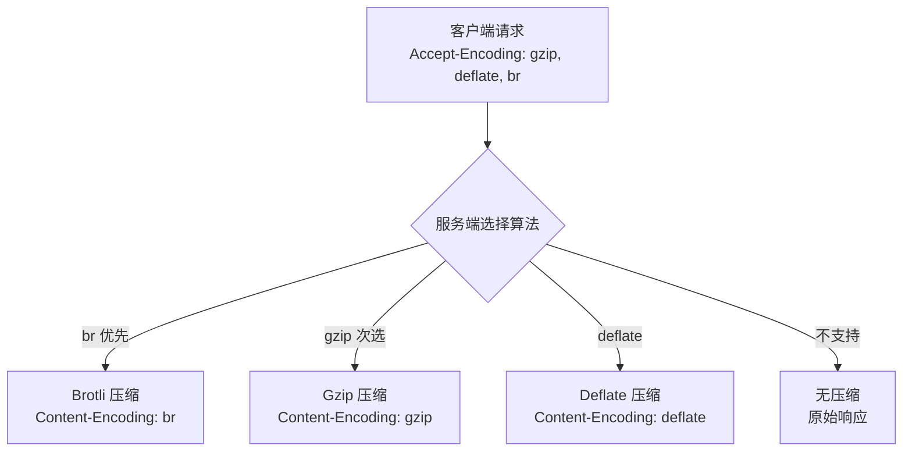

# Zlib 模块

## 概述

`zlib` 模块封装了 **zlib C 库**（由 Jean-loup Gailly 和 Mark Adler 开发），提供数据压缩与解压缩能力。Node.js 的 HTTP 请求/响应体压缩、文件压缩、日志归档等功能都依赖此模块。自 Node.js v17.0.0 起（v18.0.0 起全局可用），还实现了 WHATWG 规范的 `CompressionStream` / `DecompressionStream` API，与浏览器保持一致。



## 压缩算法对比

| 算法 | 格式标识 | 压缩率 | 速度 | 浏览器支持 | 用途 |
|------|---------|--------|------|-----------|------|
| Deflate | `deflate` | 中 | 快 | ✅ | 通用压缩 |
| Gzip | `gzip` | 中 | 快 | ✅ | HTTP 压缩标准 |
| DeflateRaw | `deflateRaw` | 中 | 快 | — | 自定义协议 |
| Brotli | `br` | 高 | 中 | ✅ (HTTPS) | Web 静态资源压缩 |
| Zstandard | — | 高 | 快 | — | Node.js v22+ |



## Deflate/Inflate 工作原理

### LZ77 + Huffman 编码

Deflate 算法由两个阶段组成：



### Gzip 格式结构

Gzip 在 Deflate 之上包装了文件头和校验尾：

```
┌────────────────────────────────────────────────────────┐
│ Gzip 格式                                              │
├──────────┬─────────────────────────────┬──────────────┤
│ Header   │ Compressed Data (Deflate)   │ Footer       │
│ 10 bytes │ 变长                         │ 8 bytes      │
├──────────┼─────────────────────────────┼──────────────┤
│ Magic:   │ LZ77 + Huffman 编码数据      │ CRC32: 4B    │
│ 1f 8b    │                              │ Size: 4B     │
│ CM: 08   │                              │ (原始大小)    │
│ FLG      │                              │              │
│ MTIME    │                              │              │
│ XFL      │                              │              │
│ OS       │                              │              │
└──────────┴─────────────────────────────┴──────────────┘
```

## Node.js Zlib API

### 同步 API

```javascript
const zlib = require('zlib');

// 同步压缩
const compressed = zlib.deflateSync('hello world');
const decompressed = zlib.inflateSync(compressed);
console.log(decompressed.toString());  // 'hello world'

// Gzip
const gzipped = zlib.gzipSync('hello world');
const ungzipped = zlib.gunzipSync(gzipped);

// Brotli
const brotlied = zlib.brotliCompressSync('hello world');
const unbrotlied = zlib.brotliDecompressSync(brotlied);
```

> **注意**：同步 API 会阻塞事件循环，仅适用于小数据量或启动阶段。生产环境应使用流式 API。

### 流式 API（推荐）

```javascript
const zlib = require('zlib');
const fs = require('fs');

// 文件压缩管道
fs.createReadStream('access.log')
  .pipe(zlib.createGzip())
  .pipe(fs.createWriteStream('access.log.gz'));

// 文件解压管道
fs.createReadStream('access.log.gz')
  .pipe(zlib.createGunzip())
  .pipe(fs.createWriteStream('access.log'));
```



### 异步回调 API

```javascript
zlib.gzip('hello world', (err, buffer) => {
  if (err) throw err;
  console.log(buffer.length);  // 压缩后大小

  zlib.gunzip(buffer, (err, result) => {
    if (err) throw err;
    console.log(result.toString());  // 'hello world'
  });
});

// Promise 化
const { promisify } = require('util');
const gzipAsync = promisify(zlib.gzip);
const gunzipAsync = promisify(zlib.gunzip);

const compressed = await gzipAsync('hello world');
const decompressed = await gunzipAsync(compressed);
```

## 压缩选项详解

### Deflate/Gzip 选项

```javascript
zlib.createGzip({
  level: zlib.constants.Z_BEST_COMPRESSION,  // 压缩级别 0-9
  memLevel: 8,        // 内存级别 1-9（影响速度/内存）
  strategy: zlib.constants.Z_DEFAULT_STRATEGY,  // 压缩策略
  windowBits: 15,     // 窗口大小（历史缓冲区）
  chunkSize: 16 * 1024,  // 输出块大小
});
```

| 压缩级别 | 常量 | 压缩率 | 速度 | 适用场景 |
|---------|------|--------|------|---------|
| 0 | `Z_NO_COMPRESSION` | 无 | 最快 | 不压缩 |
| 1 | `Z_BEST_SPEED` | 低 | 快 | 实时数据 |
| 6 | `Z_DEFAULT_COMPRESSION` | 中 | 中 | 通用 |
| 9 | `Z_BEST_COMPRESSION` | 高 | 慢 | 静态资源 |

### Brotli 选项

```javascript
zlib.createBrotliCompress({
  params: {
    [zlib.constants.BROTLI_PARAM_QUALITY]:
      zlib.constants.BROTLI_MAX_QUALITY,  // 质量 0-11
    [zlib.constants.BROTLI_PARAM_LGWIN]:
      22,  // 窗口大小 10-24
  },
});
```

| 质量级别 | 压缩率 | 速度 | 适用场景 |
|---------|--------|------|---------|
| 1 | 低 | 快 | 实时压缩 |
| 4 | 中低 | 中 | 动态内容 |
| 6 | 中 | 中 | 通用 |
| 11 | 高 | 慢 | 静态资源预压缩 |

## HTTP 压缩实战

### 服务端压缩响应

```javascript
const http = require('http');
const zlib = require('zlib');

const server = http.createServer((req, res) => {
  const acceptEncoding = req.headers['accept-encoding'] || '';
  const payload = JSON.stringify({ data: 'large response body...' });

  // 根据客户端支持选择压缩算法
  if (acceptEncoding.includes('br')) {
    res.writeHead(200, { 'Content-Encoding': 'br' });
    zlib.brotliCompress(payload, (_, result) => res.end(result));
  } else if (acceptEncoding.includes('gzip')) {
    res.writeHead(200, { 'Content-Encoding': 'gzip' });
    zlib.gzip(payload, (_, result) => res.end(result));
  } else if (acceptEncoding.includes('deflate')) {
    res.writeHead(200, { 'Content-Encoding': 'deflate' });
    zlib.deflate(payload, (_, result) => res.end(result));
  } else {
    res.writeHead(200);
    res.end(payload);
  }
});
```



### 客户端解压响应

```javascript
const http = require('http');
const zlib = require('zlib');

const options = {
  hostname: 'example.com',
  headers: { 'Accept-Encoding': 'gzip, deflate, br' },
};

http.get(options, (res) => {
  const encoding = res.headers['content-encoding'];
  let decompressStream;

  switch (encoding) {
    case 'br':
      decompressStream = zlib.createBrotliDecompress();
      break;
    case 'gzip':
      decompressStream = zlib.createGunzip();
      break;
    case 'deflate':
      decompressStream = zlib.createInflate();
      break;
    default:
      decompressStream = res;
  }

  let data = '';
  decompressStream.on('data', (chunk) => { data += chunk; });
  decompressStream.on('end', () => { console.log(data); });

  if (decompressStream !== res) {
    res.pipe(decompressStream);
  }
});
```

## CompressionStream — Web 标准 API

Node.js v17.0.0 实现了 WHATWG 规范的 `CompressionStream` / `DecompressionStream`：

```javascript
// CompressionStream（浏览器 + Node.js 通用）
const { ReadableStream, CompressionStream } = require('stream/web');

const readable = new ReadableStream({
  start(controller) {
    controller.enqueue(new TextEncoder().encode('hello world'));
    controller.close();
  },
});

const compressed = readable.pipeThrough(new CompressionStream('gzip'));
const decompressed = compressed.pipeThrough(new DecompressionStream('gzip'));
```

### Legacy vs CompressionStream

| 维度 | Legacy API | CompressionStream |
|------|-----------|-------------------|
| 规范 | Node.js 私有 | WHATWG 标准 |
| 接口 | Node.js Transform Stream | WHATWG TransformStream |
| 算法 | deflate/gzip/deflateRaw/brotli | gzip/deflate/deflate-raw |
| 浏览器兼容 | ❌ | ✅ |
| 流类型 | Node.js Stream | Web Stream |

## 常见陷阱

### 1. 解压时 windowBits 不匹配

```javascript
// ❌ 压缩和解压使用不同的 windowBits
zlib.deflateSync(data, { windowBits: 15 });
zlib.inflateSync(compressed, { windowBits: 8 });  // 可能失败

// ✅ 保持一致，或使用默认值
zlib.deflateSync(data);
zlib.inflateSync(compressed);
```

### 2. 小数据压缩后反而更大

```javascript
const small = 'hi';
zlib.gzipSync(small).length;  // ~26 bytes — 比原始数据更大
```

> Gzip 头部 10 字节 + 尾部 8 字节 = 18 字节固定开销。对小于 ~150 字节的数据，压缩通常没有收益。

### 3. Brotli 与 HTTPS

早期 Chrome/Firefox 出于防止中间代理谎报支持的考虑，仅在 HTTPS 连接中发送 `Accept-Encoding: br`。自 Brotli 被 RFC 7932 标准化后，主流浏览器在 HTTP 下也会发送 `br`，但部分旧版客户端或中间代理环境仍可能只对 HTTPS 启用 Brotli——服务端应始终回退到 gzip。

### 4. 流式解压的 truncated 数据

```javascript
// ❌ 不完整的压缩数据会导致解压流报错
const stream = zlib.createGunzip();
stream.on('error', (err) => {
  if (err.code === 'Z_DATA_ERROR') {
    console.error('数据损坏或不完整');
  }
});
```
