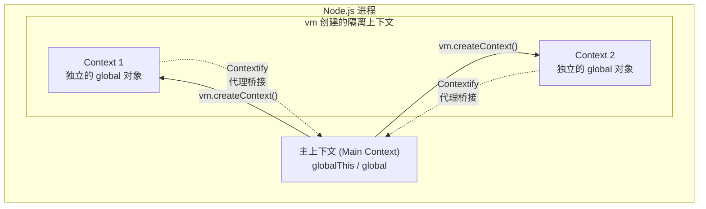
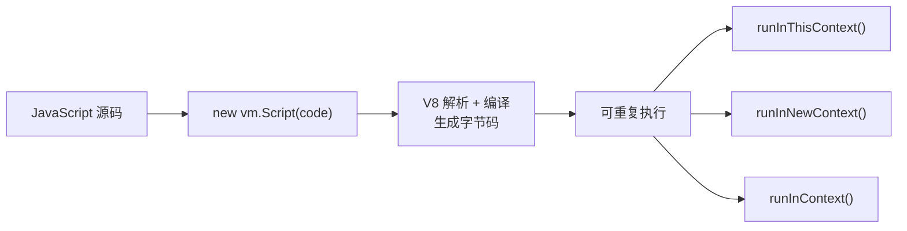
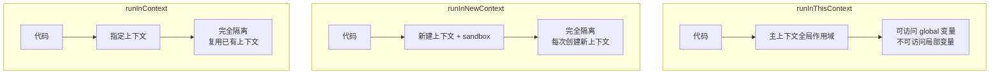
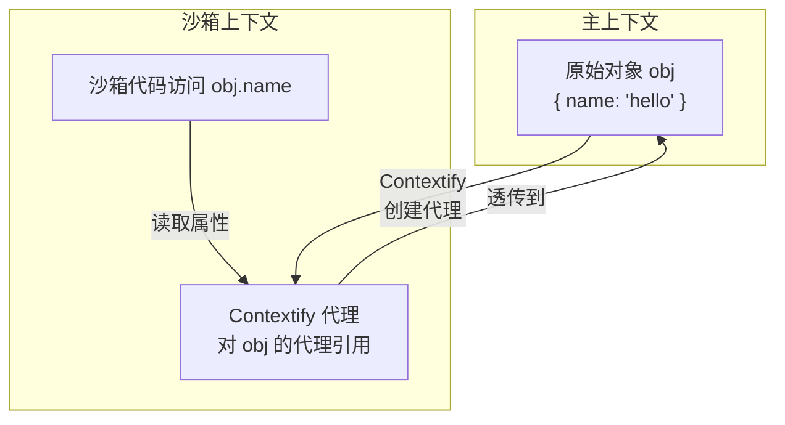
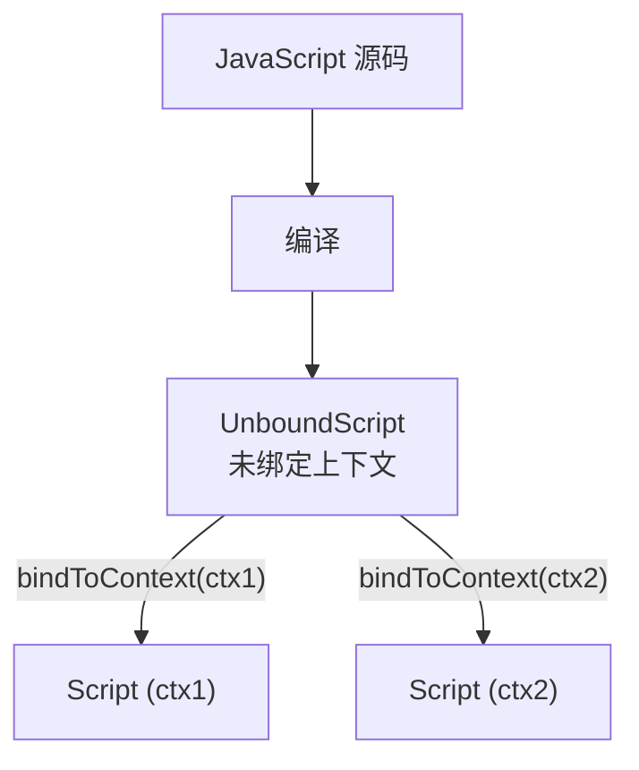
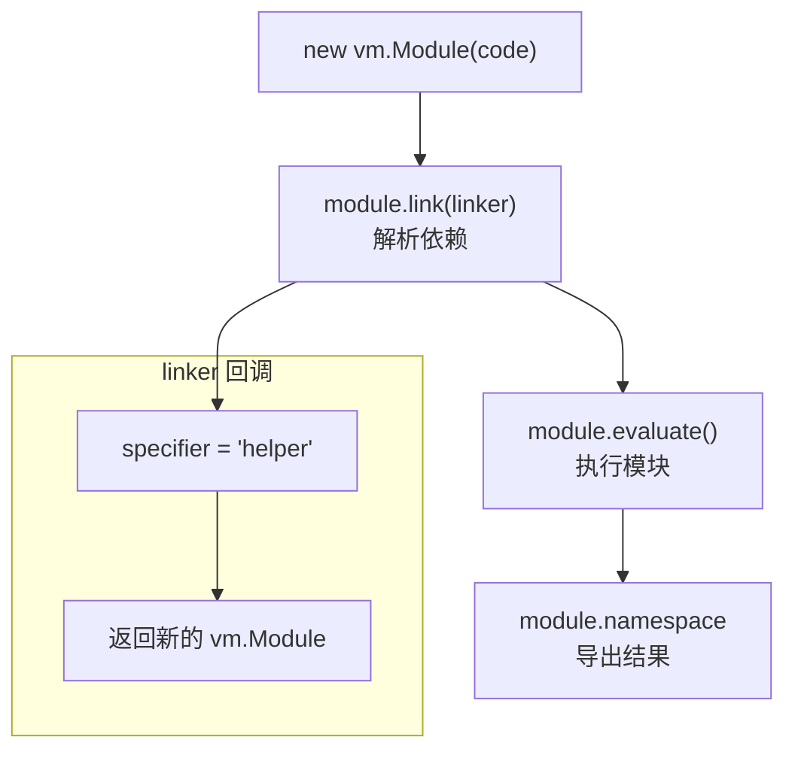
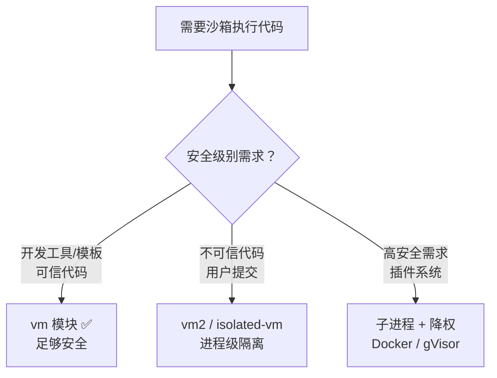

# VM 模块

## 概述

`vm` 模块提供了在 V8 虚拟机环境中编译和运行代码的能力。它允许创建**沙箱化的执行上下文**——与主 JavaScript 上下文隔离的独立运行环境。`vm` 模块是模板引擎、代码沙箱、测试框架等工具的基础设施。理解 `vm` 的内部机制，对于正确使用沙箱隔离和避免安全陷阱至关重要。



## 核心类与 API

### vm.Script — 预编译脚本

`vm.Script` 将 JavaScript 代码预编译为 V8 字节码，可多次执行而无需重新编译：

```javascript
const vm = require('vm');

const script = new vm.Script(`
  let result = 0;
  for (let i = 0; i < 1000; i++) {
    result += i;
  }
  result;
`, {
  filename: 'compute.js',     // 堆栈追踪中的文件名
  lineOffset: 0,              // 行号偏移
  columnOffset: 0,            // 列号偏移
  cachedData: undefined,      // V8 代码缓存（加速后续加载）
  produceCachedData: false,   // 是否生成缓存
  importModuleDynamically: undefined,  // 动态 import 处理
});

// 多次运行（无需重新编译）
const result1 = script.runInThisContext();
const result2 = script.runInThisContext();
```



### vm.Script 的编译缓存

V8 代码缓存（Code Cache）可以显著加速脚本加载——跳过解析和编译步骤：

```javascript
const vm = require('vm');
const fs = require('fs');

// 首次编译，生成缓存（code 为待编译的源码字符串）
const script = new vm.Script(code, { produceCachedData: true });
const cachedData = script.createCachedData();

// 保存缓存到文件
fs.writeFileSync('cache.bin', cachedData);

// 后续加载，使用缓存
const cachedBuffer = fs.readFileSync('cache.bin');
const fastScript = new vm.Script(code, { cachedData: cachedBuffer });

if (fastScript.cachedDataRejected) {
  console.warn('缓存被拒绝（代码或 V8 版本变更）');
}
```

### vm.compileFunction — 函数级编译

```javascript
const fn = vm.compileFunction('return a + b', ['a', 'b'], {
  filename: 'add.js',
  parsingContext: undefined,   // 编译上下文
});

fn(1, 2);  // 3
```

## 执行上下文

### runInThisContext — 在主上下文中执行

```javascript
const script = new vm.Script('globalVar = 42');
script.runInThisContext();
console.log(globalVar);  // 42 — 污染了全局变量
```

> **注意**：`runInThisContext` 在主上下文的全局作用域中执行代码，可以访问主上下文的全局变量，但无法访问调用函数的局部作用域。

### runInNewContext — 在新建上下文中执行

```javascript
const script = new vm.Script('x + y');
const result = script.runInNewContext({ x: 1, y: 2 });
console.log(result);  // 3
```

### runInContext — 在指定上下文中执行

```javascript
const context = vm.createContext({ x: 1, y: 2 });
const script = new vm.Script('x + y');
const result = script.runInContext(context);
console.log(result);  // 3
```

### 三种执行模式的对比



| 维度 | runInThisContext | runInNewContext | runInContext |
|------|-----------------|-----------------|--------------|
| 执行上下文 | 主上下文 | 新建上下文 | 指定上下文 |
| 全局隔离 | ❌ | ✅ | ✅ |
| 性能 | 最快 | 最慢（创建上下文） | 中（复用上下文） |
| 可访问主上下文 | ✅ | ❌ | ❌ |

## V8 上下文隔离机制

### Contextify — 跨上下文对象代理

当沙箱代码访问主上下文传入的对象时，V8 通过 **Contextify** 机制创建代理：



**Contextify 的工作原理**：

1. 主上下文的对象传入沙箱时，V8 创建一个 **ContextifyObject** 作为代理
2. 沙箱代码访问代理对象的属性，实际上是在访问主上下文的原始对象
3. 代理是**双向透传**的——沙箱修改属性会反映到主上下文

```javascript
const vm = require('vm');

const sandbox = { obj: { count: 0 } };
vm.createContext(sandbox);

const script = new vm.Script('obj.count++');
script.runInContext(sandbox);

console.log(sandbox.obj.count);  // 1 — 沙箱修改影响主上下文
```

### UnboundScript

`vm.Script` 在创建时就绑定了编译上下文。V8 内部还有 `UnboundScript` 概念——未绑定到任何上下文的脚本，可在任意上下文中执行：



> Node.js 的 `vm.Script` 对外暴露的是已绑定的 Script，但内部实现利用了 UnboundScript 的机制——同一个 `vm.Script` 实例可以在不同上下文中 `runInContext()`。

### 上下文的生命周期

```javascript
const vm = require('vm');

// 创建上下文
const context = vm.createContext({
  console,           // 注入 console
  setTimeout,        // 注入 Timer
  customProp: 42,    // 自定义属性
});

// 上下文中的 global 对象是独立的
const script = new vm.Script('typeof window');  // 'undefined'
script.runInContext(context);

// 上下文的全局对象就是 sandbox 本身
const checkGlobal = new vm.Script('this === globalThis');
checkGlobal.runInContext(context);  // true（在沙箱上下文中）
```

## vm.Module — ESM 沙箱

Node.js v9.6.0 引入了 `vm.Module`，支持在沙箱中执行 ESM 模块代码。注意：`vm.Module` 是抽象基类，**不能直接实例化**——实际使用 `vm.SourceTextModule`，并需要 `--experimental-vm-modules` 启动参数：

```javascript
// 运行: node --experimental-vm-modules app.js
const vm = require('vm');

async function main() {
  const context = vm.createContext({ console });

  const module = new vm.SourceTextModule(`
    import { helper } from 'helper';
    export const result = helper('world');
  `, {
    context,
    identifier: 'main.mjs',
  });

  // 自定义模块解析
  async function linker(specifier, referencingModule) {
    if (specifier === 'helper') {
      return new vm.SourceTextModule(`
        export function helper(name) {
          return 'Hello, ' + name;
        }
      `, {
        context: referencingModule.context,
        identifier: 'helper.mjs',
      });
    }
    throw new Error(`Unknown module: ${specifier}`);
  }

  await module.link(linker);
  await module.evaluate();
  console.log(module.namespace.result);  // 'Hello, world'
}

main();
```



## 沙箱逃逸 — 安全性分析

> **核心警告**：`vm` 模块**不是安全沙箱**。恶意代码可以通过多种方式逃逸到主上下文。

### 逃逸方法 1：通过原型链

```javascript
const vm = require('vm');

const sandbox = {};
vm.createContext(sandbox);

const script = new vm.Script(`
  this.constructor.constructor('return process')().exit(1)
`);
script.runInContext(sandbox);
// 进程退出！沙箱被逃逸
```

**原理**：`sandbox` 对象的主上下文 `Object` 构造函数可通过原型链获取，进而访问 `Function` 构造器，最终获取 `process` 对象。

### 逃逸方法 2：通过 getter/proxy

```javascript
const sandbox = {
  get __proto__() {
    return this.constructor.constructor('return process')();
  }
};
```

### 逃逸方法 3：通过 WeakRef / FinalizationRegistry

```javascript
// 通过 WeakRef 获取主上下文对象
```

### 安全替代方案



| 方案 | 隔离级别 | 性能 | 安全性 |
|------|---------|------|--------|
| `vm` 模块 | 同进程 V8 隔离 | 高 | ❌ 可逃逸 |
| `isolated-vm` | 同进程多堆 | 中 | ✅ 较安全 |
| `vm2`（已废弃） | 同进程代理 | 中 | ❌ 已有 CVE |
| 子进程 + 权限模型（`--permission`） | 进程级 | 低 | ✅ 安全 |
| Docker / gVisor | 容器级 | 最低 | ✅✅ 最安全 |

## 实践模式

### 1. 模板引擎沙箱

```javascript
const vm = require('vm');

function renderTemplate(template, data) {
  const context = vm.createContext({
    ...data,
    Math,          // 允许使用 Math
    Date,          // 允许使用 Date
    JSON,          // 允许使用 JSON
    parseInt,      // 允许使用 parseInt
    parseFloat,
  });

  const script = new vm.Script(`\`${template}\``);
  return script.runInContext(context);
}

renderTemplate('Hello, ${name}! Today is ${new Date().toLocaleDateString()}', {
  name: 'World',
});
```

### 2. 配置文件安全解析

```javascript
const vm = require('vm');

function safeEvalConfig(code) {
  const sandbox = Object.create(null);  // 无原型链
  sandbox.JSON = JSON;

  vm.createContext(sandbox);

  const script = new vm.Script(`
    (function() {
      ${code}
      return JSON.stringify(typeof exports !== 'undefined' ? exports : {});
    })()
  `);

  return JSON.parse(script.runInContext(sandbox));
}
```

### 3. 测试隔离

```javascript
const vm = require('vm');

class TestRunner {
  constructor() {
    this.contexts = new Map();
  }

  createContext(name) {
    const context = vm.createContext({
      console,
      assert: require('assert'),
      setTimeout,
      clearTimeout,
    });
    this.contexts.set(name, context);
    return context;
  }

  runInContext(name, code) {
    const context = this.contexts.get(name);
    const script = new vm.Script(code, { filename: `${name}.test.js` });
    return script.runInContext(context, { timeout: 5000 });
  }
}
```
