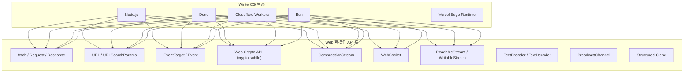
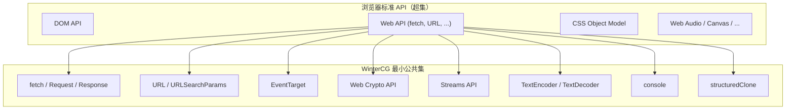
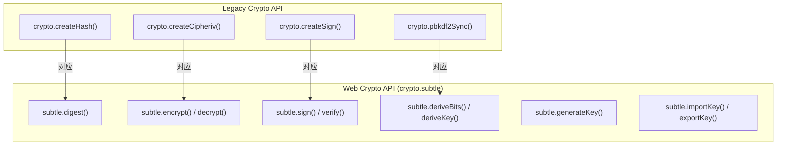
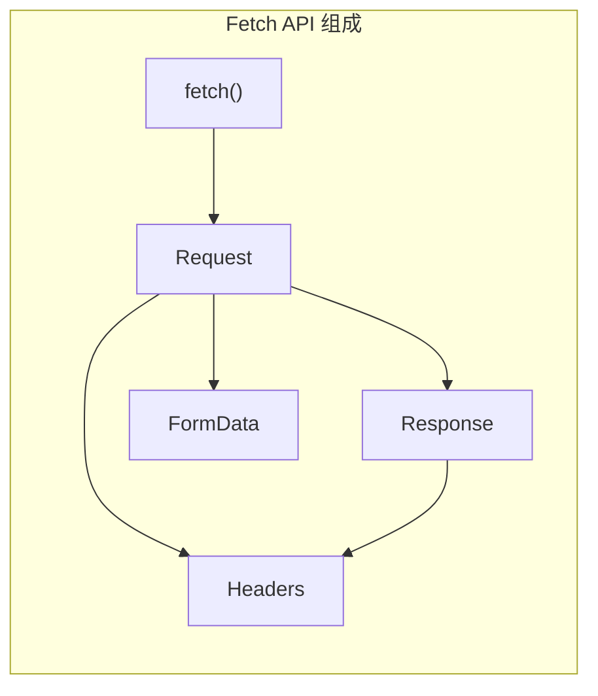
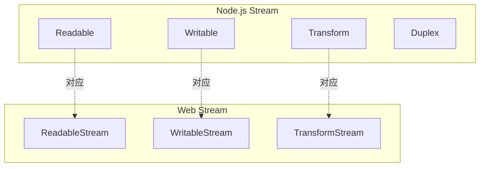
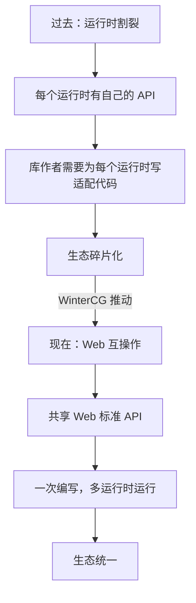

# WinterCG 与 Web 互操作

## 概述

**WinterCG**（Web-interoperable Runtimes Community Group）是 W3C 下的一个社区组，成立于 2022 年，目标是让 JavaScript 运行时（Node.js、Deno、Cloudflare Workers、Bun 等）共享一套**Web 兼容的标准 API**。这一趋势深刻影响了 Node.js 近年来的 API 设计——`fetch`、`URL`、`URLSearchParams`、`EventTarget`、`Web Crypto API`、`CompressionStream` 等 Web API 陆续被引入 Node.js。



## WinterCG 的核心主张

WinterCG 并非要定义新标准，而是推动**现有 Web 标准在非浏览器运行时中的一致实现**：

| 原则 | 说明 |
|------|------|
| **Web 优先** | 优先采用 WHATWG/W3C 已有规范，而非创造新 API |
| **最小公共集** | 定义运行时都应支持的最小 API 集（Minimum Common API） |
| **渐进兼容** | 运行时可以提供超出最小集的 API，但不能与之冲突 |
| **可测试性** | 所有互操作 API 必须有 conformance test |



## Node.js 中的 Web API 融合

Node.js 在近几年逐步引入了大量 Web API，以下按模块梳理：

### URL 模块的 Web 化

```javascript
// Legacy API → WHATWG API
const url = require('url');

// ❌ Legacy: 非标准、宽松解析
const parsed = url.parse('https://example.com/path?q=value');

// ✅ WHATWG: 标准、严格解析
const parsedUrl = new URL('https://example.com/path?q=value');
```

| 功能 | Legacy API | Web API |
|------|-----------|---------|
| URL 解析 | `url.parse()` | `new URL()` |
| 查询参数 | `querystring.parse()` | `new URLSearchParams()` |
| 路径解析 | `url.resolve()` | `new URL(relative, base)` |
| 文件 URL | `url.pathToFileURL()` | `new URL('file:///...')` |

### Events 模块的 Web 化

```javascript
const { EventEmitter } = require('events');

// Node.js 私有 API
const ee = new EventEmitter();
ee.on('data', (chunk) => { /* ... */ });
ee.emit('data', chunk);

// WHATWG 标准 API
const et = new EventTarget();
et.addEventListener('data', (event) => { /* ... */ });
et.dispatchEvent(new CustomEvent('data', { detail: chunk }));
```

| 功能 | EventEmitter | EventTarget |
|------|-------------|-------------|
| 注册 | `.on(type, fn)` | `.addEventListener(type, fn)` |
| 一次性 | `.once(type, fn)` | `.addEventListener(type, fn, { once: true })` |
| 触发 | `.emit(type, ...args)` | `.dispatchEvent(new Event(type))` |
| 移除 | `.off(type, fn)` | `.removeEventListener(type, fn)` |

### Crypto 模块的 Web 化

```javascript
const crypto = require('crypto');

// Legacy API
const hash = crypto.createHash('sha256').update('data').digest('hex');

// Web Crypto API
const hashBuffer = await crypto.subtle.digest('SHA-256', new TextEncoder().encode('data'));
const hashHex = Array.from(new Uint8Array(hashBuffer)).map(b => b.toString(16).padStart(2, '0')).join('');
```



### Zlib 模块的 Web 化

```javascript
const { CompressionStream, DecompressionStream } = require('stream/web');

// Legacy API
const gzip = require('zlib').createGzip();

// Web API — CompressionStream
const compressed = readableStream.pipeThrough(new CompressionStream('gzip'));
const decompressed = compressed.pipeThrough(new DecompressionStream('gzip'));
```

### Fetch API

Node.js v18.0.0 全局提供了 `fetch` API（无需 import）：

```javascript
// Node.js v18+ 内置 fetch
const response = await fetch('https://api.example.com/data', {
  method: 'POST',
  headers: { 'Content-Type': 'application/json' },
  body: JSON.stringify({ key: 'value' }),
});

const data = await response.json();
```



### Web Streams API

Node.js v16.5.0 引入了 Web Streams API：

```javascript
// Node.js Stream
const { Readable } = require('stream');
const nodeStream = Readable.from(['chunk1', 'chunk2']);

// Web Stream
const { ReadableStream } = require('stream/web');
const webStream = new ReadableStream({
  start(controller) {
    controller.enqueue('chunk1');
    controller.enqueue('chunk2');
    controller.close();
  },
});
```



### 其他 Web API

| API | Node.js 版本 | 说明 |
|-----|-------------|------|
| `structuredClone()` | v17.0.0 | 深拷贝（支持循环引用、Date、RegExp、ArrayBuffer 等） |
| `BroadcastChannel` | v15.4.0 | 进程间消息广播 |
| `TextEncoder` / `TextDecoder` | v11.0.0 | 字符串与 Uint8Array 转换 |
| `DOMException` | v17.0.0 | 标准 Error 子类 |
| `Blob` | v18.0.0 | 不可变二进制数据 |
| `File` | v20.0.0 | 带文件名的 Blob |
| `crypto.getRandomValues()` | v17.4.0 | 安全随机数 |
| `crypto.randomUUID()` | v16.7.0 | UUID v4 生成 |
| `perf_hooks.performance` | v8.5.0 | 高精度时间戳（与 Web `performance` 兼容） |
| `navigator` | v21.0.0 | 运行时信息（`navigator.userAgent`） |

## Node.js vs Deno vs Bun 互操作对比

| Web API | Node.js | Deno | Bun | Cloudflare Workers |
|---------|---------|------|-----|-------------------|
| `fetch` | ✅ v18 | ✅ | ✅ | ✅ |
| `URL` | ✅ v10 | ✅ | ✅ | ✅ |
| `URLSearchParams` | ✅ v10 | ✅ | ✅ | ✅ |
| `EventTarget` | ✅ v15 | ✅ | ✅ | ✅ |
| `Web Crypto` | ✅ v15 | ✅ | ✅ | ✅ |
| `CompressionStream` | ✅ v18 | ✅ | ✅ | ✅ |
| `WebSocket` | ✅ v22 | ✅ | ✅ | ✅ |
| `ReadableStream` | ✅ v16 | ✅ | ✅ | ✅ |
| `Blob` | ✅ v18 | ✅ | ✅ | ✅ |
| `File` | ✅ v20 | ✅ | ✅ | ⚠️ |
| `BroadcastChannel` | ✅ v15 | ✅ | ✅ | ❌ |
| `DOMException` | ✅ v17 | ✅ | ✅ | ✅ |
| `import.meta` | ✅ v10 | ✅ | ✅ | ✅ |

## 编写跨运行时代码的实践

### 1. 使用 Web API 优先

```javascript
// ❌ 运行时特定 API
const crypto = require('crypto');
const hash = crypto.createHash('sha256').update(data).digest('hex');

// ✅ Web API — 跨运行时兼容
async function sha256(data) {
  const buffer = await crypto.subtle.digest('SHA-256', new TextEncoder().encode(data));
  return Array.from(new Uint8Array(buffer)).map(b => b.toString(16).padStart(2, '0')).join('');
}
```

### 2. 避免运行时特定全局变量

```javascript
// ❌ Node.js 特有
process.env.NODE_ENV;
Buffer.from('hello');
__dirname;

// ✅ Web 兼容替代
// process.env → 无直接替代，需运行时特定适配
// Buffer → Uint8Array
new TextEncoder().encode('hello');
// __dirname → import.meta
import.meta.url;  // ESM 中
```

### 3. 条件导入

```javascript
// 跨运行时的模块导入
let fs;
if (typeof process !== 'undefined' && process.versions?.node) {
  fs = await import('node:fs');
} else if (typeof Deno !== 'undefined') {
  fs = await import('https://deno.land/std/fs/mod.ts');
}
```

### 4. polyfill 策略

```javascript
// 为旧版 Node.js 提供 fetch polyfill
if (typeof globalThis.fetch === 'undefined') {
  globalThis.fetch = (await import('node-fetch')).default;
}
```

## Web-interoperable Runtime 的意义



**核心影响**：

1. **库作者受益**：使用 Web API 编写的库可以同时在 Node.js、Deno、Cloudflare Workers、Bun 上运行
2. **企业受益**：代码可以在不同运行时间迁移，不被锁定
3. **标准受益**：推动 Web 标准考虑服务端场景（如 `WebSocket` 在 Node.js v22 成为内置 API）
4. **开发者受益**：学习一套 API，到处可用

## 展望

WinterCG 的下一步重点方向：

- **WebAssembly Component Model** — 标准化 Wasm 模块的跨运行时互操作
- **WebSocket 标准化** — 统一 `WebSocket` API 的行为细节
- **Web Transport** — HTTP/3 传输 API
- **Scheduler API** — 优先级调度（`scheduler.postTask()`）
- **更好的错误码** — 统一 `DOMException` 的错误类型
