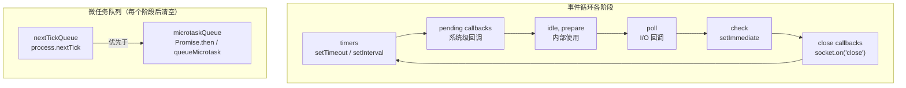
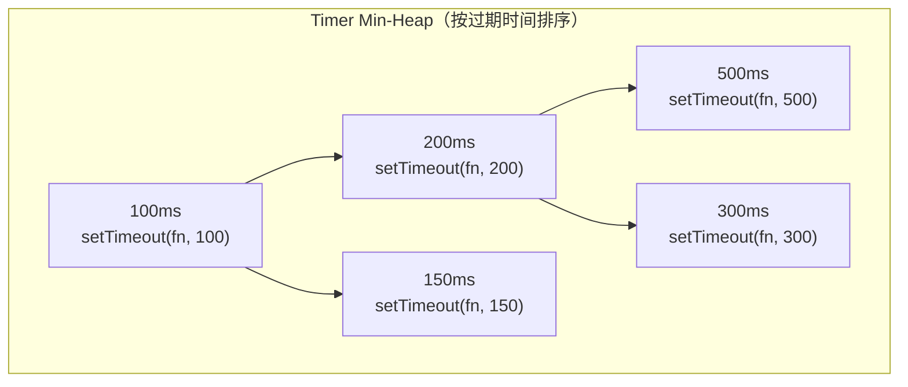
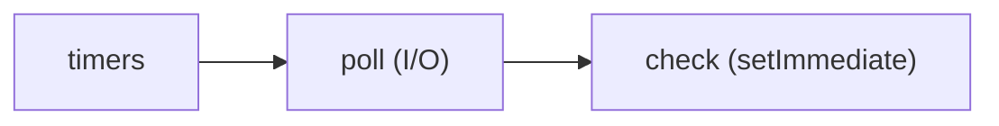
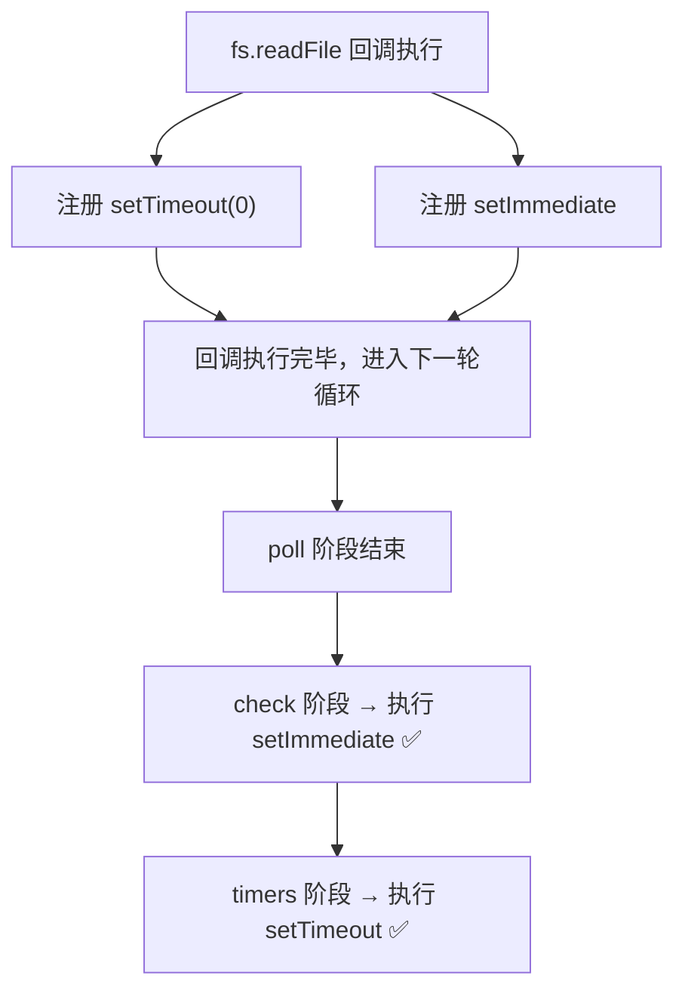
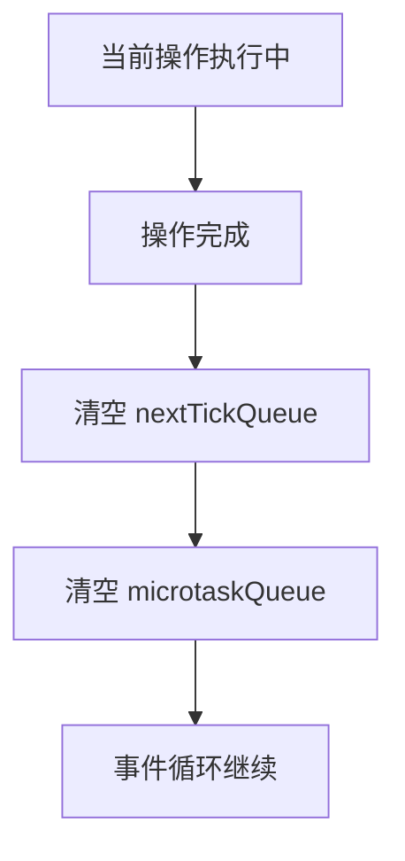
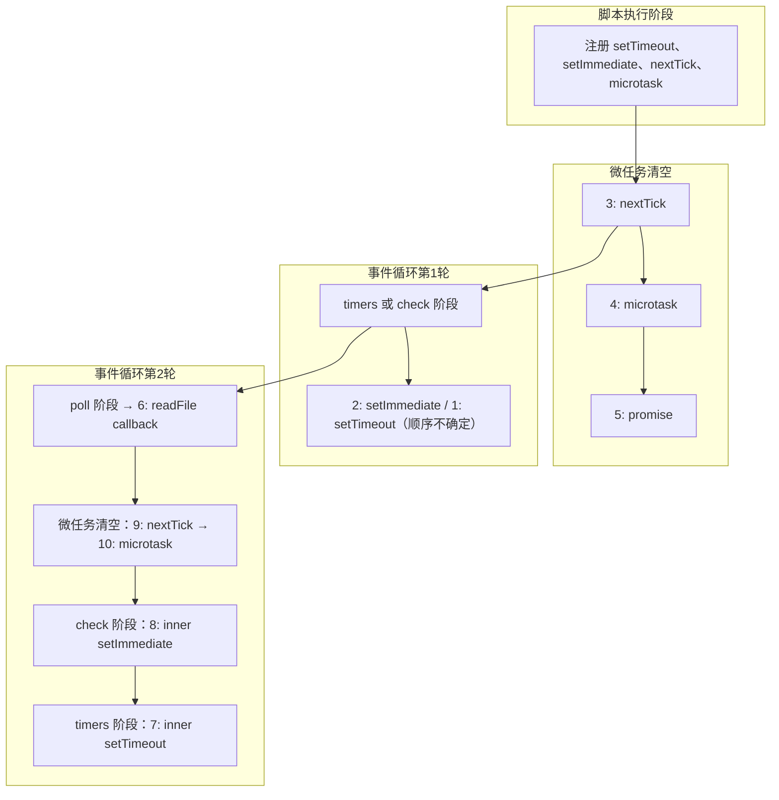
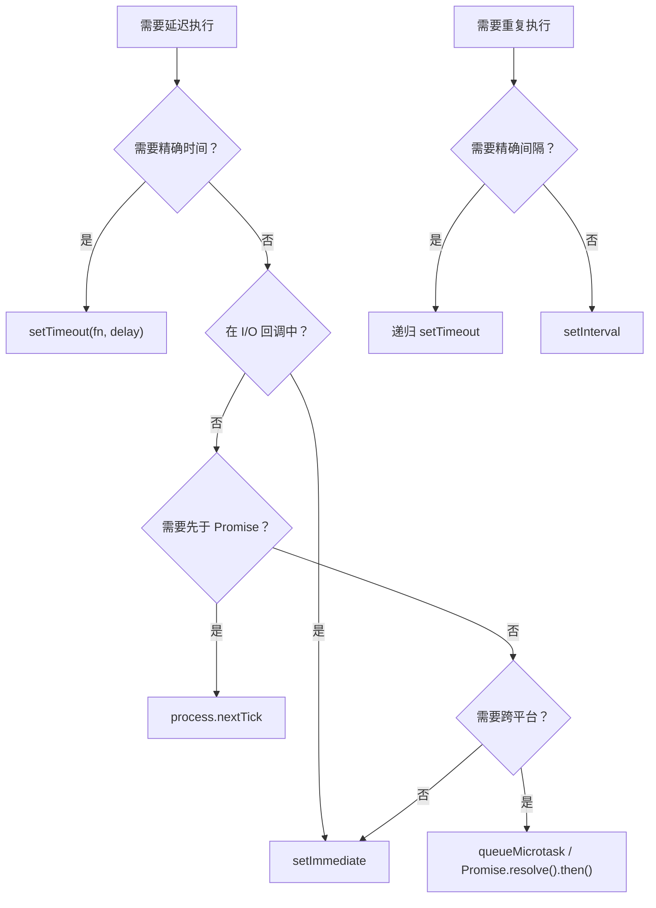

# Timer 与微任务调度

## 概述

Node.js 的异步调度并非单一的"事件循环"概念，而是一套由**多个优先级队列**组成的精密调度系统。`setTimeout`、`setInterval`、`setImmediate`、`process.nextTick`、`queueMicrotask` 各自对应不同的队列，在事件循环的不同阶段被取出执行。理解这些 API 的调度时序，是写出正确异步代码的前提——尤其是在 I/O 回调中混用 Timer 时，微妙的时序差异可能导致难以复现的 Bug。



## setTimeout / setInterval — 最小堆调度

### 底层实现：Min-Heap

Node.js 的 Timer 并非由操作系统的定时器实现，而是在 JavaScript 层维护了一个**最小堆（Min-Heap）**数据结构：



每次事件循环进入 **timers 阶段**时，Node.js 会：

1. 取出堆顶元素，检查 `expiry` 是否 ≤ 当前时间
2. 如果已过期，执行回调，重新堆化
3. 如果未过期，停止处理（因为是最小堆，堆顶未过期意味着所有 Timer 都未过期）
4. 重复直到堆为空或堆顶未过期

```javascript
// Node.js 内部简化逻辑 (lib/internal/timers.js)
function processTimers(now) {
  while (timerHeap.peek() !== null) {
    const timer = timerHeap.peek();
    if (timer.expiry > now) break;  // 堆顶未过期，停止
    timerHeap.pop();
    timer.callback();
  }
}
```

### setTimeout 的 1ms 最小延迟

HTML5 规范规定浏览器中 `setTimeout(fn, 0)` 的最小延迟为 4ms，但 **Node.js 没有这个限制**——最小延迟为 1ms：

```javascript
// Node.js 中
setTimeout(() => console.log('1ms'), 1);  // 至少 1ms
setTimeout(() => console.log('0ms'), 0);  // 等价于 1ms
```

> 但实际延迟还受事件循环繁忙程度的影响。如果 poll 阶段有大量 I/O 回调，Timer 的执行会被推迟。

### setTimeout 的不精确性

```javascript
const start = Date.now();
setTimeout(() => {
  console.log(`实际延迟: ${Date.now() - start}ms`);
}, 100);

// 如果事件循环中有阻塞操作：
// 阻塞 200ms → Timer 在 200ms 后才被检查
// 实际延迟可能是 200ms 而非 100ms
```

Timer 的 `delay` 参数是**最短等待时间**，不是精确的执行时间。延迟 = max(delay, 事件循环空闲时间)。

### setInterval 的漂移问题

```javascript
// setInterval 的时间漂移
const interval = setInterval(() => {
  console.log(Date.now());
}, 100);

// 如果回调执行耗时 50ms：
// 实际间隔：100ms（调度间隔），而非 150ms
// 下次回调不会等上一个回调执行完再计时
// 而是以上一次回调的调度时间为基准

// 如果回调耗时 > 100ms：
// 回调会连续触发，无间隔——导致"堆积"
```



```mermaid
gantt
    title setInterval 的调度行为
    dateFormat X
    axisFormat %L

    section 回调执行 50ms
    回调1 (50ms) :a1, 0, 50
    回调2 (50ms) :a2, 100, 150
    回调3 (50ms) :a3, 200, 250

    section 回调执行 120ms
    回调1 (120ms) :b1, 0, 120
    回调2 (120ms) :b2, 120, 240
    回调3 (120ms) :b3, 240, 360
```

**精确间隔的实现**：使用递归 `setTimeout` 代替 `setInterval`：

```javascript
function preciseInterval(fn, delay) {
  const start = Date.now();
  let count = 0;

  function tick() {
    fn();
    count++;
    const next = start + count * delay;
    const remaining = next - Date.now();
    setTimeout(tick, Math.max(0, remaining));
  }

  setTimeout(tick, delay);
}
```

## setImmediate — Check 阶段

`setImmediate` 在事件循环的 **check 阶段**执行，位于 I/O 回调之后：



### setImmediate vs setTimeout(0) 的时序竞争

在非 I/O 上下文中，两者的执行顺序**不可预测**：

```javascript
// 在脚本顶层（非 I/O 上下文）
setTimeout(() => console.log('timeout'), 0);
setImmediate(() => console.log('immediate'));

// 输出顺序不确定！
// 可能是 timeout → immediate
// 也可能是 immediate → timeout
```

**原因**：脚本执行完毕后，事件循环进入哪个阶段取决于进程启动耗时。如果启动耗时 > 1ms，Timer 已过期，先进入 timers 阶段；否则先进入 poll 阶段，由于没有 I/O，跳到 check 阶段。

### 在 I/O 上下文中——setImmediate 必定优先

```javascript
const fs = require('fs');

fs.readFile(__filename, () => {
  setTimeout(() => console.log('timeout'), 0);
  setImmediate(() => console.log('immediate'));
});

// 输出始终是：
// immediate
// timeout
```



> **实践规则**：在 I/O 回调中，如果需要"尽快执行"的回调，始终用 `setImmediate` 而非 `setTimeout(0)`——前者保证在当前 I/O 处理完毕后立即执行，后者可能被推迟到下一轮事件循环。

## process.nextTick — nextTickQueue

`process.nextTick` 是 Node.js 独有的调度 API，它不属于事件循环的任何阶段，而是在**当前操作完成后、事件循环继续之前**立即执行：



### nextTick 的绝对优先级

```javascript
Promise.resolve().then(() => console.log('microtask'));
process.nextTick(() => console.log('nextTick'));

// 输出：
// nextTick
// microtask
```

`nextTickQueue` 的优先级**高于** `microtaskQueue`（Promise）。每次清空微任务时，先执行完所有 `nextTick`，再执行 `microtask`。而且如果 `nextTick` 回调中又注册了 `nextTick`，新注册的也会在当前微任务清空阶段执行——这意味着**无限递归的 `nextTick` 会完全阻塞事件循环**：

```javascript
// ⚠️ 危险：无限递归 nextTick 会卡死进程
process.nextTick(function tick() {
  process.nextTick(tick);
});
// 事件循环永远不会继续——下一个阶段永远不会到达
```

### nextTick 的设计意图

`process.nextTick` 存在的核心原因是**保证 API 的同步语义**——在对象构造完成后立即执行回调，避免用户拿到未完全初始化的对象：

```javascript
class EventEmitter {
  constructor() {
    this.events = {};
  }

  emit(event) {
    // ...触发事件
  }

  on(event, listener) {
    this.events[event] = this.events[event] || [];
    this.events[event].push(listener);
  }
}

// 问题场景
const emitter = new EventEmitter();
emitter.on('event', () => console.log('handled'));

// 如果 emit 是同步的，下面的代码永远不会被调用
// 因为事件在 on 注册之前就触发了

// 解决方案：用 nextTick 延迟到下一个微任务
class DeferredEmitter {
  constructor() {
    this.events = {};
    this._queue = [];
  }

  emit(event) {
    process.nextTick(() => {
      this._queue.forEach(cb => cb());
    });
  }
}
```

### nextTick 没有深度限制

早期 Node（0.10 及以前）曾用 `process.maxTickDepth`（默认 1000）限制 nextTick 递归深度、超出抛出 `RangeError`，但该机制在 Node 0.12 中已被移除。现代 Node 对 `nextTickQueue` **没有任何深度限制**——无限递归不会报错，而是让事件循环永远停在这一步（见上文"危险"示例）。

## queueMicrotask — 标准化微任务

`queueMicrotask` 是 WHATWG 规范定义的标准 API，Node.js 从 v11.0.0 开始支持。它与 `Promise.resolve().then()` 等价，但语义更明确：

```javascript
// 三种等价的微任务注册方式
queueMicrotask(() => console.log('microtask 1'));
Promise.resolve().then(() => console.log('microtask 2'));
new Promise(resolve => resolve()).then(() => console.log('microtask 3'));
```

### queueMicrotask vs process.nextTick

| 维度 | `process.nextTick` | `queueMicrotask` |
|------|-------------------|-----------------|
| 规范 | Node.js 私有 API | WHATWG 标准 |
| 优先级 | 高于微任务队列 | 微任务队列 |
| 递归保护 | 无（Node 0.12 起移除 maxTickDepth，无限递归会饿死事件循环） | 无（同样会阻塞事件循环） |
| 可移植性 | 仅 Node.js | 浏览器 + Node.js + Deno |
| 使用场景 | 保证 API 同步语义 | 通用微任务调度 |

> **最佳实践**：优先使用 `queueMicrotask` 或 `Promise.resolve().then()`，仅在需要"先于 Promise"的特定场景下使用 `process.nextTick`。

## 完整时序对比

以下代码展示所有调度 API 的执行时序：

```javascript
const fs = require('fs');

// 顶层注册
setTimeout(() => console.log('1: setTimeout'), 0);
setImmediate(() => console.log('2: setImmediate'));
process.nextTick(() => console.log('3: nextTick'));
queueMicrotask(() => console.log('4: microtask'));
Promise.resolve().then(() => console.log('5: promise'));

// I/O 上下文
fs.readFile(__filename, () => {
  console.log('6: readFile callback');
  setTimeout(() => console.log('7: inner setTimeout'), 0);
  setImmediate(() => console.log('8: inner setImmediate'));
  process.nextTick(() => console.log('9: inner nextTick'));
  queueMicrotask(() => console.log('10: inner microtask'));
});
```

可能的输出（I/O 回调场景）：

```
3: nextTick         ← nextTick 最高优先级
4: microtask        ← 微任务队列
5: promise          ← 微任务队列
2: setImmediate     ← 顶层 setImmediate 可能先于 setTimeout
1: setTimeout       ← 顶层 setTimeout
6: readFile callback ← I/O 回调
9: inner nextTick   ← I/O 回调后的 nextTick
10: inner microtask ← I/O 回调后的微任务
8: inner setImmediate ← I/O 回调后 setImmediate 必定先于 setTimeout
7: inner setTimeout   ← I/O 回调后 setTimeout
```



## 调度 API 选择决策



| 场景 | 推荐API | 原因 |
|------|---------|------|
| 定时执行（精确时间） | `setTimeout` | Min-Heap 保证时间顺序 |
| I/O 后尽快执行 | `setImmediate` | Check 阶段在 I/O 后立即到达 |
| 保证同步语义后执行 | `process.nextTick` | 当前操作完成后立即执行 |
| 通用微任务 | `queueMicrotask` | 标准化、可移植 |
| 精确重复执行 | 递归 `setTimeout` | 避免漂移和堆积 |
| 粗略重复执行 | `setInterval` | 简单直接 |
