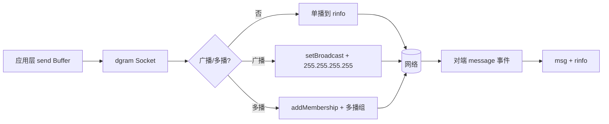

# UDP 通信

UDP（User Datagram Protocol）是一种无连接的、不可靠的传输层协议，提供面向事务的简单不可靠信息传送服务。

## 基本概念

### UDP 特点

- **无连接**：发送数据前不需要建立连接
- **不可靠**：不保证数据送达、不保证顺序
- **高效**：无连接开销，传输速度快
- **面向数据报**：保留消息边界

### UDP vs TCP

| 特性 | UDP | TCP |
|------|-----|-----|
| 连接 | 无连接 | 面向连接 |
| 可靠性 | 不可靠 | 可靠 |
| 顺序 | 不保证 | 保证顺序 |
| 速度 | 快 | 较慢 |
| 边界 | 保留消息边界 | 流式（无边界） |
| 开销 | 低 | 高 |

### 适用场景

- 实时音视频传输
- 在线游戏
- DNS 查询
- 广播/多播
- 实时数据推送

## 数据报生命周期



## 创建 UDP 服务器

### 基本示例

```javascript
const dgram = require('dgram');

// 创建 Socket
const server = dgram.createSocket('udp4');

// 监听消息
server.on('message', (msg, rinfo) => {
  console.log('收到消息:', msg.toString());
  console.log('来自:', rinfo.address, rinfo.port);

  // 发送响应
  server.send('服务器收到: ' + msg, rinfo.port, rinfo.address);
});

// 监听错误
server.on('error', (err) => {
  console.error('服务器错误:', err);
  server.close();
});

// 开始监听
server.bind(3000, () => {
  console.log('UDP 服务器运行在端口 3000');
});
```

### 获取地址信息

```javascript
const server = dgram.createSocket('udp4');

server.bind(3000, () => {
  const address = server.address();
  console.log('地址:', address.address);
  console.log('端口:', address.port);
  console.log('协议:', address.family);
});
```

## 创建 UDP 客户端

### 基本示例

```javascript
const dgram = require('dgram');

const client = dgram.createSocket('udp4');

// 发送消息
const message = Buffer.from('Hello UDP Server');

client.send(message, 3000, 'localhost', (err) => {
  if (err) {
    console.error('发送失败:', err);
    client.close();
    return;
  }
  console.log('消息已发送');
});

// 接收响应
client.on('message', (msg, rinfo) => {
  console.log('收到响应:', msg.toString());
  console.log('来自:', rinfo.address, rinfo.port);

  client.close();
});

// 错误处理
client.on('error', (err) => {
  console.error('客户端错误:', err);
  client.close();
});
```

### 发送多种数据

```javascript
const dgram = require('dgram');
const client = dgram.createSocket('udp4');

// 发送字符串
client.send('Hello', 3000, 'localhost');

// 发送 Buffer
client.send(Buffer.from('Hello'), 3000, 'localhost');

// 发送数组（多个 Buffer）
client.send([Buffer.from('Hello'), Buffer.from('World')], 3000, 'localhost');

// 指定目标端口并在回调中关闭
client.send('Hello', 3000, 'localhost', () => {
  client.close();
});
```

## 广播通信

### 服务端（接收广播）

```javascript
const dgram = require('dgram');

const server = dgram.createSocket('udp4');

server.on('message', (msg, rinfo) => {
  console.log('收到广播消息:', msg.toString());
});

server.bind(3000, () => {
  console.log('服务器等待广播消息...');
});
```

### 客户端（发送广播）

```javascript
const dgram = require('dgram');

const client = dgram.createSocket('udp4');

// 开启广播
client.bind(() => {
  client.setBroadcast(true);

  const message = Buffer.from('广播消息');

  // 发送广播（255.255.255.255）
  client.send(message, 3000, '255.255.255.255', (err) => {
    if (err) console.error(err);
    console.log('广播已发送');
    client.close();
  });
});
```

### 指定广播地址

```javascript
const dgram = require('dgram');

const client = dgram.createSocket('udp4');

client.bind(() => {
  client.setBroadcast(true);

  // 发送到特定子网广播地址
  // 如 192.168.1.255
  client.send('Hello', 3000, '192.168.1.255', () => {
    client.close();
  });
});
```

## 多播通信

### 服务端（加入多播组）

```javascript
const dgram = require('dgram');

const server = dgram.createSocket('udp4');

server.on('message', (msg, rinfo) => {
  console.log('收到多播消息:', msg.toString());
});

server.bind(3000, () => {
  // 加入多播组
  server.addMembership('230.185.192.108');

  console.log('已加入多播组 230.185.192.108');
});
```

### 客户端（发送多播）

```javascript
const dgram = require('dgram');

const client = dgram.createSocket('udp4');

// 设置多播 TTL（生存时间）
client.setMulticastTTL(128);

// 发送多播消息
const message = Buffer.from('多播消息');

client.send(message, 3000, '230.185.192.108', (err) => {
  if (err) console.error(err);
  console.log('多播已发送');
  client.close();
});
```

### 多播选项

```javascript
const server = dgram.createSocket('udp4');

server.bind(3000, () => {
  // 加入多播组
  server.addMembership('230.185.192.108', '192.168.1.100');

  // 设置多播接口
  server.setMulticastInterface('192.168.1.100');

  // 设置多播回环（是否接收自己发送的消息）
  server.setMulticastLoopback(true);
});

// 离开多播组
// server.dropMembership('230.185.192.108');
```

## 实时聊天示例

### 服务端

```javascript
const dgram = require('dgram');

const server = dgram.createSocket('udp4');
const clients = new Map();

server.on('message', (msg, rinfo) => {
  try {
    const data = JSON.parse(msg.toString());
    const clientId = `${rinfo.address}:${rinfo.port}`;

    switch (data.type) {
      case 'join':
        // 用户加入
        clients.set(clientId, { address: rinfo.address, port: rinfo.port, name: data.name });
        broadcast(`用户 ${data.name} 加入了聊天室`);
        console.log(`${data.name} 已加入，当前用户数: ${clients.size}`);
        break;

      case 'chat':
        // 聊天消息
        const client = clients.get(clientId);
        if (client) {
          broadcast(`${client.name}: ${data.content}`, clientId);
        }
        break;

      case 'leave':
        // 用户离开
        const leavingClient = clients.get(clientId);
        if (leavingClient) {
          clients.delete(clientId);
          broadcast(`用户 ${leavingClient.name} 离开了聊天室`);
        }
        break;
    }
  } catch (e) {
    console.error('消息解析失败:', e);
  }
});

function broadcast(message, excludeId = null) {
  const data = JSON.stringify({ type: 'broadcast', content: message });

  clients.forEach((client, id) => {
    if (id !== excludeId) {
      server.send(data, client.port, client.address);
    }
  });
}

server.bind(3000, () => {
  console.log('UDP 聊天服务器运行在端口 3000');
});
```

### 客户端

```javascript
const dgram = require('dgram');
const readline = require('readline');

const client = dgram.createSocket('udp4');
const rl = readline.createInterface({
  input: process.stdin,
  output: process.stdout
});

// 接收消息
client.on('message', (msg) => {
  console.log(msg.toString());
});

// 加入聊天室
const name = process.argv[2] || 'Anonymous';
const joinMsg = JSON.stringify({ type: 'join', name });

client.send(joinMsg, 3000, 'localhost');

// 发送消息
rl.on('line', (input) => {
  if (input === '/quit') {
    const leaveMsg = JSON.stringify({ type: 'leave' });
    client.send(leaveMsg, 3000, 'localhost', () => {
      client.close();
      rl.close();
    });
  } else {
    const chatMsg = JSON.stringify({ type: 'chat', content: input });
    client.send(chatMsg, 3000, 'localhost');
  }
});

client.on('close', () => {
  console.log('已断开连接');
});
```

## DNS 查询示例

```javascript
const dgram = require('dgram');

// DNS 服务器地址（Google DNS）
const DNS_SERVER = '8.8.8.8';
const DNS_PORT = 53;

// 构建 DNS 查询包
function buildDNSQuery(domain) {
  // DNS 报文头部
  const header = Buffer.alloc(12);
  header.writeUInt16BE(0x0001, 0);  // ID
  header.writeUInt16BE(0x0100, 2);  // 标志：标准查询
  header.writeUInt16BE(0x0001, 4);  // 问题数
  header.writeUInt16BE(0x0000, 6);  // 资源记录数
  header.writeUInt16BE(0x0000, 8);  // 授权记录数
  header.writeUInt16BE(0x0000, 10); // 附加记录数

  // 构建域名部分
  const parts = domain.split('.');
  const question = [];
  parts.forEach(part => {
    question.push(part.length);
    question.push(...Buffer.from(part));
  });
  question.push(0); // 结束标记

  const questionBuffer = Buffer.from(question);
  const typeClass = Buffer.from([0x00, 0x01, 0x00, 0x01]); // A 记录，IN 类

  return Buffer.concat([header, questionBuffer, typeClass]);
}

// 解析 DNS 响应
function parseDNSResponse(buffer) {
  // 跳过头部和问题部分
  let offset = 12;

  // 跳过域名
  while (buffer[offset] !== 0) {
    offset += buffer[offset] + 1;
  }
  offset += 5; // 0x00 + type(2) + class(2)

  // 读取回答
  const answers = [];
  const answerCount = buffer.readUInt16BE(6);

  for (let i = 0; i < answerCount; i++) {
    offset += 2; // 指针
    offset += 2; // type
    offset += 2; // class
    offset += 4; // TTL

    const dataLen = buffer.readUInt16BE(offset);
    offset += 2;

    if (dataLen === 4) { // IPv4
      const ip = `${buffer[offset]}.${buffer[offset + 1]}.${buffer[offset + 2]}.${buffer[offset + 3]}`;
      answers.push(ip);
    }
    offset += dataLen;
  }

  return answers;
}

// 发送 DNS 查询
function queryDNS(domain) {
  return new Promise((resolve, reject) => {
    const client = dgram.createSocket('udp4');
    const query = buildDNSQuery(domain);

    client.send(query, DNS_PORT, DNS_SERVER, (err) => {
      if (err) {
        client.close();
        reject(err);
      }
    });

    client.on('message', (msg) => {
      const answers = parseDNSResponse(msg);
      client.close();
      resolve(answers);
    });

    client.on('error', (err) => {
      client.close();
      reject(err);
    });
  });
}

// 使用
queryDNS('google.com').then(ips => {
  console.log('IP 地址:', ips);
}).catch(console.error);
```

## Socket 选项

```javascript
const server = dgram.createSocket('udp4');

server.bind(3000, () => {
  // 获取/设置接收缓冲区大小
  const recvBufferSize = server.getRecvBufferSize();
  server.setRecvBufferSize(1024 * 1024);

  // 获取/设置发送缓冲区大小
  const sendBufferSize = server.getSendBufferSize();
  server.setSendBufferSize(1024 * 1024);

  // 设置 TTL
  server.setTTL(64);

  // 开启广播
  server.setBroadcast(true);

  // 设置多播 TTL
  server.setMulticastTTL(128);

  // 设置多播回环
  server.setMulticastLoopback(true);

  console.log('Socket 选项已设置');
});
```

## IPv6 支持

```javascript
const dgram = require('dgram');

// 创建 IPv6 Socket
const server = dgram.createSocket('udp6');

server.on('message', (msg, rinfo) => {
  console.log('收到消息:', msg.toString());
  console.log('来自:', rinfo.address, rinfo.port);
  console.log('协议:', rinfo.family); // IPv6
});

server.bind(3000, '::', () => {
  console.log('UDP IPv6 服务器运行在端口 3000');
});
```

## 事件列表

| 事件 | 说明 |
|------|------|
| `message` | 接收到数据报 |
| `listening` | Socket 开始监听 |
| `close` | Socket 关闭 |
| `error` | 发生错误 |

## 最佳实践

### 1. 消息确认机制

由于 UDP 不可靠，可以在应用层实现确认机制：

```javascript
let sequence = 0;

function sendReliable(socket, msg, port, address) {
  return new Promise((resolve, reject) => {
    const seq = sequence++;
    const packet = JSON.stringify({ seq, data: msg });

    socket.send(packet, port, address);

    // 设置超时
    const timeout = setTimeout(() => {
      reject(new Error('超时'));
    }, 5000);

    // 等待确认
    const handler = (response, rinfo) => {
      const data = JSON.parse(response.toString());
      if (data.ack === seq) {
        clearTimeout(timeout);
        socket.off('message', handler);
        resolve();
      }
    };

    socket.on('message', handler);
  });
}
```

### 2. 数据包大小限制

UDP 数据包最大约 64KB，建议控制在 512 字节以内：

```javascript
function safeSend(socket, msg, port, address) {
  const buffer = Buffer.from(msg);

  if (buffer.length > 512) {
    // 分片发送或报错
    console.warn('数据包过大，可能丢失');
  }

  socket.send(buffer, port, address);
}
```

### 3. 错误处理

```javascript
const server = dgram.createSocket('udp4');

server.on('error', (err) => {
  console.error('服务器错误:', err);
  server.close();
});

server.bind(3000);
```

### 4. 资源清理

```javascript
process.on('SIGINT', () => {
  server.close(() => {
    console.log('服务器已关闭');
    process.exit(0);
  });
});
```

### 5. 使用场景选择

- 需要可靠传输 → 使用 TCP
- 实时性要求高、可容忍少量丢包 → 使用 UDP
- 需要广播/多播 → 使用 UDP
- 文件传输 → 使用 TCP
- 视频直播 → 使用 UDP
