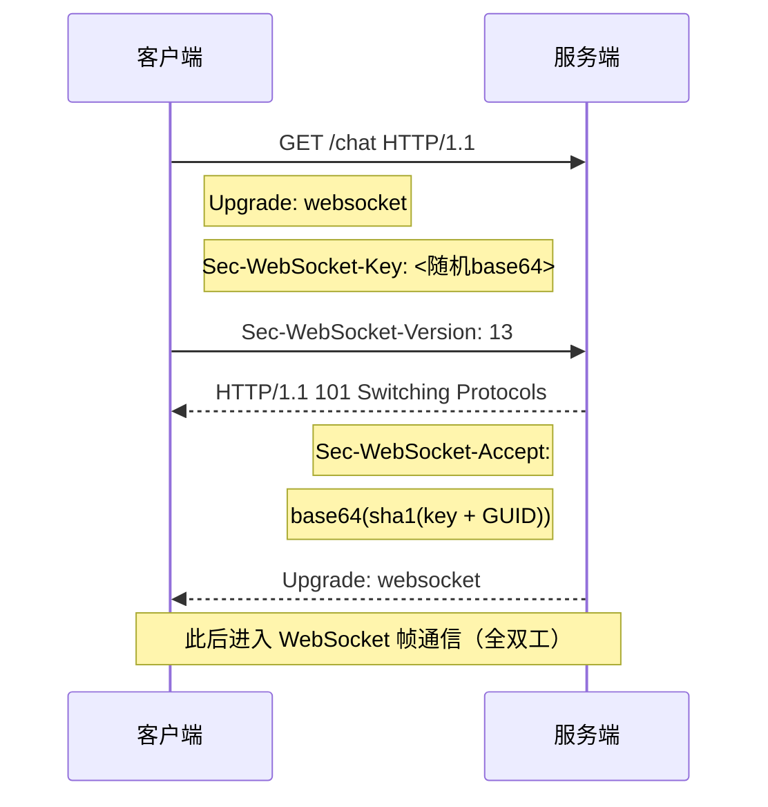

# WebSocket

WebSocket 是在**单个 TCP 连接**上提供全双工通信的协议（RFC 6455）。它消除了 HTTP 请求-响应模型在实时场景下的轮询开销，是聊天、协作编辑、行情推送等场景的基石。

## 与 HTTP 的本质区别

| 维度 | HTTP/1.1 | WebSocket |
|------|----------|-----------|
| 通信模式 | 半双工（请求-响应） | 全双工 |
| 连接生命周期 | 短连接（或 keep-alive 复用） | 持久连接 |
| 实时性 | 依赖轮询/长轮询 | 服务端主动推送 |
| 协议标识 | `http://` / `https://` | `ws://` / `wss://` |
| 握手后开销 | 每请求带完整头部 | 帧头最小 2 字节 |

## 握手：从 HTTP 升级

WebSocket 连接始于一次 HTTP `Upgrade` 请求，服务端返回 `101 Switching Protocols` 后协议切换为 WebSocket。



`Sec-WebSocket-Accept` 由 `Sec-WebSocket-Key` 拼接魔法字符串 `258EAFA5-E914-47DA-95CA-C5AB0DC85B11` 后取 SHA-1、再 Base64 得到，用于确认服务端理解协议。

## 帧格式（简化）

```
 0                   1                   2                   3
 0 1 2 3 4 5 6 7 8 9 0 1 2 3 4 5 6 7 8 9 0 1 2 3 4 5 6 7 8 9 0 1
+-+-+-+-+-------+-+-------------+-------------------------------+
|F|R|R|R| opcode|M| Payload len |    Extended payload length    |
|I|S|S|S|  (4)  |A|     (7)     |             (16/64)           |
|N|V|V|V|       |S|             |   (if len==126/127)           |
| |1|2|3|       |K|             |                               |
+-+-+-+-+-------+-+-------------+ - - - - - - - - - - - - - - - +
|     Extended payload length continued (if len==127)          |
+ - - - - - - - - - - - - - - - +-------------------------------+
|                               |Masking-key (4 bytes, client→server)|
+-------------------------------+-------------------------------+
| Masking-key (continued)       |          Payload Data         |
+-------------------------------+-------------------------------+
```

- `opcode`：`0x1` 文本、`0x2` 二进制、`0x8` 关闭、`0x9` ping、`0xA` pong
- 客户端→服务端帧**必须掩码**（Mask=1），服务端→客户端不掩码

## Node.js 实现

### 使用 `ws`（生产推荐）

```bash
npm install ws
```

```js
import WebSocket, { WebSocketServer } from 'ws';

const wss = new WebSocketServer({ port: 8080 });

wss.on('connection', (ws, req) => {
  const ip = req.headers['x-forwarded-for'] || req.socket.remoteAddress;
  console.log(`客户端已连接: ${ip}`);

  ws.on('message', (data) => {
    const msg = JSON.parse(data.toString());
    broadcast(msg); // 见下方广播实现
  });

  ws.on('close', () => console.log('客户端断开'));
  ws.on('error', (err) => console.error('WS 错误:', err));
});

function broadcast(payload) {
  const text = JSON.stringify(payload);
  for (const client of wss.clients) {
    if (client.readyState === WebSocket.OPEN) client.send(text);
  }
}
```

### 房间（Room）模型

```js
const rooms = new Map();

wss.on('connection', (ws) => {
  ws.on('message', (raw) => {
    const { type, room, user, content } = JSON.parse(raw.toString());
    if (type === 'join') {
      if (!rooms.has(room)) rooms.set(room, new Set());
      rooms.get(room).add(ws);
      ws.room = room;
    }
    if (type === 'message') {
      for (const c of rooms.get(ws.room) ?? []) {
        c.send(JSON.stringify({ type: 'message', user, content }));
      }
    }
  });
  ws.on('close', () => rooms.get(ws.room)?.delete(ws));
});
```

## 客户端（浏览器原生）

```js
const ws = new WebSocket('wss://example.com/chat');

ws.onopen = () => ws.send(JSON.stringify({ type: 'join', room: 'demo' }));
ws.onmessage = (e) => render(JSON.parse(e.data));
ws.onclose = () => console.log('连接关闭');

function send(content) {
  if (ws.readyState === WebSocket.OPEN) {
    ws.send(JSON.stringify({ type: 'message', content }));
  }
}
```

## Socket.IO（含房间/重连的封装）

```bash
npm install socket.io
```

```js
import { createServer } from 'node:http';
import { Server } from 'socket.io';

const io = new Server(createServer());
io.on('connection', (socket) => {
  socket.join('room:demo');                 // 服务端房间
  socket.on('chat', (msg) => {
    io.to('room:demo').emit('chat', msg);   // 仅房间内广播
  });
});
io.listen(3000);
```

## 最佳实践

### 1. 心跳检测（防断连）

```js
wss.on('connection', (ws) => {
  ws.isAlive = true;
  ws.on('pong', () => { ws.isAlive = true; });
});

const timer = setInterval(() => {
  for (const ws of wss.clients) {
    if (ws.isAlive === false) return ws.terminate();
    ws.isAlive = false;
    ws.ping();
  }
}, 30_000);

wss.on('close', () => clearInterval(timer));
```

### 2. 断线重连（客户端）

```js
function connect() {
  const ws = new WebSocket('wss://example.com/chat');
  ws.onclose = () => setTimeout(connect, 3_000); // 指数退避更佳
  return ws;
}
```

### 3. 安全要点
- 始终使用 `wss://`（TLS），避免明文 token 泄露
- 校验 Origin 防止跨站 WebSocket 劫持（CSWSH）
- 限制单连接消息体积与频率，防内存耗尽与洪泛
- 鉴权放在握手阶段（从 `req.headers` 取 token），而非首条消息

## Node.js v22+ 原生能力

Node.js v22 起全局 `WebSocket` 客户端稳定可用（无需 `ws`）：

```js
// v22+ 原生客户端
const ws = new WebSocket('wss://example.com/chat');
ws.addEventListener('open', () => ws.send('hello'));
ws.addEventListener('message', (e) => console.log(JSON.parse(e.data)));
```

> 注意：v22 仅提供**客户端** `WebSocket`，服务端仍需 `ws` 或 `uWebSockets.js`。原生 `WebSocketServer` 计划在后续版本提供。

| 能力 | 原生 WebSocket (v22) | ws | Socket.IO |
|------|---------------------|-----|-----------|
| 客户端 | ✅ | ✅ | ✅ |
| 服务端 | ❌ | ✅ | ✅ |
| 自动重连 | ❌ | ❌ | ✅ |
| 房间/命名空间 | ❌ | ❌ | ✅ |
| 心跳 | 手动 | 手动 | 内置 |
| 掩码处理 | 自动 | 自动 | 自动 |
