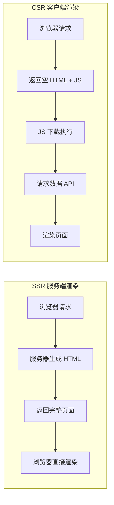
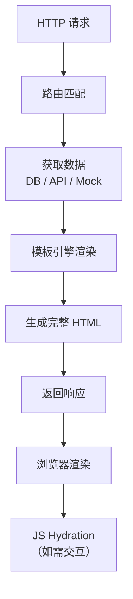

# SSR 服务端渲染

## 概述

服务端渲染（Server-Side Rendering）是指在服务器端将页面数据和模板组合生成完整 HTML，直接返回给浏览器渲染的技术方案。

## SSR vs CSR



| 维度 | SSR | CSR |
|------|-----|-----|
| 首屏速度 | 快（HTML 直出） | 慢（需等 JS + API） |
| SEO | 友好（爬虫可见完整内容） | 不友好（需额外处理） |
| 服务器负载 | 高（每次请求生成 HTML） | 低（静态资源为主） |
| 交互体验 | 首次交互可能闪屏 | 流畅（SPA 体验） |
| 适用场景 | 内容站、SEO 敏感 | 管理后台、交互密集 |

## 原生 Node.js 实现 SSR

### 模板引擎基础

```js
const http = require('http')
const fs = require('fs')
const path = require('path')

class TemplateEngine {
  constructor(viewsDir) {
    this.viewsDir = viewsDir
    this.cache = new Map()
  }

  load(templateName) {
    if (this.cache.has(templateName)) {
      return this.cache.get(templateName)
    }

    const filePath = path.join(this.viewsDir, `${templateName}.html`)
    const template = fs.readFileSync(filePath, 'utf-8')
    this.cache.set(templateName, template)
    return template
  }

  // 简易模板变量替换 {{ variable }}
  render(templateName, data = {}) {
    let html = this.load(templateName)
    html = html.replace(/\{\{\s*(\w+)\s*\}\}/g, (_, key) => {
      return data[key] !== undefined ? escapeHtml(String(data[key])) : ''
    })
    return html
  }

  clearCache() {
    this.cache.clear()
  }
}

function escapeHtml(str) {
  return str
    .replace(/&/g, '&amp;')
    .replace(/</g, '&lt;')
    .replace(/>/g, '&gt;')
    .replace(/"/g, '&quot;')
}
```

### SSR 服务端实现

```js
const engine = new TemplateEngine('./views')

const mockData = {
  posts: [
    { id: 1, title: 'Node.js SSR 实战', author: 'Alice' },
    { id: 2, title: '深入 HTTP 协议', author: 'Bob' },
  ],
}

const server = http.createServer((req, res) => {
  const routes = {
    '/': () => engine.render('index', { title: '首页', posts: mockData.posts }),
    '/about': () => engine.render('about', { title: '关于' }),
  }

  const handler = routes[req.url]
  if (!handler) {
    res.writeHead(404, { 'Content-Type': 'text/html; charset=utf-8' })
    return res.end(engine.render('404', { title: '页面不存在' }))
  }

  res.writeHead(200, { 'Content-Type': 'text/html; charset=utf-8' })
  res.end(handler())
})

server.listen(3000)
```

### 模板文件示例

```html
<!-- views/index.html -->
<!DOCTYPE html>
<html lang="zh-CN">
<head>
  <meta charset="UTF-8">
  <title>{{ title }}</title>
</head>
<body>
  <h1>{{ title }}</h1>
  <ul>
    <!-- 需要条件渲染时可扩展模板语法 -->
  </ul>
</body>
</html>
```

## SSR 渲染 Pipeline



## Hydration：SSR + CSR 混合

SSR 直出 HTML 后，前端 JS 接管交互逻辑的过程称为 Hydration：

```js
// SSR 输出中嵌入初始数据
const html = engine.render('index', { title: '首页' })

// 在 HTML 末尾注入数据 script
const hydratedHtml = html.replace(
  '</body>',
  `<script>window.__INITIAL_STATE__ = ${JSON.stringify(mockData)}</script>
   <script src="/client.js"></script>
  </body>`
)
```

```js
// client.js — Hydration
const state = window.__INITIAL_STATE__
// 使用 state 数据初始化前端应用，接管交互
```

## SSR 框架选型

| 框架 | 基础 | 特点 | 适用场景 |
|------|------|------|---------|
| Next.js | React | SSR/SSG/ISR 全支持，生态丰富 | React 项目首选 |
| Nuxt.js | Vue | 约定式路由，开发体验好 | Vue 项目首选 |
| SvelteKit | Svelte | 编译时优化，体积小 | 追求极致性能 |
| 原生实现 | Node.js | 完全可控，无框架依赖 | 理解原理 / 简单场景 |

## 性能考量

| 优化策略 | 说明 |
|---------|------|
| 模板缓存 | 编译后的模板缓存到内存，避免重复编译 |
| 数据预取 | 路由级别声明数据依赖，并行预取 |
| 流式渲染 | `renderToPipeableStream` 边生成边传输 |
| 缓存策略 | 页面级缓存 + CDN，降低服务器渲染压力 |
| 部分 hydration | 只对交互区域 hydrate，减少客户端 JS |
