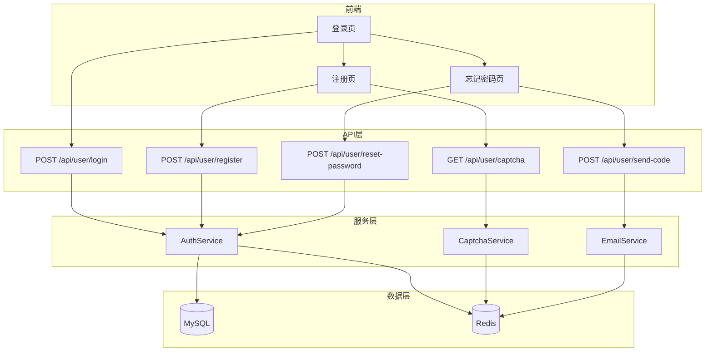
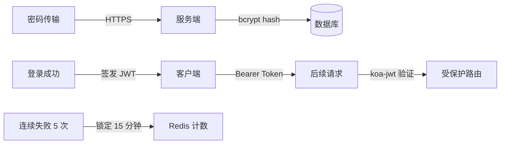
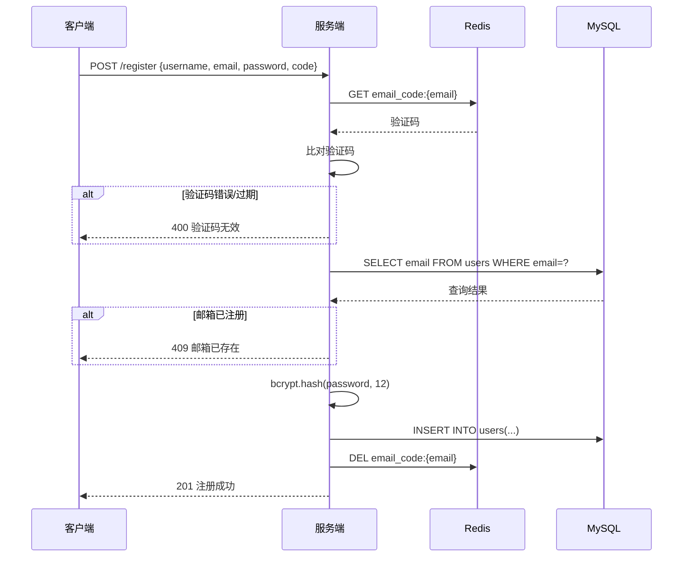
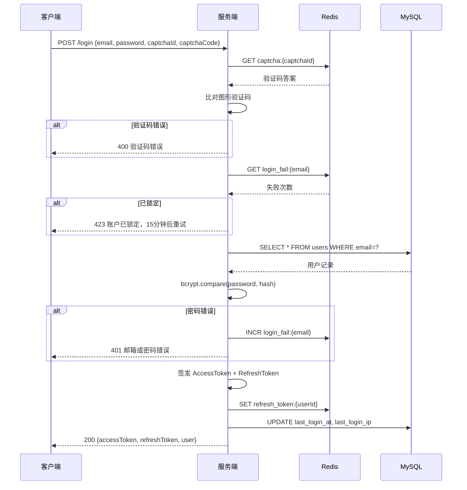
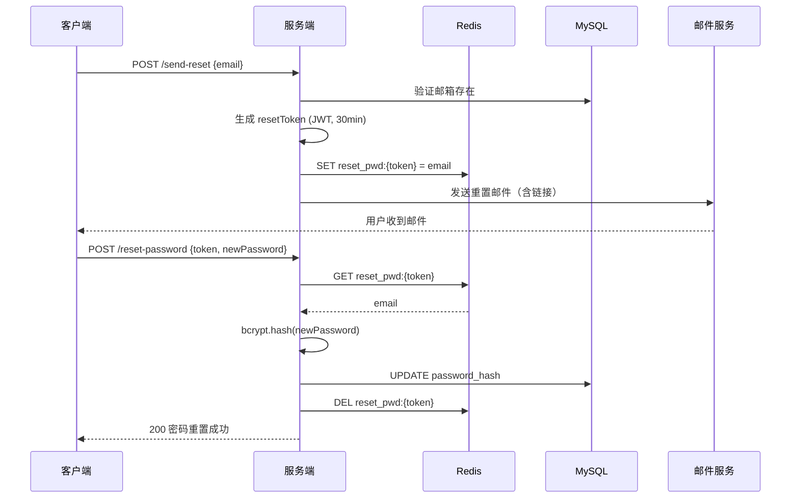

# 登录模块

基于 Koa2 + JWT + Redis + NodeMailer 构建完整的用户认证系统，涵盖注册、登录、忘记密码三大核心流程，集成图形验证码与邮件验证服务。

## 0. 模块架构



## 1. 需求分析

### 1.1 功能清单

| 功能 | 路由 | 方法 | 说明 |
|------|------|------|------|
| 用户注册 | `/api/user/register` | POST | 邮箱 + 验证码 + 密码 |
| 用户登录 | `/api/user/login` | POST | 邮箱/用户名 + 密码 + 图形验证码 |
| 忘记密码 | `/api/user/reset-password` | POST | 邮箱验证 + 重置密码 |
| 图形验证码 | `/api/user/captcha` | GET | 生成 SVG 验证码，存 Redis |
| 发送邮箱验证码 | `/api/user/send-code` | POST | 6 位数字码，5 分钟有效 |
| 获取用户信息 | `/api/user/info` | GET | JWT 鉴权，返回当前用户 |
| 退出登录 | `/api/user/logout` | POST | 清除 Redis 中的 token |

### 1.2 安全设计



**核心安全策略：**

- 密码使用 `bcrypt` 加盐哈希存储（cost factor = 12）
- JWT 双 Token 机制：Access Token（2h）+ Refresh Token（7d）
- 图形验证码防暴力破解，错误 5 次锁定账户 15 分钟
- 邮箱验证码 5 分钟过期，同一邮箱 60 秒内不可重复发送
- 所有敏感操作记录审计日志

## 2. 数据模型

### 2.1 用户表设计

```sql
CREATE TABLE `users` (
  `id` BIGINT UNSIGNED NOT NULL AUTO_INCREMENT,
  `username` VARCHAR(50) NOT NULL COMMENT '用户名',
  `email` VARCHAR(100) NOT NULL COMMENT '邮箱',
  `password_hash` VARCHAR(255) NOT NULL COMMENT 'bcrypt 哈希',
  `avatar` VARCHAR(500) DEFAULT NULL COMMENT '头像 URL',
  `status` TINYINT NOT NULL DEFAULT 1 COMMENT '1-正常 0-禁用 2-未激活',
  `login_attempts` INT NOT NULL DEFAULT 0 COMMENT '连续失败次数',
  `locked_until` DATETIME DEFAULT NULL COMMENT '锁定截止时间',
  `last_login_at` DATETIME DEFAULT NULL,
  `last_login_ip` VARCHAR(45) DEFAULT NULL,
  `created_at` DATETIME NOT NULL DEFAULT CURRENT_TIMESTAMP,
  `updated_at` DATETIME NOT NULL DEFAULT CURRENT_TIMESTAMP ON UPDATE CURRENT_TIMESTAMP,
  PRIMARY KEY (`id`),
  UNIQUE KEY `uk_username` (`username`),
  UNIQUE KEY `uk_email` (`email`)
) ENGINE=InnoDB DEFAULT CHARSET=utf8mb4 COMMENT='用户表';
```

### 2.2 Redis 键设计

| Key 模式 | 类型 | TTL | 用途 |
|----------|------|-----|------|
| `captcha:{uuid}` | String | 5min | 图形验证码答案 |
| `email_code:{email}` | String | 5min | 邮箱验证码 |
| `email_limit:{email}` | String | 60s | 发送频率限制 |
| `login_fail:{email}` | String | 15min | 登录失败计数 |
| `token_blacklist:{jti}` | String | 与 token 同 | 退出登录黑名单 |
| `refresh_token:{userId}` | String | 7d | Refresh Token |

## 3. 图形验证码

### 3.1 依赖安装

```bash
pnpm add svg-captcha uuid
```

### 3.2 验证码服务

```javascript
// services/captcha.service.js
import svgCaptcha from 'svg-captcha'
import { randomUUID } from 'crypto'
import { setValue, getValue, delValue } from '../utils/redis.js'

const CAPTCHA_PREFIX = 'captcha:'
const CAPTCHA_TTL = 300 // 5 分钟

/**
 * 生成图形验证码
 * @returns {{ captchaId: string, svg: string }}
 */
export function generateCaptcha() {
  const captcha = svgCaptcha.create({
    size: 4,              // 4 位字符
    noise: 3,             // 干扰线数量
    color: true,          // 彩色字符
    background: '#f0f0f0',
    width: 120,
    height: 40,
    fontSize: 40,
    ignoreChars: '0oO1lI' // 排除易混淆字符
  })

  const captchaId = randomUUID()
  // 答案转小写存储，验证时忽略大小写
  setValue(CAPTCHA_PREFIX + captchaId, captcha.text.toLowerCase(), CAPTCHA_TTL)

  return { captchaId, svg: captcha.data }
}

/**
 * 验证图形验证码
 * @param {string} captchaId
 * @param {string} code - 用户输入
 * @returns {Promise<boolean>}
 */
export async function verifyCaptcha(captchaId, code) {
  const key = CAPTCHA_PREFIX + captchaId
  const answer = await getValue(key)

  if (!answer) return false // 过期或不存在

  // 验证后立即删除，防止重放
  await delValue(key)
  return answer === code.toLowerCase()
}
```

### 3.3 路由与控制器

```javascript
// routes/captcha.js
import Router from '@koa/router'
import { generateCaptcha } from '../services/captcha.service.js'

const router = new Router({ prefix: '/api/user' })

router.get('/captcha', (ctx) => {
  const { captchaId, svg } = generateCaptcha()
  ctx.body = {
    code: 0,
    data: { captchaId, svg }
  }
})

export default router
```

## 4. 邮件验证服务

### 4.1 Nodemailer 配置

```bash
pnpm add nodemailer
```

```javascript
// services/email.service.js
import nodemailer from 'nodemailer'
import { SMTP_CONFIG } from '../config/index.js'

const transporter = nodemailer.createTransport({
  host: SMTP_CONFIG.host,       // smtp.qq.com / smtp.163.com
  port: SMTP_CONFIG.port,       // 465 (SSL) 或 587 (TLS)
  secure: SMTP_CONFIG.port === 465,
  auth: {
    user: SMTP_CONFIG.user,     // 发件邮箱
    pass: SMTP_CONFIG.pass      // 授权码（非登录密码）
  }
})

/**
 * 发送邮箱验证码
 * @param {string} to - 收件邮箱
 * @param {string} code - 6 位验证码
 */
export async function sendVerificationCode(to, code) {
  const mailOptions = {
    from: `"Tech Codex" <${SMTP_CONFIG.user}>`,
    to,
    subject: '【验证码】邮箱验证',
    html: `
      <div style="max-width:600px;margin:0 auto;padding:20px;font-family:sans-serif;">
        <h2 style="color:#333;">邮箱验证码</h2>
        <p>您的验证码为：</p>
        <div style="background:#f5f5f5;padding:15px 25px;border-radius:8px;
                    font-size:32px;font-weight:bold;letter-spacing:8px;
                    text-align:center;color:#1890ff;margin:20px 0;">
          ${code}
        </div>
        <p style="color:#999;font-size:14px;">验证码 5 分钟内有效，请勿泄露给他人。</p>
        <p style="color:#999;font-size:12px;">如非本人操作，请忽略此邮件。</p>
      </div>
    `
  }

  await transporter.sendMail(mailOptions)
}

/**
 * 发送密码重置邮件
 */
export async function sendResetPasswordEmail(to, resetLink) {
  const mailOptions = {
    from: `"Tech Codex" <${SMTP_CONFIG.user}>`,
    to,
    subject: '【安全】密码重置',
    html: `
      <div style="max-width:600px;margin:0 auto;padding:20px;font-family:sans-serif;">
        <h2 style="color:#333;">密码重置</h2>
        <p>您正在请求重置密码，点击下方按钮完成操作：</p>
        <a href="${resetLink}"
           style="display:inline-block;background:#1890ff;color:#fff;
                  padding:12px 30px;border-radius:6px;text-decoration:none;
                  margin:20px 0;">
          重置密码
        </a>
        <p style="color:#999;font-size:14px;">链接 30 分钟内有效。如非本人操作，请忽略。</p>
      </div>
    `
  }

  await transporter.sendMail(mailOptions)
}
```

### 4.2 验证码发送接口（含频率限制）

```javascript
// controllers/user.controller.js
import { randomInt } from 'crypto'
import { getValue, setValue } from '../utils/redis.js'
import { sendVerificationCode } from '../services/email.service.js'

const EMAIL_CODE_PREFIX = 'email_code:'
const EMAIL_LIMIT_PREFIX = 'email_limit:'

export async function sendEmailCode(ctx) {
  const { email } = ctx.request.body

  // 1. 频率限制：60 秒内不可重复发送
  const limitKey = EMAIL_LIMIT_PREFIX + email
  const limited = await getValue(limitKey)
  if (limited) {
    ctx.throw(429, '发送过于频繁，请 60 秒后重试')
  }

  // 2. 生成 6 位数字验证码
  const code = String(randomInt(100000, 999999))

  // 3. 存入 Redis（5 分钟有效）
  await setValue(EMAIL_CODE_PREFIX + email, code, 300)
  // 4. 设置频率限制标记
  await setValue(limitKey, '1', 60)

  // 5. 发送邮件
  await sendVerificationCode(email, code)

  ctx.body = { code: 0, message: '验证码已发送' }
}
```

## 5. 注册流程

### 5.1 流程图



### 5.2 控制器实现

```javascript
import bcrypt from 'bcrypt'
import { getValue, delValue } from '../utils/redis.js'
import { UserModel } from '../models/user.model.js'

const SALT_ROUNDS = 12

export async function register(ctx) {
  const { username, email, password, code } = ctx.request.body

  // 1. 参数校验
  if (!username || !email || !password || !code) {
    ctx.throw(400, '缺少必要参数')
  }
  if (password.length < 8) {
    ctx.throw(400, '密码至少 8 位')
  }

  // 2. 验证邮箱验证码
  const storedCode = await getValue(`email_code:${email}`)
  if (!storedCode || storedCode !== code) {
    ctx.throw(400, '验证码无效或已过期')
  }

  // 3. 检查邮箱/用户名唯一性
  const existing = await UserModel.findByEmail(email)
  if (existing) {
    ctx.throw(409, '该邮箱已注册')
  }
  const existingName = await UserModel.findByUsername(username)
  if (existingName) {
    ctx.throw(409, '用户名已被占用')
  }

  // 4. 密码加密
  const passwordHash = await bcrypt.hash(password, SALT_ROUNDS)

  // 5. 创建用户
  await UserModel.create({ username, email, passwordHash })

  // 6. 清除已使用的验证码
  await delValue(`email_code:${email}`)

  ctx.status = 201
  ctx.body = { code: 0, message: '注册成功' }
}
```

## 6. 登录流程

### 6.1 流程图



### 6.2 控制器实现

```javascript
import bcrypt from 'bcrypt'
import jwt from 'jsonwebtoken'
import { getValue, setValue, delValue } from '../utils/redis.js'
import { verifyCaptcha } from '../services/captcha.service.js'
import { UserModel } from '../models/user.model.js'
import { JWT_SECRET, JWT_REFRESH_SECRET } from '../config/index.js'

const MAX_ATTEMPTS = 5
const LOCK_DURATION = 900 // 15 分钟

export async function login(ctx) {
  const { email, password, captchaId, captchaCode } = ctx.request.body

  // 1. 验证图形验证码
  const captchaValid = await verifyCaptcha(captchaId, captchaCode)
  if (!captchaValid) {
    ctx.throw(400, '图形验证码错误')
  }

  // 2. 检查账户锁定状态
  const failKey = `login_fail:${email}`
  const failCount = parseInt(await getValue(failKey) || '0', 10)
  if (failCount >= MAX_ATTEMPTS) {
    ctx.throw(423, '账户已锁定，请 15 分钟后重试')
  }

  // 3. 查询用户
  const user = await UserModel.findByEmail(email)
  if (!user) {
    ctx.throw(401, '邮箱或密码错误') // 不暴露具体原因
  }

  // 4. 验证密码
  const passwordMatch = await bcrypt.compare(password, user.password_hash)
  if (!passwordMatch) {
    // 递增失败计数
    const newCount = failCount + 1
    await setValue(failKey, String(newCount), LOCK_DURATION)
    const remaining = MAX_ATTEMPTS - newCount
    ctx.throw(401, `邮箱或密码错误，剩余 ${remaining} 次机会`)
  }

  // 5. 检查账户状态
  if (user.status === 0) ctx.throw(403, '账户已被禁用')
  if (user.status === 2) ctx.throw(403, '账户未激活，请查收激活邮件')

  // 6. 签发 Token
  const payload = { userId: user.id, username: user.username, email: user.email }
  const accessToken = jwt.sign(payload, JWT_SECRET, { expiresIn: '2h' })
  const refreshToken = jwt.sign({ userId: user.id }, JWT_REFRESH_SECRET, { expiresIn: '7d' })

  // 7. 存储 Refresh Token
  await setValue(`refresh_token:${user.id}`, refreshToken, 7 * 24 * 3600)

  // 8. 清除失败计数 & 更新登录信息
  await delValue(failKey)
  await UserModel.updateLoginInfo(user.id, ctx.ip)

  ctx.body = {
    code: 0,
    data: {
      accessToken,
      refreshToken,
      user: {
        id: user.id,
        username: user.username,
        email: user.email,
        avatar: user.avatar
      }
    }
  }
}
```

## 7. 忘记密码

### 7.1 流程



### 7.2 实现

```javascript
import jwt from 'jsonwebtoken'
import bcrypt from 'bcrypt'
import { getValue, setValue, delValue } from '../utils/redis.js'
import { sendResetPasswordEmail } from '../services/email.service.js'
import { UserModel } from '../models/user.model.js'
import { JWT_RESET_SECRET, APP_URL } from '../config/index.js'

export async function requestResetPassword(ctx) {
  const { email } = ctx.request.body

  const user = await UserModel.findByEmail(email)
  // 无论邮箱是否存在都返回成功，防止枚举攻击
  if (!user) {
    ctx.body = { code: 0, message: '如果邮箱存在，重置链接已发送' }
    return
  }

  // 生成重置 Token（30 分钟有效）
  const resetToken = jwt.sign({ email }, JWT_RESET_SECRET, { expiresIn: '30m' })
  await setValue(`reset_pwd:${resetToken}`, email, 1800)

  // 发送重置邮件
  const resetLink = `${APP_URL}/reset-password?token=${resetToken}`
  await sendResetPasswordEmail(email, resetLink)

  ctx.body = { code: 0, message: '如果邮箱存在，重置链接已发送' }
}

export async function resetPassword(ctx) {
  const { token, newPassword } = ctx.request.body

  if (!newPassword || newPassword.length < 8) {
    ctx.throw(400, '新密码至少 8 位')
  }

  // 验证 Token
  const email = await getValue(`reset_pwd:${token}`)
  if (!email) {
    ctx.throw(400, '重置链接无效或已过期')
  }

  // 更新密码
  const passwordHash = await bcrypt.hash(newPassword, 12)
  await UserModel.updatePassword(email, passwordHash)

  // 删除已使用的 Token
  await delValue(`reset_pwd:${token}`)

  // 使该用户所有 Refresh Token 失效（强制重新登录）
  const user = await UserModel.findByEmail(email)
  await delValue(`refresh_token:${user.id}`)

  ctx.body = { code: 0, message: '密码重置成功，请重新登录' }
}
```

## 8. Token 刷新与退出

### 8.1 无感刷新 Token

```javascript
export async function refreshToken(ctx) {
  const { refreshToken } = ctx.request.body

  try {
    const decoded = jwt.verify(refreshToken, JWT_REFRESH_SECRET)
    const stored = await getValue(`refresh_token:${decoded.userId}`)

    if (stored !== refreshToken) {
      ctx.throw(401, 'Refresh Token 无效')
    }

    // 签发新 Access Token
    const user = await UserModel.findById(decoded.userId)
    const newAccessToken = jwt.sign(
      { userId: user.id, username: user.username, email: user.email },
      JWT_SECRET,
      { expiresIn: '2h' }
    )

    ctx.body = { code: 0, data: { accessToken: newAccessToken } }
  } catch (err) {
    ctx.throw(401, 'Refresh Token 已过期，请重新登录')
  }
}
```

### 8.2 退出登录

```javascript
export async function logout(ctx) {
  const { userId } = ctx.state.user // 由 koa-jwt 解码

  // 将当前 Access Token 加入黑名单
  const jti = ctx.state.jwtid
  const ttl = ctx.state.exp - Math.floor(Date.now() / 1000)
  if (ttl > 0) {
    await setValue(`token_blacklist:${jti}`, '1', ttl)
  }

  // 删除 Refresh Token
  await delValue(`refresh_token:${userId}`)

  ctx.body = { code: 0, message: '已退出登录' }
}
```

## 9. 路由汇总

```javascript
// routes/user.js
import Router from '@koa/router'
import {
  register, login, logout, refreshToken,
  requestResetPassword, resetPassword,
  sendEmailCode, getUserInfo
} from '../controllers/user.controller.js'
import { authMiddleware } from '../middlewares/auth.js'

const router = new Router({ prefix: '/api/user' })

// 公开路由
router.post('/register', register)
router.post('/login', login)
router.post('/send-code', sendEmailCode)
router.post('/send-reset', requestResetPassword)
router.post('/reset-password', resetPassword)
router.post('/refresh-token', refreshToken)

// 受保护路由（需 JWT）
router.get('/info', authMiddleware, getUserInfo)
router.post('/logout', authMiddleware, logout)

export default router
```

## 10. 最佳实践与常见陷阱

### 10.1 安全清单

| 项目 | 做法 | 避免 |
|------|------|------|
| 密码存储 | bcrypt (cost ≥ 12) | MD5/SHA1/明文 |
| 错误提示 | "邮箱或密码错误" | "用户不存在" / "密码错误" |
| 验证码 | 用后即删，5min 过期 | 长期有效/可重用 |
| Token 存储 | 前端 httpOnly cookie 或内存 | localStorage（XSS 风险） |
| 重置链接 | 30min 过期 + 单次使用 | 永久有效/可重复使用 |
| 频率限制 | Redis 计数器 + TTL | 无限制 |

### 10.2 常见陷阱

::: warning 验证码竞态条件
高并发下同一验证码可能被多次使用。解决方案：使用 Redis `DEL` 的原子性——`DEL` 返回 1 表示删除成功（首次使用），返回 0 表示已被消费。
:::

::: danger 密码重置枚举攻击
如果"邮箱不存在"和"邮件已发送"返回不同响应，攻击者可枚举有效邮箱。必须统一返回相同响应。
:::

::: tip Refresh Token 轮换
更高安全要求下，每次刷新时同时轮换 Refresh Token（旧 Token 立即失效），可检测 Token 被盗用的重放攻击。
:::
