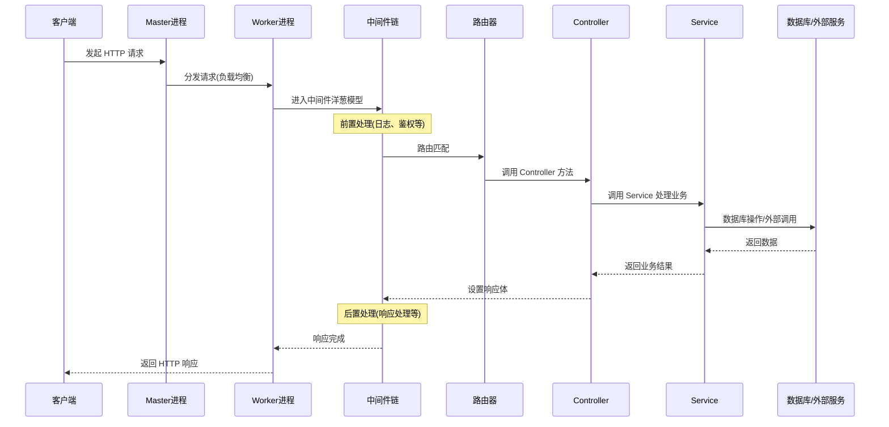

# Egg.js 深度解析与实战

## 一、引言

Egg.js 是一个为企业级框架和应用而生的 Node.js 框架。它基于 Koa.js，通过提供一套统一的约定，使得团队开发和维护更加高效。Egg.js 的核心设计理念是"约定优于配置"，旨在帮助开发者降低开发和维护成本。

### 1.1 Egg.js 是什么

Egg.js 是一个渐进式的 Node.js 框架，它在 Koa.js 的基础上，提供了更强大的功能和更规范的开发模式。它内置了多进程管理、插件机制、框架扩展等能力，使得构建大型、复杂的应用变得更加简单。

### 1.2 核心特性

| 特性 | 描述 |
| :--- | :--- |
| **约定优于配置** | 统一的目录结构和开发规范，降低学习成本，提升团队协作效率 |
| **插件机制** | 功能通过插件组合，扩展性强，便于生态系统发展 |
| **多进程模型** | 基于 `cluster` 模块实现，充分利用多核 CPU 资源 |
| **框架扩展** | 支持在框架、插件、应用层面进行扩展，灵活性高 |
| **企业级特性** | 内置丰富的开发工具和最佳实践，如安全、日志、监控等 |
| **渐进式开发** | 支持从简单应用到复杂架构的平滑演进 |

### 1.3 适用场景

Egg.js 特别适合用于构建企业级的 Web 应用和服务，例如：

- 大型网站的后端服务
- 企业内部管理系统
- API 网关和微服务
- 高并发的实时应用
- 需要长期维护和多人协作的项目

## 二、系统架构

### 2.1 整体架构

Egg.js 的架构设计遵循"约定优于配置"的理念，采用分层架构设计：

```
┌─────────────────────────────────────────────────────────────┐
│                        应用层 (Application)                   │
│  ┌─────────────┐  ┌─────────────┐  ┌─────────────┐         │
│  │  Controller │  │   Service   │  │  Middleware │         │
│  └─────────────┘  └─────────────┘  └─────────────┘         │
│  ┌─────────────┐  ┌─────────────┐  ┌─────────────┐         │
│  │    Router   │  │   Extend    │  │   Schedule  │         │
│  └─────────────┘  └─────────────┘  └─────────────┘         │
├─────────────────────────────────────────────────────────────┤
│                        框架层 (Framework)                     │
│  ┌─────────────┐  ┌─────────────┐  ┌─────────────┐         │
│  │   Loader    │  │   Router    │  │    Logger   │         │
│  └─────────────┘  └─────────────┘  └─────────────┘         │
│  ┌─────────────┐  ┌─────────────┐  ┌─────────────┐         │
│  │   Config    │  │   Context   │  │  Security   │         │
│  └─────────────┘  └─────────────┘  └─────────────┘         │
├─────────────────────────────────────────────────────────────┤
│                        插件层 (Plugin)                        │
│  ┌─────────────┐  ┌─────────────┐  ┌─────────────┐         │
│  │ egg-mysql   │  │ egg-redis   │  │egg-security │         │
│  └─────────────┘  └─────────────┘  └─────────────┘         │
├─────────────────────────────────────────────────────────────┤
│                      Koa 层 (Koa.js)                         │
│  ┌─────────────────────────────────────────────────────┐   │
│  │              中间件洋葱模型 (Onion Model)             │   │
│  └─────────────────────────────────────────────────────┘   │
├─────────────────────────────────────────────────────────────┤
│                      Node.js 运行时                          │
│  ┌─────────────┐  ┌─────────────┐  ┌─────────────┐         │
│  │   HTTP(S)   │  │    Cluster  │  │    Event    │         │
│  └─────────────┘  └─────────────┘  └─────────────┘         │
└─────────────────────────────────────────────────────────────┘
```

### 2.2 多进程模型

Egg.js 基于 Node.js 的 `cluster` 模块实现了多进程架构，充分利用多核 CPU 资源，提升应用的性能和稳定性：

```
┌─────────────────────────────────────────────────────────────┐
│                      Master 进程                             │
│              (进程管理、端口监听、负载均衡)                    │
└──────────────┬──────────────────────────────────────────────┘
               │
       ┌───────┼───────┬───────┬───────┐
       │       │       │       │       │
       ▼       ▼       ▼       ▼       ▼
    ┌─────┐ ┌─────┐ ┌─────┐ ┌─────┐ ┌─────┐
    │Agent│ │Worker│ │Worker│ │Worker│ │Worker│
    │进程 │ │  1  │ │  2  │ │  3  │ │  N  │
    └─────┘ └─────┘ └─────┘ └─────┘ └─────┘
       │       │       │       │       │
       │       │       │       │       │
    后台任务  处理    处理    处理    处理
    定时任务  请求    请求    请求    请求
```

#### 进程角色说明

| 进程类型 | 数量 | 职责 |
| :--- | :--- | :--- |
| **Master** | 1 | 主进程，负责管理 Worker 和 Agent 进程，监听端口并分发请求 |
| **Agent** | 1 | 后台工作进程，处理定时任务、消息推送等不需要与请求直接相关的任务 |
| **Worker** | N | 工作进程，处理实际的 HTTP 请求，数量通常设置为 CPU 核心数 |

#### 进程通信（IPC）

```javascript
// app.js - Worker 向 Agent 发送消息
module.exports = (app) => {
  app.messenger.on("agent-event", (data) => {
    app.logger.info("[Worker] received from agent:", data)
  })

  // 向 Agent 发送消息
  app.messenger.sendToAgent("worker-event", { from: "worker" })
}

// agent.js - Agent 处理消息
module.exports = (agent) => {
  agent.messenger.on("worker-event", (data) => {
    agent.logger.info("[Agent] received from worker:", data)
    // 广播给所有 Worker
    agent.messenger.sendToApp("agent-event", { from: "agent" })
  })
}
```

### 2.3 请求处理流程

以下是一个完整的 HTTP 请求在 Egg.js 中的处理流程：



## 三、快速入门

本章节将引导你快速创建并运行一个 Egg.js 应用。

### 3.1 环境准备

在开始之前，请确保你的开发环境中已安装 Node.js，并满足版本要求。

- **Node.js**: 版本 `>=14.20.0`。

你可以通过以下命令检查 Node.js 版本：

```bash
node -v
```

### 3.2 初始化项目

使用官方脚手架 `create-egg` 快速创建项目：

```bash
# 创建项目目录
mkdir egg-example && cd egg-example

# 初始化项目
npm init egg --type=simple

# 安装依赖
npm install
```

### 3.3 编写代码

脚手架已经为生成了基础的代码结构。现在添加一个简单的路由和控制器。

1.  **定义路由** (`app/router.js`):

    ```javascript
    // app/router.js
    module.exports = (app) => {
      const { router, controller } = app
      router.get("/", controller.home.index)
      router.get("/user/:id", controller.user.info) // 新增用户路由
    }
    ```

2.  **编写控制器** (`app/controller/user.js`):

    创建一个新的控制器文件 `app/controller/user.js`，并添加以下内容：

    ```javascript
    // app/controller/user.js
    const { Controller } = require("egg")

    class UserController extends Controller {
      async info() {
        const { ctx } = this
        const { id } = ctx.params
        ctx.body = `<h1>User ID: ${id}</h1>`
      }
    }

    module.exports = UserController
    ```

### 3.4 运行项目

- **开发环境**

  在开发环境下，使用 `npm run dev` 启动应用，该命令会启动一个开发服务器，并具备热重载功能。

  ```bash
  npm run dev
  ```

- **生产环境**

  在生产环境中，应使用 `egg-scripts` 来管理应用。首先，确保 `package.json` 中包含以下脚本：

  ```json
  // package.json
  "scripts": {
    "start": "egg-scripts start --daemon --title=egg-server-example",
    "stop": "egg-scripts stop --title=egg-server-example"
  }
  ```

  然后使用以下命令启动和停止应用：

  ```bash
  # 启动应用
  npm start

  # 停止应用
  npm stop
  ```

应用启动后，你可以在浏览器中访问：

- `http://localhost:7001`：将显示 "hi, egg"。
- `http://localhost:7001/user/123`：将显示 "User ID: 123"。

## 四、核心概念

Egg.js 的强大功能离不开其精心设计的核心模块和概念。

### 4.1 内置对象

Egg.js 在 Koa.js 的基础上，扩展了四个核心的内置对象，方便开发者在不同作用域下访问。

| 对象 | 作用域 | 描述 |
| :--- | :--- | :--- |
| **Application** | 全局 | 全局应用对象，贯穿整个生命周期，用于挂载全局方法和属性 |
| **Context** | 请求 | 请求级别的上下文对象，每次请求都会创建新实例 |
| **Request** | 请求 | 请求对象，封装了 Node.js 的 `http.IncomingMessage` 对象 |
| **Response** | 请求 | 响应对象，封装了 Node.js 的 `http.ServerResponse` 对象 |

### 4.2 运行环境

Egg.js 支持根据 `EGG_SERVER_ENV` 环境变量加载不同的配置文件，以适应不同的运行环境（如开发、测试、生产）。

| 配置文件 | 加载时机 | 用途 |
| :--- | :--- | :--- |
| `config.default.js` | 所有环境 | 默认配置，作为基础配置 |
| `config.prod.js` | 生产环境 | 生产环境特有配置，覆盖默认配置 |
| `config.local.js` | 本地开发 | 本地开发环境配置 |
| `config.unittest.js` | 单元测试 | 单元测试环境配置 |

**环境变量设置：**

```bash
# 设置环境变量
export EGG_SERVER_ENV=prod  # 生产环境
export EGG_SERVER_ENV=local # 本地开发环境
export EGG_SERVER_ENV=unittest # 单元测试环境
```

### 4.3 中间件 (Middleware)

中间件是处理请求的核心环节，用于实现日志记录、权限校验、错误处理等通用逻辑。

```javascript
// app/middleware/auth.js
module.exports = (options) => {
  return async function auth(ctx, next) {
    if (!ctx.state.user) {
      ctx.status = 401
      ctx.body = "Unauthorized"
      return
    }
    await next()
  }
}
```

#### 中间件配置方式

**方式一：应用级中间件（全局生效）**

```javascript
// config/config.default.js
module.exports = {
  middleware: ["auth", "errorHandler"], // 按顺序执行
  auth: {
    match: "/api/*", // 只匹配 /api 开头的路径
    ignore: "/api/public/*" // 排除某些路径
  }
}
```

**方式二：路由级中间件（特定路由生效）**

```javascript
// app/router.js
module.exports = (app) => {
  const { router, controller, middleware } = app
  const auth = middleware.auth({ required: true })
  
  // 单个路由使用中间件
  router.get("/api/user/profile", auth, controller.user.profile)
  
  // 多个中间件串联
  router.post("/api/posts", auth, middleware.validate(), controller.post.create)
}
```

### 4.4 路由 (Router)

路由负责将用户的请求分发到对应的控制器处理。Egg.js 提供了丰富的路由定义方式。

#### 基础路由

```javascript
// app/router.js
module.exports = (app) => {
  const { router, controller } = app
  
  // 基础路由
  router.get("/", controller.home.index)
  router.post("/users", controller.user.create)
  router.put("/users/:id", controller.user.update)
  router.delete("/users/:id", controller.user.destroy)
  
  // 使用中间件
  router.get("/api/posts", app.middleware.auth(), controller.post.list)
}
```

#### RESTful 路由

使用 `router.resources()` 快速定义 RESTful 风格的路由：

```javascript
// app/router.js
module.exports = (app) => {
  const { router, controller } = app
  
  // 自动生成 CRUD 路由
  // GET    /posts     -> controller.post.index
  // GET    /posts/:id -> controller.post.show
  // POST   /posts     -> controller.post.create
  // PUT    /posts/:id -> controller.post.update
  // DELETE /posts/:id -> controller.post.destroy
  router.resources("posts", "/api/posts", controller.post)
}
```

#### 路由分组

```javascript
// app/router.js
module.exports = (app) => {
  const { router, controller } = app
  
  // 创建路由分组（namespace 为 egg-router-plus 插件提供的能力）
  const apiRouter = router.namespace("/api/v1")
  
  apiRouter.get("/users", controller.user.list)
  apiRouter.post("/users", controller.user.create)
  // 实际路径: /api/v1/users
}
```

### 4.5 控制器 (Controller)

控制器负责解析用户输入，处理并返回结果。

```javascript
// app/controller/post.js
const { Controller } = require("egg")

class PostController extends Controller {
  async list() {
    const posts = await this.ctx.service.post.findAll()
    this.ctx.body = posts
  }
}

module.exports = PostController
```

### 4.6 服务 (Service)

服务用于封装复杂的业务逻辑，保持控制器的简洁性。

```javascript
// app/service/post.js
const { Service } = require("egg")

class PostService extends Service {
  async findAll() {
    // 假设从数据库获取数据
    return [{ id: 1, title: "Hello Egg.js" }]
  }
}

module.exports = PostService
```

### 4.7 插件 (Plugin)

插件是 Egg.js 生态的核心，通过插件可以方便地引入数据库、模板引擎、认证等功能。

```javascript
// config/plugin.js
exports.mysql = {
  enable: true,
  package: "egg-mysql"
}
```

### 4.8 配置 (Config)

应用的所有配置都集中在 `config` 目录下，便于管理和维护。

```javascript
// config/config.default.js
module.exports = (appInfo) => {
  const config = {}
  config.keys = appInfo.name + "_1678886400000_1234"
  config.mysql = {
    client: {
      host: "127.0.0.1",
      port: 3306,
      user: "root",
      password: "password",
      database: "test"
    }
  }
  return config
}
```

### 4.9 定时任务 (Schedule)

定时任务允许你在后台执行周期性任务，如数据备份、报表生成等。

```javascript
// app/schedule/sync_data.js
const { Subscription } = require("egg")

class SyncData extends Subscription {
  static get schedule() {
    return {
      interval: "1h", // 每小时执行一次
      type: "worker" // 只在一个 worker 进程上执行
    }
  }

  async subscribe() {
    // 执行同步任务
    await this.ctx.service.data.sync()
  }
}

module.exports = SyncData
```

### 4.10 扩展 (Extend)

Egg.js 允许在应用或插件层面扩展内置对象的原型，增加自定义的属性和方法。

```javascript
// app/extend/context.js
module.exports = {
  get isAjax() {
    return this.get("X-Requested-With") === "XMLHttpRequest"
  }
}
```

## 五、开发实践

本章节将通过一个完整的数据库操作示例，展示 Egg.js 在实际开发中的应用。

### 5.1 数据库集成 (egg-mysql)

1.  **安装插件**:

    ```bash
    npm i egg-mysql --save
    ```

2.  **启用插件** (`config/plugin.js`):

    ```javascript
    exports.mysql = {
      enable: true,
      package: "egg-mysql"
    }
    ```

3.  **配置数据库** (`config/config.default.js`):

    ```javascript
    config.mysql = {
      client: {
        host: "127.0.0.1",
        port: 3306,
        user: "root",
        password: "your_password",
        database: "egg_db"
      },
      app: true,
      agent: false
    }
    ```

### 5.2 创建数据表

在你的 MySQL 数据库中创建一个 `posts` 表：

```sql
CREATE TABLE `posts` (
  `id` int(11) NOT NULL AUTO_INCREMENT,
  `title` varchar(255) NOT NULL,
  `content` text,
  `created_at` datetime NOT NULL DEFAULT CURRENT_TIMESTAMP,
  PRIMARY KEY (`id`)
) ENGINE=InnoDB DEFAULT CHARSET=utf8mb4;
```

### 5.3 编写 CRUD 代码

1.  **路由** (`app/router.js`):

    ```javascript
    module.exports = (app) => {
      const { router, controller } = app
      router.resources("posts", "/api/posts", controller.post)
    }
    ```

2.  **控制器** (`app/controller/post.js`):

    ```javascript
    const { Controller } = require("egg")

    class PostController extends Controller {
      async index() {
        const { ctx } = this
        const posts = await ctx.service.post.list()
        ctx.body = posts
      }

      async show() {
        const { ctx } = this
        const post = await ctx.service.post.find(ctx.params.id)
        ctx.body = post
      }

      async create() {
        const { ctx } = this
        const { title, content } = ctx.request.body
        const result = await ctx.service.post.create({ title, content })
        ctx.status = 201
        ctx.body = result
      }

      async update() {
        const { ctx } = this
        const { id } = ctx.params
        const { title, content } = ctx.request.body
        await ctx.service.post.update(id, { title, content })
        ctx.status = 204
      }

      async destroy() {
        const { ctx } = this
        const { id } = ctx.params
        await ctx.service.post.delete(id)
        ctx.status = 204
      }
    }

    module.exports = PostController
    ```

3.  **服务** (`app/service/post.js`):

    ```javascript
    const { Service } = require("egg")

    class PostService extends Service {
      async list() {
        return await this.app.mysql.select("posts")
      }

      async find(id) {
        return await this.app.mysql.get("posts", { id })
      }

      async create(post) {
        return await this.app.mysql.insert("posts", post)
      }

      async update(id, post) {
        return await this.app.mysql.update("posts", post, { where: { id } })
      }

      async delete(id) {
        return await this.app.mysql.delete("posts", { id })
      }
    }

    module.exports = PostService
    ```

## 六、参数校验

Egg.js 推荐使用 `egg-validate` 插件进行参数校验，确保接口的健壮性。

### 6.1 安装与配置

```bash
npm install egg-validate --save
```

```javascript
// config/plugin.js
exports.validate = {
  enable: true,
  package: "egg-validate"
}
```

### 6.2 使用示例

```javascript
// app/controller/user.js
const { Controller } = require("egg")

class UserController extends Controller {
  async create() {
    const { ctx } = this
    
    // 定义校验规则
    const createRule = {
      username: { type: "string", required: true, min: 3, max: 20 },
      password: { type: "password", required: true, min: 6, max: 20 },
      email: { type: "email", required: true },
      age: { type: "int", required: false, min: 0, max: 150 }
    }
    
    // 校验参数
    ctx.validate(createRule, ctx.request.body)
    
    // 校验通过后继续处理
    const user = await ctx.service.user.create(ctx.request.body)
    ctx.status = 201
    ctx.body = user
  }
}

module.exports = UserController
```

### 6.3 常用校验规则

| 类型 | 说明 | 示例 |
| :--- | :--- | :--- |
| `string` | 字符串类型 | `{ type: "string", min: 1, max: 100 }` |
| `number` / `int` | 数字类型 | `{ type: "int", min: 0, max: 100 }` |
| `email` | 邮箱格式 | `{ type: "email", required: true }` |
| `password` | 密码格式 | `{ type: "password", min: 6 }` |
| `array` | 数组类型 | `{ type: "array", itemType: "string" }` |
| `object` | 对象类型 | `{ type: "object", rule: { name: "string" } }` |
| `enum` | 枚举值 | `{ type: "enum", values: ["active", "inactive"] }` |

## 七、错误处理

### 7.1 统一错误处理中间件

```javascript
// app/middleware/errorHandler.js
module.exports = (options, app) => {
  return async function errorHandler(ctx, next) {
    try {
      await next()
    } catch (err) {
      // 记录错误日志
      ctx.logger.error(err)
      
      // 所有异常都会触发 app 的 error 事件
      const status = err.status || 500
      const error = status === 500 ? "Internal Server Error" : err.message
      
      ctx.body = {
        code: status,
        message: error,
        data: null,
        timestamp: Date.now()
      }
      
      // 参数校验错误
      if (status === 422) {
        ctx.body.detail = err.errors
      }
      
      ctx.status = status
    }
  }
}
```

### 7.2 自定义错误类

```javascript
// app/extend/error.js
class BusinessException extends Error {
  constructor(message, code = 400) {
    super(message)
    this.name = "BusinessException"
    this.code = code
  }
}

module.exports = { BusinessException }

// 使用示例
// app/service/user.js
const { Service } = require("egg")
const { BusinessException } = require("../extend/error")

class UserService extends Service {
  async login(username, password) {
    const user = await this.app.mysql.get("users", { username })
    if (!user) {
      throw new BusinessException("用户不存在", 404)
    }
    // ...
  }
}
```

## 八、单元测试

Egg.js 提供了完善的单元测试支持，基于 `egg-bin` 和 `egg-mock`。

### 8.1 测试目录结构

```
test
├── app
│   ├── controller
│   │   └── user.test.js
│   ├── service
│   │   └── user.test.js
│   └── middleware
│       └── auth.test.js
└── fixtures
    └── test-data.js
```

### 8.2 控制器测试

```javascript
// test/app/controller/user.test.js
const { app, mock, assert } = require("egg-mock/bootstrap")

describe("test/app/controller/user.test.js", () => {
  before(async () => {
    // 初始化测试数据
  })

  after(async () => {
    // 清理测试数据
  })

  afterEach(mock.restore)

  it("should GET /api/users/:id", async () => {
    const res = await app
      .httpRequest()
      .get("/api/users/1")
      .set("Accept", "application/json")
      .expect(200)

    assert(res.body.id === 1)
  })

  it("should POST /api/users", async () => {
    const res = await app
      .httpRequest()
      .post("/api/users")
      .send({ username: "test", password: "123456" })
      .set("Accept", "application/json")
      .expect(201)

    assert(res.body.id !== undefined)
  })
})
```

### 8.3 Service 测试

```javascript
// test/app/service/user.test.js
const { app, mock, assert } = require("egg-mock/bootstrap")

describe("test/app/service/user.test.js", () => {
  let ctx

  beforeEach(() => {
    ctx = app.mockContext()
  })

  it("should find user by id", async () => {
    const user = await ctx.service.user.find(1)
    assert(user !== null)
  })

  it("should create user", async () => {
    const result = await ctx.service.user.create({
      username: "testuser",
      password: "123456"
    })
    assert(result.insertId > 0)
  })
})
```

### 8.4 运行测试

```bash
# 运行所有测试
npm test

# 运行测试覆盖率
npm run cov

# 运行特定测试文件
npm test test/app/controller/user.test.js
```

## 九、常见问题解答 (FAQ)

1.  **如何处理跨域请求 (CORS)？**

    安装并配置 `egg-cors` 插件：

    ```javascript
    // config/plugin.js
    exports.cors = {
      enable: true,
      package: "egg-cors"
    }
    
    // config/config.default.js
    config.cors = {
      origin: "*", // 允许所有跨域访问，生产环境请务必配置具体的域名
      allowMethods: "GET,HEAD,PUT,POST,DELETE,PATCH"
    }
    ```

2.  **如何处理文件上传？**

    Egg.js 内置了 `egg-multipart` 插件来处理文件上传：

    ```javascript
    // app/controller/upload.js
    const { Controller } = require("egg")
    const path = require("path")
    const fs = require("fs")

    class UploadController extends Controller {
      async upload() {
        const { ctx } = this
        const stream = await ctx.getFileStream()
        const filename = path.basename(stream.filename)
        const target = path.join(this.config.baseDir, "app/public/uploads", filename)
        const writeStream = fs.createWriteStream(target)
        await stream.pipe(writeStream)
        ctx.body = { url: `/public/uploads/${filename}` }
      }
    }

    module.exports = UploadController
    ```

3.  **如何自定义启动过程？**

    在 `app.js` 文件中编写自定义的启动逻辑：

    ```javascript
    // app.js
    module.exports = (app) => {
      app.beforeStart(async () => {
        app.logger.info("Application is starting...")
        // 例如：初始化数据库连接池、预热缓存等
      })
    }
    ```

4.  **Egg.js 和 Koa.js 有什么关系？**
    
    Egg.js 是基于 Koa.js 构建的。它继承了 Koa 的中间件模型和 `async/await` 异步流程控制，同时在上层提供了更丰富的企业级功能和开发约定。

5.  **如何禁用某些路由的 CSRF 验证？**
    
    对于 API 接口或 webhook，可以在配置中豁免 CSRF 检查：
    
    ```javascript
    // config/config.default.js
    config.security = {
      csrf: {
        ignore: "/api/webhook/*"
      }
    }
    ```

## 十、性能优化指南

### 10.1 使用缓存

对于不经常变化的数据，使用缓存可以显著减少数据库查询，提升响应速度。`egg-redis` 是常用的缓存插件。

```javascript
// app/service/post.js
const { Service } = require("egg")

class PostService extends Service {
  async getPost(id) {
    const redisKey = `post:${id}`
    // 1. 尝试从 Redis 获取缓存
    let post = await this.app.redis.get(redisKey)
    if (post) {
      return JSON.parse(post)
    }
    // 2. 缓存未命中，从数据库获取
    post = await this.app.mysql.get("posts", { id })
    if (post) {
      // 3. 存入 Redis，并设置 1 小时过期时间
      await this.app.redis.set(redisKey, JSON.stringify(post), "EX", 3600)
    }
    return post
  }
}

module.exports = PostService
```

### 10.2 异步并发控制

在处理需要同时执行多个异步任务的场景时，使用 `Promise.all` 可以并行执行，缩短总耗时。

```javascript
// app/controller/home.js
const { Controller } = require("egg")

class HomeController extends Controller {
  async index() {
    const { ctx, service } = this
    // 并行获取用户数据和文章列表
    const [user, posts] = await Promise.all([
      service.user.getProfile(),
      service.post.getPostList()
    ])
    ctx.body = { user, posts }
  }
}

module.exports = HomeController
```

### 10.3 日志管理

| 优化项 | 说明 |
| :--- | :--- |
| **日志级别** | 生产环境中设置为 `INFO` 或 `WARN`，避免 `DEBUG` 日志影响性能 |
| **日志切割** | 配置日志按天或按大小切割，防止单个日志文件过大 |
| **敏感信息** | 避免在日志中记录密码、密钥等敏感信息 |

### 10.4 静态资源处理

- **CDN**：将静态资源（如图片、CSS、JS）部署到 CDN，减轻应用服务器的压力。
- **缓存头**：为静态资源设置合理的 `Cache-Control` 和 `Expires` 响应头。

### 10.5 代码层面优化

- 避免在循环中执行 `await`，如果任务之间没有依赖关系，应使用 `Promise.all`。
- 避免不必要的同步 I/O 操作。
- 谨慎使用重量级计算，考虑将其移到子进程或独立的 Worker 服务中。

## 十一、安全配置与最佳实践

### 11.1 CSRF 防护

Egg.js 默认开启 CSRF (跨站请求伪造) 防护。对于 `POST`, `PUT`, `DELETE` 等修改性操作，请求中必须包含 `_csrf` token。

- **豁免特定路由**：如果某个 API (如 webhook) 需要豁免 CSRF 检查，可以单独配置。

  ```javascript
  // config/config.default.js
  config.security = {
    csrf: {
      ignore: "/api/webhook/*"
    }
  }
  ```

### 11.2 XSS 防护

Egg.js 提供了 `helper.escape()` 方法来防止 XSS (跨站脚本) 攻击。在渲染模板或输出用户内容时，务必进行转义。

- **Nunjucks 模板引擎**：默认会自动转义输出内容。
- **手动转义**：如果需要手动拼接 HTML，请使用 `helper.escape()`。
  ```javascript
  ctx.body = `<h2>${ctx.helper.escape(userInput)}</h2>`
  ```

### 11.3 安全头配置

配置合适的安全头可以增强应用的安全性。

```javascript
// config/config.default.js
config.security = {
  // Content Security Policy
  csp: {
    enable: true,
    policy: {
      'script-src': [
        "'self'", // 只允许同源脚本
        'https://cdn.bootcdn.net', // 允许来自 CDN 的脚本
      ],
    },
  },
  // X-Frame-Options
  xframe: {
    value: 'SAMEORIGIN', // 只允许同源页面嵌入
  },
};
```

### 11.4 其他安全建议

| 安全项 | 建议 |
| :--- | :--- |
| **SQL 注入** | 使用 `egg-mysql` 或 `egg-sequelize` 等插件提供的参数化查询功能，不要手动拼接 SQL 语句 |
| **密码存储** | 切勿明文存储用户密码，应使用 `bcrypt` 等库进行哈希加盐处理 |
| **依赖库安全** | 定期使用 `npm audit` 检查并修复依赖库的安全漏洞 |
| **敏感信息** | 不要将密钥、密码等敏感信息硬编码在代码中，应使用环境变量或配置文件管理 |

## 十二、与其他 Node.js 框架的对比

| 特性         | Egg.js                   | Express                           | Koa                            | NestJS                           |
| :----------- | :----------------------- | :-------------------------------- | :----------------------------- | :------------------------------- |
| **设计理念** | 约定优于配置，企业级     | 自由、灵活、最小化                | 极简、现代、基于 `async/await` | 模块化、可伸缩、面向对象         |
| **核心**     | 基于 Koa，封装企业级能力 | 路由和中间件                      | 中间件和上下文                 | 基于 Express/Fastify，提供架构   |
| **异步方案** | `async/await`            | 回调函数 (原生)，可配合 `Promise` | `async/await`                  | `async/await`                    |
| **开发模式** | 约定目录结构，内置加载器 | 自由组织，无强制结构              | 自由组织，无强制结构           | 模块、控制器、服务，类似 Angular |
| **插件机制** | 强大的插件和框架扩展能力 | 丰富的中间件生态                  | 丰富的中间件生态               | 模块化，支持依赖注入             |
| **适用场景** | 企业级应用、大型项目     | 中小型项目、快速原型              | 中小型项目、需要高度自定义     | 企业级应用、微服务、复杂后端     |

### 12.1 Egg.js vs. Express

- **Express** 是最流行的 Node.js 框架，以其极简和灵活著称。它不提供任何架构约束，开发者可以自由选择库和组织代码。这使得它非常适合快速原型开发和小型项目，但在大型团队协作中，缺乏统一规范可能导致代码风格混乱和维护困难。
- **Egg.js** 则强调"约定优于配置"，通过统一的目录结构、开发规范和强大的插件机制，解决了 Express 在大型项目中的痛点。它更适合需要长期维护、多人协作的企业级应用。

### 12.2 Egg.js vs. Koa

- **Koa** 是 Express 原班人马打造的下一代框架，其核心是基于 `async/await` 的现代化中间件洋葱模型。Koa 本身非常轻量，不捆绑任何中间件。
- **Egg.js** 是基于 Koa 的上层封装。你可以将 Egg.js 理解为一个"企业级的 Koa 框架"。它继承了 Koa 的优点，并在此基础上增加了多进程管理、插件系统、框架扩展、安全防范等一系列企业级开发所需的功能。

### 12.3 Egg.js vs. NestJS

- **NestJS** 是一个受 Angular 启发的框架，它在 Express (或 Fastify) 之上提供了一个开箱即用的应用架构。它全面拥抱 TypeScript，并大量使用装饰器和依赖注入等面向对象的编程范式。
- **Egg.js** 和 **NestJS** 都定位于企业级应用，但设计哲学不同。Egg.js 遵循"约定优于配置"，通过目录结构和内置加载器实现功能组织；而 NestJS 则依赖于模块化和依赖注入，代码组织方式更接近于 Java Spring 或 Angular。选择哪个框架更多地取决于团队的技术栈和偏好。

## 十三、API 参考

本章节提供 Egg.js 核心对象的常用 API 参考。

### 13.1 Application

`Application` 对象是全局唯一的，在应用的整个生命周期中都可以访问。

| 属性/方法                | 类型       | 描述                                 |
| :----------------------- | :--------- | :----------------------------------- |
| `app.config`             | `Object`   | 应用的配置对象。                     |
| `app.controller`         | `Object`   | 挂载所有 `app/controller` 下的文件。 |
| `app.service`            | `Object`   | 挂载所有 `app/service` 下的文件。    |
| `app.middleware`         | `Object`   | 挂载所有 `app/middleware` 下的文件。 |
| `app.logger`             | `Logger`   | 应用级别的日志记录器。               |
| `app.curl(url, options)` | `Function` | 发起 HTTP 请求的便捷方法。           |
| `app.beforeStart(fn)`    | `Function` | 在应用启动前执行异步函数。           |

### 13.2 Context

`Context` 对象是请求级别的，封装了当次请求的所有信息。

| 属性/方法             | 类型       | 描述                                                                          |
| :-------------------- | :--------- | :---------------------------------------------------------------------------- |
| `ctx.app`             | `Object`   | 应用的 `Application` 实例。                                                   |
| `ctx.request`         | `Request`  | `Request` 对象实例。                                                          |
| `ctx.response`        | `Response` | `Response` 对象实例。                                                         |
| `ctx.service`         | `Object`   | 访问 `app/service` 下的服务。                                                 |
| `ctx.params`          | `Object`   | 路由的动态参数。                                                              |
| `ctx.query`           | `Object`   | URL 查询字符串参数。                                                          |
| `ctx.request.body`    | `Object`   | 获取 `POST/PUT` 请求的 body。                                                 |
| `ctx.curl(url, opts)` | `Function` | 发起 HTTP 请求，但与 `app.curl` 相比，会带上当前请求的 traceId 等上下文信息。 |
| `ctx.helper`          | `Object`   | 访问 `app/extend/helper.js` 中的辅助方法。                                    |

### 13.3 Request

`Request` 对象代表客户端的 HTTP 请求。

| 属性/方法        | 类型     | 描述                      |
| :--------------- | :------- | :------------------------ |
| `request.header` | `Object` | 请求头对象。              |
| `request.method` | `String` | 请求方法 (GET, POST 等)。 |
| `request.url`    | `String` | 完整的请求 URL。          |
| `request.path`   | `String` | 请求路径。                |
| `request.ip`     | `String` | 客户端 IP 地址。          |

### 13.4 Response

`Response` 对象代表服务端的 HTTP 响应。

| 属性/方法                | 类型       | 描述               |
| :----------------------- | :--------- | :----------------- |
| `response.status`        | `Number`   | 设置 HTTP 状态码。 |
| `response.body`          | `Any`      | 设置响应体内容。   |
| `response.set(k, v)`     | `Function` | 设置响应头。       |
| `response.redirect(url)` | `Function` | 重定向到指定 URL。 |

## 十四、总结

Egg.js 作为一个为企业级应用而生的 Node.js 框架，通过其"约定优于配置"的设计理念、强大的插件机制和丰富的功能集，极大地提升了大型项目的开发效率和可维护性。它在继承 Koa.js 现代化异步流程控制的基础上，补齐了企业级开发所需的各项能力，使其成为构建稳定、可扩展的后端服务的理想选择。无论是开发复杂的业务系统，还是构建高性能的 API 网关，Egg.js 都提供了一套成熟且可靠的解决方案。

## 十五、版本记录

| 版本 | 日期       | 主要变更 |
| :--- | :--------- | :------- |
| 1.0  | 2024-01-01 | 初始版本，包含 Egg.js 核心概念、快速入门、开发实践等内容 |
| 1.1  | 2024-06-15 | 新增系统架构、多进程模型、参数校验、错误处理、单元测试等章节 |
