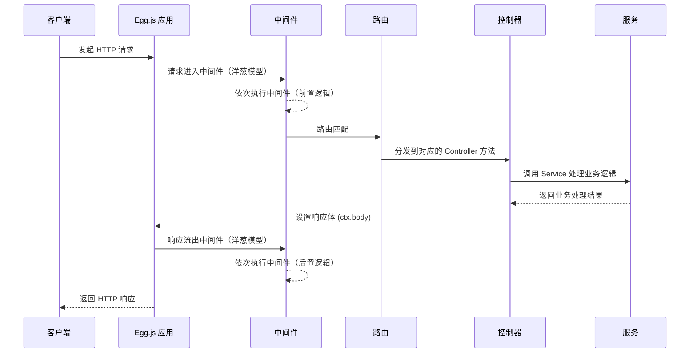

# Egg.js 核心概念

## 一、引言

本章节将深入介绍 Egg.js 的核心概念和内置对象。理解这些概念是掌握 Egg.js 开发的关键，它们构成了整个框架的基础。

通过学习本章节，你将：
- 理解 Egg.js 的目录约定规范
- 掌握框架内置对象的使用方法
- 了解 MVC 架构在 Egg.js 中的实现
- 学会扩展框架功能

## 二、目录结构

在[快速入门](02-快速入门.md)中，大家对框架应该有了初步的印象，接下来简单了解下目录约定规范。

### 2.1 标准目录结构

```bash
egg-project
├── package.json
├── app.js (可选)
├── agent.js (可选)
├── app
|   ├── router.js
│   ├── controller
│   |   └── home.js
│   ├── service (可选)
│   |   └── user.js
│   ├── middleware (可选)
│   |   └── response_time.js
│   ├── schedule (可选)
│   |   └── my_task.js
│   ├── public (可选)
│   |   └── reset.css
│   ├── view (可选)
│   |   └── home.tpl
│   └── extend (可选)
│       ├── helper.js (可选)
│       ├── request.js (可选)
│       ├── response.js (可选)
│       ├── context.js (可选)
│       ├── application.js (可选)
│       └── agent.js (可选)
├── config
|   ├── plugin.js
|   ├── config.default.js
│   ├── config.prod.js
│   ├── config.test.js (可选)
│   ├── config.local.js (可选)
│   └── config.unittest.js (可选)
└── test
    ├── middleware
    |   └── response_time.test.js
    └── controller
        └── home.test.js
```

### 2.2 目录说明

框架和插件共同约定了清晰的目录结构，以提升代码的可维护性和开发效率。

| 目录 | 类型 | 说明 |
| :--- | :--- | :--- |
| `app/router.js` | 框架约定 | 负责统一配置应用的 URL 路由规则，将请求分发到对应的 Controller |
| `app/controller/**` | 框架约定 | 控制器层，负责解析用户输入、校验参数、调用 Service 并封装响应 |
| `app/service/**` | 框架约定 | 业务逻辑层，用于封装可复用的业务逻辑，处理复杂的数据操作 |
| `app/middleware/**` | 框架约定 | 中间件层，用于编写通用的前置或后置处理逻辑 |
| `app/extend/**` | 框架约定 | 用于扩展框架的核心对象，为应用添加自定义的属性和方法 |
| `config/config.{env}.js` | 框架约定 | 配置文件，用于定义不同环境下的配置 |
| `config/plugin.js` | 框架约定 | 插件配置文件，用于声明和配置应用需要加载的插件 |
| `test/**` | 框架约定 | 测试目录，用于存放单元测试、集成测试等 |
| `app.js` / `agent.js` | 框架约定 | 自定义启动文件，用于在应用启动时执行初始化逻辑 |
| `app/public/**` | 插件约定 | 静态资源目录，由内置插件 `egg-static` 提供服务 |
| `app/schedule/**` | 插件约定 | 定时任务目录，由内置插件 `egg-schedule` 驱动 |
| `app/view/**` | 插件约定 | 模板文件目录，由模板插件约定 |
| `app/model/**` | 插件约定 | 数据模型目录，通常由 ORM 插件约定 |

> **提示**：若需自定义目录规范，参见 [Loader API](https://eggjs.org/zh-cn/advanced/loader.html)

## 三、框架内置基础对象

在 Egg.js 中，框架内置了一系列基础对象，它们是应用开发的核心。理解这些对象的作用和获取方式，是高效开发的关键。

### 3.1 Application

Application 对象是应用的全局唯一实例，代表了整个应用。它继承自 [Koa.Application](http://koajs.com/#application)，并在其基础上封装了许多框架层面的功能。

#### 核心功能

| 功能 | 描述 |
| :--- | :--- |
| **全局配置与管理** | 存储应用的全局配置，提供访问配置的接口 |
| **生命周期管理** | 在应用启动、运行和关闭过程中触发一系列生命周期事件 |
| **全局对象挂载** | 作为全局对象的容器，如 Service, Middleware 等都在其上注册和管理 |

#### 生命周期事件

在框架运行时，Application 实例会触发一系列事件：

| 事件 | 触发时机 | 说明 |
| :--- | :--- | :--- |
| `configWillLoad` | 最早 | 配置即将加载，此时配置尚未生效 |
| `configDidLoad` | 配置加载后 | 可以读取和修改配置 |
| `didLoad` | 文件加载后 | 插件和应用的文件已被加载到内存 |
| `willReady` | 初始化后 | 插件和应用的初始化逻辑已执行完毕 |
| `didReady` | 应用就绪 | 可以对外提供服务 |
| `server` | 服务启动后 | HTTP 服务启动完成，仅在每个 Worker 进程触发一次 |
| `beforeClose` | 应用关闭前 | 可以执行清理工作，如释放连接、保存状态 |
| `error` | 运行时 | 异常被 `onerror` 插件捕获时触发 |
| `request` / `response` | 运行时 | 收到请求和发出响应时触发 |

**使用示例：**

```javascript
// app.js
module.exports = (app) => {
  // 监听服务启动事件
  app.once("server", (server) => {
    console.log("HTTP server started on port %d", server.address().port)
    // 可以在此处集成 WebSocket 服务
  })

  // 监听错误事件
  app.on("error", (err, ctx) => {
    app.logger.error(err)
    // 可以将错误信息发送到监控系统
  })

  // 监听请求事件
  app.on("request", (ctx) => {
    ctx.logger.info("Request received: %s %s", ctx.method, ctx.url)
  })

  // 监听响应事件
  app.on("response", (ctx) => {
    const used = Date.now() - ctx.starttime
    ctx.logger.info("Response sent: %s %s in %dms", ctx.method, ctx.url, used)
  })
}
```

#### 获取 Application 对象

```javascript
// 方式一：在启动脚本中获取
// app.js
module.exports = (app) => {
  app.cache = new Cache()
}

// 方式二：在 Controller 中通过 this.app 获取
// app/controller/user.js
class UserController extends Controller {
  async fetch() {
    this.ctx.body = this.app.cache.get(this.ctx.query.id)
  }
}

// 方式三：在 Context 中通过 ctx.app 获取
// app/controller/user.js
class UserController extends Controller {
  async fetch() {
    this.ctx.body = this.ctx.app.cache.get(this.ctx.query.id)
  }
}
```

### 3.2 Context

Context 是一个**请求级别的对象**，是 Egg.js 对 Koa.Context 的扩展。每当接收到一个用户请求，框架就会创建一个新的 Context 实例。

#### 核心特性

- 封装了本次请求的所有信息
- 提供丰富的方法来获取请求参数和设置响应
- 在 Middleware, Controller, Service 之间传递
- 确保请求处理的原子性和数据的隔离性

#### 请求生命周期图示



#### 匿名 Context

在非请求处理的场景下（如定时任务、启动脚本），可以通过 `app.createAnonymousContext()` 创建匿名 Context：

```javascript
// app.js
module.exports = (app) => {
  app.beforeStart(async () => {
    // 创建匿名 Context
    const ctx = app.createAnonymousContext()
    try {
      await ctx.service.source.sync()
      app.logger.info("[App] 数据源同步成功")
    } catch (e) {
      app.logger.error("[App] 数据源同步失败:", e)
      throw e
    }
  })
}
```

#### 获取 Context 对象

```javascript
// 方式一：在中间件中作为参数传入
async function loggerMiddleware(ctx, next) {
  console.log(`Request URL: ${ctx.url}`)
  await next()
}

// 方式二：在 Controller 中通过 this.ctx 获取
class UserController extends Controller {
  async info() {
    const { ctx } = this
    ctx.body = `User ID: ${ctx.params.id}`
  }
}

// 方式三：在 Service 中通过 this.ctx 获取
class UserService extends Service {
  async find(uid) {
    const { ctx, app } = this
    // ...
  }
}
```

### 3.3 Request & Response

Request 和 Response 是 Koa 框架中两个非常重要的内置对象，Egg.js 继承并扩展了它们。

#### Request 常用 API

| 属性/方法 | 说明 |
| :--- | :--- |
| `ctx.header` / `ctx.request.header` | 获取所有请求头 |
| `ctx.method` / `ctx.request.method` | 获取请求方法（GET, POST 等） |
| `ctx.url` / `ctx.request.url` | 获取完整的请求 URL |
| `ctx.path` / `ctx.request.path` | 获取请求路径（不含查询参数） |
| `ctx.query` / `ctx.request.query` | 获取解析后的查询参数对象 |
| `ctx.queries` | 获取查询字符串数组 |
| `ctx.params` | 获取路由参数对象 |
| `ctx.ip` / `ctx.request.ip` | 获取客户端 IP 地址 |
| `ctx.get(name)` | 获取指定请求头的值 |
| `ctx.request.body` | 获取解析后的请求体 |

**使用示例：**

```javascript
// app/controller/user.js
class UserController extends Controller {
  async profile() {
    const { ctx } = this
    // 获取路由参数 /users/:id
    const userId = ctx.params.id
    // 获取查询参数 /users/123?role=admin
    const role = ctx.query.role
    // 获取请求头
    const userAgent = ctx.header["user-agent"]
    // 获取 POST/PUT 请求体
    const { name, age } = ctx.request.body

    ctx.body = { id: userId, role, name, age, userAgent }
  }
}
```

#### Response 常用 API

| 属性/方法 | 说明 |
| :--- | :--- |
| `ctx.status` / `ctx.response.status` | 设置 HTTP 响应状态码 |
| `ctx.body` / `ctx.response.body` | 设置响应体内容 |
| `ctx.type` / `ctx.response.type` | 设置 Content-Type |
| `ctx.set(name, value)` | 设置响应头 |
| `ctx.redirect(url)` | 发起重定向 |

**使用示例：**

```javascript
// app/controller/home.js
class HomeController extends Controller {
  async index() {
    const { ctx } = this
    ctx.body = "<h1>Hello, Egg.js!</h1>"
    ctx.type = "text/html"
  }

  async create() {
    const { ctx } = this
    ctx.status = 201
    ctx.body = { message: "User created successfully" }
  }

  async oldPath() {
    const { ctx } = this
    ctx.status = 301 // redirect() 默认 302，需先显式设置状态码
    ctx.redirect("/new-path")
  }
}
```

> **注意**：获取 POST 请求体时，应使用 `ctx.request.body`，而 `ctx.body` 用于设置响应体。

### 3.4 Controller

Controller 负责解析用户的输入、处理后返回相应的结果。在 Egg.js 的 MVC 架构中，Controller 扮演着连接用户与后端服务的桥梁角色。

#### 核心职责

| 职责 | 说明 |
| :--- | :--- |
| 获取用户参数 | 通过 `ctx.query`, `ctx.params`, `ctx.request.body` 等方式 |
| 参数校验 | 使用 `egg-validate` 插件对参数进行合法性校验 |
| 调用 Service | 将业务逻辑委托给 Service 层处理 |
| 设置响应 | 通过 `ctx.body` 设置响应体 |

#### 核心属性

| 属性 | 说明 |
| :--- | :--- |
| `ctx` | 当前请求的 Context 实例 |
| `app` | 应用的 Application 实例 |
| `config` | 应用的配置对象 |
| `service` | 应用的所有 Service |
| `logger` | 为当前 Controller 封装的 Logger 对象 |

**使用示例：**

```javascript
// app/controller/user.js
const Controller = require("egg").Controller

class UserController extends Controller {
  async create() {
    const { ctx, service } = this
    // 校验参数
    ctx.validate({
      username: { type: "string" },
      password: { type: "string" }
    })

    // 调用 service 创建用户
    const user = await service.user.create(ctx.request.body)

    // 设置响应
    ctx.status = 201
    ctx.body = { id: user.id }
  }
}

module.exports = UserController
```

### 3.5 Service

Service 用于封装业务逻辑，处理复杂的计算、数据存储和外部系统调用。

#### 核心优势

| 优势 | 说明 |
| :--- | :--- |
| **复用性** | 不同的 Controller 可以调用同一个 Service |
| **职责分离** | 保持 Controller 的轻量，专注于参数解析和视图渲染 |
| **可测试性** | Service 是独立的业务单元，易于编写单元测试 |

**使用示例：**

```javascript
// app/service/user.js
const Service = require("egg").Service

class UserService extends Service {
  async create(payload) {
    const { app } = this
    const result = await app.mysql.insert("users", payload)
    return { id: result.insertId }
  }

  async find(id) {
    const { app, ctx } = this
    const user = await app.mysql.get("users", { id })
    if (!user) {
      ctx.throw(404, "User not found")
    }
    return user
  }
}

module.exports = UserService
```

### 3.6 Middleware

中间件是处理 HTTP 请求的核心环节，它采用经典的"洋葱模型"，允许在请求处理的前后执行自定义逻辑。

#### 中间件分类

| 类型 | 说明 | 配置位置 |
| :--- | :--- | :--- |
| **应用级中间件** | 对整个应用生效 | `config/config.default.js` |
| **路由级中间件** | 仅对单个或一组路由生效 | `app/router.js` |

**定义中间件：**

```javascript
// app/middleware/auth.js
module.exports = (options) => {
  return async function auth(ctx, next) {
    const token = ctx.get("Authorization")
    if (token) {
      const user = await ctx.service.user.findByToken(token)
      if (user) {
        ctx.user = user
        await next()
      } else {
        ctx.status = 401
        ctx.body = "Unauthorized"
      }
    } else {
      ctx.status = 401
      ctx.body = "Unauthorized"
    }
  }
}
```

**使用中间件：**

```javascript
// config/config.default.js - 应用级中间件
module.exports = {
  middleware: ["errorHandler", "auth"]
}

// app/router.js - 路由级中间件
module.exports = (app) => {
  const { router, controller, middleware } = app
  const auth = middleware.auth()

  router.get("/api/user/profile", auth, controller.user.profile)
}
```

### 3.7 Config

Config 对象用于管理应用的全部配置。框架提供了多环境的配置能力。

#### 配置文件

| 配置文件 | 说明 |
| :--- | :--- |
| `config.default.js` | 默认配置文件，所有环境都会加载 |
| `config.prod.js` | 生产环境配置，会覆盖默认配置 |
| `config.local.js` | 本地开发环境配置 |
| `config.unittest.js` | 单元测试环境配置 |

### 3.8 Helper

Helper 用于提供一些辅助函数，方便在模板和 Controller 中使用。

**扩展示例：**

```javascript
// app/extend/helper.js
const moment = require("moment")

module.exports = {
  formatTime(time) {
    return moment(time).format("YYYY-MM-DD HH:mm:ss")
  },

  relativeTime(time) {
    return moment(new Date(time * 1000)).fromNow()
  }
}
```

**在模板中使用：**

```html
<!-- app/view/home.tpl -->
<div>{{ helper.formatTime(item.create_time) }}</div>
```

### 3.9 Logger

Logger 用于记录应用的运行日志，是监控、排查问题的重要工具。

#### Logger 分类

| Logger | 说明 | 默认路径 |
| :--- | :--- | :--- |
| `app.logger` | 应用级别日志 | `logs/{app}/egg-app.log` |
| `ctx.logger` | 请求级别日志（自动附加 traceId） | `logs/{app}/egg-web.log` |
| `app.coreLogger` | 框架内核日志 | `logs/egg-agent/egg-agent.log` |

**日志配置：**

```javascript
// config/config.default.js
module.exports = {
  logger: {
    level: "INFO",
    consoleLevel: "INFO",
    dir: "/path/to/your/log/dir"
  }
}
```

### 3.10 插件（Plugin）

插件是 Egg.js 生态系统的重要组成部分，它们为框架提供了可插拔的功能扩展。

**配置插件：**

```javascript
// config/plugin.js
const path = require("path")

module.exports = {
  // 启用 egg-mysql 插件
  mysql: {
    enable: true,
    package: "egg-mysql"
  },

  // 启用本地开发的插件
  myPlugin: {
    enable: true,
    path: path.join(__dirname, "../lib/plugin/my-plugin")
  }
}
```

### 3.11 定时任务（Schedule）

定时任务用于在应用后台执行一些预定的、周期性的任务。

**定义定时任务：**

```javascript
// app/schedule/sync_data.js
const Subscription = require("egg").Subscription

class SyncData extends Subscription {
  static get schedule() {
    return {
      interval: "1h", // 每小时执行一次
      type: "worker" // 在某个 worker 进程上执行
    }
  }

  async subscribe() {
    const { ctx } = this
    try {
      await ctx.service.data.sync()
      ctx.logger.info("[Schedule] 数据同步成功")
    } catch (err) {
      ctx.logger.error("[Schedule] 数据同步失败:", err)
    }
  }
}

module.exports = SyncData
```

### 3.12 框架扩展

当框架提供的核心功能无法满足某些特殊需求时，可以通过扩展框架的内置对象来增加自定义的属性和方法。

**扩展 Application：**

```javascript
// app/extend/application.js
const RPC_CLIENT = Symbol("Application#rpcClient")

module.exports = {
  get rpcClient() {
    if (!this[RPC_CLIENT]) {
      this[RPC_CLIENT] = { invoke: async (service, method) => ({ ok: true }) }
    }
    return this[RPC_CLIENT]
  }
}
```

**扩展 Context：**

```javascript
// app/extend/context.js
module.exports = {
  get isAjax() {
    return this.get("X-Requested-With") === "XMLHttpRequest"
  }
}
```

## 四、高级主题

### 4.1 调试技巧

#### 使用 VS Code 调试

创建 `.vscode/launch.json`：

```json
{
  "version": "0.2.0",
  "configurations": [
    {
      "name": "Egg Debug",
      "type": "node",
      "request": "launch",
      "runtimeExecutable": "npm",
      "runtimeArgs": ["run", "debug"],
      "console": "integratedTerminal",
      "protocol": "auto",
      "port": 9229
    }
  ]
}
```

#### 使用 Chrome DevTools

```bash
# 启动调试模式
$ npm run debug

# 打开 Chrome 浏览器，访问 chrome://inspect
```

### 4.2 性能优化

| 优化方向 | 建议 |
| :--- | :--- |
| **数据库** | 使用连接池、添加索引、避免 N+1 查询、使用缓存 |
| **模板渲染** | 开启模板缓存、避免在模板中进行复杂计算 |
| **静态资源** | CDN 加速、Gzip 压缩、配置浏览器缓存 |
| **代码层面** | 避免同步操作、使用 Stream 处理大文件、使用 `Promise.all` 并行 |

### 4.3 安全实践

#### CSRF 防护

框架默认开启 CSRF 防护：

```html
<!-- 在表单中添加 Token -->
<form method="POST" action="/upload">
  <input type="hidden" name="_csrf" value="{{ ctx.csrf }}" />
</form>
```

```javascript
// 在 AJAX 中添加 Token
fetch("/api/data", {
  method: "POST",
  headers: {
    "x-csrf-token": csrfToken
  }
})
```

#### 安全头配置

```javascript
// config/config.default.js
module.exports = {
  security: {
    xframe: { value: "DENY" },
    hsts: { enable: true, maxAge: 31536000 }
  }
}
```

## 五、常见问题解答 (FAQ)

### 5.1 如何在非请求作用域中获取 `ctx`？

使用 `app.createAnonymousContext()` 创建匿名上下文：

```javascript
// app.js
module.exports = (app) => {
  app.beforeStart(async () => {
    const ctx = app.createAnonymousContext()
    await ctx.service.source.sync()
  })
}
```

### 5.2 Controller 和 Service 有什么区别？

| Controller | Service |
| :--- | :--- |
| 处理 HTTP 请求 | 封装业务逻辑 |
| 参数校验、响应封装 | 数据库操作、外部 API 调用 |
| 保持轻量 | 可复用、可测试 |

### 5.3 如何自定义目录结构？

通过 Loader API 自定义加载：

```javascript
// app.js
module.exports = (app) => {
  app.loader.loadToApp(app.baseDir + "/my-directory", "myModule")
}
```

### 5.4 为什么配置文件没有生效？

检查以下项：
1. 配置文件命名是否正确
2. 环境变量 `EGG_SERVER_ENV` 是否匹配
3. 配置的层级结构是否正确

### 5.5 如何优雅地处理异常？

1. **统一错误处理中间件**
2. **监听 `error` 事件**
3. **使用 `ctx.throw()` 抛出标准错误**

## 六、错误排查指南

### 6.1 查看日志

| 日志文件 | 内容 |
| :--- | :--- |
| `egg-web.log` | Web 请求相关日志 |
| `egg-app.log` | 应用级别日志 |
| `common-error.log` | 错误日志 |
| `egg-agent.log` | Agent 进程日志 |

### 6.2 常见错误排查

| 错误现象 | 排查方向 |
| :--- | :--- |
| 启动失败 | 检查 `egg-agent.log`、`plugin.js`、配置文件 |
| 404 Not Found | 检查 `router.js`、Controller 文件名和方法名 |
| 500 Internal Error | 查看 `egg-web.log` 中的错误堆栈 |
| 数据库连接失败 | 检查配置、网络、白名单 |

## 七、版本记录

| 版本 | 日期 | 主要变更 |
| :--- | :--- | :--- |
| 1.0 | 2024-01-01 | 初始版本 |
| 1.1 | 2024-06-15 | 添加章节编号、完善 API 表格、补充使用示例 |
