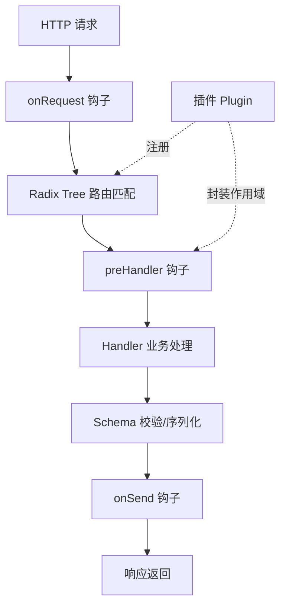

# Fastify 概述

Fastify 是一个聚焦于**极低开销与高开发体验**的 Node.js Web 框架，在 v22 环境下单进程吞吐通常可达 Express 的 2–3 倍。其核心竞争力来自三条设计主线：基于 Radix Tree 的路由、基于 JSON Schema 的序列化层、以及借鉴于 hapi 的插件化封装模型。

## 为什么需要 Fastify

| 维度 | Express | Koa | Fastify |
|------|---------|-----|---------|
| 路由结构 | 线性链表 | 无内置路由 | Radix Tree（O(log n) 查找） |
| 请求体校验 | 需中间件 | 需中间件 | 内置 JSON Schema（编译为函数） |
| 响应序列化 | 手动 `JSON.stringify` | 手动 | `fast-json-stringify` 预编译 |
| 插件隔离 | 全局 `app` | 全局 `app` | 封装上下文（Encapsulation） |

## 核心架构



## 最小示例（ESM，v22）

```js
import Fastify from 'fastify';

const app = Fastify({ logger: true });

app.post('/user', {
  schema: {
    body: { type: 'object', required: ['name'], properties: { name: { type: 'string' } } },
    response: { 200: { type: 'object', properties: { id: { type: 'number' }, name: { type: 'string' } } } },
  },
}, async (req) => ({ id: Date.now(), name: req.body.name }));

await app.listen({ port: 3000 });
```

## 插件与封装

Fastify 通过 `app.register()` 实现作用域隔离：每个插件拥有独立的装饰器（decorator）与钩子，避免全局污染。

```js
const app = Fastify();
app.decorate('db', createDb());           // 仅当前作用域可见
app.register(async (scope) => {
  scope.decorate('cache', createCache()); // 子作用域私有
}, { prefix: '/admin' });
```

## 何时选择 Fastify

- ✅ 高吞吐 API 服务、对 P99 延迟敏感的场景
- ✅ 需要内置校验/序列化、减少样板代码的团队
- ⚠️ 生态成熟度仍弱于 Express，部分老旧中间件需适配
