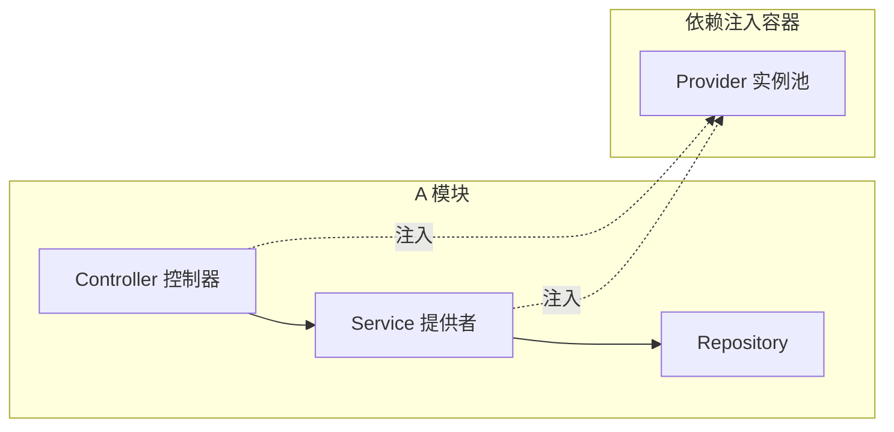

# NestJS 概述与架构


---


NestJS 是构建在 Express/Fastify 之上的**渐进式 Node.js 服务端框架**，借鉴 Angular 的模块化与依赖注入（DI）思想，将「企业级结构约束」带入 Node 生态。它本身不重新实现 HTTP 层，而是以平台适配器（默认 Express，可切换 Fastify）承载请求。

## 设计哲学：约束优于配置



## 核心三元组

| 概念 | 职责 | 装饰器 |
|------|------|--------|
| Module | 组织相关 Provider/Controller 的边界 | `@Module({})` |
| Controller | 接收请求、调用 Service、返回响应 | `@Controller()` |
| Provider | 封装业务逻辑与数据访问，可注入 | `@Injectable()` |

## 最小示例（ESM，v22）

```ts
import { Module } from '@nestjs/common';
import { Controller, Get } from '@nestjs/common';
import { Injectable } from '@nestjs/common';

@Injectable()
export class UserService {
  findAll() { return [{ id: 1, name: 'alice' }]; }
}

@Controller('users')
export class UserController {
  constructor(private readonly svc: UserService) {}
  @Get()
  findAll() { return this.svc.findAll(); }
}

@Module({ controllers: [UserController], providers: [UserService] })
export class UserModule {}
```

## 与 Express/Koa/Fastify 的关系

- NestJS **不是**另一个 HTTP 运行时，而是架构层；底层仍由 Express 或 Fastify 驱动。
- 在 `NestFactory.create(AppModule, new FastifyAdapter())` 下可复用 Fastify 的高性能。
- 适合中大型团队需要统一分层、AOP（拦截器/守卫/管道）与可测试性的项目。

## 何时选择 NestJS

- ✅ 业务复杂、团队规模大、需要明确分层与 DI
- ✅ 需要 GraphQL、Microservices、WebSocket 等开箱集成
- ⚠️ 学习曲线陡峭，轻量 API 场景下引入成本高

---


## NestJS应用场景分析


## 一、NestJS 适用场景判断

### 1.1 技术层面适用场景

```
NestJS 最佳应用场景：
│
├──  场景一：前端团队规模较大
│   ├── 前端开发者数量 ≥ 后端开发者数量
│   ├── 前端团队已具备 Node.js 基础
│   └── 需要快速开发后端 API
│
├──  场景二：公司有 Node.js 开发先例
│   ├── 公司高层了解 Node.js 优势
│   ├── 已有相关技术栈积累
│   └── 更愿意加大投入
│
└──  场景三：独立开发者接私活
    ├── 不受团队约束
    ├── 自主选择技术栈
    └── 注重开发效率
```

### 1.2 Node.js 通用应用场景

#### 适合使用 Node.js 开发的场景

| 场景类型 | 特点 | 典型应用 |
|----------|------|----------|
| **高并发应用** | CPU 密集不敏感 | 聊天室、即时通讯、爬虫 |
| **快速上线项目** | 缺少后端资源 | 初创项目、MVP 产品 |
| **Serverless 架构** | 前后端一体化 | 微服务、云函数 |
| **实时应用** | WebSocket 集成 | 在线协作、直播弹幕 |

#### NestJS 对这些场景的支持

```typescript
//  场景一：WebSocket 实时应用
// NestJS 官方提供 @nestjs/websockets 支持
@WebSocketGateway()
export class ChatGateway {
  @SubscribeMessage('message')
  handleMessage(client: Socket, payload: string): string {
    return 'Hello world';
  }
}

//  场景二：快速上线项目
// NestJS CLI 快速生成项目结构
// $ nest new project-name
// $ nest g module users
// $ nest g controller users
// $ nest g service users

//  场景三：Serverless 微服务
// NestJS 支持微服务架构
@Injectable()
export class AppService {
  getData(): { message: string } {
    return { message: 'Welcome to nest-api!' };
  }
}
```

### 1.3 NestJS vs 其他 Node.js 框架

| 特性 | NestJS | Express | Koa | Fastify |
|------|--------|---------|-----|---------|
| **架构模式** | Angular 风格 MVC | 灵活中间件 | 轻量级 | 高性能 |
| **TypeScript 支持** |  原生支持 | 需配置 | 需配置 | 需配置 |
| **学习曲线** | 较陡峭 | 平缓 | 平缓 | 中等 |
| **企业级特性** | 完善 | 需自己搭建 | 需自己搭建 | 部分 |
| **依赖注入** |  内置 |  无 |  无 |  无 |
| **模块化** |  强制模块化 |  需手动组织 |  需手动组织 |  需手动组织 |
| **文档生成** |  Swagger 集成 | 需插件 | 需插件 | 需插件 |
| **性能** | 高 | 高 | 高 | 极高 |

**NestJS 核心优势：**
-  **架构清晰**：强制使用模块化、依赖注入等设计模式
-  **TypeScript 优先**：类型安全，代码可维护性强
-  **开箱即用**：内置 DI、模块、管道、守卫等企业级特性
-  **生态完善**：官方支持 GraphQL、WebSocket、微服务、数据库集成等

---

## 二、团队推动策略

### 2.1 如何说服团队采用 NestJS

```
推动 NestJS 落地策略：
│
├──  第一步：成为技术布道者
│   ├── 学习并掌握 NestJS 核心
│   ├── 团队内分享技术优势
│   └── 组织技术分享会
│
├──  第二步：性能对比演示
│   ├── 编写 Java vs Node.js 性能测试案例
│   ├── 展示 NestJS 在高并发场景下的表现
│   └── 提供详细的性能测试报告
│
└──  第三步：实际项目验证
    ├── 在私活项目中使用 NestJS
    ├── 展示项目成果和开发效率
    └── 与团队成员分享实战经验
```

### 2.2 团队规模适配分析

#### 场景一：前端人数少，后端人数多

```
团队结构示例：
前端团队：2-3 人
后端团队：10+ 人

是否适合 NestJS？需要考虑：
├──  前端团队能否支撑所有前端项目？
├──  后端开发者是否涉及前端开发？
├──  配给前端的后端支持有多少？
└──  如果前端已满负荷，不建议增加后端工作
```

#### 场景二：前端人数多，后端人数少

```
团队结构示例：
前端团队：10+ 人
后端团队：2-3 人

适合采用 NestJS：
├──  前端团队可分担后端开发压力
├──  降低后端招聘成本
├──  前后端技术栈统一，沟通成本低
└──  全栈开发能力提升
```

### 2.3 实战：性能对比演示案例

```typescript
// ===== Java Spring Boot 示例 =====
@RestController
public class UserController {
    @GetMapping("/users")
    public List<User> getUsers() {
        // 数据库查询
        return userRepository.findAll();
    }
}

// ===== NestJS 示例 =====
@Controller('users')
export class UserController {
  constructor(private readonly userService: UserService) {}

  @Get()
  async findAll(): Promise<User[]> {
    return this.userService.findAll();
  }
}

// 性能对比要点：
// 1. 开发效率：NestJS CLI 生成代码更快
// 2. 语言统一：前后端都使用 TypeScript
// 3. 性能表现：Node.js 在 I/O 密集型场景表现优异
// 4. 并发处理：Node.js 事件循环机制适合高并发
```

---

## 三、招聘与薪酬分析

### 3.1 一线城市薪酬水平（3-5 年经验）

| 岗位 | 薪酬范围 | 备注 |
|------|----------|------|
| **前端开发（纯前端）** | 20-30K | 精通 Vue/React、工程化 |
| **前端开发（全栈 Node.js）** | 25-40K | 掌握 NestJS、数据库、架构 |
| **前端开发（高薪）** | 50-60K | 期权 + 股票，少数人 |
| **Java 后端开发** | 25-35K | 3-5 年经验 |

**关键发现：**
-  全栈前端开发者薪酬可提升 **30%-50%**
-  掌握 NestJS 等后端框架是核心竞争力
-  前端开发者能力范围更广：小程序、APP、桌面端、后端

### 3.2 二三线城市薪酬水平（3-5 年经验）

| 岗位 | 薪酬范围 | 备注 |
|------|----------|------|
| **前端开发（普通）** | 8-15K | 平均水平 |
| **前端开发（大厂）** | 15-20K | 融资公司，少数 |
| **前端开发（优秀）** | 18K+ | 非常优秀的公司 |

### 3.3 前端开发者的职业优势

```
前端开发者能力矩阵：
│
├──  多端开发能力
│   ├── Web 应用
│   ├── 小程序（微信/支付宝/抖音）
│   ├── 移动端 APP（React Native/Flutter）
│   └── 桌面应用（Electron/Tauri）
│
├──  后端开发能力（掌握 NestJS）
│   ├── RESTful API 设计
│   ├── 数据库设计与管理
│   ├── 微服务架构
│   └── GraphQL API
│
└──  工程化能力
    ├── 构建工具（Vite/Webpack）
    ├── CI/CD 流程
    ├── 性能优化
    └── 架构设计
```

---

## 四、项目维护成本分析


### 4.1 技术栈稳定性

| 维护维度 | NestJS 优势 | 说明 |
|----------|------------|------|
| **TypeScript 支持** |  长期可维护 | 类型安全，重构容易 |
| **版本稳定性** |  API 变化少 | 从 v3 到 v11 核心用法不变 |
| **团队活跃度** |  持续更新 | 半商业化运营，有保障 |
| **生态完善度** |  官方支持丰富 | GraphQL、WebSocket、微服务 |

### 4.2 版本演进示例

```typescript
// ===== NestJS 3.x - 11.x 核心用法稳定性对比 =====

//  装饰器用法一直保持稳定
@Controller('users')
export class UserController {
  constructor(private readonly userService: UserService) {}

  @Get()
  findAll() {
    return this.userService.findAll();
  }
}

//  模块定义方式稳定
@Module({
  imports: [TypeOrmModule.forFeature([User])],
  controllers: [UserController],
  providers: [UserService],
})
export class UserModule {}

//  依赖注入方式稳定
@Injectable()
export class UserService {
  constructor(
    @InjectRepository(User)
    private userRepository: Repository<User>,
  ) {}

  async findAll(): Promise<User[]> {
    return this.userRepository.find();
  }
}

// 版本更新重点：
// - 性能优化
// - Bug 修复
// - 新功能添加
// - 核心API保持向后兼容
```

### 4.3 维护成本对比

```
项目维护成本对比：
│
├── Java/Spring 项目
│   ├──  生态成熟，文档完善
│   ├──  需要专业 Java 开发者
│   ├──  前后端技术栈分离
│   └──  维护成本：中等
│
├── Go 项目
│   ├──  性能优异
│   ├──  生态相对较新
│   ├──  需要专业 Go 开发者
│   └──  维护成本：中等
│
└── NestJS 项目
    ├──  前后端技术栈统一（TypeScript）
    ├──  前端开发者可快速上手
    ├──  架构清晰，易于维护
    └──  维护成本：相当
```

---

## 五、实战案例：NestJS 项目快速搭建

### 5.1 项目初始化

```bash
# 1. 全局安装 NestJS CLI
npm install -g @nestjs/cli

# 2. 创建新项目
nest new nest-api
# 选择 pnpm 作为包管理器

# 3. 启动开发服务器
cd nest-api
pnpm run start:dev

# 4. 生成 CRUD 模块（快速开发）
nest g resource users
# 选择 REST API
# 选择 Yes 生成 CRUD 入口点
```

### 5.2 项目结构说明

```
nest-api/
├── src/
│   ├── main.ts              # 应用入口
│   ├── app.module.ts        # 根模块
│   ├── users/               # 用户模块（自动生成）
│   │   ├── dto/             # 数据传输对象
│   │   ├── entities/        # 实体定义
│   │   ├── users.controller.ts   # 控制器
│   │   ├── users.module.ts       # 模块
│   │   └── users.service.ts      # 服务
│   └── ...
├── test/                    # 测试文件
├── nest-cli.json            # NestJS CLI 配置
├── tsconfig.json            # TypeScript 配置
└── package.json             # 项目依赖
```

### 5.3 核心文件代码解析

```typescript
// ===== main.ts - 应用启动文件 =====
import { NestFactory } from '@nestjs/core';
import { AppModule } from './app.module';

async function bootstrap() {
  const app = await NestFactory.create(AppModule);
  
  // 配置全局前缀
  app.setGlobalPrefix('api');
  
  // 启用 CORS（前后端分离必备）
  app.enableCors();
  
  await app.listen(3000);
  console.log('Application is running on: http://localhost:3000/api');
}
bootstrap();

// ===== app.module.ts - 根模块 =====
import { Module } from '@nestjs/common';
import { UsersModule } from './users/users.module';

@Module({
  imports: [UsersModule],
  controllers: [],
  providers: [],
})
export class AppModule {}

// ===== users.controller.ts - 控制器（处理路由） =====
import { Controller, Get, Post, Body, Param } from '@nestjs/common';
import { UsersService } from './users.service';
import { CreateUserDto } from './dto/create-user.dto';

@Controller('users')
export class UsersController {
  constructor(private readonly usersService: UsersService) {}

  @Post()
  create(@Body() createUserDto: CreateUserDto) {
    return this.usersService.create(createUserDto);
  }

  @Get()
  findAll() {
    return this.usersService.findAll();
  }

  @Get(':id')
  findOne(@Param('id') id: string) {
    return this.usersService.findOne(+id);
  }
}

// ===== users.service.ts - 服务（业务逻辑） =====
import { Injectable } from '@nestjs/common';
import { CreateUserDto } from './dto/create-user.dto';

@Injectable()
export class UsersService {
  private users = [];

  create(createUserDto: CreateUserDto) {
    const user = {
      id: Date.now(),
      ...createUserDto,
    };
    this.users.push(user);
    return user;
  }

  findAll() {
    return this.users;
  }

  findOne(id: number) {
    return this.users.find(user => user.id === id);
  }
}

// ===== dto/create-user.dto.ts - 数据传输对象 =====
export class CreateUserDto {
  name: string;
  email: string;
  age: number;
}
```


### 5.4 数据库集成示例（TypeORM）

```bash
# 安装 TypeORM 和数据库驱动
pnpm add @nestjs/typeorm typeorm mysql2
```

```typescript
// ===== app.module.ts - 配置数据库连接 =====
import { Module } from '@nestjs/common';
import { TypeOrmModule } from '@nestjs/typeorm';
import { UsersModule } from './users/users.module';

@Module({
  imports: [
    TypeOrmModule.forRoot({
      type: 'mysql',
      host: 'localhost',
      port: 3306,
      username: 'root',
      password: 'password',
      database: 'test',
      entities: [],
      synchronize: true, // 生产环境设为 false
    }),
    UsersModule,
  ],
})
export class AppModule {}

// ===== users/entities/user.entity.ts - 实体定义 =====
import { Entity, Column, PrimaryGeneratedColumn } from 'typeorm';

@Entity()
export class User {
  @PrimaryGeneratedColumn()
  id: number;

  @Column()
  name: string;

  @Column()
  email: string;

  @Column()
  age: number;
}

// ===== users.module.ts - 注册实体 =====
import { Module } from '@nestjs/common';
import { TypeOrmModule } from '@nestjs/typeorm';
import { UsersService } from './users.service';
import { UsersController } from './users.controller';
import { User } from './entities/user.entity';

@Module({
  imports: [TypeOrmModule.forFeature([User])],
  controllers: [UsersController],
  providers: [UsersService],
})
export class UsersModule {}

// ===== users.service.ts - 使用数据库 =====
import { Injectable } from '@nestjs/common';
import { InjectRepository } from '@nestjs/typeorm';
import { Repository } from 'typeorm';
import { User } from './entities/user.entity';
import { CreateUserDto } from './dto/create-user.dto';

@Injectable()
export class UsersService {
  constructor(
    @InjectRepository(User)
    private userRepository: Repository<User>,
  ) {}

  create(createUserDto: CreateUserDto): Promise<User> {
    const user = this.userRepository.create(createUserDto);
    return this.userRepository.save(user);
  }

  findAll(): Promise<User[]> {
    return this.userRepository.find();
  }

  async findOne(id: number): Promise<User> {
    return this.userRepository.findOne({ where: { id } });
  }
}
```

---

## 六、常见问题与解决方案

| 问题 | 原因 | 解决方案 |
|------|------|----------|
| 团队缺乏 Node.js 经验 | 前端开发者只熟悉浏览器环境 | 逐步培训，从简单 API 开始 |
| 担心性能不如 Java | 对 Node.js 性能有误解 | 进行性能测试对比，展示 I/O 密集场景优势 |
| 担心项目维护困难 | 不了解 NestJS 架构优势 | 展示 TypeScript 类型安全和模块化优势 |
| 版本升级担心 API 变化 | 对框架稳定性不了解 | 展示 NestJS 版本演进历史，核心 API 稳定 |
| 生态不如 Spring 成熟 | 不了解 NestJS 生态 | 展示官方模块：GraphQL、WebSocket、微服务 |
| 数据库操作不如 ORM 方便 | 不了解 TypeORM/Prisma | 演示 TypeORM/Prisma 集成，提供最佳实践 |

---

## 七、学习要点总结

### 核心要点

1. **NestJS 最佳场景**：前端团队规模大、有 Node.js 经验、需要快速开发后端 API 的项目
2. **推动策略**：成为技术布道者 → 性能对比演示 → 实际项目验证
3. **薪酬提升**：掌握 NestJS 全栈开发可提升 30%-50% 薪资水平
4. **维护成本**：TypeScript 类型安全 + 架构清晰 + 版本稳定 = 低维护成本
5. **能力扩展**：前端开发者通过 NestJS 可掌握后端开发、微服务架构等能力

### 行动建议

```
学习路径：
│
├──  第一阶段：基础掌握（1-2 周）
│   ├── TypeScript 高级语法
│   ├── NestJS 核心概念：模块、控制器、服务
│   └── 依赖注入与装饰器
│
├──  第二阶段：实战练习（2-3 周）
│   ├── RESTful API 开发
│   ├── 数据库集成（TypeORM/Prisma）
│   └── 用户认证与授权
│
└──  第三阶段：进阶应用（3-4 周）
    ├── 微服务架构
    ├── GraphQL API
    ├── WebSocket 实时通信
    └── 部署与 DevOps
```

---

## 八、延伸学习资源

### 官方资源

-  [NestJS 官方文档](https://docs.nestjs.com/)
-  [NestJS 官方课程](https://courses.nestjs.com/)
-  [NestJS GitHub](https://github.com/nestjs/nest)
-  [NestJS Awesome](https://github.com/nestjs/awesome-nestjs)

### 推荐学习

-  TypeORM 官方文档：https://typeorm.io/
-  Prisma 官方文档：https://www.prisma.io/
-  TypeScript 高级特性：https://www.typescriptlang.org/docs/
-  Node.js 最佳实践：https://github.com/goldbergyoni/nodebestpractices

### 练习项目建议

1. **博客系统**：用户认证、文章 CRUD、评论功能
2. **任务管理系统**：任务分配、进度跟踪、团队协作
3. **实时聊天室**：WebSocket 集成、消息存储、在线状态
4. **电商 API**：商品管理、购物车、订单系统、支付集成

---

## 附录：NestJS 核心概念速查表

| 概念 | 说明 | 装饰器 |
|------|------|--------|
| **Module** | 组织应用结构，注册控制器和服务 | `@Module()` |
| **Controller** | 处理 HTTP 请求，定义路由 | `@Controller()` |
| **Service** | 业务逻辑处理，数据访问 | `@Injectable()` |
| **Provider** | 可注入的服务、仓库等 | `@Injectable()` |
| **Pipe** | 数据验证与转换 | `@UsePipes()` |
| **Guard** | 认证与授权 | `@UseGuards()` |
| **Interceptor** | 请求/响应拦截 | `@UseInterceptors()` |
| **Filter** | 异常处理 | `@Catch()` |
| **Middleware** | 请求预处理 | 实现 `NestMiddleware` |

---


## 一、主流 Node.js Web 框架概览

### 1.1 框架发展历程

```
Node.js Web 框架演进史：
│
├── 2009 - Express
│   └── 第一个流行的 Node.js Web 框架
│
├── 2013 - Koa
│   └── Express 原班人马打造，更轻量、现代化
│
├── 2016 - Egg.js
│   └── 阿里出品，企业级框架，基于 Koa
│
└── 2017 - NestJS
    └── Angular 风格，TypeScript 优先，企业级架构
```

### 1.2 四大框架核心对比

| 特性 | Express | Koa | Egg.js | NestJS |
|------|---------|-----|--------|--------|
| **诞生时间** | 2009 | 2013 | 2016 | 2017 |
| **设计理念** | 极简、灵活 | 轻量、优雅 | 企业级、规范 | 架构完整、模块化 |
| **TypeScript 支持** |  需配置 |  需配置 |  需配置 |  原生支持 |
| **内置功能** | 中间件、路由 | 中间件 | MVC、插件 | DI、模块、管道、守卫 |
| **架构模式** | 无强制 | 无强制 | MVC | MVC + DI + AOP |
| **学习曲线** | 平缓 | 平缓 | 中等 | 较陡峭 |
| **生态丰富度** | 最丰富 | 中等 | 中等（国内） | 丰富 |
| **文档完善度** | 完善 | 完善 | 完善（中文） | 非常完善（英文为主） |
| **企业级特性** |  需自己搭建 |  需自己搭建 |  部分内置 |  完整内置 |
| **性能** | 高 | 高 | 中 | 高（可替换底层） |
| **适合项目规模** | 小型 | 小型 | 中小型 | 中大型 |
| **维护状态** | 稳定 | 活跃 | 活跃（阿里） | 非常活跃 |

---

## 二、Express vs Koa vs Egg.js 深度对比

### 2.1 Express：Web 框架的鼻祖

#### 核心特点
```
Express 特点：
│
├──  优势
│   ├── 生态最丰富，中间件众多
│   ├── 文档完善，社区活跃
│   ├── 灵活自由，无强制架构
│   └── 学习成本低，上手快
│
└──  劣势
    ├── 无 TypeScript 原生支持
    ├── 回调地狱（老版本）
    ├── 缺乏架构指导
    └── 大型项目难以维护
```

#### 代码示例

```javascript
// ===== Express 基础示例 =====
const express = require('express');
const app = express();

// 中间件：解析 JSON
app.use(express.json());

// 路由定义
app.get('/', (req, res) => {
  res.send('Hello World');
});

app.get('/users', (req, res) => {
  res.json([
    { id: 1, name: '张三' },
    { id: 2, name: '李四' }
  ]);
});

app.post('/users', (req, res) => {
  const { name, email } = req.body;
  // 业务逻辑混在路由中
  const newUser = { id: Date.now(), name, email };
  res.status(201).json(newUser);
});

// 启动服务
app.listen(3000, () => {
  console.log('Server running on http://localhost:3000');
});

//  问题：
// 1. 缺乏分层，业务逻辑与路由耦合
// 2. 无依赖注入，需手动管理依赖
// 3. 无类型检查，容易出错
```

### 2.2 Koa：更优雅的下一代框架

#### 核心特点
```
Koa 特点：
│
├──  优势
│   ├── 更轻量，核心仅 550 行代码
│   ├── async/await 支持，代码更优雅
│   ├── 洋葱模型中间件，控制流清晰
│   └── 无捆绑中间件，自由选择
│
└──  劣势
    ├── 功能太少，需自己实现路由等
    ├── 生态不如 Express 丰富
    ├── 无架构指导
    └── TypeScript 支持需配置
```

#### 代码示例

```javascript
// ===== Koa 基础示例 =====
const Koa = require('koa');
const Router = require('koa-router');
const bodyParser = require('koa-bodyparser');

const app = new Koa();
const router = new Router();

// 中间件：洋葱模型示例
app.use(async (ctx, next) => {
  console.log('第一层中间件 - 开始');
  await next();
  console.log('第一层中间件 - 结束');
});

app.use(async (ctx, next) => {
  console.log('第二层中间件 - 开始');
  await next();
  console.log('第二层中间件 - 结束');
});

// 解析请求体
app.use(bodyParser());

// 路由定义
router.get('/', async (ctx) => {
  ctx.body = 'Hello World';
});

router.get('/users', async (ctx) => {
  ctx.body = [
    { id: 1, name: '张三' },
    { id: 2, name: '李四' }
  ];
});

router.post('/users', async (ctx) => {
  const { name, email } = ctx.request.body;
  const newUser = { id: Date.now(), name, email };
  ctx.status = 201;
  ctx.body = newUser;
});

// 注册路由
app.use(router.routes()).use(router.allowedMethods());

// 启动服务
app.listen(3000, () => {
  console.log('Server running on http://localhost:3000');
});

//  优点：洋葱模型清晰，async/await 优雅
//  问题：需自己搭建架构，缺乏分层
```

#### 洋葱模型图解

```
请求 → 中间件1 → 中间件2 → 中间件3 → 路由处理
                                              ↓
响应 ← 中间件1 ← 中间件2 ← 中间件3 ← 业务逻辑

执行顺序：
1. 请求进入中间件1
2. 调用 next() 进入中间件2
3. 调用 next() 进入中间件3
4. 调用 next() 进入路由处理
5. 路由处理完成，返回中间件3
6. 中间件3 完成，返回中间件2
7. 中间件2 完成，返回中间件1
8. 中间件1 完成，响应客户端
```


### 2.3 Egg.js：阿里出品的企业级框架

#### 核心特点
```
Egg.js 特点：
│
├──  优势
│   ├── 企业级架构，开箱即用
│   ├── 约定优于配置，规范统一
│   ├── 插件机制丰富
│   ├── 中文文档完善（阿里团队）
│   └── 内置安全、日志等功能
│
└──  劣势
    ├── TypeScript 支持不佳（需 Babel 编译）
    ├── 基于 CommonJS 规范，现代化不足
    ├── 学习成本较高（约定多）
    └── 性能略有损耗（封装层多）
```

#### 代码示例

```javascript
// ===== Egg.js 项目结构 =====
egg-project/
├── app/
│   ├── controller/          # 控制器
│   │   └── home.js
│   ├── service/             # 服务层
│   │   └── user.js
│   ├── middleware/          # 中间件
│   ├── router.js            # 路由配置
│   └── extend/              # 扩展
├── config/
│   ├── config.default.js    # 配置文件
│   └── plugin.js            # 插件配置
└── package.json

// ===== app/router.js - 路由配置 =====
module.exports = app => {
  const { router, controller } = app;
  router.get('/', controller.home.index);
  router.get('/users', controller.user.list);
  router.post('/users', controller.user.create);
};

// ===== app/controller/home.js - 控制器 =====
const Controller = require('egg').Controller;

class HomeController extends Controller {
  async index() {
    const { ctx } = this;
    ctx.body = 'Hello World';
  }
}

module.exports = HomeController;

// ===== app/controller/user.js - 用户控制器 =====
const Controller = require('egg').Controller;

class UserController extends Controller {
  async list() {
    const { ctx, service } = this;
    const users = await service.user.getList();
    ctx.body = users;
  }

  async create() {
    const { ctx, service } = this;
    const { name, email } = ctx.request.body;
    const user = await service.user.create({ name, email });
    ctx.status = 201;
    ctx.body = user;
  }
}

module.exports = UserController;

// ===== app/service/user.js - 服务层 =====
const Service = require('egg').Service;

class UserService extends Service {
  async getList() {
    // 模拟数据库查询
    return [
      { id: 1, name: '张三', email: 'zhangsan@example.com' },
      { id: 2, name: '李四', email: 'lisi@example.com' }
    ];
  }

  async create(data) {
    // 模拟创建用户
    return { id: Date.now(), ...data };
  }
}

module.exports = UserService;

//  优点：分层清晰（Controller/Service）、规范统一
//  问题：TypeScript 支持不佳、基于 CommonJS 规范
```

---

## 三、NestJS：企业级架构的集大成者

### 3.1 NestJS 核心优势

```
NestJS 核心优势：
│
├──  架构设计
│   ├── Angular 风格，前端开发者友好
│   ├── Spring 设计思想，后端架构完善
│   ├── 强制模块化，代码组织清晰
│   └── 依赖注入（DI），解耦彻底
│
├──  TypeScript 原生支持
│   ├── 类型安全，减少运行时错误
│   ├── 装饰器语法，代码简洁优雅
│   ├── IDE 友好，智能提示完善
│   └── 重构容易，维护成本低
│
├──  企业级特性
│   ├── 模块（Module）系统
│   ├── 控制器（Controller）路由
│   ├── 服务（Service）业务逻辑
│   ├── 管道（Pipe）数据验证
│   ├── 守卫（Guard）权限控制
│   ├── 拦截器（Interceptor）AOP
│   └── 过滤器（Filter）异常处理
│
├──  底层灵活
│   ├── 默认使用 Express
│   ├── 可替换为 Fastify（高性能）
│   └── 支持微服务、WebSocket、GraphQL
│
└──  生态与文档
    ├── 官方文档非常完善
    ├── 社区活跃，更新频繁
    ├── 官方模块丰富
    └── 企业级解决方案多
```

### 3.2 NestJS 架构设计理念

```
NestJS 架构灵感来源：
│
├── Angular（前端框架）
│   ├── 模块化设计
│   ├── 依赖注入系统
│   ├── 装饰器语法
│   └── 元编程思想
│
└── Spring（Java 后端框架）
    ├── IoC 容器
    ├── AOP 编程
    ├── 分层架构
    └── 企业级最佳实践
```

### 3.3 NestJS 与其他框架的核心区别

```
架构层次对比：
│
├── Express / Koa
│   └── 仅实现 HTTP 服务
│       └── 需自己搭建：路由、日志、验证、分层
│
├── Egg.js
│   ├── 封装了 Koa
│   ├── 提供了 MVC 分层
│   ├── 但缺乏 TypeScript 支持
│   └── 架构灵活性不足
│
└── NestJS
    ├── 完整的架构体系
    ├── TypeScript 原生支持
    ├── DI + AOP + 装饰器
    ├── 底层可替换（Express/Fastify）
    └── 开箱即用的企业级特性
```

---

## 四、代码实战：四大框架对比


### 4.1 实现相同功能：用户 CRUD 接口

#### Express 实现

```javascript
// ===== Express 实现 =====
const express = require('express');
const app = express();

app.use(express.json());

//  问题：路由、验证、业务逻辑混在一起
app.get('/users', (req, res) => {
  // 数据库查询逻辑
  const users = [{ id: 1, name: '张三' }];
  res.json(users);
});

app.post('/users', (req, res) => {
  const { name, email } = req.body;
  
  //  验证逻辑混在控制器中
  if (!name || !email) {
    return res.status(400).json({ error: '参数错误' });
  }
  
  //  业务逻辑混在控制器中
  const newUser = { id: Date.now(), name, email };
  res.status(201).json(newUser);
});

app.listen(3000);

// 问题总结：
// 1. 无分层架构
// 2. 无依赖注入
// 3. 无类型检查
// 4. 代码耦合严重
```

#### Koa 实现

```javascript
// ===== Koa 实现 =====
const Koa = require('koa');
const Router = require('koa-router');
const bodyParser = require('koa-bodyparser');

const app = new Koa();
const router = new Router();

app.use(bodyParser());

//  问题：比 Express 更优雅，但仍然缺乏架构
router.get('/users', async (ctx) => {
  const users = [{ id: 1, name: '张三' }];
  ctx.body = users;
});

router.post('/users', async (ctx) => {
  const { name, email } = ctx.request.body;
  
  //  验证逻辑手动实现
  if (!name || !email) {
    ctx.status = 400;
    ctx.body = { error: '参数错误' };
    return;
  }
  
  const newUser = { id: Date.now(), name, email };
  ctx.status = 201;
  ctx.body = newUser;
});

app.use(router.routes());
app.listen(3000);

// 优点：async/await 优雅
// 问题：架构需自己搭建
```

#### Egg.js 实现

```javascript
// ===== Egg.js 实现 =====

// app/router.js
module.exports = app => {
  const { router, controller } = app;
  router.get('/users', controller.user.list);
  router.post('/users', controller.user.create);
};

// app/controller/user.js
const Controller = require('egg').Controller;

class UserController extends Controller {
  async list() {
    const { ctx, service } = this;
    const users = await service.user.getList();
    ctx.body = users;
  }

  async create() {
    const { ctx, service } = this;
    const { name, email } = ctx.request.body;
    
    //  验证需手动实现或使用插件
    if (!name || !email) {
      ctx.status = 400;
      ctx.body = { error: '参数错误' };
      return;
    }
    
    const user = await service.user.create({ name, email });
    ctx.status = 201;
    ctx.body = user;
  }
}

module.exports = UserController;

// app/service/user.js
const Service = require('egg').Service;

class UserService extends Service {
  async getList() {
    return [{ id: 1, name: '张三' }];
  }

  async create(data) {
    return { id: Date.now(), ...data };
  }
}

module.exports = UserService;

// 优点：分层清晰（Controller/Service）
// 问题：TypeScript 支持不佳
```

#### NestJS 实现（完整版）


```typescript
// ===== NestJS 实现 =====

// src/main.ts - 入口文件
import { NestFactory } from '@nestjs/core';
import { ValidationPipe } from '@nestjs/common';
import { AppModule } from './app.module';

async function bootstrap() {
  const app = await NestFactory.create(AppModule);
  
  // 全局验证管道
  app.useGlobalPipes(new ValidationPipe({
    whitelist: true,
    forbidNonWhitelisted: true,
    transform: true,
  }));
  
  await app.listen(3000);
}
bootstrap();

// src/app.module.ts - 根模块
import { Module } from '@nestjs/common';
import { UsersModule } from './users/users.module';

@Module({
  imports: [UsersModule],
})
export class AppModule {}

// src/users/users.module.ts - 用户模块
import { Module } from '@nestjs/common';
import { UsersController } from './users.controller';
import { UsersService } from './users.service';

@Module({
  controllers: [UsersController],
  providers: [UsersService],
})
export class UsersModule {}

// src/users/dto/create-user.dto.ts - 数据传输对象
import { IsString, IsEmail, IsInt, Min, Max, IsNotEmpty } from 'class-validator';

export class CreateUserDto {
  @IsString({ message: 'name 必须是字符串' })
  @IsNotEmpty({ message: 'name 不能为空' })
  name: string;

  @IsEmail({}, { message: 'email 格式不正确' })
  @IsNotEmpty({ message: 'email 不能为空' })
  email: string;

  @IsInt({ message: 'age 必须是整数' })
  @Min(0, { message: 'age 不能小于 0' })
  @Max(150, { message: 'age 不能大于 150' })
  age?: number;
}

// src/users/users.controller.ts - 控制器
import { Controller, Get, Post, Body, Param, ParseIntPipe } from '@nestjs/common';
import { UsersService } from './users.service';
import { CreateUserDto } from './dto/create-user.dto';

@Controller('users')
export class UsersController {
  //  依赖注入：自动注入 UsersService
  constructor(private readonly usersService: UsersService) {}

  @Get()
  findAll(): Promise<User[]> {
    return this.usersService.findAll();
  }

  @Get(':id')
  findOne(@Param('id', ParseIntPipe) id: number): Promise<User> {
    return this.usersService.findOne(id);
  }

  @Post()
  create(@Body() createUserDto: CreateUserDto): Promise<User> {
    //  自动验证：ValidationPipe 会自动验证 DTO
    return this.usersService.create(createUserDto);
  }
}

// src/users/users.service.ts - 服务
import { Injectable, NotFoundException } from '@nestjs/common';
import { CreateUserDto } from './dto/create-user.dto';

export interface User {
  id: number;
  name: string;
  email: string;
  age?: number;
}

@Injectable()
export class UsersService {
  private users: User[] = [
    { id: 1, name: '张三', email: 'zhangsan@example.com', age: 25 },
  ];

  findAll(): User[] {
    return this.users;
  }

  findOne(id: number): User {
    const user = this.users.find(u => u.id === id);
    if (!user) {
      throw new NotFoundException(`User with id ${id} not found`);
    }
    return user;
  }

  create(createUserDto: CreateUserDto): User {
    const newUser: User = {
      id: Date.now(),
      ...createUserDto,
    };
    this.users.push(newUser);
    return newUser;
  }
}

// ===== 优势总结 =====
//  1. 类型安全：TypeScript 完整类型检查
//  2. 自动验证：ValidationPipe + class-validator
//  3. 依赖注入：自动管理依赖关系
//  4. 分层清晰：Controller/Service/DTO 分离
//  5. 装饰器语法：代码简洁优雅
//  6. 异常处理：统一异常过滤器
//  7. 管道转换：ParseIntPipe 自动转换参数类型
```

---

## 五、NestJS 架构深度解析

### 5.1 核心概念对照表

| 概念 | 说明 | 类比 | 装饰器 |
|------|------|------|--------|
| **Module** | 组织应用结构 | Angular 模块 | `@Module()` |
| **Controller** | 处理 HTTP 请求 | MVC 的 Controller | `@Controller()` |
| **Service** | 业务逻辑处理 | MVC 的 Model | `@Injectable()` |
| **Provider** | 可注入的服务 | Spring 的 Bean | `@Injectable()` |
| **Pipe** | 数据验证与转换 | Express 中间件 | `@UsePipes()` |
| **Guard** | 认证与授权 | Express 权限中间件 | `@UseGuards()` |
| **Interceptor** | 请求/响应拦截 | Express 中间件 | `@UseInterceptors()` |
| **Filter** | 异常处理 | Express 错误处理 | `@Catch()` |
| **Middleware** | 请求预处理 | Express 中间件 | 实现 `NestMiddleware` |
| **Decorator** | 元数据标注 | Java 注解 | 自定义装饰器 |

### 5.2 依赖注入（DI）系统

```typescript
// ===== 依赖注入原理 =====

//  传统方式：手动创建依赖
class UserController {
  private userService: UserService;
  
  constructor() {
    // 手动实例化，紧耦合
    this.userService = new UserService();
  }
}

//  NestJS 方式：依赖注入
@Controller('users')
export class UsersController {
  // 自动注入，松耦合
  constructor(private readonly usersService: UsersService) {}
  
  @Get()
  findAll() {
    return this.usersService.findAll();
  }
}

// ===== 依赖注入的优势 =====
// 1. 松耦合：Controller 不依赖具体的 Service 实现
// 2. 易测试：可以轻松 mock Service 进行单元测试
// 3. 易维护：修改 Service 实现不影响 Controller
// 4. 易扩展：可以轻松替换实现（如切换数据库）

// ===== 高级用法：自定义 Provider =====
@Module({
  providers: [
    // 方式1：标准写法
    {
      provide: 'USER_SERVICE',
      useClass: UsersService,
    },
    
    // 方式2：使用值
    {
      provide: 'CONFIG',
      useValue: { db: 'mysql', port: 3000 },
    },
    
    // 方式3：使用工厂函数
    {
      provide: 'CONNECTION',
      useFactory: (configService: ConfigService) => {
        // 注意：createConnection 是 TypeORM 0.2.x 旧 API，0.3+ 已移除，
        // 现行写法为 new DataSource(configService.dbConfig).initialize()
        return createConnection(configService.dbConfig);
      },
      inject: [ConfigService],
    },
  ],
})
export class AppModule {}

// 使用自定义 Provider
@Controller('users')
export class UsersController {
  constructor(
    @Inject('USER_SERVICE') private usersService: UsersService,
    @Inject('CONFIG') private config: any,
  ) {}
}
```


### 5.3 管道（Pipe）数据验证

```typescript
// ===== 内置管道 =====
import { 
  PipeTransform, 
  Injectable, 
  ArgumentMetadata,
  ParseIntPipe,
  ValidationPipe,
} from '@nestjs/common';

// 1. ParseIntPipe - 参数类型转换
@Get(':id')
findOne(@Param('id', ParseIntPipe) id: number) {
  // id 自动转换为 number 类型
  return this.usersService.findOne(id);
}

// 2. ValidationPipe - 数据验证
// 全局启用
app.useGlobalPipes(new ValidationPipe());

// ===== 自定义管道 =====
// 注意：不能命名为 ValidationPipe，会与上面从 @nestjs/common 导入的内置管道重名冲突
import { BadRequestException } from '@nestjs/common';

@Injectable()
export class SimpleValidationPipe implements PipeTransform {
  transform(value: any, metadata: ArgumentMetadata) {
    // 验证逻辑
    if (!value) {
      throw new BadRequestException('Validation failed');
    }
    return value;
  }
}

// ===== 使用 class-validator 进行验证 =====
// 安装：pnpm add class-validator class-transformer

import { IsString, IsEmail, IsInt, Min, Max } from 'class-validator';

export class CreateUserDto {
  @IsString()
  name: string;

  @IsEmail()
  email: string;

  @IsInt()
  @Min(0)
  @Max(150)
  age: number;
}

// Controller 中使用
@Post()
create(@Body() createUserDto: CreateUserDto) {
  // ValidationPipe 会自动验证
  return this.usersService.create(createUserDto);
}
```

### 5.4 守卫（Guard）权限控制

```typescript
// ===== 守卫示例：JWT 认证 =====
import { 
  Injectable, 
  CanActivate, 
  ExecutionContext,
  UnauthorizedException,
} from '@nestjs/common';
import { JwtService } from '@nestjs/jwt';

@Injectable()
export class AuthGuard implements CanActivate {
  constructor(private jwtService: JwtService) {}

  canActivate(context: ExecutionContext): boolean {
    const request = context.switchToHttp().getRequest();
    const token = request.headers.authorization?.split(' ')[1];
    
    if (!token) {
      throw new UnauthorizedException('未登录');
    }
    
    try {
      const payload = this.jwtService.verify(token);
      request.user = payload;
      return true;
    } catch (error) {
      throw new UnauthorizedException('token 无效');
    }
  }
}

// 使用守卫
@Controller('users')
@UseGuards(AuthGuard)  // 整个控制器启用
export class UsersController {
  
  @Get('profile')
  getProfile(@Request() req) {
    return req.user;  // 守卫中注入的用户信息
  }
}
```

### 5.5 拦截器（Interceptor）AOP 编程

```typescript
// ===== 拦截器示例：日志记录 =====
import { 
  Injectable, 
  NestInterceptor, 
  ExecutionContext, 
  CallHandler,
  Logger,
} from '@nestjs/common';
import { Observable, tap } from 'rxjs';
@Injectable()
export class LoggingInterceptor implements NestInterceptor {
  private readonly logger = new Logger(LoggingInterceptor.name);

  intercept(context: ExecutionContext, next: CallHandler): Observable<any> {
    const request = context.switchToHttp().getRequest();
    const { method, url } = request;
    const now = Date.now();

    return next
      .handle()
      .pipe(
        tap(() => {
          this.logger.log(
            `${method} ${url} - ${Date.now() - now}ms`
          );
        }),
      );
  }
}

// 使用拦截器
@Controller('users')
@UseInterceptors(LoggingInterceptor)
export class UsersController {
  // 所有请求都会记录日志
}
```

---

## 六、NestJS 底层灵活切换

### 6.1 默认使用 Express

```typescript
// 默认使用 Express
import { NestFactory } from '@nestjs/core';
import { AppModule } from './app.module';

async function bootstrap() {
  const app = await NestFactory.create(AppModule);
  await app.listen(3000);
}
bootstrap();
```

### 6.2 切换为 Fastify（高性能）

```typescript
// 切换为 Fastify
import { NestFactory } from '@nestjs/core';
import {
  FastifyAdapter,
  NestFastifyApplication,
} from '@nestjs/platform-fastify';
import { AppModule } from './app.module';

async function bootstrap() {
  const app = await NestFactory.create<NestFastifyApplication>(
    AppModule,
    new FastifyAdapter(),
  );
  await app.listen(3000);
}
bootstrap();

// Fastify 性能对比：
// - Express：~10k req/s
// - Fastify：~30k req/s
// 性能提升：3倍左右
```

### 6.3 性能对比数据

> 以下为社区常见的量级参考（非精确基准），实际数值因硬件、Node.js 版本、中间件配置与业务逻辑而异，选型前建议自行压测。

| 框架 | 请求/秒（量级参考） | 延迟（ms） | 吞吐量 |
|------|---------|------------|--------|
| Express | 10,000 | 10 | 1.2 MB/s |
| Fastify | 30,000 | 3.5 | 3.6 MB/s |
| Koa | 15,000 | 7 | 1.8 MB/s |

```
NestJS 底层架构：
│
├── HTTP 适配器层（可替换）
│   ├── ExpressAdapter（默认）
│   │   ├── 生态丰富
│   │   ├── 文档完善
│   │   └── 性能良好
│   │
│   └── FastifyAdapter（高性能）
│       ├── 性能卓越（3倍 Express）
│       ├── 生态略小
│       └── 官方推荐生产环境
│
└── NestJS 核心层（不变）
    ├── 模块系统
    ├── 依赖注入
    ├── 管道/守卫/拦截器
    └── 所有功能不受影响
```

---

## 七、框架选型建议


### 7.1 选型决策树

```
项目选型决策：
│
├── 小型项目 / 个人项目
│   ├── 快速原型 → Express
│   ├── 学习入门 → Express / Koa
│   └── 高性能需求 → Koa + Fastify
│
├── 中型项目 / 团队项目
│   ├── 国内团队 → Egg.js
│   ├── TypeScript 技术栈 → NestJS
│   └── 快速开发 → Egg.js / NestJS
│
└── 大型项目 / 企业项目
    ├── 微服务架构 → NestJS
    ├── GraphQL API → NestJS
    ├── 长期维护 → NestJS
    └── 团队规范统一 → NestJS
```

### 7.2 NestJS 适合场景总结

```
NestJS 最佳实践场景：
│
├──  企业级应用
│   ├── 中大型项目
│   ├── 长期维护项目
│   └── 团队协作项目
│
├──  特定架构需求
│   ├── 微服务架构
│   ├── GraphQL API
│   ├── WebSocket 应用
│   └── RESTful API
│
├──  团队背景
│   ├── 前端团队为主
│   ├── Angular 技术栈
│   ├── TypeScript 技术栈
│   └── 全栈开发团队
│
└──  业务特点
    ├── 业务逻辑复杂
    ├── 需要良好的架构设计
    ├── 需要完善的权限控制
    └── 需要统一代码规范
```

---

## 八、常见问题与解决方案

| 问题 | 原因 | 解决方案 |
|------|------|----------|
| NestJS 学习曲线陡峭 | 架构概念多 | 先学 Express 基础，再学 NestJS 架构 |
| 装饰器太多记不住 | 不熟悉 TypeScript 装饰器 | 理解装饰器原理，参考 Angular 语法 |
| 性能不如 Fastify | 默认使用 Express | 生产环境切换为 Fastify 适配器 |
| 依赖注入不理解 | 不熟悉 DI 概念 | 学习 Spring IoC 概念，理解控制反转 |
| 项目结构复杂 | 模块化设计严格 | 遵循官方推荐结构，使用 CLI 生成 |
| 中间件迁移困难 | 中间件机制不同 | 使用拦截器或守卫替代中间件 |

---

## 九、学习要点总结

### 核心要点

1. **框架对比**：Express/Koa 轻量灵活，Egg.js 规范但 TS 支持弱，NestJS 架构完善且 TS 原生支持
2. **NestJS 优势**：TypeScript 原生 + 装饰器语法 + DI 系统 + 企业级特性
3. **架构灵感**：融合 Angular（前端）和 Spring（后端）的设计思想
4. **底层灵活**：可切换 Express/Fastify，性能可优化
5. **适合场景**：中大型企业级项目、微服务架构、长期维护项目

### 行动建议

```
学习路径建议：
│
├──  阶段一：Express/Koa 基础（1 周）
│   ├── 理解中间件机制
│   ├── 掌握路由设计
│   └── 了解 Web 框架原理
│
├──  阶段二：TypeScript 进阶（1 周）
│   ├── 装饰器语法
│   ├── 泛型编程
│   └── 元数据反射
│
├──  阶段三：NestJS 核心（2-3 周）
│   ├── 模块系统
│   ├── 依赖注入
│   ├── 管道/守卫/拦截器
│   └── 数据库集成
│
└──  阶段四：实战项目（3-4 周）
    ├── RESTful API 开发
    ├── 用户认证授权
    ├── 微服务架构
    └── 性能优化
```

---

## 十、延伸学习资源

> 官方资源与练习项目建议见前文「八、延伸学习资源」，此处补充框架对比与 TypeScript 相关资料。

### 框架对比资源

-  [Web Frameworks Benchmark](https://web-frameworks-benchmark.netlify.app/)
-  [Express vs Koa vs NestJS](https://www.npmtrends.com/express-vs-koa-vs-@nestjs/core)
-  [NestJS vs Express Performance](https://www.youtube.com/watch?v=jo1Oy4tY3uI)

### TypeScript 学习

-  [TypeScript 官方文档](https://www.typescriptlang.org/docs/)
-  [TypeScript Deep Dive](https://basarat.gitbook.io/typescript/)
-  [TypeScript 装饰器详解](https://www.typescriptlang.org/docs/handbook/decorators.html)

---

## 附录：框架代码对比速查表

### 路由定义对比

```typescript
// ===== Express =====
app.get('/users', (req, res) => { res.json(users); });

// ===== Koa =====
router.get('/users', async (ctx) => { ctx.body = users; });

// ===== Egg.js =====
router.get('/users', controller.user.list);

// ===== NestJS =====
@Controller('users')
export class UsersController {
  @Get() findAll() { return this.usersService.findAll(); }
}
```

### 中间件对比

```typescript
// ===== Express =====
app.use((req, res, next) => { next(); });

// ===== Koa =====
app.use(async (ctx, next) => { await next(); });

// ===== NestJS =====
@Injectable()
export class LoggerMiddleware implements NestMiddleware {
  use(req: Request, res: Response, next: NextFunction) {
    next();
  }
}
```

---

**笔记整理完成时间**：2026-03-07  
**下一章节预告**：NestJS 核心概念详解

